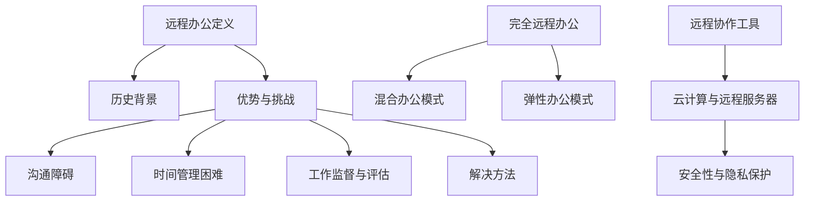
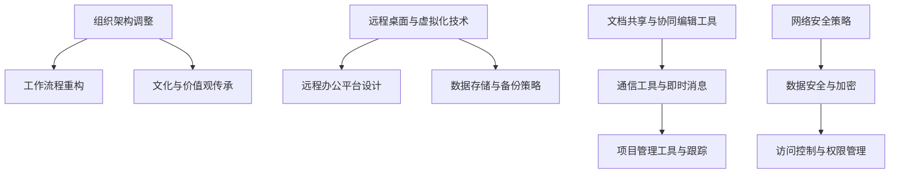

                 


### 文章标题

《创业公司的远程办公实践：如何管理分布式团队》

> 关键词：远程办公、分布式团队、管理策略、协作工具、法律法规

> 摘要：
本文旨在探讨创业公司如何有效实施远程办公，并管理好分布式团队。文章首先介绍了远程办公的定义、历史背景、优势、挑战及其模式，然后深入分析了远程办公的核心架构设计，包括技术支持、团队协作工具选择与集成、以及安全性考虑。接着，文章从管理挑战、沟通策略、时间管理、工作监督与评估等方面，探讨了如何管理分布式团队，并提出了提高团队协作效率的策略和实践。随后，文章详细阐述了远程办公的技术实现与工具应用，以及远程办公的法律法规与伦理问题。最后，文章以附录形式提供了进一步阅读的建议。

----------------------------------------------------------------

### 第一部分：远程办公的核心概念与架构设计

#### 第1章：远程办公概述

**1.1 远程办公的定义与历史背景**

远程办公（Remote Work）是指员工不必亲自到公司办公室，而是在其他地点通过信息技术工具完成工作任务的一种工作模式。远程办公的历史可以追溯到20世纪80年代，当时计算机和互联网技术逐渐普及，使得远程办公成为可能。然而，真正的远程办公浪潮是在21世纪初兴起的，特别是2008年金融危机后，企业开始更加关注成本控制和员工满意度，远程办公逐渐成为企业的一种常规工作模式。

**1.2 远程办公的优势与挑战**

远程办公的优势包括：
- **提高生产力**：员工可以在最适合自己的环境中工作，减少通勤时间，提高工作效率。
- **降低运营成本**：减少办公场地租赁、水电等成本，对企业有明显的财务效益。
- **扩大人才招聘范围**：不受地理位置限制，可以吸引全球范围内的优秀人才。

远程办公的挑战包括：
- **沟通障碍**：缺乏面对面的交流，可能导致信息传递不准确、延误。
- **时间管理困难**：员工可能难以区分工作时间和个人时间，影响工作效率。
- **工作监督与评估**：远程员工的工作状态和进度难以直接监控。

解决远程办公挑战的方法包括：
- **建立明确的沟通机制**：通过邮件、即时消息、视频会议等工具，确保信息传递的及时性和准确性。
- **采用时间管理工具**：使用时间跟踪软件，帮助员工合理安排工作时间，提高效率。
- **设定绩效指标**：通过KPI、目标管理等方法，对远程员工的工作进行监督与评估。

**1.3 远程办公模式**

远程办公模式主要有以下几种：
- **完全远程办公**：员工完全在家或其他地点工作，不访问公司办公室。
- **混合办公模式**：员工在特定时间到公司办公室，其他时间在家或其他地点工作。
- **弹性办公模式**：员工根据需要和实际情况，自主选择工作地点和时间。

**1.4 远程办公的技术支持**

远程办公的技术支持是确保远程办公顺利进行的关键。主要的技术支持包括：
- **远程协作工具**：如Slack、Microsoft Teams等，用于团队沟通和协作。
- **云计算与远程服务器**：提供存储、计算等服务，支持远程办公的硬件需求。
- **安全性与隐私保护**：采用VPN、加密通信等手段，确保数据传输的安全和隐私。

**核心概念与联系架构**

为了更好地理解远程办公的核心概念及其相互关系，我们可以使用Mermaid流程图来展示这些概念：



#### 第2章：远程办公的核心架构设计

**2.1 远程办公架构的基本要素**

远程办公架构的设计需要考虑以下几个基本要素：

1. **组织架构调整**：根据远程办公的特点，企业需要对组织架构进行调整，如设立远程办公管理团队，明确远程员工的角色和职责。
2. **工作流程重构**：远程办公要求工作流程更加灵活和高效，需要对现有流程进行重构，以适应远程办公的需求。
3. **文化与价值观传承**：远程办公需要确保企业文化与价值观的传承，通过线上活动、培训等方式，增强员工的归属感和团队凝聚力。

**2.2 远程办公的技术架构**

远程办公的技术架构主要包括以下方面：

1. **远程桌面与虚拟化技术**：通过远程桌面技术，员工可以在任何地点访问公司内部网络和应用程序，提高工作效率。
2. **远程办公平台设计**：构建一个集成的远程办公平台，提供多种服务，如文档共享、即时消息、项目管理等。
3. **数据存储与备份策略**：采用云计算和分布式存储方案，确保数据的安全性和可靠性。

**2.3 远程协作工具选择与集成**

远程协作工具的选择与集成是远程办公成功的关键。以下是几种常见的远程协作工具：

1. **文档共享与协同编辑工具**：如Google Docs、Microsoft Office 365等，支持多人实时协同编辑。
2. **通信工具与即时消息**：如Slack、Microsoft Teams、Zoom等，用于团队沟通和协作。
3. **项目管理工具与跟踪**：如Trello、Asana、JIRA等，用于任务分配、进度跟踪和项目协调。

**2.4 远程办公的安全性考虑**

远程办公的安全性是保障企业信息安全和员工隐私的重要方面。以下是一些远程办公的安全性考虑：

1. **网络安全策略**：建立严格的网络安全策略，如防火墙、入侵检测系统等，防止外部攻击。
2. **数据安全与加密**：采用数据加密技术，如SSL/TLS，确保数据传输的安全。
3. **访问控制与权限管理**：根据员工的角色和职责，设定不同的访问权限，防止未经授权的访问。

**核心概念与联系架构**

为了更好地理解远程办公的核心架构及其相互关系，我们可以使用Mermaid流程图来展示这些概念：



----------------------------------------------------------------

### 第二部分：管理分布式团队的策略与实践

#### 第3章：管理分布式团队的挑战与解决方案

**3.1 管理挑战**

管理分布式团队面临以下主要挑战：

- **沟通障碍**：远程员工之间的沟通可能受到时区、语言、技术工具等多种因素的影响。
- **时间管理困难**：远程员工可能难以区分工作时间和个人时间，导致工作效率降低。
- **工作监督与评估**：远程员工的工作状态和进度难以直接监控，对企业绩效管理带来挑战。
- **文化差异**：不同地区的员工可能有着不同的工作习惯、文化背景，这需要管理者进行有效的协调和融合。

**3.2 沟通策略**

为了克服沟通障碍，管理者可以采取以下沟通策略：

- **保持高频沟通**：通过邮件、即时消息、视频会议等工具，确保团队之间的沟通保持高频、及时。
- **定期会议与回顾**：定期举行团队会议，回顾工作进展、讨论问题解决方案，增强团队的凝聚力。
- **技术工具的选择与应用**：根据团队的实际情况，选择适合的沟通工具，如Slack、Microsoft Teams、Zoom等，确保沟通渠道的畅通。

**3.3 时间管理**

管理者可以通过以下方法帮助远程员工进行时间管理：

- **设定明确的任务与目标**：为远程员工设定清晰的任务和目标，确保他们了解工作重点和预期成果。
- **时间跟踪工具的使用**：采用时间跟踪工具，如Toggl、Harvest等，帮助员工记录工作时间，提高工作效率。
- **优先级管理**：帮助员工了解任务的优先级，确保他们能够将时间和精力集中在最重要的任务上。

**3.4 工作监督与评估**

为了有效监督与评估远程员工的工作，管理者可以采取以下方法：

- **效果跟踪与反馈**：定期检查任务完成情况，提供及时、具体的反馈，帮助员工了解工作成果和改进方向。
- **目标设置与绩效考核**：设定具体的绩效指标，定期进行绩效考核，确保员工的工作能够达到预期目标。
- **自我管理工具的应用**：鼓励员工使用自我管理工具，如Notion、Google Calendar等，规划和管理自己的工作。

**核心算法原理讲解**

为了更好地理解如何管理分布式团队，我们可以使用伪代码来详细阐述一个基本的时间管理算法：

```python
# 时间管理伪代码

function manage_time(employee):
    # 设定任务列表
    tasks = get_task_list(employee)
    
    # 对任务列表进行排序，优先级高的任务排在前面
    sorted_tasks = sort_by_priority(tasks)
    
    # 初始化工作时间
    work_time = 0
    
    # 开始工作
    for task in sorted_tasks:
        # 计算任务所需时间
        task_time = calculate_task_time(task)
        
        # 调整工作时间，确保不超过总工作时间
        if work_time + task_time <= max_work_time:
            work_time += task_time
            complete_task(task)
        else:
            # 任务未完成，提醒员工
            notify_employee(employee, "任务未完成，请调整工作时间")
            
    # 工作结束，进行工作总结
    summarize_work(employee, work_time)

# 辅助函数
function get_task_list(employee):
    # 获取员工的任务列表
    pass

function sort_by_priority(tasks):
    # 对任务列表按照优先级排序
    pass

function calculate_task_time(task):
    # 计算任务所需时间
    pass

function complete_task(task):
    # 完成任务
    pass

function notify_employee(employee, message):
    # 提醒员工
    pass

function summarize_work(employee, work_time):
    # 进行工作总结
    pass
```

**数学模型和公式**

为了更好地评估和管理分布式团队的工作效率，我们可以使用以下数学模型：

- **工作效率公式**：

\[ \text{工作效率} = \frac{\text{完成任务数量}}{\text{总工作时间}} \]

- **工作满意度公式**：

\[ \text{工作满意度} = \frac{\text{完成任务数量}}{\text{期望完成任务数量}} \]

**举例说明**

假设一个分布式团队有5名成员，他们需要在两个星期内完成10个任务。根据工作效率和工作满意度公式，我们可以计算每个成员的工作效率和满意度。

- **工作效率**：

\[ \text{工作效率} = \frac{10}{2 \times 5} = 1 \text{（每个成员每周完成1个任务）} \]

- **工作满意度**：

\[ \text{工作满意度} = \frac{10}{10} = 1 \text{（每个成员都完成了预期任务）} \]

通过这些数据和公式，管理者可以了解团队的工作效率和满意度，并根据实际情况进行调整和优化。

#### 第4章：提高团队协作效率

**4.1 团队文化建设**

团队文化建设是提高团队协作效率的重要手段。以下是一些有效的团队文化建设策略：

- **建立共同的目标与价值观**：明确团队的目标和价值观，确保所有成员都朝着相同的目标努力。
- **营造信任与支持的文化**：鼓励团队成员之间的信任和互相支持，建立积极向上的团队氛围。
- **增强团队凝聚力**：通过团队建设活动、庆祝活动等方式，增强团队成员之间的凝聚力。

**4.2 跨部门协作**

跨部门协作是提高团队效率的关键。以下是一些跨部门协作的策略：

- **明确各角色的责任与期望**：确保每个团队成员都清楚自己的角色和职责，避免工作重叠和混乱。
- **界定协作流程与规则**：制定明确的协作流程和规则，确保跨部门协作的顺利进行。
- **促进跨部门的信息共享**：建立信息共享平台，如内部社交网络、邮件列表等，促进跨部门的信息交流。

**4.3 项目管理**

项目管理是确保项目按计划顺利进行的重要手段。以下是一些项目管理策略：

- **制定详细的项目计划**：明确项目的目标、时间表、资源需求等，确保项目有明确的方向和计划。
- **实时监控项目进展**：通过项目管理工具，如Trello、Asana等，实时监控项目进展，及时发现问题并进行调整。
- **有效的风险管理**：识别项目中的潜在风险，制定应对措施，确保项目能够在预期内完成。

**核心算法原理讲解**

为了更好地理解如何提高团队协作效率，我们可以使用以下伪代码来设计一个基本的团队协作管理算法：

```python
# 团队协作管理伪代码

function improve_collaboration(team):
    # 获取团队成员信息
    members = get_members_info(team)
    
    # 建立共同的目标与价值观
    establish_common_goals_and_values(members)
    
    # 营造信任与支持的文化
    create_trust_and_support_culture(members)
    
    # 增强团队凝聚力
    enhance_team_cohesion(members)
    
    # 明确各角色的责任与期望
    define_roles_and_expectations(members)
    
    # 界定协作流程与规则
    establish_collaboration_processes_and_rules(members)
    
    # 促进跨部门的信息共享
    promote_information_sharing(members)
    
    # 制定详细的项目计划
    project_plan = create_project_plan(team)
    
    # 实时监控项目进展
    monitor_project_progress(project_plan)
    
    # 有效的风险管理
    manage_risks(project_plan)

# 辅助函数
function get_members_info(team):
    # 获取团队成员信息
    pass

function establish_common_goals_and_values(members):
    # 建立共同的目标与价值观
    pass

function create_trust_and_support_culture(members):
    # 营造信任与支持的文化
    pass

function enhance_team_cohesion(members):
    # 增强团队凝聚力
    pass

function define_roles_and_expectations(members):
    # 明确各角色的责任与期望
    pass

function establish_collaboration_processes_and_rules(members):
    # 界定协作流程与规则
    pass

function promote_information_sharing(members):
    # 促进跨部门的信息共享
    pass

function create_project_plan(team):
    # 制定详细的项目计划
    pass

function monitor_project_progress(project_plan):
    # 实时监控项目进展
    pass

function manage_risks(project_plan):
    # 有效的风险管理
    pass
```

**数学模型和公式**

为了量化团队协作效率，我们可以使用以下数学模型：

- **团队协作效率公式**：

\[ \text{团队协作效率} = \frac{\text{项目完成度}}{\text{资源投入}} \]

- **团队满意度公式**：

\[ \text{团队满意度} = \frac{\text{员工满意度}}{\text{期望员工满意度}} \]

**举例说明**

假设一个团队在一个月内完成了一个项目，投入了100个工作小时，项目完成度为90%。根据协作效率公式，我们可以计算该团队的协作效率：

\[ \text{团队协作效率} = \frac{90\%}{100 \text{小时}} = 0.9 \text{（即每月完成0.9个项目）} \]

同时，假设团队中有5名成员，他们对自己的满意度评分平均为8分（满分10分），根据团队满意度公式，我们可以计算团队的满意度：

\[ \text{团队满意度} = \frac{8 \text{分}}{10 \text{分}} = 0.8 \text{（即团队满意度为80%）} \]

通过这些数据和公式，管理者可以了解团队的协作效率和满意度，并根据实际情况进行调整和优化。

#### 第5章：远程团队的绩效管理与激励

**5.1 绩效管理**

绩效管理是确保远程团队工作有效性的关键。以下是一些有效的绩效管理策略：

- **设定具体的绩效指标**：根据团队的职责和项目目标，设定具体的绩效指标，确保每个成员都清楚自己的工作目标和期望成果。
- **定期绩效评估与反馈**：定期进行绩效评估，及时提供反馈，帮助员工了解自己的工作表现，发现和解决问题。
- **持续改进与培训**：根据绩效评估的结果，制定改进计划，提供培训和发展机会，帮助员工提高工作技能和绩效。

**5.2 激励策略**

为了提高远程团队的绩效，管理者可以采取以下激励策略：

- **薪酬与福利设计**：根据市场情况和团队绩效，设计有竞争力的薪酬和福利体系，确保员工的待遇公平合理。
- **个人发展计划**：为员工提供个人发展计划，包括职业规划、培训机会、晋升渠道等，帮助员工实现职业成长。
- **荣誉与奖励机制**：设立荣誉与奖励机制，对表现优异的员工进行表彰和奖励，激励员工积极工作。

**5.3 远程办公环境的优化**

优化远程办公环境是提高员工工作效率和满意度的重要措施。以下是一些远程办公环境优化的策略：

- **提供必要的工作设备**：为员工提供必要的工作设备，如高性能电脑、高速网络、办公软件等，确保员工能够高效地完成工作任务。
- **营造良好的工作氛围**：通过线上团队活动、虚拟咖啡角等方式，营造积极、开放的工作氛围，增强员工的归属感和团队凝聚力。
- **关注员工的心理健康**：提供心理健康支持，如在线心理咨询、心理健康培训等，帮助员工缓解工作压力，保持良好的心理状态。

**核心算法原理讲解**

为了更好地理解如何进行远程团队的绩效管理和激励，我们可以使用以下伪代码来设计一个基本的绩效管理算法：

```python
# 绩效管理伪代码

function manage_performance(team):
    # 获取团队成员信息
    members = get_members_info(team)
    
    # 设定具体的绩效指标
    set_specific_performance_indicators(members)
    
    # 定期绩效评估与反馈
    conduct_periodic_performance_evaluation_and_feedback(members)
    
    # 持续改进与培训
    continuous_improvement_and_training(members)
    
    # 薪酬与福利设计
    design_salary_and_benefit_package(members)
    
    # 个人发展计划
    personal_development_plan(members)
    
    # 荣誉与奖励机制
    honor_and_reward_mechanism(members)
    
    # 远程办公环境优化
    optimize_remote_work_environment(team)

# 辅助函数
function get_members_info(team):
    # 获取团队成员信息
    pass

function set_specific_performance_indicators(members):
    # 设定具体的绩效指标
    pass

function conduct_periodic_performance_evaluation_and_feedback(members):
    # 定期绩效评估与反馈
    pass

function continuous_improvement_and_training(members):
    # 持续改进与培训
    pass

function design_salary_and_benefit_package(members):
    # 薪酬与福利设计
    pass

function personal_development_plan(members):
    # 个人发展计划
    pass

function honor_and_reward_mechanism(members):
    # 荣誉与奖励机制
    pass

function optimize_remote_work_environment(team):
    # 远程办公环境优化
    pass
```

**数学模型和公式**

为了量化远程团队的绩效管理和激励效果，我们可以使用以下数学模型：

- **绩效得分公式**：

\[ \text{绩效得分} = \frac{\text{实际完成度}}{\text{目标完成度}} \]

- **员工满意度公式**：

\[ \text{员工满意度} = \frac{\text{实际绩效得分}}{\text{期望绩效得分}} \]

**举例说明**

假设一个远程团队在一个月内完成了8个任务，目标完成度是10个任务。根据绩效得分公式，我们可以计算该团队的绩效得分：

\[ \text{绩效得分} = \frac{8}{10} = 0.8 \text{（即绩效得分为80%）} \]

同时，假设团队中有5名成员，他们的期望绩效得分是90%，根据员工满意度公式，我们可以计算团队的满意度：

\[ \text{员工满意度} = \frac{0.8}{0.9} = 0.888 \text{（即员工满意度为88.8%）} \]

通过这些数据和公式，管理者可以了解团队的绩效管理和激励效果，并根据实际情况进行调整和优化。

----------------------------------------------------------------

### 第三部分：远程办公的技术实现与工具应用

#### 第6章：远程办公平台搭建与运维

**6.1 平台搭建**

远程办公平台的搭建是确保远程办公顺利进行的关键。以下是远程办公平台搭建的步骤和要点：

1. **需求分析**：首先，明确远程办公的需求，包括员工数量、业务需求、技术要求等。
2. **技术选型**：根据需求分析结果，选择合适的技术方案，如云计算平台、远程协作工具、安全防护措施等。
3. **架构设计**：设计远程办公平台的整体架构，包括服务器配置、网络架构、数据存储方案等。
4. **服务器与网络配置**：配置服务器和网络设备，确保远程办公平台的稳定性和可靠性。
5. **数据库与存储方案**：选择合适的数据库和存储方案，确保数据的安全性和高效性。

**6.2 运维管理**

远程办公平台的运维管理是保证平台稳定运行的重要环节。以下是远程办公平台运维管理的要点：

1. **日志监控**：实时监控平台日志，及时发现和处理异常情况。
2. **故障排查**：建立故障排查机制，确保在出现问题时能够迅速定位和解决问题。
3. **安全性与稳定性保障**：采用防火墙、入侵检测系统、加密通信等手段，确保平台的安全性和稳定性。
4. **性能优化与升级**：定期对平台进行性能优化和升级，提高平台的运行效率和用户体验。

**核心算法原理讲解**

为了更好地理解远程办公平台的搭建与运维，我们可以使用以下伪代码来设计一个基本的运维管理算法：

```python
# 运维管理伪代码

function manage_platform(platform):
    # 日志监控
    monitor_logs(platform)
    
    # 故障排查
    troubleshoot_issues(platform)
    
    # 安全性与稳定性保障
    ensure_security_and_stability(platform)
    
    # 性能优化与升级
    optimize_and_upgrade_performance(platform)

# 辅助函数
function monitor_logs(platform):
    # 实时监控平台日志
    pass

function troubleshoot_issues(platform):
    # 故障排查
    pass

function ensure_security_and_stability(platform):
    # 安全性与稳定性保障
    pass

function optimize_and_upgrade_performance(platform):
    # 性能优化与升级
    pass
```

**数学模型和公式**

为了量化远程办公平台的运维效果，我们可以使用以下数学模型：

- **故障响应时间公式**：

\[ \text{故障响应时间} = \frac{\text{故障发生时间}}{\text{故障解决时间}} \]

- **运维效率公式**：

\[ \text{运维效率} = \frac{\text{故障解决数量}}{\text{运维人员工作量}} \]

**举例说明**

假设一个远程办公平台在一个月内发生了5次故障，每次故障的平均响应时间是2小时，解决时间是4小时。根据故障响应时间和运维效率公式，我们可以计算平台的运维效果：

\[ \text{故障响应时间} = \frac{5 \times 2}{4} = 2.5 \text{（小时/次）} \]

\[ \text{运维效率} = \frac{5}{2 \times 4} = 0.625 \text{（即每次故障解决需要2.5小时）} \]

通过这些数据和公式，管理者可以了解远程办公平台的运维效果，并根据实际情况进行调整和优化。

#### 第7章：远程协作工具的应用

**7.1 文档协作工具**

文档协作工具是远程团队高效协作的重要工具。以下是几种常用的文档协作工具及其特点：

1. **Google Docs**：支持多人实时协作编辑，方便团队成员共同撰写、修改和审阅文档。
2. **Microsoft Office 365**：提供Word、Excel、PowerPoint等多种办公软件的在线协作功能，支持文档的版本控制和权限管理。
3. **Notion**：一个功能强大的文档和项目管理工具，支持多种数据类型的组织和协作。

**7.2 通信与即时消息工具**

通信与即时消息工具是团队沟通和协作的关键。以下是几种常用的通信与即时消息工具及其特点：

1. **Slack**：支持团队聊天、即时消息、文件共享和集成第三方服务，适合日常团队沟通和协作。
2. **Microsoft Teams**：集成了聊天、视频会议、文档协作等功能，适合企业内部的沟通和协作。
3. **Zoom**：提供高质量的音频和视频会议功能，适合远程团队的线上会议和培训。

**7.3 项目管理工具**

项目管理工具是确保项目按计划顺利进行的重要工具。以下是几种常用的项目管理工具及其特点：

1. **Trello**：一个简单直观的看板工具，支持任务卡片、标签、评论等功能，适合小型项目的管理。
2. **Asana**：提供任务、项目、团队等多种视图，支持任务分配、进度跟踪和协作，适合大型项目的管理。
3. **JIRA**：一个功能强大的敏捷项目管理工具，支持缺陷跟踪、需求管理、项目管理等功能，适合软件开发团队的管理。

**核心算法原理讲解**

为了更好地理解如何使用远程协作工具，我们可以使用以下伪代码来设计一个基本的文档协作流程：

```python
# 文档协作流程伪代码

function collaborate_documents(document):
    # 打开文档
    open_document(document)
    
    # 实时协作编辑
    real_time_edit(document)
    
    # 审阅与评论
    review_and_comment(document)
    
    # 存储与同步
    store_and_sync(document)

# 辅助函数
function open_document(document):
    # 打开文档
    pass

function real_time_edit(document):
    # 实时协作编辑
    pass

function review_and_comment(document):
    # 审阅与评论
    pass

function store_and_sync(document):
    # 存储与同步
    pass
```

**数学模型和公式**

为了量化远程协作工具的使用效果，我们可以使用以下数学模型：

- **协作效率公式**：

\[ \text{协作效率} = \frac{\text{完成任务数量}}{\text{协作时间}} \]

- **沟通效率公式**：

\[ \text{沟通效率} = \frac{\text{消息数量}}{\text{沟通时间}} \]

**举例说明**

假设一个远程团队在一个月内通过文档协作工具完成了10个任务，总共花费了20小时进行协作编辑和沟通。根据协作效率和沟通效率公式，我们可以计算团队的使用效果：

\[ \text{协作效率} = \frac{10}{20} = 0.5 \text{（即平均每天完成0.5个任务）} \]

\[ \text{沟通效率} = \frac{100}{20} = 5 \text{（即平均每小时发送5条消息）} \]

通过这些数据和公式，管理者可以了解远程协作工具的使用效果，并根据实际情况进行调整和优化。

----------------------------------------------------------------

### 第四部分：远程办公的法律法规与伦理

#### 第8章：远程办公的法律法规

**8.1 劳动法律法规**

远程办公涉及劳动法律法规的多个方面，以下是一些关键点：

- **远程办公的劳动权益保障**：员工在远程办公期间享有与在公司办公室工作相同的劳动权益，包括工资、福利、加班补贴等。
- **工作时间的界定与规定**：远程办公的工作时间应明确界定，确保员工的工作时间与休息时间得到合理安排。
- **劳动合同的签订与变更**：远程办公期间，企业与员工的劳动合同应明确远程办公的相关条款，如工作地点、工作时间、工作成果等。

**8.2 数据保护与隐私**

远程办公中的数据保护和隐私问题尤为重要，以下是一些关键点：

- **数据保护法规概述**：遵循当地的数据保护法规，如欧盟的《通用数据保护条例》（GDPR）等，确保员工和公司的数据安全。
- **远程办公中的数据安全**：采用加密通信、数据备份、访问控制等手段，确保数据在传输和存储过程中的安全性。
- **隐私保护措施的实施**：对员工的个人信息进行保护，确保未经授权的人员无法访问和泄露个人信息。

**8.3 跨境远程办公**

跨境远程办公涉及不同国家或地区的劳动法规和数据保护法规，以下是一些关键点：

- **国际劳动法规的差异**：了解不同国家或地区的劳动法规差异，确保企业的远程办公政策符合当地法规。
- **跨境数据传输合规性**：遵循跨境数据传输的法规要求，确保数据传输符合相关法规。
- **跨境数据保护协议**：签订跨境数据保护协议，确保数据在跨境传输过程中的安全性。

**核心算法原理讲解**

为了确保远程办公的法律法规符合性，我们可以使用以下伪代码来设计一个基本的合规性检查算法：

```python
# 法律法规合规性检查伪代码

function check_legality(remote_work_policy):
    # 检查劳动权益保障
    check_employee_rights(remote_work_policy)
    
    # 检查工作时间规定
    check_work_time_rules(remote_work_policy)
    
    # 检查数据保护与隐私保护
    check_data_protection(remote_work_policy)
    
    # 检查跨境远程办公法规合规性
    check_cross-border_legality(remote_work_policy)

# 辅助函数
function check_employee_rights(remote_work_policy):
    # 检查劳动权益保障
    pass

function check_work_time_rules(remote_work_policy):
    # 检查工作时间规定
    pass

function check_data_protection(remote_work_policy):
    # 检查数据保护与隐私保护
    pass

function check_cross-border_legality(remote_work_policy):
    # 检查跨境远程办公法规合规性
    pass
```

**数学模型和公式**

为了量化远程办公的法律法规符合性，我们可以使用以下数学模型：

- **合规性得分公式**：

\[ \text{合规性得分} = \frac{\text{符合法规要求的项目数量}}{\text{法规总项目数量}} \]

- **风险评估公式**：

\[ \text{风险评估} = \frac{\text{违规行为数量}}{\text{合规性得分}} \]

**举例说明**

假设一个远程办公政策中有10项法规要求，其中8项符合要求，2项存在违规行为。根据合规性得分公式，我们可以计算该政策的合规性得分：

\[ \text{合规性得分} = \frac{8}{10} = 0.8 \text{（即80%）} \]

根据风险评估公式，我们可以计算该政策的风险评估：

\[ \text{风险评估} = \frac{2}{0.8} = 2.5 \text{（即2.5倍风险）} \]

通过这些数据和公式，管理者可以了解远程办公政策的法律法规符合性和风险，并根据实际情况进行调整和优化。

#### 第9章：远程办公的伦理问题

**9.1 劳动伦理**

远程办公中的劳动伦理问题主要包括以下几个方面：

- **远程办公中的伦理道德**：确保员工在远程办公期间遵守职业道德，如诚实守信、保护客户隐私、维护公司声誉等。
- **避免远程办公中的滥用**：避免员工在远程办公期间出现工作时间违规、滥用公司资源等问题。
- **伦理培训与教育**：定期进行伦理培训和教育，提高员工的伦理意识，确保远程办公的顺利进行。

**9.2 隐私伦理**

远程办公中的隐私伦理问题尤为重要，主要包括以下几个方面：

- **远程办公中个人隐私的保护**：确保员工在远程办公期间的个人隐私得到保护，如个人信息、通信记录等。
- **监控与隐私的平衡**：在确保工作效率的同时，避免过度监控，尊重员工的个人隐私。
- **个人隐私权利的维护**：确保员工了解自己的隐私权利，并在必要时维护自己的隐私。

**9.3 信息伦理**

远程办公中的信息伦理问题主要包括以下几个方面：

- **信息真实性原则**：确保员工在远程办公期间提供的信息真实、准确，避免虚假信息传播。
- **远程办公中的知识产权保护**：确保员工在使用公司资源和信息时，遵守知识产权法规，避免侵权行为。
- **信息传播的道德责任**：员工在远程办公期间，应承担信息传播的道德责任，避免散布不良信息。

**核心算法原理讲解**

为了确保远程办公的伦理问题得到妥善处理，我们可以使用以下伪代码来设计一个基本的伦理问题检测和解决算法：

```python
# 伦理问题检测与解决伪代码

function manage_ethics(remote_work_behavior):
    # 检测远程办公中的伦理道德问题
    detect_ethics_issues(remote_work_behavior)
    
    # 解决远程办公中的伦理道德问题
    resolve_ethics_issues(remote_work_behavior)
    
    # 保护远程办公中的个人隐私
    protect_personal_privacy(remote_work_behavior)
    
    # 平衡监控与隐私
    balance_monitoring_and_privacy(remote_work_behavior)
    
    # 维护知识产权
    protect_intellectual_property(remote_work_behavior)

# 辅助函数
function detect_ethics_issues(remote_work_behavior):
    # 检测远程办公中的伦理道德问题
    pass

function resolve_ethics_issues(remote_work_behavior):
    # 解决远程办公中的伦理道德问题
    pass

function protect_personal_privacy(remote_work_behavior):
    # 保护远程办公中的个人隐私
    pass

function balance_monitoring_and_privacy(remote_work_behavior):
    # 平衡监控与隐私
    pass

function protect_intellectual_property(remote_work_behavior):
    # 维护知识产权
    pass
```

**数学模型和公式**

为了量化远程办公的伦理问题处理效果，我们可以使用以下数学模型：

- **伦理问题检测率公式**：

\[ \text{伦理问题检测率} = \frac{\text{检测到的伦理问题数量}}{\text{总伦理问题数量}} \]

- **伦理问题解决率公式**：

\[ \text{伦理问题解决率} = \frac{\text{解决的伦理问题数量}}{\text{检测到的伦理问题数量}} \]

**举例说明**

假设一个远程办公团队在一个月内检测到10个伦理问题，解决了8个问题。根据伦理问题检测率公式和伦理问题解决率公式，我们可以计算团队的伦理问题处理效果：

\[ \text{伦理问题检测率} = \frac{10}{10} = 1 \text{（即100%）} \]

\[ \text{伦理问题解决率} = \frac{8}{10} = 0.8 \text{（即80%）} \]

通过这些数据和公式，管理者可以了解团队的伦理问题处理效果，并根据实际情况进行调整和优化。

----------------------------------------------------------------

## 附录

本文《创业公司的远程办公实践：如何管理分布式团队》探讨了远程办公的核心概念、架构设计、管理策略、技术实现、法律法规与伦理问题，并提供了一些最佳实践和工具应用。

**核心内容回顾：**

- 远程办公的定义、历史背景、优势和挑战。
- 远程办公模式和技术支持。
- 远程办公架构设计的基本要素和关键技术。
- 管理分布式团队的挑战与解决方案。
- 提高团队协作效率的策略和实践。
- 远程办公的技术实现与工具应用。
- 远程办公的法律法规与伦理问题。

**最佳实践 Tips：**

1. **明确远程办公政策和流程**：制定详细的远程办公政策和流程，确保员工了解和遵守。
2. **选择合适的协作工具**：根据团队的需求和实际情况，选择适合的远程协作工具。
3. **建立高效的沟通机制**：通过高频沟通、定期会议和回顾，确保团队之间的信息畅通。
4. **关注员工的心理健康**：提供心理健康支持，关注员工的心理健康和工作生活平衡。
5. **遵守法律法规**：确保远程办公的政策和流程符合当地法律法规，避免法律风险。

**注意事项：**

1. **确保网络安全**：采用加密通信、数据备份、访问控制等手段，确保远程办公的数据安全和隐私保护。
2. **合理安排工作时间**：鼓励员工合理规划工作时间，确保工作效率和健康生活。
3. **持续培训和激励**：定期为员工提供培训和激励，帮助他们提高技能和绩效。

**拓展阅读：**

1. **《远程工作：如何让远程办公更高效》（Working from Home: How to Make Remote Work More Effective）**
2. **《远程管理：如何管理远程团队》（Managing Remote Teams: How to Manage Distributed Teams）**
3. **《数字劳动：远程工作与劳动力市场变革》（Digital Labor: The Internet as a Medium of Coordination in Production）**

**作者信息：**

作者：AI天才研究院/AI Genius Institute & 禅与计算机程序设计艺术 /Zen And The Art of Computer Programming

