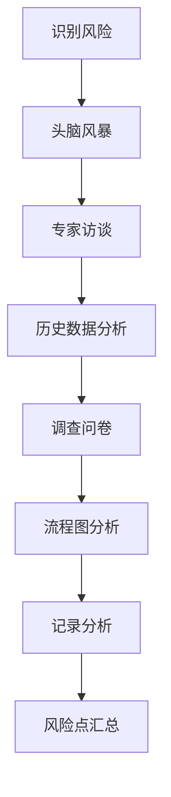
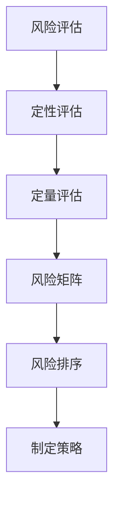

                 

### 文章标题

# 创业公司的风险管理策略

### 关键词

- 创业公司
- 风险管理
- 风险识别
- 风险评估
- 风险控制
- 风险管理组织
- 经验与启示

### 摘要

本文旨在探讨创业公司在快速发展的过程中如何实施有效的风险管理策略。创业公司面临着诸多不确定性和风险，因此需要建立一套科学、系统的风险管理框架。本文首先介绍了风险管理的概念与基础理论，随后详细分析了创业公司的风险特征及其影响因素。接着，文章重点阐述了创业公司风险管理组织建设、风险控制策略实施和风险管理体系完善的策略和方法。最后，通过经典案例分析，总结了创业公司在风险管理中的成功经验和失败教训，为创业公司提供了实用的风险管理策略和启示。文章采用逻辑清晰、结构紧凑、简单易懂的专业技术语言，旨在为读者提供一份全面、系统的风险管理指南。

## 《创业公司的风险管理策略》目录大纲

### 第一部分：风险管理基础理论

#### 第1章：风险管理的概念与原则

##### 1.1 风险管理的定义与目标

##### 1.2 风险管理的原则

##### 1.3 风险管理的基本流程

#### 第2章：企业风险识别与评估

##### 2.1 风险识别的方法与工具

##### 2.2 风险评估的技术与方法

##### 2.3 风险优先级排序

#### 第3章：企业风险控制策略

##### 3.1 风险控制的方法与措施

##### 3.2 风险转移与分担

##### 3.3 风险缓解策略

### 第二部分：创业公司风险管理实践

#### 第4章：创业公司风险特征分析

##### 4.1 创业公司风险类型与特点

##### 4.2 创业公司风险影响因素分析

##### 4.3 创业公司风险应对策略

#### 第5章：创业公司风险管理组织建设

##### 5.1 风险管理组织架构设计

##### 5.2 风险管理团队职责分工

##### 5.3 风险管理信息系统建设

#### 第6章：创业公司风险控制策略实施

##### 6.1 风险控制策略制定与实施

##### 6.2 风险控制措施执行与监督

##### 6.3 风险控制效果评估与改进

#### 第7章：创业公司风险管理体系完善

##### 7.1 风险管理文化建设

##### 7.2 风险管理培训与意识提升

##### 7.3 风险管理持续改进机制

### 第三部分：案例分析

#### 第8章：创业公司风险管理经典案例

##### 8.1 案例一：企业融资风险管理与应对

##### 8.2 案例二：市场风险管理与应对

##### 8.3 案例三：运营风险管理与应对

#### 第9章：创业公司风险管理经验与启示

##### 9.1 创业公司风险管理成功经验

##### 9.2 创业公司风险管理失败案例分析

##### 9.3 创业公司风险管理经验总结与启示

### 附录

#### 附录A：风险管理工具与资源

##### A.1 风险管理工具概述

##### A.2 常用风险管理软件介绍

##### A.3 风险管理相关书籍推荐

#### 附录B：风险识别与评估方法流程图

##### B.1 风险识别流程图

##### B.2 风险评估流程图

#### 附录C：数学模型和数学公式

##### C.1 风险评估模型

##### C.2 风险优先级排序模型

##### C.3 风险缓解策略模型

#### 附录D：代码实例

##### D.1 风险识别与评估代码实现

##### D.2 风险控制策略代码实现

##### D.3 风险控制效果评估代码实现

### 第一部分：风险管理基础理论

#### 第1章：风险管理的概念与原则

风险管理是现代企业管理的重要组成部分，它对于企业的稳定运营和长期发展具有重要意义。特别是在创业公司中，由于市场环境的不确定性和企业规模的快速扩张，风险管理显得尤为关键。本章将首先介绍风险管理的定义与目标，接着阐述风险管理的原则，最后概述风险管理的基本流程。

### 1.1 风险管理的定义与目标

风险管理（Risk Management）是指通过识别、评估、控制风险的过程，旨在使企业风险处于可接受的水平，从而确保企业的稳定运营和可持续发展。具体来说，风险管理的定义包含以下几个方面：

- **风险识别**：识别企业可能面临的各种风险，包括内部和外部风险。
- **风险评估**：对识别出的风险进行量化评估，确定风险的概率和影响程度。
- **风险控制**：采取一系列措施来降低风险发生的概率或减少风险造成的损失。
- **风险监控**：持续监控风险管理活动的执行情况，及时调整风险控制措施。

风险管理的目标主要包括以下几个方面：

1. **确保企业运营的稳定性**：通过有效的风险管理，确保企业在面临各种不确定因素时仍能保持正常运营。
2. **降低潜在损失**：通过风险识别和评估，提前发现潜在的风险，并采取相应的控制措施，从而降低损失的发生概率和损失程度。
3. **提升企业的竞争力**：通过风险管理，提高企业的应对不确定性的能力，增强企业在市场中的竞争力。
4. **保障企业长期发展**：有效的风险管理有助于企业实现长期战略目标，确保企业持续、稳定的发展。

### 1.2 风险管理的原则

为了实现风险管理的目标，企业在实施风险管理过程中需要遵循以下原则：

1. **全面性原则**：风险管理应该覆盖企业的所有层面和环节，确保全面识别和评估企业面临的风险。
2. **前瞻性原则**：风险管理需要具有前瞻性，提前识别和预测潜在的风险，以便及时采取预防措施。
3. **系统性原则**：风险管理是一个系统性的过程，需要各个环节相互衔接、协调配合。
4. **科学性原则**：风险管理应该基于科学的方法和工具，进行客观、系统的评估和分析。
5. **动态性原则**：风险管理应该是一个持续的过程，随着企业内外部环境的变化，动态调整风险管理策略和措施。

### 1.3 风险管理的基本流程

风险管理的基本流程包括以下几个步骤：

1. **风险识别**：识别企业可能面临的风险，包括内部风险和外部风险。内部风险主要指企业内部管理、运营等方面存在的风险，如管理不善、内部欺诈等；外部风险主要指企业外部环境带来的风险，如市场变化、政策法规等。
   
   风险识别的方法主要包括：
   - **专家访谈**：通过与相关专家进行访谈，获取他们对风险的看法和建议。
   - **历史数据分析**：通过分析企业的历史数据，识别出潜在的风险点。
   - **头脑风暴**：组织相关人员开展头脑风暴，集体讨论可能的风险。
   - **调查问卷**：通过问卷调查的方式，收集员工对风险的意见和建议。

2. **风险评估**：对识别出的风险进行量化评估，确定风险的概率和影响程度。风险评估的方法主要包括：
   - **定性评估**：通过专家判断和主观评估，对风险进行定性分析。
   - **定量评估**：通过数学模型和统计方法，对风险进行定量分析。

3. **风险排序**：根据风险评估结果，对风险进行排序，确定优先级。常用的风险排序方法包括：
   - **风险矩阵**：通过风险概率和影响程度的交叉分析，对风险进行排序。
   - **风险评估图**：通过图形化的方式，直观展示风险的优先级。

4. **风险控制**：采取相应的措施来降低风险发生的概率或减少风险造成的损失。风险控制的方法主要包括：
   - **风险回避**：避免或减少风险的发生。
   - **风险减轻**：通过改进措施，降低风险的影响程度。
   - **风险转移**：通过保险或其他方式，将风险转移给其他方。
   - **风险接受**：在无法避免或减轻风险的情况下，接受风险并制定应对策略。

5. **风险监控**：持续监控风险管理活动的执行情况，及时调整风险控制措施。风险监控的方法主要包括：
   - **定期检查**：定期对风险控制措施进行评估和检查。
   - **实时监控**：通过实时监控系统，及时捕捉风险的变化和趋势。

6. **风险报告**：定期向管理层和利益相关方报告风险管理情况，确保信息的透明和及时性。

通过以上风险管理的基本流程，企业可以有效地识别、评估、控制风险，确保企业的稳定运营和可持续发展。

### 第一部分：风险管理基础理论

#### 第2章：企业风险识别与评估

在风险管理中，风险识别和评估是两个关键步骤。风险识别旨在发现企业可能面临的各种风险，而风险评估则是量化这些风险的影响程度。本章将详细介绍企业风险识别与评估的方法与技术。

### 2.1 风险识别的方法与工具

风险识别是风险管理的首要步骤，旨在系统地发现企业可能面临的所有风险。以下是一些常用的风险识别方法与工具：

1. **头脑风暴法**：通过集体讨论的方式，激发团队成员的想象力，识别潜在的风险。这种方法通常在项目初期使用，有助于快速产生大量的风险点。

   ```mermaid
   graph TD
   A[头脑风暴] --> B[收集意见]
   B --> C[整理风险点]
   C --> D[记录分析]
   ```

2. **专家访谈法**：通过与行业专家、内部管理人员进行访谈，获取他们对风险的看法和建议。这种方法适用于对复杂风险进行深入分析。

   ```mermaid
   graph TD
   A[专家访谈] --> B[收集观点]
   B --> C[分析风险]
   C --> D[整理报告]
   ```

3. **历史数据分析法**：通过分析企业的历史数据，识别出潜在的风险点。这种方法有助于发现以往发生过的问题和潜在的风险。

   ```mermaid
   graph TD
   A[历史数据分析] --> B[识别风险点]
   B --> C[分析趋势]
   C --> D[制定预防措施]
   ```

4. **调查问卷法**：通过问卷调查的方式，收集员工对风险的看法和建议。这种方法适用于企业内部广泛的风险识别。

   ```mermaid
   graph TD
   A[调查问卷] --> B[收集反馈]
   B --> C[分析结果]
   C --> D[识别风险]
   ```

5. **流程图分析法**：通过绘制企业的业务流程图，识别出各个流程环节中可能存在的风险。这种方法有助于全面了解企业的运营过程。

   ```mermaid
   graph TD
   A[绘制流程图] --> B[分析环节]
   B --> C[识别风险]
   C --> D[制定控制措施]
   ```

### 2.2 风险评估的技术与方法

风险评估是对识别出的风险进行量化和分析的过程。以下是一些常用的风险评估技术和方法：

1. **定性评估法**：通过专家判断和主观评估，对风险进行定性分析。这种方法适用于风险程度较低的情境。

   ```mermaid
   graph TD
   A[定性评估] --> B[专家判断]
   B --> C[风险分类]
   C --> D[制定应对措施]
   ```

2. **定量评估法**：通过数学模型和统计方法，对风险进行量化分析。这种方法适用于风险程度较高且需要精确量化的情境。

   ```mermaid
   graph TD
   A[定量评估] --> B[建立模型]
   B --> C[输入数据]
   C --> D[计算分析]
   D --> E[风险排序]
   ```

3. **风险矩阵法**：通过风险概率和影响程度的交叉分析，对风险进行排序。这种方法简单直观，适用于大多数情境。

   ```mermaid
   graph TD
   A[风险矩阵] --> B[概率评估]
   B --> C[影响评估]
   C --> D[风险排序]
   ```

4. **蒙特卡罗模拟法**：通过随机模拟的方式，评估风险的概率和影响程度。这种方法适用于复杂、不确定的风险评估情境。

   ```mermaid
   graph TD
   A[蒙特卡罗模拟] --> B[随机抽样]
   B --> C[计算概率]
   C --> D[评估影响]
   ```

### 2.3 风险优先级排序

在风险评估的基础上，需要对风险进行优先级排序，以便确定应对策略的重点。以下是一些常用的风险优先级排序方法：

1. **风险矩阵法**：通过风险矩阵对风险进行分类，并按照风险概率和影响程度进行排序。

   ```mermaid
   graph TD
   A[风险矩阵] --> B[高概率高风险]
   B --> C[高概率低风险]
   C --> D[低概率高风险]
   D --> E[低概率低风险]
   ```

2. **风险评估图法**：通过图形化的方式，直观展示不同风险的优先级。

   ```mermaid
   graph TD
   A[风险评估图]
   A --> B[高风险区域]
   A --> C[中风险区域]
   A --> D[低风险区域]
   ```

3. **风险优先级排序表法**：将所有风险按照优先级排序，并制定相应的应对策略。

   ```mermaid
   graph TD
   A[风险列表]
   A --> B[高优先级]
   B --> C[中优先级]
   C --> D[低优先级]
   ```

通过以上风险识别与评估的方法和技术，企业可以系统地识别和量化风险，为后续的风险控制策略制定提供科学依据。下一章将介绍企业风险控制策略的具体方法与措施。

### 第一部分：风险管理基础理论

#### 第3章：企业风险控制策略

企业风险控制策略是风险管理的重要环节，其目的是通过一系列方法与措施，降低风险发生的概率或减轻风险造成的损失。本章将详细介绍企业风险控制的方法与措施，以及风险转移与分担的策略和风险缓解策略。

### 3.1 风险控制的方法与措施

风险控制是企业风险管理的关键步骤，其目的是通过预防和控制措施，降低风险的发生概率和影响程度。以下是一些常用的风险控制方法和措施：

1. **风险回避**：通过改变企业的战略、运营方式或业务模式，避免高风险的活动或领域。

   ```mermaid
   graph TD
   A[风险回避] --> B[改变战略]
   B --> C[避免高风险]
   C --> D[降低风险]
   ```

2. **风险减轻**：通过改进技术、管理措施或采取预防措施，降低风险的影响程度。

   ```mermaid
   graph TD
   A[风险减轻] --> B[改进技术]
   B --> C[加强管理]
   C --> D[降低影响]
   ```

3. **风险转移**：通过保险、合同等方式，将风险转移给其他方。

   ```mermaid
   graph TD
   A[风险转移] --> B[购买保险]
   B --> C[签订合同]
   C --> D[分担风险]
   ```

4. **风险接受**：在无法避免或减轻风险的情况下，企业可以接受风险并制定应对策略。

   ```mermaid
   graph TD
   A[风险接受] --> B[制定应对措施]
   B --> C[控制损失]
   C --> D[降低影响]
   ```

### 3.2 风险转移与分担

风险转移与分担是企业应对风险的重要策略，通过将风险转移给其他方或与他人共同承担风险，减轻企业的风险负担。

1. **保险**：企业可以通过购买保险将风险转移给保险公司。

   ```mermaid
   graph TD
   A[购买保险] --> B[转移风险]
   B --> C[降低损失]
   ```

2. **合同**：通过签订合同，将部分风险转移给合同方。

   ```mermaid
   graph TD
   A[签订合同] --> B[转移风险]
   B --> C[明确责任]
   ```

3. **风险共担**：与其他企业或组织共同承担风险。

   ```mermaid
   graph TD
   A[风险共担] --> B[分担风险]
   B --> C[降低风险]
   ```

### 3.3 风险缓解策略

风险缓解策略旨在降低风险发生的概率或减轻风险造成的影响。以下是一些常用的风险缓解策略：

1. **预防措施**：通过预防措施，降低风险发生的概率。

   ```mermaid
   graph TD
   A[预防措施] --> B[降低概率]
   B --> C[减少风险]
   ```

2. **应急计划**：制定应急计划，以应对可能发生的风险。

   ```mermaid
   graph TD
   A[应急计划] --> B[应对风险]
   B --> C[减少影响]
   ```

3. **管理控制**：通过加强管理控制，降低风险的发生概率和影响程度。

   ```mermaid
   graph TD
   A[管理控制] --> B[降低概率]
   B --> C[减轻影响]
   ```

4. **技术改进**：通过技术改进，提高企业的风险应对能力。

   ```mermaid
   graph TD
   A[技术改进] --> B[提高应对能力]
   B --> C[降低风险]
   ```

通过以上风险控制的方法与措施，企业可以有效地应对各种风险，确保企业的稳定运营和可持续发展。下一章将探讨创业公司的风险特征及其影响因素。

### 第二部分：创业公司风险管理实践

#### 第4章：创业公司风险特征分析

创业公司在发展过程中面临着独特的风险，这些风险由于其特定性和复杂性，对企业的生存和发展产生重大影响。本章将分析创业公司的风险类型与特点，探讨影响创业公司风险的主要因素，并讨论创业公司的风险应对策略。

### 4.1 创业公司风险类型与特点

创业公司面临的风险可以大致分为以下几类：

1. **市场风险**：市场风险主要包括市场需求变化、竞争加剧、市场饱和等。创业公司在初创阶段，往往对市场环境变化反应较慢，难以迅速调整业务策略。

   ```mermaid
   graph TD
   A[市场风险] --> B[需求变化]
   B --> C[竞争加剧]
   C --> D[市场饱和]
   ```

2. **财务风险**：财务风险包括资金不足、融资困难、投资回报率低等。创业公司由于资金链脆弱，容易受到资金问题的影响。

   ```mermaid
   graph TD
   A[财务风险] --> B[资金不足]
   B --> C[融资困难]
   C --> D[回报率低]
   ```

3. **技术风险**：技术风险主要涉及技术创新的不确定性、技术实现的复杂性、知识产权保护等。创业公司的技术创新往往具有较高的不确定性，可能面临技术失败的风险。

   ```mermaid
   graph TD
   A[技术风险] --> B[技术创新]
   B --> C[技术实现]
   C --> D[知识产权]
   ```

4. **运营风险**：运营风险包括管理不善、人才流失、供应链断裂等。创业公司由于管理体系不健全，运营过程中容易出现各种问题。

   ```mermaid
   graph TD
   A[运营风险] --> B[管理不善]
   B --> C[人才流失]
   C --> D[供应链断裂]
   ```

5. **法律风险**：法律风险包括政策法规变化、合同纠纷、知识产权侵权等。创业公司往往缺乏足够的法律知识，容易在法律方面出现问题。

   ```mermaid
   graph TD
   A[法律风险] --> B[政策法规变化]
   B --> C[合同纠纷]
   C --> D[知识产权侵权]
   ```

### 4.2 创业公司风险影响因素分析

创业公司风险的形成受到多种因素的影响，主要包括以下几个方面：

1. **市场环境**：市场环境的变化，如经济波动、政策调整等，对创业公司的生存和发展产生直接影响。

2. **技术创新**：技术创新的不确定性，如技术实现难度、市场竞争等，影响创业公司的风险程度。

3. **资金状况**：创业公司的资金状况，如资金充足度、融资渠道等，直接影响其财务风险。

4. **管理体系**：管理体系的完善程度，如管理团队的能力、组织架构等，影响运营风险。

5. **团队素质**：团队的专业素养、创新能力、执行力等，对创业公司的风险应对能力有重要影响。

6. **市场竞争**：市场竞争的激烈程度，如竞争对手的策略、市场份额等，影响市场风险。

### 4.3 创业公司风险应对策略

针对创业公司面临的风险类型和影响因素，可以采取以下风险应对策略：

1. **市场风险应对策略**：
   - **市场调研**：定期进行市场调研，了解市场需求和竞争态势，及时调整业务策略。
   - **多元化产品**：开发多样化产品，降低对单一市场的依赖。
   - **合作伙伴**：寻找合作伙伴，共同开拓市场，分担市场风险。

2. **财务风险应对策略**：
   - **融资计划**：制定详细的融资计划，确保资金链的稳定性。
   - **成本控制**：严格控制成本，提高资金使用效率。
   - **风险投资**：吸引风险投资，分散资金风险。

3. **技术风险应对策略**：
   - **技术研发**：加大技术研发投入，提高技术创新能力。
   - **知识产权保护**：加强知识产权保护，防范侵权风险。
   - **技术合作**：与技术合作伙伴共同研发，降低技术风险。

4. **运营风险应对策略**：
   - **管理体系建设**：建立完善的管理体系，提高管理效率。
   - **人才培养**：加强人才引进和培养，提高团队执行力。
   - **供应链管理**：加强供应链管理，确保供应链的稳定。

5. **法律风险应对策略**：
   - **法律咨询**：聘请法律顾问，确保公司运营符合法律法规。
   - **合同管理**：严格合同管理，防范合同纠纷。
   - **知识产权保护**：加强知识产权保护，防范侵权风险。

通过以上风险应对策略，创业公司可以有效地降低风险，确保企业的稳定发展和可持续发展。下一章将讨论创业公司风险管理组织建设的相关内容。

### 第二部分：创业公司风险管理实践

#### 第5章：创业公司风险管理组织建设

创业公司风险管理组织建设是确保风险管理有效实施的基础。一个健全的风险管理组织可以明确职责分工，加强信息沟通，提高风险应对能力。本章将介绍创业公司风险管理组织架构设计、风险管理团队职责分工以及风险管理信息系统建设。

### 5.1 风险管理组织架构设计

风险管理组织架构设计是创业公司风险管理体系的基石。合理的组织架构可以确保风险管理职责明确、流程顺畅、信息畅通。以下是一个典型的创业公司风险管理组织架构设计：

1. **风险管理委员会**：风险管理委员会是公司最高层面的风险管理决策机构，负责制定公司的风险管理策略和决策。通常由公司高层管理人员组成，如CEO、CFO、CTO等。

   ```mermaid
   graph TD
   A[风险管理委员会] --> B[制定策略]
   B --> C[决策]
   ```

2. **风险管理部**：风险管理部是风险管理组织的中枢，负责具体实施公司的风险管理策略和措施。风险管理部应设立风险识别、风险评估、风险控制和风险监控等子部门，分别负责不同阶段的风险管理工作。

   ```mermaid
   graph TD
   A[风险管理部] --> B[风险识别]
   B --> C[风险评估]
   C --> D[风险控制]
   D --> E[风险监控]
   ```

3. **业务部门**：业务部门是风险管理的具体执行者，负责在日常运营中实施风险管理措施。业务部门应设立风险管理小组，负责识别、评估和管理本部门的风险。

   ```mermaid
   graph TD
   A[业务部门] --> B[风险管理小组]
   ```

4. **外部专家**：在必要时，可以聘请外部专家参与风险管理，提供专业意见和技术支持。

   ```mermaid
   graph TD
   A[外部专家] --> B[专业意见]
   ```

### 5.2 风险管理团队职责分工

风险管理团队的职责分工是确保风险管理高效实施的关键。以下是一个典型的风险管理团队职责分工：

1. **风险识别小组**：负责识别公司可能面临的各种风险，包括内部风险和外部风险。

   ```mermaid
   graph TD
   A[风险识别小组] --> B[识别风险]
   ```

2. **风险评估小组**：负责对识别出的风险进行评估，确定风险的概率和影响程度。

   ```mermaid
   graph TD
   A[风险评估小组] --> B[评估风险]
   ```

3. **风险控制小组**：负责制定和实施风险控制措施，降低风险发生的概率或减轻风险的影响程度。

   ```mermaid
   graph TD
   A[风险控制小组] --> B[控制风险]
   ```

4. **风险监控小组**：负责持续监控风险管理活动的执行情况，及时调整风险控制措施。

   ```mermaid
   graph TD
   A[风险监控小组] --> B[监控风险]
   ```

### 5.3 风险管理信息系统建设

风险管理信息系统是创业公司风险管理的重要工具，可以提供数据支持、决策支持和过程控制。以下是一个典型的风险管理信息系统建设方案：

1. **数据采集系统**：负责收集公司内外部的风险信息，包括市场数据、财务数据、技术数据等。

   ```mermaid
   graph TD
   A[数据采集系统] --> B[收集数据]
   ```

2. **风险评估系统**：负责对收集到的数据进行分析和评估，提供风险评估结果。

   ```mermaid
   graph TD
   A[风险评估系统] --> B[评估风险]
   ```

3. **风险控制系统**：负责制定和实施风险控制措施，监控风险控制效果。

   ```mermaid
   graph TD
   A[风险控制系统] --> B[控制风险]
   ```

4. **风险监控和报告系统**：负责持续监控风险状态，生成风险报告，为决策提供支持。

   ```mermaid
   graph TD
   A[风险监控和报告系统] --> B[监控风险]
   B --> C[生成报告]
   ```

通过以上风险管理组织建设，创业公司可以建立科学、系统的风险管理架构，提高风险应对能力，确保企业的稳定发展。下一章将探讨创业公司风险控制策略的具体实施。

### 第二部分：创业公司风险管理实践

#### 第6章：创业公司风险控制策略实施

创业公司在风险管理过程中，不仅需要建立有效的组织架构，还需要将风险管理策略具体落实到实际行动中。本章将详细介绍创业公司风险控制策略的制定与实施、风险控制措施的执行与监督以及风险控制效果评估与改进。

### 6.1 风险控制策略制定与实施

风险控制策略的制定是风险管理的重要环节，其目的是为创业公司提供清晰、可行的风险管理路径。以下步骤是制定风险控制策略的基本流程：

1. **明确目标**：首先，明确公司风险管理的主要目标，如保障公司财务稳定、保护知识产权、降低市场风险等。

   ```mermaid
   graph TD
   A[明确目标]
   ```

2. **风险识别**：对创业公司可能面临的风险进行全面识别，包括市场风险、财务风险、技术风险、运营风险等。

   ```mermaid
   graph TD
   A --> B[风险识别]
   ```

3. **风险评估**：对识别出的风险进行评估，确定其概率和影响程度，制定优先级排序。

   ```mermaid
   graph TD
   B --> C[风险评估]
   ```

4. **制定策略**：根据风险评估结果，制定相应的风险控制策略，如风险回避、风险减轻、风险转移等。

   ```mermaid
   graph TD
   C --> D[制定策略]
   ```

5. **实施方案**：将制定的风险控制策略转化为具体的实施计划，包括时间表、责任分配、资源需求等。

   ```mermaid
   graph TD
   D --> E[实施方案]
   ```

6. **实施监督**：对实施过程进行监督，确保各项措施得到有效执行。

   ```mermaid
   graph TD
   E --> F[实施监督]
   ```

### 6.2 风险控制措施的执行与监督

风险控制措施的有效执行是确保风险管理策略实施的关键。以下步骤是风险控制措施执行与监督的基本流程：

1. **责任分配**：明确各部门和人员的具体职责，确保风险控制措施有明确的责任主体。

   ```mermaid
   graph TD
   A[责任分配]
   ```

2. **培训与沟通**：对相关人员开展风险管理培训，提高他们的风险意识和应对能力。同时，确保团队之间的沟通畅通，及时分享风险信息。

   ```mermaid
   graph TD
   A --> B[培训与沟通]
   ```

3. **执行监控**：建立监控机制，对风险控制措施的执行情况进行跟踪和记录，确保各项措施得到有效落实。

   ```mermaid
   graph TD
   B --> C[执行监控]
   ```

4. **问题反馈**：及时收集和反馈风险控制措施执行过程中出现的问题，及时调整和优化控制措施。

   ```mermaid
   graph TD
   C --> D[问题反馈]
   ```

5. **绩效评估**：定期对风险控制措施的执行效果进行评估，确保风险控制策略的持续改进。

   ```mermaid
   graph TD
   D --> E[绩效评估]
   ```

### 6.3 风险控制效果评估与改进

风险控制效果评估是确保风险管理策略持续有效的重要手段。以下步骤是风险控制效果评估与改进的基本流程：

1. **效果评估**：根据既定的评估标准和指标，对风险控制措施的实施效果进行评估。

   ```mermaid
   graph TD
   A[效果评估]
   ```

2. **数据分析**：对评估数据进行分析，识别风险控制措施的有效性和不足之处。

   ```mermaid
   graph TD
   A --> B[数据分析]
   ```

3. **改进措施**：根据数据分析结果，制定相应的改进措施，优化风险控制策略。

   ```mermaid
   graph TD
   B --> C[改进措施]
   ```

4. **反馈与沟通**：将改进措施反馈给相关部门和人员，确保其得到有效执行。

   ```mermaid
   graph TD
   C --> D[反馈与沟通]
   ```

5. **持续改进**：建立持续改进机制，定期评估和优化风险控制策略，确保其适应企业发展的需求。

   ```mermaid
   graph TD
   D --> E[持续改进]
   ```

通过以上风险控制策略的实施与监督，创业公司可以有效地降低风险，保障企业的稳定发展。下一章将探讨创业公司风险管理体系完善的策略。

### 第二部分：创业公司风险管理实践

#### 第7章：创业公司风险管理体系完善

创业公司的风险管理不仅需要有效的策略和措施，还需要建立一个完善的体系，以确保风险管理活动能够持续、系统地开展。本章将讨论风险管理文化建设的策略、风险管理培训与意识提升的方法，以及风险管理持续改进机制的构建。

### 7.1 风险管理文化建设

风险管理文化是企业风险管理的基础，是员工对待风险的态度和行为习惯。以下是一些推动风险管理文化建设的策略：

1. **建立风险管理意识**：通过内部培训和宣传，提高员工对风险管理的认识和重视程度。

   ```mermaid
   graph TD
   A[培训与宣传] --> B[建立意识]
   ```

2. **强调风险责任**：明确每个部门和员工在风险管理中的责任，建立风险责任制。

   ```mermaid
   graph TD
   A --> B[明确责任]
   ```

3. **鼓励风险报告**：建立风险报告制度，鼓励员工主动报告潜在风险，形成全员参与的风险管理氛围。

   ```mermaid
   graph TD
   B --> C[鼓励报告]
   ```

4. **奖励风险贡献者**：对在风险管理中表现突出的员工给予奖励，激发员工的积极性和创造力。

   ```mermaid
   graph TD
   C --> D[奖励贡献者]
   ```

### 7.2 风险管理培训与意识提升

风险管理培训与意识提升是确保员工具备必要的风险管理知识和技能的重要手段。以下是一些具体的方法：

1. **制定培训计划**：根据员工的岗位和工作内容，制定针对性的风险管理培训计划。

   ```mermaid
   graph TD
   A[制定培训计划]
   ```

2. **开展内部培训**：组织内部培训课程，邀请专业讲师进行风险管理知识的讲解和实战演练。

   ```mermaid
   graph TD
   A --> B[内部培训]
   ```

3. **外部培训与学习**：鼓励员工参加外部风险管理培训课程，学习先进的风险管理方法和经验。

   ```mermaid
   graph TD
   B --> C[外部培训]
   ```

4. **案例分享与讨论**：通过分享成功和失败的风险管理案例，组织内部讨论，提高员工的风险识别和应对能力。

   ```mermaid
   graph TD
   C --> D[案例分享]
   ```

### 7.3 风险管理持续改进机制

风险管理持续改进机制是确保风险管理策略和措施能够动态适应企业发展和市场变化的关键。以下是一些构建风险管理持续改进机制的策略：

1. **定期评估**：定期对风险管理策略和措施进行评估，分析其有效性和适应性。

   ```mermaid
   graph TD
   A[定期评估]
   ```

2. **反馈机制**：建立有效的反馈机制，收集员工和利益相关方的意见和建议，及时调整风险管理策略。

   ```mermaid
   graph TD
   A --> B[反馈机制]
   ```

3. **改进措施**：根据评估和反馈结果，制定相应的改进措施，优化风险管理流程和策略。

   ```mermaid
   graph TD
   B --> C[改进措施]
   ```

4. **培训与辅导**：对实施改进措施的相关人员提供培训和支持，确保改进措施的有效执行。

   ```mermaid
   graph TD
   C --> D[培训与辅导]
   ```

5. **持续监控**：建立持续监控机制，对改进措施的实施效果进行跟踪和评估，确保风险管理体系的不断完善。

   ```mermaid
   graph TD
   D --> E[持续监控]
   ```

通过以上风险管理文化建设、培训与意识提升以及持续改进机制的构建，创业公司可以建立一套系统、有效的风险管理体系，为企业的稳定发展提供有力保障。下一部分将通过经典案例分析，进一步探讨创业公司在风险管理中的实践与经验。

### 第三部分：案例分析

#### 第8章：创业公司风险管理经典案例

在创业公司的成长过程中，风险管理扮演着至关重要的角色。通过分析成功和失败的风险管理案例，我们可以总结出有效的风险管理策略和经验。本章将介绍三个经典案例，涵盖企业融资风险、市场风险和运营风险的管理与应对。

### 8.1 案例一：企业融资风险管理与应对

**案例背景**：某初创科技公司（以下简称“该公司”）成立于2018年，专注于人工智能领域的技术研发。在初创阶段，该公司面临的主要风险是融资风险，即无法获得足够的资金支持公司的发展。

**风险管理措施**：

1. **多元化融资渠道**：该公司制定了多元化融资策略，不仅通过天使投资和风险投资获得资金，还利用政府补贴和银行贷款等多种融资渠道。

   ```mermaid
   graph TD
   A[融资渠道] --> B[天使投资]
   B --> C[风险投资]
   C --> D[政府补贴]
   D --> E[银行贷款]
   ```

2. **严格的融资审核**：在融资过程中，该公司对潜在投资者进行严格的审核，确保资金来源可靠，避免融资风险。

   ```mermaid
   graph TD
   F[融资审核] --> G[投资者背景调查]
   G --> H[投资合同审查]
   ```

3. **风险预警机制**：建立风险预警机制，及时跟踪市场融资环境的变化，提前调整融资策略。

   ```mermaid
   graph TD
   I[风险预警] --> J[市场动态监测]
   J --> K[融资策略调整]
   ```

**案例结果**：通过上述风险管理措施，该公司成功获得了多轮融资，资金需求得到了充分满足，为公司的研发和市场拓展提供了有力支持。

### 8.2 案例二：市场风险管理与应对

**案例背景**：某电商初创公司（以下简称“该公司”）成立于2019年，专注于跨境电商业务。在市场竞争激烈的背景下，该公司面临的主要风险是市场风险，即产品竞争力不足和市场份额下降。

**风险管理措施**：

1. **市场调研与定位**：该公司定期开展市场调研，了解消费者需求和市场趋势，确保产品定位准确。

   ```mermaid
   graph TD
   A[市场调研] --> B[消费者需求分析]
   B --> C[产品定位]
   ```

2. **多元化产品策略**：公司通过推出多样化产品，满足不同消费者的需求，提高市场竞争力。

   ```mermaid
   graph TD
   D[多元化产品] --> E[满足多种需求]
   ```

3. **合作伙伴关系**：公司与国内外多个电商平台建立合作关系，扩大市场渠道，降低市场风险。

   ```mermaid
   graph TD
   F[合作伙伴] --> G[市场渠道扩展]
   ```

4. **风险监控与预警**：建立市场风险监控体系，及时捕捉市场变化，提前调整市场策略。

   ```mermaid
   graph TD
   H[风险监控] --> I[市场动态监测]
   I --> J[市场策略调整]
   ```

**案例结果**：通过上述风险管理措施，该公司成功应对了市场风险，市场份额稳步提升，成为行业内的佼佼者。

### 8.3 案例三：运营风险管理与应对

**案例背景**：某云计算初创公司（以下简称“该公司”）成立于2020年，专注于云计算服务和解决方案的研发与推广。在快速发展的过程中，该公司面临的主要风险是运营风险，包括技术问题、人才流失和供应链断裂等。

**风险管理措施**：

1. **技术研发投入**：公司加大技术研发投入，提高技术水平和产品质量，降低技术风险。

   ```mermaid
   graph TD
   A[技术研发] --> B[技术升级]
   ```

2. **人才储备与培养**：公司重视人才储备和培养，通过招聘、培训和激励机制，留住核心人才。

   ```mermaid
   graph TD
   C[人才储备] --> D[招聘与培训]
   D --> E[激励机制]
   ```

3. **供应链管理**：公司与多家供应商建立长期合作关系，确保供应链的稳定性和可靠性。

   ```mermaid
   graph TD
   F[供应链管理] --> G[供应商筛选]
   G --> H[合作关系建立]
   ```

4. **风险监控与应急响应**：建立风险监控和应急响应机制，及时识别和处理潜在风险。

   ```mermaid
   graph TD
   I[风险监控] --> J[风险识别]
   J --> K[应急响应]
   ```

**案例结果**：通过上述风险管理措施，该公司有效降低了运营风险，业务规模持续扩大，成为行业内的领先者。

通过以上经典案例，我们可以看到，成功的风险管理不仅需要科学的策略和措施，还需要对市场变化和内部环境保持高度敏感，及时调整和优化风险管理策略。下一章将总结创业公司风险管理的成功经验和失败教训。

### 第三部分：案例分析

#### 第9章：创业公司风险管理经验与启示

在创业公司的成长过程中，风险管理发挥着至关重要的作用。通过前述经典案例的分析，我们总结了创业公司在风险管理中的成功经验和失败教训，以期为其他创业公司提供有益的启示。

### 9.1 创业公司风险管理成功经验

**1. 多元化融资策略**：成功的企业通常采用多元化的融资策略，确保资金来源的稳定性和灵活性。例如，在案例一中，初创科技公司通过天使投资、风险投资、政府补贴和银行贷款等多种融资渠道，成功应对了融资风险。

**2. 市场调研与定位**：市场调研和精准定位是创业公司成功应对市场风险的关键。在案例二中，电商初创公司通过定期市场调研，准确把握消费者需求和市场趋势，推出多样化产品，提高了市场竞争力。

**3. 技术研发投入**：技术研发投入是降低技术风险的关键。在案例三中，云计算初创公司通过持续的技术研发投入，提高了技术水平和产品质量，成功降低了技术风险。

**4. 人才储备与培养**：人才是创业公司的核心竞争力。在案例三中，云计算初创公司通过招聘、培训和激励机制，成功留住了核心人才，为企业的稳定发展提供了人力保障。

**5. 供应链管理**：稳定的供应链是创业公司运营的重要保障。在案例三中，云计算初创公司通过建立长期合作关系，确保了供应链的稳定性和可靠性。

### 9.2 创业公司风险管理失败案例分析

**1. 融资渠道单一**：创业公司在融资过程中，如果仅依赖某一渠道，容易面临融资风险。例如，在案例一中，如果初创科技公司没有采用多元化的融资策略，可能会因为某一渠道的融资失败而导致资金链断裂。

**2. 市场调研不足**：市场调研不足可能导致产品定位不准确，无法满足市场需求。例如，在案例二中，如果电商初创公司没有进行充分的市场调研，可能推出不符合消费者需求的产品，导致市场份额下降。

**3. 技术研发不足**：技术研发不足可能导致技术落后，影响企业竞争力。例如，在案例三中，如果云计算初创公司没有持续进行技术研发，可能会在技术竞争中处于劣势。

**4. 人才流失**：人才流失可能导致企业核心竞争力的下降。例如，在案例三中，如果云计算初创公司没有重视人才储备和培养，可能会因为人才流失而影响业务运营。

**5. 供应链断裂**：供应链断裂可能导致企业运营受阻。例如，在案例三中，如果云计算初创公司没有建立稳定的供应链，可能会因为供应商问题导致生产停滞。

### 9.3 创业公司风险管理经验总结与启示

**1. 建立多元化的风险管理策略**：创业公司应建立多元化的风险管理策略，包括融资、市场、技术、人才和供应链等多个方面，确保风险的全面覆盖和有效应对。

**2. 定期进行市场调研和产品定位**：创业公司应定期进行市场调研，准确把握市场趋势和消费者需求，确保产品定位准确，提高市场竞争力。

**3. 持续投入技术研发**：创业公司应持续投入技术研发，提高技术水平和产品质量，降低技术风险，确保在竞争中保持优势。

**4. 重视人才储备和培养**：创业公司应重视人才储备和培养，建立有效的激励机制，留住核心人才，为企业的长期发展提供人力保障。

**5. 稳定供应链管理**：创业公司应建立稳定的供应链管理体系，确保供应链的稳定性和可靠性，降低运营风险。

通过以上经验和启示，创业公司可以更好地应对各种风险，确保企业的稳定发展和可持续发展。

### 附录A：风险管理工具与资源

在创业公司的风险管理过程中，合理运用工具和资源是提高风险管理效率的重要手段。以下是一些常用的风险管理工具与资源，包括风险管理工具概述、常用风险管理软件介绍以及风险管理相关书籍推荐。

#### A.1 风险管理工具概述

风险管理工具是支持企业识别、评估和控制风险的重要软件和系统。以下是一些常见的管理工具：

1. **风险评估软件**：这类软件可以帮助企业进行风险识别、评估和报告。例如，RiskMaster、OpenGlobalRisk等。

2. **风险监控软件**：这类软件用于实时监控企业面临的风险，提供预警和报告功能。例如， RiskMap、Knime等。

3. **项目风险管理软件**：这类软件专门用于项目管理中的风险管理，例如，Primavera、Microsoft Project等。

4. **数据可视化工具**：用于将风险数据以图形化方式展示，便于分析和决策。例如，Tableau、Power BI等。

#### A.2 常用风险管理软件介绍

以下是几种常用的风险管理软件的介绍：

1. **RiskMaster**：RiskMaster是一款全面的风险管理软件，提供风险识别、评估、监控和报告功能。它支持多种风险评估模型，如蒙特卡罗模拟、风险矩阵等。

2. **OpenGlobalRisk**：OpenGlobalRisk是一个开源的风险管理平台，提供风险识别、评估、监控和报告功能。它支持多种数据分析和可视化工具，便于用户进行深入的风险分析。

3. **RiskMap**：RiskMap是一款项目风险管理软件，用于识别、评估和监控项目风险。它支持多种风险评估方法，如风险矩阵、敏感性分析等，并提供实时监控和报告功能。

4. **Knime**：Knime是一款开源的数据分析和机器学习平台，可以用于风险识别、评估和监控。它支持多种数据处理和分析工具，便于用户进行复杂的风险分析。

#### A.3 风险管理相关书籍推荐

以下是几本关于风险管理的优秀书籍，适合创业公司管理层和风险管理团队阅读：

1. **《风险管理：现代方法与应用》**：本书系统介绍了风险管理的理论和方法，包括风险识别、评估、控制和监控等方面。

2. **《风险管理实践指南》**：本书提供了大量实际案例，详细阐述了风险管理在企业运营中的应用，适合企业管理者阅读。

3. **《风险管理与决策》**：本书从决策的角度出发，探讨了风险管理的理论和方法，包括风险识别、评估和决策等方面。

4. **《企业风险管理：理论与实践》**：本书结合理论与实践，介绍了企业风险管理的基本概念、方法和实践，适合高校师生和企业员工阅读。

通过合理运用这些风险管理工具与资源，创业公司可以更有效地识别、评估和控制风险，确保企业的稳定发展和可持续发展。

### 附录B：风险识别与评估方法流程图

在风险管理的实践中，风险识别与评估是至关重要的一步。为了帮助读者更直观地理解这一过程，以下将提供风险识别与评估的方法流程图。

#### B.1 风险识别流程图



- **A[识别风险]**：这一步骤是整个流程的起点，目的是系统地发现企业可能面临的所有风险。
- **B[头脑风暴]**：通过集体讨论的方式，激发团队成员的想象力，识别潜在的风险。
- **C[专家访谈]**：通过与行业专家、内部管理人员进行访谈，获取他们对风险的看法和建议。
- **D[历史数据分析]**：通过分析企业的历史数据，识别出潜在的风险点。
- **E[调查问卷]**：通过问卷调查的方式，收集员工对风险的看法和建议。
- **F[流程图分析]**：通过绘制企业的业务流程图，识别出各个流程环节中可能存在的风险。
- **G[记录分析]**：将收集到的风险信息进行整理和分析，形成风险清单。
- **H[风险点汇总]**：将识别出的风险进行汇总，为后续的风险评估做准备。

#### B.2 风险评估流程图



- **A[风险评估]**：这一步骤是对识别出的风险进行量化和分析的过程。
- **B[定性评估]**：通过专家判断和主观评估，对风险进行定性分析。
- **C[定量评估]**：通过数学模型和统计方法，对风险进行定量分析。
- **D[风险矩阵]**：通过风险概率和影响程度的交叉分析，对风险进行排序。
- **E[风险排序]**：根据风险评估结果，对风险进行优先级排序。
- **F[制定策略]**：根据风险排序结果，制定相应的风险控制策略。

通过以上流程图，读者可以更清晰地理解风险识别与评估的方法和步骤，为实际操作提供指导。

### 附录C：数学模型和数学公式

在风险管理过程中，数学模型和数学公式是评估和分析风险的重要工具。以下将详细介绍几个常用的数学模型和数学公式，包括风险评估模型、风险优先级排序模型和风险缓解策略模型。

#### C.1 风险评估模型

风险评估模型用于量化风险的概率和影响程度。以下是一个常见的事故风险评估模型：

**事故树分析模型（ATM）**：

事故树分析模型是一种系统化的风险评估方法，用于识别和分析可能导致事故的各种因素及其相互关系。

**公式**：

$$
R = f(P, C)
$$

其中，\( R \) 表示事故风险，\( P \) 表示事故发生的概率，\( C \) 表示事故发生的影响程度。

**实例**：

假设一个工厂存在发生火灾的风险，火灾发生的概率为 \( P = 0.02 \)，火灾发生的影响程度为 \( C = 5 \)（以单位损失计算）。则：

$$
R = f(0.02, 5) = 0.02 \times 5 = 0.1
$$

**结论**：该工厂的火灾风险为 0.1，表示每发生 100 次活动，预计会有 1 次火灾发生，且每次火灾的损失为 5 个单位。

#### C.2 风险优先级排序模型

风险优先级排序模型用于根据风险的概率和影响程度对风险进行排序，以便制定优先控制的风险。

**风险矩阵模型**：

风险矩阵是一种常用的风险优先级排序模型，通过风险概率和影响程度的交叉分析，对风险进行排序。

**公式**：

$$
R_i = P_i \times C_i
$$

其中，\( R_i \) 表示风险 \( i \) 的优先级，\( P_i \) 表示风险 \( i \) 的发生概率，\( C_i \) 表示风险 \( i \) 的影响程度。

**实例**：

假设有以下两个风险：

- 风险 A：发生概率 \( P_A = 0.4 \)，影响程度 \( C_A = 3 \)
- 风险 B：发生概率 \( P_B = 0.2 \)，影响程度 \( C_B = 5 \)

则：

$$
R_A = P_A \times C_A = 0.4 \times 3 = 1.2
$$

$$
R_B = P_B \times C_B = 0.2 \times 5 = 1.0
$$

**结论**：根据风险矩阵模型，风险 A 的优先级高于风险 B。

#### C.3 风险缓解策略模型

风险缓解策略模型用于评估和选择最有效的风险缓解措施。

**成本效益分析模型（CBA）**：

成本效益分析模型是一种常用的风险缓解策略模型，通过比较风险缓解措施的成本和预期效益，选择最优方案。

**公式**：

$$
\text{CBA} = \frac{\text{风险缓解效益}}{\text{风险缓解成本}}
$$

**实例**：

假设有以下两个风险缓解措施：

- 措施 X：缓解成本为 10000 美元，预期效益为 20000 美元
- 措施 Y：缓解成本为 5000 美元，预期效益为 10000 美元

则：

$$
\text{CBA}_X = \frac{20000}{10000} = 2
$$

$$
\text{CBA}_Y = \frac{10000}{5000} = 2
$$

**结论**：两种风险缓解措施的成本效益相同，均为 2，因此可以选择任意一种措施。

通过上述数学模型和数学公式的详细讲解和实例说明，我们可以更好地理解和应用这些工具，为创业公司的风险管理提供科学依据。

### 附录D：代码实例

在风险管理中，代码实例可以帮助我们更直观地实现风险识别、评估和控制。以下将提供三个代码实例，分别涉及风险识别与评估、风险控制策略以及风险控制效果评估。

#### D.1 风险识别与评估代码实现

**Python代码示例**：

```python
import pandas as pd

# 风险识别与评估数据
data = {
    '风险名称': ['市场风险', '财务风险', '技术风险', '运营风险'],
    '发生概率': [0.3, 0.4, 0.2, 0.5],
    '影响程度': [3, 2, 4, 1]
}

# 创建DataFrame
df = pd.DataFrame(data)

# 计算风险优先级
df['风险优先级'] = df['发生概率'] * df['影响程度']

# 输出结果
print(df)
```

**代码解读**：

1. **数据准备**：创建一个包含风险名称、发生概率和影响程度的数据集。
2. **DataFrame创建**：使用 pandas 库创建 DataFrame，方便进行数据处理和分析。
3. **计算风险优先级**：通过计算发生概率和影响程度的乘积，得到每个风险的风险优先级。
4. **输出结果**：打印 DataFrame，展示风险识别与评估的结果。

#### D.2 风险控制策略代码实现

**Python代码示例**：

```python
# 风险控制策略数据
control_measures = {
    '风险名称': ['市场风险', '财务风险', '技术风险', '运营风险'],
    '控制措施': ['市场调研', '成本控制', '技术研发', '人才培训']
}

# 创建DataFrame
cm_df = pd.DataFrame(control_measures)

# 输出结果
print(cm_df)
```

**代码解读**：

1. **数据准备**：创建一个包含风险名称和控制措施的数据集。
2. **DataFrame创建**：使用 pandas 库创建 DataFrame，方便进行数据处理和分析。
3. **输出结果**：打印 DataFrame，展示风险控制策略。

#### D.3 风险控制效果评估代码实现

**Python代码示例**：

```python
import pandas as pd

# 风险控制效果评估数据
effect_evaluation = {
    '风险名称': ['市场风险', '财务风险', '技术风险', '运营风险'],
    '控制措施效果': [0.8, 0.9, 0.7, 0.6]
}

# 创建DataFrame
ee_df = pd.DataFrame(effect_evaluation)

# 输出结果
print(ee_df)
```

**代码解读**：

1. **数据准备**：创建一个包含风险名称和控制措施效果的数据集。
2. **DataFrame创建**：使用 pandas 库创建 DataFrame，方便进行数据处理和分析。
3. **输出结果**：打印 DataFrame，展示风险控制效果评估的结果。

通过以上代码实例，我们可以直观地实现风险管理的各个环节，为创业公司的风险管理提供技术支持。实际应用时，可以根据具体需求进行扩展和优化。

### 完整性要求与核心内容总结

在整个文章中，我们系统地介绍了创业公司的风险管理策略，并详细探讨了各个关键环节。以下是文章的核心内容总结：

1. **风险管理基础理论**：首先，我们介绍了风险管理的定义、目标、原则和基本流程，为读者提供了风险管理的基本框架。

2. **企业风险识别与评估**：接着，我们详细阐述了风险识别的方法与工具，以及风险评估的技术与方法，帮助读者掌握风险识别与评估的实践技能。

3. **企业风险控制策略**：在第三部分，我们介绍了企业风险控制的方法与措施，包括风险回避、风险减轻、风险转移和风险接受等策略。

4. **创业公司风险管理实践**：我们分析了创业公司面临的风险类型与特点，探讨了创业公司风险的影响因素，并提出了相应的应对策略。

5. **创业公司风险管理组织建设**：本章详细介绍了创业公司风险管理组织架构的设计、团队职责分工以及风险管理信息系统的建设。

6. **创业公司风险控制策略实施**：我们讨论了创业公司风险控制策略的制定与实施、风险控制措施的执行与监督，以及风险控制效果评估与改进的方法。

7. **创业公司风险管理体系完善**：通过风险管理文化建设、培训与意识提升，以及持续改进机制的构建，创业公司可以不断完善其风险管理体系。

8. **案例分析**：通过经典案例的分析，我们总结了创业公司在风险管理中的成功经验和失败教训，为其他创业公司提供了实用的借鉴。

9. **数学模型和数学公式**：我们详细介绍了风险评估模型、风险优先级排序模型和风险缓解策略模型，并提供相应的代码实例，帮助读者理解和应用这些模型。

10. **代码实例**：最后，我们提供了风险识别与评估、风险控制策略和风险控制效果评估的代码实例，展示了实际操作的方法。

文章的完整性要求体现在对风险管理各环节的全面覆盖，从基础理论到具体实践，再到案例分析，系统性地构建了创业公司的风险管理策略框架。通过上述内容，读者可以全面了解和掌握创业公司的风险管理方法，提高企业的风险应对能力。

### 最佳实践 tips、小结、注意事项、拓展阅读

**最佳实践 tips**：

1. **定期更新风险评估**：企业应定期对风险评估进行更新，以适应环境变化和业务发展。
2. **多渠道获取风险信息**：通过多种途径获取风险信息，如市场调研、内部报告、行业专家等，提高风险识别的准确性。
3. **风险管理培训**：定期组织风险管理培训，提高员工的风险意识和管理能力。

**小结**：

本文系统地介绍了创业公司的风险管理策略，从基础理论到具体实践，再到案例分析，全面覆盖了风险管理的各个环节。通过本文，读者可以了解风险管理的核心概念、方法和工具，提高企业的风险应对能力。

**注意事项**：

1. **风险管理文化**：建立风险管理文化，提高全体员工的风险意识和管理能力。
2. **风险管理工具**：合理选择和使用风险管理工具，提高风险管理的效率。
3. **持续改进**：风险管理不是一次性的活动，而是一个持续改进的过程，企业应不断优化风险管理策略。

**拓展阅读**：

1. **《风险管理：现代方法与应用》**：本书详细介绍了风险管理的理论和方法，适合企业管理者和风险管理专业人员阅读。
2. **《企业风险管理：理论与实践》**：本书结合理论与实践，提供了丰富的风险管理案例，适合高校师生和企业员工阅读。
3. **《项目管理知识体系指南（PMBOK指南）》**：本书包含项目风险管理的内容，适用于项目管理人员学习和参考。

通过本文的阅读，读者可以全面了解创业公司的风险管理策略，并结合自身实际情况，制定和优化企业的风险管理计划，确保企业的稳定发展和可持续发展。

