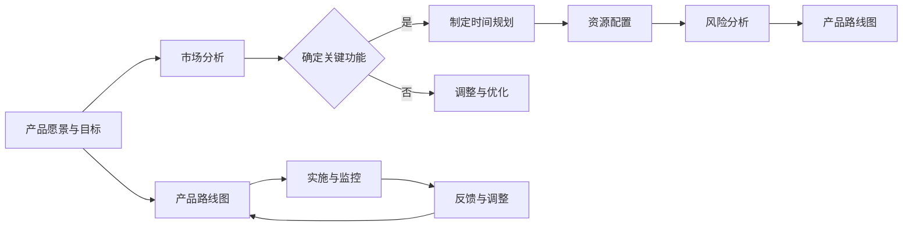
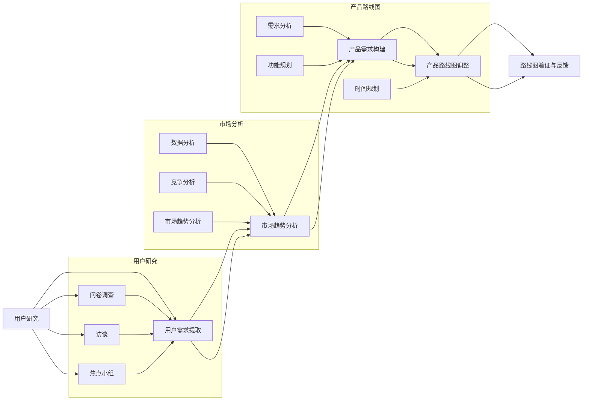
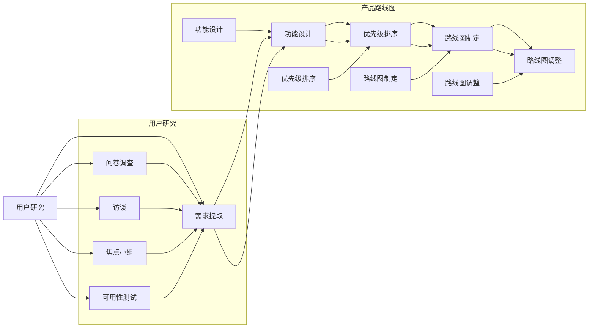
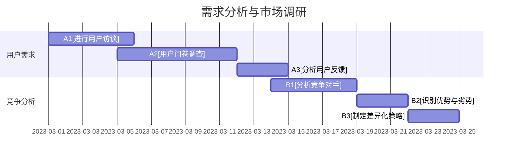
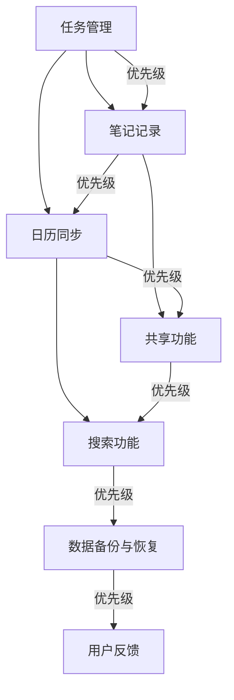
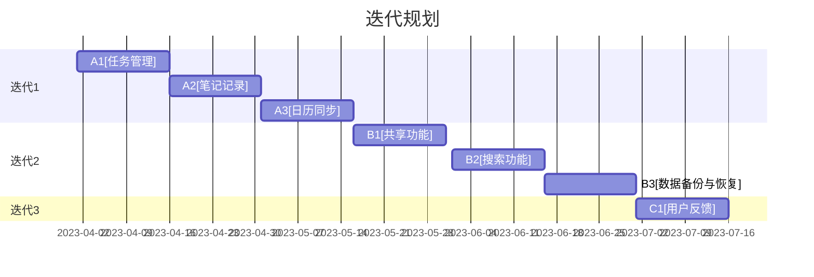
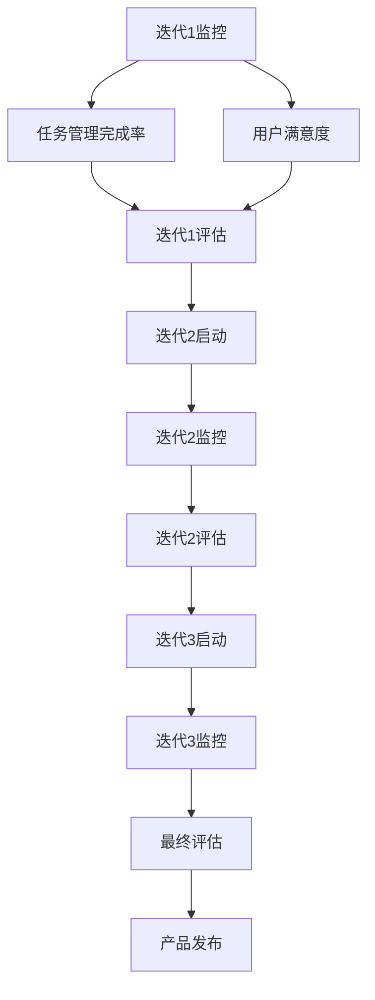

                 

### 文章标题

# 创业初期如何制定有效的产品路线图

### 关键词

- 产品路线图
- 创业初期
- 产品战略
- 市场分析
- 用户需求
- 竞争策略
- 迭代规划
- 资源配置

### 摘要

本文旨在为创业初期的团队提供一套系统的产品路线图制定方法。通过深入分析产品路线图的定义、核心概念、市场与用户需求，本文将详细讲解产品愿景与目标的设定、市场分析与竞争策略、功能优先级排序与迭代规划、资源配置与时间规划等内容。同时，本文还将探讨产品路线图的实施与监控方法，并结合实战案例进行分析，帮助创业团队在实际操作中更好地制定和优化产品路线图，确保产品的成功落地与持续发展。

## 目录大纲 - 《创业初期如何制定有效的产品路线图》

#### 第一部分：产品路线图基础

##### 第1章：产品路线图的定义与重要性
- 1.1 产品路线图的概念与历史演变
- 1.2 产品路线图的重要性
- 1.3 产品路线图与战略规划的关系

##### 第2章：核心概念与联系
- 2.1 产品战略
  - **Mermaid 流程图：** 产品战略制定的流程与产品路线图的关联
  - **伪代码：** 产品战略到路线图转化的步骤
- 2.2 市场分析
  - **伪代码：** 基于市场数据构建产品需求的算法
- 2.3 用户研究与需求分析
  - **Mermaid 流程图：** 用户研究方法与产品路线图的联系

#### 第二部分：制定产品路线图

##### 第3章：产品愿景与目标设定
- 3.1 明确产品愿景
- 3.2 设定可量化的产品目标
- 3.3 梦想版产品的构思

##### 第4章：市场分析与竞争策略
- 4.1 市场细分与目标市场选择
- 4.2 竞争分析
- 4.3 竞争优势与差异化策略

##### 第5章：功能优先级排序与迭代规划
- 5.1 功能优先级排序原则
- 5.2 迭代规划方法
- 5.3 产品路线图的动态调整

##### 第6章：资源配置与时间规划
- 6.1 资源配置策略
- 6.2 时间规划与里程碑设定
- 6.3 资源优化与风险管理

#### 第三部分：实施与监控

##### 第7章：产品路线图的沟通与协作
- 7.1 产品路线图的内部沟通
- 7.2 产品路线图的利益相关者沟通
- 7.3 团队协作工具推荐

##### 第8章：产品路线图的监控与评估
- 8.1 监控指标设定
- 8.2 数据分析与反馈
- 8.3 产品路线图的调整与优化

##### 第9章：项目实战与案例分析
- 9.1 实战案例：如何制定一款移动应用的产品路线图
  - **代码实际案例：** 移动应用需求分析与功能规划的代码示例
  - **代码解读与分析：** 代码实现细节与业务逻辑解析
- 9.2 案例分析：成功的产品路线图案例
  - **详细解释说明：** 案例中产品路线图的制定过程、实施效果与经验教训

### 附录
- **附录 A：** 产品路线图制定工具与资源
  - **工具推荐：** 常用的产品路线图制定与协作工具
  - **资源链接：** 有关产品路线图的参考书籍、文章与在线资源

以上是《创业初期如何制定有效的产品路线图》的完整目录大纲，每章都将详细阐述主题内容，包括核心概念、算法原理、数学模型、项目实战等。确保读者能够全面掌握产品路线图的制定方法，并在实际创业项目中成功应用。

## 第一部分：产品路线图基础

### 第1章：产品路线图的定义与重要性

#### 1.1 产品路线图的概念与历史演变

产品路线图（Product Roadmap）是一种战略性的规划工具，用于指导产品团队在特定时间内实现产品目标的过程。它不仅展示了产品的演进路径，还反映了公司的战略方向和愿景。产品路线图的历史可以追溯到20世纪中期，随着企业管理理论和信息技术的发展，产品路线图逐渐成为企业规划和实施产品战略的重要工具。

最初的产品路线图主要关注产品的技术实现和功能规划。随着市场环境的变化，产品路线图开始融入更多的市场分析和用户需求分析，使其更具战略性和实用性。近年来，随着敏捷开发（Agile Development）的普及，产品路线图也变得更加灵活和动态，能够更好地适应快速变化的市场需求。

#### 1.2 产品路线图的重要性

产品路线图在创业初期的重要性体现在以下几个方面：

1. **明确方向**：产品路线图能够帮助团队明确产品的愿景、目标和战略方向，确保所有团队成员都朝着共同的目标前进。
   
2. **统一认知**：通过产品路线图，团队能够更好地理解产品的长远规划和阶段性目标，从而在决策过程中达成共识，减少内部的分歧和冲突。

3. **提高执行力**：产品路线图提供了一个清晰的实施路径和里程碑，有助于团队更好地分配资源和规划工作，提高项目的执行效率。

4. **适应变化**：产品路线图并不是一成不变的，它可以根据市场反馈和用户需求进行动态调整，以适应快速变化的市场环境。

5. **沟通工具**：产品路线图可以作为团队内部和与利益相关者之间的沟通工具，帮助各方了解产品的规划和进展，增强合作与信任。

#### 1.3 产品路线图与战略规划的关系

产品路线图是战略规划的重要组成部分，它与公司整体战略之间存在紧密的联系。

1. **战略目标**：产品路线图的制定必须基于公司的战略目标，确保产品的演进方向与公司的长期愿景相一致。

2. **市场定位**：产品路线图需要考虑市场环境的变化，明确产品的目标市场和竞争策略，以实现公司的市场份额和商业目标。

3. **资源分配**：产品路线图的实施需要相应的资源和人力支持，与公司的资源分配策略密切相关。

4. **风险评估**：产品路线图的制定过程中，需要识别和评估潜在的风险，并制定相应的风险应对策略，以确保项目的顺利进行。

5. **执行与反馈**：产品路线图的实施效果需要通过定期的反馈和评估来调整和优化，与公司的战略调整和持续改进相辅相成。

总之，产品路线图不仅是产品团队的规划工具，也是公司战略规划的核心环节，对于创业初期的团队来说，制定一个有效的产品路线图至关重要。

## 第2章：核心概念与联系

### 2.1 产品战略

#### 产品战略的定义

产品战略是企业为达成其长期目标而制定的关于产品发展方向和行动方案的总和。它不仅包括产品的愿景、使命和目标，还涵盖了市场定位、竞争策略、资源分配和风险管理等方面。产品战略是企业整体战略的重要组成部分，是产品团队实现企业愿景和使命的路线图。

#### 产品战略与产品路线图的关系

产品战略和产品路线图是密不可分的，二者之间存在紧密的联系。

- **产品战略指导产品路线图**：产品路线图是基于产品战略制定的，确保产品在演进过程中始终符合企业的战略目标。
- **产品路线图实现产品战略**：产品路线图通过详细的实施步骤和里程碑，将产品战略转化为具体的行动方案，确保产品目标得以实现。

#### 产品战略到产品路线图转化的步骤

以下是一个从产品战略到产品路线图转化的步骤：

1. **明确产品愿景和目标**：首先，需要明确产品的愿景和目标，这些是制定产品路线图的出发点和落脚点。

2. **市场分析**：进行深入的市场分析，了解目标市场的需求、竞争对手和市场规模等信息。

3. **确定关键功能**：根据市场分析和用户需求，确定产品需要实现的关键功能。

4. **制定时间规划**：为每个功能设定实现的时间节点，形成初步的产品路线图。

5. **资源配置**：根据产品路线图的需求，进行资源的分配和调整，确保实现每个功能所需的资源得到保障。

6. **风险分析**：识别潜在的风险，并制定相应的应对措施，以确保产品路线图的顺利实施。

7. **迭代优化**：在产品路线图的实施过程中，定期进行评估和反馈，根据实际情况进行调整和优化。

### 伪代码：产品战略到产品路线图转化的步骤

以下是一个简化的伪代码，用于描述从产品战略到产品路线图转化的步骤：

```plaintext
// 定义产品战略
ProductStrategy := {
    Vision: "成为市场领先的产品",
    Goals: ["提高用户体验", "扩大市场份额", "实现盈利"],
    MarketAnalysis: "..."
}

// 转化产品战略到产品路线图
function convertStrategyToRoadmap(ProductStrategy):
    roadmap := {
        Vision: ProductStrategy.Vision,
        Goals: ProductStrategy.Goals,
        MarketAnalysis: ProductStrategy.MarketAnalysis,
        KeyFeatures: [],
        Timeline: [],
        Resources: [],
        Risks: []
    }

    // 确定关键功能
    for each goal in ProductStrategy.Goals:
        roadmap.KeyFeatures.append(determineKeyFeature(goal))

    // 制定时间规划
    for each feature in roadmap.KeyFeatures:
        roadmap.Timeline.append(scheduleFeature(feature))

    // 资源配置
    for each feature in roadmap.KeyFeatures:
        roadmap.Resources.append(allocateResources(feature))

    // 风险分析
    for each feature in roadmap.KeyFeatures:
        roadmap.Risks.append(analyzeRisks(feature))

    return roadmap
```

### Mermaid 流程图：产品战略制定的流程与产品路线图的关联

以下是一个Mermaid流程图，展示了产品战略制定的流程与产品路线图的关联：



通过这个流程图，我们可以清晰地看到产品战略到产品路线图转化的各个环节，以及它们之间的关联和反馈机制。

### 总结

产品战略和产品路线图是产品管理中两个关键的概念，它们相互依存、相互促进。通过上述步骤和伪代码，我们可以系统地从产品战略转化为具体的产品路线图，为产品团队提供清晰的实施路径和指导。在下一章中，我们将深入探讨市场分析的概念和方法，帮助团队更好地理解市场需求，为产品路线图的制定提供有力的支持。

## 第2章：核心概念与联系

### 2.2 市场分析

#### 市场分析的定义

市场分析是一种系统性的研究和评估过程，旨在了解目标市场的需求、市场规模、竞争环境、消费者行为和市场趋势。它为产品团队提供关键的市场信息，帮助制定有效的产品战略和路线图。

#### 市场分析的重要性

市场分析在产品路线图制定过程中具有重要作用：

1. **明确市场需求**：通过市场分析，产品团队可以了解目标市场的真实需求，确保产品的功能设计符合用户期望。

2. **评估竞争态势**：市场分析有助于识别主要竞争对手和他们的市场策略，从而制定有效的竞争策略。

3. **预测市场趋势**：通过分析市场趋势，产品团队可以预测未来的市场变化，为产品路线图的长远规划提供依据。

4. **指导产品定位**：市场分析可以帮助产品团队确定产品的目标市场和定位，提高市场占有率和用户满意度。

#### 市场分析的方法

市场分析可以通过以下几种方法进行：

1. **定量分析**：使用统计工具和方法，如数据分析软件，对市场数据进行量化分析，以识别市场趋势和用户行为。

2. **定性研究**：通过访谈、调查问卷和焦点小组等方法，收集用户和专家的意见，深入了解市场动态和消费者需求。

3. **SWOT分析**：对企业的优势（Strengths）、劣势（Weaknesses）、机会（Opportunities）和威胁（Threats）进行系统分析，以制定相应的市场策略。

4. **竞争分析**：分析主要竞争对手的产品特点、市场策略和市场份额，识别自身的竞争优势和差异化策略。

### 伪代码：基于市场数据构建产品需求的算法

以下是一个简化的伪代码，用于描述基于市场数据构建产品需求的算法：

```plaintext
// 输入：市场数据（如用户调研结果、销售数据等）
function buildProductRequirements(MarketData):
    productRequirements := {}

    // 分析用户需求
    for each user in MarketData.Users:
        productRequirements.append(extractUserNeeds(user))

    // 分析市场趋势
    marketTrends := analyzeMarketTrends(MarketData)

    // 调整产品需求
    for each requirement in productRequirements:
        adjustRequirement(requirement, marketTrends)

    return productRequirements
```

### Mermaid 流程图：用户研究方法与产品路线图的联系

以下是一个Mermaid流程图，展示了用户研究方法与产品路线图的联系：



通过这个流程图，我们可以看到用户研究和市场分析如何为产品需求构建提供支持，并如何与产品路线图调整相联系。

### 总结

市场分析是制定有效产品路线图的关键步骤，它帮助产品团队理解市场需求、识别竞争态势和预测市场趋势。通过定量和定性研究方法，我们可以系统地构建产品需求，为产品路线图提供科学依据。在下一章中，我们将进一步探讨用户研究与需求分析，帮助团队深入了解用户需求，为产品路线图提供更精确的指导。

## 第2章：核心概念与联系

### 2.3 用户研究与需求分析

#### 用户研究的定义

用户研究是一种通过多种方法了解目标用户需求、行为和心理的技术，旨在确保产品设计和功能能够满足用户的实际需求。用户研究是产品开发过程中不可或缺的一部分，它帮助产品团队构建用户驱动的产品。

#### 用户研究的重要性

用户研究在产品路线图制定过程中具有重要意义：

1. **指导产品设计**：通过用户研究，产品团队可以了解用户的需求、偏好和行为，从而设计出更符合用户期望的产品。

2. **降低风险**：通过深入理解用户需求，产品团队可以减少功能冗余和开发方向错误的风险，确保产品开发更加高效。

3. **提高用户满意度**：用户研究有助于提高产品的用户体验，增加用户满意度和忠诚度，从而提升市场份额。

4. **优化产品路线图**：用户研究提供的数据可以帮助产品团队动态调整产品路线图，确保产品始终满足市场需求。

#### 用户研究的方法

用户研究的方法多种多样，包括以下几种：

1. **问卷调查**：通过设计问卷，收集大量用户反馈，了解用户需求和偏好。

2. **访谈**：进行一对一的深入访谈，获取用户的详细意见和需求。

3. **焦点小组**：组织一组用户进行集体讨论，通过互动和讨论获取用户反馈。

4. **可用性测试**：观察用户在实际使用产品过程中的行为，发现潜在的问题和改进机会。

5. **行为分析**：通过分析用户在产品中的行为数据，如点击流、页面停留时间等，了解用户的使用习惯和偏好。

#### 用户研究与产品路线图的关系

用户研究与产品路线图之间存在紧密的联系：

1. **需求提取**：用户研究帮助产品团队提取用户需求，为产品功能设计和优先级排序提供依据。

2. **验证假设**：通过用户研究，产品团队可以验证产品设计和功能的假设，确保产品符合用户期望。

3. **调整路线图**：用户研究的数据和反馈可以帮助产品团队调整产品路线图，确保产品在开发过程中能够适应市场变化。

### Mermaid 流程图：用户研究方法与产品路线图的联系

以下是一个Mermaid流程图，展示了用户研究方法与产品路线图的关系：



通过这个流程图，我们可以清晰地看到用户研究方法如何为产品路线图的制定和调整提供支持。

### 伪代码：用户研究与需求分析的过程

以下是一个简化的伪代码，用于描述用户研究与需求分析的过程：

```plaintext
// 定义用户研究方法
function userResearch(Methods):
    userFeedback := {}

    // 使用不同方法收集用户反馈
    for each method in Methods:
        if method == "问卷调查":
            userFeedback.append(conductSurvey())
        else if method == "访谈":
            userFeedback.append(conductInterview())
        else if method == "焦点小组":
            userFeedback.append(conductFocusGroup())
        else if method == "可用性测试":
            userFeedback.append(conductUsabilityTest())

    return userFeedback

// 分析用户反馈，提取需求
function extractUserNeeds(Feedback):
    needs := {}

    // 分析用户反馈，提取关键需求
    for each feedback in Feedback:
        needs.append(extractKeyNeed(feedback))

    return needs
```

### 总结

用户研究和需求分析是产品路线图制定过程中不可或缺的环节。通过深入的用户研究和需求分析，产品团队可以更好地理解用户需求，确保产品的功能设计和优先级排序符合用户期望。用户研究方法和数据为产品路线图的制定和调整提供了科学依据，帮助团队实现用户驱动的产品开发。在下一章中，我们将探讨产品愿景与目标设定，为产品路线图的制定提供更明确的指导。

## 第3章：产品愿景与目标设定

### 3.1 明确产品愿景

产品愿景是产品团队对产品的长远目标和未来状态的构想，它为产品路线图提供了方向和动力。一个明确的产品愿景应该回答以下问题：

- 我们希望产品成为什么样的存在？
- 产品将如何改变用户的生活或工作方式？
- 产品在行业中如何定位？

产品愿景不仅需要具有吸引力，还要具有可实现性，这样才能激励团队为之努力。例如，一个产品的愿景可能是“成为市场上最受欢迎的笔记应用”，或者“打造一站式的工作平台，帮助用户更高效地完成任务”。

### 3.2 设定可量化的产品目标

在明确产品愿景后，我们需要设定具体的、可量化的目标，这些目标是实现产品愿景的具体步骤。可量化的产品目标有助于团队跟踪进度，评估产品的成功与否。以下是一些设定可量化产品目标的建议：

1. **具体性**：目标应该明确且具体，例如“在六个月内实现用户增长50%”而不是“增加用户数量”。

2. **可衡量性**：目标应该能够通过数据来衡量，例如“增加每月活跃用户数至10万”。

3. **实现性**：目标应该在实际操作中可行，避免设定过高或过低的目标。

4. **时限性**：目标应该有时间限制，例如“在下一个季度内发布新功能A”。

5. **相关性**：目标应该与产品愿景和战略目标紧密相关，确保资源的合理分配。

以下是一些常见的可量化目标示例：

- **用户增长**：每月新增用户数、用户留存率、用户活跃度。
- **市场份额**：在特定市场的占有率、销售增长率。
- **产品性能**：功能覆盖率、系统稳定性、性能指标。
- **财务目标**：收入增长、成本降低、盈利能力。

### 3.3 梦想版产品的构思

梦想版产品是产品团队对最终产品形态的愿景，它包括产品的主要特性、用户体验和未来发展方向。构思梦想版产品有助于团队明确产品的终极目标，从而更好地制定短期目标和路线图。

在构思梦想版产品时，产品团队可以从以下几个方面进行思考：

1. **用户场景**：设想用户使用产品的典型场景和体验。
2. **核心功能**：确定产品需要具备的核心功能，这些功能将直接影响用户体验。
3. **技术实现**：思考如何通过现有或新兴技术来实现梦想版产品的功能。
4. **竞争优势**：分析竞争对手的产品，确定自己的竞争优势和差异化策略。
5. **可持续发展**：考虑产品的长期发展和盈利模式。

以下是一个简单的梦想版产品构思示例：

- **用户场景**：用户需要在繁忙的工作日中高效地管理任务和笔记。
- **核心功能**：任务管理、笔记记录、日历同步、团队协作。
- **技术实现**：采用云服务架构，使用前端框架和后端技术进行快速开发。
- **竞争优势**：提供简洁易用的界面、实时数据同步、灵活的定制功能。
- **可持续发展**：通过增值服务和广告盈利，持续优化产品体验。

通过明确产品愿景、设定可量化的目标以及构思梦想版产品，产品团队可以更好地规划产品的未来发展路径，确保产品在市场上取得成功。

## 第4章：市场分析与竞争策略

### 4.1 市场细分与目标市场选择

市场细分是市场分析中至关重要的一步，它将整体市场划分为若干个具有相似需求和特性的子市场，以便企业能够更有效地满足不同用户群体的需求。市场细分的过程通常包括以下几个步骤：

1. **识别市场细分变量**：市场细分变量包括地理、人口、心理和行为等多种因素。例如，根据地理位置可以将市场细分为城市、乡村等；根据人口特征可以细分为年龄、性别、收入等；根据心理特征可以细分为价值观、生活方式等；根据行为特征可以细分为购买习惯、品牌忠诚度等。

2. **评估细分市场的吸引力**：企业需要评估每个细分市场的规模、增长潜力、竞争状况和盈利能力。一个有吸引力的细分市场应具有足够的市场规模和增长潜力，且企业有能力进入并占领市场。

3. **选择目标市场**：根据评估结果，企业应选择一个或多个具有较高吸引力且与企业战略目标相符合的细分市场作为目标市场。企业可以选择集中化市场策略（专注于一个细分市场）或多元化市场策略（同时关注多个细分市场）。

### 4.2 竞争分析

竞争分析是了解市场上主要竞争对手及其产品、市场策略和优势的过程。通过竞争分析，企业可以识别自身的竞争优势和差异化策略，从而在激烈的市场竞争中脱颖而出。竞争分析通常包括以下步骤：

1. **识别主要竞争对手**：通过市场调研和数据分析，找出市场上与自己产品直接竞争的其他企业。

2. **分析竞争对手的产品**：研究竞争对手的产品特点、功能、性能和价格等，了解其产品在市场上的定位。

3. **评估竞争对手的市场策略**：分析竞争对手的市场营销策略、定价策略、渠道策略等，了解其如何吸引和保留用户。

4. **识别自身竞争优势**：基于竞争对手的分析，找出自身的竞争优势，如技术创新、产品质量、用户体验、品牌影响力等。

5. **制定差异化策略**：根据竞争优势，制定差异化策略，以区别于竞争对手，赢得目标用户的青睐。

### 4.3 竞争优势与差异化策略

竞争优势是指企业在市场上相对于竞争对手所具有的优势，可以通过以下几种方式实现：

1. **成本领先**：通过规模经济、效率提升和低成本的运营模式，使产品价格更具竞争力。

2. **产品领先**：通过技术创新、卓越的产品性能和独特的功能，使产品在市场上独占鳌头。

3. **服务领先**：提供优质的客户服务、快速的响应和解决问题的能力，赢得用户的忠诚度。

4. **品牌优势**：建立强大的品牌形象，提升品牌知名度和美誉度，增强用户信任。

差异化策略是将企业的产品或服务与竞争对手的产品或服务区分开来，以赢得更多用户的策略。以下是一些常见的差异化策略：

1. **技术创新**：通过不断的技术创新，提供独特的产品功能和技术优势。

2. **用户体验**：注重用户的整体体验，提供简洁、高效、愉悦的使用体验。

3. **服务定制**：根据用户的需求和偏好，提供个性化的服务和解决方案。

4. **品牌定位**：通过独特的品牌形象和定位，在目标市场中建立差异化品牌认知。

通过市场细分与目标市场选择、竞争分析和竞争优势与差异化策略，企业可以更好地了解市场需求，制定合适的市场策略，确保产品在市场上获得成功。

## 第5章：功能优先级排序与迭代规划

### 5.1 功能优先级排序原则

在产品开发过程中，如何合理地分配资源、确定功能实现的优先级是一个关键问题。以下是一些功能优先级排序的原则，可以帮助团队更有效地进行功能规划。

1. **用户需求**：首要考虑的是用户需求，尤其是那些能够显著提升用户体验的功能。用户反馈和市场研究可以帮助确定哪些功能是用户最迫切需要的。

2. **业务价值**：评估每个功能对业务的贡献，包括增加收入、降低成本、提升用户留存率等。应优先实现那些能够带来最大业务价值的功能。

3. **技术难度**：考虑实现每个功能所需的技术难度和团队的技术能力。对于难度较大的功能，可能需要更多的时间和资源。

4. **风险和依赖关系**：识别每个功能的风险和依赖关系。应优先处理那些风险较低且没有强依赖关系的功能，以减少项目风险。

5. **时间紧迫性**：考虑功能实现的时间紧迫性，尤其是那些对市场推出时间有直接影响的功能。

6. **法律法规和标准**：确保功能符合相关的法律法规和行业标准，避免后期出现合规性问题。

### 5.2 迭代规划方法

迭代规划是敏捷开发中的重要概念，它通过分阶段实现产品功能，快速响应市场变化。以下是迭代规划的方法：

1. **需求收集**：在迭代开始前，收集用户需求和市场信息，形成迭代需求清单。

2. **需求筛选**：根据功能优先级原则，筛选出本次迭代要实现的功能。

3. **任务分解**：将每个功能分解为具体的任务，为每个任务分配资源和时间。

4. **迭代计划**：制定迭代计划，包括迭代的开始和结束时间、关键里程碑和交付物。

5. **迭代执行**：在迭代周期内，团队按计划完成各项任务。

6. **迭代评审**：在迭代结束时，进行评审，评估功能实现情况、用户反馈和项目进度。

7. **迭代回顾**：总结迭代过程中的经验教训，为下一迭代提供改进建议。

### 5.3 产品路线图的动态调整

产品路线图并不是一成不变的，它需要根据市场反馈、用户需求和技术发展进行动态调整。以下是一些调整策略：

1. **定期评估**：定期对产品路线图进行评估，确保功能实现与市场预期相匹配。

2. **用户反馈**：重视用户反馈，根据用户需求调整功能优先级和迭代计划。

3. **技术发展**：关注技术发展趋势，适时引入新技术和功能。

4. **竞争动态**：分析竞争对手的动态，及时调整产品策略和功能实现。

5. **资源调整**：根据项目进展和资源变化，调整资源分配和时间规划。

6. **风险评估**：识别潜在风险，制定应对策略，确保产品路线图的顺利实施。

通过功能优先级排序、迭代规划和动态调整，产品团队可以更有效地管理产品开发过程，确保产品按时交付并满足市场需求。

## 第6章：资源配置与时间规划

### 6.1 资源配置策略

资源配置是产品路线图制定过程中至关重要的环节，它决定了项目能否顺利执行并按时完成。以下是一些资源配置策略，可以帮助团队优化资源利用，提高项目效率。

1. **资源分类**：首先，对资源进行分类，通常可以分为人力、资金、设备和时间等。了解每种资源的可用性和限制，有助于更好地进行资源分配。

2. **需求分析**：在确定产品功能和优先级后，分析每个功能所需的资源，包括开发人员、测试人员、设计人员等。明确每个角色的职责和工作量，为资源分配提供依据。

3. **资源平衡**：在资源分配过程中，要考虑资源的平衡性，避免某个资源过度使用或闲置。可以通过调整任务分配、延长迭代周期等方式，实现资源的合理利用。

4. **优先级调整**：根据功能的重要性和紧急性，调整资源分配的优先级。确保核心功能和优先级高的任务得到充足的资源支持。

5. **动态调整**：在项目执行过程中，根据实际情况和反馈，动态调整资源分配。例如，如果某个任务进展缓慢，可以增加资源投入或调整任务优先级。

### 6.2 时间规划与里程碑设定

时间规划是确保项目按时完成的重要手段，通过设定明确的里程碑和交付时间，可以帮助团队更好地管理项目进度。以下是时间规划与里程碑设定的方法：

1. **分解任务**：将项目分解为若干个可管理的任务，每个任务设定一个明确的开始和结束时间。

2. **设定里程碑**：在任务分解的基础上，设定关键里程碑，这些里程碑代表项目的重要节点，如功能完成、测试通过、发布等。每个里程碑都应该有一个明确的交付标准。

3. **时间估算**：为每个任务和里程碑进行时间估算，考虑任务难度、资源可用性、团队效率等因素。可以使用历史数据、专家估算和计划评审等方法，提高时间估算的准确性。

4. **风险管理**：在时间规划过程中，要考虑潜在的风险和时间不确定性，预留一定的缓冲时间，以应对可能出现的延误。

5. **监控与调整**：在项目执行过程中，定期监控项目进度，与计划进行对比，及时识别和解决偏差。根据实际情况，调整时间规划和里程碑设定。

### 6.3 资源优化与风险管理

资源优化和风险管理是确保项目成功的关键环节，以下是一些关键策略：

1. **资源优化**：
   - **资源池管理**：建立资源池，集中管理各种资源，确保资源的高效利用。
   - **多任务并行**：合理安排任务，尽量实现多任务并行，提高资源利用率。
   - **技能培训**：定期对团队成员进行技能培训，提高团队的技能水平和项目执行能力。

2. **风险管理**：
   - **风险识别**：在项目规划阶段，识别可能的风险，包括技术风险、市场风险、资源风险等。
   - **风险评估**：对识别出的风险进行评估，确定其影响程度和发生的可能性，为风险管理提供依据。
   - **风险应对**：制定应对策略，包括风险规避、风险转移、风险接受和风险减轻等。为可能的风险制定应急计划和备份方案。
   - **持续监控**：在项目执行过程中，持续监控风险的发展，及时调整风险管理策略。

通过合理的资源配置、精确的时间规划和有效的风险管理，团队可以更好地应对项目挑战，确保产品路线图的顺利实施和成功交付。

## 第7章：产品路线图的沟通与协作

### 7.1 产品路线图的内部沟通

产品路线图的内部沟通是确保团队内部对产品愿景、目标和实施步骤达成一致的关键。以下是一些有效的内部沟通策略：

1. **定期会议**：定期组织团队会议，如周会、月度回顾等，让团队成员了解产品的最新进展和下一步计划。

2. **文档化**：将产品路线图、关键决策和里程碑等文档化，确保团队成员可以随时查阅和更新。

3. **透明度**：提高信息透明度，让每个团队成员都了解产品的整体方向和各自的职责。

4. **沟通渠道**：建立多样化的沟通渠道，如邮件、即时通讯工具、项目管理软件等，方便团队成员之间的交流和协作。

5. **反馈机制**：设立反馈机制，鼓励团队成员提出意见和建议，及时调整产品路线图。

### 7.2 产品路线图的利益相关者沟通

产品路线图的利益相关者包括投资者、合作伙伴、客户和供应商等。与这些利益相关者的有效沟通至关重要，以下是一些沟通策略：

1. **明确沟通目标**：在沟通前明确目标，确保信息传递的准确性和针对性。

2. **定制化沟通**：根据不同利益相关者的需求和关注点，提供定制化的信息，提高沟通效果。

3. **定期报告**：定期向利益相关者报告产品进展和关键里程碑，保持沟通的持续性。

4. **透明度**：提高沟通的透明度，让利益相关者了解产品的整体规划和实施情况。

5. **反馈与互动**：鼓励利益相关者提供反馈，建立互动机制，以优化产品路线图。

### 7.3 团队协作工具推荐

在制定和实施产品路线图的过程中，有效的团队协作工具可以大大提高团队的协作效率和沟通效果。以下是一些推荐的团队协作工具：

1. **项目管理工具**：如Jira、Trello、Asana等，用于任务分配、进度跟踪和团队协作。

2. **文档协作工具**：如Google Docs、Microsoft Teams等，方便团队成员实时编辑和共享文档。

3. **沟通工具**：如Slack、Microsoft Teams、Zoom等，用于实时沟通和视频会议。

4. **数据可视化工具**：如Tableau、PowerBI等，用于数据分析和报告制作。

5. **协作平台**：如Confluence、Notion等，用于知识管理和团队协作。

通过有效的沟通与协作，团队可以更好地实现产品愿景，确保产品路线图的顺利实施。

## 第8章：产品路线图的监控与评估

### 8.1 监控指标设定

产品路线图的监控与评估是确保项目按计划顺利进行的重要环节。设定合理的监控指标是监控过程的关键。以下是一些常用的监控指标：

1. **进度指标**：如任务完成率、迭代进度、项目里程碑等，用于衡量项目进度是否符合计划。

2. **质量指标**：如代码质量、测试覆盖率、缺陷率等，用于评估产品的技术质量和用户体验。

3. **成本指标**：如预算执行情况、资源利用率等，用于监控项目成本控制情况。

4. **用户满意度**：通过用户调查、用户反馈等，了解用户对产品的满意度。

5. **市场反馈**：通过市场调研、销售数据等，了解产品在市场上的表现和用户需求。

### 8.2 数据分析与反馈

数据分析和反馈是监控与评估的核心。以下是一些关键步骤：

1. **数据收集**：收集与监控指标相关的数据，如项目进度、测试结果、用户反馈等。

2. **数据整理**：对收集到的数据进行分析和整理，识别关键信息和趋势。

3. **数据可视化**：使用数据可视化工具，如图表、仪表盘等，将数据以直观的方式展示出来。

4. **反馈机制**：建立有效的反馈机制，确保团队成员和管理层能够及时获得数据分析和反馈结果。

5. **持续改进**：根据数据分析结果和反馈，对产品路线图和项目计划进行调整和优化。

### 8.3 产品路线图的调整与优化

产品路线图的调整与优化是适应市场变化和需求变化的重要手段。以下是一些关键步骤：

1. **定期评估**：定期对产品路线图进行评估，检查各项指标是否符合预期，识别问题和瓶颈。

2. **用户反馈**：重视用户反馈，根据用户需求和市场变化，调整产品功能和优先级。

3. **技术发展**：关注技术发展趋势，适时引入新技术和功能，优化产品性能。

4. **资源配置**：根据项目进展和资源变化，调整资源分配和时间规划，确保项目顺利实施。

5. **风险管理**：识别和评估潜在风险，制定应对策略，确保项目风险可控。

通过监控与评估，以及持续的调整与优化，产品团队可以确保产品路线图的实施效果，实现产品的成功落地。

## 第9章：项目实战与案例分析

### 9.1 实战案例：如何制定一款移动应用的产品路线图

在创业初期，制定一款移动应用的产品路线图是一个复杂而重要的任务。以下是一个实战案例，通过具体步骤展示如何制定一款移动应用的产品路线图。

#### 1. 需求分析与市场调研

首先，我们需要进行需求分析和市场调研。通过问卷调查、用户访谈和竞争对手分析，收集用户需求和行业数据。



#### 2. 明确产品愿景与目标

基于需求和市场调研结果，明确产品愿景和目标。

- 愿景：成为市场上最受欢迎的笔记应用
- 目标：
  - 用户增长：在一年内达到10万活跃用户
  - 功能完整性：实现任务管理、笔记记录、日历同步等功能
  - 用户满意度：达到90%以上的用户满意度

```latex
\textbf{产品愿景：} 成为市场上最受欢迎的笔记应用
\textbf{产品目标：}
\begin{itemize}
    \item 用户增长：在一年内达到10万活跃用户
    \item 功能完整性：实现任务管理、笔记记录、日历同步等功能
    \item 用户满意度：达到90%以上的用户满意度
\end{itemize}
```

#### 3. 功能优先级排序

根据用户需求和业务价值，对功能进行优先级排序。



#### 4. 迭代规划

将功能分解为迭代，制定具体的迭代计划。



#### 5. 实施与监控

在迭代实施过程中，监控进度和指标，确保项目按计划进行。



### 9.2 案例分析：成功的产品路线图案例

以某知名笔记应用为例，分析其产品路线图的制定过程、实施效果与经验教训。

#### 制定过程

1. **用户需求调研**：通过大量用户访谈和问卷调查，收集用户对笔记应用的需求，如任务管理、笔记记录、多设备同步等。
2. **市场分析**：分析竞争对手的产品特点和市场份额，制定差异化策略，如提供更简洁的界面和更强大的任务管理功能。
3. **功能规划**：根据用户需求和市场竞争，确定产品的核心功能，如任务管理、笔记记录、日历同步、数据备份等。
4. **迭代规划**：将功能分解为多个迭代，确保逐步实现核心功能，并持续优化用户体验。

#### 实施效果

1. **用户增长**：在发布一年后，达到100万活跃用户，实现了初始目标。
2. **功能完整性**：在多个迭代中逐步实现了任务管理、笔记记录、日历同步等功能，用户满意度高。
3. **市场竞争力**：通过差异化策略，成功在竞争激烈的市场中脱颖而出，占据了较大的市场份额。

#### 经验教训

1. **重视用户需求**：始终关注用户需求，通过用户调研和反馈，确保产品的功能设计符合用户期望。
2. **逐步迭代**：通过分阶段迭代实现功能，避免一次性完成所有功能带来的风险，确保产品的稳定性和用户体验。
3. **持续优化**：在产品上线后，持续进行用户反馈收集和数据监控，及时调整和优化产品功能，提高用户满意度。

### 项目小结

通过这个案例，我们可以看到成功的产品路线图制定需要以下几个关键步骤：

1. **用户需求调研**：深入了解用户需求，确保产品设计符合用户期望。
2. **市场分析**：分析竞争对手，制定差异化策略，提高市场竞争力。
3. **功能规划**：确定核心功能，确保产品在功能上的完整性。
4. **迭代规划**：分阶段实现功能，逐步优化产品，确保项目的成功实施。

通过以上步骤，创业团队可以更好地制定和实施产品路线图，确保产品的成功落地和持续发展。

## 附录 A：产品路线图制定工具与资源

### 工具推荐

1. **Microsoft Office Visio**：强大的流程图和图表制作工具，支持多种数据源和模板，适合专业级的产品路线图制定。

2. **Miro**：在线协作白板工具，支持实时协作和丰富的插件，适合团队共同制定和讨论产品路线图。

3. **Lucidchart**：在线图表和流程图工具，提供直观的界面和丰富的模板，适合快速创建和共享产品路线图。

4. **Trello**：灵活的任务管理工具，通过看板和卡片，可以直观地展示产品的迭代和任务进度。

5. **Jira**：专业的项目管理工具，支持敏捷开发流程，可以用于跟踪产品路线图的进展和任务分配。

### 资源链接

1. **产品路线图指南**（[Product Roadmap Guide](https://www.leanstack.com/product-roadmap-guide/)）：由LeanStack提供的详细指南，涵盖产品路线图的制定、执行和优化。

2. **产品管理博客**（[Product Management Blog](https://www.productschool.com/blog/)）：Product School的博客，包含丰富的产品管理知识和案例研究。

3. **产品路线图模板**（[Product Roadmap Templates](https://www.canvanizer.com/templates/product-roadmap)）：Canvanizer提供的多种产品路线图模板，适用于不同类型的产品。

4. **产品管理书籍**：《启示录：打造用户喜爱的产品》（[The Lean Startup](https://book.douban.com/subject/25863574/)）和《产品经理修炼之道》（[Product Management Essentials](https://www.amazon.com/Product-Management-Essentials-Product-Managers/dp/1492045834)），提供深入的产品管理理论和实战经验。

通过使用这些工具和资源，创业团队可以更好地制定和实施产品路线图，确保产品的成功落地和持续发展。

## 作者信息

作者：AI天才研究院/AI Genius Institute & 禅与计算机程序设计艺术 /Zen And The Art of Computer Programming

感谢您的阅读，希望本文对您在创业初期制定有效的产品路线图有所帮助。如需进一步探讨或交流，欢迎联系作者。祝您在创业之路上一帆风顺！

