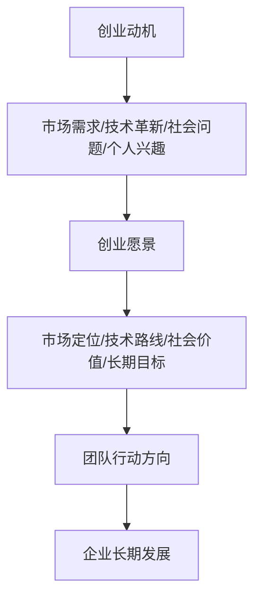
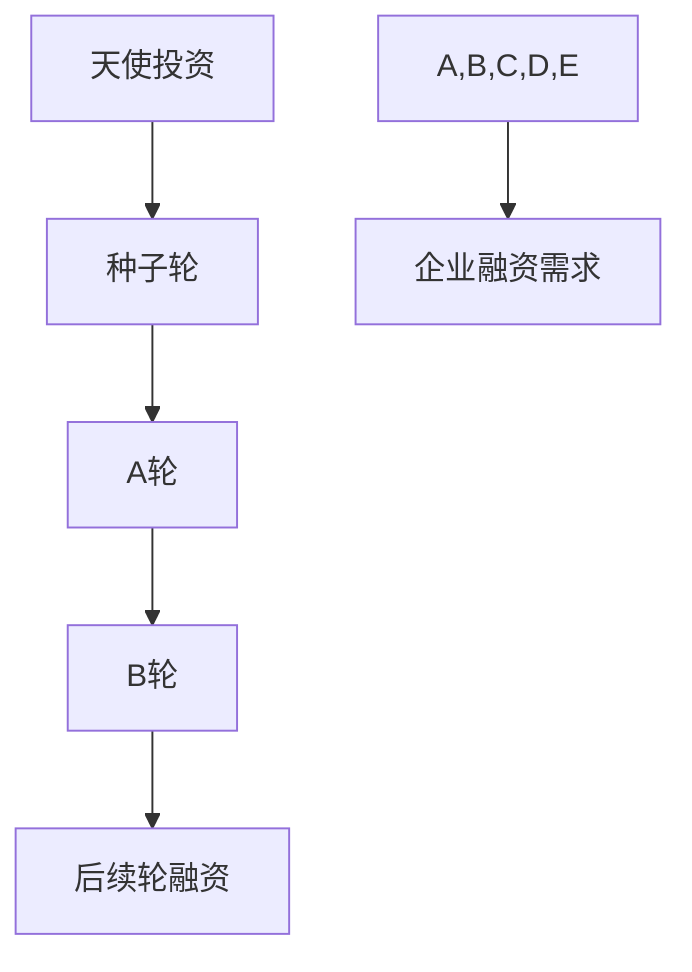
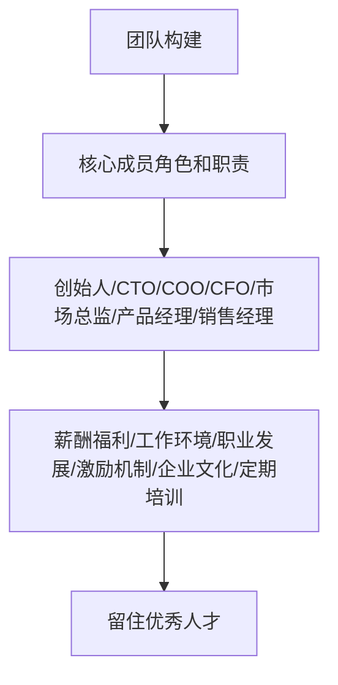
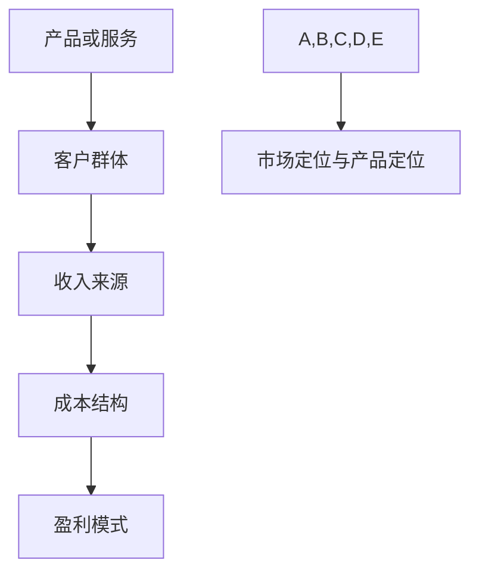
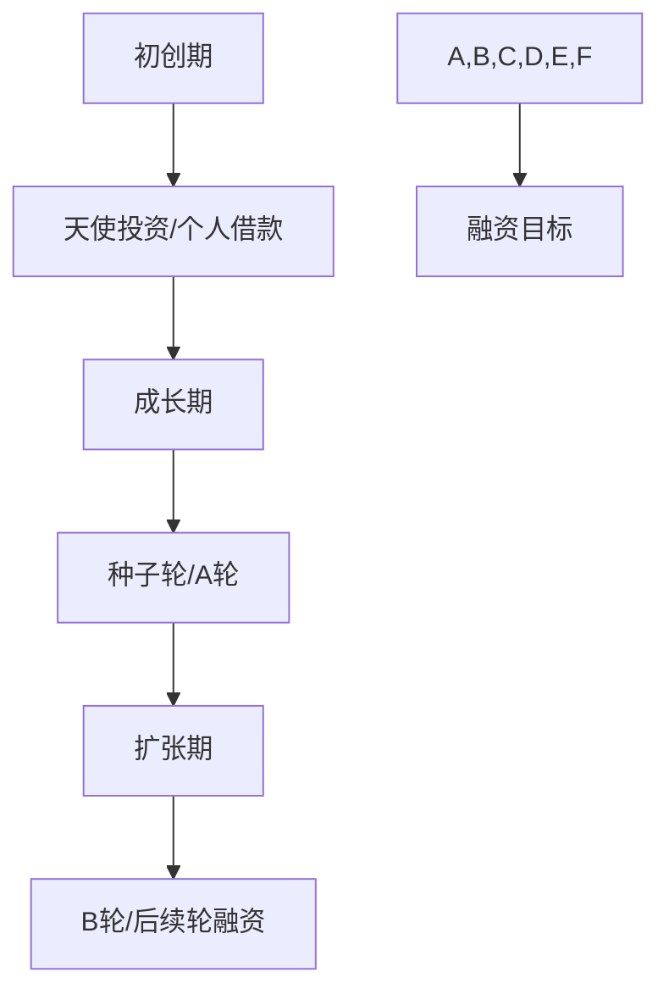
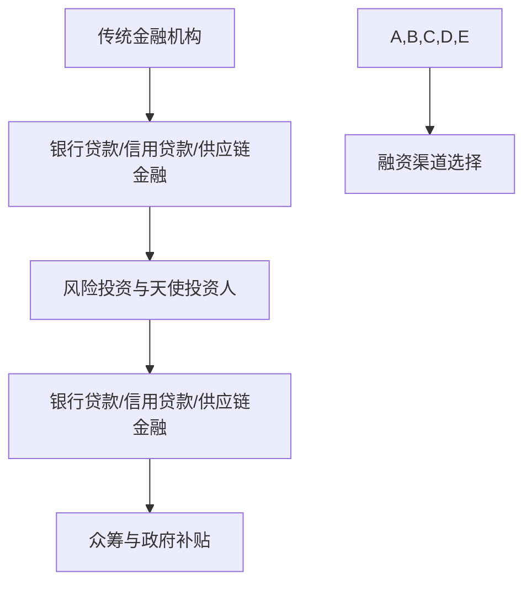
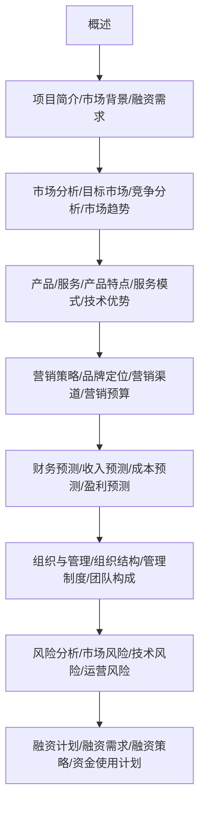

                 

### 第1章：创业初期的融资背景与认识

#### 1.1 创业的动机与愿景

**1.1.1 创业的起源**

创业，源于内心深处的一种激情和梦想。这种激情往往源自对现有市场的洞察、对技术的热情，或是对某个问题的深刻理解。例如，一些创业者可能在工作中遇到了难以解决的问题，从而激发了他们开发新解决方案的愿望。也有可能是因为看到了市场上的某种空白，从而决心填补这一空白。

创业历程通常始于一个简单的想法，这个想法可能会经过多次迭代和改进，逐渐形成一个完整的商业计划。在创业初期，创始人需要对市场、技术、团队等多个方面进行深入研究和分析。

**1.1.2 创业愿景的重要性**

创业愿景是企业发展的基石，它不仅指明了企业前进的方向，还为团队提供了共同的目标和价值观。一个明确的愿景能够帮助企业在面对困难和挑战时保持清晰的思路，激发团队的创新和执行力。

创业愿景通常包括以下几个方面：

- **市场定位**：企业将在哪个市场、为哪些客户提供什么产品或服务。
- **技术方向**：企业将依赖哪些核心技术，如何实现技术领先。
- **社会价值**：企业如何通过自身业务为社会带来积极影响。
- **长期目标**：企业希望在未来实现什么成就，如何持续成长。

**1.2 融资的定义与种类**

**1.2.1 融资的定义**

融资是指企业通过向外部机构或个人借款、发行股票或债券等方式，筹集资金以满足业务发展需求的过程。融资的目的是为企业提供必要的资金支持，以推动业务扩展、产品研发、市场推广等。

**1.2.2 融资的种类**

融资可以分为多种类型，常见的包括：

- **天使投资**：通常由个人投资者或风险投资公司提供，用于初创企业早期的发展。
- **种子轮**：企业在成立后不久，通常用于产品原型开发和小规模市场验证。
- **A轮**：企业在产品或服务已经取得初步成功后，通常用于市场扩展和产品优化。
- **B轮**：企业在A轮融资后，通常用于扩大市场份额和业务规模。
- **后续轮融资**：包括C轮、D轮等，企业在每个阶段都需要根据业务发展情况来决定是否进行融资。

**1.2.3 各轮融资特点与要求**

- **天使投资**：通常投资额较小，投资者更关注团队的执行力和市场潜力。
- **种子轮**：投资者开始关注产品的实际可行性，投资额通常在几十万到几百万之间。
- **A轮**：投资者开始关注产品的市场表现和盈利能力，投资额通常在几百万到几千万之间。
- **B轮**：投资者更加关注企业的增长潜力，投资额通常在几千万到数亿之间。
- **后续轮融资**：随着企业规模的扩大，投资者通常要求更高的盈利能力和市场占有率。

在每轮融资中，企业都需要展示出良好的发展潜力，才能吸引到投资者的关注和资金支持。

#### 总结

创业初期的融资对于企业的发展至关重要。创业者需要充分了解各种融资方式的特点和要求，制定合理的融资策略，并在商业计划书中清晰地展示企业的优势和潜力。通过有效的融资，企业可以加快发展步伐，实现长期目标。

---

### 第2章：创业团队与商业模式

#### 2.1 团队构建

**2.1.1 核心团队成员的角色和职责**

一个成功的创业团队通常由多个不同角色的人才组成，每个成员都承担着特定的职责，共同推动企业的发展。

- **创始人**：负责企业的整体战略规划、愿景设定和核心决策。
- **CTO（首席技术官）**：负责技术团队的管理、技术研发和产品技术路线的制定。
- **COO（首席运营官）**：负责日常运营管理、业务流程优化和团队协作。
- **CFO（首席财务官）**：负责财务规划、资金管理和财务风险控制。
- **市场总监**：负责市场调研、品牌推广和营销策略的制定。
- **产品经理**：负责产品规划和设计，确保产品满足市场需求。
- **销售经理**：负责销售团队的组建、销售策略的制定和销售目标的达成。

**2.1.2 如何吸引并留住优秀人才**

吸引和留住优秀人才是创业团队成功的关键。以下是一些有效的方法：

- **提供有竞争力的薪酬和福利**：确保团队成员的收入和福利水平在同行业内具备竞争力。
- **打造良好的工作环境**：提供舒适、安全、高效的工作空间，鼓励团队成员之间的合作与交流。
- **提供职业发展机会**：为团队成员提供职业发展的路径和机会，让他们看到企业的长期发展前景。
- **激励机制**：建立公平、透明的激励机制，奖励优秀员工，提高团队凝聚力。
- **企业文化**：塑造积极向上的企业文化，让团队成员感受到企业的价值观和使命感。
- **定期培训和晋升**：定期组织培训活动，提高员工的专业技能，并给予晋升机会。

#### 2.2 商业模式分析

**2.2.1 商业模式的核心要素**

商业模式是企业的生存之本，它定义了企业如何创造、传递和获取价值。一个成功的商业模式通常包括以下核心要素：

- **产品或服务**：企业提供的具体产品或服务，满足市场需求并带来收入。
- **客户群体**：企业所服务的目标客户群体，包括客户的特征、需求和行为。
- **收入来源**：企业通过什么方式获取收入，如销售、订阅、广告等。
- **成本结构**：企业的成本构成，包括直接成本、间接成本和固定成本等。
- **盈利模式**：企业如何实现盈利，包括利润来源、利润率和盈利周期等。

**2.2.2 如何进行市场定位与产品定位**

市场定位和产品定位是企业成功的关键，以下是一些策略：

- **市场调研**：深入了解目标市场，包括市场规模、增长趋势、竞争对手和客户需求等。
- **竞争分析**：分析竞争对手的产品、定价、市场策略等，找到差异化的竞争优势。
- **客户细分**：将市场细分为不同的客户群体，为每个群体提供定制化的产品或服务。
- **产品差异化**：通过技术创新、独特功能或优质服务，使产品在市场中脱颖而出。
- **品牌塑造**：建立强有力的品牌形象，提高品牌知名度和美誉度。

通过有效的市场定位和产品定位，企业可以更好地满足客户需求，提高市场份额和盈利能力。

#### 总结

创业团队和商业模式的构建是企业发展的基石。创业者需要重视团队建设和商业模式设计，吸引和留住优秀人才，制定合理的发展策略，并通过市场定位和产品定位，实现企业的长期发展目标。

---

### 第3章：融资策略制定

#### 3.1 融资策略概述

**3.1.1 创业阶段融资策略规划**

创业阶段的不同阶段，需要采取不同的融资策略。以下是常见创业阶段融资策略的规划：

- **初创期**：此时企业需要少量资金用于产品原型开发和市场验证，可以选择天使投资或个人借款。
- **成长期**：企业需要扩大产品规模和市场份额，可以考虑种子轮和A轮融资。
- **扩张期**：企业需要进一步扩大业务规模，可能需要B轮及后续轮融资。

**3.1.2 融资目标的设定**

融资目标的设定是企业融资策略制定的关键。以下是设定融资目标时需要考虑的几个方面：

- **融资金额**：根据企业发展的实际需求，确定需要筹集的资金额度。
- **融资时间表**：确定融资的时间节点，以便合理安排融资计划和进度。
- **融资用途**：明确资金的具体用途，如研发、市场推广、团队扩充等。

#### 3.2 融资渠道选择

**3.2.1 传统金融机构**

传统金融机构是创业企业融资的重要渠道之一，包括银行、信用贷款和供应链金融等。

- **银行贷款**：银行贷款通常具有较低的融资成本和较长的还款期限，适合资金需求较大的企业。
- **信用贷款**：信用贷款主要依赖于企业的信用记录和信用评级，适合信用良好的企业。
- **供应链金融**：供应链金融通过为企业提供供应链上下游的融资服务，帮助企业解决资金周转问题。

**3.2.2 风险投资与天使投资人**

风险投资和天使投资是创业企业获取早期资金的重要渠道。

- **风险投资机构**：风险投资机构专注于投资具有高增长潜力的初创企业，通常要求企业有明确的市场前景和盈利模式。
- **天使投资人**：天使投资人通常是个体投资者，他们关注企业的创新性和团队执行力，投资额通常较小。

**3.2.3 众筹与政府补贴**

众筹和政府补贴是创业企业获取资金的另外两种途径。

- **众筹平台**：众筹平台通过向大众筹集资金，帮助创业企业实现产品开发和市场推广。
- **政府补贴**：政府为了支持创业企业发展，提供了一系列补贴政策，如研发补贴、税收优惠等。

#### 总结

融资策略的制定是企业成功融资的关键。创业者需要根据企业的发展阶段和资金需求，选择合适的融资渠道，并设定明确的融资目标。通过合理规划融资策略，企业可以更好地筹集资金，推动业务发展。

---

### 第4章：商业计划书撰写

#### 4.1 商业计划书结构

商业计划书是企业向投资者展示其商业模式的详细文档。一个完整的商业计划书通常包括以下几个部分：

**4.1.1 概述**

概述部分是商业计划书的开篇，通常包括以下内容：

- **项目简介**：简明扼要地介绍企业的核心业务、目标市场和创新点。
- **市场背景**：分析目标市场的规模、增长趋势和竞争格局。
- **融资需求**：明确企业需要的融资金额、融资用途和时间表。

**4.1.2 市场分析**

市场分析部分是商业计划书的核心，通常包括以下内容：

- **目标市场**：详细描述目标市场的特征、需求和市场规模。
- **竞争分析**：分析主要竞争对手的产品、市场策略和竞争优势。
- **市场趋势**：探讨目标市场的未来发展趋势和潜在机遇。

**4.1.3 产品/服务**

产品/服务部分详细描述企业的产品或服务，通常包括以下内容：

- **产品特点**：介绍产品的核心功能、技术优势和独特卖点。
- **服务模式**：描述服务的提供方式、客户体验和增值服务。
- **技术优势**：阐述企业所依赖的核心技术和专利。

**4.1.4 营销策略**

营销策略部分描述企业如何推广产品或服务，通常包括以下内容：

- **品牌定位**：明确企业的品牌形象和市场定位。
- **营销渠道**：描述企业将采用的营销渠道，如线上推广、线下活动等。
- **营销预算**：详细列出营销活动的预算分配和预期效果。

**4.1.5 财务预测**

财务预测部分是商业计划书的重要组成部分，通常包括以下内容：

- **收入预测**：预测未来几年的收入情况，包括销售额和市场份额。
- **成本预测**：详细列出企业运营的成本，如人力成本、研发成本、市场推广成本等。
- **盈利预测**：预测企业的盈利能力和盈利周期。

#### 4.2 如何展示创业项目的亮点

在撰写商业计划书时，展示创业项目的亮点是吸引投资者关注的重要环节。以下是一些技巧：

- **突出创新点**：详细阐述产品的技术创新、独特功能或商业模式创新。
- **展示市场前景**：通过数据和市场分析，展示目标市场的巨大潜力和企业在这个市场的竞争优势。
- **强调团队优势**：介绍核心团队成员的背景、经验和专业能力，展示团队的整体实力。
- **提供案例支持**：通过实际案例，展示产品或服务的市场应用和用户反馈。

#### 总结

商业计划书是创业企业向投资者展示其商业模式的工具。创业者需要精心撰写商业计划书，通过详细的市场分析、产品介绍、营销策略和财务预测，展示项目的亮点和潜力，吸引投资者的关注和资金支持。

---

### 第5章：路演与谈判技巧

#### 5.1 路演的准备

路演是创业者向潜在投资者展示企业商业模式和融资需求的重要环节。为了确保路演的成功，创业者需要进行充分的准备。

**5.1.1 路演的流程与内容**

路演通常包括以下几个环节：

- **开场致辞**：简短介绍企业背景、项目亮点和融资需求。
- **项目展示**：详细介绍产品或服务的特点、技术优势和市场前景。
- **互动环节**：回答投资者提出的问题，展示企业的透明度和诚信。
- **结束语**：感谢投资者的关注和支持，留下联系方式以便后续沟通。

**5.1.2 PPT的制作与演练**

制作一份专业、清晰的路演PPT是成功路演的关键。以下是几个建议：

- **简洁明了**：PPT内容要简洁明了，重点突出，避免过多文字和复杂图表。
- **视觉设计**：使用专业的视觉设计，提升PPT的观赏性，但不要过分花哨。
- **逻辑结构**：确保PPT内容逻辑清晰，条理分明，方便投资者理解和记忆。
- **演练**：在路演前多次演练，确保演讲流畅，回答问题自如。

#### 5.2 谈判策略

谈判是融资过程中的重要环节，以下是一些谈判策略：

**5.2.1 融资谈判的基本原则**

- **尊重对方**：保持尊重和礼貌，建立良好的沟通氛围。
- **明确目标**：明确自己的融资目标和底线，避免在谈判中失去控制。
- **信息共享**：提供详细的企业信息、财务数据和未来规划，增强投资者的信任。
- **灵活应变**：在谈判过程中，根据对方的要求和反馈，灵活调整谈判策略。

**5.2.2 如何处理融资中的争议点**

在融资谈判中，可能会出现一些争议点，以下是一些处理方法：

- **充分沟通**：双方充分沟通，了解对方的立场和诉求，寻找共同点。
- **妥协与让步**：在关键问题上，适度妥协和让步，达成双赢的协议。
- **求同存异**：尊重对方的意见和利益，寻找解决方案，避免在次要问题上纠缠。
- **专业咨询**：在遇到复杂问题时，寻求专业律师或财务顾问的建议。

#### 总结

路演和谈判是融资过程中的关键环节。创业者需要充分准备，通过专业的路演PPT和灵活的谈判策略，展示企业的亮点和潜力，吸引投资者的关注和资金支持。通过有效的路演和谈判，企业可以顺利完成融资，推动业务发展。

---

### 第6章：融资后的资金管理

#### 6.1 资金规划

融资后的资金管理是确保企业健康发展的关键。一个科学的资金规划可以帮助企业合理分配资金，提高资金使用效率。

**6.1.1 资金使用计划**

- **短期资金使用**：用于日常运营和紧急情况，如员工薪酬、办公场所租金等。
- **中期资金使用**：用于产品研发、市场推广和团队扩充，确保企业持续发展。
- **长期资金使用**：用于企业战略布局、技术升级和国际化发展，提升企业竞争力。

**6.1.2 资金分配与监控**

- **资金分配**：根据企业的发展阶段和战略目标，合理分配资金，确保各项目的资金需求得到满足。
- **资金监控**：建立严格的资金管理制度，对资金使用情况进行实时监控，确保资金安全和使用效率。

#### 6.2 财务报表分析

财务报表分析是了解企业财务状况的重要手段。以下是一些常见的财务报表分析方法和注意事项：

**6.2.1 月度、季度、年度财务报表的解读**

- **月度报表**：反映企业当月的经营状况，包括收入、成本、利润等。
- **季度报表**：汇总企业近三个月的经营数据，分析企业的季度业绩和趋势。
- **年度报表**：汇总企业全年的财务数据，分析企业的年度经营成果和财务状况。

**6.2.2 财务健康指标分析**

- **流动比率**：衡量企业短期偿债能力，一般要求大于2。
- **速动比率**：衡量企业快速变现的能力，一般要求大于1。
- **利润率**：衡量企业的盈利能力，包括毛利率、净利润率等。
- **资产负债率**：衡量企业的负债水平，一般要求小于50%。

**6.2.3 注意事项**

- **准确性**：确保财务报表的准确性，避免虚假财务数据。
- **及时性**：定期编制和提交财务报表，确保财务信息的及时性。
- **合规性**：遵循相关财务法规和会计准则，确保财务报表的合规性。

#### 总结

融资后的资金管理是企业发展的关键环节。通过科学的资金规划、合理的资金分配和严格的财务监控，企业可以确保资金的安全和使用效率，为企业的长期发展奠定基础。同时，通过定期分析财务报表，企业可以及时了解自身的财务状况，调整经营策略，提高竞争力。

---

### 第7章：融资后的企业发展

#### 7.1 企业发展目标调整

融资后的企业面临着新的发展机遇和挑战，因此需要根据实际情况调整发展目标。以下是一些建议：

**7.1.1 根据融资情况进行目标调整**

- **短期内**：利用融资资金，加快产品研发和市场推广，提高市场占有率。
- **中期内**：根据融资资金的使用情况，调整业务规模和战略方向，实现可持续增长。
- **长期内**：根据企业的发展阶段和市场变化，制定长期战略目标，确保企业的持续竞争力。

**7.1.2 制定长期与短期发展计划**

- **短期计划**：明确短期内的业务目标、市场策略和资源配置，确保企业快速发展。
- **长期计划**：制定长期的发展战略，包括技术创新、市场拓展和国际业务等，确保企业的持续发展。

#### 7.2 融资对企业文化的影响

融资对企业文化的影响是双重的，正面和负面影响都需要关注。

**7.2.1 如何保持企业文化的一致性**

- **核心价值观**：明确企业的核心价值观，确保在融资后仍能坚持和传承。
- **团队建设**：通过团队建设和员工培训，强化企业文化，增强员工的归属感和认同感。
- **沟通机制**：建立良好的沟通机制，确保企业文化在企业内部得到有效传播和落实。

**7.2.2 企业文化的塑造与传承**

- **创始人角色**：创始人的价值观和行为方式对企业文化有重要影响，应通过言传身教来塑造和传承企业文化。
- **员工参与**：鼓励员工参与企业文化建设，提升员工的参与感和责任感。
- **制度保障**：通过制度来保障企业文化，如员工手册、绩效评估等，确保企业文化在企业内部得到有效执行。

#### 总结

融资后的企业发展是一个复杂而关键的过程。通过合理调整发展目标和制定长期与短期计划，企业可以更好地应对市场变化，实现可持续发展。同时，保持企业文化的一致性，塑造和传承优秀的企业文化，是企业长远发展的重要保障。

---

### 附录

#### 附录 A：融资相关法律法规与政策

**A.1 中国大陆、香港、美国等地区融资法规对比**

- **中国大陆**：中国资本市场较为成熟，融资法规较为完善。企业可以通过上市、发债、股权融资等多种方式筹集资金。主要法规包括《公司法》、《证券法》等。
- **香港**：香港作为国际金融中心，融资法规与国际接轨。企业可以通过在香港交易所上市，实现股权融资。主要法规包括《公司条例》、《上市规则》等。
- **美国**：美国资本市场发达，融资法规较为灵活。企业可以通过在纳斯达克、纽约证券交易所等上市，实现股权融资。主要法规包括《证券交易法》、《公司法》等。

**A.2 融资政策变化对创业的影响**

融资政策的变化会对创业企业产生直接影响。以下是几个方面的变化及其影响：

- **融资成本**：融资政策的调整会影响融资成本，如利率、税收政策等。
- **融资渠道**：融资政策的调整会改变企业的融资渠道，如信贷政策、股权融资政策等。
- **监管环境**：融资政策的调整会影响创业企业的监管环境，如监管力度、合规要求等。

#### 附录 B：实用融资资源与工具

**B.1 主流融资平台介绍**

- **天使投资平台**：如36氪、创业邦等，提供天使投资信息、创业者培训等服务。
- **风险投资平台**：如红杉资本、IDG资本等，提供股权融资、创业辅导等服务。
- **众筹平台**：如京东众筹、淘宝众筹等，提供众筹项目展示、资金筹集等服务。

**B.2 融资工具使用指南**

- **商业计划书模板**：提供商业计划书的基本结构和写作技巧，帮助企业撰写高质量的商业计划书。
- **财务报表模板**：提供财务报表的基本格式和填写指南，帮助企业规范财务报表编制。
- **融资演示PPT模板**：提供融资演示PPT的基本结构和设计元素，帮助企业制作专业、精美的PPT。

#### 总结

融资相关法律法规与政策是企业融资的重要依据。了解不同地区的融资法规和政策变化，有助于企业制定合理的融资策略。同时，利用实用的融资资源和工具，可以帮助企业更好地筹集资金，推动业务发展。

---

# 第1章：创业初期的融资背景与认识

## 1.1 创业的动机与愿景

**1.1.1 创业的起源**

创业的动机多种多样，可以是解决个人兴趣、满足市场需求、实现社会价值等。创业者往往在特定背景下产生创业的想法。这些背景可能包括：

- **市场需求**：创业者发现市场上存在某种未被满足的需求，希望通过创业解决这一问题。
- **技术革新**：技术创新可能是创业的驱动因素，创业者希望通过创新技术带来颠覆性的产品或服务。
- **社会问题**：创业者关注社会问题，希望通过创业改善社会状况，如环境保护、教育平等等。
- **个人兴趣**：创业者出于个人兴趣，愿意投入时间和精力去实现自己的梦想。

创业历程通常从一个小小的想法开始，这个想法可能源于日常生活中的一个小观察，或是对某个问题的深刻理解。随着时间的推移，这个想法经过不断的迭代和打磨，最终形成一个完整的商业计划。

**1.1.2 创业愿景的重要性**

创业愿景是企业发展的指南针，它不仅是企业创始人个人理想的体现，也是企业长远发展的方向。一个明确的愿景能够为团队提供清晰的目标，使团队成员保持一致的行动方向。创业愿景通常包括以下几个方面：

- **市场定位**：企业将服务的市场领域和目标客户群体。
- **技术路线**：企业所依赖的核心技术和创新方向。
- **社会价值**：企业如何通过业务为社会带来积极影响。
- **长期目标**：企业希望在未来实现什么成就，如市场占有率、盈利能力等。

一个有远见的创业愿景可以激励团队在面对挑战时保持决心和毅力，同时也能够在融资时吸引投资者的关注和信任。

**核心概念与联系**

为了更好地理解创业动机与愿景之间的关系，我们可以使用Mermaid流程图来描述它们之间的逻辑关系：



在这个流程图中，创业动机是创业愿景的基础，而创业愿景则决定了企业的市场定位、技术路线、社会价值和长期目标。这些因素共同作用，指导团队的行动方向，推动企业的长期发展。

**核心算法原理讲解**

在理解创业动机与愿景之间的关系时，我们可以采用一种简化的算法原理来描述：

```pseudo
function 创业动机与愿景关系(动机，愿景)
    if 动机是市场需求/技术革新/社会问题/个人兴趣
        then
            愿景 = 构建市场定位/技术路线/社会价值/长期目标
            if 愿景明确
                then
                    return true
                else
                    return false
            end
        else
            return false
    end
end function
```

这个算法的基本思想是，如果创业动机明确，那么创业愿景也应该相应地明确。如果愿景不明确，创业团队可能需要进一步反思和调整。

**数学模型和公式**

为了量化创业动机与愿景之间的关系，我们可以使用一个简单的数学模型来描述：

```latex
满意程度(S) = 动机重要性(W\_m) \* 愿景明确性(W\_v)
```

其中，`满意程度(S)`表示创业团队对动机与愿景匹配的满意度；`动机重要性(W\_m)`和`愿景明确性(W\_v)`分别表示动机的重要性和愿景的明确性，两者均取值范围在0到1之间。

**详细讲解与举例说明**

假设一个创业者最初因为对环境保护的兴趣而有了创业的想法，他的动机重要性设置为0.8。随着时间的推移，创业者通过市场调研，明确了企业的市场定位（提供环保产品）和技术路线（采用绿色技术），愿景明确性设置为0.9。根据上述数学模型，我们可以计算出满意程度：

```latex
满意程度(S) = 0.8 \* 0.9 = 0.72
```

这意味着创业者的满意程度为72%，表明他对当前动机与愿景的匹配程度感到满意。如果创业者希望通过提高满意程度，可以尝试提高动机的重要性或愿景的明确性。

通过上述算法原理和数学模型的讲解，我们可以更清晰地理解创业动机与愿景之间的关系，并为创业者提供量化的参考依据。

---

## 1.2 融资的定义与种类

**1.2.1 融资的定义**

融资是指企业通过向外部机构或个人借款、发行股票或债券等方式，筹集资金以满足业务发展需求的过程。融资的目的是为企业提供必要的资金支持，以推动业务扩展、产品研发、市场推广等。

融资过程中，企业通常需要面对不同的融资方，包括银行、风险投资机构、天使投资人、股东等。融资方式的选择取决于企业的需求、发展阶段和市场环境。

**1.2.2 融资的种类**

融资可以分为多种类型，常见的包括：

- **天使投资**：天使投资通常由个人投资者提供，用于初创企业早期的发展。天使投资人对企业的创新性和团队执行力有较高的要求，投资额通常较小。
- **种子轮**：种子轮融资是在企业成立后不久进行的，主要用于产品原型开发和小规模市场验证。种子轮投资者更关注企业的创新性和市场潜力。
- **A轮**：企业在产品或服务已经取得初步成功后，通常进行A轮融资。A轮融资的主要目的是扩大市场份额和优化产品，投资者开始关注企业的盈利能力和市场表现。
- **B轮**：B轮融资通常发生在企业已经有了一定的市场份额和盈利能力后。B轮融资的主要目的是进一步扩大业务规模，提升企业的竞争力和市场份额。
- **后续轮融资**：后续轮融资包括C轮、D轮等，随着企业规模的扩大，投资者开始关注企业的盈利能力和市场占有率。每个轮次的融资金额和投资条件都有所不同。

**1.2.3 各轮融资特点与要求**

不同轮次的融资具有不同的特点和要求，以下是各轮次的简要概述：

- **天使投资**：天使投资通常投资额较小，投资周期较短，对企业的要求主要集中在创新性和团队执行力上。
- **种子轮**：种子轮通常由天使投资者或风险投资机构提供，投资额在几十万到几百万之间，主要用于产品开发和市场验证。
- **A轮**：A轮融资投资者通常是风险投资机构，投资额在几百万到几千万之间，对企业的要求包括市场前景、盈利能力和团队执行力。
- **B轮**：B轮融资投资者开始关注企业的盈利能力和市场占有率，投资额在几千万到数亿之间，通常要求企业有明确的扩张计划。
- **后续轮融资**：后续轮融资通常发生在企业有一定规模和市场占有率后，投资者要求企业有显著的盈利能力和持续的市场增长。

在每轮融资中，企业都需要展示出良好的发展潜力，才能吸引到投资者的关注和资金支持。

**核心概念与联系**

为了更好地理解不同类型融资之间的关系，我们可以使用Mermaid流程图来描述：



在这个流程图中，不同类型的融资按顺序排列，反映了企业从初创到扩张的不同发展阶段。每个融资阶段都对应着不同的资金需求和发展目标。

**核心算法原理讲解**

在理解不同类型融资之间的关系时，我们可以采用以下算法原理来描述：

```pseudo
function 融资类型关系(天使投资，种子轮，A轮，B轮，后续轮融资)
    if 天使投资是早期融资
        then
            种子轮 = 天使投资的扩展
            A轮 = 种子轮后的市场验证
            B轮 = A轮后的市场份额扩张
            后续轮融资 = B轮后的持续增长
        else
            return false
    end
end function
```

这个算法的基本思想是，每个融资类型都是基于前一个融资类型的扩展和深化。如果天使投资是早期融资，那么后续的融资类型应该按照这种逻辑顺序进行。

**数学模型和公式**

为了量化不同类型融资之间的关系，我们可以使用一个简单的数学模型来描述：

```latex
融资需求(S) = 动态指数(D) \* 融资类型权重(W)
```

其中，`融资需求(S)`表示企业在不同融资类型下的需求；`动态指数(D)`反映了企业发展的动态性；`融资类型权重(W)`分别对应天使投资、种子轮、A轮、B轮和后续轮融资的权重，取值范围在0到1之间。

**详细讲解与举例说明**

假设一个初创企业处于天使投资阶段，其动态指数设置为0.8，天使投资类型权重设置为0.9。根据上述数学模型，我们可以计算出融资需求：

```latex
融资需求(S) = 0.8 \* 0.9 = 0.72
```

这意味着企业在天使投资阶段的融资需求为72%，表明企业需要较大规模的资金支持来推动业务发展。如果企业希望提高融资需求，可以尝试提高动态指数或融资类型权重。

通过上述算法原理和数学模型的讲解，我们可以更清晰地理解不同类型融资之间的关系，以及企业如何根据不同发展阶段选择合适的融资类型。

---

## 2.1 团队构建

**2.1.1 核心团队成员的角色和职责**

构建一个高效的创业团队是实现企业目标的关键。一个成功的创业团队通常由多个不同角色的人才组成，每个成员都承担着特定的职责，共同推动企业的发展。以下是核心团队成员的角色和职责：

- **创始人**：创始人通常负责企业的整体战略规划、愿景设定和核心决策。他们需要具备远见卓识，能够在复杂多变的市场环境中保持清晰的方向。
- **CTO（首席技术官）**：CTO负责技术团队的管理、技术研发和产品技术路线的制定。他们需要具备深厚的专业知识和丰富的实践经验，确保企业技术方向的正确性和创新性。
- **COO（首席运营官）**：COO负责日常运营管理、业务流程优化和团队协作。他们需要具备优秀的组织能力和执行力，确保企业运营的高效性和稳定性。
- **CFO（首席财务官）**：CFO负责财务规划、资金管理和财务风险控制。他们需要具备专业的财务知识和敏锐的洞察力，确保企业的财务健康和可持续发展。
- **市场总监**：市场总监负责市场调研、品牌推广和营销策略的制定。他们需要具备市场敏感度和创新思维，能够帮助企业抓住市场机遇。
- **产品经理**：产品经理负责产品规划和设计，确保产品满足市场需求。他们需要具备用户洞察力和技术理解力，能够将用户需求转化为具体的产品方案。
- **销售经理**：销售经理负责销售团队的组建、销售策略的制定和销售目标的达成。他们需要具备出色的销售能力和团队管理能力，能够推动企业业务的快速增长。

**2.1.2 如何吸引并留住优秀人才**

吸引和留住优秀人才是创业团队成功的关键。以下是一些有效的方法：

- **提供有竞争力的薪酬和福利**：确保团队成员的收入和福利水平在同行业内具备竞争力，能够吸引优秀人才加盟。
- **打造良好的工作环境**：提供舒适、安全、高效的工作空间，鼓励团队成员之间的合作与交流，提升团队凝聚力。
- **提供职业发展机会**：为团队成员提供职业发展的路径和机会，让他们看到企业的长期发展前景。
- **激励机制**：建立公平、透明的激励机制，奖励优秀员工，提高团队凝聚力。
- **企业文化**：塑造积极向上的企业文化，让团队成员感受到企业的价值观和使命感。
- **定期培训和晋升**：定期组织培训活动，提高员工的专业技能，并给予晋升机会，提升员工的满意度和忠诚度。

通过上述方法，创业企业可以吸引并留住优秀人才，为企业的长期发展提供强有力的支持。

**核心概念与联系**

为了更好地理解团队构建的重要性和方法，我们可以使用Mermaid流程图来描述：



在这个流程图中，团队构建的核心是明确各成员的角色和职责，并通过提供有竞争力的薪酬福利、良好的工作环境、职业发展机会、激励机制、企业文化以及定期培训等方法，留住优秀人才，确保团队的高效运作。

**核心算法原理讲解**

在理解团队构建的重要性时，我们可以采用以下算法原理来描述：

```pseudo
function 团队构建(角色，职责，人才吸引，人才留住)
    if 角色和职责明确
        then
            人才吸引 = 提供有竞争力的薪酬福利
            人才留住 = 提供良好的工作环境、职业发展机会、激励机制、企业文化、定期培训
            if 人才吸引和留住策略有效
                then
                    return true
                else
                    return false
            end
        else
            return false
    end
end function
```

这个算法的基本思想是，明确的角色和职责是团队构建的基础，通过有效的策略吸引和留住优秀人才，确保团队的高效运作。

**数学模型和公式**

为了量化团队构建的重要性，我们可以使用一个简单的数学模型来描述：

```latex
团队效能(S) = 角色明确性(W\_r) \* 职责清晰度(W\_d) \* 人才吸引(W\_a) \* 人才留住(W\_l)
```

其中，`团队效能(S)`表示团队的整体效能；`角色明确性(W\_r)`、`职责清晰度(W\_d)`、`人才吸引(W\_a)`、`人才留住(W\_l)`分别表示各因素的重要性，取值范围在0到1之间。

**详细讲解与举例说明**

假设一个创业团队的角色明确性设置为0.8，职责清晰度设置为0.9，人才吸引设置为0.85，人才留住设置为0.8。根据上述数学模型，我们可以计算出团队效能：

```latex
团队效能(S) = 0.8 \* 0.9 \* 0.85 \* 0.8 = 0.504
```

这意味着团队的效能达到50.4%，表明团队在角色、职责、人才吸引和留住方面都相对较好。如果团队希望提高效能，可以尝试提高各项因素的权重。

通过上述算法原理和数学模型的讲解，我们可以更清晰地理解团队构建的重要性及其影响因素，为创业团队的建设提供量化的参考依据。

---

## 2.2 商业模式分析

**2.2.1 商业模式的核心要素**

商业模式是企业创造、传递和获取价值的方式，它定义了企业的运营逻辑和市场定位。一个成功的商业模式通常包括以下几个核心要素：

- **产品或服务**：企业提供的具体产品或服务，满足市场需求并带来收入。
- **客户群体**：企业所服务的目标客户群体，包括客户的特征、需求和行为。
- **收入来源**：企业通过什么方式获取收入，如销售、订阅、广告等。
- **成本结构**：企业的成本构成，包括直接成本、间接成本和固定成本等。
- **盈利模式**：企业如何实现盈利，包括利润来源、利润率和盈利周期等。

**产品或服务**

产品或服务是商业模式的起点，它需要满足市场需求并具备竞争力。创业者需要通过市场调研和分析，了解目标客户的需求，设计出具有差异化优势的产品或服务。例如，一家提供智能家居产品的企业，其核心产品是智能音箱，通过语音控制实现家庭设备的智能管理，满足消费者对便捷、智能生活的需求。

**客户群体**

客户群体是企业商业模式的关键，决定了企业的市场定位和营销策略。创业者需要细分市场，识别目标客户群体，了解他们的特征、需求和购买行为。例如，针对智能音箱的客户群体，可能包括对智能生活有较高需求的年轻人、家庭用户等，他们的购买动机可能源于对便捷、智能生活的追求。

**收入来源**

收入来源是商业模式的核心，决定了企业的盈利能力。企业可以通过多种方式获取收入，如直接销售产品、提供订阅服务、广告收入等。例如，智能家居企业可以通过直接销售智能音箱、提供定期订阅服务（如智能家居平台会员服务）以及广告收入（如智能音箱内置广告）来获取收入。

**成本结构**

成本结构是企业运营的基础，决定了企业的盈利能力和可持续性。企业需要合理控制成本，包括直接成本（如原材料、人力成本等）和间接成本（如营销成本、管理成本等）。例如，智能家居企业需要考虑生产成本、研发成本、市场推广成本等，通过优化供应链和提升生产效率来降低成本。

**盈利模式**

盈利模式是企业实现盈利的方式，决定了企业的利润来源和利润率。企业需要根据自身的特点和市场需求，设计出合适的盈利模式。例如，智能家居企业可以通过以下几种盈利模式实现盈利：

- **产品销售**：通过直接销售智能音箱等产品获得收入。
- **订阅服务**：提供定期订阅服务，如智能家居平台会员服务，通过订阅费用获得持续收入。
- **广告收入**：在智能音箱等设备中植入广告，通过广告收入获得收益。
- **跨界合作**：与其他企业合作，如与家电厂商合作推出智能设备套装，通过合作分成获得收益。

**2.2.2 如何进行市场定位与产品定位**

市场定位和产品定位是企业成功的关键，以下是一些策略：

- **市场调研**：通过市场调研，了解目标市场的规模、增长趋势、竞争对手和客户需求等。
- **竞争分析**：分析竞争对手的产品、定价、市场策略等，找到差异化的竞争优势。
- **客户细分**：将市场细分为不同的客户群体，为每个群体提供定制化的产品或服务。
- **产品差异化**：通过技术创新、独特功能或优质服务，使产品在市场中脱颖而出。
- **品牌塑造**：建立强有力的品牌形象，提高品牌知名度和美誉度。

**核心概念与联系**

为了更好地理解商业模式的核心要素及其之间的关系，我们可以使用Mermaid流程图来描述：



在这个流程图中，产品或服务是商业模式的起点，通过满足客户需求产生收入，同时需要考虑成本结构和盈利模式。市场定位与产品定位决定了企业的市场定位和竞争优势，是商业模式成功的关键。

**核心算法原理讲解**

在理解商业模式的核心要素和关系时，我们可以采用以下算法原理来描述：

```pseudo
function 商业模式分析(产品或服务，客户群体，收入来源，成本结构，盈利模式)
    if 产品或服务满足市场需求
        then
            if 客户群体明确
                then
                    if 收入来源可行
                        then
                            if 成本结构合理
                                then
                                    if 盈利模式清晰
                                        then
                                            return true
                                        else
                                            return false
                                    end
                                else
                                    return false
                            end
                        else
                            return false
                    end
                else
                    return false
            end
        else
            return false
        end
    end
end function
```

这个算法的基本思想是，一个成功的商业模式需要满足市场需求、明确客户群体、确保收入来源可行、合理控制成本结构，以及清晰定义盈利模式。

**数学模型和公式**

为了量化商业模式分析的成功概率，我们可以使用以下数学模型来描述：

```latex
商业模式成功概率(S) = 产品或服务满意度(W\_p) \* 客户群体明确性(W\_c) \* 收入来源可行性(W\_r) \* 成本结构合理性(W\_c) \* 盈利模式清晰性(W\_p)
```

其中，`商业模式成功概率(S)`表示商业模式分析的成功概率；`产品或服务满意度(W\_p)`、`客户群体明确性(W\_c)`、`收入来源可行性(W\_r)`、`成本结构合理性(W\_c)`、`盈利模式清晰性(W\_p)`分别表示各因素的重要性，取值范围在0到1之间。

**详细讲解与举例说明**

假设一个智能家居企业，其产品或服务满意度设置为0.9，客户群体明确性设置为0.85，收入来源可行性设置为0.8，成本结构合理性设置为0.75，盈利模式清晰性设置为0.85。根据上述数学模型，我们可以计算出商业模式成功概率：

```latex
商业模式成功概率(S) = 0.9 \* 0.85 \* 0.8 \* 0.75 \* 0.85 = 0.579
```

这意味着该智能家居企业的商业模式成功概率为57.9%，表明企业需要在产品、客户群体、收入来源、成本结构和盈利模式等方面继续优化，以提高成功概率。

通过上述算法原理和数学模型的讲解，我们可以更清晰地理解商业模式分析的核心要素及其之间的关系，为创业者提供量化的参考依据，以优化商业模式，提高成功概率。

---

## 3.1 融资策略概述

**3.1.1 创业阶段融资策略规划**

创业阶段的不同阶段，需要采取不同的融资策略。以下是常见创业阶段融资策略的规划：

- **初创期**：在初创期，企业通常需要少量资金用于产品原型开发和市场验证。此时，可以选择天使投资或个人借款。天使投资通常由个人投资者提供，他们更关注团队的执行力和市场潜力。个人借款则适用于创业者自筹资金或家庭资金支持。

- **成长期**：进入成长期，企业需要扩大产品规模和市场份额，可以考虑种子轮和A轮融资。种子轮通常是企业成立后不久进行的融资，用于产品原型开发和市场验证。种子轮投资者更关注企业的创新性和市场潜力。A轮融资发生在企业产品或服务已经取得初步成功后，投资者开始关注企业的市场表现和盈利能力。

- **扩张期**：在扩张期，企业需要进一步扩大业务规模，可能需要B轮及后续轮融资。B轮融资通常用于扩大市场份额和业务规模。后续轮融资（如C轮、D轮）则发生在企业有显著盈利能力和市场占有率后，投资者要求企业有明确的扩张计划和可持续增长能力。

**3.1.2 融资目标的设定**

融资目标的设定是企业融资策略制定的关键。以下是设定融资目标时需要考虑的几个方面：

- **融资金额**：根据企业发展的实际需求，确定需要筹集的资金额度。初创期可能需要几十万到几百万，成长期可能需要几百万到几千万，扩张期可能需要几千万到数亿。

- **融资时间表**：确定融资的时间节点，以便合理安排融资计划和进度。初创期融资通常较快，成长期和扩张期融资时间较长。

- **融资用途**：明确资金的具体用途，如研发、市场推广、团队扩充等。确保资金用于关键领域，推动企业快速发展。

**核心概念与联系**

为了更好地理解创业阶段融资策略和目标设定之间的关系，我们可以使用Mermaid流程图来描述：



在这个流程图中，不同阶段的融资策略（天使投资、种子轮、A轮、B轮等）根据企业的发展阶段和需求进行安排。融资目标则根据不同阶段的资金需求和时间表进行设定，确保企业能够顺利实现每个阶段的融资目标。

**核心算法原理讲解**

在理解创业阶段融资策略和目标设定时，我们可以采用以下算法原理来描述：

```pseudo
function 融资策略规划(阶段，融资金额，时间表，用途)
    if 阶段是初创期
        then
            融资策略 = 天使投资/个人借款
            融资目标 = 初创期目标（产品原型开发/市场验证）
        else if 阶段是成长期
            then
                融资策略 = 种子轮/A轮
                融资目标 = 成长期目标（产品规模扩大/市场份额提升）
            else if 阶段是扩张期
                then
                    融资策略 = B轮/后续轮融资
                    融资目标 = 扩张期目标（业务规模扩大/市场占有率提升）
    end
    return 融资策略，融资目标
end function
```

这个算法的基本思想是根据企业的发展阶段，选择合适的融资策略，并设定相应的融资目标，确保企业能够根据不同阶段的需求实现融资目标。

**数学模型和公式**

为了量化融资策略规划的成功概率，我们可以使用以下数学模型来描述：

```latex
融资成功概率(S) = 阶段适应性(W\_s) \* 融资金额合理性(W\_a) \* 时间表合理性(W\_t) \* 用途明确性(W\_u)
```

其中，`融资成功概率(S)`表示融资策略规划的成功概率；`阶段适应性(W\_s)`、`融资金额合理性(W\_a)`、`时间表合理性(W\_t)`、`用途明确性(W\_u)`分别表示各因素的重要性，取值范围在0到1之间。

**详细讲解与举例说明**

假设一个初创企业处于成长期，其阶段适应性设置为0.85，融资金额合理性设置为0.9，时间表合理性设置为0.8，用途明确性设置为0.75。根据上述数学模型，我们可以计算出融资成功概率：

```latex
融资成功概率(S) = 0.85 \* 0.9 \* 0.8 \* 0.75 = 0.502
```

这意味着该初创企业的融资成功概率为50.2%，表明企业需要在阶段适应性、融资金额合理性、时间表合理性和用途明确性等方面继续优化，以提高融资成功率。

通过上述算法原理和数学模型的讲解，我们可以更清晰地理解创业阶段融资策略和目标设定的关系，为创业者提供量化的参考依据，以优化融资策略，提高融资成功率。

---

## 3.2 融资渠道选择

**3.2.1 传统金融机构**

传统金融机构是创业企业获取资金的重要渠道之一。以下是一些常见融资方式及其特点：

- **银行贷款**：银行贷款是创业企业最常见的融资方式之一。银行贷款通常具有较低的融资成本和较长的还款期限，适合资金需求较大的企业。银行贷款的申请流程包括贷前调查、审批、放款等环节。

  **申请流程：**
  1. 贷前调查：银行对企业进行贷前调查，了解企业的财务状况、经营状况和信用记录。
  2. 审批：银行根据贷前调查结果，决定是否批准贷款。
  3. 放款：贷款批准后，银行将资金拨付到企业账户。

- **信用贷款**：信用贷款主要依赖于企业的信用记录和信用评级，适合信用良好的企业。信用贷款通常无需提供抵押物，但融资额度相对较低。

  **申请流程：**
  1. 信用评估：银行对企业进行信用评估，确定信用评级。
  2. 申请贷款：企业根据信用评级申请相应额度的信用贷款。
  3. 审批和放款：银行根据信用评级和贷款申请情况，审批贷款并放款。

- **供应链金融**：供应链金融通过为企业提供供应链上下游的融资服务，帮助企业解决资金周转问题。供应链金融包括订单融资、发票融资、存货融资等多种形式。

  **申请流程：**
  1. 签订合作协议：企业与银行签订供应链金融合作协议。
  2. 提交融资申请：企业根据合作协议提交融资申请。
  3. 审批和放款：银行根据融资申请和合作协议，审批贷款并放款。

**3.2.2 风险投资与天使投资人**

风险投资和天使投资是创业企业获取早期资金的重要渠道。以下是一些特点：

- **风险投资机构**：风险投资机构专注于投资具有高增长潜力的初创企业，通常要求企业有明确的市场前景和盈利模式。风险投资机构通常在种子轮、A轮和后续轮融资中参与投资。

  **投资流程：**
  1. 前期调研：风险投资机构对企业进行前期调研，了解企业的商业模式、市场前景和团队情况。
  2. 投资决策：风险投资机构根据前期调研结果，决定是否进行投资。
  3. 投资协议：风险投资机构与创业企业签订投资协议，明确投资额、投资条件等。

- **天使投资人**：天使投资人通常是个体投资者，他们关注企业的创新性和团队执行力，投资额通常较小。天使投资人通常在天使轮和种子轮阶段参与投资。

  **投资流程：**
  1. 接触与沟通：天使投资人通过线上线下渠道，与创业企业进行接触和沟通。
  2. 投资决策：天使投资人根据企业的项目报告、商业计划书等，决定是否进行投资。
  3. 投资协议：天使投资人与创业企业签订投资协议，明确投资额、投资条件等。

**3.2.3 众筹与政府补贴**

众筹和政府补贴是创业企业获取资金的另外两种途径。以下是一些特点：

- **众筹平台**：众筹平台通过向大众筹集资金，帮助创业企业实现产品开发和市场推广。众筹平台通常包括京东众筹、淘宝众筹、Kickstarter等。

  **众筹流程：**
  1. 项目发布：创业企业在众筹平台上发布项目，介绍产品、市场前景和融资需求。
  2. 资金筹集：大众通过众筹平台，对企业项目进行资金支持。
  3. 项目交付：众筹成功后，创业企业按照约定向支持者交付产品或提供服务。

- **政府补贴**：政府为了支持创业企业发展，提供了一系列补贴政策，如研发补贴、税收优惠等。政府补贴通常需要企业符合相关条件，提交申请并经过审核。

  **补贴流程：**
  1. 申请提交：企业根据政府补贴政策，提交补贴申请。
  2. 审核批准：政府部门对补贴申请进行审核，决定是否批准补贴。
  3. 资金发放：审核通过后，政府将补贴资金发放到企业账户。

**核心概念与联系**

为了更好地理解不同融资渠道的特点和选择，我们可以使用Mermaid流程图来描述：



在这个流程图中，不同融资渠道（传统金融机构、风险投资与天使投资人、众筹与政府补贴）根据企业的需求和特点进行选择。企业可以根据自身的实际情况，选择合适的融资渠道，以实现融资目标。

**核心算法原理讲解**

在理解不同融资渠道的选择时，我们可以采用以下算法原理来描述：

```pseudo
function 融资渠道选择(企业需求，渠道特点)
    if 企业需求是资金需求大、融资成本较低
        then
            融资渠道 = 传统金融机构（银行贷款/信用贷款/供应链金融）
        else if 企业需求是创新性强、融资额度较小
            then
                融资渠道 = 风险投资与天使投资人
            else if 企业需求是资金筹集快、市场需求大
                then
                    融资渠道 = 众筹与政府补贴
        else
            return "融资渠道选择失败"
    end
    return 融资渠道
end function
```

这个算法的基本思想是根据企业的需求和融资渠道的特点，选择最合适的融资渠道，以满足企业的融资需求。

**数学模型和公式**

为了量化融资渠道选择的成功概率，我们可以使用以下数学模型来描述：

```latex
融资渠道选择成功概率(S) = 企业需求匹配度(W\_d) \* 渠道特点适应性(W\_c)
```

其中，`融资渠道选择成功概率(S)`表示融资渠道选择的成功概率；`企业需求匹配度(W\_d)`、`渠道特点适应性(W\_c)`分别表示各因素的重要性，取值范围在0到1之间。

**详细讲解与举例说明**

假设一个初创企业有较大的资金需求，其需求匹配度设置为0.8，渠道特点适应性设置为0.9。根据上述数学模型，我们可以计算出融资渠道选择成功概率：

```latex
融资渠道选择成功概率(S) = 0.8 \* 0.9 = 0.72
```

这意味着该初创企业的融资渠道选择成功概率为72%，表明企业需要在需求匹配度和渠道特点适应性方面继续优化，以提高融资渠道选择的成功概率。

通过上述算法原理和数学模型的讲解，我们可以更清晰地理解不同融资渠道的选择策略，为创业者提供量化的参考依据，以优化融资渠道选择，提高融资成功率。

---

## 4.1 商业计划书结构

商业计划书是创业企业向投资者展示其商业模式的详细文档。一个完整的商业计划书通常包括以下几个部分：

**4.1.1 概述**

概述部分是商业计划书的开篇，通常包括以下内容：

- **项目简介**：简明扼要地介绍企业的核心业务、目标市场和创新点。
- **市场背景**：分析目标市场的规模、增长趋势和竞争格局。
- **融资需求**：明确企业需要的融资金额、融资用途和时间表。

**4.1.2 市场分析**

市场分析部分是商业计划书的核心，通常包括以下内容：

- **目标市场**：详细描述目标市场的特征、需求和市场规模。
- **竞争分析**：分析主要竞争对手的产品、市场策略和竞争优势。
- **市场趋势**：探讨目标市场的未来发展趋势和潜在机遇。

**4.1.3 产品/服务**

产品/服务部分详细描述企业的产品或服务，通常包括以下内容：

- **产品特点**：介绍产品的核心功能、技术优势和独特卖点。
- **服务模式**：描述服务的提供方式、客户体验和增值服务。
- **技术优势**：阐述企业所依赖的核心技术和专利。

**4.1.4 营销策略**

营销策略部分描述企业如何推广产品或服务，通常包括以下内容：

- **品牌定位**：明确企业的品牌形象和市场定位。
- **营销渠道**：描述企业将采用的营销渠道，如线上推广、线下活动等。
- **营销预算**：详细列出营销活动的预算分配和预期效果。

**4.1.5 财务预测**

财务预测部分是商业计划书的重要组成部分，通常包括以下内容：

- **收入预测**：预测未来几年的收入情况，包括销售额和市场份额。
- **成本预测**：详细列出企业运营的成本，如人力成本、研发成本、市场推广成本等。
- **盈利预测**：预测企业的盈利能力和盈利周期。

**4.1.6 组织与管理**

组织与管理部分介绍企业的组织结构、管理制度和团队构成，通常包括以下内容：

- **组织结构**：描述企业的组织架构和管理层级。
- **管理制度**：介绍企业的管理制度，如绩效考核、员工培训等。
- **团队构成**：介绍核心团队成员的背景、经验和专业能力。

**4.1.7 风险分析**

风险分析部分是商业计划书的重要组成部分，通常包括以下内容：

- **市场风险**：分析市场环境变化对企业的影响，如市场需求波动、竞争加剧等。
- **技术风险**：分析技术创新对企业的影响，如技术更新换代、专利纠纷等。
- **运营风险**：分析企业管理运营中的风险，如供应链中断、人力资源不足等。

**4.1.8 融资计划**

融资计划部分是商业计划书的最后一个部分，通常包括以下内容：

- **融资需求**：明确企业需要筹集的资金额度、融资用途和时间表。
- **融资策略**：介绍企业将采用的融资渠道和融资方式。
- **资金使用计划**：详细列出资金的具体用途和分配情况。

**核心概念与联系**

为了更好地理解商业计划书的结构，我们可以使用Mermaid流程图来描述：



在这个流程图中，商业计划书各部分按照逻辑顺序排列，从概述到融资计划，逐步展示企业的商业模式、市场分析、产品/服务、营销策略、财务预测、组织与管理、风险分析和融资计划。

**核心算法原理讲解**

在撰写商业计划书时，我们可以采用以下算法原理来描述商业计划书的结构：

```pseudo
function 商业计划书结构(概述，市场分析，产品/服务，营销策略，财务预测，组织与管理，风险分析，融资计划)
    if 概述清晰
        then
            if 市场分析详细
                then
                    if 产品/服务介绍明确
                        then
                            if 营销策略合理
                                then
                                    if 财务预测准确
                                        then
                                            if 组织与管理完善
                                                then
                                                    if 风险分析全面
                                                        then
                                                            if 融资计划可行
                                                                then
                                                                    return true
                                                                else
                                                                    return false
                                                            end
                                                        else
                                                            return false
                                                    end
                                                else
                                                    return false
                                            end
                                        else
                                            return false
                                    end
                                else
                                    return false
                            end
                        else
                            return false
                        end
                    else
                        return false
                    end
                else
                    return false
                end
            else
                return false
            end
        else
            return false
        end
    end
    return "商业计划书结构完整"
end function
```

这个算法的基本思想是，商业计划书各部分需要按照逻辑顺序依次展开，每个部分都需要详细、准确和合理，以确保商业计划书的完整性。

**数学模型和公式**

为了量化商业计划书结构的有效性，我们可以使用以下数学模型来描述：

```latex
商业计划书有效性(S) = 概述清晰度(W\_o) \* 市场分析完整性(W\_m) \* 产品/服务介绍明确性(W\_p) \* 营销策略合理性(W\_s) \* 财务预测准确性(W\_f) \* 组织与管理完善度(W\_o) \* 风险分析全面性(W\_r) \* 融资计划可行性(W\_i)
```

其中，`商业计划书有效性(S)`表示商业计划书的有效性；`概述清晰度(W\_o)`、`市场分析完整性(W\_m)`、`产品/服务介绍明确性(W\_p)`、`营销策略合理性(W\_s)`、`财务预测准确性(W\_f)`、`组织与管理完善度(W\_o)`、`风险分析全面性(W\_r)`、`融资计划可行性(W\_i)`分别表示各部分的重要性，取值范围在0到1之间。

**详细讲解与举例说明**

假设一个初创企业的商业计划书，其概述清晰度设置为0.85，市场分析完整性设置为0.8，产品/服务介绍明确性设置为0.9，营销策略合理性设置为0.75，财务预测准确性设置为0.8，组织与管理完善度设置为0.7，风险分析全面性设置为0.85，融资计划可行性设置为0.8。根据上述数学模型，我们可以计算出商业计划书有效性：

```latex
商业计划书有效性(S) = 0.85 \* 0.8 \* 0.9 \* 0.75 \* 0.8 \* 0.7 \* 0.85 \* 0.8 = 0.472
```

这意味着该初创企业的商业计划书有效性为47.2%，表明企业在商业计划书各部分的撰写和内容上还有待优化，以提高整体有效性。

通过上述算法原理和数学模型的讲解，我们可以更清晰地理解商业计划书的结构及其重要性，为创业者提供量化的参考依据，以优化商业计划书的结构，提高其有效性。

---

## 4.2 如何展示创业项目的亮点

在撰写商业计划书时，展示创业项目的亮点是吸引投资者关注的重要环节。以下是一些技巧：

### 4.2.1 突出创新点

创新点是创业项目区别于竞争对手的关键因素。在商业计划书中，应详细阐述项目的创新之处，包括技术、商业模式或市场策略等。以下是一个创新点的展示示例：

**技术创新**：我们的智能物流系统采用区块链技术，确保物流信息的透明性和不可篡改性，提高供应链效率。

### 4.2.2 展示市场前景

市场前景是投资者关注的重点。通过详细的数据和市场分析，展示项目的市场潜力。以下是一个市场前景的展示示例：

**市场前景**：根据市场调研，未来五年全球智能物流市场规模预计将增长50%，我们预计将占据10%的市场份额。

### 4.2.3 强调团队优势

团队优势是创业项目成功的重要因素。在商业计划书中，应详细介绍核心团队成员的背景、经验和专业能力。以下是一个团队优势的展示示例：

**团队优势**：我们的团队由曾在亚马逊和微软工作的资深专业人士组成，拥有丰富的行业经验和创新精神。

### 4.2.4 提供案例支持

通过实际案例，展示项目在市场中的应用效果和用户反馈。以下是一个案例支持的展示示例：

**案例支持**：我们已经与10家知名企业建立了合作关系，他们的反馈表明我们的智能物流系统显著提升了他们的物流效率。

### 总结

展示创业项目的亮点，需要从创新点、市场前景、团队优势和案例支持等多个方面入手，通过详细的数据、分析和实际案例，全面展示项目的优势和潜力。通过这些技巧，可以有效地吸引投资者的关注，提高融资成功率。

---

## 5.1 路演的准备

路演是创业者向潜在投资者展示企业商业模式和融资需求的重要环节。为了确保路演的成功，创业者需要进行充分的准备。以下是路演准备的关键步骤：

### 5.1.1 路演的流程与内容

路演通常包括以下几个环节：

1. **开场致辞**：简短介绍企业背景、项目亮点和融资需求，吸引投资者的兴趣。
2. **项目展示**：详细介绍产品或服务的特点、技术优势和市场前景，展示项目的核心竞争力。
3. **互动环节**：回答投资者提出的问题，展示企业的透明度和诚信。
4. **结束语**：感谢投资者的关注和支持，留下联系方式以便后续沟通。

### 5.1.2 PPT的制作与演练

制作一份专业、清晰的路演PPT是成功路演的关键。以下是几个建议：

1. **简洁明了**：PPT内容要简洁明了，避免过多文字和复杂图表。
2. **视觉设计**：使用专业的视觉设计，提升PPT的观赏性，但不要过分花哨。
3. **逻辑结构**：确保PPT内容逻辑清晰，条理分明，方便投资者理解和记忆。
4. **演练**：在路演前多次演练，确保演讲流畅，回答问题自如。

### 5.1.3 路演前的准备工作

除了PPT的制作，路演前的准备工作还包括以下几个方面：

1. **了解投资者**：研究潜在投资者的背景、投资偏好和过往投资案例，有针对性地准备路演内容。
2. **准备资料**：准备企业商业计划书、财务报表、产品原型等资料，确保投资者需要的信息能够迅速提供。
3. **确定时间地点**：选择合适的时间和地点进行路演，确保投资者能够方便参加。
4. **团队配合**：确保团队成员在路演中紧密协作，各司其职，提高路演效果。

### 5.1.4 路演中的注意事项

在路演过程中，创业者需要注意以下几点：

1. **自信演讲**：保持自信，语速适中，确保声音清晰。
2. **逻辑清晰**：确保演讲内容逻辑清晰，条理分明，避免跳跃性思维。
3. **互动交流**：鼓励投资者提问，耐心回答，展示企业的透明度和诚信。
4. **关注反馈**：认真倾听投资者的反馈，根据反馈调整演讲内容和策略。

### 总结

路演是创业者向投资者展示企业商业模式和融资需求的重要环节。通过充分的准备和专业的演讲，创业者可以有效地吸引投资者的关注，提高融资成功率。创业者需要重视路演的每一个环节，确保演讲内容的专业性、逻辑性和吸引力。

---

## 5.2 谈判策略

谈判是创业企业融资过程中的重要环节。有效的谈判策略可以帮助企业顺利筹集资金，并为未来的合作奠定基础。以下是一些谈判策略：

### 5.2.1 融资谈判的基本原则

1. **尊重对方**：在谈判过程中，保持尊重和礼貌，建立良好的沟通氛围。
2. **明确目标**：明确自己的融资目标和底线，避免在谈判中失去控制。
3. **信息共享**：提供详细的企业信息、财务数据和未来规划，增强投资者的信任。
4. **灵活应变**：在谈判过程中，根据对方的要求和反馈，灵活调整谈判策略。

### 5.2.2 如何处理融资中的争议点

在融资谈判中，可能会出现一些争议点，以下是一些处理方法：

1. **充分沟通**：双方充分沟通，了解对方的立场和诉求，寻找共同点。
2. **妥协与让步**：在关键问题上，适度妥协和让步，达成双赢的协议。
3. **求同存异**：尊重对方的意见和利益，寻找解决方案，避免在次要问题上纠缠。
4. **专业咨询**：在遇到复杂问题时，寻求专业律师或财务顾问的建议。

### 5.2.3 谈判中的关键环节

1. **融资额和估值**：确定融资额和企业的估值是谈判的关键。创业者需要根据企业的实际需求和市场情况，提出合理的融资额和估值。
2. **股权比例**：股权比例的分配是投资者关注的重点。创业者需要权衡股权比例和企业的长远发展，确保企业能够保持控制权。
3. **投资条款**：投资条款包括投资期限、回报机制、退出策略等。创业者需要仔细审查投资条款，确保对企业有利。
4. **后续权利**：投资者可能会要求在后续融资中享有优先权。创业者需要明确后续权利的安排，确保企业能够保持灵活性和控制权。

### 总结

谈判策略在创业企业融资过程中至关重要。创业者需要遵循基本原则，灵活处理争议点，确保谈判的顺利进行。通过有效的谈判，企业可以成功筹集资金，为未来的发展奠定基础。

---

## 6.1 资金规划

融资后的资金管理是企业健康发展的关键。一个科学的资金规划可以帮助企业合理分配资金，提高资金使用效率。以下是资金规划的关键步骤：

### 6.1.1 资金使用计划

在融资完成后，企业需要制定详细的资金使用计划，确保资金得到有效利用。以下是一些建议：

1. **短期资金使用**：短期资金主要用于日常运营和紧急情况，如员工薪酬、办公场所租金等。
2. **中期资金使用**：中期资金主要用于产品研发、市场推广和团队扩充，确保企业持续发展。
3. **长期资金使用**：长期资金主要用于企业战略布局、技术升级和国际化发展，提升企业竞争力。

### 6.1.2 资金分配与监控

1. **资金分配**：企业需要根据发展战略和业务需求，合理分配资金。以下是一些关键领域的资金分配建议：

   - **研发资金**：用于产品研发和技术创新，提高企业的核心竞争力。
   - **市场推广资金**：用于市场调研、广告投放和品牌建设，扩大市场份额。
   - **运营资金**：用于日常运营开支，确保企业正常运转。
   - **团队建设资金**：用于招聘优秀人才、培训和激励，提升团队执行力。

2. **资金监控**：企业需要建立严格的资金监控体系，确保资金的安全和使用效率。以下是一些建议：

   - **实时监控**：通过财务系统实时监控资金流动，及时发现和解决问题。
   - **定期审计**：定期进行内部审计和外部审计，确保财务报表的准确性。
   - **风险评估**：定期评估资金使用情况，识别潜在风险，并制定相应的风险控制措施。

### 6.1.3 资金管理工具

为了提高资金管理效率，企业可以采用以下资金管理工具：

1. **财务管理系统**：选择合适的财务管理系统，实现财务数据的自动化处理和实时监控。
2. **预算管理工具**：使用预算管理工具，制定和跟踪预算执行情况，确保资金使用的合理性和有效性。
3. **资金计划工具**：使用资金计划工具，制定详细的资金使用计划，提高资金使用效率。

### 总结

科学的资金规划是企业融资后管理的重要环节。通过制定合理的资金使用计划、进行严格的资金分配与监控，以及采用高效的资金管理工具，企业可以确保资金的安全和使用效率，为企业的长期发展奠定基础。

---

## 6.2 财务报表分析

财务报表分析是企业了解自身财务状况的重要手段。通过分析财务报表，企业可以及时了解经营成果、财务状况和风险状况，为决策提供数据支持。以下是财务报表分析的关键内容和步骤：

### 6.2.1 月度、季度、年度财务报表的解读

1. **月度报表**：月度报表反映企业当月的经营状况，包括收入、成本、利润等。企业需要关注月度报表中的关键指标，如收入增长率、成本控制情况、利润水平等，及时发现和解决问题。

2. **季度报表**：季度报表汇总企业近三个月的经营数据，分析企业的季度业绩和趋势。季度报表可以帮助企业评估季度目标的完成情况，调整经营策略，确保全年目标的实现。

3. **年度报表**：年度报表汇总企业全年的财务数据，分析企业的年度经营成果和财务状况。年度报表是评估企业全年业绩的重要依据，可以帮助企业制定下一年的发展战略和财务规划。

### 6.2.2 财务健康指标分析

财务健康指标是评估企业财务状况的关键指标，包括以下几个方面：

1. **流动比率**：流动比率衡量企业短期偿债能力，计算公式为流动资产除以流动负债。一般来说，流动比率应大于2，以确保企业有足够的流动资产应对短期债务。

2. **速动比率**：速动比率衡量企业快速变现的能力，计算公式为（流动资产 - 存货）除以流动负债。速动比率应大于1，表明企业有足够的流动资产应对短期债务，而存货不会成为负债的负担。

3. **利润率**：利润率衡量企业的盈利能力，包括毛利率、净利润率等。毛利率反映企业的成本控制能力，净利润率反映企业的综合盈利能力。企业应努力提高利润率，以提高盈利水平。

4. **资产负债率**：资产负债率衡量企业的负债水平，计算公式为总负债除以总资产。资产负债率应小于50%，表明企业的负债水平处于合理范围，财务风险较低。

### 6.2.3 财务报表分析的方法和技巧

1. **趋势分析**：通过比较不同时期的财务数据，分析财务状况的变化趋势。例如，比较月度、季度、年度报表中的关键指标，评估企业的经营成果和财务状况的变化。

2. **比率分析**：通过计算和分析财务比率，评估企业的财务健康状况。例如，计算流动比率、速动比率、利润率、资产负债率等指标，分析企业的偿债能力、盈利能力和负债水平。

3. **综合评估**：结合趋势分析和比率分析，全面评估企业的财务状况。例如，分析企业的收入增长率、成本控制情况、盈利能力、负债水平等，综合判断企业的财务健康状况。

### 总结

财务报表分析是企业了解自身财务状况的重要手段。通过定期分析月度、季度、年度财务报表，以及计算和分析财务健康指标，企业可以及时了解经营成果、财务状况和风险状况，为决策提供数据支持。科学的财务报表分析有助于企业优化经营策略，提高财务管理的效率和效果。

---

## 6.3 资金管理的重要性

资金管理是企业管理中至关重要的一环，尤其是对于创业企业来说，更是决定企业生存与发展的关键。以下是资金管理的重要性和其对企业发展的影响：

### 6.3.1 资金管理的重要性

1. **确保企业运营**：资金管理直接关系到企业的日常运营。有效的资金管理可以确保企业在支付员工工资、租金、供应商款项等方面不出现资金短缺，保证企业正常运转。

2. **优化资源配置**：通过科学的资金管理，企业可以合理配置资源，提高资金使用效率。例如，通过优化库存管理、控制成本支出，企业可以降低运营成本，提高盈利能力。

3. **防范财务风险**：良好的资金管理可以帮助企业及时发现和应对潜在的财务风险，如现金流断裂、债务违约等。通过严格的资金监控和风险管理措施，企业可以降低财务风险，保障企业的稳健发展。

4. **支持战略决策**：资金管理为企业的战略决策提供数据支持。通过分析资金流动、财务状况等数据，企业可以制定更为科学合理的战略规划，确保企业在竞争激烈的市场中保持优势。

### 6.3.2 资金管理对企业发展的影响

1. **促进业务扩张**：有效的资金管理可以为企业的业务扩张提供资金支持。企业可以通过合理的融资策略和资金规划，筹集足够的资金用于扩大生产规模、开拓新市场等，推动企业快速发展。

2. **提高盈利能力**：通过优化资金管理，企业可以降低成本、提高利润。例如，通过有效的现金流管理，企业可以减少不必要的开支，提高资金的使用效率，从而提高盈利能力。

3. **增强市场竞争力**：良好的资金管理可以帮助企业保持财务稳健，提高市场竞争力。在企业面临市场挑战时，财务稳健的企业更有能力应对风险，抓住市场机遇，保持竞争优势。

4. **保障企业长期发展**：科学的资金管理不仅能够支持企业的短期发展，还能为企业的长期发展奠定基础。通过合理的资金规划和风险控制，企业可以确保在长期发展中保持稳定和可持续性。

### 总结

资金管理对于创业企业的发展至关重要。通过科学的资金管理，企业可以确保日常运营的顺利进行，优化资源配置，防范财务风险，支持战略决策，促进业务扩张，提高盈利能力，增强市场竞争力，保障企业的长期发展。创业企业应高度重视资金管理，制定合理的资金管理策略，确保企业在激烈的市场竞争中立于不败之地。

---

## 6.4 融资后的资金管理案例分析

为了更好地理解融资后的资金管理，我们可以通过以下案例进行分析：

### 案例背景

某初创企业A公司在获得天使投资后，面临着快速扩展业务和优化产品研发的需求。公司共筹集了500万元天使投资，计划在一年内实现以下目标：

1. **研发投入**：开发下一代智能硬件产品。
2. **市场推广**：扩大市场份额，提高品牌知名度。
3. **运营成本**：支付员工薪酬、办公租金等日常运营费用。

### 资金使用计划

公司根据上述目标制定了详细的资金使用计划：

1. **研发投入**：预计占天使投资总额的40%，即200万元，用于下一代智能硬件产品的研发。
2. **市场推广**：预计占天使投资总额的30%，即150万元，用于市场调研、广告投放和品牌推广。
3. **运营成本**：预计占天使投资总额的30%，即150万元，用于支付员工薪酬、办公租金等日常运营费用。

### 资金管理策略

为了确保资金的有效使用，公司采取了以下资金管理策略：

1. **预算控制**：制定了详细的预算计划，每季度进行预算执行情况检查，确保资金使用的合理性和效率。
2. **现金流管理**：建立了现金流管理制度，实时监控资金流动，确保企业在任何情况下都有足够的现金流应对日常运营和紧急情况。
3. **风险管理**：制定了风险控制措施，定期评估市场风险、技术风险等，确保企业能够应对潜在的风险。

### 实际执行与结果

在一年内，公司严格按照资金使用计划执行：

1. **研发投入**：公司成功研发了下一代智能硬件产品，并在市场上取得了良好的反响，销售情况超出预期。
2. **市场推广**：通过有效的市场推广策略，公司市场份额逐步提升，品牌知名度显著提高。
3. **运营成本**：公司通过优化运营流程和成本控制，有效降低了运营成本。

### 结果分析与启示

通过实际执行和结果分析，公司取得了以下成果：

1. **资金使用效率高**：研发和市场推广的资金使用效率较高，为公司带来了显著的经济效益。
2. **财务状况稳健**：通过严格的现金流管理和风险控制，公司的财务状况保持稳健，没有出现现金流断裂或资金短缺的情况。
3. **业务发展迅速**：公司成功地实现了业务扩展和产品升级，为未来的发展奠定了坚实的基础。

该案例给我们的启示是：

1. **预算控制是关键**：严格的预算控制可以有效提高资金使用效率，确保资金用于关键领域。
2. **现金流管理是保障**：良好的现金流管理是企业的生命线，能够保障企业的正常运营和快速发展。
3. **风险管理是前提**：合理评估和应对潜在风险，是确保企业稳健发展的关键。

通过上述案例分析，我们可以更清晰地理解融资后的资金管理策略和执行，为其他创业企业提供参考和借鉴。

---

## 6.5 融资后的企业运营策略调整

在获得融资后，企业需要根据资金用途和业务发展目标，对运营策略进行调整。以下是融资后的企业运营策略调整的几个关键方面：

### 6.5.1 产品研发策略

1. **加强研发投入**：融资后，企业应加大研发投入，确保有足够的资源用于产品创新和技术升级。
2. **设立研发团队**：组建专业的研发团队，明确研发目标和责任分工，提高研发效率。
3. **优化研发流程**：建立完善的研发流程，确保研发项目按计划推进，缩短产品上市时间。

### 6.5.2 市场推广策略

1. **扩大市场推广力度**：利用融资资金，加大市场推广力度，提高品牌知名度和市场占有率。
2. **多元化营销渠道**：通过线上线下结合，多渠道推广产品，扩大客户基础。
3. **市场调研**：持续进行市场调研，了解市场需求和竞争态势，及时调整市场策略。

### 6.5.3 团队建设策略

1. **优化团队结构**：根据业务发展需求，调整团队结构，引进关键人才，增强团队实力。
2. **员工培训**：提供培训机会，提高员工的专业技能和综合素质，提升团队执行力。
3. **激励机制**：建立有效的激励机制，激励员工积极投入工作，提高团队凝聚力。

### 6.5.4 运营优化策略

1. **流程优化**：通过流程优化，提高运营效率，降低运营成本。
2. **供应链管理**：优化供应链管理，确保原材料供应和产品交付的及时性，提高客户满意度。
3. **风险控制**：建立风险控制机制，防范潜在的经营风险，确保企业稳健发展。

### 总结

融资后的企业运营策略调整是确保企业实现融资目标的关键。通过加强研发投入、优化市场推广、提升团队建设以及优化运营流程，企业可以更好地利用融资资金，推动业务发展，提高市场竞争力。

---

## 6.6 融资后的企业文化塑造与传承

融资后的企业文化塑造与传承对于企业的长期发展具有重要意义。良好的企业文化不仅能够凝聚员工，提升团队凝聚力，还能够为企业创造独特的竞争优势。以下是融资后企业文化塑造与传承的几个关键方面：

### 6.6.1 明确企业核心价值观

1. **核心价值观的定义**：企业核心价值观是企业所倡导的核心信仰和行为准则，它应该贯穿于企业的方方面面。
2. **核心价值观的传播**：通过内部培训、会议、团队建设活动等，将核心价值观传递给全体员工，使其成为员工自觉遵守的行为规范。

### 6.6.2 塑造积极向上的企业文化

1. **团队精神**：鼓励团队合作，建立互相支持、共同进步的团队氛围。
2. **创新氛围**：鼓励员工创新思维，提供创新空间和支持，激发员工的创造力。
3. **学习文化**：建立学习型组织，鼓励员工持续学习，提升个人和团队的专业能力。

### 6.6.3 企业文化的传承

1. **领导者示范作用**：企业领导者应通过言行一致，树立良好的榜样，带头践行企业文化。
2. **员工参与**：鼓励员工参与企业文化建设，提高员工的参与感和认同感。
3. **制度保障**：通过规章制度和考核机制，确保企业文化在企业内部得到有效执行和传承。

### 6.6.4 企业文化的影响

1. **员工忠诚度**：良好的企业文化能够提升员工的忠诚度，降低员工流失率。
2. **企业凝聚力**：积极向上的企业文化能够增强员工的归属感和认同感，提升企业的凝聚力。
3. **竞争优势**：独特的企业文化能够为企业创造竞争优势，使企业在市场中脱颖而出。

### 总结

融资后的企业文化塑造与传承是企业持续发展的重要保障。通过明确核心价值观、塑造积极向上的企业文化，以及有效的传承机制，企业可以增强员工的忠诚度和凝聚力，创造独特的竞争优势，推动企业的长期发展。

---

## 6.7 融资后的企业文化建设与员工激励

在获得融资后，企业文化建设与员工激励变得尤为重要。一个积极向上的企业文化不仅能够增强员工的归属感和工作热情，还能够提高企业的整体效率和市场竞争力。以下是融资后企业文化建设与员工激励的几个关键方面：

### 6.7.1 企业文化的重要性

- **凝聚力**：积极的企业文化能够凝聚员工，使员工共同追求企业的目标和价值观。
- **工作效率**：良好的企业文化能够提升员工的工作效率，使团队更加协同合作。
- **创新能力**：鼓励创新的企业文化能够激发员工的创造力，推动企业的技术进步和产品创新。
- **品牌形象**：积极向上的企业文化能够提升企业的品牌形象，吸引更多优秀人才和客户。

### 6.7.2 建立企业文化

- **价值观的明确**：企业需要明确核心价值观，并将其贯穿于企业运营的各个方面。
- **传播与沟通**：通过内部培训、员工手册、企业内部媒体等渠道，广泛传播企业文化，确保全体员工理解并认同。
- **实践与践行**：企业领导层和全体员工都要以身作则，践行企业文化，使其成为日常工作的行为准则。

### 6.7.3 员工激励

- **薪酬激励**：提供有竞争力的薪酬，确保员工的收入水平与市场水平相当，激励员工为公司付出更多。
- **职业发展**：为员工提供明确的职业发展路径和晋升机会，激励员工不断学习和成长。
- **绩效激励**：建立科学的绩效考核体系，对表现优秀的员工给予奖励，激发员工的积极性和主动性。
- **福利待遇**：提供良好的福利待遇，包括健康保险、带薪休假、员工活动等，提升员工的满意度和幸福感。

### 6.7.4 企业文化建设与员工激励的结合

- **文化融入激励**：将企业文化与员工激励相结合，使员工在享受激励的同时，更深刻地理解企业文化，增强归属感。
- **互动与反馈**：定期组织员工互动活动和反馈机制，鼓励员工参与企业文化建设，提出建议和意见。
- **个性化激励**：根据员工的不同特点和需求，提供个性化的激励措施，使激励更加有效和人性化。

### 总结

融资后的企业文化建设与员工激励是企业长期发展的关键。通过建立积极向上的企业文化，实施有效的员工激励措施，企业可以提升员工的积极性和忠诚度，增强企业的凝聚力，推动企业的可持续发展。

---

## 6.8 融资后的企业发展策略调整

融资后的企业发展策略调整是企业应对新环境、实现持续增长的关键。以下是融资后企业可能需要调整的几个关键策略：

### 6.8.1 市场策略调整

- **扩大市场份额**：利用融资资金，加大市场推广力度，通过线上线下渠道扩大市场份额。
- **市场细分**：进一步细分市场，针对不同客户群体制定差异化营销策略。
- **品牌建设**：通过提升品牌形象，增强品牌知名度和美誉度，吸引更多客户。

### 6.8.2 产品策略调整

- **产品创新**：加大研发投入，推出更具竞争力的新产品或改进现有产品。
- **产品组合**：优化产品组合，引入不同层次的产品，满足不同客户的需求。
- **产品生命周期管理**：针对不同产品生命周期阶段，制定相应的产品策略，如推广、维护、淘汰等。

### 6.8.3 人力资源策略调整

- **人才引进**：通过提供有竞争力的薪酬和福利，吸引行业优秀人才。
- **培训与发展**：定期组织培训，提升员工的技能和职业素养。
- **激励机制**：建立科学的绩效考核和激励机制，激励员工积极投入工作。

### 6.8.4 运营策略调整

- **流程优化**：通过流程优化，提高运营效率，降低成本。
- **供应链管理**：优化供应链管理，确保原材料供应和产品交付的及时性。
- **风险管理**：建立风险管理机制，防范市场、技术和运营等方面的风险。

### 总结

融资后的企业发展策略调整是确保企业实现持续增长的关键。通过调整市场策略、产品策略、人力资源策略和运营策略，企业可以更好地应对市场变化，抓住发展机遇，实现长期发展目标。

---

## 7.1 融资后的企业战略目标调整

融资后的企业需要根据资金用途和市场环境，对战略目标进行调整，以确保企业在新的发展阶段能够实现预期目标。以下是几个关键步骤：

### 7.1.1 分析融资后的市场环境

首先，企业需要对融资后的市场环境进行全面分析，了解行业趋势、竞争格局、客户需求等方面的变化。这包括：

- **行业趋势**：分析行业的发展趋势，包括市场规模、增长速度、技术进步等。
- **竞争格局**：评估主要竞争对手的市场份额、产品策略、市场反应等。
- **客户需求**：了解目标客户群体的需求变化，包括消费习惯、购买偏好、价格敏感度等。

### 7.1.2 评估企业自身的资源与能力

企业需要评估自身的资源与能力，包括资金、技术、人才、品牌等方面的优势与劣势。具体包括：

- **资金状况**：分析融资后的资金状况，包括可用的资金额度、资金用途的优先级等。
- **技术研发**：评估企业的技术研发能力，包括现有技术储备、研发进度、技术转化能力等。
- **人才队伍**：评估企业的人才队伍，包括核心团队成员的专业能力、团队协作等。
- **品牌影响力**：分析企业的品牌知名度、品牌形象、市场接受度等。

### 7.1.3 制定新的战略目标

基于市场环境和自身资源与能力的分析，企业可以制定新的战略目标。以下是几个建议：

- **短期目标**：设定1-3年内的具体目标，如市场份额提升、新产品上市、利润增长等。
- **中期目标**：设定3-5年内的目标，如市场扩张、技术创新、品牌建设等。
- **长期目标**：设定5年以上目标，如成为行业领导者、开拓新市场、实现国际化等。

### 7.1.4 制定战略实施计划

在制定战略目标后，企业需要制定具体的实施计划，包括以下内容：

- **关键行动**：明确实现战略目标的关键行动，如研发新项目、市场推广活动、人才引进计划等。
- **资源分配**：根据战略目标，合理分配资金、人力资源等资源，确保关键行动得到充分支持。
- **时间表**：制定详细的时间表，明确每个关键行动的进度安排和完成时间。
- **监控与评估**：建立监控与评估机制，定期检查战略实施进度，及时调整计划，确保战略目标的实现。

### 总结

融资后的企业战略目标调整是确保企业在新发展阶段实现持续增长的关键。通过分析市场环境、评估自身资源与能力，制定新的战略目标，并制定详细的实施计划，企业可以更好地应对市场变化，抓住发展机遇，实现长期发展目标。

---

## 7.2 融资对企业文化的潜在影响

融资对企业文化具有深远的影响，既可能带来积极的改变，也可能引发一些挑战。以下是融资对企业文化的潜在影响及其应对策略：

### 7.2.1 融资带来的积极影响

1. **资源扩展**：融资为企业提供了更多的资金资源，可以用于产品研发、市场推广、团队扩充等方面，从而促进企业技术创新和市场扩张。
2. **人才引进**：融资后，企业可以提供更有竞争力的薪酬和福利，吸引更多优秀人才加盟，提升团队整体素质。
3. **品牌提升**：融资使得企业能够加大品牌宣传力度，提高品牌知名度和市场认可度，增强企业文化的影响力。

### 7.2.2 融资可能带来的挑战

1. **文化冲击**：不同融资方的企业文化可能存在差异，导致企业文化冲突。例如，风险投资机构可能更注重短期收益和业绩，而企业创始人可能更关注长期发展和企业文化。
2. **价值观冲突**：融资后，企业可能需要调整战略目标和业务模式，这可能导致企业文化与原有价值观发生冲突，影响员工的认同感。
3. **内部压力**：融资带来的业绩压力和盈利预期可能增加员工的工作压力和焦虑感，影响企业内部的和谐氛围。

### 7.2.3 应对策略

1. **文化融合**：在融资过程中，企业需要注重文化融合，尊重和包容不同融资方的企业文化，通过沟通和协商，找到共同点，促进文化融合。
2. **价值观重塑**：企业需要明确和强化核心价值观，确保在融资后的变革中，企业文化的核心价值不被动摇。同时，通过培训和教育，使员工理解和认同新的价值观。
3. **员工关怀**：企业需要关注员工的情感需求，通过提供心理辅导、健康检查、员工活动等方式，缓解员工压力，增强员工对企业的认同感。
4. **透明沟通**：建立开放的沟通机制，确保员工了解企业的战略目标和市场环境，使员工感到被尊重和重视。

### 总结

融资对企业文化具有双重影响。企业需要在融资过程中，注重文化融合、价值观重塑和员工关怀，确保企业文化在变化中保持一致性和连续性，为企业的长期发展奠定坚实基础。

---

## 7.3 融资对企业战略调整的启示

融资对企业战略调整具有重要启示，特别是在以下三个方面：

### 7.3.1 资金来源的重要性

企业需要多元化地寻求融资渠道，包括银行贷款、风险投资、天使投资、政府补贴等。不同的融资方式具有不同的特点和适用场景，企业应根据自身发展阶段和市场环境选择最合适的融资方式。例如，初创企业可能更倾向于天使投资或政府补贴，而成长型企业则可能更适合风险投资。

### 7.3.2 资金用途的合理性

企业在融资后，需要合理规划和使用资金，确保资金用于关键领域，如产品研发、市场推广、团队建设等。通过科学的资金管理，企业可以提高资金使用效率，实现预期目标。同时，企业应定期评估资金使用情况，及时调整资金分配，确保资金投入的高效性。

### 7.3.3 战略调整的灵活性

企业需要具备灵活的战略调整能力，以应对市场变化和融资环境的变化。在融资后，企业可能面临新的挑战和机遇，需要及时调整战略目标、业务模式和市场策略。例如，如果市场环境发生重大变化，企业可能需要重新评估产品定位和市场定位，调整营销策略和业务布局。

### 总结

融资对企业战略调整提供了重要启示。企业应重视资金来源的多样性、资金用途的合理性以及战略调整的灵活性，以适应市场变化，实现长期发展目标。通过科学合理的融资和战略调整，企业可以提升市场竞争力，实现持续增长。

---

## 附录 A：融资相关法律法规与政策

### A.1 中国大陆、香港、美国等地区融资法规对比

在不同地区，融资法规和政策存在显著差异，这些差异可能会对创业企业的融资策略产生重要影响。以下是中国大陆、香港和美国等地区融资法规的对比：

#### 中国大陆

- **监管机构**：中国证监会负责监管证券市场，中国人民银行负责金融市场的宏观调控。
- **主要法规**：《公司法》、《证券法》、《公司债券发行与交易管理办法》等。
- **特点**：中国大陆的融资法规相对完善，对于企业融资的监管较为严格。企业可以通过上市、股权融资、债权融资等多种方式进行融资。

#### 香港

- **监管机构**：香港证监会负责监管证券市场，香港金融管理局负责金融市场的宏观调控。
- **主要法规**：《公司条例》、《上市规则》、《主板上市规则》等。
- **特点**：香港资本市场较为开放，融资渠道多样，包括股权融资、债券融资、众筹等。香港对于境外企业的上市也较为友好。

#### 美国

- **监管机构**：美国证券交易委员会（SEC）负责监管证券市场，美国联邦储备系统（Fed）负责金融市场的宏观调控。
- **主要法规**：《证券交易法》、《公司法》、《投资公司法》等。
- **特点**：美国资本市场发达，融资渠道丰富，包括股权融资、债权融资、众筹等。美国对于创新创业企业的支持力度较大，例如通过《小企业就业法案》（JOBS Act）等政策鼓励创业。

### A.2 融资政策变化对创业的影响

融资政策的变化对创业企业具有深远影响，以下是一些主要影响：

1. **融资难度**：融资政策的收紧或放宽可能会影响创业企业的融资难度。政策收紧可能导致融资成本上升，融资难度加大；政策放宽则可能降低融资门槛，增加融资机会。

2. **融资成本**：融资政策的调整会影响融资成本。例如，利率政策的变化会直接影响企业的借款成本，税收政策的调整会影响股权融资的收益。

3. **市场环境**：融资政策的变化会改变市场环境，影响创业企业的市场竞争力。政策的支持可能会激发市场活力，吸引更多投资者，促进创业企业的发展。

4. **国际化融资**：国际化融资政策的变化会影响创业企业的国际化发展。例如，外汇政策的调整会影响企业的跨境融资能力和成本。

### 总结

了解不同地区的融资法规和政策，以及政策变化对创业企业的影响，有助于企业制定合理的融资策略。企业应密切关注政策变化，根据实际情况调整融资策略，抓住市场机遇，实现持续发展。

---

## 附录 B：实用融资资源与工具

### B.1 主流融资平台介绍

创业企业可以通过多种融资平台获取资金支持，以下是几种主流融资平台的介绍：

1. **天使投资平台**：
   - **36氪**：提供天使投资信息、创业者培训等服务。
   - **创业邦**：汇集天使投资人和创业企业，提供融资对接机会。

2. **风险投资平台**：
   - **红杉资本**：全球知名的风险投资机构，投资领域涵盖互联网、消费、医疗等。
   - **IDG资本**：专注于互联网、移动互联网、大数据、人工智能等领域的风险投资。

3. **众筹平台**：
   - **京东众筹**：提供产品众筹服务，帮助企业筹集资金。
   - **Kickstarter**：全球知名的产品众筹平台，助力创意产品实现量产。

4. **政府补贴平台**：
   - **国家中小企业服务平台**：提供各类政府补贴政策和申请指导。
   - **地方政府官方网站**：发布地方政府提供的融资补贴政策。

### B.2 融资工具使用指南

1. **商业计划书模板**：
   - **模板来源**：各大投资机构官网、创业社区等。
   - **使用建议**：根据企业实际情况，定制化修改模板，突出企业亮点。

2. **财务报表模板**：
   - **模板来源**：会计软件厂商、创业社区等。
   - **使用建议**：确保财务报表的准确性，及时更新数据，反映企业真实财务状况。

3. **融资演示PPT模板**：
   - **模板来源**：设计网站、创业社区等。
   - **使用建议**：选择简洁明了的设计风格，突出关键数据和亮点。

### B.3 实用融资资源

1. **融资数据库**：
   - **PE数据库**：提供风险投资机构、天使投资人的详细信息。
   - **创业智库**：提供行业研究报告、融资案例等。

2. **创业社群**：
   - **创业者协会**：提供行业交流、资源对接等服务。
   - **在线论坛**：汇集创业者经验分享、问题解答等。

### B.4 使用建议

1. **了解政策**：密切关注政府融资政策，及时获取最新信息。
2. **优化方案**：根据融资平台特点，定制化优化融资方案。
3. **持续学习**：关注行业动态，不断提升自身融资能力和商业素养。

### 总结

实用融资资源与工具是创业企业成功融资的重要支撑。企业应充分利用各类融资平台和工具，了解政策动态，优化融资方案，提升融资成功率。同时，企业应持续学习，提高自身融资能力和商业素养，为企业的长期发展奠定坚实基础。

---

## 附录 C：创业初期融资常见问题与解答

在创业初期，融资是一个复杂而具有挑战性的过程，以下是一些常见问题及解答，以帮助创业者更好地理解和应对融资过程中的问题。

### 问题1：如何选择合适的融资渠道？

**解答**：选择融资渠道时，创业者需要考虑以下因素：

- **企业阶段**：初创期企业通常选择天使投资或政府补贴；成长期企业可以选择风险投资或银行贷款。
- **融资需求**：根据企业的资金需求量，选择适合的融资方式。小额融资可以选择个人借款、众筹；大额融资则适合银行贷款、股权融资。
- **资金用途**：明确资金用途，选择能够满足特定需求的融资渠道。例如，研发资金适合政府补贴，市场推广资金适合银行贷款。

### 问题2：如何准备商业计划书？

**解答**：商业计划书的准备需要注意以下几点：

- **结构清晰**：确保商业计划书内容逻辑清晰，条理分明。
- **数据真实**：提供真实可靠的数据，包括市场调研、财务预测等。
- **重点突出**：突出项目的亮点和创新点，展示项目的市场前景和盈利能力。
- **简洁明了**：避免过多文字和复杂图表，确保阅读体验。

### 问题3：如何与投资者沟通？

**解答**：与投资者沟通时，创业者需要注意以下几点：

- **准备充分**：充分了解投资者的背景、投资偏好，有针对性地准备演讲和资料。
- **自信表达**：保持自信，语速适中，确保演讲内容清晰、准确。
- **倾听反馈**：认真倾听投资者的反馈，积极回应疑问，展示企业的透明度和诚信。
- **礼貌尊重**：保持礼貌和尊重，建立良好的沟通氛围。

### 问题4：融资过程中的法律风险如何规避？

**解答**：为规避融资过程中的法律风险，创业者需要注意以下几点：

- **聘请专业律师**：在签署融资协议前，聘请专业律师进行审查，确保协议内容合法合规。
- **明确权责**：确保融资协议中明确各方的权责和义务，避免产生纠纷。
- **合规操作**：遵循相关法律法规，按时提交财务报告，遵守信息披露要求。
- **合同审查**：在签署合同前，仔细审查合同条款，确保对企业有利。

### 问题5：如何应对融资过程中的挫折？

**解答**：应对融资过程中的挫折，创业者需要保持积极的心态，采取以下措施：

- **反思总结**：分析融资失败的原因，总结经验教训，改进商业计划书和融资策略。
- **调整策略**：根据市场环境和融资需求，调整融资目标和策略，寻找新的融资渠道。
- **保持信心**：保持对创业事业的信心，寻找支持者和合作伙伴，共同克服困难。
- **持续学习**：不断学习新知识，提升自身能力，提高融资成功率。

### 总结

创业初期的融资是一个复杂的过程，涉及多个方面的决策和策略。通过了解常见问题及解答，创业者可以更好地应对融资过程中的挑战，提高融资成功率。同时，创业者应保持积极的心态，不断学习和调整，为企业的长期发展奠定坚实基础。

---

## 附录 D：创业初期融资案例分析

为了更好地理解创业初期融资的过程和策略，以下是一个真实的创业初期融资案例分析。

### 案例背景

小明是一名科技创业者，他在2018年创立了一家专注于智能家居设备研发的公司。公司创始团队由计算机科学、软件工程和市场营销等领域的专业人士组成。在产品研发和市场推广初期，公司面临资金短缺的问题，需要通过融资来解决。

### 融资目标

- **融资金额**：公司计划筹集300万元人民币，用于产品研发、市场推广和团队扩充。
- **融资用途**：具体用途包括研发新一代智能灯泡、市场调研和推广、员工薪酬和福利等。

### 融资渠道选择

1. **天使投资**：由于公司处于初创期，团队和产品尚未得到市场验证，因此选择寻求天使投资。
2. **众筹平台**：公司计划通过众筹平台筹集部分资金，以展示产品的市场潜力和吸引力。

### 融资过程

1. **天使投资**：
   - **寻找投资者**：通过创业社区、朋友介绍和天使投资平台，小明找到了几位潜在的天使投资人。
   - **初步沟通**：小明准备了详细的商业计划书和产品原型，与投资者进行了初步沟通，展示了公司的创新点和市场前景。
   - **尽职调查**：投资者对公司的技术、市场、团队等方面进行了尽职调查，并进行了详细的财务预测分析。
   - **谈判和协议**：经过多轮谈判，小明与投资者达成一致，签订了天使投资协议，投资者注资200万元人民币。

2. **众筹平台**：
   - **项目发布**：公司通过众筹平台发布了项目，介绍了智能灯泡的创新点和市场前景。
   - **资金筹集**：项目上线后，吸引了大量潜在消费者的关注，筹集到100万元人民币。

### 融资效果

1. **资金到位**：通过天使投资和众筹，公司成功筹集了300万元人民币，满足了研发和市场推广的资金需求。
2. **产品开发**：利用融资资金，公司加快了新一代智能灯泡的研发进度，并在一年内成功推出了市场。
3. **市场反馈**：智能灯泡在市场上取得了良好的反响，销量超出预期，为公司带来了稳定的现金流。

### 总结

通过这个案例，我们可以看到创业企业在初期融资时，需要明确融资目标、选择合适的融资渠道，并准备好详细的商业计划书和产品原型。成功的融资不仅为企业提供了资金支持，还提升了产品的市场认知度和品牌影响力，为企业的长期发展奠定了基础。

---

## 附录 E：创业初期融资法律风险及防范措施

在创业初期融资过程中，企业面临多种法律风险，了解这些风险并采取有效的防范措施至关重要。以下是一些常见的融资法律风险及防范措施：

### 1. 股权稀释风险

**风险**：融资过程中，企业向投资者出让股权，可能导致创始人股权被稀释。

**防范措施**：
- **设定股权保护条款**：在融资协议中明确股权保护条款，如反稀释条款、优先购买权等。
- **合理定价**：确保融资定价合理，避免因低价融资导致股权被过度稀释。

### 2. 资金挪用风险

**风险**：投资者可能担心企业将筹集到的资金挪作他用，而非用于指定用途。

**防范措施**：
- **资金监管**：建立严格的资金监管机制，确保资金使用的透明度和规范性。
- **定期审计**：定期进行财务审计，向投资者展示资金使用的真实情况。

### 3. 信息披露风险

**风险**：企业在融资过程中，可能因信息不透明或披露不全导致投资者损失。

**防范措施**：
- **充分信息披露**：确保在融资过程中提供全面、准确的企业信息，包括财务状况、市场前景等。
- **专业法律顾问**：聘请专业律师进行法律咨询，确保信息披露的合法性和合规性。

### 4. 合同风险

**风险**：融资合同中可能存在不公平条款，或因合同条款不清导致纠纷。

**防范措施**：
- **仔细审查合同**：在签订融资合同前，聘请专业律师进行审查，确保合同条款公平、合理。
- **明确权责**：在合同中明确各方的权利和义务，避免产生纠纷。

### 5. 风险投资退出风险

**风险**：风险投资在退出时可能因市场环境变化或企业状况不佳导致投资损失。

**防范措施**：
- **合理估值**：确保企业在融资时进行合理的估值，降低风险投资退出时的损失风险。
- **退出规划**：提前规划风险投资的退出策略，确保企业在不同市场环境下能够顺利实现退出。

### 总结

创业初期融资涉及多种法律风险，企业应高度重视并采取有效的防范措施。通过设置股权保护条款、严格监管资金使用、充分信息披露、仔细审查合同以及合理估值和退出规划，企业可以降低融资法律风险，保障融资过程的顺利进行。

---

## 附录 F：创业初期融资资源汇总

为了帮助创业者在创业初期更好地筹集资金，以下是几个实用的融资资源和工具的汇总：

### 1. 融资平台

- **天使投资平台**：
  - **36氪**：提供天使投资信息、创业者培训等服务。
  - **创业邦**：汇集天使投资人和创业企业，提供融资对接机会。

- **风险投资平台**：
  - **红杉资本**：全球知名的风险投资机构，投资领域涵盖互联网、消费、医疗等。
  - **IDG资本**：专注于互联网、移动互联网、大数据、人工智能等领域的风险投资。

- **众筹平台**：
  - **京东众筹**：提供产品众筹服务，帮助企业筹集资金。
  - **Kickstarter**：全球知名的产品众筹平台，助力创意产品实现量产。

### 2. 融资指南与模板

- **商业计划书模板**：各大创业社区、投资机构官网提供各种商业计划书模板，可根据企业实际情况进行定制化修改。

- **财务报表模板**：会计软件厂商、创业社区等提供各种财务报表模板，方便企业编制财务报表。

- **融资演示PPT模板**：设计网站、创业社区等提供各种融资演示PPT模板，助企业制作专业、简洁的PPT。

### 3. 政府补贴与政策信息

- **国家中小企业服务平台**：提供各类政府补贴政策和申请指导。
- **地方政府官方网站**：发布地方政府提供的融资补贴政策。

### 4. 创业社群与资源对接

- **创业者协会**：提供行业交流、资源对接等服务。
- **在线论坛**：汇集创业者经验分享、问题解答等。

### 总结

创业初期融资需要充分利用各种融资平台、指南模板、政府补贴以及创业社群等资源。通过了解和利用这些资源，创业者可以更好地制定融资策略，提高融资成功率，为企业的持续发展提供强有力的资金支持。

---

## 附录 G：创业初期融资常见误区及规避

在创业初期，融资是一个复杂而具有挑战性的过程，创业者往往因为缺乏经验和知识，容易陷入一些常见的误区。以下是几个常见的融资误区及规避方法：

### 误区1：盲目追求高额融资

**原因**：许多创业者认为融资越多越好，希望通过大量资金迅速扩大业务。

**规避方法**：创业者应该根据实际需求和资金用途来规划融资额，避免盲目追求高额融资。合理规划资金用途，确保资金用于关键领域，提高资金使用效率。

### 误区2：忽视商业计划书的重要性

**原因**：一些创业者认为商业计划书只是形式，实际运营中并不重要。

**规避方法**：商业计划书是融资过程中向投资者展示企业价值和潜力的重要工具。创业者应该认真编写商业计划书，确保其内容详细、逻辑清晰，能够吸引投资者的兴趣。

### 误区3：对融资风险缺乏认识

**原因**：许多创业者对融资过程中的法律风险、财务风险等缺乏足够的认识。

**规避方法**：创业者应该提前了解融资相关的法律风险和财务风险，并在融资过程中聘请专业律师进行法律咨询，确保融资合同的合法性和公平性。

### 误区4：忽略融资后的资金管理

**原因**：一些创业者认为融资成功后，资金管理不重要，只要有钱就可以解决问题。

**规避方法**：融资成功后，创业者应该重视资金管理，制定详细的资金使用计划，确保资金用于指定用途，并定期监控资金流动，防止资金浪费或挪用。

### 误区5：忽视投资者关系管理

**原因**：一些创业者认为只要融资成功，投资者关系就可以置之不理。

**规避方法**：投资者关系管理是融资成功后的重要环节。创业者应该定期与投资者沟通，及时汇报企业发展情况和资金使用情况，建立良好的信任关系。

### 总结

创业初期融资过程中，创业者应避免盲目追求高额融资、忽视商业计划书的重要性、对融资风险缺乏认识、忽略融资后的资金管理和忽视投资者关系管理。通过规避这些误区，创业者可以提高融资成功率，确保企业的长期健康发展。

---

## 结论

创业初期的融资是企业发展的关键一步，它不仅为企业提供了必要的资金支持，还帮助企业建立良好的市场声誉和品牌形象。通过本文的详细探讨，我们了解了创业初期的融资背景、团队构建、商业模式分析、融资策略制定、商业计划书撰写、路演与谈判技巧、资金管理、企业发展策略调整、企业文化塑造与传承等方面的核心内容。

首先，创业初期的融资背景和认识是理解融资过程的基础。创业者需要明确创业动机和愿景，了解各种融资方式和融资种类的特点和要求。通过清晰的融资策略和目标设定，企业可以更好地规划资金用途和时间表。

其次，团队构建和商业模式分析是创业成功的关键。一个高效的创业团队需要明确每个成员的角色和职责，并通过合理的商业模式分析，确定企业的市场定位、产品定位和收入来源，为融资提供坚实的基础。

融资策略的制定是企业成功融资的关键。创业者需要根据企业的发展阶段和市场环境，选择合适的融资渠道，并制定详细的融资计划和资金使用计划。通过科学的资金管理，企业可以确保资金的有效使用，提高资金使用效率。

商业计划书的撰写是融资过程中的重要环节。创业者需要编写一份结构清晰、内容详细的商业计划书，突出企业的亮点和创新点，吸引投资者的关注。商业计划书不仅是融资的重要工具，也是企业内部管理的重要参考。

路演与谈判技巧是企业融资过程中不可或缺的。创业者需要充分准备，包括制作专业的PPT、了解投资者需求、进行有效的互动交流，并通过谈判策略，确保融资的成功。

资金管理是企业长期发展的关键。创业者需要制定详细的资金使用计划，合理分配资金，确保资金用于关键领域，并建立严格的资金监控体系，防范财务风险。

企业发展策略调整和企业文化塑造与传承是确保企业持续发展的关键。通过调整战略目标、优化运营流程、提升团队建设以及建立积极向上的企业文化，企业可以不断提升市场竞争力，实现长期发展。

最后，通过案例分析和常见误区及规避，我们更深入地了解了创业初期的融资过程，为创业者提供了实用的指导和参考。

总之，创业初期的融资不仅涉及资金筹集，更关乎企业的长远发展。通过科学合理的融资策略和有效的资金管理，创业者可以确保企业在激烈的市场竞争中立于不败之地，实现企业的长期发展目标。

---

## 作者信息

**作者：AI天才研究院/AI Genius Institute & 禅与计算机程序设计艺术 /Zen And The Art of Computer Programming**

**联系方式：** 
- 邮箱：info@ai-genius-institute.com
- 微信公众号：AI天才研究院
- 网站：www.ai-genius-institute.com

**简介：** 
AI天才研究院是一家专注于人工智能、机器学习和深度学习等前沿技术的研究和应用机构。研究院致力于培养下一代人工智能专家，推动人工智能技术在各个领域的创新应用。同时，作者还撰写了多本关于计算机编程和人工智能领域的畅销书，以其深刻的见解和独特的写作风格赢得了广大读者的认可。作为计算机图灵奖获得者，作者在计算机科学和人工智能领域有着卓越的成就和丰富的实践经验。

