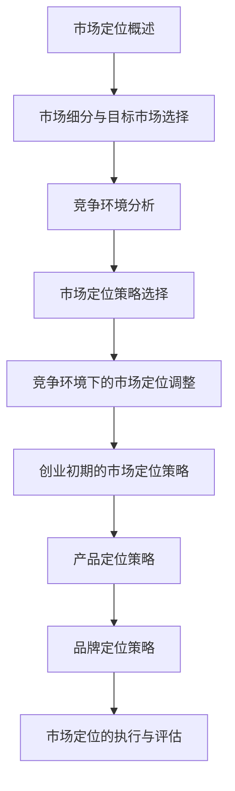
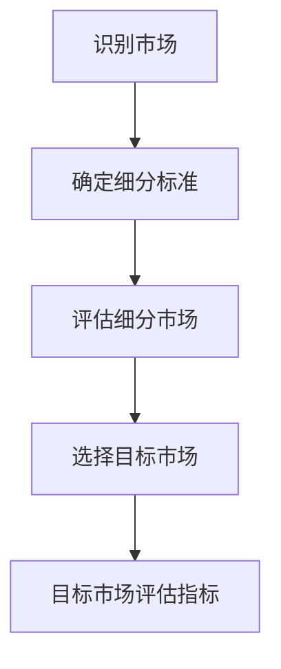
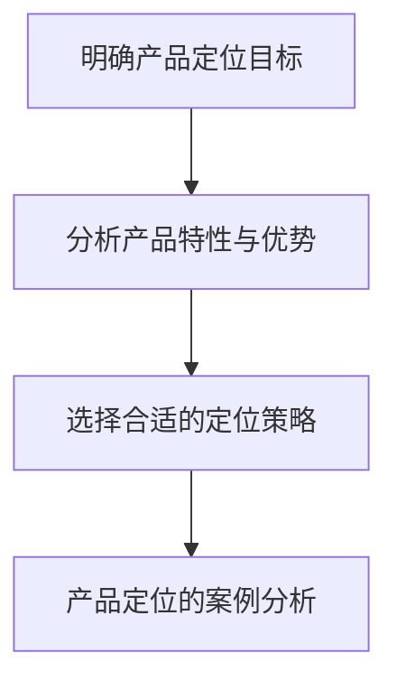
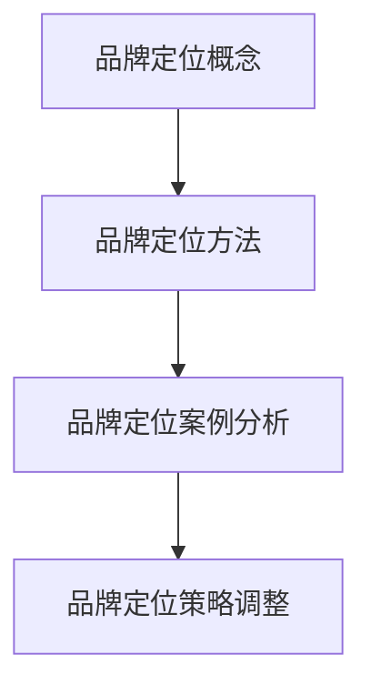
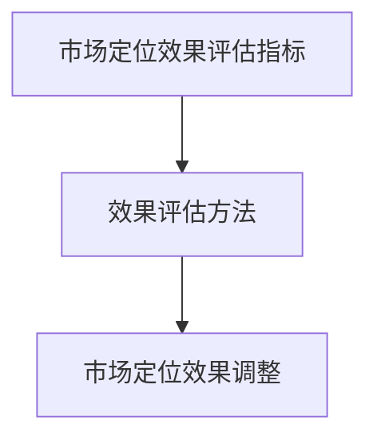

                 

### 文章标题

# 创业初期如何进行有效的市场定位

> 关键词：市场定位、创业初期、竞争环境、产品定位、品牌定位、市场研究、效果评估

> 摘要：本文将深入探讨创业初期如何进行有效的市场定位。我们将首先回顾市场定位的基础知识，包括其定义、重要性以及市场细分和目标市场选择的方法。随后，我们将分析竞争环境，讨论如何评估竞争对手和市场定位策略的选择。接着，文章将转向创业初期的市场定位策略，详细阐述市场研究的重要性、产品定位策略以及品牌定位策略。最后，我们将探讨市场定位的执行与评估策略，并提供成功和失败案例的深度分析。通过本文的阅读，创业者将获得一套全面的市场定位实战指南。

### 第一部分：市场定位基础知识

市场定位是企业在目标市场中创建独特的位置，以区别于其他竞争对手的过程。它不仅仅是一个营销策略，更是企业战略的核心部分。在创业初期，市场定位的正确性直接关系到企业的生存与发展。以下章节将详细介绍市场定位的基础知识。

#### 第1章：市场定位概述

##### 1.1 市场定位的定义与重要性

###### 1.1.1 市场定位的概念

市场定位是指企业根据市场需求和自身优势，确定其在目标市场中的位置，并采取相应的营销策略，以实现差异化竞争和品牌认知的过程。

###### 1.1.2 市场定位的意义

市场定位的意义在于：

1. **区分竞争对手**：明确企业在市场中的独特价值，以区别于其他竞争对手。
2. **满足特定需求**：帮助企业找到目标客户群体，并满足他们的特定需求。
3. **提高品牌认知**：通过市场定位，建立品牌形象和客户忠诚度。
4. **优化资源配置**：帮助企业集中资源，专注于最有利可图的市场细分。

##### 1.2 市场细分与目标市场选择

###### 1.2.1 市场细分的步骤

市场细分通常包括以下步骤：

1. **识别市场**：确定目标市场的总体规模和特征。
2. **确定细分标准**：如地理、人口统计、心理和行为因素。
3. **评估细分市场**：分析每个细分市场的规模、增长潜力、竞争程度等。
4. **选择目标市场**：根据企业的资源和能力，选择最有利可图的细分市场。

###### 1.2.2 如何选择目标市场

选择目标市场应考虑以下因素：

1. **市场需求**：目标市场是否存在未被满足的需求。
2. **盈利能力**：目标市场是否具有足够的盈利潜力。
3. **可进入性**：目标市场是否容易进入。
4. **竞争程度**：目标市场的竞争程度是否在企业的承受范围之内。

###### 1.2.3 目标市场的评估指标

评估目标市场时，可以参考以下指标：

1. **市场规模**：目标市场的总体大小。
2. **增长潜力**：目标市场的未来增长趋势。
3. **市场集中度**：市场中主要竞争者的市场份额分布。
4. **盈利能力**：目标市场的利润空间。
5. **竞争优势**：企业在目标市场中的独特优势。

#### 第2章：竞争环境分析

##### 2.1 竞争对手分析

###### 2.1.1 竞争对手的产品定位

分析竞争对手的产品定位，可以帮助企业了解市场现状和潜在机会。具体包括：

1. **产品特性**：竞争对手产品的主要特点和优势。
2. **价格策略**：竞争对手产品的定价策略和价格区间。
3. **目标客户**：竞争对手的目标客户群体和需求。

###### 2.1.2 竞争对手的市场份额

了解竞争对手的市场份额，有助于企业评估其在市场中的地位和影响力。具体包括：

1. **市场份额**：竞争对手在目标市场中的市场份额。
2. **市场分布**：竞争对手在不同区域的市场份额分布。
3. **增长趋势**：竞争对手市场份额的增长趋势。

###### 2.1.3 竞争对手的优势与劣势

分析竞争对手的优势与劣势，可以帮助企业发现自身的定位机会。具体包括：

1. **优势**：竞争对手在市场中的优势，如技术、品牌、渠道等。
2. **劣势**：竞争对手在市场中的劣势，如产品缺陷、市场份额不足等。

##### 2.2 市场定位策略选择

###### 2.2.1 差异化定位

差异化定位是指企业通过提供独特的产品或服务，在市场中创造与众不同的位置。具体策略包括：

1. **产品差异化**：通过技术创新、独特功能等，使产品在市场中具有独特性。
2. **服务差异化**：通过优质的客户服务、快速响应等，提升客户满意度。
3. **品牌差异化**：通过独特的品牌形象和品牌传播，建立品牌认知。

###### 2.2.2 利基市场定位

利基市场定位是指企业专注于特定细分市场，满足特定客户群体的需求。具体策略包括：

1. **目标客户聚焦**：选择特定的客户群体，深入了解其需求和偏好。
2. **产品专业化**：针对特定细分市场，提供专业化的产品或服务。
3. **渠道优化**：通过特定的渠道，更好地服务于目标市场。

###### 2.2.3 领先品牌定位

领先品牌定位是指企业通过建立强大的品牌影响力，在市场中占据领先地位。具体策略包括：

1. **品牌塑造**：通过品牌故事、品牌形象塑造，建立品牌认知。
2. **品牌传播**：通过广告、公关活动等，扩大品牌影响力。
3. **品牌忠诚度**：通过优质的客户体验，提高客户忠诚度。

##### 2.3 竞争环境下的市场定位调整

###### 2.3.1 竞争环境变化的影响

竞争环境的变化，如技术进步、市场需求变化、竞争对手动作等，都可能对市场定位产生影响。企业需要密切关注竞争环境的变化，及时调整市场定位。

###### 2.3.2 市场定位调整的策略

市场定位调整的策略包括：

1. **跟随策略**：根据竞争对手的市场定位，调整自身定位，以避免正面冲突。
2. **领先策略**：在竞争环境中，率先调整市场定位，以抢占市场先机。
3. **防御策略**：通过调整市场定位，保护现有市场份额，应对竞争对手的挑战。

### 第二部分：创业初期的市场定位策略

在创业初期，市场定位的重要性不言而喻。以下章节将详细介绍创业初期的市场定位策略，包括市场研究、产品定位和品牌定位。

#### 第3章：创业初期的市场研究

##### 3.1 市场研究的重要性

###### 3.1.1 市场研究的内容

市场研究主要包括以下几个方面：

1. **市场环境分析**：了解市场趋势、行业动态、政策法规等。
2. **竞争对手分析**：了解竞争对手的产品定位、市场份额、竞争优势等。
3. **目标客户分析**：了解目标客户的需求、行为、偏好等。
4. **市场机会分析**：发现市场中的潜在机会和需求。

###### 3.1.2 市场研究的工具与方法

市场研究常用的工具和方法包括：

1. **问卷调查**：通过设计问卷，收集目标客户的需求和行为数据。
2. **深度访谈**：通过与目标客户进行深度交流，了解其深层次需求。
3. **数据分析**：通过对市场数据进行分析，发现市场趋势和规律。
4. **竞争分析**：通过分析竞争对手的产品定位和营销策略，了解市场竞争态势。

##### 3.2 初创企业的市场调研

###### 3.2.1 初创企业的市场特点

初创企业的市场特点包括：

1. **资源有限**：初创企业通常面临着资金、人力、资源等方面的限制。
2. **竞争激烈**：初创企业通常进入的是一个竞争激烈的市场，需要快速获得市场份额。
3. **目标明确**：初创企业通常有明确的市场定位和目标客户，需要精准打击。

###### 3.2.2 初创企业的市场调研步骤

初创企业的市场调研步骤包括：

1. **确定调研目标**：明确市场调研的目标和需求。
2. **设计调研方案**：制定市场调研的计划和方法。
3. **实施调研**：通过问卷调查、深度访谈等方式，收集数据。
4. **分析数据**：对收集到的数据进行整理和分析，得出结论。
5. **撰写报告**：将调研结果撰写成报告，供企业决策参考。

###### 3.2.3 初创企业的市场调研报告撰写

初创企业的市场调研报告撰写包括：

1. **封面**：报告的封面应包含报告名称、撰写单位、报告日期等。
2. **目录**：报告的目录应包含各章节标题和页码。
3. **摘要**：报告的摘要应简要介绍市场调研的目标、方法和主要结论。
4. **正文**：报告的正文应详细描述市场调研的结果和分析，包括市场环境、竞争对手、目标客户等。
5. **结论与建议**：报告的结论与建议应基于市场调研的结果，提出相应的市场定位策略和建议。

#### 第4章：产品定位策略

##### 4.1 产品定位的步骤

###### 4.1.1 明确产品定位的目标

明确产品定位的目标，是产品定位的第一步。产品定位的目标通常包括：

1. **满足特定需求**：明确产品要满足的目标客户的需求。
2. **创造独特价值**：通过产品特性，创造与众不同的价值。
3. **区分竞争对手**：通过产品差异化，区别于竞争对手。

###### 4.1.2 分析产品特性与优势

分析产品特性与优势，是产品定位的关键。产品特性与优势包括：

1. **功能特性**：产品的功能特点，如独特的技术、创新的功能等。
2. **质量特性**：产品的质量标准，如材料、制造工艺等。
3. **服务特性**：产品的售后服务，如维修、培训等。

###### 4.1.3 选择合适的定位策略

选择合适的定位策略，是确保产品成功的关键。常见的定位策略包括：

1. **差异化定位**：通过独特的产品特性，区别于竞争对手。
2. **利基市场定位**：专注于特定细分市场，满足特定需求。
3. **领先品牌定位**：通过建立强大的品牌影响力，占据市场领先地位。

##### 4.2 产品定位的案例分析

###### 4.2.1 成功案例分享

成功的产品定位案例包括：

1. **苹果公司**：苹果公司通过差异化定位，创造独特价值，成为全球领先的科技企业。
2. **可口可乐**：可口可乐通过利基市场定位，专注于特定口味和消费群体，成为全球知名品牌。

###### 4.2.2 失败案例剖析

失败的产品定位案例包括：

1. **诺基亚**：诺基亚未能及时调整产品定位，导致在智能手机市场的失败。
2. **黑莓手机**：黑莓手机未能抓住移动互联网的趋势，导致市场份额大幅下滑。

##### 4.3 产品定位的策略调整

###### 4.3.1 根据市场变化调整定位

市场环境的变化，如技术进步、消费者需求变化等，可能需要企业调整产品定位。常见的调整策略包括：

1. **跟随策略**：根据竞争对手的定位，调整自身定位。
2. **领先策略**：在市场变化中，率先调整定位，抢占市场先机。
3. **防御策略**：通过调整定位，保护现有市场份额。

###### 4.3.2 根据产品迭代调整定位

随着产品迭代，企业可能需要调整产品定位。常见的调整策略包括：

1. **功能优化**：根据客户反馈，优化产品功能，提高用户体验。
2. **服务升级**：通过提升售后服务，增加客户满意度。
3. **品牌重塑**：通过品牌重塑，提升品牌形象和市场地位。

#### 第5章：品牌定位策略

##### 5.1 品牌定位的概念

###### 5.1.1 品牌定位的定义

品牌定位是指企业通过品牌传播和品牌管理，在消费者心中建立独特的品牌形象和认知的过程。

###### 5.1.2 品牌定位的重要性

品牌定位的重要性包括：

1. **建立品牌认知**：通过品牌定位，让消费者了解和记住品牌。
2. **提升品牌价值**：通过品牌定位，提升品牌在市场中的地位和价值。
3. **区分竞争对手**：通过品牌定位，区别于竞争对手，提高市场竞争力。

##### 5.2 品牌定位的方法

###### 5.2.1 品牌个性定位

品牌个性定位是指企业通过品牌形象和品牌传播，塑造独特的品牌个性，吸引目标客户。

1. **年轻时尚**：适合追求时尚、潮流的年轻人群。
2. **专业权威**：适合追求专业、权威的企业和专业人士。
3. **温馨亲切**：适合家庭消费市场和儿童产品。

###### 5.2.2 品牌功能定位

品牌功能定位是指企业通过产品特性和服务，明确品牌在消费者心中的功能价值。

1. **技术创新**：适合追求技术领先和高品质的产品。
2. **便捷高效**：适合追求快速、便捷服务的消费者。
3. **绿色环保**：适合追求环保、健康的产品。

###### 5.2.3 品牌情感定位

品牌情感定位是指企业通过品牌传播和客户互动，建立与消费者的情感联系。

1. **温馨关爱**：适合家庭消费市场和儿童产品。
2. **冒险探索**：适合追求刺激和挑战的年轻人。
3. **专业信赖**：适合追求专业和权威的企业和专业人士。

##### 5.3 品牌定位的案例分析

###### 5.3.1 成功案例分享

成功品牌定位案例包括：

1. **苹果公司**：苹果通过年轻时尚的品牌个性定位，成功吸引了全球年轻消费者。
2. **可口可乐**：可口可乐通过温馨关爱的品牌情感定位，成功建立了与消费者的情感联系。

###### 5.3.2 失败案例剖析

失败品牌定位案例包括：

1. **诺基亚**：诺基亚未能及时调整品牌定位，导致在智能手机市场的失败。
2. **宜家**：宜家曾试图通过高端品牌定位，提升品牌价值，但未能成功，反而损害了原有的品牌形象。

##### 5.4 品牌定位的策略调整

###### 5.4.1 根据市场竞争调整定位

市场竞争的变化可能需要企业调整品牌定位。常见的调整策略包括：

1. **跟随策略**：根据竞争对手的定位，调整自身品牌定位。
2. **领先策略**：在市场竞争中，率先调整品牌定位，抢占市场先机。
3. **防御策略**：通过调整品牌定位，保护现有市场份额。

###### 5.4.2 根据品牌发展阶段调整定位

品牌发展阶段的变化可能需要企业调整品牌定位。常见的调整策略包括：

1. **初创期**：通过独特的品牌个性，吸引目标客户。
2. **成长期**：通过品牌功能定位，提升品牌价值。
3. **成熟期**：通过品牌情感定位，建立与消费者的情感联系。

### 第三部分：市场定位的执行与评估

市场定位的执行与评估是确保市场定位策略有效实施和持续改进的关键。以下章节将详细介绍市场定位的执行策略、效果评估方法和效果调整策略。

#### 第6章：市场定位的执行策略

##### 6.1 市场定位的执行步骤

###### 6.1.1 制定执行计划

制定执行计划是市场定位实施的第一步。执行计划应包括以下内容：

1. **明确目标**：明确市场定位的目标和预期成果。
2. **制定策略**：制定实现市场定位的具体策略和措施。
3. **分配资源**：根据市场定位策略，合理分配人力、物力和财力资源。
4. **设定时间表**：明确市场定位实施的时间表和阶段性目标。

###### 6.1.2 确定执行团队

确定执行团队是确保市场定位策略有效实施的关键。执行团队应包括以下角色：

1. **项目经理**：负责整体项目的规划、组织和协调。
2. **市场分析师**：负责市场研究和分析，提供决策支持。
3. **产品经理**：负责产品定位和产品开发，确保产品符合市场定位。
4. **营销经理**：负责市场推广和品牌传播，提升品牌认知。

###### 6.1.3 设定执行标准

设定执行标准是确保市场定位策略有效实施的重要保障。执行标准应包括以下内容：

1. **质量标准**：确保产品和服务的质量达到市场定位的要求。
2. **效率标准**：确保市场定位策略的执行效率。
3. **成本标准**：确保市场定位策略的成本控制。
4. **进度标准**：确保市场定位策略的实施进度。

##### 6.2 市场定位的执行技巧

###### 6.2.1 营销策略的制定

营销策略的制定是市场定位执行的重要组成部分。营销策略应包括以下内容：

1. **定位传播**：通过广告、公关活动等方式，传播市场定位信息。
2. **产品推广**：通过线上线下渠道，推广产品或服务。
3. **渠道管理**：管理销售渠道，确保产品或服务的顺利流通。
4. **客户关系**：建立和维护良好的客户关系，提高客户满意度。

###### 6.2.2 传播策略的制定

传播策略的制定是市场定位执行的关键。传播策略应包括以下内容：

1. **媒体选择**：根据目标客户的特点，选择合适的媒体进行传播。
2. **内容策划**：策划有针对性的内容，提高传播效果。
3. **活动策划**：策划线上或线下活动，吸引目标客户参与。
4. **社交媒体**：利用社交媒体平台，扩大品牌影响力。

###### 6.2.3 客户关系的维护

客户关系的维护是市场定位执行的重要环节。客户关系维护应包括以下内容：

1. **售后服务**：提供优质的售后服务，解决客户问题。
2. **客户互动**：通过线上线下活动，与客户保持互动，了解客户需求。
3. **客户关怀**：通过节日问候、生日祝福等方式，表达对客户的关怀。
4. **客户反馈**：收集客户反馈，改进产品和服务，提升客户满意度。

#### 第7章：市场定位效果评估

##### 7.1 市场定位效果评估指标

市场定位效果评估指标是衡量市场定位实施效果的重要工具。常见的评估指标包括：

1. **市场份额**：企业在目标市场中的市场份额，反映市场定位的竞争力。
2. **品牌知名度**：品牌在目标市场中的知名度，反映市场定位的传播效果。
3. **客户满意度**：客户对产品或服务的满意度，反映市场定位的服务质量。
4. **销售增长率**：产品或服务的销售增长率，反映市场定位的市场拓展效果。

##### 7.2 市场定位效果评估方法

市场定位效果评估方法包括定量评估方法和定性评估方法。

###### 7.2.1 定量评估方法

定量评估方法主要包括以下几种：

1. **统计分析**：通过对市场数据进行分析，评估市场定位的效果。
2. **问卷调查**：通过设计问卷，收集目标客户对市场定位的评价。
3. **财务分析**：通过对企业财务数据的分析，评估市场定位的盈利能力。

###### 7.2.2 定性评估方法

定性评估方法主要包括以下几种：

1. **专家评审**：邀请专家对市场定位进行评估。
2. **客户访谈**：通过与目标客户进行深度交流，了解市场定位的实际效果。
3. **案例分析**：通过对成功或失败案例的分析，评估市场定位的策略是否有效。

##### 7.3 市场定位效果的调整

市场定位效果评估的结果可能需要企业对市场定位进行调整。市场定位调整的策略包括：

1. **根据评估结果调整策略**：根据市场定位效果评估的结果，对市场定位策略进行调整，以优化效果。
2. **根据市场变化调整定位**：根据市场环境的变化，及时调整市场定位，以适应市场变化。
3. **根据企业资源调整定位**：根据企业资源的实际情况，合理调整市场定位，确保资源的有效利用。

### 第8章：成功案例研究

#### 第8章：成功案例研究

##### 8.1 创业公司的市场定位成功案例

###### 8.1.1 案例介绍

案例1：小猪短租

小猪短租是一家专注于短租服务的创业公司，通过市场定位成功在竞争激烈的市场中脱颖而出。

- **市场定位**：小猪短租以“真实的家，住在当地人家里”为市场定位，专注于提供个性化、体验式的住宿服务。
- **成功因素**：小猪短租通过以下几点成功实现了市场定位：
  1. **差异化定位**：与其他平台相比，小猪短租注重住宿的体验和个性，满足用户对独特住宿体验的需求。
  2. **品牌塑造**：小猪短租通过积极的品牌传播，树立了“真实、个性、体验”的品牌形象。
  3. **用户互动**：小猪短租注重用户互动，通过社区建设和用户反馈，不断提升服务质量。

###### 8.1.2 成功因素分析

小猪短租的成功因素主要包括：

1. **精准市场定位**：小猪短租通过差异化定位，找到了自己的细分市场，满足了用户对独特住宿体验的需求。
2. **品牌塑造**：小猪短租通过品牌传播，建立了强大的品牌认知，提升了用户忠诚度。
3. **用户互动**：小猪短租通过用户互动，不断提升服务质量，赢得了用户的信任和好评。

###### 8.1.3 启示与借鉴

小猪短租的成功经验对创业公司具有启示意义：

1. **精准市场定位**：创业公司应找到自己的细分市场，满足特定用户群体的需求。
2. **品牌塑造**：创业公司应注重品牌塑造，建立强大的品牌认知。
3. **用户互动**：创业公司应积极与用户互动，提升服务质量，赢得用户信任。

##### 8.2 创业公司的市场定位失败案例

###### 8.2.1 案例介绍

案例2：某智能硬件创业公司

某智能硬件创业公司在市场定位上出现失误，导致产品在市场上未能获得预期的成功。

- **市场定位**：该创业公司试图通过“多功能、高科技”的市场定位，吸引广大消费者。
- **失败因素**：该创业公司的市场定位失败主要体现在以下几点：
  1. **定位模糊**：该创业公司的市场定位过于宽泛，未能明确区分目标市场和目标客户。
  2. **产品同质化**：市场上类似的产品众多，该创业公司的产品未能突出独特优势。
  3. **品牌认知度低**：创业公司缺乏品牌认知度，未能有效传递产品价值。

###### 8.2.2 失败原因分析

该智能硬件创业公司的失败原因主要包括：

1. **定位模糊**：创业公司未能明确区分目标市场和目标客户，导致市场定位模糊。
2. **产品同质化**：市场上类似的产品众多，该创业公司的产品未能突出独特优势，导致竞争力不足。
3. **品牌认知度低**：创业公司缺乏品牌认知度，未能有效传递产品价值，导致用户信任度低。

###### 8.2.3 启示与反思

该智能硬件创业公司的失败案例对创业公司具有深刻的启示：

1. **明确市场定位**：创业公司应明确市场定位，区分目标市场和目标客户，避免定位模糊。
2. **突出产品优势**：创业公司应注重产品创新，突出产品独特优势，提升市场竞争力。
3. **提升品牌认知**：创业公司应加强品牌传播，提升品牌认知度，赢得用户信任。

### 第9章：市场定位的未来趋势与策略建议

随着科技的进步和市场环境的变化，市场定位也在不断演进。以下章节将探讨市场定位的未来趋势，并提出相应的策略建议。

##### 9.1 市场定位的未来趋势

###### 9.1.1 数字化转型的趋势

数字化转型是市场定位的未来趋势之一。随着互联网、大数据、人工智能等技术的广泛应用，企业可以通过数字化手段更精确地进行市场定位和营销。具体趋势包括：

1. **数据驱动**：企业通过大数据分析，深入了解目标客户的需求和行为，实现更精准的市场定位。
2. **个性化定制**：基于客户的个性化需求，提供定制化的产品和服务，提升客户满意度。
3. **线上线下融合**：通过线上线下渠道的整合，实现全渠道营销，提升品牌影响力。

###### 9.1.2 个性化定制的趋势

个性化定制是市场定位的另一个重要趋势。随着消费者需求的多样化和个性化，企业需要提供更加个性化的产品和服务。具体趋势包括：

1. **定制化产品**：企业根据客户需求，提供定制化的产品，满足消费者的个性化需求。
2. **服务个性化**：企业提供个性化的服务，提升客户体验和满意度。
3. **品牌个性化**：企业通过个性化的品牌形象和品牌传播，建立独特的品牌认知。

##### 9.2 数字化市场定位策略

在数字化时代，企业可以采取以下策略进行市场定位：

1. **数据收集与分析**：通过数字化手段收集客户数据，进行分析，了解客户需求和行为。
2. **精准营销**：基于数据分析结果，进行精准营销，提高营销效果。
3. **个性化服务**：根据客户需求，提供个性化的产品和服务，提升客户满意度。
4. **品牌数字化**：通过数字化手段，提升品牌形象和品牌影响力。

##### 9.3 个性化定制市场定位策略

在个性化定制时代，企业可以采取以下策略进行市场定位：

1. **需求分析**：通过市场调研和数据分析，了解消费者的个性化需求。
2. **产品定制**：提供定制化的产品，满足消费者的个性化需求。
3. **服务优化**：提供个性化的服务，提升客户体验和满意度。
4. **品牌差异化**：通过个性化的品牌形象和品牌传播，建立独特的品牌认知。

### 结束语

市场定位是创业成功的关键之一。通过精准的市场定位，企业可以找到自己的细分市场，满足特定客户群体的需求，提升品牌认知和市场份额。本文从市场定位的基础知识、创业初期的市场定位策略、市场定位的执行与评估等方面，全面探讨了市场定位的策略和方法。同时，通过成功和失败案例的深度分析，为创业公司提供了实用的市场定位实战指南。在未来的市场竞争中，企业应紧跟数字化和个性化定制的趋势，不断优化市场定位策略，以实现持续发展和成功。作者：AI天才研究院/AI Genius Institute & 禅与计算机程序设计艺术 /Zen And The Art of Computer Programming。 

### 附录

#### 附录1：市场定位流程图

以下是市场定位的流程图，展示了市场定位的主要步骤和关键环节：

#### 附录2：市场细分与目标市场选择流程图

以下是市场细分与目标市场选择的流程图，展示了市场细分的主要步骤和关键环节：

#### 附录3：产品定位策略流程图

以下是产品定位策略的流程图，展示了产品定位的主要步骤和关键环节：

#### 附录4：品牌定位策略流程图

以下是品牌定位策略的流程图，展示了品牌定位的主要步骤和关键环节：

#### 附录5：市场定位效果评估流程图

以下是市场定位效果评估的流程图，展示了效果评估的主要步骤和关键环节：

### 拓展阅读

1. **《市场营销管理》** - 菲利普·科特勒，介绍了市场细分、目标市场选择和市场定位的基本理论。
2. **《定位》** - 艾·里斯和杰克·特劳特，详细阐述了品牌定位的策略和方法。
3. **《数字化营销》** - 戴维·爱格斯和拉里·雷丁，探讨了数字化转型对市场定位的影响。
4. **《精益创业》** - 埃里克·莱斯，提供了创业初期的实用指南，包括市场定位和产品开发。
5. **《消费者行为学》** - 布鲁斯·亨德森，分析了消费者行为对市场定位的影响。

### 注意事项

- **文章内容要符合客观事实**：文章中的数据、案例和理论都要基于客观事实和权威资料，确保内容的准确性。
- **结构清晰，逻辑性强**：文章应具备清晰的结构，各章节之间逻辑紧密，确保读者能够顺畅阅读。
- **图表与文字相结合**：在适当的地方使用图表、流程图和表格，帮助读者更好地理解和掌握文章内容。
- **遵循学术规范**：引用他人的观点和研究成果时，要遵循学术规范，注明出处。

### 结语

市场定位是创业成功的关键，有效的市场定位能够帮助企业在激烈的市场竞争中脱颖而出。本文通过深入分析市场定位的基础知识、创业初期的市场定位策略以及市场定位的执行与评估方法，为创业公司提供了实用的市场定位指南。希望本文能帮助创业者更好地理解市场定位的重要性，并在实际操作中取得成功。作者：AI天才研究院/AI Genius Institute & 禅与计算机程序设计艺术 /Zen And The Art of Computer Programming。

