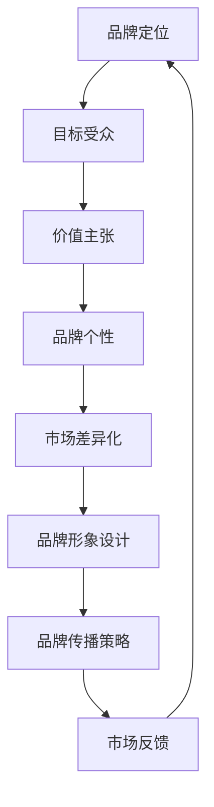
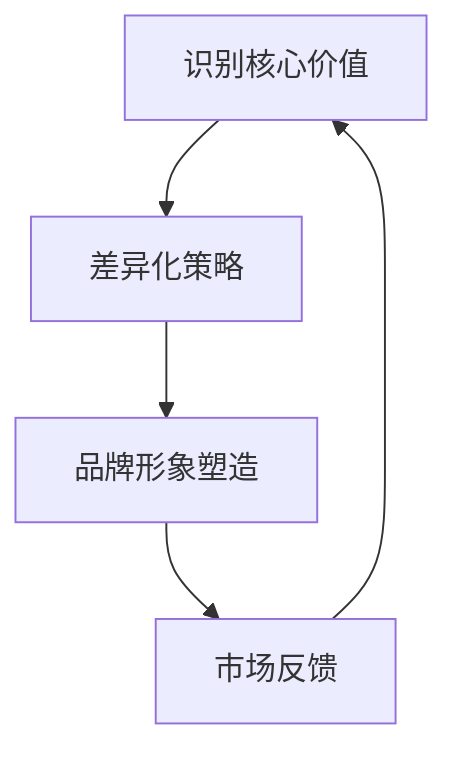
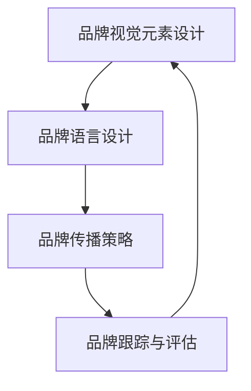
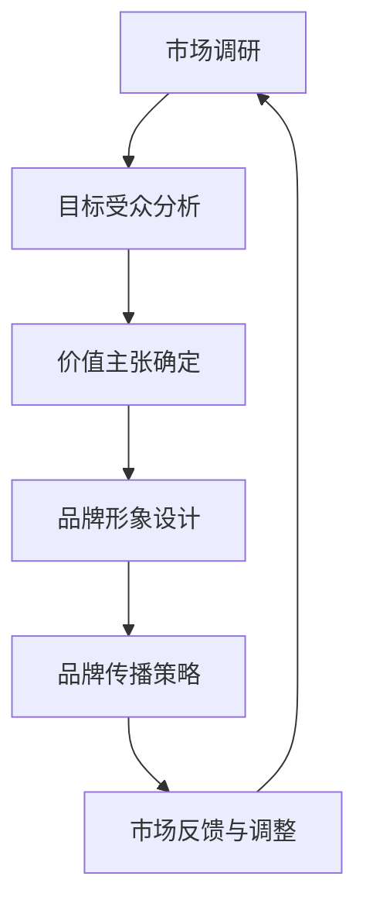
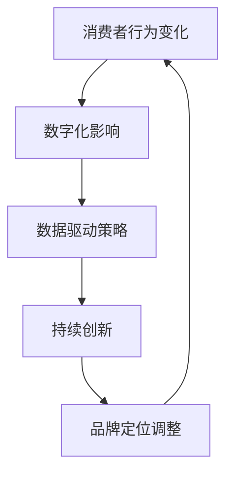
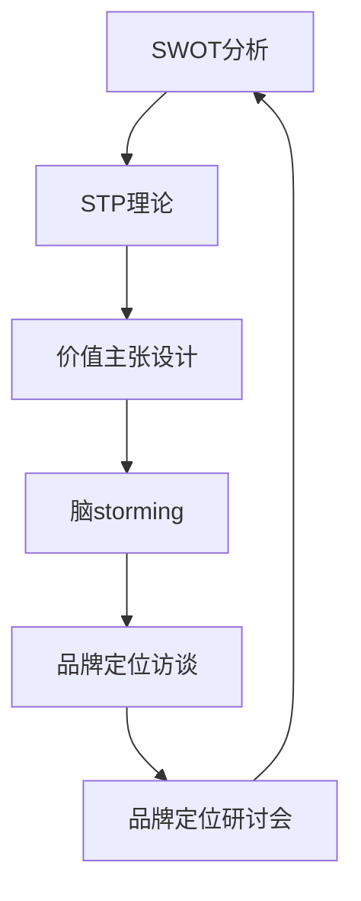

                 

### 第1章：品牌定位的概念与重要性

#### 1.1 品牌定位的定义与核心要素

- **品牌定位的定义**
  品牌定位是指企业在市场中为产品或品牌确定一个清晰、独特且具有吸引力的位置，以便在消费者心中树立独特形象并区别于竞争对手。

- **品牌定位的核心要素**
  - **目标受众**：明确品牌的目标客户群体，理解他们的需求、期望和偏好。
  - **独特价值**：确定品牌独特的价值主张，即品牌能够提供什么独特的东西，使其与众不同。
  - **品牌个性**：塑造品牌独特的个性和形象，以吸引目标受众的情感认同。
  - **市场差异化**：确保品牌在市场中具备独特性，有别于竞争对手。

#### 1.2 市场竞争分析

- **市场竞争的挑战**
  在竞争激烈的市场环境中，品牌需要面对多种挑战，包括：
  - **产品同质化**：市场上存在大量的相似产品，消费者难以区分。
  - **价格战**：竞争对手通过降低价格来争夺市场份额。
  - **信息过载**：消费者接收到的信息过多，难以作出购买决策。

#### 1.3 品牌定位的优先级

- **品牌定位在创业初期的重要性**
  对于初创企业来说，品牌定位至关重要，它直接关系到企业的市场接受度和长期发展。以下为品牌定位的优先级分析：
  - **明确目标受众**：了解目标消费者的需求，是品牌定位的基础。
  - **构建独特价值**：通过提供独特的价值，使品牌在竞争激烈的市场中脱颖而出。
  - **塑造品牌个性**：品牌个性有助于建立消费者情感联系，增加品牌忠诚度。
  - **实施差异化策略**：差异化策略有助于品牌在市场中获得竞争优势。

#### 1.4 品牌定位的步骤与方法

- **品牌定位的具体步骤**
  - **市场调研**：了解市场和竞争对手的情况，收集潜在客户的数据。
  - **目标受众分析**：根据市场调研结果，明确目标受众的特征和需求。
  - **价值主张确定**：确定品牌的核心价值，即品牌能够为消费者提供的独特利益。
  - **品牌形象设计**：设计品牌视觉元素和品牌语言，以传达品牌价值主张。
  - **品牌传播策略**：制定品牌传播策略，确保品牌信息有效传达给目标受众。

- **品牌定位的方法**
  - **SWOT分析**：通过分析品牌的优势、劣势、机会和威胁，确定品牌定位策略。
  - **STP理论**：将市场进行细分（Segmentation）、目标市场选择（Targeting）和市场定位（Positioning），以确定品牌定位。
  - **价值主张设计**：通过构建价值主张，明确品牌的核心竞争力和差异化优势。

#### 1.5 品牌定位案例分析

- **成功案例**：某互联网初创公司通过明确目标受众，构建独特的价值主张，塑造品牌个性和实施差异化策略，成功在竞争激烈的市场中脱颖而出。
- **失败案例**：某传统制造业品牌在转型过程中，未能准确识别目标受众和独特价值，导致品牌定位模糊，市场反响不佳。

通过上述分析和案例，我们可以看出品牌定位对于创业初期的企业至关重要。准确的品牌定位有助于企业在竞争激烈的市场中突出重围，赢得消费者的认可和忠诚。在接下来的章节中，我们将进一步探讨品牌定位的策略和实施方法。

---

**作者：AI天才研究院/AI Genius Institute & 禅与计算机程序设计艺术 /Zen And The Art of Computer Programming**

**Mermaid 流程图：**


**核心概念与联系：**
品牌定位的过程可以视为一个闭环系统，其中每个环节相互关联，共同构成品牌战略的核心。目标受众分析为价值主张提供依据，而价值主张则指导品牌形象的设计。品牌个性有助于增强品牌形象，市场差异化确保品牌在竞争中脱颖而出。最终，品牌传播策略将品牌形象传递给目标受众，市场反馈则用于不断调整和优化品牌定位。

---

**核心算法原理讲解：**
品牌定位的核心算法可以视为一种多目标优化问题，其目标是在市场中找到最优的品牌定位策略。以下是品牌定位算法的伪代码：

```plaintext
function 品牌定位(市场数据, 目标受众特征):
    初始化品牌定位参数
    for 每个潜在品牌定位:
        计算目标受众满意度
        计算市场差异化程度
        计算品牌个性吸引力
        更新品牌定位参数
    end for
    返回最优品牌定位参数
end function
```

**数学模型和公式：**
品牌定位的数学模型可以采用综合评价法，其中品牌定位得分可以用以下公式表示：

$$
得分 = w_1 \times 满意度 + w_2 \times 差异化程度 + w_3 \times 个性吸引力
$$

其中，$w_1$、$w_2$ 和 $w_3$ 分别是满意度、差异化程度和个性吸引力的权重。

**详细讲解与举例说明：**
以一家初创的智能家居公司为例，该公司希望通过品牌定位在竞争激烈的市场中脱颖而出。首先，公司进行市场调研，了解目标受众的需求和偏好。通过分析调研数据，公司确定了目标受众为注重智能家居安全和便捷的年轻家庭。

接下来，公司明确了品牌的核心价值主张：提供安全、便捷的智能家居解决方案。为了塑造品牌个性，公司决定采用温馨、亲切的品牌语言和视觉设计，以增强消费者的情感认同。

公司还通过市场差异化策略，强调了其产品在安全性和用户体验方面的独特优势。在品牌传播策略上，公司选择了社交媒体和内容营销作为主要渠道，以加强与消费者的互动和沟通。

通过上述步骤，公司成功地在市场中建立了独特的品牌定位，赢得了消费者的认可和忠诚。公司定期收集市场反馈，不断优化品牌定位，以适应市场变化。

---

**数学公式：**
$$
得分 = w_1 \times 满意度 + w_2 \times 差异化程度 + w_3 \times 个性吸引力
$$

**注意事项：**
- 品牌定位需要综合考虑多个因素，包括目标受众、市场环境、竞争状况等。
- 品牌定位不是一成不变的，需要根据市场反馈和消费者需求进行调整。
- 在品牌定位过程中，应避免盲目追求独特性而忽视目标受众的实际需求。

**拓展阅读：**
- 《定位：有史以来对美国营销影响最大的观念》（Al Ries, Jack Trout）
- 《蓝海战略》（W. Chan Kim, Renée Mauborgne）
- 《品牌力：打造强势品牌的五大关键步骤》（Drew Boyd, Jon Fabre）### 第2章：品牌核心价值与差异化

#### 2.1 品牌核心价值的识别

- **品牌核心价值的定义**
  品牌核心价值是指品牌能够为消费者提供的独特利益和价值，它是品牌定位的核心，决定了品牌在消费者心中的地位。

- **识别品牌核心价值的步骤**
  1. **市场调研**：收集市场数据，包括目标受众的需求、偏好和痛点。
  2. **内部讨论**：组织内部团队进行头脑风暴，讨论品牌优势、独特性以及潜在的价值主张。
  3. **消费者访谈**：与目标受众进行面对面访谈，深入了解他们的需求和期望。
  4. **竞争分析**：分析竞争对手的价值主张，找出自身的差异化和竞争优势。
  5. **价值排序**：根据调研结果，将潜在的价值主张进行排序，确定最核心的价值。

- **核心价值的重要性**
  品牌核心价值不仅是品牌定位的基础，也是品牌竞争力的体现。它能够帮助品牌在消费者心中建立独特且可信的形象，提高品牌忠诚度和市场份额。

#### 2.2 品牌差异化策略

- **差异化的概念与类型**
  差异化是指品牌在产品、服务、体验等方面与其他竞争对手的区别和独特性。根据不同的维度，差异化可以分为以下几种类型：
  1. **产品差异化**：通过提供独特的产品特性或功能来区别于竞争对手。
  2. **服务差异化**：通过提供优质的服务体验来赢得消费者。
  3. **体验差异化**：通过独特的购物体验或使用体验来吸引消费者。
  4. **市场差异化**：针对特定的市场细分群体提供专门的产品或服务。

- **差异化策略的实施**
  1. **确定差异化维度**：分析市场环境和竞争对手，确定品牌可以差异化的关键维度。
  2. **实施差异化措施**：在产品、服务、体验等方面进行实际操作，确保差异化的实施。
  3. **沟通差异化价值**：通过营销传播手段，将品牌的差异化价值传达给消费者。

- **差异化与品牌形象的塑造**
  差异化策略有助于塑造品牌形象，使其在消费者心中具有独特性和信任感。一个成功的差异化策略不仅能够让品牌在竞争中脱颖而出，还能够建立品牌忠诚度和口碑。

#### 2.3 品牌定位的案例研究

- **成功的创业品牌案例**
  以某智能家居初创公司为例，该公司通过识别品牌核心价值——安全、便捷的智能家居解决方案，并实施差异化策略，成功在市场中脱颖而出。公司通过先进的技术和人性化的设计，提供独特的智能家居产品，赢得了消费者的青睐。

- **失败的品牌定位案例**
  另一例是某时尚品牌，在市场调研中未能准确识别目标受众的需求，错误地认为追求时尚和奢华是品牌的核心价值。然而，这并未吸引到目标消费者，导致品牌定位模糊，市场反响不佳。

- **案例分析与启示**
  成功的品牌定位需要基于深入的市场调研和目标受众分析，确保品牌核心价值的识别准确无误。同时，差异化策略的实施需要与品牌核心价值保持一致，以确保品牌形象的一致性和可信度。而失败的品牌定位往往源于对市场环境和目标受众理解不足，导致品牌策略的失误。

通过上述案例研究，我们可以看到品牌核心价值和差异化策略在品牌定位中的重要性。准确的品牌定位能够帮助企业在竞争激烈的市场中赢得一席之地，实现长期发展。

---

**作者：AI天才研究院/AI Genius Institute & 禅与计算机程序设计艺术 /Zen And The Art of Computer Programming**

**Mermaid 流程图：**


**核心概念与联系：**
品牌核心价值的识别是品牌定位的基础，它决定了品牌在市场中的独特性和竞争力。差异化策略则通过在产品、服务、体验等方面的独特性来巩固品牌定位。品牌形象塑造是将核心价值和差异化策略转化为消费者认知的过程，市场反馈则用于不断优化品牌定位，确保其与市场需求保持一致。

---

**核心算法原理讲解：**
品牌差异化策略的实施可以视为一种多维度优化问题，其目标是在市场中找到品牌的独特定位。以下是品牌差异化策略算法的伪代码：

```plaintext
function 品牌差异化(市场数据, 竞争对手数据, 目标受众特征):
    初始化品牌差异化参数
    for 每个差异化维度:
        计算差异化指标
        更新品牌差异化参数
    end for
    返回最优品牌差异化参数
end function
```

**数学模型和公式：**
品牌差异化指标可以采用综合评价法，其中品牌差异化得分可以用以下公式表示：

$$
得分 = w_1 \times 产品差异化 + w_2 \times 服务差异化 + w_3 \times 体验差异化
$$

其中，$w_1$、$w_2$ 和 $w_3$ 分别是产品差异化、服务差异化和体验差异化的权重。

**详细讲解与举例说明：**
以一家电动车制造商为例，该公司希望通过差异化策略在竞争激烈的市场中脱颖而出。首先，公司进行了市场调研，分析了目标受众的需求和竞争对手的产品特性。通过调研，公司确定了以下差异化维度：

1. **产品差异化**：提供更长的续航里程和更安静的驾驶体验。
2. **服务差异化**：提供免费的充电服务和更快速的维修响应。
3. **体验差异化**：提供个性化的购车方案和更多的增值服务。

公司通过计算每个差异化维度的指标，确定了最佳的品牌差异化策略。最终，公司成功地在市场中建立了独特的品牌定位，赢得了消费者的青睐。

---

**数学公式：**
$$
得分 = w_1 \times 产品差异化 + w_2 \times 服务差异化 + w_3 \times 体验差异化
$$

**注意事项：**
- 品牌差异化策略需要与品牌核心价值保持一致，以确保品牌形象的一致性。
- 在实施差异化策略时，应避免过度差异化，以免导致成本过高和消费者困惑。
- 定期收集市场反馈，以不断优化品牌差异化策略。

**拓展阅读：**
- 《差异化营销》（Peter Drucker）
- 《蓝海战略》（W. Chan Kim, Renée Mauborgne）
- 《品牌战略管理》（Kevin Lane Keller）### 第3章：品牌形象设计与传播

#### 3.1 品牌形象设计

- **品牌视觉元素设计**
  品牌视觉元素是品牌形象设计的重要组成部分，包括标志、色彩、字体等。一个优秀的品牌视觉设计能够传达品牌的核心理念和价值，提高品牌的辨识度和认知度。
  - **标志设计**：标志是品牌形象的核心，需要简洁、易于记忆且具有辨识度。设计过程中应考虑标志的延展性和多样性，以适应不同场景的应用。
  - **色彩设计**：色彩能够传递情感和信息，选择合适的色彩方案有助于增强品牌的视觉效果。例如，蓝色通常传达信任和稳定，红色则传递热情和活力。
  - **字体设计**：字体是品牌语言的重要组成部分，选择合适的字体有助于传达品牌个性。品牌字体需要与品牌定位和视觉元素相协调，确保一致性。

- **品牌语言设计**
  品牌语言是品牌与消费者沟通的方式，包括口号、标语、文案等。一个有吸引力的品牌语言能够增强品牌形象，提高消费者的认同感。
  - **口号和标语**：简洁有力的口号和标语能够迅速传达品牌的核心价值和独特卖点，增强品牌的记忆度。例如，苹果公司的“Think Different”口号，传达了其创新和个性化的品牌理念。
  - **文案**：品牌文案需要具有一致性和个性，通过有针对性的内容传达品牌的价值主张和情感。文案应简洁明了，避免冗长和复杂的表达。

- **品牌个性与情感设计**
  品牌个性是指品牌所表现出的性格特点，它有助于建立品牌与消费者之间的情感联系。一个有吸引力的品牌个性能够增加品牌的吸引力，提高品牌忠诚度。
  - **品牌性格**：品牌性格可以通过品牌视觉和语言设计来表现，例如，可口可乐的品牌性格是年轻、活力和快乐。
  - **情感设计**：情感设计旨在通过品牌体验和营销活动来激发消费者的情感共鸣。例如，通过情感化的广告和营销活动，使消费者感受到品牌的温暖和关怀。

#### 3.2 品牌传播策略

- **品牌传播的渠道选择**
  有效的品牌传播策略需要选择合适的传播渠道，以确保品牌信息能够有效传递给目标受众。以下是一些常见的品牌传播渠道：
  - **社交媒体**：社交媒体平台如Facebook、Instagram、微博等是品牌传播的重要渠道，能够实现与消费者的互动和实时沟通。
  - **内容营销**：通过博客、视频、电子书等高质量内容，传递品牌的核心价值和理念，提高品牌的权威性和专业性。
  - **公关活动**：通过新闻发布会、媒体采访、品牌活动等公关手段，提高品牌的知名度和影响力。
  - **广告投放**：通过电视广告、网络广告、户外广告等广告形式，实现品牌的大范围传播。

- **内容营销策略**
  内容营销是通过创造和分享有价值的内容，吸引潜在客户，建立品牌信任和忠诚度的策略。以下是一些有效的内容营销策略：
  - **博客文章**：定期发布高质量的博客文章，分享行业见解、实用技巧和专业知识，提高品牌的权威性和专业性。
  - **视频内容**：制作有趣、有教育意义的视频内容，如教程、产品演示、品牌故事等，提高品牌的吸引力。
  - **电子书和白皮书**：提供深度内容，如行业报告、解决方案手册等，吸引潜在客户并建立专业形象。

- **社交媒体营销与用户互动**
  社交媒体营销是一种通过与用户互动来增强品牌认知度和忠诚度的策略。以下是一些有效的社交媒体营销技巧：
  - **建立社交媒体社区**：通过建立品牌社交媒体账号，与用户建立互动和沟通，增加品牌的影响力和用户参与度。
  - **社交媒体广告**：利用社交媒体平台上的广告功能，精准定位目标受众，提高广告的投放效果。
  - **用户生成内容**：鼓励用户分享品牌体验和感受，通过用户生成内容来增强品牌的可信度和影响力。

#### 3.3 品牌定位的跟踪与评估

- **品牌跟踪的方法**
  品牌跟踪是通过持续监测品牌在市场中的表现，了解品牌定位的效果。以下是一些常用的品牌跟踪方法：
  - **市场调研**：通过定期的市场调研，了解消费者的品牌认知、品牌偏好和购买行为。
  - **社交媒体监测**：利用社交媒体监测工具，跟踪品牌在社交媒体平台上的讨论和反馈，了解消费者的态度和情感。
  - **搜索引擎分析**：通过搜索引擎分析工具，监测品牌在搜索引擎中的排名和搜索量，了解品牌在市场中的影响力。

- **品牌评估的指标**
  品牌评估是通过一系列指标来衡量品牌的表现和效果。以下是一些常用的品牌评估指标：
  - **品牌知名度**：通过调查问卷、社交媒体监测等方式，了解品牌在目标受众中的知名度。
  - **品牌偏好**：通过调查问卷、购买行为分析等方式，了解消费者对品牌的偏好和忠诚度。
  - **市场份额**：通过销售数据和市场份额分析，了解品牌在市场中的地位和竞争力。

- **调整品牌定位的策略**
  根据品牌跟踪和评估的结果，品牌需要适时调整品牌定位策略，以适应市场变化和消费者需求。以下是一些调整策略的方法：
  - **市场调研**：通过深入的市场调研，了解目标受众的最新需求和偏好，为品牌定位的调整提供依据。
  - **竞争对手分析**：分析竞争对手的品牌定位和策略，寻找市场机会和差异化点。
  - **消费者反馈**：重视消费者的反馈和意见，及时调整品牌定位和传播策略，提高品牌满意度。

通过上述品牌形象设计和传播策略，以及品牌定位的跟踪与评估，企业可以不断优化品牌定位，提高品牌在市场中的竞争力和影响力。

---

**作者：AI天才研究院/AI Genius Institute & 禅与计算机程序设计艺术 /Zen And The Art of Computer Programming**

**Mermaid 流程图：**


**核心概念与联系：**
品牌形象设计是品牌传播的基础，通过视觉和语言设计传达品牌的核心价值和个性。品牌传播策略则通过选择合适的渠道和内容，将品牌形象传递给目标受众。品牌跟踪与评估则用于监测品牌的表现和效果，为品牌定位的调整提供依据。

---

**核心算法原理讲解：**
品牌形象设计的核心算法可以视为一种多维度优化问题，其目标是在品牌视觉、语言和传播策略中找到最佳平衡点。以下是品牌形象设计算法的伪代码：

```plaintext
function 品牌形象设计(品牌核心价值, 目标受众特征):
    初始化品牌形象参数
    for 每个设计维度:
        计算视觉吸引力
        计算语言表达力
        计算传播效果
        更新品牌形象参数
    end for
    返回最优品牌形象参数
end function
```

**数学模型和公式：**
品牌形象得分可以用以下公式表示：

$$
得分 = w_1 \times 视觉吸引力 + w_2 \times 语言表达力 + w_3 \times 传播效果
$$

其中，$w_1$、$w_2$ 和 $w_3$ 分别是视觉吸引力、语言表达力和传播效果的权重。

**详细讲解与举例说明：**
以一家健康食品公司为例，该公司希望通过品牌形象设计来提升品牌知名度和市场竞争力。首先，公司明确了品牌核心价值——健康、天然和美味。根据这些核心价值，公司设计了品牌视觉元素，包括一个简洁明了的标志和自然色彩的搭配。

在品牌语言设计方面，公司选择了简洁、直接且具有感染力的文案，强调产品的健康理念和美味口感。品牌传播策略上，公司选择了社交媒体和内容营销，通过发布健康食谱、营养知识等内容，与目标受众建立情感联系。

通过计算视觉吸引力、语言表达力和传播效果的指标，公司确定了最佳的品牌形象设计参数。最终，公司的品牌形象得到了显著提升，市场竞争力也大大增强。

---

**数学公式：**
$$
得分 = w_1 \times 视觉吸引力 + w_2 \times 语言表达力 + w_3 \times 传播效果
$$

**注意事项：**
- 品牌形象设计需要与品牌核心价值保持一致，以确保品牌形象的一致性和可信度。
- 在品牌传播策略中，应选择适合目标受众的渠道和内容，以提高传播效果。
- 定期收集品牌跟踪和评估数据，以不断优化品牌形象设计。

**拓展阅读：**
- 《品牌设计原则》（Alina Wheeler）
- 《内容营销实战手册》（Joe Pulizzi）
- 《社交媒体营销》（Dave Kerpen）### 第4章：实战案例解析

#### 4.1 案例一：某互联网初创公司品牌定位

- **案例背景**
  某互联网初创公司致力于开发一款创新的社交媒体应用，旨在帮助用户更好地管理个人时间和提高工作效率。该公司在创业初期面临着激烈的竞争和有限的市场资源。

- **品牌定位的过程**
  1. **市场调研**：公司进行了广泛的市场调研，分析了目标受众的需求、偏好和痛点。调研结果显示，大多数用户希望有一个简单、直观且功能强大的工具来管理时间和任务。
  2. **目标受众分析**：基于调研结果，公司明确了目标受众为年轻的职场人士和自由职业者。这些用户重视效率、喜欢创新，且对科技产品有一定的认知和接受度。
  3. **价值主张确定**：公司决定将“简单、高效、创新”作为品牌的核心价值主张。这一价值主张能够满足目标受众的需求，同时与公司的产品特点相契合。
  4. **品牌形象设计**：公司设计了简洁、现代的品牌视觉元素，包括一个易于识别的标志和符合品牌定位的配色方案。品牌语言方面，公司采用了简洁、直接且富有感染力的文案，强调产品的实用性和创新性。
  5. **品牌传播策略**：公司选择了社交媒体和内容营销作为主要传播渠道。通过发布高质量的博客文章、教程视频和用户案例，公司在目标受众中建立了良好的品牌形象。

- **成功因素分析**
  1. **明确的目标受众**：公司通过深入的市场调研和目标受众分析，准确识别了目标受众的需求和痛点，为品牌定位提供了坚实的基础。
  2. **核心价值主张**：公司明确了简单、高效、创新的核心价值主张，与目标受众的需求和产品特点高度契合，有助于建立品牌形象。
  3. **有效的品牌传播策略**：公司选择了适合目标受众的传播渠道和内容形式，通过高质量的博客文章、教程视频和用户案例，成功地将品牌价值主张传递给了目标受众。

#### 4.2 案例二：某传统制造业品牌转型

- **案例背景**
  某传统制造业品牌在市场竞争激烈的环境下，决定进行品牌转型，以适应市场的变化和消费者需求。

- **品牌定位的挑战**
  1. **市场环境变化**：随着消费者需求的多样化和竞争的加剧，传统制造业品牌面临着巨大的挑战。原有的品牌定位和产品线已经无法满足现代消费者的需求。
  2. **品牌形象陈旧**：品牌形象和传播策略较为陈旧，与年轻消费者的偏好不符。
  3. **产品创新不足**：产品创新不足，难以在市场上脱颖而出。

- **品牌定位的策略与实施**
  1. **市场调研与目标受众分析**：公司进行了深入的市场调研，分析了目标受众的需求和偏好。调研结果显示，年轻消费者更注重产品的个性化、品质和用户体验。
  2. **品牌定位重塑**：公司决定将品牌定位从传统的制造业转向提供高品质、个性化定制的产品和服务。品牌核心价值从“稳定、可靠”转变为“创新、个性、高品质”。
  3. **品牌形象设计更新**：公司重新设计了品牌视觉元素和品牌语言，采用了现代、时尚的设计风格，以吸引年轻消费者。品牌口号也从“可靠伙伴”变为“个性化定制，引领潮流”。
  4. **产品创新与多元化**：公司加大了产品研发投入，推出了一系列个性化、高品质的新产品，满足年轻消费者的需求。

- **市场反应与效果评估**
  品牌转型后，公司迅速在市场上获得了积极的反馈。品牌知名度显著提升，市场份额也有所增加。消费者对品牌的新定位和新产品表现出高度认可，品牌忠诚度也得到了提高。公司通过定期的市场调研和用户反馈，持续优化品牌定位和产品策略，以适应市场变化。

#### 4.3 案例三：国际品牌在中国市场的定位

- **案例背景**
  一家国际知名品牌决定进入中国市场，面临着文化差异、消费者行为和市场竞争等多方面的挑战。

- **定位策略与策略调整**
  1. **市场调研与文化分析**：品牌进行了详细的市场调研和文化分析，了解了中国消费者的文化背景、消费习惯和偏好。调研结果显示，中国消费者更注重品牌形象、品质和价格。
  2. **品牌定位**：品牌决定将“高端、品质、奢华”作为品牌在中国市场的定位。这一定位符合中国消费者的需求，有助于提升品牌在市场上的竞争力。
  3. **文化适应性调整**：品牌在产品设计和营销策略上进行了文化适应性调整，例如，推出符合中国消费者喜好的新产品，采用更具本土特色的营销手段。
  4. **本地化策略**：品牌与中国合作伙伴紧密合作，利用本地资源进行市场推广和渠道建设，提高品牌在中国的市场渗透率。

- **市场反应与效果评估**
  品牌进入中国市场后，迅速获得了消费者的关注和认可。品牌知名度显著提升，市场份额稳步增长。然而，品牌也面临了一些挑战，例如，市场竞争激烈、消费者需求多样化等。品牌通过不断调整和优化定位策略，保持了市场竞争力。公司定期收集市场反馈，及时调整产品策略和营销策略，以适应市场变化。

通过上述实战案例的解析，我们可以看到品牌定位在不同市场和情境下的重要性。准确的品牌定位不仅有助于企业在市场中脱颖而出，还能够提升品牌价值和市场份额。企业在进行品牌定位时，需要充分考虑市场环境、消费者需求和自身优势，制定合适的定位策略，并通过持续优化和调整，实现长期发展。

---

**作者：AI天才研究院/AI Genius Institute & 禅与计算机程序设计艺术 /Zen And The Art of Computer Programming**

**Mermaid 流程图：**


**核心概念与联系：**
品牌定位的实战案例展示了品牌定位的完整过程，从市场调研、目标受众分析、价值主张确定到品牌形象设计和品牌传播策略，以及后续的市场反馈和调整。每个环节相互关联，共同构成了品牌定位的策略框架。

---

**核心算法原理讲解：**
品牌定位实战案例中的核心算法可以视为一种多阶段优化问题，其目标是在不同的市场环境中找到最优的品牌定位策略。以下是品牌定位实战案例算法的伪代码：

```plaintext
function 品牌定位实战案例(市场数据, 消费者特征):
    初始化品牌定位参数
    for 每个市场阶段:
        执行市场调研
        执行目标受众分析
        确定价值主张
        设计品牌形象
        制定品牌传播策略
        跟踪市场反馈
        调整品牌定位
    end for
    返回最优品牌定位策略
end function
```

**数学模型和公式：**
品牌定位策略的效果可以用以下公式表示：

$$
效果得分 = w_1 \times 市场适应性 + w_2 \times 消费者认同度 + w_3 \times 竞争力
$$

其中，$w_1$、$w_2$ 和 $w_3$ 分别是市场适应性、消费者认同度和竞争力的权重。

**详细讲解与举例说明：**
以一家新成立的智能穿戴设备公司为例，该公司希望通过品牌定位实战案例在竞争激烈的市场中取得成功。首先，公司进行了市场调研，分析了潜在消费者的需求和偏好。通过调研，公司确定了目标受众为年轻、科技爱好者。

接下来，公司确定了品牌的核心价值主张——健康、智能、时尚。根据这一价值主张，公司设计了简洁、现代的品牌视觉元素和具有科技感的品牌语言。品牌传播策略上，公司选择了社交媒体和内容营销，通过发布健身教程、产品评测等内容，吸引了大量目标受众。

公司定期收集市场反馈，并根据反馈调整品牌定位和产品策略。通过不断优化，公司的品牌定位和市场表现得到了显著提升。

---

**数学公式：**
$$
效果得分 = w_1 \times 市场适应性 + w_2 \times 消费者认同度 + w_3 \times 竞争力
$$

**注意事项：**
- 品牌定位实战案例需要充分考虑市场环境和消费者需求，确保定位策略的市场适应性。
- 定期收集市场反馈，及时调整品牌定位策略，以保持品牌与市场的同步。
- 在品牌传播策略中，应选择适合目标受众的渠道和内容，以提高传播效果。

**拓展阅读：**
- 《实战品牌定位：构建差异化的品牌战略》（Ian Peters）
- 《品牌定位实战手册》（David Brier）
- 《品牌定位与品牌管理》（Kevin Lane Keller）### 第5章：品牌定位的未来趋势与挑战

#### 5.1 消费者行为的变化

- **新兴市场的消费者趋势**
  随着全球化的推进和互联网的普及，新兴市场的消费者行为正在发生显著变化。以下是一些主要趋势：
  - **数字化消费**：越来越多的消费者选择通过电子商务平台进行购物，数字化消费已成为主要趋势。
  - **个性化需求**：消费者越来越注重个性化体验，追求符合自己需求和喜好的产品和服务。
  - **健康意识提升**：消费者对健康和营养的关注度不断提升，对健康产品的需求日益增长。

- **消费者行为分析的方法**
  分析消费者行为对于品牌定位至关重要。以下是一些常用的方法：
  - **大数据分析**：通过收集和分析大量的消费者数据，了解消费者的购买行为、偏好和需求。
  - **消费者细分**：将消费者划分为不同的群体，根据其行为特征和需求制定差异化的营销策略。
  - **用户反馈**：通过调查问卷、用户访谈等方式，直接获取消费者的反馈和意见，了解他们的真实需求。

- **品牌定位的适应策略**
  品牌定位需要根据消费者行为的变化进行相应调整，以适应新的市场需求。以下是一些适应策略：
  - **数字化营销**：利用数字营销工具，如社交媒体、搜索引擎优化等，提升品牌在数字化平台上的可见度和影响力。
  - **个性化服务**：通过大数据分析和个性化推荐，为消费者提供定制化的产品和服务，提升用户体验。
  - **健康产品开发**：针对消费者对健康的需求，开发健康、环保的产品，满足市场的需求。

#### 5.2 数字化时代的品牌定位

- **数字化对品牌定位的影响**
  数字化技术的快速发展对品牌定位产生了深远的影响，以下是一些主要影响：
  - **市场透明度提高**：数字化使得市场信息更加透明，消费者能够轻松获取品牌和产品的信息，品牌需要提供更具吸引力的价值主张。
  - **消费者互动增强**：数字化使得品牌与消费者之间的互动更加频繁和紧密，品牌需要通过社交媒体、在线社区等方式与消费者建立深层次的关系。
  - **数据驱动决策**：数字化技术提供了大量数据，品牌可以利用这些数据进行分析和决策，提高品牌定位的精准度和有效性。

- **数据驱动的品牌定位策略**
  数据驱动的品牌定位策略是一种基于数据分析的品牌定位方法，其核心思想是通过数据来指导品牌定位的制定和调整。以下是一些具体策略：
  - **数据分析**：通过收集和分析消费者数据，了解消费者的行为、偏好和需求，为品牌定位提供数据支持。
  - **数据驱动创新**：利用数据驱动创新，开发符合消费者需求的新产品和服务，提升品牌竞争力。
  - **数据优化传播**：通过数据分析，优化品牌传播策略，确保品牌信息能够精准地传递给目标受众。

- **人工智能在品牌定位中的应用**
  人工智能技术在品牌定位中有着广泛的应用，以下是一些具体应用：
  - **智能推荐系统**：通过人工智能算法，为消费者提供个性化的产品推荐，提升购买转化率。
  - **智能客服**：利用人工智能技术，提供24/7的智能客服服务，提高用户体验。
  - **智能广告投放**：通过人工智能算法，精准投放广告，提高广告效果和ROI。

#### 5.3 持续创新与品牌定位

- **创新的重要性**
  在快速变化的市场环境中，创新是品牌保持竞争力的重要手段。以下是一些创新的重要性：
  - **应对市场变化**：创新能够帮助品牌及时应对市场变化和消费者需求的变化，保持竞争力。
  - **提升品牌形象**：创新能够提升品牌形象，使其在消费者心中保持新鲜感和活力。
  - **创造新机会**：创新能够创造新的市场和商机，为品牌带来新的增长点。

- **创新与品牌定位的关系**
  创新与品牌定位密切相关，创新能够为品牌定位提供新的方向和动力。以下是一些关系：
  - **创新驱动定位**：创新能够驱动品牌定位的制定和调整，使品牌更加符合市场和消费者的需求。
  - **定位引导创新**：品牌定位为创新提供了目标和方向，创新需要符合品牌定位的要求和预期。

- **品牌定位的创新实践**
  品牌定位的创新实践包括以下方面：
  - **产品创新**：通过开发新产品和服务，满足消费者不断变化的需求。
  - **服务创新**：通过提供创新的服务模式，提升消费者的体验和满意度。
  - **营销创新**：通过创新的营销策略和手段，提升品牌的知名度和影响力。

通过上述分析和讨论，我们可以看到品牌定位在数字化时代面临的挑战和机遇。品牌需要适应消费者行为的变化，利用数字化技术和数据驱动策略，持续创新和优化品牌定位，以在竞争激烈的市场中脱颖而出。在未来，品牌定位将更加注重个性化、数字化和持续创新，成为品牌成功的关键因素。

---

**作者：AI天才研究院/AI Genius Institute & 禅与计算机程序设计艺术 /Zen And The Art of Computer Programming**

**Mermaid 流程图：**


**核心概念与联系：**
消费者行为的变化驱动了品牌定位的调整，数字化技术的应用和数据驱动的策略为品牌定位提供了新的方法和工具。持续创新则确保品牌能够适应市场变化，保持竞争力。

---

**核心算法原理讲解：**
品牌定位的未来趋势和挑战可以视为一个动态优化问题，其目标是在不断变化的市场环境中找到最优的品牌定位策略。以下是品牌定位算法的伪代码：

```plaintext
function 品牌定位未来趋势与挑战(市场数据, 消费者特征):
    初始化品牌定位参数
    while 市场环境变化:
        分析消费者行为变化
        利用数字化技术优化品牌定位
        数据驱动策略调整
        创新驱动品牌定位
        跟踪品牌效果和反馈
        调整品牌定位策略
    end while
    返回最优品牌定位策略
end function
```

**数学模型和公式：**
品牌定位效果的评估可以采用以下综合评价模型：

$$
效果得分 = w_1 \times 个性化匹配度 + w_2 \times 数据驱动程度 + w_3 \times 创新贡献度
$$

其中，$w_1$、$w_2$ 和 $w_3$ 分别是个性化匹配度、数据驱动程度和创新贡献度的权重。

**详细讲解与举例说明：**
以一家在线教育平台为例，该公司需要适应数字化时代和消费者行为的变化，优化品牌定位。首先，公司通过大数据分析，了解学生的学习习惯和需求。基于分析结果，公司调整了课程设置和教学内容，使其更符合学生的需求。

公司利用数字化技术，开发了智能推荐系统，根据学生的学习进度和兴趣，推荐个性化的课程。此外，公司还引入了虚拟现实技术，提供沉浸式的学习体验。

公司通过持续创新，不断推出新的教学方法和工具，如在线互动课堂、个性化辅导等。公司定期收集用户反馈，根据反馈进行品牌定位的调整，以提升用户满意度和品牌效果。

---

**数学公式：**
$$
效果得分 = w_1 \times 个性化匹配度 + w_2 \times 数据驱动程度 + w_3 \times 创新贡献度
$$

**注意事项：**
- 品牌定位需要紧密跟踪市场变化和消费者行为，及时调整策略。
- 在数字化时代，数据驱动和个性化服务是品牌定位的关键。
- 持续创新是保持品牌竞争力的关键，品牌应不断寻求新的创新点。

**拓展阅读：**
- 《数字化时代的品牌管理》（Vikas Kumar）
- 《消费者行为学》（Jerry C. Davis）
- 《创新与创业管理》（Peter Drucker）### 附录：品牌定位工具与方法

#### A.1 品牌定位工具

**SWOT分析**
- **定义**：SWOT分析是一种常用的战略规划工具，用于评估品牌的内部优势（Strengths）和劣势（Weaknesses），以及外部机会（Opportunities）和威胁（Threats）。
- **应用**：通过SWOT分析，企业可以明确自身的优势、劣势，了解外部环境中的机会和威胁，为品牌定位提供依据。
- **步骤**
  1. **确定内部优势**：分析企业的核心竞争力、独特资源和技术。
  2. **确定内部劣势**：分析企业的不足、缺陷和潜在的改进空间。
  3. **确定外部机会**：分析市场趋势、消费者需求变化和行业发展机会。
  4. **确定外部威胁**：分析竞争对手的策略、市场变化和政策法规的影响。

**STP理论**
- **定义**：STP理论是市场细分（Segmentation）、目标市场选择（Targeting）和市场定位（Positioning）的总称，是一种系统化的市场细分和定位方法。
- **应用**：通过STP理论，企业可以将市场划分为不同的细分群体，选择目标市场并确定相应的品牌定位。
- **步骤**
  1. **市场细分**：根据消费者需求、行为、生活方式等因素，将市场划分为不同的细分群体。
  2. **目标市场选择**：分析各细分市场的吸引力，选择最有利的目标市场。
  3. **市场定位**：根据目标市场的特征，确定品牌的差异化定位策略，使其在消费者心中具有独特性和竞争优势。

**价值主张设计**
- **定义**：价值主张设计是指确定品牌能够为消费者提供的独特利益和价值，它是品牌核心价值的体现。
- **应用**：通过价值主张设计，企业可以明确品牌的核心竞争力和差异化优势，为品牌定位提供明确的方向。
- **步骤**
  1. **确定目标受众**：分析目标受众的需求、期望和痛点。
  2. **构建价值主张**：明确品牌能够为消费者提供的独特利益和价值。
  3. **验证价值主张**：通过与目标受众的反馈和调研，验证价值主张的有效性和吸引力。
  4. **优化价值主张**：根据反馈和调研结果，不断优化和调整价值主张，确保其与目标受众的需求一致。

#### A.2 品牌定位方法

**脑storming**
- **定义**：脑storming是一种集体创意思维的方法，通过团队成员的自由讨论和创意碰撞，产生新的想法和策略。
- **应用**：脑storming可以用于品牌定位的初步构思，帮助团队快速生成创意和想法。
- **步骤**
  1. **确定主题**：明确品牌定位的讨论主题。
  2. **自由讨论**：团队成员围绕主题进行自由讨论，提出各种创意和想法。
  3. **筛选和优化**：对提出的创意和想法进行筛选和优化，确定最有潜力的策略。
  4. **实施和反馈**：将确定的策略实施，并根据实际效果进行反馈和调整。

**品牌定位访谈**
- **定义**：品牌定位访谈是一种通过与目标受众进行深度访谈，了解他们的需求和期望，为品牌定位提供数据支持的方法。
- **应用**：品牌定位访谈可以用于品牌定位的调研和验证，确保品牌定位与目标受众的需求一致。
- **步骤**
  1. **确定访谈对象**：选择具有代表性的目标受众进行访谈。
  2. **准备访谈提纲**：制定访谈提纲，包括品牌定位相关的问题。
  3. **进行访谈**：与访谈对象进行深入交流，收集他们的反馈和意见。
  4. **分析和总结**：对访谈结果进行分析和总结，为品牌定位提供依据。

**品牌定位研讨会**
- **定义**：品牌定位研讨会是一种组织内部或与外部合作伙伴共同讨论品牌定位策略的方法。
- **应用**：品牌定位研讨会可以用于品牌定位的制定、调整和优化，确保各方意见的统一和策略的落地。
- **步骤**
  1. **确定研讨会目的**：明确研讨会的主要目标和议题。
  2. **邀请与会人员**：邀请品牌相关人员、市场人员、销售人员等参加研讨会。
  3. **准备研讨会材料**：准备品牌定位的相关材料，包括市场调研报告、竞争分析等。
  4. **进行研讨**：在研讨会中，各方人员共同讨论品牌定位的策略和方案。
  5. **达成共识**：通过讨论和协商，达成对品牌定位的一致共识。
  6. **制定实施计划**：根据研讨结果，制定具体的品牌定位实施计划和策略。

通过上述工具和方法，企业可以更加系统化和科学地进行品牌定位，确保品牌在市场中具有独特的竞争力和吸引力。同时，这些工具和方法也可以帮助企业不断优化品牌定位，适应市场变化和消费者需求。

---

**作者：AI天才研究院/AI Genius Institute & 禅与计算机程序设计艺术 /Zen And The Art of Computer Programming**

**Mermaid 流程图：**


**核心概念与联系：**
品牌定位工具与方法相互关联，共同构成了品牌定位的完整体系。SWOT分析和STP理论为品牌定位提供了基础数据和分析框架，价值主张设计明确了品牌的差异化优势，脑storming、品牌定位访谈和品牌定位研讨会则确保了品牌定位的可行性、科学性和实效性。

---

**核心算法原理讲解：**
品牌定位工具与方法的核心算法可以视为一种多阶段决策问题，其目标是在不同阶段找到最优的品牌定位策略。以下是品牌定位工具与方法算法的伪代码：

```plaintext
function 品牌定位工具与方法(市场数据, 消费者特征):
    初始化品牌定位参数
    while 数据和分析结果不断更新:
        进行SWOT分析
        应用STP理论
        设计价值主张
        脑storming生成创意
        进行品牌定位访谈
        举办品牌定位研讨会
        更新品牌定位策略
    end while
    返回最优品牌定位策略
end function
```

**数学模型和公式：**
品牌定位效果评估可以采用以下综合评价模型：

$$
效果得分 = w_1 \times SWOT分析 + w_2 \times STP理论 + w_3 \times 价值主张设计 + w_4 \times 脑storming + w_5 \times 品牌定位访谈 + w_6 \times 品牌定位研讨会
$$

其中，$w_1$、$w_2$、$w_3$、$w_4$、$w_5$ 和 $w_6$ 分别是SWOT分析、STP理论、价值主张设计、脑storming、品牌定位访谈和品牌定位研讨会的权重。

**详细讲解与举例说明：**
以一家电子商务平台为例，该公司希望通过品牌定位工具与方法，优化其品牌定位。首先，公司进行了SWOT分析，确定了自身的优势（如用户量庞大、技术先进）和劣势（如品牌认知度较低）。接着，公司应用STP理论，将市场划分为三个细分市场：高消费群体、中等消费群体和低消费群体。

公司设计了价值主张，明确品牌将为消费者提供高品质、低价格的产品和服务。随后，公司通过脑storming，提出了多个品牌定位策略，如打造高品质电商品牌、提供个性化购物体验等。公司还进行了品牌定位访谈，收集了目标消费者的反馈和意见。

最后，公司举办了品牌定位研讨会，邀请了各方代表共同讨论和优化品牌定位策略。通过多次迭代和优化，公司最终确定了以“高品质、个性化”为核心的品牌定位，并制定了详细的实施计划。

---

**数学公式：**
$$
效果得分 = w_1 \times SWOT分析 + w_2 \times STP理论 + w_3 \times 价值主张设计 + w_4 \times 脑storming + w_5 \times 品牌定位访谈 + w_6 \times 品牌定位研讨会
$$

**注意事项：**
- 在使用品牌定位工具与方法时，需要根据实际情况和目标受众，灵活调整和应用。
- 定期收集市场反馈和消费者数据，以不断优化品牌定位策略。
- 确保各方参与和意见统一，提高品牌定位策略的实效性。

**拓展阅读：**
- 《品牌定位：如何创建差异化品牌》（Kevin Keller）
- 《品牌管理》（Al Ries & Jack Trout）
- 《创新的本质》（Clayton M. Christensen）### 摘要

在创业初期，品牌定位是企业成功的关键因素。本文首先介绍了品牌定位的概念与重要性，详细阐述了品牌定位的核心要素，如目标受众、独特价值、品牌个性和市场差异化。接着，文章分析了市场竞争的挑战，强调了品牌定位在创业初期的优先级，并提供了品牌定位的步骤与方法。

在品牌定位策略部分，文章讨论了品牌核心价值的识别和差异化策略的实施，并通过成功和失败的案例分析了品牌定位的实践。随后，文章深入探讨了品牌形象设计与传播，包括品牌视觉元素、品牌语言和品牌个性设计，以及品牌传播的渠道选择和策略。

实战案例解析部分通过三个具体的案例，展示了品牌定位在不同市场和情境下的应用和效果，包括互联网初创公司的成功案例、传统制造业品牌的转型案例以及国际品牌在中国市场的定位案例。

最后，文章探讨了品牌定位的未来趋势与挑战，分析了消费者行为的变化、数字化对品牌定位的影响以及持续创新与品牌定位的关系。此外，附录部分提供了品牌定位的工具与方法，包括SWOT分析、STP理论、价值主张设计、脑storming、品牌定位访谈和品牌定位研讨会。

通过本文的阅读，读者可以全面了解品牌定位的概念、策略和实践，掌握在竞争激烈的市场中如何成功进行品牌定位的方法和技巧。

---

**文章标题**：创业初期的品牌定位：在竞争激烈的市场中突出重围

**关键词**：品牌定位、创业初期、市场竞争、差异化、品牌形象、品牌传播

**文章摘要**：
本文详细探讨了创业初期的品牌定位策略，分析了品牌定位的概念与重要性、市场竞争的挑战、品牌定位策略、品牌形象设计与传播、实战案例以及未来趋势与挑战。通过系统的方法和丰富的案例，帮助读者理解如何成功地进行品牌定位，在竞争激烈的市场中脱颖而出。

---

**作者**：AI天才研究院/AI Genius Institute & 禅与计算机程序设计艺术 /Zen And The Art of Computer Programming

---

**全文结束。感谢您的阅读。**

