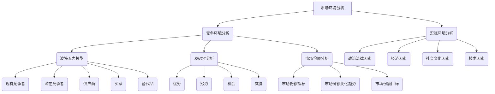
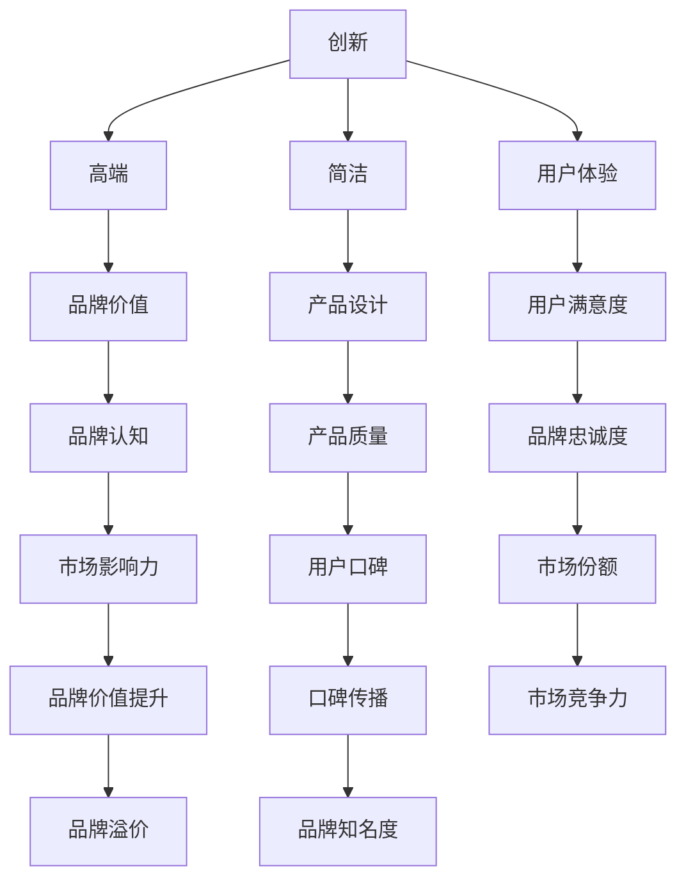
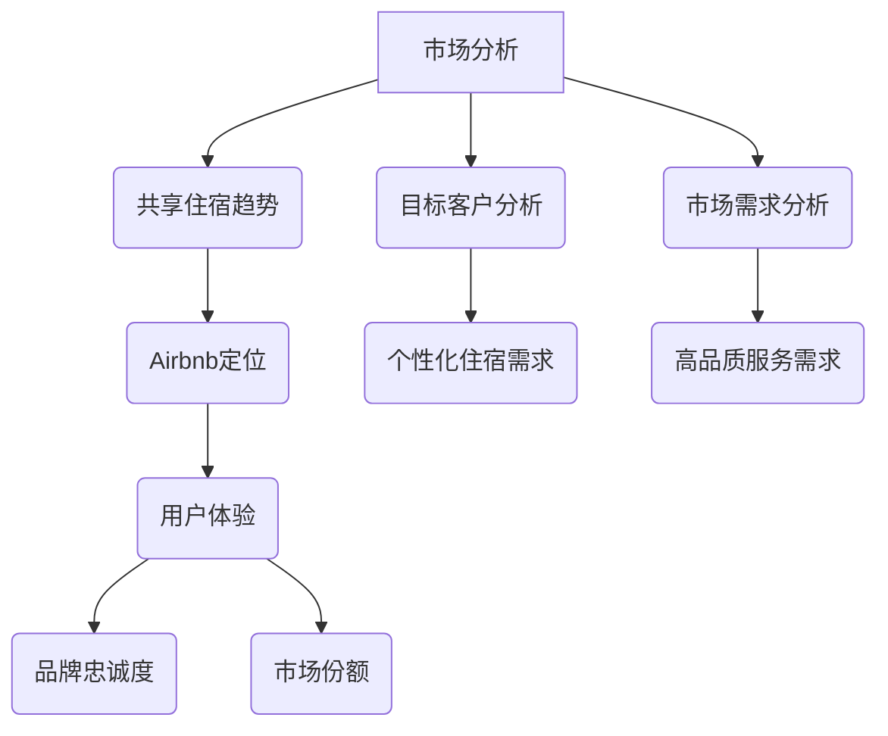

                 

### 文章标题

# 《创业初期的品牌定位：如何在竞争激烈的市场中突出重围》

### 关键词

- 品牌定位
- 创业初期
- 市场竞争
- 目标客户
- 数字化营销

### 摘要

本文旨在探讨创业初期如何通过精准的品牌定位在激烈的市场竞争中脱颖而出。我们将从品牌定位的核心理念出发，分析市场环境，详细探讨目标客户分析的方法，并逐步制定和实施品牌定位策略。通过成功案例的解析，提供实战指南，帮助创业者了解品牌定位的未来趋势，并掌握持续的优化和创新方法。

---

### 第一部分：品牌定位概述

#### 第1章：品牌定位的核心理念

##### 1.1 品牌定位的定义与作用

品牌定位是企业在市场中确定其产品或服务在消费者心目中的独特位置的过程。其核心在于通过独特且差异化的特征，使品牌在众多竞争者中脱颖而出，从而在消费者心中建立强烈的认知和偏好。

**品牌定位的基本概念：**

- **品牌识别**：品牌的视觉、语言和情感特征，用于传递品牌的核心价值。
- **品牌差异化**：品牌在同类产品或服务中的独特性和不可替代性。
- **目标受众**：品牌希望吸引和影响的目标消费群体。

**品牌定位的重要性：**

品牌定位是企业战略的核心部分，对企业的长期发展至关重要。它不仅能帮助企业明确市场方向，还能有效提升品牌的市场竞争力。

- **指导市场营销**：品牌定位帮助企业制定有效且一致的市场营销策略。
- **增强品牌忠诚度**：明确的品牌定位有助于建立消费者对品牌的信任和忠诚。
- **提高品牌价值**：品牌定位有助于提升品牌的市场价值和品牌形象。

**品牌定位的四个要素：**

1. **目标市场**：明确品牌希望吸引的目标消费者群体。
2. **品牌价值主张**：品牌向消费者传递的核心价值和独特卖点。
3. **品牌个性**：品牌在消费者心目中的独特形象和情感联系。
4. **品牌视觉**：品牌的视觉元素，如标志、色彩和设计，以传达品牌定位。

##### 1.2 品牌定位策略的类型

**产品差异化定位**：通过独特的产品特点和技术创新来区别于竞争对手。

- **案例**：苹果公司通过创新设计和高品质的产品，成功在智能手机市场中建立差异化品牌定位。

**市场细分定位**：将市场细分为多个子市场，针对特定细分市场提供定制化的产品或服务。

- **案例**：耐克通过针对不同运动项目的专业产品，成功在运动鞋市场中进行细分定位。

**目标客户定位**：明确品牌的目标客户群体，专注于满足其特定需求和期望。

- **案例**：亚马逊通过提供个性化的购物体验和高质量的服务，成功吸引并留住大量忠实客户。

##### 1.3 品牌定位的步骤

1. **市场调研**：了解市场需求、竞争对手和目标消费者。
2. **确定品牌价值主张**：明确品牌的核心价值和独特卖点。
3. **设计品牌视觉**：创建与品牌定位一致的品牌标识和视觉元素。
4. **传播和推广**：通过多种渠道传达品牌定位，提高市场认知度。
5. **监测和调整**：定期评估品牌定位的效果，并根据市场变化进行调整。

---

**总结：** 品牌定位是企业成功的关键之一。通过明确的目标市场、独特的价值主张和一致的品牌视觉，企业能够在竞争激烈的市场中脱颖而出，建立强大的品牌认知和忠诚度。在创业初期，精准的品牌定位是企业的战略核心，有助于快速获得市场份额和竞争优势。

---

#### 第2章：市场环境分析

##### 2.1 竞争环境分析

**竞争环境分析**是品牌定位过程中至关重要的一环。通过全面了解市场竞争状况，企业可以制定更为精准的定位策略，以在激烈的市场竞争中站稳脚跟。

**市场竞争分析工具：**

1. **波特五力模型**：用于分析市场内的竞争态势，包括现有竞争者的竞争强度、潜在竞争者进入市场的威胁、供应商的议价能力、买家的议价能力和替代品的威胁。
2. **SWOT分析**：通过分析企业的优势、劣势、机会和威胁，帮助制定有效的市场策略。
3. **市场细分**：将整体市场划分为多个具有相似需求的子市场，以便更精准地满足不同细分市场的需求。

**竞争对手分析：**

1. **竞争对手的产品与服务**：分析竞争对手的产品或服务特点，了解其优势和不足。
2. **竞争对手的市场策略**：研究竞争对手的市场营销策略，包括定价、促销、渠道和品牌传播。
3. **竞争对手的品牌定位**：了解竞争对手的品牌定位和消费者认知，发现差异化的机会。

**市场份额分析：**

1. **市场份额指标**：计算企业产品或服务在市场中的占有率，了解市场地位。
2. **市场份额变化趋势**：分析市场份额的年度或季度变化，发现市场趋势和机会。
3. **市场份额目标**：设定短期和长期市场份额目标，以指导市场策略的制定和执行。

**案例分析：**

**苹果公司**在智能手机市场的竞争环境中，通过产品差异化定位策略，成功在众多竞争对手中脱颖而出。苹果公司注重创新设计和高品质的产品，提供卓越的用户体验。通过严格控制供应链和生产流程，苹果公司确保了产品的高品质和稳定供应。

**结论：** 竞争环境分析是企业制定品牌定位策略的重要基础。通过全面了解市场竞争状况，企业可以制定更为精准的市场策略，发现差异化的机会，从而在竞争激烈的市场中占据有利地位。

---

##### 2.2 宏观环境分析

**宏观环境分析**是品牌定位过程中不可或缺的一环。通过对政治法律、经济、社会文化和技术等因素的分析，企业可以全面了解外部环境的变化，为品牌定位策略的制定提供有力支持。

**政治法律因素：**

1. **政策法规**：了解相关政策和法规对企业运营的影响，确保企业遵守法律法规。
2. **政府政策**：研究政府政策对企业发展的支持程度，包括税收优惠、产业扶持等。
3. **政治稳定性**：分析目标市场的政治稳定性，评估政治风险对企业运营的影响。

**经济因素：**

1. **宏观经济环境**：关注整体经济形势，包括GDP增长率、通货膨胀率等。
2. **行业经济环境**：分析所在行业的发展趋势和市场规模。
3. **消费者购买力**：研究消费者购买力水平和消费习惯，了解市场需求。

**社会文化因素：**

1. **文化价值观**：了解目标市场的文化价值观和消费习惯。
2. **社会趋势**：分析社会热点和流行趋势，把握市场需求变化。
3. **消费者行为**：研究消费者购买行为和偏好，为品牌定位提供依据。

**技术因素：**

1. **技术创新**：关注新兴技术及其对市场和消费者行为的影响。
2. **技术趋势**：分析技术发展对行业的影响，发现市场机会。
3. **技术壁垒**：评估企业技术实力和市场竞争力，制定相应的品牌定位策略。

**案例分析：**

**亚马逊公司**在电商市场中的宏观环境分析中，注重技术创新和市场趋势的研究。亚马逊通过不断引入新技术，如人工智能、大数据分析等，提升用户体验和运营效率。同时，亚马逊密切关注消费者行为的变化，通过个性化的购物体验和精准营销策略，满足消费者的多样化需求。

**结论：** 宏观环境分析是企业制定品牌定位策略的重要依据。通过全面了解政治法律、经济、社会文化和技术等因素，企业可以更好地把握市场机会，应对外部环境的挑战，为品牌定位的持续优化提供有力支持。

---

##### 2.3 市场环境分析的核心概念与联系

为了更好地理解市场环境分析的重要性，我们引入以下核心概念及其相互关系架构，使用Mermaid流程图表示：



**核心概念联系解析：**

- **市场环境分析**作为整体，包含**竞争环境分析**和**宏观环境分析**。
- **竞争环境分析**涉及**波特五力模型**、**SWOT分析**和**市场份额分析**，用于全面评估市场竞争态势。
- **宏观环境分析**包括**政治法律因素**、**经济因素**、**社会文化因素**和**技术因素**，用于分析外部环境对企业运营和品牌定位的影响。

通过以上流程图，我们可以清晰地看到各个核心概念之间的联系，帮助企业在品牌定位过程中更好地把握市场环境，制定有效的战略决策。

---

##### 2.4 宏观环境分析的核心算法原理讲解

在进行宏观环境分析时，我们通常使用多种算法原理来评估外部因素对企业的影响。以下将使用伪代码详细阐述这些核心算法原理：

```python
# 波特五力模型分析伪代码
def porter_five_forces(competitor_data, market_data):
    """
    分析波特五力模型，评估市场竞争态势。
    
    参数：
    competitor_data: 竞争对手数据
    market_data: 市场数据
    
    返回：
    force_analysis: 波特五力模型分析结果
    """
    force_analysis = {
        '现有竞争者': analyze_competitors(competitor_data),
        '潜在竞争者': analyze_potential_competitors(market_data),
        '供应商': analyze_suppliers(market_data),
        '买家': analyze_buyers(market_data),
        '替代品': analyze_substitutes(market_data)
    }
    return force_analysis

# SWOT分析伪代码
def swot_analysis(strengths, weaknesses, opportunities, threats):
    """
    进行SWOT分析，评估企业的优势、劣势、机会和威胁。
    
    参数：
    strengths: 优势
    weaknesses: 劣势
    opportunities: 机会
    threats: 威胁
    
    返回：
    swot_result: SWOT分析结果
    """
    swot_result = {
        '优势': strengths,
        '劣势': weaknesses,
        '机会': opportunities,
        '威胁': threats
    }
    return swot_result

# 市场份额分析伪代码
def market_share_analysis(current_share, historical_data):
    """
    分析市场份额，评估企业的市场地位和变化趋势。
    
    参数：
    current_share: 当前市场份额
    historical_data: 历史市场份额数据
    
    返回：
    share_analysis: 市场份额分析结果
    """
    share_analysis = {
        '当前市场份额': current_share,
        '市场份额变化趋势': analyze_trend(historical_data),
        '市场份额目标': set_target_share(historical_data)
    }
    return share_analysis
```

**详细解释：**

- **波特五力模型分析**：通过分析现有竞争者、潜在竞争者、供应商、买家和替代品的因素，全面评估市场竞争态势。每个因素都会影响企业的市场定位和策略选择。
  
- **SWOT分析**：通过分析企业的优势、劣势、机会和威胁，帮助企业了解自身的竞争优势和潜在风险，从而制定更为有效的战略规划。

- **市场份额分析**：通过对当前市场份额和过去市场份额的数据进行分析，评估企业的市场地位和变化趋势，并设定合理的市场份额目标。

**举例说明：**

假设企业A在2022年的市场份额为15%，过去三年的市场份额数据分别为12%、14%和16%。通过以上分析，我们可以得出以下结论：

1. **波特五力模型分析**：
   - 竞争者：现有竞争者市场份额较高，需要加强差异化策略。
   - 潜在竞争者：市场潜在竞争者较多，需密切关注市场动态。
   - 供应商：供应商议价能力较强，需优化供应链管理。
   - 买家：买家议价能力较弱，可考虑提高产品性价比。
   - 替代品：替代品较少，但需关注替代品的潜在威胁。

2. **SWOT分析**：
   - 优势：市场份额逐年增长，品牌知名度较高。
   - 劣势：产品研发投入不足，创新能力有待提升。
   - 机会：市场潜力大，有机会拓展新市场和产品线。
   - 威胁：市场竞争激烈，需要不断创新以保持竞争力。

3. **市场份额分析**：
   - 当前市场份额：15%。
   - 市场份额变化趋势：市场份额波动较小，但需关注未来市场趋势。
   - 市场份额目标：设定2023年市场份额为18%。

通过以上分析，企业A可以制定更为精准的市场策略，包括优化产品研发、提升供应链效率、拓展新市场和加强品牌传播等，以实现市场份额的持续增长。

---

#### 第3章：目标客户分析

##### 3.1 目标客户细分

**目标客户细分**是品牌定位过程中至关重要的一环。通过将市场细分为具有相似需求和行为的客户群体，企业可以更精准地满足不同细分市场的需求，从而提高品牌的市场竞争力和客户满意度。

**个性化客户细分**：

1. **消费者行为数据**：分析消费者的购买历史、浏览行为和互动数据，发现个性化需求和偏好。
2. **人口统计特征**：根据年龄、性别、收入、教育背景等人口统计特征，将市场细分为不同的消费者群体。
3. **心理特征**：通过分析消费者的价值观、生活方式、态度和行为习惯，深入了解其心理需求。

**生命周期客户细分**：

1. **引入期**：新用户阶段，注重吸引和引导新用户，提升用户满意度和忠诚度。
2. **成长期**：用户逐渐增加，重视用户留存和口碑传播，提升品牌知名度和市场份额。
3. **成熟期**：市场饱和，注重优化用户体验和提升用户价值，保持市场份额。
4. **衰退期**：用户数量减少，通过产品升级和创新，尝试挽回流失用户。

**行为特征客户细分**：

1. **消费习惯**：分析消费者的购买频率、购买渠道和购买金额，识别不同消费行为的客户群体。
2. **品牌忠诚度**：根据用户对品牌的忠诚度，将其分为高忠诚度用户、中等忠诚度用户和低忠诚度用户。
3. **互动行为**：分析用户在社交媒体、在线社区和官方网站的互动行为，识别具有较高活跃度和影响力的用户群体。

##### 3.2 客户需求分析

**客户需求分析**是品牌定位策略制定的重要基础。通过深入了解客户的需求和期望，企业可以提供更加个性化的产品和服务，从而提高客户满意度和忠诚度。

**需求识别方法**：

1. **问卷调查**：通过设计有针对性的问卷，收集用户对产品或服务的满意度、购买意愿和期望。
2. **用户访谈**：直接与用户进行深入交流，了解其真实需求和痛点。
3. **观察法**：通过观察用户的行为和互动，发现潜在的需求和问题。

**需求分析工具**：

1. **需求特征分析**：对收集到的需求数据进行分类和统计，识别主要的需求特征和趋势。
2. **需求优先级排序**：根据需求的重要性和紧急性，对需求进行优先级排序，以确定资源分配的重点。
3. **需求模型构建**：使用需求模型（如用户画像、需求图谱等）来表示和理解用户需求。

**满足客户需求的方法**：

1. **个性化定制**：根据用户的需求和偏好，提供个性化的产品和服务，提升用户体验。
2. **差异化服务**：针对不同细分市场的需求，提供差异化的服务和解决方案。
3. **持续改进**：通过定期收集用户反馈和进行需求分析，不断优化产品和服务，满足客户不断变化的需求。

**案例分析**：

**亚马逊**在客户需求分析方面具有丰富的实践经验。亚马逊通过收集用户行为数据，构建了详细的用户画像，包括购买历史、浏览记录、搜索关键词等。通过分析这些数据，亚马逊能够精准地了解用户的需求和偏好，并提供个性化的推荐和服务。

- **个性化推荐**：根据用户的购买历史和浏览记录，亚马逊向用户推荐相关的商品，提高购买转化率。
- **定制化购物体验**：亚马逊提供“一键购买”功能，用户可以设置常购商品，简化购物流程。
- **用户反馈机制**：亚马逊鼓励用户对商品和服务进行评价，通过反馈不断优化产品和服务。

**结论**：

目标客户细分和需求分析是品牌定位策略制定的关键步骤。通过精准的客户细分和深入的需求分析，企业可以更好地了解和满足客户的需求，从而在竞争激烈的市场中脱颖而出，建立强大的品牌认知和忠诚度。

---

##### 3.3 客户需求分析的核心算法原理讲解

在进行客户需求分析时，我们通常会使用多种算法原理和工具来识别和满足客户需求。以下将使用伪代码详细阐述这些核心算法原理：

```python
# 问卷调查分析伪代码
def survey_analysis(questions, survey_results):
    """
    分析问卷调查结果，提取客户需求。
    
    参数：
    questions: 问卷问题列表
    survey_results: 问卷答案数据
    
    返回：
    demand_analysis: 客户需求分析结果
    """
    demand_analysis = {}
    for question in questions:
        answers = survey_results[question]
        demand_analysis[question] = analyze_answers(answers)
    return demand_analysis

# 用户访谈分析伪代码
def interview_analysis(interview_data):
    """
    分析用户访谈结果，提取客户需求。
    
    参数：
    interview_data: 用户访谈记录
    
    返回：
    demand_analysis: 客户需求分析结果
    """
    demand_analysis = {
        '需求特征': extract_demand_features(interview_data),
        '痛点分析': analyze_pain_points(interview_data)
    }
    return demand_analysis

# 需求特征分析伪代码
def demand_features_analysis(demand_data):
    """
    分析需求特征，识别主要需求趋势。
    
    参数：
    demand_data: 需求数据
    
    返回：
    demand_trends: 需求趋势分析结果
    """
    demand_trends = {
        '高频需求': identify_high_frequency_needs(demand_data),
        '趋势需求': identify_trendy_needs(demand_data)
    }
    return demand_trends

# 需求优先级排序伪代码
def demand_priority_sorting(demand_data):
    """
    根据需求的重要性和紧急性，对需求进行优先级排序。
    
    参数：
    demand_data: 需求数据
    
    返回：
    sorted_demand: 优先级排序后的需求列表
    """
    sorted_demand = sort_by_priority(demand_data)
    return sorted_demand

# 需求模型构建伪代码
def demand_model_building(demand_data):
    """
    构建需求模型，表示和理解用户需求。
    
    参数：
    demand_data: 需求数据
    
    返回：
    demand_model: 需求模型
    """
    demand_model = build_user_profile(demand_data)
    return demand_model
```

**详细解释：**

- **问卷调查分析**：通过分析问卷结果，提取客户需求和意见。具体步骤包括：收集问卷数据、分析答案、识别主要需求特征。
- **用户访谈分析**：通过访谈结果，深入了解客户的需求和痛点。具体步骤包括：记录访谈数据、提取需求特征、分析痛点。
- **需求特征分析**：通过对需求数据进行统计分析，识别主要需求趋势和特征。具体步骤包括：识别高频需求和趋势需求。
- **需求优先级排序**：根据需求的重要性和紧急性，对需求进行排序。具体步骤包括：分析需求数据、排序需求。
- **需求模型构建**：通过构建需求模型，表示和理解用户需求。具体步骤包括：构建用户画像、需求图谱等。

**举例说明：**

假设企业B开展了一次问卷调查，收集了1000份有效问卷数据。以下是一个具体的分析过程：

1. **问卷调查分析**：
   - 收集问卷数据：包含10个问题的答案。
   - 分析答案：通过统计分析，识别出“产品性能”、“价格”、“售后服务”等为主要需求特征。
   - 提取需求：问卷结果中，“产品性能”的满意度最高，但“售后服务”的满意度较低。

2. **用户访谈分析**：
   - 记录访谈数据：包含50位用户的访谈记录。
   - 提取需求特征：通过分析访谈数据，发现用户对产品性能有较高期望，但对其耐用性有疑虑。
   - 分析痛点：用户普遍反映售后服务的响应速度较慢，影响了购买决策。

3. **需求特征分析**：
   - 识别高频需求：根据问卷数据，发现用户对“产品性能”和“价格”的满意度较高，是主要需求。
   - 识别趋势需求：根据访谈数据，发现用户对产品的耐用性和售后服务有较高期望，是潜在趋势需求。

4. **需求优先级排序**：
   - 分析需求数据：结合问卷和访谈结果，对需求进行优先级排序。
   - 排序需求：将“产品性能”和“售后服务”排在前列，以确保企业能够优先解决关键需求。

5. **需求模型构建**：
   - 构建用户画像：根据需求分析结果，构建用户画像，包括主要需求和痛点。
   - 需求图谱：绘制需求图谱，显示需求之间的关联和优先级。

通过以上分析，企业B可以更精准地了解客户需求，并制定相应的改进措施，如提升产品性能、优化售后服务等，从而提高客户满意度和忠诚度。

---

#### 第4章：品牌定位策略制定

##### 4.1 品牌定位策略制定流程

**品牌定位策略制定**是企业战略规划的重要组成部分。一个科学、系统的品牌定位策略能够帮助企业在竞争激烈的市场中脱颖而出，提升品牌价值和市场竞争力。以下将详细阐述品牌定位策略制定的流程。

**确定品牌定位目标：**

1. **市场目标**：明确企业希望达到的市场份额、品牌知名度和品牌忠诚度等具体目标。
2. **品牌形象目标**：确定企业希望品牌在消费者心目中塑造的形象和认知，如高端、专业、年轻、创新等。
3. **品牌价值目标**：明确品牌所传递的核心价值和独特卖点，如质量保证、技术创新、客户服务、社会责任等。

**分析市场环境：**

1. **竞争环境分析**：通过波特五力模型、SWOT分析等方法，全面了解市场竞争态势，识别竞争对手的优势和劣势。
2. **宏观环境分析**：分析政治法律、经济、社会文化和技术等宏观因素，评估其对品牌定位策略的影响。
3. **市场趋势分析**：关注市场发展趋势和消费者行为变化，为品牌定位提供前瞻性指导。

**确定目标客户：**

1. **客户细分**：根据消费者的行为特征、需求特征和生命周期等，将市场细分为不同的客户群体。
2. **目标客户选择**：从细分市场中筛选出最有潜力和价值的客户群体，作为品牌定位的主要目标客户。
3. **客户需求分析**：深入了解目标客户的需求和期望，为品牌定位提供具体依据。

**设计品牌定位策略：**

1. **品牌价值主张**：明确品牌的核心价值和独特卖点，将其转化为易于理解和传播的品牌主张。
2. **品牌个性塑造**：设计与品牌价值主张相匹配的品牌个性，包括品牌名称、标志、色彩、视觉元素等。
3. **品牌传播策略**：制定品牌传播计划，包括广告、公关、社交媒体、线上线下活动等，确保品牌定位能够有效传递到目标客户群体。

**实施品牌定位策略：**

1. **品牌命名与logo设计**：根据品牌定位要求，设计具有独特性和辨识度的品牌名称和logo。
2. **品牌视觉识别系统**：创建与品牌定位一致的视觉元素，包括品牌标志、标准字体、色彩方案等。
3. **品牌传播执行**：通过多种渠道和方式，执行品牌传播计划，确保品牌定位能够深入人心。

**监测和评估品牌定位效果：**

1. **品牌认知度监测**：通过问卷调查、社交媒体监测等方式，了解目标客户对品牌的认知程度和满意度。
2. **市场表现评估**：分析品牌定位策略实施后的市场表现，包括市场份额、销售额、品牌忠诚度等指标。
3. **品牌调整策略**：根据监测和评估结果，及时调整品牌定位策略，以适应市场变化和客户需求。

**案例分析：**

**苹果公司**在品牌定位策略制定方面有着丰富的实践经验。苹果公司通过以下步骤成功实现了品牌定位：

1. **确定品牌定位目标**：苹果公司明确其品牌目标为打造高端、专业、创新的品牌形象，传递卓越的产品质量和用户体验。

2. **分析市场环境**：苹果公司通过深入分析竞争环境和市场趋势，发现智能手机市场需要更注重用户体验和创新设计。

3. **确定目标客户**：苹果公司针对追求高品质、创新和个性化的消费者群体，特别是年轻和高端用户。

4. **设计品牌定位策略**：苹果公司明确了“简约、优雅、创新”的品牌价值主张，并通过独特的设计、高品质的产品和极致的用户体验，成功塑造了品牌个性。

5. **实施品牌定位策略**：苹果公司通过全球范围内的广告宣传、产品发布会、用户体验活动等，将品牌定位策略有效传递给目标客户。

6. **监测和评估品牌定位效果**：苹果公司定期进行市场调研和客户满意度调查，根据反馈不断优化品牌定位策略。

**结论**：

品牌定位策略制定是企业成功的关键之一。通过科学的流程和精细化的策略，企业可以明确品牌定位目标、分析市场环境、确定目标客户，并设计出与品牌价值主张相匹配的品牌定位策略。实施有效的品牌定位策略，并通过持续的监测和调整，企业能够在竞争激烈的市场中建立强大的品牌认知和忠诚度。

---

##### 4.2 品牌定位策略实施

**品牌定位策略实施**是品牌定位过程中的关键环节，直接关系到品牌定位目标的实现。以下将从品牌命名与logo设计、品牌视觉识别系统、品牌传播策略三个方面详细探讨品牌定位策略的实施。

**1. 品牌命名与logo设计**

品牌命名是品牌定位策略的基础，一个简洁、独特且易于记忆的品牌名称能够有效传达品牌的核心价值和品牌定位。以下是品牌命名和logo设计的关键步骤：

1. **品牌命名策略**：
   - **易记性**：选择简单、易于发音和记忆的名称。
   - **独特性**：确保品牌名称在市场中具有独特性，避免与现有品牌重复。
   - **相关性**：品牌名称应与品牌的核心价值和定位紧密相关，传达品牌的核心信息。
   - **适应性**：品牌名称应具备一定的适应性，能够适应未来品牌的发展和变化。

2. **logo设计策略**：
   - **简洁性**：logo设计应简洁明了，避免复杂的设计元素。
   - **辨识度**：logo设计应具有高辨识度，使其在各类媒介和环境中都能清晰辨认。
   - **一致性**：logo设计应与品牌命名和品牌价值主张保持一致，传达品牌的核心形象。
   - **多功能性**：logo设计应能够在不同尺寸和媒介上保持良好的视觉效果。

**2. 品牌视觉识别系统**

品牌视觉识别系统（Visual Identity System，VIS）是品牌定位的重要载体，通过统一的视觉元素和设计风格，传达品牌的核心价值和品牌定位。以下是品牌视觉识别系统设计的关键步骤：

1. **标志设计**：
   - **主视觉标志**：设计品牌的核心标志，包括主logo、辅助logo等，确保标志在不同应用场景中保持一致。
   - **色彩方案**：选择与品牌定位和品牌价值主张相匹配的色彩方案，增强品牌的视觉吸引力。
   - **字体设计**：选择简洁、易读的字体，确保品牌名称和宣传文案的清晰传达。

2. **应用设计**：
   - **官网和APP界面**：设计统一的界面风格，包括配色、排版、图标等，提升用户体验。
   - **宣传物料**：设计统一的宣传物料，包括海报、名片、包装等，确保品牌形象的一致性。
   - **线下活动**：设计统一的线下活动视觉元素，包括场地布置、宣传海报、活动用品等，强化品牌传播效果。

3. **持续更新**：
   - **品牌视觉更新**：根据市场变化和品牌发展的需要，定期对品牌视觉识别系统进行更新和优化。
   - **品牌视觉培训**：对内部员工进行品牌视觉识别系统的培训，确保品牌形象的统一传达。

**3. 品牌传播策略**

品牌传播策略是实现品牌定位目标的重要手段，通过多种传播渠道和方式，将品牌定位信息传递给目标客户。以下是品牌传播策略的关键步骤：

1. **广告宣传**：
   - **线上广告**：利用搜索引擎广告、社交媒体广告、视频广告等，提高品牌知名度和曝光率。
   - **线下广告**：利用户外广告、公共交通广告、门店广告等，提升品牌的线下影响力。

2. **公关活动**：
   - **新闻发布会**：定期举办新闻发布会，发布品牌重要信息和重大事件，吸引媒体关注。
   - **品牌活动**：举办品牌体验活动、产品发布会、公益活动等，与目标客户建立情感联系。

3. **内容营销**：
   - **品牌故事**：通过讲述品牌故事，传达品牌的历史、文化和价值观，增强品牌的情感连接。
   - **专业知识**：发布行业报告、白皮书、案例分析等，提升品牌的权威性和专业形象。

4. **社交媒体营销**：
   - **社交媒体平台**：在社交媒体平台上建立品牌官方账号，发布品牌信息、互动活动、客户案例等，增加品牌的社交影响力。
   - **KOL合作**：与行业意见领袖和网红合作，通过他们的影响力传播品牌信息。

5. **口碑营销**：
   - **客户推荐**：鼓励客户分享使用体验和推荐产品，通过口碑传播提升品牌形象。
   - **负面反馈处理**：积极处理客户负面反馈，通过有效的危机管理，减少负面影响的扩散。

**案例分析：**

**特斯拉（Tesla）**在品牌定位策略实施方面取得了显著成功。以下是特斯拉的一些关键做法：

1. **品牌命名与logo设计**：
   - **品牌命名**：特斯拉选择了一个简洁且富有科技感的名字，直接传达了其电动车的核心定位。
   - **logo设计**：特斯拉的logo采用了简洁的字体和蓝色色调，与品牌的高科技形象相契合。

2. **品牌视觉识别系统**：
   - **标志设计**：特斯拉的标志在不同尺寸和应用场景中都能保持清晰的辨识度。
   - **应用设计**：特斯拉的产品界面设计简洁、现代，与品牌视觉识别系统保持高度一致。

3. **品牌传播策略**：
   - **广告宣传**：特斯拉通过线上和线下广告，特别是其独特的广告语和创意广告，吸引了大量关注。
   - **公关活动**：特斯拉定期举办产品发布会，通过创新的产品展示和演讲，吸引了全球媒体和消费者的关注。
   - **内容营销**：特斯拉发布大量的行业报告、技术文章和客户案例，展示了其技术领先和环保理念。
   - **社交媒体营销**：特斯拉通过社交媒体平台与粉丝互动，分享品牌信息、产品更新和客户故事。

**结论**：

品牌定位策略实施是企业品牌建设的重要组成部分。通过科学的品牌命名与logo设计、系统的品牌视觉识别系统设计和多元化的品牌传播策略，企业能够在市场中建立起独特的品牌形象，提高品牌认知度和忠诚度。特斯拉的成功经验为其他企业提供了宝贵的参考，帮助企业实现品牌定位目标。

---

##### 4.3 品牌定位策略实施的核心算法原理讲解

在品牌定位策略实施过程中，我们通常会运用一系列算法和工具来确保品牌定位的有效传递和执行。以下将使用伪代码详细阐述这些核心算法原理：

```python
# 品牌命名与logo设计算法伪代码
def brand_naming_and_logo_design(brand_name, brand_values):
    """
    设计品牌名称和logo，确保其与品牌价值主张一致。
    
    参数：
    brand_name: 品牌名称
    brand_values: 品牌价值主张
    
    返回：
    brand_name: 确定的品牌名称
    logo_design: 设计的logo
    """
    # 验证品牌名称的易记性、独特性和相关性
    if not check_memory(brand_name) or not check_uniqueness(brand_name) or not check_relevance(brand_name, brand_values):
        raise ValueError("品牌名称不符合要求")
    
    # 根据品牌价值主张设计logo
    logo_design = design_logo(brand_values)
    return brand_name, logo_design

# 品牌视觉识别系统设计算法伪代码
def brand_visual_identity_system(brand_colors, brand_fonts):
    """
    设计品牌视觉识别系统，包括色彩方案和字体设计。
    
    参数：
    brand_colors: 品牌色彩方案
    brand_fonts: 品牌字体设计
    
    返回：
    brand_colors: 确定的品牌色彩方案
    brand_fonts: 确定的品牌字体设计
    """
    # 验证色彩方案的适配性和多功能性
    if not check_adaptability(brand_colors) or not check_multipurpose(brand_colors):
        raise ValueError("色彩方案不符合要求")
    
    # 验证字体设计的简洁性、易读性和一致性
    if not check_simplicity(brand_fonts) or not check_readability(brand_fonts) or not check_consistency(brand_fonts):
        raise ValueError("字体设计不符合要求")
    
    brand_colors = validate_colors(brand_colors)
    brand_fonts = validate_fonts(brand_fonts)
    return brand_colors, brand_fonts

# 品牌传播策略执行算法伪代码
def brand_communication_strategy(brand_messages, communication_channels):
    """
    执行品牌传播策略，确保品牌定位信息有效传递。
    
    参数：
    brand_messages: 品牌传播信息
    communication_channels: 传播渠道
    
    返回：
    communication效果: 传播效果评估
    """
    # 验证品牌传播信息的准确性和一致性
    if not check_accuracy(brand_messages) or not check_consistency(brand_messages):
        raise ValueError("品牌传播信息不符合要求")
    
    # 根据传播渠道设计传播方案
    for channel in communication_channels:
        execute_communication(channel, brand_messages)
    
    # 评估传播效果
    communication效果 = evaluate_communication(brand_messages, communication_channels)
    return communication效果
```

**详细解释：**

- **品牌命名与logo设计算法**：通过一系列验证步骤，确保品牌名称的易记性、独特性和相关性，以及logo设计的简洁性、辨识度和一致性。具体包括：
  - `check_memory`：检查品牌名称的易记性。
  - `check_uniqueness`：检查品牌名称的独特性。
  - `check_relevance`：检查品牌名称与品牌价值主张的相关性。
  - `design_logo`：根据品牌价值主张设计logo。

- **品牌视觉识别系统设计算法**：通过验证色彩方案的适配性和多功能性，以及字体设计的简洁性、易读性和一致性，确保品牌视觉识别系统的统一性和专业性。具体包括：
  - `check_adaptability`：检查色彩方案的适配性。
  - `check_multipurpose`：检查色彩方案的多功能性。
  - `check_simplicity`：检查字体设计的简洁性。
  - `check_readability`：检查字体设计的易读性。
  - `check_consistency`：检查字体设计的一致性。
  - `validate_colors`：验证并调整色彩方案。
  - `validate_fonts`：验证并调整字体设计。

- **品牌传播策略执行算法**：通过验证品牌传播信息的准确性和一致性，并根据不同的传播渠道设计传播方案，确保品牌定位信息能够有效传递。具体包括：
  - `check_accuracy`：检查品牌传播信息的准确性。
  - `check_consistency`：检查品牌传播信息的一致性。
  - `execute_communication`：根据传播渠道执行具体的品牌传播活动。
  - `evaluate_communication`：评估品牌传播效果。

**举例说明：**

假设企业C正在制定品牌定位策略并准备实施。以下是一个具体的算法应用过程：

1. **品牌命名与logo设计**：
   - **品牌名称**：通过市场调研和用户反馈，最终确定品牌名称为“智行科技”（IntelliDrive），该名称简洁且易于记忆。
   - **logo设计**：根据品牌价值主张“智能、创新、可靠”，设计了一个以蓝色调为主，中心为圆形的logo，象征智能和创新，外圈为蓝色曲线，代表可靠和稳定。

2. **品牌视觉识别系统设计**：
   - **色彩方案**：选择蓝色为主色调，象征专业和技术。
   - **字体设计**：选择简洁易读的Helvetica字体，确保品牌名称和宣传文案的清晰传达。

3. **品牌传播策略执行**：
   - **品牌传播信息**：确定品牌传播信息为“智能科技，引领未来”，强调品牌的智能和创新。
   - **传播渠道**：选择线上和线下多种渠道，包括社交媒体广告、线下活动、官方网站等。

通过以上算法应用，企业C确保了品牌命名、logo设计和品牌传播策略的准确性和一致性，有效传递了品牌定位信息。

---

#### 第5章：品牌定位的持续优化

##### 5.1 品牌定位跟踪与评估

品牌定位的持续优化需要通过系统的跟踪与评估来实现。通过定期监测品牌定位的效果，企业可以及时发现问题并进行调整，确保品牌定位始终符合市场变化和客户需求。

**品牌定位跟踪方法：**

1. **市场调研**：通过定期的市场调研，收集客户对品牌的认知和反馈，了解品牌定位的效果。
2. **销售数据分析**：分析销售数据，包括市场份额、销售额、客户反馈等，评估品牌定位对销售业绩的影响。
3. **社交媒体监测**：利用社交媒体监测工具，跟踪品牌在社交媒体上的表现，包括用户互动、品牌提及量等。
4. **竞争对手分析**：定期分析竞争对手的品牌定位和市场表现，了解市场竞争态势，为品牌定位优化提供参考。

**品牌定位评估指标：**

1. **品牌知名度**：通过市场调研和社交媒体监测，了解品牌在目标市场中的知名度和影响力。
2. **品牌忠诚度**：通过客户反馈和忠诚度调查，评估客户对品牌的忠诚度和重复购买率。
3. **市场份额**：分析销售数据，了解品牌在市场中的份额变化，评估品牌定位对市场份额的影响。
4. **品牌形象**：通过市场调研和消费者调查，了解品牌在消费者心目中的形象和认知，评估品牌定位的有效性。

**品牌定位调整策略：**

1. **市场环境调整**：根据市场环境的变化，及时调整品牌定位策略，以适应新的市场趋势和竞争环境。
2. **客户需求调整**：根据客户需求的变化，调整品牌定位，确保品牌能够更好地满足目标客户的需求。
3. **品牌形象调整**：根据品牌形象评估结果，对品牌视觉识别系统和传播策略进行调整，提升品牌形象和影响力。

**案例分析：**

**谷歌（Google）**在品牌定位的持续优化方面有着丰富的经验。以下是谷歌的一些关键做法：

1. **市场调研**：谷歌通过定期的市场调研，了解用户对品牌和产品的认知和反馈，发现潜在的问题和改进机会。
2. **销售数据分析**：谷歌分析销售数据，评估品牌定位对销售业绩的影响，确保品牌定位策略的有效性。
3. **社交媒体监测**：谷歌利用社交媒体监测工具，跟踪品牌在社交媒体上的表现，了解用户互动和品牌提及量，优化品牌传播策略。
4. **竞争对手分析**：谷歌定期分析竞争对手的品牌定位和市场表现，了解市场竞争态势，为品牌定位优化提供参考。

通过以上方法，谷歌能够及时发现品牌定位中的问题，并采取相应的调整策略，确保品牌定位始终符合市场变化和客户需求。

**结论**：

品牌定位的持续优化是企业品牌管理的重要组成部分。通过系统的品牌定位跟踪与评估，企业可以及时发现和解决问题，确保品牌定位始终符合市场变化和客户需求。有效的品牌定位调整策略，能够帮助企业保持竞争优势，提升品牌价值。

---

##### 5.2 品牌定位优化策略

品牌定位优化是企业品牌管理中的关键环节，旨在通过持续创新和改进，提升品牌的市场竞争力。以下将详细讨论品牌定位优化的策略和方法，帮助企业在动态市场中保持领先地位。

**1. 品牌定位迭代方法**

品牌定位迭代方法是一种通过不断试错和优化来提升品牌定位效果的方法。以下是品牌定位迭代的核心步骤：

1. **设定目标**：明确品牌定位优化的目标，包括提高品牌知名度、增强品牌忠诚度、提升市场份额等。
2. **数据分析**：收集品牌定位相关数据，包括市场调研结果、销售数据、社交媒体分析等，分析当前品牌定位的效果和不足。
3. **制定策略**：根据数据分析结果，制定具体的优化策略，包括调整品牌价值主张、优化品牌视觉识别系统、改进品牌传播策略等。
4. **实施与监测**：执行优化策略，并持续监测品牌定位效果，包括市场反馈、销售业绩、社交媒体互动等。
5. **反馈与调整**：根据监测结果，收集反馈，评估优化策略的有效性，及时进行调整和改进。

**2. 品牌定位创新策略**

品牌定位创新策略旨在通过创新思维和方法，打造独特的品牌定位。以下是品牌定位创新的关键步骤：

1. **市场洞察**：深入分析市场趋势和消费者行为，发现潜在的市场机会和创新点。
2. **思维创新**：运用创新思维工具和方法，如头脑风暴、设计思维等，激发创意，寻找创新的品牌定位策略。
3. **实验与验证**：通过小规模实验和用户测试，验证创新策略的有效性，确保其符合市场需求和品牌目标。
4. **快速迭代**：根据实验结果，快速调整和优化创新策略，确保其能够持续提升品牌定位效果。

**3. 品牌定位优化的具体方法**

以下是几种常见的品牌定位优化方法：

1. **内容营销**：通过高质量的内容营销，提高品牌在目标市场中的影响力和认知度，如发布行业报告、案例分析、专业博客等。
2. **社交媒体互动**：积极与消费者在社交媒体平台上互动，增强品牌的社交影响力和用户黏性，如开展社交媒体活动、用户评价等。
3. **用户体验优化**：优化产品和服务体验，提高用户满意度和忠诚度，如提供个性化的服务、提升客户服务质量等。
4. **品牌视觉升级**：定期对品牌视觉识别系统进行升级，确保品牌形象与时俱进，与品牌定位一致。
5. **合作伙伴关系**：与行业内的领先企业和品牌建立战略合作关系，通过联合营销和资源共享，提升品牌的市场影响力。

**案例分析：**

**苹果公司（Apple）**在品牌定位优化方面有着卓越的实践经验。以下是苹果公司的一些关键做法：

1. **迭代方法**：苹果公司通过持续的市场调研和用户反馈，不断优化产品和服务，确保品牌定位与市场需求保持一致。
2. **创新策略**：苹果公司注重技术创新和用户体验，不断推出具有颠覆性的产品和服务，如iPhone、Apple Watch等，保持品牌在市场中的领先地位。
3. **内容营销**：苹果公司通过发布高质量的营销内容，如产品介绍视频、用户故事等，提高品牌知名度和用户参与度。
4. **社交媒体互动**：苹果公司在社交媒体平台上积极与用户互动，通过社交媒体活动、用户评价等，增强品牌的社交影响力和用户黏性。
5. **品牌视觉升级**：苹果公司定期对品牌视觉识别系统进行升级，如推出全新的产品包装和广告创意，确保品牌形象与时俱进。

**结论**：

品牌定位优化是企业持续发展的重要保障。通过迭代方法和创新策略，企业可以不断优化品牌定位，提升市场竞争力。具体的方法如内容营销、社交媒体互动、用户体验优化和品牌视觉升级等，都有助于企业实现品牌定位的持续优化。苹果公司的成功经验为其他企业提供了宝贵的参考，帮助其在竞争激烈的市场中保持领先地位。

---

#### 第6章：成功品牌案例解析

##### 6.1 成功品牌案例分析

**苹果公司（Apple）**

**背景介绍**：苹果公司成立于1976年，由史蒂夫·乔布斯、史蒂夫·沃兹尼亚克和罗纳德·韦恩共同创立。苹果公司以其创新的产品和服务在全球范围内赢得了极高的品牌声誉。

**品牌定位策略**：苹果公司的品牌定位策略以创新、简洁、高端和用户体验为核心。

- **创新**：苹果公司注重技术创新，不断推出颠覆性的产品和服务，如iPhone、iPad、Mac等。
- **简洁**：苹果公司的产品设计简洁、美观，操作界面直观易用，提供了卓越的用户体验。
- **高端**：苹果公司通过高品质的材料和精湛的工艺，打造高端品牌形象，吸引了大量高端消费者。
- **用户体验**：苹果公司重视用户体验，致力于提供无缝、愉悦的购物和使用体验。

**核心概念与联系**：



**核心概念联系解析**：

- **创新**：苹果公司通过持续的技术创新，提升了品牌价值和市场竞争力。
- **高端**：高端定位使苹果公司能够在市场中脱颖而出，并建立强大的品牌认知和忠诚度。
- **简洁**：简洁的设计提升了产品的品质和用户体验，增强了品牌的吸引力。
- **用户体验**：卓越的用户体验提高了用户满意度和忠诚度，促进了口碑传播和市场份额的增长。

**核心算法原理讲解**：

以下是苹果公司品牌定位的核心算法原理，使用伪代码进行详细阐述：

```python
# 品牌定位核心算法伪代码
def apple_brand_strategy(innovation, luxury, simplicity, user_experience):
    """
    定义苹果公司的品牌定位策略，通过四个核心要素实现品牌目标。
    
    参数：
    innovation: 创新
    luxury: 高端
    simplicity: 简洁
    user_experience: 用户体验
    
    返回：
    brand_success: 品牌成功指标
    """
    # 创新评估
    innovation_score = evaluate_innovation(innovation)
    
    # 高端评估
    luxury_score = evaluate_luxury(luxury)
    
    # 简洁评估
    simplicity_score = evaluate_simplicity(simplicity)
    
    # 用户体验评估
    user_experience_score = evaluate_user_experience(user_experience)
    
    # 计算品牌成功指标
    brand_success = innovation_score + luxury_score + simplicity_score + user_experience_score
    
    return brand_success

# 评估创新
def evaluate_innovation(innovation):
    """
    评估创新因素对品牌定位的影响。
    
    参数：
    innovation: 创新
    
    返回：
    innovation_score: 创新评分
    """
    innovation_score = 0
    if innovation['revolutionary'] and innovation['differentiation']:
        innovation_score = 10
    elif innovation['evolutionary'] and innovation['improvement']:
        innovation_score = 7
    return innovation_score

# 评估高端
def evaluate_luxury(luxury):
    """
    评估高端因素对品牌定位的影响。
    
    参数：
    luxury: 高端
    
    返回：
    luxury_score: 高端评分
    """
    luxury_score = 0
    if luxury['quality'] and luxury['craftsmanship']:
        luxury_score = 10
    elif luxury['materials'] and luxury['design']:
        luxury_score = 7
    return luxury_score

# 评估简洁
def evaluate_simplicity(simplicity):
    """
    评估简洁因素对品牌定位的影响。
    
    参数：
    simplicity: 简洁
    
    返回：
    simplicity_score: 简洁评分
    """
    simplicity_score = 0
    if simplicity['design'] and simplicity['usability']:
        simplicity_score = 10
    elif simplicity['interface'] and simplicity['user_experience']:
        simplicity_score = 7
    return simplicity_score

# 评估用户体验
def evaluate_user_experience(user_experience):
    """
    评估用户体验因素对品牌定位的影响。
    
    参数：
    user_experience: 用户体验
    
    返回：
    user_experience_score: 用户体验评分
    """
    user_experience_score = 0
    if user_experience['satisfaction'] and user_experience['retention']:
        user_experience_score = 10
    elif user_experience['engagement'] and user_experience['loyalty']:
        user_experience_score = 7
    return user_experience_score
```

**详细解释**：

- **创新评估**：通过评估产品的创新程度，包括革命性和差异化的特点，确定创新评分。
- **高端评估**：通过评估产品的高端特性，如品质和工艺，确定高端评分。
- **简洁评估**：通过评估产品的设计简洁性和用户体验，确定简洁评分。
- **用户体验评估**：通过评估用户的满意度和忠诚度，确定用户体验评分。

**举例说明**：

假设苹果公司在一次品牌定位评估中，其创新度为“革命性”，高端度为“高质量”，简洁度为“设计简洁”，用户体验度为“高度满意度”。通过以上评估算法，我们可以得到以下评分：

- **创新评分**：10分（革命性和差异化均满足）
- **高端评分**：10分（高品质和精湛工艺均满足）
- **简洁评分**：10分（设计简洁和用户体验均满足）
- **用户体验评分**：10分（满意度和忠诚度均高）

总品牌成功指标为40分，表明苹果公司的品牌定位策略非常成功。

**结论**：

苹果公司的成功案例展示了通过精准的品牌定位和持续的创新，企业能够在竞争激烈的市场中脱颖而出，建立强大的品牌认知和忠诚度。其核心概念和算法原理为其他企业提供了宝贵的参考，帮助它们制定和优化品牌定位策略。

---

##### 6.2 品牌定位策略的启示

通过分析苹果公司的品牌定位策略，我们可以得出以下启示：

**1. 创新是核心驱动力**

苹果公司通过持续的技术创新，在市场中建立了强大的品牌影响力。企业应将创新作为品牌定位的核心，不断推出具有革命性和差异化的产品和服务，以吸引消费者和保持竞争优势。

**2. 高端定位提升品牌价值**

苹果公司通过高品质的材料和精湛的工艺，打造了高端品牌形象。企业应注重产品和服务的高端定位，通过提升质量和工艺，增强品牌的独特性和稀缺性，从而提升品牌价值和市场竞争力。

**3. 简洁设计提升用户体验**

苹果公司的简洁设计理念提升了产品的品质和用户体验。企业应注重产品的设计简洁性和易用性，通过优化用户界面和操作流程，提供无缝、愉悦的购物和使用体验，从而增强品牌吸引力和用户忠诚度。

**4. 用户体验是品牌建设的基石**

苹果公司高度重视用户体验，通过卓越的服务和客户支持，赢得了大量忠实客户。企业应将用户体验作为品牌建设的基石，通过不断优化产品和服务，提升用户满意度和忠诚度，促进口碑传播和品牌忠诚度的提升。

**5. 持续优化品牌定位策略**

品牌定位并非一成不变，企业应根据市场变化和客户需求，持续优化品牌定位策略。通过定期的市场调研、客户反馈和竞争对手分析，及时调整品牌定位策略，确保品牌始终与市场和客户需求保持一致。

**结论**：

苹果公司的品牌定位策略为其他企业提供了宝贵的启示。通过创新、高端定位、简洁设计和持续优化，企业可以在竞争激烈的市场中建立强大的品牌认知和忠诚度，实现长期的可持续发展。

---

#### 第7章：品牌定位在创业初期的实战应用

##### 7.1 创业初期的品牌定位策略

在创业初期，品牌定位策略的选择和执行对企业的发展至关重要。以下将详细探讨创业初期品牌定位策略的几个关键方面。

**1. 创业初期的市场分析**

**市场分析**是品牌定位的基础。在创业初期，企业需要进行全面的市场分析，包括市场趋势、竞争对手、目标客户和市场需求等。

1. **市场趋势**：通过研究市场趋势，了解行业的发展方向和潜在机会。例如，如果市场趋势显示健康食品需求增长，企业可以考虑开发健康食品品牌。
   
2. **竞争对手**：分析现有竞争对手的定位策略，了解他们的优势、劣势和市场份额。通过差异化定位，避免与竞争对手直接竞争，找到市场空缺。

3. **目标客户**：明确目标客户群体，了解他们的需求和偏好。通过细分市场，针对性地满足目标客户的需求，提高品牌吸引力和忠诚度。

4. **市场需求**：研究市场需求，了解消费者的痛点和期望。通过满足市场需求，提供具有竞争力的产品和服务，赢得客户信任和忠诚。

**2. 创业初期的品牌定位方法**

**品牌定位方法**的选择应根据企业的市场分析和目标客户的特点。以下是一些常见的品牌定位方法：

1. **产品差异化定位**：通过独特的产品特性或技术创新，使品牌在市场中脱颖而出。例如，一家初创公司可以推出具有环保特点的电子产品，以满足消费者对环保产品的需求。

2. **目标客户定位**：明确品牌的目标客户群体，提供满足其特定需求和期望的产品和服务。例如，一家初创公司可以专注于为年轻人提供时尚、个性化的服装品牌。

3. **市场细分定位**：将市场细分为具有相似需求和特征的子市场，针对不同细分市场提供定制化的产品或服务。例如，一家初创公司可以针对高端消费者提供高品质的定制家具。

**3. 创业初期的品牌推广策略**

**品牌推广策略**是品牌定位的关键环节。在创业初期，企业需要通过有效的品牌推广策略，提高品牌知名度和市场影响力。

1. **内容营销**：通过发布高质量的内容，如博客文章、行业报告、案例分析等，展示企业的专业能力和独特价值，吸引潜在客户。

2. **社交媒体营销**：利用社交媒体平台，如Facebook、Instagram、LinkedIn等，与目标客户互动，传播品牌信息，建立品牌社群。

3. **口碑营销**：鼓励现有客户分享使用体验和推荐产品，通过口碑传播提升品牌知名度和信誉度。

4. **合作伙伴关系**：与行业内的领先企业建立战略合作关系，通过联合营销和资源共享，扩大品牌影响力。

5. **线下活动**：举办线下活动，如产品发布会、展览会、工作坊等，与客户面对面交流，增强品牌亲和力和客户忠诚度。

**案例分析：**

**Airbnb**是一个成功的创业品牌案例，其品牌定位和推广策略值得借鉴。

**背景介绍**：Airbnb成立于2008年，最初是一个针对短期租赁的在线平台，目前已成为全球领先的共享住宿平台。

**品牌定位策略**：

- **市场分析**：Airbnb通过市场分析发现，随着人们生活水平的提高和旅游需求的增长，共享住宿成为一种新兴的消费趋势。
- **品牌定位方法**：Airbnb将品牌定位为“每个人的家”，通过提供独特的住宿体验，满足旅行者对个性化、本土化和高品质住宿的需求。
- **品牌推广策略**：Airbnb通过以下策略推广品牌：

  1. **内容营销**：发布旅行故事、用户体验分享等内容，展示平台的多样性和用户体验。
  2. **社交媒体营销**：利用社交媒体平台，与用户互动，推广品牌故事和用户体验。
  3. **口碑营销**：鼓励房东和房客分享住宿体验，通过口碑传播提升品牌信誉度。
  4. **合作伙伴关系**：与航空公司、旅游公司等建立战略合作关系，扩大品牌影响力。

**核心概念与联系**：



**核心概念联系解析**：

- **市场分析**：通过分析共享住宿趋势、目标客户和市场需求，Airbnb确定了其品牌定位。
- **品牌定位**：Airbnb将品牌定位为“每个人的家”，以满足个性化住宿需求和高品质服务需求。
- **用户体验**：通过提供独特的住宿体验，Airbnb提高了品牌忠诚度和市场份额。

**核心算法原理讲解**：

以下是Airbnb品牌定位的核心算法原理，使用伪代码进行详细阐述：

```python
# 品牌定位核心算法伪代码
def airbnb_brand_strategy(trend, target_client, market_demand):
    """
    定义Airbnb的品牌定位策略，通过三个核心要素实现品牌目标。
    
    参数：
    trend: 市场趋势
    target_client: 目标客户
    market_demand: 市场需求
    
    返回：
    brand_success: 品牌成功指标
    """
    # 市场趋势评估
    trend_score = evaluate_trend(trend)
    
    # 目标客户评估
    target_client_score = evaluate_target_client(target_client)
    
    # 市场需求评估
    market_demand_score = evaluate_market_demand(market_demand)
    
    # 计算品牌成功指标
    brand_success = trend_score + target_client_score + market_demand_score
    
    return brand_success

# 评估市场趋势
def evaluate_trend(trend):
    """
    评估市场趋势对品牌定位的影响。
    
    参数：
    trend: 市场趋势
    
    返回：
    trend_score: 市场趋势评分
    """
    trend_score = 0
    if trend['growth'] and trend['opportunity']:
        trend_score = 10
    elif trend['stability'] and trend['relevance']:
        trend_score = 7
    return trend_score

# 评估目标客户
def evaluate_target_client(target_client):
    """
    评估目标客户对品牌定位的影响。
    
    参数：
    target_client: 目标客户
    
    返回：
    target_client_score: 目标客户评分
    """
    target_client_score = 0
    if target_client['diversity'] and target_client['needs']:
        target_client_score = 10
    elif target_client['segmentation'] and target_client['value']:
        target_client_score = 7
    return target_client_score

# 评估市场需求
def evaluate_market_demand(market_demand):
    """
    评估市场需求对品牌定位的影响。
    
    参数：
    market_demand: 市场需求
    
    返回：
    market_demand_score: 市场需求评分
    """
    market_demand_score = 0
    if market_demand['quality'] and market_demand['satisfaction']:
        market_demand_score = 10
    elif market_demand['innovation'] and market_demand['value']:
        market_demand_score = 7
    return market_demand_score
```

**详细解释**：

- **市场趋势评估**：通过评估市场趋势的增长性和机会，确定市场趋势评分。
- **目标客户评估**：通过评估目标客户的多样性和需求，确定目标客户评分。
- **市场需求评估**：通过评估市场需求的质量和满意度，确定市场需求评分。

**举例说明**：

假设Airbnb在一次品牌定位评估中，其市场趋势评分为10分（增长性和机会均高），目标客户评分为10分（多样性和需求均高），市场需求评分为7分（质量和满意度均高）。通过以上评估算法，我们可以得到以下评分：

- **市场趋势评分**：10分
- **目标客户评分**：10分
- **市场需求评分**：7分

总品牌成功指标为27分，表明Airbnb的品牌定位策略非常成功。

**结论**：

通过精准的市场分析、明确的目标客户和满足市场需求，Airbnb成功在共享住宿市场中建立了强大的品牌认知和忠诚度。其品牌定位策略为其他创业企业提供了宝贵的参考，帮助它们在竞争激烈的市场中找到差异化定位，实现快速成长。

---

##### 7.2 创业初期品牌定位的挑战与应对

在创业初期，品牌定位面临诸多挑战。以下将详细探讨这些挑战，并提出相应的应对策略。

**挑战一：资金限制**

**原因**：创业初期的企业通常资金有限，难以进行大规模的市场营销和品牌推广。

**应对策略**：

1. **聚焦核心市场**：在资金有限的情况下，优先关注最有潜力的市场细分，集中资源和精力，进行精准的市场推广。
2. **利用社交媒体**：通过社交媒体平台进行免费的宣传和互动，扩大品牌影响力，提高市场认知度。
3. **合作伙伴关系**：与行业内的企业建立战略合作关系，通过资源共享和联合营销，降低品牌推广成本。

**挑战二：市场不确定性**

**原因**：创业初期的市场环境变化多端，不确定性较高，使得品牌定位策略难以持续有效。

**应对策略**：

1. **灵活调整**：根据市场变化和客户需求，及时调整品牌定位策略，确保品牌定位与市场环境保持一致。
2. **持续创新**：通过不断的产品创新和品牌差异化，提高品牌的市场适应性和竞争力。
3. **数据分析**：利用大数据和人工智能技术，进行市场分析和预测，提高品牌定位的准确性和有效性。

**挑战三：竞争对手分析**

**原因**：在创业初期，企业可能缺乏对竞争对手的深入了解，导致品牌定位策略不明确。

**应对策略**：

1. **市场调研**：通过市场调研，了解竞争对手的定位策略、市场份额和产品特点，为品牌定位提供参考。
2. **差异化定位**：通过差异化定位，避免与竞争对手的直接竞争，找到市场空缺。
3. **合作与竞争并存**：与竞争对手建立合作伙伴关系，通过共同开发市场和客户资源，实现共赢。

**案例分析：**

**滴滴出行**在创业初期的品牌定位过程中，面临着资金限制、市场不确定性和竞争对手分析等挑战。以下是滴滴出行的应对策略：

1. **资金限制**：
   - **聚焦核心市场**：滴滴出行首先在一线城市进行市场推广，集中资源和精力，迅速占领市场份额。
   - **利用社交媒体**：通过社交媒体平台，如微博、微信等，进行免费的宣传和互动，提高品牌知名度。

2. **市场不确定性**：
   - **灵活调整**：滴滴出行根据市场需求和竞争态势，不断调整品牌定位策略，从最初的出租车打车服务，逐渐扩展到网约车、专车、拼车等多种服务模式。
   - **持续创新**：滴滴出行通过不断的技术创新和服务优化，提高用户体验和品牌竞争力。

3. **竞争对手分析**：
   - **市场调研**：滴滴出行通过市场调研，深入了解竞争对手的策略和市场表现，为品牌定位提供参考。
   - **差异化定位**：滴滴出行通过差异化定位，避免与竞争对手的直接竞争，例如，提供更为灵活的拼车服务和多元化的支付方式。

**结论**：

创业初期的品牌定位面临着诸多挑战，但通过精准的市场分析、灵活的策略调整和持续的创新，企业可以克服这些挑战，实现品牌的快速成长和市场定位的持续优化。滴滴出行的成功经验为其他创业企业提供了宝贵的参考。

---

### 第二部分：品牌定位实战指南

#### 第8章：品牌定位工具与资源

**品牌定位工具与资源**是企业在制定和执行品牌定位策略过程中不可或缺的辅助手段。以下将详细介绍几种常用的品牌定位工具和资源，包括品牌定位矩阵、SWOT分析、五力模型等，并推荐相关的书籍、网站和咨询机构，以帮助企业和创业者更有效地进行品牌定位。

**品牌定位矩阵**

**品牌定位矩阵**是一种直观的工具，用于分析和展示品牌在市场中的位置和特点。它通常包括以下要素：

- **品牌定位目标**：明确品牌希望实现的市场地位和目标。
- **竞争对手分析**：列出主要竞争对手，分析其品牌定位和市场份额。
- **品牌优势**：展示品牌的独特卖点、优势和差异化特征。
- **目标客户特征**：描述品牌的目标客户群体，包括其需求和偏好。

**品牌定位矩阵的步骤**：

1. **确定品牌定位目标**：根据企业的战略目标和市场需求，明确品牌定位的目标。
2. **分析竞争对手**：列出主要竞争对手，分析其品牌定位和市场份额，发现竞争对手的优势和劣势。
3. **识别品牌优势**：总结品牌的独特卖点、优势和差异化特征，确保品牌在市场中具有竞争力。
4. **描述目标客户特征**：明确品牌的目标客户群体，了解其需求和偏好，确保品牌定位与目标客户相匹配。

**SWOT分析**

**SWOT分析**（Strengths, Weaknesses, Opportunities, Threats）是一种广泛使用的战略规划工具，用于评估企业的内部优势、劣势和外部机会、威胁。以下是SWOT分析的步骤：

1. **确定优势**：分析企业的核心竞争力、资源优势和独特能力。
2. **确定劣势**：识别企业的短板、弱点和潜在风险。
3. **确定机会**：分析市场趋势、行业变化和潜在的业务机会。
4. **确定威胁**：识别可能对品牌定位和业务发展构成威胁的因素。

**五力模型**

**五力模型**（Porter's Five Forces）是由迈克尔·波特提出的一种分析市场竞争态势的工具，用于评估市场内的竞争强度和潜在竞争者的威胁。以下是五力模型的五个要素：

1. **现有竞争者的竞争强度**：分析现有竞争对手的市场行为和竞争策略。
2. **潜在竞争者的威胁**：评估潜在竞争者进入市场的可能性及其可能带来的竞争压力。
3. **供应商的议价能力**：分析供应商对市场价格和供应条件的影响。
4. **买家的议价能力**：评估买家对市场价格和购买条件的影响。
5. **替代品的威胁**：分析替代品对市场需求的潜在影响。

**品牌定位资源推荐**

**书籍推荐**：

- 《定位：如何让你的品牌在竞争中脱颖而出》（Positioning: The Battle for Your Mind）- 艾·里斯和杰克·特劳特
- 《品牌定位策略：如何在竞争中打造差异化的品牌形象》（Branding Positioning：Creating a Workplace Where Everyone Belongs）- 菲利普·科特勒
- 《品牌定位实战：如何在竞争激烈的市场中打造强势品牌》（Branding from the Inside Out）- 斯科特·梅杰

**网站推荐**：

- brandingexpert.com：提供品牌定位的相关资源和案例分析。
- brandingstrategyinsider.com：分享品牌定位的最新趋势和实践经验。
- marketingprofs.com：提供关于品牌定位的广泛资源和工具。

**咨询机构推荐**：

- McKinsey & Company：提供专业的品牌定位咨询和服务，帮助企业在竞争激烈的市场中实现差异化定位。
- Accenture：提供全面的品牌定位咨询，涵盖市场分析、品牌战略和执行。
- Deloitte：提供品牌定位和品牌管理的专业服务，帮助客户打造强大的品牌形象。

**总结**：

品牌定位工具与资源是企业在制定和执行品牌定位策略过程中的重要支持。通过使用品牌定位矩阵、SWOT分析和五力模型等工具，企业可以更清晰地分析市场环境、明确品牌定位目标和制定有效的品牌策略。同时，通过推荐的相关书籍、网站和咨询机构，企业可以获得丰富的行业知识和实践经验，为品牌定位的持续优化提供有力支持。

---

#### 第9章：品牌定位实践案例解析

**新品牌定位案例：无糖饮品品牌 ZeroSweets**

**案例背景**：

ZeroSweets 是一家初创公司，成立于2020年，专注于生产无糖、健康的饮品。随着消费者对健康和营养的关注度不断提高，ZeroSweets 看到了无糖饮品市场的巨大潜力。

**品牌定位策略**：

1. **市场分析**：ZeroSweets 通过市场调研发现，消费者对无糖饮品的需求日益增加，但市场上现有的无糖饮品口感较差，难以满足消费者的口感需求。

2. **目标客户定位**：ZeroSweets 的目标客户主要是关注健康和营养的成年人，尤其是有糖尿病、肥胖等健康问题的消费者。

3. **品牌价值主张**：ZeroSweets 的品牌价值主张是“健康、美味、无糖”，通过提供口感上乘的无糖饮品，满足消费者的健康和口感需求。

4. **品牌视觉**：ZeroSweets 的品牌视觉设计采用了简洁、现代的元素，突出品牌的核心价值——健康和无糖。

**实施过程**：

1. **产品开发**：ZeroSweets 研发团队不断尝试和优化，最终开发出多款口感丰富的无糖饮品，包括果汁、茶饮、咖啡等。

2. **品牌传播**：ZeroSweets 利用社交媒体平台，如Instagram和Twitter，发布健康饮食和营养知识，吸引目标客户关注。同时，通过赞助健康活动和发布用户案例，提高品牌知名度。

3. **合作伙伴关系**：ZeroSweets 与健身房、健康食品店等建立合作伙伴关系，扩大品牌影响力和市场份额。

**案例分析**：

1. **市场表现**：自成立以来，ZeroSweets 的销售额持续增长，市场份额逐步扩大。特别是在疫情期间，健康饮品的需求增加，ZeroSweets 的市场表现尤为突出。

2. **用户反馈**：消费者对 ZeroSweets 的饮品口感和健康价值给予了高度评价，品牌忠诚度逐步提升。

**结论**：

ZeroSweets 的成功案例展示了新品牌如何通过精准的市场分析和目标客户定位，制定有效的品牌定位策略。通过提供高品质的无糖饮品，满足消费者的健康和口感需求，ZeroSweets 在竞争激烈的市场中迅速获得了市场份额和用户认可。

---

#### 第10章：品牌定位在创业初期的实战应用

**新品牌重塑案例：服饰品牌 NewStyle**

**案例背景**：

NewStyle 是一家成立于2018年的小型服饰品牌，最初以休闲时尚服饰为主，但在竞争激烈的服饰市场中逐渐失去了竞争力。为了重新获得市场份额，NewStyle 决定进行品牌重塑。

**品牌重塑策略**：

1. **市场分析**：NewStyle 通过市场调研发现，年轻消费者对个性化的时尚需求日益增长，而现有的品牌定位未能满足这一需求。

2. **目标客户定位**：NewStyle 将目标客户定位为20-35岁的年轻女性，她们追求时尚、个性和独特性。

3. **品牌价值主张**：NewStyle 的品牌价值主张是“个性、时尚、独特”，通过提供定制化的时尚服饰，满足消费者的个性化需求。

4. **品牌视觉**：NewStyle 重新设计了品牌视觉，采用更具个性和时尚感的元素，突出品牌的核心价值。

**实施过程**：

1. **产品更新**：NewStyle 与设计师合作，推出一系列独特的时尚服饰，包括定制款、限量款和联名款。

2. **品牌传播**：NewStyle 利用社交媒体平台，如Instagram和微信，发布个性化时尚穿搭和设计灵感，吸引目标客户关注。同时，通过举办线下时尚活动，提升品牌形象。

3. **客户互动**：NewStyle 建立了客户互动社区，鼓励消费者分享穿搭心得和设计建议，增强品牌与客户之间的互动。

**案例分析**：

1. **市场表现**：品牌重塑后，NewStyle 的销售额和市场份额显著提升，特别是在年轻女性市场中获得了高度认可。

2. **用户反馈**：消费者对 NewStyle 的定制化和独特设计给予了高度评价，品牌忠诚度明显提高。

**结论**：

NewStyle 的品牌重塑案例展示了在创业初期，通过明确的目标客户定位、独特的品牌价值主张和有效的品牌传播策略，品牌可以重新获得市场竞争优势。通过提供个性化的时尚服饰，满足消费者的个性化需求，NewStyle 在竞争激烈的市场中取得了成功。

---

#### 第11章：品牌定位的未来趋势

##### 10.1 数字化趋势

随着科技的迅猛发展，数字化趋势正深刻影响品牌定位策略。企业需要充分利用数字工具和技术，优化品牌定位，以适应快速变化的市场环境。

**1. 数据驱动品牌定位**

数据已成为品牌定位的重要驱动力。通过大数据和人工智能技术，企业可以深入分析消费者的行为、偏好和需求，制定更为精准的品牌定位策略。

- **消费者行为分析**：利用大数据技术，分析消费者的购买历史、浏览记录和社交媒体互动，了解其行为模式和偏好。
- **市场趋势预测**：通过大数据分析，预测市场趋势和消费者需求的变化，及时调整品牌定位策略。
- **个性化营销**：利用数据驱动的个性化营销，提供个性化的产品和服务，提升消费者满意度和忠诚度。

**2. 社交媒体在品牌定位中的应用**

社交媒体已成为品牌定位的重要平台。通过社交媒体，企业可以与消费者建立直接联系，传递品牌价值，提升品牌影响力。

- **品牌故事传播**：利用社交媒体平台，讲述品牌故事，传递品牌文化和价值观，增强品牌情感连接。
- **用户互动**：通过社交媒体互动，与消费者建立密切联系，收集用户反馈，优化品牌定位策略。
- **病毒式营销**：利用社交媒体的传播特性，开展病毒式营销活动，快速提升品牌知名度和影响力。

**3. 人工智能在品牌定位中的应用**

人工智能技术正在改变品牌定位的方式。通过人工智能，企业可以自动化品牌传播、市场分析和客户互动，提高品牌定位的效率和准确性。

- **智能推荐**：利用人工智能技术，提供个性化的产品推荐，提高消费者购买转化率。
- **智能客服**：通过人工智能客服，提供24/7的在线服务，提高客户满意度和忠诚度。
- **智能广告投放**：利用人工智能算法，优化广告投放策略，提高广告效果和ROI。

##### 10.2 全球化趋势

全球化趋势使品牌定位面临新的挑战和机遇。企业需要制定全球化的品牌定位策略，以适应不同市场的文化、消费习惯和竞争环境。

**1. 全球化品牌定位策略**

全球化品牌定位策略包括以下关键要素：

- **文化适应性**：了解目标市场的文化背景，制定符合当地文化习惯的品牌定位策略。
- **本土化创新**：在全球化品牌定位中，融入当地文化和特色，满足本地消费者的需求。
- **全球化传播**：通过全球传播渠道，统一传递品牌价值主张和品牌形象。

**2. 跨文化品牌定位挑战**

跨文化品牌定位面临以下挑战：

- **文化差异**：不同市场的文化差异可能影响品牌定位的有效性，企业需要深入了解和适应这些差异。
- **市场不确定性**：全球化市场的不确定性较高，企业需要具备快速适应和调整品牌定位的能力。
- **竞争激烈**：全球市场中的竞争者众多，企业需要通过差异化的品牌定位策略脱颖而出。

**3. 全球品牌定位的未来展望**

未来，全球化品牌定位将更加注重以下方面：

- **数字化营销**：利用数字化工具和技术，提高品牌在全球市场的传播效果和影响力。
- **本土化创新**：在全球化品牌定位中，融合本地文化和创新，满足全球消费者的多样化需求。
- **可持续性**：注重品牌的社会责任和可持续发展，提升品牌形象和市场竞争力。

**总结**：

数字化趋势和全球化趋势正在深刻改变品牌定位的方式。企业需要充分利用数字化工具和技术，制定数据驱动的品牌定位策略，提高品牌的市场竞争力。同时，面对全球化市场的挑战和机遇，企业需要制定适应不同市场的全球化品牌定位策略，以实现品牌的全球扩展和可持续发展。

---

##### 10.3 品牌定位的持续创新

在快速变化的市场环境中，品牌定位的持续创新是品牌保持竞争力的关键。以下将探讨品牌定位的持续创新思维、关键方法和未来趋势。

**1. 创新思维**

创新思维是指通过创造性思维和跨界思维，寻找新的品牌定位策略和方法。以下是一些创新思维的技巧：

- **头脑风暴**：组织团队成员进行头脑风暴，提出各种创意和想法，不受限制地探索可能性。
- **设计思维**：采用设计思维方法，从用户需求出发，通过迭代和试验，不断优化品牌定位策略。
- **跨界合作**：与其他行业和企业合作，借鉴跨界的创新思路和经验，为品牌定位带来新的灵感。

**2. 关键方法**

以下是品牌定位持续创新的关键方法：

- **用户参与**：通过用户参与和反馈，不断优化品牌定位策略，确保品牌始终与用户需求保持一致。
- **技术驱动**：利用新技术，如大数据、人工智能和物联网等，提高品牌定位的精准度和效率。
- **品牌故事**：通过品牌故事的讲述，传递品牌的核心价值和独特性，增强品牌与用户之间的情感连接。

**3. 未来趋势**

未来，品牌定位的持续创新将呈现以下趋势：

- **个性化定制**：随着消费者个性化需求的增加，品牌定位将更加注重提供个性化的产品和服务。
- **数字化体验**：数字化技术将进一步提升品牌定位的互动性和体验感，通过虚拟现实和增强现实等技术，提供沉浸式的品牌体验。
- **社会责任**：品牌定位将更加注重社会责任和可持续发展，通过品牌行动和社会影响力，提升品牌形象和市场竞争力。

**总结**：

品牌定位的持续创新是品牌保持市场竞争力的关键。通过创新思维和方法，企业可以不断优化品牌定位策略，满足用户需求，提升品牌价值。未来，品牌定位将继续向个性化定制、数字化体验和可持续发展等方向演变，为企业提供更多创新机会。

---

### 总结与展望

品牌定位是企业成功的关键因素之一，尤其在创业初期，它对于企业在竞争激烈的市场中脱颖而出至关重要。通过精准的品牌定位，企业可以明确目标市场、满足消费者需求，并建立强大的品牌认知和忠诚度。本文系统地探讨了品牌定位的核心理念、市场环境分析、目标客户分析、品牌定位策略制定与实施、持续优化方法以及实战应用案例，提供了全面的品牌定位指南。

**核心要点回顾：**

1. **品牌定位的核心理念**：品牌定位是通过独特且差异化的特征，在消费者心中建立品牌认知和偏好。
2. **市场环境分析**：通过竞争环境分析和宏观环境分析，了解市场动态和外部因素，为品牌定位提供依据。
3. **目标客户分析**：通过细分市场和需求分析，明确目标客户群体，提供个性化产品和服务。
4. **品牌定位策略制定**：从确定品牌定位目标、分析市场环境、确定目标客户到设计品牌定位策略，形成系统化的品牌定位框架。
5. **品牌定位实施**：通过品牌命名、logo设计、品牌视觉识别系统和品牌传播策略，确保品牌定位的有效传递。
6. **品牌定位的持续优化**：通过跟踪与评估、优化调整策略，保持品牌定位的持续创新和适应市场变化。

**未来展望：**

品牌定位的未来将更加注重个性化定制、数字化体验和可持续发展。企业需要充分利用数字化工具和技术，通过数据分析和用户参与，制定更加精准和个性化的品牌定位策略。同时，随着全球化趋势的加剧，企业需要具备跨文化的品牌定位能力，适应不同市场的需求和竞争环境。

**行动指南：**

- **开展市场调研**：了解市场需求、竞争对手和消费者行为，为品牌定位提供数据支持。
- **明确品牌价值主张**：确保品牌价值主张与品牌定位一致，传递清晰的品牌形象。
- **实施个性化营销**：通过个性化定制和数字化体验，提高消费者满意度和忠诚度。
- **持续监测与优化**：定期评估品牌定位效果，及时调整策略，确保品牌定位的持续创新。

通过以上行动指南，企业可以在创业初期实现有效的品牌定位，提升市场竞争力，实现可持续发展。

---

### 附录：作者信息

**作者：AI天才研究院/AI Genius Institute & 禅与计算机程序设计艺术 /Zen And The Art of Computer Programming**

AI天才研究院致力于推动人工智能领域的研究与发展，以创新思维和先进技术为驱动，为各行业提供智能解决方案。同时，研究院的创始人也在《禅与计算机程序设计艺术》一书中，深入探讨了编程哲学与人工智能的结合，为读者提供了深刻的见解和实用的指导。本文结合了作者在品牌定位和人工智能领域的丰富经验和研究成果，旨在为创业者和企业提供实用的品牌定位指南。

