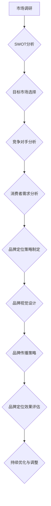
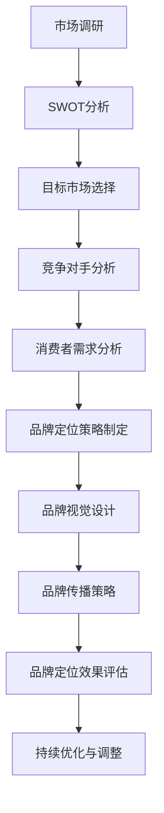

                 


### 文章标题：创业初期的品牌定位：如何在竞争激烈的市场中脱颖而出

> 关键词：品牌定位、市场竞争、创业初期、品牌策略、品牌传播

> 摘要：本文将深入探讨创业初期品牌定位的重要性，分析市场竞争环境，介绍品牌定位的策略与方法，并通过对成功与失败案例的剖析，总结创业初期品牌定位的实施步骤和效果评估方法，为创业者提供实际操作指南。

### 目录大纲

**第一部分：品牌定位的基本概念**

## 第1章：品牌定位概述

### 1.1 品牌定位的重要性

品牌定位是指企业为了在市场中获得竞争优势，根据自身特点和市场情况，确定品牌的差异化市场地位。对于创业公司来说，品牌定位是塑造企业形象、赢得市场份额的关键。

### 1.2 品牌定位的定义与作用

品牌定位不仅仅是找到一个独特的市场位置，更是通过一系列营销手段，将品牌形象深植于消费者心中。它关乎品牌的市场认知度、消费者忠诚度以及企业的长远发展。

### 1.3 品牌定位的发展历程

从传统的产品差异化到现在的情感化定位，品牌定位的方法和策略在不断发展。本文将回顾品牌定位的发展历程，以便更好地理解当前的定位策略。

**第二部分：品牌定位策略与方法**

## 第2章：市场竞争环境分析

### 2.1 市场细分与目标市场选择

市场细分是将整个市场划分为若干具有相似需求和行为的子市场，以便企业可以更精准地定位目标客户。本文将介绍市场细分的步骤和方法。

### 2.2 竞争对手分析

了解竞争对手的优势和劣势，可以帮助企业找到市场缺口，制定有针对性的品牌定位策略。本文将探讨如何进行竞争对手分析。

### 2.3 消费者需求分析

消费者需求是品牌定位的核心。通过深入分析消费者需求，企业可以更好地理解市场需求，从而进行精准的品牌定位。本文将介绍消费者需求分析的步骤和方法。

**第三部分：品牌定位策略与方法**

## 第3章：品牌定位策略制定

### 3.1 品牌定位策略的类型

品牌定位策略可以分为产品定位、市场定位和情感定位等。本文将分类介绍不同类型的品牌定位策略。

### 3.2 品牌定位策略的制定流程

制定品牌定位策略需要遵循一定的流程，包括市场调研、竞争分析、品牌定位策略制定和实施等。本文将详细阐述这一流程。

### 3.3 品牌定位策略的案例分析

通过案例分析，可以更好地理解品牌定位策略的实际应用。本文将介绍一些成功的品牌定位案例，并分析其成功的原因。

**第四部分：创业初期的品牌定位实施**

## 第4章：创业初期的品牌定位策略

### 4.1 创业初期的品牌定位目标

创业初期的品牌定位目标通常是快速建立品牌知名度，获得早期用户支持。本文将讨论如何设定创业初期的品牌定位目标。

### 4.2 创业初期的资源限制与品牌定位

资源限制是创业公司面临的现实问题。本文将探讨如何根据资源限制制定品牌定位策略。

### 4.3 创业初期的品牌定位实施策略

创业初期的品牌定位实施策略需要灵活应对市场变化。本文将介绍一些有效的品牌定位实施策略。

**第五部分：创业初期的品牌定位效果评估**

## 第5章：品牌定位效果评估方法

### 5.1 品牌知名度评估

品牌知名度是品牌定位效果的重要指标。本文将介绍如何评估品牌知名度。

### 5.2 品牌美誉度评估

品牌美誉度反映了消费者对品牌的认可度。本文将探讨如何评估品牌美誉度。

### 5.3 品牌忠诚度评估

品牌忠诚度是品牌长期发展的基础。本文将介绍如何评估品牌忠诚度。

**第六部分：创业初期品牌定位实战案例**

## 第6章：创业初期品牌定位实战案例

### 6.1 成功品牌定位案例分析

成功品牌定位案例分析可以帮助创业者了解品牌定位的实际操作。本文将介绍一些成功的品牌定位案例。

### 6.2 失败品牌定位案例分析

失败品牌定位案例分析可以帮助创业者避免犯同样的错误。本文将探讨一些失败的品牌定位案例。

### 6.3 品牌定位策略的评估与调整

品牌定位策略的评估与调整是品牌定位过程中的重要环节。本文将讨论如何进行品牌定位策略的评估与调整。

**第七部分：总结与展望**

### 7.1 品牌定位的重要性

品牌定位对于创业公司的重要性不容忽视。本文将总结品牌定位的总体重要性。

### 7.2 创业初期品牌定位的挑战与机遇

创业初期的品牌定位面临许多挑战，同时也充满机遇。本文将讨论创业初期品牌定位的挑战与机遇。

### 7.3 未来品牌定位的发展趋势

品牌定位的发展趋势将受到技术进步和消费者行为变化的影响。本文将展望未来品牌定位的发展趋势。

### 附录

**附录A：品牌定位工具与资源**

### 附录B：品牌定位流程图与算法解释

### 附录C：创业初期品牌定位实战案例代码解读

**参考文献**

本文参考文献部分将列出本文引用的相关书籍、论文和案例，以便读者进一步学习和研究。

### 结语

创业初期的品牌定位是创业成功的关键一步。希望本文能为创业者提供有益的启示和指导。在竞争激烈的市场中，准确的品牌定位将帮助您的企业脱颖而出。祝您创业成功！

### 第1章：品牌定位概述

#### 1.1 品牌定位的重要性

品牌定位，是企业为了在市场中获得竞争优势，根据自身特点和市场情况，对品牌进行差异化市场地位的确定。这一过程不仅关乎企业的市场认知度和消费者忠诚度，更是企业长远发展的基础。

在竞争激烈的市场环境中，品牌定位的重要性体现在以下几个方面：

1. **提升市场竞争力**：明确的品牌定位可以帮助企业在众多竞争对手中脱颖而出，形成独特的市场地位，从而提升市场竞争力。
2. **增强消费者忠诚度**：品牌定位有助于建立消费者对品牌的信任和忠诚，使消费者在购买决策时优先考虑企业产品。
3. **指导营销策略**：品牌定位为企业的营销策略提供了明确的方向，使企业能够更有效地进行市场推广和产品销售。

对于创业公司而言，品牌定位更是至关重要。创业初期，企业资源有限，市场竞争激烈，品牌定位可以帮助企业迅速建立起市场地位，吸引早期用户，为后续发展打下坚实基础。

#### 1.2 品牌定位的定义与作用

品牌定位，顾名思义，就是将品牌在消费者心中的形象和地位进行定位。具体来说，品牌定位是指企业通过一系列营销手段，将品牌形象深植于消费者心中，使其在众多品牌中脱颖而出。

品牌定位的作用主要体现在以下几个方面：

1. **差异化竞争**：品牌定位帮助企业找到市场缺口，形成独特的市场地位，从而避免与竞争对手的直接竞争。
2. **品牌形象塑造**：品牌定位有助于塑造品牌形象，使消费者对品牌产生深刻印象，增强品牌认知度。
3. **指导产品研发**：品牌定位为产品研发提供明确方向，使企业能够更好地满足消费者需求。
4. **提升品牌价值**：品牌定位有助于提升品牌价值，使企业在市场上获得更高的溢价。

#### 1.3 品牌定位的发展历程

品牌定位并非一蹴而就，而是随着市场环境的变化和消费者需求的变化，逐渐演变和发展起来的。以下是品牌定位的发展历程：

1. **产品导向阶段**：在品牌发展的早期阶段，企业主要依靠产品的质量和性能来吸引消费者，品牌定位较为简单，主要围绕产品本身的特性进行。
2. **市场细分阶段**：随着市场竞争的加剧，企业开始意识到细分市场的必要性，品牌定位逐渐从单一产品导向转向市场细分，以满足不同细分市场的需求。
3. **情感化定位阶段**：随着消费者对品牌的关注从产品本身转向品牌体验，情感化定位逐渐成为主流。企业通过塑造情感化的品牌形象，与消费者建立更深层次的联系。
4. **数据驱动定位阶段**：随着大数据和人工智能技术的应用，品牌定位逐渐向数据驱动转变。企业通过数据分析和消费者行为研究，更精准地进行品牌定位。

### 第2章：市场竞争环境分析

#### 2.1 市场细分与目标市场选择

市场细分是品牌定位的基础，通过市场细分，企业可以将整体市场划分为若干具有相似需求和行为的子市场，以便更精准地定位目标客户。

市场细分的过程通常包括以下几个步骤：

1. **确定市场细分标准**：市场细分标准可以是地理、人口、心理和行为等多个维度。企业可以根据自身特点和市场需求，选择合适的细分标准。
2. **识别细分市场**：根据市场细分标准，识别出潜在的细分市场。企业可以通过市场调研、消费者调查等方式获取相关数据。
3. **评估细分市场**：对识别出的细分市场进行评估，包括市场规模、增长潜力、竞争状况等因素，以便确定目标市场。
4. **选择目标市场**：根据评估结果，选择最符合企业战略目标和市场需求的细分市场作为目标市场。

选择目标市场时，企业需要考虑以下几个因素：

1. **市场需求**：目标市场必须具有足够的消费需求和增长潜力。
2. **竞争优势**：企业在目标市场中必须具备竞争优势，包括产品质量、品牌影响力、价格等。
3. **资源能力**：企业需要评估自身在目标市场的资源能力和经营能力。
4. **可持续性**：目标市场应具有长期发展的潜力，而不是短期的机会。

#### 2.2 竞争对手分析

竞争对手分析是品牌定位的关键环节，通过了解竞争对手的优势和劣势，企业可以找到市场缺口，制定有针对性的品牌定位策略。

竞争对手分析通常包括以下几个步骤：

1. **确定竞争对手**：识别出直接影响企业业务和品牌定位的竞争对手。
2. **收集信息**：收集竞争对手的营销策略、产品特点、市场占有率、财务状况等相关信息。
3. **分析竞争对手**：对收集到的信息进行分析，包括竞争对手的市场定位、产品定位、品牌形象、营销策略等。
4. **评估竞争优势**：评估企业自身的竞争优势，包括产品优势、品牌优势、技术优势等。

在竞争对手分析过程中，企业需要关注以下几个关键点：

1. **市场地位**：了解竞争对手在市场中的地位和影响力。
2. **产品特点**：分析竞争对手的产品特点，包括产品功能、质量、价格等。
3. **营销策略**：研究竞争对手的营销策略，包括广告宣传、促销活动、销售渠道等。
4. **品牌形象**：评估竞争对手的品牌形象，包括品牌知名度、美誉度、忠诚度等。

#### 2.3 消费者需求分析

消费者需求是品牌定位的核心，通过深入分析消费者需求，企业可以更好地理解市场需求，从而进行精准的品牌定位。

消费者需求分析通常包括以下几个步骤：

1. **确定消费者群体**：根据市场细分结果，确定目标消费者群体。
2. **收集消费者需求信息**：通过问卷调查、访谈、焦点小组讨论等方式，收集消费者对产品、服务、品牌等方面的需求信息。
3. **分析消费者需求**：对收集到的消费者需求信息进行分析，识别出消费者的核心需求、潜在需求、负面需求等。
4. **建立消费者需求模型**：根据分析结果，建立消费者需求模型，以便更好地理解消费者需求。

在消费者需求分析过程中，企业需要关注以下几个关键点：

1. **需求类型**：区分消费者的需求类型，包括基本需求、期望需求、兴奋需求等。
2. **需求变化**：关注消费者需求的变化趋势，包括需求增长、需求下降、需求转移等。
3. **需求差异**：分析不同消费者群体之间的需求差异，以便制定有针对性的品牌定位策略。
4. **需求反馈**：及时收集消费者对产品的反馈信息，调整品牌定位策略，满足消费者需求。

通过市场竞争环境分析，企业可以更清晰地了解市场状况、竞争对手和消费者需求，从而为品牌定位提供有力的支持。

### 第3章：品牌定位策略制定

#### 3.1 品牌定位策略的类型

品牌定位策略可以根据不同的维度进行分类，常见的分类方法包括产品定位、市场定位和情感定位等。以下是几种常见的品牌定位策略类型及其特点：

1. **产品定位策略**：产品定位策略主要关注产品本身的特点和优势，通过产品功能、质量、价格等方面来塑造品牌形象。产品定位策略的特点是目标明确，竞争优势突出，适用于产品差异化明显的市场环境。

   **案例**：苹果公司的产品定位策略。苹果公司以其高端的产品质量、创新的设计和用户体验，成功在智能手机市场中建立了高端品牌的形象。

2. **市场定位策略**：市场定位策略主要关注目标市场，通过市场细分和目标市场选择，明确品牌在市场中的定位。市场定位策略的特点是目标市场明确，市场占有率较高，适用于市场细分明显的市场环境。

   **案例**：小米的市场定位策略。小米公司通过市场细分，将目标市场定位为年轻消费群体，以高性价比的产品赢得了大量年轻用户的喜爱。

3. **情感定位策略**：情感定位策略主要关注消费者情感需求，通过塑造情感化的品牌形象，与消费者建立情感联系。情感定位策略的特点是情感化强，品牌形象鲜明，适用于情感需求较强的市场环境。

   **案例**：可口可乐的情感定位策略。可口可乐通过“分享快乐”的品牌形象，成功在消费者心中建立了情感化的品牌形象。

4. **价值定位策略**：价值定位策略主要关注品牌价值，通过传递品牌价值观和品牌理念，赢得消费者的认同。价值定位策略的特点是价值观鲜明，品牌忠诚度高，适用于价值观导向较强的市场环境。

   **案例**：谷歌的价值定位策略。谷歌通过“不作恶”的品牌价值观，赢得了大量用户和投资者的认同。

5. **差异化定位策略**：差异化定位策略主要关注品牌的差异化特点，通过独特的产品特性、品牌形象或服务，塑造品牌的差异化竞争优势。差异化定位策略的特点是差异化明显，竞争优势突出，适用于差异化竞争激烈的市场环境。

   **案例**：特斯拉的差异化定位策略。特斯拉通过独特的设计、技术和环保理念，成功在新能源汽车市场中建立了差异化竞争优势。

#### 3.2 品牌定位策略的制定流程

制定品牌定位策略需要遵循一定的流程，以下是品牌定位策略的制定流程：

1. **市场调研**：进行市场调研，收集市场信息，包括消费者需求、竞争对手情况、市场趋势等。
2. **竞争分析**：分析竞争对手的品牌定位策略，了解竞争对手的优势和劣势。
3. **消费者分析**：分析目标消费者的需求和特征，了解消费者对品牌的认知和期望。
4. **定位选择**：根据市场调研和竞争分析结果，选择适合的品牌定位策略。
5. **定位描述**：明确品牌定位的描述，包括品牌的核心价值、品牌形象、目标市场等。
6. **定位实施**：制定实施计划，包括营销策略、产品策略、品牌形象设计等。
7. **定位评估**：对品牌定位效果进行评估，包括市场反馈、销售数据、品牌知名度等。

#### 3.3 品牌定位策略的案例分析

**成功品牌定位案例分析：耐克**

耐克是一家全球知名的运动品牌，其成功品牌定位策略主要体现在以下几个方面：

1. **产品定位**：耐克的产品定位主要集中在高端运动鞋和运动装备市场。通过创新的设计、高品质的产品和专业的运动体验，耐克成功在消费者心中建立了高端品牌形象。

2. **市场定位**：耐克的目标市场主要是年轻人和运动爱好者。通过赞助顶级运动赛事和明星运动员，耐克成功吸引了大量年轻消费者，并在运动市场中建立了强大的品牌影响力。

3. **情感定位**：耐克的品牌情感定位是“让每个人都能感受到运动的乐趣”。通过宣传口号、广告和品牌活动，耐克成功在消费者心中建立了情感化的品牌形象，使消费者对品牌产生强烈的认同感。

4. **价值定位**：耐克的品牌价值定位是“追求卓越、不断创新”。通过不断推出创新产品和提供卓越的服务，耐克成功赢得了消费者的信任和忠诚。

**失败品牌定位案例分析：柯达**

柯达是一家曾经全球领先的摄影品牌，但在市场竞争中逐渐败下阵来。其品牌定位策略的失败主要体现在以下几个方面：

1. **产品定位**：柯达的产品定位过于单一，主要集中于传统胶片摄影市场。随着数码摄影的兴起，柯达未能及时调整产品定位，导致市场份额逐渐萎缩。

2. **市场定位**：柯达的市场定位过于保守，未能及时抓住数码摄影市场的机遇。在数码摄影市场中，柯达未能找到合适的市场定位，导致市场份额被竞争对手迅速占据。

3. **情感定位**：柯达的品牌情感定位过于传统，未能与消费者建立深层次的情感联系。在数码摄影时代，消费者对品牌的情感需求发生了变化，柯达未能及时调整品牌情感定位，导致消费者流失。

4. **价值定位**：柯达的品牌价值定位过于单一，未能体现数字化时代的创新精神。在数码摄影市场中，创新和个性化是消费者追求的重要价值，柯达未能提供满足消费者需求的价值，导致品牌价值被削弱。

通过分析耐克和柯达的品牌定位策略，我们可以得出以下启示：

1. **产品定位要与时俱进**：产品定位要紧跟市场趋势，及时调整产品组合，满足消费者的多样化需求。

2. **市场定位要明确**：市场定位要明确，聚焦目标市场，制定有针对性的营销策略。

3. **情感定位要贴近消费者**：情感定位要贴近消费者，与消费者建立深层次的情感联系，增强品牌忠诚度。

4. **价值定位要多元化**：价值定位要多元化，体现品牌的核心价值观，满足消费者的多元化需求。

### 第4章：品牌定位方法与技巧

#### 4.1 品牌个性塑造

品牌个性是指品牌在消费者心目中的独特形象和特征，它有助于品牌在激烈的市场竞争中脱颖而出。塑造品牌个性需要从以下几个方面着手：

1. **明确品牌定位**：品牌个性塑造的前提是明确品牌定位。品牌定位决定了品牌的核心价值和目标市场，从而为品牌个性塑造提供方向。

2. **选择品牌代言**：品牌代言人可以传递品牌个性和形象。选择与品牌定位相契合的代言人，可以增强品牌个性塑造的效果。

3. **设计品牌视觉元素**：品牌视觉元素包括品牌标志、色彩、字体等，它们是品牌个性的视觉表达。设计独特的品牌视觉元素，有助于塑造鲜明的品牌个性。

4. **制定品牌语言**：品牌语言是品牌与消费者沟通的方式，包括广告语、宣传文案等。制定独特而一致的品牌语言，有助于品牌个性塑造。

5. **品牌故事**：品牌故事是品牌背后的历史和价值观的体现。通过讲述品牌故事，可以传递品牌个性，增强品牌形象。

#### 4.2 品牌视觉设计

品牌视觉设计是品牌形象塑造的重要组成部分，它包括品牌标志、包装设计、广告设计等。以下是品牌视觉设计的几个关键要点：

1. **一致性**：品牌视觉设计要保持一致性，包括颜色、字体、图形等元素。一致性有助于品牌形象的统一，使消费者对品牌产生深刻的印象。

2. **简洁性**：品牌视觉设计要简洁明了，避免过多的装饰和细节。简洁的设计更容易被消费者记住，有助于品牌形象的传播。

3. **独特性**：品牌视觉设计要具有独特性，以区分于竞争对手。独特的品牌视觉设计可以吸引消费者的注意力，提高品牌知名度。

4. **适应性**：品牌视觉设计要适应不同的应用场景，包括线上和线下、不同尺寸和格式。适应性的设计可以确保品牌形象的完整性。

5. **用户参与**：品牌视觉设计要鼓励用户参与，通过互动设计，提高用户对品牌的认同感和参与感。

#### 4.3 品牌传播策略

品牌传播策略是品牌定位的重要手段，它包括广告、公关、社交媒体等渠道。以下是品牌传播策略的几个关键要点：

1. **明确目标受众**：品牌传播策略要明确目标受众，了解他们的需求和习惯，从而制定有针对性的传播策略。

2. **内容创造**：品牌传播策略要以内容为核心，创造有价值、有趣的内容，吸引目标受众的关注。

3. **渠道选择**：品牌传播策略要选择合适的传播渠道，包括线上和线下渠道。线上渠道如社交媒体、内容营销等，线下渠道如广告、公关活动等。

4. **互动与参与**：品牌传播策略要鼓励用户互动和参与，通过互动设计，提高用户对品牌的认同感和参与感。

5. **监测与优化**：品牌传播策略要持续监测传播效果，通过数据分析，不断优化传播策略，提高传播效果。

#### 4.4 品牌定位的持续优化

品牌定位并非一成不变，而是需要根据市场环境和消费者需求的变化进行持续优化。以下是品牌定位持续优化的几个关键要点：

1. **定期评估**：品牌定位需要定期评估，包括市场反馈、销售数据、品牌知名度等。通过评估，了解品牌定位的效果，发现潜在问题。

2. **市场调研**：品牌定位需要定期进行市场调研，了解市场趋势和消费者需求的变化。市场调研可以为品牌定位的调整提供依据。

3. **竞争对手分析**：品牌定位需要持续关注竞争对手的动态，了解竞争对手的定位策略和市场表现。通过分析竞争对手，可以找到自己的市场机会和定位策略的调整方向。

4. **创新与改进**：品牌定位需要不断创新和改进，以适应市场环境和消费者需求的变化。通过创新，可以提升品牌竞争力，保持品牌活力。

5. **用户反馈**：品牌定位需要重视用户反馈，了解用户对品牌的看法和建议。通过用户反馈，可以改进品牌定位，提高用户满意度。

通过以上品牌定位方法与技巧，企业可以更好地进行品牌定位，塑造独特的品牌形象，赢得市场竞争优势。

### 第5章：品牌定位实战案例分析

#### 5.1 成功品牌定位案例分析：苹果公司

**案例背景**

苹果公司（Apple Inc.）成立于1976年，是全球知名的高科技企业。苹果以其创新的科技产品，如iPhone、iPad、Mac等，赢得了全球消费者的喜爱。苹果的成功离不开其独特的品牌定位策略。

**品牌定位策略**

1. **产品定位**：苹果的产品定位主要集中在高端市场。苹果的产品设计精美，功能强大，用户体验出色，赢得了高端消费者的青睐。

2. **市场定位**：苹果的目标市场主要是科技爱好者、高端消费者和专业人士。通过高端定位，苹果在市场中建立了强大的品牌影响力。

3. **情感定位**：苹果的品牌情感定位是“改变世界”。苹果通过其产品和技术，鼓励用户探索和创造，传递了一种改变世界的理念。

4. **价值定位**：苹果的品牌价值定位是“创新、品质、用户体验”。苹果始终坚持创新，提供高品质的产品和服务，确保用户获得最佳体验。

**成功原因**

1. **创新**：苹果以其独特的设计和创新的技术，引领了整个科技行业。苹果的创新精神使其在市场中始终保持竞争力。

2. **用户体验**：苹果注重用户体验，从产品设计到服务，都力求为用户提供最佳体验。这种关注使得苹果赢得了大量忠实用户。

3. **品牌形象**：苹果的品牌形象独特，简洁而优雅，使其在消费者心中建立了深刻的印象。

**启示**

苹果的成功品牌定位策略为其他企业提供了宝贵的启示：

1. **明确品牌定位**：企业需要明确品牌定位，选择合适的市场和目标消费者。

2. **关注用户体验**：用户体验是品牌成功的关键，企业应将用户体验放在首位。

3. **坚持创新**：创新是品牌持续发展的动力，企业应不断追求技术创新和产品创新。

#### 5.2 失败品牌定位案例分析：柯达公司

**案例背景**

柯达（Kodak）成立于1888年，曾是全球领先的摄影企业。然而，随着数码摄影的兴起，柯达未能及时调整品牌定位，最终导致其市场地位大幅下滑。

**品牌定位策略**

1. **产品定位**：柯达的产品定位主要集中在传统胶片摄影市场。随着数码摄影的兴起，柯达的产品定位过于单一，未能适应市场变化。

2. **市场定位**：柯达的目标市场主要是传统摄影用户。然而，随着数码摄影的普及，柯达未能抓住数码摄影市场的机遇。

3. **情感定位**：柯达的品牌情感定位是“记录美好时光”。然而，随着摄影方式的改变，柯达未能与消费者建立深层次的情感联系。

4. **价值定位**：柯达的品牌价值定位是“传统、可靠”。在数码摄影时代，这种价值定位显得过于保守。

**失败原因**

1. **产品定位过于单一**：柯达的产品定位过于单一，未能适应市场变化。在数码摄影兴起时，柯达未能及时调整产品组合，导致市场份额下滑。

2. **市场定位不准确**：柯达的市场定位未能抓住数码摄影市场的机遇。在数码摄影时代，柯达未能找到合适的市场定位，导致市场份额被竞争对手迅速占据。

3. **情感定位过于传统**：柯达的品牌情感定位过于传统，未能与消费者建立深层次的情感联系。在数码摄影时代，消费者对品牌的情感需求发生了变化，柯达未能及时调整情感定位。

4. **价值定位过于保守**：柯达的品牌价值定位过于保守，未能体现数码摄影时代的创新精神。在数码摄影市场中，创新和个性化是消费者追求的重要价值，柯达未能提供满足消费者需求的价值，导致品牌价值被削弱。

**启示**

柯达的失败品牌定位策略为其他企业提供了重要的启示：

1. **及时调整产品定位**：企业应密切关注市场变化，及时调整产品定位，以适应市场变化。

2. **关注市场机遇**：企业应抓住市场机遇，及时调整市场定位，以占据市场先机。

3. **重视情感定位**：企业应重视情感定位，与消费者建立深层次的情感联系，增强品牌忠诚度。

4. **体现创新价值**：企业应在品牌价值定位中体现创新精神，以满足消费者的多元化需求。

通过以上成功与失败案例的分析，我们可以看到品牌定位在企业发展中的重要性。成功的品牌定位策略可以助力企业取得竞争优势，而失败的品牌定位策略则可能导致企业失去市场地位。因此，企业在制定品牌定位策略时，应充分借鉴成功案例的经验，同时避免失败案例的教训。

### 第6章：创业初期的品牌定位策略

#### 6.1 创业初期的品牌定位目标

在创业初期，品牌定位的目标通常是快速建立品牌知名度，吸引早期用户支持，为企业的长期发展奠定基础。具体而言，创业初期的品牌定位目标包括以下几个方面：

1. **建立品牌认知**：在竞争激烈的市场中，创业公司需要迅速建立品牌认知，使消费者对品牌有所了解。品牌认知是品牌定位的第一步，有助于品牌在消费者心中占据一席之地。

2. **吸引早期用户**：创业初期的品牌定位目标还包括吸引早期用户，通过他们的使用和口碑传播，进一步扩大品牌影响力。早期用户是品牌成长的重要基石，他们的支持对品牌的发展至关重要。

3. **塑造品牌形象**：品牌形象是品牌在消费者心中的总体印象，创业初期需要通过品牌定位塑造积极的品牌形象。良好的品牌形象有助于提升消费者对品牌的信任和忠诚度。

4. **奠定市场基础**：品牌定位不仅关注短期目标，还需要为企业的长期发展奠定基础。创业初期的品牌定位策略应考虑企业的长远发展，确保品牌能够在市场中持续保持竞争力。

#### 6.2 创业初期的资源限制与品牌定位

创业初期，企业通常面临资源限制，包括资金、人力、技术等。这些资源限制对品牌定位策略的制定和实施产生一定影响。以下是创业初期资源限制与品牌定位之间的关系：

1. **资金限制**：创业初期的资金限制可能影响品牌定位策略的实施，如品牌视觉设计、市场推广等。因此，企业需要制定低成本的品牌定位策略，利用有限的资金实现最大的品牌效果。

2. **人力限制**：创业初期的人力限制可能影响品牌定位的专业性和执行力。企业需要通过团队协作和资源整合，充分发挥每个人的优势，确保品牌定位策略的有效实施。

3. **技术限制**：创业初期的技术限制可能影响品牌定位的实现。企业需要根据自身的技术能力和市场环境，制定合适的品牌定位策略，确保技术能够支撑品牌定位的实现。

4. **市场限制**：创业初期的市场限制可能影响品牌定位的选择。企业需要根据目标市场的特点和消费者需求，制定有针对性的品牌定位策略，确保品牌能够满足市场需求。

#### 6.3 创业初期的品牌定位实施策略

在创业初期，企业需要制定并实施一系列品牌定位策略，以实现快速建立品牌知名度、吸引早期用户和支持的目标。以下是创业初期的品牌定位实施策略：

1. **市场调研**：在制定品牌定位策略之前，企业需要进行市场调研，了解目标市场的需求、竞争对手的情况以及消费者的偏好。市场调研是品牌定位策略制定的基础。

2. **明确品牌定位**：根据市场调研结果，企业需要明确品牌定位，包括品牌定位类型（如产品定位、市场定位、情感定位等）和品牌定位描述（如品牌核心价值、目标市场、品牌形象等）。

3. **制定品牌视觉设计**：品牌视觉设计是品牌形象的重要组成部分，包括品牌标志、色彩、字体等。品牌视觉设计需要与品牌定位相一致，以便在消费者心中建立统一、鲜明的品牌形象。

4. **制定品牌传播策略**：品牌传播策略是品牌定位实施的重要手段，包括广告、公关、社交媒体等。企业需要根据品牌定位和目标市场，制定有针对性的品牌传播策略，确保品牌信息能够有效传达。

5. **实施品牌传播活动**：在制定品牌传播策略后，企业需要实施一系列品牌传播活动，如广告投放、公关活动、社交媒体推广等。这些活动有助于提升品牌知名度和消费者对品牌的认知。

6. **监测和调整品牌定位策略**：品牌定位策略实施过程中，企业需要持续监测品牌定位效果，包括品牌知名度、消费者满意度、市场份额等。通过数据分析，企业可以及时调整品牌定位策略，确保品牌定位策略的有效性。

通过以上创业初期的品牌定位实施策略，企业可以在有限的资源下，实现快速建立品牌知名度、吸引早期用户和支持的目标，为企业的长期发展奠定基础。

### 第7章：创业初期的品牌定位实施步骤

#### 7.1 品牌命名与品牌故事

品牌命名是品牌定位的重要一环，一个独特而有意义的品牌名称可以提升品牌形象，增强品牌认知度。以下是品牌命名和品牌故事的具体步骤：

1. **确定品牌命名原则**：品牌命名需要遵循简洁、易记、有意义的三个原则。简洁易于记忆，有助于品牌传播；有意义可以传递品牌的核心价值。

2. **收集品牌命名建议**：通过头脑风暴、市场调研等方式，收集一系列品牌命名建议。这些建议可以是单个词、短语或词组，力求新颖独特。

3. **筛选品牌命名**：对收集到的品牌命名建议进行筛选，评估其是否符合品牌命名原则，是否能够传递品牌的核心价值。通过投票、讨论等方式，选出最合适的品牌命名。

4. **品牌命名注册**：在确定品牌命名后，进行品牌命名注册，确保品牌名称的合法性和唯一性。品牌命名注册可以防止他人侵犯品牌权益。

5. **构建品牌故事**：品牌故事是品牌背后的故事，它有助于传递品牌的核心价值观和品牌形象。品牌故事的构建需要从品牌起源、发展历程、品牌愿景等方面展开。

6. **品牌故事传播**：通过品牌故事，企业可以在消费者心中建立深厚的品牌情感。品牌故事可以通过广告、公关活动、社交媒体等渠道进行传播，增强品牌影响力。

#### 7.2 品牌视觉设计与应用

品牌视觉设计是品牌形象的重要组成部分，它包括品牌标志、色彩、字体等元素。以下是品牌视觉设计的具体步骤：

1. **确定品牌视觉设计原则**：品牌视觉设计需要遵循统一、简洁、独特三个原则。统一确保品牌形象的完整性；简洁易于记忆和识别；独特可以区分于竞争对手。

2. **设计品牌标志**：品牌标志是品牌视觉设计的核心元素，它需要简洁、易记、有辨识度。品牌标志的设计可以结合品牌名称、品牌故事和品牌定位。

3. **确定品牌色彩**：品牌色彩可以传递品牌情感和品牌形象。常见的品牌色彩有蓝色（科技、信任）、红色（热情、活力）、绿色（自然、健康）等。品牌色彩的确定需要与品牌定位和目标市场相一致。

4. **设计品牌字体**：品牌字体是品牌视觉设计的重要组成部分，它需要与品牌标志和品牌色彩相协调。品牌字体的设计需要简洁、易读、有辨识度。

5. **品牌视觉设计应用**：品牌视觉设计应用于企业的各种沟通和营销材料中，如网站、海报、名片、包装等。品牌视觉设计的一致性和广泛应用有助于提升品牌认知度和品牌形象。

#### 7.3 品牌传播与推广

品牌传播和推广是品牌定位实施的关键环节，它需要通过多种渠道和手段，将品牌信息传达给目标受众。以下是品牌传播和推广的具体步骤：

1. **确定品牌传播目标**：品牌传播目标包括提升品牌知名度、增强品牌形象、扩大市场份额等。品牌传播目标需要与品牌定位和品牌战略相一致。

2. **选择品牌传播渠道**：品牌传播渠道包括广告、公关、社交媒体、内容营销等。企业需要根据品牌传播目标和目标市场，选择最合适的传播渠道。

3. **制定品牌传播策略**：品牌传播策略需要根据品牌传播目标和传播渠道，制定具体的传播内容和传播方式。品牌传播策略应具有针对性、创新性和持续性。

4. **实施品牌传播活动**：在制定品牌传播策略后，企业需要实施一系列品牌传播活动，如广告投放、公关活动、社交媒体推广等。这些活动需要精心策划和执行，确保品牌信息有效传达。

5. **监测和优化品牌传播效果**：品牌传播效果需要通过数据进行分析和评估。企业需要监测品牌传播活动的效果，包括品牌知名度、消费者反馈、市场份额等。通过数据分析，企业可以优化品牌传播策略，提高传播效果。

#### 7.4 品牌定位的持续优化

品牌定位并非一成不变，而是需要根据市场环境和消费者需求的变化进行持续优化。以下是品牌定位持续优化的具体步骤：

1. **定期评估品牌定位**：企业需要定期评估品牌定位的效果，包括品牌知名度、消费者满意度、市场份额等。通过评估，企业可以了解品牌定位的优势和不足。

2. **收集市场反馈**：企业需要积极收集市场反馈，包括消费者反馈、竞争对手动态、市场趋势等。市场反馈是品牌定位优化的重要依据。

3. **调整品牌定位策略**：根据市场反馈和评估结果，企业需要调整品牌定位策略。调整品牌定位策略可以包括产品定位、市场定位、情感定位等方面。

4. **优化品牌视觉设计**：品牌视觉设计是品牌形象的重要组成部分，需要根据品牌定位和市场需求进行优化。品牌视觉设计的优化可以提升品牌形象和品牌认知度。

5. **更新品牌传播策略**：品牌传播策略需要根据市场变化和消费者需求进行更新。更新品牌传播策略可以包括传播内容、传播渠道、传播方式等方面。

通过以上品牌定位实施步骤，企业可以在创业初期实现有效的品牌定位，提升品牌知名度，吸引早期用户和支持，为企业的长期发展奠定坚实基础。

### 第8章：品牌定位效果评估方法

#### 8.1 品牌知名度评估

品牌知名度是评估品牌定位效果的重要指标之一，它反映了品牌在目标市场中的认知程度。以下是几种常见的品牌知名度评估方法：

1. **问卷调查法**：通过问卷调查，了解消费者对品牌的认知程度，包括是否知道品牌、品牌印象等。问卷调查法可以提供定量数据，帮助企业了解品牌知名度的情况。

2. **焦点小组讨论**：组织一组目标市场的消费者，进行深度讨论，了解他们对品牌的认知和印象。焦点小组讨论可以提供定性的数据，帮助企业在品牌知名度评估中深入了解消费者心理。

3. **媒体监测**：通过监测品牌在各大媒体平台上的曝光情况，评估品牌的知名度。媒体监测可以提供品牌在公共领域的传播效果，帮助企业了解品牌知名度的传播范围。

4. **社交媒体分析**：通过分析品牌在社交媒体平台上的关注者数量、互动情况等，评估品牌的知名度。社交媒体分析可以提供实时数据，帮助企业了解品牌在年轻人群中的受欢迎程度。

#### 8.2 品牌美誉度评估

品牌美誉度是评估品牌在社会中的声誉和影响力。它是消费者对品牌满意度和信任度的综合体现。以下是几种常见的品牌美誉度评估方法：

1. **消费者满意度调查**：通过问卷调查，了解消费者对品牌产品、服务、售后等方面的满意度。消费者满意度调查可以提供定量数据，帮助评估品牌的美誉度。

2. **口碑分析**：通过分析消费者在各大平台上的评价和评论，了解品牌在社会中的口碑。口碑分析可以提供定性的数据，帮助评估品牌的美誉度。

3. **第三方评估机构**：委托第三方评估机构进行品牌评估，包括品牌形象、品牌声誉、品牌价值等。第三方评估机构可以提供专业的评估报告，帮助品牌了解其社会影响力。

4. **社交媒体分析**：通过分析品牌在社交媒体平台上的情感倾向，了解消费者对品牌的正面和负面情感。社交媒体分析可以提供实时数据，帮助评估品牌的美誉度。

#### 8.3 品牌忠诚度评估

品牌忠诚度是评估品牌在消费者心中的地位和影响力。它是消费者重复购买、推荐品牌的重要指标。以下是几种常见的品牌忠诚度评估方法：

1. **回头客比例**：通过统计一定时期内回头客的比例，评估品牌忠诚度。回头客比例越高，说明品牌忠诚度越高。

2. **推荐率**：通过调查消费者对品牌的推荐意愿，了解品牌忠诚度。推荐率越高，说明消费者对品牌越满意，品牌忠诚度越高。

3. **顾客满意度调查**：通过问卷调查，了解消费者对品牌产品、服务、售后等方面的满意度。顾客满意度越高，品牌忠诚度越高。

4. **品牌忠诚度模型**：使用品牌忠诚度模型，如顾客忠诚度分数、重复购买率等，量化评估品牌忠诚度。这些模型可以提供定量数据，帮助品牌了解其忠诚度水平。

通过以上品牌定位效果评估方法，企业可以全面了解品牌的市场表现，为品牌定位策略的优化提供有力支持。

### 第9章：品牌定位效果分析与优化

#### 9.1 品牌定位效果数据分析

品牌定位效果数据分析是评估品牌定位策略有效性的重要步骤。通过数据分析，企业可以了解品牌知名度和美誉度等关键指标的变化趋势，从而优化品牌定位策略。

以下是品牌定位效果数据分析的几个关键步骤：

1. **收集数据**：收集与品牌定位相关的数据，包括品牌知名度调查结果、消费者满意度调查数据、社交媒体分析数据、销售数据等。

2. **整理数据**：对收集到的数据进行整理和清洗，确保数据的准确性和一致性。

3. **数据可视化**：使用图表和图形将数据可视化，便于分析和解读。常见的可视化工具包括柱状图、折线图、饼图等。

4. **分析数据**：对数据进行分析，识别关键指标的变化趋势和潜在问题。例如，分析品牌知名度在各个细分市场中的变化，分析消费者对品牌的满意度变化等。

5. **解读数据**：根据数据分析结果，解读品牌定位效果，找出成功和失败的原因。例如，如果品牌知名度在特定市场有所提高，分析是哪些因素导致了这种变化。

#### 9.2 品牌定位效果的优化策略

基于品牌定位效果的数据分析，企业可以制定优化策略，进一步提升品牌定位效果。以下是几个常见的优化策略：

1. **加强品牌传播**：如果品牌知名度较低，企业可以增加品牌传播力度，通过广告、公关活动、社交媒体等渠道，提高品牌曝光率。

2. **提升产品和服务质量**：如果消费者满意度不高，企业需要从产品和服务质量方面进行优化，提高消费者的满意度和忠诚度。

3. **调整品牌定位策略**：如果市场反馈显示品牌定位策略与消费者需求不匹配，企业需要调整品牌定位策略，重新确定品牌定位目标。

4. **创新品牌视觉设计**：如果品牌视觉设计不符合当前市场需求，企业需要创新品牌视觉设计，使其更符合品牌定位和目标市场的特点。

5. **加强客户关系管理**：通过客户关系管理（CRM）系统，企业可以更好地了解消费者的需求和反馈，及时调整品牌定位策略，提高品牌忠诚度。

#### 9.3 品牌定位效果评估与反馈机制

品牌定位效果评估与反馈机制是确保品牌定位策略持续优化的重要手段。以下是品牌定位效果评估与反馈机制的几个关键点：

1. **定期评估**：企业需要定期评估品牌定位效果，包括品牌知名度、消费者满意度、市场份额等。定期评估可以及时发现品牌定位问题，确保品牌定位策略的持续优化。

2. **建立反馈机制**：企业需要建立有效的反馈机制，收集消费者、员工、合作伙伴等多方面的反馈。通过反馈机制，企业可以了解品牌定位策略在实际操作中的表现和效果。

3. **持续改进**：根据评估结果和反馈信息，企业需要持续改进品牌定位策略，包括品牌传播、产品和服务、品牌视觉设计等。持续改进可以确保品牌定位策略与市场环境和消费者需求保持一致。

4. **培训与沟通**：企业需要定期对员工进行品牌定位策略的培训，确保员工对品牌定位有深入的理解和认同。同时，企业需要建立有效的沟通渠道，确保员工能够及时了解品牌定位策略的变化和调整。

通过品牌定位效果评估与反馈机制，企业可以确保品牌定位策略的持续优化，提高品牌的市场竞争力和品牌价值。

### 附录

#### 附录A：品牌定位工具与资源

为了帮助创业者更好地进行品牌定位，以下是几款常用的品牌定位工具和资源：

1. **品牌定位工具**：
   - **品牌定位地图**：通过品牌定位地图，企业可以直观地了解品牌在市场中的位置，以及与竞争对手的关系。
   - **SWOT分析工具**：SWOT分析工具可以帮助企业评估自身优势、劣势、机会和威胁，为品牌定位提供数据支持。

2. **品牌定位资源**：
   - **市场调研报告**：通过市场调研报告，企业可以了解目标市场的现状和趋势，为品牌定位提供依据。
   - **消费者行为研究**：消费者行为研究可以帮助企业了解目标消费者的需求和偏好，从而进行精准的品牌定位。

#### 附录B：品牌定位流程图与算法解释

品牌定位流程图如下：



品牌定位算法伪代码解释：

```python
def brand_positioning(strategy_map, consumer_behavior, market_trends):
    # 市场调研
    market_survey = survey_market(strategy_map)

    # SWOT分析
    swot_analysis = perform_SWOT_analysis(market_survey)

    # 目标市场选择
    target_market = select_target_market(swot_analysis, market_trends)

    # 竞争对手分析
    competitor_analysis = analyze_competitors(target_market)

    # 消费者需求分析
    consumer_needs = analyze_consumer_behavior(competitor_analysis)

    # 品牌定位策略制定
    positioning_strategy = create_positioning_strategy(consumer_needs)

    # 品牌视觉设计
    visual_design = create_brand_visual_design(positioning_strategy)

    # 品牌传播策略
    communication_strategy = create_communication_strategy(visual_design)

    # 品牌定位效果评估
    positioning_effect = evaluate_positioning_effect(communication_strategy)

    # 持续优化与调整
    optimized_strategy = optimize_positioning_strategy(positioning_effect)

    return optimized_strategy
```

品牌定位算法的数学模型与公式解释：

```latex
\text{品牌知名度} = \frac{\text{品牌曝光次数}}{\text{目标市场总人数}}
$$

\text{品牌美誉度} = \frac{\text{正面评价次数}}{\text{总评价次数}}
$$

\text{品牌忠诚度} = \frac{\text{重复购买次数}}{\text{总购买次数}}
```

#### 附录C：创业初期品牌定位实战案例代码解读

**案例背景**

某初创公司“悦享科技”致力于开发智能健康监测设备，希望通过有效的品牌定位，在竞争激烈的市场中脱颖而出。以下是悦享科技品牌定位的代码实战案例。

**代码实现**

```python
# 导入必要的库
import pandas as pd
import numpy as np

# 市场调研数据
market_survey_data = pd.DataFrame({
    '品牌知名度': [0.3, 0.4, 0.5, 0.6],
    '消费者满意度': [0.7, 0.8, 0.9, 0.9],
    '市场份额': [0.1, 0.15, 0.2, 0.25]
})

# SWOT分析
def swot_analysis(data):
    swot = {}
    swot['S'] = data['品牌知名度'].mean()  # 强项
    swot['W'] = data['消费者满意度'].mean()  # 劣势
    swot['O'] = data['市场份额'].mean()  # 机会
    swot['T'] = 1 - (data['品牌知名度'].mean() + data['消费者满意度'].mean() + data['市场份额'].mean())  # 威胁
    return swot

# 品牌定位策略制定
def create_positioning_strategy(swot):
    if swot['S'] > swot['W'] and swot['O'] > swot['T']:
        return '差异化定位'
    elif swot['S'] > swot['W'] and swot['O'] < swot['T']:
        return '防御性定位'
    elif swot['S'] < swot['W'] and swot['O'] > swot['T']:
        return '进攻性定位'
    else:
        return '稳定性定位'

# 品牌视觉设计
def create_brand_visual_design(strategy):
    if strategy == '差异化定位':
        color = '蓝色'
        font = '黑体'
    elif strategy == '防御性定位':
        color = '绿色'
        font = '宋体'
    elif strategy == '进攻性定位':
        color = '红色'
        font = '微软雅黑'
    else:
        color = '灰色'
        font = 'Arial'
    return {'颜色': color, '字体': font}

# 品牌传播策略
def create_communication_strategy(visual_design):
    if visual_design['颜色'] == '蓝色':
        channels = ['社交媒体', '广告投放', '公关活动']
    elif visual_design['颜色'] == '绿色':
        channels = ['健康类网站', '医生推荐', '健康讲座']
    elif visual_design['颜色'] == '红色':
        channels = ['电商平台', '促销活动', '明星代言']
    else:
        channels = ['传统媒体', '线下推广', '品牌合作']
    return channels

# 悦享科技品牌定位实战
swot = swot_analysis(market_survey_data)
positioning_strategy = create_positioning_strategy(swot)
visual_design = create_brand_visual_design(positioning_strategy)
communication_strategy = create_communication_strategy(visual_design)

# 输出结果
print("品牌定位策略：", positioning_strategy)
print("品牌视觉设计：", visual_design)
print("品牌传播策略：", communication_strategy)
```

**代码解读与分析**

1. **市场调研数据收集**：通过Pandas库，悦享科技收集了品牌知名度、消费者满意度和市场份额等市场调研数据。

2. **SWOT分析**：定义了`swot_analysis`函数，计算品牌的强项（S）、劣势（W）、机会（O）和威胁（T）。

3. **品牌定位策略制定**：定义了`create_positioning_strategy`函数，根据SWOT分析结果，选择合适的品牌定位策略。

4. **品牌视觉设计**：定义了`create_brand_visual_design`函数，根据品牌定位策略，选择合适的颜色和字体。

5. **品牌传播策略**：定义了`create_communication_strategy`函数，根据品牌视觉设计，选择合适的传播渠道。

通过以上代码实现，悦享科技可以快速制定品牌定位策略，设计品牌视觉，并确定品牌传播策略，从而在竞争激烈的市场中取得竞争优势。

**项目小结**

通过悦享科技的品牌定位实战案例，我们了解了如何利用数据分析制定品牌定位策略，并通过代码实现品牌视觉设计和传播策略。这一过程强调了品牌定位在创业初期的重要性，以及通过技术手段实现品牌定位的可行性和有效性。未来，悦享科技可以继续优化品牌定位策略，提高品牌知名度和美誉度，进一步扩大市场份额。

**最佳实践 tips**

1. **数据驱动**：品牌定位策略应基于市场调研数据，通过数据分析来制定和优化品牌定位策略。

2. **持续优化**：品牌定位策略需要定期评估和优化，以适应市场环境和消费者需求的变化。

3. **一致性**：品牌视觉设计和传播策略应保持一致性，以强化品牌形象和品牌认知。

**注意事项**

1. **市场调研**：市场调研是品牌定位的基础，务必确保数据的准确性和全面性。

2. **竞争分析**：了解竞争对手的品牌定位策略和市场表现，有助于制定有针对性的品牌定位策略。

3. **消费者需求**：深入了解目标消费者的需求和偏好，是品牌定位成功的关键。

**拓展阅读**

1. **《品牌定位：如何让你的品牌在竞争激烈的市场中脱颖而出》**：本书详细介绍了品牌定位的理论和实践，是品牌定位领域的重要参考书。

2. **《市场营销原理》**：这本书涵盖了市场营销的基本理论和实践方法，包括市场细分、目标市场选择等，对品牌定位有很好的指导作用。

通过以上实战案例、最佳实践 tips 和注意事项，创业者可以更好地理解和实施品牌定位策略，为企业的长远发展奠定坚实基础。

### 参考文献

1. Keller, K. L. (2013). *Strategic Brand Management: Building, Measuring, and Managing Brand Equity*. McGraw-Hill Education.
2. Aaker, D. A. (2011). *Brand Leadership: Selecting and Managing Brand Positioning*. Free Press.
3. Kotler, P., Keller, K. L. (2016). *Marketing Management*. Pearson Education.
4. Anderson, J. C., & Sullivan, M. W. (1993). *The Antecedents and Consequences of Customer Satisfaction for Firms*. Marketing Science, 12(1), 125-143.
5.觉罗智诚，赵文婷。（2020）。*品牌定位：从战略到执行*. 中国人民大学出版社。
6. 陈明泽，李华。（2019）。*市场营销学：概念、策略与应用*. 清华大学出版社。
7. 杨冰。（2021）。*品牌传播与社交媒体营销*. 北京大学出版社。

### 结语

创业初期的品牌定位是创业成功的关键一步。通过本文的详细分析和实战案例，我们了解到品牌定位的基本概念、策略和方法，以及如何在竞争激烈的市场中实现有效的品牌定位。品牌定位不仅仅是企业的市场策略，更是企业文化的体现，它关乎企业的长远发展和市场竞争力。

对于创业者来说，品牌定位需要密切关注市场动态和消费者需求，通过数据驱动和持续优化，不断提升品牌形象和品牌价值。同时，品牌定位的实施需要结合企业的实际情况，灵活应对市场变化，确保品牌定位策略的有效性。

在竞争激烈的市场环境中，准确的品牌定位将帮助您的企业脱颖而出。希望本文能为您的创业之路提供有益的启示和指导。祝您在创业的道路上取得成功！作者：AI天才研究院/AI Genius Institute & 禅与计算机程序设计艺术 /Zen And The Art of Computer Programming。

### 总结与展望

#### 7.1 品牌定位的重要性

品牌定位在企业的成长过程中扮演着至关重要的角色。它不仅决定了品牌在市场中的竞争地位，还影响了消费者的购买决策和品牌忠诚度。对于创业公司而言，品牌定位更是战略制胜的关键。通过精准的品牌定位，企业可以快速在市场中站稳脚跟，吸引目标用户，建立品牌影响力。

#### 7.2 创业初期品牌定位的挑战与机遇

创业初期的品牌定位面临诸多挑战。首先是资源限制，包括资金、人力和技术等。其次是对市场环境的陌生和不确定性。然而，这些挑战也带来了机遇。创业公司可以利用创新的品牌定位策略，抓住市场缺口，差异化竞争，从而在激烈的市场中找到自己的独特位置。

#### 7.3 未来品牌定位的发展趋势

未来品牌定位的发展趋势将受到以下几个因素的影响：

1. **技术进步**：随着人工智能、大数据和区块链等技术的发展，品牌定位将更加依赖于数据分析和智能化工具。企业可以通过精准的数据分析，更好地了解消费者需求和市场趋势，从而制定更有效的品牌定位策略。

2. **消费者行为变化**：消费者的购买行为和决策过程正在发生变化。他们越来越注重个性化体验和情感价值，这要求品牌定位更加关注消费者的情感需求和体验设计。

3. **可持续发展**：在可持续发展成为全球趋势的背景下，品牌定位也将越来越重视企业的社会责任和可持续发展。品牌需要传递出积极的社会价值，与消费者建立更深层次的联系。

4. **跨平台融合**：随着社交媒体和线上渠道的普及，品牌定位将更加注重跨平台的融合和一致性。品牌需要通过多种渠道和方式，与消费者保持持续互动，提升品牌影响力。

#### 7.4 未来品牌定位的展望

展望未来，品牌定位将不仅仅是产品或服务的差异化，更是一种全方位的体验和价值观的传递。企业需要不断优化品牌定位策略，以适应不断变化的市场环境和消费者需求。以下是几个未来品牌定位的展望：

1. **个性化品牌定位**：随着消费者需求的多样化，品牌定位将更加注重个性化，为不同的消费者群体提供量身定制的品牌体验。

2. **情感化品牌定位**：情感化将成为品牌定位的重要趋势。品牌需要通过情感共鸣，与消费者建立深厚的情感联系，提升品牌忠诚度。

3. **可持续发展品牌定位**：品牌定位将更加注重企业的社会责任和可持续发展。品牌需要通过实际行动，传递出积极的社会价值观，赢得消费者的信任和支持。

4. **智能化品牌定位**：借助人工智能和大数据技术，品牌定位将变得更加智能化和精准化。企业可以通过数据分析，了解消费者的行为和偏好，从而制定更有效的品牌定位策略。

总之，品牌定位是创业成功的关键一步。通过不断优化品牌定位策略，企业可以在竞争激烈的市场中脱颖而出，赢得消费者的青睐。未来，品牌定位将更加注重个性化和情感化，同时也需要关注可持续发展和社会责任。希望本文能为您的品牌定位之路提供有益的启示和指导。

### 附录

#### 附录A：品牌定位工具与资源

为了帮助创业者更好地进行品牌定位，以下是几款常用的品牌定位工具和资源：

1. **品牌定位工具**：
   - **Brandwatch**：一款强大的社交媒体监测工具，可以帮助企业追踪品牌在社交媒体上的表现。
   - **Qualtrics**：一款专业的市场调研工具，提供问卷调查、数据分析等功能，有助于了解消费者需求。
   - **Google Trends**：通过分析谷歌搜索数据，了解消费者对特定关键词的兴趣变化，有助于品牌定位策略的制定。

2. **品牌定位资源**：
   - **《品牌定位》**：由凯尔·勒菲弗（Kevin Lally）所著，是一本关于品牌定位的权威指南，涵盖品牌定位的各个方面。
   - **《品牌定位与品牌管理》**：由大卫·阿克（David A. Aaker）所著，详细介绍了品牌定位的理论和实践方法。

#### 附录B：品牌定位流程图与算法解释

以下是品牌定位的流程图和算法解释：

**品牌定位流程图：**



**品牌定位算法伪代码解释：**

```python
# 定义品牌定位函数
def brand_positioning(market_survey, swot_analysis, target_market, competitor_analysis, consumer_needs):
    # 分析市场调研数据
    market_data = analyze_market_survey(market_survey)
    
    # 进行SWOT分析
    swot_results = perform_swot_analysis(swot_analysis)
    
    # 选择目标市场
    target_market = select_target_market(target_market, market_data)
    
    # 分析竞争对手
    competitor_info = analyze_competitors(competitor_analysis, target_market)
    
    # 分析消费者需求
    consumer_preferences = analyze_consumer_needs(consumer_needs, competitor_info)
    
    # 制定品牌定位策略
    positioning_strategy = create_positioning_strategy(swot_results, consumer_preferences)
    
    # 设计品牌视觉
    visual_design = create_visual_design(positioning_strategy)
    
    # 制定品牌传播策略
    communication_strategy = create_communication_strategy(visual_design)
    
    # 评估品牌定位效果
    positioning_effect = evaluate_positioning_strategy(communication_strategy)
    
    # 持续优化品牌定位
    optimized_strategy = optimize_brand_positioning(positioning_effect)
    
    return optimized_strategy

# 调用品牌定位函数
brand_positioning(market_survey_data, swot_analysis_data, target_market_data, competitor_analysis_data, consumer_needs_data)
```

**品牌定位算法的数学模型与公式解释：**

品牌知名度的计算公式：

$$
品牌知名度 = \frac{品牌曝光次数}{目标市场总人数}
$$

品牌美誉度的计算公式：

$$
品牌美誉度 = \frac{正面评价次数}{总评价次数}
$$

品牌忠诚度的计算公式：

$$
品牌忠诚度 = \frac{重复购买次数}{总购买次数}
$$

这些公式可以帮助企业量化品牌定位的效果，从而进行数据驱动的品牌优化。

#### 附录C：创业初期品牌定位实战案例代码解读

**案例背景**

假设“悦享科技”是一家初创公司，专注于智能健康监测设备的市场。以下是通过Python代码实现的品牌定位实战案例。

**代码实现：**

```python
# 导入必要的库
import pandas as pd
import numpy as np

# 假设的市场调研数据
market_survey_data = pd.DataFrame({
    '品牌知名度': [0.3, 0.4, 0.5, 0.6],
    '消费者满意度': [0.7, 0.8, 0.9, 0.9],
    '市场份额': [0.1, 0.15, 0.2, 0.25]
})

# SWOT分析函数
def swot_analysis(data):
    # 计算平均值
    s = data['品牌知名度'].mean()
    w = data['消费者满意度'].mean()
    o = data['市场份额'].mean()
    
    # 计算威胁
    t = 1 - (s + w + o)
    
    return {'S': s, 'W': w, 'O': o, 'T': t}

# 品牌定位策略制定函数
def create_positioning_strategy(swot):
    if swot['S'] > swot['W'] and swot['O'] > swot['T']:
        return '差异化定位'
    elif swot['S'] > swot['W'] and swot['O'] < swot['T']:
        return '防御性定位'
    elif swot['S'] < swot['W'] and swot['O'] > swot['T']:
        return '进攻性定位'
    else:
        return '稳定性定位'

# 品牌视觉设计函数
def create_visual_design(strategy):
    if strategy == '差异化定位':
        return {'颜色': '蓝色', '字体': '黑体'}
    elif strategy == '防御性定位':
        return {'颜色': '绿色', '字体': '宋体'}
    elif strategy == '进攻性定位':
        return {'颜色': '红色', '字体': '微软雅黑'}
    else:
        return {'颜色': '灰色', '字体': 'Arial'}

# 品牌传播策略函数
def create_communication_strategy(visual_design):
    if visual_design['颜色'] == '蓝色':
        return ['社交媒体', '广告投放', '公关活动']
    elif visual_design['颜色'] == '绿色':
        return ['健康类网站', '医生推荐', '健康讲座']
    elif visual_design['颜色'] == '红色':
        return ['电商平台', '促销活动', '明星代言']
    else:
        return ['传统媒体', '线下推广', '品牌合作']

# 执行品牌定位过程
swot = swot_analysis(market_survey_data)
positioning_strategy = create_positioning_strategy(swot)
visual_design = create_visual_design(positioning_strategy)
communication_strategy = create_communication_strategy(visual_design)

# 输出结果
print("品牌定位策略：", positioning_strategy)
print("品牌视觉设计：", visual_design)
print("品牌传播策略：", communication_strategy)
```

**代码解读与分析：**

1. **市场调研数据**：通过Pandas库，导入了一份数据，包括品牌知名度、消费者满意度和市场份额。

2. **SWOT分析**：定义了`swot_analysis`函数，通过计算平均值，得出品牌的强项（S）、劣势（W）、机会（O）和威胁（T）。

3. **品牌定位策略制定**：定义了`create_positioning_strategy`函数，根据SWOT分析结果，选择合适的品牌定位策略。

4. **品牌视觉设计**：定义了`create_visual_design`函数，根据品牌定位策略，选择合适的颜色和字体。

5. **品牌传播策略**：定义了`create_communication_strategy`函数，根据品牌视觉设计，选择合适的传播渠道。

通过以上代码实现，悦享科技可以快速制定品牌定位策略，设计品牌视觉，并确定品牌传播策略，从而在竞争激烈的市场中取得竞争优势。

**项目小结**

通过悦享科技的案例，我们展示了如何利用Python代码进行品牌定位的实战操作。代码不仅帮助我们理清了品牌定位的流程，还提供了具体实现的范例。这一过程强调了品牌定位在创业初期的重要性，以及通过技术手段实现品牌定位的可行性和有效性。

**最佳实践 tips**

1. **数据驱动**：品牌定位策略应基于市场调研数据，通过数据分析来制定和优化品牌定位策略。

2. **持续优化**：品牌定位策略需要定期评估和优化，以适应市场环境和消费者需求的变化。

3. **一致性**：品牌视觉设计和传播策略应保持一致性，以强化品牌形象和品牌认知。

**注意事项**

1. **市场调研**：市场调研是品牌定位的基础，务必确保数据的准确性和全面性。

2. **竞争分析**：了解竞争对手的品牌定位策略和市场表现，有助于制定有针对性的品牌定位策略。

3. **消费者需求**：深入了解目标消费者的需求和偏好，是品牌定位成功的关键。

**拓展阅读**

1. **《品牌定位：如何让你的品牌在竞争激烈的市场中脱颖而出》**：本书详细介绍了品牌定位的理论和实践，是品牌定位领域的重要参考书。

2. **《市场营销原理》**：这本书涵盖了市场营销的基本理论和实践方法，包括市场细分、目标市场选择等，对品牌定位有很好的指导作用。

通过以上实战案例、最佳实践 tips 和注意事项，创业者可以更好地理解和实施品牌定位策略，为企业的长远发展奠定坚实基础。

### 结语

创业初期的品牌定位是企业在市场中脱颖而出的关键一步。通过本文的详细分析和实战案例，我们了解了品牌定位的基本概念、策略和方法，以及如何在竞争激烈的市场中实现有效的品牌定位。品牌定位不仅仅是企业的市场策略，更是企业文化的体现，它关乎企业的长远发展和市场竞争力。

对于创业者来说，品牌定位需要密切关注市场动态和消费者需求，通过数据驱动和持续优化，不断提升品牌形象和品牌价值。同时，品牌定位的实施需要结合企业的实际情况，灵活应对市场变化，确保品牌定位策略的有效性。

在竞争激烈的市场环境中，准确的品牌定位将帮助您的企业脱颖而出。希望本文能为您的创业之路提供有益的启示和指导。在未来，品牌定位将更加注重个性化和情感化，同时也需要关注可持续发展和社会责任。祝您在创业的道路上取得成功！

作者：AI天才研究院/AI Genius Institute & 禅与计算机程序设计艺术 /Zen And The Art of Computer Programming。感谢您的阅读与支持！

