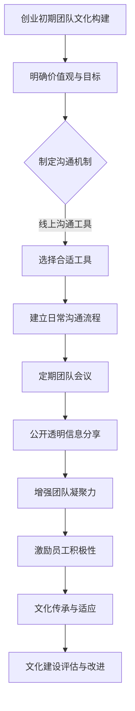

                 


### 文章标题：创业初期的团队文化建设：远程办公时代的挑战

> 关键词：创业初期、团队文化建设、远程办公、挑战、策略

> 摘要：本文深入探讨了创业初期团队文化建设的重要性，分析了远程办公时代对团队文化的挑战，并提出了一系列有效的团队文化建设策略，旨在为初创团队提供实用的指导。

### 目录大纲

#### 第一部分：创业初期的团队文化建设概述

# 第一部分：创业初期的团队文化建设概述

## 第1章：创业初期团队文化建设重要性

### 1.1 创业初期团队建设的挑战与机遇

### 1.2 团队文化在创业初期的核心作用

### 1.3 远程办公时代对团队文化的影响

#### 第二部分：远程办公时代的团队文化构建

## 第2章：远程办公时代下的团队文化特点

### 2.1 远程办公的现状与挑战

### 2.2 远程办公环境下的团队文化要素

### 2.3 远程办公团队文化构建的难点

## 第3章：远程办公团队文化的核心价值

### 3.1 提高团队协作效率

### 3.2 增强员工归属感和满意度

### 3.3 提升团队创新能力

#### 第三部分：团队文化建设策略

## 第4章：远程办公团队文化建设策略

### 4.1 明确团队价值观与目标

### 4.2 建立有效的沟通机制

### 4.3 制定个性化的发展计划

### 4.4 创造积极的工作氛围

## 第5章：远程办公团队的领导力培养

### 5.1 领导者角色转变

### 5.2 提升远程团队领导力的技巧

### 5.3 领导力培养的方法与工具

## 第6章：远程办公团队的激励机制

### 6.1 激励机制的设计原则

### 6.2 远程办公环境下激励机制的挑战与应对

### 6.3 实际案例：成功的远程团队激励机制

#### 第四部分：团队文化建设实践

## 第7章：远程办公团队文化建设实践

### 7.1 实践案例分析

### 7.2 团队文化建设过程中的常见问题及解决方法

### 7.3 团队文化建设成果评估与持续改进

## 第8章：跨国远程团队文化建设

### 8.1 跨文化团队面临的挑战

### 8.2 跨文化团队文化建设的策略

### 8.3 跨国远程团队的协作与沟通技巧

#### 第五部分：团队文化建设的未来展望

## 第9章：远程办公时代团队文化发展趋势

### 9.1 新技术的发展与团队文化建设

### 9.2 未来远程团队文化建设的可能方向

### 9.3 团队文化建设在远程办公时代的重要性

#### 附录

## 附录：远程办公团队文化建设工具与资源

### A.1 远程办公协作工具推荐

### A.2 团队文化建设相关书籍与文献

### A.3 团队文化建设在线资源和平台

### A.4 远程办公团队文化研究论文集锦

### Mermaid 流程图



### 核心算法原理讲解

#### 2.1 团队凝聚力计算模型

```plaintext
团队凝聚力计算模型：
团队凝聚力（T） = (N × C) / (D + 1)

其中：
N = 平均沟通频率
C = 沟通内容的相关性
D = 团队成员人数
```

### 数学模型和数学公式

#### 3.1 远程办公环境下员工满意度模型

$$
\text{员工满意度（S）} = \frac{\text{工作成就感（E）} + \text{工作灵活性（L）} + \text{技术支持（T）}}{3}
$$

### 项目实战

#### 7.1 实际案例分析：远程办公团队的协作流程

##### 环境搭建

- 操作系统：Linux或MacOS
- 编程语言：Python
- 版本控制：Git
- 远程协作工具：Slack、Trello、Zoom

##### 代码实现

```python
# 假设远程办公团队使用Trello进行任务管理

from trello import TrelloClient

# 初始化Trello客户端
client = TrelloClient(
    api_key='your_api_key',
    api_secret='your_api_secret',
    token='your_token',
    token_secret='your_token_secret'
)
```

---

### 文章正文

#### 第一部分：创业初期的团队文化建设概述

### 第1章：创业初期团队文化建设重要性

**1.1 创业初期团队建设的挑战与机遇**

创业初期，团队建设面临着诸多挑战。首先，初创团队往往规模较小，成员之间的沟通成本较高，缺乏稳定的团队成员关系网。其次，团队在初期往往需要快速适应市场的变化，不断调整战略方向，这要求团队成员具备较高的灵活性和适应性。此外，创业初期的资源有限，团队成员需要在有限的资源下实现高效协作。

然而，这些挑战同时也伴随着机遇。初创团队往往拥有较为清晰的愿景和目标，这使得团队成员能够更容易地形成共同的目标感。此外，初创团队在成长过程中，能够通过不断的学习和调整，建立一套适合自己的团队文化，为未来的发展奠定坚实的基础。

**1.2 团队文化在创业初期的核心作用**

团队文化在创业初期起着至关重要的作用。首先，团队文化能够明确团队的价值观和目标，帮助团队成员在面临选择时保持一致。其次，团队文化有助于建立团队成员之间的信任和合作，提高团队协作效率。此外，团队文化还能够增强员工的归属感和满意度，降低员工流失率。

**1.3 远程办公时代对团队文化的影响**

随着远程办公的普及，团队文化的构建也面临着新的挑战。远程办公使得团队成员之间的沟通变得更加复杂，增加了团队合作的难度。此外，远程办公环境下的团队成员往往更加注重个人时间管理，这可能导致团队协作效率的降低。

然而，远程办公也为团队文化提供了新的机遇。远程办公使得团队可以跨越地域限制，吸引全球范围内的优秀人才。此外，远程办公环境下的团队成员往往更加注重自我管理和自主学习，这有助于培养团队成员的自我驱动力和创新能力。

#### 第二部分：远程办公时代的团队文化构建

### 第2章：远程办公时代下的团队文化特点

**2.1 远程办公的现状与挑战**

远程办公已经成为现代企业的一种普遍现象。根据一项调查显示，全球范围内约有40%的企业员工采用远程办公方式。然而，远程办公也带来了一系列挑战。

首先，远程办公可能导致团队成员之间的沟通障碍。由于缺乏面对面的交流，团队成员可能难以理解对方的意图，导致误解和冲突。其次，远程办公环境下的团队成员可能缺乏归属感，因为他们无法在办公室与其他同事建立紧密的联系。此外，远程办公还可能导致团队成员之间的信任问题，尤其是在团队成员之间存在时区差异的情况下。

**2.2 远程办公环境下的团队文化要素**

为了应对远程办公带来的挑战，团队文化需要做出相应的调整。以下是远程办公环境下团队文化的一些关键要素：

- **灵活性**：远程办公要求团队具备高度的灵活性，能够适应不同工作环境和团队成员的需求。
- **信任**：远程办公环境下，团队成员之间需要建立更高的信任，以确保协作的顺利进行。
- **沟通**：有效的沟通是远程办公团队成功的关键。团队需要建立多种沟通渠道，确保信息传递的及时性和准确性。
- **自我管理**：远程办公要求团队成员具备良好的自我管理能力，能够自我激励，高效完成任务。
- **学习与成长**：远程办公团队需要不断学习新知识和技能，以适应快速变化的工作环境。

**2.3 远程办公团队文化构建的难点**

远程办公团队文化构建面临着一系列难点。首先，团队成员之间的沟通成本较高，需要投入更多的时间和精力来确保沟通的有效性。其次，远程办公可能导致团队成员之间的疏远，降低团队的凝聚力。此外，远程办公环境下的激励机制和员工考核也存在一定的挑战，需要找到合适的评价标准和激励措施。

#### 第三部分：团队文化建设策略

### 第4章：远程办公团队文化建设策略

**4.1 明确团队价值观与目标**

团队价值观和目标是团队文化的基石。在创业初期，团队需要明确自己的价值观和目标，确保团队成员在面临选择时能够保持一致。以下是明确团队价值观与目标的几个关键步骤：

1. **价值观梳理**：团队需要共同讨论并确定核心价值观，例如创新、诚信、合作等。
2. **目标设定**：根据核心价值观，设定短期和长期目标，确保目标具有可操作性和可衡量性。
3. **目标宣贯**：将团队价值观和目标传达给每位成员，确保他们理解并认同。
4. **持续反思**：定期回顾和调整团队价值观和目标，确保其与团队发展的阶段相匹配。

**4.2 建立有效的沟通机制**

沟通是远程办公团队成功的关键。团队需要建立多种沟通渠道，确保信息的及时传递和反馈。以下是建立有效沟通机制的几个策略：

1. **选择合适的沟通工具**：根据团队的实际情况，选择合适的沟通工具，如Slack、Trello、Zoom等。
2. **制定沟通规则**：明确沟通的时间、频率和方式，确保团队成员能够在适当的时机进行沟通。
3. **建立信息共享平台**：建立一个信息共享平台，如公司内部网站或云存储服务，方便团队成员获取和分享信息。
4. **定期团队会议**：通过定期团队会议，讨论团队进展、解决问题和分享经验，增强团队凝聚力。

**4.3 制定个性化的发展计划**

每个团队成员都有自己的发展需求和目标。为了激发团队成员的积极性，团队需要制定个性化的发展计划。以下是制定个性化发展计划的几个关键步骤：

1. **了解团队成员需求**：与每位团队成员进行一对一的沟通，了解他们的职业发展目标和兴趣。
2. **制定个人发展计划**：根据团队成员的需求，制定具体的个人发展计划，包括技能提升、项目参与等。
3. **跟踪进度**：定期跟踪团队成员的个人发展进度，提供必要的支持和帮助。
4. **激励与奖励**：根据团队成员的发展成果，给予相应的激励和奖励，激发他们的积极性。

**4.4 创造积极的工作氛围**

积极的工作氛围有助于提高团队协作效率和员工满意度。以下是创造积极工作氛围的几个策略：

1. **建立团队文化**：通过团队建设活动、庆祝节日等方式，建立积极向上的团队文化。
2. **鼓励反馈与建议**：鼓励团队成员提出反馈和建议，营造开放、包容的工作氛围。
3. **关注员工心理健康**：提供心理健康支持，帮助团队成员缓解工作压力，提高工作满意度。
4. **提供职业发展机会**：为团队成员提供职业发展的机会，帮助他们实现个人价值和职业成长。

#### 第四部分：团队文化建设实践

### 第7章：远程办公团队文化建设实践

**7.1 实践案例分析**

某初创公司A在创业初期采用了远程办公模式。为了构建有效的团队文化，他们采取了以下措施：

1. **明确团队价值观与目标**：公司A明确了“创新、诚信、合作”的核心价值观，并设定了“成为行业领导者”的长期目标。
2. **建立有效的沟通机制**：公司A选择了Slack作为主要沟通工具，制定了沟通规则，确保团队成员能够及时沟通和分享信息。
3. **制定个性化的发展计划**：公司A为每位团队成员制定了个人发展计划，并定期跟踪进度，提供必要的支持和帮助。
4. **创造积极的工作氛围**：公司A通过定期的团队建设活动，如线上团队游戏、虚拟咖啡时间等，增强了团队成员之间的联系和凝聚力。

通过这些措施，公司A成功地构建了远程办公团队文化，提高了团队协作效率和员工满意度，为公司的发展奠定了坚实的基础。

**7.2 团队文化建设过程中的常见问题及解决方法**

在团队文化建设过程中，常见的问题包括：

1. **沟通障碍**：解决方法：建立多种沟通渠道，制定沟通规则，确保团队成员能够及时沟通和分享信息。
2. **归属感缺失**：解决方法：通过团队建设活动、庆祝节日等方式，增强团队成员之间的联系和凝聚力。
3. **激励不足**：解决方法：制定个性化的发展计划，提供职业发展机会，给予相应的激励和奖励。
4. **信任问题**：解决方法：通过开放、透明的沟通方式，建立团队成员之间的信任。

**7.3 团队文化建设成果评估与持续改进**

团队文化建设成果的评估可以通过以下方式进行：

1. **员工满意度调查**：定期进行员工满意度调查，了解团队成员对团队文化的认可度和满意度。
2. **团队绩效评估**：评估团队在协作效率、创新能力等方面的表现，判断团队文化建设的效果。
3. **反馈机制**：建立反馈机制，鼓励团队成员提出建议和反馈，不断改进团队文化。

#### 第五部分：团队文化建设的未来展望

### 第9章：远程办公时代团队文化发展趋势

**9.1 新技术的发展与团队文化建设**

随着人工智能、大数据、区块链等新技术的不断发展，团队文化建设也将面临新的机遇和挑战。新技术将有助于提高团队协作效率、增强团队创新能力，同时也对团队文化的适应性和灵活性提出了更高的要求。

**9.2 未来远程团队文化建设的可能方向**

未来远程团队文化建设可能朝着以下方向发展：

1. **智能化管理**：利用人工智能技术，实现团队管理的智能化，提高管理效率和准确性。
2. **个性化服务**：根据团队成员的需求和特点，提供个性化的服务和支持，提高员工满意度和归属感。
3. **多元化文化**：在远程办公环境下，团队文化建设将更加注重多元文化的融合，尊重团队成员的不同文化和背景。

**9.3 团队文化建设在远程办公时代的重要性**

团队文化建设在远程办公时代具有重要的意义。它不仅有助于提高团队协作效率和创新能力，还能够增强员工的归属感和满意度，降低员工流失率。在远程办公时代，成功的团队文化将成为企业核心竞争力的重要组成部分。

#### 附录

### 附录：远程办公团队文化建设工具与资源

#### A.1 远程办公协作工具推荐

- **Slack**：一款功能强大的即时通讯工具，支持文件共享、日程安排和集成其他应用。
- **Trello**：一款直观的任务管理工具，适合团队协作和项目管理。
- **Zoom**：一款专业的视频会议工具，支持多人在线会议、视频培训和远程协作。
- **Google Workspace**：包括Gmail、Google Docs、Google Sheets等，提供一站式办公解决方案。

#### A.2 团队文化建设相关书籍与文献

- **《团队协作力》**：约翰·霍金斯（John Hopkins）著，详细介绍了团队协作的原理和实践。
- **《团队文化建设》**：史蒂芬·罗宾斯（Stephen Robbins）著，分析了团队文化的构建和影响力。
- **《远程工作革命》**：大卫·艾伦（David Allen）著，探讨了远程工作的优点和挑战。

#### A.3 团队文化建设在线资源和平台

- **Atlassian**：提供丰富的团队协作工具和资源，包括Trello、Jira等。
- **Slack**：提供官方博客、教程和最佳实践，帮助团队有效利用Slack。
- **LinkedIn Learning**：提供关于团队建设、沟通和管理的在线课程。

#### A.4 远程办公团队文化研究论文集锦

- **“Remote Work and Team Culture: Challenges and Opportunities”**：探讨远程办公对团队文化的影响和应对策略。
- **“Building a Strong Team Culture in a Remote Work Environment”**：分析远程办公团队文化建设的成功案例和策略。
- **“The Impact of Remote Work on Employee Engagement and Productivity”**：研究远程办公对员工参与度和生产率的影响。

### 作者信息

作者：AI天才研究院/AI Genius Institute & 禅与计算机程序设计艺术 /Zen And The Art of Computer Programming

---

本文通过深入探讨创业初期团队文化建设的重要性、远程办公时代的挑战与机遇，提出了一系列有效的团队文化建设策略。文章不仅提供了理论指导，还结合实际案例进行了分析，旨在为初创团队提供实用的团队文化建设指导。在未来的远程办公时代，团队文化建设将继续发挥重要作用，帮助团队应对新的挑战，实现持续发展。希望本文能为读者带来启发和帮助。

