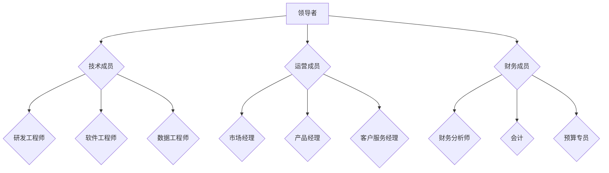

                 

### 引言：创业初期团队建设的重要性

#### **1.1 创业的定义与挑战**

创业，简而言之，就是创立一个新的企业或公司，通过创新的产品或服务来满足市场需求并创造价值。创业的过程往往充满了不确定性和挑战，从初期的构思到中期的市场验证，再到后期的规模化运营，每一步都需要创业者付出极大的努力和智慧。创业不仅需要良好的商业构想和市场需求分析，还需要强大的执行力、坚定的决心和持续的创新精神。

在创业初期，面临的挑战尤为严峻。首先是资源的匮乏，无论是资金、人脉还是技术，都处于一种极度紧缺的状态。其次，市场竞争激烈，同行业内的企业往往已经建立了稳定的客户基础和市场地位，初创企业需要付出更多的努力才能赢得一席之地。此外，团队的不稳定也是一个重大挑战。初创企业往往需要快速响应市场变化，这就要求团队成员具备高度的专业能力和协同合作的能力。

#### **1.2 团队建设在创业初期的关键角色**

团队建设在创业初期扮演着至关重要的角色。一个高效的团队不仅能够分担创始人的压力，还能提供多样化的思维和技能，从而更全面地应对创业过程中的各种挑战。

首先，团队是创业项目的执行者。创业初期，创始人往往需要将大部分精力投入到项目的研发和市场推广中，而团队成员则可以分担这些任务，从而确保项目的顺利推进。其次，团队是创新和协作的源泉。多样化的背景和技能组合可以激发更多的创意和解决方案，从而在激烈的市场竞争中脱颖而出。最后，团队是企业文化的重要组成部分。一个积极向上、团结协作的团队可以形成强大的企业文化，吸引更多的人才加入，同时也能够提高团队的凝聚力和工作效率。

#### **1.3 本书的结构与目的**

本书旨在系统地探讨创业初期团队建设的各个方面，为创业者提供实用的指导和建议。本书的结构如下：

- **第1章 引言**：介绍创业初期的团队建设重要性。
- **第2章 团队建设的核心概念**：讨论团队成员的角色与责任、团队文化的构建与维护。
- **第3章 如何吸引核心人才**：分析定位关键人才需求、招聘策略与渠道、面试技巧与评估方法。
- **第4章 如何留住核心人才**：探讨薪酬与福利的管理、职业发展的支持、企业文化的塑造。
- **第5章 团队建设的工具与方法**：介绍项目管理与协作工具、敏捷开发与迭代方法。
- **第6章 团队绩效评估与反馈**：讨论绩效评估的指标与方法、反馈机制与沟通策略。
- **第7章 案例分析与实战经验**：分析成功的团队组建案例和失败的团队组建案例。
- **第8章 面对挑战与变化：团队持续成长**：讨论应对团队发展的挑战和团队成长与持续改进。
- **第9章 结论**：总结团队建设与创业成功的关系。

通过本书的阅读，创业者可以了解到如何组建一支高效、稳定的团队，从而为创业成功奠定坚实的基础。

### 目录大纲：《创业初期的团队组建：如何吸引和留住核心人才》

为了帮助创业者系统地了解创业初期团队建设的重要性，本书将详细探讨从团队组建到核心人才吸引与留住的各个方面。以下是本书的详细目录大纲：

#### **第1章 引言：创业初期团队建设的重要性**

- **1.1 创业的定义与挑战**：介绍创业的基本概念以及创业初期的各种挑战。
- **1.2 团队建设在创业初期的关键角色**：探讨团队在创业初期的关键作用。
- **1.3 本书的结构与目的**：概述本书的结构和目的，帮助读者了解内容安排。

#### **第2章 团队建设的核心概念**

- **2.1 团队成员的角色与责任**
  - **2.1.1 领导者的角色与职责**：讨论领导者在团队中的角色和职责。
  - **2.1.2 技术成员的角色与职责**：探讨技术成员在团队中的作用和职责。
  - **2.1.3 运营成员的角色与职责**：分析运营成员在团队中的职责和作用。
- **2.2 团队文化的构建与维护**
  - **2.2.1 团队文化的定义与重要性**：介绍团队文化的定义及其重要性。
  - **2.2.2 建立团队文化的步骤**：讨论如何建立团队文化的具体步骤。
  - **2.2.3 维护团队文化的策略**：分析如何维护团队文化的有效策略。

#### **第3章 如何吸引核心人才**

- **3.1 定位关键人才需求**
  - **3.1.1 人才需求的确定**：讨论如何确定团队所需的关键人才。
  - **3.1.2 薪资与福利的设计**：探讨如何设计有吸引力的薪资和福利方案。
  - **3.1.3 职业发展机会的提供**：分析如何提供职业发展机会。
- **3.2 招聘策略与渠道**
  - **3.2.1 内部招聘与外部招聘**：讨论内部招聘和外部招聘的优缺点。
  - **3.2.2 社交媒体招聘**：分析如何利用社交媒体进行招聘。
  - **3.2.3 专业招聘网站的使用**：探讨如何使用专业招聘网站。
- **3.3 面试技巧与评估方法**
  - **3.3.1 面试前的准备**：讨论如何进行面试前的准备工作。
  - **3.3.2 面试过程的关键点**：分析面试过程中的关键点。
  - **3.3.3 评估与决策**：探讨如何进行面试评估和最终决策。

#### **第4章 如何留住核心人才**

- **4.1 薪酬与福利的管理**
  - **4.1.1 薪酬体系的建立**：讨论如何建立合理的薪酬体系。
  - **4.1.2 绩效奖励机制**：分析如何设置有效的绩效奖励机制。
  - **4.1.3 福利制度的完善**：探讨如何完善福利制度。
- **4.2 职业发展的支持**
  - **4.2.1 职业规划与职业培训**：讨论如何支持职业规划和培训。
  - **4.2.2 职业晋升机会的提供**：分析如何提供职业晋升机会。
  - **4.2.3 员工成长计划的实施**：探讨如何实施员工成长计划。
- **4.3 企业文化的塑造**
  - **4.3.1 企业文化的传播与强化**：讨论如何传播和强化企业文化。
  - **4.3.2 团队合作的激励**：分析如何激励团队合作。
  - **4.3.3 反馈与沟通机制的建立**：探讨如何建立有效的反馈与沟通机制。

#### **第5章 团队建设的工具与方法**

- **5.1 项目管理与协作工具**
  - **5.1.1 团队协作工具的选择**：讨论如何选择适合的团队协作工具。
  - **5.1.2 项目管理工具的应用**：分析如何应用项目管理工具。
  - **5.1.3 效率提升的工具推荐**：探讨如何推荐效率提升工具。
- **5.2 敏捷开发与迭代方法**
  - **5.2.1 敏捷开发的基本概念**：介绍敏捷开发的基本概念。
  - **5.2.2 敏捷开发的方法与流程**：分析敏捷开发的方法和流程。
  - **5.2.3 敏捷团队的运作与实践**：探讨敏捷团队的运作和实践。

#### **第6章 团队绩效评估与反馈**

- **6.1 绩效评估的指标与方法**
  - **6.1.1 绩效评估的定义与目的**：讨论绩效评估的定义和目的。
  - **6.1.2 绩效评估的指标体系**：分析绩效评估的指标体系。
  - **6.1.3 绩效评估的方法与实践**：探讨绩效评估的方法和实践。
- **6.2 反馈机制与沟通策略**
  - **6.2.1 反馈机制的建立与运行**：讨论如何建立和运行反馈机制。
  - **6.2.2 有效沟通的技巧**：分析有效沟通的技巧。
  - **6.2.3 反馈与改进的循环**：探讨如何形成反馈与改进的循环。

#### **第7章 案例分析与实战经验**

- **7.1 成功的团队组建案例**
  - **7.1.1 案例介绍**：介绍成功的团队组建案例。
  - **7.1.2 成功原因分析**：分析成功的原因。
  - **7.1.3 可借鉴的经验**：探讨可借鉴的经验。
- **7.2 失败的团队组建案例**
  - **7.2.1 案例介绍**：介绍失败的团队组建案例。
  - **7.2.2 失败原因分析**：分析失败的原因。
  - **7.2.3 避免失败的策略**：探讨如何避免失败。

#### **第8章 面对挑战与变化：团队持续成长**

- **8.1 应对团队发展的挑战**
  - **8.1.1 面临的常见挑战**：讨论团队发展中面临的常见挑战。
  - **8.1.2 挑战的应对策略**：分析应对挑战的策略。
- **8.2 团队成长与持续改进**
  - **8.2.1 团队成长的阶段**：讨论团队成长的阶段。
  - **8.2.2 持续改进的方法**：分析持续改进的方法。
  - **8.2.3 团队学习与知识分享**：探讨团队学习与知识分享。

#### **第9章 结论：团队建设与创业成功**

- **9.1 团队建设的重要性总结**：总结团队建设的重要性。
- **9.2 吸引和留住核心人才的策略**：讨论吸引和留住核心人才的策略。
- **9.3 创业成功与团队发展的良性循环**：探讨创业成功与团队发展的良性循环。

通过以上详细目录大纲，读者可以系统地了解创业初期团队建设的关键要素，为创业成功奠定坚实基础。

#### 第2章 团队建设的核心概念

团队建设是创业成功的关键因素之一。一个高效的团队不仅能够提高工作效率，还能激发创新思维，共同应对创业过程中的各种挑战。在团队建设过程中，明确团队成员的角色与责任、构建和维护团队文化至关重要。以下是关于团队建设核心概念的详细探讨。

##### **2.1 团队成员的角色与责任**

团队成员的角色和责任直接决定了团队的整体效能。在创业初期，团队通常由领导者、技术成员和运营成员等组成。

**2.1.1 领导者的角色与职责**

领导者是团队的灵魂和核心，其角色和职责至关重要。领导者的主要职责包括：

- **愿景与目标设定**：明确团队的愿景和目标，确保团队成员共同努力。
- **战略规划与决策**：制定团队的战略规划，并在面临重要决策时提供指导。
- **团队协调与沟通**：确保团队内部各成员之间有效沟通，协调不同职能的工作。
- **人员管理与激励**：关注团队成员的个人成长，提供必要的培训和激励。
- **风险管理与应对**：识别潜在的风险，并制定相应的应对策略。

**2.1.2 技术成员的角色与职责**

技术成员是团队的技术核心，其职责包括：

- **技术开发与实现**：根据团队的需求，负责技术开发和实现。
- **技术方案评估与选择**：评估和选择合适的技术方案，确保技术方向的正确性。
- **技术文档编写与维护**：编写和更新技术文档，以便团队成员之间的知识共享和传承。
- **技术难题解决**：解决技术开发过程中遇到的技术难题，确保项目的顺利进行。

**2.1.3 运营成员的角色与职责**

运营成员负责团队的非技术方面，其职责包括：

- **市场分析与管理**：分析市场需求，制定市场策略，管理市场推广活动。
- **客户服务与支持**：提供优质的客户服务，解决客户的问题和需求。
- **业务拓展与合作**：拓展业务渠道，寻找合作伙伴，推动业务的持续增长。
- **数据分析与报告**：收集并分析业务数据，生成报告，为决策提供数据支持。

##### **2.2 团队文化的构建与维护**

团队文化是团队凝聚力和工作效率的重要保障。一个积极、健康的团队文化能够激励团队成员共同努力，克服创业过程中的各种困难。

**2.2.1 团队文化的定义与重要性**

团队文化是指团队内部成员共同遵守的价值观、行为准则和工作方式。它不仅反映了团队的独特性，还决定了团队成员之间的协作方式和工作氛围。

团队文化的重要性体现在以下几个方面：

- **提高团队凝聚力**：共同的文化价值观能够增强团队成员之间的归属感和认同感，提高团队凝聚力。
- **增强协作效率**：良好的团队文化能够促进团队成员之间的协作，提高整体工作效率。
- **激励创新思维**：鼓励团队成员敢于创新，勇于尝试新思路，推动团队持续发展。
- **增强企业竞争力**：独特的团队文化能够形成企业的核心竞争力，提升企业在市场中的竞争力。

**2.2.2 建立团队文化的步骤**

建立团队文化需要逐步进行，以下是一些关键步骤：

1. **明确核心价值观**：明确团队的核心价值观，确保团队成员对团队目标有共同的理解和认同。
2. **塑造行为准则**：制定团队的行为准则，规范团队成员的行为，确保团队内部的一致性。
3. **培养团队精神**：通过团队活动、培训等方式，培养团队成员之间的团队精神，增强协作意识。
4. **营造积极氛围**：创造一个积极、开放的工作氛围，鼓励团队成员分享想法、交流和合作。
5. **领导带头示范**：领导者在团队文化建设中起到示范作用，通过自身的行为和态度影响团队成员。

**2.2.3 维护团队文化的策略**

团队文化一旦建立，就需要持续维护和强化。以下是一些维护团队文化的策略：

- **持续传播与强化**：通过会议、培训、内部通讯等方式，持续传播和强化团队文化，确保团队成员对团队文化有深入的理解和认同。
- **激励与认可**：对遵守团队文化的行为给予激励和认可，激发团队成员的积极性和主动性。
- **反馈与改进**：定期收集团队成员对团队文化的反馈，分析存在的问题，并及时进行改进。
- **领导参与**：领导者要积极参与团队文化建设，通过自身的行为和态度影响团队成员。

通过以上步骤和策略，创业者可以逐步构建和维护一个高效、稳定的团队文化，为创业成功奠定坚实的基础。

### 如何吸引核心人才

在创业初期，吸引和留住核心人才是确保项目成功的关键因素。核心人才不仅能够提供专业技能，还能为团队带来新的思维和视角。以下将详细探讨如何定位关键人才需求、设计有吸引力的薪资和福利方案、提供职业发展机会，以及制定有效的招聘策略与渠道。

#### **3.1 定位关键人才需求**

定位关键人才需求是团队建设的第一步，这一过程需要明确项目需求、技术方向和业务目标。

**3.1.1 人才需求的确定**

确定人才需求可以从以下几个方面入手：

- **项目需求分析**：分析项目的技术需求，确定所需的核心技能，例如编程语言、开发框架、数据库管理、AI技术等。
- **业务目标**：明确公司的业务目标和战略方向，识别在实现目标过程中所需的关键人才。
- **团队现状**：评估现有团队成员的能力和技能，确定补充哪些类型的人才以满足项目需求。
- **市场调研**：调研行业内的市场需求和人才分布，了解目标人才的专业技能和岗位需求。

**3.1.2 薪资与福利的设计**

薪资和福利是吸引核心人才的重要因素。合理的薪资和福利设计不仅能够提升公司的竞争力，还能增强员工的满意度和忠诚度。

- **市场竞争力**：参考市场薪资水平，确保薪资具有竞争力，尤其是在技术领域，高技能人才往往对薪资有较高的期望。
- **福利待遇**：提供全面的福利待遇，包括医疗保险、年终奖金、员工持股计划等，以增加吸引力。
- **弹性福利**：根据员工的需求，提供灵活的福利选择，例如弹性工作时间、远程办公、健康体检等。

**3.1.3 职业发展机会的提供**

职业发展机会是留住核心人才的重要手段。创业者可以通过以下方式为员工提供职业发展机会：

- **晋升通道**：建立明确的晋升通道，让员工了解晋升的路径和标准，激发员工的进取心。
- **培训与发展**：提供专业培训和学习机会，帮助员工提升技能和知识水平，增强竞争力。
- **跨部门轮岗**：通过跨部门轮岗，让员工了解公司不同部门的工作内容和职责，培养多技能人才。
- **项目参与**：为员工提供参与关键项目的机会，增强他们的责任感和成就感。

#### **3.2 招聘策略与渠道**

制定有效的招聘策略和选择合适的招聘渠道是吸引核心人才的关键。

**3.2.1 内部招聘与外部招聘**

内部招聘和外部招聘各有优缺点，创业者可以根据实际情况选择适合的招聘方式：

- **内部招聘**：优点在于员工对企业和团队已有了解，降低入职后的适应成本。缺点是人才储备有限，可能无法满足快速发展的需求。
- **外部招聘**：优点在于能够引入外部新鲜血液，增加团队多样性。缺点是招聘周期较长，需要更多的时间和精力。

**3.2.2 社交媒体招聘**

社交媒体招聘已成为一种流行的招聘方式，具有广泛性和高效性：

- **LinkedIn**：LinkedIn是一个专业的社交平台，适合招聘高级人才和行业专家。
- **微信**：通过微信的朋友圈、微信群等渠道发布招聘信息，能够快速触达到潜在候选人。
- **微博**：通过微博发布招聘信息，利用其广泛的用户基础进行推广。

**3.2.3 专业招聘网站的使用**

专业招聘网站是招聘过程中的重要工具，以下是一些常用的招聘网站：

- **智联招聘**：适合各种类型的人才招聘，包括技术、运营、市场等。
- **猎聘网**：专注于中高端人才招聘，适合寻找核心人才。
- **Boss直聘**：提供直接与Boss沟通的机会，提高招聘效率。

#### **3.3 面试技巧与评估方法**

面试是招聘过程中的关键环节，有效的面试技巧和评估方法能够提高招聘成功率。

**3.3.1 面试前的准备**

面试前的准备包括：

- **职位描述**：明确职位要求和岗位职责，准备好相关的问题和答案。
- **候选人背景调查**：提前了解候选人的简历和工作经历，为面试做好充分准备。
- **面试场地与设备**：确保面试场地和设备的准备，提供舒适的面试环境。

**3.3.2 面试过程的关键点**

面试过程中的关键点包括：

- **开场**：营造轻松的氛围，让候选人感到舒适。
- **行为面试**：通过具体的行为场景，了解候选人的实际能力。
- **问题提问**：设计开放性问题，了解候选人的思考方式和解决问题的能力。
- **互动交流**：鼓励候选人提问，了解他们对公司的看法和期望。

**3.3.3 评估与决策**

评估与决策的关键步骤包括：

- **综合评估**：综合面试过程中的表现，评估候选人的综合素质。
- **参考背景调查**：结合候选人的背景调查结果，确保评估的准确性。
- **团队决策**：邀请团队成员参与最终决策，确保多方面的考虑。

通过以上步骤，创业者可以有效地吸引和留住核心人才，为创业项目的成功奠定坚实基础。

### 如何留住核心人才

在创业初期，吸引核心人才只是第一步，留住他们同样重要。核心人才是公司发展的关键，他们的离职可能会带来项目延误、团队士气下降等问题。为了留住核心人才，需要从薪酬与福利管理、职业发展支持和企业文化建设三个方面进行系统性工作。

#### **4.1 薪酬与福利的管理**

合理的薪酬与福利体系是留住核心人才的基础。以下是一些关键的策略：

**4.1.1 薪酬体系的建立**

建立一个公平、透明且具有竞争力的薪酬体系是留住核心人才的关键。薪酬体系应考虑以下几个方面：

- **市场竞争力**：参考同行业市场薪资水平，确保薪资具有竞争力，特别是在技术领域。
- **绩效关联**：将薪酬与员工的绩效挂钩，激励员工积极进取，提高工作效率。
- **晋升机制**：明确晋升通道和晋升标准，确保员工的薪资随着职级提升而增长。
- **长期激励**：提供股权激励、年终奖金等长期激励措施，增强员工的归属感和忠诚度。

**4.1.2 绩效奖励机制**

绩效奖励机制是薪酬体系的重要组成部分，它可以通过以下方式激励员工：

- **明确绩效标准**：制定明确的绩效标准和考核指标，确保每个员工都清楚自己的工作目标和期望。
- **定期绩效评估**：定期进行绩效评估，根据评估结果发放绩效奖金，以奖励高绩效员工。
- **个性化奖励**：针对不同员工的绩效和贡献，提供个性化的奖励措施，如额外休假、培训机会等。

**4.1.3 福利制度的完善**

除了薪酬，福利制度也是留住核心人才的重要因素。以下是一些有效的福利策略：

- **健康与保险**：提供全面的医疗保险、健康体检等福利，确保员工身心健康。
- **家庭关怀**：提供家庭福利，如育儿假期、家庭支持计划等，帮助员工平衡工作与家庭。
- **休闲活动**：组织团队活动、员工运动会等，增强团队凝聚力，提高员工幸福感。
- **弹性工作**：提供弹性工作时间、远程办公等福利，提高员工的工作效率和满意度。

#### **4.2 职业发展的支持**

职业发展支持是留住核心人才的重要手段。以下是一些具体的职业发展策略：

**4.2.1 职业规划与职业培训**

帮助员工制定职业规划，提供职业培训和发展机会，是提高员工满意度和忠诚度的有效方式：

- **职业规划**：与员工进行一对一的职业规划对话，了解他们的职业目标和发展路径。
- **技能培训**：提供专业培训、在线课程等，帮助员工提升技能和知识水平，增强竞争力。
- **导师制度**：建立导师制度，让经验丰富的员工指导新员工，促进知识传承和团队协作。

**4.2.2 职业晋升机会的提供**

提供清晰的职业晋升机会，激励员工积极进取：

- **晋升通道**：建立明确的晋升通道，让员工了解晋升路径和所需条件。
- **内部调岗**：为员工提供内部调岗的机会，让他们在不同岗位获得更全面的经验和技能。
- **项目参与**：让员工参与关键项目，提供更多展示自己的机会，提高晋升机会。

**4.2.3 员工成长计划的实施**

实施员工成长计划，鼓励员工不断进步：

- **个人发展计划**：与员工共同制定个人发展计划，设定短期和长期目标。
- **绩效反馈**：定期进行绩效反馈，帮助员工了解自己的优势和不足，制定改进计划。
- **奖励机制**：对在成长计划中表现出色的员工给予奖励，激励他们持续进步。

#### **4.3 企业文化的塑造**

企业文化是留住核心人才的重要因素。积极、健康的企业文化能够增强员工的归属感和满意度。以下是一些塑造企业文化的策略：

**4.3.1 企业文化的传播与强化**

- **内部沟通**：通过内部通讯、会议等方式，不断传播和强化企业文化，确保员工对企业文化有深入的理解和认同。
- **领导示范**：领导者应通过自身的行为和态度，成为企业文化践行者，为员工树立榜样。
- **团队活动**：组织团队建设活动，增强员工之间的互动和信任，营造积极向上的工作氛围。

**4.3.2 团队合作的激励**

- **团队奖励**：对团队合作表现优秀的团队给予奖励，鼓励团队合作。
- **荣誉制度**：建立荣誉制度，对做出突出贡献的员工进行表彰和奖励，提高他们的荣誉感和成就感。
- **员工参与**：鼓励员工参与公司决策和项目规划，增强他们的参与感和责任感。

**4.3.3 反馈与沟通机制的建立**

- **反馈机制**：建立有效的反馈机制，让员工能够及时反馈问题和建议，促进公司改进。
- **定期沟通**：定期召开员工座谈会，听取员工意见，解答他们的疑问，增强员工的归属感。
- **意见箱**：设置意见箱，鼓励员工匿名提出意见和建议，保护员工的隐私和权益。

通过以上措施，创业者可以有效地留住核心人才，为公司的长期发展奠定坚实基础。

### 团队建设的工具与方法

在创业初期，团队建设的工具与方法对于提高团队协作效率、优化项目管理以及促进项目迭代具有重要意义。以下将详细介绍项目管理与协作工具、敏捷开发与迭代方法，以及这些工具和方法在团队建设中的应用。

#### **5.1 项目管理与协作工具**

在创业初期，项目管理与协作工具是团队高效协作的关键。这些工具可以帮助团队更好地管理任务、协调工作和跟踪项目进度。

**5.1.1 团队协作工具的选择**

选择适合团队协作的工具有助于提升工作效率。以下是一些常用的团队协作工具：

- **Trello**：一个基于看板的任务管理工具，适合小型团队进行任务分解和协作。
- **Asana**：一个功能丰富的项目管理工具，支持任务分配、进度跟踪和报告生成。
- **Jira**：一个专业的敏捷开发工具，适用于大型团队的项目管理和任务跟踪。
- **Slack**：一个即时通讯工具，支持团队内部沟通、文件分享和任务通知。

**5.1.2 项目管理工具的应用**

项目管理工具的应用能够有效提升团队的工作效率。以下是一些关键应用场景：

- **任务分配**：通过项目管理工具，团队领导可以将任务合理分配给团队成员，确保每个人都知道自己的职责。
- **进度跟踪**：实时监控任务进度，确保项目按计划推进，及时发现和解决潜在问题。
- **报告生成**：自动生成项目报告，为领导层提供决策依据，提高项目透明度和可追溯性。
- **协作沟通**：集成即时通讯和文件分享功能，方便团队成员之间的沟通和协作。

**5.1.3 效率提升的工具推荐**

为了进一步提升团队效率，可以采用以下工具：

- **自动化工具**：如 Zapier、Integromat 等，可以实现不同应用之间的自动化连接，减少重复工作。
- **时间跟踪工具**：如 Toggl、Harvest 等，帮助团队成员记录工作时间，提高工作效率。
- **文档协作工具**：如 Google Docs、Notion 等，支持多人实时编辑和协作，提升文档管理效率。

#### **5.2 敏捷开发与迭代方法**

敏捷开发是一种以人为核心、迭代式和增量的软件开发方法。它强调快速响应变化、持续交付价值和高效团队协作。

**5.2.1 敏捷开发的基本概念**

敏捷开发的基本概念包括：

- **Scrum**：一种流行的敏捷开发框架，包括产品待办列表、 sprint 计划、每日站立会议、回顾会议等。
- **Kanban**：一种基于看板的方法，通过可视化卡片来管理任务流程，提高工作透明度和效率。
- **XP（极限编程）**：一种强调实践和经验的敏捷开发方法，包括测试驱动开发（TDD）、结对编程等。
- **看板**：一种可视化工具，用于展示任务状态和工作流程，帮助团队优化工作流程。

**5.2.2 敏捷开发的方法与流程**

敏捷开发的方法和流程主要包括以下步骤：

1. **需求收集**：与客户和利益相关者沟通，收集项目需求，并将其纳入产品待办列表。
2. **Sprint 计划**：团队选择一个待办项，分配到当前 sprint 中，制定 sprint 计划。
3. **每日站立会议**：每日举行 15 分钟的站立会议，讨论工作进展、问题和计划。
4. **迭代开发**：按照 sprint 计划进行开发，每次迭代交付一个可用的产品版本。
5. **回顾会议**：在每个 sprint 结束时，召开回顾会议，总结经验教训，优化工作流程。
6. **持续集成与部署**：实现持续集成和持续部署，确保代码质量和项目交付速度。

**5.2.3 敏捷团队的运作与实践**

敏捷团队的运作与实践需要注意以下几点：

- **角色定义**：Scrum Team 由产品负责人、Scrum Master 和开发团队组成，每个角色都有明确的职责。
- **团队协作**：团队成员应具备跨职能的能力，能够独立完成整个开发流程，从需求分析到部署。
- **快速反馈**：通过迭代开发和持续反馈，快速响应变化，确保项目能够及时调整方向。
- **持续改进**：通过回顾会议，不断总结经验教训，优化团队工作流程和开发方法。

通过敏捷开发与迭代方法，团队可以更好地适应市场需求，提高项目交付质量和团队协作效率，从而在竞争激烈的市场环境中脱颖而出。

### 团队绩效评估与反馈

团队绩效评估与反馈是确保团队高效运作和持续改进的关键环节。通过合理的绩效评估方法和有效的反馈机制，可以激发团队成员的积极性和创造力，提高整体工作效率和项目质量。

#### **6.1 绩效评估的指标与方法**

绩效评估是团队管理的重要组成部分，通过科学的评估方法，可以准确衡量团队成员的工作表现。以下是一些常见的绩效评估指标和方法：

**6.1.1 绩效评估的定义与目的**

绩效评估是对员工工作表现进行系统性评价的过程，其目的是：

- **激励员工**：通过评估结果，给予员工正面的激励，提高工作动力。
- **识别问题**：发现团队和工作流程中存在的问题，提出改进措施。
- **职业发展**：为员工的职业发展规划提供依据，帮助员工明确发展方向。

**6.1.2 绩效评估的指标体系**

绩效评估指标应涵盖以下几个方面：

- **任务完成度**：衡量员工完成工作任务的情况，包括任务量、任务质量和任务完成时间。
- **工作质量**：评估员工的工作成果，包括工作成果的创新性、准确性、可靠性等。
- **工作效率**：评估员工的工作效率，包括工作效率、时间管理和工作负荷。
- **团队协作**：评估员工在团队中的协作能力，包括沟通、合作、协调和贡献度。
- **职业素养**：评估员工的职业素养，包括责任心、职业道德、自我管理能力等。

**6.1.3 绩效评估的方法与实践**

常见的绩效评估方法包括以下几种：

- **关键绩效指标（KPI）**：通过设定具体的绩效指标，对员工的工作进行量化评估。
- **行为评估**：通过观察员工的工作行为，评估其在工作中的表现和贡献。
- **360度评估**：收集团队成员、上级、下属和客户的反馈，全面评估员工的工作表现。
- **定期评估**：设定固定的评估周期，如季度、年度评估，以确保评估的持续性和稳定性。

在实际操作中，可以结合多种评估方法，以达到更全面的评估效果。以下是一个简单的绩效评估流程：

1. **制定评估计划**：明确评估的目的、时间、评估指标和评估方法。
2. **设定评估标准**：根据评估指标，制定具体的评估标准和评分细则。
3. **收集评估数据**：通过观察、访谈、调查等方式，收集员工的工作数据。
4. **进行评估**：根据收集的数据，对员工的工作表现进行评估。
5. **反馈与讨论**：将评估结果反馈给员工，与员工进行讨论，分析优点和不足。
6. **制定改进计划**：根据评估结果，与员工一起制定改进计划，促进员工的发展。

#### **6.2 反馈机制与沟通策略**

有效的反馈机制和沟通策略对于绩效评估的结果至关重要。以下是一些关键策略：

**6.2.1 反馈机制的建立与运行**

建立反馈机制需要考虑以下几个方面：

- **明确反馈目的**：确保反馈的目的是为了帮助员工改进工作，而不是单纯地进行评价。
- **及时反馈**：及时反馈员工的工作表现，避免问题积累，影响工作效果。
- **个性化反馈**：根据员工的不同特点和需求，提供个性化的反馈，帮助员工更好地理解自己的工作表现。
- **持续反馈**：建立持续的反馈机制，确保反馈的频率和持续性，帮助员工不断改进。

**6.2.2 有效沟通的技巧**

有效的沟通技巧能够提高反馈的效果，以下是一些关键技巧：

- **倾听**：倾听员工的意见和反馈，了解他们的需求和困惑。
- **清晰表达**：用简洁明了的语言表达反馈意见，避免模糊和不明确的表述。
- **客观公正**：基于事实和数据提供反馈，避免主观偏见和情绪化的表达。
- **积极态度**：以积极的态度进行沟通，鼓励员工面对挑战，激发他们的工作动力。

**6.2.3 反馈与改进的循环**

通过建立反馈与改进的循环，可以持续提升团队的工作表现。以下是一个简单的反馈与改进循环：

1. **收集反馈**：定期收集员工的工作反馈，包括自我反馈、同事反馈和上级反馈。
2. **评估反馈**：对收集到的反馈进行评估，识别问题和改进点。
3. **反馈沟通**：将评估结果反馈给员工，进行讨论和沟通，确保员工理解反馈意见。
4. **制定改进计划**：与员工一起制定改进计划，明确改进的目标和方法。
5. **执行改进**：实施改进计划，确保改进措施得到有效执行。
6. **持续跟踪**：持续跟踪改进效果，评估改进措施的有效性，根据反馈进行进一步调整。

通过以上反馈与改进的循环，团队可以不断优化工作流程和团队结构，提高整体工作效率和项目质量。

### 案例分析与实战经验

在探讨如何成功组建和管理团队时，实际案例和经验教训是宝贵的资源。以下将分析两个团队组建的案例：一个是成功的团队组建案例，另一个是失败的团队组建案例，并通过这些案例总结出可借鉴的经验和避免失败的策略。

#### **7.1 成功的团队组建案例**

**7.1.1 案例介绍**

公司名称：码上行动科技有限公司（CodeSwift Tech）

公司背景：码上行动科技有限公司是一家专注于移动应用开发的高科技公司。在创业初期，公司由一位富有创业精神的创始人李先生领导，他拥有一支由多个领域专家组成的团队，共同致力于打造高品质的移动应用。

**7.1.2 成功原因分析**

1. **清晰的愿景和目标**：李先生在创业初期就明确了公司的愿景和目标，即通过技术创新和优质服务，成为移动应用开发领域的领导者。这一清晰的愿景和目标为团队奠定了共同的努力方向。

2. **科学的人才招聘策略**：码上行动科技有限公司采用了多种招聘渠道，包括内部推荐、专业招聘网站和社交媒体招聘，以确保招聘到具备专业技能和符合公司文化的人才。在面试过程中，公司注重评估候选人的实际能力和团队协作能力。

3. **完善的团队协作工具**：公司采用了先进的项目管理和协作工具，如Trello和Jira，这些工具帮助团队成员高效地分配任务、跟踪进度和沟通协作。

4. **积极的团队文化建设**：公司注重团队文化建设，定期组织团队活动，如团建、技能培训等，增强团队成员之间的互动和凝聚力。此外，公司还建立了反馈机制，鼓励团队成员提出意见和建议。

5. **合理的薪酬与福利制度**：公司提供了有竞争力的薪酬和全面的福利待遇，包括年终奖金、员工持股计划、健康体检等，这吸引了大量优秀人才加入，并留住了核心成员。

**7.1.3 可借鉴的经验**

- **明确愿景和目标**：确保团队成员对公司的愿景和目标有共同的理解和认同。
- **科学的人才招聘策略**：结合多种招聘渠道，注重评估候选人的实际能力和团队协作能力。
- **利用协作工具**：采用高效的项目管理和协作工具，提升团队协作效率。
- **积极的团队文化建设**：通过团队活动和反馈机制，增强团队凝聚力和员工满意度。
- **合理的薪酬与福利制度**：提供有吸引力的薪酬和福利，吸引和留住核心人才。

#### **7.2 失败的团队组建案例**

**7.2.1 案例介绍**

公司名称：智行科技有限公司（SmartWalk Tech）

公司背景：智行科技有限公司是一家致力于智能交通系统研发的初创公司。公司在创业初期迅速招聘了一批技术人才，但由于缺乏科学的管理和团队文化建设，最终导致团队解散和项目失败。

**7.2.2 失败原因分析**

1. **缺乏清晰的愿景和目标**：智行科技有限公司在创业初期没有明确的愿景和目标，团队成员对公司的未来发展方向感到迷茫，缺乏共同的努力方向。

2. **不合理的招聘策略**：公司在招聘过程中主要依赖内部推荐，没有进行严格的筛选和评估，导致团队中存在一些技术能力不足、不适合公司文化的人才。

3. **缺乏团队协作工具**：公司没有采用有效的项目管理和协作工具，导致任务分配不明确、工作进度难以跟踪，团队成员之间的沟通协作效率低下。

4. **消极的团队文化**：公司没有重视团队文化建设，缺乏有效的沟通和反馈机制，导致团队成员之间的矛盾和不满情绪加剧。

5. **不合理的薪酬与福利制度**：公司提供的薪酬和福利待遇缺乏竞争力，无法吸引和留住优秀人才，导致团队士气低落。

**7.2.3 避免失败的策略**

- **明确愿景和目标**：确保团队成员对公司的愿景和目标有共同的理解和认同。
- **科学的人才招聘策略**：结合多种招聘渠道，注重评估候选人的实际能力和团队协作能力。
- **利用协作工具**：采用高效的项目管理和协作工具，提升团队协作效率。
- **积极的团队文化建设**：通过团队活动和反馈机制，增强团队凝聚力和员工满意度。
- **合理的薪酬与福利制度**：提供有吸引力的薪酬和福利，吸引和留住核心人才。

通过以上案例分析和实战经验，创业者可以更好地理解团队组建和管理的关键要素，避免失败，实现创业成功。

### 面对挑战与变化：团队持续成长

在创业过程中，团队不可避免地会面临各种挑战和变化。这些挑战可能包括市场环境的变化、技术迭代的压力、团队规模的增长等。为了确保团队能够持续成长并保持高效运作，创业者需要采取一系列策略和方法。

#### **8.1 应对团队发展的挑战**

**8.1.1 面临的常见挑战**

- **资源有限**：创业初期，资金、人力和技术资源往往有限，需要团队高效利用这些资源。
- **技术快速迭代**：技术发展迅速，团队需要不断学习和适应新技术，以保持竞争力。
- **市场变化**：市场环境变化频繁，团队需要快速调整战略和产品方向。
- **团队扩张**：随着公司规模的扩大，团队结构和沟通效率可能会受到影响。

**8.1.2 挑战的应对策略**

1. **资源优化**：通过精益管理和敏捷开发，提高资源利用效率。合理规划项目进度和资源分配，避免资源浪费。
2. **技术前瞻性**：保持技术前瞻性，关注行业动态和技术趋势，及时引入新技术，提高团队竞争力。
3. **灵活应变**：建立灵活的组织架构和决策机制，确保团队能够快速响应市场变化。
4. **团队协作**：加强团队内部协作和沟通，提高整体工作效率和应对能力。

#### **8.2 团队成长与持续改进**

**8.2.1 团队成长的阶段**

团队成长可以分为以下几个阶段：

1. **初创阶段**：团队成员较少，任务分配明确，团队结构相对简单。
2. **扩张阶段**：团队规模逐渐扩大，需要建立更完善的协作机制和沟通渠道。
3. **成熟阶段**：团队结构稳定，协作效率较高，但可能面临人才断层和创新能力下降等问题。
4. **持续发展阶段**：团队通过不断学习和改进，保持高效运作和创新能力。

**8.2.2 持续改进的方法**

1. **定期评估**：定期对团队的工作流程、绩效和问题进行评估，识别改进点。
2. **反馈机制**：建立有效的反馈机制，鼓励团队成员提出意见和建议，促进团队改进。
3. **持续学习**：鼓励团队成员参加培训、研讨会和行业交流，提高技能和知识水平。
4. **创新实践**：鼓励团队进行创新实践，通过试点项目验证新思路，推动团队持续发展。

**8.2.3 团队学习与知识分享**

1. **内部培训**：定期组织内部培训，分享最佳实践和成功案例，提升团队整体能力。
2. **知识库建设**：建立团队知识库，记录项目经验、技术文档和问题解决方案，方便团队成员查阅和共享。
3. **跨部门交流**：鼓励跨部门交流和合作，促进不同领域知识的融合和创新。
4. **经验总结**：定期进行项目总结和经验分享，从成功和失败中吸取教训，提升团队整体水平。

通过以上策略和方法，创业者可以确保团队在面对挑战和变化时能够持续成长，保持高效运作和创新能力，从而在激烈的市场竞争中立于不败之地。

### 结论：团队建设与创业成功

团队建设是创业成功的关键环节，通过科学有效的团队建设，创业者可以吸引和留住核心人才，确保团队的高效协作和创新，从而实现创业目标。以下是团队建设的重要性和吸引留住核心人才的策略的总结，以及创业成功与团队发展的良性循环。

#### **9.1 团队建设的重要性总结**

团队建设在创业过程中具有以下几个重要意义：

- **提高工作效率**：通过明确团队成员的角色与责任，合理分配任务，可以有效提高团队的工作效率。
- **激发创新思维**：团队成员具备多样化的背景和技能，能够互相启发，共同探讨解决方案，激发创新思维。
- **增强企业竞争力**：团队的整体效能和创新能力是企业核心竞争力的重要组成部分，优秀的团队能够帮助企业在市场上脱颖而出。
- **提升员工满意度**：良好的团队文化和积极的团队氛围能够提高员工的满意度和忠诚度，减少人才流失。

#### **9.2 吸引和留住核心人才的策略**

为了吸引和留住核心人才，创业者可以采取以下策略：

1. **明确的愿景和目标**：确保团队成员对公司的愿景和目标有共同的理解和认同，共同为实现目标而努力。
2. **有竞争力的薪酬和福利**：提供有竞争力的薪酬和全面的福利待遇，吸引优秀人才加入，并提高员工的满意度和忠诚度。
3. **职业发展机会**：为员工提供职业规划和晋升通道，帮助他们实现个人职业发展，增强员工对公司的归属感。
4. **有效的团队协作工具**：采用高效的团队协作工具，提升团队协作效率，确保项目顺利进行。
5. **积极的团队文化建设**：建立积极、健康的团队文化，通过团队活动和反馈机制，增强团队凝聚力和员工满意度。

#### **9.3 创业成功与团队发展的良性循环**

创业成功与团队发展的良性循环体现在以下几个方面：

1. **成功的项目**：通过高效的团队建设，公司能够成功完成项目，实现商业目标，从而获得收益和市场份额。
2. **人才吸引与留住**：成功的项目会吸引更多优秀人才加入公司，同时提高现有员工的满意度和忠诚度。
3. **团队成长与改进**：随着公司规模的扩大和项目的增多，团队不断成长和改进，提升整体效能和创新能力。
4. **持续的成功**：团队的建设和改进为公司带来持续的成功，进一步巩固市场地位，吸引更多人才和资源。

通过不断优化团队建设，创业者可以实现创业成功与团队发展的良性循环，推动公司持续增长和长期发展。

### 附录

#### **附录A：团队建设相关资源与工具推荐**

**A.1 项目管理与协作工具**

- **Trello**：适用于任务分解和协作管理。
- **Asana**：功能丰富的项目管理工具，支持任务分配和进度跟踪。
- **Jira**：专业的敏捷开发工具，适合大型团队的项目管理和任务跟踪。
- **Slack**：即时通讯工具，支持团队内部沟通和文件共享。

**A.2 招聘渠道**

- **LinkedIn**：适合招聘高级人才和行业专家。
- **智联招聘**：适合各种类型的人才招聘。
- **猎聘网**：专注于中高端人才招聘。
- **Boss直聘**：提供直接与Boss沟通的机会。

**A.3 培训与职业发展资源**

- **Coursera**：提供各种在线课程，涵盖技术、管理和软技能。
- **Udemy**：丰富的在线课程，适合个人和团队学习。
- **GitHub**：代码托管平台，提供学习资源和开源项目。

#### **附录B：创业初期团队建设案例分析文献资料**

- **《创业维艰》（The Hard Thing About Hard Things）**：本书记录了创业家本·霍洛维茨的创业经历，对团队管理有深刻的见解。
- **《团队协作的力量》（The Power of Teamwork）**：讨论团队协作的重要性以及如何建立高效团队。
- **《敏捷团队敏捷工作》（Agile Teams & Agile Leaders）**：探讨敏捷开发中的团队建设和领导力。
- **《团队协作的艺术》（The Art of Collaboration）**：提供团队协作的最佳实践和技巧。

通过参考这些资源和文献资料，创业者可以更好地理解和实践团队建设的关键要素，为创业成功奠定坚实基础。

#### **Mermaid 流程图：团队成员角色与职责**



#### **核心算法原理讲解：敏捷开发流程**

```python
def agile_development():
    plan_phase()
    iteration_phase()
    review_phase()

def plan_phase():
    # 收集需求
    collect_requirements()
    # 制定迭代计划
    create_iterative_plan()

def iteration_phase():
    # 分解任务
    decompose_tasks()
    # 执行任务
    execute_tasks()
    # 检查进度
    check_progress()

def review_phase():
    # 回顾迭代
    review_iteration()
    # 改进流程
    improve_process()

def collect_requirements():
    # 与客户和利益相关者沟通
    communicate_with_stakeholders()
    # 收集和分析需求
    analyze_requirements()

def create_iterative_plan():
    # 根据需求制定迭代计划
    define_iterative_goals()
    # 确定迭代周期和交付内容
    set_iterative_cycle_and_deliverables()

def decompose_tasks():
    # 将迭代计划分解为具体任务
    decompose_iterative_plan_into_tasks()

def execute_tasks():
    # 团队协作完成任务
    collaborate_and_execute_tasks()

def check_progress():
    # 监控任务进度
    monitor_progress()
    # 解决问题
    solve_issues()

def review_iteration():
    # 总结迭代经验
    summarize_iteration_experience()
    # 识别改进点
    identify_improvement_points()

def improve_process():
    # 根据回顾结果优化开发流程
    optimize_development_process()
```

通过上述伪代码，可以清晰地了解敏捷开发的基本流程和各个阶段的核心任务。敏捷开发强调快速迭代和持续改进，通过不断调整和优化，确保项目能够灵活应对变化，快速交付高质量的产品。

