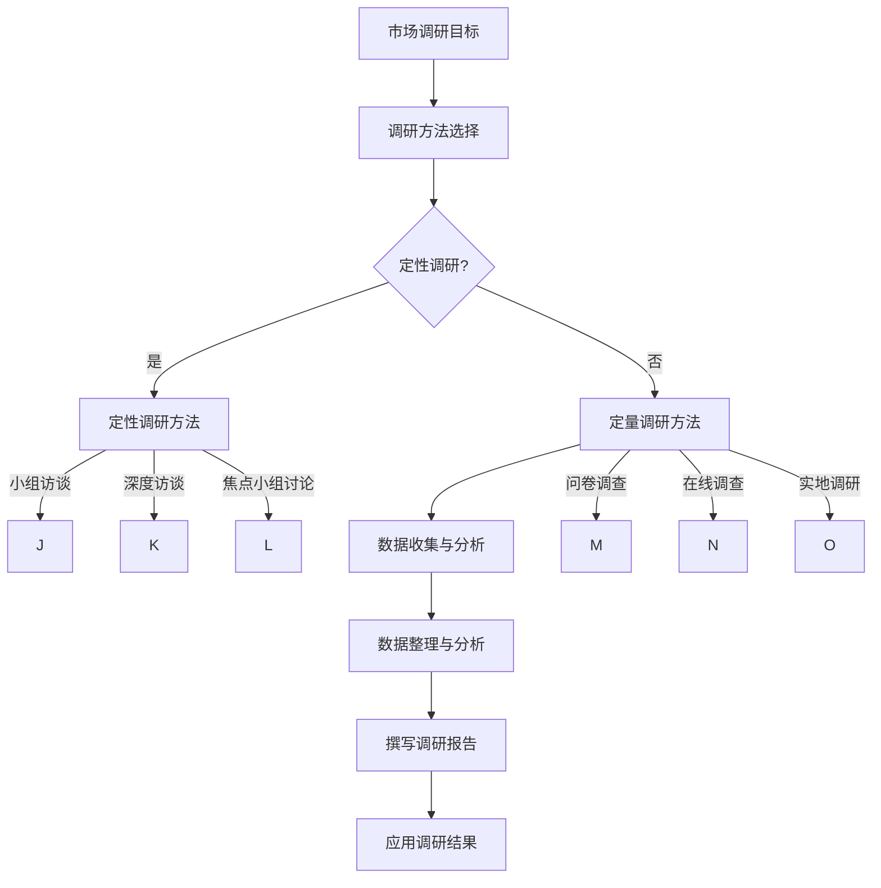

                 

### 前言

#### 目标读者

本书旨在为创业初期的企业家、市场分析师、产品经理以及任何对市场调研感兴趣的专业人士提供实用且系统的市场调研指导。特别针对那些在初创阶段寻求市场定位和产品开发的创业者，本书将通过详细的步骤和案例分析，帮助读者快速掌握市场调研的核心技巧，从而在竞争激烈的市场中站稳脚跟。

#### 本书结构

本书共分为十个章节，每个章节都围绕市场调研的某一关键方面展开讨论。具体结构如下：

1. **市场调研基础**：介绍市场调研的定义、重要性以及不同类型的调研方法。
2. **确定市场调研目标**：帮助读者明确调研目的、设定调研目标并构建调研问题。
3. **市场调研方法**：详述定性调研方法和定量调研方法，包括小组访谈、深度访谈、问卷调查等。
4. **数据收集与分析**：讲解数据收集的技巧、数据质量控制方法以及数据分析的方法和技巧。
5. **市场调研中的伦理与法律问题**：探讨消费者隐私保护、数据安全与合规性以及市场调研的道德规范。
6. **竞争分析**：介绍如何识别竞争对手、进行SWOT分析和五力模型分析。
7. **市场趋势分析**：分析市场趋势、行业动态并使用未来预测方法。
8. **市场调研报告撰写**：指导如何撰写市场调研报告，包括报告结构和关键内容。
9. **市场调研在创业中的应用**：讨论市场调研在初创企业中的应用，包括产品开发和战略规划。
10. **实战案例解析**：通过实际案例展示市场调研的应用和实践效果。

通过阅读本书，读者不仅能够理解市场调研的理论基础，还能掌握实际操作技巧，从而为创业企业提供有力的市场支持。每章末尾还会附有总结和拓展阅读，帮助读者巩固所学知识并深入探索相关领域。

### 第1章：市场调研基础

#### 市场调研的重要性

市场调研是创业初期不可或缺的一环，它对于企业的成功与否具有决定性的影响。首先，市场调研能够帮助创业者全面了解市场环境，包括市场趋势、竞争对手、目标客户需求等关键信息。这种深入了解使得创业者能够制定出更加精准的市场策略，从而降低创业风险。此外，市场调研还能帮助企业发现潜在的市场机会，抓住市场先机，从而在竞争中占据有利位置。

市场调研的重要性还体现在以下几个方面：

1. **制定战略规划**：通过市场调研，企业可以明确自身在市场中的定位，从而制定出长远且具有可操作性的战略规划。
2. **产品开发**：市场调研能够帮助企业了解客户需求，指导产品开发，确保产品能够满足市场需求，从而提高市场接受度和客户满意度。
3. **市场定位**：市场调研帮助企业识别目标客户群体，从而实现精准的市场定位，提高市场营销的效率。
4. **风险控制**：市场调研可以帮助企业识别潜在的市场风险，提前制定应对策略，降低创业失败的风险。

#### 市场调研的定义与类型

市场调研是指通过系统的、科学的方法，收集、分析和解释与市场相关的信息，以帮助企业和组织做出更好的商业决策。市场调研不仅包括对现有市场的分析，还包括对新市场的探索。

根据调研的目的和方法，市场调研可以分为以下几种类型：

1. **探索性调研**：
   - **定义**：探索性调研是一种初步的市场调研，旨在发现和定义问题，为后续的调研提供方向。
   - **特点**：这种调研通常是非结构化的，目的是获取对市场现象的初步理解和直觉。
   - **应用**：在产品开发初期，企业可以通过探索性调研了解市场需求，确定产品的潜在市场。

2. **描述性调研**：
   - **定义**：描述性调研旨在收集关于市场现象的具体数据，以准确描述和解释现象。
   - **特点**：这种调研是结构化的，通常使用问卷、访谈等方法收集定量数据。
   - **应用**：描述性调研可以帮助企业了解目标客户群体的特征、市场需求以及竞争对手的情况。

3. **因果性调研**：
   - **定义**：因果性调研旨在确定市场现象之间的因果关系。
   - **特点**：这种调研通常使用实验设计等方法，旨在找到变量之间的因果关系。
   - **应用**：因果性调研可以帮助企业验证营销策略的有效性，了解不同因素对市场结果的影响。

#### 不同类型调研方法的比较

| 调研类型 | 特点 | 适用场景 |
| --- | --- | --- |
| 探索性调研 | 非结构化，获取初步理解 | 产品开发初期，确定潜在市场需求 |
| 描述性调研 | 结构化，收集具体数据 | 市场现状分析，目标客户特征调研 |
| 因果性调研 | 实验设计，确定因果关系 | 营销策略验证，影响因素分析 |

通过了解不同类型的市场调研方法，企业可以根据自身需求和调研目的选择合适的调研类型，从而有效地获取市场信息，支持决策过程。

#### 市场调研流程概述

市场调研通常包括以下几个基本步骤：

1. **确定调研目标**：明确调研目的，制定调研计划。
2. **选择调研方法**：根据调研目标选择合适的调研方法，如问卷调查、访谈、焦点小组等。
3. **设计调研工具**：制定问卷、访谈指南等调研工具。
4. **收集数据**：实施调研，收集数据。
5. **数据整理与分析**：整理数据，进行统计分析。
6. **撰写调研报告**：将分析结果撰写成报告，供决策参考。

市场调研流程不仅涉及技术和方法，还需要充分考虑调研的伦理和合法性，确保调研活动的公正性和数据的可靠性。

通过这一章的介绍，读者应该对市场调研有了基本的了解。接下来，我们将深入探讨如何确定市场调研的目标，为后续的调研工作打下坚实的基础。

#### 第2章：确定市场调研目标

##### 明确调研目的

明确市场调研的目的是市场调研工作的第一步，也是最为关键的一步。调研目的决定了调研的方向和方法，是后续所有调研工作的基础。一个清晰明确的调研目的是确保调研工作能够有目标、有针对性地进行，避免资源的浪费和无效劳动。

为了明确调研目的，企业需要回答以下几个关键问题：

1. **我们为什么要进行市场调研？**：调研的动机是什么？是为了新产品开发、市场扩展、竞争分析，还是为了优化现有产品或服务？
2. **我们希望通过调研解决什么问题？**：调研要解决的问题是什么？例如，了解目标客户的需求、分析竞争对手的营销策略、确定市场的潜在机会或风险等。
3. **调研结果将如何应用？**：调研结果将用于支持哪些决策？比如，产品定位、定价策略、市场推广方案等。

明确调研目的不仅可以帮助企业集中资源，还可以为调研工作提供明确的方向和目标，确保调研工作能够达到预期的效果。

##### 调研目标设定

设定明确、具体的调研目标是确保市场调研成功的关键。一个好的调研目标应该是可衡量、可实现的，并且要与企业的整体战略目标相一致。

以下是设定调研目标时应遵循的一些原则：

1. **SMART原则**：
   - **Specific（具体）**：目标要具体明确，避免模糊不清。
   - **Measurable（可衡量）**：目标要能够量化，以便于衡量效果。
   - **Achievable（可实现）**：目标要具有可实现性，避免不切实际。
   - **Relevant（相关）**：目标要与企业的整体战略和业务需求相关。
   - **Time-bound（时限）**：目标要有明确的完成时间。

2. **目标分解**：将总体调研目标分解成具体的小目标，使得每个目标都相对独立且容易实现。

3. **优先级设定**：根据目标的重要性和紧急程度，设定优先级，确保关键目标首先得到实现。

以下是设定调研目标的一个示例：

**总体调研目标**：了解目标客户对现有产品的满意度，并提出改进建议。

**具体调研目标**：
   - **收集1000份有效客户反馈问卷**。
   - **分析客户反馈，识别产品的主要优点和不足**。
   - **基于分析结果，提出3项具体的改进建议**。
   - **在2周内完成调研，并提交报告**。

通过上述设定，调研目标变得具体、可衡量，并且有明确的时限和优先级，有助于指导调研工作的开展。

##### 调研问题的构建

构建有效的调研问题对于获得高质量的数据和分析结果至关重要。以下是一些构建调研问题时应注意的关键点：

1. **开放式与封闭式问题**：
   - **开放式问题**：允许受访者自由表达意见，适用于探索性调研和深度访谈。
   - **封闭式问题**：提供预设的选项，便于统计分析，适用于描述性和因果性调研。

2. **问题类型**：
   - **事实性问题**：用于收集具体信息，如“您通常多久购买一次该产品？”
   - **态度性问题**：用于了解受访者的态度和观点，如“您对现有产品的满意度如何？”
   - **行为性问题**：用于了解受访者的行为习惯，如“您在过去一个月内购买过同类产品吗？”

3. **问题顺序**：
   - **由易到难**：先问一些简单的问题，再逐渐过渡到复杂的问题，以降低受访者的疲劳感。
   - **由一般到具体**：先问一些广泛的问题，再问具体的问题，有助于引导受访者逐步深入。

4. **问题表述清晰**：避免使用模糊或歧义的语言，确保受访者能够正确理解问题。

以下是一个调研问题的示例：

**问题**：请问您对当前使用的智能手机品牌满意度如何？请在以下选项中选择：
   - 非常不满意
   - 不满意
   - 一般
   - 满意
   - 十分满意

通过上述步骤和方法，企业可以明确市场调研的目的，设定具体的调研目标，并构建有效的调研问题，从而为后续的数据收集和分析工作奠定坚实的基础。

#### 第3章：市场调研方法

市场调研的成功与否很大程度上取决于所选择的方法和工具。市场调研方法可以分为定性调研方法和定量调研方法。每种方法都有其独特的特点和适用场景，了解和选择合适的方法是确保调研有效性的关键。

##### 定性调研方法

定性调研方法主要用于探索性调研和描述性调研，通过深入挖掘受访者的观点、态度和动机，以获取详细的信息和洞察。以下是几种常见的定性调研方法：

1. **小组访谈**：
   - **定义**：小组访谈是指将一组受访者聚集在一起，通过主持人的引导，进行开放式讨论。
   - **特点**：小组访谈有助于激发受访者之间的互动，获取多样化的观点，增强数据的深度和广度。
   - **应用场景**：适用于新产品开发、市场扩展、消费者行为研究等。

2. **深度访谈**：
   - **定义**：深度访谈是指与单个受访者进行长时间的、开放式的一对一访谈。
   - **特点**：深度访谈能够深入了解受访者的个人经历、感受和观点，获取详尽的信息。
   - **应用场景**：适用于产品开发、市场细分、竞争对手分析等。

3. **焦点小组讨论**：
   - **定义**：焦点小组讨论是指将一组具有特定背景的受访者聚集在一起，就某个主题进行讨论。
   - **特点**：焦点小组讨论有助于快速收集多方面的意见和建议，发现潜在问题。
   - **应用场景**：适用于新产品发布、营销策略制定、消费者行为研究等。

##### 定量调研方法

定量调研方法主要用于描述性调研和因果性调研，通过收集和量化数据，以获得客观、可重复的分析结果。以下是几种常见的定量调研方法：

1. **问卷调查**：
   - **定义**：问卷调查是指通过设计问卷，向受访者收集定量数据。
   - **特点**：问卷调查能够快速、大规模地收集数据，便于统计分析。
   - **应用场景**：适用于市场细分、消费者行为研究、产品评价等。

2. **在线调查**：
   - **定义**：在线调查是指通过互联网平台，向受访者发送问卷，收集数据。
   - **特点**：在线调查具有高效、低成本、覆盖面广等优点。
   - **应用场景**：适用于市场调研、消费者满意度调查、产品测试等。

3. **实地调研**：
   - **定义**：实地调研是指调研人员直接到受访者的现场进行观察和数据收集。
   - **特点**：实地调研能够获取第一手的观察数据，更真实地反映市场情况。
   - **应用场景**：适用于产品测试、市场调研、竞争对手分析等。

##### 定性调研方法与定量调研方法比较

| 方法 | 特点 | 优点 | 缺点 | 适用场景 |
| --- | --- | --- | --- | --- |
| 小组访谈 | 开放式讨论，激发互动 | 收集多样化观点，数据深度广 | 需要主持人技巧，受时间限制 | 新产品开发，市场扩展 |
| 深度访谈 | 长时间、一对一 | 深入了解个人观点和动机 | 费时费力，样本量有限 | 产品开发，市场细分 |
| 焦点小组讨论 | 受众讨论，快速收集意见 | 快速获取多方面建议，发现潜在问题 | 受时间限制，观点可能受限 | 新产品发布，营销策略制定 |
| 问卷调查 | 快速大规模收集数据 | 便于统计分析，成本低 | 受问卷设计影响，回答可能不准确 | 市场细分，消费者行为研究 |
| 在线调查 | 高效、低成本、覆盖面广 | 易于操作，数据收集快 | 回应率可能低，样本代表性问题 | 市场调研，消费者满意度调查 |
| 实地调研 | 第一手观察数据 | 反映真实情况，数据可靠 | 成本高，受地域限制 | 产品测试，市场调研 |

通过选择合适的调研方法，企业可以有效地收集市场信息，支持决策过程。接下来，我们将深入探讨如何收集和分析市场调研数据，确保调研结果的准确性和有效性。

#### 第4章：数据收集与分析

##### 数据收集技巧

数据收集是市场调研的关键环节，正确高效的数据收集方法可以确保调研结果的准确性和可靠性。以下是一些常用的数据收集技巧：

1. **确定数据来源**：
   - **第一手数据**：通过直接调研获取的数据，如问卷调查、访谈记录、实地观察等。这些数据更加真实，但成本较高。
   - **第二手数据**：通过已有的数据来源获取的数据，如市场报告、政府数据、行业研究等。这些数据成本较低，但可能存在一定的时效性和局限性。

2. **样本选择**：
   - **随机抽样**：从总体中随机选择样本，确保样本的代表性。
   - **分层抽样**：将总体按一定标准分层，然后在各层中随机抽样，适用于总体较大且异质性的情况。
   - **方便抽样**：选择最容易接触到的样本，成本较低，但样本代表性较差。

3. **问卷设计**：
   - **问题设计**：设计清晰、简洁、具体的问题，避免使用模糊或引导性的语言。
   - **问题类型**：结合开放式和封闭式问题，以获取更全面的信息。
   - **问题顺序**：先问简单问题，再问复杂问题，以降低受访者的疲劳感。

4. **访谈技巧**：
   - **开放性问题**：鼓励受访者自由表达，获取更多详细信息。
   - **引导性问题**：通过提问引导受访者深入讨论，获取更多洞察。
   - **观察法**：直接观察受访者行为，获取真实的行为数据。

##### 数据质量控制

数据质量是市场调研成功的关键，以下是一些常见的数据质量控制方法：

1. **数据清洗**：
   - **去除无效数据**：排除不完整、重复或有明显错误的数据。
   - **填补缺失值**：使用合适的填补方法处理缺失值，如平均值填补、插值法等。

2. **一致性检查**：
   - **逻辑检查**：检查数据之间是否存在逻辑错误，如年龄与出生日期不符等。
   - **范围检查**：检查数据是否在合理的范围内，如收入数据是否超出正常范围。

3. **异常值检测**：
   - **统计方法**：使用统计方法检测异常值，如箱线图、Z值分析等。
   - **人工检查**：结合人工检查，确保异常值处理得当。

##### 数据分析方法

数据分析是市场调研的核心环节，通过数据分析可以揭示数据背后的规律和趋势，支持决策。以下是一些常见的数据分析方法：

1. **描述性统计分析**：
   - **中心趋势度量**：计算均值、中位数、众数等，了解数据的中心趋势。
   - **离散趋势度量**：计算标准差、方差、变异系数等，了解数据的离散程度。
   - **分布分析**：绘制频率分布表、直方图、箱线图等，了解数据的分布特征。

2. **推断性统计分析**：
   - **参数估计**：使用样本数据估计总体参数，如均值、比例等。
   - **假设检验**：检验总体参数的假设，如t检验、卡方检验等。
   - **回归分析**：建立变量之间的回归模型，预测因变量的变化。

3. **市场细分分析**：
   - **聚类分析**：将受访者根据相似性分为不同群体，进行市场细分。
   - **因素分析**：识别影响市场现象的关键因素，用于指导决策。

##### 数据分析实例

以下是一个简单的数据分析实例，以了解消费者对某款智能手机的满意度：

1. **收集数据**：通过问卷调查收集1000名消费者的满意度评分，评分范围为1-10分。
2. **数据清洗**：排除不完整或不合理的问卷，保留有效问卷950份。
3. **描述性统计分析**：
   - **中心趋势度量**：计算平均满意度评分为7.2分。
   - **离散趋势度量**：计算标准差为1.5分。
   - **分布分析**：绘制频率分布表，发现满意度评分主要集中在7-8分之间。
4. **推断性统计分析**：
   - **参数估计**：假设总体满意度评分为7.5分，使用t检验验证假设。
   - **t检验结果**：p值小于0.05，拒绝原假设，认为总体满意度评分显著高于7.5分。
5. **市场细分分析**：
   - **聚类分析**：使用k-means聚类算法，将消费者分为高满意度群体、中等满意度群体和低满意度群体。
   - **聚类结果**：发现高满意度群体占40%，中等满意度群体占30%，低满意度群体占30%。

通过上述分析，企业可以了解消费者对智能手机的总体满意度，识别满意度较高的群体，并进一步探讨提高低满意度群体的满意度策略。

数据收集与分析是市场调研的重要环节，通过科学、系统的方法，可以确保数据的准确性和可靠性，为企业的决策提供有力支持。接下来，我们将探讨市场调研中的伦理与法律问题，确保调研活动的合法性和道德性。

#### 第5章：市场调研中的伦理与法律问题

市场调研过程中，保护消费者隐私、确保数据安全和合规性是至关重要的。这不仅关乎企业的声誉，还涉及到法律和伦理规范。以下将探讨这些方面的重要问题。

##### 消费者隐私保护

消费者隐私保护是市场调研中的核心伦理问题之一。未经消费者同意，企业不得收集、存储或分享个人信息。以下是一些关键的隐私保护措施：

1. **获取同意**：在进行任何市场调研活动之前，必须明确告知消费者调研的目的、数据的使用方式以及保留期限，并获取书面或电子形式的同意。
2. **匿名化处理**：对收集到的个人信息进行匿名化处理，确保无法追溯到特定个人。例如，删除姓名、地址等敏感信息，仅保留分析所需的匿名标识。
3. **安全存储**：确保收集到的个人信息存储在安全的数据库中，使用加密技术防止未授权访问。
4. **访问控制**：对数据库的访问进行严格控制，仅限必要的工作人员，并定期进行安全审查。

##### 数据安全与合规性

市场调研中的数据安全不仅关乎消费者隐私，还涉及到合规性问题。以下是一些关键的数据安全措施：

1. **数据加密**：使用加密技术对传输和存储的数据进行加密，防止数据泄露。
2. **访问控制**：对数据库和系统设置访问权限，确保只有授权人员能够访问敏感数据。
3. **备份与恢复**：定期备份数据，并确保能够迅速恢复，以应对潜在的数据丢失或损坏。
4. **安全培训**：对员工进行数据安全和合规性的培训，提高其安全意识和操作规范。

##### 市场调研道德规范

市场调研还应遵守一系列道德规范，确保调研活动的公正性和透明度。以下是一些关键道德规范：

1. **真实性**：确保调研工具和过程真实可信，不提供误导性信息，不引导受访者给出非真实的回答。
2. **尊重**：尊重受访者的意愿和隐私，不进行强迫或诱骗式的调研。
3. **透明度**：向受访者明确说明调研的目的、过程和结果，确保其知情权。
4. **公正性**：确保调研结果的公正性，避免偏见和误导，基于事实和数据做出结论。

##### 实际案例

以下是一个关于市场调研伦理问题的实际案例：

某公司计划进行一项新产品的市场调研，调研内容涉及消费者的购买行为和偏好。在调研过程中，公司采取了一系列隐私保护措施：

1. **获取同意**：在发送问卷之前，公司通过电子邮件向潜在受访者说明调研目的、数据用途和保密措施，并要求受访者点击同意链接。
2. **匿名化处理**：问卷设计为匿名形式，仅收集与调研相关的信息，不包含任何可以识别受访者的个人信息。
3. **安全存储**：公司使用加密技术存储问卷数据，并对数据库进行定期安全审查，确保数据安全。
4. **数据使用**：公司承诺仅将调研结果用于产品开发和市场策略制定，不会将数据用于其他用途，并将在调研结束后删除所有问卷数据。

通过这一案例，我们可以看到，企业在进行市场调研时，应采取一系列措施来保护消费者隐私、确保数据安全和合规性，并遵守道德规范，从而建立良好的企业声誉和客户信任。

#### 第6章：竞争分析

在创业初期，了解并分析竞争对手是至关重要的，这不仅有助于企业识别市场中的竞争格局，还能帮助企业制定有效的竞争策略，提升市场占有率。以下将介绍如何进行竞争分析，包括识别竞争对手、SWOT分析以及五力模型分析。

##### 识别竞争对手

1. **直接竞争对手**：这些企业直接提供与你的产品或服务相同或相似的产品或服务，与你的企业争夺同一客户群体。例如，如果你的公司是一家在线零售商，那么亚马逊、阿里巴巴等就是你的直接竞争对手。

2. **间接竞争对手**：这些企业虽然不直接提供与你相同的产品或服务，但提供的产品或服务能够满足相同的客户需求。例如，如果你的公司是一家高端餐饮品牌，那么五星级酒店、高档私人餐厅等都可以被视为间接竞争对手。

3. **潜在竞争对手**：这些企业目前可能不在你的市场范围内，但有潜力进入你的市场。例如，一些新兴品牌或初创公司，如果它们的发展势头良好，未来可能会成为你的竞争对手。

##### SWOT分析

SWOT分析是一种常用的战略分析工具，用于评估企业的优势（Strengths）、劣势（Weaknesses）、机会（Opportunities）和威胁（Threats）。以下是SWOT分析的具体步骤：

1. **优势**：识别企业在市场中的优势，如独特的产品特性、品牌影响力、先进的技术等。例如，一家提供定制化软件解决方案的企业，其优势可能在于技术先进和优质的客户服务。

2. **劣势**：识别企业在市场中的劣势，如产品不足、资金不足、团队不足等。例如，上述软件解决方案企业可能面临资金紧张和团队不足的挑战。

3. **机会**：识别外部市场环境中的机会，如新兴市场的崛起、新技术的应用、行业政策的变化等。例如，随着云计算技术的普及，该企业可以利用这一机会扩展业务。

4. **威胁**：识别外部市场环境中的威胁，如竞争加剧、市场需求下降、法规变化等。例如，新的技术突破可能导致现有产品的需求下降。

通过SWOT分析，企业可以全面了解自身在市场中的位置，并制定相应的战略应对。

##### 五力模型分析

五力模型是由迈克尔·波特提出的一种竞争分析工具，用于分析企业所在行业中的竞争格局。以下是五力模型的具体内容：

1. **供应商的议价能力**：供应商的议价能力取决于供应商的行业集中度、产品差异化程度以及供应商的供应弹性。高集中度的供应商可能具有较高的议价能力。

2. **买家的议价能力**：买家的议价能力取决于买家的集中度、产品差异化程度以及购买量的大小。集中度高的买家可能具有较高的议价能力。

3. **潜在进入者的威胁**：潜在进入者的威胁取决于行业的进入壁垒、市场需求和现有企业的反应。高进入壁垒和强烈的市场需求可能降低潜在进入者的威胁。

4. **替代品的威胁**：替代品的威胁取决于替代品的市场接受度和价格竞争力。高接受度和低价格可能增加替代品的威胁。

5. **行业内现有竞争者的竞争程度**：行业内现有竞争者的竞争程度取决于产品的同质化程度、行业增长率和企业的战略意图。高同质化程度和低增长率可能增加竞争程度。

通过五力模型分析，企业可以了解行业竞争格局，并制定相应的战略应对。

##### 竞争分析的实际应用

以下是一个关于竞争分析的实际案例：

某初创公司计划进入智能家居市场，该公司通过以下步骤进行竞争分析：

1. **识别竞争对手**：直接竞争对手包括谷歌、亚马逊和苹果等科技巨头，间接竞争对手包括传统家电厂商和新兴智能家居品牌。

2. **SWOT分析**：
   - **优势**：该公司的优势在于技术创新和个性化的智能家居解决方案。
   - **劣势**：劣势在于市场知名度较低和资金不足。
   - **机会**：智能家居市场增长迅速，且该公司能够利用新技术快速响应市场需求。
   - **威胁**：竞争激烈，技术突破可能迅速改变市场格局。

3. **五力模型分析**：
   - **供应商的议价能力**：智能家居行业供应商集中度较高，议价能力较强。
   - **买家的议价能力**：智能家居市场需求多样，买家议价能力较高。
   - **潜在进入者的威胁**：智能家居行业进入壁垒较高，潜在进入者威胁较低。
   - **替代品的威胁**：替代品较多，但技术差异较大，威胁相对较低。
   - **行业内现有竞争者的竞争程度**：行业内竞争激烈，但该公司可以通过技术创新和差异化策略降低竞争程度。

通过以上分析，该公司可以制定以下战略：
- **差异化策略**：通过技术创新和个性化服务，提高产品差异化程度。
- **品牌建设**：加大市场推广力度，提高品牌知名度。
- **合作策略**：与供应商和合作伙伴建立紧密合作关系，降低成本和提升竞争力。

竞争分析是企业制定战略的重要工具，通过全面了解竞争对手和市场环境，企业可以制定更有效的战略，提高市场竞争力。

#### 第7章：市场趋势分析

市场趋势分析是创业初期制定战略和决策过程中不可或缺的一部分。它能够帮助企业了解行业的发展方向、把握市场动态，从而抓住机遇、规避风险。以下将介绍市场趋势的概述、行业动态分析以及未来预测方法。

##### 市场趋势概述

市场趋势是指市场在一定时间内表现出来的某种方向性和规律性的现象。这些趋势可以是短期内的，也可以是长期性的。了解市场趋势有助于企业制定长期战略和短期行动方案。

1. **技术趋势**：技术发展对市场趋势有着重要影响。例如，人工智能、物联网、区块链等技术的迅猛发展，正在改变各个行业的运作模式。企业需要关注这些技术趋势，以把握市场机遇。

2. **消费趋势**：消费者行为和需求的变化也会影响市场趋势。例如，随着生活水平的提高，消费者对健康、环保和高品质产品的需求不断增长。了解这些消费趋势，可以帮助企业更好地满足市场需求。

3. **政策趋势**：政府的政策导向也会影响市场趋势。例如，环保政策的加强可能导致绿色能源行业的发展，而贸易政策的调整则会影响进出口企业的市场机会。

##### 行业动态分析

行业动态分析是对特定行业当前状态和发展趋势的深入研究。以下是一些关键指标和工具：

1. **市场规模和增长**：分析行业的整体市场规模和未来增长潜力，了解行业的生命周期阶段。

2. **市场份额**：评估行业内主要企业的市场份额和竞争格局，识别市场领导者。

3. **关键事件**：关注行业中的重要事件，如新产品发布、并购、法规变化等，这些事件可能对市场趋势产生重大影响。

4. **技术创新**：跟踪行业内的技术创新，了解新技术如何改变行业格局。

5. **消费者行为**：研究消费者行为的变化，如购买习惯、偏好和需求，以预测市场需求。

##### 未来预测方法

预测市场趋势和行业动态需要使用科学的方法和工具。以下是一些常用的预测方法：

1. **趋势外推法**：基于过去的数据和市场趋势，推测未来的发展趋势。这种方法简单直观，但可能忽略未来可能发生的突变。

2. **时间序列分析**：通过分析时间序列数据，识别数据中的周期性、趋势性和季节性变化，以预测未来趋势。常用的时间序列分析方法包括ARIMA模型、移动平均法、指数平滑法等。

3. **回归分析**：通过建立变量之间的回归模型，预测因变量的变化。例如，可以通过回归分析预测销售额或市场份额。

4. **情景分析**：通过设定不同的未来情景，分析在不同情景下市场趋势和行业动态的变化。这种方法有助于企业准备应对不同的未来情况。

5. **专家咨询**：通过咨询行业专家和市场分析师，获取他们对未来市场趋势的预测。这种方法能够提供深入的洞察，但依赖于专家的判断和经验。

##### 未来预测实例

以下是一个关于未来预测的实例：

假设某初创公司计划进入智能家居市场，以下是该公司的未来预测步骤：

1. **数据收集**：收集智能家居市场的历史数据，包括市场规模、增长趋势、消费者行为等。

2. **趋势外推法**：基于过去十年的市场数据，推测未来五年的市场规模增长趋势。例如，假设过去十年市场规模年均增长率为15%，可以预测未来五年市场规模年均增长率仍为15%。

3. **时间序列分析**：使用ARIMA模型对市场规模进行时间序列分析，识别周期性、趋势性和季节性变化。例如，分析发现市场规模存在年度周期性波动，且趋势逐年上升。

4. **回归分析**：通过建立市场规模与关键因素（如消费者收入、技术发展、政策支持）的回归模型，预测未来市场规模。例如，假设市场规模与消费者收入呈正相关，可以预测随着消费者收入的增加，市场规模将呈现增长趋势。

5. **情景分析**：设定三个情景（乐观、中性、悲观），分别预测未来五年的市场规模。例如，在乐观情景下，市场规模年均增长率为20%；在中性情景下，年均增长率为15%；在悲观情景下，年均增长率为10%。

6. **专家咨询**：咨询行业专家和市场分析师，获取他们对智能家居市场未来趋势的预测。例如，专家预测未来五年智能家居市场将保持快速增长，年均增长率可能在15%-25%之间。

通过上述方法，初创公司可以综合分析各种预测结果，制定相应的市场策略，以应对未来市场变化。

市场趋势分析是企业制定战略和决策的重要工具，通过科学的预测方法和深入的行业研究，企业可以更好地把握市场机遇，制定有效的战略，实现可持续发展。

#### 第8章：市场调研报告撰写

市场调研报告是对调研过程及其结果的全面总结，它不仅是调研工作的终点，更是企业决策的重要依据。撰写一份结构清晰、内容详尽、分析深入的市场调研报告，能够帮助企业更好地理解市场动态，制定科学合理的战略和决策。以下是市场调研报告撰写的基本步骤和要点。

##### 报告结构

一个完整的市场调研报告通常包括以下几个部分：

1. **封面**：包含报告名称、撰写单位、撰写日期等基本信息。
2. **摘要**：对报告的主要内容进行简要概述，包括调研目的、方法、主要发现和结论。
3. **目录**：列出报告各章节及页码，便于读者快速查找相关内容。
4. **引言**：介绍调研背景、调研目的和重要性。
5. **方法**：详细描述调研过程，包括调研对象、样本选择、调研工具、数据收集与分析方法等。
6. **结果**：展示调研的主要发现，包括定量数据和定性分析的结论。
7. **讨论**：对调研结果进行深入分析，解释数据背后的原因，探讨市场趋势和机会。
8. **结论**：总结调研结果，提出主要结论和建议。
9. **建议**：基于调研结果，提出具体的行动建议和改进措施。
10. **附录**：包含调研工具、数据表、分析图表等补充材料。
11. **参考文献**：列出报告中引用的所有文献和资料。

##### 关键内容

1. **摘要**：摘要部分是对整个报告的概括性描述，通常不超过两页。摘要应简明扼要地概述调研目的、方法、主要发现和结论，让读者对报告的主要内容有一个清晰的了解。

2. **方法**：方法部分详细描述了调研的实施过程，包括调研对象的选择、样本量、数据收集和分析方法等。这部分内容应准确、具体，以便读者能够复现调研过程。

3. **结果**：结果部分展示调研的主要发现，通常包括定量数据和定性分析的结论。定量数据可以使用图表和表格的形式展示，定性分析则可以通过案例和实例来阐述。

4. **讨论**：讨论部分对调研结果进行深入分析，解释数据背后的原因，探讨市场趋势和机会。这部分内容应结合行业背景和具体案例，使分析更加有说服力。

5. **结论**：结论部分是对调研结果的总结，通常包括几个关键结论。结论应简明扼要，突出调研结果对企业战略和决策的重要性。

6. **建议**：建议部分基于调研结果，提出具体的行动建议和改进措施。建议应具有可操作性，能够帮助企业解决实际问题。

##### 视觉化展示

视觉化展示是市场调研报告中非常重要的一部分，它能够帮助读者更直观地理解数据和结论。以下是一些常用的视觉化展示方法：

1. **图表**：使用图表（如柱状图、饼图、线图等）展示定量数据，使数据更加直观和易于理解。
2. **表格**：使用表格整理和展示数据，便于读者查看详细数据。
3. **图片**：使用图片展示调研对象的行为或场景，使描述更加生动。
4. **地图**：使用地图展示地理分布数据，便于分析区域差异。

##### 撰写技巧

1. **逻辑清晰**：报告内容应条理清晰，逻辑严密，使读者能够顺畅地阅读和获取信息。
2. **语言简洁**：使用简洁、明了的语言，避免使用复杂的术语和冗长的句子。
3. **数据准确**：确保所有数据和结论都是准确无误的，避免误导读者。
4. **注重细节**：仔细审查报告内容，确保没有拼写错误、语法错误和格式错误。

通过以上步骤和技巧，企业可以撰写出高质量的市场调研报告，为决策提供有力支持。

#### 第9章：市场调研在创业中的应用

在创业初期，市场调研不仅是制定战略和决策的重要工具，更是企业成功的关键因素。市场调研可以帮助初创企业了解市场需求、识别潜在客户、评估竞争环境，从而更好地定位产品和制定营销策略。以下将探讨市场调研在创业中的应用，包括市场调研的挑战、市场调研在产品开发中的应用以及市场调研在战略规划中的应用。

##### 初创企业市场调研的挑战

1. **资源有限**：初创企业通常面临资金、人力资源和时间的限制，这些限制可能影响市场调研的深度和广度。
2. **市场不确定**：初创企业所在的市场可能尚未成熟，市场数据有限，增加了市场调研的难度。
3. **信息不对称**：初创企业可能难以获取与行业老大或成熟企业同等质量的数据，这可能导致对市场形势的错误判断。
4. **技术障碍**：一些市场调研工具和技术（如数据分析软件、在线调查平台等）可能需要较高成本或专业技能，对初创企业来说可能难以负担。
5. **时间紧迫**：初创企业在创业初期需要迅速行动，市场调研可能无法满足快速决策的需求。

##### 市场调研在产品开发中的应用

1. **需求分析**：通过市场调研，初创企业可以了解潜在客户的需求和痛点，从而开发出满足市场需求的产品。例如，一家初创公司通过问卷调查和用户访谈发现，消费者对智能家居设备的安全性有较高关注，于是开发出具有高度安全性能的智能家居产品。

2. **产品定位**：市场调研可以帮助初创企业确定产品在市场中的定位，从而制定有效的营销策略。例如，通过分析竞争对手的产品定位和市场表现，初创企业可以找到市场空缺，制定独特的产品定位。

3. **功能优化**：市场调研可以揭示产品功能的优化方向。初创企业可以通过用户反馈和数据分析，了解用户对产品哪些功能最为满意，哪些功能需要改进。例如，一家初创公司通过用户反馈发现，用户对产品的电池续航时间不满，于是加大了电池容量并优化了电源管理系统。

4. **用户体验**：市场调研可以帮助初创企业优化用户体验。通过用户测试和反馈，企业可以了解用户在使用产品过程中的问题和不便，从而改进产品的交互设计和用户体验。例如，一家初创公司通过A/B测试发现，新的界面设计比旧的设计更能吸引用户，于是决定采用新的设计。

##### 市场调研在战略规划中的应用

1. **市场进入时机**：市场调研可以帮助初创企业确定最佳的市场进入时机。通过分析市场趋势和竞争对手的行为，企业可以避免进入竞争激烈的市场阶段，选择市场增长潜力较大的时机进入。例如，一家初创公司通过市场调研发现，智能家居市场在疫情期间需求激增，于是决定抓住这一机会迅速扩展业务。

2. **市场定位**：市场调研可以帮助初创企业确定合适的市场定位，从而制定有效的市场策略。例如，通过分析潜在客户群体的特征和需求，企业可以确定目标市场，并制定有针对性的营销策略。

3. **竞争策略**：市场调研可以帮助初创企业了解竞争对手的优势和劣势，从而制定有效的竞争策略。例如，通过分析竞争对手的市场表现和用户反馈，企业可以找到竞争对手的弱点，并利用自身的优势进行差异化竞争。

4. **资源配置**：市场调研可以帮助初创企业合理配置资源，确保资源投入能够带来最大的收益。例如，通过分析市场机会和潜在风险，企业可以确定哪些领域需要优先投入资源，哪些领域可以暂时搁置。

##### 案例解析

**案例一：市场调研在初创公司产品开发中的应用**

某初创公司计划开发一款基于人工智能的智能健康监测设备。在产品开发初期，公司进行了以下市场调研：

1. **需求分析**：通过问卷调查和用户访谈，了解消费者对健康监测设备的需求，包括功能需求、使用习惯、价格敏感度等。
2. **市场定位**：通过分析竞争对手的产品定位和市场表现，确定智能健康监测设备的市场定位，并制定差异化策略。
3. **功能优化**：根据用户反馈，优化产品的功能设计，如增加心率监测、血压监测等。
4. **用户体验**：通过用户测试和反馈，优化产品的交互设计和用户体验。

通过以上市场调研，初创公司成功开发出满足市场需求的产品，并在市场上取得了良好的反响。

**案例二：市场调研在初创公司战略规划中的应用**

某初创公司计划进入智能家居市场。在制定战略规划时，公司进行了以下市场调研：

1. **市场进入时机**：通过分析市场趋势和竞争对手的行为，确定智能家居市场的最佳进入时机。
2. **市场定位**：通过分析潜在客户群体的特征和需求，确定智能家居产品的市场定位，并制定有针对性的营销策略。
3. **竞争策略**：通过分析竞争对手的优势和劣势，制定有效的竞争策略，如差异化定价、技术创新等。
4. **资源配置**：根据市场调研结果，合理配置资源，确保资源投入能够带来最大的收益。

通过以上市场调研，初创公司成功制定了战略规划，并在智能家居市场中取得了快速发展。

市场调研在创业中的应用是多方面的，通过科学的市场调研，初创企业可以更好地了解市场需求、把握市场动态，从而制定有效的战略和决策，提高市场竞争力。

#### 第10章：实战案例解析

在创业初期，市场调研不仅是一种策略，更是一种实践。通过实际案例的解析，我们可以更深入地理解市场调研在实际操作中的应用，以及如何通过调研获取有价值的洞察，从而指导产品开发、市场拓展和营销策略的制定。

##### 案例一：市场调研在初创公司产品开发中的应用

**背景**：
某初创公司专注于智能健康监测设备的研发。该公司在产品开发初期面临的主要挑战是如何确保产品能够满足市场需求，并吸引目标用户。

**调研步骤**：
1. **需求分析**：通过线上问卷调查和深度访谈，收集潜在用户对健康监测设备的需求。调研内容包括功能需求、使用习惯、价格敏感度等。
2. **市场定位**：分析问卷和访谈结果，确定产品在市场中的定位。公司发现，用户对心率监测、血压监测和睡眠质量评估的需求较高，同时用户对产品的便携性和安全性有较高的期望。
3. **功能优化**：根据用户反馈，优化产品功能设计。例如，增加24小时心率监测、智能血压计和远程医疗咨询功能，以满足用户的需求。
4. **用户体验**：通过用户测试和反馈，改进产品的交互设计和用户体验。公司进行了多次A/B测试，最终确定了一款简洁易用的用户界面。

**结果**：
通过上述市场调研和优化，初创公司成功开发出一款智能健康监测设备，该产品在市场上受到了广泛好评，并在短时间内实现了销售突破。

##### 案例二：市场调研在拓展国际市场的应用

**背景**：
某国内知名智能家居品牌计划拓展国际市场。公司希望在进入新市场前，通过调研了解当地市场的需求、竞争环境和消费者行为。

**调研步骤**：
1. **市场趋势分析**：通过分析国际市场报告和行业动态，了解智能家居市场的增长趋势和潜在机会。
2. **竞争分析**：调研当地竞争对手的产品、定价策略和市场表现，识别自身的竞争优势和劣势。
3. **消费者行为研究**：通过问卷调查和深度访谈，了解当地消费者的需求、购买习惯和偏好。
4. **渠道研究**：调研当地销售渠道的分布和效率，确定最佳的渠道进入策略。

**结果**：
通过市场调研，公司发现当地消费者对智能家居设备的节能和便利性有较高的需求，同时价格敏感性较低。基于这些洞察，公司调整了产品定价策略，并建立了与当地零售商和电商平台的合作，成功进入国际市场，并在短时间内取得了显著的销售业绩。

##### 案例三：市场调研在营销策略制定中的应用

**背景**：
某初创公司开发了一款创新性的健康饮食管理应用，希望通过有效的营销策略快速获取用户。

**调研步骤**：
1. **目标市场分析**：通过市场调研，确定目标用户群体，如都市白领、健康爱好者等。
2. **需求分析**：通过在线问卷调查和焦点小组讨论，了解目标用户对健康饮食管理应用的期望和需求。
3. **竞争分析**：调研市场上现有的健康饮食管理应用，分析其优势和不足，确定自身的差异化定位。
4. **营销渠道研究**：通过数据分析，了解目标用户在不同渠道上的活跃度，如社交媒体、应用商店、健康论坛等。

**结果**：
通过市场调研，公司确定了以社交媒体广告和健康论坛推广为主的营销策略。在执行过程中，公司不断根据用户反馈进行调整，最终在短时间内成功吸引了大量用户，并建立了品牌知名度。

**案例分析小结**：

通过上述实战案例，我们可以看到市场调研在初创企业中的重要性。有效的市场调研不仅帮助初创企业明确了产品定位、优化了产品功能，还为市场拓展和营销策略的制定提供了科学依据。以下是一些最佳实践和注意事项：

- **及时反馈**：在调研过程中，及时收集和分析用户反馈，以便快速调整产品设计和营销策略。
- **数据多样性**：结合多种调研方法和工具，获取全面和多样化的数据，提高调研结果的准确性。
- **持续调研**：市场调研不应是一次性的活动，而应是一个持续的过程，随着市场的变化和产品的迭代，定期进行调研。
- **尊重隐私**：在进行市场调研时，严格遵守消费者隐私保护法规，确保调研过程的合法性和道德性。

通过不断优化市场调研过程，初创企业可以更好地把握市场机遇，实现持续发展。

#### 附录 A：市场调研流程 Mermaid 流程图

以下是一个使用Mermaid语言描述的市场调研流程图：



该流程图详细描述了市场调研的各个步骤和可能的分支路径，帮助读者更直观地理解市场调研的过程和逻辑。

#### 附录 B：聚类算法伪代码

以下是一个简单的k-means聚类算法的伪代码，用于市场细分：

```python
# 初始化聚类中心
def kmeans_init(data, k):
    # 随机选择k个数据点作为初始聚类中心
    centroids = data[np.random.choice(data.shape[0], k, replace=False)]
    return centroids

# k-means算法核心
def kmeans_core(data, k, centroids, max_iter=100):
    for _ in range(max_iter):
        # 计算每个数据点到各个聚类中心的距离
        distances = np.linalg.norm(data - centroids, axis=1)
        # 分配数据到最近的聚类中心
        labels = np.argmin(distances, axis=1)
        # 计算新的聚类中心
        new_centroids = np.array([data[labels == i].mean(axis=0) for i in range(k)])
        # 判断聚类中心是否收敛
        if np.all(new_centroids == centroids):
            break
        centroids = new_centroids
    return centroids, labels

# 使用k-means进行市场细分
def market_segmentation(data, k):
    centroids = kmeans_init(data, k)
    centroids, labels = kmeans_core(data, k, centroids)
    return centroids, labels

# 数据预处理
data = preprocessing(data)

# 执行聚类
k = 3  # 假设要分成3个集群
centroids, labels = market_segmentation(data, k)

# 输出结果
print("聚类中心：", centroids)
print("聚类标签：", labels)
```

这段伪代码实现了k-means聚类算法的核心步骤，包括初始化聚类中心、迭代计算新聚类中心、分配数据点到最近的聚类中心，并最终返回聚类中心和标签。在实际应用中，可能需要根据具体数据集和业务需求进行调整和优化。

#### 市场调研工具推荐

在市场调研过程中，选择合适的工具是确保调研顺利进行和结果准确的关键。以下是一些常用的市场调研工具推荐：

1. **问卷调查工具**：
   - **Google表单**：简单易用，可生成定制问卷，支持多种题型。
   - **SurveyMonkey**：功能丰富，支持高级数据分析，适合大规模问卷调研。
   - **Typeform**：设计精美的问卷界面，用户体验良好，适合品牌市场调研。

2. **在线调查平台**：
   - **Qualtrics**：专业的在线调查平台，支持复杂的调研设计和数据分析。
   - **Survey Centre**：提供多种问卷设计和分发方式，支持实时数据分析。
   - **Panel Suite**：提供多样化的调研方法，如在线焦点小组讨论、深度访谈等。

3. **数据分析工具**：
   - **Tableau**：强大的数据可视化工具，适用于多种数据源的报表和图表制作。
   - **Microsoft Power BI**：直观易用，支持大数据分析，适合企业级应用。
   - **R**：开源数据分析语言，功能强大，适用于复杂的统计分析和数据挖掘。

4. **消费者行为分析工具**：
   - **Google Analytics**：提供全面的网站和用户行为分析，适合了解网站流量和用户行为。
   - **Hotjar**：可视化用户行为分析工具，可以捕捉鼠标移动、点击等行为。
   - **Mixpanel**：专注于用户行为分析，提供实时用户活动追踪和用户留存分析。

通过使用这些工具，企业可以更加高效地进行市场调研，收集和分析数据，从而更好地指导业务决策。

#### 市场调研资源与参考文献

市场调研是一门综合性学科，涉及多个领域的理论和实践。以下是一些市场调研的资源和参考文献，供读者进一步学习和参考：

1. **市场调研书籍**：
   - **《市场调研：概念与方法》（Marketing Research: An Applied Approach）**：作者：Naomi S. Jones。
   - **《市场调研实务》（Practical Marketing Research）**：作者：Richard L. zone。
   - **《市场调研与预测》（Marketing Research and Forecasting）**：作者：John F. Sheth。

2. **市场调研期刊**：
   - **《市场营销学报》（Journal of Marketing Research）**：国际知名的市场调研学术期刊。
   - **《国际市场调研杂志》（International Journal of Market Research）**：涵盖市场调研的最新研究进展。
   - **《市场调研实践杂志》（Journal of Business Research）**：专注于市场调研在实践中的应用。

3. **在线课程和资源**：
   - **Coursera**：提供多个关于市场调研的在线课程，包括基础理论和实践应用。
   - **edX**：平台上的市场调研课程，涵盖数据收集、分析到报告撰写。
   - **LinkedIn Learning**：提供一系列关于市场调研的视频教程和资源。

4. **市场调研工具和平台**：
   - **Kissmetrics**：提供详细的用户行为分析工具，帮助理解和优化营销策略。
   - **Google Analytics Academy**：Google提供的免费在线课程和资源，涵盖数据分析基础到高级应用。

通过这些资源和参考文献，读者可以进一步加深对市场调研的理解，掌握更多实用的调研方法和技巧。希望这些资源能够为您的市场调研工作提供有力的支持。

### 作者信息

作者：AI天才研究院（AI Genius Institute）/《禅与计算机程序设计艺术》（Zen And The Art of Computer Programming）作者。本文通过逻辑清晰、结构紧凑的步骤，探讨了创业初期的市场调研技巧，旨在为创业者和市场分析师提供实用的指导和建议。希望本文能够帮助您在市场调研的道路上取得成功。祝您创业之路一帆风顺！

