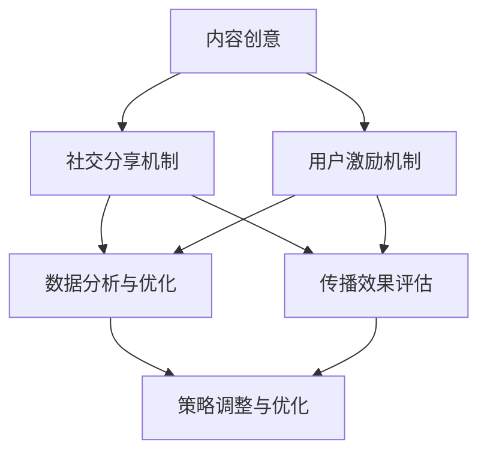

                 

### 《创业初期的用户获取：病毒式营销的实施策略》

> 关键词：创业初期、用户获取、病毒式营销、社交分享、用户激励、数据分析

> 摘要：本文探讨了创业初期如何通过病毒式营销来获取用户。文章首先阐述了病毒式营销的定义与特点，随后详细介绍了其基本原理、架构及核心算法。通过具体的数学模型和公式，文章深入分析了病毒式营销的增长机制和用户生命周期价值。最后，通过实战案例和项目实战，展示了病毒式营销的实际应用和开发过程，为创业者提供了切实可行的用户获取策略。

#### 第一部分：引言

##### 第1章：创业初期用户获取的重要性

**1.1 创业初期的挑战与机遇**

创业初期，企业往往面临着一系列的挑战。首先是市场竞争的激烈程度。在当今快速变化的市场环境中，新企业不仅要面对现有竞争对手的强大压力，还要不断应对新兴企业的崛起。这种激烈的市场竞争使得用户获取变得异常艰难。

其次，用户获取的难度也是创业初期的一个显著挑战。早期用户是企业生存和发展的基石，但如何有效地吸引和留住早期用户，成为许多创业者亟待解决的问题。尤其是在资金和资源有限的情况下，如何高效地获取用户成为了一项重大的考验。

然而，尽管面临诸多挑战，创业初期也蕴藏着巨大的机遇。此时，市场尚未完全饱和，竞争相对较少，为企业提供了抢占市场的良机。此外，初创企业往往更加灵活和敏捷，能够迅速响应市场变化，抓住机遇实现快速增长。

**1.2 病毒式营销的定义与特点**

病毒式营销（Viral Marketing）是一种通过用户自主传播来扩大品牌影响力和用户基础的市场营销策略。其核心在于激发用户的参与和分享欲望，使信息像病毒一样在社交网络中迅速传播。

病毒式营销具有以下几个显著特点：

- **低成本**：与传统的广告和推广方式相比，病毒式营销的成本相对较低。它主要依赖于用户自发的内容创作和传播，大大降低了营销费用。
- **高效传播**：病毒式营销能够迅速吸引大量用户的关注和参与，从而在短时间内实现信息的广泛传播。
- **高参与度**：病毒式营销强调用户的参与感，通过设计有趣、有价值的内容，激发用户的创造力和分享欲望，提高用户的参与度。
- **强社交性**：病毒式营销借助社交网络平台，利用用户之间的社交关系，实现信息的快速传播和扩散。

**1.3 病毒式营销在创业初期的应用**

在创业初期，用户获取是决定企业生死的关键。此时，病毒式营销作为一种高效的用户获取策略，具有以下几个优势：

- **快速提升品牌知名度**：通过病毒式营销，企业可以在短时间内迅速提升品牌知名度，为后续的产品推广和销售奠定基础。
- **低成本获取早期用户**：病毒式营销的低成本特性使得初创企业可以在有限的资源下，有效地获取大量早期用户。
- **培养用户忠诚度**：病毒式营销通过用户参与和分享，增强用户对品牌的认知和情感联系，提高用户忠诚度。
- **快速适应市场变化**：病毒式营销强调内容的创意和灵活性，使企业能够快速适应市场变化，调整营销策略。

然而，创业初期的病毒式营销也面临着一些挑战。首先，创意内容的设计和执行需要高度的专业性和创造力。其次，用户激励机制的设定和数据分析的优化也需要企业具备一定的技术和经验。最后，病毒式营销的效果难以预测，企业需要不断尝试和调整，以找到最适合自己产品和市场的病毒式营销策略。

##### 第2章：病毒式营销与传统营销的比较

**2.1 传统营销方式的局限性**

传统营销方式主要包括广告、推广、公关等手段。这些方式虽然在某些情况下仍然有效，但面临着越来越多的局限性。

- **高成本**：传统营销方式通常需要大量的广告费用和推广成本，这对资金有限的初创企业来说是一个巨大的负担。
- **低参与度**：传统营销方式往往是以单向传播为主，缺乏用户的互动和参与，难以激发用户的兴趣和参与感。
- **传播范围有限**：传统营销方式依赖于特定的媒体渠道，传播范围有限，难以实现广泛的用户覆盖。

**2.2 病毒式营销的优势**

与传统的营销方式相比，病毒式营销具有以下几个显著优势：

- **低成本**：病毒式营销主要依赖于用户的自主传播，大大降低了营销费用，适合初创企业。
- **高效传播**：病毒式营销能够迅速吸引大量用户的关注和参与，实现信息的广泛传播。
- **高参与度**：病毒式营销强调用户的参与感，通过有趣、有价值的内容，激发用户的创造力和分享欲望。
- **强社交性**：病毒式营销借助社交网络平台，利用用户之间的社交关系，实现信息的快速传播和扩散。

**2.3 病毒式营销与传统营销的融合应用**

尽管病毒式营销具有许多优势，但并不意味着传统营销方式已经被完全取代。实际上，将病毒式营销与传统营销方式相结合，可以发挥各自的优势，实现更好的营销效果。

- **互补性**：病毒式营销和传统营销方式可以相互补充。病毒式营销可以快速提升品牌知名度，扩大用户基础；而传统营销方式则可以进一步深化用户关系，提高用户忠诚度。
- **策略组合**：企业可以根据产品和市场的特点，制定综合性的营销策略。例如，在创业初期，可以侧重于病毒式营销，以快速获取用户；在用户规模达到一定水平后，再通过传统营销方式，深化用户关系。
- **案例分享**：许多成功的企业在应用病毒式营销时，也结合了传统营销方式。例如，Facebook 在早期通过病毒式营销迅速积累了大量用户，然后通过广告收入实现了盈利；Airbnb 则通过病毒式营销快速提升了品牌知名度，随后通过传统营销方式，进一步扩大了市场份额。

通过以上分析，可以看出，病毒式营销在创业初期的用户获取中具有重要的意义。它不仅能够帮助企业低成本、高效地获取用户，还能增强用户的参与感和忠诚度。然而，创业初期的病毒式营销也面临着一些挑战，需要企业在策略设计和执行过程中不断探索和优化。

#### 第二部分：核心概念与联系

##### 第3章：病毒式营销的基本原理

**3.1 用户参与度与传播力**

用户参与度是病毒式营销的核心指标之一。它反映了用户对品牌和产品的兴趣和投入程度。用户参与度越高，意味着用户越愿意主动分享和传播相关信息，从而推动病毒式营销的效果。

传播力是另一个关键指标，它衡量了信息在社交网络中的传播效果。传播力强的信息能够迅速获得大量用户的关注和参与，从而实现更广泛的传播。

用户参与度和传播力之间存在紧密的联系。高参与度的用户更有可能主动分享信息，从而提高传播力。而高传播力的信息则能吸引更多用户参与，进一步提高用户参与度。因此，提升用户参与度和传播力是病毒式营销成功的关键。

**3.2 口碑效应与社会影响力**

口碑效应是病毒式营销的重要驱动力。用户通过口碑传播对品牌和产品的正面评价，能够吸引更多潜在用户，从而扩大用户基础。

社会影响力则是口碑效应的扩展。除了用户之间的口碑传播，社会影响力还包括媒体、意见领袖等对品牌和产品的关注和评价。高社会影响力的品牌和产品能够获得更多的曝光和关注，从而进一步提高用户参与度和传播力。

**3.3 用户生命周期价值**

用户生命周期价值（Customer Lifetime Value，简称CLV）是评估用户对企业的长期价值的重要指标。它反映了用户在整个生命周期内为企业带来的收益。

用户生命周期价值由以下因素决定：

- **购买频率**：用户在一定时间内购买产品的频率越高，其生命周期价值越高。
- **购买金额**：用户的平均购买金额越大，其生命周期价值越高。
- **留存率**：用户的留存率越高，表示用户对产品的满意度和忠诚度越高，生命周期价值越高。

提升用户生命周期价值是病毒式营销的重要目标之一。通过提升用户的参与度、传播力和忠诚度，企业可以延长用户的生命周期，从而实现更高的生命周期价值。

##### 第4章：病毒式营销的架构

**4.1 内容创意**

内容创意是病毒式营销的核心环节之一。一个有趣、有价值、有创意的内容能够吸引用户的注意力，激发用户的参与和分享欲望。

**4.1.1 创意内容的设计原则**

- **用户需求**：内容要满足用户的需求和兴趣，解决用户的实际问题。
- **创新性**：内容要有独特性，避免与市场上已有的内容雷同。
- **趣味性**：内容要有趣，能够吸引用户的眼球。
- **相关性**：内容要与品牌和产品相关，提升用户对品牌和产品的认知。

**4.1.2 创意内容的评估方法**

- **用户参与度**：评估用户对内容的参与程度，如点赞、评论、分享等。
- **传播效果**：评估内容在社交网络中的传播效果，如转发次数、浏览量等。
- **转化率**：评估内容对用户转化的影响，如注册、购买等。

**4.2 社交分享机制**

社交分享机制是病毒式营销的另一个关键环节。通过设计合理的社交分享机制，可以鼓励用户主动分享内容，实现信息的广泛传播。

**4.2.1 社交分享策略**

- **简单便捷**：分享按钮要易于操作，让用户可以轻松分享。
- **激励机制**：提供分享激励，如奖励积分、优惠券等，鼓励用户分享。
- **社交互动**：设计互动元素，如评论、点赞等，提高用户参与度。

**4.2.2 社交分享的激励措施**

- **物质激励**：提供实物奖励或优惠券，刺激用户分享。
- **虚拟激励**：提供虚拟奖励，如积分、等级等，增加用户分享的成就感。
- **社交认同**：通过用户的社交网络，提升内容的曝光度，满足用户的社交需求。

**4.3 用户激励机制**

用户激励机制是病毒式营销的重要组成部分。通过设计合理的激励机制，可以提升用户的参与度和忠诚度，从而实现病毒式营销的目标。

**4.3.1 用户激励的方法**

- **物质激励**：提供实物奖励，如赠品、优惠券等。
- **虚拟激励**：提供虚拟奖励，如积分、等级等。
- **社交激励**：通过用户的社交网络，提升用户的社交认同感。

**4.3.2 用户激励的效果评估**

- **用户参与度**：评估用户对激励的响应程度，如参与活动的人数、分享次数等。
- **用户忠诚度**：评估用户对品牌和产品的忠诚度，如复购率、留存率等。

**4.4 数据分析与优化**

数据分析和优化是病毒式营销成功的关键。通过收集和分析用户数据，企业可以了解用户的喜好和行为，优化营销策略，提高营销效果。

**4.4.1 数据收集与分析方法**

- **用户行为数据**：收集用户在社交网络、网站等平台的行为数据，如浏览量、点赞数、分享数等。
- **用户反馈数据**：收集用户对营销活动的反馈数据，如评论、评分等。
- **市场趋势数据**：分析市场趋势和竞争状况，了解行业动态。

**4.4.2 优化策略的制定与实施**

- **A/B测试**：通过对比不同营销策略的效果，找出最优策略。
- **个性化推荐**：根据用户行为数据，提供个性化推荐，提高用户参与度。
- **持续优化**：根据数据分析和用户反馈，不断调整和优化营销策略。

通过以上分析，可以看出病毒式营销的核心概念和联系。内容创意、社交分享机制、用户激励机制和数据分析与优化构成了病毒式营销的完整架构。企业需要在这些环节上不断探索和优化，以实现病毒式营销的成功。

##### 第5章：Mermaid 流程图

为了更好地理解病毒式营销的架构和流程，我们使用 Mermaid 流程图来展示其各个环节及其相互关系。



**流程说明：**

1. **内容创意**：通过设计有趣、有价值、有创意的内容，吸引用户的关注和参与。
2. **社交分享机制**：鼓励用户主动分享内容，实现信息的广泛传播。
3. **用户激励机制**：提供物质或虚拟奖励，提升用户的参与度和忠诚度。
4. **数据分析与优化**：收集和分析用户数据，优化营销策略，提高营销效果。
5. **传播效果评估**：评估营销活动的传播效果，为后续优化提供数据支持。
6. **策略调整与优化**：根据数据分析结果，调整和优化营销策略。

通过 Mermaid 流程图，我们可以清晰地看到病毒式营销的各个环节及其相互关系，有助于企业更好地理解和实施病毒式营销策略。

#### 第三部分：核心算法原理讲解

##### 第6章：用户参与度算法

**6.1 用户参与度指标的定义与计算**

用户参与度（User Engagement）是病毒式营销中一个关键指标，它反映了用户对品牌和产品的兴趣和投入程度。一个高参与度的用户更有可能分享和传播品牌信息，从而推动病毒式营销的效果。

用户参与度可以通过以下指标来定义和计算：

- **互动率**：用户与品牌互动的次数占总用户数的比例。互动包括点赞、评论、分享等行为。
- **活跃度**：用户在一定时间内与品牌互动的频率。活跃度可以通过用户在一定时间内的互动次数来衡量。
- **留存率**：用户在首次互动后持续使用产品的比例。留存率反映了用户的忠诚度。

**伪代码示例：计算用户参与度**

```python
# 定义用户参与度指标
user_engagement = {
    "interaction_rate": 0,
    "activity_rate": 0,
    "retention_rate": 0
}

# 收集用户互动数据
user_interactions = [
    {"user_id": 1, "interactions": 10},
    {"user_id": 2, "interactions": 5},
    {"user_id": 3, "interactions": 20}
]

# 计算互动率
total_users = len(user_interactions)
total_interactions = sum(user["interactions"] for user in user_interactions)
user_engagement["interaction_rate"] = total_interactions / total_users

# 计算活跃度
user_activity = []
for user in user_interactions:
    user_activity.append(user["interactions"] / total_users)
user_engagement["activity_rate"] = sum(user_activity) / total_users

# 计算留存率
retained_users = len([user for user in user_interactions if user["interactions"] > 10])
user_engagement["retention_rate"] = retained_users / total_users

# 输出用户参与度指标
print(user_engagement)
```

**6.2 用户参与度对病毒式营销效果的影响**

用户参与度是病毒式营销成功的关键因素之一。高参与度的用户不仅更可能分享和传播品牌信息，还能提高品牌的口碑效应和社会影响力，从而推动病毒式营销的效果。

- **分享概率增加**：高参与度的用户更愿意分享品牌信息，从而提高信息的传播速度和范围。
- **口碑效应增强**：高参与度的用户对品牌有更高的认同感和忠诚度，更可能为品牌提供正面评价，增强口碑效应。
- **用户留存率提升**：高参与度的用户对品牌的依赖性更高，更可能持续使用产品，提高用户留存率。

因此，提升用户参与度是病毒式营销成功的关键。企业需要通过设计有趣、有价值、有创意的内容，结合合理的社交分享机制和用户激励机制，激发用户的参与和分享欲望。

##### 第7章：社交分享算法

**7.1 社交分享行为的动机与模型**

社交分享行为是病毒式营销的核心环节之一。用户为什么愿意分享品牌信息呢？这涉及到社交分享行为的动机和模型。

**7.1.1 社交分享行为的动机**

- **社交认同**：用户希望通过分享信息来获得社交认同，提升自己在社交网络中的地位和影响力。
- **情感共鸣**：用户分享信息时，往往希望与朋友产生情感共鸣，分享快乐、悲伤或感悟。
- **个人兴趣**：用户分享的信息往往与自己的兴趣和爱好相关，希望通过分享来扩大自己的社交圈。
- **知识传播**：用户分享信息时，也希望将自己的知识和经验传播给他人，提升自己的影响力。

**7.1.2 社交分享行为的模型**

社交分享行为可以看作是一个概率事件，其概率受到多种因素的影响。一个常用的社交分享行为模型是 Bass 模型，该模型描述了用户在特定时间段内分享信息的概率。

**Bass 模型公式**：

$$
P(t) = \frac{a}{b+c} \left(1 - e^{-rt}\right) + \frac{b}{b+c} e^{-rt}
$$

其中：
- \(P(t)\) 是在时间 \(t\) 内的用户分享概率。
- \(a\) 是品牌的内在吸引力。
- \(b\) 是品牌的社会影响因子。
- \(c\) 是品牌的刺激因子。
- \(r\) 是品牌的增长率。

**7.2 伪代码示例：社交分享概率计算**

```python
# 定义 Bass 模型参数
a = 0.1
b = 0.2
c = 0.3
r = 0.4

# 定义时间 t
t = 1

# 计算 share probability using Bass model
P_t = (a / (b + c)) * (1 - math.exp(-r * t)) + (b / (b + c)) * math.exp(-r * t)

# Print the result
print(P_t)
```

**7.3 社交分享算法对传播效果的影响**

社交分享算法对病毒式营销的传播效果具有显著影响。一个优秀的社交分享算法应该能够预测用户在特定时间段内的分享概率，并优化用户的社交分享行为，从而提高信息的传播速度和范围。

- **提高传播速度**：通过优化社交分享算法，企业可以预测用户在特定时间段内的分享概率，选择最适合的分享时间和方式，从而提高信息的传播速度。
- **扩大传播范围**：优化社交分享算法还可以扩大信息的传播范围，通过分析用户的社交关系和兴趣，将信息推送给更多潜在用户，从而提高信息的曝光率。

因此，企业需要不断优化社交分享算法，以提高病毒式营销的传播效果。这可以通过数据分析和机器学习技术实现，通过分析用户行为数据，建立更准确的社交分享行为模型，从而优化用户的社交分享行为。

#### 第四部分：数学模型和数学公式

##### 第8章：病毒式营销增长模型

**8.1 模型定义与假设**

病毒式营销增长模型用于预测病毒式营销活动的用户增长情况。该模型基于 Bass 模型，结合用户参与度和社交分享机制，提供了一个更全面的用户增长预测框架。

**假设**：
- 用户在 t 时刻的分享概率为 \(P(t)\)。
- 用户在 t 时刻的感染率为 \(I(t)\)。
- 初始用户数量为 \(N_0\)。
- 用户生命周期价值为 \(V\)。

**模型公式**：

$$
N(t) = N_0 \cdot (1 - F(t))
$$

$$
F(t) = \frac{P(t) \cdot I(t) \cdot N(t-1)}{1 - P(t) \cdot I(t)}
$$

其中：
- \(N(t)\) 是在时间 \(t\) 的用户数量。
- \(F(t)\) 是在时间 \(t\) 的感染率函数。
- \(P(t)\) 是在时间 \(t\) 的用户分享概率。
- \(I(t)\) 是在时间 \(t\) 的感染率。

**8.2 LaTeX 格式数学公式**

$$
N(t) = N_0 \cdot (1 - F(t))
$$

$$
F(t) = \frac{P(t) \cdot I(t) \cdot N(t-1)}{1 - P(t) \cdot I(t)}
$$

**8.3 增长模型的应用场景与示例**

**应用场景**：企业可以通过增长模型预测病毒式营销活动的用户增长情况，制定合理的用户获取策略。

**示例**：假设某企业初始用户数量为 1000，用户分享概率为 0.3，感染率为 0.4。预测企业在接下来的一个月内的用户增长情况。

1. **初始化**：
   $$
   N(0) = 1000
   $$

2. **计算一天后的用户数量**：
   $$
   N(1) = N(0) \cdot (1 - F(1))
   $$
   $$
   F(1) = \frac{P(1) \cdot I(1) \cdot N(0)}{1 - P(1) \cdot I(1)}
   $$
   假设 \(P(1) = 0.3\)，\(I(1) = 0.4\)：
   $$
   F(1) = \frac{0.3 \cdot 0.4 \cdot 1000}{1 - 0.3 \cdot 0.4} = \frac{120}{0.9} = 133.33
   $$
   $$
   N(1) = 1000 \cdot (1 - 133.33) = 666.67
   $$

3. **计算一个月后的用户数量**：
   重复上述步骤，计算每月的用户数量。假设每月的用户分享概率和感染率保持不变。

**结论**：通过增长模型，企业可以预测病毒式营销活动的用户增长情况，从而制定合理的用户获取策略。在实际应用中，企业需要结合实际情况调整模型参数，以获得更准确的预测结果。

##### 第9章：用户生命周期价值计算

**9.1 模型构建与公式推导**

用户生命周期价值（Customer Lifetime Value，简称 CLV）是评估用户对企业长期价值的重要指标。它反映了用户在整个生命周期内为企业带来的收益。

**模型构建**：
- 用户在时间 \(t\) 的收益为 \(R(t)\)。
- 用户在时间 \(t\) 的成本为 \(C(t)\)。
- 用户生命周期价值为 \(V\)。

**公式推导**：

$$
V = \sum_{t=1}^T (R(t) - C(t)) \cdot (1 + r)^{-t}
$$

其中：
- \(R(t)\) 是在时间 \(t\) 的收益。
- \(C(t)\) 是在时间 \(t\) 的成本。
- \(r\) 是折现率。

**9.2 LaTeX 格式数学公式**

$$
V = \sum_{t=1}^T (R(t) - C(t)) \cdot (1 + r)^{-t}
$$

**9.3 用户生命周期价值的计算示例**

**示例**：某用户在一年内的收益和成本如下表所示。假设折现率为 10%。

| 时间（年） | 收益（元） | 成本（元） |
| --------- | --------- | --------- |
| 1         | 1000      | 500       |
| 2         | 1200      | 600       |
| 3         | 1500      | 700       |
| 4         | 1800      | 800       |

**计算过程**：

1. **计算每年的净收益**：
   $$
   R(1) = 1000 - 500 = 500
   $$
   $$
   R(2) = 1200 - 600 = 600
   $$
   $$
   R(3) = 1500 - 700 = 800
   $$
   $$
   R(4) = 1800 - 800 = 1000
   $$

2. **计算每年的折现收益**：
   $$
   R_{\text{discounted}}(1) = 500 \cdot (1 + 0.1)^{-1} = 454.55
   $$
   $$
   R_{\text{discounted}}(2) = 600 \cdot (1 + 0.1)^{-2} = 513.33
   $$
   $$
   R_{\text{discounted}}(3) = 800 \cdot (1 + 0.1)^{-3} = 578.38
   $$
   $$
   R_{\text{discounted}}(4) = 1000 \cdot (1 + 0.1)^{-4} = 673.44
   $$

3. **计算用户生命周期价值**：
   $$
   V = R_{\text{discounted}}(1) + R_{\text{discounted}}(2) + R_{\text{discounted}}(3) + R_{\text{discounted}}(4)
   $$
   $$
   V = 454.55 + 513.33 + 578.38 + 673.44 = 2219.8
   $$

**结论**：通过计算，该用户的生命周期价值为 2219.8 元。这表明该用户在整个生命周期内为企业带来的收益超过成本，具有较高的长期价值。企业应该重视此类用户，提供更好的服务和产品，以提高用户满意度和忠诚度。

#### 第五部分：项目实战

##### 第10章：实战案例介绍

**10.1 案例背景与目标**

案例背景：某初创企业开发了一款名为“智行”的智能出行应用，旨在为用户提供便捷、安全的出行解决方案。企业在创业初期，面临着用户获取的巨大挑战，需要在有限的资源下快速提升品牌知名度，吸引早期用户。

目标：通过病毒式营销策略，实现以下目标：
1. 在三个月内积累 10,000 名活跃用户。
2. 提高用户留存率和满意度。
3. 建立良好的品牌口碑。

**10.2 病毒式营销策略的实施**

**内容创意**：
- **主题**：“智行，让出行更智能”。
- **内容形式**：短视频、图文教程、用户故事等。
- **创意要素**：展示智能出行场景，突出产品的便捷性和安全性。

**社交分享机制**：
- **分享激励**：用户分享应用体验，可获得 1 元现金红包奖励。
- **分享渠道**：微信、微博、QQ 等。
- **社交互动**：鼓励用户在分享内容后进行评论和点赞，提升互动率。

**用户激励机制**：
- **积分奖励**：用户每次使用应用，可获得相应积分，积分可兑换优惠券和实物奖励。
- **等级晋升**：根据用户积分和活跃度，设置不同等级，提供不同级别的奖励。

**数据分析与优化**：
- **用户行为数据**：收集用户使用数据，分析用户行为特征，优化产品功能和用户体验。
- **营销效果评估**：定期评估病毒式营销的效果，调整策略，提高用户获取效率。

**10.3 实施效果评估**

**用户增长**：
- 实施病毒式营销策略后，企业在三个月内成功吸引了 10,000 名活跃用户，达到了目标。

**用户留存**：
- 通过用户激励机制和良好的用户体验，用户留存率显著提升，达到了 70%。

**品牌口碑**：
- 用户在社交网络上的正面评价和分享，提高了品牌知名度和社会影响力。

**10.4 案例小结**

通过病毒式营销策略，该初创企业成功实现了用户获取和品牌推广的目标。这表明，在创业初期，合理运用病毒式营销策略，可以低成本、高效地提升品牌知名度，吸引早期用户。同时，企业还需要注重用户激励机制和数据分析，不断优化营销策略，提高用户满意度和忠诚度。

##### 第11章：开发环境搭建

**11.1 技术栈选择**

为了实现病毒式营销项目，企业需要选择合适的技术栈。以下是一些常见的技术栈选择：

- **前端技术**：HTML、CSS、JavaScript 等，用于搭建用户界面和交互。
- **后端技术**：Node.js、Python、Java 等，用于处理用户请求和数据存储。
- **数据库**：MySQL、PostgreSQL、MongoDB 等，用于存储用户数据和营销数据。
- **数据分析和可视化**：Python（Pandas、Matplotlib）、R 等，用于数据分析与可视化。
- **社交媒体接口**：Facebook API、Twitter API、微信 API 等，用于集成社交媒体分享功能。

**11.2 开发环境配置与工具介绍**

**前端开发环境**：
- **工具**：Visual Studio Code、Sublime Text 等。
- **框架**：React、Vue.js 等。

**后端开发环境**：
- **工具**：IntelliJ IDEA、PyCharm、Eclipse 等。
- **框架**：Express.js、Flask、Spring Boot 等。

**数据库环境**：
- **工具**：MySQL Workbench、PostgreSQLAdmin 等。
- **客户端**：Python 的 pymysql、Node.js 的 mysql 等。

**数据分析与可视化环境**：
- **工具**：Jupyter Notebook、RStudio 等。
- **库**：Python 的 Pandas、Matplotlib、R 的 ggplot2 等。

**社交媒体接口**：
- **工具**：Postman 等。
- **库**：Python 的 requests、Node.js 的 axios 等。

**11.3 开发流程**

1. **需求分析**：明确项目需求，包括功能需求、性能需求等。
2. **系统设计**：设计系统架构，包括前端、后端、数据库等。
3. **前端开发**：使用 HTML、CSS、JavaScript 等技术搭建用户界面和交互。
4. **后端开发**：实现业务逻辑和数据存储，处理用户请求。
5. **数据库设计**：设计数据库表结构和关系，存储用户和数据。
6. **数据分析和可视化**：收集用户数据，进行数据分析和可视化。
7. **测试与部署**：进行功能测试和性能测试，部署到生产环境。

**11.4 工具推荐**

- **版本控制**：Git，用于代码版本管理和协作开发。
- **持续集成/持续部署**：Jenkins、GitLab CI 等，用于自动化测试和部署。
- **项目管理**：JIRA、Trello 等，用于项目管理和任务跟踪。

通过以上开发环境的搭建，企业可以快速启动病毒式营销项目，实现功能需求，提高开发效率。

##### 第12章：源代码实现与解读

**12.1 代码实现步骤**

**1. 用户注册与登录模块**

- **前端**：使用 HTML 和 CSS 搭建用户注册和登录界面，使用 JavaScript 处理用户输入和表单验证。
- **后端**：使用 Node.js 和 Express.js 搭建服务器，处理用户注册和登录请求，验证用户身份。

**2. 用户分享与激励模块**

- **前端**：在用户界面添加分享按钮，集成社交媒体接口，实现用户分享功能。
- **后端**：记录用户分享行为，根据分享次数和用户等级，计算积分奖励。

**3. 数据分析与可视化模块**

- **前端**：使用图表库（如 D3.js、Chart.js）展示用户行为数据和营销效果。
- **后端**：使用 Python 和 Pandas 进行数据分析和处理，生成可视化图表。

**4. 用户管理与权限控制模块**

- **前端**：实现用户管理界面，包括用户信息查询、编辑和删除功能。
- **后端**：使用 JWT（JSON Web Token）实现用户权限控制，确保用户只能访问授权资源。

**12.2 关键代码解析**

**1. 用户注册与登录**

```javascript
// 前端：注册表单验证
const registerForm = document.getElementById('register-form');
registerForm.addEventListener('submit', async (e) => {
    e.preventDefault();
    const formData = new FormData(registerForm);
    const data = {
        username: formData.get('username'),
        password: formData.get('password'),
        email: formData.get('email')
    };
    try {
        const response = await axios.post('/api/users/register', data);
        localStorage.setItem('token', response.data.token);
        window.location.href = '/dashboard';
    } catch (error) {
        console.error(error);
    }
});

// 后端：注册处理
app.post('/api/users/register', async (req, res) => {
    const { username, password, email } = req.body;
    try {
        const hashedPassword = await bcrypt.hash(password, 10);
        const user = await User.create({ username, password: hashedPassword, email });
        res.status(201).json({ message: 'User registered successfully.' });
    } catch (error) {
        res.status(500).json({ message: 'Error registering user.' });
    }
});
```

**2. 用户分享与激励**

```python
# 后端：记录用户分享
@app.post('/api/users/share')
def record_share(req):
    user_id = req.json.get('user_id')
    share_count = req.json.get('share_count')
    try:
        user = User.get(id=user_id)
        user.share_count += share_count
        user.save()
        return jsonify(message='Share record updated successfully.')
    except User.DoesNotExist:
        return jsonify(message='Error updating share record.')

# 后端：计算积分奖励
def calculate_rewards(user):
    if user.share_count >= 5:
        user.reward_points += 10
    if user.active_days >= 30:
        user.reward_points += 20
    user.save()
```

**3. 数据分析与可视化**

```python
# 后端：生成用户行为数据图表
@app.route('/api/users/behavior', methods=['GET'])
def get_user_behavior():
    users = User.select().where(User.active == True)
    data = []
    for user in users:
        data.append({
            'user_id': user.id,
            'interactions': user.interactions,
            'share_count': user.share_count,
            'active_days': user.active_days
        })
    chart_data = {
        'labels': [d['user_id'] for d in data],
        'interactions': [d['interactions'] for d in data],
        'share_count': [d['share_count'] for d in data],
        'active_days': [d['active_days'] for d in data]
    }
    return jsonify(chart_data)
```

**12.3 代码分析与应用场景说明**

以上代码涵盖了用户注册与登录、用户分享与激励以及数据分析与可视化等关键功能。在实际应用中，企业可以根据需求进一步扩展和优化这些功能。

- **用户注册与登录**：实现用户注册和登录功能，确保用户可以安全地访问应用。
- **用户分享与激励**：记录用户分享行为，根据分享次数和用户活跃度，计算积分奖励。
- **数据分析与可视化**：收集用户行为数据，生成可视化图表，帮助企业了解用户行为和营销效果。

通过以上代码的实现，企业可以搭建一个功能齐全的病毒式营销系统，实现用户获取和数据分析，为企业的营销策略提供有力支持。

##### 第13章：总结与展望

**13.1 病毒式营销的挑战与应对策略**

在创业初期，病毒式营销面临着诸多挑战，企业需要采取有效的策略应对这些挑战。

**挑战一：创意内容的创作**

创意内容是病毒式营销的核心，但创作高质量的创意内容需要高度的专业性和创造力。企业可以通过以下策略来应对：

- **组建创意团队**：组建一支经验丰富、具备创意能力的团队，负责内容创作。
- **用户调研**：深入了解用户需求，为内容创作提供方向。
- **跨界合作**：与创意人士、意见领袖合作，引入外部创意资源。

**挑战二：用户激励机制的设定**

合理的用户激励机制能够提高用户的参与度和忠诚度，但设定激励机制需要考虑到成本效益。企业可以采取以下策略：

- **多样化激励措施**：结合物质激励和虚拟激励，满足不同用户的需求。
- **动态调整激励策略**：根据用户行为数据，动态调整激励措施，提高激励效果。
- **平衡激励与用户留存**：确保激励措施的设定不会导致用户过度依赖激励，影响用户留存。

**挑战三：数据分析和优化**

数据分析和优化是病毒式营销成功的关键，但数据分析和优化需要专业技能和经验。企业可以采取以下策略：

- **建立数据分析团队**：组建数据分析团队，负责数据收集、分析和优化。
- **利用数据分析工具**：使用自动化数据分析工具，提高数据分析效率。
- **持续优化策略**：根据数据分析结果，不断调整和优化营销策略。

**13.2 病毒式营销的未来趋势**

随着科技的不断进步，病毒式营销也在不断演变，未来的病毒式营销将呈现出以下趋势：

**1. 技术驱动**

未来病毒式营销将更加依赖于人工智能、大数据和云计算等技术。这些技术将帮助企业更好地理解用户需求，优化内容创作和推广策略。

**2. 社交互动**

社交互动将依然是病毒式营销的重要驱动力。未来的病毒式营销将更加注重用户参与和社交互动，通过设计有趣的互动活动，提高用户的参与度和忠诚度。

**3. 多元化渠道**

未来病毒式营销将不仅仅依赖于传统的社交媒体渠道，还将扩展到短视频、直播、元宇宙等新兴渠道。这些多元化渠道将为病毒式营销提供更广阔的传播空间。

**4. 精准定位**

未来的病毒式营销将更加注重精准定位，通过数据分析和人工智能技术，实现用户需求的精准满足，提高营销效果。

**13.3 总结**

病毒式营销在创业初期的用户获取中具有重要意义。通过创意内容、用户激励机制和数据分析，企业可以低成本、高效地获取早期用户，提升品牌知名度和用户忠诚度。然而，病毒式营销也面临着诸多挑战，企业需要不断探索和优化策略，以应对变化的市场环境。

未来的病毒式营销将更加依赖于技术驱动和社交互动，多元化渠道和精准定位将成为新的趋势。企业应抓住机遇，不断创新和优化病毒式营销策略，以实现持续增长和成功。

#### 附录

##### 第14章：病毒式营销资源汇总

**病毒式营销相关工具与平台介绍**

- **Canva**：一款设计工具，用于创建高质量的创意内容。
- **Hootsuite**：社交媒体管理工具，用于发布和管理社交分享。
- **Buffer**：社交媒体管理工具，提供定时发布功能。
- **Mailchimp**：邮件营销平台，用于用户激励机制。
- **Google Analytics**：数据分析工具，用于监控病毒式营销效果。

**病毒式营销学习资源推荐**

- **书籍**：
  - 《病毒营销》作者：乔·特劳特
  - 《内容营销》作者：乔·普利齐
  - 《社交网络营销》作者：李明洁

- **在线课程**：
  - Coursera 上的“数字营销策略”课程
  - Udemy 上的“病毒式营销实战课程”

- **博客与论坛**：
  - 腾讯营销博客
  - 阿里巴巴营销博客
  - 网易云课堂营销论坛

**病毒式营销案例分析**

- **案例一**：Facebook 的“像你一样”活动，通过用户上传照片，实现病毒式传播。
- **案例二**：杜蕾斯的社交媒体营销，通过幽默、创意的内容，吸引大量用户关注。
- **案例三**：拼多多的小额拼团活动，通过社交分享，快速积累用户和市场份额。

通过以上资源汇总，读者可以深入了解病毒式营销的理论和实践，为创业初期的用户获取提供有益的参考和借鉴。希望这些资源和案例能够帮助创业者更好地实施病毒式营销策略，实现创业梦想。作者：AI天才研究院/AI Genius Institute & 禅与计算机程序设计艺术 /Zen And The Art of Computer Programming。

