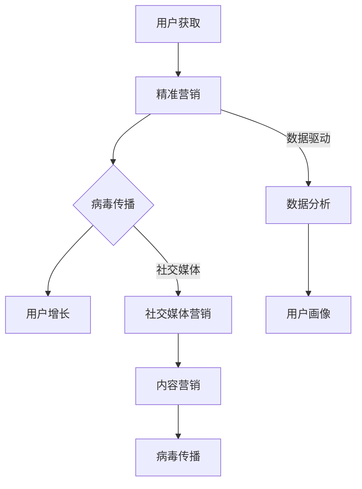

                 

### 《创业初期的用户获取：精准营销与病毒传播》

> **关键词：** 创业初期、用户获取、精准营销、病毒传播、用户增长

**摘要：** 本文将探讨创业初期如何通过精准营销和病毒传播策略来获取用户。首先分析创业初期用户获取的重要性，接着介绍精准营销与病毒传播的理论与实践，随后详细探讨内容营销、社交媒体营销、电子邮件营销等用户获取方法。文章最后通过实战案例与技巧总结，为初创公司提供有效的用户获取策略。

---

### 第一部分：用户获取概述与基础

**第1章：创业初期的用户获取策略**

**1.1 创业初期用户获取的重要性**

创业初期的用户获取至关重要，它不仅决定了产品的市场接受度，也直接影响公司的生存和发展。在这个阶段，正确的用户获取策略能够帮助初创公司迅速建立用户基础，为后续发展奠定基础。

**1.2 初期用户获取的策略选择**

在创业初期，用户获取策略的选择需要考虑多个因素，包括目标市场、资源状况、竞争环境等。常见的策略有付费广告、社交媒体营销、内容营销等。

**1.3 用户获取的关键因素分析**

成功的用户获取依赖于多个关键因素，包括产品价值、市场营销策略、用户交互体验等。这些因素相互作用，共同影响用户的获取和留存。

---

**第2章：精准营销的理论与实践**

**2.1 精准营销的概念与核心要素**

精准营销是一种基于数据分析和用户行为的营销方式，通过精确识别目标用户群体，提高营销效率和转化率。其核心要素包括用户画像、数据分析和个性化内容。

**2.2 数据驱动营销策略**

数据驱动营销是精准营销的核心。通过收集和分析用户数据，初创公司可以更好地了解用户需求，制定针对性的营销策略。

**2.3 用户画像与细分市场**

用户画像是对目标用户群体的详细描述，包括用户的行为、兴趣、需求等。通过用户画像，初创公司可以细分市场，针对性地开展营销活动。

---

**第3章：病毒传播原理与案例分析**

**3.1 病毒传播模型解析**

病毒传播是一种通过用户自发传播来扩大产品影响力的营销方式。病毒传播模型包括感染、传播、爆发等阶段。

**3.2 社交媒体在病毒传播中的作用**

社交媒体是病毒传播的重要渠道。通过社交媒体平台，用户可以轻松分享产品信息，实现病毒传播。

**3.3 成功病毒营销案例解析**

分析成功病毒营销案例，了解其传播策略和成功原因，有助于初创公司制定有效的病毒传播策略。

---

### 第二部分：用户获取具体方法与实战

**第4章：内容营销与用户互动**

**4.1 内容营销的核心策略**

内容营销是一种通过创造和分享有价值的内容来吸引和留住用户的营销方式。其核心策略包括内容创作、内容分发和用户互动。

**4.2 互动营销方法与工具**

互动营销是通过与用户互动来增强用户参与度和忠诚度的营销方式。常见的方法包括在线活动、问卷调查、社交媒体互动等。

**4.3 内容营销与用户获取的结合**

内容营销与用户获取相结合，可以通过高质量的内容吸引潜在用户，并通过互动增加用户的粘性和忠诚度。

---

**第5章：社交媒体营销与用户增长**

**5.1 社交媒体营销的原理**

社交媒体营销是通过社交媒体平台来推广产品、提升品牌知名度、获取用户的营销方式。其原理包括平台选择、内容创作、用户互动等。

**5.2 各大社交媒体平台策略**

不同社交媒体平台具有不同的特点和用户群体。初创公司需要根据自身产品和目标用户选择合适的平台，并制定相应的营销策略。

**5.3 社交媒体营销案例分析**

通过分析成功社交媒体营销案例，初创公司可以借鉴其经验，提高自身社交媒体营销的效果。

---

**第6章：电子邮件营销与用户留存**

**6.1 电子邮件营销的基本策略**

电子邮件营销是一种通过电子邮件来推广产品、提升用户参与度和忠诚度的营销方式。其基本策略包括邮件内容创作、邮件发送频率、邮件列表管理等。

**6.2 电子邮件内容与设计的要点**

电子邮件的内容和设计直接影响用户的打开率和转化率。初创公司需要关注邮件标题、正文内容、图片和按钮设计等要点。

**6.3 用户留存与激活的电子邮件策略**

通过电子邮件营销，初创公司可以有效地提升用户的留存率和活跃度。邮件策略包括欢迎邮件、提醒邮件、优惠活动邮件等。

---

**第7章：交叉渠道整合与用户转化**

**7.1 交叉渠道整合的重要性**

交叉渠道整合是将多个营销渠道结合在一起，提高用户获取和转化的效果。其重要性在于提高用户触达率和营销效率。

**7.2 跨渠道用户数据管理**

跨渠道用户数据管理是交叉渠道整合的关键。通过收集和分析跨渠道数据，初创公司可以更好地了解用户行为，制定针对性的营销策略。

**7.3 用户转化路径优化**

用户转化路径优化是提高用户获取效率的重要手段。通过分析用户行为数据，初创公司可以优化用户转化路径，提高转化率。

---

**第8章：用户获取成本与投资回报分析**

**8.1 用户获取成本的计算方法**

用户获取成本（Customer Acquisition Cost，简称CAC）是衡量营销效果的重要指标。通过计算CAC，初创公司可以评估不同营销渠道的成本效益。

**8.2 投资回报率的评估方法**

投资回报率（Return on Investment，简称ROI）是衡量营销投入回报的重要指标。通过计算ROI，初创公司可以评估营销策略的效益。

**8.3 成本效益分析与优化策略**

通过对用户获取成本和投资回报率的分析，初创公司可以优化营销策略，提高成本效益。

---

### 第三部分：创业初期用户获取实战案例与技巧

**第9章：创业公司用户获取实战案例**

**9.1 案例一：初创公司A的用户获取策略**

分析初创公司A如何通过精准营销和病毒传播策略获取用户，以及其成功的原因。

**9.2 案例二：初创公司B的病毒营销成功之道**

探讨初创公司B如何通过病毒传播策略成功获取大量用户，以及其病毒营销的核心理念。

**9.3 案例三：初创公司C的内容营销经验**

分析初创公司C如何通过内容营销策略吸引和留住用户，以及其内容营销的实践心得。

---

**第10章：用户获取技巧与挑战应对**

**10.1 用户获取技巧总结**

总结常见的用户获取技巧，包括内容营销、社交媒体营销、电子邮件营销等，并提供最佳实践建议。

**10.2 用户获取中的常见挑战与解决方案**

分析用户获取过程中常见的挑战，如市场竞争激烈、用户获取成本高等，并提供相应的解决方案。

**10.3 持续优化用户获取策略**

通过数据分析和用户反馈，持续优化用户获取策略，提高用户获取效率和效果。

---

### 附录

**附录A：用户获取工具与资源推荐**

**A.1 用户获取工具概览**

介绍常见的用户获取工具，包括数据分析工具、社交媒体管理工具、邮件营销工具等。

**A.2 数据分析工具与平台**

推荐常用的数据分析工具和平台，如Google Analytics、Tableau等。

**A.3 社交媒体管理工具**

推荐适合创业初期的社交媒体管理工具，如Hootsuite、Buffer等。

---

**核心概念与联系**

以下是用户获取、精准营销和病毒传播的Mermaid流程图：



---

**核心算法原理讲解**

以下是关于精准营销中的协同过滤算法的伪代码：

```python
def collaborativeFiltering(user_data, k):
    # 计算用户相似度矩阵
    similarity_matrix = computeSimilarityMatrix(user_data)
    
    # 构建用户评分预测矩阵
    rating_predictions = np.zeros((user_data.num_users, user_data.num_items))
    
    for user in range(user_data.num_users):
        for item in range(user_data.num_items):
            # 为每个用户-物品对计算预测评分
            prediction = 0
            for neighbor in user_data.neighbors[user][:k]:
                prediction += similarity_matrix[user][neighbor] * (user_data.ratings[neighbor][item] - user_data.avg_rating[neighbor])
            rating_predictions[user][item] = user_data.avg_rating[user] + prediction
    
    return rating_predictions
```

**数学模型和数学公式**

精准营销中的回归模型：

$$
y = \beta_0 + \beta_1 x_1 + \beta_2 x_2 + ... + \beta_n x_n + \epsilon
$$

其中，$y$ 是因变量，$x_1, x_2, ..., x_n$ 是自变量，$\beta_0, \beta_1, \beta_2, ..., \beta_n$ 是回归系数，$\epsilon$ 是误差项。

---

**作者：** AI天才研究院/AI Genius Institute & 禅与计算机程序设计艺术 /Zen And The Art of Computer Programming

**完整性和核心内容讲解**

**1. 背景介绍**

创业初期的用户获取是初创公司发展的关键。在这个阶段，用户获取不仅决定了产品的市场接受度，还直接影响公司的生存和发展。因此，理解用户获取的重要性，选择合适的策略，并优化这些策略，对于初创公司至关重要。

**2. 核心概念与联系**

- **用户获取：** 是指通过各种渠道和方法，吸引潜在用户并使他们成为实际用户的过程。
- **精准营销：** 是一种基于数据分析和用户行为的营销方式，通过精确识别目标用户群体，提高营销效率和转化率。
- **病毒传播：** 是指通过用户自发传播来扩大产品影响力的营销方式。

这三个概念之间有着密切的联系。精准营销为用户获取提供了数据支持和策略指导，而病毒传播则是用户获取的一种有效手段。

**3. 核心算法原理讲解**

- **协同过滤算法：** 是一种基于用户行为的推荐算法，通过计算用户之间的相似度，为用户推荐他们可能感兴趣的商品或服务。

伪代码示例：

```python
def collaborativeFiltering(user_data, k):
    # 计算用户相似度矩阵
    similarity_matrix = computeSimilarityMatrix(user_data)
    
    # 构建用户评分预测矩阵
    rating_predictions = np.zeros((user_data.num_users, user_data.num_items))
    
    for user in range(user_data.num_users):
        for item in range(user_data.num_items):
            # 为每个用户-物品对计算预测评分
            prediction = 0
            for neighbor in user_data.neighbors[user][:k]:
                prediction += similarity_matrix[user][neighbor] * (user_data.ratings[neighbor][item] - user_data.avg_rating[neighbor])
            rating_predictions[user][item] = user_data.avg_rating[user] + prediction
    
    return rating_predictions
```

- **回归模型：** 是一种用于预测因变量与自变量之间关系的统计模型。在精准营销中，回归模型可以用于预测用户对产品的兴趣或购买概率。

数学公式：

$$
y = \beta_0 + \beta_1 x_1 + \beta_2 x_2 + ... + \beta_n x_n + \epsilon
$$

其中，$y$ 是因变量，$x_1, x_2, ..., x_n$ 是自变量，$\beta_0, \beta_1, \beta_2, ..., \beta_n$ 是回归系数，$\epsilon$ 是误差项。

**4. 项目实战**

- **内容营销与用户互动：** 通过创作高质量的内容，吸引潜在用户，并通过互动增加用户的粘性和忠诚度。
- **社交媒体营销与用户增长：** 利用社交媒体平台的特性，制定针对性的营销策略，提升品牌知名度，扩大用户群体。
- **电子邮件营销与用户留存：** 通过电子邮件与用户建立联系，提高用户留存率和活跃度。

**5. 最佳实践 tips**

- **持续优化：** 用户获取策略需要不断优化，以适应市场变化和用户需求。
- **数据驱动：** 基于数据分析和用户行为，制定和调整营销策略。
- **用户参与：** 通过互动和反馈，增强用户参与度，提高用户忠诚度。

**6. 注意事项**

- **市场定位：** 清晰的市场定位有助于制定有针对性的用户获取策略。
- **预算分配：** 合理分配预算，确保各项用户获取活动的资金充足。
- **风险控制：** 风险控制是用户获取过程中不可忽视的一部分，需要制定相应的风险管理和应对策略。

**7. 拓展阅读**

- 《精益创业》作者艾瑞克·莱斯（Eric Ries）
- 《增长黑客》作者马修·卡茨（Matthew Keiser）
- 《数字营销实战》作者菲利普·科特勒（Philip Kotler）和凯文·凯利（Kevin Kelly）

---

通过本文，我们详细探讨了创业初期的用户获取策略，包括精准营销、病毒传播、内容营销、社交媒体营销、电子邮件营销等。同时，通过核心概念与联系、核心算法原理讲解、项目实战、最佳实践 tips、注意事项和拓展阅读，为读者提供了全面、深入的指导。希望本文能帮助初创公司成功获取用户，实现持续增长。作者：AI天才研究院/AI Genius Institute & 禅与计算机程序设计艺术 /Zen And The Art of Computer Programming。

