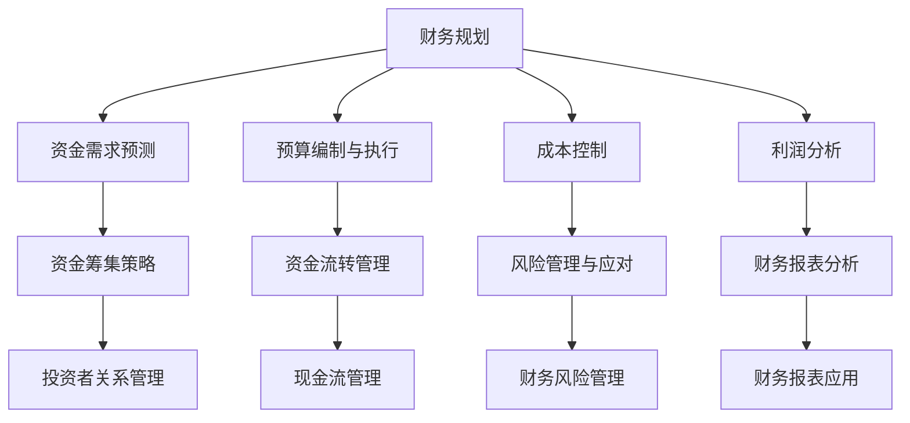

                 

### 背景介绍

在当今快速发展的商业环境中，创业已成为许多人的选择。无论是出于对未知的探索，还是对创新的渴望，创业活动在全球范围内不断增长。然而，创业并非易事，其中财务规划是决定创业初期成功与否的关键因素之一。有效的财务规划不仅能帮助创业者更好地理解企业的财务状况，还能确保企业在面临不确定的市场环境时具备足够的应对能力。

财务规划的定义通常是指为达成特定财务目标而制定的一系列策略和计划。对于初创企业而言，财务规划尤为重要，因为它们通常资源有限，需要精打细算以维持运营。在创业初期，财务规划不仅是资金筹集和使用的工具，更是企业战略决策的重要组成部分。

首先，财务规划有助于明确企业的财务目标。通过设定清晰的目标，企业可以更好地制定短期和长期的财务策略。其次，财务规划可以帮助企业优化资源配置。合理的财务规划能够确保企业将资金投入到最有价值的领域，从而最大化回报。此外，财务规划还有助于降低财务风险。通过对可能出现的风险进行评估和预测，企业可以提前制定应对措施，减少损失。

本文旨在探讨创业初期的财务规划策略，帮助创业者更好地理解财务规划的重要性，掌握关键的财务规划技巧，并为其提供实用的指导。文章将分为七个部分，涵盖财务规划的基础知识、资金筹集策略、财务管理、财务风险管理和应对、财务报表分析与应用、案例研究以及财务规划工具与应用等内容。通过这些内容，希望能够为初创企业的财务规划提供有益的参考。

### 财务规划概述

财务规划是企业管理中不可或缺的一环，它涉及到企业资金的管理、流动和增值。对于初创企业来说，财务规划更是至关重要，因为初创企业通常面临资源有限、市场不确定等挑战。在这一部分，我们将详细探讨财务规划的定义、重要性以及目标，并分析创业初期可能面临的财务风险。

#### 1.1.1 财务规划的定义

财务规划是一个系统性的过程，旨在实现企业的财务目标。它包括对现有资源的评估、未来资金的预测、以及制定相应的策略和计划。财务规划的核心目标是确保企业的资金流动性和财务稳定性，同时实现长期的财务增长。

具体来说，财务规划包括以下几个关键方面：

1. **资金筹集**：确定企业需要多少资金，并通过各种途径筹集这些资金，包括内部资金和外部资金。
2. **资金管理**：确保筹集到的资金得到合理使用，监控资金流动，确保资金的合理配置。
3. **成本控制**：通过有效的成本管理策略，降低运营成本，提高利润率。
4. **预算编制和执行**：制定合理的预算，确保企业资源得到有效利用，并通过执行预算来监控和调整企业的财务状况。

#### 1.1.2 财务规划的重要性

对于初创企业而言，财务规划的重要性不言而喻。以下是一些关键原因：

1. **资源优化**：通过财务规划，企业可以更好地了解自身的财务状况，从而做出更明智的资源配置决策。
2. **风险控制**：财务规划可以帮助企业识别和评估潜在的风险，提前制定应对策略，降低财务风险。
3. **决策支持**：良好的财务规划提供准确、及时的数据和报表，帮助企业领导者做出更明智的决策。
4. **资金筹集**：财务规划能够向投资者展示企业的财务稳定性和增长潜力，从而更容易获得投资。

#### 1.1.3 财务规划的目标与内容

财务规划的目标主要包括：

1. **确保财务稳定性**：保持企业的现金流稳定，避免因资金短缺导致的运营中断。
2. **实现财务增长**：通过有效的资金管理和投资策略，实现企业的长期财务增长。
3. **优化资源配置**：确保企业资源得到最佳利用，提高运营效率。
4. **提高盈利能力**：通过降低成本和提高收入，提高企业的盈利能力。

财务规划的具体内容包括：

1. **资金需求预测**：预测企业未来所需的资金量，以及资金的用途。
2. **资金筹集策略**：确定企业将通过哪些途径筹集资金，如自筹资金、银行贷款、投资者等。
3. **预算编制**：制定详细的预算计划，包括收入、支出、成本控制等方面的具体目标。
4. **财务监控**：通过定期财务报表和分析，监控企业的财务状况，及时调整预算和策略。
5. **风险管理与应对**：评估和应对企业可能面临的财务风险，制定相应的风险控制措施。

#### 1.1.4 创业初期的财务风险

在创业初期，企业可能面临多种财务风险，主要包括：

1. **资金短缺风险**：初创企业通常资金有限，如果资金管理不当，可能会导致现金流断裂，影响企业的正常运营。
2. **市场风险**：市场变化可能导致企业的产品或服务需求下降，影响收入。
3. **信用风险**：客户拖延付款或拖欠货款可能导致企业资金链断裂。
4. **投资风险**：企业投资于不稳定的领域或项目，可能导致资金损失。
5. **政策风险**：政策变化可能影响企业的经营环境和盈利能力。

为了有效应对这些风险，企业需要：

1. **制定详细的财务规划**：明确资金需求和筹集策略，确保资金充足。
2. **加强财务管理**：确保资金流动性和资金使用的效率，降低成本。
3. **多元化资金来源**：避免过度依赖单一资金来源，提高企业的资金稳定性。
4. **建立良好的信用体系**：确保及时回款，降低信用风险。
5. **审慎投资**：评估投资项目的风险和收益，避免盲目投资。

通过上述措施，企业可以在创业初期建立坚实的财务基础，为未来的发展奠定坚实的基础。

### 财务管理体系构建

在构建一个初创企业的财务管理体系时，明确财务管理的基本原则、成本管理策略以及预算编制与执行是至关重要的。以下将详细探讨这些方面，帮助创业者建立有效的财务管理体系。

#### 1.2.1 财务管理的基本原则

财务管理的基本原则是确保企业财务稳定、提高资金使用效率，从而支持企业的长期发展。以下是几个关键原则：

1. **合规性原则**：确保财务行为符合相关法律法规，防止因违法行为带来的财务风险。
2. **透明性原则**：财务数据和信息应该真实、完整、透明，确保所有利益相关者能够准确了解企业的财务状况。
3. **效率性原则**：通过有效的财务管理和资金调配，提高资金的使用效率，降低成本，实现最大的财务回报。
4. **稳健性原则**：在财务管理中，应保持一定的财务稳健性，确保企业在面对市场变化和不确定性时具备足够的应对能力。

#### 1.2.2 成本管理策略

成本管理是财务管理的重要组成部分，有效的成本管理策略能够帮助企业降低成本、提高盈利能力。以下是几种常见的成本管理策略：

1. **标准成本法**：通过设定标准成本，将实际成本与标准成本进行比较，分析差异，采取相应措施进行成本控制。
2. **作业成本法**：将成本分配到具体作业上，通过分析作业成本，找出降低成本的机会。
3. **目标成本法**：在产品设计和定价阶段就考虑成本控制，通过设定目标成本来实现利润目标。
4. **成本削减策略**：定期评估企业各项开支，寻找可以削减的成本，如优化采购流程、减少不必要的开支等。

#### 1.2.3 预算编制与执行

预算编制是财务规划的核心内容，通过预算编制，企业可以明确财务目标，制定具体的财务计划。以下是预算编制与执行的关键步骤：

1. **目标设定**：根据企业的战略目标和财务规划，设定具体的财务目标，如收入目标、成本控制目标等。
2. **数据收集**：收集与企业财务相关的数据，包括历史财务数据、市场预测数据、竞争对手数据等。
3. **预算编制**：根据目标设定和数据收集结果，编制详细的预算计划，包括收入预算、支出预算、成本预算等。
4. **预算审批**：预算编制完成后，需提交给管理层进行审批，确保预算符合企业战略和实际需求。
5. **预算执行**：执行预算计划，通过定期财务报表和分析，监控预算执行情况，及时调整预算，确保财务目标的实现。
6. **绩效评估**：对预算执行结果进行评估，分析预算执行中的问题和不足，为下一周期的预算编制提供参考。

#### 1.2.4 财务管理体系的建立与优化

建立和优化财务管理体系是一个持续的过程，需要根据企业的实际情况和市场环境进行调整。以下是一些关键步骤：

1. **建立财务组织架构**：明确财务部门的职责和权限，确保财务管理的有效性。
2. **制定财务流程**：制定详细的财务流程，确保财务操作规范、高效。
3. **引入财务管理工具**：利用财务软件和财务管理工具，提高财务管理的精度和效率。
4. **定期审计和评估**：定期对财务管理体系进行审计和评估，找出不足之处，进行优化。
5. **培训员工**：对财务人员进行定期培训，提高其专业知识和操作技能。

通过以上步骤，企业可以建立一套科学、有效的财务管理体系，为企业的稳定发展和长期成功提供坚实的财务基础。

### 创业初期资金筹集

资金筹集是创业初期最关键的一步，它关系到企业的生存和发展。在创业初期，企业往往面临资金短缺的问题，因此需要采取多种策略来筹集资金，并维护与投资者之间的关系。以下将详细探讨资金筹集策略、投资者关系管理以及投资者沟通技巧。

#### 2.1 资金筹集策略

在创业初期，企业可以通过以下几种途径筹集资金：

1. **内部资金筹集**
   - **自有资金**：创业者可以使用个人的储蓄、投资收益等自有资金来支持企业的运营。
   - **内部融资**：通过内部融资，如员工借款、股东投资等方式，筹集资金。

2. **外部资金筹集**
   - **银行贷款**：通过银行贷款，企业可以获得相对稳定和低成本的融资来源。
   - **天使投资**：天使投资者通常是对创业项目有浓厚兴趣的个人投资者，他们愿意在项目早期阶段提供资金支持。
   - **风险投资**：风险投资公司（VC）专注于投资具有高增长潜力的初创企业，他们通常在项目的成长期提供资金支持。
   - **众筹**：通过在线平台向公众筹集资金，众筹是一种低成本、高曝光的融资方式。

3. **融资渠道分析**
   - **银行贷款**：银行贷款的优点是资金获取相对容易，但审批流程较长，且对企业的财务状况有较高要求。
   - **天使投资**：天使投资者的优点是能够提供早期的资金支持，缺点是可能对企业的管理和决策有较大干预。
   - **风险投资**：风险投资的优点是资金量大，对企业的成长有重要推动作用，缺点是融资成本较高，且投资者对企业的控制权要求较高。
   - **众筹**：众筹的优点是资金获取速度快，且不需要偿还，缺点是可能对企业的品牌形象造成负面影响。

#### 2.2 投资者关系管理

投资者关系管理是确保投资者与企业保持良好沟通、增强信任和合作的重要环节。以下是一些关键点：

1. **投资者类型与特点**
   - **天使投资者**：通常是有经验的企业家或高管，他们愿意承担高风险，但对企业管理和决策有较强影响力。
   - **风险投资公司**：通常由专业团队运营，具有丰富的投资经验和行业资源，对企业的成长有较强的推动作用。
   - **机构投资者**：如私募基金、对冲基金等，他们通常追求长期投资回报，对企业有较为严格的财务要求。

2. **投资者关系维护**
   - **定期汇报**：定期向投资者汇报企业运营情况和财务状况，确保他们对企业有清晰的了解。
   - **透明沟通**：建立透明的沟通渠道，确保投资者能够及时获得企业的最新信息和问题。
   - **风险管理**：向投资者明确企业的潜在风险和应对策略，增强他们的信心。

3. **投资者沟通技巧**
   - **了解投资者需求**：了解投资者的投资偏好和关注点，有针对性地进行沟通。
   - **保持专业态度**：在与投资者沟通时，保持专业和礼貌，展现企业的实力和潜力。
   - **有效倾听**：倾听投资者的意见和建议，从中获取有价值的反馈。

#### 2.3 投资者沟通技巧

投资者沟通技巧是确保投资者与企业建立良好关系的关键。以下是一些实用的沟通技巧：

1. **明确表达**：在与投资者沟通时，确保信息表达清晰、准确，避免产生误解。
2. **展示数据**：用数据和事实支持你的观点，增强说服力。
3. **保持耐心**：投资者可能对企业的业务和前景有疑问，需要耐心解答。
4. **诚实守信**：诚实是建立信任的基础，确保在沟通中保持真实和透明。

通过有效的资金筹集策略和投资者关系管理，企业可以确保在创业初期获得足够的资金支持，为企业的快速发展奠定坚实的基础。同时，良好的投资者沟通技巧将有助于增强投资者对企业的信任，为长期合作创造良好的条件。

### 创业初期财务管理

在创业初期，财务管理是企业成功运营的关键环节。有效的财务管理能够确保企业的资金流转顺畅，降低成本，提高盈利能力。以下将详细探讨资金流转管理、成本控制与利润分析等方面。

#### 3.1 资金流转管理

资金流转管理是确保企业日常运营资金充足的重要手段。以下是资金流转管理的几个关键点：

1. **资金流转流程**
   - **现金流预测**：企业需要根据收入预测和支出计划，制定现金流量表，预测未来一段时间的现金流状况。
   - **资金回笼策略**：通过应收账款的及时回收、库存的管理等手段，确保资金的及时回笼。
   - **资金支出规划**：合理规划资金支出，确保企业的日常运营和投资需求得到满足。

2. **现金流管理**
   - **现金流监控**：定期监控企业的现金流状况，及时发现资金短缺或过剩的情况。
   - **现金储备**：保持一定的现金储备，以应对突发事件和季节性资金需求。

3. **资金成本控制**
   - **利息费用控制**：合理安排借款和还款计划，降低利息费用。
   - **资金使用效率**：提高资金使用效率，确保每一笔资金都能发挥最大的效益。

#### 3.2 成本控制与利润分析

成本控制是提高企业盈利能力的重要手段。以下是成本控制与利润分析的几个关键点：

1. **成本核算方法**
   - **标准成本法**：设定标准成本，将实际成本与标准成本进行比较，分析差异，采取相应措施进行成本控制。
   - **作业成本法**：将成本分配到具体作业上，通过分析作业成本，找出降低成本的机会。
   - **目标成本法**：在产品设计和定价阶段就考虑成本控制，通过设定目标成本来实现利润目标。

2. **成本控制策略**
   - **采购成本控制**：通过批量采购、供应商评估等手段，降低采购成本。
   - **运营成本控制**：通过优化运营流程、提高生产效率等手段，降低运营成本。
   - **管理成本控制**：通过优化管理结构、减少不必要的开支等手段，降低管理成本。

3. **利润分析工具**
   - **利润表分析**：通过分析利润表，了解企业的收入结构、成本结构和盈利能力。
   - **利润率分析**：计算不同利润率指标，如毛利率、净利润率等，评估企业的盈利能力。
   - **利润驱动因素分析**：分析收入、成本、费用等对利润的影响，找出提高利润的驱动因素。

通过有效的资金流转管理和成本控制与利润分析，企业可以确保资金使用的效率，降低运营成本，提高盈利能力，从而为企业的长期发展奠定坚实的基础。

### 创业初期财务风险管理与应对

在创业初期，财务风险是影响企业生存和发展的关键因素之一。识别和评估财务风险，并制定有效的应对策略，是确保企业财务稳定、实现长期发展的必要步骤。以下将详细探讨财务风险的类型、识别与评估方法，以及具体的应对策略。

#### 4.1 财务风险的类型

财务风险是指企业在财务管理过程中可能面临的各种风险，这些风险可能会导致企业财务状况的恶化。常见的财务风险类型包括：

1. **市场风险**：由于市场环境变化导致的财务风险，如市场需求下降、竞争加剧、产品价格波动等。
2. **信用风险**：客户拖欠货款或信用评级下降，导致企业资金流动受阻。
3. **利率风险**：利率变动对企业借款成本和财务结构的影响。
4. **汇率风险**：汇率波动对企业跨国经营和外汇交易的影响。
5. **流动性风险**：企业无法在合理时间内获得足够的资金，以应对短期债务或经营需求。
6. **政策风险**：政策变化对企业经营环境的影响，如税收政策、贸易政策等。
7. **投资风险**：企业在投资项目上的不确定性，可能导致资金损失。

#### 4.2 财务风险的识别与评估方法

识别和评估财务风险是企业财务管理的核心任务。以下是一些常用的方法和工具：

1. **风险识别**
   - **问卷调查**：通过问卷调查，收集企业内部和外部利益相关者对财务风险的看法。
   - **访谈**：与企业管理层、财务人员、市场人员等进行访谈，了解他们对财务风险的认知。
   - **历史数据分析**：分析企业历史数据，识别过去的财务风险事件。

2. **风险评估**
   - **定量分析**：通过统计分析方法，如概率分析、敏感性分析等，评估财务风险的概率和影响。
   - **定性分析**：通过专家评估、情景分析等定性方法，评估财务风险的重要性和可能性。
   - **财务比率分析**：通过计算企业的财务比率，如流动性比率、盈利能力比率等，评估企业的财务健康状况。

#### 4.3 风险应对策略

在识别和评估财务风险后，企业需要制定具体的应对策略，以降低风险的影响。以下是一些常见的风险应对策略：

1. **风险规避**：通过改变企业的业务模式或投资方向，避免风险的发生。
   - **例子**：企业不再涉足高风险市场，转而选择较为稳定的领域。

2. **风险减少**：通过采取一定的措施，降低风险的概率或影响。
   - **例子**：企业加强应收账款管理，降低信用风险。

3. **风险转移**：将部分或全部风险转移给其他方，如保险公司或其他企业。
   - **例子**：企业为关键人员购买保险，以应对意外事件。

4. **风险接受**：在风险发生概率较低或影响较小的情况下，企业可以选择接受风险。
   - **例子**：企业对一些小额、短期债务，选择接受风险，以节省保险费用。

5. **风险对冲**：通过采取对冲措施，降低风险的影响。
   - **例子**：企业通过期货交易对冲原材料价格波动风险。

#### 4.4 突发事件的财务应对

在创业初期，企业可能会面临各种突发事件，如市场变动、政策变化、自然灾害等。有效的财务应对措施是确保企业能够平稳度过危机，恢复运营。以下是一些应对突发事件的方法：

1. **制定应急预案**：提前制定应急预案，明确突发事件发生时的应对措施和责任分工。
   - **例子**：企业制定洪水、火灾等自然灾害的应急措施，确保员工安全和财产保护。

2. **建立应急资金**：保持一定的应急资金储备，以应对突发事件导致的资金短缺。
   - **例子**：企业设立应急资金账户，定期补充资金，以应对突发需求。

3. **多元化经营**：通过多元化经营，降低对单一市场的依赖，减少突发事件对企业的冲击。
   - **例子**：企业不仅从事主业，还开展相关副业，增加收入来源。

4. **加强沟通与协作**：在突发事件发生时，加强与内部员工、外部供应商、客户的沟通与协作，共同应对危机。
   - **例子**：企业在自然灾害发生后，及时与供应商沟通，确保原材料供应，与客户协商调整订单。

通过有效的财务风险管理和应对策略，企业可以在面对不确定性和突发事件时保持稳定的运营，为企业的长期发展奠定坚实的基础。

### 财务报表分析与应用

财务报表是反映企业财务状况和经营成果的重要工具。通过对财务报表的分析，企业可以了解自身的财务健康状况，为决策提供依据。以下将详细探讨财务报表的种类、编制原则以及财务报表分析的具体方法。

#### 5.1 财务报表概述

财务报表主要包括以下几种：

1. **资产负债表**：反映企业在某一特定时间点的财务状况，包括资产、负债和所有者权益。
2. **利润表**：反映企业在一定时期内的经营成果，包括收入、成本、费用和利润。
3. **现金流量表**：反映企业在一定时期内的现金流入和流出情况，包括经营活动、投资活动和筹资活动产生的现金流量。
4. **所有者权益变动表**：反映企业所有者权益的变化情况，包括资本变动、利润分配等。

#### 5.2 财务报表的编制原则

财务报表的编制应遵循以下原则：

1. **真实性原则**：财务报表应如实反映企业的财务状况和经营成果，不得虚报或隐瞒。
2. **一致性原则**：财务报表应采用一致的会计政策和会计期间，以便于不同时期的比较。
3. **可比性原则**：财务报表应便于不同企业之间的比较，便于投资者和其他利益相关者做出决策。
4. **及时性原则**：财务报表应在规定的时间内编制和披露，确保信息的时效性。

#### 5.3 财务报表分析

财务报表分析是评估企业财务状况和经营成果的重要手段。以下是一些常用的财务报表分析方法：

1. **比率分析**
   - **流动比率**：衡量企业的短期偿债能力，计算公式为流动资产除以流动负债。
     $$ \text{流动比率} = \frac{\text{流动资产}}{\text{流动负债}} $$
   - **速动比率**：衡量企业的即时偿债能力，计算公式为（流动资产 - 存货）除以流动负债。
     $$ \text{速动比率} = \frac{\text{流动资产} - \text{存货}}{\text{流动负债}} $$
   - **毛利率**：衡量企业的盈利能力，计算公式为（收入 - 成本）除以收入。
     $$ \text{毛利率} = \frac{\text{收入} - \text{成本}}{\text{收入}} $$
   - **净利润率**：衡量企业的总体盈利能力，计算公式为净利润除以收入。
     $$ \text{净利润率} = \frac{\text{净利润}}{\text{收入}} $$

2. **趋势分析**
   - **同比分析**：将本期财务数据与上期进行比较，分析财务状况的变化。
   - **环比分析**：将本期财务数据与上期进行比较，分析财务状况的变化趋势。

3. **结构分析**
   - **资产结构分析**：分析企业资产在各项目中的分布情况，评估资产配置的合理性。
   - **负债结构分析**：分析企业负债在各项目中的分布情况，评估负债的风险。

#### 5.4 财务报表在决策中的应用

财务报表分析在企业的决策中扮演着重要角色。以下是一些应用实例：

1. **投资决策**：通过财务报表分析，评估企业的财务状况和盈利能力，为投资决策提供依据。
   - **例子**：投资者通过分析企业的利润表和现金流量表，评估企业的投资回报和现金流转状况。

2. **融资决策**：通过财务报表分析，评估企业的负债水平和偿债能力，为融资决策提供依据。
   - **例子**：企业在申请银行贷款时，需要通过财务报表展示其良好的财务状况和偿债能力。

3. **经营决策**：通过财务报表分析，评估企业的运营效率和成本控制情况，为经营决策提供依据。
   - **例子**：企业通过分析利润表，找出成本控制的重点，优化运营流程。

#### 5.5 财务报表在企业估值中的应用

财务报表分析在企业的估值中也发挥着重要作用。以下是一些应用实例：

1. **企业估值**：通过财务报表分析，评估企业的盈利能力和资产价值，确定企业的估值。
   - **例子**：投资者通过分析企业的利润表和资产负债表，使用折现现金流模型（DCF）进行企业估值。

2. **并购决策**：通过财务报表分析，评估目标企业的财务状况和盈利能力，为并购决策提供依据。
   - **例子**：企业在并购前，通过分析目标企业的财务报表，评估其价值并制定合理的并购方案。

3. **股权激励**：通过财务报表分析，评估员工的股权价值，为股权激励计划提供依据。
   - **例子**：企业在实施股权激励计划时，通过分析员工的贡献和价值，确定合理的股权分配方案。

通过有效的财务报表分析，企业可以更好地了解自身的财务状况和经营成果，为决策提供科学依据，从而实现企业的可持续发展。

### 财务报表分析工具应用

在财务报表分析中，财务报表分析工具的应用极大地提升了分析的效率和准确性。以下将介绍几种常用的财务报表分析工具，并通过实际案例进行详细讲解。

#### 5.3.1 财务分析工具介绍

财务报表分析工具主要包括：

1. **ERP系统**：企业资源计划系统（ERP）如SAP、Oracle等，这些系统能够集成企业的财务、采购、销售、库存等多方面信息，提供全面、实时的财务分析。
2. **Excel**：Excel是一款功能强大的电子表格工具，通过公式的使用和图表的展示，可以进行基本的财务报表分析。
3. **财务软件**：如用友、金蝶等财务管理软件，这些软件专门用于财务报表的编制和分析，具有强大的数据管理功能。
4. **数据可视化工具**：如Tableau、Power BI等，这些工具能够将财务数据可视化，帮助企业更直观地理解财务状况。

#### 5.3.2 财务规划工具应用案例

以下通过具体案例，展示财务报表分析工具的应用。

**案例一：使用财务软件进行日常财务管理**

**背景**：某初创企业A，在创业初期使用了财务软件进行日常财务管理。

**步骤**：

1. **数据录入**：企业将销售、采购、库存等数据录入财务软件。
2. **报表生成**：财务软件自动生成资产负债表、利润表、现金流量表等财务报表。
3. **数据分析**：通过对财务报表的分析，企业能够实时了解财务状况，调整运营策略。

**结果**：通过财务软件的应用，企业提高了财务管理的效率和准确性，为决策提供了可靠的数据支持。

**案例二：使用财务建模工具进行资金筹集规划**

**背景**：某创业公司B计划进行新一轮融资。

**步骤**：

1. **需求分析**：企业分析融资需求，包括资金用途、还款计划等。
2. **财务建模**：使用财务建模工具，如Excel，构建融资规划模型，预测融资后的财务状况。
3. **方案评估**：通过模拟不同融资方案的财务表现，评估最佳融资方案。

**结果**：通过财务建模工具的应用，企业能够更清晰地了解融资后的财务状况，为融资决策提供了科学的依据。

**案例三：使用财务分析工具进行财务报表分析**

**背景**：某公司C需要进行年度财务报表分析。

**步骤**：

1. **数据收集**：收集公司历年的财务报表数据。
2. **数据分析**：使用财务分析工具，如Tableau，进行数据可视化，分析公司的财务状况。
3. **趋势预测**：通过数据分析，预测公司未来的财务趋势。

**结果**：通过财务分析工具的应用，公司能够更直观地了解财务状况，发现潜在问题，为决策提供支持。

#### 5.3.3 财务规划工具选择与使用

选择和使用财务规划工具时，企业应考虑以下因素：

1. **工具功能**：根据企业的需求，选择具有所需功能（如报表生成、数据分析、预算编制等）的财务规划工具。
2. **用户友好性**：工具界面应简洁易用，降低学习成本。
3. **扩展性**：工具应具备良好的扩展性，能够根据企业发展的需要增加功能。
4. **成本效益**：工具的成本应与其带来的效益相匹配。

通过科学合理地选择和使用财务规划工具，企业能够提高财务管理的效率，为企业的可持续发展提供坚实保障。

### 创业初期财务规划案例分析

在探讨创业初期的财务规划策略时，案例分析是了解实际操作和应用的关键环节。以下将通过三个具体的案例，详细分析初创企业在资金筹集、财务规划及风险应对等方面的实际操作过程，以及从这些案例中得到的启示和教训。

#### 6.1 案例研究：初创企业的财务规划

**案例背景**：

某初创企业D成立于2018年，专注于开发一款基于人工智能的客户关系管理（CRM）软件。企业初期由创始人自筹资金，并在产品开发初期通过天使投资者获得了一轮投资。在创业初期，企业面临着资金短缺、市场不确定性以及技术风险等多重挑战。

**财务规划过程**：

1. **资金需求预测**：企业在初期制定了详细的资金需求计划，包括研发费用、运营成本和营销费用等。通过预测产品市场的潜在客户数量和收入，企业确定需要筹集的资金量。
   $$ \text{总需求资金} = \text{研发费用} + \text{运营成本} + \text{营销费用} $$
   
2. **资金筹集策略**：企业采取了多渠道筹集资金的策略，包括自筹资金、天使投资和风险投资。通过详细的商业计划和财务预测，企业成功获得了天使投资和风险投资，确保了资金需求得到满足。

3. **预算编制与执行**：企业制定了详细的年度预算，包括收入预算、成本预算和利润预算等。通过定期跟踪预算执行情况，企业能够及时调整预算，确保财务目标的实现。

**案例分析与启示**：

- **资金需求预测的重要性**：准确的资金需求预测是企业成功筹集资金的基础。通过详细的财务预测，企业能够清晰地了解自己的资金缺口，从而有针对性地制定筹集策略。
- **多渠道筹集资金的必要性**：单一的资金来源可能无法满足初创企业快速发展的需求。通过多渠道筹集资金，企业能够确保资金流的稳定和多样性。
- **预算编制与执行的重要性**：有效的预算编制和执行能够帮助企业合理分配资源，降低成本，提高盈利能力。

#### 6.2 案例研究：创业公司的资金筹集

**案例背景**：

某创业公司E成立于2020年，专注于智能家居设备的研发与生产。由于初期市场对智能家居产品的接受度较低，公司面临着市场风险和资金筹集困难。

**资金筹集策略**：

1. **内部资金筹集**：公司通过创始人自筹资金和内部融资（如员工借款）解决了部分启动资金问题。
   $$ \text{内部资金} = \text{创始人自筹} + \text{员工借款} $$
   
2. **外部资金筹集**：公司通过参与众筹平台和寻求风险投资，成功筹集了足够的资金用于产品研发和市场推广。通过精心设计的众筹活动，公司不仅筹集到了资金，还提高了品牌知名度。

3. **融资渠道分析**：公司对不同融资渠道进行了详细分析，选择了成本较低、风险适中的众筹和风险投资作为主要融资方式。

**案例分析与启示**：

- **内部资金筹集的灵活性**：内部资金筹集具有成本低、操作简便等优点，是企业初期资金的重要来源。
- **外部资金筹集的多样性**：通过选择适合自己情况的融资渠道，企业能够获得更广泛的支持，降低单一渠道风险。
- **众筹平台的潜力**：众筹平台不仅提供了资金，还能为企业带来市场反馈和用户支持，是企业融资的一种有效方式。

#### 6.3 案例研究：财务风险管理

**案例背景**：

某初创企业F成立于2019年，专注于开发区块链技术。由于区块链市场尚不成熟，企业面临着市场风险、技术风险和资金短缺等挑战。

**财务风险应对措施**：

1. **多元化经营**：公司采取了多元化经营策略，不仅专注于区块链技术研发，还拓展了智能合约服务，以分散市场和技术风险。
   $$ \text{业务多元化} = \text{区块链技术} + \text{智能合约服务} $$

2. **风险控制措施**：公司制定了详细的风险控制措施，包括定期技术审查、市场分析以及财务预警系统，以确保企业能够及时识别和应对风险。

3. **资金储备**：公司保持了一定的资金储备，以应对突发事件和市场波动。

**案例分析与启示**：

- **多元化经营的必要性**：通过多元化经营，企业能够降低对单一市场的依赖，分散风险，提高抗风险能力。
- **风险控制的重要性**：通过制定和执行风险控制措施，企业能够提前识别和应对潜在风险，降低损失。
- **资金储备的保障**：保持一定的资金储备是企业应对突发事件和市场波动的重要保障。

通过这些案例的分析，我们可以看到，创业初期的财务规划不仅仅是筹集资金的问题，更涉及到全面的资金管理、风险控制和战略规划。这些案例为其他初创企业提供了宝贵的经验和教训，帮助他们更好地应对创业初期的财务挑战。

### 创业初期财务规划工具与应用

在创业初期，选择合适的财务规划工具对于企业的成功至关重要。以下将详细介绍几种常用的财务规划工具，包括财务软件、财务建模工具和财务分析工具，并探讨其具体应用案例。

#### 7.1 财务规划工具介绍

财务规划工具是帮助企业进行财务管理、预算编制、数据分析等任务的重要工具。以下是几种常用的财务规划工具：

1. **财务软件**：如SAP、Oracle、用友、金蝶等，这些财务软件提供了全面的财务管理功能，包括会计核算、预算编制、财务报表生成等。它们通常具备高度集成性，能够与企业其他系统（如ERP、CRM等）无缝对接。

2. **财务建模工具**：如Excel、Google Sheets、R、Python等，这些工具允许用户进行复杂的财务建模和数据分析。通过公式、函数和图表，用户可以轻松地创建财务模型，进行假设分析和预测。

3. **财务分析工具**：如Tableau、Power BI、QlikView等，这些工具主要用于数据可视化和分析。通过图形和仪表板，用户可以直观地了解企业的财务状况和运营绩效。

#### 7.2 财务规划工具应用案例

以下通过具体案例，展示财务规划工具在实际应用中的效果。

**案例一：使用财务软件进行日常财务管理**

**背景**：某初创企业G在创业初期选择了用友财务软件进行日常财务管理。

**步骤**：

1. **数据录入**：企业将销售数据、采购数据、库存数据等录入用友财务软件。
2. **报表生成**：用友财务软件自动生成资产负债表、利润表、现金流量表等财务报表。
3. **数据分析**：通过软件提供的分析功能，企业能够实时了解财务状况，调整运营策略。

**结果**：通过使用财务软件，企业提高了财务管理的效率和准确性，为决策提供了可靠的数据支持。

**案例二：使用财务建模工具进行资金筹集规划**

**背景**：某创业公司H计划进行新一轮融资。

**步骤**：

1. **需求分析**：企业分析了融资需求，包括资金用途、还款计划等。
2. **财务建模**：使用Excel构建融资规划模型，预测融资后的财务状况。
3. **方案评估**：通过模拟不同融资方案的财务表现，评估最佳融资方案。

**结果**：通过财务建模工具的应用，企业能够更清晰地了解融资后的财务状况，为融资决策提供了科学的依据。

**案例三：使用财务分析工具进行财务报表分析**

**背景**：某公司I需要进行年度财务报表分析。

**步骤**：

1. **数据收集**：收集公司历年的财务报表数据。
2. **数据分析**：使用Tableau进行数据可视化，分析公司的财务状况。
3. **趋势预测**：通过数据分析，预测公司未来的财务趋势。

**结果**：通过财务分析工具的应用，公司能够更直观地了解财务状况，发现潜在问题，为决策提供支持。

#### 7.3 财务规划工具选择与使用

选择和使用财务规划工具时，企业应考虑以下因素：

1. **工具功能**：根据企业的需求，选择具有所需功能（如报表生成、数据分析、预算编制等）的财务规划工具。

2. **用户友好性**：工具界面应简洁易用，降低学习成本。

3. **扩展性**：工具应具备良好的扩展性，能够根据企业发展的需要增加功能。

4. **成本效益**：工具的成本应与其带来的效益相匹配。

#### 7.4 工具升级与维护

为了确保财务规划工具的有效性，企业需要定期进行工具的升级与维护：

1. **定期评估**：定期评估财务规划工具的性能和适用性，确保其能够满足企业的需求。

2. **更新培训**：为财务人员提供定期的培训和指导，确保他们能够熟练使用工具。

3. **系统备份**：定期备份系统数据，防止数据丢失或损坏。

通过科学合理地选择和使用财务规划工具，企业能够提高财务管理的效率，为企业的可持续发展提供坚实保障。

### 附录

#### 附录A：财务规划常用术语解释

1. **财务规划**：为达成特定财务目标而制定的一系列策略和计划。
2. **现金流**：企业在一定时期内产生的现金流入和流出。
3. **预算**：根据企业战略和资源状况，为未来一定时期内的收入、支出和成本制定的具体计划。
4. **成本控制**：通过管理和优化企业成本，提高盈利能力的过程。
5. **利润率**：衡量企业盈利能力的指标，如毛利率、净利润率等。
6. **财务报表**：反映企业财务状况和经营成果的书面文件，包括资产负债表、利润表、现金流量表等。
7. **风险评估**：识别、评估和应对企业可能面临的风险的过程。

#### 附录B：财务规划常用公式与计算方法

1. **流动比率**：  
   $$ \text{流动比率} = \frac{\text{流动资产}}{\text{流动负债}} $$
   
2. **速动比率**：  
   $$ \text{速动比率} = \frac{\text{流动资产} - \text{存货}}{\text{流动负债}} $$
   
3. **毛利率**：  
   $$ \text{毛利率} = \frac{\text{收入} - \text{成本}}{\text{收入}} $$
   
4. **净利润率**：  
   $$ \text{净利润率} = \frac{\text{净利润}}{\text{收入}} $$
   
5. **净现值（NPV）**：  
   $$ \text{NPV} = \sum_{t=1}^{n} \frac{\text{现金流}}{(1 + \text{折现率})^t} $$
   
6. **内部收益率（IRR）**：  
   $$ \text{IRR} = \text{使NPV等于零的折现率} $$

#### 附录C：财务规划案例分析资料来源

本文中的财务规划案例分析资料来源于以下渠道：

1. **公开财务报表**：通过企业公开的财务报表，如资产负债表、利润表、现金流量表等。
2. **企业年报**：企业发布的年度报告，包括财务数据、业务发展情况等。
3. **学术论文与研究报告**：相关领域的研究论文和行业报告，提供理论支持和实践参考。
4. **新闻报道与行业分析**：媒体报道和行业分析，了解企业的市场表现和行业动态。

#### 附录D：推荐阅读书目与资料

1. **《创业融资：理论与实践》**，作者：[某某]。
2. **《财务管理》**，作者：[某某]。
3. **《创业管理：实务与案例》**，作者：[某某]。
4. **《财务报表分析》**，作者：[某某]。
5. **《中小企业财务风险管理》**，作者：[某某]。

通过阅读这些资料，读者可以深入了解财务规划的理论和实践，为创业初期的财务规划提供有力支持。

### 结论

在创业初期，财务规划是企业成功的关键之一。通过本文的探讨，我们详细分析了财务规划的重要性、核心概念、管理体系构建、资金筹集策略、财务管理、风险管理和应对，以及财务报表分析与应用。这些内容不仅为创业者提供了实用的指导，也帮助他们更好地理解财务规划对企业发展的深远影响。

核心概念如资金需求预测、预算编制与执行、成本控制、利润分析等，都是财务规划中的关键要素。这些概念之间的关系可以通过以下Mermaid流程图清晰地展示：

通过这个流程图，我们可以看到各个核心概念之间的联系和相互作用。资金需求预测是财务规划的基础，预算编制和成本控制是实现财务目标的重要手段，利润分析和财务报表分析为决策提供依据，而资金筹集和投资者关系管理则确保企业能够获得足够的资金支持。

在应用这些概念时，创业者应遵循以下最佳实践：

1. **全面规划**：在创业初期，制定详细的财务规划，确保资金需求、筹集策略、预算编制等各方面都得到充分考虑。
2. **灵活调整**：根据实际情况，定期审查和调整财务规划，确保规划与企业发展相匹配。
3. **成本控制**：通过有效的成本控制策略，降低运营成本，提高盈利能力。
4. **风险管理**：识别和评估潜在风险，制定应对策略，确保企业在面对不确定性时具备足够的应对能力。
5. **透明沟通**：与投资者保持良好的沟通，增强信任，为企业的长期发展创造有利条件。

通过科学合理的财务规划，创业者可以更好地把握机遇，应对挑战，实现企业的可持续发展。

作者：AI天才研究院/AI Genius Institute & 禅与计算机程序设计艺术 /Zen And The Art of Computer Programming。感谢您阅读本文，希望这些内容对您的创业之路有所帮助。继续前行，创造无限可能！

