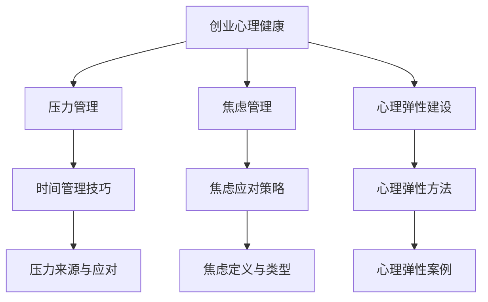

                 

# 创业心理健康：如何缓解压力和焦虑

## 关键词

创业，心理健康，压力管理，焦虑管理，心理弹性，支持系统，实战指南

## 摘要

创业过程中，心理健康是至关重要的。本文将从心理健康的定义、压力和焦虑的管理、心理弹性的建设以及心理健康的支持系统等方面，提供一系列实用的技巧和方法，帮助创业者缓解压力和焦虑，保持良好的心理健康状态。

## 引言

### 1.1 创业心理健康的重要性

创业是一项充满挑战和压力的工作。心理健康对于创业者来说至关重要，因为它不仅影响着创业者的情绪状态，还直接关系到创业的成功与否。一个心理健康良好的创业者能够更好地应对压力和挑战，保持清晰的思维和高效的执行力，从而提高创业的成功率。

### 1.2 压力和焦虑对创业的影响

压力和焦虑是创业过程中常见的情绪反应。适度的压力可以激发创业者的斗志和动力，但过度的压力和焦虑则会严重影响创业者的心理健康，导致情绪低落、决策困难、工作效率下降等问题。长期的压力和焦虑还可能引发严重的心理疾病，如抑郁症和焦虑症。

## 心理健康基础知识

### 2.1 心理健康概念

心理健康是指个体在心理上保持平衡和适应的状态，能够有效应对生活中的各种挑战和压力。心理健康包括情感、认知和行为三个方面的平衡和协调。

### 2.2 心理健康与创业的关系

心理健康与创业成功密切相关。一个心理健康良好的创业者能够更好地应对创业过程中的挑战和压力，保持积极的心态和高效的执行力，从而提高创业的成功率。

### 2.3 常见心理问题概述

创业过程中，常见的心理问题包括焦虑、抑郁、失眠等。这些问题如果得不到及时有效的处理，会严重影响到创业者的心理健康和生活质量。

## 压力管理

### 3.1 压力的来源与应对策略

压力的来源多种多样，包括工作压力、财务压力、人际关系压力等。应对压力的策略包括时间管理、放松技巧、认知重构等。

### 3.2 时间管理技巧

时间管理是缓解压力的重要手段。有效的时间管理可以帮助创业者合理安排工作和休息时间，减少因时间压力而产生的焦虑感。

### 3.3 压力释放与缓解方法

压力释放和缓解方法包括运动、冥想、深呼吸等。这些方法可以帮助创业者放松身心，缓解压力和焦虑。

## 焦虑管理

### 4.1 焦虑的定义与类型

焦虑是一种情绪反应，表现为紧张、不安、担心等。焦虑可分为急性焦虑和慢性焦虑，分别对应短期和长期的压力状态。

### 4.2 焦虑对创业的影响

焦虑会影响创业者的决策能力和执行力，导致创业过程中出现失误和错误。因此，管理焦虑对于创业者来说至关重要。

### 4.3 焦虑的应对策略

应对焦虑的策略包括放松技巧、认知行为疗法、心理咨询等。这些方法可以帮助创业者缓解焦虑，提高心理韧性。

## 心理弹性建设

### 5.1 心理弹性的概念与重要性

心理弹性是指个体在面对压力和挑战时的适应能力。心理弹性高的创业者能够更好地应对创业过程中的困难和挫折，保持积极的心态和执行力。

### 5.2 增强心理弹性的方法

增强心理弹性的方法包括自我认知、积极思维、情绪管理、人际支持等。这些方法可以帮助创业者提高心理韧性，增强面对压力和挑战的能力。

### 5.3 心理弹性案例分享

通过案例分享，创业者可以了解到其他成功应对压力和挑战的方法和经验，从而提高自己的心理弹性。

## 心理健康支持系统

### 6.1 创业者心理健康支持的重要性

创业者心理健康支持系统是帮助创业者缓解压力和焦虑的重要保障。一个良好的支持系统可以提供心理援助、情绪支持、职业咨询等帮助。

### 6.2 家庭与朋友支持

家庭和朋友是创业者最可靠的支持来源。他们的支持和理解可以帮助创业者缓解压力，提高心理韧性。

### 6.3 专业心理咨询服务

专业心理咨询服务是创业者解决心理健康问题的重要途径。通过心理咨询，创业者可以获得专业的指导和建议，有效缓解压力和焦虑。

## 实战指南：创业心理健康实践

### 7.1 创业心理自我评估

创业者可以通过自我评估了解自己的心理健康状况，从而制定相应的心理健康计划。

### 7.2 心理健康计划制定

心理健康计划应包括压力管理、焦虑管理、心理弹性建设等方面。创业者可以根据自己的实际情况，制定个性化的心理健康计划。

### 7.3 心理健康持续改善

心理健康是一个持续的过程。创业者应不断学习和实践心理健康技巧，提高自己的心理素质。

## 附录

### 8.1 心理健康相关资源

本文中提到的心理健康资源包括书籍、网站、心理咨询服务等，供创业者参考。

### 8.2 创业心理健康常用工具

创业心理健康常用工具包括压力日记、情绪记录表、心理测试等，帮助创业者更好地了解和管理自己的心理健康。

### 8.3 心理健康知识拓展

心理健康知识拓展包括心理健康理论、心理疾病预防与治疗、心理健康与身体健康的关系等内容，供创业者深入了解心理健康。

### 核心概念与联系

以下是本文的核心概念与联系架构 Mermaid 流程图：



### 核心算法原理讲解

#### 压力管理算法原理

压力管理算法主要基于心理学中的认知行为疗法（CBT）模型。CBT的核心思想是通过改变思维和行为模式来减少负面情绪。以下是一个简单的伪代码，描述了压力管理算法的基本步骤：

```python
def manage_stress():
    # 步骤1：自我认知
    current_stress_level = assess_stress_level()

    # 步骤2：认知重构
    if current_stress_level > threshold:
        cognitive_restructuring()

    # 步骤3：行为激活
    behavior_activation()

    # 步骤4：反馈调整
    new_stress_level = assess_stress_level()
    if new_stress_level < threshold:
        return "Stress managed successfully."
    else:
        return "Stress management failed."

def assess_stress_level():
    # 实现方法：使用问卷调查、生理指标（如心率变异性）等方法评估压力水平
    pass

def cognitive_restructuring():
    # 实现方法：通过自我对话、思维记录等方法改变负面思维模式
    pass

def behavior_activation():
    # 实现方法：执行放松技巧（如深呼吸、冥想）、健康生活习惯（如运动、合理饮食）等
    pass
```

#### 压力缓解的数学模型

在压力缓解中，可以采用以下数学模型来量化压力缓解的效果。假设压力水平（P）可以用一个连续的变量表示，缓解策略（S）对压力水平的影响可以用一个函数 f(S, P) 表示。

$$
f(S, P) = \alpha \cdot S + \beta \cdot \frac{1}{P}
$$

其中，α和β是调节参数，S是缓解策略的强度，P是当前的压力水平。

#### 举例说明

假设当前压力水平 P 为 80，缓解策略 S 的强度为 30。则缓解后的压力水平可以计算为：

$$
f(S, P) = \alpha \cdot 30 + \beta \cdot \frac{1}{80}
$$

如果α = 0.5，β = 0.1，则：

$$
f(S, P) = 0.5 \cdot 30 + 0.1 \cdot \frac{1}{80} = 15 + 0.00125 = 15.0012
```

### 作者信息

作者：AI天才研究院/AI Genius Institute & 禅与计算机程序设计艺术 /Zen And The Art of Computer Programming

