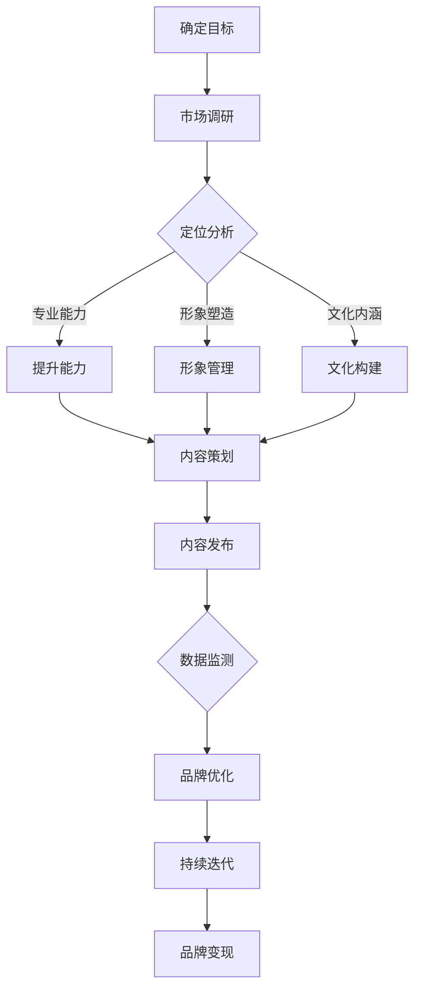

                 

### 文章标题

《创业者如何建立个人品牌》

> 关键词：个人品牌，创业者，品牌定位，影响力提升，品牌变现

> 摘要：本文旨在为创业者提供一套系统性、实用性的个人品牌建设指南。文章从个人品牌认知与定位、个人品牌建设策略与执行、个人品牌影响力提升与变现三个部分展开，通过深入分析和实例讲解，帮助创业者理解个人品牌的重要性，掌握建立和提升个人品牌的策略和方法，最终实现个人品牌的市场价值。

### 引言

在当今这个信息爆炸、竞争激烈的时代，个人品牌已经成为创业者成功的关键因素之一。个人品牌不仅仅是一个名字或标志，它代表着创业者个人的专业能力、价值观和独特魅力，是企业形象的重要部分。一个强大的个人品牌能够吸引更多的资源、机会和合作伙伴，为创业者在商业世界中开辟更广阔的天地。

然而，如何建立一个有影响力的个人品牌，对许多创业者来说仍然是一个挑战。本文将围绕这一主题，详细探讨个人品牌认知与定位、个人品牌建设策略与执行、个人品牌影响力提升与变现三个方面，为创业者提供系统性的指导和策略。以下是本文的目录大纲：

### 目录大纲

#### 第一部分：个人品牌认知与定位

## 第1章：什么是个人品牌

### 1.1 个人品牌的概念与重要性

### 1.2 个人品牌与企业的关系

## 第2章：个人品牌定位

### 2.1 定位策略与方法

### 2.2 目标受众分析

### 2.3 个人品牌核心价值塑造

## 第3章：个人品牌的核心竞争力

### 3.1 个人专业能力的提升

### 3.2 个人形象管理

### 3.3 个人品牌的文化内涵

## 第4章：个人品牌的传播与维护

### 4.1 个人品牌传播策略

### 4.2 社交媒体运用

### 4.3 个人品牌危机管理

## 第5章：个人品牌建设案例分析

### 5.1 成功案例分享

### 5.2 失败案例分析

### 5.3 从案例中学习与反思

#### 第二部分：个人品牌建设策略与执行

## 第6章：个人品牌建设策略

### 6.1 品牌建设目标设定

### 6.2 品牌建设路径规划

### 6.3 品牌建设预算与资源分配

## 第7章：个人品牌内容策划与制作

### 7.1 内容类型选择

### 7.2 内容创作与编辑

### 7.3 内容发布与推广

## 第8章：个人品牌运营与优化

### 8.1 数据分析与应用

### 8.2 品牌反馈与互动

### 8.3 品牌调整与迭代

## 第9章：个人品牌建设实战

### 9.1 实战案例展示

### 9.2 实战步骤解析

### 9.3 实战心得与经验总结

#### 第三部分：个人品牌影响力提升与变现

## 第10章：个人品牌影响力提升

### 10.1 社交资本积累

### 10.2 行业影响力拓展

### 10.3 媒体关系建设

## 第11章：个人品牌变现

### 11.1 个人品牌商业模式构建

### 11.2 个人品牌商品化

### 11.3 个人品牌资本化

## 第12章：未来展望与持续发展

### 12.1 个人品牌发展趋势

### 12.2 面对未来挑战

### 12.3 个人品牌的持续成长

### 附录

## 附录A：个人品牌建设工具与资源

### A.1 个人品牌管理工具

### A.2 社交媒体平台使用指南

### A.3 相关书籍与文章推荐

## 附录B：个人品牌建设常见问题解答

### B.1 品牌定位不清晰

### B.2 内容创作困难

### B.3 品牌建设成本预算

### B.4 品牌维护与更新

### Mermaid 流程图：个人品牌建设流程



### 个人品牌建设核心算法原理讲解

#### 伪代码：个人品牌建设算法

```python
def PersonalBrandBuildingStrategy(personalData, targetAudience, industryData):
    marketResearch = analyzeMarket(personalData, targetAudience, industryData)
    brandPositioning = determinePositioning(marketResearch)
    professionalSkills = enhanceProfessionalSkills(brandPositioning)
    brandImage = manageBrandImage(brandPositioning)
    brandCulture = buildBrandCulture(brandPositioning)
    contentPlan = createContentPlan(professionalSkills, brandImage, brandCulture)
    contentPublication = publishAndPromoteContent(contentPlan)
    dataMonitoring = monitorData(contentPublication)
    brandOptimization = optimizeBrand(dataMonitoring)
    brandIterate = iterateBrand(brandOptimization)
    brandMonetization = monetizeBrand(brandIterate)
    return brandMonetization
```

#### 核心算法原理讲解

1. **市场调研（Market Research）**
   - **目的**：了解目标市场和目标受众的需求，为个人品牌的定位和内容策划提供数据支持。
   - **方法**：通过问卷调查、访谈、数据分析等方式收集市场信息。

2. **定位分析（Brand Positioning）**
   - **目的**：明确个人品牌在市场中的位置和价值主张。
   - **方法**：结合市场调研结果，分析个人特点和竞争对手，确定独特卖点（USP）。

3. **专业能力提升（Professional Skills Enhancement）**
   - **目的**：提升个人专业能力，增强品牌的专业形象。
   - **方法**：通过学习、实践、获得认证等方式提升专业水平。

4. **形象管理（Brand Image Management）**
   - **目的**：塑造和维护良好的个人形象，提高品牌影响力。
   - **方法**：通过社交媒体、公共演讲、个人形象设计等手段管理个人形象。

5. **文化构建（Brand Culture Building）**
   - **目的**：建立与个人品牌价值观一致的企业文化，增强品牌的凝聚力和认同感。
   - **方法**：通过文化活动和价值观传播等方式构建品牌文化。

6. **内容策划（Content Planning）**
   - **目的**：制定内容创作计划，确保个人品牌传播的持续性和一致性。
   - **方法**：根据定位和目标受众，策划并制作有价值的内容。

7. **内容发布与推广（Content Publication and Promotion）**
   - **目的**：将内容发布到合适的平台，吸引目标受众的注意。
   - **方法**：通过社交媒体、博客、公众号等渠道发布内容，并利用SEO、广告等手段进行推广。

8. **数据监测（Data Monitoring）**
   - **目的**：通过数据分析了解品牌传播效果，为优化策略提供依据。
   - **方法**：使用数据分析工具跟踪数据，如阅读量、点赞量、分享量等。

9. **品牌优化（Brand Optimization）**
   - **目的**：根据监测结果优化品牌传播策略，提高品牌影响力。
   - **方法**：调整内容策略、推广渠道、品牌形象等。

10. **持续迭代（Continuous Iteration）**
    - **目的**：确保品牌保持活力和吸引力。
    - **方法**：定期回顾和调整品牌建设策略。

11. **品牌变现（Brand Monetization）**
    - **目的**：将个人品牌转化为实际收益。
    - **方法**：通过咨询、演讲、产品销售、投资等方式实现品牌变现。

### 结论

个人品牌建设是一个系统工程，需要创业者从多个维度进行规划和执行。本文提供了一套逻辑清晰、步骤明确的个人品牌建设框架，包括市场调研、定位分析、专业能力提升、形象管理、文化构建、内容策划、数据监测和品牌优化等步骤。通过这些步骤，创业者可以系统地建立和提升个人品牌，实现个人和商业的双重成功。

### 附录

#### 附录A：个人品牌建设工具与资源

### A.1 个人品牌管理工具

- **个人品牌管理平台**：如个人主页、个人博客、LinkedIn等。
- **社交媒体管理工具**：如Hootsuite、Buffer等。
- **内容管理系统**：如WordPress、Wix等。

### A.2 社交媒体平台使用指南

- **微博**：快速传播，增加曝光度。
- **微信公众号**：深度传播，增加用户粘性。
- **知乎**：专业知识分享，提高行业影响力。
- **抖音**：短视频传播，增加趣味性。

### A.3 相关书籍与文章推荐

- **书籍**：
  - 《个人品牌：如何塑造你的个人品牌，打造影响力的时代》（Personal Branding: How to Build a Personal Brand in a World That’s Own Your Attention）
  - 《企业家精神：打造个人品牌，赢得商业成功》（Entrepreneurial You: Monetize Your Expertise, Create a Personal Brand, and Becoming a Thought Leader）

- **文章**：
  - 《如何建立你的个人品牌》
  - 《个人品牌：从零开始打造你的影响力》
  - 《个人品牌建设的十个关键步骤》

#### 附录B：个人品牌建设常见问题解答

### B.1 品牌定位不清晰

- **问题原因**：缺乏市场调研和自我分析。
- **解决方案**：进行详细的市场调研，了解目标受众需求，明确个人品牌的核心价值。

### B.2 内容创作困难

- **问题原因**：缺乏创作灵感和专业能力。
- **解决方案**：定期阅读相关书籍和文章，提高专业素养，培养创作习惯。

### B.3 品牌建设成本预算

- **问题原因**：缺乏对品牌建设成本的认识。
- **解决方案**：制定详细的品牌建设预算，合理分配资源，控制成本。

### B.4 品牌维护与更新

- **问题原因**：缺乏持续的品牌维护意识。
- **解决方案**：制定品牌维护计划，定期更新内容，保持品牌活力。

