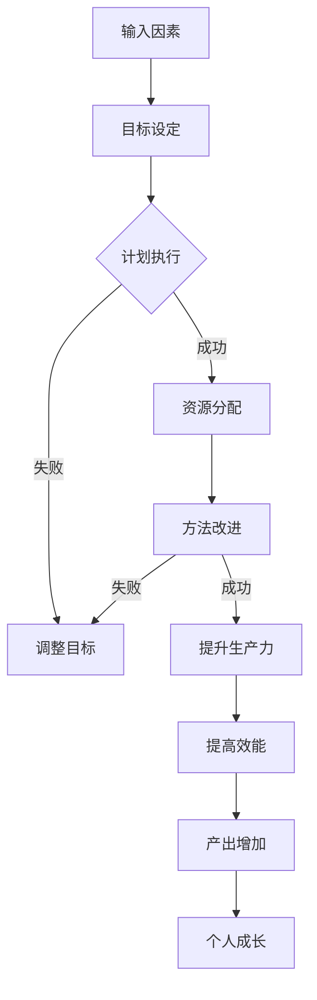

                 

### 文章标题

# 创业者如何建立个人时间管理和效能提升系统

> 关键词：时间管理、效能提升、创业者、个人目标、优先级排序、系统方法、实战案例、持续优化

> 摘要：本文旨在为创业者提供一套系统化的时间管理和效能提升方案。通过深入探讨时间管理和效能提升的基本概念、理论依据、实践方法以及案例分析，帮助创业者构建个人时间管理和效能提升系统，提高工作效率，实现个人和企业的双重成长。

## 第一部分：时间管理和效能提升概述

### 第1章：时间管理和效能提升的基本概念

#### 1.1 时间管理的定义与重要性

时间管理是指通过规划和组织个人时间，提高时间利用率，以达到工作、学习和生活目标的一种管理方法。时间管理的基本概念包括时间观念、时间评估、时间分配、时间监控等。在创业领域，时间管理尤为重要，因为创业者的时间往往是非常宝贵的资源。

#### 1.1.1 时间管理的基本概念

时间管理包含以下基本概念：

- **时间观念**：对时间的认识和价值判断。
- **时间评估**：对时间消耗和利用的评估。
- **时间分配**：根据目标和任务，合理分配时间。
- **时间监控**：对时间使用情况的监督和控制。

#### 1.1.2 时间管理的重要性

时间管理对创业者的重要性体现在以下几个方面：

- **提高工作效率**：通过有效的时间管理，创业者能够更高效地完成任务，节省时间。
- **减少压力**：合理分配时间和任务，避免过度劳累和压力。
- **实现目标**：明确目标，制定计划，有助于创业者更快速地实现个人和企业目标。
- **平衡工作与生活**：良好的时间管理能够帮助创业者更好地平衡工作与生活，提高生活质量。

#### 1.1.3 时间管理与个人效能的关系

个人效能是指个人在完成工作、学习和生活中的表现和能力。时间管理与个人效能密切相关：

- **时间管理能够提高个人效能**：通过合理规划时间，避免浪费时间，提高工作效率。
- **个人效能的提升有助于时间管理**：高效的个人表现有助于创业者更好地安排和利用时间。

#### 1.2 效能提升的定义与目标

效能提升是指通过改进个人和团队的运作方式，提高产出和效率的过程。效能提升的目标包括：

- **提高工作效率**：通过优化工作流程，减少不必要的环节，提高工作效率。
- **提升个人能力**：通过学习和培训，提升个人技能和知识水平。
- **实现目标**：通过更高效的执行，实现个人和企业的目标。

#### 1.2.1 效能提升的基本概念

效能提升的基本概念包括：

- **效率**：单位时间内完成的工作量。
- **效能**：工作产出与资源投入的比率。
- **效能提升策略**：通过改进方法、工具、流程等，提高个人和团队的效能。

#### 1.2.2 效能提升的目标与意义

效能提升的目标和意义包括：

- **提高产出**：通过提升个人和团队的工作效率，增加产出。
- **节省成本**：通过优化流程和减少浪费，降低成本。
- **增强竞争力**：通过提升个人和团队的效能，增强企业竞争力。

#### 1.2.3 个人效能评估方法

个人效能评估方法包括：

- **自我评估**：通过自我反思，评估个人工作表现和效能。
- **绩效评估**：通过设定绩效指标，评估个人工作成效。
- **360度评估**：通过多方反馈，全面评估个人效能。

#### 1.3 时间管理与效能提升的系统方法

时间管理与效能提升的系统方法包括以下几个层面：

- **整体观念与系统思维**：将时间管理和效能提升视为一个整体，从系统层面进行思考和规划。
- **个人时间管理的三个层面**：时间规划、时间监控和时间调整。
- **效能提升的系统方法**：通过优化个人和团队的工作流程，提升整体效能。

#### 1.4 时间管理与效能提升的现状与挑战

#### 1.4.1 当下时间管理与效能提升的困境

当前，许多创业者在时间管理和效能提升方面面临以下困境：

- **时间利用效率低**：未能合理分配时间，导致时间浪费。
- **任务管理困难**：任务繁杂，难以有效管理和追踪。
- **效率低**：工作过程中存在低效环节，影响整体效能。
- **技能不足**：缺乏有效的时间管理和效能提升技能。

#### 1.4.2 创业者面临的特殊挑战

创业者面临的特殊挑战包括：

- **任务繁杂**：需要同时处理多个项目和任务，难以平衡。
- **资源有限**：时间和精力有限，需要合理分配。
- **变化快速**：市场变化快，需要灵活调整时间和任务。
- **决策压力大**：需要做出快速准确的决策，压力较大。

#### 1.4.3 应对挑战的策略与方向

为应对时间管理和效能提升的挑战，创业者可以采取以下策略和方向：

- **明确目标与优先级**：明确个人和企业的目标，合理分配时间和资源。
- **优化工作流程**：简化流程，减少不必要的环节，提高效率。
- **提升自身能力**：学习时间管理和效能提升的方法，提升个人技能。
- **借助工具与资源**：利用工具和资源，提高时间管理和效能提升的效率。

### 第2章：建立个人时间管理系统的步骤与方法

#### 2.1 诊断与评估现状

建立个人时间管理系统的第一步是诊断和评估现状。以下是一些建议和方法：

- **记录时间日志**：记录每天的时间使用情况，分析时间浪费的根源。
- **评估时间利用效率**：根据时间日志，评估时间利用效率，找出改进空间。
- **分析任务管理情况**：分析任务管理方法，评估任务管理效率。

#### 2.1.1 评估个人时间管理的现状

评估个人时间管理的现状可以从以下几个方面入手：

- **时间分配**：分析每天的时间分配，是否合理分配给工作、学习、休息等。
- **任务完成情况**：分析任务的完成情况，是否按时完成。
- **时间浪费**：分析时间浪费的环节，如会议、沟通、等待等。

#### 2.1.2 发现时间浪费的根源

发现时间浪费的根源可以帮助创业者更有效地进行时间管理。以下是一些建议：

- **会议**：减少不必要的会议，确保会议有效。
- **沟通**：优化沟通方式，减少无效沟通。
- **工具与资源**：合理利用工具和资源，提高工作效率。
- **个人习惯**：培养良好的时间管理习惯，减少拖延。

#### 2.1.3 制定评估报告与行动计划

根据评估结果，制定评估报告和行动计划。以下是一些建议：

- **报告内容**：包括时间管理现状、时间浪费分析、改进建议等。
- **行动计划**：包括具体的改进措施和时间表。
- **责任分配**：明确改进措施的责任人，确保行动计划执行。

### 第2章：建立个人时间管理系统的步骤与方法（续）

#### 2.2 设定目标与优先级

在建立个人时间管理系统时，设定明确的目标和优先级至关重要。以下是一些建议和方法：

- **设定个人目标**：根据个人职业规划和企业发展需求，设定明确的个人目标。
- **确定优先级**：根据目标的重要性和紧急性，确定任务的优先级。
- **制定时间计划**：根据目标和优先级，制定详细的时间计划。

#### 2.2.1 设定明确的时间管理目标

设定明确的时间管理目标可以帮助创业者更好地规划和利用时间。以下是一些建议：

- **短期目标**：设定近期需要完成的工作和学习目标。
- **长期目标**：设定未来一段时间内需要实现的工作和学习目标。
- **具体可衡量**：目标要具体、可衡量，便于跟踪和评估。

#### 2.2.2 如何分配个人时间资源

合理分配个人时间资源是提高时间利用效率的关键。以下是一些建议：

- **工作与生活平衡**：确保工作与生活的时间比例适当，避免过度劳累。
- **任务优先级**：根据任务的重要性和紧急性，优先完成重要且紧急的任务。
- **高效时间段**：在高效时间段内，集中精力完成重要任务。

#### 2.2.3 创业者的时间优先级排序

创业者的时间优先级排序应考虑以下因素：

- **企业发展需求**：根据企业发展需求，确定关键任务的优先级。
- **个人职业规划**：根据个人职业规划，确定职业发展的优先级。
- **个人兴趣爱好**：考虑个人兴趣爱好，合理安排时间。

### 第2章：建立个人时间管理系统的步骤与方法（续）

#### 2.3 制定时间计划

制定时间计划是建立个人时间管理系统的重要环节。以下是一些建议和方法：

- **时间计划模板**：设计合适的时间计划模板，包括任务名称、开始时间、结束时间等。
- **时间计划的制定原则**：确保时间计划的科学性和可行性。
- **时间计划的调整**：根据实际情况，及时调整时间计划。

#### 2.3.1 制定个人时间计划的基本原则

制定个人时间计划应遵循以下基本原则：

- **目标导向**：以目标为导向，确保时间计划的实施有助于实现目标。
- **科学合理**：合理分配时间，确保工作、学习和休息的平衡。
- **灵活性**：时间计划应具有一定的灵活性，以适应突发情况。
- **可执行性**：确保时间计划切实可行，能够有效执行。

#### 2.3.2 创业者的时间计划模板

创业者的时间计划模板应包括以下内容：

- **任务名称**：明确每个任务的名称，便于跟踪和评估。
- **开始时间**：确定每个任务的开始时间，确保任务按时开始。
- **结束时间**：确定每个任务的结束时间，确保任务按时完成。
- **任务描述**：简要描述每个任务的内容，便于了解任务的具体情况。
- **优先级**：根据任务的重要性和紧急性，设定任务优先级。

#### 2.3.3 如何有效规划每周工作计划

有效规划每周工作计划是创业者时间管理的重要一环。以下是一些建议：

- **周一制定计划**：在周一制定本周的工作计划，明确本周的任务和目标。
- **每日回顾与调整**：每天回顾前一天的工作计划，根据实际情况进行调整。
- **合理分配时间**：确保每天的时间分配合理，避免过度劳累。
- **预留缓冲时间**：为突发情况预留一定的时间，确保工作计划能够顺利执行。

### 第2章：建立个人时间管理系统的步骤与方法（续）

#### 2.4 增强时间意识

增强时间意识是提高时间管理效率的关键。以下是一些建议和方法：

- **时间管理工具**：利用时间管理工具，如日程表、时间追踪器等，提高时间意识。
- **时间管理习惯**：培养良好的时间管理习惯，如提前规划、避免拖延等。
- **避免时间陷阱**：识别和避免常见的时间陷阱，如过度使用社交媒体、无效会议等。

#### 2.4.1 提高时间管理意识的重要性

提高时间管理意识的重要性体现在以下几个方面：

- **提高工作效率**：通过提高时间管理意识，创业者能够更高效地完成任务，节省时间。
- **减少压力**：合理分配时间和任务，避免过度劳累和压力。
- **实现目标**：明确目标，制定计划，有助于创业者更快速地实现个人和企业目标。
- **平衡工作与生活**：良好的时间管理能够帮助创业者更好地平衡工作与生活，提高生活质量。

#### 2.4.2 培养时间敏感习惯

培养时间敏感习惯是提高时间管理效率的重要手段。以下是一些建议：

- **设定时间目标**：为每个任务设定明确的时间目标，确保任务在规定时间内完成。
- **使用时间追踪器**：使用时间追踪器记录时间使用情况，提高时间管理意识。
- **设定提醒**：使用闹钟、提醒软件等工具，提醒创业者按时完成任务。
- **避免时间浪费**：识别和避免时间浪费的环节，如无效会议、社交媒体等。

#### 2.4.3 如何避免时间管理中的陷阱

避免时间管理中的陷阱是提高时间管理效率的关键。以下是一些建议：

- **避免过度安排**：合理安排时间，避免过度安排导致效率降低。
- **设定明确的优先级**：根据任务的重要性和紧急性，设定明确的优先级，确保关键任务得到优先处理。
- **避免拖延**：设定明确的时间目标，避免拖延，确保任务按时完成。
- **合理使用时间管理工具**：选择合适的时间管理工具，提高时间管理效率。

### 第2章：建立个人时间管理系统的步骤与方法（续）

#### 2.5 实施与调整

在实施个人时间管理计划的过程中，创业者需要不断调整和优化计划，以适应不断变化的情况。以下是一些建议和方法：

- **定期检查**：定期检查时间管理计划的执行情况，评估效果。
- **调整计划**：根据实际情况，及时调整时间管理计划，确保计划的可行性和有效性。
- **持续优化**：通过实践和反思，不断优化时间管理计划，提高时间管理效率。

#### 2.5.1 实施时间管理计划

实施时间管理计划是提高时间管理效率的关键步骤。以下是一些建议：

- **明确责任**：明确每个任务的责任人，确保任务能够按时完成。
- **跟踪进度**：定期跟踪任务进度，确保任务按计划进行。
- **及时反馈**：及时反馈任务完成情况，确保任务得到及时处理。

#### 2.5.2 遇到障碍时的应对策略

在实施时间管理计划的过程中，创业者可能会遇到各种障碍。以下是一些建议：

- **分析原因**：分析障碍产生的原因，找到解决问题的方法。
- **调整计划**：根据障碍的情况，调整时间管理计划，确保计划能够顺利执行。
- **寻求支持**：寻求团队成员或外部专业人士的支持，共同解决问题。

#### 2.5.3 如何持续优化时间管理计划

持续优化时间管理计划是提高时间管理效率的重要手段。以下是一些建议：

- **定期评估**：定期评估时间管理计划的效果，找出需要改进的地方。
- **收集反馈**：收集团队成员的反馈，了解时间管理计划的实际执行情况。
- **不断改进**：根据评估和反馈，不断改进时间管理计划，提高效率。

### 第3章：提升个人效能的理论基础

#### 3.1 效能提升的核心原理

个人效能提升的核心原理包括以下几个方面：

- **目标明确**：明确个人和企业的目标，有助于提高工作效率和实现目标。
- **资源优化**：优化资源分配和使用，提高工作效率和产出。
- **方法改进**：改进工作方法和工具，提高工作效率和效能。
- **自我激励**：通过自我激励，提高工作积极性和效能。

#### 3.1.1 效能提升的定义与内涵

效能提升是指通过改进个人和团队的运作方式，提高产出和效率的过程。效能提升的内涵包括：

- **效率提升**：通过优化工作流程和减少浪费，提高单位时间内的产出。
- **效能提升**：通过提高个人技能和知识水平，提高产出与资源投入的比率。
- **综合效能提升**：在效率提升和效能提升的基础上，实现个人和团队的全面发展。

#### 3.1.2 个人效能提升的核心原则

个人效能提升的核心原则包括：

- **目标导向**：明确个人和企业的目标，确保工作有方向。
- **资源优化**：合理分配和使用资源，提高工作效率和产出。
- **方法改进**：不断改进工作方法和工具，提高工作效率和效能。
- **自我激励**：通过自我激励，提高工作积极性和效能。

#### 3.1.3 效能提升与传统时间管理的区别

效能提升与传统时间管理有以下区别：

- **目标导向**：效能提升更注重目标导向，而传统时间管理更注重任务执行。
- **资源优化**：效能提升强调资源优化，而传统时间管理更注重时间分配。
- **方法改进**：效能提升注重工作方法和工具的改进，而传统时间管理更注重时间管理和任务安排。
- **自我激励**：效能提升强调自我激励，而传统时间管理更多依赖外部激励。

### 第3章：提升个人效能的理论基础（续）

#### 3.2 个人效能模型

个人效能模型是指通过一系列因素和关系，描述个人效能提升的过程和机制。以下是个人效能模型的基本结构：

- **输入因素**：包括个人能力、知识、技能、态度等。
- **过程因素**：包括目标设定、计划执行、资源分配、方法改进等。
- **输出因素**：包括工作效率、效能、产出、个人成长等。

#### 3.2.1 生产力与效能模型

生产力与效能模型是指通过描述生产力与效能之间的关系，帮助创业者提升个人效能。以下是生产力与效能模型的基本原理：

- **生产力**：单位时间内的产出。
- **效能**：产出与资源投入的比率。
- **效能提升**：通过提高生产力，提高产出与资源投入的比率。

#### 3.2.2 个人效能提升的 Mermaid 流程图

为了更清晰地描述个人效能提升的过程，可以使用 Mermaid 流程图。以下是个人效能提升的 Mermaid 流程图示例：

#### 3.2.3 个人效能评估框架

个人效能评估框架是指通过一系列指标和标准，对个人效能进行评估和监控。以下是个人效能评估框架的基本结构：

- **指标**：包括工作效率、效能、产出、个人成长等。
- **标准**：根据企业和个人目标，设定评估标准和阈值。
- **评估方法**：包括自我评估、绩效评估、360度评估等。
- **反馈机制**：根据评估结果，提供反馈和改进建议。

### 第3章：提升个人效能的理论基础（续）

#### 3.3 优化思维模式

优化思维模式是提升个人效能的重要方法。以下是一些建议：

- **创造性思维**：通过开放性思维和联想，提高创造力。
- **问题解决**：通过分析问题、寻找解决方案，提高问题解决能力。
- **积极心态**：保持积极的心态，面对挑战和困难。

#### 3.3.1 创造性思维与问题解决

创造性思维和问题解决能力对个人效能提升至关重要。以下是一些建议：

- **多角度思考**：从不同角度分析问题，寻找多种解决方案。
- **跨学科融合**：结合不同学科的知识和方法，解决复杂问题。
- **联想思维**：通过联想和类比，发现新的思路和方法。
- **实践反思**：通过实践和反思，不断提升问题解决能力。

#### 3.3.2 如何培养积极的心态

培养积极的心态对个人效能提升具有重要意义。以下是一些建议：

- **正面看待问题**：积极看待困难和挑战，将其视为成长的机会。
- **设定目标**：设定明确的目标，激发积极性和动力。
- **自我激励**：通过自我激励，提高自信心和积极性。
- **感恩心态**：保持感恩的心态，珍惜所拥有的一切。

#### 3.3.3 提升决策质量的策略

提升决策质量是提高个人效能的重要手段。以下是一些建议：

- **收集信息**：收集与决策相关的信息，确保决策基于充分的信息。
- **分析选项**：分析各种决策选项的优缺点，权衡利弊。
- **风险评估**：评估决策可能带来的风险，制定应对措施。
- **求助他人**：寻求他人意见和反馈，提高决策质量。
- **实践验证**：在决策后进行实践验证，根据反馈进行调整。

### 第3章：提升个人效能的理论基础（续）

#### 3.4 提升学习能力

提升学习能力是个人效能提升的重要方面。以下是一些建议：

- **建立学习体系**：制定学习计划，建立系统的学习体系。
- **多种学习方式**：结合线上和线下学习，提高学习效果。
- **实践与应用**：将所学知识应用于实际工作中，提高学习效果。
- **反馈与改进**：通过反馈和改进，不断提升学习能力。

#### 3.4.1 学习能力的重要性

学习能力对个人效能提升具有重要意义。以下是一些建议：

- **适应变化**：学习能力强的个体能够更快适应环境变化，应对挑战。
- **创新能力**：通过不断学习，提升创新能力，为企业带来新的发展机遇。
- **竞争力**：学习能力强的个人和企业更具竞争力，在激烈的市场竞争中脱颖而出。
- **个人成长**：持续学习有助于个人成长，实现职业发展和人生目标。

#### 3.4.2 建立高效学习体系

建立高效学习体系是提升学习能力的关键。以下是一些建议：

- **明确学习目标**：根据个人职业规划和企业发展需求，设定明确的学习目标。
- **制定学习计划**：制定详细的学习计划，确保学习目标的实现。
- **多样化学习方式**：结合线上和线下学习，丰富学习内容和方法。
- **时间管理**：合理安排学习时间，确保学习计划的执行。
- **实践应用**：将所学知识应用于实际工作中，提高学习效果。

#### 3.4.3 创业者学习策略案例分析

以下是一个创业者学习策略的案例分析：

**案例背景**：某创业者，希望在短时间内提升自己的市场分析能力。

**学习策略**：

1. **明确目标**：明确提升市场分析能力的目标，设定具体的学习计划。
2. **学习资源**：利用线上课程、书籍、研究报告等学习资源，系统学习市场分析知识。
3. **实践应用**：在企业经营过程中，将所学知识应用于市场分析，提高实践能力。
4. **反馈与改进**：定期反思学习效果，根据反馈调整学习策略。

**效果评估**：

通过以上学习策略，该创业者成功提升了市场分析能力，为企业带来了显著的市场洞察和决策支持。

### 第4章：实战应用与案例分析

#### 4.1 实战案例一：如何提升个人工作效率

**案例背景**：某创业者，希望在短时间内提升个人工作效率，以应对日益增多的工作任务。

**实践步骤**：

1. **明确目标**：设定提升工作效率的目标，例如：每周完成10个任务，减少任务完成时间。
2. **分析任务**：分析任务的重要性和紧急性，制定优先级排序。
3. **制定计划**：根据任务优先级，制定详细的工作计划。
4. **执行计划**：严格按照工作计划执行，确保任务按时完成。
5. **监控进度**：定期检查任务进度，及时调整计划。
6. **总结反思**：每周总结工作情况，反思不足之处，不断优化工作方法。

**效果评估**：

通过以上实践步骤，该创业者成功提升了工作效率，任务完成时间减少了30%，工作压力得到有效缓解。

#### 4.2 实战案例二：如何管理个人项目时间

**案例背景**：某创业者，负责多个项目的管理，希望提高项目时间管理效率。

**实践步骤**：

1. **明确项目目标**：确定每个项目的目标和预期成果。
2. **项目规划**：根据项目目标和团队资源，制定详细的项目规划。
3. **任务分配**：将项目任务分配给团队成员，明确任务责任和完成时间。
4. **时间监控**：定期检查任务进度，确保项目按计划进行。
5. **风险控制**：识别项目风险，制定应对措施，降低项目延期风险。
6. **反馈与改进**：根据项目进展和团队成员反馈，及时调整项目计划和策略。

**效果评估**：

通过以上实践步骤，该创业者成功提高了项目时间管理效率，项目完成时间缩短了20%，项目质量得到保障。

### 第4章：实战应用与案例分析（续）

#### 4.3 实战案例三：如何平衡工作与生活

**案例背景**：某创业者，工作压力大，希望平衡工作与生活，提高生活质量。

**实践策略**：

1. **明确生活目标**：设定家庭、健康、休闲等生活目标。
2. **规划工作时间**：合理安排工作时间，确保工作与生活的平衡。
3. **设定家庭时间**：为家庭时间设定优先级，确保陪伴家人的时间。
4. **健康生活**：保持健康的生活习惯，如合理饮食、适量运动等。
5. **休息与放松**：合理安排休息和放松时间，缓解工作压力。
6. **培养兴趣爱好**：培养兴趣爱好，丰富业余生活。

**效果评估**：

通过以上实践策略，该创业者成功平衡了工作与生活，工作压力得到缓解，生活质量得到显著提升。

#### 4.4 实战案例四：如何进行自我反思与成长

**案例背景**：某创业者，希望通过自我反思与成长，不断提升个人能力和企业竞争力。

**实践步骤**：

1. **设定成长目标**：根据个人职业规划和企业发展需求，设定明确的成长目标。
2. **定期反思**：每周或每月进行自我反思，总结工作经验和不足。
3. **制定改进计划**：根据反思结果，制定具体的改进计划和行动步骤。
4. **执行改进计划**：按照改进计划执行，不断提升个人能力和企业竞争力。
5. **持续学习**：利用碎片化时间，进行持续学习，提升自身素质。
6. **寻求反馈**：主动寻求团队成员和外部专业人士的反馈，改进工作方法和策略。

**效果评估**：

通过以上实践步骤，该创业者成功实现了自我反思与成长，个人能力和企业竞争力得到显著提升。

### 第5章：持续优化与提升个人时间管理与效能

#### 5.1 持续学习与成长

持续学习与成长是创业者提升个人时间管理与效能的重要途径。以下是一些建议：

- **设定学习目标**：根据个人职业规划和企业发展需求，设定明确的成长目标。
- **制定学习计划**：制定详细的学习计划，确保学习目标的实现。
- **多样化学习方式**：结合线上和线下学习，提高学习效果。
- **实践与应用**：将所学知识应用于实际工作中，提高学习效果。
- **反馈与改进**：根据反馈和改进，不断提升学习能力。

#### 5.1.1 持续学习的重要性

持续学习对创业者的重要性体现在以下几个方面：

- **适应变化**：持续学习能够帮助创业者更快适应环境变化，应对挑战。
- **提高能力**：持续学习有助于提升创业者个人的能力和素质。
- **创新发展**：持续学习为创业者带来新的思维和方法，推动企业创新发展。
- **竞争力**：持续学习提升创业者及其企业的竞争力，在激烈的市场竞争中脱颖而出。

#### 5.1.2 个人成长体系构建

构建个人成长体系是持续学习与成长的重要基础。以下是一些建议：

- **明确成长目标**：设定明确的成长目标，确保个人成长有方向。
- **制定成长计划**：根据成长目标，制定详细的学习计划，确保成长目标的实现。
- **多样化成长方式**：结合线上和线下学习，丰富成长方式。
- **实践与反思**：将所学知识应用于实际工作中，通过实践和反思，不断提升个人能力。

#### 5.1.3 如何保持学习动力

保持学习动力是持续学习与成长的关键。以下是一些建议：

- **设定奖励机制**：为自己设定奖励机制，提高学习积极性。
- **寻找学习伙伴**：与志同道合的人一起学习，互相激励，共同进步。
- **利用碎片化时间**：利用碎片化时间进行学习，提高学习效率。
- **设定明确的学习目标**：设定明确的学习目标，确保学习有方向。
- **保持好奇心**：保持好奇心，对新的知识和技能保持热情。

### 第5章：持续优化与提升个人时间管理与效能（续）

#### 5.2 调整与优化时间管理计划

在持续优化与提升个人时间管理与效能的过程中，调整与优化时间管理计划至关重要。以下是一些建议：

- **定期评估**：定期评估时间管理计划的效果，找出需要改进的地方。
- **收集反馈**：收集团队成员和外部专业人士的反馈，了解时间管理计划的实施情况。
- **识别瓶颈**：识别时间管理中的瓶颈和障碍，分析原因，制定改进措施。
- **持续改进**：根据评估和反馈，不断调整和优化时间管理计划，提高效率。

#### 5.2.1 评估时间管理效果

评估时间管理效果是调整与优化时间管理计划的重要步骤。以下是一些建议：

- **关键指标**：设定关键指标，如任务完成率、时间利用率、工作效率等，用于评估时间管理效果。
- **数据收集**：收集与时间管理相关的数据，如时间日志、任务完成情况等。
- **分析数据**：分析数据，找出时间管理中的优势和不足。
- **制定改进方案**：根据分析结果，制定具体的改进方案，优化时间管理计划。

#### 5.2.2 识别需要优化的环节

在评估时间管理效果的过程中，创业者需要识别需要优化的环节。以下是一些建议：

- **任务分配**：优化任务分配，确保任务合理分配，避免任务堆积。
- **时间计划**：优化时间计划，确保时间计划的科学性和可行性。
- **沟通与协作**：优化沟通与协作流程，提高团队协作效率。
- **工具与资源**：优化工具和资源的使用，提高工作效率。
- **个人习惯**：优化个人时间管理习惯，培养良好的时间管理意识。

#### 5.2.3 如何调整和优化时间管理计划

根据评估结果和反馈，创业者可以采取以下措施调整和优化时间管理计划：

- **调整优先级**：根据任务的重要性和紧急性，调整任务优先级，确保关键任务得到优先处理。
- **优化时间分配**：根据实际情况，调整时间分配，确保时间计划合理。
- **改进工作流程**：简化工作流程，减少不必要的环节，提高工作效率。
- **培训与提升**：为团队成员提供时间管理和效能提升培训，提高整体时间管理能力。
- **持续反馈**：建立持续反馈机制，及时调整和优化时间管理计划。

### 第5章：持续优化与提升个人时间管理与效能（续）

#### 5.3 适应变化与挑战

在持续优化与提升个人时间管理与效能的过程中，适应变化与挑战是创业者必须面对的重要课题。以下是一些建议：

- **灵活调整**：根据实际情况，灵活调整时间管理计划和策略，确保计划能够应对变化。
- **积极应对**：面对挑战和困难，保持积极的态度，寻找解决问题的方法。
- **学习与成长**：通过学习和成长，提升自身能力和素质，更好地应对变化和挑战。
- **团队协作**：加强团队协作，共同应对变化和挑战。

#### 5.3.1 变化对时间管理的影响

变化对时间管理产生多方面的影响：

- **任务增加**：变化可能导致任务增加，需要合理安排时间和资源。
- **优先级调整**：变化可能导致任务优先级的变化，需要重新评估和调整时间管理计划。
- **工作压力**：变化可能导致工作压力增加，需要合理分配时间和精力，避免过度劳累。
- **时间浪费**：变化可能导致时间浪费，需要识别和避免无效活动和环节。

#### 5.3.2 如何应对挑战

应对挑战是提升个人时间管理与效能的重要环节。以下是一些建议：

- **分析原因**：分析挑战产生的原因，找出解决问题的方法。
- **调整策略**：根据实际情况，调整时间管理计划和策略，确保计划能够应对挑战。
- **寻求支持**：寻求团队成员和外部专业人士的支持，共同应对挑战。
- **保持积极心态**：保持积极的心态，面对挑战和困难，不断提升自身能力。
- **实践与反思**：通过实践和反思，总结经验教训，不断改进时间管理方法和策略。

### 第5章：持续优化与提升个人时间管理与效能（续）

#### 5.4 时间管理与效能提升的未来趋势

随着科技的发展和市场竞争的加剧，时间管理与效能提升呈现出以下未来趋势：

- **数字化管理**：数字化工具和平台将更加普及，帮助创业者实现时间管理和效能提升的数字化、智能化。
- **数据驱动**：数据将成为时间管理和效能提升的重要驱动力，通过数据分析，优化决策和资源配置。
- **个性化定制**：根据个人特点和需求，提供个性化定制的时间管理和效能提升方案。
- **智能化助手**：智能助手和人工智能技术将融入时间管理和效能提升，提供智能化的建议和帮助。

#### 5.4.1 数字化时代的时间管理趋势

在数字化时代，时间管理呈现出以下趋势：

- **自动化**：通过自动化工具和流程，减少人工操作，提高时间管理效率。
- **移动化**：移动设备将更加普及，创业者可以随时随地进行时间管理和任务跟踪。
- **智能化**：人工智能技术将应用于时间管理和效能提升，提供智能化的建议和帮助。
- **协同化**：数字化平台将实现团队成员之间的协同工作，提高团队效能。

#### 5.4.2 科技对个人时间管理的影响

科技对个人时间管理产生深远影响：

- **提高效率**：科技工具和平台可以提高时间管理效率，减少时间浪费。
- **优化决策**：科技工具和平台可以提供数据支持和分析，帮助创业者优化决策。
- **提升体验**：科技工具和平台可以为创业者提供更加便捷和高效的时间管理体验。
- **降低成本**：科技工具和平台可以降低时间管理和效能提升的成本。

#### 5.4.3 创业者未来时间管理与效能提升的策略

为适应未来时间管理与效能提升的趋势，创业者可以采取以下策略：

- **拥抱科技**：积极拥抱数字化工具和平台，提高时间管理和效能提升的效率。
- **数据驱动**：利用数据分析，优化决策和资源配置，实现高效的时间管理和效能提升。
- **个性化定制**：根据个人特点和需求，制定个性化的时间管理和效能提升方案。
- **持续学习**：通过持续学习和成长，提升自身能力和素质，适应未来时间管理和效能提升的要求。

### 第6章：附录

#### 附录 A：时间管理与效能提升

在本章中，我们将提供一些实用的工具、技巧和资源，帮助创业者更好地进行时间管理和效能提升。

#### 6.1 工具与资源推荐

- **时间管理工具**：
  - Google 日历：用于创建和跟踪日程安排。
  - Trello：用于任务管理和团队协作。
  - Asana：用于项目管理和团队协作。
  - RescueTime：用于追踪时间使用情况。

- **效能提升资源**：
  - 《高效能人士的七个习惯》：史蒂芬·柯维著，提供时间管理和效能提升的实用方法。
  - 《深度工作》：Cal Newport 著，介绍如何在数字化时代保持专注和高效。
  - 《原则》：雷·达里奥著，提供商业和人生决策的原则和方法。

#### 6.2 最佳实践技巧

- **任务优先级排序**：
  - 使用“四象限法”将任务分为重要且紧急、重要不紧急、不重要但紧急、不重要不紧急四个象限，根据象限优先处理任务。
  - 使用“艾森豪威尔矩阵”将任务分为紧急重要、紧急不重要、不紧急重要、不紧急不重要四个类别，优先处理紧急重要的任务。

- **时间管理技巧**：
  - 制定“清晨行动计划”，利用早晨的时间处理重要任务。
  - 使用“番茄工作法”，将工作时间分为25分钟工作周期和5分钟休息时间，提高专注力和工作效率。

- **效能提升技巧**：
  - 定期进行“反思与总结”，反思工作成效，总结经验教训，不断提升个人能力和素质。
  - 培养“自我管理能力”，学会自我激励和自我约束，提高工作效率和效能。

#### 6.3 注意事项

- **避免时间浪费**：识别和避免时间浪费的环节，如无效会议、社交媒体等。
- **保持灵活**：根据实际情况，灵活调整时间和任务安排，确保计划能够应对变化。
- **持续优化**：不断反思和调整时间管理和效能提升策略，确保计划的有效性和可行性。

#### 6.4 拓展阅读

- **《时间管理的艺术》**：戴维·艾伦著，详细介绍时间管理的理论和实践方法。
- **《工作、消费主义和新穷人》**：让-弗朗索瓦·图卢兹-特拉齐著，探讨工作与生活平衡的问题。
- **《第五项修炼》**：彼得·圣吉著，介绍个人和组织如何通过学习实现共同愿景。

### 参考文献

1. 柯维，史蒂芬。（2002）。《高效能人士的七个习惯》。中国青年出版社。
2. Newport，Cal。（2016）。《深度工作：如何有效利用每一点脑力》。中国友谊出版公司。
3. 达里奥，雷。（2017）。《原则》。东方出版社。
4. Allen，David。（2001）。《时间管理的艺术》。中国社会科学出版社。
5. Turoff，Michael & McLean，Sharon。（2001）。《工作、消费主义和新穷人：时间管理的文化分析》。社会科学文献出版社。

