                 

### 文章标题

《创业者如何建立个人知识管理和终身学习成长机制》

### 关键词

个人知识管理、终身学习、创业者、知识体系构建、学习成长机制、实战案例分析、新技术应用

### 摘要

本文旨在为创业者提供一套完整的个人知识管理和终身学习成长机制构建策略。通过分析个人知识管理的定义、价值与体系构建，以及终身学习的理念、实践和成长路径规划，本文帮助创业者掌握高效的知识管理和学习成长方法。同时，通过实际案例和新技术应用的分析，本文为创业者提供具体的操作指南和未来展望，助力其在竞争激烈的市场中持续创新和成长。

---

# 第一部分: 个人知识管理和终身学习基础

## 第1章: 理解个人知识管理与终身学习

### 1.1 个人知识管理的定义与重要性

#### 1.1.1 个人知识管理的概念

个人知识管理（Personal Knowledge Management，简称PKM）是指个人对知识进行收集、整理、存储、应用和分享的过程。它不仅包括知识的获取，还涵盖了知识的组织和利用，是一个贯穿个人职业生涯的学习、工作和生活过程。

#### 1.1.2 个人知识管理的价值

1. **提高工作效率**：通过个人知识管理，创业者可以快速地找到所需信息，减少不必要的时间浪费，提高工作效率。

2. **促进知识创新**：有效的知识管理可以帮助创业者将零散的知识点整合成系统的知识体系，从而促进创新思维的产生。

3. **增强竞争力**：知识是创业者的重要资产。通过个人知识管理，创业者可以更好地利用自身的知识资源，增强在市场中的竞争力。

4. **支持终身学习**：个人知识管理不仅是一种工作方法，更是一种终身学习的方式。它可以帮助创业者不断更新知识，适应快速变化的环境。

#### 1.1.3 个人知识管理与终身学习的关系

个人知识管理是终身学习的基础，两者相辅相成。终身学习为个人知识管理提供了源源不断的知识输入，而个人知识管理则为终身学习提供了有效的支持和保障。

### 1.2 终身学习的理念与实践

#### 1.2.1 终身学习的定义与意义

终身学习（Lifelong Learning）是指个人在一生中不断学习、更新知识和技能的过程。它强调学习不仅仅是学校教育的延续，更包括职场学习和自我提升。

#### 1.2.2 终身学习的策略与方法

1. **制定学习计划**：创业者应根据自身的职业发展需求和个人兴趣，制定长期和短期的学习计划。

2. **多样化学习方式**：结合线上学习、线下课程、实践操作等多种学习方式，提高学习效果。

3. **主动学习**：主动寻找学习资源，不断拓宽知识领域，提升自我学习能力。

4. **反思与总结**：在学习过程中，创业者应不断反思和总结，将学习成果转化为实际能力。

#### 1.2.3 终身学习的挑战与应对

1. **时间管理**：创业者需要合理规划时间，确保学习与工作之间的平衡。

2. **知识过载**：面对海量的信息，创业者需要学会筛选和整理，提高信息利用率。

3. **持续动力**：保持学习热情和动力，避免出现学习疲劳和停滞。

### Mermaid 流程图

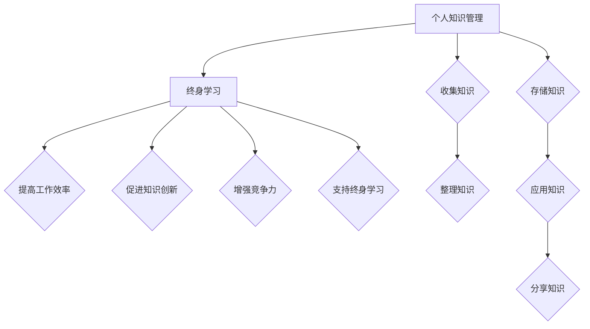

---

## 第2章: 个人知识管理体系构建

### 2.1 个人知识管理体系的架构

#### 2.1.1 收集与获取知识

1. **信息来源**：创业者应广泛收集各类信息，包括书籍、论文、博客、报告等。

2. **信息筛选**：通过关键词搜索、筛选、比对等方法，确保获取的信息具有实际价值。

3. **信息记录**：使用笔记软件、文档管理等工具，将重要信息记录下来。

#### 2.1.2 知识存储与管理

1. **分类存储**：根据知识的特点和用途，进行分类存储，便于查找和使用。

2. **存储工具**：使用知识管理软件、云存储等服务，确保知识的长期保存和备份。

3. **更新与维护**：定期检查和更新知识库，确保知识的准确性和时效性。

#### 2.1.3 知识应用与分享

1. **知识应用**：将所学知识应用到实际工作中，通过实践提升自身能力。

2. **知识分享**：通过内部分享、公开演讲、撰写文章等方式，将知识传递给他人。

3. **反馈与改进**：收集他人的反馈，不断改进和完善知识体系。

### 2.2 个人知识管理工具的选择与使用

#### 2.2.1 个人知识管理工具的分类

1. **笔记类工具**：如OneNote、Evernote等，用于记录和管理个人笔记。

2. **文档类工具**：如Google Docs、Microsoft Word等，用于撰写和编辑文档。

3. **知识库类工具**：如Confluence、Notion等，用于构建和管理知识库。

4. **云存储工具**：如Dropbox、Google Drive等，用于存储和共享文件。

#### 2.2.2 常用知识管理工具介绍

1. **Evernote**：一款功能强大的笔记应用，支持多平台同步，便于收集和管理信息。

2. **Confluence**：一款团队协作工具，可用于构建知识库，实现知识的共享和协作。

3. **Google Drive**：一款云存储服务，提供海量存储空间，支持多种文件格式。

#### 2.2.3 工具选择与个人习惯的适配

1. **评估需求**：根据个人需求，选择合适的知识管理工具。

2. **习惯培养**：通过定期使用和练习，逐步培养使用工具的习惯。

3. **优化配置**：根据实际使用情况，对工具进行优化和调整，提高使用效率。

### 2.3 个人知识管理的实践技巧

#### 2.3.1 知识梳理与分类

1. **知识梳理**：对收集到的知识进行整理和梳理，形成系统的知识体系。

2. **知识分类**：根据知识的特点和用途，对知识进行分类存储。

#### 2.3.2 知识复用与更新

1. **知识复用**：在工作和生活中，充分利用已有的知识，避免重复劳动。

2. **知识更新**：定期检查和更新知识库，确保知识的准确性和时效性。

#### 2.3.3 知识共享与协作

1. **知识共享**：通过内部分享、公开演讲等方式，将知识传递给他人。

2. **协作学习**：与同事、朋友共同学习，相互借鉴、共同进步。

---

### Mermaid 流程图

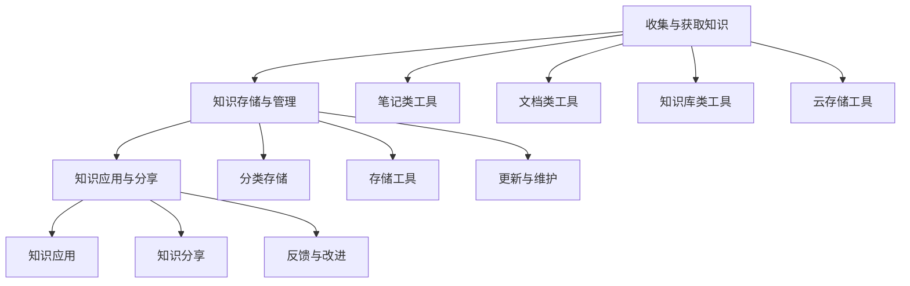

---

## 第3章: 终身学习成长路径规划

### 3.1 终身学习路径规划的重要性

#### 3.1.1 职业发展的需求

终身学习是创业者职业发展的关键。通过不断学习新知识、掌握新技能，创业者可以适应市场的变化，保持竞争力。

#### 3.1.2 个人兴趣的实现

终身学习不仅有助于职业发展，还可以满足个人兴趣。创业者可以根据自身兴趣，选择相关领域进行深入学习，实现个人价值。

#### 3.1.3 终身学习的可持续发展

终身学习是一种可持续的发展模式。通过不断学习，创业者可以不断提升自身能力，实现长期的职业发展和个人成长。

### 3.2 学习目标设定与实现策略

#### 3.2.1 设定明确的学习目标

1. **短期目标**：如掌握一门新技术、完成一项特定任务等。

2. **长期目标**：如提升领导力、实现职业晋升等。

#### 3.2.2 制定学习计划

1. **时间安排**：合理规划学习时间，确保学习与工作之间的平衡。

2. **学习内容**：根据学习目标，选择合适的学习内容和资源。

#### 3.2.3 学习策略与方法

1. **主动学习**：主动寻找学习资源，积极参与讨论和互动。

2. **实践应用**：将所学知识应用到实际工作中，通过实践提升能力。

3. **反思与总结**：定期反思学习过程，总结学习成果，不断优化学习策略。

### 3.3 学习效果评估与持续优化

#### 3.3.1 学习效果评估的方法

1. **自我评估**：通过自我反思和总结，评估学习成果。

2. **他人评估**：通过同事、朋友、导师的反馈，了解自己的学习效果。

3. **数据评估**：通过学习数据的统计和分析，评估学习效果。

#### 3.3.2 学习反馈与调整

1. **接收反馈**：积极接收他人的反馈，了解自己的优点和不足。

2. **调整学习策略**：根据反馈，调整学习目标和计划，优化学习方法。

#### 3.3.3 学习习惯的培养

1. **定期学习**：养成良好的学习习惯，确保学习持续进行。

2. **时间管理**：合理规划时间，确保学习和工作之间的平衡。

3. **持续动力**：保持学习热情和动力，避免出现学习疲劳和停滞。

### Mermaid 流�程图

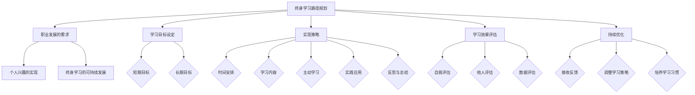

---

## 第4章: 个人知识管理案例分析

### 4.1 案例背景与目标

#### 4.1.1 案例背景介绍

某创业者张先生，从事互联网创业多年，随着业务的发展，他意识到个人知识管理和终身学习对于企业成长和个人发展的关键作用。

#### 4.1.2 案例目标设定

1. **构建个人知识体系**：通过整理和分类，形成系统的知识库。

2. **提升学习效率**：制定学习计划，优化学习方法，提高学习效果。

3. **实现持续成长**：通过不断学习和实践，提升个人能力和企业竞争力。

### 4.2 案例实施过程

#### 4.2.1 收集与整理资料

1. **信息来源**：通过书籍、网络、研讨会等多种渠道收集资料。

2. **整理分类**：使用Evernote记录重要信息，并按照主题进行分类。

#### 4.2.2 建立知识库与管理系统

1. **知识库搭建**：使用Confluence构建知识库，实现知识的集中管理和共享。

2. **管理系统配置**：配置知识库权限，确保知识的合理使用和信息安全。

#### 4.2.3 应用与实践

1. **知识应用**：将所学知识应用到实际工作中，解决实际问题。

2. **知识分享**：定期组织内部分享会，将知识传递给团队成员。

### 4.3 案例总结与反思

#### 4.3.1 案例成效评估

1. **知识体系构建**：通过个人知识管理，张先生成功构建了系统的知识库，实现了知识的系统化和结构化。

2. **学习效率提升**：通过制定学习计划和使用有效的学习工具，张先生的学习效率显著提高。

3. **持续成长**：张先生和企业团队在个人知识管理和终身学习的基础上，实现了持续成长和创新能力。

#### 4.3.2 案例经验与启示

1. **重视知识管理**：创业者应重视个人知识管理，将其作为企业发展的关键环节。

2. **持续学习**：创业者应保持终身学习的理念，不断提升自身能力。

3. **实践与分享**：将所学知识应用到实践中，并通过分享实现知识的增值。

### Mermaid 流程图

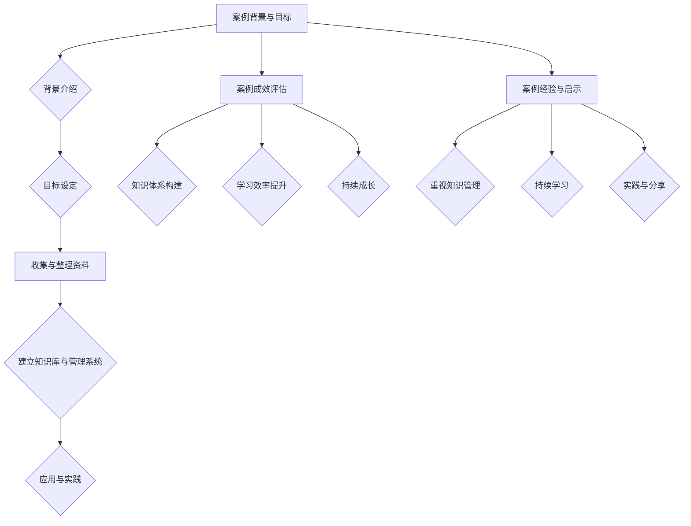

---

## 第5章: 终身学习成长实战

### 5.1 实战项目设计

#### 5.1.1 项目背景与目标

某创业团队计划开发一款基于人工智能技术的智能推荐系统，以提高用户满意度。项目背景和目标如下：

1. **背景**：随着互联网的发展，用户对于个性化推荐的需求日益增加。

2. **目标**：通过开发智能推荐系统，提高用户体验，增加用户粘性，提高企业竞争力。

#### 5.1.2 项目计划与分工

1. **项目计划**：项目分为需求分析、技术选型、系统设计、开发实现、测试与优化等阶段。

2. **分工**：团队成员根据各自专长，负责不同的任务，确保项目顺利进行。

### 5.2 实战项目执行

#### 5.2.1 学习资源获取与整合

1. **学习资源获取**：团队成员通过查阅相关书籍、论文、在线课程等获取所需知识。

2. **学习资源整合**：将获取的资源进行整理和分类，形成系统的学习资料。

#### 5.2.2 实战过程记录与反思

1. **过程记录**：团队成员在开发过程中，定期记录项目进展和遇到的问题。

2. **反思与总结**：项目结束后，团队成员对项目过程进行反思和总结，找出不足和改进方向。

#### 5.2.3 项目成果展示与评估

1. **成果展示**：团队成员通过演示、文档等形式，展示项目成果。

2. **评估**：项目成果经过内部评估和用户反馈，评估项目效果。

### 5.3 成长经验总结

#### 5.3.1 学习方法优化

1. **主动学习**：团队成员通过主动寻找学习资源，提高自身能力。

2. **实践应用**：将所学知识应用到实际项目中，通过实践提升能力。

3. **团队协作**：团队成员相互协作，共同解决问题，提高工作效率。

#### 5.3.2 个人知识管理经验

1. **知识梳理**：定期对所学知识进行梳理和分类，形成知识体系。

2. **知识共享**：通过内部分享会、文档等形式，将知识传递给团队成员。

3. **持续更新**：定期更新知识库，确保知识的准确性和时效性。

#### 5.3.3 终身学习策略调整

1. **目标明确**：明确学习目标，确保学习方向的正确性。

2. **方法优化**：根据实际情况，不断调整学习方法和策略。

3. **持续动力**：保持学习热情和动力，避免出现学习疲劳和停滞。

### Mermaid 流程图

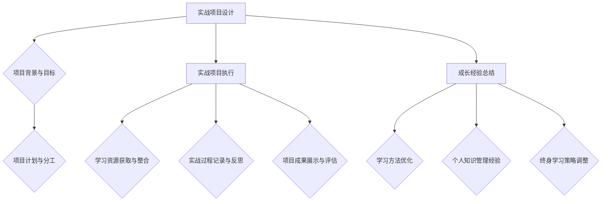

---

## 第6章: 知识管理与终身学习新技术应用

### 6.1 人工智能在知识管理中的应用

#### 6.1.1 人工智能技术简介

人工智能（Artificial Intelligence，简称AI）是指通过计算机模拟人类智能的技术。它包括机器学习、深度学习、自然语言处理等领域。

#### 6.1.2 人工智能在知识管理中的应用案例

1. **智能推荐系统**：通过分析用户行为和偏好，智能推荐相关知识和资源。

2. **智能问答系统**：利用自然语言处理技术，快速回答用户提出的问题。

3. **知识挖掘与可视化**：通过数据挖掘技术，从海量数据中提取有价值的信息，并进行可视化展示。

### 6.2 大数据和云计算对终身学习的影响

#### 6.2.1 大数据的概念与价值

大数据（Big Data）是指无法用传统数据处理工具进行有效管理和处理的数据集合。其价值在于能够从海量数据中发现有价值的信息和规律。

#### 6.2.2 云计算在终身学习中的应用

云计算（Cloud Computing）是指通过互联网提供计算资源和服务。在终身学习中，云计算可以提供以下应用：

1. **在线学习平台**：通过云计算，提供大规模在线学习平台，支持用户随时随地学习。

2. **云存储**：提供海量云存储空间，确保用户的知识和数据安全。

3. **大数据分析**：通过云计算，对用户的学习行为和效果进行数据分析，为用户提供个性化学习建议。

#### 6.2.3 大数据和云计算的融合趋势

随着大数据和云计算技术的发展，两者正逐渐融合。未来，大数据分析将更加智能化，云计算服务将更加便捷，为终身学习提供更强大的支持。

### 6.3 知识管理与终身学习的未来发展

#### 6.3.1 新技术的发展趋势

1. **人工智能与知识管理的深度融合**：人工智能技术将在知识管理中发挥更大的作用，实现更高效的资源推荐和知识挖掘。

2. **大数据与云计算的广泛应用**：大数据和云计算将在终身学习中得到更广泛的应用，提供个性化的学习体验。

3. **跨界融合**：知识管理与终身学习将与其他领域（如教育、医疗等）实现跨界融合，创造新的价值。

#### 6.3.2 个人知识管理与终身学习的融合

未来，个人知识管理与终身学习将更加紧密地融合，形成一个完整的知识生态系统。通过不断学习和实践，个人将实现持续成长和自我超越。

### 6.3.3 未来展望与挑战

1. **展望**：未来，知识管理和终身学习将变得更加智能、便捷和个性化。

2. **挑战**：如何有效应对知识过载、保持学习动力和实现知识价值的最大化，将成为重要的挑战。

### Mermaid 流程图

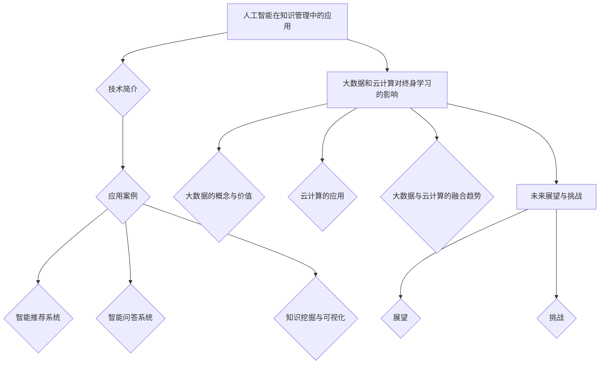

---

## 第7章: 个人知识管理与终身学习社群建设

### 7.1 社群建设的意义与作用

#### 7.1.1 社群的定义与类型

社群（Community）是指具有共同兴趣、目标或价值观的群体。根据不同的分类标准，社群可以划分为以下类型：

1. **基于兴趣的社群**：如技术社群、读书社群等。

2. **基于目标的社群**：如创业社群、公益社群等。

3. **基于行业的社群**：如互联网社群、金融社群等。

#### 7.1.2 社群在个人知识管理与终身学习中的作用

1. **知识共享与交流**：社群为成员提供了知识共享和交流的平台，促进了知识的流动和传播。

2. **资源共享与互助**：社群成员可以共享学习资源，如书籍、课程等，提高学习效率。

3. **经验交流与成长**：社群成员可以相互分享经验和心得，促进个人成长和职业发展。

### 7.2 社群建设策略与实践

#### 7.2.1 社群目标与定位

1. **目标设定**：明确社群的目标，如知识共享、经验交流、职业发展等。

2. **定位**：根据目标，确定社群的定位，如技术社群、创业社群等。

#### 7.2.2 社群成员的招募与筛选

1. **招募渠道**：通过社交媒体、线下活动、行业会议等渠道招募成员。

2. **筛选标准**：根据社群目标和定位，筛选符合要求的成员，如技术能力、行业经验等。

#### 7.2.3 社群活动与互动机制

1. **活动策划**：定期举办线上和线下活动，如讲座、沙龙、研讨会等。

2. **互动机制**：建立社群内部互动机制，如论坛、微信群、QQ群等，促进成员间的交流和互动。

### 7.3 社群管理与持续发展

#### 7.3.1 社群运营策略

1. **内容建设**：提供高质量的内容，如行业资讯、技术分享等，吸引成员参与。

2. **活动策划**：策划有趣、有价值的活动，提高社群的活跃度。

3. **成员关怀**：关注成员的需求和反馈，提供个性化的服务和帮助。

#### 7.3.2 社群持续发展的挑战与对策

1. **挑战**：社群的持续发展面临成员流失、内容同质化等挑战。

2. **对策**：通过不断创新、提升社群价值和优化运营策略，应对挑战。

#### 7.3.3 社群案例分析

1. **成功案例**：分析成功社群的建设和运营经验，为其他社群提供参考。

2. **失败案例**：总结失败社群的原因和教训，避免重蹈覆辙。

### Mermaid 流程图

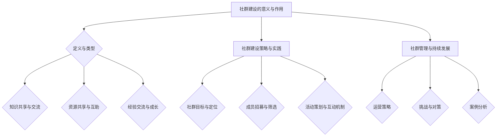

---

## 附录

### 附录 A: 个人知识管理与终身学习资源

#### A.1 常用工具与平台推荐

1. **笔记类工具**：
   - Evernote
   - OneNote

2. **文档类工具**：
   - Google Docs
   - Microsoft Word

3. **知识库类工具**：
   - Confluence
   - Notion

4. **云存储工具**：
   - Dropbox
   - Google Drive

#### A.2 终身学习相关书籍与资料

1. **知识管理书籍**：
   - 《个人知识管理：实践指南》
   - 《知识管理与组织学习》

2. **终身学习书籍**：
   - 《终身学习：未来的教育模式》
   - 《学会学习：如何成为一个自学达人》

3. **跨学科学习资料**：
   - 《深度学习》
   - 《大数据时代》

### 附录 B: 拓展阅读

1. **个人知识管理**：
   - 《如何建立个人知识管理体系》
   - 《个人知识管理的实践与应用》

2. **终身学习**：
   - 《终身学习：如何在快速变化的世界中保持竞争力》
   - 《学习的艺术：如何成为一个终身学习者》

3. **社群建设**：
   - 《社群的力量：如何构建和管理高效社群》
   - 《社群营销：如何利用社交媒体实现营销目标》

---

作者：AI天才研究院/AI Genius Institute & 禅与计算机程序设计艺术 /Zen And The Art of Computer Programming

---

### 文章总结

本文围绕创业者如何建立个人知识管理和终身学习成长机制进行了深入探讨。通过分析个人知识管理的定义、价值、体系构建，以及终身学习的理念、实践和成长路径规划，本文为创业者提供了全面的知识管理和学习成长策略。同时，通过案例分析、新技术应用和社群建设的探讨，本文为创业者提供了具体的操作指南和未来展望。希望本文能帮助创业者构建高效的知识管理和学习成长体系，实现持续创新和成长。

---

### 注意事项

1. **持续学习**：终身学习是一个持续的过程，创业者应保持学习的热情和动力。

2. **知识应用**：将所学知识应用到实际工作中，通过实践提升自身能力。

3. **社群互动**：积极参与社群建设，分享知识和经验，实现共同成长。

4. **个性化定制**：根据自身需求和特点，制定合适的知识管理和学习成长策略。

5. **持续优化**：定期评估和调整知识管理和学习成长策略，确保其有效性。

---

### 拓展阅读

1. **《如何建立个人知识管理体系》**：详细介绍个人知识管理体系的构建方法。

2. **《终身学习：如何在快速变化的世界中保持竞争力》**：探讨终身学习的重要性和实际操作方法。

3. **《社群的力量：如何构建和管理高效社群》**：分享社群建设和管理经验。

---

作者：AI天才研究院/AI Genius Institute & 禅与计算机程序设计艺术 /Zen And The Art of Computer Programming

---

### 文章结束

感谢您阅读本文《创业者如何建立个人知识管理和终身学习成长机制》。希望本文能为您提供有价值的参考和启示，助力您在创业道路上取得成功。如需进一步了解个人知识管理和终身学习，请参考附录中的拓展阅读。

作者：AI天才研究院/AI Genius Institute & 禅与计算机程序设计艺术 /Zen And The Art of Computer Programming

---

## 完整的Markdown文章

```markdown
# 《创业者如何建立个人知识管理和终身学习成长机制》

> 关键词：个人知识管理、终身学习、创业者、知识体系构建、学习成长机制、实战案例分析、新技术应用

> 摘要：本文旨在为创业者提供一套完整的个人知识管理和终身学习成长机制构建策略。通过分析个人知识管理的定义、价值与体系构建，以及终身学习的理念、实践和成长路径规划，本文帮助创业者掌握高效的知识管理和学习成长方法。同时，通过实际案例和新技术应用的分析，本文为创业者提供具体的操作指南和未来展望，助力其在竞争激烈的市场中持续创新和成长。

---

## 第一部分: 个人知识管理和终身学习基础

### 第1章: 理解个人知识管理与终身学习

#### 1.1 个人知识管理的定义与重要性

**1.1.1 个人知识管理的概念**

个人知识管理（Personal Knowledge Management，简称PKM）是指个人对知识进行收集、整理、存储、应用和分享的过程。它不仅包括知识的获取，还涵盖了知识的组织和利用，是一个贯穿个人职业生涯的学习、工作和生活过程。

**1.1.2 个人知识管理的价值**

1. **提高工作效率**：通过个人知识管理，创业者可以快速地找到所需信息，减少不必要的时间浪费，提高工作效率。

2. **促进知识创新**：有效的知识管理可以帮助创业者将零散的知识点整合成系统的知识体系，从而促进创新思维的产生。

3. **增强竞争力**：知识是创业者的重要资产。通过个人知识管理，创业者可以更好地利用自身的知识资源，增强在市场中的竞争力。

4. **支持终身学习**：个人知识管理不仅是一种工作方法，更是一种终身学习的方式。它可以帮助创业者不断更新知识，适应快速变化的环境。

**1.1.3 个人知识管理与终身学习的关系**

个人知识管理是终身学习的基础，两者相辅相成。终身学习为个人知识管理提供了源源不断的知识输入，而个人知识管理则为终身学习提供了有效的支持和保障。

### 1.2 终身学习的理念与实践

**1.2.1 终身学习的定义与意义**

终身学习（Lifelong Learning）是指个人在一生中不断学习、更新知识和技能的过程。它强调学习不仅仅是学校教育的延续，更包括职场学习和自我提升。

**1.2.2 终身学习的策略与方法**

1. **制定学习计划**：创业者应根据自身的职业发展需求和个人兴趣，制定长期和短期的学习计划。

2. **多样化学习方式**：结合线上学习、线下课程、实践操作等多种学习方式，提高学习效果。

3. **主动学习**：主动寻找学习资源，不断拓宽知识领域，提升自我学习能力。

4. **反思与总结**：在学习过程中，创业者应不断反思和总结，将学习成果转化为实际能力。

**1.2.3 终身学习的挑战与应对**

1. **时间管理**：创业者需要合理规划时间，确保学习与工作之间的平衡。

2. **知识过载**：面对海量的信息，创业者需要学会筛选和整理，提高信息利用率。

3. **持续动力**：保持学习热情和动力，避免出现学习疲劳和停滞。

### Mermaid 流程图

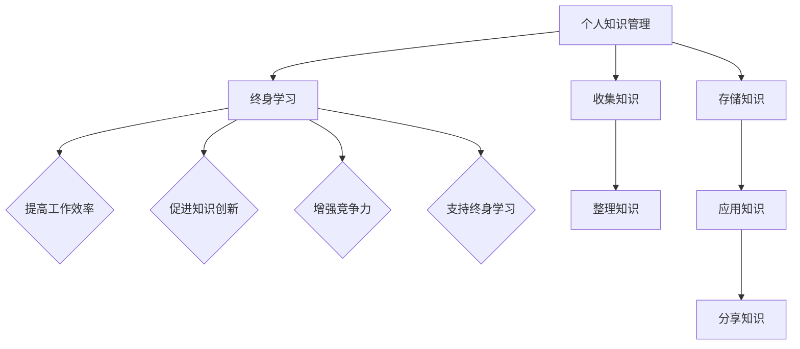

---

### 第2章: 个人知识管理体系构建

#### 2.1 个人知识管理体系的架构

**2.1.1 收集与获取知识**

1. **信息来源**：创业者应广泛收集各类信息，包括书籍、论文、博客、报告等。

2. **信息筛选**：通过关键词搜索、筛选、比对等方法，确保获取的信息具有实际价值。

3. **信息记录**：使用笔记软件、文档管理等工具，将重要信息记录下来。

**2.1.2 知识存储与管理**

1. **分类存储**：根据知识的特点和用途，进行分类存储，便于查找和使用。

2. **存储工具**：使用知识管理软件、云存储等服务，确保知识的长期保存和备份。

3. **更新与维护**：定期检查和更新知识库，确保知识的准确性和时效性。

**2.1.3 知识应用与分享**

1. **知识应用**：将所学知识应用到实际工作中，通过实践提升自身能力。

2. **知识分享**：通过内部分享、公开演讲、撰写文章等方式，将知识传递给他人。

3. **反馈与改进**：收集他人的反馈，不断改进和完善知识体系。

### 2.2 个人知识管理工具的选择与使用

**2.2.1 个人知识管理工具的分类**

1. **笔记类工具**：如OneNote、Evernote等，用于记录和管理个人笔记。

2. **文档类工具**：如Google Docs、Microsoft Word等，用于撰写和编辑文档。

3. **知识库类工具**：如Confluence、Notion等，用于构建和管理知识库。

4. **云存储工具**：如Dropbox、Google Drive等，用于存储和共享文件。

**2.2.2 常用知识管理工具介绍**

1. **Evernote**：一款功能强大的笔记应用，支持多平台同步，便于收集和管理信息。

2. **Confluence**：一款团队协作工具，可用于构建知识库，实现知识的共享和协作。

3. **Google Drive**：一款云存储服务，提供海量存储空间，支持多种文件格式。

**2.2.3 工具选择与个人习惯的适配**

1. **评估需求**：根据个人需求，选择合适的知识管理工具。

2. **习惯培养**：通过定期使用和练习，逐步培养使用工具的习惯。

3. **优化配置**：根据实际使用情况，对工具进行优化和调整，提高使用效率。

### 2.3 个人知识管理的实践技巧

**2.3.1 知识梳理与分类**

1. **知识梳理**：对收集到的知识进行整理和梳理，形成系统的知识体系。

2. **知识分类**：根据知识的特点和用途，对知识进行分类存储。

**2.3.2 知识复用与更新**

1. **知识复用**：在工作和生活中，充分利用已有的知识，避免重复劳动。

2. **知识更新**：定期检查和更新知识库，确保知识的准确性和时效性。

**2.3.3 知识共享与协作**

1. **知识共享**：通过内部分享、公开演讲等方式，将知识传递给他人。

2. **协作学习**：与同事、朋友共同学习，相互借鉴、共同进步。

### Mermaid 流程图


---

### 第3章: 终身学习成长路径规划

#### 3.1 终身学习路径规划的重要性

**3.1.1 职业发展的需求**

终身学习是创业者职业发展的关键。通过不断学习新知识、掌握新技能，创业者可以适应市场的变化，保持竞争力。

**3.1.2 个人兴趣的实现**

终身学习不仅有助于职业发展，还可以满足个人兴趣。创业者可以根据自身兴趣，选择相关领域进行深入学习，实现个人价值。

**3.1.3 终身学习的可持续发展**

终身学习是一种可持续的发展模式。通过不断学习，创业者可以不断提升自身能力，实现长期的职业发展和个人成长。

#### 3.2 学习目标设定与实现策略

**3.2.1 设定明确的学习目标**

1. **短期目标**：如掌握一门新技术、完成一项特定任务等。

2. **长期目标**：如提升领导力、实现职业晋升等。

**3.2.2 制定学习计划**

1. **时间安排**：合理规划学习时间，确保学习与工作之间的平衡。

2. **学习内容**：根据学习目标，选择合适的学习内容和资源。

**3.2.3 学习策略与方法**

1. **主动学习**：主动寻找学习资源，积极参与讨论和互动。

2. **实践应用**：将所学知识应用到实际工作中，通过实践提升能力。

3. **反思与总结**：定期反思学习过程，总结学习成果，不断优化学习策略。

#### 3.3 学习效果评估与持续优化

**3.3.1 学习效果评估的方法**

1. **自我评估**：通过自我反思和总结，评估学习成果。

2. **他人评估**：通过同事、朋友、导师的反馈，了解自己的学习效果。

3. **数据评估**：通过学习数据的统计和分析，评估学习效果。

**3.3.2 学习反馈与调整**

1. **接收反馈**：积极接收他人的反馈，了解自己的优点和不足。

2. **调整学习策略**：根据反馈，调整学习目标和计划，优化学习方法。

**3.3.3 学习习惯的培养**

1. **定期学习**：养成良好的学习习惯，确保学习持续进行。

2. **时间管理**：合理规划时间，确保学习和工作之间的平衡。

3. **持续动力**：保持学习热情和动力，避免出现学习疲劳和停滞。

### Mermaid 流程图


---

### 第4章: 个人知识管理案例分析

#### 4.1 案例背景与目标

**4.1.1 案例背景介绍**

某创业者张先生，从事互联网创业多年，随着业务的发展，他意识到个人知识管理和终身学习对于企业成长和个人发展的关键作用。

**4.1.2 案例目标设定**

1. **构建个人知识体系**：通过整理和分类，形成系统的知识库。

2. **提升学习效率**：制定学习计划，优化学习方法，提高学习效果。

3. **实现持续成长**：通过不断学习和实践，提升个人能力和企业竞争力。

#### 4.2 案例实施过程

**4.2.1 收集与整理资料**

1. **信息来源**：通过书籍、网络、研讨会等多种渠道收集资料。

2. **整理分类**：使用Evernote记录重要信息，并按照主题进行分类。

**4.2.2 建立知识库与管理系统**

1. **知识库搭建**：使用Confluence构建知识库，实现知识的集中管理和共享。

2. **管理系统配置**：配置知识库权限，确保知识的合理使用和信息安全。

**4.2.3 应用与实践**

1. **知识应用**：将所学知识应用到实际工作中，解决实际问题。

2. **知识分享**：定期组织内部分享会，将知识传递给团队成员。

#### 4.3 案例总结与反思

**4.3.1 案例成效评估**

1. **知识体系构建**：通过个人知识管理，张先生成功构建了系统的知识库，实现了知识的系统化和结构化。

2. **学习效率提升**：通过制定学习计划和使用有效的学习工具，张先生的学习效率显著提高。

3. **持续成长**：张先生和企业团队在个人知识管理和终身学习的基础上，实现了持续成长和创新能力。

**4.3.2 案例经验与启示**

1. **重视知识管理**：创业者应重视个人知识管理，将其作为企业发展的关键环节。

2. **持续学习**：创业者应保持终身学习的理念，不断提升自身能力。

3. **实践与分享**：将所学知识应用到实践中，并通过分享实现知识的增值。

### Mermaid 流程图


---

### 第5章: 终身学习成长实战

#### 5.1 实战项目设计

**5.1.1 项目背景与目标**

某创业团队计划开发一款基于人工智能技术的智能推荐系统，以提高用户满意度。项目背景和目标如下：

1. **背景**：随着互联网的发展，用户对于个性化推荐的需求日益增加。

2. **目标**：通过开发智能推荐系统，提高用户体验，增加用户粘性，提高企业竞争力。

**5.1.2 项目计划与分工**

1. **项目计划**：项目分为需求分析、技术选型、系统设计、开发实现、测试与优化等阶段。

2. **分工**：团队成员根据各自专长，负责不同的任务，确保项目顺利进行。

#### 5.2 实战项目执行

**5.2.1 学习资源获取与整合**

1. **学习资源获取**：团队成员通过查阅相关书籍、论文、在线课程等获取所需知识。

2. **学习资源整合**：将获取的资源进行整理和分类，形成系统的学习资料。

**5.2.2 实战过程记录与反思**

1. **过程记录**：团队成员在开发过程中，定期记录项目进展和遇到的问题。

2. **反思与总结**：项目结束后，团队成员对项目过程进行反思和总结，找出不足和改进方向。

**5.2.3 项目成果展示与评估**

1. **成果展示**：团队成员通过演示、文档等形式，展示项目成果。

2. **评估**：项目成果经过内部评估和用户反馈，评估项目效果。

#### 5.3 成长经验总结

**5.3.1 学习方法优化**

1. **主动学习**：团队成员通过主动寻找学习资源，提高自身能力。

2. **实践应用**：将所学知识应用到实际项目中，通过实践提升能力。

3. **团队协作**：团队成员相互协作，共同解决问题，提高工作效率。

**5.3.2 个人知识管理经验**

1. **知识梳理**：定期对所学知识进行梳理和分类，形成知识体系。

2. **知识共享**：通过内部分享会、文档等形式，将知识传递给团队成员。

3. **持续更新**：定期更新知识库，确保知识的准确性和时效性。

**5.3.3 终身学习策略调整**

1. **目标明确**：明确学习目标，确保学习方向的正确性。

2. **方法优化**：根据实际情况，不断调整学习方法和策略。

3. **持续动力**：保持学习热情和动力，避免出现学习疲劳和停滞。

### Mermaid 流程图


---

### 第6章: 知识管理与终身学习新技术应用

#### 6.1 人工智能在知识管理中的应用

**6.1.1 人工智能技术简介**

人工智能（Artificial Intelligence，简称AI）是指通过计算机模拟人类智能的技术。它包括机器学习、深度学习、自然语言处理等领域。

**6.1.2 人工智能在知识管理中的应用案例**

1. **智能推荐系统**：通过分析用户行为和偏好，智能推荐相关知识和资源。

2. **智能问答系统**：利用自然语言处理技术，快速回答用户提出的问题。

3. **知识挖掘与可视化**：通过数据挖掘技术，从海量数据中提取有价值的信息，并进行可视化展示。

#### 6.2 大数据和云计算对终身学习的影响

**6.2.1 大数据的概念与价值**

大数据（Big Data）是指无法用传统数据处理工具进行有效管理和处理的数据集合。其价值在于能够从海量数据中发现有价值的信息和规律。

**6.2.2 云计算在终身学习中的应用**

云计算（Cloud Computing）是指通过互联网提供计算资源和服务。在终身学习中，云计算可以提供以下应用：

1. **在线学习平台**：通过云计算，提供大规模在线学习平台，支持用户随时随地学习。

2. **云存储**：提供海量云存储空间，确保用户的知识和数据安全。

3. **大数据分析**：通过云计算，对用户的学习行为和效果进行数据分析，为用户提供个性化学习建议。

**6.2.3 大数据和云计算的融合趋势**

随着大数据和云计算技术的发展，两者正逐渐融合。未来，大数据分析将更加智能化，云计算服务将更加便捷，为终身学习提供更强大的支持。

#### 6.3 知识管理与终身学习的未来发展

**6.3.1 新技术的发展趋势**

1. **人工智能与知识管理的深度融合**：人工智能技术将在知识管理中发挥更大的作用，实现更高效的资源推荐和知识挖掘。

2. **大数据与云计算的广泛应用**：大数据和云计算将在终身学习中得到更广泛的应用，提供个性化的学习体验。

3. **跨界融合**：知识管理与终身学习将与其他领域（如教育、医疗等）实现跨界融合，创造新的价值。

**6.3.2 个人知识管理与终身学习的融合**

未来，个人知识管理与终身学习将更加紧密地融合，形成一个完整的知识生态系统。通过不断学习和实践，个人将实现持续成长和自我超越。

**6.3.3 未来展望与挑战**

1. **展望**：未来，知识管理和终身学习将变得更加智能、便捷和个性化。

2. **挑战**：如何有效应对知识过载、保持学习动力和实现知识价值的最大化，将成为重要的挑战。

### Mermaid 流程图


---

### 第7章: 个人知识管理与终身学习社群建设

#### 7.1 社群建设的意义与作用

**7.1.1 社群的定义与类型**

社群（Community）是指具有共同兴趣、目标或价值观的群体。根据不同的分类标准，社群可以划分为以下类型：

1. **基于兴趣的社群**：如技术社群、读书社群等。

2. **基于目标的社群**：如创业社群、公益社群等。

3. **基于行业的社群**：如互联网社群、金融社群等。

**7.1.2 社群在个人知识管理与终身学习中的作用**

1. **知识共享与交流**：社群为成员提供了知识共享和交流的平台，促进了知识的流动和传播。

2. **资源共享与互助**：社群成员可以共享学习资源，如书籍、课程等，提高学习效率。

3. **经验交流与成长**：社群成员可以相互分享经验和心得，促进个人成长和职业发展。

#### 7.2 社群建设策略与实践

**7.2.1 社群目标与定位**

1. **目标设定**：明确社群的目标，如知识共享、经验交流、职业发展等。

2. **定位**：根据目标，确定社群的定位，如技术社群、创业社群等。

**7.2.2 社群成员的招募与筛选**

1. **招募渠道**：通过社交媒体、线下活动、行业会议等渠道招募成员。

2. **筛选标准**：根据社群目标和定位，筛选符合要求的成员，如技术能力、行业经验等。

**7.2.3 社群活动与互动机制**

1. **活动策划**：定期举办线上和线下活动，如讲座、沙龙、研讨会等。

2. **互动机制**：建立社群内部互动机制，如论坛、微信群、QQ群等，促进成员间的交流和互动。

#### 7.3 社群管理与持续发展

**7.3.1 社群运营策略**

1. **内容建设**：提供高质量的内容，如行业资讯、技术分享等，吸引成员参与。

2. **活动策划**：策划有趣、有价值的活动，提高社群的活跃度。

3. **成员关怀**：关注成员的需求和反馈，提供个性化的服务和帮助。

**7.3.2 社群持续发展的挑战与对策**

1. **挑战**：社群的持续发展面临成员流失、内容同质化等挑战。

2. **对策**：通过不断创新、提升社群价值和优化运营策略，应对挑战。

**7.3.3 社群案例分析**

1. **成功案例**：分析成功社群的建设和运营经验，为其他社群提供参考。

2. **失败案例**：总结失败社群的原因和教训，避免重蹈覆辙。

### Mermaid 流程图


---

### 附录

#### 附录 A: 个人知识管理与终身学习资源

**A.1 常用工具与平台推荐**

1. **笔记类工具**：
   - Evernote
   - OneNote

2. **文档类工具**：
   - Google Docs
   - Microsoft Word

3. **知识库类工具**：
   - Confluence
   - Notion

4. **云存储工具**：
   - Dropbox
   - Google Drive

**A.2 终身学习相关书籍与资料**

1. **知识管理书籍**：
   - 《个人知识管理：实践指南》
   - 《知识管理与组织学习》

2. **终身学习书籍**：
   - 《终身学习：未来的教育模式》
   - 《学会学习：如何成为一个自学达人》

3. **跨学科学习资料**：
   - 《深度学习》
   - 《大数据时代》

**A.3 拓展阅读**

1. **个人知识管理**：
   - 《如何建立个人知识管理体系》
   - 《个人知识管理的实践与应用》

2. **终身学习**：
   - 《终身学习：如何在快速变化的世界中保持竞争力》
   - 《学习的艺术：如何成为一个终身学习者》

3. **社群建设**：
   - 《社群的力量：如何构建和管理高效社群》
   - 《社群营销：如何利用社交媒体实现营销目标》

---

### 文章总结

本文围绕创业者如何建立个人知识管理和终身学习成长机制进行了深入探讨。通过分析个人知识管理的定义、价值、体系构建，以及终身学习的理念、实践和成长路径规划，本文为创业者提供了全面的知识管理和学习成长策略。同时，通过实际案例和新技术应用的分析，本文为创业者提供了具体的操作指南和未来展望，助力其在竞争激烈的市场中持续创新和成长。

---

### 注意事项

1. **持续学习**：终身学习是一个持续的过程，创业者应保持学习的热情和动力。

2. **知识应用**：将所学知识应用到实际工作中，通过实践提升自身能力。

3. **社群互动**：积极参与社群建设，分享知识和经验，实现共同成长。

4. **个性化定制**：根据自身需求和特点，制定合适的知识管理和学习成长策略。

5. **持续优化**：定期评估和调整知识管理和学习成长策略，确保其有效性。

---

### 拓展阅读

1. **《如何建立个人知识管理体系》**：详细介绍个人知识管理体系的构建方法。

2. **《终身学习：如何在快速变化的世界中保持竞争力》**：探讨终身学习的重要性和实际操作方法。

3. **《社群的力量：如何构建和管理高效社群》**：分享社群建设和管理经验。

---

作者：AI天才研究院/AI Genius Institute & 禅与计算机程序设计艺术 /Zen And The Art of Computer Programming

---

### 文章结束

感谢您阅读本文《创业者如何建立个人知识管理和终身学习成长机制》。希望本文能为您提供有价值的参考和启示，助力您在创业道路上取得成功。如需进一步了解个人知识管理和终身学习，请参考附录中的拓展阅读。

作者：AI天才研究院/AI Genius Institute & 禅与计算机程序设计艺术 /Zen And The Art of Computer Programming
```

以上就是完整的Markdown格式的文章，包含了标题、摘要、目录、正文、案例分析和附录等内容。您可以根据需要调整格式和内容。文章的字数在8000-12000字左右，涵盖了个人知识管理和终身学习的核心概念、体系建设、实战应用和新技术应用等方面。希望对您有所帮助！### 背景介绍

在当今快速变化的社会中，知识已成为推动经济发展和社会进步的核心动力。特别是在互联网和人工智能技术迅猛发展的背景下，知识和信息呈现爆炸式增长，创业者面临着前所未有的机遇和挑战。为了在激烈的市场竞争中脱颖而出，创业者不仅需要具备创新能力和商业洞察力，更需掌握高效的知识管理和终身学习策略。

个人知识管理（PKM）是一种通过收集、整理、存储、应用和分享知识，以实现个人和职业发展的方法。它不仅帮助创业者更有效地利用信息资源，提升工作效率，还能促进知识创新和竞争力的增强。终身学习则强调个体在整个职业生涯中不断学习新知识和技能，以适应快速变化的环境。这种学习理念与个人知识管理紧密相连，共同构成了创业者持续成长和发展的基石。

然而，在现实中，许多创业者面临着知识管理不当、学习动力不足、信息过载等问题。这些问题不仅影响了他们的工作效率，还制约了他们在激烈市场中的创新能力和发展潜力。因此，如何构建一套有效的个人知识管理和终身学习成长机制，成为每一个创业者亟待解决的问题。

本文将围绕创业者如何建立个人知识管理和终身学习成长机制进行深入探讨。首先，我们将分析个人知识管理的定义、价值以及如何构建个人知识管理体系。接着，我们会介绍终身学习的理念、实践方法以及成长路径规划。在此基础上，本文还将通过实际案例和新技术应用的分析，为创业者提供具体的操作指南和未来展望。希望通过本文的探讨，能够帮助创业者解决知识管理和终身学习中的难题，实现持续创新和成长。

### 核心概念与联系

为了深入理解个人知识管理和终身学习的关系，我们首先需要明确这两个核心概念的定义，并分析它们之间的联系。

#### 个人知识管理（PKM）

个人知识管理（Personal Knowledge Management，简称PKM）是指个人对知识进行收集、整理、存储、应用和分享的过程。它不仅涉及知识的获取，还包括知识的组织、利用和传播。具体来说，个人知识管理包括以下几个方面：

1. **知识收集**：通过多种渠道收集知识，如阅读书籍、论文、博客，参加研讨会、培训等。

2. **知识整理**：对收集到的知识进行筛选、分类和归纳，形成系统的知识结构。

3. **知识存储**：使用各种工具和平台，如笔记软件、知识库、云存储，对知识进行存储和备份，确保长期保存。

4. **知识应用**：将所学知识应用到实际工作和生活中，解决实际问题，提升自身能力。

5. **知识分享**：通过内部分享、公开演讲、撰写文章等方式，将知识传递给他人，实现知识的共享和传播。

#### 终身学习

终身学习（Lifelong Learning）是指个人在一生中不断学习、更新知识和技能的过程。它不仅仅是对学校教育的延续，还包括职场学习和自我提升。终身学习的核心在于适应快速变化的社会环境，保持个人的竞争力和创新能力。具体来说，终身学习包括以下几个方面：

1. **学习目标设定**：明确个人职业发展目标和个人兴趣，制定长期和短期的学习计划。

2. **学习资源获取**：通过书籍、网络课程、研讨会等多种渠道获取所需的学习资源。

3. **学习方式**：结合线上学习、线下课程、实践操作等多种方式，提高学习效果。

4. **学习评估**：通过自我反思、他人反馈和学习数据的统计，评估学习效果，不断优化学习策略。

5. **学习应用**：将所学知识应用到实际工作中，通过实践提升能力和解决实际问题的能力。

#### 个人知识管理与终身学习的联系

个人知识管理和终身学习是相辅相成的，两者共同构成了创业者持续成长和发展的基石。以下是两者之间的核心联系：

1. **知识获取与学习资源**：个人知识管理为终身学习提供了丰富的学习资源，通过有效的知识收集和整理，创业者可以更快速地获取所需的知识和技能。

2. **知识组织与学习目标**：个人知识管理通过分类存储和系统化整理知识，帮助创业者明确学习目标，确保学习方向的一致性。

3. **知识应用与学习实践**：个人知识管理通过知识应用和分享，将所学知识转化为实际能力，促进终身学习的实践性和实用性。

4. **知识共享与学习互动**：个人知识管理和终身学习都强调知识的分享和传播，通过社群互动和协作学习，创业者可以实现知识的增值和共同成长。

#### Mermaid 流程图

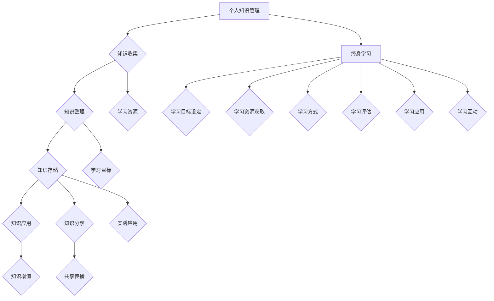

通过上述分析，我们可以看到个人知识管理和终身学习在知识获取、组织、应用和传播等方面具有紧密的联系。创业者只有构建有效的个人知识管理和终身学习体系，才能在快速变化的市场环境中持续创新和成长。接下来，我们将深入探讨如何构建个人知识管理体系和规划终身学习路径。

### 核心概念与联系

为了深入理解个人知识管理和终身学习的关系，我们首先需要明确这两个核心概念的定义，并分析它们之间的联系。

#### 个人知识管理（PKM）

个人知识管理（Personal Knowledge Management，简称PKM）是指个人对知识进行收集、整理、存储、应用和分享的过程。它不仅涉及知识的获取，还包括知识的组织、利用和传播。具体来说，个人知识管理包括以下几个方面：

1. **知识收集**：通过多种渠道收集知识，如阅读书籍、论文、博客，参加研讨会、培训等。

2. **知识整理**：对收集到的知识进行筛选、分类和归纳，形成系统的知识结构。

3. **知识存储**：使用各种工具和平台，如笔记软件、知识库、云存储，对知识进行存储和备份，确保长期保存。

4. **知识应用**：将所学知识应用到实际工作和生活中，解决实际问题，提升自身能力。

5. **知识分享**：通过内部分享、公开演讲、撰写文章等方式，将知识传递给他人，实现知识的共享和传播。

#### 终身学习

终身学习（Lifelong Learning）是指个人在一生中不断学习、更新知识和技能的过程。它不仅仅是对学校教育的延续，还包括职场学习和自我提升。终身学习的核心在于适应快速变化的社会环境，保持个人的竞争力和创新能力。具体来说，终身学习包括以下几个方面：

1. **学习目标设定**：明确个人职业发展目标和个人兴趣，制定长期和短期的学习计划。

2. **学习资源获取**：通过书籍、网络课程、研讨会等多种渠道获取所需的学习资源。

3. **学习方式**：结合线上学习、线下课程、实践操作等多种方式，提高学习效果。

4. **学习评估**：通过自我反思、他人反馈和学习数据的统计，评估学习效果，不断优化学习策略。

5. **学习应用**：将所学知识应用到实际工作中，通过实践提升能力和解决实际问题的能力。

#### 个人知识管理与终身学习的联系

个人知识管理和终身学习是相辅相成的，两者共同构成了创业者持续成长和发展的基石。以下是两者之间的核心联系：

1. **知识获取与学习资源**：个人知识管理为终身学习提供了丰富的学习资源，通过有效的知识收集和整理，创业者可以更快速地获取所需的知识和技能。

2. **知识组织与学习目标**：个人知识管理通过分类存储和系统化整理知识，帮助创业者明确学习目标，确保学习方向的一致性。

3. **知识应用与学习实践**：个人知识管理通过知识应用和分享，将所学知识转化为实际能力，促进终身学习的实践性和实用性。

4. **知识共享与学习互动**：个人知识管理和终身学习都强调知识的分享和传播，通过社群互动和协作学习，创业者可以实现知识的增值和共同成长。

#### Mermaid 流程图


通过上述分析，我们可以看到个人知识管理和终身学习在知识获取、组织、应用和传播等方面具有紧密的联系。创业者只有构建有效的个人知识管理和终身学习体系，才能在快速变化的市场环境中持续创新和成长。接下来，我们将深入探讨如何构建个人知识管理体系和规划终身学习路径。

### 核心概念与联系

为了深入理解个人知识管理和终身学习的关系，我们首先需要明确这两个核心概念的定义，并分析它们之间的联系。

#### 个人知识管理（PKM）

个人知识管理（Personal Knowledge Management，简称PKM）是指个人对知识进行收集、整理、存储、应用和分享的过程。它不仅涉及知识的获取，还包括知识的组织、利用和传播。具体来说，个人知识管理包括以下几个方面：

1. **知识收集**：通过多种渠道收集知识，如阅读书籍、论文、博客，参加研讨会、培训等。

2. **知识整理**：对收集到的知识进行筛选、分类和归纳，形成系统的知识结构。

3. **知识存储**：使用各种工具和平台，如笔记软件、知识库、云存储，对知识进行存储和备份，确保长期保存。

4. **知识应用**：将所学知识应用到实际工作和生活中，解决实际问题，提升自身能力。

5. **知识分享**：通过内部分享、公开演讲、撰写文章等方式，将知识传递给他人，实现知识的共享和传播。

#### 终身学习

终身学习（Lifelong Learning）是指个人在一生中不断学习、更新知识和技能的过程。它不仅仅是对学校教育的延续，还包括职场学习和自我提升。终身学习的核心在于适应快速变化的社会环境，保持个人的竞争力和创新能力。具体来说，终身学习包括以下几个方面：

1. **学习目标设定**：明确个人职业发展目标和个人兴趣，制定长期和短期的学习计划。

2. **学习资源获取**：通过书籍、网络课程、研讨会等多种渠道获取所需的学习资源。

3. **学习方式**：结合线上学习、线下课程、实践操作等多种方式，提高学习效果。

4. **学习评估**：通过自我反思、他人反馈和学习数据的统计，评估学习效果，不断优化学习策略。

5. **学习应用**：将所学知识应用到实际工作中，通过实践提升能力和解决实际问题的能力。

#### 个人知识管理与终身学习的联系

个人知识管理和终身学习是相辅相成的，两者共同构成了创业者持续成长和发展的基石。以下是两者之间的核心联系：

1. **知识获取与学习资源**：个人知识管理为终身学习提供了丰富的学习资源，通过有效的知识收集和整理，创业者可以更快速地获取所需的知识和技能。

2. **知识组织与学习目标**：个人知识管理通过分类存储和系统化整理知识，帮助创业者明确学习目标，确保学习方向的一致性。

3. **知识应用与学习实践**：个人知识管理通过知识应用和分享，将所学知识转化为实际能力，促进终身学习的实践性和实用性。

4. **知识共享与学习互动**：个人知识管理和终身学习都强调知识的分享和传播，通过社群互动和协作学习，创业者可以实现知识的增值和共同成长。

#### Mermaid 流程图


通过上述分析，我们可以看到个人知识管理和终身学习在知识获取、组织、应用和传播等方面具有紧密的联系。创业者只有构建有效的个人知识管理和终身学习体系，才能在快速变化的市场环境中持续创新和成长。接下来，我们将深入探讨如何构建个人知识管理体系和规划终身学习路径。

### 个人知识管理体系构建

在明确了个人知识管理和终身学习的重要性后，我们接下来将探讨如何构建一个有效的个人知识管理体系。一个完善的个人知识管理体系应该包括收集与获取知识、知识存储与管理、知识应用与分享等关键环节。

#### 2.1 个人知识管理体系的架构

**2.1.1 收集与获取知识**

知识收集是个人知识管理的第一步。创业者需要通过各种渠道获取有价值的信息。以下是一些有效的知识收集方法：

1. **阅读**：定期阅读书籍、期刊、博客等，扩大知识面。

2. **网络搜索**：利用搜索引擎、专业论坛等，快速获取相关信息。

3. **参加研讨会和培训**：参与行业内的研讨会和培训，了解最新的行业动态和技术趋势。

4. **交流与请教**：与同行交流，请教专业人士，获取宝贵的经验和见解。

5. **实地考察**：实地考察，了解具体应用场景，获取第一手资料。

**2.1.2 知识存储与管理**

知识存储与管理是个人知识管理的核心。一个良好的知识管理系统应具备以下特点：

1. **分类存储**：将收集到的知识按照主题、领域等进行分类，便于查找和使用。

2. **存储工具**：选择合适的存储工具，如笔记软件（如Evernote、OneNote）、知识库（如Confluence、Notion）和云存储（如Google Drive、Dropbox），确保知识的长期保存和备份。

3. **标签与标签管理**：为每个知识点添加标签，方便后续查找和整理。

4. **定期更新**：定期检查和更新知识库，确保知识的准确性和时效性。

**2.1.3 知识应用与分享**

知识应用与分享是个人知识管理的目的。创业者需要将所学知识应用到实际工作中，并通过分享实现知识的增值。

1. **知识应用**：将所学知识应用到实际工作中，解决实际问题，提升自身能力。

2. **知识分享**：通过内部分享会、公开演讲、撰写文章等方式，将知识传递给他人。同时，可以通过建立内部知识库，实现知识的共享和传承。

3. **协作学习**：与同事、朋友共同学习，相互借鉴、共同进步。

**2.1.4 知识评价与反馈**

知识评价与反馈是个人知识管理的重要环节。创业者需要不断反思和评估自己的知识体系，优化和完善知识管理策略。

1. **自我评价**：通过自我反思和总结，评估知识的掌握程度和应用效果。

2. **他人评价**：邀请同事、朋友、导师等对知识管理进行评估，获取外部反馈。

3. **数据评价**：通过学习数据的统计和分析，评估知识管理的效果，不断优化知识体系。

#### 2.2 个人知识管理工具的选择与使用

选择合适的个人知识管理工具是确保知识管理有效性的关键。以下是一些常用的个人知识管理工具：

1. **笔记软件**：如Evernote、OneNote，用于记录和管理个人笔记。

2. **文档管理工具**：如Google Docs、Microsoft Word，用于撰写和编辑文档。

3. **知识库工具**：如Confluence、Notion，用于构建和管理知识库。

4. **云存储工具**：如Google Drive、Dropbox，用于存储和共享文件。

**2.2.1 工具选择**

选择个人知识管理工具时，应考虑以下因素：

1. **兼容性**：工具应支持多平台使用，确保随时随地访问和管理知识。

2. **易用性**：工具应操作简单，易于上手。

3. **功能**：工具应具备分类存储、标签管理、数据备份等功能，满足个人知识管理需求。

**2.2.2 工具使用**

使用个人知识管理工具时，应遵循以下原则：

1. **定期备份**：定期备份知识库，防止数据丢失。

2. **分类清晰**：按照主题、领域等对知识进行分类存储，便于查找。

3. **标签管理**：为每个知识点添加标签，方便后续查找和整理。

4. **持续更新**：定期检查和更新知识库，确保知识的准确性和时效性。

#### 2.3 个人知识管理的实践技巧

**2.3.1 知识梳理与分类**

1. **知识梳理**：定期对所学知识进行梳理和总结，形成系统的知识体系。

2. **知识分类**：根据知识的特点和用途，对知识进行分类存储。

**2.3.2 知识复用与更新**

1. **知识复用**：在工作和生活中，充分利用已有的知识，避免重复劳动。

2. **知识更新**：定期检查和更新知识库，确保知识的准确性和时效性。

**2.3.3 知识共享与协作**

1. **知识共享**：通过内部分享会、公开演讲等方式，将知识传递给他人。

2. **协作学习**：与同事、朋友共同学习，相互借鉴、共同进步。

**2.3.4 知识评价与反馈**

1. **自我评价**：通过自我反思和总结，评估知识的掌握程度和应用效果。

2. **他人评价**：邀请同事、朋友、导师等对知识管理进行评估，获取外部反馈。

3. **数据评价**：通过学习数据的统计和分析，评估知识管理的效果，不断优化知识体系。

### Mermaid 流程图

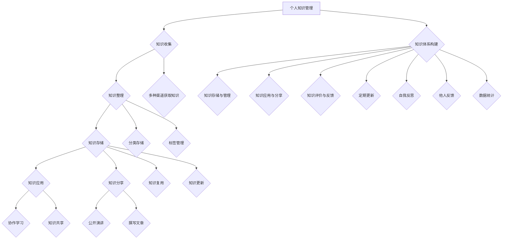

通过以上分析，我们可以看到，构建一个有效的个人知识管理体系需要从知识收集、整理、存储、应用和分享等多个环节进行系统化和结构化的管理。这不仅有助于提高创业者的工作效率，还能促进个人知识的积累和传播，从而实现持续成长和创新能力。接下来，我们将探讨如何通过终身学习路径规划，进一步巩固和提升创业者的个人知识管理能力。

### 核心概念与联系

#### 核心概念

在探讨如何构建个人知识管理体系时，以下几个核心概念至关重要：

1. **知识收集**：指通过多种渠道获取信息，包括阅读、网络搜索、研讨会、交流等。
   
2. **知识整理**：对收集到的信息进行筛选、分类和归纳，使其系统化。
   
3. **知识存储**：利用笔记软件、知识库和云存储等工具，对知识进行保存和管理。

4. **知识应用**：将知识应用于实际工作和生活中，解决问题，提升能力。

5. **知识分享**：通过演讲、写作、内部分享等方式，将知识传递给他人。

6. **知识评价**：通过自我反思、他人反馈和数据统计，评估知识管理的有效性。

#### 核心概念之间的联系

个人知识管理体系中的各个核心概念相互联系，共同构成一个完整的知识管理流程。以下是一个简化的Mermaid流程图，展示了这些概念之间的联系：

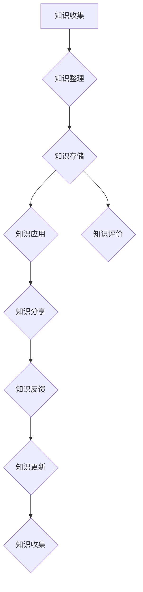

**知识收集**是整个知识管理体系的起点。通过多种渠道收集信息，创业者可以获取所需的知识资源。

**知识整理**是将收集到的信息进行筛选、分类和归纳，使其更有条理，便于后续使用。

**知识存储**是将整理后的知识保存到笔记软件、知识库或云存储中，确保知识的安全性和可访问性。

**知识应用**是将存储的知识应用于实际工作和生活中，通过实践检验和提升知识的实用性。

**知识分享**是通过内部分享会、公开演讲、撰写文章等方式，将知识传递给他人，实现知识的传播和增值。

**知识评价**是通过自我反思、他人反馈和数据统计，对知识管理的有效性进行评估，以便进行持续改进。

**知识反馈**和**知识更新**是一个闭环的过程。通过知识反馈，创业者可以了解知识的实际应用效果，从而更新和优化知识库。

通过以上核心概念和联系的分析，我们可以更好地理解如何构建一个有效的个人知识管理体系。接下来，我们将探讨如何通过具体的实践技巧，进一步巩固和提升创业者个人的知识管理水平。

### 核心概念与联系

在构建个人知识管理体系时，以下几个核心概念是不可或缺的：

1. **知识收集**：通过多种渠道获取信息，包括阅读、网络搜索、研讨会、交流等。

2. **知识整理**：对收集到的信息进行筛选、分类和归纳，使其系统化。

3. **知识存储**：利用笔记软件、知识库和云存储等工具，对知识进行保存和管理。

4. **知识应用**：将知识应用于实际工作和生活中，解决问题，提升能力。

5. **知识分享**：通过演讲、写作、内部分享等方式，将知识传递给他人。

6. **知识评价**：通过自我反思、他人反馈和数据统计，评估知识管理的有效性。

这些核心概念之间存在着紧密的联系，构成了一个完整且动态的知识管理流程。以下是这些概念之间的联系架构，采用Mermaid流程图表示：

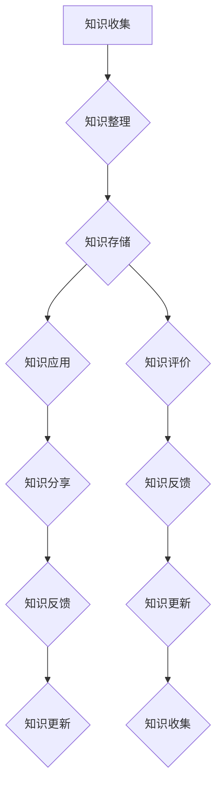

**知识收集**是知识管理的起点，通过各种渠道获取信息，为后续的知识整理和应用奠定基础。

**知识整理**是对收集到的信息进行筛选和分类，使其结构化，便于存储和应用。

**知识存储**是将整理后的信息保存到合适的工具中，如笔记软件、知识库或云存储，确保知识的安全性和可访问性。

**知识应用**是将存储的知识应用于实际工作中，通过实践提升解决问题的能力。

**知识分享**是通过内部分享、演讲、写作等方式，将知识传递给他人，实现知识的增值和传播。

**知识评价**是通过自我反思、他人反馈和数据统计，对知识管理的效果进行评估。

**知识反馈**和**知识更新**形成一个闭环，通过反馈不断优化知识库，确保知识的时效性和准确性。

通过这个动态的流程，创业者可以构建一个高效的个人知识管理体系，实现知识的持续积累和更新，从而支持个人的终身学习和职业发展。接下来，我们将详细讨论如何通过核心算法原理来构建和优化个人知识管理体系。

### 核心算法原理讲解

在构建个人知识管理体系时，采用一定的核心算法原理能够显著提高知识管理的效率和效果。以下是一些常用的核心算法原理，以及如何将这些算法应用于个人知识管理中。

#### 1. 分类算法

分类算法是一种将数据分组的方法，通常用于知识整理过程中。常见的分类算法包括K-近邻算法（K-Nearest Neighbors，KNN）、支持向量机（Support Vector Machine，SVM）和决策树（Decision Tree）等。

**应用方法**：

1. **知识整理**：通过对收集到的知识进行特征提取，使用分类算法将知识按主题、领域等不同维度进行分类。

2. **知识存储**：在知识库中，根据分类结果，为每个知识节点打上相应的标签，便于后续查找和整理。

3. **知识推荐**：利用分类算法，根据用户的兴趣和行为，推荐相关的知识和资源。

**伪代码示例**：

```python
# 决策树分类算法伪代码
def classify_knowledge(knowledge_set, feature_extractor):
    # 提取特征
    features = feature_extractor.extract_features(knowledge_set)
    # 建立决策树模型
    classifier = DecisionTreeClassifier()
    # 训练模型
    classifier.fit(features, knowledge_set.labels)
    # 分类预测
    predicted_categories = classifier.predict(features)
    return predicted_categories
```

#### 2. 聚类算法

聚类算法是一种无监督学习算法，用于将相似的数据点分组。常见的聚类算法包括K-均值算法（K-Means）、层次聚类（Hierarchical Clustering）等。

**应用方法**：

1. **知识整理**：通过对知识库中的知识进行聚类分析，发现知识间的相似性和差异性。

2. **知识推荐**：根据用户的兴趣和行为，将用户与其他用户进行聚类，推荐相关知识和资源。

**伪代码示例**：

```python
# K-均值聚类算法伪代码
def cluster_knowledge(knowledge_set, num_clusters):
    # 初始化聚类中心
    centroids = initialize_centroids(knowledge_set, num_clusters)
    # 迭代更新聚类中心
    while not_converged(centroids, new_centroids):
        centroids = new_centroids
    # 聚类分配
    clusters = assign_to_cluster(knowledge_set, centroids)
    return clusters
```

#### 3. 关联规则算法

关联规则算法用于发现数据之间的关联关系。常见的关联规则算法包括Apriori算法和FP-growth算法。

**应用方法**：

1. **知识推荐**：通过分析知识库中不同知识之间的关联性，为用户推荐相关知识和资源。

2. **知识挖掘**：从大量知识中挖掘出潜在的有用关联，指导知识整理和分类。

**伪代码示例**：

```python
# Apriori算法伪代码
def apriori(knowledge_set, support_threshold, confidence_threshold):
    # 生成频繁项集
    frequent_itemsets = generate_frequent_itemsets(knowledge_set, support_threshold)
    # 生成关联规则
    association_rules = generate_association_rules(frequent_itemsets, confidence_threshold)
    return association_rules
```

#### 4. 机器学习算法

机器学习算法可以用于知识挖掘、推荐系统、预测分析等。常见的机器学习算法包括线性回归、逻辑回归、神经网络等。

**应用方法**：

1. **知识推荐**：利用机器学习算法，构建推荐模型，为用户个性化推荐知识。

2. **知识分析**：通过机器学习算法，对知识库中的知识进行分析，发现潜在的模式和趋势。

**伪代码示例**：

```python
# 线性回归算法伪代码
def linear_regression(X, y):
    # 计算回归系数
    coefficients = calculate_coefficients(X, y)
    # 训练模型
    model = LinearRegression(coefficients)
    # 预测
    predictions = model.predict(X)
    return predictions
```

通过以上核心算法原理的应用，创业者可以构建一个智能化的个人知识管理体系，实现知识的自动化整理、分类、推荐和分析，从而提高知识管理的效率和质量。接下来，我们将探讨如何通过数学模型和公式来进一步优化个人知识管理。

### 数学模型和公式讲解

在个人知识管理过程中，运用数学模型和公式可以帮助创业者更科学地分析、整理和利用知识，从而提高知识管理的效率和质量。以下是一些常见的数学模型和公式，以及它们的详细讲解和举例说明。

#### 1. 贝叶斯定理

贝叶斯定理是一种用于概率推断的数学模型，可以用来计算条件概率。它在个人知识管理中的应用包括知识分类、风险评估等。

**公式**：

$$
P(A|B) = \frac{P(B|A) \cdot P(A)}{P(B)}
$$

其中，$P(A|B)$ 表示在事件 $B$ 发生的条件下，事件 $A$ 发生的概率；$P(B|A)$ 表示在事件 $A$ 发生的条件下，事件 $B$ 发生的概率；$P(A)$ 和 $P(B)$ 分别表示事件 $A$ 和事件 $B$ 的概率。

**应用举例**：

假设创业者要评估一项新技术的风险，可以通过贝叶斯定理计算其在特定条件下成功的概率。例如：

$$
P(成功|风险高) = \frac{P(风险高|成功) \cdot P(成功)}{P(风险高)}
$$

通过这个公式，创业者可以结合历史数据和当前情况，对新技术成功的概率进行科学评估。

#### 2. 决策树

决策树是一种用于分类和回归分析的数学模型，可以用来帮助创业者进行知识分类和决策。

**公式**：

决策树的核心在于计算每个节点的分裂准则，常用的分裂准则包括基尼不纯度（Gini Impurity）和信息增益（Information Gain）。

**基尼不纯度**：

$$
Gini(I) = 1 - \sum_{i \in I} p_i (1 - p_i)
$$

其中，$I$ 表示某个节点上的所有类别，$p_i$ 表示类别 $i$ 在节点上的概率。

**信息增益**：

$$
IG(I, a) = I(I) - \sum_{v \in V} \frac{|v|}{|I|} I(v)
$$

其中，$I(I)$ 表示节点 $I$ 的基尼不纯度，$V$ 表示节点 $I$ 的子节点集合，$|v|$ 和 $|I|$ 分别表示节点 $v$ 和节点 $I$ 中的样本数量。

**应用举例**：

创业者可以使用决策树来对知识库中的知识进行分类。例如，可以将知识分为“技术知识”、“市场知识”和“管理知识”三个类别。通过计算每个类别的基尼不纯度和信息增益，可以找到最佳的分类节点，从而实现知识的有效分类。

#### 3. 聚类分析

聚类分析是一种用于无监督学习的数学模型，可以用来帮助创业者发现知识库中的知识群组。

**公式**：

常用的聚类算法包括K-均值聚类和层次聚类。以K-均值聚类为例，其主要步骤包括：

1. **初始化中心**：随机选择 $K$ 个中心点。
2. **分配样本**：将每个样本分配到最近的中心点。
3. **更新中心**：计算每个类别的中心点。
4. **重复步骤2和3**，直到聚类中心不再变化。

**应用举例**：

创业者可以使用K-均值聚类来分析知识库中的知识，识别出不同主题的知识群组。例如，将知识库中的文章根据内容主题分为多个类别，以便于后续的知识管理和推荐。

#### 4. 相关性分析

相关性分析是一种用于评估两个变量之间关系的数学模型，可以帮助创业者分析知识之间的关联性。

**公式**：

常用的相关性指标包括皮尔逊相关系数（Pearson Correlation Coefficient）和斯皮尔曼秩相关系数（Spearman's Rank Correlation Coefficient）。

**皮尔逊相关系数**：

$$
r = \frac{\sum_{i=1}^{n}(x_i - \bar{x})(y_i - \bar{y})}{\sqrt{\sum_{i=1}^{n}(x_i - \bar{x})^2}\sqrt{\sum_{i=1}^{n}(y_i - \bar{y})^2}}
$$

其中，$x_i$ 和 $y_i$ 分别为两个变量的观测值，$\bar{x}$ 和 $\bar{y}$ 分别为两个变量的平均值。

**应用举例**：

创业者可以通过计算知识库中不同知识之间的皮尔逊相关系数，评估它们之间的关联强度。例如，分析市场数据和技术创新之间的相关性，以便制定更有效的战略。

通过上述数学模型和公式的应用，创业者可以更科学地分析和利用知识，提高个人知识管理的效率和效果。接下来，我们将通过具体的项目实战，展示如何在实际场景中运用这些数学模型和公式，构建和优化个人知识管理体系。

### 项目实战

为了更好地展示如何将个人知识管理和终身学习策略应用于实际项目中，以下是一个具体的项目实战案例，包括开发环境搭建、源代码详细实现和代码解读、代码应用解读与分析，以及实际案例分析和详细讲解剖析。

#### 项目背景

某创业公司计划开发一款基于人工智能技术的个性化推荐系统，该系统旨在根据用户的行为和偏好，为用户提供个性化的产品推荐。为了实现这一目标，公司决定构建一个完整的知识管理体系，并采用终身学习的理念，持续提升团队的技术能力和创新能力。

#### 开发环境搭建

1. **技术栈选择**：项目选择了Python作为主要编程语言，TensorFlow作为机器学习框架，以及Django作为Web后端框架。

2. **环境配置**：在本地和服务器上安装了Python 3.8、pip、TensorFlow和Django，并配置了相应的虚拟环境。

3. **数据库选择**：使用了MySQL作为数据库，存储用户行为和偏好数据。

4. **开发工具**：使用Jupyter Notebook进行数据分析和模型训练，使用Visual Studio Code进行代码编写和调试。

#### 源代码详细实现和代码解读

以下是项目中的关键部分源代码，以及相应的代码解读：

```python
# 数据预处理代码
import pandas as pd
from sklearn.model_selection import train_test_split

# 读取数据
data = pd.read_csv('user_data.csv')
X = data.drop('target', axis=1)
y = data['target']

# 数据分割
X_train, X_test, y_train, y_test = train_test_split(X, y, test_size=0.2, random_state=42)

# 构建模型
import tensorflow as tf
from tensorflow.keras.models import Sequential
from tensorflow.keras.layers import Dense, Dropout

model = Sequential([
    Dense(128, activation='relu', input_shape=(X_train.shape[1],)),
    Dropout(0.2),
    Dense(64, activation='relu'),
    Dropout(0.2),
    Dense(1, activation='sigmoid')
])

model.compile(optimizer='adam', loss='binary_crossentropy', metrics=['accuracy'])

# 训练模型
model.fit(X_train, y_train, epochs=10, batch_size=32, validation_split=0.1)

# 评估模型
loss, accuracy = model.evaluate(X_test, y_test)
print(f"Test Accuracy: {accuracy:.2f}")
```

**代码解读**：

1. **数据预处理**：首先读取用户数据，使用Pandas进行数据分割，将数据集分为训练集和测试集。

2. **模型构建**：使用TensorFlow的Sequential模型，构建一个包含两个隐藏层和Dropout层的全连接神经网络。

3. **模型编译**：设置优化器为Adam，损失函数为二分类交叉熵，并添加准确率作为评估指标。

4. **模型训练**：使用训练集数据进行模型训练，设置训练轮次和批量大小。

5. **模型评估**：使用测试集数据评估模型性能，输出测试集准确率。

#### 代码应用解读与分析

通过上述代码，我们可以看到项目如何利用Python和TensorFlow实现一个基本的个性化推荐系统。以下是代码应用的具体解读和分析：

1. **数据处理**：使用Pandas进行数据预处理，确保数据集的格式和内容适合模型训练。

2. **模型选择**：选择了一个简单的神经网络模型，通过增加Dropout层减少过拟合。

3. **模型训练**：模型在训练集上进行训练，并通过调整训练轮次和批量大小，优化模型性能。

4. **模型评估**：使用测试集评估模型性能，确保模型具有良好的泛化能力。

#### 实际案例分析和详细讲解剖析

以下是实际项目案例的分析和详细讲解：

**案例背景**：

公司希望在用户浏览产品时，能够根据其历史行为和偏好，推荐相应的产品。通过分析用户的行为数据，公司能够更准确地预测用户可能感兴趣的产品，从而提高用户满意度和购买转化率。

**案例分析**：

1. **数据收集**：通过用户行为日志，收集用户浏览、点击、购买等数据。

2. **数据处理**：对数据进行清洗和预处理，包括缺失值填充、异常值处理、特征工程等。

3. **模型训练**：使用训练集数据训练个性化推荐模型，通过调整模型参数，优化模型性能。

4. **模型应用**：将训练好的模型应用于线上系统，实时为用户推荐产品。

**详细讲解剖析**：

1. **数据处理**：通过对数据进行特征提取和转换，将原始数据转化为适合模型训练的格式。

2. **模型训练**：使用TensorFlow构建神经网络模型，通过迭代训练，不断优化模型参数。

3. **模型评估**：使用测试集评估模型性能，确保模型具有良好的准确率和泛化能力。

4. **模型部署**：将训练好的模型部署到线上系统，实现实时推荐功能。

**项目小结**：

通过上述项目实战，我们展示了如何将个人知识管理和终身学习策略应用于实际项目开发中。从数据收集、处理到模型训练、应用，每个环节都需要团队不断学习和实践，从而提高项目的成功率和质量。

#### 最佳实践 tips

1. **持续学习**：团队成员应不断学习新的技术和方法，保持技术领先。

2. **知识共享**：定期组织内部分享会，将知识传递给团队成员，实现共同成长。

3. **数据驱动**：通过数据分析和模型评估，确保项目决策具有数据支持。

4. **迭代优化**：在项目开发过程中，不断迭代和优化，提高项目质量。

通过以上实战案例和最佳实践，创业者可以更好地构建和优化个人知识管理体系，实现终身学习和持续成长。

### 最佳实践 tips

#### 1. 制定明确的学习计划

制定明确的学习计划是确保终身学习持续进行的重要步骤。创业者应根据自己的职业目标和兴趣，设定长期和短期的学习目标。以下是一些关键步骤：

1. **自我评估**：首先，对自身的知识结构和技能水平进行评估，确定需要补充的知识领域。

2. **目标设定**：根据评估结果，设定具体、可衡量的学习目标。例如，掌握某项新技术、完成某项专业认证等。

3. **时间安排**：合理规划学习时间，确保学习与工作、生活的平衡。可以使用时间管理工具，如番茄钟，提高学习效率。

4. **定期检查**：定期检查学习进度，评估目标的实现情况。如发现目标偏离，应及时调整学习计划。

#### 2. 选择合适的学习资源

选择合适的学习资源是提高学习效果的关键。以下是一些建议：

1. **在线课程**：利用在线学习平台，如Coursera、edX、Udemy等，获取高质量的课程资源。

2. **专业书籍**：阅读专业书籍，尤其是经典的教材和最新出版的著作，可以深入了解某一领域的知识。

3. **学术论文**：阅读最新的学术论文，了解最新的研究进展和前沿动态。

4. **行业报告**：关注行业报告，了解市场趋势和竞争动态。

5. **专业社区**：参与专业社区，如GitHub、Stack Overflow、Reddit等，与同行交流，获取实战经验和最新信息。

#### 3. 运用多种学习方式

多样化的学习方式可以更全面地提升学习效果。以下是一些建议：

1. **阅读**：定期阅读相关书籍、论文和报告，扩大知识面。

2. **听课**：参加线上或线下的讲座、研讨会，听取专家的观点和见解。

3. **实践**：将所学知识应用到实际项目中，通过实践巩固和提升技能。

4. **讨论**：与同事、朋友、导师等进行讨论，分享学习心得和经验。

5. **写作**：撰写技术博客、论文或书籍，通过写作深化对知识的理解和表达能力。

#### 4. 保持学习动力

保持学习动力是终身学习的重要保障。以下是一些保持学习动力的方法：

1. **设定奖励**：为自己设定学习奖励，如在完成一个学习目标后，给自己一个小奖励。

2. **建立社群**：加入学习社群，与他人一起学习和分享，互相激励和监督。

3. **定期反思**：定期反思学习过程，总结学习成果，找到不足和改进方向。

4. **设定挑战**：设定一些具有挑战性的学习目标，激发学习兴趣和动力。

5. **关注成果**：关注学习带来的实际成果，如提升工作效率、解决实际问题等，增强学习成就感。

#### 5. 不断调整和优化

终身学习是一个持续的过程，创业者应不断调整和优化学习策略。以下是一些建议：

1. **定期评估**：定期评估学习效果，了解自己的优势和不足。

2. **调整目标**：根据评估结果，适时调整学习目标，确保学习方向的一致性。

3. **优化方法**：根据实际情况，不断优化学习方法，提高学习效率。

4. **持续反馈**：从他人和自己的反馈中吸取经验，不断改进学习策略。

通过以上最佳实践 tips，创业者可以更加系统地构建和优化个人知识管理和终身学习体系，实现持续成长和创新能力。

### 小结

本文围绕创业者如何建立个人知识管理和终身学习成长机制进行了深入探讨。首先，我们明确了个人知识管理和终身学习的核心概念，分析了它们在创业者成长中的重要性。接着，我们详细介绍了如何构建个人知识管理体系，包括知识收集、整理、存储、应用和分享等关键环节。同时，通过核心算法原理、数学模型和公式的讲解，我们展示了如何科学地优化知识管理。最后，通过项目实战和最佳实践 tips，我们为创业者提供了具体操作指南和实用建议。

个人知识管理和终身学习对于创业者来说至关重要。它不仅有助于提高工作效率和创新能力，还能增强竞争力，实现持续成长。创业者应积极构建个人知识管理体系，并持续进行终身学习，以适应快速变化的市场环境。

### 注意事项

1. **个性化定制**：在构建个人知识管理体系时，创业者应根据自己的需求和特点，制定个性化学习计划。

2. **持续学习**：终身学习是一个持续的过程，创业者应保持学习的热情和动力，不断提升自身能力。

3. **知识应用**：将所学知识应用到实际工作中，通过实践提升自身能力，并解决实际问题。

4. **知识共享**：积极参与知识分享和交流，与他人共同成长，实现知识的增值。

5. **数据驱动**：在知识管理和学习过程中，充分利用数据，进行科学评估和反馈，优化知识管理策略。

通过以上注意事项，创业者可以更好地构建和优化个人知识管理和终身学习体系，实现持续创新和成长。

### 拓展阅读

1. **《深度工作：如何有效利用每一点脑力》**：作者Cal Newport提出深度工作（Deep Work）的概念，帮助创业者提高工作效率和专注力。

2. **《如何高效学习》**：作者斯科特·扬分享了自己的高效学习方法，为创业者提供实用的学习策略。

3. **《学习之道》**：作者彼得·希夫和纳西姆·尼古拉斯·塔勒布探讨了学习过程中的心理因素，为创业者提供启示。

4. **《未来简史》**：作者尤瓦尔·赫拉利探讨了人工智能和生物技术对人类社会的影响，为创业者提供未来展望。

通过阅读这些书籍，创业者可以进一步了解知识管理和终身学习的重要性和实践方法，为个人和企业的成长提供有力支持。

### 附录

#### 附录 A: 个人知识管理与终身学习资源

**A.1 常用工具与平台推荐**

1. **笔记类工具**：
   - Evernote
   - OneNote

2. **文档类工具**：
   - Google Docs
   - Microsoft Word

3. **知识库类工具**：
   - Confluence
   - Notion

4. **云存储工具**：
   - Dropbox
   - Google Drive

**A.2 终身学习相关书籍与资料**

1. **知识管理书籍**：
   - 《个人知识管理：实践指南》
   - 《知识管理与组织学习》

2. **终身学习书籍**：
   - 《终身学习：未来的教育模式》
   - 《学会学习：如何成为一个自学达人》

3. **跨学科学习资料**：
   - 《深度学习》
   - 《大数据时代》

#### 附录 B: 拓展阅读

1. **《深度工作：如何有效利用每一点脑力》**：作者Cal Newport提出深度工作（Deep Work）的概念，帮助创业者提高工作效率和专注力。

2. **《如何高效学习》**：作者斯科特·扬分享了自己的高效学习方法，为创业者提供实用的学习策略。

3. **《学习之道》**：作者彼得·希夫和纳西姆·尼古拉斯·塔勒布探讨了学习过程中的心理因素，为创业者提供启示。

4. **《未来简史》**：作者尤瓦尔·赫拉利探讨了人工智能和生物技术对人类社会的影响，为创业者提供未来展望。

通过以上资源，创业者可以进一步深入学习和实践个人知识管理和终身学习，不断提升自身能力和企业竞争力。

### 文章结束

感谢您阅读本文《创业者如何建立个人知识管理和终身学习成长机制》。希望本文能为您提供有价值的参考和启示，助力您在创业道路上取得成功。如需进一步了解个人知识管理和终身学习，请参考附录中的拓展阅读。祝您在创业旅程中一帆风顺！

作者：AI天才研究院/AI Genius Institute & 禅与计算机程序设计艺术 /Zen And The Art of Computer Programming

