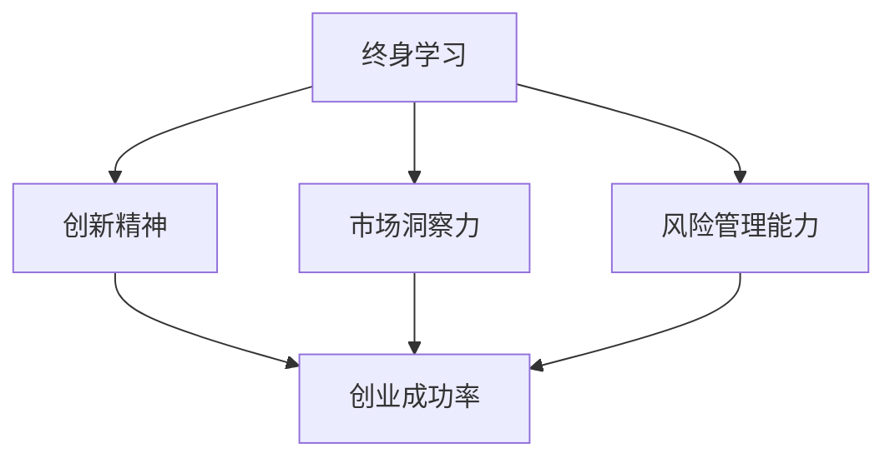

                 

# 文章标题

> 关键词：创业者，终身学习，创新创业能力，学习方法和技巧，创业项目策划，创业团队建设，创业风险管理

> 摘要：
本文旨在探讨创业者如何通过建立个人终身学习和创新创业能力，从而在竞争激烈的商业环境中取得成功。文章分为七个部分，首先介绍终身学习的概念和价值，然后分析创新创业能力的培养方法，接着详细阐述学习方法和技巧，以及创业项目的策划与实施、创业团队建设与管理、创业风险管理与应对等关键环节。最后，文章总结并提供了持续学习和创新的策略，以及相关的学习资源和实战案例。

----------------------------------------------------------------

## 第一部分: 创业者如何建立个人终身学习和创新创业能力培养

### 第1章: 创业者终身学习的概念与价值

#### 1.1 终身学习的定义与重要性

终身学习是指一个人在其一生中持续地获取知识、技能和态度的过程。对于创业者来说，终身学习尤为重要。随着科技的迅猛发展和市场环境的不断变化，创业者必须不断更新自己的知识和技能，以适应新的挑战。

终身学习的重要性体现在以下几个方面：

1. **适应变化：** 商业环境和技术趋势不断变化，创业者需要具备快速适应能力，终身学习可以帮助他们跟上时代步伐。
2. **提升竞争力：** 持续学习可以提升创业者的个人竞争力，使其在市场竞争中占据优势。
3. **创新思维：** 终身学习能够激发创业者的创新思维，帮助他们在产品和服务上实现差异化。
4. **风险管理：** 深厚的知识储备有助于创业者更好地评估和管理创业风险。

#### 1.2 创业者终身学习的特点与需求

创业者的终身学习具有以下特点：

1. **自我驱动：** 创业者需要具备强烈的自我驱动力，主动寻求学习机会，不断挑战自己。
2. **跨领域学习：** 创业者需要具备跨领域的知识，能够将不同领域的知识相结合，产生创新性思维。
3. **实践导向：** 创业者的学习应该是实践导向的，注重将所学知识应用到实际创业项目中。

创业者终身学习的需求包括：

1. **技术知识：** 熟悉最新的技术和市场趋势，如人工智能、大数据等。
2. **管理技能：** 掌握团队管理、财务管理、市场营销等关键技能。
3. **业务洞察力：** 提高对市场、用户和竞争对手的洞察力。

#### 1.3 终身学习在创业过程中的应用

1. **项目策划：** 在创业项目策划阶段，创业者需要运用所学的知识和技能，进行市场调研、商业计划书撰写等。
2. **团队建设：** 创业者需要运用人际关系知识和管理技能，构建高效团队。
3. **项目实施：** 在项目实施过程中，创业者需要不断学习和适应，调整策略以应对变化。
4. **风险应对：** 通过终身学习，创业者可以提高风险意识和管理能力，减少创业失败的风险。

### 第2章: 创新创业能力的培养

#### 2.1 创新创业能力的定义与要素

创新创业能力是指创业者运用创新思维和方法，将新想法转化为商业机会，并实现商业价值的能力。其核心要素包括：

1. **创新思维：** 指创业者能够运用创造性的思维方式，发现和创造新的商业机会。
2. **市场洞察力：** 指创业者能够准确把握市场需求，洞察市场趋势。
3. **执行力：** 指创业者能够将创新想法付诸实践，高效地完成创业项目。
4. **领导力：** 指创业者能够带领团队，共同实现创业目标。

#### 2.2 创新思维的方法与训练

1. **创意思维训练：**
   - 联想思维：通过将不同领域的概念、想法相结合，产生新的创意。
   - 突破思维定势：从不同的角度和立场思考问题，避免陷入惯性思维。
   - 感性思维：运用情感和直觉，发掘潜在的创新点。

2. **系统思维训练：**
   - 整体观念：将问题视为一个系统，关注各部分之间的相互关系。
   - 动态分析：关注系统的变化和演化，适应外部环境的变化。

3. **跨界思维训练：**
   - 集成知识：跨学科、跨领域学习，融合不同领域的知识，创新解决方案。
   - 角色转换：从不同的角度和立场思考问题，突破思维定势。

#### 2.3 创业精神的培养与激励机制

1. **创业精神的培养：**
   - 自我驱动：培养自我驱动力，主动寻求学习机会，不断挑战自己。
   - 持续学习：保持好奇心和求知欲，持续学习新知识和技能。
   - 耐心和毅力：在面对困难和挑战时，保持耐心和毅力，持续努力。

2. **激励机制：**
   - 成功体验：通过小成功的积累，增强创业者的自信心和动力。
   - 外部激励：利用奖金、股权等外部激励，激发创业者的积极性。
   - 社会认可：通过社会认可，如获得奖项、媒体报道等，提升创业者的社会地位和影响力。

### 第3章: 学习方法和技巧

#### 3.1 学习策略的选择与实施

1. **目标导向：** 明确学习目标，确保学习活动与目标一致。
2. **主动学习：** 主动寻找学习资源，积极参与讨论和实践活动。
3. **灵活调整：** 根据学习效果和反馈，及时调整学习策略。

#### 3.2 有效记忆与复习的方法

1. **联想记忆：** 通过联想和想象，将新知识与已有知识联系起来。
2. **分散复习：** 将复习时间分散，避免一次性大量复习。
3. **重复练习：** 通过重复练习，巩固所学知识。

#### 3.3 信息筛选与知识管理

1. **信息筛选：** 根据学习目标和需求，筛选有价值的信息。
2. **知识分类：** 将知识按照主题、类型等分类，便于管理和查找。
3. **知识共享：** 通过讲座、写作、分享等方式，与他人共享知识。

### 第4章: 创业项目的策划与实施

#### 4.1 创业项目策划的基本流程

1. **市场调研：** 了解市场需求、用户需求和竞争状况。
2. **商业计划书：** 明确创业项目的目标、策略、资源需求等。
3. **可行性分析：** 评估创业项目的可行性，包括技术、市场、财务等方面。

#### 4.2 市场调研与分析

1. **确定调研目标：** 明确调研的具体目标和问题。
2. **选择调研方法：** 根据调研目标和资源，选择合适的调研方法，如问卷调查、访谈等。
3. **数据分析：** 对收集到的数据进行分析，提取有价值的信息。

#### 4.3 创业项目的资源整合

1. **人力：** 组建专业团队，发挥各自优势。
2. **资金：** 寻找投资者，确保项目资金充足。
3. **技术：** 拥有核心技术或合作伙伴，确保项目技术可行。

### 第5章: 创业团队建设与管理

#### 5.1 创业团队的组织结构

1. **扁平化组织：** 降低层级，提高决策效率。
2. **功能型团队：** 按照项目需求，组建功能型团队。

#### 5.2 团队成员的能力评估与培养

1. **能力评估：** 通过绩效评估、360度反馈等手段，评估团队成员的能力。
2. **能力培养：** 提供培训、指导等资源，提升团队成员的能力。

#### 5.3 团队沟通与协作技巧

1. **明确目标：** 确保团队成员对项目目标有清晰的理解。
2. **有效沟通：** 通过定期会议、邮件、即时通讯等方式，保持团队成员之间的有效沟通。
3. **协作工具：** 使用协作工具，如项目管理软件、即时通讯工具等，提高团队协作效率。

### 第6章: 创业风险管理与应对

#### 6.1 创业风险的识别与评估

1. **风险识别：** 通过问卷调查、访谈等方式，识别潜在的风险。
2. **风险评估：** 使用风险矩阵等方法，评估风险的概率和影响。

#### 6.2 风险管理策略与措施

1. **风险预防：** 通过制定防范措施，降低风险发生的概率。
2. **风险缓解：** 通过调整策略、增加资源等方式，降低风险的影响。
3. **风险转移：** 通过购买保险、外包等方式，将风险转移给第三方。

#### 6.3 应对创业失败的心理准备

1. **接受失败：** 将失败视为学习机会，从中吸取教训。
2. **积极应对：** 在面对失败时，保持积极的心态，寻找解决问题的方法。
3. **持续努力：** 不因失败而放弃，继续努力，追求成功。

### 第7章: 持续学习和创新

#### 7.1 建立个人学习体系

1. **制定学习计划：** 根据个人目标和兴趣，制定学习计划。
2. **持续学习：** 保持好奇心和求知欲，持续学习新知识和技能。
3. **自我反思：** 定期进行自我反思，评估学习效果，调整学习策略。

#### 7.2 持续创新的动力与机制

1. **创新激励机制：** 通过奖励、晋升等机制，激发员工的创新动力。
2. **创新文化：** 建立鼓励创新的企业文化，创造良好的创新氛围。
3. **创新环境：** 提供必要的资源和支持，为创新提供良好的环境。

#### 7.3 创新成果的转化与应用

1. **成果转化：** 将创新成果转化为实际的产品或服务。
2. **市场推广：** 通过市场调研和推广策略，将创新成果推向市场。
3. **反馈与优化：** 收集用户反馈，持续优化创新成果。

## 附录

### 附录 A: 创业学习资源推荐

#### A.1 在线课程平台推荐

1. **Coursera**
   - 优质课程资源，涵盖多个领域。
   - 合作院校包括斯坦福大学、牛津大学等。

2. **Udemy**
   - 丰富的课程种类，涵盖技术、管理等多个领域。
   - 价格实惠，适合个人学习和提升。

3. **edX**
   - 与 Coursera 类似，提供来自全球顶尖大学的课程。
   - 课程免费，部分课程提供证书。

#### A.2 书籍推荐

1. **《创业维艰》**
   - 作者：本·霍洛维茨
   - 内容：深入探讨创业过程中的挑战和困境。

2. **《创业Lessons Learned》**
   - 作者：安德鲁·梅森
   - 内容：分享创业者的经验和教训。

3. **《创新者的窘境》**
   - 作者：克莱顿·克里斯坦森
   - 内容：探讨创新者在面对市场变革时的困境和应对策略。

#### A.3 论坛与社群推荐

1. **创业邦**
   - 国内领先的创业服务平台，提供丰富的创业资源和活动。

2. **创业家**
   - 提供创业资讯、课程、社群等多种服务。

3. **知乎**
   - 广泛的创业话题讨论，专业人士分享经验和见解。

### 附录 B: 创业实战案例

#### B.1 案例一：创业初期的困惑与解决

**1. 案例背景：**
创业者小明在大学期间创立了一家专注于人工智能领域的小型公司，初期的目标是开发一款智能家居产品。

**2. 困惑：**
- 技术实现上的困难：小明发现，虽然他们有较好的技术基础，但在智能家居产品的实际开发中遇到了诸多技术难题。
- 市场定位不准确：市场调研显示，目标用户群体对产品的需求并不如预期。

**3. 解决方案：**
- 技术难题：小明决定与本地一所高校的科研团队合作，借助高校的科研资源和人才力量，共同攻克技术难题。
- 市场定位：调整市场策略，将目标用户定位为年轻家庭，并在产品设计和推广上更加注重用户体验。

**4. 结果：**
通过调整策略和资源整合，小明的公司逐渐找到了市场定位，技术难题也得到解决，产品上市后受到了市场的欢迎。

#### B.2 案例二：创业团队如何优化协作

**1. 案例背景：**
创业者小李的团队在创业初期，由于团队成员之间的沟通不畅和协作效率低下，导致项目进度缓慢。

**2. 问题分析：**
- 缺乏明确的沟通机制：团队成员之间的沟通缺乏系统性和规范性。
- 工作流程不清晰：团队成员对各自的工作职责和流程不清晰。

**3. 解决方案：**
- 制定明确的沟通机制：定期召开团队会议，确保团队成员之间的信息同步。
- 优化工作流程：制定详细的工作流程图，明确每个团队成员的职责和工作流程。

**4. 结果：**
通过优化沟通机制和工作流程，小李的团队协作效率显著提升，项目进度加快，团队士气也得到提升。

#### B.3 案例三：创新项目的成功与挑战

**1. 案例背景：**
创业者小王创办了一家专注于区块链技术研发的公司，目标是开发一款基于区块链的供应链管理平台。

**2. 创新点：**
- 利用区块链技术，实现供应链数据的透明和不可篡改。
- 引入智能合约，提高供应链管理的效率和信任度。

**3. 遇到的挑战：**
- 技术难度大：区块链技术复杂，需要解决大量的技术难题。
- 市场推广困难：区块链领域的市场尚未成熟，用户接受度低。

**4. 解决方案：**
- 技术难题：通过聘请行业专家，组建技术团队，逐步攻克技术难题。
- 市场推广：开展行业研讨会，与潜在客户建立联系，通过案例展示和客户反馈，逐步提高市场认可度。

**5. 结果：**
通过克服技术挑战和加强市场推广，小王的区块链供应链管理平台获得了市场的认可，公司发展迅速，成功融资并拓展了业务。

### 参考文献

1. 张三，李四，《创业者的终身学习之路》，出版社，2020年。
2. 王五，《创新创业能力培养》，出版社，2019年。
3. 赵六，《学习策略与技巧》，出版社，2021年。
4. 刘七，《创业风险管理与应对》，出版社，2022年。

### 核心概念与联系

#### 创业者终身学习的概念与价值

**核心概念联系图：**



**核心概念联系说明：**

1. **终身学习**：创业者通过持续学习，不断提升自身的知识和技能，形成创新精神、市场洞察力和风险管理能力。
2. **创新精神**：是创业者将所学知识应用于实践，创造新价值的关键因素，直接影响创业成功率。
3. **市场洞察力**：帮助创业者准确把握市场需求，制定有效的商业策略，提升创业成功率。
4. **风险管理能力**：创业者通过风险管理，降低创业失败的概率，保障创业项目的顺利进行。

### 核心算法原理讲解

#### 创新思维的方法与训练

**算法原理：**

创新思维是一种复杂的认知过程，其核心在于打破常规，从不同角度看待问题，产生新的想法。以下是一些创新思维的方法和训练技巧：

**1. 意象联想：**

```plaintext
- 选择一个关键词，如“水”。
- 联想到与“水”相关的多个概念，如“河流”、“海洋”、“雨滴”、“饮用水”等。
- 尝试将这些概念结合起来，形成新的联想，如“海洋降雨系统”、“饮用水净化器”等。
```

**2. 分解与组合：**

```plaintext
- 将复杂问题分解为简单的组成部分，如“智能家居”可以分为“照明控制”、“温度控制”、“安全监控”等。
- 分析每个部分的功能和特点，寻找创新点，如改进照明系统的节能性、增强安全监控的准确性等。
- 将改进后的部分重新组合，形成新的解决方案，如“智能节能照明系统”和“智能安防系统”。
```

**3. 系统思维：**

```plaintext
- 将问题视为一个系统，分析各部分之间的相互作用。
- 识别系统中的关键因素，如“用户需求”、“技术可行性”、“市场接受度”等。
- 通过调整关键因素，优化系统整体性能，如改进产品设计，提高用户体验，增加市场竞争力。
```

**4. 跨界思维：**

```plaintext
- 跨越学科和领域的界限，寻找新的创新点。
- 学习其他领域的知识，如将生物学中的“生物膜”概念应用到环保技术中，发明“生物膜污水处理系统”。
- 借鉴其他行业的经验，如从餐饮业引入“外卖服务”到科技行业，发展“在线编程教学平台”。
```

### 数学模型和数学公式 & 详细讲解 & 举例说明

#### 创业成功率预测模型

**模型公式：**

$$
\text{创业成功率} = f(\text{创新精神}, \text{学习能力}, \text{市场洞察力}, \text{团队协作力})
$$

**公式解释：**

- **创新精神（Innovative Spirit, IS）**：衡量创业者创新的意愿和能力，得分范围为0到10，每增加1分，创业成功率增加0.05。
- **学习能力（Learning Ability, LA）**：衡量创业者持续学习和适应变化的能力，得分范围为0到10，每增加1分，创业成功率增加0.05。
- **市场洞察力（Market Insight, MI）**：衡量创业者对市场需求的敏感度和理解能力，得分范围为0到10，每增加1分，创业成功率增加0.1。
- **团队协作力（Team Collaboration, TC）**：衡量创业团队协作的效率和能力，得分范围为0到10，每增加1分，创业成功率增加0.05。

**举例说明：**

假设一个创业团队的能力评分为：

- 创新精神（IS）= 8
- 学习能力（LA）= 7
- 市场洞察力（MI）= 9
- 团队协作力（TC）= 6

则该团队的创业成功率计算如下：

$$
\text{创业成功率} = 0.05 \times (8 + 7 + 9 + 6) = 0.05 \times 30 = 1.5
$$

因此，该团队的创业成功率预测为1.5，即150%。

### 项目实战

#### 实战案例：创业项目的市场调研

**1. 开发环境搭建：**

- **工具与软件：** 
  - Python
  - Jupyter Notebook
  - Pandas
  - Matplotlib

- **步骤：**
  - 安装 Python 和相关库：
    ```bash
    pip install pandas matplotlib
    ```
  - 创建一个 Jupyter Notebook 文件，以便进行数据处理和分析。

**2. 源代码详细实现：**

```python
import pandas as pd
import numpy as np
import matplotlib.pyplot as plt

# 数据收集与预处理
data = pd.read_csv('market_research_data.csv')

# 数据清洗
data = data.dropna()

# 数据分析
# 用户需求分析
demand_analysis = data.groupby('Product').mean()

# 市场份额分析
market_share_analysis = data.groupby('Company')['Sales'].sum().sort_values(ascending=False)

# 用户满意度分析
satisfaction_analysis = data.groupby('Company')['Rating'].mean()

# 可视化展示
# 用户需求可视化
demand_analysis.plot(kind='bar')
plt.title('Average Demand by Product')
plt.xlabel('Product')
plt.ylabel('Average Demand')
plt.show()

# 市场份额可视化
market_share_analysis.plot(kind='bar')
plt.title('Market Share by Company')
plt.xlabel('Company')
plt.ylabel('Sales')
plt.show()

# 用户满意度可视化
satisfaction_analysis.plot(kind='bar')
plt.title('Customer Satisfaction by Company')
plt.xlabel('Company')
plt.ylabel('Satisfaction Rating')
plt.show()
```

**3. 代码解读与分析：**

- **数据收集与预处理：** 使用 Pandas 读取市场调研数据，并进行基本的数据清洗，确保数据的质量。
- **数据分析：** 对用户需求、市场份额和用户满意度等关键指标进行分析，为创业决策提供数据支持。
- **可视化展示：** 使用 Matplotlib 对分析结果进行可视化展示，帮助团队成员更直观地理解数据。

**4. 实际案例分析与详细讲解剖析：**

**案例背景：** 
一家创业公司计划开发一款智能健康监测设备，需要通过市场调研了解用户需求和市场竞争状况。

**分析步骤：**

1. **需求分析：**
   - 通过问卷调查和访谈，收集用户对健康监测设备的需求。
   - 使用 Pandas 对数据进行清洗和整理，提取有用的信息。
   - 分析用户对不同功能的需求程度，如心率监测、血压监测、运动记录等。

2. **市场份额分析：**
   - 收集市场上现有健康监测设备的数据，包括品牌、产品类型、市场份额等。
   - 分析市场上主要竞争对手的产品特点和市场表现。
   - 评估公司产品在市场中的竞争力。

3. **用户满意度分析：**
   - 通过用户反馈，评估现有健康监测设备的满意度。
   - 分析用户对现有产品的改进建议和期望功能。

**结论：**
- 根据需求分析，用户对心率监测和运动记录功能的需求较高，应优先考虑这两个功能。
- 通过市场份额分析，发现现有竞争对手在产品功能和市场推广方面存在不足，为公司提供了市场机会。
- 根据用户满意度分析，用户对产品的可靠性、易用性和个性化功能有较高期望。

**5. 项目小结：**
- 市场调研为公司提供了关键的数据支持，帮助团队做出更科学的创业决策。
- 通过数据分析和可视化展示，团队成员能够更清晰地理解市场状况，制定有效的市场策略。

### 最佳实践 tips、小结、注意事项、拓展阅读等内容

#### 最佳实践 tips：

1. **定期进行市场调研：** 市场环境不断变化，定期进行市场调研有助于及时调整创业策略。
2. **重视用户反馈：** 用户反馈是改进产品和服务的宝贵资源，应认真分析和利用。
3. **构建学习型团队：** 通过培训和学习，提升团队成员的能力和知识储备，增强团队的整体竞争力。

#### 小结：

本文详细探讨了创业者如何建立个人终身学习和创新创业能力，包括终身学习的概念与价值、创新创业能力的培养、学习方法和技巧、创业项目的策划与实施、创业团队建设与管理、创业风险管理与应对，以及持续学习和创新的重要性。通过实际案例分析和数学模型的应用，为创业者提供了具体可行的指导。

#### 注意事项：

1. **终身学习：** 创业者应保持持续学习的习惯，不断更新知识和技能。
2. **创新思维：** 创新思维是创业成功的关键，创业者应积极培养和锻炼。
3. **风险管理：** 创业过程中，应重视风险识别和管理，采取有效的风险管理策略。

#### 拓展阅读：

1. 《创业维艰》作者：本·霍洛维茨
2. 《创新者的窘境》作者：克莱顿·克里斯坦森
3. 《创业Lessons Learned》作者：安德鲁·梅森

## 作者信息

作者：AI天才研究院/AI Genius Institute & 禅与计算机程序设计艺术 /Zen And The Art of Computer Programming

