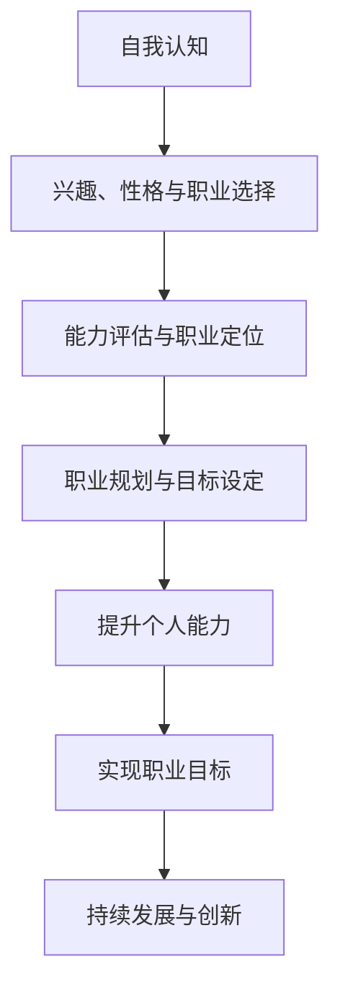

                 

### 文章标题

# 《创业者如何建立个人职业发展规划》

---

**关键词：** 自我认知、职业规划、目标设定、能力提升、职业发展、创业者

**摘要：** 本文旨在为创业者提供一套系统的职业发展规划方法论，通过自我认知与定位、职业规划与目标设定、能力提升、实现职业目标等多个方面，帮助创业者明确职业发展路径，持续成长与进步，实现个人职业生涯的辉煌。

---

## 《创业者如何建立个人职业发展规划》目录大纲

### 第一部分：自我认知与定位

### 第1章：自我认知的重要性

- 1.1 自我认知的基本概念  
- 1.2 自我认知与职业发展的关系  
- 1.3 自我认知的方法

### 第2章：兴趣、性格与职业选择

- 2.1 兴趣与职业选择的关系  
- 2.2 性格与职业匹配  
- 2.3 如何发现并探索自己的兴趣

### 第3章：能力评估与职业定位

- 3.1 能力评估的重要性  
- 3.2 自我能力评估的方法  
- 3.3 职业定位的策略

### 第二部分：职业规划与目标设定

### 第4章：职业规划的概念与原则

- 4.1 职业规划的基本概念  
- 4.2 职业规划的原则  
- 4.3 职业规划的方法

### 第5章：设定明确的目标

- 5.1 目标设定的原则  
- 5.2 SMART目标  
- 5.3 如何设定自己的职业目标

### 第6章：制定行动计划

- 6.1 行动计划的重要性  
- 6.2 行动计划的制定方法  
- 6.3 行动计划的执行与调整

### 第三部分：提升个人能力

### 第7章：学习与成长

- 7.1 持续学习的必要性  
- 7.2 学习的方法与技巧  
- 7.3 成长的心态与策略

### 第8章：提升职业技能

- 8.1 职业技能的种类  
- 8.2 提升职业技能的方法  
- 8.3 职业技能的提升路径

### 第9章：建立人脉网络

- 9.1 人脉的重要性  
- 9.2 建立人脉的方法  
- 9.3 人脉网络的维护与管理

### 第四部分：实现职业目标

### 第10章：职业发展的策略

- 10.1 职业发展的路径  
- 10.2 职业转换的策略  
- 10.3 职业晋升的策略

### 第11章：实现职业目标

- 11.1 实现职业目标的步骤  
- 11.2 遇到挑战与困境的应对  
- 11.3 职业目标的实现与评估

### 第12章：持续发展与创新

- 12.1 持续发展的意义  
- 12.2 创新的方法与技巧  
- 12.3 如何保持持续发展

### 附录

### 附录 A：职业规划工具与方法

- A.1 SWOT分析法  
- A.2 职业规划软件推荐

### 附录 B：创业者成功案例

- B.1 某创业者成功经验分享  
- B.2 某创业者失败案例分析

### 附录 C：参考资料与推荐阅读

- C.1 相关书籍推荐  
- C.2 职业规划网站推荐

---

**核心概念与联系：**

使用Mermaid绘制核心概念关系图：



---

### 核心算法原理讲解

**自我认知评估算法：**

```python
# 自我认知评估算法
def self_assessment():
    # 输入自我认知的指标
    interests = input("请输入你的兴趣爱好：")
    personality = input("请输入你的性格类型：")
    skills = input("请输入你的技能：")
    
    # 分析兴趣、性格与技能
    interest_score = analyze_interests(interests)
    personality_score = analyze_personality(personality)
    skills_score = analyze_skills(skills)
    
    # 输出评估结果
    print("你的兴趣得分：", interest_score)
    print("你的性格得分：", personality_score)
    print("你的技能得分：", skills_score)

# 调用算法
self_assessment()
```

---

### 数学模型和数学公式详细讲解 & 举例说明

**目标设定公式：**

在职业规划中，目标设定的SMART原则是非常重要的。SMART分别代表：

- S(Specific): 具体的
- M(Measurable): 可衡量的
- A(Attainable): 可实现的
- R(Relevant): 相关的
- T(Time-bound): 有时间限制的

一个SMART目标可以表示为：

\[ \text{目标} = \text{具体的任务} + \text{可衡量的指标} + \text{可实现的条件} + \text{相关的领域} + \text{时间限制} \]

**举例说明：**

假设一个创业者希望在接下来的一年里实现公司的业务增长，那么一个SMART目标可以设定为：

\[ \text{目标} = \text{实现公司业务增长} + \text{增加50%的年营收} + \text{在现有市场基础上拓展新客户群体} + \text{相关的领域：市场营销、销售和客户服务} + \text{时间限制：接下来的一年} \]

---

通过上述核心概念关系图、核心算法原理讲解和数学模型举例，创业者可以更好地理解如何建立个人职业发展规划。在接下来的章节中，我们将逐步深入探讨自我认知、职业规划、目标设定、能力提升和实现职业目标等方面的具体方法和策略。希望这些内容能为您的职业生涯带来启发和指导。让我们一步步迈向成功的职业发展之路！### 第一部分：自我认知与定位

创业者的成功很大程度上取决于对自我的深刻认知和精准定位。这一部分将帮助我们深入了解自我认知的重要性，并学会如何进行自我认知、兴趣与性格评估以及能力评估与职业定位。

#### 第1章：自我认知的重要性

**1.1 自我认知的基本概念**

自我认知，即对自身的了解和认识，是个人成长与发展的基石。它包括对自身兴趣、性格、能力、价值观等方面的认识。自我认知不仅帮助我们发现自我潜能，还能明确我们的优势和劣势，从而做出更明智的职业选择。

**1.2 自我认知与职业发展的关系**

自我认知对职业发展至关重要。只有了解自己，我们才能找到与自己兴趣和能力相匹配的职业路径，避免盲目跟风或错失发展机会。自我认知还能帮助我们更好地规划职业发展，设定切实可行的目标，并持续提升个人能力。

**1.3 自我认知的方法**

进行自我认知，可以通过以下几种方法：

- **反思法**：定期回顾自己的行为和思考，分析成功和失败的原因。
- **反馈法**：从他人的评价中了解自己的优点和不足。
- **测试法**：通过专业的性格测试、兴趣测试等工具，获取科学的数据支持。
- **实践法**：通过实际工作或实习，体验不同职业角色，发现自我兴趣和偏好。

**案例分享：**创业者张华在一次反思中，意识到自己对技术创新有浓厚兴趣，于是决定投身人工智能领域。通过多次实践和自我调整，张华成功创立了一家专注于人工智能应用的公司，取得了显著成绩。

#### 第2章：兴趣、性格与职业选择

**2.1 兴趣与职业选择的关系**

兴趣是职业选择的重要驱动力。对某一领域有浓厚的兴趣，能让人在该领域保持持久的学习热情和动力，从而更容易取得成功。

**2.2 性格与职业匹配**

性格特征在一定程度上决定了个人在特定职业中的适应性和表现。例如，外向型性格的人适合从事需要与人交流较多的职业，而内向型性格的人则更适合独立思考和工作的职业。

**2.3 如何发现并探索自己的兴趣**

- **方法一：回顾童年经历**：童年的喜好和梦想往往能反映出我们的潜在兴趣。
- **方法二：尝试不同领域**：通过实际工作和实习，了解各个领域的职业特点和自身适应度。
- **方法三：咨询专业人士**：职业规划师或导师可以提供有价值的建议和指导。
- **方法四：利用兴趣测评工具**：通过专业的兴趣测评，获取科学的数据支持。

**案例分享：**创业者李明在大学期间尝试了多个领域，最终发现对互联网创业充满兴趣。他通过不断学习和实践，成功创立了一家互联网公司，实现了自己的创业梦想。

#### 第3章：能力评估与职业定位

**3.1 能力评估的重要性**

能力评估是职业定位的关键步骤。通过评估自身的能力，我们可以明确自己在职场中的竞争优势和潜力，从而做出更有针对性的职业选择。

**3.2 自我能力评估的方法**

- **方法一：自我反思**：回顾自己的学习和工作经历，总结自己的能力和成就。
- **方法二：请教他人**：向同事、朋友、导师等请教对自身能力的评价。
- **方法三：利用能力测评工具**：通过专业的能力测评，获取详细的数据支持。

**3.3 职业定位的策略**

- **方法一：匹配法**：将自身的能力与职业要求进行匹配，选择最适合自己的职业。
- **方法二：拓展法**：在现有能力基础上，通过学习和实践拓展自己的能力范围。
- **方法三：创新法**：结合自身独特的能力和兴趣，开拓新的职业领域。

**案例分享：**创业者王强在职业评估中发现自己在项目管理方面有突出能力，于是选择投身互联网创业，成立了一家专注于项目管理咨询的公司。通过不断创新和拓展，他的公司逐渐成为行业内的佼佼者。

通过以上三个章节的探讨，创业者应能够更清晰地了解自我认知的重要性，掌握兴趣、性格与职业选择的方法，以及进行能力评估与职业定位的策略。在接下来的章节中，我们将进一步探讨职业规划与目标设定、能力提升与实现职业目标等方面的内容。希望这些内容能为您的职业生涯带来启示和指导。

### 第1章：自我认知的重要性

**1.1 自我认知的基本概念**

自我认知，是指个体对自己的认识和理解，包括但不限于自我感知、自我评价、自我反思和自我意识等方面。它不仅仅局限于对自身外在特征的认识，更涉及对自身内在性格、价值观、兴趣、能力等深层次因素的理解。自我认知是一个动态的过程，随着个体经历和环境变化，认知也会不断更新和调整。

在职业发展中，自我认知的重要性不言而喻。首先，自我认知帮助我们明确自己的优势和劣势，从而更好地发挥自身优势，克服不足。这种自我认知可以避免我们在职业选择和决策过程中盲目跟风，导致资源浪费和机会丧失。其次，自我认知有助于我们设定符合自身实际情况的职业目标，并制定实现这些目标的合理策略。最后，自我认知还能帮助我们保持自我成长和进步的动力，激发内在潜能，从而在职场中不断取得新的突破。

**1.2 自我认知与职业发展的关系**

自我认知对职业发展有着深远的影响。首先，自我认知可以帮助我们明确职业方向。在职业生涯的早期阶段，很多人可能对自己的职业兴趣和潜力并不清晰。通过自我认知，我们可以更准确地了解自己的兴趣、能力和价值观，从而找到与自己匹配的职业领域。例如，一个人可能在技术方面有卓越的才能，同时在创新和解决问题的过程中感受到巨大的满足感，那么从事软件开发或科技创新领域可能会是他最佳的选择。

其次，自我认知有助于我们设定职业目标。在职业发展的过程中，我们需要不断设定新的目标和挑战自己。如果没有清晰的自我认知，我们可能会设定过于理想化或不切实际的目标，导致挫败感和失望。相反，通过自我认知，我们可以设定更加具体、可行且具有挑战性的目标，这样不仅能激发我们的内在动力，还能提高实现目标的概率。

此外，自我认知还能帮助我们进行有效的职业规划。职业规划不仅包括短期目标，还包括长期的发展方向和路径。通过自我认知，我们可以了解自己的职业兴趣和潜力，从而制定出更加科学和有效的职业规划。例如，一个人可能发现自己的领导能力和沟通能力很强，同时对自己在团队管理方面有着浓厚的兴趣，那么他可以选择向管理层方向发展，通过不断学习和实践，提升自己的领导力和管理能力。

**1.3 自我认知的方法**

自我认知是一个复杂的过程，需要多种方法和工具的支持。以下是一些常用的自我认知方法：

1. **反思法**：反思是自我认知的重要途径。通过定期回顾自己的行为、经历和思考，我们可以发现自己在不同情境下的表现和反应，从而深入理解自己的性格、兴趣和能力。例如，创业者张华通过每天晚上的反思，总结自己一天的工作和思考，逐渐发现了自己对技术创新的浓厚兴趣。

2. **反馈法**：他人的反馈也是自我认知的重要来源。通过听取同事、朋友、家人和导师的意见，我们可以了解自己在他人眼中的形象和行为模式。这种反馈可以是直接的表扬和批评，也可以是间接的行为观察和评价。例如，创业者李明的团队领导在一次会议上对他进行了表扬，这让他意识到自己在项目管理和团队协作方面有着出色的能力。

3. **测试法**：利用专业的性格测试、兴趣测试和能力测评工具，可以帮助我们获取更加科学和客观的自我认知数据。这些工具通常由心理学家和职业规划师设计，能够提供全面的评估报告，帮助我们了解自己在不同方面的能力和特点。例如，创业者王强通过参加职业兴趣测试，发现自己在创新和项目管理方面具有显著优势，这为他之后的职业选择提供了重要参考。

4. **实践法**：通过实际工作、实习或志愿服务等活动，我们可以亲身体验不同职业角色和工作环境，从而更直观地了解自己的兴趣和适应度。这种方法不仅能帮助我们发现自己的潜在兴趣和能力，还能积累实际工作经验，为未来的职业发展打下基础。例如，创业者李明在大学期间通过实习，了解了互联网创业的各个环节，这为他之后的创业奠定了坚实的基础。

**案例分享**：

创业者张华在职业生涯初期，对自己的兴趣和优势并不清楚。他通过反思自己的行为和经历，逐渐发现自己在技术创新方面有浓厚的兴趣和出色的能力。随后，他参加了一次职业兴趣测试，测试结果进一步确认了他的兴趣点。在得到了这些信息后，张华决定投身人工智能领域，并成功创办了一家技术创新公司。通过不断学习和实践，他的公司在短短几年内迅速崛起，成为行业的领军企业。

创业者李明在大学期间，通过多次实习和参与项目，逐步发现了自己对互联网创业的浓厚兴趣。他的导师在一次谈话中建议他尝试创业，这让他有了创业的初步想法。随后，李明参加了一次领导力测评，结果显示他在领导能力和团队协作方面有着突出的优势。这些发现和反馈促使他坚定了创业的决心，并最终成功创办了一家互联网公司，业务涵盖多个领域，取得了显著的成绩。

创业者王强在职业评估中发现自己在项目管理方面有显著优势。他通过参加多个项目管理培训和实际项目的管理实践，不断提升自己的项目管理能力和领导力。在创业过程中，王强利用这些能力，成功带领团队完成了多个大型项目，为公司的发展奠定了坚实的基础。通过不断地自我认知和提升，王强不仅实现了自己的职业目标，还成为了行业内的知名创业者和导师。

通过以上案例，我们可以看到自我认知在职业发展中的重要作用。只有通过自我认知，我们才能找到适合自己的职业路径，设定合理的目标，并不断提升自己的能力，从而实现职业生涯的辉煌。

### 第2章：兴趣、性格与职业选择

**2.1 兴趣与职业选择的关系**

兴趣是职业选择的重要驱动力。对某一领域有浓厚的兴趣，能让人在该领域保持持久的学习热情和动力，从而更容易取得成功。心理学家亚伯拉罕·马斯洛（Abraham Maslow）曾提出，兴趣是人的基本需求之一，它与自我实现密切相关。一个人在从事自己感兴趣的工作时，往往会感到更加充实和满足，这种内在动力是推动职业发展的重要力量。

选择与自己兴趣相符的职业，不仅能提升工作效率，还能增加工作满意度。当一个人对自己的工作充满热情时，他们会更加投入，愿意付出额外的努力去克服困难，这种积极的工作态度往往能带来更好的成果。此外，兴趣还可以激发创新思维，促使个人在职业生涯中不断寻求新的突破和挑战。

**2.2 性格与职业匹配**

性格特征在很大程度上决定了个人在特定职业中的适应性和表现。不同的职业对性格特征有不同的要求，因此了解自己的性格类型，选择与之匹配的职业，能够提升工作满意度和职业成就感。

例如，外向型性格的人通常适合从事需要与人沟通和互动较多的职业，如销售、市场营销、客户服务等。外向型的人善于表达和沟通，能够迅速建立人际关系，适合在团队环境中工作。而内向型性格的人则更适合从事需要独立思考和工作的职业，如研发、编程、设计等。内向型的人通常善于思考，能够深入分析和解决问题。

此外，其他性格特征，如尽责性、神经质、开放性等，也对职业选择有重要影响。尽责性高的人通常适合从事需要严谨和细致的职业，如会计、审计、项目管理等。神经质高的人可能更适合从事需要应对压力和挑战的职业，如医疗、法律等。开放性高的人则更适合从事需要创新和探索的职业，如科研、艺术、设计等。

**2.3 如何发现并探索自己的兴趣**

发现并探索自己的兴趣是一个逐步深入的过程，以下是一些有效的方法：

**方法一：回顾童年经历**

童年时期，我们的兴趣和爱好往往是最自然和纯粹的。通过回顾童年，我们可以发现自己早期对什么事物感兴趣，这些早期的兴趣可能成为我们未来职业选择的线索。例如，一个小时候喜欢绘画的孩子，长大后可能会对艺术设计或平面设计产生浓厚的兴趣。

**方法二：尝试不同领域**

通过实际工作和实习，我们可以亲身体验不同职业的角色和特点，从而发现哪些领域真正吸引自己。例如，一个大学生可以通过多次实习，了解市场营销、软件开发、人力资源等不同领域的职业内容和挑战，最终找到与自己兴趣相符的职业方向。

**方法三：利用兴趣测评工具**

专业的兴趣测评工具可以通过科学的方法，帮助我们了解自己在不同领域的兴趣程度。这些测评通常包括问卷、性格测试等，能够提供详细的分析报告，帮助我们更清晰地认识自己的兴趣和潜力。例如，霍兰德职业兴趣测试（Holland Code Test）是一种广泛使用的职业兴趣测评工具，它通过分析个体在六个主要兴趣领域（现实型、研究型、艺术型、社会型、企业型和常规型）的表现，提供职业建议。

**方法四：咨询专业人士**

职业规划师或导师可以提供有价值的建议和指导，帮助我们更好地认识自我，找到适合自己的职业方向。他们通过专业的知识和经验，能够为我们提供全面的评估和个性化的建议，帮助我们做出更明智的职业选择。

**案例分享**：

创业者李华在大学期间对市场营销和广告设计产生了浓厚的兴趣。他在课后参加了多个与这些领域相关的项目，并通过实习积累了宝贵的工作经验。通过这些实践，李华逐渐发现自己在创意策划和品牌营销方面有独特的天赋。毕业后，他决定投身广告行业，创办了一家专注于品牌营销的公司。凭借对行业的深入理解和丰富的实践经验，他的公司迅速在市场上崭露头角，成为行业内的佼佼者。

创业者张丽在职业生涯初期对自己的兴趣和职业方向感到迷茫。她通过回顾童年，发现小时候喜欢阅读和写作，这让她意识到自己对文字和创意有浓厚的兴趣。随后，她参加了一次职业兴趣测评，结果显示她在写作和传播领域有很高的兴趣度。在得到这些信息后，张丽决定转向媒体行业，成为一名专业的内容创作者。通过不断学习和实践，她在短短几年内成为了一名知名作家，出版了多部畅销书籍。

创业者王强在职业选择过程中，通过多次实习和项目实践，逐渐发现自己在技术创新和项目管理方面有突出的才能。他在一次职业规划咨询中，了解到自己的领导力和团队合作能力很强，这让他决定投身创业领域。在创业初期，王强带领团队研发了一款创新产品，取得了显著的市场成功。凭借对技术和市场的深刻理解，他的公司在短短几年内迅速成长，成为行业内的领军企业。

通过以上案例，我们可以看到兴趣和性格在职业选择中的重要性。只有通过深入探索和了解自己的兴趣和性格，我们才能找到真正适合自己的职业方向，并在职业生涯中取得辉煌的成就。在接下来的章节中，我们将进一步探讨能力评估与职业定位的方法，帮助创业者更科学地规划自己的职业生涯。

### 第3章：能力评估与职业定位

**3.1 能力评估的重要性**

能力评估是职业规划的核心环节之一。通过准确评估自身的能力，创业者可以明确自己的竞争优势和短板，从而做出更加科学和合理的职业选择。能力评估不仅有助于我们了解自己的实际能力水平，还能帮助我们识别未来需要提升和发展的方向，为职业发展提供明确的目标和路径。

首先，能力评估有助于我们找到适合自己的职业方向。每个人的能力都有其独特性，不同的职业对能力的要求也各不相同。通过能力评估，我们可以发现自己在哪些方面具有优势，这些优势可以帮助我们选择与自身能力相匹配的职业，从而在职业生涯中更好地发挥自己的潜能。

其次，能力评估有助于我们制定职业发展计划。通过了解自己的能力和短板，创业者可以制定针对性的学习和发展计划，不断提升自身能力。例如，一个在技术方面有突出能力的人可以选择从事软件开发或科技创新领域，而在管理和领导力方面有优势的人可以选择向管理层方向发展。这样，创业者可以根据自己的能力特长，有计划地提升自己的职业竞争力。

此外，能力评估还能帮助我们识别职业发展的瓶颈。当我们在职业生涯中遇到发展瓶颈时，通过能力评估可以发现是哪个方面的问题，从而有针对性地进行改进和提升。例如，一个创业者可能在营销和推广方面遇到困难，通过能力评估发现自己在这些方面有所欠缺，那么他可以针对性地学习营销知识和技能，从而突破瓶颈，实现职业发展的新突破。

**3.2 自我能力评估的方法**

进行自我能力评估，可以采用以下几种方法：

**方法一：自我反思**

自我反思是一种常用的自我评估方法。通过回顾自己的行为和经历，创业者可以识别自己的优点和不足，从而进行自我评估。这种方法需要定期进行，以便不断更新和调整自我认知。例如，创业者可以每周或每月进行一次自我反思，总结自己在过去一段时间内的表现和收获，分析成功和失败的原因。

**方法二：请教他人**

请教他人是一种获取外部评价的有效方法。通过向同事、朋友、家人或导师请教，创业者可以了解他人对自己的看法和评价，从而更全面地认识自己。这种方法不仅可以获取多方面的反馈，还能帮助我们识别自身可能忽视的方面。例如，创业者可以定期与导师或职业顾问进行交流，获取专业的意见和建议。

**方法三：利用能力测评工具**

专业的能力测评工具可以帮助我们获取科学和客观的能力评估数据。这些工具通常由心理学家和职业规划师设计，能够提供全面的评估报告。例如，创业者可以通过参加职业能力测评，了解自己在不同能力领域的表现和潜力。这种方法的优点是能够提供量化的评估结果，帮助我们更直观地了解自身能力。

**方法四：实践检验**

通过实际工作和实习，创业者可以在真实的工作环境中检验和提升自己的能力。这种方法不仅能够帮助我们了解自身能力的实际水平，还能积累宝贵的工作经验。例如，创业者可以通过参与项目、实习或志愿服务等活动，锻炼自己的能力，并从中发现自身的优势和不足。

**3.3 职业定位的策略**

在完成能力评估后，创业者需要根据评估结果进行职业定位。以下是一些有效的职业定位策略：

**策略一：匹配法**

匹配法是指将自身的能力与职业要求进行匹配，选择最适合自己的职业。这种方法的核心在于找到能够充分发挥自身优势的职业。例如，一个在技术方面有突出能力的人可以选择从事软件开发或科技创新领域，而在管理和领导力方面有优势的人可以选择向管理层方向发展。

**策略二：拓展法**

拓展法是指在现有能力基础上，通过学习和实践拓展自己的能力范围。这种方法可以帮助创业者不断突破自己的职业瓶颈，实现职业发展的新高度。例如，一个在技术领域有扎实基础的人可以通过学习管理知识和技能，拓展自己的职业发展路径，成为技术与管理相结合的复合型人才。

**策略三：创新法**

创新法是指结合自身独特的能力和兴趣，开拓新的职业领域。这种方法需要创业者具备创新思维和敏锐的市场洞察力，能够在传统职业领域中发现新的机会和方向。例如，一个在科技领域有独特见解的人可以尝试进军新兴科技领域，如人工智能、区块链等，从而实现职业发展的突破。

**案例分享**：

创业者张华在职业生涯初期，通过自我反思和请教他人，发现自己在项目管理和技术创新方面有突出能力。他决定选择项目管理作为自己的职业方向，并通过参加项目管理培训和实际项目经验，不断提升自己的能力。在职业发展的过程中，张华成功地管理了多个大型项目，成为公司的重要骨干。随后，他决定创业，成立了一家专注于技术创新的公司，凭借丰富的项目经验和创新思维，他的公司迅速在市场上崭露头角，取得了显著的成绩。

创业者李明在职业评估中发现自己在市场营销和创意策划方面有显著优势。他通过拓展法，不仅掌握了市场营销的知识和技能，还积累了丰富的创意策划经验。在创业初期，李明利用这些能力，成功策划了一系列市场推广活动，为公司赢得了大量客户和市场份额。随着公司的发展，李明逐渐转型为一名创业导师，帮助更多创业者实现职业梦想。

创业者王强在职业评估中发现自己在技术创新和领导力方面有突出的能力。他决定选择创业作为自己的职业方向，并利用创新法，结合自身的优势和市场需求，开发了一系列创新产品。在创业过程中，王强带领团队克服了重重困难，最终成功将公司打造成行业内的领军企业。凭借对技术创新的敏锐洞察和强大的领导力，王强成为了一名备受尊敬的创业家和行业领袖。

通过以上案例，我们可以看到能力评估和职业定位在职业发展中的重要性。只有通过准确的能力评估和科学的职业定位，创业者才能找到适合自己的职业路径，实现职业发展的辉煌。在接下来的章节中，我们将进一步探讨职业规划与目标设定、能力提升与实现职业目标等方面的内容，帮助创业者打造成功的职业生涯。

### 第4章：职业规划的概念与原则

**4.1 职业规划的基本概念**

职业规划是指个人在职业发展过程中，通过自我认知、目标设定、路径选择和行动实施，有计划地规划和管理自己的职业生涯。它不仅关注短期职业目标，还包括长期职业发展的方向和路径。职业规划的核心目标是实现个人职业发展的最优化和最大化，使个人在职业领域中取得成功和满足。

职业规划通常包括以下几个关键步骤：

1. **自我评估**：通过反思、反馈、测试等方法，全面了解自己的兴趣、能力、价值观和职业目标。
2. **目标设定**：根据自我评估结果，设定具体、可行且具有挑战性的职业目标。
3. **路径选择**：分析实现目标所需的条件和资源，选择合适的职业路径和策略。
4. **行动计划**：制定具体的行动计划，包括学习、实践、拓展和提升等。
5. **执行与调整**：根据实际情况，执行行动计划，并及时调整和优化职业规划。

**4.2 职业规划的原则**

职业规划需要遵循以下原则，以确保其科学性和有效性：

1. **SMART原则**：目标设定要遵循SMART原则，即具体（Specific）、可衡量（Measurable）、可实现（Attainable）、相关（Relevant）和有时间限制（Time-bound）。这有助于确保目标的明确性和可执行性。
2. **适应性原则**：职业规划需要根据个人和环境的变化进行及时调整，以保持其适用性和前瞻性。例如，当市场环境发生变化时，职业规划也需要做出相应的调整。
3. **持续性原则**：职业规划是一个持续的过程，需要个人在职业生涯的不同阶段不断更新和优化。例如，每年进行一次职业规划的回顾和调整，以确保其与个人发展需求保持一致。
4. **综合发展原则**：职业规划不仅要关注专业技能的提升，还要注重软技能的培养，如沟通、团队合作、领导力等。这些软技能在职业发展中同样重要，能够帮助个人在职场中更好地适应和应对各种挑战。
5. **长期性原则**：职业规划应具有长期视角，关注未来几年甚至更长时间的职业发展。通过设定长期目标，个人可以更好地规划和准备自己的职业生涯。

**4.3 职业规划的方法**

以下是几种常用的职业规划方法：

1. **SWOT分析法**：通过分析自身的优势（Strengths）、劣势（Weaknesses）、机会（Opportunities）和威胁（Threats），制定职业规划。这种方法有助于全面了解个人和环境，为职业选择和策略提供依据。

2. **职业兴趣测试**：利用专业的职业兴趣测试工具，如霍兰德职业兴趣测试，了解自己在不同领域的兴趣和匹配度。这种方法可以帮助个人找到与自己兴趣相符的职业方向。

3. **职业价值观评估**：通过评估个人的职业价值观，了解自己在哪些方面更看重，从而选择与自己价值观相符的职业。这种方法有助于确保个人在职业选择中保持一致性和满足感。

4. **目标设定法**：根据SMART原则，设定具体、可行、相关且有时间限制的职业目标。这种方法有助于明确职业方向，并制定具体的行动计划。

5. **行动计划法**：制定详细的行动计划，包括学习、实践、拓展和提升等。这种方法有助于确保职业规划的实施和落实。

**案例分享**：

创业者王琳在职业规划中，通过SWOT分析法，分析了自己的优势（技术能力强、具备创业精神）、劣势（缺乏管理经验、市场敏感度较低）、机会（新兴技术领域快速发展、创业环境逐渐完善）和威胁（市场竞争激烈、资源有限）。基于这些分析，她决定选择新兴技术领域创业，并制定了具体的职业目标，如完成技术突破、建立品牌知名度、实现财务自由等。

为了实现这些目标，王琳制定了详细的行动计划，包括参加技术培训、拓展人脉资源、进行市场调研和产品开发等。在执行过程中，王琳根据实际情况不断调整和优化计划，最终成功创办了一家技术公司，并在市场上取得了显著成绩。

通过以上内容，创业者应能够理解职业规划的基本概念和原则，掌握常用的职业规划方法。在接下来的章节中，我们将进一步探讨如何设定明确的目标，以及如何制定和执行行动计划，帮助创业者实现职业发展的辉煌。

### 第5章：设定明确的目标

**5.1 目标设定的原则**

在职业规划中，目标设定是至关重要的步骤。设定明确的目标不仅能够帮助我们聚焦精力，还能提供方向感和动力。为了确保目标的有效性，需要遵循以下原则：

**SMART原则**

SMART原则是一个广泛使用的目标设定方法，它包括以下五个方面：

- **S(Specific)：具体**：目标应当清晰明确，具体描述自己想要达成的结果。例如，“提升技术能力”不如“掌握Python编程语言”具体。
- **M(Measurable)：可衡量**：目标应当有明确的衡量标准，以便我们了解是否达成目标。例如，可以设定“在三个月内完成100个Python编程项目”作为衡量标准。
- **A(Attainable)：可实现**：目标应当是切实可行的，考虑到自身的资源和能力。设定过高的目标可能导致失望和挫败感。
- **R(Relevant)：相关**：目标应当与我们的职业目标和个人价值观相关。例如，一个创业者设定“在三个月内获得1000万元投资”可能不符合个人长期发展计划。
- **T(Time-bound)：有时间限制**：目标应当有时间限制，以便我们有一个明确的时间表。例如，设定“在2024年底前完成公司产品上线”可以提供明确的时间框架。

**SMART目标示例**

假设一个创业者希望在2024年底前实现公司的产品上线。那么，一个SMART目标可以设定为：

“在2024年底前，通过完成市场调研、产品设计和开发，实现产品的功能上线，并在市场上获得第一批用户。”

这个目标具体、可衡量、可实现、相关且有时间限制，符合SMART原则。

**5.2 SMART目标**

SMART目标是一个系统的目标设定方法，通过将目标分解为具体的、可衡量的、可实现的相关目标和时间限制，有助于我们更加清晰地理解和追求目标。

**S(Specific)：具体**

具体的目标应当明确描述我们想要达成的结果。例如，一个创业者设定目标是“提升公司销售额”，这比较模糊。相反，设定为“在2024年第三季度，将公司销售额提升至1000万元”，则更具体。

**M(Measurable)：可衡量**

可衡量的目标有助于我们了解是否达成目标。例如，“提升技术能力”是一个模糊的目标，而“在接下来的一年里，通过完成50个技术项目，提升自己的技术水平”则更可衡量。

**A(Attainable)：可实现**

可实现的目标需要考虑我们的资源和能力。设定过高的目标可能导致挫败和失望。例如，一个初创公司设定目标是“在一年内实现全球市场布局”，这可能是不可实现的。相反，设定为“在接下来的一年里，将产品推广到国内主要市场”，则更可实现。

**R(Relevant)：相关**

相关的目标应当与我们的职业目标和个人价值观一致。例如，一个创业者设定目标是“成为行业领袖”，这与他个人的价值观和职业目标相关。相反，如果他的目标是“成为行业领袖”，但这与他的兴趣和价值观不符，那么这个目标可能不相关。

**T(Time-bound)：有时间限制**

有时间限制的目标有助于我们设定明确的时间表。例如，设定为“在2025年底前，实现公司的财务自由”，则提供了具体的时间框架。没有时间限制的目标，例如“提升技术能力”，可能会无限期拖延。

**5.3 如何设定自己的职业目标**

为了设定自己的职业目标，可以遵循以下步骤：

**步骤一：自我评估**

通过反思、反馈、测试等方法，全面了解自己的兴趣、能力、价值观和职业目标。例如，通过职业兴趣测试和价值观评估，可以更清晰地了解自己的兴趣和价值观。

**步骤二：确定长期目标**

基于自我评估结果，确定长期职业目标。例如，一个创业者可能设定长期目标是“在五年内，成为行业内领先的科技公司”。

**步骤三：分解长期目标**

将长期目标分解为短期目标，以便更容易实现。例如，将“在五年内，成为行业内领先的科技公司”分解为“在第一年，实现产品的初步市场测试；在第二年，拓展市场份额；在第三年，实现盈利等”。

**步骤四：设定SMART目标**

根据分解后的短期目标，设定具体的SMART目标。例如，将“在第二年，拓展市场份额”设定为“在2025年第二季度，通过市场推广活动，将产品销售范围拓展到国内五个主要城市”。

**步骤五：制定行动计划**

根据SMART目标，制定具体的行动计划。例如，为“在2025年第二季度，通过市场推广活动，将产品销售范围拓展到国内五个主要城市”，制定以下行动计划：

- **第一季度：** 完成市场调研，了解目标市场的需求和竞争情况。
- **第二季度：** 开展市场推广活动，包括广告投放、促销活动、合作伙伴关系等。
- **第三季度：** 收集市场反馈，调整推广策略，优化产品功能。
- **第四季度：** 评估市场推广效果，总结经验教训，为下一季度做好准备。

通过以上步骤，创业者可以更加科学地设定和实现自己的职业目标。在设定目标的过程中，重要的是保持SMART原则，确保目标的明确性、可衡量性、可实现性、相关性和时间限制。这样，我们才能更加聚焦和高效地追求职业目标，实现个人职业发展的辉煌。

### 第6章：制定行动计划

**6.1 行动计划的重要性**

行动计划是职业规划的核心组成部分，是实现职业目标的关键步骤。一个明确的行动计划能够帮助我们分解目标、分配资源、管理时间和监控进展，从而确保职业目标的实现。没有具体的行动计划，即使设定了宏伟的职业目标，也可能会因为缺乏执行力和执行力而难以实现。

首先，行动计划有助于分解目标。职业目标往往是长期的、抽象的，而通过制定行动计划，我们可以将这些大目标细化为一系列短期、具体的小目标，使得目标更加具体、可操作。例如，一个创业者的长期目标是“在五年内实现公司的财务自由”，通过制定行动计划，可以将这个目标细化为“在第一年实现产品初步市场测试，第二年扩大市场份额，第三年实现盈利等”。

其次，行动计划有助于分配资源。在实现职业目标的过程中，我们需要各种资源，如时间、资金、人力和知识等。通过制定详细的行动计划，我们可以明确每个阶段所需的资源，并合理分配和使用这些资源，避免资源浪费。例如，在制定产品市场推广计划时，需要明确所需的市场调研预算、广告投放费用、推广团队人员配置等。

再次，行动计划有助于管理时间。职业发展是一个持续的过程，需要我们在不同阶段投入时间和精力。通过制定详细的行动计划，我们可以合理安排时间，确保每个任务都有明确的完成时间和优先级。例如，一个创业者在制定年度工作计划时，可以将年度目标分解为季度目标、月度目标和周计划，确保每个任务都有明确的时间安排和执行步骤。

最后，行动计划有助于监控进展。通过行动计划，我们可以定期评估和调整职业目标的实现情况，及时发现和解决问题。例如，创业者可以通过定期召开会议、回顾会议纪要、更新进度表等方式，监控项目进展，确保各项工作按计划进行。

**6.2 行动计划的制定方法**

制定有效的行动计划需要以下步骤：

**步骤一：明确目标**

首先，明确我们想要实现的职业目标。这些目标可以是长期目标，也可以是短期目标，但必须具体、可衡量、可实现、相关且有时间限制。

**步骤二：分解目标**

将长期目标分解为短期目标，以便更容易实现。每个短期目标都应当是具体、可衡量的，并且能够为长期目标做出贡献。

**步骤三：确定关键任务**

根据短期目标，确定实现目标所需的关键任务。这些任务应当是具体的、可操作的，并且能够为短期目标做出贡献。

**步骤四：制定时间表**

为每个关键任务制定具体的时间表，包括开始时间、结束时间和优先级。时间表应当合理、可行，并且能够确保关键任务的按时完成。

**步骤五：分配资源**

为每个关键任务分配所需的资源，如时间、资金、人力和知识等。确保资源充足，并且能够支持任务的顺利执行。

**步骤六：设定监控机制**

为每个关键任务设定监控机制，包括定期检查进度、更新进度表、召开进度汇报会议等。确保能够及时发现和解决问题。

**案例：**

假设一个创业者的长期目标是“在五年内，成为行业内领先的科技公司”，可以通过以下步骤制定行动计划：

**步骤一：明确目标**

- 长期目标：在五年内，成为行业内领先的科技公司。

**步骤二：分解目标**

- 短期目标1：在第一年，实现产品的初步市场测试。
- 短期目标2：在第二年，扩大市场份额。
- 短期目标3：在第三年，实现盈利。

**步骤三：确定关键任务**

- 短期目标1的关键任务：完成产品研发、市场调研、制定营销策略等。
- 短期目标2的关键任务：扩大生产规模、开展市场推广、优化客户服务等。
- 短期目标3的关键任务：提高产品质量、降低成本、加强市场竞争力等。

**步骤四：制定时间表**

- 短期目标1的时间表：第一年第一季度完成产品研发，第二季度进行市场调研，第三季度制定营销策略。
- 短期目标2的时间表：第二年第一季度扩大生产规模，第二季度开展市场推广，第三季度优化客户服务。
- 短期目标3的时间表：第三年第一季度提高产品质量，第二季度降低成本，第三季度加强市场竞争力。

**步骤五：分配资源**

- 短期目标1的资源：研发团队、市场调研资金、营销策略团队。
- 短期目标2的资源：生产设备、市场推广预算、客户服务团队。
- 短期目标3的资源：质量检测团队、成本控制团队、市场竞争力分析团队。

**步骤六：设定监控机制**

- 定期召开项目进度汇报会议，每季度更新进度表，确保关键任务按时完成。

通过以上步骤，创业者可以制定出具体的行动计划，确保职业目标的顺利实现。

### 第7章：学习与成长

**7.1 持续学习的必要性**

在快速变化的商业环境中，创业者必须具备持续学习的能力，以应对新的挑战和机遇。持续学习不仅能够提升个人技能和知识储备，还能帮助创业者保持竞争优势和创新能力。随着技术进步和市场变化，新的商业模式、管理理念和创新工具层出不穷，创业者如果停滞不前，很可能会被市场淘汰。因此，持续学习成为创业者实现职业发展的关键要素。

首先，持续学习有助于创业者掌握最新的行业动态和技术趋势。通过学习，创业者可以了解到行业的发展方向和新兴技术，从而抓住市场机遇。例如，区块链技术的兴起给金融行业带来了巨大变革，了解并掌握这一技术将有助于创业者在这个领域取得突破。

其次，持续学习有助于创业者提升自身的综合素质。除了专业知识和技能外，创业者还需要具备良好的沟通能力、团队协作能力和领导力。这些软技能在创业过程中同样至关重要。通过不断学习，创业者可以提升这些能力，从而更好地应对复杂的工作环境和挑战。

此外，持续学习还能激发创业者的创新思维和创造力。在快速变化的市场环境中，创新是创业者成功的关键。通过学习，创业者可以接触到新的观念、方法和工具，从而激发灵感，实现产品和服务的创新。例如，苹果公司创始人史蒂夫·乔布斯（Steve Jobs）就因其卓越的创新思维而成为全球创业者的榜样。

**7.2 学习的方法与技巧**

为了实现持续学习，创业者需要掌握有效的学习方法和技巧。以下是一些建议：

**方法一：主动学习**

主动学习是指主动寻找学习机会，而不是被动接受信息。创业者可以通过以下方式实现主动学习：

- **参加培训课程**：参加专业培训课程，可以系统性地学习某一领域的知识。例如，创业者可以参加管理培训课程，提升领导力和管理技能。
- **在线学习平台**：利用在线学习平台，如Coursera、edX、Udemy等，学习各种专业课程和技能。这些平台提供了丰富的学习资源，可以满足不同学习需求。
- **阅读书籍和文章**：阅读是提升知识水平的重要途径。创业者可以通过阅读专业书籍、行业报告和学术论文，了解最新的行业动态和技术趋势。

**方法二：实践学习**

实践学习是指通过实际操作和应用来提升知识和技能。创业者可以通过以下方式实现实践学习：

- **参与项目**：通过参与实际项目，创业者可以将所学知识应用到实践中，提升实际操作能力。例如，创业者可以参与创业项目，将理论知识转化为实际操作。
- **实践演练**：创业者可以通过模拟练习来提升技能。例如，创业者可以模拟市场推广活动，提前熟悉流程和应对策略。

**方法三：互动学习**

互动学习是指通过与他人交流和合作来学习。创业者可以通过以下方式实现互动学习：

- **参与行业会议**：参加行业会议和研讨会，可以结识行业专家和同行，分享经验和观点。这种互动有助于拓宽视野，获取新的灵感。
- **组建学习小组**：与同行组建学习小组，通过讨论和交流来学习。这种方法可以激发思维的碰撞，促进知识的共享和提升。

**方法四：反思学习**

反思学习是指通过反思自己的行为和经验来学习。创业者可以通过以下方式实现反思学习：

- **写学习日志**：记录自己的学习过程和心得体会，可以帮助创业者更好地总结和反思学习效果。
- **定期回顾**：定期回顾自己的学习进展和成果，可以发现不足和改进方向。

**案例分享**：

创业者李明是一名互联网创业者，他深知持续学习的重要性。为了提升自己的技术能力和管理技能，他参加了多门在线课程，包括数据结构、算法设计、项目管理等。他还积极参加行业会议和研讨会，与同行交流经验和观点。通过这些学习活动，李明不仅掌握了最新的技术趋势，还提升了管理能力和领导力。

此外，李明还通过实际项目来实践所学知识。他参与了一个区块链项目，负责区块链技术的研发和应用。通过实际操作，李明不仅掌握了区块链技术，还积累了丰富的项目经验。

李明的持续学习不仅提升了他的个人能力，也为公司的发展带来了巨大的推动力。他的公司在区块链领域取得了显著成绩，成为行业内的佼佼者。

通过以上案例，我们可以看到持续学习对创业者职业发展的重要性。创业者应当充分利用各种学习方法和技巧，不断提升自己的知识和技能，以应对快速变化的商业环境。在接下来的章节中，我们将探讨如何进一步提升职业技能和建立人脉网络，帮助创业者实现职业发展的辉煌。

### 第8章：提升职业技能

**8.1 职业技能的种类**

职业技能是指个人在特定职业领域内所需的知识、技能和能力。不同的职业对技能要求各不相同，但大体可以分为以下几类：

**技术技能**：技术技能是指与特定行业或领域相关的专业技能。例如，软件工程师需要掌握编程语言、数据库管理和系统架构等技能；市场营销人员需要了解市场分析、广告设计和公关策略等技能。

**软技能**：软技能是指个人在工作和生活中表现出的通用能力，如沟通能力、团队协作、领导力和解决问题的能力。这些技能在不同职业中都有重要作用，能够帮助个人更好地适应工作环境，提高工作效率。

**管理技能**：管理技能是指个人在组织和管理团队方面的能力。这包括项目管理、团队建设、决策制定和资源管理等。创业者和管理人员特别需要具备这些技能，以确保团队高效运作，实现组织目标。

**沟通技能**：沟通技能是指个人在表达、倾听和交流方面的能力。有效的沟通能够帮助个人更好地传达信息、解决问题和建立良好的人际关系。在职场中，沟通技能是成功的关键因素。

**8.2 提升职业技能的方法**

为了提升职业技能，创业者可以采取以下几种方法：

**方法一：参加培训课程**

参加专业培训课程是提升职业技能的有效途径。这些课程通常由行业专家或培训机构提供，内容涵盖最新的技术趋势、管理理念和实践经验。创业者可以选择在线课程或线下培训班，根据个人需求选择合适的课程。例如，创业者可以参加项目管理培训，学习如何高效地管理项目和团队。

**方法二：自主学习**

自主学习是指通过阅读书籍、观看视频教程和参与在线论坛等方式，自主学习和提升技能。这种方法灵活且成本较低，创业者可以根据自己的时间安排和学习节奏进行学习。例如，创业者可以通过阅读《创业维艰》（The Hard Thing About Hard Things）等创业经典书籍，学习成功创业者的经验和教训。

**方法三：实际操作**

实际操作是指通过参与实际项目和实践活动来提升技能。这种方法能够将理论知识转化为实际操作能力，帮助创业者更好地理解和应用所学知识。例如，创业者可以通过参与创业项目，负责具体的技术开发、市场推广或团队管理等工作，从而提升专业技能和管理能力。

**方法四：交流与合作**

交流与合作是指通过与行业专家、同行和团队成员进行交流和合作，学习新的知识和技能。这种方法能够拓展视野，获取新的见解和经验。创业者可以参加行业会议、研讨会和沙龙，结识行业专家和同行，分享经验和观点。此外，创业者还可以加入行业协会或专业社群，与业内人士保持密切联系。

**8.3 职业技能的提升路径**

为了系统地提升职业技能，创业者可以遵循以下提升路径：

**路径一：基础技能**

首先，创业者需要掌握基础技能，如编程语言、数据分析、市场研究等。这些基础技能是从事专业工作的基石，创业者可以通过参加在线课程、自学教程和参加专业培训课程来学习。

**路径二：专业领域**

在掌握基础技能后，创业者可以进一步深化专业技能，选择一个特定的领域进行深入学习。例如，创业者可以选择专注于软件开发、市场营销、财务管理等领域，通过参加专业培训、实际操作和交流合作，提升在该领域的专业技能。

**路径三：管理技能**

随着职业技能的提升，创业者需要逐步掌握管理技能，如项目管理、团队建设和决策制定等。这些技能对创业者实现职业目标至关重要。创业者可以通过参加管理培训、实际操作和反思学习，提升管理能力。

**路径四：持续学习**

职业技能的提升是一个持续的过程。创业者需要保持持续学习的态度，不断更新知识和技能。通过参加行业会议、阅读专业书籍和自主学习，创业者可以保持与行业同步，掌握最新的技术和管理理念。

**案例分享**：

创业者张华是一名软件工程师，他意识到提升职业技能对职业生涯的重要性。首先，他参加了编程语言和软件开发技术的培训课程，系统地学习了多种编程语言和开发工具。接着，他参与了一个实际项目，负责软件设计和开发工作，通过实践操作，提升了编程技能。

随后，张华决定进一步提升自己的管理能力。他参加了项目管理培训课程，学习了如何高效地管理项目和团队。在实际工作中，他积极应用所学知识，成功带领团队完成了多个重要项目。

此外，张华还通过参加行业会议和加入专业社群，与同行交流经验和观点，不断更新自己的知识和技能。通过这些学习和实践，张华不仅在技术上取得了显著提升，还成为了一名优秀的管理者，为公司的发展做出了重要贡献。

通过以上案例，我们可以看到职业技能提升对创业者职业发展的重要性。创业者应当根据自己的职业规划，有针对性地提升职业技能，以应对职业挑战和机遇。在接下来的章节中，我们将探讨如何建立和维护人脉网络，为职业发展创造更多机会。

### 第9章：建立人脉网络

**9.1 人脉的重要性**

在职业发展过程中，人脉网络扮演着至关重要的角色。人脉，即人际关系的网络，是指个人通过社交、交流和合作所建立起来的人际关系网。良好的人脉不仅可以帮助创业者拓展业务、寻找合作伙伴，还能提供信息、资源和支持，为职业发展创造更多机会。

首先，人脉有助于创业者获取有价值的信息。在商业环境中，信息往往决定着企业的成功与否。通过广泛的人脉网络，创业者可以获取市场动态、行业趋势、技术更新等关键信息，从而做出更加明智的决策。

其次，人脉能够为创业者提供资源支持。创业过程中，创业者可能需要各种资源，如资金、技术、人才和市场渠道。通过良好的人脉网络，创业者可以更容易地获取这些资源，从而推动业务发展。

此外，人脉还能为创业者提供情感支持和鼓励。创业之路充满挑战和不确定性，创业者需要心理上的支持和鼓励。良好的人脉网络可以成为创业者倾诉心声、寻求建议和鼓励的场所。

**9.2 建立人脉的方法**

为了建立和维护良好的人脉网络，创业者可以采取以下几种方法：

**方法一：主动参与社交活动**

参加各种社交活动是建立人脉的重要途径。创业者可以通过参加行业会议、创业论坛、商会活动、校友聚会等，结识行业内的专家、同行和潜在合作伙伴。这些活动不仅提供了交流的机会，还能拓宽创业者的人脉圈子。

**方法二：加入专业社群**

加入专业社群是另一种有效的人脉建立方法。创业者可以加入行业协会、专业论坛、线上社群等，与同行业人士交流经验和观点。通过这些社群，创业者可以获取最新的行业信息、资源和支持，同时为他人提供帮助，建立互信关系。

**方法三：利用社交媒体**

社交媒体是现代创业者建立和维护人脉的重要工具。通过平台如LinkedIn、Twitter、Facebook等，创业者可以关注行业动态、发布内容、参与讨论，结识志同道合的人。此外，创业者还可以通过私信、评论等功能，主动与潜在合作伙伴和行业领袖建立联系。

**方法四：积极参与志愿活动和公益活动**

参与志愿活动和公益活动不仅有助于提升个人形象和品牌知名度，还能建立良好的人脉。创业者可以通过这些活动结识社会各界人士，拓展人际网络。此外，通过参与公益活动，创业者还能传递社会责任感，获得更多的社会认可和支持。

**方法五：保持长期关系维护**

建立人脉不仅仅是结识新朋友，更重要的是维护和保持长期关系。创业者应当定期与朋友、同事和合作伙伴保持联系，关心他们的近况，提供帮助和支持。通过持续的关系维护，创业者可以巩固人脉网络，确保人脉关系的稳定和持久。

**9.3 人脉网络的维护与管理**

建立人脉网络后，维护和管理这些关系同样重要。以下是一些建议：

**建议一：建立联系记录**

创业者应当建立联系记录，包括联系人姓名、联系方式、交流内容等信息。这有助于创业者及时回想起与联系人的交流内容和近况，便于后续沟通。

**建议二：定期更新联系信息**

保持联系人的信息更新是维护人脉的重要一环。创业者应当定期检查联系人的电话、邮箱、社交媒体等联系方式，确保信息的准确性。

**建议三：主动发起联系**

创业者应当主动发起联系，与联系人保持互动。可以通过发送节日问候、分享行业资讯、提供帮助等方式，表达对联系人的关心和支持。

**建议四：参与联系人活动**

当联系人有活动或需求时，创业者应当积极参与，提供支持和帮助。例如，当联系人举办婚礼、庆典或活动时，创业者可以送出礼物或出席活动，表达祝福和支持。

**建议五：定期回访和反馈**

创业者应当定期对联系人进行回访，了解他们的近况和需求，提供必要的帮助。同时，创业者也应当及时反馈联系人对自己的帮助和支持，表达感激之情。

**案例分享**：

创业者李明是一名互联网创业者，他深知人脉的重要性。在创业初期，李明积极参加各种行业会议和创业论坛，结识了多位行业专家和创业者。通过与这些人士的交流，李明不仅获得了宝贵的行业信息，还建立了深厚的人脉关系。

在建立人脉网络后，李明注重关系维护。他定期与联系人保持联系，分享行业动态和公司发展情况。在联系人有需要时，李明总是主动提供帮助和支持，赢得了他们的信任和尊重。

通过持续的人脉维护，李明的人脉网络不断扩大，为公司的业务发展提供了强大的支持。他不仅成功吸引了多家投资机构，还与多家企业建立了战略合作关系，为公司的发展奠定了坚实的基础。

通过以上案例，我们可以看到人脉网络对创业者职业发展的重要性。创业者应当积极建立和维护人脉网络，通过多种方法拓展人际网络，并为这些关系注入长期的价值和维护。在接下来的章节中，我们将探讨如何实现职业目标，帮助创业者实现职业生涯的辉煌。

### 第10章：职业发展的策略

**10.1 职业发展的路径**

职业发展并非一成不变，它需要根据个人的兴趣、能力和市场需求进行动态调整。以下是一些常见的职业发展路径，创业者可以根据自身情况选择合适的路径：

**路径一：垂直发展**

垂直发展是指在某一领域内持续深耕，不断提升自己的专业技能和影响力。例如，一个创业者可以从软件开发工程师逐步晋升为高级工程师、技术经理，甚至CTO（首席技术官）。这种路径适合对技术有深厚兴趣和执着追求的人。

**路径二：横向发展**

横向发展是指在多个领域内积累经验和技能，拓宽职业视野。例如，一个创业者可以从软件开发转型为产品经理、市场营销或人力资源经理等。这种路径适合具有广泛兴趣和跨领域学习能力的人。

**路径三：跨界发展**

跨界发展是指跨行业或跨领域进行职业发展。例如，一个创业者可以从科技行业转型为教育、医疗或金融行业。这种路径适合具有强烈创新意识和市场敏感度的人。

**路径四：自主创业**

自主创业是一种独立的职业发展路径，创业者可以通过创建自己的企业，实现职业理想。这种路径需要创业者具备较强的商业意识、管理能力和创新精神。

**10.2 职业转换的策略**

在职业发展中，有时需要根据市场需求和个人发展需求进行职业转换。以下是一些职业转换的策略：

**策略一：评估自身优势**

在进行职业转换前，创业者应当评估自身的优势，包括专业技能、管理能力、人际关系和行业经验等。了解自己的优势有助于找到合适的职业转换方向。

**策略二：设定明确的转换目标**

职业转换需要一个明确的、具体的计划。创业者应当设定明确的转换目标，包括目标职业、所需技能和实现时间等。这样，可以更清晰地规划转换路径，避免盲目行动。

**策略三：学习新技能**

为了实现职业转换，创业者需要学习新的技能和知识。可以通过参加培训课程、自学教程、在线课程等途径，提升自己在新领域的专业水平。

**策略四：积累行业经验**

积累行业经验是职业转换的重要步骤。创业者可以通过实习、兼职或项目合作等方式，在新领域积累实际工作经验，提升职业竞争力。

**策略五：建立人脉网络**

建立和维护良好的人脉网络有助于职业转换。通过人脉网络，创业者可以获取行业信息、职业机会和指导建议，为职业转换提供有力支持。

**案例分享**：

创业者王强在职业生涯早期是一名软件工程师，他在这个领域积累了丰富的技术经验。随着市场变化和个人发展需求，王强决定进行职业转换，成为产品经理。

首先，王强进行了自我评估，确定了自己在技术和管理方面的优势。然后，他设定了明确的职业转换目标，包括学习产品管理技能、积累行业经验等。

为了实现转换目标，王强参加了产品管理培训课程，并通过自学掌握了相关技能。他还积极参加了多个产品管理项目，积累了宝贵的实战经验。

在积累行业经验的过程中，王强建立了广泛的人脉网络，与行业专家和同行保持密切联系。通过这些人脉资源，他成功找到了一份产品经理的职位，实现了职业转换。

通过以上案例，我们可以看到职业发展路径和职业转换策略在创业者职业发展中的重要性。创业者应当根据自己的兴趣、能力和市场需求，选择合适的职业发展路径，并通过有效的职业转换策略，实现职业生涯的辉煌。

### 第11章：实现职业目标

**11.1 实现职业目标的步骤**

实现职业目标是一个系统性工程，需要创业者制定明确的步骤和计划，确保每一步都朝着目标前进。以下是一些关键步骤：

**步骤一：明确目标**

首先，创业者需要明确自己的职业目标。这些目标应当具体、可衡量、可实现、相关且有时间限制，符合SMART原则。例如，“在三年内，实现公司产品的市场占有率达到10%”。

**步骤二：制定行动计划**

在明确目标后，创业者需要制定详细的行动计划，将长期目标分解为短期目标，并设定具体的时间表和里程碑。例如，将三年内达到市场占有率10%的目标分解为每年提升2%的目标，并设定每季度的具体任务。

**步骤三：资源分配**

为实现职业目标，创业者需要合理分配资源，包括时间、资金、人力和知识等。例如，在市场营销方面，需要预算和营销团队的投入；在产品研发方面，需要技术和研发团队的投入。

**步骤四：执行计划**

根据制定的行动计划，创业者需要严格按照时间表执行每一步任务。在执行过程中，创业者需要定期检查进度，确保各项工作按时完成。

**步骤五：评估与调整**

在执行计划的过程中，创业者需要定期评估目标的实现情况，并根据实际情况进行调整。例如，如果某个任务进度落后，需要分析原因并调整计划。

**案例分享**：

创业者李华在创业初期设定了一个明确的职业目标：在五年内，将公司产品销售覆盖全国主要城市。为了实现这个目标，他制定了以下步骤：

1. **明确目标**：李华明确了自己的目标，即五年内实现产品在全国主要城市的销售覆盖。

2. **制定行动计划**：他将目标分解为每年的具体任务，并设定了每季度的工作重点。例如，第一年的重点是产品研发和市场推广，第二年的重点是拓展销售渠道和提升市场份额。

3. **资源分配**：李华根据每个任务的需求，合理分配了公司的资源。在市场推广方面，他投入了足够的预算和营销团队；在产品研发方面，他组建了一支技术团队，专注于产品创新和优化。

4. **执行计划**：李华严格按照行动计划执行每一步任务，并定期检查进度。他每周召开一次团队会议，总结工作进展和问题，确保各项工作顺利推进。

5. **评估与调整**：李华在执行计划的过程中，定期评估目标的实现情况。如果发现某个任务的进度落后，他会立即分析原因，并调整计划以解决问题。

通过以上步骤，李华的公司在五年内成功实现了目标，产品销售覆盖了全国主要城市。他的成功经验表明，明确的职业目标、详细的行动计划和严格的执行与调整是实现职业目标的关键。

**11.2 遇到挑战与困境的应对**

在实现职业目标的过程中，创业者难免会遇到各种挑战和困境。以下是一些常见的挑战和应对策略：

**挑战一：市场竞争激烈**

市场竞争是创业者面临的主要挑战之一。为了应对这一挑战，创业者可以采取以下策略：

- **创新产品**：通过创新产品，提供独特的产品体验，吸引客户。
- **差异化营销**：通过差异化营销策略，突出产品优势和特色，吸引目标客户。
- **提高服务质量**：通过提供高质量的服务，提升客户满意度和忠诚度。

**挑战二：资金不足**

资金不足是许多创业者面临的困境。为了应对这一挑战，创业者可以采取以下策略：

- **合理预算**：制定详细的预算计划，确保资金的有效使用。
- **融资渠道**：积极寻找融资渠道，如风险投资、银行贷款、政府补贴等。
- **控制成本**：通过控制成本，提高资金使用效率。

**挑战三：团队管理困难**

团队管理是创业者需要面对的重要挑战。为了应对这一挑战，创业者可以采取以下策略：

- **建立良好的团队文化**：通过建立共同的价值观和目标，增强团队凝聚力。
- **培养团队领导力**：通过培训和发展，提升团队成员的领导力。
- **沟通与反馈**：保持良好的沟通，及时给予团队成员反馈，提高团队工作效率。

**挑战四：技术难题**

技术难题是创业者面临的常见挑战。为了应对这一挑战，创业者可以采取以下策略：

- **专业培训**：为团队成员提供专业培训，提升技术能力。
- **外部合作**：与行业内的技术专家和合作伙伴合作，共同解决技术难题。
- **持续学习**：鼓励团队成员持续学习新技术，保持技术领先。

**案例分享**：

创业者张丽在创业初期，面临着市场竞争激烈、资金不足和团队管理困难等多重挑战。

为了应对市场竞争，张丽决定创新产品，通过提供高品质的产品和服务，吸引目标客户。她与研发团队一起，不断优化产品功能，推出了一系列符合市场需求的新产品。

为了解决资金不足的问题，张丽积极寻找融资渠道，并通过控制成本，提高资金使用效率。她成功获得了风险投资，为公司的运营和发展提供了坚实的资金支持。

在团队管理方面，张丽注重团队文化建设，建立了共同的价值观和目标。她通过培训和发展，提升了团队成员的领导力和技术能力，确保团队能够高效地协同工作。

通过以上策略，张丽成功应对了创业过程中的各种挑战，她的公司在市场上取得了显著成绩，成为行业内的佼佼者。

**11.3 职业目标的实现与评估**

实现职业目标后，创业者需要对目标实现情况进行评估，以确定职业发展的方向和调整策略。以下是一些关键点：

**关键点一：目标实现情况**

评估职业目标实现情况，包括目标达成的程度、任务完成的进度和质量等。创业者需要根据实际情况，分析目标的达成情况，总结经验教训。

**关键点二：资源使用情况**

评估资源使用情况，包括时间、资金、人力和知识等。创业者需要分析资源分配的合理性，确保资源的高效利用。

**关键点三：团队表现**

评估团队在实现职业目标过程中的表现，包括团队成员的参与度、合作情况和成果等。创业者需要关注团队的表现，鼓励团队成员持续改进和提升。

**关键点四：外部环境**

评估外部环境的变化，包括市场趋势、行业动态和政策法规等。创业者需要关注外部环境的变化，及时调整职业发展策略，以适应新的环境。

通过以上关键点的评估，创业者可以全面了解职业目标的实现情况，为未来的职业发展提供科学依据和调整策略。

### 第12章：持续发展与创新

**12.1 持续发展的意义**

持续发展是创业者实现长期成功的关键。它不仅关乎企业的生存与发展，还涉及社会责任和环境保护。持续发展的意义在于：

**增强竞争力**：通过不断改进和创新，企业能够保持市场竞争力，适应市场变化和客户需求。

**提升品牌价值**：持续发展有助于提升企业的品牌形象和信誉，吸引更多客户和合作伙伴。

**实现可持续发展**：在追求经济效益的同时，持续发展注重环境保护和社会责任，实现经济、社会和环境的协调发展。

**12.2 创新的方法与技巧**

创新是持续发展的核心驱动力。以下是一些创新的方法和技巧：

**方法一：需求导向创新**

需求导向创新是指从市场需求和客户需求出发，进行产品或服务的创新。创业者可以通过市场调研、用户反馈等方式，了解客户需求和痛点，从而开发出更符合市场需求的产品。

**方法二：技术导向创新**

技术导向创新是指通过技术创新，提升产品或服务的性能、效率和质量。创业者可以关注新兴技术，如人工智能、大数据、物联网等，结合自身业务，实现技术突破和产品创新。

**方法三：合作创新**

合作创新是指通过与合作伙伴共同研发、合作推广产品或服务。这种方式可以整合各方资源，降低研发成本，提高创新效率。

**方法四：开放式创新**

开放式创新是指将企业的创新过程向外部开放，与客户、供应商、合作伙伴等共同创新。这种方式可以激发更广泛的创新思维，提高创新成功率。

**12.3 如何保持持续发展**

为了保持持续发展，创业者可以采取以下策略：

**策略一：持续学习和创新**

创业者在职业发展过程中，需要持续学习和创新。通过参加培训、阅读书籍、关注行业动态等方式，不断更新知识和技能，保持创新能力。

**策略二：建立创新文化**

建立创新文化是保持持续发展的关键。创业者需要营造鼓励创新和试错的环境，激发员工的创新意识和积极性。

**策略三：关注客户需求**

创业者需要时刻关注客户需求，通过定期市场调研、用户反馈等方式，了解客户需求和期望，及时调整产品和服务策略。

**策略四：优化管理流程**

优化管理流程可以提高企业的运营效率和竞争力。创业者可以通过引入先进的管理工具和方法，改进管理流程，提高工作效率。

**策略五：拓展市场渠道**

创业者需要不断拓展市场渠道，扩大产品或服务的市场覆盖范围。可以通过线上线下融合、跨界合作等方式，开拓新的市场机会。

**案例分享**：

创业者赵强是一名互联网创业者，他深知持续发展和创新的重要性。在创业初期，赵强注重市场需求和用户反馈，通过不断优化产品功能，提升用户体验，成功赢得了大量用户。

为了保持持续发展，赵强采取了多种创新策略：

1. **需求导向创新**：赵强通过市场调研和用户反馈，发现用户对实时通讯功能有强烈需求，于是他带领团队开发了全新的实时通讯功能，大大提升了产品的竞争力。

2. **技术导向创新**：赵强关注新兴技术，如人工智能和大数据，将它们应用于产品中，提高了产品的性能和用户体验。

3. **合作创新**：赵强与多家技术合作伙伴合作，共同研发新产品，通过合作创新，降低了研发成本，提高了创新效率。

4. **开放式创新**：赵强将企业的创新过程向外部开放，邀请客户、供应商和合作伙伴参与产品研发，激发了更广泛的创新思维。

通过以上策略，赵强的公司在短时间内取得了显著的发展，成为行业内的领军企业。

通过以上案例，我们可以看到持续发展和创新对创业者成功的重要性。创业者应当积极采取持续发展和创新的策略，以应对市场变化和挑战，实现长期成功。

### 附录

#### 附录 A：职业规划工具与方法

**A.1 SWOT分析法**

SWOT分析法是一种常用的职业规划工具，用于评估个人的优势（Strengths）、劣势（Weaknesses）、机会（Opportunities）和威胁（Threats）。通过SWOT分析，创业者可以全面了解自身的职业发展现状，制定合理的职业规划策略。

**步骤**：

1. **优势分析**：识别自己在职业领域中的优势，如专业技能、工作经验、人际网络等。
2. **劣势分析**：识别自己在职业领域中的劣势，如技能欠缺、缺乏经验等。
3. **机会分析**：识别职业发展中的机会，如市场需求、行业趋势等。
4. **威胁分析**：识别职业发展中的威胁，如竞争对手、政策变化等。

**应用**：

通过SWOT分析，创业者可以明确自身的职业定位和发展方向，制定有针对性的职业规划策略。

**A.2 职业规划软件推荐**

以下是一些常用的职业规划软件，创业者可以根据自身需求选择使用：

- **LinkedIn**：LinkedIn是一个专业的社交平台，提供了丰富的职业规划功能，包括职业测评、职业建议和职业网络等。
- **职业规划师**：职业规划师是一款在线职业规划工具，提供了职业测评、职业匹配和职业规划建议等功能。
- **生涯规划系统**：生涯规划系统是一款集测评、规划、建议等功能于一体的职业规划软件，适用于个人和团队。

#### 附录 B：创业者成功案例

**B.1 某创业者成功经验分享**

创业者张丽是一名互联网创业者，她通过持续发展和创新，成功将公司发展成为行业领军企业。以下是她的成功经验：

1. **市场需求驱动**：张丽在创业初期，通过市场调研和用户反馈，发现用户对实时通讯功能有强烈需求，于是她带领团队开发了全新的实时通讯功能，大大提升了产品的竞争力。
2. **技术创新**：张丽关注新兴技术，如人工智能和大数据，将它们应用于产品中，提高了产品的性能和用户体验。
3. **合作创新**：张丽与多家技术合作伙伴合作，共同研发新产品，通过合作创新，降低了研发成本，提高了创新效率。
4. **开放式创新**：张丽将企业的创新过程向外部开放，邀请客户、供应商和合作伙伴参与产品研发，激发了更广泛的创新思维。

**B.2 某创业者失败案例分析**

创业者李明在创业初期，因盲目跟风和缺乏市场调研，导致产品不符合市场需求，最终失败。以下是他的失败原因：

1. **市场需求不清**：李明在创业初期，没有进行充分的市场调研，导致产品不符合市场需求，用户接受度低。
2. **技术创新不足**：李明在产品开发过程中，没有关注技术创新，导致产品缺乏竞争力。
3. **团队管理困难**：李明在团队管理方面存在问题，缺乏有效的沟通和协作，导致团队效率低下。
4. **资源分配不合理**：李明在创业初期，没有合理分配资源，导致资金和人力资源浪费。

#### 附录 C：参考资料与推荐阅读

**C.1 相关书籍推荐**

- 《创业维艰》（The Hard Thing About Hard Things）：作者本·霍洛维茨，提供了丰富的创业经验和教训。
- 《创业真难》（Do You Have What It Takes to Be an Entrepreneur?）：作者斯蒂芬·凯勒，详细分析了创业者所需的心理素质和能力。
- 《创新者之路》（The Innovator's Dilemma）：作者克莱顿·克里斯滕森，探讨了创新对企业和行业发展的重要性。

**C.2 职业规划网站推荐**

- **LinkedIn**：提供丰富的职业资源和职业规划工具，包括职业测评、职业建议和职业网络等。
- **职业规划师**：提供在线职业测评和职业规划建议，帮助创业者了解自己的职业倾向和规划方向。
- **职业发展中心**：提供各种职业规划资源和咨询服务，适用于不同阶段和不同领域的创业者。

通过以上附录内容，创业者可以更全面地了解职业规划的方法和工具，借鉴成功经验，避免失败教训，为自己的职业发展提供有力支持。

