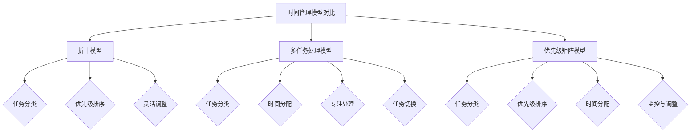

                 

### 文章标题

### 《创业者如何建立有效的时间管理策略》

创业之路充满挑战，时间的有效管理成为决定成败的关键因素之一。本篇技术博客将带领读者深入探讨如何建立一套适合创业者的时间管理策略。通过理论知识的阐述、实践案例的分析和具体策略的制定，我们希望帮助创业者们更好地掌控时间，提高工作效率，最终实现创业目标。

### 关键词

- 时间管理
- 创业者
- 效率提升
- 工作生活平衡
- 实战案例

### 摘要

本文旨在为创业者提供一套全面的时间管理策略。首先，我们将介绍时间管理的重要性以及常见误区，随后概述时间管理的基本理论和常用模型。接着，文章将聚焦于创业者如何制定个人时间管理计划，提高时间效率，平衡工作与生活，并通过实际案例研究成功与失败创业者的时间管理经验。最后，我们将探讨时间管理的实战应用与持续改进方法，展望未来时间管理的发展趋势。

## 《创业者如何建立有效的时间管理策略》目录大纲

### 第一部分：时间管理基础理论

#### 第1章：时间管理的重要性

- 时间的本质与价值
- 时间管理的误区与挑战
- 时间管理的核心概念

#### 第2章：时间管理理论概述

- 时间管理的基本原则
- 时间管理的方法与工具
- 时间管理理论的发展历程

#### 第3章：时间管理模型与框架

- 折中模型
- 多任务处理模型
- 优先级矩阵模型
- Mermaid流程图：时间管理模型的对比与分析

### 第二部分：创业者时间管理策略

#### 第4章：制定个人时间管理计划

- 确定个人目标与价值观
- 评估当前时间使用状况
- 制定时间管理计划
- 时间管理计划的执行与调整

#### 第5章：提高时间效率

- 克服拖延症
- 提高专注力与生产力
- 利用工具与资源提高时间效率

#### 第6章：平衡工作与生活

- 工作时间管理
- 生活时间管理
- 工作与生活的平衡

#### 第7章：创业者的时间管理案例研究

- 成功创业者的时间管理经验
- 失败创业者的时间管理教训
- 案例分析与启示

### 第三部分：实战应用与持续改进

#### 第8章：时间管理实战应用

- 时间管理在实际创业中的应用
- 建立团队时间管理机制
- 持续优化时间管理策略

#### 第9章：时间管理反馈与持续改进

- 收集时间管理反馈
- 分析反馈与识别问题
- 持续改进时间管理策略

#### 第10章：未来时间管理趋势与展望

- 时间管理技术的发展趋势
- 创业者如何应对未来时间管理挑战
- 时间管理在创业中的未来发展

#### 附录：时间管理工具与资源推荐

- 时间管理软件介绍
- 时间管理书籍推荐
- 时间管理网络资源汇总

---

在接下来的内容中，我们将逐步深入探讨这些章节，提供详细的解释和分析，帮助创业者们建立起一套科学、高效的时间管理策略。

## 第1章：时间管理的重要性

### 1.1 时间的本质与价值

时间是一种无形的资源，它是有限的、不可再生的，且一旦流逝就无法挽回。在物理学中，时间被视为第四维，与空间共同构成宇宙的框架。然而，对于创业者来说，时间的价值不仅体现在其物理属性上，更体现在其对工作效率、决策质量和生活质量的影响上。

首先，时间是一种关键的资源，决定了创业者的工作效率。在有限的时间内，创业者能够完成的任务数量和质量直接影响到企业的成长和发展速度。有效的利用时间，可以提高工作效率，减少无效劳动，从而创造更大的价值。

其次，时间是决策质量的重要保障。在创业过程中，创业者需要面对大量的决策，如产品定位、市场策略、团队管理等。充分的时间准备有助于收集更多信息、进行更全面的考虑，从而做出更加明智的决策。

最后，时间是生活质量的重要组成部分。创业者往往面临巨大的工作压力，长时间的工作容易导致身心健康问题。合理的时间管理不仅能提升工作效率，还能为创业者留出时间进行休息、娱乐和家庭活动，从而保持身心健康，提升生活质量。

### 1.2 时间管理的误区与挑战

尽管时间管理的重要性显而易见，但许多创业者在实际操作中仍然存在一些误区和挑战。

首先，许多创业者认为时间管理就是简单地安排每天的工作任务，这实际上是对时间管理的误解。时间管理不仅仅是安排任务，更重要的是了解并优化自己的时间使用习惯，减少无效率的活动，提高专注力和生产力。

其次，一些创业者过分强调工作的重要性，忽视了休息和娱乐的时间。这种“工作狂”的心态可能导致创业者身心疲惫，甚至引发健康问题。事实上，适当的休息和娱乐是保持高效工作状态的重要保障。

此外，时间管理的挑战还包括如何在多任务处理中保持高效、如何应对突发事件等。创业者往往需要同时处理多个任务，这要求他们具备出色的任务切换能力和优先级判断能力。

### 1.3 时间管理的核心概念

要建立有效的时间管理策略，创业者需要理解几个核心概念。

首先是“时间块管理法”。这种方法将时间划分为若干固定的时间块，每个时间块专注于一项任务，有助于提高专注度和减少任务切换带来的效率损失。

其次是“优先级矩阵模型”。该模型将任务按照紧急程度和重要程度进行分类，帮助创业者明确哪些任务需要优先处理，从而避免时间和精力的浪费。

此外，还有“四象限法则”，它将任务分为四个象限：紧急且重要、紧急但不重要、不紧急但重要、不紧急且不重要。这种方法有助于创业者更好地分配时间和精力，确保重要且紧急的任务得到优先处理。

最后，是“工作与生活的平衡”。对于创业者来说，保持工作与生活的平衡不仅有助于提高工作效率，还能提升生活质量，为长期发展奠定基础。

通过理解这些核心概念，创业者可以更加科学地管理时间，提高工作效率，实现个人与企业的共同发展。

## 第2章：时间管理理论概述

### 2.1 时间管理的基本原则

时间管理是一门科学，也是一门艺术。要想有效地管理时间，创业者需要遵循一些基本的原则。

首先是“明确目标”。时间管理的第一步是明确自己的目标。创业者需要明确自己想要实现的目标，并将其分解为具体的任务和里程碑。这样，在每天的时间安排中，才能有的放矢，确保每项任务都与整体目标一致。

其次是“优先排序”。在面对多个任务时，创业者需要根据任务的紧急程度和重要程度进行排序。优先处理那些紧急且重要的任务，避免因小失大。同时，要学会说“不”，对于那些不重要或者紧急程度较低的任务，可以适当放弃或延迟处理。

再次是“任务分解”。将复杂的任务分解为若干小步骤，有助于降低任务的难度和压力。每完成一个小步骤，都会带来一定的成就感，从而提高工作效率和积极性。

最后是“灵活调整”。时间管理不是一成不变的，创业者需要根据实际情况进行灵活调整。例如，当遇到突发事件或任务优先级发生变化时，创业者需要及时调整时间安排，确保关键任务能够按时完成。

### 2.2 时间管理的方法与工具

时间管理不仅需要正确的原则，还需要合适的方法和工具。以下是一些常见的时间管理方法和工具：

首先是“时间块管理法”。这种方法将时间划分为若干固定的时间块，每个时间块专注于一项任务。例如，可以将上午安排为处理重要邮件，下午安排为处理客户需求。这种方法有助于提高专注度和减少任务切换带来的效率损失。

其次是“优先级矩阵模型”。该模型将任务按照紧急程度和重要程度进行分类，形成四个象限：紧急且重要、紧急但不重要、不紧急但重要、不紧急且不重要。通过这个模型，创业者可以更加清晰地了解哪些任务需要优先处理，从而避免时间和精力的浪费。

此外，还有“四象限法则”。这种方法与优先级矩阵类似，但更简单直观。它将任务分为四个象限：紧急且重要、紧急但不重要、不紧急但重要、不紧急且不重要。每个象限都代表不同类型的时间管理策略。例如，紧急且重要的任务需要立即处理，不紧急但重要的任务可以安排在空闲时间处理。

最后，是“工作与生活的平衡”。对于创业者来说，保持工作与生活的平衡不仅有助于提高工作效率，还能提升生活质量。可以通过设定工作时间、休息时间和家庭时间，确保自己在忙碌的工作中也能抽出时间进行休息和娱乐。

通过结合这些方法和工具，创业者可以更加科学地管理时间，提高工作效率，实现个人与企业的共同发展。

### 2.3 时间管理理论的发展历程

时间管理理论的发展可以追溯到20世纪初，经过百余年的发展，目前已经形成了一套完整且丰富的理论体系。以下是时间管理理论发展的几个重要阶段：

首先是“时间记录法”。这种方法最早由科学家和时间管理专家弗兰克·威廉姆森提出，主要强调通过详细记录时间使用情况，了解自己的时间分配情况，从而找到时间浪费的根源。这一方法奠定了时间管理的基础。

其次是“时间块管理法”。这种方法由管理学家彼得·德鲁克提出，强调将时间划分为若干固定的时间块，每个时间块专注于一项任务。通过这种方法，可以大幅提高专注度和工作效率。

再次是“优先级矩阵模型”。这种方法由管理学家爱德华·卢德·迪恩提出，通过将任务分为紧急且重要、紧急但不重要、不紧急但重要、不紧急且不重要四个象限，帮助创业者更加清晰地了解哪些任务需要优先处理。

此外，还有“四象限法则”。这种方法由美国管理学家史蒂芬·柯维提出，更加简单直观，将任务分为四个象限，分别代表不同类型的时间管理策略。

最后，是“工作与生活的平衡”。随着现代社会对工作与生活平衡的重视，越来越多的时间管理理论开始关注如何平衡工作与生活，提高整体生活质量。

通过这些发展阶段，我们可以看到时间管理理论在不断丰富和完善，为创业者提供了更多有效的管理时间的方法和工具。随着科技的进步和社会的发展，时间管理理论还将继续演变和进步，为创业者提供更加科学的指导。

### 3.1 折中模型

折中模型是一种经典的时间管理方法，它通过权衡不同任务的重要性和紧急程度，帮助创业者更加灵活地安排时间。这种方法的核心在于识别并处理那些重要但不紧急的任务，从而预防潜在问题的发生。

#### 核心原理

折中模型的基本原理是将任务分为四个象限：紧急且重要、紧急但不重要、不紧急但重要、不紧急且不重要。创业者需要在不同象限的任务之间进行折中处理，确保紧急且重要的任务得到优先处理，同时不忽视那些重要但不紧急的任务。

#### 应用场景

折中模型适用于多种场景，特别是在创业者需要平衡日常运营和长期发展目标时。例如，对于一个初创公司，日常运营的任务如客户沟通、市场推广等通常属于紧急且重要任务，需要立即处理。而长期发展的任务如产品研发、市场调研等则属于不紧急但重要的任务，需要创业者通过折中模型合理安排时间。

#### 实施步骤

1. **任务分类**：首先，将所有任务按照紧急程度和重要性进行分类，标记为紧急且重要、紧急但不重要、不紧急但重要、不紧急且不重要。

2. **优先级排序**：根据任务的重要性和紧急程度，优先处理紧急且重要的任务。对于不紧急但重要的任务，需要制定计划，确保其在合适的时间点完成。

3. **灵活调整**：在任务执行过程中，根据实际情况进行灵活调整。例如，如果某个紧急但不重要的任务突然变得重要，创业者需要及时调整计划，将其纳入优先处理范围。

#### 优点

折中模型的优点在于其灵活性和全面性。通过这种方法，创业者可以更有效地应对紧急任务，同时确保重要但不紧急的任务得到处理，从而实现长期目标的稳步推进。

#### 缺点

然而，折中模型也存在一定的缺点。首先，它需要创业者具备较强的判断能力和时间感知能力，否则可能会在任务优先级排序上出现偏差。其次，过度依赖折中模型可能导致创业者忽视长期发展，陷入短期目标的泥潭。

#### 适用性

折中模型适用于大多数创业者，特别是那些需要平衡日常运营和长期发展的个体经营者。通过这种方法，创业者可以更加灵活地管理时间，提高整体工作效率。

### 3.2 多任务处理模型

多任务处理模型是另一种常见的时间管理方法，它通过同时处理多个任务，提高工作效率。这种方法适用于需要高效应对多种任务的创业者，但需要合理规划和策略支持。

#### 核心原理

多任务处理模型的核心在于通过合理分配时间和注意力，同时处理多个任务，减少任务切换带来的时间浪费。这种方法要求创业者具备较高的专注力和任务切换能力。

#### 应用场景

多任务处理模型适用于需要同时处理多个任务的场景，例如，创业者需要管理多个项目、处理紧急客户需求、参与会议等。此外，在资源有限的情况下，如初创公司资源紧张时，多任务处理模型也是一种有效的策略。

#### 实施步骤

1. **任务分类**：首先，将所有任务按照紧急程度和重要性进行分类，优先处理紧急且重要的任务。

2. **时间分配**：根据任务的重要性和紧急程度，合理分配时间。例如，紧急且重要的任务应优先安排在精力最充沛的时间段。

3. **专注处理**：在每个时间块内，专注于当前任务，减少任务切换。例如，通过设定专注时间（如番茄工作法），确保在每个时间块内高效完成一项任务。

4. **任务切换**：当需要在多个任务之间切换时，采用快速切换策略，减少切换时间。例如，通过准备切换工具或环境，加快任务切换速度。

#### 优点

多任务处理模型的优点在于能够提高工作效率，充分利用时间。通过同时处理多个任务，创业者可以在有限的时间内完成更多工作。

#### 缺点

然而，多任务处理模型也存在一定的缺点。首先，它对创业者的专注力和任务切换能力要求较高，否则可能导致工作效率降低。其次，过度依赖多任务处理可能导致创业者忽视任务的细节和质量。

#### 适用性

多任务处理模型适用于那些需要高效处理多种任务的创业者，特别是在资源有限、时间紧迫的情况下。通过这种方法，创业者可以在有限的时间内完成更多工作，提高整体工作效率。

### 3.3 优先级矩阵模型

优先级矩阵模型是一种基于任务重要性和紧急程度进行时间管理的方法，它通过将任务划分到不同的象限，帮助创业者更加科学地安排时间。这种方法的核心在于确保紧急且重要的任务得到优先处理，从而避免紧急事务占用过多时间，影响长期目标的实现。

#### 核心原理

优先级矩阵模型将任务分为四个象限：紧急且重要、紧急但不重要、不紧急但重要、不紧急且不重要。每个象限代表了不同类型的时间管理策略。

1. **紧急且重要**：这类任务需要立即处理，通常涉及到重要项目的截止日期、紧急的客户需求或者突发事件。这些任务不仅影响当前的工作进展，还可能对企业的长期目标产生重大影响。

2. **紧急但不重要**：这类任务虽然紧急，但并不直接影响企业的长期目标。例如，一些无关紧要的会议或者电话。创业者可以适当推迟这些任务，将其安排在相对空闲的时间。

3. **不紧急但重要**：这类任务虽然不紧急，但对企业长期发展至关重要。例如，市场调研、产品研发和员工培训等。创业者应将这些任务纳入计划，确保其在合适的时间完成。

4. **不紧急且不重要**：这类任务通常可以延迟或放弃。例如，一些琐碎的日常事务或者非必要的社交活动。创业者应尽量减少这些任务，将时间用于更加重要的工作。

#### 应用场景

优先级矩阵模型适用于各种场景，特别适用于需要平衡日常运营和长期发展的创业者。例如，初创公司的创始人需要在处理紧急客户需求的同时，确保产品研发和市场策略的顺利进行。

#### 实施步骤

1. **任务分类**：将所有任务按照紧急程度和重要性进行分类，标记为紧急且重要、紧急但不重要、不紧急但重要、不紧急且不重要。

2. **优先级排序**：根据任务的重要性和紧急程度，将任务排序。紧急且重要的任务应优先处理，不紧急但重要的任务可以安排在长期计划中，紧急但不重要的任务可以推迟，不紧急且不重要的任务可以放弃或简化。

3. **时间分配**：为每个任务分配适当的时间，确保紧急且重要的任务得到及时处理。对于不紧急但重要的任务，需要制定详细的计划，确保其在合适的时间点完成。

4. **监控与调整**：定期检查任务进度，根据实际情况进行调整。例如，如果某个任务变得紧急，需要立即调整计划，将其纳入优先处理范围。

#### 优点

优先级矩阵模型的优点在于其直观性和实用性。通过将任务划分为不同的象限，创业者可以更加清晰地了解哪些任务需要优先处理，从而避免时间和精力的浪费。

#### 缺点

然而，优先级矩阵模型也存在一定的缺点。首先，它需要创业者具备较强的判断能力和任务感知能力，否则可能会在任务优先级排序上出现偏差。其次，过度依赖优先级矩阵可能导致创业者忽视一些重要但不紧急的任务，从而影响长期目标的实现。

#### 适用性

优先级矩阵模型适用于大多数创业者，特别是在需要平衡短期目标和长期发展的场景中。通过这种方法，创业者可以更加科学地管理时间，确保紧急且重要的任务得到优先处理，同时避免过度关注短期任务而忽视长期目标。

### Mermaid流程图：时间管理模型的对比与分析

以下是一个Mermaid流程图，用于对比和分析折中模型、多任务处理模型和优先级矩阵模型。通过这个流程图，可以更直观地理解每种模型的特点和应用场景。



通过这个流程图，我们可以看到每种模型的核心步骤和特点：

- **折中模型**：侧重于任务分类和灵活调整，适用于需要平衡日常运营和长期发展的场景。
- **多任务处理模型**：侧重于任务分类、时间分配和任务切换，适用于需要同时处理多种任务的场景。
- **优先级矩阵模型**：侧重于任务分类、优先级排序和时间分配，适用于需要平衡短期目标和长期发展的场景。

### 3.4 Mermaid流程图：时间管理模型的对比与分析

```mermaid
graph TB
    A[时间管理模型对比] --> B{折中模型}
    A --> C{多任务处理模型}
    A --> D{优先级矩阵模型}

    subgraph 折中模型
        B1[任务分类]
        B2[优先级排序]
        B3[灵活调整]
        B -- B1,B2,B3
    end

    subgraph 多任务处理模型
        C1[任务分类]
        C2[时间分配]
        C3[专注处理]
        C4[任务切换]
        C -- C1,C2,C3,C4
    end

    subgraph 优先级矩阵模型
        D1[任务分类]
        D2[优先级排序]
        D3[时间分配]
        D4[监控与调整]
        D -- D1,D2,D3,D4
    end
```

通过这个Mermaid流程图，我们可以清晰地看到三种时间管理模型的核心步骤和适用场景：

- **折中模型**：主要强调任务的分类和灵活调整，适合需要平衡日常运营和长期发展的场景。
- **多任务处理模型**：注重任务分类、时间分配、专注处理和任务切换，适合需要同时处理多种任务的情况。
- **优先级矩阵模型**：侧重于任务的分类、优先级排序、时间分配和监控调整，适合需要平衡短期和长期目标的场景。

通过对比这些模型，创业者可以根据自身的情况选择最合适的时间管理策略，从而提高工作效率，实现创业目标。

### 第4章：制定个人时间管理计划

#### 4.1 确定个人目标与价值观

制定有效的个人时间管理计划的第一步是明确个人目标和价值观。创业者需要思考以下几个关键问题：

1. **我的长期目标是什么？** 长期目标可以帮助创业者确定未来的方向，例如实现财务自由、成为行业领导者等。
2. **我的短期目标是什么？** 短期目标是实现长期目标的具体步骤，例如在三个月内完成一个关键项目、获得一批新客户等。
3. **我的价值观是什么？** 个人价值观决定了创业者如何分配时间。例如，如果价值观中重视家庭，那么创业者可能会选择在家庭时间上投入更多。

通过明确这些目标与价值观，创业者可以更好地了解自己需要投入时间和精力的领域，从而在时间管理计划中优先考虑重要事项。

#### 4.2 评估当前时间使用状况

在确定个人目标和价值观后，创业者需要评估当前的时间使用状况。以下是一些评估步骤：

1. **记录时间日志**：记录每天的时间使用情况，包括工作、休息、娱乐等。这可以帮助创业者了解自己如何分配时间，哪些活动占用了过多时间，哪些活动对目标实现有帮助。
2. **分析时间日志**：通过分析时间日志，创业者可以识别时间浪费的根源。例如，过多的社交媒体浏览、频繁的会议或者无效的任务等。
3. **设定时间边界**：在评估过程中，创业者应设定时间边界，明确每个任务的时间限制。例如，每天的工作时间为8小时，每小时专注于一项任务。

#### 4.3 制定时间管理计划

在评估当前时间使用状况后，创业者可以开始制定具体的时间管理计划。以下步骤有助于制定有效的计划：

1. **设定具体目标**：根据长期和短期目标，设定具体的时间管理目标。例如，每天阅读一小时、每周进行一次市场调研等。
2. **制定任务清单**：将所有任务列出，并按照重要性和紧急程度进行排序。这可以帮助创业者明确哪些任务需要优先处理。
3. **时间块管理**：将时间划分为若干固定的时间块，并为每个时间块分配特定的任务。例如，早晨用于处理紧急且重要的任务，下午用于处理长期发展任务。
4. **设定提醒与反馈机制**：使用日历、提醒软件等工具，设定任务的提醒，并在任务完成后进行反馈和评估。这有助于确保时间管理计划的执行和调整。

#### 4.4 时间管理计划的执行与调整

制定好时间管理计划后，执行和调整是关键。以下是一些执行与调整的建议：

1. **坚持执行**：养成按照时间管理计划执行任务的习惯。一旦设定了计划，就要严格遵守，避免随意更改。
2. **定期回顾**：每周或每月回顾时间管理计划的执行情况，评估效果，并根据实际情况进行调整。这有助于确保时间管理计划始终保持有效性。
3. **调整计划**：如果某个任务耗时过长或者效果不佳，需要及时调整计划。例如，将任务分解为更小的步骤，或者重新安排任务优先级。
4. **寻求反馈**：向同事、朋友或家庭成员寻求反馈，了解他们在时间管理方面是否有建议或经验。这有助于从不同角度优化时间管理策略。

通过以上步骤，创业者可以建立起一套科学、合理的时间管理计划，从而提高工作效率，实现创业目标。

### 第5章：提高时间效率

#### 5.1 克服拖延症

拖延症是创业者面临的一个常见问题，它不仅会浪费大量时间，还会影响工作效率和心态。以下是几种克服拖延症的方法：

1. **明确任务目标**：在开始任务前，明确任务的目标和预期结果。这可以帮助创业者更有动力去完成任务，减少拖延的可能性。
2. **分解任务**：将复杂的任务分解为若干小步骤，每完成一个小步骤就给予自己一些奖励。这种方法可以帮助创业者逐步克服拖延，同时保持积极的心态。
3. **设定截止时间**：为任务设定一个明确的截止时间，并严格遵守。这可以增加任务的紧迫感，减少拖延时间。
4. **避免干扰**：在工作时，尽量减少干扰。例如，关闭社交媒体通知、将手机置于静音模式等。这可以帮助创业者保持专注，减少任务切换带来的效率损失。
5. **使用番茄工作法**：番茄工作法是一种常见的时间管理技巧，它将工作时间分为25分钟的工作周期，每个周期后休息5分钟。这种方法可以帮助创业者提高专注力，减少拖延。

#### 5.2 提高专注力与生产力

专注力和生产力是创业者成功的重要因素。以下是一些提高专注力和生产力的方法：

1. **时间块管理**：将时间划分为若干固定的时间块，并为每个时间块分配特定的任务。这种方法可以帮助创业者更好地集中注意力，减少任务切换带来的效率损失。
2. **环境优化**：创造一个有利于专注的工作环境。例如，保持桌面整洁、减少噪音干扰等。一个良好的工作环境可以提升专注力，从而提高生产力。
3. **设定专注时间**：使用番茄工作法等时间管理技巧，设定专注时间，并在专注时间内尽量避免干扰。例如，可以设定25分钟专注工作，然后休息5分钟。
4. **定期休息**：长时间工作会降低专注力和生产力，因此需要定期休息。例如，每工作一个小时，休息5-10分钟。这可以帮助恢复精力，提高工作效率。
5. **避免多任务处理**：虽然多任务处理可以看起来很高效，但实际上它会导致注意力分散，降低专注力和生产力。尽量专注于一项任务，直到完成后再进行下一项任务。

#### 5.3 利用工具与资源提高时间效率

利用工具和资源可以提高时间效率，以下是一些实用的工具和资源：

1. **日历与提醒软件**：使用日历软件（如Google日历、Outlook等）可以帮助创业者更好地管理日程，设置任务提醒，确保任务按时完成。
2. **任务管理工具**：使用任务管理工具（如Trello、Asana、JIRA等）可以帮助创业者更好地组织任务，跟踪进度，提高工作效率。
3. **时间跟踪工具**：使用时间跟踪工具（如Toggl、RescueTime等）可以帮助创业者了解时间使用情况，识别时间浪费的根源，从而优化时间管理。
4. **电子书籍与在线课程**：电子书籍和在线课程是获取知识和技能的快速途径。创业者可以利用这些资源不断提升自己，提高工作效率。
5. **同行交流与培训**：参加行业会议、培训课程或与同行交流，可以帮助创业者学习新的时间管理技巧和方法，从而优化时间管理策略。

通过以上方法，创业者可以更好地克服拖延症，提高专注力和生产力，利用工具与资源优化时间管理，从而在创业过程中取得更大的成功。

### 第6章：平衡工作与生活

#### 6.1 工作时间管理

对于创业者来说，合理的工作时间管理是确保工作和生活平衡的关键。以下是一些具体的时间管理策略：

1. **设定工作时间**：明确每天的工作时间，例如从早上9点到下午5点。这有助于创业者培养自律，确保在固定时间内集中精力处理工作任务。
2. **任务优先级排序**：根据任务的紧急程度和重要性，将任务进行排序。优先处理那些对工作影响较大的任务，确保关键任务能够按时完成。
3. **时间块管理**：将工作时间划分为若干固定的时间块，并为每个时间块分配特定的任务。例如，将上午用于处理紧急事务，下午用于处理长期发展任务。这种方法有助于提高专注度，减少任务切换带来的效率损失。
4. **避免加班**：尽量避免加班，以免影响身心健康和生活质量。如果必须加班，应合理安排时间，确保在第二天能够恢复精力。

#### 6.2 生活时间管理

合理的生活时间管理可以帮助创业者保持身心健康，提高生活质量。以下是一些具体的生活时间管理策略：

1. **设定休息时间**：确保每天有足够的休息时间，例如晚上10点到早上7点。这有助于恢复体力和精神，提高第二天的工作效率。
2. **锻炼身体**：定期锻炼身体，例如每天早晨进行30分钟的有氧运动。这不仅可以增强体质，还能提高专注力和生产力。
3. **家庭时间**：确保每周有固定的家庭时间，与家人共度美好时光。这有助于缓解工作压力，增强家庭关系。
4. **社交活动**：合理安排社交活动，与朋友、同事或行业人士进行交流。这不仅可以放松身心，还能扩展人脉，获取宝贵的经验和资源。

#### 6.3 工作与生活的平衡

工作与生活的平衡是创业者成功的重要保障。以下是一些具体的工作与生活平衡策略：

1. **设定工作与生活的界限**：明确工作和生活的界限，避免将工作任务带入私人时间。例如，在家庭时间中，尽量不讨论工作事宜。
2. **学会说“不”**：对于一些不重要或者对目标无帮助的任务，学会拒绝。这有助于节省时间，专注于更重要的事情。
3. **定期休息与放松**：定期进行休息和放松，例如每年安排一次假期旅行。这有助于恢复身心健康，提高工作效率。
4. **培养兴趣爱好**：培养一些兴趣爱好，例如阅读、旅行、绘画等。这可以帮助创业者放松心情，提高生活质量。

通过以上策略，创业者可以更好地平衡工作与生活，提高工作效率，实现个人与企业的共同发展。

### 第7章：创业者的时间管理案例研究

#### 7.1 成功创业者的时间管理经验

在创业领域，有许多成功的企业家通过科学的时间管理实现了事业的成功。以下是几位成功创业者的时间管理经验：

1. **史蒂夫·乔布斯（Steve Jobs）**：乔布斯是苹果公司的创始人之一，他以其独特的时间管理方法而闻名。他每天早上7点起床，早餐后进行冥想，随后开始一天的工作。乔布斯重视专注力和效率，通过将时间分配给最重要的任务，确保了苹果产品的成功。

2. **埃隆·马斯克（Elon Musk）**：马斯克是特斯拉和SpaceX的创始人，他以其高效的时间管理而著称。马斯克每天工作约120小时，但他强调高效的工作方式，通过优先处理最重要的任务，并利用多任务处理技巧来最大化时间利用。

3. **马克·扎克伯格（Mark Zuckerberg）**：作为Facebook的创始人，扎克伯格的时间管理哲学是简化生活，专注于最重要的事情。他通过制定日常和每周的目标，确保自己的时间和精力投入到对业务增长最有帮助的活动中。

这些成功创业者的经验表明，科学的时间管理不仅能提高工作效率，还能帮助创业者更好地平衡工作和生活。

#### 7.2 失败创业者的时间管理教训

然而，并非所有创业者都能成功管理时间，一些失败案例也为我们提供了宝贵的教训：

1. **乔·吉拉德（Joe Girard）**：吉拉德是世界上最著名的汽车销售员之一，他在20世纪70年代创下了单年销售1425辆汽车的记录。然而，他的时间管理却存在问题，经常将大量时间浪费在琐碎的日常事务上，导致忽视了业务拓展和新市场开发，最终导致其业务逐渐衰落。

2. **迈克·马斯克（Mike Musk）**：这是一个虚构的名字，代表那些试图在多个项目上同时发力但最终因精力分散而失败的创业者。迈克尝试同时经营多个创业项目，却未能有效管理时间和资源，最终导致项目失败，个人精力耗尽。

这些失败案例提醒我们，时间管理不仅仅是安排任务，更重要的是要合理安排时间和资源，确保每个项目都能得到充分的关注和投入。

#### 7.3 案例分析与启示

通过成功和失败的创业案例，我们可以得出以下启示：

1. **明确目标**：成功的创业者通常能够明确自己的目标，并围绕目标进行时间管理。他们知道哪些任务是最重要的，哪些可以推迟或放弃。

2. **高效工作**：成功创业者强调高效的工作方式，通过专注力和多任务处理技巧提高工作效率。例如，乔布斯通过每日冥想和专注工作来确保高效产出。

3. **平衡工作与生活**：成功的创业者不仅关注工作，还注重生活质量的提升。通过合理的时间分配，他们能够保持身心健康，从而更好地应对工作中的挑战。

4. **灵活调整**：失败创业者的教训提醒我们，时间管理需要灵活调整。创业者应时刻关注任务的变化和优先级，确保时间管理策略能够适应实际情况。

通过这些案例分析，创业者可以学习成功者的经验，避免失败者的教训，制定出更加科学、高效的时间管理策略，从而在创业道路上取得成功。

### 第8章：时间管理实战应用

#### 8.1 时间管理在实际创业中的应用

时间管理在创业中扮演着至关重要的角色，它不仅决定了工作效率，还直接影响到企业的成长和成功。以下是一些实际应用案例，展示了时间管理在创业中的重要作用。

**案例一：初创公司时间管理**

初创公司通常资源有限，时间管理显得尤为重要。例如，某初创公司的创始人李明在创办公司初期，面临着多个项目同时进行、团队成员较少的挑战。为了提高效率，他采用了以下几种时间管理方法：

- **任务分解**：将复杂的项目分解为若干小任务，并制定详细的任务清单。每个小任务都有明确的截止时间，确保项目按时完成。
- **优先级排序**：根据任务的紧急程度和重要性，将任务排序，优先处理关键任务。例如，市场调研和客户需求分析被视为最重要的任务，因此被优先处理。
- **时间块管理**：将每天的时间划分为若干固定的时间块，并为每个时间块分配特定的任务。例如，早晨用于处理紧急事务，下午用于团队会议和长期发展规划。

通过这些方法，李明成功地提高了工作效率，确保了关键任务按时完成，使公司得以稳步发展。

**案例二：时间管理工具的应用**

在创业过程中，时间管理工具的使用也是提高效率的重要手段。例如，某初创公司团队采用了Trello和Google日历等工具，实现了高效的时间管理：

- **Trello**：用于任务管理和团队协作。团队成员可以将各自的任务分配到不同的看板中，通过看板上的卡片，可以清晰地了解任务的进展情况，确保每个任务都有专人负责。
- **Google日历**：用于日程管理和任务提醒。团队成员可以将重要会议、任务截止日期等信息添加到日历中，并设置提醒，确保不会错过重要事件。

通过这些工具的应用，团队成员能够更好地协调工作，确保任务按时完成，提高了整体工作效率。

**案例三：时间管理策略的调整**

在创业过程中，时间管理策略需要根据实际情况进行调整。例如，某初创公司在发展初期，主要关注市场拓展和客户需求，但随着时间的推移，产品研发和团队建设成为更为重要的任务。创始人李明及时调整了时间管理策略，将更多的时间投入到产品研发和团队建设中：

- **任务优先级调整**：将产品研发和团队建设提升为优先级最高的任务，确保这些关键任务能够得到足够的关注和资源。
- **时间分配调整**：将每天的时间块重新分配，将早晨和下午的时间用于产品研发和团队建设，减少市场推广和客户需求的处理时间。

通过这种调整，公司能够在保持市场拓展的同时，更专注于产品研发和团队建设，为未来的发展奠定了基础。

这些实际应用案例表明，科学的时间管理策略在创业中具有重要的意义。通过合理分配时间、有效利用工具和灵活调整策略，创业者可以更好地应对挑战，实现企业的持续发展和成功。

#### 8.2 建立团队时间管理机制

在创业过程中，团队的时间管理机制是确保高效协作和任务顺利完成的关键。以下是建立团队时间管理机制的一些建议：

1. **明确团队目标**：首先，团队需要明确共同的目标和愿景。这有助于统一团队成员的方向，确保每个人都知道自己的职责和任务。

2. **分工明确**：根据团队成员的能力和特长，进行合理的分工。明确每个团队成员的职责和任务，避免任务重叠和资源浪费。

3. **制定团队时间表**：制定一个详细的团队时间表，包括每天、每周和每月的任务安排。这有助于团队成员了解自己的工作时间安排，确保任务按时完成。

4. **定期会议**：定期召开团队会议，讨论任务进展、问题解决方案和时间管理策略。这有助于团队及时调整工作计划，解决遇到的问题。

5. **任务跟踪工具**：使用任务跟踪工具（如Trello、Asana等），帮助团队跟踪任务进展，确保每个任务都有专人负责，任务按时完成。

6. **反馈机制**：建立反馈机制，鼓励团队成员提出建议和反馈。这有助于发现和解决时间管理中的问题，持续优化团队的工作流程。

7. **培训和指导**：定期为团队成员提供时间管理培训和指导，帮助他们提高时间管理技能，提升工作效率。

通过以上措施，团队可以建立一套科学、高效的时间管理机制，确保团队协作顺利，任务按时完成，从而推动企业的持续发展。

#### 8.3 持续优化时间管理策略

在创业过程中，时间管理策略的持续优化至关重要。以下是一些具体的方法和步骤，帮助创业者不断改进和优化时间管理策略：

1. **定期回顾与评估**：定期回顾和评估当前的时间管理策略，分析其执行效果和存在的问题。例如，可以每月或每季度进行一次全面回顾，评估各项任务的完成情况和时间分配的合理性。

2. **收集团队成员反馈**：鼓励团队成员提供关于时间管理策略的反馈和建议。这些反馈可以帮助发现存在的问题，并为改进提供思路。例如，可以通过团队会议、匿名问卷等方式收集反馈。

3. **调整任务优先级**：根据实际情况和团队成员的建议，适时调整任务的优先级。例如，如果发现某些任务的重要性较低或者不再紧急，可以将其推迟或放弃，确保时间和资源更多地投入到关键任务上。

4. **优化时间块管理**：调整时间块的管理方式，确保每个时间块都能高效地完成特定任务。例如，可以根据任务的重要性和紧急程度，重新分配时间块，使其更加符合实际情况。

5. **引入新工具和技术**：尝试引入新的时间管理工具和技术，以提高时间管理效率和效果。例如，可以尝试新的任务管理软件或时间跟踪工具，以更方便地跟踪任务进展和时间使用情况。

6. **持续学习和培训**：鼓励团队成员持续学习和培训，提高时间管理技能。可以通过参加相关课程、阅读专业书籍或参与研讨会等方式，不断更新知识和技能，提升团队整体的时间管理能力。

7. **定期调整和更新**：时间管理策略不是一成不变的，需要根据实际情况进行定期调整和更新。例如，随着公司的发展和市场环境的变化，时间管理策略也需要相应调整，以保持其适用性和有效性。

通过以上方法和步骤，创业者可以不断优化时间管理策略，提高工作效率，确保企业在竞争激烈的市场中保持竞争力。

### 第9章：时间管理反馈与持续改进

#### 9.1 收集时间管理反馈

为了有效改进时间管理策略，收集反馈是关键步骤。以下是一些具体的收集反馈的方法：

1. **定期调查问卷**：设计一份简短的时间管理调查问卷，定期向团队成员发送。问卷可以包括关于时间管理策略的执行情况、存在的问题和改进建议等方面的问题。

2. **团队会议**：在每周或每月的团队会议上，安排一段时间专门讨论时间管理问题。团队成员可以分享自己在时间管理方面的经验和挑战，提出改进建议。

3. **匿名反馈渠道**：提供一个匿名反馈渠道，例如设置一个反馈邮箱或在线论坛，让团队成员可以匿名提出意见和建议。这有助于减少顾虑，鼓励团队成员更开放地分享意见。

4. **个别交流**：与团队成员进行个别交流，了解他们在时间管理方面的具体问题和需求。这种方式可以更加深入地了解每个团队成员的情况，从而提供更有针对性的反馈。

5. **数据分析**：利用任务管理工具和跟踪软件的数据分析功能，分析团队成员的时间使用情况。例如，通过统计任务完成时间、任务进度和延迟情况，可以识别出时间管理中的瓶颈和问题。

#### 9.2 分析反馈与识别问题

收集到反馈后，下一步是分析这些反馈，并识别出时间管理中的问题。以下是一些分析和识别问题的方法：

1. **分类整理**：将收集到的反馈按照主题和类型进行分类整理。例如，可以将关于任务优先级排序的反馈归类在一起，关于任务分配的反馈归为一类。

2. **频率统计**：对每个问题的反馈进行频率统计，识别出最常见的问题。频率高的反馈通常反映了时间管理中的关键问题。

3. **原因分析**：对于每个问题，深入分析其原因。例如，如果团队成员普遍反映任务分配不合理，可能是因为任务量过大、职责不明确或者沟通不畅等原因。

4. **优先级排序**：根据反馈问题的严重性和影响程度，对这些反馈进行优先级排序。优先解决那些对时间管理策略影响最大、最紧迫的问题。

5. **专家咨询**：邀请时间管理专家或导师进行咨询，他们可以提供专业的意见和建议，帮助更准确地识别和解决问题。

#### 9.3 持续改进时间管理策略

在分析和识别问题后，下一步是制定和实施改进措施，持续优化时间管理策略。以下是一些具体的改进措施：

1. **优化任务分配**：根据反馈和原因分析，调整任务分配策略。确保任务分配更加合理，职责明确，避免任务过度集中或分配不均。

2. **改进工作流程**：针对识别出的问题，改进工作流程，优化任务执行过程。例如，通过简化流程、减少不必要的步骤来提高效率。

3. **培训与发展**：为团队成员提供时间管理培训和发展机会，提升他们的时间管理技能。这可以包括内部培训、外部课程或在线学习资源。

4. **引入新工具**：根据反馈，尝试引入新的时间管理工具和技术，以提高效率和效果。例如，可以使用更先进的项目管理软件或时间跟踪工具。

5. **制定改进计划**：制定详细的改进计划，包括具体措施、责任人、实施时间和预期效果。确保改进措施能够得到有效执行。

6. **定期回顾与评估**：在实施改进措施后，定期回顾和评估效果。通过持续的反馈和评估，可以进一步优化时间管理策略，确保其持续改进。

通过以上方法和措施，创业者可以建立起一套持续改进的时间管理机制，不断提高工作效率，实现个人和企业的共同发展。

### 第10章：未来时间管理趋势与展望

#### 10.1 时间管理技术的发展趋势

随着科技的不断进步，时间管理技术也在不断演变和升级，为创业者提供了更多高效的管理工具和方法。以下是一些未来时间管理技术的发展趋势：

1. **人工智能与自动化**：人工智能（AI）技术将在时间管理中发挥越来越重要的作用。通过AI算法，可以自动分析时间使用数据，提供个性化的时间管理建议。自动化工具也将进一步简化日常任务，如日程安排、任务提醒和进度跟踪，从而减轻创业者的时间管理负担。

2. **增强现实与虚拟现实**：增强现实（AR）和虚拟现实（VR）技术将为时间管理带来全新的体验。创业者可以通过AR/VR技术进行虚拟会议、远程协作和沉浸式培训，提高时间管理的效果和效率。

3. **大数据分析**：大数据分析技术将帮助创业者更深入地了解时间使用情况，识别出潜在的时间和资源浪费点。通过分析大量数据，可以提供更加精准的时间管理策略和决策支持。

4. **物联网（IoT）**：物联网技术将使各种设备和系统能够相互连接，从而实现更智能的时间管理。例如，智能手表、智能手环和智能家居设备可以实时监测和记录时间使用情况，为创业者提供即时反馈和调整建议。

#### 10.2 创业者如何应对未来时间管理挑战

面对未来时间管理技术的快速发展，创业者需要采取一系列措施来适应和应对这些挑战：

1. **持续学习与更新知识**：创业者应保持学习的热情，不断更新自己的知识库，了解最新的时间管理技术和方法。通过参加培训课程、研讨会和行业会议，可以及时掌握前沿的时间管理理念和实践。

2. **灵活应用新技术**：在合适的情况下，尝试引入和应用新技术。例如，可以采用AI驱动的任务管理软件，利用AR/VR技术进行虚拟培训和会议，利用大数据分析工具进行时间管理优化。

3. **强化团队协作**：未来时间管理不仅仅是个体的任务，更需要团队的协作。创业者应注重团队建设，培养团队成员的时间管理意识和技能，建立高效协作的工作机制。

4. **持续改进与优化**：创业者应不断回顾和优化自己的时间管理策略，通过反馈和数据分析，识别问题和改进点，持续提升时间管理的效果和效率。

5. **平衡技术与管理**：虽然技术可以提供强大的支持，但时间管理本质上还是一种管理艺术。创业者需要平衡技术应用和管理实践，确保技术手段能够真正为时间管理服务。

通过以上措施，创业者可以更好地应对未来时间管理技术的挑战，实现高效的时间管理，推动企业的持续发展和成功。

### 附录：时间管理工具与资源推荐

#### A.1 时间管理软件介绍

1. **Trello**：Trello是一款功能强大的任务管理工具，通过看板、卡片和列表，可以直观地管理任务和项目。它支持多用户协作，适用于团队共同管理任务。

2. **Asana**：Asana是一款专业的项目管理工具，提供详细的任务管理、进度跟踪和协作功能。它可以帮助团队高效地分配任务，确保每个任务都有明确的执行者和截止时间。

3. **Google日历**：Google日历是一款集成在Google Workspace中的日程管理工具，可以方便地安排会议、设置提醒和共享日程。它支持多设备同步，确保创业者随时掌握日程安排。

4. **RescueTime**：RescueTime是一款时间跟踪工具，可以记录创业者的时间使用情况，分析时间浪费的根源，提供个性化的时间管理建议。

#### A.2 时间管理书籍推荐

1. **《时间管理：从忙碌到高效》**：这本书详细介绍了时间管理的基本原则和方法，通过实用的技巧和工具，帮助读者建立高效的时间管理策略。

2. **《番茄工作法图解》**：番茄工作法是一种广泛应用于时间管理的技巧，这本书通过图解的形式，详细阐述了番茄工作法的原理和实践方法。

3. **《深度工作：如何有效利用每一点脑力》**：这本书探讨了如何减少干扰，专注于深度工作，提高工作效率。它提供了一系列实用的策略和方法，帮助创业者更好地管理时间和精力。

#### A.3 时间管理网络资源汇总

1. **时间管理博客**：许多专业博客和时间管理专家提供免费的时间管理资源和教程，例如Lifehacker、The Productive Woman等。

2. **在线课程平台**：Coursera、Udemy等在线课程平台提供丰富的免费和付费时间管理课程，创业者可以根据自己的需求选择合适的课程进行学习。

3. **时间管理论坛和社区**：加入时间管理论坛和社区，如Time Management Ninja、Productivity 501等，可以与其他创业者交流经验，获取更多时间管理建议和灵感。

通过这些工具、书籍和网络资源，创业者可以不断提升自己的时间管理能力，实现更加高效的工作和生活。

