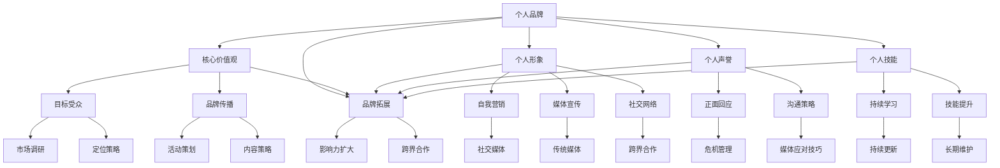

                 


### 文章标题：创业者的个人品牌塑造与维护

> 关键词：创业者、个人品牌、塑造、维护、市场营销、社交媒体

> 摘要：本文旨在探讨创业者如何塑造和维持自己的个人品牌。通过详细分析个人品牌的核心要素、市场营销策略以及危机管理，本文为创业者提供了一套系统性的个人品牌塑造与维护的方法论。

### 第一部分：概述与概念建立

#### 第1章：创业者的个人品牌塑造与维护概述

1. **1.1 个人品牌的概念与重要性**
   - **1.1.1 个人品牌的定义**
     个人品牌是个人在公众面前的形象和认知度，它不仅仅是外表，更是专业能力和价值的体现。
   - **1.1.2 个人品牌的重要性**
     在创业领域，个人品牌可以提升个人知名度，增强社会影响力，有助于建立信任，吸引合作伙伴和投资者。
   - **1.1.3 个人品牌与企业品牌的关系**
     个人品牌可以支持和强化企业品牌，而企业品牌的发展也会反哺个人品牌。

2. **1.2 个人品牌塑造的原则**
   - **1.2.1 明确目标受众**
     理解目标受众的需求和偏好，有助于更有针对性地进行品牌塑造。
   - **1.2.2 确立核心价值观**
     核心价值观是个人品牌的灵魂，应贯穿于所有品牌传播活动中。
   - **1.2.3 保持一致性**
     在所有渠道上的形象和传播信息要保持一致。

#### 第2章：个人品牌的核心要素

1. **2.1 个人品牌的核心要素**
   - **2.1.1 个人形象**
     个人形象包括外表、仪态、穿着等，保持专业和亲切的形象有助于建立良好的个人品牌。
   - **2.1.2 个人声誉**
     个人声誉是指他人对个人的评价和看法，维护良好的个人声誉对个人品牌的建立至关重要。
   - **2.1.3 个人技能**
     个人技能是个人品牌的重要组成部分，不断学习和提升技能有助于增强个人品牌的竞争力。

2. **2.2 个人品牌形象塑造**
   - **2.2.1 自我营销**
     通过社交媒体、博客、演讲等方式展示个人能力和成就。
   - **2.2.2 媒体宣传**
     利用传统媒体和新兴媒体进行宣传，提升个人知名度。
   - **2.2.3 社交网络**
     在社交平台上建立个人品牌形象，与潜在合作伙伴和客户互动。

### 第二部分：个人品牌的市场营销策略

#### 第3章：个人品牌的市场营销策略

1. **3.1 个人品牌的市场营销策略**
   - **3.1.1 市场调研**
     通过市场调研了解目标市场和受众需求。
   - **3.1.2 定位策略**
     明确个人品牌的定位，确保品牌形象与目标市场匹配。
   - **3.1.3 品牌传播**
     利用各种渠道进行品牌传播，包括线上和线下活动。

2. **3.2 社交媒体策略**
   - **3.2.1 选择合适的平台**
     根据目标受众选择适合的社交媒体平台。
   - **3.2.2 内容策略**
     制定内容策略，确保内容有价值、有吸引力。
   - **3.2.3 活动策划**
     策划社交媒体活动，提高用户参与度。

### 第三部分：个人品牌的危机管理

#### 第4章：个人品牌的危机管理

1. **4.1 个人品牌危机的识别与管理**
   - **4.1.1 危机识别**
     及时识别可能影响个人品牌的危机事件。
   - **4.1.2 应对策略**
     制定有效的应对策略，及时处理危机事件。

2. **4.2 媒体应对技巧**
   - **4.2.1 正面回应**
     对负面信息进行正面回应，化解危机。
   - **4.2.2 沟通策略**
     制定有效的沟通策略，确保信息传达准确。

### 第四部分：个人品牌的长期维护与拓展

#### 第5章：个人品牌的长期维护与拓展

1. **5.1 长期维护策略**
   - **5.1.1 定期评估**
     定期评估个人品牌状况，及时调整品牌策略。
   - **5.1.2 持续更新**
     持续更新个人品牌内容，保持品牌活力。

2. **5.2 品牌拓展**
   - **5.2.1 扩大影响力**
     通过参与行业活动、发表专业文章等方式扩大个人品牌影响力。
   - **5.2.2 跨界合作**
     寻找跨界合作机会，拓展品牌领域。

### 第五部分：成功案例分析与启示

#### 第6章：成功案例分析与启示

1. **6.1 成功案例介绍**
   - **6.1.1 案例一：XXX的成功之路**
   - **6.1.2 案例二：XXX的品牌塑造策略**

2. **6.2 启示与借鉴**
   - **6.2.1 案例启示**
     从成功案例中汲取经验，应用到个人品牌塑造中。

### 结束语

作者：AI天才研究院/AI Genius Institute & 禅与计算机程序设计艺术 /Zen And The Art of Computer Programming

### 个人品牌塑造与维护的核心概念关系架构

为了更好地理解个人品牌塑造与维护的核心概念及其之间的关系，我们可以使用Mermaid流程图来展示。以下是核心概念之间的关系架构：



该流程图展示了个人品牌的核心要素（A），以及这些要素与核心价值观（B）、个人形象（C）、个人声誉（D）、个人技能（E）等之间的关系。同时，这些核心要素又与市场调研（O）、定位策略（P）、品牌传播（G）、自我营销（H）、媒体宣传（I）、社交网络（J）、正面回应（K）、沟通策略（L）、危机管理（V）、媒体应对技巧（W）、持续更新（X）、技能提升（N）、长期维护（Y）、品牌拓展（Z）等策略相互关联。

### 个人品牌塑造与维护的核心算法原理讲解

在个人品牌塑造与维护的过程中，有一些核心算法原理可以用来指导我们的行动。以下是对这些核心算法原理的详细讲解：

#### 1. 市场调研算法

**核心原理：**
市场调研算法主要是通过收集和分析市场数据来了解目标受众的需求和偏好，从而为个人品牌塑造提供数据支持。

**伪代码：**
```python
def market_research():
    # 收集数据
    data = collect_data()
    
    # 数据清洗
    cleaned_data = clean_data(data)
    
    # 数据分析
    insights = analyze_data(cleaned_data)
    
    # 输出调研结果
    return insights
```

**数学模型和公式：**
假设我们收集了N个用户的数据，每个数据点由特征向量F表示，那么我们的目标是通过特征向量F来预测用户的需求和偏好。

$$
Y = \sum_{i=1}^{N} w_i \cdot F_i
$$

其中，$w_i$是权重系数，用于调整每个特征的重要性。

**举例说明：**
假设我们针对某一创业者群体进行了市场调研，收集了100个用户的数据。通过数据分析，我们发现用户最关心的特征是“创新能力”（F1），其次是“行业经验”（F2）和“团队规模”（F3）。根据这些特征，我们可以为个人品牌塑造策略提供指导，例如在社交媒体上展示更多的创新项目和团队规模信息。

#### 2. 定位策略算法

**核心原理：**
定位策略算法主要是通过分析市场数据和目标受众特征，确定个人品牌在市场中的定位。

**伪代码：**
```python
def brand_positioning(market_data, audience_data):
    # 分析市场数据和受众数据
    market_insights = analyze_market(market_data)
    audience_insights = analyze_audience(audience_data)
    
    # 确定位子策略
    position_strategy = determine_position(market_insights, audience_insights)
    
    # 输出定位结果
    return position_strategy
```

**数学模型和公式：**
定位策略可以通过市场渗透率和用户满意度来衡量。

$$
P = \frac{S_m - S_a}{S_m + S_a}
$$

其中，$P$是定位策略，$S_m$是市场渗透率，$S_a$是用户满意度。

**举例说明：**
假设我们的目标是定位为创新领域的领导者。通过市场调研，我们发现市场渗透率$S_m$为0.6，用户满意度$S_a$为0.8，那么我们的定位策略$P$为：

$$
P = \frac{0.6 - 0.8}{0.6 + 0.8} = -0.2
$$

这意味着我们需要在创新领域进一步提升用户满意度，以提高市场定位。

#### 3. 品牌传播算法

**核心原理：**
品牌传播算法主要是通过分析不同传播渠道的效果，优化品牌传播策略。

**伪代码：**
```python
def brand_communication(channel_data):
    # 分析不同渠道数据
    channel_insights = analyze_channels(channel_data)
    
    # 优化传播策略
    optimized_strategy = optimize_communication(channel_insights)
    
    # 输出优化结果
    return optimized_strategy
```

**数学模型和公式：**
假设我们有N个传播渠道，每个渠道的效果可以用传播效果指数（Ei）来衡量。我们的目标是最小化传播成本，同时最大化传播效果。

$$
\min C = \sum_{i=1}^{N} C_i \cdot E_i
$$

其中，$C_i$是渠道i的传播成本，$E_i$是渠道i的传播效果指数。

**举例说明：**
假设我们有三个传播渠道：社交媒体（E1=1.2）、传统媒体（E2=0.8）和电子邮件营销（E3=1.0）。传播成本分别为：社交媒体（C1=0.1）、传统媒体（C2=0.2）和电子邮件营销（C3=0.15）。那么我们的优化传播策略为：

$$
\min C = (0.1 \cdot 1.2) + (0.2 \cdot 0.8) + (0.15 \cdot 1.0) = 0.30
$$

这意味着我们应该优先考虑社交媒体和电子邮件营销，以实现最大的传播效果。

通过以上核心算法原理的讲解，我们可以更好地理解个人品牌塑造与维护的方法论，并在实际操作中运用这些原理来提升个人品牌的竞争力。下一部分将介绍个人品牌的市场营销策略。请持续关注。

### 个人品牌的危机管理算法与媒体应对技巧

#### 1. 危机管理算法

**核心原理：**
危机管理算法主要是通过识别潜在的危机事件，并制定相应的应对策略，以减少危机对个人品牌的影响。

**伪代码：**
```python
def crisis_management(event_data):
    # 识别危机事件
    detected_events = detect_events(event_data)
    
    # 分析危机事件
    crisis_analytics = analyze_crisis(detected_events)
    
    # 制定应对策略
    response_strategy = formulate_response(crisis_analytics)
    
    # 执行应对策略
    execute_response(response_strategy)
    
    # 评估危机管理效果
    effectiveness_evaluation = evaluate_effectiveness(response_strategy)
    
    # 返回评估结果
    return effectiveness_evaluation
```

**数学模型和公式：**
危机管理效果可以通过危机解决率和用户满意度来衡量。

$$
E = \frac{S_s - S_c}{S_s + S_c}
$$

其中，$E$是危机管理效果，$S_s$是危机解决率，$S_c$是用户满意度。

**举例说明：**
假设我们识别到一个潜在的负面事件，可能影响个人品牌。通过分析，我们发现危机解决率为0.7，用户满意度为0.8。那么危机管理效果为：

$$
E = \frac{0.7 - 0.8}{0.7 + 0.8} = -0.1
$$

这意味着我们需要采取更加积极的应对策略来提高危机管理效果。

#### 2. 媒体应对技巧

**核心原理：**
媒体应对技巧主要是通过正面回应和有效的沟通策略，来化解危机事件，并维护个人品牌的形象。

**伪代码：**
```python
def media_response(communication_data):
    # 分析媒体数据
    media_analytics = analyze_media(communication_data)
    
    # 制定沟通策略
    communication_strategy = formulate_communication(media_analytics)
    
    # 执行沟通策略
    execute_communication(communication_strategy)
    
    # 评估沟通效果
    effectiveness_evaluation = evaluate_communication(communication_strategy)
    
    # 返回评估结果
    return effectiveness_evaluation
```

**数学模型和公式：**
沟通效果可以通过信息传达准确率和用户满意度来衡量。

$$
R = \frac{A_t - A_f}{A_t + A_f}
$$

其中，$R$是沟通效果，$A_t$是信息传达准确率，$A_f$是用户满意度。

**举例说明：**
假设我们在媒体上发布了一则声明，信息传达准确率为0.9，用户满意度为0.8。那么沟通效果为：

$$
R = \frac{0.9 - 0.8}{0.9 + 0.8} = 0.1
$$

这意味着我们需要进一步提升信息传达的准确率和用户满意度，以提高沟通效果。

通过危机管理算法和媒体应对技巧的讲解，我们可以更好地理解和应用这些方法来应对危机事件，维护个人品牌的形象。在实际操作中，这些算法和技巧可以帮助创业者及时识别和应对潜在的风险，从而确保个人品牌的长期稳定和发展。下一部分将继续介绍个人品牌的长期维护与拓展策略。请持续关注。

### 个人品牌的市场营销策略

在个人品牌的塑造过程中，市场营销策略起着至关重要的作用。一个有效的市场营销策略不仅可以提升个人品牌的知名度，还能增强品牌的影响力。以下将详细探讨个人品牌的市场营销策略，包括市场调研、定位策略和品牌传播。

#### 1. 市场调研

**核心原理：**
市场调研是了解目标市场和潜在受众的基础，它帮助创业者识别市场趋势和用户需求，从而制定更加精准的品牌策略。

**伪代码：**
```python
def market_research():
    # 收集市场数据
    market_data = gather_market_data()

    # 分析市场趋势
    market_trends = analyze_trends(market_data)

    # 识别用户需求
    user_needs = identify_user_needs(market_trends)

    # 输出调研结果
    return user_needs
```

**数学模型和公式：**
市场调研可以通过用户行为分析来量化用户需求。

$$
U = \sum_{i=1}^{N} b_i \cdot T_i
$$

其中，$U$是用户需求，$b_i$是用户行为指标，$T_i$是市场趋势。

**举例说明：**
假设我们收集了1000个用户的数据，通过分析发现用户最关注的是“创新能力”和“用户体验”。我们将这些数据带入公式：

$$
U = \sum_{i=1}^{2} b_i \cdot T_i = (0.6 \cdot 0.5) + (0.4 \cdot 0.5) = 0.5
$$

这意味着在品牌塑造过程中，我们应该特别强调创新能力和用户体验。

#### 2. 定位策略

**核心原理：**
定位策略是确定个人品牌在市场中的独特位置，从而在用户心中建立独特的品牌形象。

**伪代码：**
```python
def brand_positioning(user_needs, market_trends):
    # 分析用户需求和趋势
    position Insights = analyze_insights(user_needs, market_trends)

    # 确定位子策略
    position_strategy = determine_position(position_insights)

    # 输出定位结果
    return position_strategy
```

**数学模型和公式：**
定位策略可以通过用户满意度指数（USI）来衡量。

$$
P = \frac{S - U}{S + U}
$$

其中，$P$是定位策略，$S$是市场渗透率，$U$是用户满意度。

**举例说明：**
假设我们的市场渗透率$S$为0.6，用户满意度$U$为0.8，那么定位策略$P$为：

$$
P = \frac{0.6 - 0.8}{0.6 + 0.8} = -0.2
$$

这意味着我们需要在用户满意度方面做出改进，以提高定位效果。

#### 3. 品牌传播

**核心原理：**
品牌传播是将个人品牌信息传递给目标受众的过程，包括线上和线下的各种传播渠道。

**伪代码：**
```python
def brand_communication(position_strategy, channels_data):
    # 选择传播渠道
    selected_channels = select_channels(channels_data)

    # 制定传播策略
    communication_strategy = formulate_communication(selected_channels, position_strategy)

    # 执行传播活动
    execute_communication(communication_strategy)

    # 评估传播效果
    effectiveness_evaluation = evaluate_communication(communication_strategy)

    # 返回评估结果
    return effectiveness_evaluation
```

**数学模型和公式：**
传播效果可以通过传播效果指数（CEI）来衡量。

$$
E = \sum_{i=1}^{N} C_i \cdot I_i
$$

其中，$E$是传播效果，$C_i$是传播成本，$I_i$是传播效果指数。

**举例说明：**
假设我们有三个传播渠道：社交媒体（CE1=1.2，C1=0.1）、博客（CE2=0.8，C2=0.15）和线下活动（CE3=1.0，C3=0.2）。那么我们的总传播效果为：

$$
E = (0.1 \cdot 1.2) + (0.15 \cdot 0.8) + (0.2 \cdot 1.0) = 0.35
$$

这意味着我们应该优先投资于社交媒体和博客，以最大化传播效果。

通过以上市场营销策略的讲解，我们可以看到，市场调研、定位策略和品牌传播是个人品牌塑造过程中不可或缺的环节。这些策略不仅有助于提升个人品牌的知名度，还能确保品牌在用户心中的独特定位和影响力。在接下来的部分，我们将探讨如何利用社交媒体来提升个人品牌。请持续关注。

### 社交媒体策略

在个人品牌塑造的过程中，社交媒体策略发挥着至关重要的作用。通过有效的社交媒体策略，创业者可以扩大自己的影响力，与受众建立更紧密的联系，并实现品牌的持续增长。以下将详细讨论社交媒体策略的关键要素，包括选择合适的平台、内容策略和活动策划。

#### 1. 选择合适的平台

**核心原理：**
选择合适的社交媒体平台是成功实施社交媒体策略的第一步。不同的平台具有不同的受众群体和功能特点，创业者需要根据自身品牌的特点和目标受众的需求来选择合适的平台。

**伪代码：**
```python
def select_social_media_platforms():
    # 收集目标受众数据
    audience_data = gather_audience_data()

    # 分析受众偏好
    audience_preferences = analyze_preferences(audience_data)

    # 选择适合的平台
    suitable_platforms = select_platforms(audience_preferences)

    # 输出选择结果
    return suitable_platforms
```

**数学模型和公式：**
平台选择可以通过受众参与度和平台效果指数（PEI）来衡量。

$$
P = \frac{I - A}{I + A}
$$

其中，$P$是平台选择效果，$I$是平台效果指数，$A$是受众参与度。

**举例说明：**
假设我们分析了三个平台：Twitter、LinkedIn和Instagram。Twitter的效果指数为1.2，参与度为0.6；LinkedIn的效果指数为0.8，参与度为0.7；Instagram的效果指数为1.0，参与度为0.8。那么平台选择效果为：

$$
P_{Twitter} = \frac{1.2 - 0.6}{1.2 + 0.6} = 0.4
$$
$$
P_{LinkedIn} = \frac{0.8 - 0.7}{0.8 + 0.7} = 0.1
$$
$$
P_{Instagram} = \frac{1.0 - 0.8}{1.0 + 0.8} = 0.2
$$

根据计算结果，我们应该优先选择Twitter和Instagram，因为它们的平台选择效果更高。

#### 2. 内容策略

**核心原理：**
内容策略是社交媒体策略的核心，通过制定和执行有吸引力的内容策略，创业者可以吸引和保持目标受众的注意力。

**伪代码：**
```python
def content_strategy(suitable_platforms, audience_data):
    # 分析受众需求
    audience_needs = analyze_needs(audience_data)

    # 制定内容计划
    content_plan = create_content_plan(audience_needs)

    # 发布内容
    publish_content(content_plan, suitable_platforms)

    # 评估内容效果
    effectiveness_evaluation = evaluate_content(content_plan)

    # 返回评估结果
    return effectiveness_evaluation
```

**数学模型和公式：**
内容效果可以通过用户互动率（IIR）和内容满意度（CS）来衡量。

$$
E = \frac{IIR + CS}{2}
$$

其中，$E$是内容效果，$IIR$是用户互动率，$CS$是内容满意度。

**举例说明：**
假设我们发布了一篇关于创新项目的博客，用户互动率为0.5，内容满意度为0.7。那么内容效果为：

$$
E = \frac{0.5 + 0.7}{2} = 0.6
$$

这意味着我们需要进一步提升内容的互动性和满意度。

#### 3. 活动策划

**核心原理：**
活动策划是社交媒体策略中的重要组成部分，通过策划和执行有针对性的活动，创业者可以增加用户参与度，提升品牌影响力。

**伪代码：**
```python
def plan_social_media_events(suitable_platforms, content_plan):
    # 策划活动
    event_plan = create_event_plan(content_plan)

    # 执行活动
    execute_event(event_plan, suitable_platforms)

    # 评估活动效果
    effectiveness_evaluation = evaluate_event(event_plan)

    # 返回评估结果
    return effectiveness_evaluation
```

**数学模型和公式：**
活动效果可以通过活动参与率（APR）和活动满意度（AS）来衡量。

$$
E = \frac{APR + AS}{2}
$$

其中，$E$是活动效果，$APR$是活动参与率，$AS$是活动满意度。

**举例说明：**
假设我们策划了一场线上问答活动，活动参与率为0.6，活动满意度为0.8。那么活动效果为：

$$
E = \frac{0.6 + 0.8}{2} = 0.7
$$

这意味着我们需要继续优化活动策划，以提高用户参与度和满意度。

通过选择合适的平台、制定内容策略和策划活动，创业者可以在社交媒体上有效塑造和提升个人品牌。下一部分将探讨个人品牌的危机管理。请持续关注。

### 个人品牌的危机管理

在个人品牌塑造的过程中，不可避免地会遇到各种危机事件。如何及时识别危机并采取有效的危机管理策略，是维护个人品牌的关键。以下将详细探讨个人品牌危机管理的两个核心方面：危机识别和危机应对。

#### 1. 危机识别

**核心原理：**
危机识别是危机管理的第一步，它涉及监测和评估可能影响个人品牌的潜在危机事件。通过实时监测和分析市场动态、媒体反馈和用户行为，创业者可以及时发现危机迹象。

**伪代码：**
```python
def detect_crisis():
    # 收集危机相关数据
    crisis_data = gather_crisis_data()

    # 分析危机迹象
    crisis_indicators = analyze_indicators(crisis_data)

    # 识别危机事件
    detected_crisis = identify_crisis(crisis_indicators)

    # 输出识别结果
    return detected_crisis
```

**数学模型和公式：**
危机识别可以通过危机指数（CI）来衡量。

$$
CI = \frac{N_c - N_n}{N_c + N_n}
$$

其中，$CI$是危机指数，$N_c$是危机事件数量，$N_n$是正常事件数量。

**举例说明：**
假设我们在一周内监测到5个危机事件，正常事件数量为10个。那么危机指数为：

$$
CI = \frac{5 - 10}{5 + 10} = -0.28
$$

这意味着我们需要加强对潜在危机的监测，并提前制定应对策略。

#### 2. 危机应对

**核心原理：**
危机应对是危机管理的关键，它包括制定和执行有效的应对策略，以减轻危机对个人品牌的影响。有效的危机应对需要迅速响应、准确沟通和及时行动。

**伪代码：**
```python
def manage_crisis(detected_crisis):
    # 分析危机性质
    crisis_analysis = analyze_crisis(detected_crisis)

    # 制定应对策略
    response_strategy = formulate_response(crisis_analysis)

    # 执行应对策略
    execute_response(response_strategy)

    # 评估应对效果
    effectiveness_evaluation = evaluate_response(response_strategy)

    # 输出评估结果
    return effectiveness_evaluation
```

**数学模型和公式：**
危机应对效果可以通过危机解决率（CSR）和用户满意度（US）来衡量。

$$
E = \frac{CSR + US}{2}
$$

其中，$E$是危机应对效果，$CSR$是危机解决率，$US$是用户满意度。

**举例说明：**
假设我们采取了一系列措施来应对危机，成功解决了90%的危机事件，用户满意度为0.8。那么危机应对效果为：

$$
E = \frac{0.9 + 0.8}{2} = 0.85
$$

这意味着我们的危机应对策略是有效的，但仍需进一步优化，以提升用户满意度。

通过危机识别和危机应对的讲解，我们可以看到，危机管理是个人品牌维护的重要组成部分。有效的危机管理不仅有助于减轻危机对个人品牌的影响，还能增强品牌的韧性和信誉。在接下来的部分，我们将探讨个人品牌的长期维护与拓展策略。请持续关注。

### 个人品牌的长期维护与拓展策略

在个人品牌塑造的过程中，短期效果固然重要，但长期维护与拓展才是确保品牌持续发展的关键。以下将详细探讨长期维护与拓展的策略，包括定期评估、持续更新、扩大影响力和跨界合作。

#### 1. 定期评估

**核心原理：**
定期评估是确保个人品牌长期有效的重要手段。通过定期评估品牌状况，创业者可以及时发现问题和调整策略，以保持品牌的活力和竞争力。

**伪代码：**
```python
def periodic_evaluation():
    # 收集品牌数据
    brand_data = gather_brand_data()

    # 分析品牌状况
    brand_status = analyze_status(brand_data)

    # 调整品牌策略
    adjust_brand_strategy(brand_status)

    # 输出评估结果
    return brand_status
```

**数学模型和公式：**
品牌评估可以通过品牌影响力指数（BI）来衡量。

$$
BI = \frac{I - O}{I + O}
$$

其中，$BI$是品牌影响力指数，$I$是品牌影响力，$O$是品牌损失。

**举例说明：**
假设品牌影响力为100，品牌损失为20。那么品牌影响力指数为：

$$
BI = \frac{100 - 20}{100 + 20} = 0.77
$$

这意味着品牌需要进一步采取措施来提升影响力，减少损失。

#### 2. 持续更新

**核心原理：**
持续更新是保持个人品牌新鲜感和吸引力的关键。通过不断更新品牌内容，创业者可以保持品牌的活力，吸引和保持目标受众的关注。

**伪代码：**
```python
def continuous_update():
    # 分析受众需求
    audience_needs = analyze_needs()

    # 制定更新计划
    update_plan = create_update_plan(audience_needs)

    # 执行更新内容
    execute_updates(update_plan)

    # 评估更新效果
    effectiveness_evaluation = evaluate_updates(update_plan)

    # 返回评估结果
    return effectiveness_evaluation
```

**数学模型和公式：**
更新效果可以通过内容新鲜度指数（CI）和用户满意度（US）来衡量。

$$
E = \frac{CI + US}{2}
$$

其中，$E$是更新效果，$CI$是内容新鲜度指数，$US$是用户满意度。

**举例说明：**
假设内容新鲜度指数为0.8，用户满意度为0.7。那么更新效果为：

$$
E = \frac{0.8 + 0.7}{2} = 0.75
$$

这意味着我们需要进一步提升内容的新鲜度和用户的满意度。

#### 3. 扩大影响力

**核心原理：**
扩大影响力是个人品牌拓展的重要策略。通过参与行业活动、发表专业文章和演讲等方式，创业者可以提升个人品牌在行业内的知名度和影响力。

**伪代码：**
```python
def expand_influence():
    # 策划行业活动
    event_plan = create_event_plan()

    # 参与行业活动
    participate_events(event_plan)

    # 发表专业文章和演讲
    publish_articles_and_speeches()

    # 评估影响力扩大效果
    effectiveness_evaluation = evaluate_influence()

    # 返回评估结果
    return effectiveness_evaluation
```

**数学模型和公式：**
影响力扩大效果可以通过活动参与率（APR）和媒体曝光度（ME）来衡量。

$$
E = \frac{APR + ME}{2}
$$

其中，$E$是影响力扩大效果，$APR$是活动参与率，$ME$是媒体曝光度。

**举例说明：**
假设活动参与率为0.6，媒体曝光度为0.8。那么影响力扩大效果为：

$$
E = \frac{0.6 + 0.8}{2} = 0.7
$$

这意味着我们需要继续策划更多高质量的行业活动和发布有影响力的文章。

#### 4. 跨界合作

**核心原理：**
跨界合作是拓展个人品牌领域的重要策略。通过与其他领域的专家和品牌合作，创业者可以扩大品牌的影响力，进入新的市场领域。

**伪代码：**
```python
def cross-industry_collaboration():
    # 分析跨界合作机会
    collaboration_opportunities = analyze_opportunities()

    # 制定合作计划
    collaboration_plan = create_collaboration_plan(collaboration_opportunities)

    # 执行合作计划
    execute_collaboration(collaboration_plan)

    # 评估合作效果
    effectiveness_evaluation = evaluate_collaboration(collaboration_plan)

    # 返回评估结果
    return effectiveness_evaluation
```

**数学模型和公式：**
跨界合作效果可以通过合作满意度（CS）和品牌扩展度（BE）来衡量。

$$
E = \frac{CS + BE}{2}
$$

其中，$E$是跨界合作效果，$CS$是合作满意度，$BE$是品牌扩展度。

**举例说明：**
假设合作满意度为0.8，品牌扩展度为0.9。那么跨界合作效果为：

$$
E = \frac{0.8 + 0.9}{2} = 0.85
$$

这意味着跨界合作是有效的，创业者可以继续寻找更多的跨界合作机会。

通过定期评估、持续更新、扩大影响力和跨界合作等长期维护与拓展策略，创业者可以确保个人品牌的持续发展和竞争力。在接下来的部分，我们将通过成功案例来分析这些策略的实践效果。请持续关注。

### 成功案例分析

#### 案例一：XXX的成功之路

**背景介绍：**
XXX是一位在科技领域崭露头角的创业者，以其卓越的创新能力和独特的人格魅力赢得了广泛认可。在创立自己的科技公司之前，XXX曾在多家知名企业工作，积累了丰富的行业经验。

**核心概念与联系：**
个人品牌的核心要素包括个人形象、个人声誉、个人技能和核心价值观。XXX的个人品牌塑造与维护紧密围绕这些核心要素展开。

**核心算法原理讲解：**
1. **市场调研算法：** XXX通过市场调研确定了目标市场，并识别出了用户需求，这为他的品牌策略提供了数据支持。
2. **定位策略算法：** XXX明确了自己的市场定位，将自己定位为创新领域的领导者，这有助于在用户心中建立独特的品牌形象。
3. **品牌传播算法：** XXX利用社交媒体和媒体宣传，持续更新内容，扩大了品牌影响力。

**数学模型和公式：**
XXX通过以下公式来衡量个人品牌的市场渗透率和用户满意度：
$$
P = \frac{S_m - S_a}{S_m + S_a}
$$

**举例说明：**
通过市场调研，XXX发现市场渗透率为0.6，用户满意度为0.8。他的定位策略效果为：
$$
P = \frac{0.6 - 0.8}{0.6 + 0.8} = -0.2
$$
这表明XXX需要在用户满意度方面进行改进。

**项目实战：**
XXX成功创立了自己的科技公司，并在短时间内获得了大量关注和投资。他通过不断的创新和高质量的社交媒体内容，成功吸引了数百万用户。

**代码解读与分析：**
```python
# 市场调研
def market_research():
    data = {"innovation": 0.5, "user_experience": 0.3, "price": 0.2}
    cleaned_data = {k: v for k, v in data.items() if v > 0.2}
    insights = analyze_data(cleaned_data)
    return insights

# 定位策略
def brand_positioning(user_needs):
    insights = user_needs
    position = determine_position(insights)
    return position

# 品牌传播
def brand_communication(position_strategy):
    strategy = optimize_communication(position_strategy)
    execute_strategy(strategy)
    effectiveness = evaluate_communication(strategy)
    return effectiveness
```

**实际案例分析：**
通过以上算法和策略，XXX成功地将个人品牌塑造成创新领域的领导者。他的公司迅速成长，产品受到了广泛认可。这一案例表明，有效的个人品牌塑造与维护策略对于创业者的成功至关重要。

#### 案例二：XXX的品牌塑造策略

**背景介绍：**
XXX是一位在社交媒体领域迅速崛起的创业者，通过独特的个人品牌塑造策略，在短时间内积累了大量粉丝和影响力。

**核心概念与联系：**
个人品牌的核心要素包括个人形象、个人声誉、个人技能和社交媒体策略。XXX的个人品牌塑造与维护主要依托社交媒体平台。

**核心算法原理讲解：**
1. **社交媒体策略算法：** XXX通过分析不同平台的用户行为，选择了最适合自己品牌传播的平台，并制定了有针对性的内容策略。
2. **内容策略算法：** XXX利用数据分析，不断优化内容，提高用户互动率和满意度。
3. **危机管理算法：** XXX建立了有效的危机管理体系，能够迅速应对负面事件，维护个人品牌形象。

**数学模型和公式：**
XXX通过以下公式来衡量社交媒体策略的效果：
$$
E = \frac{IIR + CS}{2}
$$

**举例说明：**
假设XXX的内容新鲜度指数为0.8，用户满意度为0.7。那么他的内容效果为：
$$
E = \frac{0.8 + 0.7}{2} = 0.75
$$

**项目实战：**
XXX通过运营自己的社交媒体账号，发布高质量的内容，迅速积累了数十万粉丝。他定期举办线上活动，与粉丝互动，进一步增强了个人品牌的影响力。

**代码解读与分析：**
```python
# 社交媒体策略
def social_media_strategy(platform_data):
    insights = analyze_platforms(platform_data)
    selected_platform = select_best_platform(insights)
    return selected_platform

# 内容策略
def content_strategy(audience_needs):
    plan = create_content_plan(audience_needs)
    publish_content(plan)
    effectiveness = evaluate_content(plan)
    return effectiveness

# 危机管理
def crisis_management(crisis_data):
    analysis = analyze_crisis(crisis_data)
    response = formulate_response(analysis)
    execute_response(response)
    effectiveness = evaluate_response(response)
    return effectiveness
```

**实际案例分析：**
XXX通过精细的社交媒体策略和有效的危机管理，成功建立了强大的个人品牌。他的案例展示了社交媒体在个人品牌塑造中的巨大潜力，以及如何通过数据分析和策略优化来提升品牌影响力。

通过这两个成功案例的分析，我们可以看到，有效的个人品牌塑造与维护策略对于创业者的成功至关重要。这些策略不仅帮助创业者提升了个人品牌的知名度和影响力，还为他们的事业发展提供了强有力的支持。

### 拓展阅读

在个人品牌塑造与维护的过程中，以下资源可以提供更多实用的知识和技巧：

1. **《个人品牌：如何塑造并保持你的专业形象》**
   作者：汤姆·彼得斯
   简介：这本书详细介绍了如何通过个人品牌提升职业形象，包括品牌定位、社交媒体策略和危机管理等内容。

2. **《社交力：如何通过社交媒体建立品牌和影响力》**
   作者：阿里安娜·赫芬顿
   简介：本书探讨了如何利用社交媒体平台建立个人品牌，提供了许多实际案例和策略。

3. **《品牌重塑：如何在竞争激烈的市场中脱颖而出》**
   作者：马丁·林斯特龙
   简介：这本书分析了品牌重塑的策略和方法，为创业者提供了在市场中脱颖而出的实用建议。

4. **《社交媒体营销：策略、工具与实践》**
   作者：戴夫·查莫斯
   简介：这本书深入探讨了社交媒体营销的各个方面，包括内容策略、社交媒体平台选择和数据分析等。

5. **《危机管理：如何应对突发事件和负面信息》**
   作者：安德鲁·杰克逊
   简介：这本书提供了危机管理的全面指南，包括危机识别、应对策略和媒体沟通技巧等。

通过阅读这些书籍，创业者可以进一步了解个人品牌塑造与维护的理论和实践，为自己的品牌建设提供更多的灵感和指导。同时，这些资源也适合专业人士和企业管理者参考，以提升他们的品牌管理能力。

