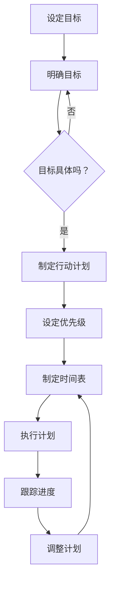

                 


## **《创业者的个人效能提升与习惯养成》**

关键词：创业者、个人效能、提升、习惯养成、时间管理、目标设定、情绪管理、健康生活方式、持续学习。

摘要：本文针对创业者这一特殊群体，从多个维度探讨了个人效能提升与习惯养成的策略。通过分析时间管理、目标设定、情绪管理、健康生活方式等方面的核心概念，结合实际案例和实践技巧，为创业者提供了一套系统化、可操作的方法论，帮助他们更好地应对创业过程中的挑战。

---

### **第一部分：个人效能提升基础**

#### **第1章：个人效能提升概述**

1. **个人效能的定义与重要性**  
个人效能是指个体在特定时间内完成目标的能力。对于创业者而言，个人效能的提升至关重要，它直接关系到创业项目的成功与否。

2. **个人效能提升的方法论**  
要提升个人效能，创业者需要从以下几个方面入手：
   - 时间管理：合理规划时间，提高工作效率。
   - 目标设定：明确目标，制定可行的行动计划。
   - 情绪管理：调节情绪，保持积极心态。
   - 健康生活方式：保持良好的作息和饮食习惯。

3. **成功创业者的效能提升实践**  
许多成功创业者都注重个人效能的提升。以马云为例，他通过自我管理、团队协作和持续学习，不断提升个人效能，从而推动了阿里巴巴的快速发展。

#### **第2章：时间管理与规划**

1. **时间管理的原则与方法**  
时间管理的原则包括：优先级原则、番茄工作法、时间块管理等。创业者需要根据实际情况选择合适的方法。

2. **如何制定合理的时间规划**  
制定时间规划需要考虑以下几个方面：
   - 目标明确：明确短期和长期目标。
   - 任务分解：将大任务分解为小任务。
   - 时间预估：为每个任务预估所需时间。

3. **提高时间利用率的实用技巧**  
包括：
   - 集中精力：避免多任务处理，专注于当前任务。
   - 避免拖延：设定明确的目标和截止日期。
   - 灵活调整：根据实际情况调整时间规划。

#### **第3章：目标设定与实现**

1. **目标设定的SMART原则**  
SMART原则是指：目标要具体（Specific）、可衡量（Measurable）、可实现（Achievable）、相关（Relevant）和有截止日期（Time-bound）。

2. **设定目标的步骤与方法**  
设定目标需要遵循以下步骤：
   - 明确目标：确定长期和短期目标。
   - 分析现状：了解自身优势和不足。
   - 制定计划：制定具体的行动计划。

3. **实现目标的有效策略**  
实现目标需要：
   - 设定优先级：明确最重要的任务。
   - 分解任务：将大任务分解为小任务。
   - 跟踪进度：定期检查目标的实现情况。

#### **第4章：情绪管理与心态调适**

1. **情绪管理的基本知识**  
情绪管理包括识别、理解、调节和表达自己的情绪。

2. **如何调节负面情绪**  
包括：
   - 深呼吸：缓解紧张和焦虑。
   - 正面思考：转变消极思维模式。
   - 身体运动：释放压力和负面情绪。

3. **保持积极心态的方法**  
包括：
   - 自我激励：设定小目标并庆祝成就。
   - 学习榜样：寻找成功的创业者作为榜样。
   - 保持乐观：相信自己和团队的能力。

#### **第5章：健康生活方式**

1. **健康饮食与运动**  
健康饮食包括：
   - 多吃蔬菜和水果。
   - 控制糖分和油脂摄入。
   - 增加蛋白质摄入。

运动包括：
   - 每周至少进行150分钟的中等强度运动。
   - 保持适当的体重和体脂比例。

2. **如何应对工作压力**  
包括：
   - 合理分配工作时间：避免过度工作。
   - 寻求支持：与朋友、家人和同事交流。
   - 寻找放松方式：如阅读、听音乐、冥想等。

3. **充足的休息与睡眠**  
睡眠对身体健康和认知功能至关重要。创业者应确保每晚获得7-9小时的优质睡眠。

### **第二部分：习惯养成与持续提升**

#### **第6章：习惯养成的原理与实践**

1. **习惯养成的科学原理**  
习惯养成的关键在于重复。通过重复某一行为，大脑会形成固定的神经通路，从而使习惯得以形成。

2. **如何养成良好的习惯**  
养成良好的习惯需要：
   - 设定明确的目标：明确想要养成的习惯。
   - 制定具体的行动计划：分解为小步骤。
   - 保持持续的动力：设定奖励机制。

3. **消除坏习惯的策略**  
消除坏习惯需要：
   - 识别坏习惯：明确坏习惯的具体表现。
   - 制定替代习惯：用新的行为替代旧的习惯。
   - 保持警觉：避免旧习惯的复发。

#### **第7章：建立个人成长体系**

1. **个人成长体系的构建**  
建立个人成长体系需要：
   - 设定长期和短期目标。
   - 持续学习新知识。
   - 定期反思和调整。

2. **如何保持持续学习的动力**  
包括：
   - 设定学习目标：明确学习的目的和方向。
   - 寻找学习伙伴：与他人一起学习，互相激励。
   - 奖励自己：完成学习任务后给予奖励。

3. **创业者应具备的核心能力**  
包括：
   - 领导力：激励和管理团队成员。
   - 商业洞察力：洞察市场和行业的趋势。
   - 技术能力：掌握必要的技术知识。

#### **第8章：实践与反思**

1. **个人效能提升的实践案例**  
通过案例分析，了解其他创业者在提升个人效能方面的成功经验。

2. **成功创业者的反思与分享**  
成功创业者分享他们在个人效能提升和习惯养成过程中的心得体会。

3. **个人效能提升的持续路径**  
创业者应：
   - 定期反思和总结。
   - 不断调整和优化。
   - 保持对未来的期待和信心。

#### **第9章：总结与展望**

1. **个人效能提升与习惯养成的总结**  
本文总结了创业者个人效能提升和习惯养成的关键方法和策略。

2. **未来创业者的个人效能提升趋势**  
随着技术的不断进步和社会环境的变化，未来创业者将在个人效能提升方面面临新的挑战和机遇。

3. **为自己打造持续成长的动力系统**  
创业者应：
   - 建立良好的习惯体系。
   - 保持持续学习的动力。
   - 关注身心健康。

### **附录**

#### **附录A：个人效能提升与习惯养成的工具与资源**

1. **时间管理工具介绍**  
包括Trello、Asana等。

2. **学习资源推荐**  
包括在线课程、书籍、博客等。

3. **个人效能提升的实用APP推荐**  
包括Forest、番茄钟等。

---

### **添加Mermaid流程图、伪代码、数学公式和代码示例**

为了更好地解释相关概念和方法，本文在适当章节中添加了Mermaid流程图、伪代码、数学公式和代码示例。

**第3章：目标设定与实现**

1. **目标设定流程的Mermaid图**



2. **习惯养成过程的伪代码示例**

```python
def 培养新习惯():
    # 设定明确的目标
    目标 = "每天早晨锻炼30分钟"
    
    # 制定具体的行动计划
    行动计划 = [
        "设定闹钟",
        "准备运动装备",
        "开始锻炼",
        "记录锻炼时间"
    ]
    
    # 保持持续的动力
    动力机制 = "每完成一周锻炼，奖励自己一本喜欢的书"

    # 开始培养习惯
    for 计划 in 行动计划:
        执行(计划)
    
    # 检查习惯养成情况
    if 检查(目标):
        奖励自己(动力机制)
    else:
        重新设定目标并开始培养

def 检查(目标):
    # 实现检查目标的方法
    # ...

def 执行(计划):
    # 实现执行计划的方法
    # ...
```

通过这些示例，读者可以更直观地了解目标设定和习惯养成的具体方法。

---

本文以逻辑清晰、结构紧凑、简单易懂的专业的技术语言，为创业者提供了个人效能提升与习惯养成的策略和方法。通过本文的阅读和实践，创业者将能够更好地提升个人效能，养成良好习惯，从而在创业道路上取得更大成就。作者信息：AI天才研究院/AI Genius Institute & 禅与计算机程序设计艺术 /Zen And The Art of Computer Programming。

