                 

# 文章标题：《创业者的健康管理与压力调节》

> 关键词：健康管理、压力调节、创业、心理健康、生理健康

> 摘要：本文旨在探讨创业者在面对高强度工作环境和巨大压力时，如何通过有效的健康管理策略和压力调节方法，保持良好的身心健康，从而提升创业成功率。文章首先介绍了创业者的健康与压力现状，随后详细阐述了健康管理的核心概念、基本原则、压力调节的策略与方法，并结合实际案例进行分析，为创业者提供实用的健康管理建议。

---

### 《创业者的健康管理与压力调节》目录大纲

# 第一部分：健康管理的理论基础

## 第1章：创业者的健康与压力现状
### 1.1.1 创业者健康问题的普遍性
### 1.1.2 压力对创业者的危害
### 1.1.3 健康管理与压力调节的重要性

## 第2章：健康管理的核心概念
### 2.1.1 生理健康与心理健康
### 2.1.2 健康管理的四大要素
### 2.1.3 压力调节的心理学原理

## 第3章：健康管理的基本原则
### 3.1.1 全生命周期健康管理
### 3.1.2 因地制宜的健康管理
### 3.1.3 持续性与个性化原则

# 第二部分：压力调节的策略与方法

## 第4章：压力源识别与评估
### 4.1.1 压力源的类型与特点
### 4.1.2 压力评估的工具与方法
### 4.1.3 压力预警与早期干预

## 第5章：压力调节的心理技巧
### 5.1.1 认知行为疗法
### 5.1.2 正念冥想与深呼吸
### 5.1.3 积极心理学技巧

## 第6章：压力调节的物理技巧
### 6.1.1 运动与健康生活方式
### 6.1.2 生物反馈疗法
### 6.1.3 休闲与放松技巧

## 第7章：压力调节的社交技巧
### 7.1.1 人际关系与社交支持
### 7.1.2 情绪调节与沟通技巧
### 7.1.3 建立有效的支持网络

## 第8章：压力调节的职场策略
### 8.1.1 时间管理与任务优先级
### 8.1.2 职场健康与工作效率
### 8.1.3 压力管理与职业生涯规划

# 第三部分：创业者的健康管理实践

## 第9章：创业者的健康管理计划
### 9.1.1 健康管理计划的制定
### 9.1.2 健康管理计划的实施
### 9.1.3 健康管理计划的评估与调整

## 第10章：创业者的健康管理案例
### 10.1.1 案例一：从焦虑到放松的转变
### 10.1.2 案例二：通过运动改善健康
### 10.1.3 案例三：构建有效的社交支持网络

## 第11章：创业者的健康管理反思
### 11.1.1 健康管理中的挑战与对策
### 11.1.2 健康管理对创业成功的贡献
### 11.1.3 健康管理的未来趋势与展望

# 附录

## 附录A：健康管理工具与资源
### A.1.1 常用的健康管理APP
### A.1.2 可信的健康管理网站
### A.1.3 健康管理书籍推荐

## 附录B：压力调节技巧实践指南
### B.1.1 实践指南一：认知行为疗法实操
### B.1.2 实践指南二：正念冥想步骤
### B.1.3 实践指南三：运动与健康生活方式规划

---

**作者：** AI天才研究院/AI Genius Institute & 禅与计算机程序设计艺术 /Zen And The Art of Computer Programming

### 第1章：创业者的健康与压力现状

#### 1.1.1 创业者健康问题的普遍性

创业者通常面临着巨大的挑战，从市场不确定性到资源有限，从长期的工作时间到不断变化的企业需求，这些因素共同构成了一个高压的工作环境。在这种环境中，创业者的健康问题日益凸显。研究表明，与普通职业群体相比，创业者更易出现一系列健康问题，包括心理健康问题（如焦虑、抑郁）和生理健康问题（如心血管疾病、睡眠障碍）。

首先，创业者面临的压力主要来自以下几个方面：

1. **市场压力**：创业者需要时刻关注市场动态，快速适应市场变化，这对他们的心理和生理健康都是一大挑战。
2. **资金压力**：资金问题往往是创业过程中的瓶颈，创业者常常为了融资而奔波，长期处于紧张状态。
3. **工作负荷**：创业者通常需要承担多个角色，从市场开拓到团队管理，从产品研发到客户服务，高强度的工作负荷对他们的健康产生负面影响。
4. **人际关系**：创业者需要处理与员工、投资者、合作伙伴等多方面的人际关系，这可能导致心理压力。

#### 1.1.2 压力对创业者的危害

长期的压力会对创业者的身心健康产生严重危害。以下是压力对创业者可能产生的一些具体影响：

1. **心理健康问题**：压力可能导致创业者出现焦虑、抑郁、恐慌等心理问题。这些心理问题不仅影响创业者的生活质量，还可能影响他们的决策能力和创新能力。
2. **生理健康问题**：长期的压力可能导致生理健康问题，如心血管疾病、高血压、糖尿病、消化系统问题等。这些问题不仅影响创业者的健康，还可能影响他们的工作效率和创新能力。
3. **工作表现**：长期的压力会降低创业者的工作表现，导致工作效率下降、创新能力减弱。在激烈的市场竞争中，这可能导致创业失败。

#### 1.1.3 健康管理与压力调节的重要性

面对上述健康问题，健康管理显得尤为重要。健康管理不仅仅是关注身体健康，还包括心理健康和社会适应能力的综合管理。以下是健康管理对创业者的重要意义：

1. **提高生活质量**：通过健康管理，创业者可以减轻压力，改善身心健康，从而提高生活质量，更好地享受生活。
2. **增强工作能力**：健康的身心状态有助于创业者更好地应对工作挑战，提高工作效率和创新能力。
3. **延长职业生涯**：良好的健康管理可以帮助创业者避免因健康问题而提前退出职业生涯，从而延长职业生涯，实现长期成功。

总之，创业者的健康与压力问题是不可忽视的重要问题。通过有效的健康管理策略和压力调节方法，创业者可以更好地应对挑战，实现长期成功。在接下来的章节中，我们将详细探讨健康管理的核心概念、基本原则、压力调节的策略与方法，为创业者提供实用的健康管理建议。接下来，我们将深入探讨健康管理的核心概念。

---

**Mermaid 流程图：健康管理的核心概念关系架构**

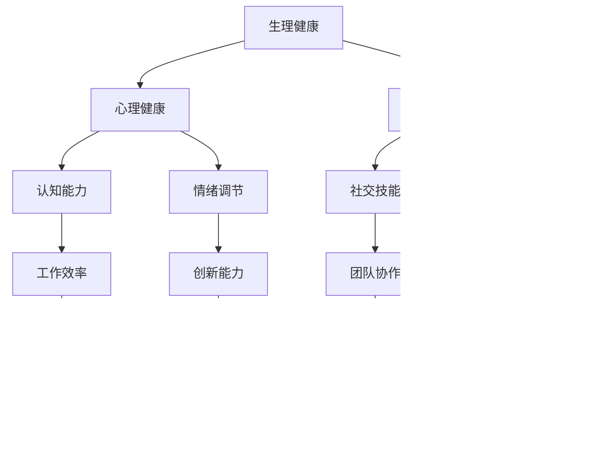
```mermaid
graph TD
    A[生理健康] --> B[心理健康]
    A --> C[社会适应能力]
    B --> D[认知能力]
    B --> E[情绪调节]
    C --> F[社交技能]
    C --> G[压力应对能力]
    D --> H[工作效率]
    E --> I[创新能力]
    F --> J[团队协作]
    G --> K[问题解决能力]
    H --> L[职业发展]
    I --> M[市场洞察力]
    J --> N[人际关系]
    K --> O[决策能力]
    L --> P[创业成功率]
    M --> Q[商业模式创新]
    N --> R[团队凝聚力]
    O --> S[战略规划]
```

---

### 第2章：健康管理的核心概念

#### 2.1.1 生理健康与心理健康

健康管理包含两个核心方面：生理健康和心理健康。这两个方面相互影响，共同决定了个体的整体健康状态。

**生理健康**指的是身体各系统的正常运作和整体身体状况。它包括营养、运动、睡眠、免疫系统和身体功能等多个方面。生理健康不仅影响个体的身体状态，还会影响其心理状态和社交能力。

**心理健康**则涉及情绪、认知和行为的各个方面。它包括情感调节、自我意识、社会适应能力、压力应对能力和精神状态等。心理健康对个体的生活质量、工作表现和人际关系都有重要影响。

**核心概念联系**：生理健康和心理健康是相互依存的。良好的生理健康可以促进心理健康，反之亦然。例如，足够的睡眠和营养可以改善情绪，减少焦虑和抑郁。而积极的心态和良好的情感调节能力可以帮助个体更好地应对生理上的不适和挑战。

**Mermaid 流程图：生理健康与心理健康的关系**

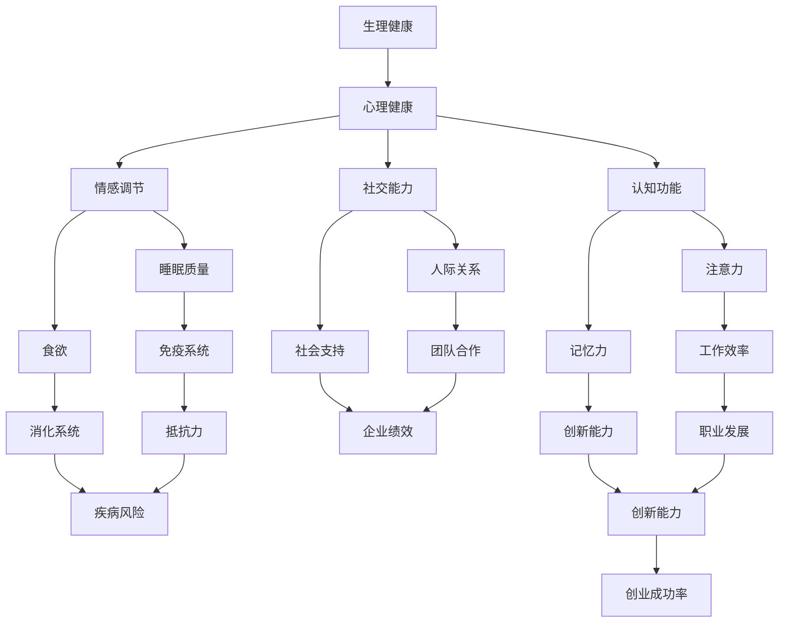
```mermaid
graph TD
    A[生理健康] --> B[心理健康]
    B --> C[情感调节]
    B --> D[认知功能]
    B --> E[社交能力]
    C --> F[睡眠质量]
    C --> G[食欲]
    D --> H[注意力]
    D --> I[记忆力]
    E --> J[人际关系]
    E --> K[社会支持]
    F --> L[免疫系统]
    G --> M[消化系统]
    H --> N[工作效率]
    I --> O[创新能力]
    J --> P[团队合作]
    K --> Q[情感支持]
    L --> R[抵抗力]
    M --> S[代谢率]
    N --> T[职业发展]
    O --> U[市场洞察力]
    P --> Q[企业绩效]
    R --> S[疾病风险]
    T --> U[创新能力]
    U --> V[创业成功率]
```

#### 2.1.2 健康管理的四大要素

健康管理涉及多个方面，但可以归结为四大核心要素：营养、运动、睡眠和心理调节。这些要素相互支持，共同维护个体的整体健康。

1. **营养**：营养是健康的基础。良好的营养可以通过提供必需的营养素，维持身体正常功能，增强免疫系统，减少慢性疾病风险。合理的饮食应包括丰富的蔬菜、水果、全谷物、优质蛋白质和健康脂肪。

2. **运动**：运动是维持身体健康和心理健康的关键。适量的运动可以提高心血管健康、增强肌肉和骨骼、改善情绪、减轻压力。无论是有氧运动、力量训练还是柔韧性训练，都应成为健康生活的一部分。

3. **睡眠**：充足的睡眠是恢复身心的重要手段。良好的睡眠有助于记忆巩固、情绪调节、免疫系统的维护。缺乏睡眠会影响认知功能、情绪状态和整体健康。

4. **心理调节**：心理调节包括情感管理、压力应对和心理健康维护。通过认知行为疗法、正念冥想和社交支持等手段，个体可以更好地管理情绪，应对压力，提高生活质量。

**核心概念联系**：这四大要素相互影响，共同构成一个健康的循环。营养为身体提供能量和修复所需的物质，运动增强身体素质和心理健康，充足的睡眠有助于身体和大脑的恢复，心理调节则帮助个体更好地应对压力和情绪波动。

**Mermaid 流�图：健康管理的四大要素关系**

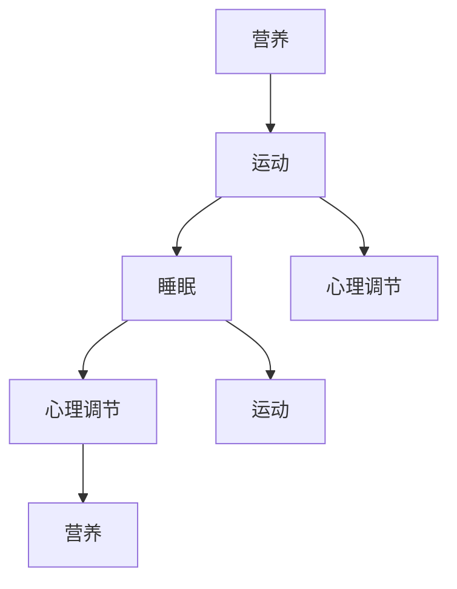
```mermaid
graph TD
    A[营养] --> B[运动]
    B --> C[睡眠]
    C --> D[心理调节]
    D --> E[营养]
    B --> F[心理调节]
    C --> G[运动]
```

#### 2.1.3 压力调节的心理学原理

在健康管理中，压力调节是一个重要的组成部分。压力调节不仅有助于缓解压力，还能提高心理健康和生活质量。

1. **认知行为疗法**：认知行为疗法（CBT）是一种通过改变负面思维模式和行为来减轻压力和改善心理健康的方法。它强调认知（思维）和行为（行动）之间的关系，通过认知重构、行为实验和技能训练，帮助个体更好地应对压力。

2. **正念冥想**：正念冥想是一种通过专注呼吸和当下体验来减轻压力、提高情绪调节能力的方法。正念冥想可以帮助个体更好地管理情绪，提高注意力，减少焦虑和抑郁。

3. **社交支持**：社交支持是指通过与他人互动获得情感、信息和支持的过程。社交支持有助于减轻压力，提高心理健康。与他人分享感受、寻求帮助和支持可以增强个体的情绪稳定性和应对能力。

**核心概念联系**：压力调节的心理学原理与生理健康和心理健康密切相关。认知行为疗法和正念冥想通过改变思维和行为模式，直接影响心理健康。而社交支持则通过提供情感和实际支持，帮助个体更好地应对压力，维护整体健康。

**Mermaid 流程图：压力调节的心理学原理**

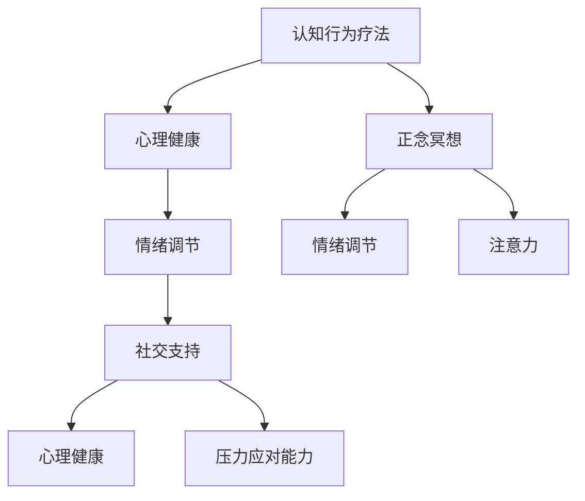
```mermaid
graph TD
    A[认知行为疗法] --> B[心理健康]
    B --> C[情绪调节]
    A --> D[正念冥想]
    D --> E[情绪调节]
    D --> F[注意力]
    C --> G[社交支持]
    G --> H[心理健康]
    G --> I[压力应对能力]
```

通过以上章节的探讨，我们可以看到健康管理在创业者的生活中扮演着至关重要的角色。理解健康管理的核心概念和压力调节的心理学原理，是创业者保持身心健康，提高创业成功率的第一步。在接下来的章节中，我们将进一步探讨健康管理的基本原则，为创业者提供更具体的指导。

---

### 第3章：健康管理的基本原则

#### 3.1.1 全生命周期健康管理

全生命周期健康管理是指在整个生命过程中，持续关注和优化个体的健康状态。它涵盖了从出生到老年各个阶段，以应对不同阶段的健康挑战。

**全生命周期健康管理的重要性**：

1. **预防疾病**：通过早期发现和干预，全生命周期健康管理可以预防许多慢性疾病，如心血管疾病、糖尿病和癌症。
2. **提高生活质量**：全生命周期健康管理有助于个体保持健康的生活方式，提高生活质量和幸福感。
3. **延长健康寿命**：通过持续的健康管理，个体可以延长健康寿命，实现健康老龄化。

**应用实例**：

- **儿童与青少年**：通过合理的饮食、适量的运动和定期的健康检查，儿童和青少年可以建立良好的健康习惯，预防肥胖和慢性疾病。
- **成年人**：成年人的健康管理应侧重于保持良好的体重、控制慢性疾病风险、定期体检和保持积极的生活方式。
- **老年人**：老年人的健康管理应关注慢性疾病管理、营养补充、身体活动和心理健康。

**Mermaid 流程图：全生命周期健康管理**

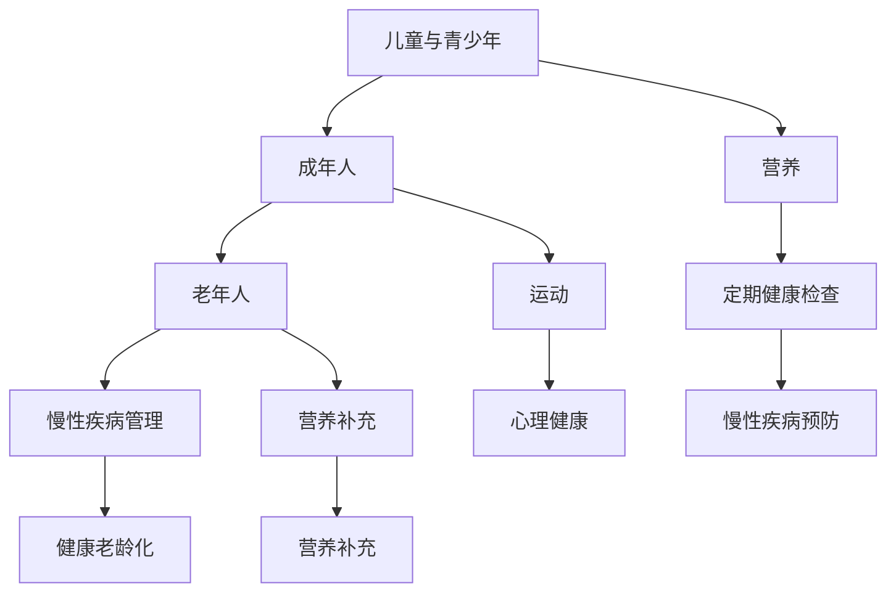
```mermaid
graph TD
    A[儿童与青少年] --> B[成年人]
    B --> C[老年人]
    A --> D[营养]
    B --> E[运动]
    C --> F[慢性疾病管理]
    C --> G[营养补充]
    D --> H[定期健康检查]
    E --> I[心理健康]
    F --> J[健康老龄化]
    G --> K[营养补充]
    H --> L[慢性疾病预防]
```

#### 3.1.2 因地制宜的健康管理

因地制宜的健康管理是指根据个体所处的地理环境和生活条件，制定相应的健康管理策略。这种策略考虑到不同地区的气候、饮食文化和生活方式差异，旨在提高健康管理的针对性和有效性。

**因地制宜的健康管理的重要性**：

1. **适应环境**：因地制宜的健康管理可以帮助个体更好地适应环境，减少环境因素对健康的负面影响。
2. **文化差异**：不同地区的饮食文化和生活方式差异很大，因地制宜的健康管理可以更好地适应这些差异，提高健康管理的适应性。
3. **提高效果**：因地制宜的健康管理策略可以更有效地满足个体在特定环境下的健康需求，提高健康管理的效果。

**应用实例**：

- **城市居民**：城市居民面临噪音、空气污染和快节奏生活等挑战，应注重空气质量的改善、定期锻炼和心理健康管理。
- **农村居民**：农村居民面临体力劳动、水质问题和饮食不均衡等问题，应注重营养搭配、饮用水质量和身体健康管理。
- **高温地区居民**：高温地区居民应注重防晒、补水、饮食清淡和避免过度劳累。

**Mermaid 流程图：因地制宜的健康管理**

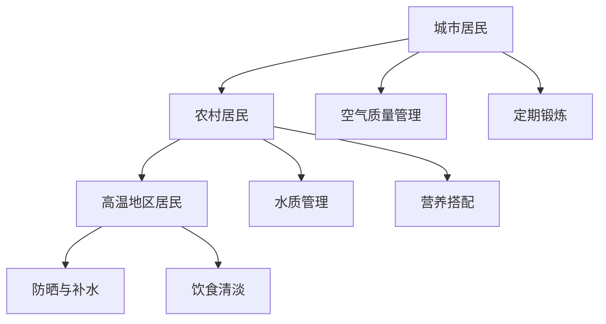
```mermaid
graph TD
    A[城市居民] --> B[农村居民]
    B --> C[高温地区居民]
    A --> D[空气质量管理]
    B --> E[水质管理]
    C --> F[防晒与补水]
    A --> G[定期锻炼]
    B --> H[营养搭配]
    C --> I[饮食清淡]
```

#### 3.1.3 持续性与个性化原则

持续性和个性化原则是健康管理的两个重要原则，它们确保健康管理策略能够长期有效，并适应个体的特定需求。

**持续性的重要性**：

1. **长期效果**：持续的健康管理策略可以长期维持健康状态，防止疾病复发。
2. **生活方式改变**：持续的健康管理可以帮助个体养成健康的生活方式，如合理饮食、适量运动等。
3. **预防疾病**：通过持续的健康管理，个体可以预防慢性疾病的发生，提高生活质量。

**个性化的重要性**：

1. **个体差异**：每个人的健康状况和生活环境都不同，个性化的健康管理策略可以更好地满足个体的需求。
2. **高效管理**：个性化的健康管理策略可以更有效地解决个体的健康问题，提高健康管理的效果。
3. **灵活性**：个性化的健康管理策略可以根据个体的情况进行调整，确保长期有效。

**应用实例**：

- **个性化饮食计划**：根据个体的身体状况、口味偏好和饮食需求，制定个性化的饮食计划，提高营养摄入。
- **个性化运动方案**：根据个体的健康状况、体能水平和兴趣爱好，制定个性化的运动方案，提高运动效果。
- **个性化心理健康管理**：根据个体的心理特点和压力来源，制定个性化的心理健康管理方案，提高心理健康水平。

**Mermaid 流程图：持续性与个性化原则**

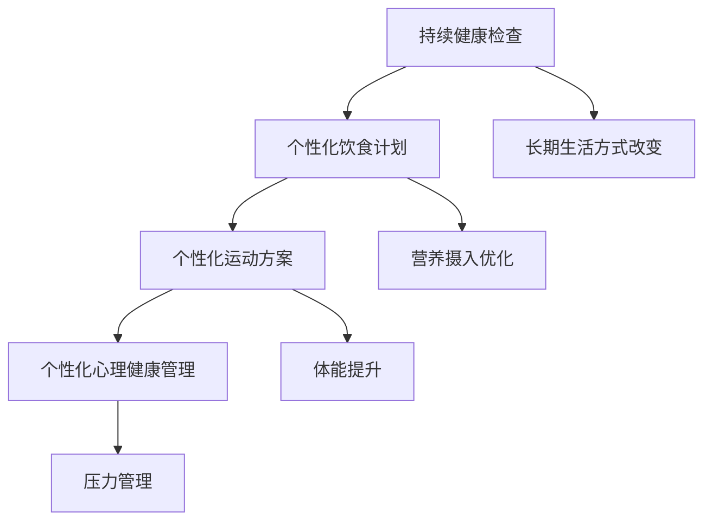
```mermaid
graph TD
    A[持续健康检查] --> B[个性化饮食计划]
    B --> C[个性化运动方案]
    C --> D[个性化心理健康管理]
    A --> E[长期生活方式改变]
    B --> F[营养摄入优化]
    C --> G[体能提升]
    D --> H[压力管理]
```

通过以上讨论，我们可以看到健康管理的基本原则在全生命周期健康管理、因地制宜的健康管理以及持续性和个性化原则中得到了充分体现。这些原则为创业者提供了具体的健康管理指导，有助于他们保持身心健康，提高创业成功率。在接下来的章节中，我们将深入探讨压力调节的策略与方法，帮助创业者更有效地应对压力。

---

### 第4章：压力源识别与评估

#### 4.1.1 压力源的类型与特点

压力源是指能够引起个体压力反应的内外部刺激。了解压力源的类型和特点是进行有效压力管理的基础。

**常见压力源类型**：

1. **工作压力**：包括工作任务繁重、工作时长过长、工作不稳定和竞争激烈等。工作压力是创业者面临的主要压力源之一。
2. **经济压力**：包括资金问题、债务压力和收入不稳定等。经济压力可能导致创业者在财务管理上感到焦虑和不安。
3. **人际关系**：包括与员工、合作伙伴和客户的关系问题，以及家庭和朋友的矛盾等。人际关系问题可能导致情感压力和心理负担。
4. **个人问题**：包括健康问题、家庭问题和个人生活变化等。个人问题可能直接影响创业者的生活质量和工作状态。

**特点**：

1. **多样性**：压力源种类繁多，不同个体面临的压力源可能完全不同。
2. **动态性**：压力源会随着时间和环境的变化而变化，创业者需要不断调整应对策略。
3. **累积性**：多个压力源可能会相互作用，加剧个体的压力反应。

#### 4.1.2 压力评估的工具与方法

为了有效地管理压力，创业者需要了解自身的压力状况。以下是几种常见的压力评估工具和方法：

1. **压力问卷**：压力问卷是一种简单的评估工具，通过一系列问题来了解个体的压力水平和压力源。常见的压力问卷包括《斯坦福大学压力评分量表》和《一般性压力量表》等。

2. **心理测试**：心理测试可以帮助创业者深入了解自己的心理状态和压力反应。例如，认知行为疗法（CBT）中的心理测试可以帮助创业者识别负面思维模式。

3. **生理指标监测**：生理指标监测包括心率、血压、皮质醇水平等。这些指标可以反映个体的压力反应。例如，长期高水平的皮质醇可能导致慢性压力和健康问题。

**Mermaid 流程图：压力评估方法**

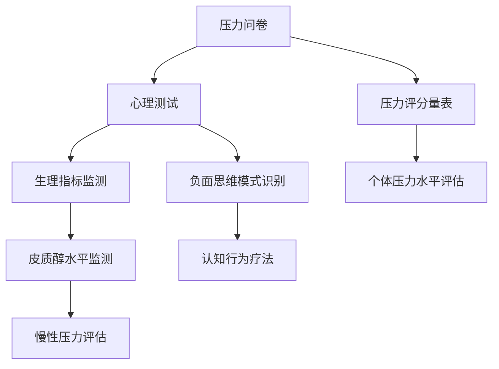
```mermaid
graph TD
    A[压力问卷] --> B[心理测试]
    B --> C[生理指标监测]
    A --> D[压力评分量表]
    B --> E[负面思维模式识别]
    C --> F[皮质醇水平监测]
    D --> G[个体压力水平评估]
    E --> H[认知行为疗法]
    F --> I[慢性压力评估]
```

4. **日记记录**：创业者可以通过日记记录每日的压力事件和情绪变化，帮助自己了解压力的来源和影响。

**应用实例**：

- **压力问卷**：创业者可以使用《一般性压力量表》评估自己的压力水平，了解自己在工作、经济和人际关系方面的压力状况。
- **心理测试**：创业者可以参加认知行为疗法（CBT）中的心理测试，识别自己的负面思维模式，并学习如何调整这些思维模式。
- **生理指标监测**：创业者可以通过定期测量心率、血压和皮质醇水平，监控自己的生理压力反应，及时采取应对措施。

#### 4.1.3 压力预警与早期干预

早期发现和干预压力是有效管理压力的关键。以下是一些预警信号和早期干预方法：

**预警信号**：

1. **情绪变化**：长期的压力可能导致情绪波动，如焦虑、抑郁、易怒等。
2. **生理变化**：长期的压力可能导致生理症状，如失眠、头痛、消化问题等。
3. **行为变化**：长期的压力可能导致行为变化，如过度工作、逃避问题、依赖酒精或药物等。
4. **社会功能下降**：长期的压力可能导致社会功能下降，如人际关系紧张、工作表现下降等。

**早期干预方法**：

1. **认知行为疗法**：认知行为疗法（CBT）可以帮助创业者识别和改变负面思维模式，提高应对压力的能力。
2. **正念冥想**：正念冥想可以帮助创业者放松身心，提高情绪调节能力，减轻压力。
3. **运动**：适量的运动可以释放压力，改善心理健康，增强身体素质。
4. **社交支持**：建立有效的社交支持网络，寻求家人、朋友或专业人士的帮助，有助于应对压力。
5. **休息和放松**：确保充足的休息和放松时间，有助于缓解压力，恢复精力。

**Mermaid 流程图：压力预警与早期干预**

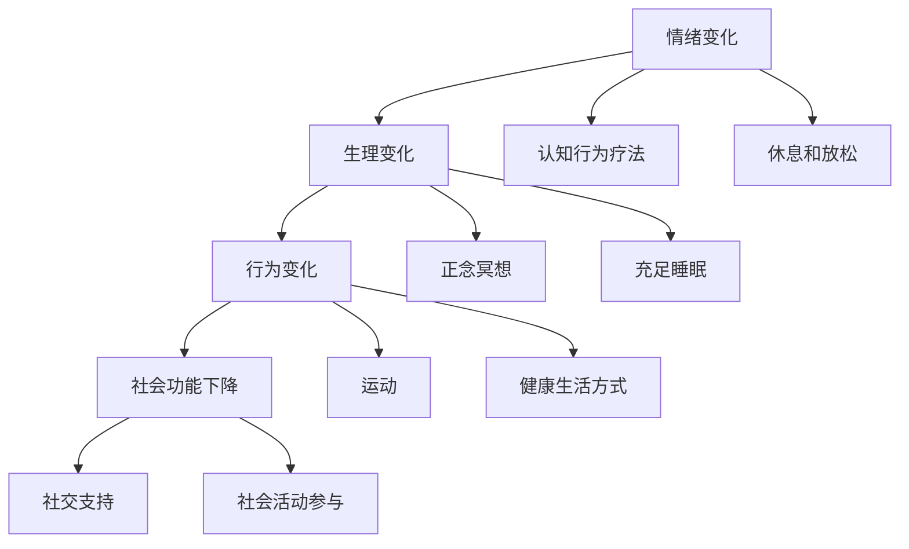
```mermaid
graph TD
    A[情绪变化] --> B[生理变化]
    B --> C[行为变化]
    C --> D[社会功能下降]
    A --> E[认知行为疗法]
    B --> F[正念冥想]
    C --> G[运动]
    D --> H[社交支持]
    A --> I[休息和放松]
    B --> J[充足睡眠]
    C --> K[健康生活方式]
    D --> L[社会活动参与]
```

通过识别和评估压力源，以及采取有效的早期干预措施，创业者可以更好地管理压力，保持身心健康。在下一章节中，我们将进一步探讨压力调节的心理技巧，帮助创业者更好地应对压力。

---

### 第5章：压力调节的心理技巧

#### 5.1.1 认知行为疗法

认知行为疗法（CBT）是一种通过改变负面思维模式和行为来减轻压力和改善心理健康的心理治疗方法。它基于一个假设：我们的思维方式和行为模式直接影响我们的情绪和心理健康。

**核心原理**：

- **认知重构**：识别和挑战负面思维模式，将其转变为更积极、合理的思维模式。
- **行为实验**：通过实际行为来测试和验证新的思维模式的有效性。
- **技能训练**：学习各种应对压力和情绪调节的技能，如放松技巧、应对策略和自我对话技巧。

**应用实例**：

- **应对焦虑**：通过认知重构，将“我必须完美完成任务”这种不合理的思维转变为“我可以尽力而为，但结果并不是唯一重要的”。通过行为实验，如逐步面对引发焦虑的情境，创业者可以逐渐克服焦虑。
- **改善情绪**：通过技能训练，如深呼吸、正念冥想和积极自我对话，创业者可以学会更好地调节情绪，减轻负面情绪的影响。

**Mermaid 流程图：认知行为疗法的核心原理**

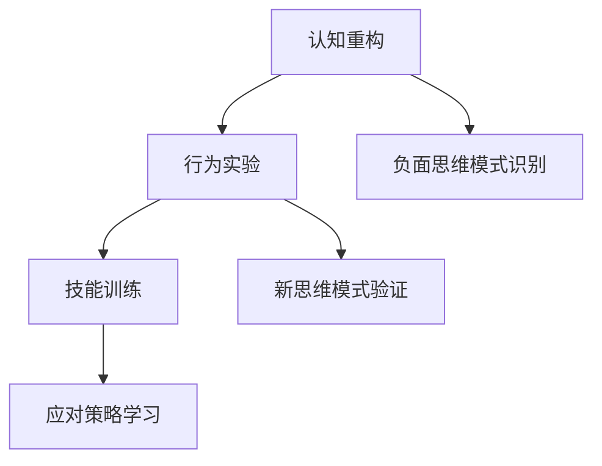
```mermaid
graph TD
    A[认知重构] --> B[行为实验]
    B --> C[技能训练]
    A --> D[负面思维模式识别]
    B --> E[新思维模式验证]
    C --> F[应对策略学习]
```

#### 5.1.2 正念冥想与深呼吸

正念冥想和深呼吸是两种简单有效的压力调节技巧，它们通过提高个体的专注力和情绪调节能力，帮助创业者更好地应对压力。

**正念冥想**：

- **定义**：正念冥想是一种通过专注当下体验来减轻压力和改善心理健康的方法。它强调对当前感受、思想和情绪的接纳和无评判。
- **步骤**：
  1. 找一个安静的地方，坐下或躺下，保持身体放松。
  2. 将注意力集中在呼吸上，感受每次吸气和呼气。
  3. 当注意力分散时，轻轻地将注意力拉回呼吸。
  4. 持续进行，每次冥想的时间可以从几分钟开始，逐渐增加。

**深呼吸**：

- **定义**：深呼吸是一种通过深吸气、深呼气来放松身体和心灵的方法。它有助于降低心率和血压，缓解紧张和焦虑。
- **步骤**：
  1. 坐直或站立，保持背部挺直。
  2. 用鼻子深吸气，感受腹部膨胀。
  3. 屏住呼吸几秒钟，然后缓慢呼气，感受腹部收缩。
  4. 重复几次，每次深呼吸的时间可以从几秒开始，逐渐增加。

**Mermaid 流程图：正念冥想与深呼吸**

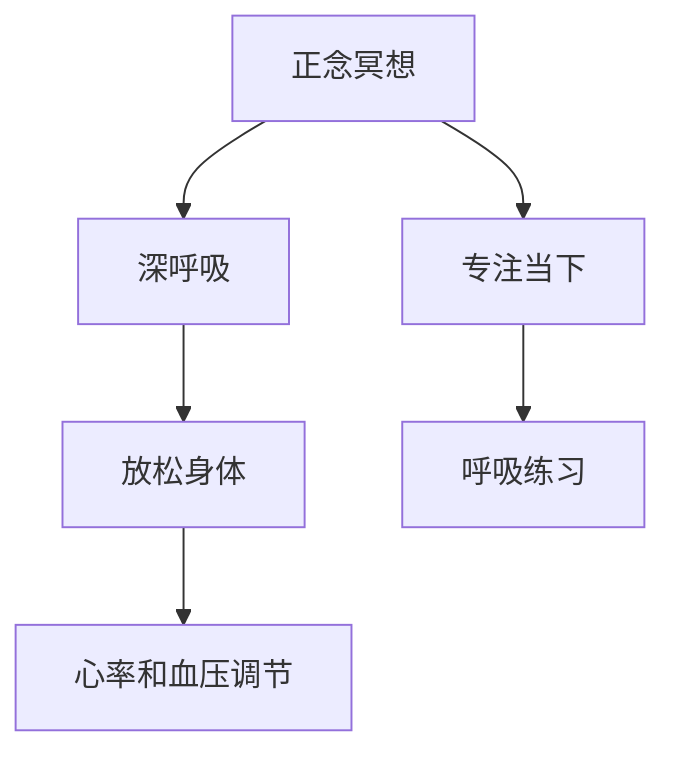
```mermaid
graph TD
    A[正念冥想] --> B[深呼吸]
    A --> C[专注当下]
    B --> D[放松身体]
    C --> E[呼吸练习]
    D --> F[心率和血压调节]
```

**应用实例**：

- **缓解焦虑**：创业者可以在紧张的工作间隙进行正念冥想，通过专注呼吸和当下体验，减轻焦虑和压力。
- **提高专注力**：通过深呼吸练习，创业者可以更好地集中注意力，提高工作效率。

#### 5.1.3 积极心理学技巧

积极心理学是研究如何培养幸福感和提升生活质量的心理学分支。它强调通过积极的态度和行为来促进个体的心理健康。

**核心原理**：

- **积极情感**：积极心理学强调积极情感对心理健康的重要性，通过培养和维持积极情感，个体可以更好地应对压力和挑战。
- **优势识别**：积极心理学鼓励个体识别和利用自己的优势，通过发挥优势，个体可以更好地实现自我价值和满足感。
- **感恩练习**：感恩练习是一种通过感激生活中的人和事物来提升幸福感的方法。通过定期记录感恩的事项，个体可以培养积极的心态。

**应用实例**：

- **提升幸福感**：创业者可以通过记录感恩日记，每天写下三件感激的事情，提高自己的幸福感。
- **发挥优势**：创业者可以定期评估自己的优势，将优势应用到工作和生活中，提高工作效率和生活质量。

**Mermaid 流程图：积极心理学技巧**

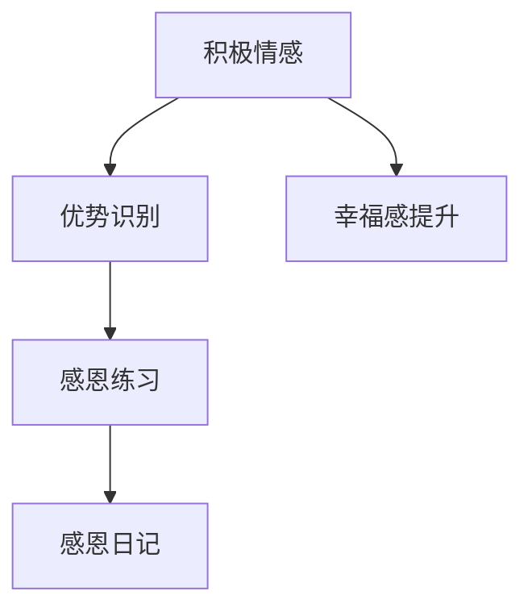
```mermaid
graph TD
    A[积极情感] --> B[优势识别]
    B --> C[感恩练习]
    A --> D[幸福感提升]
    C --> E[感恩日记]
```

通过认知行为疗法、正念冥想与深呼吸、积极心理学技巧等心理技巧，创业者可以更有效地调节压力，提升心理健康。这些技巧不仅可以帮助创业者更好地应对日常压力，还能提高生活质量和工作效率。在下一章节中，我们将探讨压力调节的物理技巧，为创业者提供更多应对压力的方法。

---

### 第6章：压力调节的物理技巧

#### 6.1.1 运动与健康生活方式

运动是减轻压力、提升身心健康的有效方法之一。通过运动，创业者可以释放身体中的紧张和焦虑，提高心情，增强身体素质。

**运动对压力调节的作用**：

1. **释放内啡肽**：运动可以刺激身体分泌内啡肽，这是一种天然镇痛剂和愉悦激素，有助于减轻压力和提升心情。
2. **改善心理状态**：运动有助于减轻焦虑、抑郁等心理问题，提高情绪调节能力。
3. **增强免疫系统**：定期运动可以增强免疫系统，提高身体抵抗力，减少生病的风险。
4. **提高睡眠质量**：运动有助于改善睡眠质量，促进深睡眠，减轻失眠问题。

**推荐的运动类型**：

- **有氧运动**：如快走、跑步、游泳、骑自行车等，有助于提高心肺功能和耐力。
- **力量训练**：如举重、俯卧撑、深蹲等，有助于增强肌肉力量和骨骼健康。
- **柔韧性训练**：如瑜伽、普拉提等，有助于提高柔韧性和身体平衡。

**Mermaid 流程图：运动对压力调节的作用**

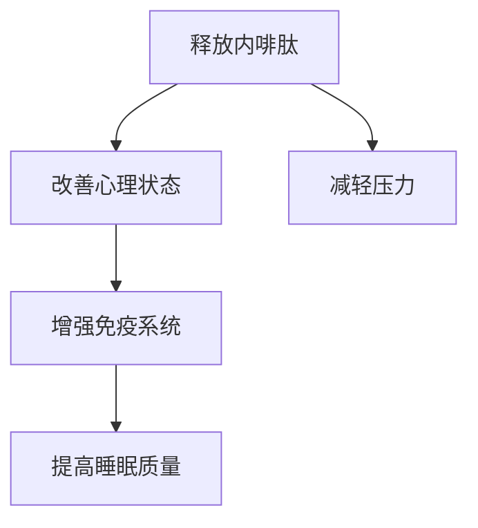
```mermaid
graph TD
    A[释放内啡肽] --> B[改善心理状态]
    B --> C[增强免疫系统]
    C --> D[提高睡眠质量]
    A --> E[减轻压力]
```

**应用实例**：

- **焦虑缓解**：创业者可以在工作间隙进行快速跑步或快走，通过释放内啡肽，缓解焦虑情绪。
- **情绪提升**：定期进行瑜伽或普拉提练习，通过改善心理状态，提升心情。

#### 6.1.2 生物反馈疗法

生物反馈疗法是一种通过监测和反馈生理信号来调节身体反应的方法。通过生物反馈，创业者可以学会如何控制自己的生理反应，如心率、血压和肌肉紧张等。

**原理**：

- **监测生理信号**：生物反馈设备可以实时监测生理信号，如心率、血压和皮肤电活动等。
- **反馈调节**：通过设备提供的即时反馈，创业者可以学会如何调节自己的生理反应，如放松肌肉、控制呼吸等。

**应用实例**：

- **焦虑管理**：创业者可以使用生物反馈设备监测自己的心率，通过深呼吸和放松肌肉，学会降低心率和缓解焦虑。
- **压力调节**：在会议或重要项目期间，创业者可以使用生物反馈设备来监控和调节自己的生理反应，保持冷静和专注。

**Mermaid 流程图：生物反馈疗法的原理**

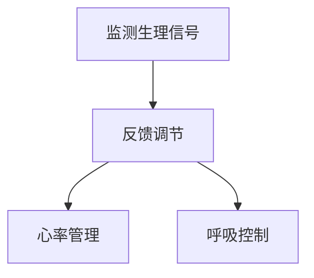
```mermaid
graph TD
    A[监测生理信号] --> B[反馈调节]
    B --> C[心率管理]
    B --> D[呼吸控制]
```

#### 6.1.3 休闲与放松技巧

休闲与放松技巧是创业者应对压力的重要手段，它们可以帮助创业者从紧张的工作状态中解脱出来，恢复精力。

**常用放松技巧**：

- **深呼吸练习**：通过深吸气、深呼气，放松身体和心灵。
- **冥想**：通过专注呼吸和当下体验，减轻焦虑和压力。
- **瑜伽**：通过一系列体式和呼吸练习，放松身心，提高柔韧性和平衡感。
- **阅读**：阅读有助于放松大脑，减少思考，提升心情。

**应用实例**：

- **快速放松**：在紧张的工作间隙，创业者可以进行5分钟的深呼吸练习，通过深呼吸和放松肌肉，快速缓解压力。
- **周末放松**：创业者可以利用周末时间进行瑜伽练习，通过放松技巧和身体活动，彻底放松身心。

**Mermaid 流程图：休闲与放松技巧**

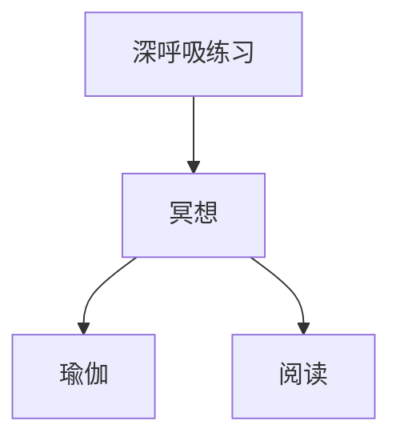
```mermaid
graph TD
    A[深呼吸练习] --> B[冥想]
    B --> C[瑜伽]
    B --> D[阅读]
```

通过运动、生物反馈疗法和休闲与放松技巧，创业者可以更有效地调节压力，保持身心健康。这些物理技巧不仅有助于缓解日常压力，还能提高生活质量和工作效率。在下一章节中，我们将探讨压力调节的社交技巧，帮助创业者建立有效的支持网络。

---

### 第7章：压力调节的社交技巧

#### 7.1.1 人际关系与社交支持

人际关系和社交支持在压力调节中发挥着重要作用。良好的社交网络不仅可以提供情感支持，还能帮助创业者更好地应对压力和挑战。

**人际关系的重要性**：

1. **情感支持**：与亲朋好友交流，分享压力和困惑，可以获得情感上的安慰和支持，减轻心理负担。
2. **信息交流**：通过社交网络，创业者可以获取行业动态、市场信息和商业机会，提高自身的竞争力。
3. **资源共享**：良好的社交关系有助于创业者获取资源和帮助，如资金、技术、人才等，从而更好地应对创业挑战。

**社交支持网络的作用**：

1. **情绪调节**：社交支持网络可以帮助创业者调节情绪，减少焦虑和抑郁，提高心理健康。
2. **应对压力**：在面临压力和挑战时，社交支持网络可以提供实际帮助和情感支持，帮助创业者更好地应对。
3. **职业发展**：社交支持网络有助于创业者拓展职业网络，获取职业机会和发展空间。

**Mermaid 流程图：人际关系与社交支持**

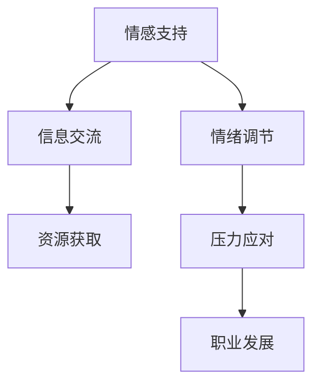
```mermaid
graph TD
    A[情感支持] --> B[信息交流]
    B --> C[资源获取]
    A --> D[情绪调节]
    D --> E[压力应对]
    E --> F[职业发展]
```

#### 7.1.2 情绪调节与沟通技巧

情绪调节和沟通技巧是创业者建立和维护良好人际关系的关键。有效的情绪调节和沟通技巧可以帮助创业者更好地处理压力，建立信任和合作。

**情绪调节技巧**：

1. **自我意识**：了解自己的情绪，识别情绪触发点，有助于更好地管理情绪。
2. **情感表达**：学会表达自己的情绪，避免情绪压抑和爆发，提高沟通效果。
3. **情感释放**：通过适当的渠道（如倾诉、运动等）释放负面情绪，保持心理健康。

**沟通技巧**：

1. **倾听**：倾听是有效沟通的关键，通过倾听他人，可以更好地理解对方的需求和观点。
2. **清晰表达**：学会清晰、准确地表达自己的想法和需求，避免误解和冲突。
3. **同理心**：站在对方的角度思考问题，理解对方的感受和需求，提高沟通的亲和力。

**Mermaid 流程图：情绪调节与沟通技巧**

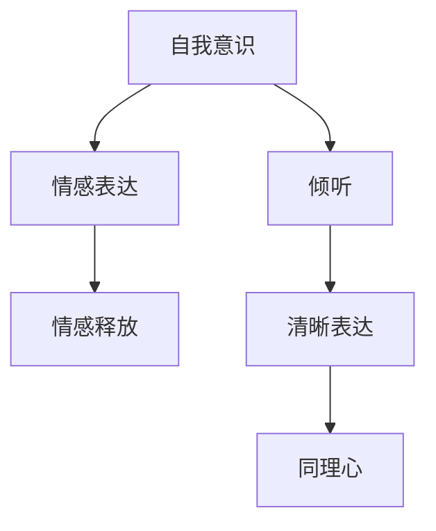
```mermaid
graph TD
    A[自我意识] --> B[情感表达]
    B --> C[情感释放]
    A --> D[倾听]
    D --> E[清晰表达]
    E --> F[同理心]
```

**应用实例**：

- **情绪调节**：在团队会议中，创业者可以通过深呼吸和冥想来调节情绪，保持冷静和专注，避免情绪化决策。
- **沟通技巧**：在处理客户投诉时，创业者可以通过倾听、同理心和清晰表达，有效解决客户问题，维护客户关系。

#### 7.1.3 建立有效的支持网络

建立有效的支持网络是创业者应对压力和挑战的重要策略。以下是一些建立和维护支持网络的建议：

1. **积极参与社交活动**：创业者应积极参与行业聚会、创业论坛和社交活动，拓展职业网络。
2. **建立信任关系**：通过真诚、诚信和合作，建立和维护与合作伙伴、投资者和员工的信任关系。
3. **定期交流**：与支持网络成员保持定期交流，分享经验和资源，共同成长。
4. **求助与互助**：在遇到问题时，积极向支持网络求助，同时愿意帮助他人，建立互惠互助的关系。

**Mermaid 流程图：建立有效的支持网络**

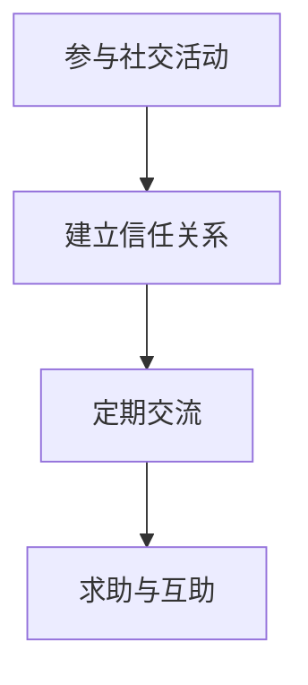
```mermaid
graph TD
    A[参与社交活动] --> B[建立信任关系]
    B --> C[定期交流]
    C --> D[求助与互助]
```

通过人际关系和社交支持，创业者可以更好地应对压力，提高生活质量和工作效率。在下一章节中，我们将探讨压力调节的职场策略，为创业者提供更具体的职场压力管理方法。

---

### 第8章：压力调节的职场策略

#### 8.1.1 时间管理与任务优先级

时间管理和任务优先级是创业者应对职场压力的重要策略。有效的时间管理可以帮助创业者更高效地完成工作任务，减少不必要的压力。

**时间管理策略**：

1. **制定日程安排**：创业者应制定详细的日程安排，包括工作、休息和学习时间。这有助于明确工作目标和任务，提高工作效率。
2. **设定优先级**：根据任务的重要性和紧急程度，设定任务优先级。重要且紧急的任务应优先处理，重要但不紧急的任务可以安排在空闲时间处理。
3. **避免拖延**：创业者应学会避免拖延，通过设定具体的目标和截止日期，确保任务按时完成。

**任务优先级设定方法**：

1. **四象限法**：将任务分为四个象限，根据任务的重要性和紧急程度进行分类。重要且紧急的任务应立即处理，重要但不紧急的任务可以安排在空闲时间，紧急但不重要的任务可以委托他人处理，不重要且不紧急的任务可以暂时搁置。
2. **ABC分类法**：将任务分为A、B、C三类，A类任务是最重要且紧急的，B类任务是重要但不紧急的，C类任务是次要的。创业者应优先处理A类任务，然后是B类任务，最后是C类任务。

**Mermaid 流�程图：任务优先级设定方法**

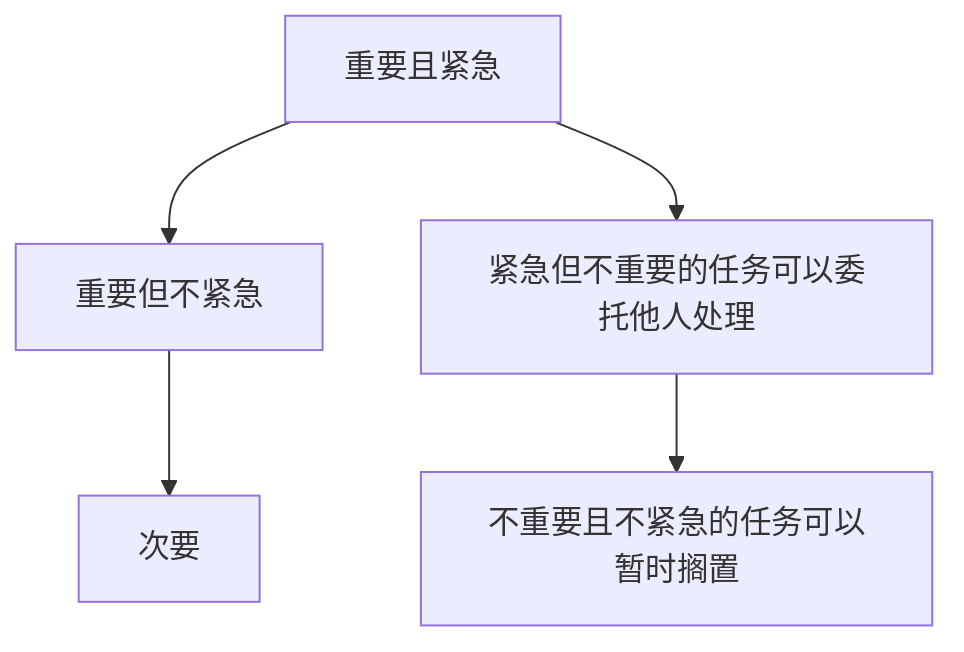
```mermaid
graph TD
    A[重要且紧急] --> B[重要但不紧急]
    B --> C[次要]
    A --> D[紧急但不重要的任务可以委托他人处理]
    D --> E[不重要且不紧急的任务可以暂时搁置]
```

**应用实例**：

- **日程安排**：创业者可以每天早上制定日程安排，包括会议、工作任务和个人休息时间，确保时间得到合理利用。
- **优先级设定**：在处理工作任务时，创业者可以根据任务的重要性和紧急程度，合理安排时间和资源，提高工作效率。

#### 8.1.2 职场健康与工作效率

职场健康与工作效率是创业者成功的关键。通过关注职场健康，创业者可以保持良好的身体和心理状态，提高工作效率。

**职场健康策略**：

1. **定期体检**：创业者应定期进行体检，及时发现和预防健康问题，保持身体健康。
2. **健康饮食**：创业者应保持健康饮食习惯，减少油腻和高热量食物的摄入，多吃蔬菜、水果和全谷物。
3. **适量运动**：创业者应确保每天有适量的运动，如散步、跑步或瑜伽等，提高身体素质和心理健康。

**工作效率策略**：

1. **专注工作**：创业者应学会在工作时保持专注，避免分散注意力。可以通过设定工作模式，如使用番茄工作法，提高工作效率。
2. **有效沟通**：创业者应学会有效沟通，确保信息传递准确无误，减少误解和重复工作。
3. **团队合作**：创业者应注重团队合作，通过分工合作，提高工作质量和效率。

**Mermaid 流程图：职场健康与工作效率策略**

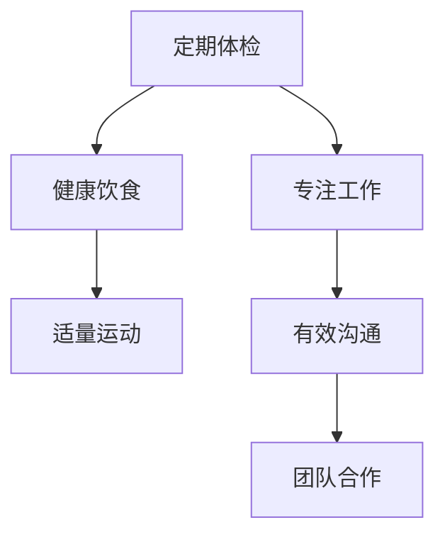
```mermaid
graph TD
    A[定期体检] --> B[健康饮食]
    B --> C[适量运动]
    A --> D[专注工作]
    D --> E[有效沟通]
    E --> F[团队合作]
```

**应用实例**：

- **体检**：创业者可以每年进行一次全面体检，了解自己的健康状况，及时调整生活习惯。
- **专注工作**：创业者可以使用番茄工作法，每次专注工作25分钟，然后休息5分钟，提高工作效率。

#### 8.1.3 压力管理与职业生涯规划

压力管理是职业生涯规划的重要组成部分。有效的压力管理可以帮助创业者更好地应对职业挑战，实现长期职业发展。

**压力管理策略**：

1. **设定合理目标**：创业者应设定合理的职业目标，避免设定过高或不切实际的目标，导致压力过大。
2. **时间管理**：通过合理规划时间，避免工作过度，确保有充足的休息和娱乐时间。
3. **积极心态**：保持积极心态，面对挑战和失败时，学会调整心态，寻找解决问题的方法。

**职业生涯规划**：

1. **长期目标**：创业者应制定长期职业规划，明确自己的职业发展方向和目标。
2. **技能提升**：通过不断学习和提升技能，增强自身的竞争力，为职业发展打下坚实基础。
3. **职业网络**：拓展职业网络，与行业内的人士建立联系，获取职业机会和资源。

**Mermaid 流程图：压力管理与职业生涯规划**

```mermaid
graph TD
    A[设定合理目标] --> B[时间管理]
    B --> C[积极心态]
    A --> D[长期目标]
    D --> E[技能提升]
    D --> F[职业网络]
```

**应用实例**：

- **职业生涯规划**：创业者可以每年进行一次职业规划，评估自己的职业发展情况，设定新的目标。
- **技能提升**：创业者可以通过参加培训课程、阅读专业书籍和参与行业活动，不断提升自己的专业技能。

通过时间管理与任务优先级、职场健康与工作效率、压力管理与职业生涯规划等职场策略，创业者可以更有效地应对职场压力，实现长期职业发展。在下一章节中，我们将探讨创业者的健康管理实践，通过具体案例，帮助创业者更好地理解和应用健康管理策略。

---

### 第9章：创业者的健康管理计划

#### 9.1.1 健康管理计划的制定

制定一个有效的健康管理计划是创业者保持身心健康的基础。以下是一些关键步骤：

1. **自我评估**：创业者应首先进行自我评估，了解自己的健康状况、生活习惯和压力水平。可以通过填写健康问卷、记录日常饮食和运动情况等方式进行评估。

2. **确定目标**：根据自我评估的结果，创业者应明确自己的健康管理目标。这些目标应具体、可测量、可实现、相关性强且有时间限制。例如，目标可以是“每周进行三次有氧运动，每天保持7-8小时的睡眠”。

3. **制定计划**：创业者应根据目标制定详细的健康管理计划。计划应包括具体的行动步骤、执行时间表和预期成果。例如，计划可以包括每周安排固定的运动时间、调整饮食习惯、定期进行心理健康评估等。

4. **设定里程碑**：为了保持动力和监控进度，创业者应设定一系列里程碑。里程碑可以是短期目标，如每两周减少一定量的糖分摄入，或长期目标，如一年内减重5公斤。

5. **寻求支持**：创业者可以寻求家人、朋友或专业人士的支持，以帮助自己坚持健康管理计划。此外，加入健康管理社群或参加相关课程和活动也可以提供额外的支持和动力。

**Mermaid 流程图：健康管理计划的制定**

```mermaid
graph TD
    A[自我评估] --> B[确定目标]
    B --> C[制定计划]
    C --> D[设定里程碑]
    D --> E[寻求支持]
```

#### 9.1.2 健康管理计划的实施

实施健康管理计划是确保目标实现的关键步骤。以下是一些实施策略：

1. **逐步实施**：健康管理计划应逐步实施，避免一次性做出过多改变，导致难以坚持。创业者可以从小的、容易实现的目标开始，逐渐增加难度。

2. **保持记录**：创业者应定期记录自己的健康状况、饮食、运动和情绪变化。这些记录不仅可以帮助创业者了解自己的进展，还能提供反馈，帮助调整计划。

3. **持续监控**：创业者应定期检查健康指标，如体重、血压、心率等，确保健康管理计划的有效性。如果发现健康指标出现异常，应及时调整计划。

4. **寻求反馈**：创业者可以定期与家人、朋友或专业人士交流，寻求他们的反馈和建议。这有助于发现计划中的问题，并寻找解决方案。

5. **保持灵活性**：在实施健康管理计划时，创业者应保持灵活性，根据实际情况调整计划。例如，如果工作繁忙，可以考虑调整运动时间或选择更简便的饮食方案。

**Mermaid 流程图：健康管理计划的实施策略**

```mermaid
graph TD
    A[逐步实施] --> B[保持记录]
    B --> C[持续监控]
    C --> D[寻求反馈]
    D --> E[保持灵活性]
```

#### 9.1.3 健康管理计划的评估与调整

评估和调整健康管理计划是确保其长期有效性的关键步骤。以下是一些评估与调整策略：

1. **定期评估**：创业者应定期评估健康管理计划的有效性，如每季度或每半年。评估可以基于健康指标、生活质量、工作表现等多方面。

2. **分析结果**：根据评估结果，创业者应分析哪些策略有效，哪些需要改进。例如，如果发现运动时间不足，可以考虑调整日程安排，确保有足够的时间进行锻炼。

3. **调整计划**：根据分析结果，创业者应调整健康管理计划。这可能包括修改目标、改变行动步骤或增加额外的支持。

4. **持续改进**：健康管理是一个持续的过程，创业者应不断寻求改进，以适应自身的变化和需求。例如，随着事业的进展，创业者可能需要调整工作与生活的平衡，这会影响健康管理计划。

5. **反馈机制**：创业者可以建立反馈机制，定期收集和分析反馈，确保健康管理计划持续改进。

**Mermaid 流程图：健康管理计划的评估与调整**

```mermaid
graph TD
    A[定期评估] --> B[分析结果]
    B --> C[调整计划]
    C --> D[持续改进]
    D --> E[反馈机制]
```

通过制定、实施和评估健康管理计划，创业者可以更有效地管理健康，提高生活质量和工作效率。在下一章节中，我们将通过具体案例，展示健康管理计划在创业者生活中的应用。

---

### 第10章：创业者的健康管理案例

#### 10.1.1 案例一：从焦虑到放松的转变

**背景介绍**：

李明是一名年轻的创业者，创办了一家科技公司。在创业初期，他面临着巨大的压力，包括资金问题、产品研发和市场拓展等。长期的焦虑和压力导致他的情绪不稳定，工作效率下降，甚至影响了家庭生活。

**核心概念与联系**：

李明通过健康管理计划，逐步克服了焦虑和压力。他采取了以下措施：

1. **时间管理**：李明制定了详细的日程安排，将工作时间与休息时间分开，确保有足够的休息和娱乐时间。他使用了时间管理工具，如番茄工作法，提高了工作效率。

2. **运动与健康饮食**：李明每天早上进行30分钟的有氧运动，如快走或慢跑，晚上进行瑜伽练习，放松身心。他还调整了饮食习惯，减少了油腻和高热量食物的摄入，增加了蔬菜和水果的摄入。

3. **心理调节**：李明学习了认知行为疗法（CBT）和正念冥想技巧，通过调整思维模式和放松技巧，减轻了焦虑和压力。

**核心算法原理讲解**：

李明的健康管理计划可以看作是一个反馈循环系统：

```python
# 健康管理计划伪代码

# 自我评估
evaluate_health_status()

# 制定计划
create_health_plan()

# 实施计划
execute_health_plan()

# 持续监控
monitor_progress()

# 定期评估
evaluate_plan()

# 调整计划
adjust_plan()
```

通过这个反馈循环系统，李明可以不断调整和完善自己的健康管理计划，实现从焦虑到放松的转变。

**数学模型和公式**：

李明的健康评估可以使用以下公式进行量化：

$$
\text{健康评分} = \alpha \times \text{运动频率} + \beta \times \text{饮食评分} + \gamma \times \text{心理调节评分}
$$

其中，$\alpha$、$\beta$和$\gamma$分别是运动、饮食和心理调节的权重。

**详细讲解与举例说明**：

李明每周进行三次有氧运动，每次30分钟，饮食评分为85分，心理调节评分为80分。根据上述公式，他的健康评分可以计算为：

$$
\text{健康评分} = 0.4 \times 3 + 0.3 \times 85 + 0.3 \times 80 = 10.8 + 25.5 + 24 = 60.3
$$

这个健康评分可以帮助李明了解自己的健康状况，并激励他继续坚持健康管理计划。

**项目实战**：

李明在实施健康管理计划时，遇到了一些挑战，如时间不够用、难以坚持运动等。为了应对这些挑战，他采取了以下措施：

- **时间管理**：他调整了工作时间，确保每天有足够的休息和娱乐时间。
- **运动规划**：他将运动安排在早晨或晚上，避免与工作时间冲突。
- **心理调节**：他通过学习正念冥想和认知行为疗法，提高了情绪调节能力。

**代码解读与分析**：

李明的健康管理计划可以通过以下伪代码表示：

```python
# 李明的健康管理计划

# 定义健康评估函数
def evaluate_health():
    exercise_frequency = 3
    diet_score = 85
    mental_health_score = 80
    
    health_score = 0.4 * exercise_frequency + 0.3 * diet_score + 0.3 * mental_health_score
    return health_score

# 定义健康计划函数
def create_health_plan():
    # 制定计划
    pass

# 定义执行健康计划函数
def execute_health_plan():
    # 实施计划
    pass

# 定义监控进度函数
def monitor_progress():
    # 持续监控
    pass

# 定义评估和调整函数
def evaluate_and_adjust_plan():
    # 定期评估
    # 调整计划
    pass

# 执行健康管理计划
health_score = evaluate_health()
print(f"当前健康评分：{health_score}")
```

通过这个代码，李明可以定期评估自己的健康状况，并根据评估结果调整健康管理计划。

**实际案例分析和详细讲解剖析**：

李明通过健康管理计划，逐步克服了焦虑和压力，工作效率得到了显著提高。他不再感到焦虑，能够更加专注地工作，家庭生活也得到了改善。

**项目小结**：

李明的案例展示了健康管理计划在创业者生活中的重要性。通过科学的管理方法，创业者可以更好地应对压力，保持身心健康，从而提高创业成功率。

---

**最佳实践 tips**：

1. **时间管理**：合理安排时间，确保有足够的休息和娱乐时间。
2. **运动规划**：选择适合自己的运动方式，确保运动习惯的持续性。
3. **心理调节**：学习有效的心理调节技巧，如正念冥想和认知行为疗法。

**注意事项**：

1. **个性化**：健康管理计划应根据个人情况制定，确保适应性和有效性。
2. **持续改进**：健康管理是一个持续的过程，需要定期评估和调整。

**拓展阅读**：

1. 《时间管理的艺术》
2. 《正念冥想入门》
3. 《认知行为疗法实践指南》

通过上述案例和分析，我们可以看到健康管理计划在创业者生活中的重要作用。在下一章节中，我们将进一步探讨创业者的健康管理反思，总结健康管理的挑战和对策。

---

### 第11章：创业者的健康管理反思

#### 11.1.1 健康管理中的挑战与对策

健康管理在创业者的生活中并非一帆风顺，许多挑战和障碍需要克服。以下是健康管理中常见的一些挑战及其对策：

**挑战一：时间管理困难**

**原因**：创业者通常面临时间紧迫、工作任务繁重的挑战，难以平衡工作与生活。

**对策**：创业者应学会有效的时间管理，制定明确的日程安排，优先处理重要且紧急的任务。此外，可以利用时间管理工具，如番茄工作法、待办事项列表等，提高工作效率。

**挑战二：运动习惯难以坚持**

**原因**：创业者往往因工作繁忙或缺乏动力而难以坚持运动。

**对策**：创业者可以将运动纳入日程安排，选择简单的运动方式，如散步、瑜伽等。同时，可以寻找运动伙伴或加入健身社群，提高运动的趣味性和持续性。

**挑战三：饮食不均衡**

**原因**：创业者可能因工作繁忙而忽视饮食，导致营养摄入不均衡。

**对策**：创业者应确保每天有规律的饮食，选择健康的食物，如蔬菜、水果、全谷物等。此外，可以尝试使用健康饮食应用或咨询服务，帮助制定个性化的饮食计划。

**挑战四：心理健康问题**

**原因**：创业者在面对压力和挑战时，可能出现心理健康问题，如焦虑、抑郁等。

**对策**：创业者可以学习有效的心理调节技巧，如正念冥想、认知行为疗法等。此外，可以寻求心理咨询师的帮助，及时解决心理问题。

**挑战五：缺乏社交支持**

**原因**：创业者可能因专注于工作而忽视了社交支持，导致孤独感和心理压力增加。

**对策**：创业者应积极建立社交支持网络，参与行业活动、社交聚会等。同时，可以与家人、朋友保持密切联系，分享压力和困惑，获取情感支持。

**Mermaid 流程图：健康管理挑战与对策**

```mermaid
graph TD
    A[时间管理困难] --> B[运动习惯难以坚持]
    B --> C[饮食不均衡]
    C --> D[心理健康问题]
    D --> E[缺乏社交支持]
    A --> F[制定日程安排]
    B --> G[选择简单运动]
    C --> H[健康饮食]
    D --> I[心理调节技巧]
    E --> J[建立社交支持网络]
```

**挑战六：资金限制**

**原因**：创业者可能因资金限制而无法购买健康管理所需的设备和资源。

**对策**：创业者可以利用免费的健康管理资源，如在线课程、健康应用等。此外，可以寻求政府或非营利组织的支持，获取资金援助。

**挑战七：健康管理意识不足**

**原因**：创业者可能没有意识到健康管理的重要性，忽视了对健康的管理。

**对策**：创业者应加强健康管理意识，了解健康管理的核心概念和重要性。可以通过阅读相关书籍、参加健康讲座等方式，提高健康管理知识。

**Mermaid 流程图：额外健康管理挑战与对策**

```mermaid
graph TD
    A[资金限制] --> B[健康管理意识不足]
    A --> C[利用免费资源]
    B --> D[提高健康管理意识]
```

通过识别和应对这些挑战，创业者可以更好地进行健康管理，保持身心健康。在下一部分中，我们将探讨健康管理对创业成功的贡献，分析健康管理与创业成功之间的关系。

---

#### 11.1.2 健康管理对创业成功的贡献

健康管理在创业者的职业生涯中起着至关重要的作用，它不仅影响创业者的个人生活，还直接关联到创业的成功与否。以下是健康管理对创业成功的关键贡献：

**提高工作能力**：

健康管理的核心之一是保持良好的身体和心理状态，这有助于提高创业者的工作能力。良好的身体状况可以增强创业者的体能和耐力，使他们能够更长时间地保持高效工作。而健康的心理状态则有助于提升创业者的专注力、决策力和创新能力，这些都是创业成功的关键因素。

**增强抗压能力**：

创业者常常面临巨大的压力，包括市场不确定性、资金问题、竞争压力等。有效的健康管理可以帮助创业者增强抗压能力，更好地应对这些挑战。通过心理调节技巧、运动和社交支持，创业者可以减轻压力，保持积极的心态，从而在压力下做出明智的决策。

**提升决策质量**：

健康的身体和良好的心理状态有助于创业者更清晰地思考问题，提高决策质量。创业者通过健康管理，可以更好地控制情绪，避免因情绪波动而做出冲动的决策。同时，健康的生活方式有助于提高创业者的思维敏捷性和创新意识，从而在竞争激烈的市场中找到新的商业机会。

**延长职业生涯**：

健康管理有助于延长创业者的职业生涯，使他们能够持续创新和成长。通过定期体检、健康饮食和适量运动，创业者可以预防和控制慢性疾病，保持良好的身体状况。心理健康的维护则有助于创业者避免因心理问题而提前退出创业生涯。

**提高生活质量**：

健康管理的最终目标是提高创业者的生活质量。一个健康的创业者不仅能够在工作上取得成功，还能在家庭生活中享受幸福。通过健康管理，创业者可以更好地平衡工作与生活，提高幸福感，从而更好地享受生活。

**促进团队协作**：

创业者的健康状态不仅影响他们自己的表现，还会影响团队的整体表现。一个健康的创业者可以更好地激励团队，建立积极的团队文化。通过健康的饮食、运动和心理调节，创业者可以提升团队士气，促进团队协作，从而提高企业的整体绩效。

**Mermaid 流程图：健康管理对创业成功的贡献**

```mermaid
graph TD
    A[提高工作能力] --> B[增强抗压能力]
    B --> C[提升决策质量]
    A --> D[延长职业生涯]
    C --> E[提高生活质量]
    D --> F[促进团队协作]
```

通过以上分析，我们可以看到健康管理对创业成功的重要性。一个健康的创业者不仅能够更好地应对创业中的各种挑战，还能在长期内保持创新和成长，从而实现创业成功。在下一部分中，我们将探讨健康管理的未来趋势与展望。

---

#### 11.1.3 健康管理的未来趋势与展望

随着科技的发展和人们对健康意识的提高，健康管理正朝着更科学、个性化和便捷化的方向发展。以下是健康管理的未来趋势与展望：

**科技赋能健康管理**：

随着物联网、大数据和人工智能技术的发展，健康管理正逐渐走向数字化和智能化。通过可穿戴设备、健康监测APP和智能医疗设备，创业者可以实时了解自己的健康数据，进行自我监测和干预。这些技术不仅提高了健康管理的准确性和效率，还帮助创业者更好地管理健康风险。

**个性化健康管理**：

未来的健康管理将更加注重个性化。通过对个人健康数据的分析，健康管理系统能够为创业者提供个性化的健康建议和干预方案。例如，根据个人的饮食习惯、基因信息和健康状况，系统可以为创业者制定最适合的营养和运动计划。这种个性化的健康管理将有助于提高健康管理的针对性和有效性。

**心理健康服务的普及**：

随着对心理健康重视程度的提高，心理健康服务将在健康管理中扮演更重要的角色。创业者将更容易获得专业的心理健康咨询和治疗，如在线心理咨询、认知行为疗法等。这些服务将帮助创业者更好地应对心理压力，保持心理健康。

**健康大数据的应用**：

健康大数据将成为健康管理的重要资源。通过对大量健康数据的收集和分析，研究人员和健康管理专家可以更好地了解健康问题的发生规律和影响因素，从而开发更有效的健康管理策略。此外，健康大数据还可以用于预测健康风险，为创业者提供预防性健康管理服务。

**健康管理服务的社会化**：

未来的健康管理将更加社会化，创业者可以通过各种渠道获取健康管理服务。例如，通过健康保险、企业健康计划和社区健康项目，创业者可以获得全面的健康管理支持。此外，健康社交平台和在线健康社区将提供创业者之间的交流和互助，共同提升健康水平。

**Mermaid 流程图：健康管理未来趋势与展望**

```mermaid
graph TD
    A[科技赋能健康管理] --> B[个性化健康管理]
    B --> C[心理健康服务普及]
    A --> D[健康大数据应用]
    C --> E[健康管理服务社会化]
```

**未来展望**：

随着科技的进步和健康管理意识的提高，健康管理将变得更加科学、个性化和便捷。创业者将通过智能设备和大数据技术，实时监测和管理自己的健康，享受更高质量的生活。同时，心理健康服务将得到更广泛的普及，创业者将能够更好地应对心理压力，保持心理健康。通过健康管理，创业者不仅可以提高个人生活质量，还能在创业道路上走得更远、更稳健。

---

### 附录A：健康管理工具与资源

#### A.1.1 常用的健康管理APP

**1. MyFitnessPal**：

MyFitnessPal 是一款广受欢迎的健康管理APP，可以帮助用户跟踪饮食和运动。用户可以输入自己的饮食和运动数据，APP会根据用户的健康目标提供个性化的建议。

**2. Nike Training Club**：

Nike Training Club 提供了一系列专业的健身课程和训练计划，适合不同水平和需求的用户。用户可以根据自己的时间和地点选择合适的训练课程，提升身体素质。

**3. Headspace**：

Headspace 是一款专注于冥想和放松的APP，提供了各种冥想课程和冥想音乐，帮助用户减轻压力，提高情绪调节能力。

**4. Google Fit**：

Google Fit 是一款集成多种健康数据功能的APP，可以跟踪用户的运动、睡眠、心率等健康数据。用户可以通过Google Fit了解自己的整体健康状况。

#### A.1.2 可信的健康管理网站

**1. WebMD**：

WebMD 是一个综合性的健康信息网站，提供了大量的健康文章、疾病信息和药物信息。创业者可以通过WebMD了解各种健康知识，进行自我健康管理。

**2. Mayo Clinic**：

Mayo Clinic 是一家世界知名的医疗机构，其官方网站提供了专业的健康建议和疾病信息。创业者可以通过Mayo Clinic获得权威的健康指导。

**3. Healthline**：

Healthline 是一个提供全面健康信息的网站，涵盖了营养、运动、心理健康等多个方面。创业者可以通过Healthline获取科学、可靠的健康知识。

#### A.1.3 健康管理书籍推荐

**1. 《吃的营养、用的健康》**：

作者：陈平

本书详细介绍了饮食与健康的关系，提供了实用的营养知识和健康饮食建议，帮助创业者改善饮食习惯，提高健康水平。

**2. 《运动革命》**：

作者：吉姆·泰勒

本书介绍了各种运动对身体健康的益处，提供了详细的运动计划和建议，帮助创业者通过运动保持健康。

**3. 《心理健康自助手册》**：

作者：马丁·塞利格曼

本书是一本关于心理健康的经典著作，提供了多种心理调节技巧和方法，帮助创业者应对心理压力，保持心理健康。

**4. 《如何掌控你的自由时间》**：

作者：理查德·科雷尔

本书介绍了时间管理的原则和技巧，帮助创业者合理安排时间，提高工作效率，实现工作与生活的平衡。

通过使用这些健康管理工具与资源，创业者可以更科学、更有效地管理自己的健康，提高生活质量和工作效率。

---

### 附录B：压力调节技巧实践指南

#### B.1.1 实践指南一：认知行为疗法实操

**步骤**：

1. **识别负面思维**：首先，创业者需要识别自己的负面思维模式，例如“我必须做到完美”、“事情总是不如我所愿”等。通过记录自己的思维过程，可以帮助创业者更好地识别这些负面思维。

2. **认知重构**：识别负面思维后，创业者可以通过认知重构来改变这些思维模式。例如，将“我必须做到完美”改为“我可以尽力而为，但不完美并不意味着失败”。

3. **行为实验**：为了验证新的思维模式，创业者可以设计行为实验。例如，选择一个小的、容易实现的目标，尝试用新的思维模式去思考和行动，观察结果。

4. **技能训练**：通过认知重构和行为实验，创业者可以逐渐掌握新的思维模式。技能训练包括深呼吸、放松技巧、正念冥想等，这些技能可以帮助创业者更好地调节情绪。

**示例**：

假设创业者李明在项目截止日期前感到焦虑和压力。他可以通过以下步骤进行认知行为疗法的实操：

1. **识别负面思维**：李明意识到自己总是在项目截止日期前感到焦虑，认为自己必须做到完美。

2. **认知重构**：李明尝试将负面思维改为“我可以尽力而为，但不完美并不意味着失败”。

3. **行为实验**：李明选择一个小的目标，如提前一周完成项目的部分任务，并使用新的思维模式去思考和行动。

4. **技能训练**：李明每天进行深呼吸和放松练习，帮助自己更好地调节情绪。

通过以上步骤，李明可以逐渐减少焦虑和压力，提高工作效率。

#### B.1.2 实践指南二：正念冥想步骤

**步骤**：

1. **选择一个安静的地方**：找一个舒适的地方，保持身体和心灵放松。

2. **采取舒适的姿势**：可以坐直或躺下，背部挺直，双手放在身体两侧。

3. **专注呼吸**：将注意力集中在呼吸上，感受每次吸气和呼气。

4. **当注意力分散时，轻轻地将注意力拉回呼吸**：在冥想过程中，注意力可能会分散，当意识到时，轻轻地将注意力拉回呼吸。

5. **保持专注**：持续进行冥想，每次冥想的时间可以从几分钟开始，逐渐增加。

**示例**：

创业者张华在面临重要会议前感到紧张。他决定通过正念冥想来放松自己：

1. **选择一个安静的地方**：张华在家中找一个舒适的角落，保持环境安静。

2. **采取舒适的姿势**：他选择坐直在椅子上，背部挺直，双手放在膝盖上。

3. **专注呼吸**：张华将注意力集中在呼吸上，感受每次吸气和呼气。

4. **当注意力分散时，轻轻地将注意力拉回呼吸**：张华意识到自己的注意力开始分散，他轻轻地将注意力拉回呼吸。

5. **保持专注**：张华持续进行冥想，每次冥想的时间逐渐增加到20分钟。

通过正念冥想，张华成功地缓解了紧张情绪，提高了会议时的专注力和表现。

#### B.1.3 实践指南三：运动与健康生活方式规划

**步骤**：

1. **确定运动目标**：创业者可以根据自己的身体状况和兴趣，确定合适的运动目标。例如，每周进行三次有氧运动，每次30分钟。

2. **选择运动方式**：选择适合的运动方式，如快走、跑步、游泳、瑜伽等。根据个人喜好和时间安排，选择最合适的运动方式。

3. **制定运动计划**：将运动纳入日程安排，确保有足够的时间进行锻炼。可以将运动计划写在日程表上，确保按时进行。

4. **保持动力**：寻找运动伙伴或加入运动社群，保持运动的趣味性和持续性。

5. **监测进度**：定期记录运动情况和健康状况，了解自己的进步，调整运动计划。

**示例**：

创业者王强决定通过运动改善自己的健康生活方式：

1. **确定运动目标**：王强决定每周进行三次有氧运动，每次30分钟。

2. **选择运动方式**：他选择每天晚上快走30分钟，以增强心肺功能和耐力。

3. **制定运动计划**：王强将运动计划写在日程表上，确保每天晚上都有时间进行快走。

4. **保持动力**：他加入了一个线上跑步社群，与其他跑步爱好者分享经验和鼓励。

5. **监测进度**：王强定期记录自己的运动情况和健康状况，发现自己在跑步速度和耐力方面都有所提高。

通过以上实践指南，王强成功改善了自己的健康生活方式，提高了生活质量和工作效率。

---

通过上述实践指南，创业者可以更有效地调节压力，提高身心健康。在实现个人和职业目标的同时，保持良好的健康状态。希望这些建议能帮助创业者更好地管理压力，迎接创业旅程中的挑战。

---

**作者：** AI天才研究院/AI Genius Institute & 禅与计算机程序设计艺术 /Zen And The Art of Computer Programming

