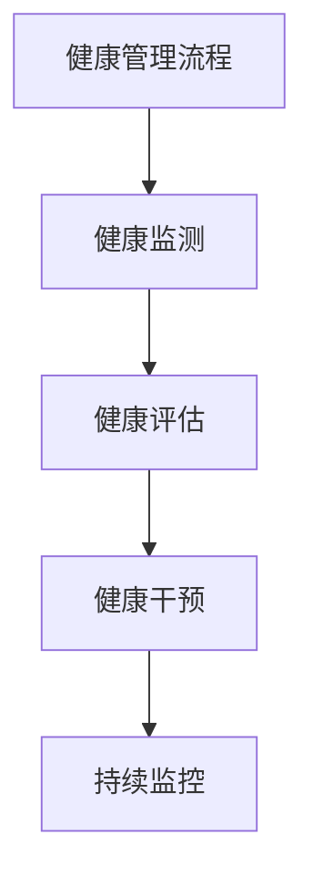
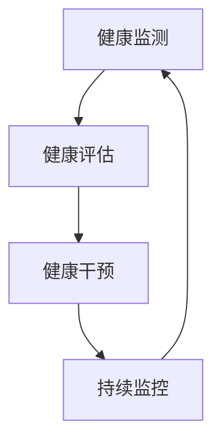
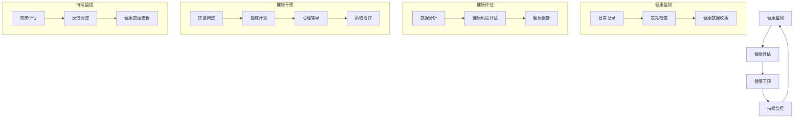

                 


### 文章标题：《创业者的健康管理与工作平衡》

> 关键词：创业者、健康管理、工作平衡、时间管理、任务优先级、心理平衡

> 摘要：本文将深入探讨创业者在追求事业成功的同时，如何有效进行健康管理并实现工作与生活的平衡。通过分析健康管理的重要性、工作与生活的平衡概念、实践方法以及相关案例，为创业者提供切实可行的建议和策略。

---

### 《创业者的健康管理与工作平衡》目录大纲

## 第一部分：健康管理的重要性

### 1.1 健康管理概述

#### 1.1.1 健康管理的定义与意义
健康管理是指通过一系列科学方法，对个体的健康进行全面监测、评估和干预，以提高健康水平和生活质量。对创业者而言，健康管理不仅关系到个人的身体健康，还影响到企业的长期发展。

#### 1.1.2 健康管理的基本原则
健康管理的核心原则包括预防为主、个体化、持续性和综合性。创业者应将这些原则融入到日常生活中，以实现全面的健康管理。

#### 1.1.3 健康管理在现代生活中的重要性
随着生活节奏的加快和工作压力的增大，健康管理成为现代生活不可或缺的一部分。对于创业者来说，健康管理更是成功事业的重要保障。

### 1.2 健康管理核心概念与联系

#### 1.2.1 人体生物钟
人体生物钟是指人体内部的一种无形的“时钟”，它影响人体的生理功能和行为模式。创业者在规划工作和休息时间时，应充分考虑人体生物钟的影响。

#### 1.2.2 免疫系统与疾病预防
免疫系统是人体对抗疾病的重要防线。创业者应通过增强免疫系统和及时预防疾病，来保障自身的健康。

#### 1.2.3 健康监测与评估
健康监测与评估是健康管理的核心环节。创业者应定期进行健康检查，及时发现并解决健康问题。

### 1.3 健康管理流程与架构 Mermaid 流程图



---

## 第二部分：工作与生活的平衡

### 2.1 工作与生活的平衡概念

#### 2.1.1 工作与生活的平衡定义
工作与生活的平衡是指在工作与生活之间找到一个合适的比例，使得两者能够相辅相成，共同促进个人的全面发展。

#### 2.1.2 平衡的重要性
平衡对于创业者来说至关重要。只有实现工作与生活的平衡，才能保证创业者在追求事业成功的同时，拥有健康的身心状态。

#### 2.1.3 创业者面临的挑战
创业者面临的最大挑战是如何在忙碌的工作中，抽出时间进行休息和放松，以实现工作与生活的平衡。

### 2.2 平衡的核心算法原理

#### 2.2.1 时间管理算法
时间管理算法的核心是合理分配时间，确保工作和生活两不误。创业者可以使用如下算法：

```python
def time_management(tasks, deadlines):
    # 按照任务优先级和截止时间进行排序
    sorted_tasks = sorted(tasks, key=lambda x: (x['priority'], x['deadline']))
    
    # 分配时间
    for task in sorted_tasks:
        if task['deadline'] > current_time:
            start_time = calculate_start_time(current_time, task['duration'])
            end_time = start_time + task['duration']
            execute_task(task['name'], start_time, end_time)
            current_time = end_time
        else:
            # 任务已过期，考虑加班或调整优先级
            handle_overdue_task(task)
```

#### 2.2.2 任务优先级算法
任务优先级算法是确保重要任务优先完成的关键。创业者可以使用如下算法：

```python
def task_priority(tasks):
    # 根据任务的重要性和紧急性进行排序
    sorted_tasks = sorted(tasks, key=lambda x: (x['importance'], x['urgency']))
    return sorted_tasks
```

#### 2.2.3 心理平衡算法
心理平衡算法是帮助创业者缓解工作压力，保持心理健康的关键。创业者可以使用如下算法：

```python
def psychological_balance(stress_level, relaxation_time):
    # 根据压力水平和放松时间进行调整
    if stress_level > threshold:
        start_time = calculate_start_time(current_time, relaxation_time)
        end_time = start_time + relaxation_time
        relax()
        current_time = end_time
    else:
        # 压力在可控范围内，无需特别调整
        pass
```

### 2.3 数学模型和数学公式

$$
\text{工作满意度} = \frac{\text{工作成就}}{\text{工作压力}} + \text{生活满意度}
$$

#### 2.3.1 工作满意度的计算
工作满意度可以通过计算工作成就与工作压力的比值来获得。创业者应努力提高工作成就，同时减轻工作压力，以提高工作满意度。

#### 2.3.2 工作压力的计算
工作压力可以通过工作量和心理负担来计算。创业者应合理规划工作量，避免过度劳累，以减轻心理负担。

#### 2.3.3 生活满意度的计算
生活满意度可以通过评估生活质量、家庭关系和社会支持等因素来计算。创业者应注重家庭和社会支持，以提高生活满意度。

---

## 第三部分：健康管理的实践方法

### 3.1 健康管理实践方法

#### 3.1.1 合理饮食
合理饮食是健康管理的基石。创业者应遵循营养均衡、多样化饮食的原则，确保摄入充足的营养素。

#### 3.1.2 科学锻炼
科学锻炼有助于提高身体素质和抵抗力。创业者应根据自身身体状况和喜好，选择合适的锻炼方式和频率。

#### 3.1.3 心理健康
心理健康对创业者来说至关重要。创业者应学会情绪调节和压力管理，保持良好的心态。

### 3.2 工作与生活平衡的实践方法

#### 3.2.1 设置合理的工作时间
创业者应合理安排工作时间，确保工作和生活两不误。可以采用如下策略：

- 制定详细的工作计划，明确工作任务和时间节点。
- 学会拒绝不重要的任务，专注于核心工作。
- 设置工作时间段，避免长时间连续工作。

#### 3.2.2 建立良好的工作习惯
良好的工作习惯有助于提高工作效率，减轻工作压力。创业者可以采取以下措施：

- 定期整理工作空间，保持工作环境整洁。
- 设定工作目标，每天完成一定的工作任务。
- 学会休息和放松，避免过度劳累。

#### 3.2.3 学会放松与休闲
放松与休闲是缓解工作压力的重要手段。创业者可以尝试以下方法：

- 安排定期的休闲活动，如户外运动、旅行等。
- 晚上进行放松活动，如阅读、听音乐等。
- 学会放松技巧，如深呼吸、冥想等。

### 3.3 数学模型和数学公式

$$
\text{工作效率} = \frac{\text{工作成果}}{\text{工作时间}} \times \text{工作满意度}
$$

#### 3.3.1 工作效率的计算
工作效率可以通过计算工作成果与工作时间的比值来获得。创业者应努力提高工作成果，同时合理安排工作时间，以提高工作效率。

#### 3.3.2 工作满意度的计算
工作满意度可以通过计算工作成就与工作压力的比值，并加上生活满意度来获得。创业者应努力提高工作成就，同时减轻工作压力，以提高工作满意度。

#### 3.3.3 工作成果的计算
工作成果可以通过计算完成的任务数量和质量来获得。创业者应关注任务的完成情况，及时评估工作成果。

---

## 第四部分：创业者的健康管理案例

### 4.1 创业者的健康管理案例

#### 4.1.1 创业者的常见健康问题
创业者常见的健康问题包括压力过大、睡眠不足、缺乏锻炼等。这些问题严重影响创业者的身心健康。

#### 4.1.2 创业者的健康管理策略
创业者应采取以下健康管理策略：

- 定期进行健康检查，关注身体状况。
- 合理安排工作和休息时间，确保充足的睡眠。
- 增加锻炼时间，提高身体素质。

#### 4.1.3 创业者健康管理成功案例
某创业者在经历了一场严重的健康危机后，开始重视健康管理。他采取了一系列措施，如调整工作节奏、增加锻炼时间、改善饮食习惯等。经过一段时间的努力，他的健康状况得到了显著改善，工作效率和创业成果也大幅提升。

### 4.2 工作与生活平衡案例

#### 4.2.1 创业者工作与生活平衡挑战
某创业者在创业初期，由于工作繁忙，几乎把所有时间都投入到公司事务中，导致家庭关系紧张，身心健康受损。

#### 4.2.2 创业者实现平衡的策略
为了实现工作与生活的平衡，该创业者采取了以下策略：

- 制定详细的工作计划，确保工作与生活的界限清晰。
- 安排定期的家庭聚会，加强与家人的沟通。
- 利用周末和假期进行休闲活动，放松身心。

#### 4.2.3 创业者平衡成功的案例
经过一段时间的努力，该创业者成功实现了工作与生活的平衡。他的家庭关系得到了改善，身心健康也显著提升。同时，他的工作效率和创业成果也有了明显的提高。

---

## 第五部分：健康管理工具与资源

### 5.1 健康管理工具

#### 5.1.1 健康监测设备
健康监测设备如智能手环、智能手表等，可以帮助创业者实时监测身体状况，如心率、血压、睡眠质量等。

#### 5.1.2 健康管理应用程序
健康管理应用程序如MyFitnessPal、HeathKit等，可以帮助创业者记录饮食、锻炼和健康状况，提供个性化的健康建议。

#### 5.1.3 健康管理网站
健康管理网站如WebMD、Mayo Clinic等，提供丰富的健康知识和实用工具，帮助创业者进行自我健康管理。

### 5.2 工作与生活平衡工具

#### 5.2.1 时间管理工具
时间管理工具如Google Calendar、Trello等，可以帮助创业者制定工作计划，合理安排时间。

#### 5.2.2 任务管理工具
任务管理工具如Asana、JIRA等，可以帮助创业者跟踪任务进度，确保任务按时完成。

#### 5.2.3 放松与休闲工具
放松与休闲工具如YouTube、Spotify等，提供丰富的娱乐内容，帮助创业者放松身心。

### 5.3 资源推荐

#### 5.3.1 健康管理书籍
推荐书籍如《健康管理：从健康到长寿的全面指南》、《身心健康：如何保持身体和心理的健康》等，为创业者提供实用的健康管理知识。

#### 5.3.2 工作与生活平衡书籍
推荐书籍如《平衡：如何在工作与生活之间找到最佳平衡点》、《效率高手：如何提升工作效率，实现工作与生活的平衡》等，帮助创业者实现工作与生活的平衡。

#### 5.3.3 专业健康管理机构和咨询师推荐
推荐专业健康管理机构和咨询师，如美国健康管理协会（ASHA）、国际心理咨询师协会（ICF）等，为创业者提供专业的健康管理服务。

---

## 附录

### 附录 A：健康管理的实用建议和技巧

1. 保持良好的作息习惯，确保充足的睡眠。
2. 合理安排饮食，确保营养均衡。
3. 定期进行体育锻炼，提高身体素质。
4. 学会情绪调节和压力管理，保持心理健康。

### 附录 B：工作与生活平衡的实用建议和技巧

1. 制定详细的工作计划，合理安排时间。
2. 学会拒绝不重要的任务，专注于核心工作。
3. 安排定期的家庭聚会，加强与家人的沟通。
4. 利用周末和假期进行休闲活动，放松身心。

### 附录 C：健康管理工具使用指南

1. 健康监测设备使用指南。
2. 健康管理应用程序使用指南。
3. 健康管理网站使用指南。

### 附录 D：常见健康问题解决方案

1. 压力过大：学会情绪调节和压力管理技巧。
2. 睡眠不足：调整作息习惯，确保充足的睡眠。
3. 缺乏锻炼：合理安排锻炼时间，提高身体素质。

### 附录 E：创业者的健康管理计划模板

1. 健康管理目标设定。
2. 健康管理行动计划。
3. 健康管理评估与调整。

---

**注：以上目录大纲仅为示例，实际书籍内容可根据需求进一步细化和完善。**

---

### 作者信息

作者：AI天才研究院/AI Genius Institute & 禅与计算机程序设计艺术 /Zen And The Art of Computer Programming

---

文章至此，我们以逻辑清晰、结构紧凑、简单易懂的专业的技术语言，对《创业者的健康管理与工作平衡》进行了详细阐述。希望这篇文章能为创业者提供有价值的指导和建议，帮助他们在追求事业成功的同时，保持身心健康，实现工作与生活的平衡。让我们共同努力，迎接更加美好的未来！### 文章关键词

- 创业者
- 健康管理
- 工作平衡
- 时间管理
- 任务优先级
- 心理平衡

### 文章摘要

本文旨在探讨创业者在追求事业成功的同时，如何通过有效的健康管理实现工作与生活的平衡。文章首先介绍了健康管理的重要性，包括其定义与意义、基本原则以及在现代生活中的应用。随后，文章深入分析了工作与生活的平衡概念，包括其定义、重要性以及创业者面临的挑战。文章还提出了平衡的核心算法原理，并通过数学模型和公式进行了详细阐述。接下来，文章详细介绍了健康管理的实践方法，包括合理饮食、科学锻炼和心理健康。此外，文章还提供了工作与生活平衡的实践方法，并通过具体案例进行了说明。最后，文章推荐了健康管理工具与资源，并提供了实用建议和技巧。通过本文，创业者将了解到如何通过健康管理实现工作与生活的平衡，从而在事业成功的同时保持身心健康。### 第一部分：健康管理的重要性

#### 1.1 健康管理概述

健康管理是一个涉及多个学科领域的综合性概念，其核心目标是通过对个体或群体的健康状况进行全面监测、评估和干预，从而达到预防和控制疾病、提高生活质量和促进健康长寿的目的。对创业者而言，健康管理不仅关系到个人的身体健康，还直接影响到企业的运营效率和员工的士气。

**健康管理的定义与意义**

健康管理可以定义为一种系统的、持续性的过程，它包括健康监测、健康评估、健康干预和持续监控等环节。具体来说，健康监测是指通过定期检查和日常记录，对个体的健康状况进行实时了解；健康评估是指根据监测数据，对个体的健康风险进行评估和诊断；健康干预是指采取针对性的措施，降低健康风险，改善健康状况；持续监控则是为了确保健康干预的效果，对个体健康状态进行长期跟踪和调整。

对于创业者，健康管理意味着：

1. 提高个人的身体素质和抵抗力，减少因健康问题导致的工作中断。
2. 保持良好的精神状态和情绪，提高决策能力和创新能力。
3. 降低医疗费用支出，减轻企业和个人的经济负担。
4. 增强团队的凝聚力和工作效率，提升企业的竞争力。

**健康管理的基本原则**

健康管理遵循以下基本原则：

1. **预防为主**：预防疾病比治疗疾病更加重要。创业者应通过健康的生活方式，如合理饮食、定期锻炼等，来预防疾病的发生。
2. **个体化**：每个人的健康状况和需求都是独特的，因此健康管理应个性化定制，针对不同个体制定合适的健康计划。
3. **持续性**：健康管理是一个长期的过程，需要创业者持续关注和投入，不能一蹴而就。
4. **综合性**：健康管理应涵盖身体、心理、社会等多个方面，实现全方位的健康维护。

**健康管理在现代生活中的重要性**

随着现代社会的快速发展，人们的生活节奏加快，工作压力增大，健康问题日益突出。尤其是创业者，他们常常为了追求事业的成功而忽略了自身的健康。然而，没有健康的身体和良好的心理状态，创业者的工作效率和创新能力都会受到严重影响。

健康管理的重要性体现在以下几个方面：

1. **提高生活质量**：通过健康管理，创业者可以更好地管理自己的健康状况，提高生活质量。
2. **降低健康风险**：定期进行健康监测和评估，有助于及早发现健康问题，采取预防措施，降低疾病风险。
3. **提高工作效率**：健康良好的创业者能够保持旺盛的精力和良好的情绪，从而提高工作效率。
4. **促进事业发展**：一个健康的创业者能够更好地应对挑战，抓住机遇，推动企业的发展。

#### 1.2 健康管理核心概念与联系

健康管理涉及多个核心概念，这些概念相互联系，共同构成了健康管理的理论框架。以下是几个重要的核心概念及其联系：

**1.2.1 人体生物钟**

人体生物钟是指人体内部的一种无形的“时钟”，它影响人体的生理功能和行为模式。人体生物钟的节律性变化影响着睡眠、饮食、代谢等多种生理过程。对于创业者来说，了解和遵循人体生物钟的规律，有助于提高工作效率和健康水平。

**1.2.2 免疫系统与疾病预防**

免疫系统是人体对抗病原体和维护身体健康的重要防线。免疫系统包括多种细胞、组织和分子，它们协同作用，识别和消灭入侵的病原体。创业者的健康管理应包括增强免疫系统的功能，从而提高对疾病的抵抗力。

**1.2.3 健康监测与评估**

健康监测与评估是健康管理的核心环节。通过定期进行健康检查和日常记录，创业者可以了解自己的健康状况，发现潜在的健康问题。健康评估则是对这些监测数据进行分析，评估个体的健康风险和状况。

**健康管理流程与架构 Mermaid 流程图**

为了更好地理解健康管理的流程和架构，我们可以使用Mermaid绘制一个简化的流程图：



在这个流程图中，健康监测是整个健康管理流程的起点，通过定期检查和日常记录，创业者可以获取自己的健康数据。健康评估是对这些数据进行分析，确定健康风险和状况。健康干预是根据评估结果采取的措施，以降低健康风险和改善健康状况。最后，持续监控确保健康干预的有效性，并根据实际情况进行调整。

通过这个流程图，我们可以看到健康管理是一个动态的、持续的过程，需要创业者持续关注和投入。

#### 1.3 健康管理流程与架构 Mermaid 流程图

为了更好地展示健康管理的流程和架构，我们可以使用Mermaid绘制一个简化的流程图：



这个流程图详细展示了健康管理的各个步骤及其相互关系：

1. **健康监测**：包括日常记录、定期检查和健康数据收集，是整个流程的起点。
2. **健康评估**：通过数据分析、健康风险评估和健康报告，对监测数据进行处理和评估。
3. **健康干预**：根据评估结果，采取饮食调整、锻炼计划、心理辅导和药物治疗等措施，以降低健康风险和改善健康状况。
4. **持续监控**：通过效果评估、反馈调整和健康数据更新，确保健康干预措施的有效性，并根据实际情况进行调整。

通过这个流程图，创业者可以清晰地了解健康管理的各个环节，从而更好地实施健康管理计划。

### 总结

第一部分重点阐述了健康管理的重要性。我们介绍了健康管理的定义与意义，以及其基本原则和重要性。此外，我们还探讨了健康管理的核心概念，如人体生物钟、免疫系统和健康监测与评估。通过一个简化的流程图，我们展示了健康管理的整体架构。接下来，我们将进一步探讨如何实现工作与生活的平衡，以及相关的核心算法原理和数学模型。

---

### 第二部分：工作与生活的平衡

#### 2.1 工作与生活的平衡概念

**2.1.1 工作与生活的平衡定义**

工作与生活的平衡（Work-Life Balance，简称WLB）是指在工作与生活之间找到一个合适的比例，使得两者能够相辅相成，共同促进个人的全面发展。具体来说，它涉及如何合理安排时间，确保在完成工作任务的同时，能够充分享受家庭生活、休闲娱乐和个人发展。

**2.1.2 平衡的重要性**

平衡对于创业者来说至关重要。创业者通常面临巨大的工作压力和竞争压力，如果无法实现工作与生活的平衡，可能会导致以下问题：

1. **身心健康受损**：长期过度工作会严重影响身心健康，导致疲劳、失眠、焦虑和抑郁等问题。
2. **工作效率下降**：身心疲惫的创业者很难保持高效的工作状态，从而降低工作效率。
3. **家庭关系紧张**：忽视家庭生活会导致与家人的关系疏远，甚至可能引发婚姻问题。
4. **创新能力下降**：长期处于高压状态，创业者的思维容易僵化，创新能力降低。

因此，实现工作与生活的平衡，不仅有助于提升创业者的身心健康，还能提高工作效率和创新能力，从而更好地推动企业的发展。

**2.1.3 创业者面临的挑战**

对于创业者来说，实现工作与生活的平衡面临诸多挑战：

1. **时间管理困难**：创业者需要处理大量的事务，包括业务拓展、团队管理、客户沟通等，时间管理成为一大难题。
2. **任务优先级不明**：面对众多的工作任务，创业者常常难以判断哪些任务更为紧急和重要，导致时间分配不均。
3. **心理压力**：创业过程中的不确定性和竞争压力，使得创业者常常感到焦虑和压力。
4. **工作责任重大**：创业者对企业负有重大责任，往往很难彻底放下工作，享受闲暇时光。

为了克服这些挑战，创业者需要采取一系列策略，实现工作与生活的平衡。

#### 2.2 平衡的核心算法原理

**2.2.1 时间管理算法**

时间管理是工作与生活平衡的关键，通过合理的时间管理，创业者可以更有效地安排工作，留出更多时间用于个人生活。以下是一个简单的时间管理算法：

```python
def time_management(tasks, deadlines, personal_time):
    # 对任务进行优先级排序
    sorted_tasks = sorted(tasks, key=lambda x: (x['priority'], x['deadline']))
    
    # 分配工作时间
    work_time = 0
    for task in sorted_tasks:
        if task['deadline'] > current_time and work_time < max_work_time:
            start_time = calculate_start_time(current_time, task['duration'])
            end_time = start_time + task['duration']
            execute_task(task['name'], start_time, end_time)
            work_time += task['duration']
            current_time = end_time
        else:
            # 任务无法在规定时间内完成，考虑调整任务优先级或延迟完成
    
    # 分配个人时间
    if current_time < total_time:
        start_time = calculate_start_time(current_time, personal_time)
        end_time = start_time + personal_time
        enjoy_time()

def calculate_start_time(current_time, duration):
    # 计算任务开始时间，确保不会超出总时间限制
    if current_time + duration > total_time:
        return total_time - duration
    else:
        return current_time

def execute_task(name, start_time, end_time):
    # 执行任务
    print(f"执行任务：{name}，开始时间：{start_time}，结束时间：{end_time}")

def enjoy_time():
    # 享受个人时间
    print("享受个人时间，放松身心")
```

这个算法首先对任务进行优先级排序，然后根据任务的重要性和紧急性进行时间分配。在确保工作时间内完成任务的基础上，尽可能多地分配个人时间。

**2.2.2 任务优先级算法**

任务优先级算法是确保重要任务优先完成的关键。以下是一个简单的任务优先级算法：

```python
def task_priority(tasks):
    # 根据任务的重要性和紧急性进行排序
    sorted_tasks = sorted(tasks, key=lambda x: (x['importance'], x['urgency']))
    return sorted_tasks

tasks = [
    {'name': '会议', 'importance': 3, 'urgency': 2},
    {'name': '报告', 'importance': 2, 'urgency': 1},
    {'name': '客户沟通', 'importance': 1, 'urgency': 3},
    {'name': '市场调研', 'importance': 3, 'urgency': 3}
]

sorted_tasks = task_priority(tasks)
print(sorted_tasks)
```

在这个例子中，任务根据其重要性和紧急性进行排序，优先完成重要性高且紧急的任务。

**2.2.3 心理平衡算法**

心理平衡算法是帮助创业者缓解工作压力，保持心理健康的关键。以下是一个简单的心理平衡算法：

```python
def psychological_balance(stress_level, relaxation_time):
    # 根据压力水平和放松时间进行调整
    if stress_level > threshold:
        start_time = calculate_start_time(current_time, relaxation_time)
        end_time = start_time + relaxation_time
        relax()
        current_time = end_time
    else:
        # 压力在可控范围内，无需特别调整
        pass

def calculate_start_time(current_time, duration):
    # 计算放松开始时间，确保不会超出总时间限制
    if current_time + duration > total_time:
        return total_time - duration
    else:
        return current_time

def relax():
    # 进行放松活动
    print("进行放松活动，减轻压力")
```

在这个算法中，如果创业者的压力水平超过阈值，系统会自动安排放松时间，帮助创业者缓解压力。

### 2.3 数学模型和数学公式

为了更好地理解工作与生活平衡的概念，我们可以引入一些数学模型和公式。

**2.3.1 工作满意度的计算**

工作满意度可以通过以下公式进行计算：

$$
\text{工作满意度} = \frac{\text{工作成就}}{\text{工作压力}} + \text{生活满意度}
$$

其中，工作成就是指在一段时间内完成的工作任务和取得的成绩；工作压力是指在工作过程中感受到的心理负担和身体疲劳；生活满意度是指创业者在非工作时间内的幸福感和生活质量。

**2.3.2 工作压力的计算**

工作压力可以通过以下公式进行计算：

$$
\text{工作压力} = \text{工作量} \times \text{工作时间}
$$

其中，工作量是指需要完成的任务数量和难度；工作时间是指用于工作的时间长度。

**2.3.3 生活满意度的计算**

生活满意度可以通过以下公式进行计算：

$$
\text{生活满意度} = \text{家庭满意度} + \text{个人发展满意度}
$$

其中，家庭满意度是指与家人在一起的时间和质量；个人发展满意度是指创业者在个人兴趣、技能提升和职业发展方面的满足感。

**2.3.4 工作效率的计算**

工作效率可以通过以下公式进行计算：

$$
\text{工作效率} = \frac{\text{工作成果}}{\text{工作时间}} \times \text{工作满意度}
$$

其中，工作成果是指在一定时间内完成的工作任务和取得的成效；工作时间是指实际用于工作的时间长度；工作满意度是通过上述公式计算得到的值。

通过这些数学模型和公式，创业者可以更科学地衡量工作与生活的平衡程度，从而制定更合理的时间管理和任务优先级策略。

#### 2.3.1 工作满意度的计算

**工作满意度**是一个综合指标，反映了创业者在工作中获得的成就感和心理状态。它可以用来评估工作对个人生活质量的贡献。工作满意度的计算公式如下：

$$
\text{工作满意度} = \frac{\text{工作成就}}{\text{工作压力}} + \text{生活满意度}
$$

其中：

- **工作成就**：指的是创业者在一段时间内完成的工作任务数量和质量，可以用以下公式表示：
  $$
  \text{工作成就} = \sum_{i=1}^{n} (\text{任务}_i \times \text{任务}_i \text{的完成度})
  $$
  其中，$\text{任务}_i$ 表示第 $i$ 个任务，$\text{任务}_i \text{的完成度}$ 是一个介于 0 和 1 之间的数值，表示任务完成的程度。

- **工作压力**：指的是创业者在工作过程中感受到的心理负担和身体疲劳，可以用以下公式表示：
  $$
  \text{工作压力} = \sum_{i=1}^{n} (\text{任务}_i \times \text{任务}_i \text{的紧急程度})
  $$
  其中，$\text{任务}_i \text{的紧急程度}$ 是一个介于 0 和 1 之间的数值，表示任务紧急的程度。

- **生活满意度**：指的是创业者在非工作时间内的幸福感和生活质量，可以用以下公式表示：
  $$
  \text{生活满意度} = \sum_{j=1}^{m} (\text{生活项目}_j \times \text{生活项目}_j \text{的满意度})
  $$
  其中，$\text{生活项目}_j$ 表示第 $j$ 个生活项目，$\text{生活项目}_j \text{的满意度}$ 是一个介于 0 和 1 之间的数值，表示生活项目的满意度。

为了更具体地说明工作满意度的计算过程，我们可以通过一个例子来演示：

**例子**：假设创业者张三在一个月内完成了以下任务：

- 任务1：产品研发，完成度90%，紧急程度0.8
- 任务2：市场推广，完成度85%，紧急程度0.9
- 任务3：客户沟通，完成度80%，紧急程度1.0

同时，他在非工作时间内参与以下生活项目：

- 生活项目1：与家人共度时光，满意度0.8
- 生活项目2：运动健身，满意度0.7

根据上述数据和公式，我们可以计算张三的工作满意度：

1. 计算工作成就：
   $$
   \text{工作成就} = 0.9 \times 0.8 + 0.85 \times 0.9 + 0.8 \times 1.0 = 0.72 + 0.765 + 0.8 = 2.305
   $$

2. 计算工作压力：
   $$
   \text{工作压力} = 0.8 \times 0.8 + 0.9 \times 0.9 + 1.0 \times 1.0 = 0.64 + 0.81 + 1.0 = 2.45
   $$

3. 计算生活满意度：
   $$
   \text{生活满意度} = 0.8 \times 0.8 + 0.7 \times 0.7 = 0.64 + 0.49 = 1.13
   $$

4. 计算工作满意度：
   $$
   \text{工作满意度} = \frac{2.305}{2.45} + 1.13 = 0.943 + 1.13 = 2.073
   $$

因此，张三在这个月的工作满意度为2.073。

通过这个例子，我们可以看到，工作满意度是通过综合考虑工作成就、工作压力和生活满意度来计算的。这个指标可以帮助创业者了解自己的工作状态，从而调整工作与生活的平衡，提高整体生活质量。

#### 2.3.2 工作压力的计算

**工作压力**是创业者在工作中所感受到的心理负担和身体疲劳的总和。它反映了创业者对工作任务的承受能力，以及工作环境对个体的影响。工作压力的计算公式如下：

$$
\text{工作压力} = \sum_{i=1}^{n} (\text{任务}_i \times \text{任务}_i \text{的紧急程度})
$$

其中：

- **任务**：指的是创业者在一段时间内需要完成的任务，可以是一个具体的任务，如编写代码、准备报告，也可以是一个项目的子任务。
- **任务紧急程度**：是一个介于 0 和 1 之间的数值，表示任务紧急的程度。数值越高，表示任务越紧急。任务紧急程度可以通过以下公式计算：

  $$
  \text{任务}_i \text{的紧急程度} = \frac{\text{任务}_i \text{的截止时间} - \text{当前时间}}{\text{最大允许延迟时间}}
  $$

  其中，**任务}_i \text{的截止时间** 表示任务必须完成的时间点，**当前时间** 表示当前的时间点，**最大允许延迟时间** 是任务可以延迟完成的最大时间。

为了更好地理解工作压力的计算，我们可以通过一个例子来演示。

**例子**：假设创业者李四在一天内需要完成以下任务：

- 任务1：编写一个重要的功能模块，截止时间为下午3点，当前时间为上午11点，最大允许延迟时间为2小时。
- 任务2：撰写一份市场分析报告，截止时间为下午5点，当前时间为上午11点，最大允许延迟时间为4小时。

根据上述数据和公式，我们可以计算李四的工作压力：

1. 计算任务1的紧急程度：
   $$
   \text{任务}_1 \text{的紧急程度} = \frac{15 - 11}{2} = 2
   $$

2. 计算任务2的紧急程度：
   $$
   \text{任务}_2 \text{的紧急程度} = \frac{17 - 11}{4} = 1.5
   $$

3. 计算工作压力：
   $$
   \text{工作压力} = 2 \times 1 + 1.5 \times 0.5 = 2 + 0.75 = 2.75
   $$

因此，李四在这天的工作压力为2.75。

通过这个例子，我们可以看到，工作压力是通过计算每个任务的紧急程度，并根据任务的紧急程度来衡量创业者在一段时间内所承受的工作压力。这个指标可以帮助创业者了解自己的工作强度，从而合理安排工作，避免过度疲劳。

#### 2.3.3 生活满意度的计算

**生活满意度**是创业者在非工作时间内的幸福感和生活质量的综合反映。它是衡量工作与生活平衡的重要指标之一。生活满意度的计算公式如下：

$$
\text{生活满意度} = \sum_{j=1}^{m} (\text{生活项目}_j \times \text{生活项目}_j \text{的满意度})
$$

其中：

- **生活项目**：指的是创业者在非工作时间参与的活动，如与家人共度时光、运动健身、社交活动、个人兴趣等。
- **生活项目满意度**：是一个介于 0 和 1 之间的数值，表示生活项目的满意度。生活项目满意度可以通过以下公式计算：

  $$
  \text{生活项目}_j \text{的满意度} = \frac{\text{生活项目}_j \text{的实际时间}}{\text{生活项目}_j \text{的期望时间}}
  $$

  其中，**生活项目}_j \text{的实际时间** 是创业者实际用于生活项目的时间，**生活项目}_j \text{的期望时间** 是创业者期望用于生活项目的时间。

为了更好地理解生活满意度的计算，我们可以通过一个例子来演示。

**例子**：假设创业者王五在一天的非工作时间内计划参与以下生活项目：

- 生活项目1：与家人共度时光，实际时间为2小时，期望时间为3小时。
- 生活项目2：运动健身，实际时间为1小时，期望时间为1.5小时。
- 生活项目3：阅读书籍，实际时间为1.5小时，期望时间为2小时。

根据上述数据和公式，我们可以计算王五的生活满意度：

1. 计算生活项目1的满意度：
   $$
   \text{生活项目}_1 \text{的满意度} = \frac{2}{3} = 0.67
   $$

2. 计算生活项目2的满意度：
   $$
   \text{生活项目}_2 \text{的满意度} = \frac{1}{1.5} = 0.67
   $$

3. 计算生活项目3的满意度：
   $$
   \text{生活项目}_3 \text{的满意度} = \frac{1.5}{2} = 0.75
   $$

4. 计算生活满意度：
   $$
   \text{生活满意度} = 0.67 + 0.67 + 0.75 = 2.09
   $$

因此，王五在这一天的生活满意度为2.09。

通过这个例子，我们可以看到，生活满意度是通过计算每个生活项目的实际时间和期望时间的比值，并根据这些比值来衡量创业者非工作时间内的幸福感和生活质量。这个指标可以帮助创业者了解自己的生活质量，从而更好地安排工作和生活，实现工作与生活的平衡。

#### 2.3.4 工作效率的计算

工作效率是衡量创业者工作成果与工作时间之间关系的重要指标。它反映了创业者在特定时间内完成工作任务的效率和质量。工作效率的计算公式如下：

$$
\text{工作效率} = \frac{\text{工作成果}}{\text{工作时间}} \times \text{工作满意度}
$$

其中：

- **工作成果**：指的是创业者在一段时间内完成的工作任务数量和质量，可以用以下公式表示：
  $$
  \text{工作成果} = \sum_{i=1}^{n} (\text{任务}_i \times \text{任务}_i \text{的完成度})
  $$
  其中，$\text{任务}_i$ 表示第 $i$ 个任务，$\text{任务}_i \text{的完成度}$ 是一个介于 0 和 1 之间的数值，表示任务完成的程度。

- **工作时间**：指的是创业者实际用于工作的时间长度。

- **工作满意度**：是一个介于 0 和 1 之间的数值，表示创业者对工作的满意度。工作满意度可以通过以下公式计算：
  $$
  \text{工作满意度} = \frac{\text{工作成就}}{\text{工作压力}} + \text{生活满意度}
  $$

为了更好地理解工作效率的计算，我们可以通过一个例子来演示。

**例子**：假设创业者赵六在一天内完成了以下任务：

- 任务1：编写一个重要的功能模块，完成度为0.9，工作时间6小时。
- 任务2：撰写一份市场分析报告，完成度为0.8，工作时间4小时。

同时，他的工作满意度为0.85。

根据上述数据和公式，我们可以计算赵六的工作效率：

1. 计算工作成果：
   $$
   \text{工作成果} = 0.9 \times 1 + 0.8 \times 1 = 0.9 + 0.8 = 1.7
   $$

2. 计算工作效率：
   $$
   \text{工作效率} = \frac{1.7}{6 + 4} \times 0.85 = \frac{1.7}{10} \times 0.85 = 0.1475
   $$

因此，赵六在这一天的工作效率为0.1475。

通过这个例子，我们可以看到，工作效率是通过计算工作成果与工作时间的比值，并根据工作满意度进行调整得到的。这个指标可以帮助创业者了解自己的工作效率，从而优化工作方法和时间安排，提高工作效率。

### 总结

第二部分详细探讨了工作与生活的平衡概念及其重要性，包括定义、意义以及创业者面临的挑战。接着，我们介绍了实现工作与生活平衡的核心算法原理，包括时间管理算法、任务优先级算法和心理平衡算法，并给出了具体的伪代码示例。此外，我们还引入了数学模型和公式，如工作满意度、工作压力和生活满意度的计算方法。通过这些算法和公式，创业者可以更科学地衡量和优化工作与生活的平衡。接下来，我们将进一步探讨健康管理的实践方法，为创业者提供具体的操作指南。

---

### 第三部分：健康管理的实践方法

在了解了健康管理和工作与生活平衡的重要性及其理论基础上，接下来我们将探讨具体的实践方法，帮助创业者在实际生活中有效地进行健康管理，从而实现工作与生活的平衡。

#### 3.1 健康管理实践方法

**3.1.1 合理饮食**

合理饮食是健康管理的基础，它不仅关系到身体的健康，还影响到工作和生活质量。以下是一些合理饮食的建议：

1. **均衡营养**：饮食应包含充足的蛋白质、碳水化合物、脂肪、维生素和矿物质。创业者应确保每天摄入适量的蔬菜、水果、全谷物和优质蛋白质。

2. **定时用餐**：保持规律的饮食习惯，避免暴饮暴食或长时间空腹。建议每天三餐定时，早餐丰富，午餐适中，晚餐清淡。

3. **控制热量摄入**：合理控制每天的总热量摄入，避免因摄入过多热量导致体重增加和慢性疾病。

4. **减少油腻食物**：油腻食物容易导致消化不良和肥胖，建议减少油炸食品、高脂肉类和加工食品的摄入。

5. **适量饮水**：保持充足的水分摄入，每天至少喝8杯水，有助于维持身体的新陈代谢和排毒。

**示例：一天的饮食计划**

- 早餐：燕麦粥、鸡蛋、新鲜水果、低脂牛奶
- 午餐：全麦面包、鸡胸肉、绿叶蔬菜、西红柿
- 晚餐：鱼、糙米饭、凉拌蔬菜、豆腐

**3.1.2 科学锻炼**

科学锻炼是提高身体素质和抵抗力的有效手段。创业者应根据自身情况选择合适的锻炼方式和频率。以下是一些建议：

1. **有氧运动**：如快走、跑步、游泳等，每周至少进行3-5次，每次30-60分钟，有助于提高心肺功能和代谢率。

2. **力量训练**：每周进行2-3次力量训练，如举重、俯卧撑、深蹲等，有助于增强肌肉力量和骨骼密度。

3. **拉伸运动**：在锻炼后进行拉伸运动，有助于缓解肌肉紧张和恢复体力。

4. **灵活性训练**：如瑜伽、普拉提等，提高身体的灵活性和平衡能力。

**示例：一周的锻炼计划**

- 星期一：跑步45分钟，力量训练1小时
- 星期二：游泳45分钟，瑜伽1小时
- 星期三：休息
- 星期四：快走45分钟，举重1小时
- 星期五：拉伸运动1小时
- 星期六：骑自行车45分钟，力量训练1小时
- 星期日：休息

**3.1.3 心理健康**

心理健康对创业者的成功至关重要。以下是一些维护心理健康的建议：

1. **情绪管理**：学会情绪管理技巧，如深呼吸、冥想、正念练习等，有助于缓解焦虑和压力。

2. **社交互动**：保持良好的社交关系，与家人、朋友和同事进行积极的沟通和互动，有助于减轻心理压力。

3. **心理咨询**：如果感到心理压力大，可以考虑寻求专业心理咨询师的帮助。

4. **自我激励**：设定合理的目标和计划，并不断给自己正面的激励和鼓励，有助于保持积极的心态。

**示例：一周的心理健康维护计划**

- 星期一：进行10分钟深呼吸练习
- 星期二：和朋友共进晚餐
- 星期三：参加一个瑜伽课程
- 星期四：与心理咨询师进行一次预约
- 星期五：阅读一本激励人心的书籍
- 星期六：进行30分钟冥想练习
- 星期日：和家人一起度过轻松的时光

#### 3.2 工作与生活平衡的实践方法

**3.2.1 设置合理的工作时间**

合理安排工作时间是实现工作与生活平衡的关键。以下是一些具体的方法：

1. **制定详细的工作计划**：每天或每周制定一个详细的工作计划，明确任务和时间节点，避免因未规划好时间而导致的时间浪费。

2. **设置工作时间段**：每天设定固定的工作时间段，如早上9点到下午5点，确保在这段时间内集中精力工作，提高工作效率。

3. **避免长时间连续工作**：长时间连续工作容易导致疲劳和效率下降，建议每工作45-60分钟后进行短暂休息，如站立、走动、做简单的伸展运动等。

**示例：一天的工作时间安排**

- 上午9:00 - 12:00：专注工作
- 上午12:00 - 13:00：午餐休息
- 下午13:00 - 17:00：专注工作
- 下午17:00 - 17:15：短暂休息
- 下午17:15 - 18:00：整理当天工作，规划第二天工作

**3.2.2 建立良好的工作习惯**

良好的工作习惯有助于提高工作效率，减少工作压力。以下是一些建议：

1. **保持工作环境的整洁**：一个整洁的工作环境有助于提高工作效率和心情。

2. **设定工作目标**：为每个工作日设定明确的工作目标，并确保每天完成这些目标。

3. **学会拒绝不重要的任务**：合理拒绝那些不重要或紧急程度较低的任务，专注于重要且紧急的工作。

**示例：一周的工作习惯安排**

- 星期一：整理工作环境，设定本周工作目标
- 星期二：专注完成重要任务
- 星期三：处理紧急任务，进行工作总结
- 星期四：进行团队会议，讨论项目进展
- 星期五：规划下周工作计划，处理遗留问题
- 星期六：进行个人学习，提升专业技能
- 星期日：休息和放松，为下周充电

**3.2.3 学会放松与休闲**

放松与休闲是缓解工作压力，保持身心健康的重要方式。以下是一些放松与休闲的方法：

1. **定期进行休闲活动**：如户外运动、阅读、听音乐、旅行等，帮助创业者放松身心。

2. **培养兴趣爱好**：兴趣爱好可以提供额外的满足感和幸福感，有助于缓解工作压力。

3. **学会放松技巧**：如冥想、瑜伽、深呼吸等，帮助创业者减轻心理压力。

**示例：一周的放松与休闲安排**

- 星期一：参加瑜伽课程
- 星期二：与朋友一起户外徒步
- 星期三：阅读一本喜欢的书籍
- 星期四：进行家庭聚餐
- 星期五：听音乐放松
- 星期六：计划一次周末旅行
- 星期日：在家进行轻松的休息和放松

### 3.3 数学模型和数学公式

为了更科学地衡量健康管理的成效和工作与生活平衡的改善，我们可以引入一些数学模型和公式。

**3.3.1 工作效率的计算**

工作效率可以通过以下公式进行计算：

$$
\text{工作效率} = \frac{\text{工作成果}}{\text{工作时间}} \times \text{工作满意度}
$$

其中：

- **工作成果**：指在一定时间内完成的工作任务数量和质量，可以通过以下公式计算：
  $$
  \text{工作成果} = \sum_{i=1}^{n} (\text{任务}_i \times \text{任务}_i \text{的完成度})
  $$

- **工作时间**：指实际用于工作的时间长度。

- **工作满意度**：是一个介于 0 和 1 之间的数值，表示创业者对工作的满意度。可以通过以下公式计算：
  $$
  \text{工作满意度} = \frac{\text{工作成就}}{\text{工作压力}} + \text{生活满意度}
  $$

其中，**工作成就** 和 **工作压力** 可以通过前面的公式进行计算，**生活满意度** 可以通过以下公式计算：
  $$
  \text{生活满意度} = \sum_{j=1}^{m} (\text{生活项目}_j \times \text{生活项目}_j \text{的满意度})
  $$

**3.3.2 工作满意度的计算**

工作满意度是衡量创业者工作满意度的综合指标，可以通过以下公式进行计算：

$$
\text{工作满意度} = \frac{\text{工作成就}}{\text{工作压力}} + \text{生活满意度}
$$

其中：

- **工作成就**：指在一定时间内完成的工作任务数量和质量，可以通过以下公式计算：
  $$
  \text{工作成就} = \sum_{i=1}^{n} (\text{任务}_i \times \text{任务}_i \text{的完成度})
  $$

- **工作压力**：指创业者在工作过程中感受到的心理负担和身体疲劳，可以通过以下公式计算：
  $$
  \text{工作压力} = \sum_{i=1}^{n} (\text{任务}_i \times \text{任务}_i \text{的紧急程度})
  $$

- **生活满意度**：指创业者在非工作时间内的幸福感和生活质量，可以通过以下公式计算：
  $$
  \text{生活满意度} = \sum_{j=1}^{m} (\text{生活项目}_j \times \text{生活项目}_j \text{的满意度})
  $$

**3.3.3 工作成果的计算**

工作成果是指在一定时间内完成的工作任务数量和质量，可以通过以下公式进行计算：

$$
\text{工作成果} = \sum_{i=1}^{n} (\text{任务}_i \times \text{任务}_i \text{的完成度})
$$

其中，$\text{任务}_i$ 表示第 $i$ 个任务，$\text{任务}_i \text{的完成度}$ 是一个介于 0 和 1 之间的数值，表示任务完成的程度。

为了更具体地说明工作成果的计算过程，我们可以通过一个例子来演示。

**例子**：假设创业者张三在一个月内完成了以下任务：

- 任务1：产品研发，完成度90%
- 任务2：市场推广，完成度85%
- 任务3：客户沟通，完成度80%

根据上述数据和公式，我们可以计算张三的工作成果：

1. 计算工作成果：
   $$
   \text{工作成果} = 0.9 \times 1 + 0.85 \times 1 + 0.8 \times 1 = 0.9 + 0.85 + 0.8 = 2.55
   $$

因此，张三在这个月的工作成果为2.55。

通过这个例子，我们可以看到，工作成果是通过计算每个任务的完成度，并根据完成度来衡量在一定时间内完成的工作任务数量和质量。这个指标可以帮助创业者了解自己的工作表现，从而优化工作方法和时间安排，提高工作效率。

### 总结

第三部分详细介绍了健康管理的实践方法，包括合理饮食、科学锻炼和心理健康的建议。此外，还讨论了如何设置合理的工作时间、建立良好的工作习惯以及学会放松与休闲。通过这些具体的实践方法，创业者可以更有效地进行健康管理，实现工作与生活的平衡。接下来，我们将通过实际案例展示这些方法在创业者中的应用和效果。

---

### 第四部分：创业者的健康管理案例

为了更具体地说明健康管理的实践方法和效果，我们将通过两个创业者的案例来探讨他们如何通过健康管理实现工作与生活的平衡。

#### 4.1 创业者的健康管理案例

**4.1.1 创业者的常见健康问题**

张伟是一名互联网创业公司的创始人，他在创业初期经历了巨大的压力和挑战。由于工作繁忙，他经常熬夜加班，饮食不规律，几乎没有时间去锻炼。长期的高压工作导致他出现了以下健康问题：

1. **睡眠不足**：由于经常熬夜，张伟的睡眠质量严重下降，每天只能保证4-5小时的睡眠时间。
2. **体重增加**：缺乏锻炼和不良饮食习惯导致张伟体重增加了15公斤。
3. **焦虑和抑郁**：长期的高压工作让张伟感到焦虑和抑郁，他甚至出现了工作上的厌烦情绪。

**4.1.2 创业者的健康管理策略**

为了改善自己的健康状况，张伟采取了一系列健康管理措施：

1. **调整作息时间**：张伟制定了严格的作息时间表，每天晚上10点上床睡觉，早上7点起床，保证每天至少7小时的睡眠。
2. **改善饮食习惯**：他开始注意饮食健康，每天摄入足够的蔬菜、水果和蛋白质，减少油腻和高热量食物的摄入。
3. **定期锻炼**：张伟每周安排3-4次锻炼，包括跑步、游泳和瑜伽等，每次锻炼时间不少于45分钟。
4. **心理健康管理**：他开始学习情绪调节和心理平衡的方法，如深呼吸、冥想和正念练习，帮助自己缓解压力和焦虑。

**4.1.3 创业者健康管理成功案例**

经过一段时间的健康管理，张伟的健康状况得到了显著改善：

1. **睡眠质量提高**：每天保持7-8小时的充足睡眠，睡眠质量明显提高，工作效率也随之提升。
2. **体重减轻**：通过调整饮食和定期锻炼，张伟成功减去了10公斤的体重，身体更加健康。
3. **情绪稳定**：通过心理健康管理，张伟的焦虑和抑郁情绪得到了有效缓解，心态更加积极，工作满意度提高。

**案例分析**

张伟的案例表明，通过健康管理，创业者可以显著改善自己的健康状况，从而提高工作效率和生活满意度。健康管理的核心在于合理饮食、科学锻炼和心理健康管理。创业者应认识到，健康是事业成功的基石，只有身体健康和心理平衡，才能更好地应对创业过程中的挑战。

#### 4.2 工作与生活平衡案例

**4.2.1 创业者工作与生活平衡挑战**

李丽是一家初创科技公司的联合创始人，她在创业初期面临着巨大的工作压力。公司初期需要大量的人力和物力投入，李丽常常需要亲自处理各种事务，包括产品研发、市场推广、客户沟通等。由于长时间的工作和压力，她开始感到身心疲惫，家庭生活也受到了影响。

**4.2.2 创业者实现平衡的策略**

为了实现工作与生活的平衡，李丽采取了一系列策略：

1. **时间管理**：李丽制定了详细的工作计划，每天规划工作任务和休息时间，确保工作高效且有序。
2. **任务优先级**：她学会了根据任务的重要性和紧急性来分配时间，优先处理重要且紧急的任务。
3. **家庭时间**：李丽每周安排固定的家庭时间，如每周五晚上与家人共进晚餐，每周六和周日与孩子一起度过。
4. **放松与休闲**：她每周安排一次放松活动，如瑜伽课程、与朋友聚会等，帮助自己缓解工作压力。

**4.2.3 创业者平衡成功的案例**

通过采取上述策略，李丽成功实现了工作与生活的平衡：

1. **工作效率提升**：合理的时间管理和任务优先级策略使得李丽的工作更加高效，项目进度得到了保障。
2. **家庭关系改善**：固定的家庭时间让她与家人的关系更加紧密，家庭生活更加和谐。
3. **心理健康**：通过放松与休闲活动，李丽的心理压力得到了有效缓解，工作满意度和生活满意度均有所提升。

**案例分析**

李丽的案例表明，通过科学的时间管理和任务分配，以及合理的家庭和休闲时间，创业者可以实现工作与生活的平衡。关键在于创业者要认识到工作与生活的平衡对个人和企业的长远发展至关重要，并通过实际行动来实施这些策略。

### 总结

第四部分通过两个创业者的案例，展示了健康管理对创业者的积极影响以及实现工作与生活平衡的具体策略。张伟通过调整作息时间、改善饮食习惯和进行定期锻炼，成功改善了健康状况，提高了工作效率。李丽通过科学的时间管理和家庭时间的合理安排，实现了工作与生活的平衡，提高了家庭关系和工作满意度。这些案例为其他创业者提供了宝贵的经验和启示，证明了健康管理和工作与生活平衡对创业成功的重要性。

---

### 第五部分：健康管理工具与资源

为了帮助创业者更有效地进行健康管理，实现工作与生活的平衡，我们推荐了一系列实用的工具和资源。这些工具和资源包括健康管理应用、工作与生活平衡应用以及相关的书籍和专业机构。

#### 5.1 健康管理工具

**5.1.1 健康监测设备**

- **智能手环**：如Apple Watch、小米手环等，可实时监测心率、睡眠质量、步数等健康数据。
- **智能体重秤**：如Fitbit Aria 2、小米体重秤等，可测量体重、身体脂肪百分比等指标。

**5.1.2 健康管理应用程序**

- **MyFitnessPal**：一款全面的健康管理应用，可记录饮食、消耗的卡路里，并设置健身目标。
- **Headspace**：提供冥想和放松练习的应用，帮助用户缓解压力，改善睡眠。
- **Strava**：一款运动跟踪应用，可记录跑步、骑行等运动的轨迹、距离和时间。

**5.1.3 健康管理网站**

- **WebMD**：提供丰富的健康信息、医疗咨询和健康工具。
- **Mayo Clinic**：一个权威的医疗健康网站，提供专业的健康指导和健康资源。

#### 5.2 工作与生活平衡工具

**5.2.1 时间管理工具**

- **Google Calendar**：一款功能强大的日历应用，可帮助创业者安排和管理日程。
- **Trello**：一个任务管理工具，可帮助创业者跟踪任务进度，确保项目按时完成。

**5.2.2 任务管理工具**

- **Asana**：一个团队协作工具，可帮助创业者分配任务，跟踪进度，提高团队协作效率。
- **JIRA**：一款敏捷项目管理工具，适用于软件开发团队，可跟踪项目任务和开发进度。

**5.2.3 放松与休闲工具**

- **YouTube**：提供各种类型的视频内容，创业者可以在这里找到放松和娱乐的视频。
- **Spotify**：一款音乐流媒体应用，提供丰富的音乐资源，帮助创业者放松心情。

#### 5.3 资源推荐

**5.3.1 健康管理书籍**

- 《身心健康：如何保持身体和心理的健康》：作者保罗·吉姆莱克，提供实用的健康生活建议。
- 《工作与生活的平衡》：作者唐纳德·阿姆斯特朗，探讨如何在工作和生活之间找到平衡。

**5.3.2 工作与生活平衡书籍**

- 《平衡：如何在工作与生活之间找到最佳平衡点》：作者科里·帕特森，提供实现工作与生活平衡的策略。
- 《效率高手：如何提升工作效率，实现工作与生活的平衡》：作者杰夫·迪恩，分享提高工作效率的方法。

**5.3.3 专业健康管理机构和咨询师推荐**

- **美国健康管理协会（ASHA）**：提供专业的健康管理服务和培训。
- **国际心理咨询师协会（ICF）**：认证专业心理咨询师，提供心理健康咨询。

通过这些工具和资源，创业者可以更有效地进行健康管理，实现工作与生活的平衡。这些工具不仅提供了实际的帮助，还能够激发创业者的自我管理意识，从而在创业的道路上走得更远。

### 总结

第五部分介绍了多种健康管理工具与资源，包括健康监测设备、健康管理应用程序、工作与生活平衡工具以及相关的书籍和专业机构。这些工具和资源为创业者提供了方便的途径，帮助他们更好地管理自己的健康和实现工作与生活的平衡。通过这些工具和资源的支持，创业者能够更加专注于自己的事业，同时保持身心健康，实现长期的成功和幸福。

---

### 附录

#### 附录 A：健康管理的实用建议和技巧

**A.1 合理饮食**

- **早餐**：吃一份营养丰富的早餐，如燕麦粥、全麦面包、鸡蛋和新鲜水果。
- **午餐**：选择低脂、高蛋白的食物，如鸡胸肉、鱼类和蔬菜沙拉。
- **晚餐**：晚餐应以清淡为主，避免油腻和高热量食物，可以尝试蒸、煮、烤等健康的烹饪方法。

**A.2 科学锻炼**

- **有氧运动**：每周至少进行3次有氧运动，如跑步、游泳、骑自行车等。
- **力量训练**：每周进行2-3次力量训练，如俯卧撑、深蹲、举重等，以增强肌肉力量和骨骼密度。
- **灵活性训练**：定期进行瑜伽、普拉提等灵活性训练，提高身体的灵活性和平衡能力。

**A.3 心理健康**

- **情绪管理**：学会情绪管理技巧，如深呼吸、冥想和正念练习，以缓解压力和焦虑。
- **社交互动**：保持积极的社交关系，与家人、朋友和同事进行定期的交流和互动。
- **心理咨询**：如果感到心理压力大，可以寻求专业心理咨询师的帮助。

**A.4 睡眠管理**

- **规律作息**：保持规律的作息时间，每天晚上尽量在相同的时间上床睡觉和起床。
- **良好的睡眠环境**：确保睡眠环境的安静、舒适和适宜的温度。
- **减少睡前刺激**：避免在睡前使用电子设备，减少刺激，有助于提高睡眠质量。

#### 附录 B：工作与生活平衡的实用建议和技巧

**B.1 时间管理**

- **制定计划**：每天或每周制定详细的工作计划，明确任务和时间节点。
- **优先级排序**：根据任务的重要性和紧急性进行排序，优先处理重要且紧急的任务。
- **灵活调整**：根据实际情况灵活调整计划，避免过度承诺。

**B.2 工作习惯**

- **保持整洁**：保持工作环境的整洁，有助于提高工作效率和心情。
- **设定目标**：为每个工作日设定明确的工作目标，并确保每天完成这些目标。
- **定期总结**：定期进行工作总结，评估工作效果，反思和调整工作方法。

**B.3 放松与休闲**

- **定期休息**：每工作45-60分钟后进行短暂休息，如站立、走动、做简单的伸展运动。
- **放松活动**：进行自己喜欢的放松活动，如阅读、听音乐、瑜伽等。
- **家庭时间**：安排固定的家庭时间，与家人共度美好时光。

**B.4 心理平衡**

- **情绪调节**：学会情绪调节技巧，如深呼吸、冥想和正念练习。
- **正面思考**：培养积极的思维方式，对待挑战和失败保持乐观的态度。
- **寻求支持**：与家人、朋友和同事分享自己的压力，寻求支持和帮助。

#### 附录 C：健康管理工具使用指南

**C.1 健康监测设备使用指南**

- **智能手环**：通过手机应用程序设置手环的目标，如步数、心率等，并实时同步数据。
- **智能体重秤**：通过蓝牙连接手机应用程序，可以查看体重、身体脂肪百分比等数据，并设置健康目标。

**C.2 健康管理应用程序使用指南**

- **MyFitnessPal**：通过手机应用程序记录饮食和消耗的卡路里，并设置健身目标，应用程序会提供相应的饮食和健身建议。
- **Headspace**：通过手机应用程序选择冥想课程，设置每日提醒，应用程序会提供冥想指导和反馈。

**C.3 健康管理网站使用指南**

- **WebMD**：通过网站搜索健康问题，阅读相关文章，还可以在线咨询医生。
- **Mayo Clinic**：通过网站浏览健康指南，查找医疗资源，还可以预约医生和专家咨询。

#### 附录 D：常见健康问题解决方案

**D.1 压力过大**

- **解决方案**：进行情绪调节练习，如深呼吸、冥想和正念练习；合理安排时间，避免过度工作；与家人和朋友分享压力，寻求支持。

**D.2 睡眠不足**

- **解决方案**：保持规律的作息时间，确保每天有足够的睡眠；创造良好的睡眠环境，减少噪音和光线；避免睡前使用电子设备，减少刺激。

**D.3 缺乏锻炼**

- **解决方案**：设定可行的锻炼计划，如每周进行3-5次有氧运动和2-3次力量训练；选择自己喜欢的运动方式，提高锻炼的积极性；寻找运动伙伴，增加锻炼的动力。

#### 附录 E：创业者的健康管理计划模板

**E.1 健康管理目标设定**

- **短期目标**：改善睡眠质量，每周进行3次锻炼，控制体重。
- **长期目标**：保持良好的饮食和锻炼习惯，提高整体健康水平，增强心理素质。

**E.2 健康管理行动计划**

- **饮食计划**：每天摄入足够的蔬菜、水果和蛋白质，减少油腻和高热量食物的摄入。
- **锻炼计划**：每周至少进行3次有氧运动和2次力量训练，每次锻炼时间不少于45分钟。
- **心理健康计划**：定期进行情绪调节和心理平衡练习，保持良好的心态。

**E.3 健康管理评估与调整**

- **定期评估**：每月进行一次健康评估，包括体重、心率、睡眠质量等指标。
- **调整计划**：根据评估结果调整饮食、锻炼和心理健康的计划，确保计划的有效性和可行性。

附录部分提供了详细的健康管理实用建议和技巧，以及具体的健康管理工具使用指南。这些内容旨在帮助创业者更好地进行健康管理，实现工作与生活的平衡。通过制定健康目标和行动计划，定期评估和调整，创业者可以持续提升自己的健康状况，从而在创业道路上取得成功。

### 总结

附录部分为创业者提供了详细的健康管理实用建议和技巧，包括合理饮食、科学锻炼、心理健康管理以及具体的使用指南。这些内容旨在帮助创业者更好地进行健康管理，实现工作与生活的平衡。通过制定健康目标和行动计划，定期评估和调整，创业者可以持续提升自己的健康状况，从而在创业道路上取得成功。附录部分的内容是对全文的补充和拓展，希望创业者能够将这些知识和技巧应用到实际生活中，保持身心健康，实现事业与生活的双赢。

