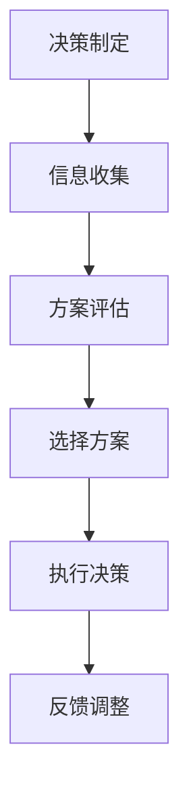
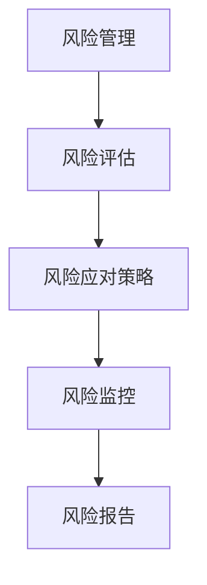
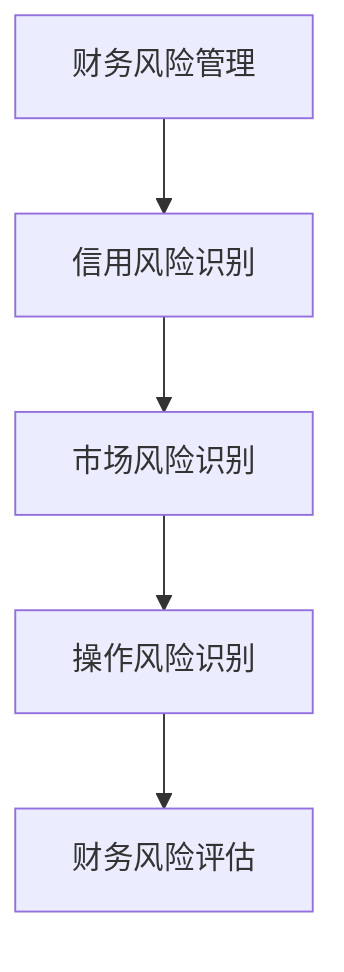
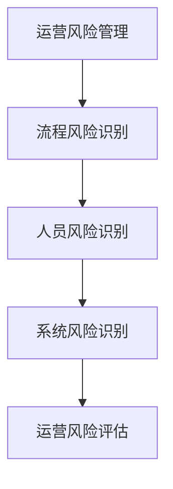
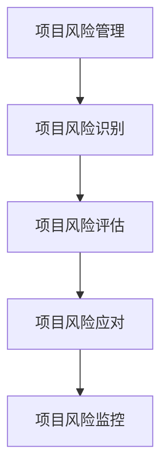

                 

### 文章标题

《创业者的决策制定与风险管理》

#### 关键词

- 创业决策
- 风险管理
- 企业风险管理
- 决策模型
- 风险评估
- 项目风险管理

#### 摘要

在快速变化的市场环境中，创业者需要具备高效的决策制定能力和完善的风险管理机制。本文将探讨创业者的决策制定过程，包括信息收集、方案评估和风险分析，以及如何在风险管理中实现有效的控制和应对策略。通过实际案例和算法分析，本文旨在为创业者提供实用的决策和风险管理工具，帮助他们更好地把握市场机遇，应对挑战。

### 第一部分：决策制定

#### 第1章：决策制定概述

**核心概念与联系**

决策制定是创业者日常工作中至关重要的一环，它涉及到信息收集、方案评估、选择方案、执行决策和反馈调整等多个环节。以下是决策制定流程的Mermaid流程图：



- **信息收集**：这是决策制定的第一步，创业者需要通过各种渠道收集与决策相关的信息，如市场趋势、竞争对手分析、用户需求等。
- **方案评估**：在收集到足够的信息后，创业者需要对各种可能的方案进行评估，从成本、效益、可行性等多个方面进行分析。
- **选择方案**：根据评估结果，创业者需要选择最优方案进行实施。
- **执行决策**：这一阶段是将决策转化为实际行动的过程，创业者需要确保执行过程中的有效性和效率。
- **反馈调整**：在决策执行过程中，创业者需要不断收集反馈信息，以便对决策进行调整和优化。

**决策制定模型**

决策制定模型是创业者进行科学决策的重要工具。以下是一个基于伪代码的决策制定模型：

```python
def decision_making(model, data, criteria):
    # 数据预处理
    processed_data = preprocess_data(data)
    
    # 选择最优方案
    best_solution = model.solve(processed_data, criteria)
    
    # 执行决策
    execute_decision(best_solution)
    
    # 反馈调整
    feedback = collect_feedback()
    model.update_model(feedback)
```

- **模型**：决策制定模型可以是线性的或非线性的，可以是基于历史数据的统计模型，也可以是智能化的机器学习模型。
- **数据**：数据是决策制定的基础，创业者需要确保数据的准确性和完整性。
- **标准**：标准或准则（criteria）是评估方案优劣的依据，它们可以是定量指标，如利润率、市场份额，也可以是定性指标，如用户满意度、社会责任等。

**案例研究**

以一位创业者根据市场反馈调整产品策略的案例为例，详细解释决策制定过程。

**案例描述**：

创业者小明在市场上推出了一款智能家居产品，但初期销售并不理想。为了改善产品表现，他决定根据市场反馈进行调整。

**代码解读与分析**：

```python
# 初始化决策模型
model = DecisionModel()

# 收集市场反馈数据
feedback_data = collect_feedback_data()

# 预处理数据
processed_data = preprocess_data(feedback_data)

# 评估产品策略
product_strategies = model.evaluate_strategies(processed_data)

# 选择最优策略
best_strategy = model.select_best_strategy(product_strategies)

# 执行策略调整
execute_strategy_adjustment(best_strategy)

# 收集调整后的反馈
adjustment_feedback = collect_adjustment_feedback()

# 更新模型
model.update_model(adjustment_feedback)
```

- **初始化决策模型**：创业者根据现有数据和经验初始化决策模型。
- **收集市场反馈数据**：创业者通过调查问卷、用户评论等方式收集市场反馈数据。
- **预处理数据**：对收集到的数据进行清洗、归一化等预处理步骤。
- **评估产品策略**：决策模型评估各种产品策略的潜在效果。
- **选择最优策略**：根据评估结果选择最优策略。
- **执行策略调整**：创业者根据最优策略对产品进行相应调整。
- **收集调整后的反馈**：调整后的产品重新投入市场，收集用户反馈。
- **更新模型**：根据新收集的反馈数据更新决策模型，以适应市场变化。

#### 第2章：决策制定方法

在决策制定过程中，创业者可以选择不同的方法来确保决策的科学性和有效性。这些方法可以分为定性决策方法和定量决策方法。

**定性决策方法**

定性决策方法主要依赖于经验和直觉，通常用于处理不确定性和复杂性的情况。以下是一些常见的定性决策方法：

- **头脑风暴**：通过集体讨论，产生大量的创意和解决方案，然后进行筛选和评估。
- **德尔菲法**：通过专家意见的多次征询和反馈，逐步形成共识。
- **SWOT分析**：对企业的优势、劣势、机会和威胁进行分析，帮助创业者明确决策的方向。

**定量决策方法**

定量决策方法主要依赖于数据和分析，通常用于处理明确和可量化的情况。以下是一些常见的定量决策方法：

- **期望值法**：通过计算不同方案的期望值，选择期望值最高的方案。
- **决策树分析法**：通过构建决策树，对每个决策节点进行风险和收益的分析。
- **灵敏度分析法**：通过改变模型中的参数，分析决策结果的敏感度。

**案例研究**

以一家初创公司决定是否扩大生产线为例，说明如何使用定量决策方法进行决策制定。

**案例描述**：

初创公司A目前的产品销售良好，但现有的生产线已接近满负荷。公司管理层需要决定是否扩大生产线以满足市场需求。

**代码解读与分析**：

```python
# 初始化决策模型
model = DecisionModel()

# 收集相关数据
sales_data = collect_sales_data()
production_data = collect_production_data()

# 计算不同方案的期望值
exp_value扩产 = model.calculate_exp_value(sales_data, production_data, 'expand')
exp_value维持现状 = model.calculate_exp_value(sales_data, production_data, 'maintain')

# 选择最优方案
if exp_value扩产 > exp_value维持现状:
    execute_decision('expand')
else:
    execute_decision('maintain')
```

- **初始化决策模型**：公司根据现有数据和经验初始化决策模型。
- **收集相关数据**：公司收集过去一段时间的销售数据和生产线利用率数据。
- **计算不同方案的期望值**：决策模型计算扩大生产线和维持现状两种方案的期望值。
- **选择最优方案**：根据期望值选择最优方案。
- **执行决策**：公司根据决策结果执行相应的决策。

#### 第3章：决策制定中的风险分析

在决策制定过程中，风险分析是不可或缺的一部分。创业者需要识别、评估和应对决策中的各种风险，以确保决策的有效性和可持续性。

**风险识别**

风险识别是风险管理的第一步，创业者需要识别可能影响决策的各种风险。以下是一些常见的风险识别方法：

- **专家评估法**：通过专家的意见和经验，识别潜在的风险。
- **头脑风暴法**：通过集体讨论，识别可能的风险。
- **SWOT分析**：通过分析企业的优势、劣势、机会和威胁，识别潜在的风险。

**风险评估**

风险评估是评估风险的可能性和影响的过程。以下是一些常见的方法：

- **概率评估法**：通过对历史数据的分析，评估风险发生的概率。
- **影响评估法**：通过对风险可能造成的损失进行分析，评估风险的影响。
- **风险矩阵**：通过概率和影响矩阵，对风险进行排序和优先级划分。

**风险应对策略**

在识别和评估风险之后，创业者需要制定相应的风险应对策略。以下是一些常见的策略：

- **风险规避**：通过改变决策方案，避免风险的发生。
- **风险减轻**：通过采取预防措施，降低风险的影响。
- **风险接受**：对于难以避免或减轻的风险，创业者可以选择接受并制定相应的应对措施。
- **风险转移**：通过购买保险或签订合同，将风险转移给第三方。

**案例研究**

以一家初创公司决定是否开发新产品的风险分析为例，说明如何进行风险识别、评估和应对。

**案例描述**：

初创公司B计划开发一款新的智能家居产品，但公司管理层担心新产品的开发和市场推广可能面临各种风险。

**风险识别**：

- **技术风险**：新产品的技术实现可能存在困难。
- **市场风险**：新产品可能不受市场欢迎。
- **财务风险**：新产品可能无法实现预期的盈利。

**风险评估**：

- **技术风险**：通过专家评估，技术风险的概率为30%，影响为重大。
- **市场风险**：通过市场调研，市场风险的概率为20%，影响为中等。
- **财务风险**：通过财务分析，财务风险的概率为10%，影响为重大。

**风险应对策略**：

- **技术风险**：增加研发投入，确保技术实现的可行性。
- **市场风险**：提前进行市场推广，降低市场风险。
- **财务风险**：制定详细的财务预算，确保资金充足。

### 第二部分：风险管理

#### 第4章：企业风险管理概述

企业风险管理是创业者确保企业长期稳定发展的关键。以下是企业风险管理的概述。

**核心概念与联系**

企业风险管理包括风险识别、风险评估、风险应对、风险监控和风险报告等环节。以下是企业风险管理流程的Mermaid流程图：



- **风险识别**：识别企业可能面临的各种风险。
- **风险评估**：评估风险的概率和影响。
- **风险应对策略**：制定应对各种风险的策略。
- **风险监控**：监控风险的变化和应对措施的实施情况。
- **风险报告**：定期报告风险管理的进展和成果。

**风险管理框架**

企业风险管理框架通常包括以下五个步骤：

1. **风险识别**：识别企业面临的各种风险，如市场风险、财务风险、运营风险、法律风险等。
2. **风险评估**：评估每种风险的概率和影响，确定风险的优先级。
3. **风险应对策略**：制定相应的风险应对策略，如风险规避、风险减轻、风险接受和风险转移等。
4. **风险监控**：监控风险的变化和应对措施的实施情况，确保风险管理的有效性。
5. **风险报告**：定期报告风险管理的进展和成果，以便企业高层决策。

#### 第5章：财务风险管理

财务风险管理是企业风险管理的重要组成部分，它关系到企业的资金安全、流动性和盈利能力。以下是财务风险管理的概述。

**核心概念与联系**

财务风险管理包括信用风险、市场风险和操作风险等。以下是财务风险管理流程的Mermaid流程图：



- **信用风险**：企业面临的客户违约或债务违约风险。
- **市场风险**：企业因市场波动（如利率、汇率、股价波动等）而面临的风险。
- **操作风险**：企业因内部操作失误、系统故障、法律合规问题等而面临的风险。

**财务风险识别**

财务风险识别是财务风险管理的基础，创业者需要识别企业可能面临的各类财务风险。以下是一些常见的财务风险识别方法：

- **专家评估法**：通过专家的经验和知识，识别可能的风险。
- **历史数据分析法**：通过分析企业的历史财务数据，识别潜在的风险。
- **情景分析法**：通过模拟不同的市场情景，分析企业可能面临的风险。

**财务风险评估**

财务风险评估是评估风险的概率和影响的过程。以下是一些常见的财务风险评估方法：

- **概率评估法**：通过对历史数据的分析，评估风险发生的概率。
- **影响评估法**：通过对风险可能造成的损失进行分析，评估风险的影响。
- **风险矩阵**：通过概率和影响矩阵，对风险进行排序和优先级划分。

**财务风险应对策略**

在识别和评估财务风险之后，创业者需要制定相应的财务风险应对策略。以下是一些常见的财务风险应对策略：

- **风险规避**：通过改变财务决策，避免风险的发生。
- **风险减轻**：通过采取预防措施，降低风险的影响。
- **风险接受**：对于难以避免或减轻的风险，创业者可以选择接受并制定相应的应对措施。
- **风险转移**：通过购买保险或签订合同，将风险转移给第三方。

**案例研究**

以一家初创公司决定是否进行债务融资为例，说明如何进行财务风险管理。

**案例描述**：

初创公司C计划进行一笔债务融资，以支持公司的发展。但公司管理层担心债务融资可能带来的风险。

**风险识别**：

- **信用风险**：借款人可能违约。
- **市场风险**：市场利率波动可能影响债务融资的成本。
- **操作风险**：债务融资的操作过程可能存在失误。

**风险评估**：

- **信用风险**：通过信用评级机构评估借款人的信用状况，评估信用风险的概率为20%，影响为重大。
- **市场风险**：通过分析市场利率的波动情况，评估市场风险的概率为10%，影响为中等。
- **操作风险**：通过内部审计和流程审查，评估操作风险的概率为5%，影响为中等。

**风险应对策略**：

- **信用风险**：增加借款人的抵押物，降低信用风险。
- **市场风险**：采取利率锁定措施，降低市场风险。
- **操作风险**：加强内部控制，确保债务融资操作的安全和准确。

#### 第6章：运营风险管理

运营风险管理是企业风险管理的重要组成部分，它关系到企业的日常运营和长期发展。以下是运营风险管理的概述。

**核心概念与联系**

运营风险管理包括流程风险、人员风险和系统风险等。以下是运营风险管理流程的Mermaid流程图：



- **流程风险**：企业内部流程可能出现的故障或问题。
- **人员风险**：企业员工可能出现的失误、违规或离职等。
- **系统风险**：企业信息系统可能出现的故障或数据泄露等。

**运营风险识别**

运营风险识别是运营风险管理的基础，创业者需要识别企业可能面临的各类运营风险。以下是一些常见的运营风险识别方法：

- **历史数据分析法**：通过分析企业的历史运营数据，识别潜在的风险。
- **专家评估法**：通过专家的经验和知识，识别可能的风险。
- **情景分析法**：通过模拟不同的运营情景，分析企业可能面临的风险。

**运营风险评估**

运营风险评估是评估风险的概率和影响的过程。以下是一些常见的运营风险评估方法：

- **概率评估法**：通过对历史数据的分析，评估风险发生的概率。
- **影响评估法**：通过对风险可能造成的损失进行分析，评估风险的影响。
- **风险矩阵**：通过概率和影响矩阵，对风险进行排序和优先级划分。

**运营风险应对策略**

在识别和评估运营风险之后，创业者需要制定相应的运营风险应对策略。以下是一些常见的运营风险应对策略：

- **风险规避**：通过改变运营流程，避免风险的发生。
- **风险减轻**：通过采取预防措施，降低风险的影响。
- **风险接受**：对于难以避免或减轻的风险，创业者可以选择接受并制定相应的应对措施。
- **风险转移**：通过签订合同或购买保险，将风险转移给第三方。

**案例研究**

以一家初创公司决定是否外包运营为例，说明如何进行运营风险管理。

**案例描述**：

初创公司D计划将部分运营业务外包给专业服务商，以降低运营成本和提高运营效率。但公司管理层担心外包可能带来的风险。

**风险识别**：

- **流程风险**：外包后企业可能失去对运营流程的掌控。
- **人员风险**：外包服务商的员工可能不够专业或出现离职情况。
- **系统风险**：外包服务商的系统可能存在漏洞或故障。

**风险评估**：

- **流程风险**：通过评估外包服务商的运营流程，评估流程风险的概率为30%，影响为重大。
- **人员风险**：通过评估外包服务商的员工队伍，评估人员风险的概率为20%，影响为中等。
- **系统风险**：通过评估外包服务商的系统安全措施，评估系统风险的概率为10%，影响为重大。

**风险应对策略**：

- **流程风险**：与外包服务商签订详细的合同，明确运营流程和责任。
- **人员风险**：选择有专业背景和稳定团队的外包服务商，建立定期沟通机制。
- **系统风险**：与外包服务商共同制定安全策略，确保系统的安全性和稳定性。

#### 第7章：项目风险管理

项目风险管理是确保项目成功完成的关键，它涉及到项目的各个方面，包括时间、成本、质量等。以下是项目风险管理的概述。

**核心概念与联系**

项目风险管理包括项目风险识别、风险评估、风险应对和风险监控等环节。以下是项目风险管理流程的Mermaid流程图：



- **项目风险识别**：识别项目可能面临的各种风险。
- **项目风险评估**：评估风险的概率和影响。
- **项目风险应对**：制定应对各种风险的策略。
- **项目风险监控**：监控风险的变化和应对措施的实施情况。

**项目风险识别**

项目风险识别是项目风险管理的基础，创业者需要识别项目可能面临的各类风险。以下是一些常见的方法：

- **头脑风暴法**：通过集体讨论，识别可能的风险。
- **SWOT分析法**：通过分析项目的优势、劣势、机会和威胁，识别潜在的风险。
- **故障模式与影响分析（FMEA）**：通过分析项目各个部分的故障模式和影响，识别潜在的风险。

**项目风险评估**

项目风险评估是评估风险的概率和影响的过程。以下是一些常见的方法：

- **概率评估法**：通过对历史数据的分析，评估风险发生的概率。
- **影响评估法**：通过对风险可能造成的损失进行分析，评估风险的影响。
- **风险矩阵**：通过概率和影响矩阵，对风险进行排序和优先级划分。

**项目风险应对**

在识别和评估项目风险之后，创业者需要制定相应的项目风险应对策略。以下是一些常见的项目风险应对策略：

- **风险规避**：通过改变项目计划，避免风险的发生。
- **风险减轻**：通过采取预防措施，降低风险的影响。
- **风险接受**：对于难以避免或减轻的风险，创业者可以选择接受并制定相应的应对措施。
- **风险转移**：通过签订合同或购买保险，将风险转移给第三方。

**项目风险监控**

项目风险监控是确保项目风险应对措施有效实施的过程。以下是一些常见的方法：

- **定期会议**：定期召开项目风险评审会议，讨论风险的变化和应对措施的实施情况。
- **实时监控**：通过建立实时监控系统，监控项目的各个方面的风险指标。
- **反馈机制**：建立风险反馈机制，及时收集和反馈项目风险信息。

**案例研究**

以一家初创公司开发一款移动应用为例，说明如何进行项目风险管理。

**案例描述**：

初创公司E计划开发一款移动应用，以提高用户满意度。但公司管理层担心移动应用的开发可能面临各种风险。

**风险识别**：

- **时间风险**：项目可能无法按时完成。
- **成本风险**：项目成本可能超支。
- **质量风险**：移动应用可能存在性能问题或用户体验不佳。

**风险评估**：

- **时间风险**：通过分析项目进度和历史数据，评估时间风险的概率为30%，影响为重大。
- **成本风险**：通过预算分析和成本控制，评估成本风险的概率为20%，影响为中等。
- **质量风险**：通过用户调研和产品质量评估，评估质量风险的概率为10%，影响为重大。

**风险应对策略**：

- **时间风险**：制定详细的进度计划，确保项目按时完成。
- **成本风险**：加强成本控制，确保项目成本在预算范围内。
- **质量风险**：进行用户测试和性能优化，确保移动应用的质量。

### 结论

通过本文的探讨，我们可以看到决策制定和风险管理在创业过程中的重要性。创业者需要科学地进行决策制定，合理识别和评估风险，并制定有效的风险应对策略。在实际操作中，创业者可以通过定性和定量方法相结合，提高决策的科学性和有效性。同时，企业应该建立完善的风险管理体系，确保风险管理的全面性和持续性。通过不断优化决策和风险管理机制，创业者可以更好地应对市场变化，实现企业的长期稳定发展。

### 作者信息

作者：AI天才研究院/AI Genius Institute & 禅与计算机程序设计艺术 /Zen And The Art of Computer Programming

### 附录

本文中的Mermaid流程图和代码示例仅供参考，具体实现可能因应用场景和数据而异。创业者在实际应用中需要根据具体情况调整和优化。

### 最佳实践 Tips

- **定期回顾**：创业者应定期回顾决策和风险管理过程，总结经验和教训，持续优化决策和风险管理机制。
- **数据驱动**：尽量使用数据和事实支持决策，减少主观判断的影响。
- **团队合作**：在决策和风险管理过程中，充分利用团队成员的专业知识和经验，提高决策的科学性和全面性。
- **持续学习**：随着市场和技术的变化，创业者应不断学习和更新知识，提高自身的决策能力和风险管理能力。

### 小结

本文详细探讨了创业者的决策制定与风险管理，从决策制定概述、决策制定方法、风险识别与评估到风险应对策略，全面解析了创业者在决策过程中需要关注的各个方面。通过实际案例和算法分析，本文为创业者提供了实用的决策和风险管理工具，帮助他们更好地把握市场机遇，应对挑战。

### 注意事项

- **数据安全**：在决策和风险管理过程中，确保数据的安全性和隐私性。
- **合规性**：在制定决策和风险管理策略时，遵守相关法律法规和行业标准。
- **灵活性**：在决策和风险管理过程中，保持灵活性，及时调整策略以适应环境变化。

### 拓展阅读

- 《创业者的实战指南》
- 《风险管理：策略与实践》
- 《项目风险管理：技术与案例》
- 《决策分析：原理与方法》

通过这些拓展阅读，创业者可以进一步深化对决策制定和风险管理的理解，提高自身的决策能力和风险管理水平。

