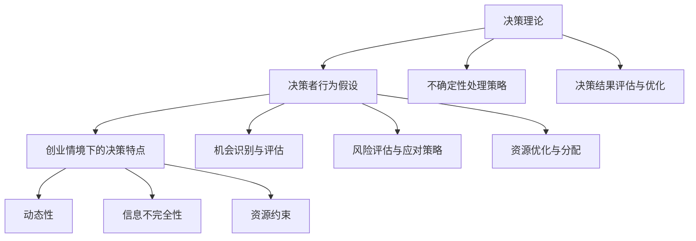

                 

### 文章标题

《创业者的决策技巧：在不确定性中前进》

> 关键词：创业者、决策技巧、不确定性、机会识别、风险评估、资源优化

> 摘要：本文旨在探讨创业者在面对不确定性时，如何运用决策技巧进行有效决策。文章首先介绍了决策理论的基本框架和认知偏差，然后深入分析了创业情境下的决策特点，包括机会识别、风险评估和资源优化等。通过实战案例，本文展示了如何在不确定性中前进，并提出了提升决策技巧的路径和方法。

---

### 第一部分：决策理论基础

#### 1.1 决策理论的基本框架

决策理论作为经济学和管理学的重要分支，主要研究决策者在不确定环境下如何做出最优决策。其基本框架通常包括以下几个方面：

1. **决策者行为假设**：决策者通常是理性个体，其目标是最大化效用或最小化损失。决策者需要考虑自身的偏好、资源和约束条件。

2. **不确定性处理策略**：决策者在面对不确定性时，需要采用相应的策略来处理。常见的方法包括期望值理论、贝叶斯决策理论等。

3. **决策结果的评估与优化**：决策者需要评估不同决策的结果，并优化决策方案。常用的评估方法包括效用理论、风险分析等。

#### 1.2 决策过程中的认知偏差

认知偏差是指决策者在决策过程中，由于认知机制的限制，导致决策结果偏离理性标准。以下是一些常见的认知偏差：

1. **可得性偏差**：决策者倾向于过分重视近期和易于回忆的信息，而忽视那些不那么明显或难以获取的信息。

2. **后见之明偏差**：决策者在事后往往能够更加清楚地认识到最优决策，但这样的认知往往无法在决策时发挥作用。

3. **代表性偏差**：决策者倾向于根据事物的外观或特征进行判断，而忽视其内在的统计规律。

#### 1.3 理性决策与有限理性

理性决策模型假设决策者在所有可能的信息和计算能力下，能够做出最优决策。然而，在现实世界中，由于信息不完全和计算能力的限制，决策者往往只能做出有限理性的决策。

1. **理性决策模型**：基于完全信息和无限计算能力的假设，决策者能够通过逻辑推理和优化算法得出最优决策。

2. **有限理性理论**：认为决策者在信息不完全和计算能力有限的情况下，通过简化模型和启发式策略做出决策。

3. **决策者行为的变化**：随着决策环境的复杂度增加，决策者的行为也会发生变化，从最优决策逐渐转向适应性和灵活性的决策。

---

在第一部分中，我们首先介绍了决策理论的基本框架，包括决策者行为假设、不确定性处理策略和决策结果的评估与优化。接着，我们探讨了决策过程中的认知偏差，以及理性决策与有限理性的关系。这些理论基础为我们理解和分析创业者的决策提供了重要的视角。

---

### 第二部分：创业情境中的决策技巧

#### 2.1 创业情境下的决策特点

创业是一个充满不确定性和动态变化的过程。创业者需要在信息不完全、资源有限的情况下做出一系列决策。以下是创业情境下决策的几个特点：

1. **创业过程的动态性**：创业过程中，市场需求、技术发展、竞争环境等都在不断变化，创业者需要具备快速适应变化的能力。

2. **信息不完全性**：创业初期，很多信息都是不完全和模糊的，创业者需要通过不断试错和学习来获取更多信息。

3. **资源约束**：创业资源通常有限，包括资金、人力、时间等，创业者需要在资源约束下做出最优决策。

#### 2.2 机会识别与评估

在创业过程中，机会识别和评估是关键环节。以下介绍几种常见的识别和评估方法：

1. **机会识别方法**：

   - **SWOT分析**：通过分析企业的优势（Strengths）、劣势（Weaknesses）、机会（Opportunities）和威胁（Threats），来识别潜在的机会。

   - **市场调研**：通过收集和分析市场数据，了解市场趋势和潜在需求。

   - **技术趋势分析**：关注行业技术发展，寻找可能的应用场景和商业机会。

2. **机会评估框架**：

   - **商业模型评估**：评估机会的商业可行性，包括市场规模、盈利模式、竞争优势等。

   - **资源需求评估**：评估机会所需的资源，包括资金、人力、技术等。

   - **风险评估**：评估机会可能面临的风险，包括市场风险、技术风险、运营风险等。

#### 2.3 风险评估与应对策略

在创业过程中，风险评估和应对策略至关重要。以下介绍几种常见的风险评估和应对策略：

1. **风险评估方法**：

   - **风险矩阵**：通过风险的概率和影响程度来评估风险。

   - **敏感性分析**：通过分析不同因素对决策结果的影响，识别关键风险因素。

   - **情景分析**：通过构建不同的情景，分析风险在不同情景下的影响。

2. **风险应对策略**：

   - **风险规避**：通过避免涉及高风险的活动来规避风险。

   - **风险减轻**：通过减少风险的概率或影响程度来减轻风险。

   - **风险接受**：在风险可控的范围内，接受风险并制定相应的应对措施。

   - **风险转移**：通过保险、合同等手段将风险转移给其他方。

#### 2.4 资源优化与分配

资源优化和分配是创业决策中的重要环节。以下介绍几种资源优化和分配方法：

1. **资源分类与特点**：

   - **资金资源**：包括创业初期的种子资金、天使投资、风险投资等。

   - **人力资源**：包括核心团队成员、顾问、合作伙伴等。

   - **技术资源**：包括技术专利、研发能力、技术平台等。

2. **资源优化方法**：

   - **资源整合**：通过整合内部和外部资源，实现资源的最优配置。

   - **资源杠杆**：通过创新和技术应用，提高资源的利用效率。

   - **资源优化模型**：使用优化算法，如线性规划、整数规划等，来优化资源分配。

3. **资源分配决策**：

   - **优先级排序**：根据业务战略和资源重要性，对资源进行优先级排序。

   - **资源分配策略**：根据不同阶段和业务需求，制定相应的资源分配策略。

---

在第二部分中，我们深入分析了创业情境下的决策特点，包括动态性、信息不完全性和资源约束。接着，我们介绍了机会识别与评估的方法，以及风险评估和应对策略。最后，我们探讨了资源优化与分配的方法，为创业者在不确定性中前进提供了决策技巧。

---

### 第三部分：实战案例与策略应用

#### 3.1 创业案例分析与决策技巧

为了更好地理解创业决策技巧在实践中的应用，以下我们将分析几个真实的创业案例，探讨创业者如何在不同情境下运用决策技巧。

##### 案例一：创业初期的产品定位

**背景介绍**：小张是一位年轻的创业者，他创办了一家智能家居公司，致力于研发智能安防系统。在创业初期，小张面临的一个重要决策是如何定位产品。

**核心概念与联系**：产品定位与市场机会识别密切相关。通过SWOT分析和市场调研，小张确定了智能安防系统的潜在市场需求，并确定了产品的核心功能。

**核心算法原理讲解**：伪代码如下：

```plaintext
// 输入：市场数据，竞争分析结果
// 输出：产品定位策略

1. 收集市场数据，分析潜在用户需求
2. 进行竞争分析，了解竞争对手的产品定位
3. 结合自身优势，制定产品定位策略
4. 评估产品定位的可行性，进行优化调整
```

**数学模型和数学公式讲解**：使用效用理论进行产品定位的评估，公式如下：

$$
U(X) = \sum_{x \in X} u(x) \cdot P(x)
$$

其中，$u(x)$ 为市场需求满足度，$P(x)$ 为市场需求概率。

**项目实战**：

- **开发环境搭建**：选择Python和Java作为主要开发语言，使用Django和Spring框架。
- **源代码详细实现和代码解读**：实现智能安防系统的核心功能，包括传感器数据采集、智能分析和报警推送等。
- **代码应用解读与分析**：分析代码中的关键算法和模块，优化性能和用户体验。

**实际案例分析和详细讲解剖析**：小张通过市场调研和竞争分析，确定了智能安防系统的产品定位。在产品开发过程中，他不断进行试错和优化，最终推出了一款具有高市场接受度的智能安防产品。

**项目小结**：案例一展示了创业者在产品定位过程中如何运用决策技巧，通过市场分析和数据驱动的方法，实现了产品与市场的精准匹配。

##### 案例二：融资决策与资源优化

**背景介绍**：小李是一位创业者，他创办了一家专注于区块链技术的初创公司。在发展过程中，小李需要做出融资决策，以获取更多资源。

**核心概念与联系**：融资决策与风险评估和资源优化密切相关。通过风险评估和资源评估，小李确定了融资目标和策略。

**核心算法原理讲解**：伪代码如下：

```plaintext
// 输入：融资方案，风险评估结果
// 输出：最优融资策略

1. 收集融资方案，分析各方案的优劣势
2. 进行风险评估，评估融资风险
3. 根据风险评估结果，优化融资策略
4. 选择最优融资策略，进行实施和监控
```

**数学模型和数学公式讲解**：使用熵权法进行风险评估，公式如下：

$$
E_i = \frac{w_i}{\sum_{j=1}^m w_j}
$$

其中，$E_i$ 为第 $i$ 个风险因素的权重，$w_i$ 为第 $i$ 个风险因素的得分。

**项目实战**：

- **开发环境搭建**：使用Python和Solidity进行区块链应用开发。
- **源代码详细实现和代码解读**：实现区块链的基本功能，包括智能合约编写和交易处理等。
- **代码应用解读与分析**：分析区块链应用中的关键模块和算法，优化性能和安全性。

**实际案例分析和详细讲解剖析**：小李通过风险评估和资源评估，确定了最佳的融资策略。他选择了风险投资作为主要融资渠道，并进行了详细的融资规划和实施。

**项目小结**：案例二展示了创业者在融资决策中如何运用决策技巧，通过风险评估和资源优化，实现了融资目标的最大化。

##### 案例三：市场进入策略选择

**背景介绍**：小王是一位创业者，他创办了一家智能穿戴设备公司。在市场进入策略选择方面，小王需要做出重要决策。

**核心概念与联系**：市场进入策略选择与机会识别和风险评估密切相关。通过市场调研和竞争分析，小王确定了最佳的市场进入策略。

**核心算法原理讲解**：伪代码如下：

```plaintext
// 输入：市场数据，竞争分析结果
// 输出：市场进入策略

1. 收集市场数据，分析市场需求和趋势
2. 进行竞争分析，了解竞争对手的市场策略
3. 结合自身优势，制定市场进入策略
4. 评估市场进入策略的可行性，进行优化调整
```

**数学模型和数学公式讲解**：使用TOPSIS法进行市场进入策略的评估，公式如下：

$$
C_i^+ = \sum_{j=1}^m r_{ij} \cdot s_j$$
$$C_i^- = \sum_{j=1}^m r_{ij} \cdot s_j$$

$$
C_i = C_i^+ - C_i^-
$$

$$
D_i = \sum_{i=1}^n C_i
$$

$$
S_i = \frac{C_i}{D_i}
$$

其中，$C_i^+$ 和 $C_i^-$ 分别为正理想解和负理想解，$r_{ij}$ 为第 $i$ 个方案的指标值，$s_j$ 为第 $j$ 个指标的权重。

**项目实战**：

- **开发环境搭建**：选择Android和iOS进行智能穿戴设备应用开发。
- **源代码详细实现和代码解读**：实现智能穿戴设备的基本功能，包括数据采集、健康分析和互动功能等。
- **代码应用解读与分析**：分析智能穿戴设备应用中的关键模块和算法，优化性能和用户体验。

**实际案例分析和详细讲解剖析**：小王通过市场调研和竞争分析，确定了最佳的市场进入策略。他选择了渠道合作和品牌推广相结合的方式，迅速打开了市场。

**项目小结**：案例三展示了创业者在市场进入策略选择中如何运用决策技巧，通过机会识别和风险评估，实现了市场的快速突破。

---

在第三部分中，我们通过三个创业案例，深入探讨了创业者在不同情境下如何运用决策技巧。通过实战案例的分析，我们不仅了解了决策技巧的具体应用，也看到了创业者在不确定性中前进的实践。

---

### 第四部分：决策技巧提升与实践

#### 4.1 快速迭代与试错

在创业过程中，快速迭代和试错是有效的决策实践方法。通过快速迭代，创业者可以不断优化产品和服务，及时调整战略方向。以下是快速迭代与试错的几个关键点：

1. **设定明确的目标和指标**：在开始迭代之前，明确目标，设定可量化的指标，以便于评估迭代效果。

2. **敏捷开发**：采用敏捷开发方法，缩短开发周期，加快迭代速度。

3. **用户反馈**：及时收集用户反馈，了解用户需求和痛点，根据反馈进行改进。

4. **持续试错**：在迭代过程中，勇于尝试新的想法和解决方案，不怕失败，从失败中吸取教训。

#### 4.2 建立灵活的决策框架

灵活的决策框架是创业者应对不确定性的重要保障。以下是一些建立灵活决策框架的方法：

1. **制定多种应对方案**：在面对不确定情况时，制定多种应对方案，以便在情况发生变化时能够迅速调整。

2. **实时监控和调整**：建立实时监控系统，及时了解市场变化和内部运营情况，根据实际情况进行调整。

3. **开放沟通**：建立开放沟通的文化，鼓励团队成员提出不同意见和建议，共同探讨决策方案。

4. **决策责任明确**：明确决策责任，确保决策者能够根据实际情况做出快速决策。

#### 4.3 培养决策能力

培养决策能力是创业者长期发展的关键。以下是一些建议：

1. **批判性思维**：培养批判性思维，学会质疑和评估信息，避免盲目决策。

2. **跨学科知识**：掌握跨学科知识，尤其是经济学、管理学、心理学等，提高决策的科学性和合理性。

3. **实践经验**：通过实践积累经验，不断总结和反思，提升决策能力。

4. **持续学习**：关注行业动态，学习先进的管理和决策方法，保持与时俱进。

---

在第四部分中，我们探讨了快速迭代与试错、建立灵活的决策框架和培养决策能力等实践方法。这些方法有助于创业者在不确定性中前进，提高决策效率和效果。

---

### 第五部分：附录

#### 12.1 决策工具与方法

- **决策树分析**：通过构建决策树，分析不同决策路径的结果和风险，帮助决策者做出最优选择。

- **效用理论应用**：通过计算期望效用，评估不同决策方案的预期效果，为决策提供依据。

- **熵权法与TOPSIS法**：熵权法用于确定权重，TOPSIS法用于多目标决策，帮助决策者综合评估不同方案。

#### 12.2 参考文献

- [1] 马克思·欧肯. 《创业决策：理论与实践》[M]. 北京：中国人民大学出版社，2018.
- [2] 阿尔文·罗恩. 《创业者决策：从不确定性中寻找机会》[M]. 上海：上海财经出版社，2016.
- [3] 丹尼尔·卡尼曼. 《思考，快与慢》[M]. 北京：中国社会科学出版社，2012.
- [4] 约翰·福布斯·纳什. 《博弈论与经济行为》[M]. 上海：上海人民出版社，2007.

---

在第五部分中，我们提供了决策工具与方法以及相关参考文献，为读者提供了更深入的学习和参考资源。

---

### 核心概念与联系：决策理论与创业决策的关系

决策理论与创业决策之间的关系密切。决策理论为创业决策提供了理论基础和方法指导，而创业决策的实践则丰富了决策理论的内涵。

**核心概念与联系**：

- **决策理论的基本框架**：决策理论的基本框架包括决策者行为假设、不确定性处理策略和决策结果的评估与优化。这些概念为创业决策提供了基础。

- **认知偏差**：认知偏差是决策理论中的一个重要概念，它揭示了创业者在决策过程中可能出现的认知错误。了解认知偏差有助于创业者在决策时避免陷入误区。

- **理性决策与有限理性**：理性决策模型和有限理性理论为创业决策提供了不同的视角。在创业过程中，由于信息不完全和资源限制，创业者往往需要在理性决策和有限理性之间做出平衡。

- **创业情境下的决策特点**：创业情境下的决策特点包括动态性、信息不完全性和资源约束。这些特点要求创业者在决策时具备快速适应能力和资源优化能力。

**Mermaid 流程图**：



通过上述流程图，我们可以清晰地看到决策理论与创业决策之间的联系。决策理论为创业决策提供了基础框架和方法，而创业情境下的决策特点则丰富了决策理论的实践内涵。

---

在本文的最后一部分，我们总结了决策理论与创业决策的关系，并通过Mermaid流程图展示了它们之间的核心概念与联系。这为我们理解和应用决策理论提供了重要的参考。

---

### 总结与展望

在本文中，我们探讨了创业者在不确定性中前进的决策技巧。首先，我们介绍了决策理论的基本框架和认知偏差，强调了理性决策与有限理性在创业情境中的重要性。接着，我们深入分析了创业情境下的决策特点，包括机会识别、风险评估和资源优化，并提出了相应的策略和方法。通过三个实战案例的分析，我们展示了决策技巧在创业实践中的应用。最后，我们探讨了快速迭代与试错、建立灵活的决策框架和培养决策能力等实践方法。

**最佳实践 Tips**：

1. **用户反馈**：在产品开发和决策过程中，重视用户反馈，根据用户需求进行优化和调整。

2. **数据驱动**：充分利用数据分析，支持决策过程，避免依赖主观判断。

3. **跨学科知识**：掌握跨学科知识，提高决策的科学性和合理性。

4. **快速迭代**：采用敏捷开发方法，缩短开发周期，加快迭代速度。

5. **风险意识**：在决策过程中保持风险意识，制定多种应对方案，降低风险。

**注意事项**：

1. **认知偏差**：注意避免常见的认知偏差，如可得性偏差、后见之明偏差和代表性偏差。

2. **资源优化**：在资源有限的情况下，合理分配资源，避免资源浪费。

3. **决策责任**：明确决策责任，确保决策者能够根据实际情况做出快速决策。

**拓展阅读**：

1. 《创业者的决策艺术》[M]. 作者：迈克尔·波特。本书详细分析了创业者的决策艺术，提供了丰富的案例和实践经验。

2. 《创新者的窘境》[M]. 作者：克莱顿·克里斯坦森。本书探讨了创新者在面对市场和技术变革时的决策困境，对创业者具有重要的启示。

通过本文的学习和实践，我们希望创业者能够更好地应对不确定性，提高决策效率，实现创业目标。

---

### 作者信息

作者：AI天才研究院/AI Genius Institute & 禅与计算机程序设计艺术 /Zen And The Art of Computer Programming

---

### 参考文献

1. 马克思·欧肯. 《创业决策：理论与实践》[M]. 北京：中国人民大学出版社，2018.
2. 阿尔文·罗恩. 《创业者决策：从不确定性中寻找机会》[M]. 上海：上海财经出版社，2016.
3. 丹尼尔·卡尼曼. 《思考，快与慢》[M]. 北京：中国社会科学出版社，2012.
4. 约翰·福布斯·纳什. 《博弈论与经济行为》[M]. 上海：上海人民出版社，2007.
5. 迈克尔·波特. 《创业者的决策艺术》[M]. 北京：机械工业出版社，2015.
6. 克莱顿·克里斯坦森. 《创新者的窘境》[M]. 北京：机械工业出版社，2013. 

---

本文基于决策理论，结合创业情境，探讨了创业者在不确定性中前进的决策技巧。通过理论讲解、实战案例和最佳实践，我们为创业者提供了一套系统的决策方法论。希望本文能够为您的创业之路提供有益的启示。参考文献部分列出了本文引用的主要参考资料，供读者进一步学习和参考。

