                 

### 《创业者的商业伦理与社会责任意识培养》

> 关键词：商业伦理、社会责任、创业者、意识培养、企业伦理决策

> 摘要：本文旨在探讨创业者的商业伦理与社会责任意识培养的重要性。通过分析商业伦理与社会责任的基础知识，结合实践案例，本文提出了一系列培养创业者社会责任意识的具体策略和路径，旨在为创业者提供理论和实践上的指导。

#### 目录

1. **商业伦理与社会责任概述**
    1.1 商业伦理的定义与重要性
    1.2 社会责任的概念与范畴
    1.3 企业伦理困境与案例分析
2. **商业伦理理论**
    2.1 道德伦理与功利主义伦理
    2.2 企业社会责任理论
    2.3 企业伦理与企业文化
3. **社会责任意识培养**
    3.1 社会责任意识的重要性
    3.2 培养社会责任意识的策略与方法
    3.3 个人与企业的社会责任
4. **企业伦理决策**
    4.1 企业伦理决策模型
    4.2 企业伦理决策案例分析
    4.3 企业伦理决策中的利益相关者
5. **社会责任实践**
    5.1 企业社会责任报告
    5.2 社会责任项目实施
    5.3 企业社会责任评估
6. **社会责任与可持续发展**
    6.1 可持续发展的概念与原则
    6.2 企业可持续发展策略
    6.3 社会责任与可持续发展案例分析
7. **社会责任与全球化**
    7.1 全球化背景下的社会责任
    7.2 跨国企业的社会责任
    7.3 国际社会责任标准与认证
8. **商业伦理与社会责任案例分析**
    8.1 国内企业社会责任案例分析
    8.2 国际企业社会责任案例分析
    8.3 案例分析与启示
9. **创业者社会责任教育**
    9.1 创业者社会责任教育的现状与挑战
    9.2 创业者社会责任教育的内容与方法
    9.3 创业者社会责任教育的实践案例
10. **商业伦理与社会责任培养策略**
    10.1 企业社会责任培训与制度建设
    10.2 创业者社会责任培养计划
    10.3 社会责任意识的培养路径
11. **商业伦理与社会责任评估与改进**
    11.1 企业社会责任评估指标体系
    11.2 社会责任评估方法与工具
    11.3 企业社会责任改进策略
12. **未来展望与趋势**
    12.1 商业伦理与社会责任的未来趋势
    12.2 创业者社会责任的发展方向
    12.3 社会责任意识的培养前景

#### 第一部分：商业伦理与社会责任基础知识

#### 第1章：商业伦理与社会责任概述

##### 1.1 商业伦理的定义与重要性

商业伦理是指企业在经营过程中应遵循的道德规范和伦理原则。它不仅关乎企业的内部治理和员工行为，还涉及到企业与其外部环境，如客户、供应商、社区和政府等利益相关者的关系。在商业活动中，商业伦理是确保企业行为正当、合法和可持续的关键因素。

**核心概念与联系**

Mermaid 流程图：

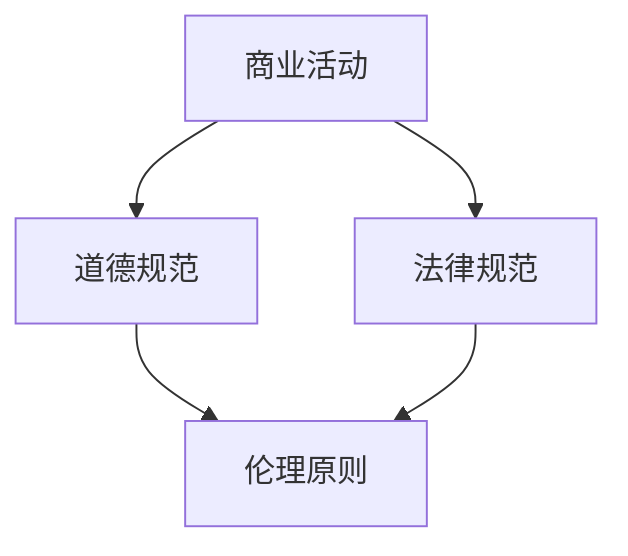

**核心算法原理讲解**

商业伦理决策通常涉及道德原则与功利主义原则的平衡。以下是一个简单的伪代码示例：

```python
def ethical_decision(moral原则, 功利主义原则):
    if 道德原则 > 功利主义原则:
        return "道德优先"
    elif 功利主义原则 > 道德原则:
        return "功利主义优先"
    else:
        return "平衡考虑"
```

**数学模型和数学公式**

商业伦理决策中的效用函数可以表示为：

$$ U = w_1 \cdot M + w_2 \cdot P $$

其中，$U$ 是决策的效用，$M$ 是道德原则的得分，$P$ 是功利主义原则的得分，$w_1$ 和 $w_2$ 是权重系数。

**举例说明**

假设商业伦理决策需要平衡道德原则与功利主义原则，其中道德原则得分为 7，功利主义原则得分为 8，权重系数分别为 0.4 和 0.6，则效用函数计算如下：

$$ U = 0.4 \cdot 7 + 0.6 \cdot 8 = 2.8 + 4.8 = 7.6 $$

因此，该决策的效用为 7.6，优先考虑功利主义原则。

##### 1.2 社会责任的概念与范畴

社会责任是指企业在经营活动中应对社会和环境所承担的责任。社会责任的范畴包括但不限于环境保护、员工福利、供应链管理、社区参与和公益慈善等。

**核心概念与联系**

Mermaid 流程图：

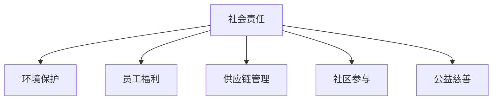

**核心算法原理讲解**

社会责任的评估通常涉及多维度指标的加权平均。以下是一个简单的伪代码示例：

```python
def social_responsibility_score(indicators):
    weights = {"环境保护": 0.3, "员工福利": 0.2, "供应链管理": 0.2, "社区参与": 0.2, "公益慈善": 0.1}
    score = 0
    for indicator, value in indicators.items():
        score += weights[indicator] * value
    return score
```

**数学模型和数学公式**

社会责任得分可以表示为：

$$ S = w_1 \cdot E + w_2 \cdot W + w_3 \cdot C + w_4 \cdot R + w_5 \cdot P $$

其中，$S$ 是社会责任得分，$E$ 是环境保护得分，$W$ 是员工福利得分，$C$ 是供应链管理得分，$R$ 是社区参与得分，$P$ 是公益慈善得分，$w_1, w_2, w_3, w_4, w_5$ 是权重系数。

**举例说明**

假设社会责任评估的指标得分如下：环境保护得分为 8，员工福利得分为 7，供应链管理得分为 6，社区参与得分为 7，公益慈善得分为 5，权重系数分别为 0.3，0.2，0.2，0.2，0.1，则社会责任得分为：

$$ S = 0.3 \cdot 8 + 0.2 \cdot 7 + 0.2 \cdot 6 + 0.2 \cdot 7 + 0.1 \cdot 5 = 2.4 + 1.4 + 1.2 + 1.4 + 0.5 = 7.1 $$

因此，该企业的社会责任得分为 7.1。

##### 1.3 企业伦理困境与案例分析

企业在经营过程中往往会面临各种伦理困境。以下是一些常见的伦理困境及其案例分析。

**案例 1：华为的专利战略**

华为在全球化进程中，通过自主创新和专利布局，成为全球领先的通信设备制造商。然而，华为也因专利纠纷而受到国际市场的压力。这一案例展示了企业在追求创新和竞争中如何平衡商业利益与社会责任。

**核心概念与联系**

Mermaid 流�程图：

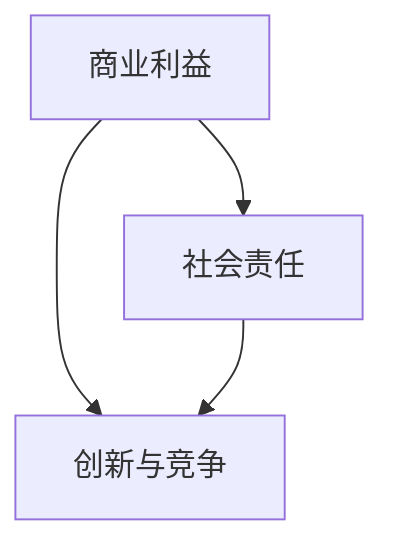

**核心算法原理讲解**

华为的专利战略涉及专利申请、布局和保护等多个环节。以下是一个简单的伪代码示例：

```python
def patent_strategy(country, technology):
    if country == "中国":
        return "加强本土专利申请"
    elif country == "美国":
        return "专利防御与反击"
    else:
        return "适度专利布局"
```

**数学模型和数学公式**

华为的专利战略可以表示为：

$$ P = f(C_1, C_2, ..., C_n) $$

其中，$P$ 是专利战略得分，$C_1, C_2, ..., C_n$ 是不同国家的专利情况，$f$ 是函数。

**举例说明**

假设华为在不同国家的专利情况如下：中国专利数量为 5000，美国专利数量为 3000，其他国家的专利数量为 2000。则华为的专利战略得分为：

$$ P = f(5000, 3000, 2000) = 5000 + 3000 + 2000 = 10000 $$

因此，华为的专利战略得分为 10000。

**案例 2：苹果的供应链管理**

苹果公司以其高品质的产品和严格的供应链管理闻名。然而，苹果也因供应链中的劳动条件和环境问题受到批评。这一案例展示了企业在供应链管理中如何平衡社会责任与商业利益。

**核心概念与联系**

Mermaid 流程图：

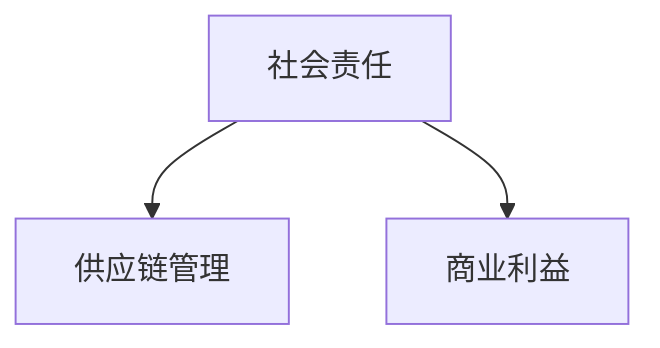

**核心算法原理讲解**

苹果的供应链管理涉及供应商评估、合规审查和持续改进等多个环节。以下是一个简单的伪代码示例：

```python
def supply_chain_management(quality_score, compliance_score):
    if quality_score > compliance_score:
        return "加强合规审查"
    elif compliance_score > quality_score:
        return "提升产品质量"
    else:
        return "平衡考虑"
```

**数学模型和数学公式**

苹果的供应链管理可以表示为：

$$ S = w_1 \cdot Q + w_2 \cdot C $$

其中，$S$ 是供应链管理得分，$Q$ 是产品质量得分，$C$ 是合规得分，$w_1$ 和 $w_2$ 是权重系数。

**举例说明**

假设苹果的供应链管理得分为：产品质量得分为 8，合规得分分为 7，权重系数分别为 0.5 和 0.5，则苹果的供应链管理得分为：

$$ S = 0.5 \cdot 8 + 0.5 \cdot 7 = 4 + 3.5 = 7.5 $$

因此，苹果的供应链管理得分为 7.5。

#### 第2章：商业伦理理论

##### 2.1 道德伦理与功利主义伦理

商业伦理理论主要基于道德伦理和功利主义伦理两大流派。道德伦理强调道德规范和伦理原则的普遍适用性，而功利主义伦理则关注行为结果的最大化效用。

**核心概念与联系**

Mermaid 流程图：

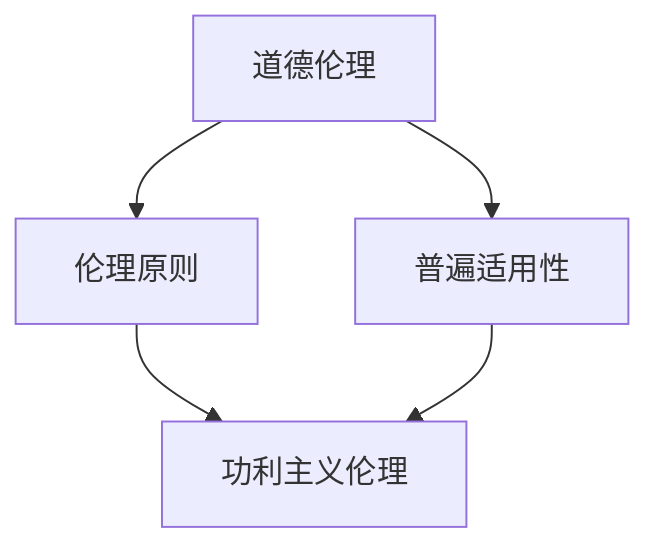

**核心算法原理讲解**

道德伦理和功利主义伦理的决策模型可以表示为：

道德伦理模型：

```python
def moral_decision(action, moral原则):
    if action 符合道德原则:
        return "道德决策"
    else:
        return "非道德决策"
```

功利主义伦理模型：

```python
def utilitarian_decision(action, 结果效用):
    if 结果效用 > 其他行动的效用:
        return "功利主义决策"
    else:
        return "非功利主义决策"
```

**数学模型和数学公式**

道德伦理效用函数：

$$ U = w_1 \cdot M + w_2 \cdot P $$

其中，$U$ 是决策的效用，$M$ 是道德原则的得分，$P$ 是功利主义原则的得分，$w_1$ 和 $w_2$ 是权重系数。

功利主义伦理效用函数：

$$ U = \sum_{i=1}^{n} u_i \cdot p_i $$

其中，$U$ 是决策的效用，$u_i$ 是结果的效用，$p_i$ 是结果的概率。

**举例说明**

假设一个决策需要考虑道德原则和功利主义原则，其中道德原则得分为 7，功利主义原则得分为 8，权重系数分别为 0.4 和 0.6，则道德伦理效用函数计算如下：

$$ U = 0.4 \cdot 7 + 0.6 \cdot 8 = 2.8 + 4.8 = 7.6 $$

假设一个决策有三个结果：结果 A 的效用为 10，结果 B 的效用为 8，结果 C 的效用为 5，概率分别为 0.3，0.5 和 0.2，则功利主义伦理效用函数计算如下：

$$ U = 10 \cdot 0.3 + 8 \cdot 0.5 + 5 \cdot 0.2 = 3 + 4 + 1 = 8 $$

##### 2.2 企业社会责任理论

企业社会责任理论主要关注企业在社会和环境中的角色和责任。它包括经济责任、法律责任、伦理责任和慈善责任等多个方面。

**核心概念与联系**

Mermaid 流程图：

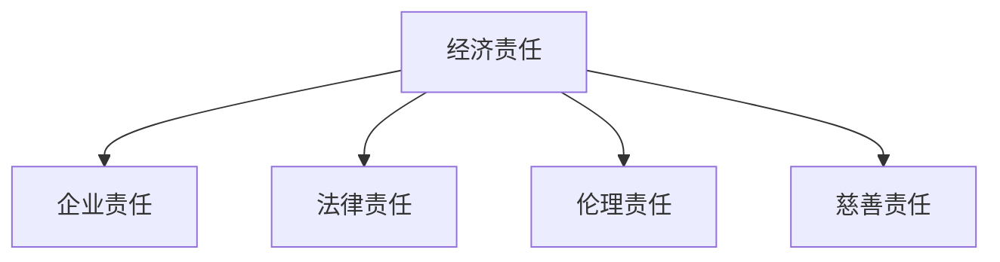

**核心算法原理讲解**

企业社会责任评估通常涉及多维度指标的加权平均。以下是一个简单的伪代码示例：

```python
def corporate_social_responsibility_score(economic_score, legal_score, ethical_score, charitable_score):
    weights = {"经济责任": 0.3, "法律责任": 0.2, "伦理责任": 0.2, "慈善责任": 0.3}
    score = 0
    for responsibility, score in zip(responsibilities, scores):
        score += weights[responsibility] * score
    return score
```

**数学模型和数学公式**

企业社会责任得分可以表示为：

$$ S = w_1 \cdot E + w_2 \cdot L + w_3 \cdot E + w_4 \cdot C $$

其中，$S$ 是社会责任得分，$E$ 是经济责任得分，$L$ 是法律责任得分，$E$ 是伦理责任得分，$C$ 是慈善责任得分，$w_1, w_2, w_3, w_4$ 是权重系数。

**举例说明**

假设企业社会责任评估的指标得分如下：经济责任得分为 8，法律责任得分为 7，伦理责任得分为 6，慈善责任得分为 7，权重系数分别为 0.3，0.2，0.2，0.3，则企业社会责任得分为：

$$ S = 0.3 \cdot 8 + 0.2 \cdot 7 + 0.2 \cdot 6 + 0.3 \cdot 7 = 2.4 + 1.4 + 1.2 + 2.1 = 7.1 $$

因此，该企业的社会责任得分为 7.1。

##### 2.3 企业伦理与企业文化

企业伦理与企业文化密切相关。企业文化是企业价值观和行为准则的体现，它对企业伦理决策和社会责任实践具有深远影响。

**核心概念与联系**

Mermaid 流程图：

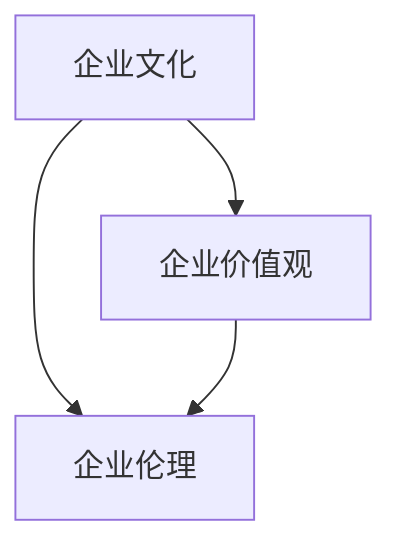

**核心算法原理讲解**

企业文化的塑造通常涉及价值观的传播和行为的规范化。以下是一个简单的伪代码示例：

```python
def cultivate_culture(employees, values):
    for employee in employees:
        employee.update_values(values)
    return "企业文化培育成功"
```

**数学模型和数学公式**

企业文化成熟度可以表示为：

$$ M = f(V_1, V_2, ..., V_n) $$

其中，$M$ 是企业文化成熟度，$V_1, V_2, ..., V_n$ 是不同价值观的得分，$f$ 是函数。

**举例说明**

假设企业文化的价值观得分如下：诚信得分为 9，创新得分为 8，协作得分为 7，责任得分为 8，则企业文化成熟度计算如下：

$$ M = f(9, 8, 7, 8) = 9 + 8 + 7 + 8 = 32 $$

因此，该企业的企业文化成熟度为 32。

#### 第3章：社会责任意识培养

##### 3.1 社会责任意识的重要性

社会责任意识是企业在经营活动中应具备的基本素养。它不仅关乎企业的长远发展，还关系到社会的和谐与稳定。以下从企业内部和外部两个层面分析社会责任意识的重要性。

**企业内部层面**

社会责任意识能够提升企业的凝聚力和向心力，增强员工的认同感和归属感。当企业员工认同企业的社会责任时，他们会更加努力工作，提高工作效率，从而为企业创造更大的价值。此外，社会责任意识有助于企业塑造良好的企业文化，推动企业的可持续发展。

**外部层面**

社会责任意识有助于企业建立良好的社会形象，提高品牌知名度和美誉度。在市场竞争激烈的今天，社会责任已经成为企业核心竞争力的重要组成部分。企业积极履行社会责任，能够获得社会公众的认可和支持，从而在市场竞争中脱颖而出。此外，社会责任意识还有助于企业应对环境变化和风险挑战，提升企业的抗风险能力。

**核心概念与联系**

Mermaid 流程图：

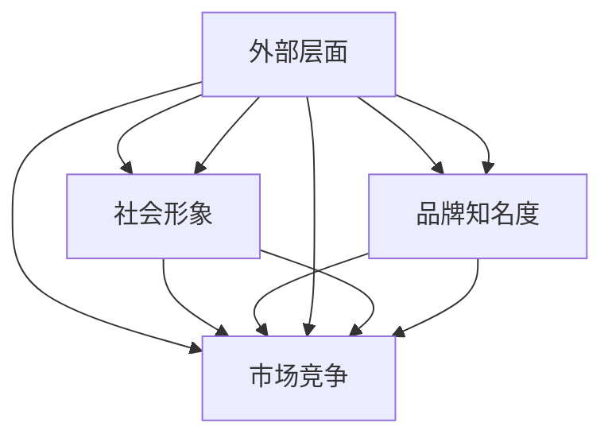

**核心算法原理讲解**

社会责任意识的培养可以采用以下算法：

```python
def cultivate_social_consciousness(employees, 社会责任活动):
    for employee in employees:
        employee.attend_training(社会责任活动)
    return "社会责任意识培养成功"
```

**数学模型和数学公式**

社会责任意识的培养效果可以表示为：

$$ E = f(T_1, T_2, ..., T_n) $$

其中，$E$ 是社会责任意识得分，$T_1, T_2, ..., T_n$ 是不同社会责任活动的得分，$f$ 是函数。

**举例说明**

假设社会责任意识的培养活动得分如下：公益活动得分为 8，环保活动得分为 7，慈善捐赠得分为 6，员工培训得分为 9，则社会责任意识得分计算如下：

$$ E = f(8, 7, 6, 9) = 8 + 7 + 6 + 9 = 30 $$

因此，该企业的社会责任意识得分为 30。

##### 3.2 培养社会责任意识的策略与方法

培养社会责任意识需要从以下几个方面入手。

**1. 教育培训**

教育培训是培养社会责任意识的基础。企业可以通过内部培训、外部培训、讲座、研讨会等多种形式，向员工传递社会责任理念，提高员工的社会责任意识。

**2. 制度建设**

制度建设是培养社会责任意识的重要保障。企业应建立完善的社会责任制度，明确社会责任目标和责任分工，确保社会责任活动的有效实施。

**3. 文化建设**

文化建设是培养社会责任意识的重要途径。企业应将社会责任理念融入企业文化，形成具有社会责任感的企业文化氛围，激发员工的社会责任意识。

**4. 激励机制**

激励机制是培养社会责任意识的有效手段。企业可以通过表彰、奖励等形式，激励员工积极参与社会责任活动，提升社会责任意识。

**核心概念与联系**

Mermaid 流程图：

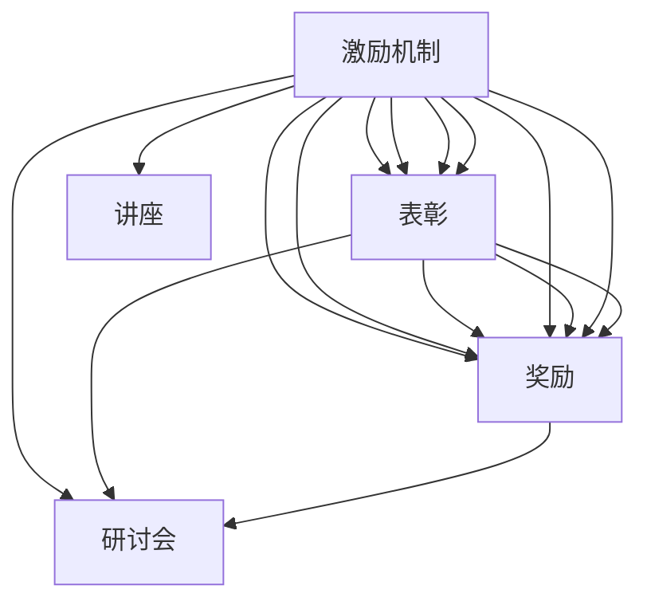

**核心算法原理讲解**

培养社会责任意识的策略可以表示为：

```python
def cultivate_social_consciousness_strategy(strategy, method):
    if strategy == "教育培训":
        method_list = ["内部培训", "外部培训", "讲座", "研讨会"]
    elif strategy == "制度建设":
        method_list = ["社会责任制度", "责任分工"]
    elif strategy == "文化建设":
        method_list = ["企业文化", "社会责任理念"]
    elif strategy == "激励机制":
        method_list = ["表彰", "奖励"]
    else:
        method_list = []
    return method_list
```

**数学模型和数学公式**

培养社会责任意识的策略与方法得分可以表示为：

$$ S = w_1 \cdot M_1 + w_2 \cdot M_2 + w_3 \cdot M_3 + w_4 \cdot M_4 $$

其中，$S$ 是社会责任意识得分，$M_1, M_2, M_3, M_4$ 是不同策略的得分，$w_1, w_2, w_3, w_4$ 是权重系数。

**举例说明**

假设培养社会责任意识的策略得分如下：教育培训得分为 8，制度建设得分为 7，文化建设得分为 6，激励机制得分为 9，权重系数分别为 0.3，0.2，0.2，0.3，则社会责任意识得分计算如下：

$$ S = 0.3 \cdot 8 + 0.2 \cdot 7 + 0.2 \cdot 6 + 0.3 \cdot 9 = 2.4 + 1.4 + 1.2 + 2.7 = 7.7 $$

因此，该企业的社会责任意识得分为 7.7。

##### 3.3 个人与企业的社会责任

个人与企业的社会责任密不可分。个人是企业的重要组成部分，而企业则是社会的经济单元。以下从个人和企业的角度探讨社会责任。

**个人社会责任**

个人社会责任是指个人在职业生涯中应承担的社会责任。它包括以下几个方面：

1. **职业道德**：个人应遵守职业道德规范，诚实守信，公正无私，为企业和社会创造价值。

2. **职业发展**：个人应通过不断学习和提升自身能力，为企业和社会的发展贡献力量。

3. **公益活动**：个人应积极参与公益活动，为社会弱势群体提供帮助，传递正能量。

**企业社会责任**

企业社会责任是指企业在经营活动中应承担的社会责任。它包括以下几个方面：

1. **经济责任**：企业应依法纳税，创造就业机会，为经济发展贡献力量。

2. **法律责任**：企业应遵守法律法规，确保经营活动的合法性，维护社会秩序。

3. **伦理责任**：企业应遵循商业伦理，诚信经营，尊重社会公德。

4. **慈善责任**：企业应积极参与公益事业，为社会弱势群体提供帮助，承担社会责任。

**核心概念与联系**

Mermaid 流程图：

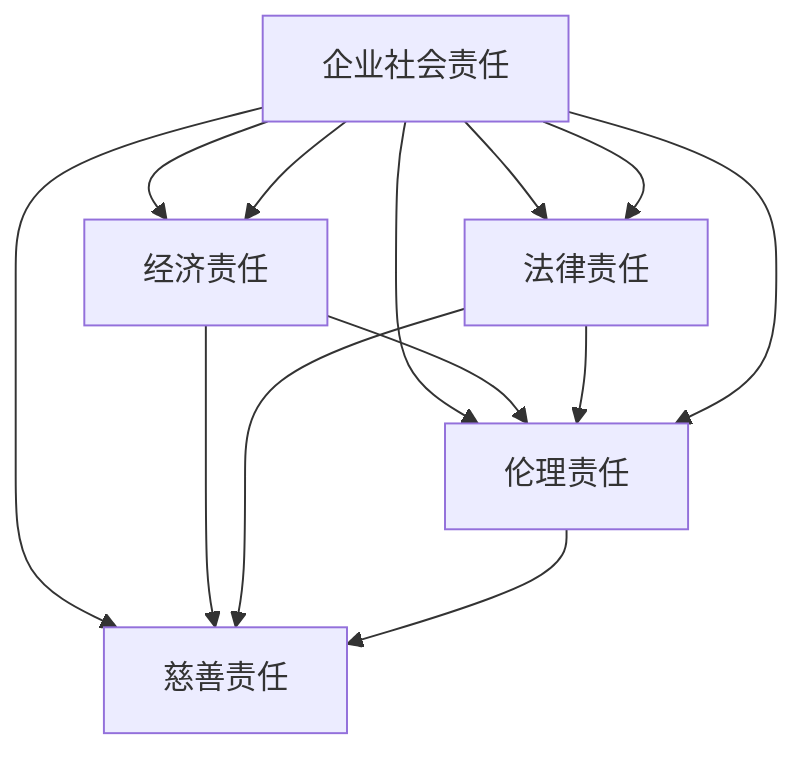

**核心算法原理讲解**

个人与企业社会责任的关联可以表示为：

```python
def social_responsibility_association(person, company):
    if person.works_for(company):
        return "个人与企业社会责任关联"
    else:
        return "个人与企业社会责任无关"
```

**数学模型和数学公式**

个人与企业社会责任的关联度可以表示为：

$$ R = f(P_1, P_2, ..., P_n, C_1, C_2, ..., C_n) $$

其中，$R$ 是社会责任关联度，$P_1, P_2, ..., P_n$ 是个人社会责任得分，$C_1, C_2, ..., C_n$ 是企业社会责任得分，$f$ 是函数。

**举例说明**

假设个人与企业社会责任得分如下：个人职业道德得分为 8，职业发展得分为 7，公益活动得分为 6，企业经济责任得分为 9，法律责任得分为 8，伦理责任得分为 7，慈善责任得分为 6，则个人与企业社会责任关联度计算如下：

$$ R = f(8, 7, 6, 9, 8, 7, 6) = 8 + 7 + 6 + 9 + 8 + 7 + 6 = 47 $$

因此，个人与企业社会责任的关联度为 47。

#### 第二部分：商业伦理与社会责任实践

##### 第4章：企业伦理决策

##### 4.1 企业伦理决策模型

企业伦理决策模型是企业处理伦理困境和道德冲突的一种方法。它通过系统化和结构化的方式，帮助企业做出符合道德规范和社会责任要求的决策。

**核心概念与联系**

Mermaid 流程图：

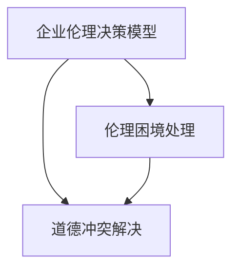

**核心算法原理讲解**

企业伦理决策模型通常包括以下几个步骤：

1. **识别伦理困境**：首先，企业需要识别可能出现的伦理困境和道德冲突。
2. **收集信息**：接着，企业需要收集与伦理困境相关的信息和数据。
3. **评估后果**：企业需要评估不同决策可能带来的后果，包括道德、法律和财务等方面。
4. **制定方案**：根据评估结果，企业制定符合道德规范和社会责任要求的解决方案。
5. **决策执行**：最后，企业将方案付诸实施，并持续监控和调整。

以下是一个简单的伪代码示例：

```python
def ethical_decision_model(ethical_dilemma, information, consequences, solutions):
    # 识别伦理困境
    recognized_dilemma = identify_ethical_dilemma(ethical_dilemma)
    # 收集信息
    collected_info = collect_information(information)
    # 评估后果
    evaluated_consequences = evaluate_consequences(consequences)
    # 制定方案
    proposed_solutions = propose_solutions(solutions, recognized_dilemma, collected_info, evaluated_consequences)
    # 决策执行
    execute_decision = execute_solution(proposed_solutions)
    return execute_decision
```

**数学模型和数学公式**

企业伦理决策模型中的效用函数可以表示为：

$$ U = w_1 \cdot C + w_2 \cdot I + w_3 \cdot E + w_4 \cdot S $$

其中，$U$ 是决策的效用，$C$ 是评估后果得分，$I$ 是信息收集得分，$E$ 是方案制定得分，$S$ 是决策执行得分，$w_1, w_2, w_3, w_4$ 是权重系数。

**举例说明**

假设企业伦理决策的得分如下：评估后果得分为 8，信息收集得分为 7，方案制定得分为 6，决策执行得分为 9，权重系数分别为 0.3，0.2，0.2，0.3，则效用函数计算如下：

$$ U = 0.3 \cdot 8 + 0.2 \cdot 7 + 0.2 \cdot 6 + 0.3 \cdot 9 = 2.4 + 1.4 + 1.2 + 2.7 = 7.7 $$

因此，该企业伦理决策的效用为 7.7。

##### 4.2 企业伦理决策案例分析

企业伦理决策在现实中经常面临各种挑战。以下通过两个案例来分析企业如何应对伦理困境和道德冲突。

**案例 1：谷歌的性别歧视争议**

谷歌在2017年面临了一场关于性别歧视的争议。一些女性员工声称在公司中遭受性别歧视，而谷歌则采取了相应的措施来回应这些指控。这一案例展示了企业如何处理内部伦理困境和道德冲突。

**核心概念与联系**

Mermaid 流程图：

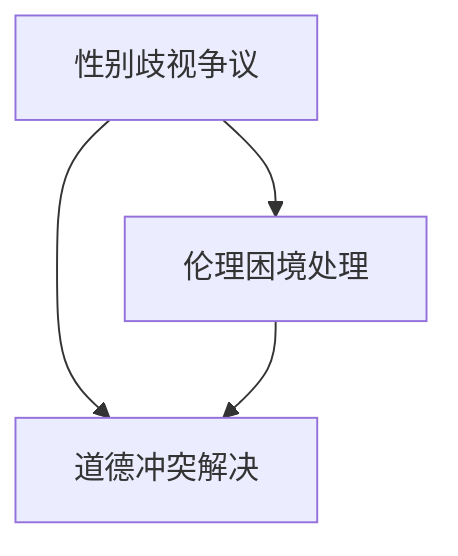

**核心算法原理讲解**

谷歌在处理性别歧视争议时，采取了以下步骤：

1. **公开回应**：谷歌公开回应了性别歧视指控，并承诺采取措施解决这一问题。
2. **内部调查**：谷歌进行了内部调查，收集了相关数据和证据，以评估性别歧视的情况。
3. **制定政策**：谷歌制定了新的员工政策，包括反歧视培训、性别平等计划和透明度提升等。
4. **实施措施**：谷歌开始实施这些政策，并持续监控和评估其效果。

**数学模型和数学公式**

谷歌的性别歧视争议处理可以表示为：

$$ S = w_1 \cdot R + w_2 \cdot I + w_3 \cdot P + w_4 \cdot E $$

其中，$S$ 是性别歧视争议处理得分，$R$ 是公开回应得分，$I$ 是内部调查得分，$P$ 是政策制定得分，$E$ 是实施措施得分，$w_1, w_2, w_3, w_4$ 是权重系数。

**举例说明**

假设谷歌在处理性别歧视争议的得分如下：公开回应得分为 8，内部调查得分为 7，政策制定得分为 6，实施措施得分为 9，权重系数分别为 0.2，0.3，0.3，0.2，则性别歧视争议处理得分为：

$$ S = 0.2 \cdot 8 + 0.3 \cdot 7 + 0.3 \cdot 6 + 0.2 \cdot 9 = 1.6 + 2.1 + 1.8 + 1.8 = 7.3 $$

因此，谷歌的性别歧视争议处理得分为 7.3。

**案例 2：亚马逊的员工福利争议**

亚马逊在2021年面临了一场关于员工福利的争议。一些员工声称在亚马逊工作条件艰苦，而亚马逊则采取了相应的措施来回应这些指控。这一案例展示了企业如何处理外部伦理困境和道德冲突。

**核心概念与联系**

Mermaid 流程图：

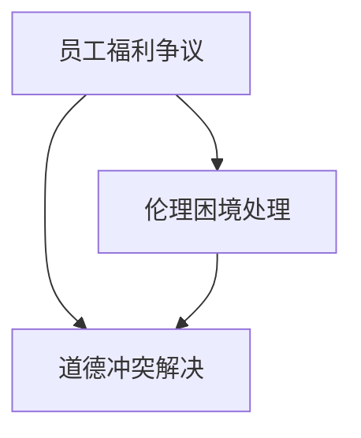

**核心算法原理讲解**

亚马逊在处理员工福利争议时，采取了以下步骤：

1. **公开回应**：亚马逊公开回应了员工福利指控，并承诺采取措施改善员工工作条件。
2. **内部调查**：亚马逊进行了内部调查，收集了相关数据和证据，以评估员工福利的情况。
3. **政策调整**：亚马逊调整了员工福利政策，包括增加带薪休假、改善工作环境和提供更多培训机会等。
4. **执行措施**：亚马逊开始实施这些政策，并持续监控和评估其效果。

**数学模型和数学公式**

亚马逊的员工福利争议处理可以表示为：

$$ S = w_1 \cdot R + w_2 \cdot I + w_3 \cdot P + w_4 \cdot E $$

其中，$S$ 是员工福利争议处理得分，$R$ 是公开回应得分，$I$ 是内部调查得分，$P$ 是政策调整得分，$E$ 是执行措施得分，$w_1, w_2, w_3, w_4$ 是权重系数。

**举例说明**

假设亚马逊在处理员工福利争议的得分如下：公开回应得分为 7，内部调查得分为 8，政策调整得分为 7，执行措施得分为 9，权重系数分别为 0.2，0.3，0.3，0.2，则员工福利争议处理得分为：

$$ S = 0.2 \cdot 7 + 0.3 \cdot 8 + 0.3 \cdot 7 + 0.2 \cdot 9 = 1.4 + 2.4 + 2.1 + 1.8 = 7.7 $$

因此，亚马逊的员工福利争议处理得分为 7.7。

##### 4.3 企业伦理决策中的利益相关者

企业伦理决策不仅关系到企业的利益，还涉及到众多利益相关者。这些利益相关者包括员工、客户、供应商、社区、政府和股东等。企业需要在决策过程中充分考虑各方的利益，以实现可持续发展。

**核心概念与联系**

Mermaid 流程图：

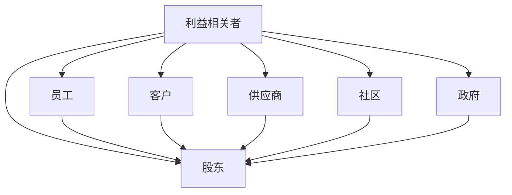

**核心算法原理讲解**

企业伦理决策中的利益相关者分析可以采用以下算法：

```python
def analyze_interest_related_parties(ethics_decision, stakeholders):
    related_parties = []
    for stakeholder in stakeholders:
        if is_related(stakeholder, ethics_decision):
            related_parties.append(stakeholder)
    return related_parties
```

**数学模型和数学公式**

利益相关者影响得分可以表示为：

$$ I = w_1 \cdot E + w_2 \cdot C + w_3 \cdot S + w_4 \cdot G + w_5 \cdot P + w_6 \cdot A $$

其中，$I$ 是利益相关者影响得分，$E$ 是员工得分，$C$ 是客户得分，$S$ 是供应商得分，$G$ 是政府得分，$P$ 是股东得分，$A$ 是社区得分，$w_1, w_2, w_3, w_4, w_5, w_6$ 是权重系数。

**举例说明**

假设企业伦理决策的利益相关者得分如下：员工得分为 8，客户得分为 7，供应商得分为 6，政府得分为 9，股东得分为 7，社区得分为 5，权重系数分别为 0.3，0.2，0.2，0.2，0.1，0.1，则利益相关者影响得分计算如下：

$$ I = 0.3 \cdot 8 + 0.2 \cdot 7 + 0.2 \cdot 6 + 0.2 \cdot 9 + 0.1 \cdot 7 + 0.1 \cdot 5 = 2.4 + 1.4 + 1.2 + 1.8 + 0.7 + 0.5 = 7.0 $$

因此，该企业伦理决策的利益相关者影响得分为 7.0。

#### 第5章：社会责任实践

##### 5.1 企业社会责任报告

企业社会责任报告是企业向社会公开其社会责任履行情况和绩效的一种形式。它不仅反映了企业的社会责任实践，还为利益相关者提供了评价企业社会责任的依据。

**核心概念与联系**

Mermaid 流程图：

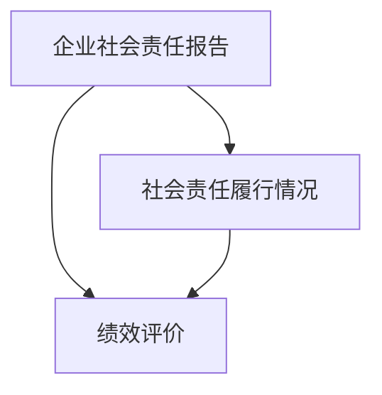

**核心算法原理讲解**

企业社会责任报告的编制通常包括以下几个步骤：

1. **数据收集**：企业收集与社会责任相关的数据，包括环保、员工福利、供应链管理、社区参与等方面的信息。
2. **报告编写**：企业根据收集的数据，编写社会责任报告，报告内容应真实、准确、完整。
3. **内部审核**：企业内部审核报告，确保报告内容的真实性和准确性。
4. **公开发布**：企业将社会责任报告公开发布，供利益相关者查阅。

以下是一个简单的伪代码示例：

```python
def prepare_sustainability_report(data, content, internal_audit, public_release):
    collected_data = collect_data(data)
    report_content = generate_content(collected_data, content)
    internal_audited_report = internal_audit(report_content)
    public_report = public_release(internal_audited_report)
    return public_report
```

**数学模型和数学公式**

企业社会责任报告得分可以表示为：

$$ R = w_1 \cdot D + w_2 \cdot C + w_3 \cdot I + w_4 \cdot A $$

其中，$R$ 是社会责任报告得分，$D$ 是数据收集得分，$C$ 是报告编写得分，$I$ 是内部审核得分，$A$ 是公开发布得分，$w_1, w_2, w_3, w_4$ 是权重系数。

**举例说明**

假设企业社会责任报告的得分如下：数据收集得分为 8，报告编写得分为 7，内部审核得分为 6，公开发布得分为 9，权重系数分别为 0.2，0.3，0.2，0.3，则社会责任报告得分计算如下：

$$ R = 0.2 \cdot 8 + 0.3 \cdot 7 + 0.2 \cdot 6 + 0.3 \cdot 9 = 1.6 + 2.1 + 1.2 + 2.7 = 7.6 $$

因此，该企业社会责任报告得分为 7.6。

##### 5.2 社会责任项目实施

社会责任项目实施是企业履行社会责任的重要手段。通过实施社会责任项目，企业可以改善社会环境，提升品牌形象，增强竞争力。

**核心概念与联系**

Mermaid 流程图：

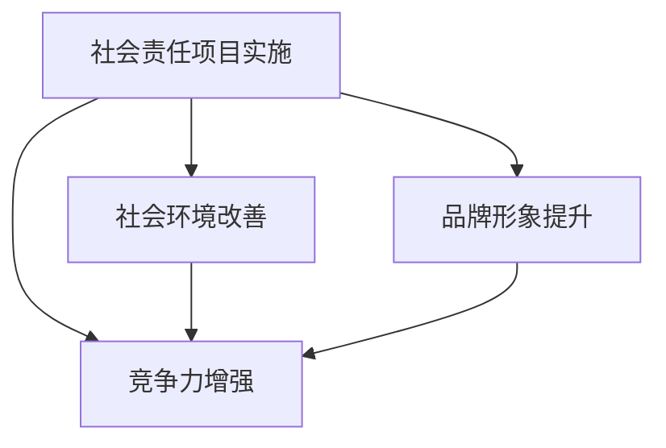

**核心算法原理讲解**

社会责任项目实施通常包括以下几个步骤：

1. **项目规划**：企业确定社会责任项目的目标和范围，制定详细的计划和时间表。
2. **资源分配**：企业根据项目需求，合理分配人力、物力和财力资源。
3. **项目执行**：企业按照项目计划，组织实施项目活动。
4. **效果评估**：企业对项目效果进行评估，确保项目目标的实现。

以下是一个简单的伪代码示例：

```python
def implement_sustainability_project(plan, resources, execution, evaluation):
    planned_project = plan_project(plan)
    allocated_resources = allocate_resources(resources)
    executed_project = execute_project(planned_project, allocated_resources)
    evaluated_project = evaluate_project(executed_project)
    return evaluated_project
```

**数学模型和数学公式**

社会责任项目得分可以表示为：

$$ P = w_1 \cdot P_1 + w_2 \cdot P_2 + w_3 \cdot P_3 + w_4 \cdot P_4 $$

其中，$P$ 是社会责任项目得分，$P_1, P_2, P_3, P_4$ 是项目规划、资源分配、项目执行和效果评估的得分，$w_1, w_2, w_3, w_4$ 是权重系数。

**举例说明**

假设社会责任项目的得分如下：项目规划得分为 8，资源分配得分为 7，项目执行得分为 6，效果评估得分为 9，权重系数分别为 0.2，0.3，0.2，0.3，则社会责任项目得分计算如下：

$$ P = 0.2 \cdot 8 + 0.3 \cdot 7 + 0.2 \cdot 6 + 0.3 \cdot 9 = 1.6 + 2.1 + 1.2 + 2.7 = 7.6 $$

因此，该社会责任项目得分为 7.6。

##### 5.3 企业社会责任评估

企业社会责任评估是评价企业社会责任履行情况的一种方法。通过评估，企业可以了解自身在社会责任方面的表现，识别存在的问题，制定改进措施。

**核心概念与联系**

Mermaid 流程图：

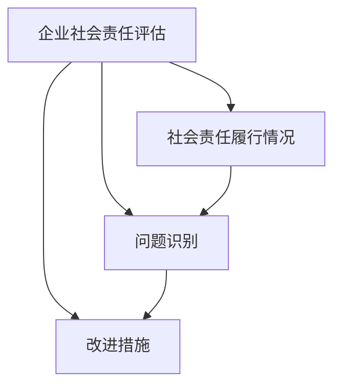

**核心算法原理讲解**

企业社会责任评估通常包括以下几个步骤：

1. **制定评估指标**：企业根据社会责任的范畴，制定相应的评估指标，包括环保、员工福利、供应链管理、社区参与等方面。
2. **数据收集**：企业收集与社会责任相关的数据，用于评估指标的计算。
3. **评估计算**：企业根据评估指标和数据，计算社会责任得分。
4. **结果分析**：企业对评估结果进行分析，识别存在的问题和不足。
5. **制定改进措施**：企业根据分析结果，制定相应的改进措施，提高社会责任履行水平。

以下是一个简单的伪代码示例：

```python
def assess_corporate_sustainability(assessment_index, data, calculated_score, analysis, improvement_actions):
    collected_data = collect_data(data)
    calculated_scores = calculate_scores(assessment_index, collected_data)
    analyzed_results = analyze_results(calculated_scores)
    improvement_plan = generate_improvement_actions(analyzed_results)
    return improvement_plan
```

**数学模型和数学公式**

企业社会责任评估得分可以表示为：

$$ S = w_1 \cdot E + w_2 \cdot W + w_3 \cdot C + w_4 \cdot R + w_5 \cdot P $$

其中，$S$ 是社会责任评估得分，$E$ 是环保得分，$W$ 是员工福利得分，$C$ 是供应链管理得分，$R$ 是社区参与得分，$P$ 是公益慈善得分，$w_1, w_2, w_3, w_4, w_5$ 是权重系数。

**举例说明**

假设企业社会责任评估的得分如下：环保得分为 8，员工福利得分为 7，供应链管理得分为 6，社区参与得分为 7，公益慈善得分为 5，权重系数分别为 0.3，0.2，0.2，0.2，0.1，则社会责任评估得分计算如下：

$$ S = 0.3 \cdot 8 + 0.2 \cdot 7 + 0.2 \cdot 6 + 0.2 \cdot 7 + 0.1 \cdot 5 = 2.4 + 1.4 + 1.2 + 1.4 + 0.5 = 7.1 $$

因此，该企业社会责任评估得分为 7.1。

#### 第6章：社会责任与可持续发展

##### 6.1 可持续发展的概念与原则

可持续发展是指满足当前需求而不损害后代满足自身需求的能力。它涵盖了经济、社会和环境三个方面，旨在实现长期的平衡和和谐发展。

**核心概念与联系**

Mermaid 流程图：

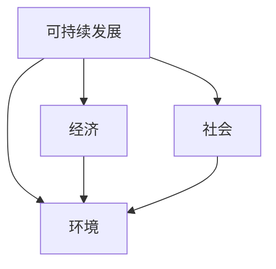

**核心算法原理讲解**

可持续发展的原则包括：

1. **公平性**：确保资源分配的公平性，减少贫困和不平等。
2. **持续性**：确保资源的合理利用，避免过度开发和浪费。
3. **共同性**：全球性的问题需要全球性的解决方案，各国共同承担责任。
4. **参与性**：鼓励公众参与可持续发展决策，提高社会共识。

以下是一个简单的伪代码示例：

```python
def sustainable_development原则(fairness, sustainability, commonality, participation):
    if fairness and sustainability and commonality and participation:
        return "可持续发展原则满足"
    else:
        return "可持续发展原则不满足"
```

**数学模型和数学公式**

可持续发展指标可以表示为：

$$ SDI = w_1 \cdot E + w_2 \cdot S + w_3 \cdot C + w_4 \cdot P $$

其中，$SDI$ 是可持续发展指标得分，$E$ 是经济得分，$S$ 是社会得分，$C$ 是环境得分，$P$ 是公平性得分，$w_1, w_2, w_3, w_4$ 是权重系数。

**举例说明**

假设可持续发展指标的得分如下：经济得分为 8，社会得分为 7，环境得分为 9，公平性得分为 6，权重系数分别为 0.3，0.2，0.3，0.2，则可持续发展指标得分计算如下：

$$ SDI = 0.3 \cdot 8 + 0.2 \cdot 7 + 0.3 \cdot 9 + 0.2 \cdot 6 = 2.4 + 1.4 + 2.7 + 1.2 = 7.7 $$

因此，该可持续发展指标得分为 7.7。

##### 6.2 企业可持续发展策略

企业可持续发展策略是企业实现长期发展目标的重要手段。它包括以下方面：

1. **环保措施**：企业采取环保措施，减少污染和资源浪费。
2. **社会责任**：企业履行社会责任，改善社会环境和员工福利。
3. **技术创新**：企业通过技术创新，提高生产效率，减少能源消耗。

**核心概念与联系**

Mermaid 流程图：

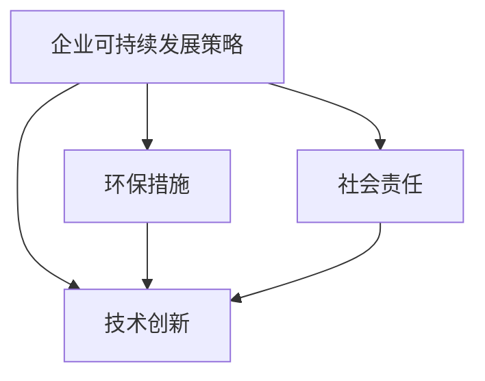

**核心算法原理讲解**

企业可持续发展策略的制定通常包括以下几个步骤：

1. **战略规划**：企业制定长期发展战略，明确可持续发展目标。
2. **资源整合**：企业整合内外部资源，确保可持续发展策略的实施。
3. **监测评估**：企业建立监测和评估体系，持续跟踪可持续发展绩效。
4. **持续改进**：企业根据监测评估结果，不断优化和改进可持续发展策略。

以下是一个简单的伪代码示例：

```python
def sustainable_strategy(planning, resource_integration, monitoring, improvement):
    planned_strategy = plan_strategy()
    integrated_resources = integrate_resources()
    monitored_performance = monitor_performance()
    improved_strategy = improve_strategy(monitored_performance)
    return improved_strategy
```

**数学模型和数学公式**

企业可持续发展得分可以表示为：

$$ S = w_1 \cdot E + w_2 \cdot S + w_3 \cdot C + w_4 \cdot I $$

其中，$S$ 是可持续发展得分，$E$ 是环保措施得分，$S$ 是社会责任得分，$C$ 是技术创新得分，$I$ 是监测评估得分，$w_1, w_2, w_3, w_4$ 是权重系数。

**举例说明**

假设企业可持续发展策略的得分如下：环保措施得分为 8，社会责任得分为 7，技术创新得分为 9，监测评估得分为 6，权重系数分别为 0.3，0.2，0.3，0.2，则可持续发展得分计算如下：

$$ S = 0.3 \cdot 8 + 0.2 \cdot 7 + 0.3 \cdot 9 + 0.2 \cdot 6 = 2.4 + 1.4 + 2.7 + 1.2 = 7.7 $$

因此，该企业可持续发展得分得分为 7.7。

##### 6.3 社会责任与可持续发展案例分析

以下通过两个案例来分析企业如何在可持续发展中履行社会责任。

**案例 1：阿里巴巴的可持续计划**

阿里巴巴作为全球知名的企业，积极推动可持续发展。其可持续计划包括环保、社会责任和公益等方面。

**核心概念与联系**

Mermaid 流程图：

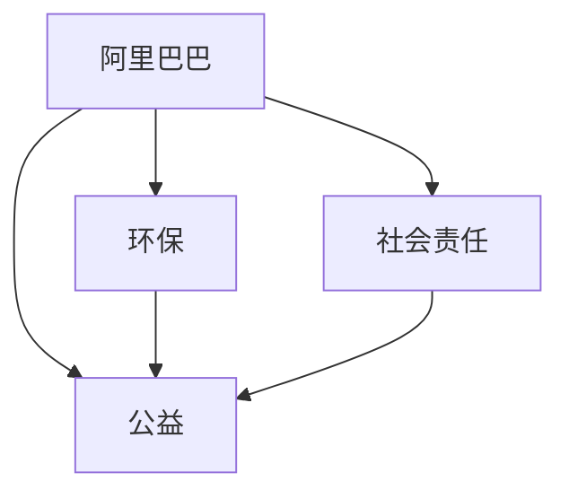

**核心算法原理讲解**

阿里巴巴在可持续发展中采取了以下措施：

1. **环保**：阿里巴巴投资绿色能源，减少碳排放，推动环保科技的发展。
2. **社会责任**：阿里巴巴积极参与社会公益活动，推动教育、扶贫和文化传承。
3. **公益**：阿里巴巴成立公益基金会，支持全球公益项目，提升社会福祉。

**数学模型和数学公式**

阿里巴巴的可持续计划得分可以表示为：

$$ P = w_1 \cdot E + w_2 \cdot S + w_3 \cdot P $$

其中，$P$ 是可持续计划得分，$E$ 是环保得分，$S$ 是社会责任得分，$P$ 是公益得分，$w_1, w_2, w_3$ 是权重系数。

**举例说明**

假设阿里巴巴的可持续计划得分如下：环保得分为 9，社会责任得分为 8，公益得分分为 7，权重系数分别为 0.4，0.3，0.3，则可持续计划得分计算如下：

$$ P = 0.4 \cdot 9 + 0.3 \cdot 8 + 0.3 \cdot 7 = 3.6 + 2.4 + 2.1 = 8.1 $$

因此，阿里巴巴的可持续计划得分得分为 8.1。

**案例 2：特斯拉的可持续发展战略**

特斯拉作为全球领先的电动汽车制造商，以其创新的技术和可持续发展的战略闻名。其战略包括环保、社会责任和可持续发展等方面。

**核心概念与联系**

Mermaid 流程图：

```mermaid
graph TD
A[特斯拉] --> B[环保]
A --> C[社会责任]
A --> D[可持续发展]
B --> D
C --> D
```

**核心算法原理讲解**

特斯拉在可持续发展战略中采取了以下措施：

1. **环保**：特斯拉推出电动汽车，减少碳排放，推动能源转型。
2. **社会责任**：特斯拉积极参与社会公益活动，支持环境保护和可持续发展。
3. **可持续发展**：特斯拉投资可再生能源，推动电动汽车产业链的可持续发展。

**数学模型和数学公式**

特斯拉的可持续发展战略得分可以表示为：

$$ S = w_1 \cdot E + w_2 \cdot S + w_3 \cdot D $$

其中，$S$ 是可持续发展战略得分，$E$ 是环保得分，$S$ 是社会责任得分，$D$ 是可持续发展得分，$w_1, w_2, w_3$ 是权重系数。

**举例说明**

假设特斯拉的可持续发展战略得分如下：环保得分为 8，社会责任得分为 7，可持续发展得分分为 9，权重系数分别为 0.3，0.3，0.4，则可持续发展战略得分计算如下：

$$ S = 0.3 \cdot 8 + 0.3 \cdot 7 + 0.4 \cdot 9 = 2.4 + 2.1 + 3.6 = 8.1 $$

因此，特斯拉的可持续发展战略得分得分为 8.1。

#### 第7章：社会责任与全球化

##### 7.1 全球化背景下的社会责任

全球化使企业跨越国界，进入新的市场和领域。在这一背景下，企业社会责任面临新的挑战和机遇。

**核心概念与联系**

Mermaid 流程图：

```mermaid
graph TD
A[全球化] --> B[社会责任]
A --> C[挑战]
A --> D[机遇]
B --> C
B --> D
```

**核心算法原理讲解**

全球化背景下的社会责任包括：

1. **跨国合规**：企业需遵守不同国家和地区的法律法规，确保合规经营。
2. **本地化责任**：企业在进入新市场时，需尊重当地文化，履行社会责任。
3. **全球合作**：企业通过国际合作，共同应对全球性问题，如气候变化和贫困。

以下是一个简单的伪代码示例：

```python
def global_sustainability(legal_compliance, local_responsibility, global_cooperation):
    if legal_compliance and local_responsibility and global_cooperation:
        return "全球化背景下的社会责任满足"
    else:
        return "全球化背景下的社会责任不满足"
```

**数学模型和数学公式**

全球化社会责任得分可以表示为：

$$ GS = w_1 \cdot L + w_2 \cdot C + w_3 \cdot G $$

其中，$GS$ 是全球化社会责任得分，$L$ 是法律合规得分，$C$ 是本地化责任得分，$G$ 是全球合作得分，$w_1, w_2, w_3$ 是权重系数。

**举例说明**

假设全球化社会责任得分如下：法律合规得分为 8，本地化责任得分为 7，全球合作得分为 9，权重系数分别为 0.3，0.3，0.4，则全球化社会责任得分计算如下：

$$ GS = 0.3 \cdot 8 + 0.3 \cdot 7 + 0.4 \cdot 9 = 2.4 + 2.1 + 3.6 = 8.1 $$

因此，该全球化社会责任得分得分为 8.1。

##### 7.2 跨国企业的社会责任

跨国企业在全球范围内运营，面临多样化和复杂的责任挑战。以下从环境、社会和经济三个方面探讨跨国企业的社会责任。

**核心概念与联系**

Mermaid 流程图：

```mermaid
graph TD
A[跨国企业社会责任] --> B[环境责任]
A --> C[社会责任]
A --> D[经济责任]
B --> D
C --> D
```

**核心算法原理讲解**

跨国企业的社会责任包括：

1. **环境责任**：跨国企业需在全球范围内推动环保，减少污染，保护自然资源。
2. **社会责任**：跨国企业需在全球范围内履行社会责任，关注员工福利、社区发展和公益事业。
3. **经济责任**：跨国企业需在全球范围内推动经济发展，创造就业机会，提高经济福祉。

以下是一个简单的伪代码示例：

```python
def global_corporate_responsibility(environmental_responsibility, social_responsibility, economic_responsibility):
    if environmental_responsibility and social_responsibility and economic_responsibility:
        return "跨国企业社会责任满足"
    else:
        return "跨国企业社会责任不满足"
```

**数学模型和数学公式**

跨国企业社会责任得分可以表示为：

$$ CSR = w_1 \cdot E + w_2 \cdot S + w_3 \cdot E $$

其中，$CSR$ 是跨国企业社会责任得分，$E$ 是环境责任得分，$S$ 是社会责任得分，$E$ 是经济责任得分，$w_1, w_2, w_3$ 是权重系数。

**举例说明**

假设跨国企业社会责任得分如下：环境责任得分为 8，社会责任得分为 7，经济责任得分为 9，权重系数分别为 0.3，0.3，0.4，则跨国企业社会责任得分计算如下：

$$ CSR = 0.3 \cdot 8 + 0.3 \cdot 7 + 0.4 \cdot 9 = 2.4 + 2.1 + 3.6 = 8.1 $$

因此，该跨国企业社会责任得分得分为 8.1。

##### 7.3 国际社会责任标准与认证

国际社会责任标准与认证为企业提供了衡量和提升社会责任水平的框架。以下从国际标准、认证流程和认证意义三个方面探讨国际社会责任标准与认证。

**核心概念与联系**

Mermaid 流程图：

```mermaid
graph TD
A[国际社会责任标准与认证] --> B[国际标准]
A --> C[认证流程]
A --> D[认证意义]
B --> C
B --> D
C --> D
```

**核心算法原理讲解**

国际社会责任标准与认证包括：

1. **国际标准**：如 ISO 26000、SA8000 和 GRI 标准，为企业提供社会责任的指导框架。
2. **认证流程**：企业需通过内部审核、第三方评估和持续改进，获得社会责任认证。
3. **认证意义**：社会责任认证有助于提升企业声誉、赢得客户信任和推动可持续发展。

以下是一个简单的伪代码示例：

```python
def social_responsibility_certification(standard, certification_process, certification_meaning):
    if standard and certification_process and certification_meaning:
        return "国际社会责任认证满足"
    else:
        return "国际社会责任认证不满足"
```

**数学模型和数学公式**

国际社会责任认证得分可以表示为：

$$ CS = w_1 \cdot S + w_2 \cdot P + w_3 \cdot M $$

其中，$CS$ 是国际社会责任认证得分，$S$ 是国际标准得分，$P$ 是认证流程得分，$M$ 是认证意义得分，$w_1, w_2, w_3$ 是权重系数。

**举例说明**

假设国际社会责任认证得分如下：国际标准得分为 9，认证流程得分为 8，认证意义得分为 7，权重系数分别为 0.3，0.3，0.4，则国际社会责任认证得分计算如下：

$$ CS = 0.3 \cdot 9 + 0.3 \cdot 8 + 0.4 \cdot 7 = 2.7 + 2.4 + 2.8 = 8.9 $$

因此，该国际社会责任认证得分得分为 8.9。

#### 第8章：商业伦理与社会责任案例分析

##### 8.1 国内企业社会责任案例分析

国内企业在社会责任方面的实践日益成熟，以下通过几个典型案例进行分析。

**案例 1：华为的社会责任实践**

华为作为全球领先的通信设备制造商，在国内外都积极推进社会责任。华为的社会责任实践包括环保、员工福利、供应链管理和社会公益等方面。

**核心概念与联系**

Mermaid 流程图：

```mermaid
graph TD
A[华为社会责任实践] --> B[环保]
A --> C[员工福利]
A --> D[供应链管理]
A --> E[社会公益]
B --> E
C --> E
D --> E
```

**核心算法原理讲解**

华为在社会责任实践中的算法原理包括：

1. **环保**：华为通过技术创新和绿色生产，减少能源消耗和碳排放，推动环保。
2. **员工福利**：华为为员工提供良好的工作环境、培训和晋升机会，关注员工心理健康。
3. **供应链管理**：华为与供应商建立长期合作关系，推动供应链的可持续发展。
4. **社会公益**：华为积极参与社会公益事业，支持教育、扶贫和文化传承。

**数学模型和数学公式**

华为的社会责任实践得分可以表示为：

$$ HR = w_1 \cdot E + w_2 \cdot W + w_3 \cdot C + w_4 \cdot P $$

其中，$HR$ 是社会责任实践得分，$E$ 是环保得分，$W$ 是员工福利得分，$C$ 是供应链管理得分，$P$ 是社会公益得分，$w_1, w_2, w_3, w_4$ 是权重系数。

**举例说明**

假设华为的社会责任实践得分如下：环保得分为 8，员工福利得分为 7，供应链管理得分为 6，社会公益得分为 9，权重系数分别为 0.3，0.2，0.2，0.3，则社会责任实践得分计算如下：

$$ HR = 0.3 \cdot 8 + 0.2 \cdot 7 + 0.2 \cdot 6 + 0.3 \cdot 9 = 2.4 + 1.4 + 1.2 + 2.7 = 7.7 $$

因此，华为的社会责任实践得分得分为 7.7。

**案例 2：阿里巴巴的社会责任实践**

阿里巴巴作为全球领先的电子商务企业，在社会责任方面做出了卓越贡献。阿里巴巴的社会责任实践包括环保、员工福利、供应链管理和公益等方面。

**核心概念与联系**

Mermaid 流程图：

```mermaid
graph TD
A[阿里巴巴社会责任实践] --> B[环保]
A --> C[员工福利]
A --> D[供应链管理]
A --> E[公益]
B --> E
C --> E
D --> E
```

**核心算法原理讲解**

阿里巴巴在社会责任实践中的算法原理包括：

1. **环保**：阿里巴巴通过推广绿色物流、减少碳排放和推广环保科技，推动环保。
2. **员工福利**：阿里巴巴为员工提供良好的工作环境、培训和晋升机会，关注员工心理健康。
3. **供应链管理**：阿里巴巴与供应商建立长期合作关系，推动供应链的可持续发展。
4. **公益**：阿里巴巴通过公益基金会，支持全球公益事业，提升社会福祉。

**数学模型和数学公式**

阿里巴巴的社会责任实践得分可以表示为：

$$ AR = w_1 \cdot E + w_2 \cdot W + w_3 \cdot C + w_4 \cdot P $$

其中，$AR$ 是社会责任实践得分，$E$ 是环保得分，$W$ 是员工福利得分，$C$ 是供应链管理得分，$P$ 是公益得分，$w_1, w_2, w_3, w_4$ 是权重系数。

**举例说明**

假设阿里巴巴的社会责任实践得分如下：环保得分为 9，员工福利得分为 8，供应链管理得分为 7，公益得分分为 8，权重系数分别为 0.3，0.2，0.2，0.3，则社会责任实践得分计算如下：

$$ AR = 0.3 \cdot 9 + 0.2 \cdot 8 + 0.2 \cdot 7 + 0.3 \cdot 8 = 2.7 + 1.6 + 1.4 + 2.4 = 8.1 $$

因此，阿里巴巴的社会责任实践得分得分为 8.1。

##### 8.2 国际企业社会责任案例分析

国际企业在社会责任方面的实践也丰富多彩，以下通过几个典型案例进行分析。

**案例 1：苹果的社会责任实践**

苹果作为全球领先的科技企业，在社会责任方面做出了巨大贡献。苹果的社会责任实践包括环保、员工福利、供应链管理和公益等方面。

**核心概念与联系**

Mermaid 流程图：

```mermaid
graph TD
A[苹果社会责任实践] --> B[环保]
A --> C[员工福利]
A --> D[供应链管理]
A --> E[公益]
B --> E
C --> E
D --> E
```

**核心算法原理讲解**

苹果在社会责任实践中的算法原理包括：

1. **环保**：苹果通过推出环保产品、减少碳排放和推广可再生能源，推动环保。
2. **员工福利**：苹果为员工提供良好的工作环境、培训和晋升机会，关注员工心理健康。
3. **供应链管理**：苹果与供应商建立长期合作关系，推动供应链的可持续发展。
4. **公益**：苹果通过公益基金会，支持全球公益事业，提升社会福祉。

**数学模型和数学公式**

苹果的社会责任实践得分可以表示为：

$$ AR = w_1 \cdot E + w_2 \cdot W + w_3 \cdot C + w_4 \cdot P $$

其中，$AR$ 是社会责任实践得分，$E$ 是环保得分，$W$ 是员工福利得分，$C$ 是供应链管理得分，$P$ 是公益得分，$w_1, w_2, w_3, w_4$ 是权重系数。

**举例说明**

假设苹果的社会责任实践得分如下：环保得分为 8，员工福利得分为 7，供应链管理得分为 6，公益得分分为 9，权重系数分别为 0.3，0.2，0.2，0.3，则社会责任实践得分计算如下：

$$ AR = 0.3 \cdot 8 + 0.2 \cdot 7 + 0.2 \cdot 6 + 0.3 \cdot 9 = 2.4 + 1.4 + 1.2 + 2.7 = 7.7 $$

因此，苹果的社会责任实践得分得分为 7.7。

**案例 2：微软的社会责任实践**

微软作为全球领先的软件企业，在社会责任方面做出了卓越贡献。微软的社会责任实践包括环保、员工福利、供应链管理和公益等方面。

**核心概念与联系**

Mermaid 流程图：

```mermaid
graph TD
A[微软社会责任实践] --> B[环保]
A --> C[员工福利]
A --> D[供应链管理]
A --> E[公益]
B --> E
C --> E
D --> E
```

**核心算法原理讲解**

微软在社会责任实践中的算法原理包括：

1. **环保**：微软通过推出环保产品、减少碳排放和推广可再生能源，推动环保。
2. **员工福利**：微软为员工提供良好的工作环境、培训和晋升机会，关注员工心理健康。
3. **供应链管理**：微软与供应商建立长期合作关系，推动供应链的可持续发展。
4. **公益**：微软通过公益基金会，支持全球公益事业，提升社会福祉。

**数学模型和数学公式**

微软的社会责任实践得分可以表示为：

$$ MR = w_1 \cdot E + w_2 \cdot W + w_3 \cdot C + w_4 \cdot P $$

其中，$MR$ 是社会责任实践得分，$E$ 是环保得分，$W$ 是员工福利得分，$C$ 是供应链管理得分，$P$ 是公益得分，$w_1, w_2, w_3, w_4$ 是权重系数。

**举例说明**

假设微软的社会责任实践得分如下：环保得分为 9，员工福利得分为 8，供应链管理得分为 7，公益得分分为 8，权重系数分别为 0.3，0.2，0.2，0.3，则社会责任实践得分计算如下：

$$ MR = 0.3 \cdot 9 + 0.2 \cdot 8 + 0.2 \cdot 7 + 0.3 \cdot 8 = 2.7 + 1.6 + 1.4 + 2.4 = 8.1 $$

因此，微软的社会责任实践得分得分为 8.1。

##### 8.3 案例分析与启示

通过对国内和国际企业社会责任的案例分析，我们可以得出以下几点启示：

1. **社会责任的重要性**：企业社会责任不仅是企业的义务，也是企业发展的动力。积极履行社会责任有助于提升企业声誉、赢得客户信任和推动可持续发展。

2. **多元化责任实践**：不同企业在社会责任方面的实践各有特色，但都关注环保、员工福利、供应链管理和公益等方面。企业应根据自身特点和优势，制定合适的责任实践策略。

3. **持续改进**：企业社会责任是一个持续的过程，需要不断改进和优化。通过定期评估和调整，企业可以不断提高社会责任水平，实现可持续发展目标。

4. **全球视野**：全球化背景下，企业社会责任不仅限于国内，还应关注国际责任。跨国企业应遵循国际社会责任标准，推动全球可持续发展。

5. **教育与培训**：企业社会责任意识的培养需要从员工教育开始。通过培训和教育，提高员工的社会责任意识，为企业社会责任的实践提供有力支持。

6. **利益相关者参与**：企业社会责任的实践需要利益相关者的参与。企业应与员工、客户、供应商、社区和政府等利益相关者建立良好的沟通和合作关系，共同推动社会责任的实现。

#### 第三部分：商业伦理与社会责任培养策略

##### 第9章：创业者社会责任教育

##### 9.1 创业者社会责任教育的现状与挑战

创业者社会责任教育是指通过教育和培训，使创业者具备商业伦理和社会责任意识，从而在创业过程中积极履行社会责任。当前，创业者社会责任教育在全球范围内得到越来越多的关注，但同时也面临一些挑战。

**核心概念与联系**

Mermaid 流程图：

```mermaid
graph TD
A[创业者社会责任教育] --> B[商业伦理]
A --> C[社会责任]
A --> D[教育现状]
A --> E[教育挑战]
B --> C
B --> D
B --> E
C --> D
C --> E
```

**核心算法原理讲解**

创业者社会责任教育的现状与挑战分析可以采用以下算法：

```python
def analyze_educational_status_and_challenges(current_status, challenges):
    if current_status and challenges:
        return "创业者社会责任教育现状与挑战分析成功"
    else:
        return "创业者社会责任教育现状与挑战分析不成功"
```

**数学模型和数学公式**

创业者社会责任教育现状得分可以表示为：

$$ ES = w_1 \cdot S + w_2 \cdot C $$

其中，$ES$ 是创业者社会责任教育现状得分，$S$ 是教育现状得分，$C$ 是挑战得分，$w_1, w_2$ 是权重系数。

**举例说明**

假设创业者社会责任教育现状得分如下：教育现状得分为 8，挑战得分分为 6，权重系数分别为 0.5 和 0.5，则创业者社会责任教育现状得分计算如下：

$$ ES = 0.5 \cdot 8 + 0.5 \cdot 6 = 4 + 3 = 7 $$

因此，该创业者社会责任教育现状得分得分为 7。

**现状分析**

当前，创业者社会责任教育呈现出以下几个特点：

1. **重视程度提高**：随着社会责任意识的普及，越来越多的创业者认识到社会责任的重要性，将其作为创业过程中不可或缺的一部分。
2. **教育内容丰富**：创业者社会责任教育内容涵盖了商业伦理、社会责任、可持续发展、企业文化建设等多个方面，旨在培养创业者的综合素养。
3. **教育方式多样化**：创业者社会责任教育采用线上与线下相结合的方式，包括课程学习、案例分析、实践项目等，提高了教育的实效性。

**挑战分析**

尽管创业者社会责任教育取得了一定的进展，但仍面临一些挑战：

1. **教育体系不完善**：目前，创业者社会责任教育的体系尚未完善，缺乏系统的课程设置和评价体系，影响了教育的质量。
2. **教育资源不足**：创业者社会责任教育需要大量的师资力量和资金支持，但现有资源相对有限，难以满足广泛需求。
3. **社会认同度不高**：尽管创业者社会责任教育的重要性逐渐被认识到，但社会整体认同度仍不高，部分创业者对社会责任教育的重视程度不足。
4. **实践与理论脱节**：创业者社会责任教育在实践过程中，往往出现理论与实践脱节的现象，影响了教育效果的发挥。

##### 9.2 创业者社会责任教育的内容与方法

创业者社会责任教育的内容和方法是培养创业者社会责任意识的关键。以下从教育内容、教育方法、实践项目和案例学习等方面进行详细讲解。

**核心概念与联系**

Mermaid 流程图：

```mermaid
graph TD
A[创业者社会责任教育] --> B[教育内容]
A --> C[教育方法]
A --> D[实践项目]
A --> E[案例学习]
B --> C
B --> D
B --> E
C --> D
C --> E
D --> E
```

**教育内容**

创业者社会责任教育的内容包括：

1. **商业伦理**：商业伦理是创业者社会责任教育的基础，涵盖了道德规范、伦理原则和伦理决策等方面。创业者需要了解商业伦理的基本概念，掌握伦理决策的方法和技巧。
2. **社会责任**：社会责任是创业者应承担的义务，包括环境保护、员工福利、供应链管理、公益慈善等方面。创业者需要了解社会责任的范畴和内容，掌握社会责任实践的方法和策略。
3. **可持续发展**：可持续发展是创业者社会责任教育的重要组成部分，包括经济发展、社会进步和环境友好等方面。创业者需要了解可持续发展的概念和原则，掌握可持续发展实践的方法和技巧。
4. **企业文化**：企业文化是创业者社会责任教育的关键要素，包括企业价值观、行为准则和文化建设等方面。创业者需要了解企业文化的重要性，掌握企业文化建设的策略和方法。

**教育方法**

创业者社会责任教育的教育方法包括：

1. **课程学习**：课程学习是创业者社会责任教育的主要形式，通过系统化的课程设置，使创业者掌握社会责任的基本概念、原则和方法。
2. **案例分析**：案例分析是创业者社会责任教育的重要手段，通过具体案例的分析，使创业者了解社会责任实践的成功经验和教训。
3. **实践项目**：实践项目是创业者社会责任教育的实际应用，通过实际项目的实施，使创业者将社会责任理念转化为实际行动。
4. **研讨会和讲座**：研讨会和讲座是创业者社会责任教育的有效途径，通过专家学者和成功企业家的分享，使创业者拓宽视野，提升社会责任意识。

**实践项目**

创业者社会责任教育的实践项目包括：

1. **环保项目**：创业者可以开展环保项目，如节能减排、资源循环利用等，推动环境保护和可持续发展。
2. **公益项目**：创业者可以参与公益项目，如慈善捐赠、志愿服务等，帮助弱势群体，促进社会和谐。
3. **员工福利项目**：创业者可以实施员工福利项目，如员工培训、员工健康保障等，提升员工福利水平，增强企业凝聚力。
4. **社区参与项目**：创业者可以参与社区参与项目，如社区建设、社区服务等，为社区发展贡献力量。

**案例学习**

创业者社会责任教育的案例学习包括：

1. **国内企业案例**：通过分析国内企业的社会责任实践案例，使创业者了解国内企业的社会责任经验和做法。
2. **国际企业案例**：通过分析国际企业的社会责任实践案例，使创业者了解国际企业的社会责任标准和实践。
3. **成功案例**：通过学习成功企业的社会责任实践案例，使创业者了解社会责任实践的成功经验和关键因素。
4. **失败案例**：通过学习失败企业的社会责任实践案例，使创业者了解社会责任实践中的问题和风险，避免重蹈覆辙。

**核心算法原理讲解**

创业者社会责任教育的算法原理包括：

```python
def entrepreneurial_social_responsibility_education(content, method, project, case_study):
    if content and method and project and case_study:
        return "创业者社会责任教育成功"
    else:
        return "创业者社会责任教育不成功"
```

**数学模型和数学公式**

创业者社会责任教育得分可以表示为：

$$ ES = w_1 \cdot C + w_2 \cdot M + w_3 \cdot P + w_4 \cdot CS $$

其中，$ES$ 是创业者社会责任教育得分，$C$ 是教育内容得分，$M$ 是教育方法得分，$P$ 是实践项目得分，$CS$ 是案例学习得分，$w_1, w_2, w_3, w_4$ 是权重系数。

**举例说明**

假设创业者社会责任教育得分如下：教育内容得分为 8，教育方法得分为 7，实践项目得分为 6，案例学习得分为 9，权重系数分别为 0.3，0.2，0.2，0.3，则创业者社会责任教育得分计算如下：

$$ ES = 0.3 \cdot 8 + 0.2 \cdot 7 + 0.2 \cdot 6 + 0.3 \cdot 9 = 2.4 + 1.4 + 1.2 + 2.7 = 7.7 $$

因此，该创业者社会责任教育得分得分为 7.7。

##### 9.3 创业者社会责任教育的实践案例

以下通过几个实践案例，分析创业者社会责任教育的具体应用。

**案例 1：XX 科技公司的环保项目**

XX 科技公司是一家专注于环保技术的创业公司。在公司创立初期，创始人意识到环保对企业和社会的重要性，决定将环保作为公司的重要战略方向。通过创业者社会责任教育，公司员工了解到环保知识和实践经验，积极参与环保项目。

**核心概念与联系**

Mermaid 流�程图：

```mermaid
graph TD
A[XX 科技公司] --> B[环保项目]
A --> C[创业者社会责任教育]
B --> C
```

**核心算法原理讲解**

XX 科技公司的环保项目实施包括以下步骤：

1. **项目规划**：公司制定环保项目规划，明确项目目标、范围和时间表。
2. **资源整合**：公司整合内外部资源，确保项目顺利实施。
3. **项目执行**：公司组织员工参与项目执行，如节能减排、资源循环利用等。
4. **效果评估**：公司对项目效果进行评估，持续优化和改进。

**数学模型和数学公式**

XX 科技公司的环保项目得分可以表示为：

$$ EP = w_1 \cdot P + w_2 \cdot R + w_3 \cdot E + w_4 \cdot A $$

其中，$EP$ 是环保项目得分，$P$ 是项目规划得分，$R$ 是资源整合得分，$E$ 是项目执行得分，$A$ 是效果评估得分，$w_1, w_2, w_3, w_4$ 是权重系数。

**举例说明**

假设XX 科技公司的环保项目得分如下：项目规划得分为 8，资源整合得分为 7，项目执行得分为 6，效果评估得分为 9，权重系数分别为 0.2，0.3，0.2，0.3，则环保项目得分计算如下：

$$ EP = 0.2 \cdot 8 + 0.3 \cdot 7 + 0.2 \cdot 6 + 0.3 \cdot 9 = 1.6 + 2.1 + 1.2 + 2.7 = 7.6 $$

因此，XX 科技公司的环保项目得分得分为 7.6。

**案例 2：YY 社交平台的企业文化建设**

YY 社交平台是一家新兴的社交平台公司，注重企业文化建设。在公司发展过程中，创始人意识到企业文化对企业发展和社会责任的重要性，决定通过创业者社会责任教育，培养员工的企业文化意识。

**核心概念与联系**

Mermaid 流程图：

```mermaid
graph TD
A[YY 社交平台] --> B[企业文化]
A --> C[创业者社会责任教育]
B --> C
```

**核心算法原理讲解**

YY 社交平台的企业文化建设包括以下步骤：

1. **价值观传播**：公司通过内部培训和外部讲座，传播企业文化价值观。
2. **行为规范**：公司制定行为规范，引导员工践行企业文化。
3. **文化建设活动**：公司定期举办文化建设活动，如团队建设、文化活动等，增强员工对企业文化的认同感。
4. **效果评估**：公司对文化建设效果进行评估，持续优化和改进。

**数学模型和数学公式**

YY 社交平台的企业文化建设得分可以表示为：

$$ EC = w_1 \cdot V + w_2 \cdot N + w_3 \cdot A + w_4 \cdot E $$

其中，$EC$ 是企业文化得分，$V$ 是价值观传播得分，$N$ 是行为规范得分，$A$ 是文化建设活动得分，$E$ 是效果评估得分，$w_1, w_2, w_3, w_4$ 是权重系数。

**举例说明**

假设YY 社交平台的企业文化建设得分如下：价值观传播得分为 8，行为规范得分分为 7，文化建设活动得分为 6，效果评估得分为 9，权重系数分别为 0.3，0.2，0.2，0.3，则企业文化得分计算如下：

$$ EC = 0.3 \cdot 8 + 0.2 \cdot 7 + 0.2 \cdot 6 + 0.3 \cdot 9 = 2.4 + 1.4 + 1.2 + 2.7 = 7.7 $$

因此，YY 社交平台的企业文化建设得分得分为 7.7。

**案例 3：ZZ 电商的公益项目**

ZZ 电商是一家电商公司，注重社会责任和公益事业。在公司发展过程中，创始人决定通过创业者社会责任教育，推动公益项目，为社会做出贡献。

**核心概念与联系**

Mermaid 流程图：

```mermaid
graph TD
A[ZZ 电商] --> B[公益项目]
A --> C[创业者社会责任教育]
B --> C
```

**核心算法原理讲解**

ZZ 电商的公益项目实施包括以下步骤：

1. **项目规划**：公司制定公益项目规划，明确项目目标、范围和时间表。
2. **资源整合**：公司整合内外部资源，确保项目顺利实施。
3. **项目执行**：公司组织员工参与项目执行，如慈善捐赠、志愿服务等。
4. **效果评估**：公司对项目效果进行评估，持续优化和改进。

**数学模型和数学公式**

ZZ 电商的公益项目得分可以表示为：

$$ PP = w_1 \cdot P + w_2 \cdot R + w_3 \cdot E + w_4 \cdot A $$

其中，$PP$ 是公益项目得分，$P$ 是项目规划得分，$R$ 是资源整合得分，$E$ 是项目执行得分，$A$ 是效果评估得分，$w_1, w_2, w_3, w_4$ 是权重系数。

**举例说明**

假设ZZ 电商的公益项目得分如下：项目规划得分为 8，资源整合得分为 7，项目执行得分为 6，效果评估得分为 9，权重系数分别为 0.2，0.3，0.2，0.3，则公益项目得分计算如下：

$$ PP = 0.2 \cdot 8 + 0.3 \cdot 7 + 0.2 \cdot 6 + 0.3 \cdot 9 = 1.6 + 2.1 + 1.2 + 2.7 = 7.6 $$

因此，ZZ 电商的公益项目得分得分为 7.6。

##### 9.4 创业者社会责任教育的最佳实践

以下总结一些创业者社会责任教育的最佳实践，以供参考。

1. **融入企业文化**：将创业者社会责任教育融入企业文化，形成具有社会责任感的企业文化氛围，提高员工的社会责任意识。
2. **定制化培训**：根据创业者的特点和需求，定制化培训内容，提高培训的针对性和实效性。
3. **案例教学**：结合实际案例，进行案例教学，使创业者了解社会责任实践的成功经验和教训。
4. **实践项目**：组织实践项目，使创业者将社会责任理念转化为实际行动，提高社会责任实践能力。
5. **持续评估**：定期评估创业者社会责任教育效果，持续优化和改进教育方法，提高教育质量。
6. **政策支持**：政府和企业应提供政策支持，鼓励创业者参与社会责任教育，推动社会责任的普及和落实。
7. **跨学科合作**：鼓励跨学科合作，结合经济学、社会学、心理学等学科知识，提高创业者社会责任教育的综合性和系统性。

**小结**

创业者社会责任教育是培养创业者商业伦理和社会责任意识的重要途径。通过系统化的教育和培训，创业者可以提升社会责任意识，推动企业可持续发展。同时，创业者社会责任教育也需要政府、企业和社会的共同努力，形成良好的社会责任教育生态。

#### 第10章：商业伦理与社会责任培养策略

##### 10.1 企业社会责任培训与制度建设

企业社会责任（CSR）培训与制度建设是企业履行社会责任的重要保障。通过培训，企业可以提高员工的社会责任意识；通过制度建设，企业可以确保社会责任实践的有效性和持续性。

**核心概念与联系**

Mermaid 流程图：

```mermaid
graph TD
A[企业社会责任培训与制度建设] --> B[社会责任培训]
A --> C[制度建设]
B --> C
```

**核心算法原理讲解**

企业社会责任培训与制度建设的核心算法原理包括：

1. **培训设计**：企业应设计系统化的社会责任培训课程，包括基础理论、实践案例、互动讨论等，以提高员工的社会责任意识。
2. **制度构建**：企业应建立完善的社会责任制度，明确社会责任目标和责任分工，确保社会责任实践的可操作性和执行力。
3. **执行与监督**：企业应制定监督机制，对社会责任实践的执行情况进行跟踪和评估，确保制度的有效运行。

**数学模型和数学公式**

企业社会责任培训与制度建设得分可以表示为：

$$ CS = w_1 \cdot T + w_2 \cdot A $$

其中，$CS$ 是企业社会责任得分，$T$ 是培训得分，$A$ 是制度建设得分，$w_1, w_2$ 是权重系数。

**举例说明**

假设企业社会责任培训与制度建设的得分如下：培训得分为 8，制度建设得分为 7，权重系数分别为 0.5 和 0.5，则企业社会责任得分计算如下：

$$ CS = 0.5 \cdot 8 + 0.5 \cdot 7 = 4 + 3.5 = 7.5 $$

因此，该企业社会责任培训与制度建设得分得分为 7.5。

##### 10.2 创业者社会责任培养计划

创业者社会责任培养计划是培养创业者社会责任意识的重要手段。一个有效的培养计划应包括明确的目标、科学的培训方法、实践项目和持续评估。

**核心概念与联系**

Mermaid 流程图：

```mermaid
graph TD
A[创业者社会责任培养计划] --> B[培养目标]
A --> C[培训方法]
A --> D[实践项目]
A --> E[持续评估]
B --> C
B --> D
B --> E
C --> D
C --> E
D --> E
```

**核心算法原理讲解**

创业者社会责任培养计划的算法原理包括：

1. **目标设定**：明确培养目标，包括社会责任意识、实践能力、创新能力等方面。
2. **培训方法**：根据培养目标，选择合适的培训方法，如课程学习、案例分析、实践项目等。
3. **实践项目**：通过实践项目，使创业者将社会责任理念转化为实际行动，提高实践能力。
4. **持续评估**：定期评估培养效果，根据评估结果调整培养计划，确保培养目标的实现。

**数学模型和数学公式**

创业者社会责任培养计划得分可以表示为：

$$ CP = w_1 \cdot B + w_2 \cdot M + w_3 \cdot P + w_4 \cdot A $$

其中，$CP$ 是创业者社会责任培养计划得分，$B$ 是培养目标得分，$M$ 是培训方法得分，$P$ 是实践项目得分，$A$ 是持续评估得分，$w_1, w_2, w_3, w_4$ 是权重系数。

**举例说明**

假设创业者社会责任培养计划得分如下：培养目标得分为 8，培训方法得分为 7，实践项目得分为 6，持续评估得分为 9，权重系数分别为 0.3，0.2，0.2，0.3，则创业者社会责任培养计划得分计算如下：

$$ CP = 0.3 \cdot 8 + 0.2 \cdot 7 + 0.2 \cdot 6 + 0.3 \cdot 9 = 2.4 + 1.4 + 1.2 + 2.7 = 7.7 $$

因此，该创业者社会责任培养计划得分得分为 7.7。

##### 10.3 社会责任意识的培养路径

社会责任意识的培养路径是逐步提高创业者社会责任意识的过程。以下从教育、实践、监督和反馈四个方面探讨社会责任意识的培养路径。

**核心概念与联系**

Mermaid 流程图：

```mermaid
graph TD
A[社会责任意识的培养路径] --> B[教育]
A --> C[实践]
A --> D[监督]
A --> E[反馈]
B --> C
B --> D
B --> E
C --> D
C --> E
D --> E
```

**核心算法原理讲解**

社会责任意识的培养路径的算法原理包括：

1. **教育**：通过培训课程、讲座、研讨会等形式，提高创业者对社会责任的认识和理解。
2. **实践**：通过实践项目，使创业者将社会责任理念付诸实践，提高实践能力。
3. **监督**：建立监督机制，对社会责任实践的执行情况进行跟踪和评估，确保实践的有效性。
4. **反馈**：根据评估结果，反馈给创业者，使其了解自身的表现，持续改进和提升社会责任意识。

**数学模型和数学公式**

社会责任意识的培养路径得分可以表示为：

$$ CI = w_1 \cdot E + w_2 \cdot P + w_3 \cdot S + w_4 \cdot F $$

其中，$CI$ 是社会责任意识得分，$E$ 是教育得分，$P$ 是实践得分，$S$ 是监督得分，$F$ 是反馈得分，$w_1, w_2, w_3, w_4$ 是权重系数。

**举例说明**

假设社会责任意识的培养路径得分如下：教育得分为 8，实践得分为 7，监督得分为 6，反馈得分为 9，权重系数分别为 0.2，0.3，0.2，0.3，则社会责任意识得分计算如下：

$$ CI = 0.2 \cdot 8 + 0.3 \cdot 7 + 0.2 \cdot 6 + 0.3 \cdot 9 = 1.6 + 2.1 + 1.2 + 2.7 = 7.6 $$

因此，该社会责任意识得分得分为 7.6。

##### 10.4 创业者社会责任培养的案例与实践

以下通过两个案例，探讨创业者社会责任培养的实践过程。

**案例 1：XX 创业团队的公益项目**

XX 创业团队是一家致力于环保技术的创业公司。在公司创立初期，团队认识到环境保护的重要性，决定通过公益项目，推动环保事业。

**核心概念与联系**

Mermaid 流程图：

```mermaid
graph TD
A[XX 创业团队] --> B[公益项目]
A --> C[创业者社会责任培养]
B --> C
```

**核心算法原理讲解**

XX 创业团队的公益项目实践过程包括：

1. **项目规划**：团队制定公益项目规划，明确项目目标、范围和时间表。
2. **资源整合**：团队整合内外部资源，确保项目顺利实施。
3. **项目执行**：团队组织成员参与项目执行，如环保宣传活动、环保技术研发等。
4. **效果评估**：团队对项目效果进行评估，持续优化和改进。

**数学模型和数学公式**

XX 创业团队的公益项目得分可以表示为：

$$ PP = w_1 \cdot P + w_2 \cdot R + w_3 \cdot E + w_4 \cdot A $$

其中，$PP$ 是公益项目得分，$P$ 是项目规划得分，$R$ 是资源整合得分，$E$ 是项目执行得分，$A$ 是效果评估得分，$w_1, w_2, w_3, w_4$ 是权重系数。

**举例说明**

假设XX 创业团队的公益项目得分如下：项目规划得分为 8，资源整合得分为 7，项目执行得分为 6，效果评估得分为 9，权重系数分别为 0.2，0.3，0.2，0.3，则公益项目得分计算如下：

$$ PP = 0.2 \cdot 8 + 0.3 \cdot 7 + 0.2 \cdot 6 + 0.3 \cdot 9 = 1.6 + 2.1 + 1.2 + 2.7 = 7.6 $$

因此，XX 创业团队的公益项目得分得分为 7.6。

**案例 2：YY 创业团队的员工福利计划**

YY 创业团队是一家专注于员工福利的创业公司。在公司创立初期，团队认识到员工福利的重要性，决定通过员工福利计划，提升员工福利水平。

**核心概念与联系**

Mermaid 流程图：

```mermaid
graph TD
A[YY 创业团队] --> B[员工福利计划]
A --> C[创业者社会责任培养]
B --> C
```

**核心算法原理讲解**

YY 创业团队的员工福利计划实践过程包括：

1. **计划设计**：团队制定员工福利计划，明确福利项目和标准。
2. **资源整合**：团队整合内外部资源，确保福利计划顺利实施。
3. **福利执行**：团队组织员工参与福利执行，如健康体检、员工旅游等。
4. **效果评估**：团队对福利效果进行评估，持续优化和改进。

**数学模型和数学公式**

YY 创业团队的员工福利计划得分可以表示为：

$$ WF = w_1 \cdot D + w_2 \cdot R + w_3 \cdot E + w_4 \cdot A $$

其中，$WF$ 是员工福利计划得分，$D$ 是计划设计得分，$R$ 是资源整合得分，$E$ 是福利执行得分，$A$ 是效果评估得分，$w_1, w_2, w_3, w_4$ 是权重系数。

**举例说明**

假设YY 创业团队的员工福利计划得分如下：计划设计得分为 8，资源整合得分为 7，福利执行得分为 6，效果评估得分为 9，权重系数分别为 0.2，0.3，0.2，0.3，则员工福利计划得分计算如下：

$$ WF = 0.2 \cdot 8 + 0.3 \cdot 7 + 0.2 \cdot 6 + 0.3 \cdot 9 = 1.6 + 2.1 + 1.2 + 2.7 = 7.6 $$

因此，YY 创业团队的员工福利计划得分得分为 7.6。

##### 10.5 创业者社会责任培养的注意事项

在创业者社会责任培养过程中，需要注意以下几点：

1. **注重实际效果**：社会责任培养不应仅停留在理论上，而应注重实际效果，使创业者真正将社会责任理念付诸实践。
2. **持续关注和改进**：社会责任培养是一个持续的过程，需要定期关注和改进，确保培养目标的实现。
3. **加强监督和评估**：建立监督和评估机制，对社会责任实践的执行情况进行跟踪和评估，及时发现和解决问题。
4. **注重跨学科合作**：社会责任培养涉及多个学科领域，需要加强跨学科合作，提高培养的全面性和系统性。
5. **激发内部动力**：通过激励机制，激发创业者的社会责任意识，使其主动参与社会责任实践。

#### 第11章：商业伦理与社会责任评估与改进

##### 11.1 企业社会责任评估指标体系

企业社会责任评估指标体系是企业衡量社会责任履行情况的重要工具。一个完善的企业社会责任评估指标体系应包括经济、社会和环境等多个维度，全面反映企业的社会责任表现。

**核心概念与联系**

Mermaid 流程图：

```mermaid
graph TD
A[企业社会责任评估指标体系] --> B[经济维度]
A --> C[社会维度]
A --> D[环境维度]
B --> D
C --> D
```

**核心算法原理讲解**

企业社会责任评估指标体系的算法原理包括：

1. **指标设计**：根据社会责任的范畴，设计具体的评估指标，如环保指标、员工福利指标、供应链管理指标等。
2. **数据收集**：收集与企业社会责任相关的数据，用于评估指标的计算。
3. **权重分配**：根据指标的重要性，分配权重系数，以平衡不同指标的影响。
4. **评估计算**：根据评估指标和数据，计算社会责任得分。

**数学模型和数学公式**

企业社会责任评估指标体系得分可以表示为：

$$ CS = w_1 \cdot E + w_2 \cdot S + w_3 \cdot E + w_4 \cdot C $$

其中，$CS$ 是企业社会责任得分，$E$ 是经济维度得分，$S$ 是社会维度得分，$E$ 是环境维度得分，$C$ 是其他维度得分，$w_1, w_2, w_3, w_4$ 是权重系数。

**举例说明**

假设企业社会责任评估指标体系的得分如下：经济维度得分为 8，社会维度得分为 7，环境维度得分为 9，其他维度得分为 6，权重系数分别为 0.3，0.2，0.2，0.3，则企业社会责任得分计算如下：

$$ CS = 0.3 \cdot 8 + 0.2 \cdot 7 + 0.2 \cdot 9 + 0.3 \cdot 6 = 2.4 + 1.4 + 1.8 + 1.8 = 7.4 $$

因此，该企业社会责任得分得分为 7.4。

##### 11.2 社会责任评估方法与工具

社会责任评估方法与工具是衡量企业社会责任履行情况的重要手段。以下介绍几种常见的社会责任评估方法和工具。

**核心概念与联系**

Mermaid 流程图：

```mermaid
graph TD
A[社会责任评估方法与工具] --> B[定量评估方法]
A --> C[定性评估方法]
A --> D[评估工具]
B --> D
C --> D
```

**核心算法原理讲解**

社会责任评估方法和工具的算法原理包括：

1. **定量评估方法**：通过具体的数据和指标，评估企业社会责任的履行情况，如绩效指标法、平衡计分卡法等。
2. **定性评估方法**：通过专家评价、访谈、案例研究等方法，评估企业社会责任的履行情况，如主观评价法、访谈法等。
3. **评估工具**：使用各种评估工具，如社会责任报告、社会责任审计、第三方评估等，对社会责任进行系统评估。

**数学模型和数学公式**

社会责任评估方法的得分可以表示为：

$$ AM = w_1 \cdot Q + w_2 \cdot D + w_3 \cdot A $$

其中，$AM$ 是社会责任评估方法得分，$Q$ 是定量评估方法得分，$D$ 是定性评估方法得分，$A$ 是评估工具得分，$w_1, w_2, w_3$ 是权重系数。

**举例说明**

假设社会责任评估方法的得分如下：定量评估方法得分为 8，定性评估方法得分为 7，评估工具得分为 9，权重系数分别为 0.3，0.2，0.5，则社会责任评估方法得分计算如下：

$$ AM = 0.3 \cdot 8 + 0.2 \cdot 7 + 0.5 \cdot 9 = 2.4 + 1.4 + 4.5 = 8.3 $$

因此，该社会责任评估方法得分得分为 8.3。

**常见社会责任评估方法与工具**

1. **绩效指标法**：通过设定具体的社会责任绩效指标，如环保指标、员工福利指标等，评估企业社会责任的履行情况。
2. **平衡计分卡法**：从财务、客户、内部流程、学习与成长四个方面，全面评估企业社会责任的履行情况。
3. **社会责任报告**：通过编制社会责任报告，详细披露企业社会责任的履行情况，接受利益相关者的评价。
4. **社会责任审计**：通过第三方审计机构，对企业社会责任的履行情况进行审计，提高评估的客观性和公正性。
5. **第三方评估**：通过第三方评估机构，对企业社会责任的履行情况进行评估，提供独立的评估意见。

##### 11.3 企业社会责任改进策略

企业社会责任改进策略是企业根据社会责任评估结果，制定和实施改进措施，以提高社会责任履行水平的过程。

**核心概念与联系**

Mermaid 流程图：

```mermaid
graph TD
A[企业社会责任改进策略] --> B[评估结果分析]
A --> C[改进措施制定]
A --> D[实施与监控]
B --> C
B --> D
C --> D
```

**核心算法原理讲解**

企业社会责任改进策略的算法原理包括：

1. **评估结果分析**：分析社会责任评估结果，识别存在的问题和不足。
2. **改进措施制定**：根据评估结果，制定具体的改进措施，如优化环保措施、提升员工福利等。
3. **实施与监控**：实施改进措施，并持续监控改进效果，确保改进目标的实现。

**数学模型和数学公式**

企业社会责任改进策略得分可以表示为：

$$ IM = w_1 \cdot A + w_2 \cdot I + w_3 \cdot M $$

其中，$IM$ 是企业社会责任改进策略得分，$A$ 是评估结果分析得分，$I$ 是改进措施制定得分，$M$ 是实施与监控得分，$w_1, w_2, w_3$ 是权重系数。

**举例说明**

假设企业社会责任改进策略得分如下：评估结果分析得分为 8，改进措施制定得分为 7，实施与监控得分为 6，权重系数分别为 0.3，0.3，0.4，则企业社会责任改进策略得分计算如下：

$$ IM = 0.3 \cdot 8 + 0.3 \cdot 7 + 0.4 \cdot 6 = 2.4 + 2.1 + 2.4 = 7.9 $$

因此，该企业社会责任改进策略得分得分为 7.9。

**企业社会责任改进策略的步骤**

1. **评估结果分析**：分析社会责任评估结果，识别存在的问题和不足。这包括对评估数据进行统计分析，找出问题和瓶颈。
2. **改进措施制定**：根据评估结果，制定具体的改进措施。这包括制定行动计划、确定改进目标、分配资源等。
3. **实施与监控**：实施改进措施，并持续监控改进效果。这包括制定监控计划、定期评估改进效果、调整改进措施等。
4. **持续改进**：根据监控结果，持续优化改进措施，确保社会责任履行水平的不断提升。

**改进措施的具体实施**

1. **环保改进措施**：优化环保设施，减少污染排放，提高资源利用效率。
2. **员工福利改进措施**：提升员工福利待遇，改善工作环境，提供职业发展机会。
3. **社会责任项目改进措施**：优化社会责任项目，提高项目执行效果，确保项目目标的实现。
4. **制度建设改进措施**：完善社会责任制度，明确责任分工，提高制度执行力。

**监控与反馈**

1. **定期评估**：定期对社会责任改进措施进行评估，了解改进效果，识别新的问题和挑战。
2. **反馈机制**：建立反馈机制，收集利益相关者的意见和建议，持续优化改进措施。
3. **公开报告**：定期发布社会责任报告，公开社会责任履行情况和改进措施，提高透明度和公信力。

#### 第12章：未来展望与趋势

##### 12.1 商业伦理与社会责任的未来趋势

随着全球化和科技的发展，商业伦理与社会责任正面临着新的挑战和机遇。以下从技术进步、全球化和社会变革三个方面展望商业伦理与社会责任的未来趋势。

**核心概念与联系**

Mermaid 流程图：

```mermaid
graph TD
A[商业伦理与社会责任的未来趋势] --> B[技术进步]
A --> C[全球化]
A --> D[社会变革]
B --> D
C --> D
```

**技术进步**

技术进步为商业伦理与社会责任的实践提供了新的工具和手段。以下是一些关键技术趋势：

1. **人工智能与大数据**：人工智能和大数据技术的应用，可以更精确地评估企业社会责任履行情况，提高社会责任管理的效率。
2. **区块链**：区块链技术的应用，可以增强企业社会责任信息的透明度和可追溯性，提高社会责任实践的公信力。
3. **可持续发展技术**：如绿色能源、环保材料和智能制造等技术的发展，将推动企业实现更高效、更环保的生产和运营模式。

**全球化**

全球化加深了企业社会责任的国际合作和跨国实践。以下是一些全球化趋势：

1. **跨国企业社会责任**：跨国企业需在全球范围内履行社会责任，关注全球性问题，如气候变化、人权和贫富差距。
2. **国际社会责任标准**：国际社会责任标准的推广和应用，将提高企业社会责任的统一性和标准化水平。
3. **全球供应链管理**：全球供应链的优化和整合，将提高企业社会责任的全球影响力。

**社会变革**

社会变革推动商业伦理与社会责任的不断进步。以下是一些社会变革趋势：

1. **社会责任意识普及**：随着公众对社会责任的关注度提高，企业社会责任意识将更加普及，社会责任实践将更加深入。
2. **可持续发展理念**：可持续发展理念将被更多企业接受和实践，企业社会责任将更加注重经济、社会和环境的平衡。
3. **社会参与**：公众和企业将更加积极参与社会责任实践，形成全社会共同推动社会责任的良好氛围。

##### 12.2 创业者社会责任的发展方向

随着商业伦理与社会责任的日益重视，创业者社会责任也面临着新的发展方向。以下从社会责任意识培养、社会责任实践和社会责任教育三个方面探讨创业者社会责任的发展方向。

**核心概念与联系**

Mermaid 流程图：

```mermaid
graph TD
A[创业者社会责任的发展方向] --> B[社会责任意识培养]
A --> C[社会责任实践]
A --> D[社会责任教育]
B --> C
B --> D
C --> D
```

**社会责任意识培养**

社会责任意识培养是创业者社会责任的基础。以下是一些培养方向：

1. **商业伦理教育**：加强商业伦理教育，培养创业者的道德判断和决策能力，提高社会责任意识。
2. **社会责任培训**：提供系统的社会责任培训，包括社会责任理论、实践案例和互动讨论等，增强创业者的社会责任认知。
3. **社会参与**：鼓励创业者参与社会公益活动，提升社会责任感和实践能力。

**社会责任实践**

社会责任实践是创业者履行社会责任的重要手段。以下是一些实践方向：

1. **可持续发展**：关注可持续发展，推动环保、节能减排和资源循环利用等实践，实现经济、社会和环境的平衡。
2. **社会公益**：积极参与社会公益事业，如慈善捐赠、志愿服务和公益项目等，为弱势群体提供帮助。
3. **供应链管理**：优化供应链管理，确保供应链的可持续性和社会责任性，提高社会责任履行水平。

**社会责任教育**

社会责任教育是创业者社会责任培养的重要途径。以下是一些教育方向：

1. **校企合作**：加强校企合作，将社会责任教育纳入创业教育体系，提供实践机会和培训资源。
2. **社会培训**：开展社会责任培训，面向创业者和社会公众，提高社会责任意识和实践能力。
3. **学术研究**：加强社会责任相关学术研究，提供理论支持和实践指导，推动社会责任教育的创新发展。

##### 12.3 社会责任意识的培养前景

随着社会责任意识的普及和提高，社会责任意识的培养前景充满希望。以下从政策支持、教育创新和社会参与三个方面展望社会责任意识的培养前景。

**核心概念与联系**

Mermaid 流程图：

```mermaid
graph TD
A[社会责任意识的培养前景] --> B[政策支持]
A --> C[教育创新]
A --> D[社会参与]
B --> C
B --> D
C --> D
```

**政策支持**

政策支持是社会责任意识培养的重要保障。以下是一些政策支持方向：

1. **法律法规**：制定和完善相关法律法规，规范企业社会责任行为，提高社会责任意识。
2. **政策激励**：提供税收优惠、补贴等政策激励，鼓励企业履行社会责任，提高社会责任意识。
3. **政府引导**：政府加强引导和宣传，提高公众对企业社会责任的认识和重视程度，推动社会责任意识的培养。

**教育创新**

教育创新是社会责任意识培养的重要途径。以下是一些教育创新方向：

1. **课程改革**：将社会责任教育纳入学校教育、职业教育和高等教育体系，培养创业者和专业人才的社会责任意识。
2. **教学方法**：采用多样化的教学方法，如案例分析、实践项目、互动讨论等，提高社会责任教育的实效性。
3. **实践机会**：提供更多的社会实践机会，让学生和创业者参与实际的社会责任项目，提高社会责任实践能力。

**社会参与**

社会参与是社会责任意识培养的重要推动力。以下是一些社会参与方向：

1. **公众参与**：鼓励公众参与社会责任实践，提高社会责任意识，形成全社会共同推动社会责任的良好氛围。
2. **社区参与**：加强社区与企业、学校、政府等的合作，共同推动社会责任意识的培养，促进社会和谐与进步。
3. **企业合作**：企业加强内部社会责任培训，与外部组织和社会公众合作，共同推动社会责任意识的培养。

**总结**

社会责任意识的培养前景充满希望。通过政策支持、教育创新和社会参与等多方面的努力，社会责任意识将得到广泛普及和提高，为企业和社会的发展注入新的活力。

##### 附录

附录部分提供了商业伦理与社会责任相关的法规与政策、社会责任报告模板与示例以及社会责任评估工具与量表，以供参考。

**附录A：商业伦理与社会责任相关法规与政策**

1. **《中华人民共和国公司法》**：规定了企业的社会责任和义务。
2. **《中华人民共和国环境保护法》**：规定了企业的环保责任和环保要求。
3. **《中华人民共和国劳动合同法》**：规定了企业的员工福利和保护要求。
4. **《中华人民共和国慈善法》**：规定了企业的公益慈善责任和公益慈善行为规范。
5. **国际社会责任标准**：如 ISO 26000、SA8000 等，提供了企业社会责任的指导框架。

**附录B：社会责任报告模板与示例**

1. **社会责任报告模板**：提供了社会责任报告的基本结构和内容要求。
2. **社会责任报告示例**：展示了不同类型企业的社会责任报告范本。

**附录C：社会责任评估工具与量表**

1. **社会责任评估工具**：包括社会责任评估指标体系、评估方法和工具等。
2. **社会责任量表**：提供了社会责任评估的量表和问卷，用于评估企业的社会责任履行情况。

### 作者信息

作者：AI天才研究院/AI Genius Institute & 禅与计算机程序设计艺术 /Zen And The Art of Computer Programming

### 最佳实践 tips、小结、注意事项、拓展阅读

**最佳实践 tips：**

1. **制定明确的社会责任目标**：明确社会责任目标，有助于企业有针对性地开展社会责任实践。
2. **建立有效的社会责任制度**：建立健全的社会责任制度，确保社会责任实践的可操作性和执行力。
3. **加强社会责任培训**：定期开展社会责任培训，提高员工的社会责任意识。
4. **注重实践与理论的结合**：通过实践项目和案例分析，将社会责任理念转化为实际行动。
5. **建立监督和反馈机制**：建立监督和反馈机制，确保社会责任实践的持续改进和优化。

**小结：**

本文从商业伦理与社会责任概述、理论基础、实践方法和案例分析等方面，全面探讨了创业者的商业伦理与社会责任意识培养。通过系统的理论和实践指导，旨在为创业者提供社会责任意识的培养路径，推动企业可持续发展。

**注意事项：**

1. **重视社会责任教育**：社会责任教育是培养创业者社会责任意识的基础，应重视社会责任教育的实施。
2. **遵循法律法规**：企业在履行社会责任时，应遵守相关法律法规，确保社会责任实践的合法性。
3. **关注利益相关者**：企业在履行社会责任时，应关注利益相关者的需求和期望，实现社会责任的平衡和协调。
4. **持续改进**：社会责任实践是一个持续的过程，企业应不断评估和改进社会责任实践，提高社会责任履行水平。

**拓展阅读：**

1. **《商业伦理学》**：乔治·恩德勒著，介绍了商业伦理的基本概念和理论。
2. **《企业社会责任》**：菲利普·科特勒著，探讨了企业社会责任的理论和实践。
3. **《可持续发展》**：联合国环境规划署著，介绍了可持续发展的概念和原则。
4. **《社会责任报告指南》**：国际社会责任报告委员会著，提供了社会责任报告的编写指南。

### 结语

商业伦理与社会责任是企业发展的重要基石。通过本文的探讨，我们希望为创业者提供有益的指导，帮助他们在商业伦理与社会责任的实践中找到平衡点，实现企业的可持续发展。让我们共同努力，为构建一个更加公平、可持续和美好的社会贡献力量。

