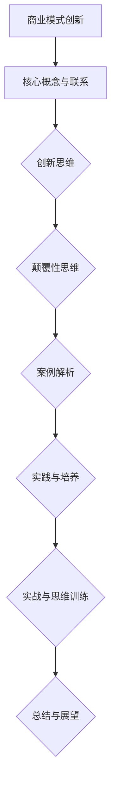

                 

### 文章标题

《创业者的商业模式创新与颠覆性思维培养》

### 关键词

商业模式创新、颠覆性思维、创业策略、商业思维、创新案例解析

### 摘要

本文旨在探讨创业者在商业模式创新与颠覆性思维培养方面的关键策略和实践。通过深入分析商业模式的基本概念、创新思维与颠覆性思维的核心原理，结合成功与失败的商业模式案例，本文旨在为创业者提供系统的商业思维训练和创新的指导，帮助他们构建并实施颠覆性商业模式，实现持续成长与成功。

----------------------------------------------------------------

### 《创业者的商业模式创新与颠覆性思维培养》目录大纲

#### 第一部分：商业思维与商业模式概述

**第1章 商业模式与商业思维**

- **1.1 商业模式的基本概念**
- **1.2 商业模式的组成部分**
- **1.3 商业模式与商业思维的联系**

**第2章 创新思维与商业模式创新**

- **2.1 创新思维的重要性**
- **2.2 创新思维的类型与方法**
- **2.3 商业模式创新的路径**

**第3章 颠覆性思维与商业模式颠覆**

- **3.1 颠覆性思维的定义与特点**
- **3.2 颠覆性思维的实践与应用**
- **3.3 颠覆性思维在商业模式中的体现**

#### 第二部分：商业模式创新案例解析

**第4章 成功商业模式创新案例**

- **4.1 亚马逊的商业模式创新**
- **4.2 特斯拉的商业模式创新**
- **4.3 腾讯的商业模式创新**

**第5章 失败商业模式案例分析与启示**

- **5.1 百度商业模式的转变与挑战**
- **5.2 友盟的商业模式困境**
- **5.3 神州行的商业失败案例分析**

#### 第三部分：颠覆性思维培养与实践

**第6章 颠覆性思维的培养**

- **6.1 颠覆性思维的培养方法**
- **6.2 如何激发颠覆性思维**
- **6.3 颠覆性思维在日常决策中的应用**

**第7章 创业者的商业模式创新实践**

- **7.1 创业者如何进行商业模式创新**
- **7.2 颠覆性思维在创业中的应用案例**
- **7.3 创业者的商业模式创新策略与技巧**

**第8章 颠覆性思维的案例分析**

- **8.1 颠覆性思维在传统行业的应用**
- **8.2 颠覆性思维在新兴行业的应用**
- **8.3 颠覆性思维对商业模式的影响**

#### 第四部分：商业实战与思维训练

**第9章 商业实战案例分析**

- **9.1 企业转型的商业实战案例**
- **9.2 创业团队的商业模式构建**
- **9.3 商业模式迭代与优化实践**

**第10章 思维训练与商业创新**

- **10.1 创新思维训练方法**
- **10.2 颠覆性思维的训练策略**
- **10.3 商业创新思维训练工具与应用**

**第11章 总结与展望**

- **11.1 商业模式创新的重要性**
- **11.2 颠覆性思维的未来发展趋势**
- **11.3 创业者如何持续创新与成长**

#### 附录

- **附录 A：参考资料与推荐阅读**
- **附录 B：商业思维与商业模式创新工具箱**
- **附录 C：颠覆性思维训练方法与实践案例**

# Mermaid 流程图



## 商业模式与商业思维

### 1. 商业模式的基本概念

商业模式（Business Model）是企业为了创造、传递和捕获价值而设计的商业结构和运营机制。它描述了企业如何通过其运营活动实现盈利，以及如何与其他企业、客户、供应商和合作伙伴互动。

商业模式的组成部分通常包括以下几个方面：

- **价值主张（Value Proposition）**：企业为客户提供的产品或服务所提供的独特价值。
- **目标市场（Target Market）**：企业所服务的客户群体和市场范围。
- **收益模式（Revenue Streams）**：企业通过提供产品或服务获取收入的方式。
- **成本结构（Cost Structure）**：企业运营所涉及的成本，包括固定成本和可变成本。
- **关键资源（Key Resources）**：企业运营所需的关键资源，包括资金、技术、人力等。
- **关键流程（Key Processes）**：企业为了实现价值主张而执行的关键流程。
- **客户关系（Customer Relationships）**：企业与客户建立的关系类型，包括交易型、合作伙伴型、订阅型等。

### 1.2 商业模式的组成部分

商业模式的组成部分相互作用，共同构成了企业的整体运营机制。以下是每个组成部分的详细解释：

- **价值主张（Value Proposition）**：这是企业为客户创造的价值的核心。一个强有力的价值主张能够吸引并保留客户，为企业带来持续的收入流。

- **目标市场（Target Market）**：明确企业的目标客户群体和市场范围，有助于企业集中资源，最大化价值主张的有效性。

- **收益模式（Revenue Streams）**：企业通过销售产品或服务获取收入的途径。这可以是单一的收入模式，如产品销售；也可以是多种收入模式的组合，如订阅费、广告收入等。

- **成本结构（Cost Structure）**：企业运营所涉及的成本，包括固定成本和可变成本。合理的成本结构有助于企业保持盈利性。

- **关键资源（Key Resources）**：企业运营所需的关键资源，如资金、技术、人力资源等。这些资源是企业的核心竞争力。

- **关键流程（Key Processes）**：企业为了实现价值主张而执行的关键流程。这些流程需要高效、精准地执行，以确保价值主张的实现。

- **客户关系（Customer Relationships）**：企业与客户建立的关系类型，包括交易型、合作伙伴型、订阅型等。这些关系有助于企业提高客户满意度和忠诚度。

### 1.3 商业模式与商业思维的联系

商业模式与商业思维紧密相连。商业思维是指企业在决策过程中所运用的思维方式，包括分析、评估、创新等方面。以下是商业模式与商业思维之间的联系：

- **商业思维影响商业模式**：商业思维决定企业如何设计和实施商业模式。创新思维和颠覆性思维可以帮助企业在商业模式中实现创新和突破。

- **商业模式体现商业思维**：商业模式是企业商业思维的具体体现。一个有效的商业模式能够反映企业的商业思维，如创新性、可持续性、盈利性等。

- **商业思维和商业模式相互影响**：商业思维和商业模式是相互影响的。商业思维决定商业模式的创新方向，而商业模式的有效性又反过来影响商业思维。

总之，商业模式和商业思维是相互依存、相互影响的。一个成功的商业模式不仅需要创新的商业思维，还需要将其有效地转化为具体的商业操作。

### 2. 创新思维与商业模式创新

#### 2.1 创新思维的重要性

在当今快速变化的市场环境中，创新思维成为企业持续发展的关键。创新思维不仅能够帮助企业在激烈的市场竞争中脱颖而出，还能够为企业带来新的增长点和竞争优势。

- **促进企业增长**：创新思维能够帮助企业发现新的市场机会，开发新产品和服务，从而实现业务的快速增长。

- **增强竞争力**：创新思维可以帮助企业打破传统思维模式，提供独特的价值主张，从而在市场中获得竞争优势。

- **提升客户满意度**：创新思维能够更好地满足客户需求，提高客户体验，从而增强客户满意度和忠诚度。

- **推动行业变革**：创新思维能够推动整个行业的变革，引领行业趋势，为企业带来新的商业模式和商业机会。

#### 2.2 创新思维的类型与方法

创新思维可以分为多种类型，每种类型都有其独特的应用场景和优势。以下是几种常见的创新思维类型及其方法：

- **发散思维（Divergent Thinking）**：发散思维是一种探索性的思维方式，旨在产生尽可能多的想法和解决方案。这种方法鼓励人们跳出传统框架，从不同角度思考问题。

  - **方法**：头脑风暴、思维导图、思维碰撞等。

- **收敛思维（Convergent Thinking）**：收敛思维是一种集中性的思维方式，旨在从多个解决方案中筛选出最佳的解决方案。这种方法强调逻辑性和系统性。

  - **方法**：逻辑推理、系统分析、逆向工程等。

- **类比思维（Analogical Thinking）**：类比思维是一种通过类比现有问题与相似问题的解决方案来寻找创新点的思维方式。这种方法可以快速找到解决问题的灵感。

  - **方法**：类比法、类比思维训练等。

- **逆向思维（Reverse Thinking）**：逆向思维是一种从相反角度思考问题的思维方式，旨在发现潜在的创新机会。这种方法可以帮助企业打破传统思维定势。

  - **方法**：反向思维、逆向工程等。

#### 2.3 商业模式创新的路径

商业模式创新是指通过改变企业价值创造、传递和捕获的方式，实现业务增长和竞争力提升的过程。以下是几种常见的商业模式创新路径：

- **产品或服务创新**：通过开发新产品或改进现有产品，实现商业模式创新。例如，苹果公司的iPhone通过革命性的产品设计，颠覆了传统手机市场。

- **市场创新**：通过开辟新的市场或细分市场，实现商业模式创新。例如，亚马逊通过开拓电子商务市场，颠覆了传统的零售业。

- **收入模式创新**：通过改变收入来源或收入模式，实现商业模式创新。例如，Netflix通过推出订阅制，颠覆了传统电影租赁市场。

- **成本结构创新**：通过优化成本结构，降低运营成本，实现商业模式创新。例如，优步通过利用移动互联网和大数据技术，大幅降低了运营成本。

- **关键资源创新**：通过重新配置或获取关键资源，实现商业模式创新。例如，阿里巴巴通过建立强大的物流网络，实现了电子商务的快速发展。

### 3. 颠覆性思维与商业模式颠覆

#### 3.1 颠覆性思维的定义与特点

颠覆性思维（Disruptive Thinking）是一种创新的思维方式，旨在通过创新产品、服务或商业模式，打破现有市场格局，实现颠覆性增长。颠覆性思维具有以下特点：

- **颠覆性**：颠覆性思维旨在打破现有市场规则和模式，实现颠覆性增长。它不仅追求创新，更追求突破。

- **系统性**：颠覆性思维强调系统性的思考和策略。它关注整个商业生态系统，从产品、市场、收入模式等多个维度进行创新。

- **前瞻性**：颠覆性思维具有前瞻性，能够预见未来市场趋势和机会。它不仅仅关注现有问题，更关注潜在的创新机会。

- **灵活性**：颠覆性思维强调灵活性和适应性。在面对市场变化和挑战时，能够迅速调整战略，寻求新的增长点。

#### 3.2 颠覆性思维的实践与应用

颠覆性思维的实践与应用需要具备以下策略和步骤：

- **识别市场机会**：通过市场调研、数据分析等方式，识别潜在的市场机会和需求。

- **制定颠覆性策略**：根据市场机会，制定颠覆性策略，包括产品创新、市场定位、收入模式创新等。

- **实施颠覆性举措**：将颠覆性策略转化为具体举措，实施并推广到市场。

- **持续优化与创新**：在市场反馈中不断优化颠覆性举措，持续创新，保持市场竞争力。

#### 3.3 颠覆性思维在商业模式中的体现

颠覆性思维在商业模式中的体现，主要体现在以下几个方面：

- **产品创新**：通过革命性的产品创新，颠覆现有市场格局。例如，苹果公司的iPhone颠覆了传统手机市场。

- **市场定位**：通过重新定位市场，开辟新的市场空间。例如，特斯拉通过定位高端电动汽车市场，颠覆了传统汽车市场。

- **收入模式创新**：通过创新的收入模式，实现颠覆性增长。例如，Netflix通过订阅制颠覆了传统电影租赁市场。

- **成本结构优化**：通过优化成本结构，降低运营成本，实现颠覆性增长。例如，亚马逊通过大规模物流网络优化，降低了运营成本，颠覆了传统零售业。

- **关键资源获取**：通过获取关键资源，实现颠覆性增长。例如，阿里巴巴通过建立强大的物流网络，实现了电子商务的快速发展。

### 第二部分：商业模式创新案例解析

#### 4. 成功商业模式创新案例

**4.1 亚马逊的商业模式创新**

亚马逊（Amazon）是全球最大的电子商务公司，其商业模式创新的成功使其成为行业领导者。以下是亚马逊的主要商业模式创新：

- **产品创新**：亚马逊通过不断推出新的产品和服务，如Kindle电子书、亚马逊Prime会员服务等，满足客户多样化的需求。

- **市场定位**：亚马逊通过定位全球市场，拓展海外市场，实现了全球业务的快速发展。

- **收入模式创新**：亚马逊通过多元化的收入模式，如电子商务、云计算（Amazon Web Services, AWS）等，实现了持续的收入增长。

- **成本结构优化**：亚马逊通过规模效应和供应链优化，降低了运营成本，提高了盈利能力。

- **关键资源获取**：亚马逊通过收购和投资，获取了关键资源，如AWS、Zappos等，进一步巩固了其在行业中的地位。

**4.2 特斯拉的商业模式创新**

特斯拉（Tesla）是电动汽车和清洁能源领域的先锋企业，其商业模式创新的成功使其在电动汽车市场取得了显著优势。以下是特斯拉的主要商业模式创新：

- **产品创新**：特斯拉通过推出高性能、高品质的电动汽车，如Model S、Model 3等，颠覆了传统电动汽车市场。

- **市场定位**：特斯拉通过定位高端电动汽车市场，吸引了大量高端消费者，实现了市场份额的快速增长。

- **收入模式创新**：特斯拉通过推出能源解决方案，如太阳能屋顶、能源存储系统等，实现了多元化的收入来源。

- **成本结构优化**：特斯拉通过规模化生产和技术创新，降低了电动汽车的生产成本，提高了竞争力。

- **关键资源获取**：特斯拉通过自主研发和收购，获取了关键资源，如电池技术、充电网络等，进一步巩固了其在行业中的地位。

**4.3 腾讯的商业模式创新**

腾讯（Tencent）是中国最大的互联网企业之一，其商业模式创新的成功使其在多个领域取得了显著优势。以下是腾讯的主要商业模式创新：

- **产品创新**：腾讯通过不断推出新的产品和服务，如微信、QQ、腾讯游戏等，满足了用户多样化的需求。

- **市场定位**：腾讯通过定位中国和全球市场，拓展了海外市场，实现了全球业务的快速发展。

- **收入模式创新**：腾讯通过多元化的收入模式，如广告、游戏、金融等，实现了持续的收入增长。

- **成本结构优化**：腾讯通过规模效应和供应链优化，降低了运营成本，提高了盈利能力。

- **关键资源获取**：腾讯通过自主研发和投资，获取了关键资源，如社交媒体、游戏等，进一步巩固了其在行业中的地位。

### 5. 失败商业模式案例分析与启示

**5.1 百度商业模式的转变与挑战**

百度（Baidu）曾是中国最大的搜索引擎公司，但在移动互联网时代面临巨大挑战。以下是百度商业模式转变和面临的挑战：

- **产品创新不足**：百度在移动互联网时代的产品创新不足，未能及时适应市场变化，导致市场份额下降。

- **市场定位不清**：百度在移动互联网市场定位不清，未能明确自己的核心竞争力，导致竞争力下降。

- **收入模式单一**：百度主要依赖广告收入，未能实现收入模式的多元化，导致盈利能力受限。

- **成本控制不力**：百度在移动互联网时代的成本控制不力，导致运营成本增加，盈利能力下降。

**5.2 友盟的商业模式困境**

友盟（Umeng）是中国领先的移动应用数据分析和运营平台，但其在商业模式上面临困境。以下是友盟的商业模式困境：

- **产品同质化**：友盟的产品同质化严重，未能提供独特的价值主张，导致竞争力下降。

- **市场定位模糊**：友盟在市场定位上模糊不清，未能明确自己的核心竞争力，导致市场份额下降。

- **收入模式受限**：友盟主要依赖广告收入，未能实现收入模式的多元化，导致盈利能力下降。

- **成本结构不合理**：友盟的成本结构不合理，运营成本过高，导致盈利能力下降。

**5.3 神州行的商业失败案例分析**

神州行（China Mobile）是中国最大的移动通信运营商，但其在商业模式的失败案例值得深思。以下是神州行的商业失败案例分析：

- **产品创新不足**：神州行在移动互联网时代的产品创新不足，未能及时满足用户需求，导致市场份额下降。

- **市场定位失误**：神州行在市场定位上失误，未能准确把握市场趋势，导致竞争力下降。

- **收入模式单一**：神州行主要依赖语音和短信收入，未能实现收入模式的多元化，导致盈利能力下降。

- **成本结构不合理**：神州行的成本结构不合理，运营成本过高，导致盈利能力下降。

### 第三部分：颠覆性思维培养与实践

#### 6. 颠覆性思维的培养

颠覆性思维不是天生的，而是可以通过系统的培养和实践来获得。以下是培养颠覆性思维的几个关键步骤：

**6.1 颠覆性思维的培养方法**

- **1. 学习与阅读**：阅读关于颠覆性思维、创新战略和商业模式的书籍，学习成功案例和失败教训。

- **2. 案例研究**：研究历史上的颠覆性创新案例，理解其成功的原因和关键要素。

- **3. 实践与实验**：通过实际项目和实验，尝试新的想法和商业模式，从中学习和成长。

- **4. 多元化视角**：培养多元化的视角，尝试从不同角度思考问题，发现潜在的颠覆性机会。

**6.2 如何激发颠覆性思维**

- **1. 挑战现状**：不断质疑现有的商业模式和思维定势，寻求改进和创新的方案。

- **2. 跨界思维**：借鉴其他行业和领域的成功经验，应用到本行业，寻找颠覆性机会。

- **3. 倾听客户声音**：深入了解客户需求，从客户的角度思考问题，寻找颠覆性解决方案。

- **4. 持续学习**：保持对新知识、新技术的学习和关注，不断更新自己的知识库。

**6.3 颠覆性思维在日常决策中的应用**

- **1. 预测未来趋势**：通过分析市场趋势和科技发展，预测未来的商业机会和挑战，提前布局。

- **2. 挑战传统观念**：不断挑战传统观念和思维定势，寻找颠覆性解决方案。

- **3. 优化资源配置**：通过颠覆性思维，优化企业资源和流程，提高效率和盈利能力。

- **4. 创新商业模式**：通过颠覆性思维，探索新的商业模式，实现业务增长和竞争优势。

### 7. 创业者的商业模式创新实践

**7.1 创业者如何进行商业模式创新**

创业者进行商业模式创新需要遵循以下几个步骤：

- **1. 定义价值主张**：明确创业项目为用户提供的独特价值，这是商业模式创新的基础。

- **2. 确定目标市场**：分析目标市场，了解客户需求和市场趋势，为商业模式创新提供方向。

- **3. 设计收入模式**：确定创业项目的收入来源，设计合理的收入模式，确保商业模式的可持续性。

- **4. 分析成本结构**：分析创业项目的成本结构，寻找降低成本的机会，提高盈利能力。

- **5. 获取关键资源**：明确创业项目所需的关键资源，如技术、资金、人才等，确保资源的充足和有效利用。

- **6. 制定关键流程**：设计创业项目的关键流程，确保价值主张的顺利实现。

- **7. 建立客户关系**：建立与客户的紧密联系，了解客户需求，不断优化商业模式。

**7.2 颠覆性思维在创业中的应用案例**

颠覆性思维在创业中的应用可以带来巨大的商业机会和竞争优势。以下是一些颠覆性思维在创业中的应用案例：

- **1. 无需钥匙的智能锁**：传统门锁市场被大型制造商所垄断，一家初创公司通过颠覆性思维，开发了一种无需钥匙的智能锁，彻底改变了门锁行业。

- **2. 无需电费的空气净化器**：传统空气净化器需要连接电源，一家初创公司通过颠覆性思维，开发了一种无需电费的空气净化器，利用自然能量实现空气净化。

- **3. 一次性使用的手机**：智能手机市场被大型厂商所垄断，一家初创公司通过颠覆性思维，推出一次性使用的手机，满足了用户对低成本和功能简单的需求。

**7.3 创业者的商业模式创新策略与技巧**

- **1. 专注细分市场**：创业者可以通过专注于细分市场，提供定制化的产品或服务，实现商业模式创新。

- **2. 借助互联网技术**：互联网技术可以帮助创业者快速验证和推广商业模式，实现快速迭代和优化。

- **3. 利用平台效应**：创业者可以通过构建平台，连接供需双方，实现资源的高效配置和增值。

- **4. 创造独特价值**：创业者需要通过独特的产品或服务，创造差异化的价值，赢得市场份额。

- **5. 持续创新与学习**：创业者需要保持持续的创新和学习能力，不断优化商业模式，适应市场变化。

### 8. 颠覆性思维的案例分析

#### 8.1 颠覆性思维在传统行业的应用

颠覆性思维在传统行业中的应用，可以带来巨大的商业机会和竞争优势。以下是一些颠覆性思维在传统行业中的应用案例：

- **1. 传统零售业**：亚马逊通过在线零售，颠覆了传统的零售行业。通过提供便捷的购物体验、广泛的产品选择和高效的物流配送，亚马逊改变了消费者的购物习惯，提升了行业效率。

- **2. 传统银行业**：支付宝和微信支付等互联网金融平台，通过颠覆性思维，改变了传统银行的服务模式。它们提供无需实体银行的移动支付服务，简化了支付流程，降低了交易成本，提升了用户体验。

- **3. 传统制造业**：特斯拉通过革命性的电动汽车技术，颠覆了传统的汽车制造业。特斯拉的电动汽车不仅具有高性能、高品质，还采用了可持续能源，改变了消费者对汽车的需求和认知。

#### 8.2 颠覆性思维在新兴行业的应用

颠覆性思维在新兴行业中的应用，可以推动行业的快速发展和变革。以下是一些颠覆性思维在新兴行业中的应用案例：

- **1. 互联网医疗**：人工智能和大数据技术在医疗行业的应用，正在颠覆传统的医疗服务模式。通过智能诊断、个性化治疗和远程医疗，新兴的互联网医疗公司正在改变医疗服务的供给和需求。

- **2. 分享经济**：共享单车、共享汽车等分享经济模式，通过颠覆性思维，改变了人们对出行和交通工具的传统观念。这种模式不仅降低了用户的出行成本，还提高了资源利用效率。

- **3. 区块链技术**：区块链技术在金融、供应链管理、身份认证等领域的应用，正在颠覆传统的商业模式。通过去中心化、透明化和安全性的特点，区块链技术为新兴行业带来了新的发展机遇。

#### 8.3 颠覆性思维对商业模式的影响

颠覆性思维对商业模式的影响是深远且多维度的。以下是对其影响的详细分析：

- **1. 重新定义价值创造**：颠覆性思维促使企业重新思考如何创造价值。传统商业模式通常关注产品或服务的生产和销售，而颠覆性思维强调通过创新的方式，满足用户未被满足的需求，创造新的市场。

- **2. 优化成本结构**：颠覆性思维通过寻找新的业务模式和流程，优化企业的成本结构。例如，通过采用共享经济模式，企业可以降低固定资产成本，提高资源利用效率。

- **3. 改变收入模式**：颠覆性思维可以帮助企业探索新的收入模式，实现盈利能力的提升。例如，通过推出订阅制、会员制等新型收入模式，企业可以增加客户的粘性，实现持续的收入流。

- **4. 提升用户体验**：颠覆性思维强调从用户的角度出发，提升用户体验。通过创新的产品和服务，企业可以更好地满足用户需求，提高用户满意度和忠诚度。

- **5. 推动行业变革**：颠覆性思维可以推动整个行业的变革，重新定义行业规则和格局。例如，特斯拉通过革命性的电动汽车技术，不仅改变了汽车行业，还推动了能源和交通行业的变革。

总之，颠覆性思维对商业模式的影响是全方位的，它不仅帮助企业实现创新和增长，还推动整个行业的进步和变革。

### 第四部分：商业实战与思维训练

#### 9. 商业实战案例分析

**9.1 企业转型的商业实战案例**

在商业环境中，企业转型是常见且必要的策略，尤其是在面临市场变化、技术进步或竞争压力时。以下是几个企业转型的商业实战案例：

- **案例一：IBM的转型之路**：IBM（国际商业机器公司）在20世纪80年代面临巨大的挑战，传统的大型主机业务逐渐衰退。为了应对这一挑战，IBM决定进行战略转型，将重心转移到软件和服务领域。通过这一转型，IBM成功地从硬件制造商转变为全球领先的服务提供商，实现了业务结构的多元化，并在新兴市场中找到了新的增长点。

  - **转型策略**：IBM采取了一系列转型策略，包括：
    - **组织结构调整**：重组内部组织，减少冗余，提高效率和响应速度。
    - **投资研发**：加大在软件和服务领域的研发投入，推出创新的产品和服务。
    - **业务拓展**：通过并购和合作，迅速扩大软件和服务业务规模。
    - **市场定位**：重新定位市场，专注于高增长领域，如云计算、大数据和分析等。

  - **转型成果**：经过多年的努力，IBM成功实现了从硬件制造商向全球领先的服务提供商的转变。公司的市值和利润大幅增长，员工士气和工作效率也显著提升。

- **案例二：诺基亚的衰落与转型**：诺基亚曾是全球最大的手机制造商之一，但在智能手机时代未能及时转型，最终被市场淘汰。诺基亚的失败案例给其他企业提供了重要的教训。

  - **转型策略**：在智能手机兴起之初，诺基亚曾尝试推出多款智能手机，但均未获得市场认可。为了挽救局面，诺基亚在2013年与微软合作，将手机业务出售给微软，并开始将重心转移到通信设备和物联网领域。

  - **转型成果**：尽管诺基亚的转型行动相对较晚，但其在通信设备和物联网领域的努力取得了一定成效。例如，诺基亚在5G技术和网络设备方面取得了重要突破，成为全球领先的通信设备供应商之一。

**9.2 创业团队的商业模式构建**

创业团队在构建商业模式时，需要充分考虑市场需求、资源限制和竞争优势。以下是几个创业团队的商业模式构建案例：

- **案例一：Airbnb的商业模式的构建**：Airbnb是一个共享经济平台，允许用户出租自己的房间或公寓给旅行者。以下是Airbnb商业模式的关键组成部分：

  - **价值主张**：为旅行者提供多样化的住宿选择，包括私人房间、整套公寓等。
  - **目标市场**：全球旅行者，特别是寻求独特和个性化住宿体验的用户。
  - **收入模式**：通过向房东和房客收取服务费来盈利。
  - **成本结构**：主要包括平台运营成本、市场营销成本和客户服务成本。
  - **关键资源**：技术平台、品牌形象和用户社区。
  - **关键流程**：包括房源管理、预订管理、支付处理和客户支持。

- **案例二：Slack的商业模式的构建**：Slack是一个团队协作工具，通过提供一个集中的沟通平台，帮助团队提高工作效率。以下是Slack商业模式的关键组成部分：

  - **价值主张**：提供一个易于使用、功能强大的团队沟通工具，提高团队协作效率。
  - **目标市场**：企业用户，特别是那些需要高效沟通和协作的团队。
  - **收入模式**：通过订阅模式向企业用户收取费用。
  - **成本结构**：主要包括研发成本、市场营销成本和客户服务成本。
  - **关键资源**：技术平台、用户体验设计和客户支持团队。
  - **关键流程**：包括产品开发、市场推广和客户服务。

**9.3 商业模式迭代与优化实践**

在动态的商业环境中，商业模式需要不断地迭代和优化，以适应市场的变化和客户需求。以下是几个商业模式迭代和优化的实践案例：

- **案例一：Netflix的商业模式迭代**：Netflix最初是一家DVD租赁公司，但随着流媒体服务的兴起，Netflix迅速调整了商业模式。以下是Netflix的关键迭代步骤：

  - **业务调整**：从DVD租赁转向在线流媒体服务，提供即点即看的服务。
  - **产品创新**：推出原创内容，如电视剧和电影，以吸引和保留用户。
  - **市场拓展**：进入全球市场，提供多语言和多地区内容，满足全球用户的需求。
  - **技术优化**：不断改进推荐算法和用户界面，提高用户体验。

- **案例二：Uber的商业模式优化**：Uber作为一家共享出行平台，在商业模式上进行了多次优化，以适应不同市场和用户需求。以下是Uber的关键优化步骤：

  - **市场细分**：根据不同城市和用户群体，推出不同的产品和服务，如UberX、UberBlack、UberSUV等。
  - **价格策略**：根据市场供需关系和用户需求，灵活调整价格策略，提高用户满意度。
  - **合作与并购**：与当地出租车公司、共享单车公司等合作，扩大服务范围，提高市场覆盖率。
  - **技术创新**：不断优化App和后台系统，提高服务效率和用户体验。

### 10. 思维训练与商业创新

#### 10.1 创新思维训练方法

创新思维是商业成功的关键，通过系统的训练方法，可以培养和提高个人的创新思维能力。以下是几种常用的创新思维训练方法：

- **1. 头脑风暴**：头脑风暴是一种集体讨论的方法，旨在激发团队成员的创新思维。通过无限制的自由讨论，团队成员可以提出各种想法和解决方案，从而激发创新的火花。

- **2. 情境模拟**：情境模拟是一种通过模拟实际商业情境，训练团队成员应对挑战和解决问题的方法。通过情境模拟，团队成员可以在模拟的环境中尝试不同的解决方案，提高创新能力。

- **3. 思维导图**：思维导图是一种图形化的思考工具，可以帮助团队成员梳理思路、关联信息和创新思维。通过绘制思维导图，团队成员可以更加清晰地理解问题，发现潜在的解决方案。

- **4. 对比分析**：对比分析是一种通过对比不同解决方案或不同商业模式的方法，训练团队成员评估和选择最佳方案的能力。通过对比分析，团队成员可以更全面地了解各种解决方案的优缺点，提高决策能力。

#### 10.2 颠覆性思维的训练策略

颠覆性思维是一种突破性的思维方式，通过系统的训练策略，可以培养和强化个人的颠覆性思维。以下是几种常用的颠覆性思维训练策略：

- **1. 挑战传统观念**：通过不断质疑和挑战现有的商业观念和思维定势，培养颠覆性思维。这种方法可以帮助团队成员打破传统的思维框架，寻找创新的解决方案。

- **2. 跨界思维训练**：通过学习其他行业或领域的成功经验，借鉴其创新思维和方法，培养颠覆性思维。跨界思维可以帮助团队成员从不同的角度思考问题，发现潜在的颠覆性机会。

- **3. 反向思维训练**：通过从相反的角度思考问题，培养颠覆性思维。反向思维可以帮助团队成员发现传统解决方案的不足，从而提出颠覆性的创新方案。

- **4. 案例研究**：通过研究历史上的颠覆性创新案例，了解其成功的原因和关键要素，培养颠覆性思维。案例研究可以帮助团队成员理解颠覆性思维的应用和实践。

#### 10.3 商业创新思维训练工具与应用

为了有效培养和创新商业思维，可以使用多种工具和方法。以下是几种常见的商业创新思维训练工具及其应用：

- **1. 平面图**：平面图是一种用于梳理商业思路和策略的工具。通过绘制平面图，团队成员可以清晰地了解企业的业务流程、资源配置和目标市场，从而更好地制定商业策略。

- **2. SWOT分析**：SWOT分析是一种用于评估企业优势、劣势、机会和威胁的工具。通过SWOT分析，团队成员可以全面了解企业的现状和未来发展方向，为商业创新提供依据。

- **3. 价值链分析**：价值链分析是一种用于分析企业创造价值的各个环节的工具。通过价值链分析，团队成员可以识别企业的核心竞争力，寻找优化和创新的途径。

- **4. 创新矩阵**：创新矩阵是一种用于评估和选择创新方案的工具。通过创新矩阵，团队成员可以对比不同创新方案的优缺点，选择最佳的创新方案。

- **5. 思维导图**：思维导图是一种用于梳理和展示创新思维的工具。通过绘制思维导图，团队成员可以更加清晰地理解和表达创新思维，促进团队协作和创意生成。

### 11. 总结与展望

#### 11.1 商业模式创新的重要性

商业模式创新是企业持续成长和成功的关键因素。它不仅能够帮助企业应对市场变化和竞争压力，还能够创造新的增长点和盈利机会。通过商业模式创新，企业可以重新定义价值创造、优化成本结构、拓展市场空间，从而实现业务的快速增长和竞争优势。

#### 11.2 颠覆性思维的未来发展趋势

随着科技的进步和市场的变化，颠覆性思维在未来将继续发挥重要作用。以下是一些颠覆性思维的未来发展趋势：

- **1. 跨界融合**：随着各行业之间的边界逐渐模糊，跨界融合将成为颠覆性思维的重要趋势。企业将通过与其他行业和领域的融合，创造新的商业模式和价值。

- **2. 数字化赋能**：数字化技术将继续赋能颠覆性思维，帮助企业实现更高效、更灵活的商业模式创新。人工智能、大数据、区块链等新兴技术将推动商业模式创新向更智能化、个性化方向发展。

- **3. 用户中心**：用户需求将始终是颠覆性思维的核心。企业将更加注重用户研究和用户体验，通过满足用户需求来实现颠覆性创新。

- **4. 环境可持续**：随着全球对环境保护和可持续发展的关注，企业将更加注重环境责任和社会责任，将可持续发展理念融入商业模式创新中。

#### 11.3 创业者如何持续创新与成长

作为创业者，持续创新与成长是成功的关键。以下是一些建议，帮助创业者实现持续创新与成长：

- **1. 保持好奇心和学习能力**：保持对新技术、新趋势的好奇心和学习能力，不断更新自己的知识库，为创新提供源源不断的灵感。

- **2. 建立多元化的团队**：组建一个具有多元化背景和技能的团队，通过不同的视角和思维碰撞，激发创新思维。

- **3. 持续进行市场调研**：持续进行市场调研，了解用户需求和行业动态，为商业模式创新提供方向。

- **4. 不断优化商业模式**：通过不断迭代和优化商业模式，适应市场变化和用户需求，实现业务的持续增长。

- **5. 培养颠覆性思维**：通过学习和实践，培养颠覆性思维，不断挑战传统观念，寻找创新的商业机会。

### 附录

#### 附录 A：参考资料与推荐阅读

- Christensen, C. M. (1997). The innovator's dilemma: When new technologies cause great firms to fail. Harvard Business Press.
- Toffler, A. (1980). The third wave. Bantam Books.
- disrupted.com. (2021). Disruptive innovation: The essential guide to disruption and business model innovation. Retrieved from https://www.disrupted.com/guide
- Business Model Generation: A Handbook for Visionaries, Game Changers, and Challengers. Alexander Osterwalder & Yves Pigneur. 2010.

#### 附录 B：商业思维与商业模式创新工具箱

- MindMap（思维导图工具）
- SWOT分析表格
- 平面图模板
- 创新矩阵模板
- 用户画像模板

#### 附录 C：颠覆性思维训练方法与实践案例

- 挑战现状：通过质疑和挑战现有的商业模式和观念，寻找颠覆性机会。
- 跨界思维：借鉴其他行业和领域的成功经验，应用到本行业，实现颠覆性创新。
- 反向思维：从相反的角度思考问题，寻找颠覆性解决方案。
- 案例研究：通过研究历史上的颠覆性创新案例，学习成功的原因和关键要素。

### 核心算法原理讲解

#### 1. 创新思维算法

创新思维算法是一个系统性的过程，用于识别、评估和实施创新的商业想法。以下是创新思维算法的详细讲解：

**算法伪代码**：

```plaintext
function 创新思维（问题）：
    步骤1：问题分析
        分析输入问题，明确问题的核心要素和关键点。

    步骤2：信息收集
        收集与问题相关的信息，包括市场趋势、用户需求、竞争对手分析等。

    步骤3：提出解决方案
        利用发散思维，生成多个可能的解决方案。

    步骤4：评估解决方案
        对每个解决方案进行评估，包括可行性、成本效益和潜在风险等。

    步骤5：选择最佳方案
        根据评估结果，选择最具潜力和可行性的解决方案。

    步骤6：实施与优化
        将最佳方案转化为具体的行动计划，并持续优化和调整，确保实施效果。

    返回 最佳方案
```

**算法应用举例**：

假设一家传统的零售企业希望进行商业模式创新，以应对电子商务的挑战。以下是创新思维算法的应用：

- **步骤1：问题分析**：分析传统零售业面临的问题，如顾客体验差、库存管理复杂、无法实时响应市场需求等。

- **步骤2：信息收集**：收集电子商务的发展趋势、用户购物习惯变化、竞争对手的商业模式等。

- **步骤3：提出解决方案**：提出多个解决方案，如建立线上商城、引入智能推荐系统、实施会员制等。

- **步骤4：评估解决方案**：评估每个方案的可行性、成本效益和潜在风险。

- **步骤5：选择最佳方案**：选择建立线上商城和引入智能推荐系统作为最佳方案。

- **步骤6：实施与优化**：实施线上商城和智能推荐系统，并持续收集用户反馈，进行优化和调整。

#### 2. 颠覆性思维算法

颠覆性思维算法是一个专注于打破现有市场格局和商业模式的创新过程。以下是颠覆性思维算法的详细讲解：

**算法伪代码**：

```plaintext
function 颠覆性思维（既有模式）：
    步骤1：模式分析
        分析输入的既有模式，包括其优点、局限性以及市场反应。

    步骤2：提出颠覆性观点
        从不同角度质疑既有模式，提出可能的颠覆性观点。

    步骤3：验证颠覆性观点
        对颠覆性观点进行验证，包括市场调研、技术可行性分析等。

    步骤4：实施颠覆性观点
        将验证成功的颠覆性观点转化为具体的商业实践。

    步骤5：评估颠覆性实施效果
        对颠覆性实施效果进行评估，包括市场份额、盈利能力、用户满意度等。

    返回 颠覆性实施效果
```

**算法应用举例**：

假设一家传统出租车公司希望进行商业模式颠覆，以应对共享出行平台的挑战。以下是颠覆性思维算法的应用：

- **步骤1：模式分析**：分析传统出租车模式的优势（如稳定性、可靠性）和局限性（如高成本、需求响应慢）。

- **步骤2：提出颠覆性观点**：提出共享出行模式，如引入拼车服务、提供更灵活的定价策略、利用移动互联网提高需求响应速度等。

- **步骤3：验证颠覆性观点**：进行市场调研，分析用户需求和市场潜力，评估技术实现和运营成本。

- **步骤4：实施颠覆性观点**：逐步实施共享出行模式，如推出拼车服务，调整价格策略，提升用户需求响应速度。

- **步骤5：评估颠覆性实施效果**：评估共享出行模式的用户满意度、市场份额和盈利能力，根据反馈进行优化和调整。

### 数学模型和数学公式

#### 1. 创新指数模型

创新指数模型（Innovation Index Model）用于评估企业在创新方面的表现和潜力。以下是创新指数模型的数学模型和详细讲解：

**数学模型**：

$$ I = f(V, M, T) $$

其中，$I$ 表示创新指数，$V$ 表示知识储备，$M$ 表示市场需求，$T$ 表示时间。

**模型解释**：

- **知识储备（V）**：企业拥有的知识和技能水平，包括研发能力、人才储备和知识产权等。知识储备越高，企业在创新方面的基础越牢固。

- **市场需求（M）**：市场对创新产品和服务的需求程度，包括市场规模、增长速度和用户满意度等。市场需求越大，企业创新的动力越强。

- **时间（T）**：企业进行创新所需的时间周期，包括研发周期、市场推广周期和迭代周期等。时间越短，企业能够更快地响应市场需求，实现创新。

**模型举例说明**：

假设一家科技公司具有以下数据：

- 知识储备（V）= 80分
- 市场需求（M）= 90分
- 时间（T）= 60分

根据创新指数模型，计算该公司的创新指数：

$$ I = f(80, 90, 60) $$

通过计算，得到该公司的创新指数为：

$$ I = 80 \times 90 \div 60 = 120分 $$

这表明该公司的创新指数较高，具备较强的创新能力。

#### 2. 数学公式详细讲解

在创新思维和商业模式创新过程中，数学公式和模型可以帮助我们更精确地分析和评估创新方案。以下是几个重要的数学公式及其详细讲解：

**1. 成本效益分析（Cost-Benefit Analysis, CBA）公式**

**数学公式**：

$$ CBA = \frac{B}{C} $$

其中，$CBA$ 表示成本效益分析结果，$B$ 表示总收益，$C$ 表示总成本。

**公式解释**：

成本效益分析用于评估一个项目或商业方案的整体效益，通过计算总收益与总成本的比值，判断项目或方案的经济性。比值越高，表明项目或方案越具有经济性。

**应用举例**：

假设一个创新项目预计总收益为 100 万元，总成本为 50 万元，计算其成本效益分析结果：

$$ CBA = \frac{100}{50} = 2 $$

这表明该创新项目的成本效益较高，值得投资和实施。

**2. 风险评估（Risk Assessment）公式**

**数学公式**：

$$ R = P \times E $$

其中，$R$ 表示风险，$P$ 表示概率，$E$ 表示损失。

**公式解释**：

风险评估用于计算项目或方案面临的风险水平，通过计算概率和损失的组合，评估风险的大小。风险越高，项目或方案的不确定性越大。

**应用举例**：

假设一个创新项目有 20% 的概率面临 10 万元的损失，计算其风险：

$$ R = 0.20 \times 10 = 2万元 $$

这表明该创新项目存在 2 万元的风险，需要进一步评估和应对。

**3. 创新潜力指数（Innovation Potential Index, IPI）公式**

**数学公式**：

$$ IPI = \frac{I}{I_{max}} $$

其中，$IPI$ 表示创新潜力指数，$I$ 表示实际创新指数，$I_{max}$ 表示最大创新指数。

**公式解释**：

创新潜力指数用于衡量企业在创新方面的潜在能力，通过计算实际创新指数与最大创新指数的比值，评估企业的创新潜力。比值越高，表明企业的创新潜力越大。

**应用举例**：

假设一家企业的实际创新指数为 80 分，最大创新指数为 100 分，计算其创新潜力指数：

$$ IPI = \frac{80}{100} = 0.8 $$

这表明该企业的创新潜力指数为 0.8，具备较强的创新潜力。企业可以通过进一步提升研发投入、优化创新流程等措施，提高创新潜力指数。

