                 

### 文章标题

《创业者的商业演讲与说服力提升技巧》

关键词：商业演讲、说服力、创业者、技巧、演讲技巧、商业展示

摘要：本文将深入探讨创业者在商业演讲中如何提升说服力，通过分析演讲的基础、技巧以及实际应用，帮助创业者掌握高效沟通的方法，提升商业展示的效果，从而更好地推动创业项目的成功发展。

### 第一部分：商业演讲基础

#### 第1章：商业演讲的重要性

#### 1.1 商业演讲的目标和意义

商业演讲的目标是传递信息、建立信任、激励听众，并最终实现商业目标。对于创业者而言，商业演讲不仅是一种交流工具，更是建立品牌形象、吸引投资、拓展市场的重要手段。

**核心概念与联系：**商业演讲的目标与意义直接关联到创业的核心目标——获取资源与市场份额。通过商业演讲，创业者可以更好地展示自己的创意、优势和未来规划，从而吸引潜在投资者和合作伙伴。

**Mermaid 流程图：**

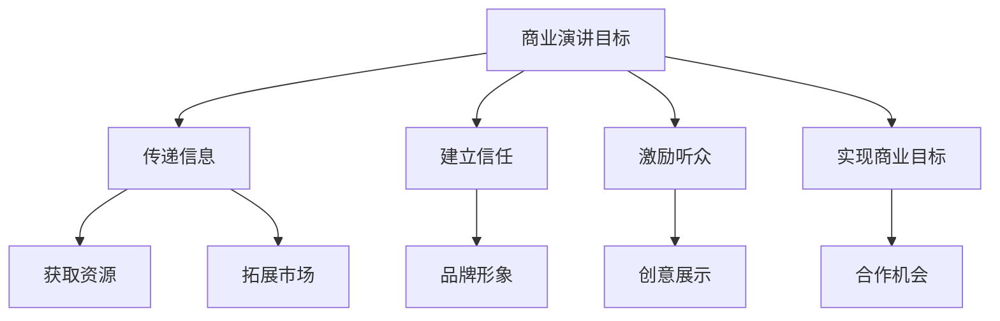

#### 1.2 商业演讲的常见形式

常见的商业演讲形式包括产品发布会、投资者路演、企业内部培训等。每种形式都有其独特的特点和需求，创业者需要根据实际情况选择合适的演讲形式。

**核心概念与联系：**不同的演讲形式对应着不同的听众和目的，创业者需要根据具体情况进行选择和调整，以达到最佳的演讲效果。

**Mermaid 流程图：**

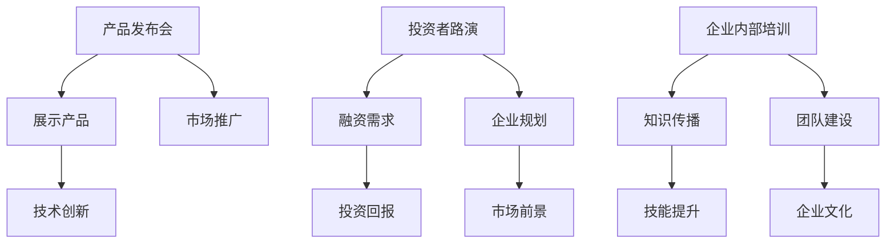

#### 1.3 商业演讲的核心要素

成功的商业演讲离不开三个核心要素：内容、表达和影响。这三个要素相互关联，共同决定了演讲的效果。

**核心概念与联系：**内容是演讲的基础，表达是内容的载体，影响是演讲的目的。创业者需要在这三个方面下功夫，才能实现有效的商业演讲。

**Mermaid 流程图：**

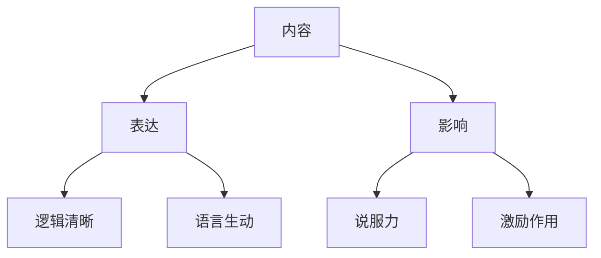

### 第2章：准备商业演讲

#### 2.1 确定演讲主题和受众

确定演讲主题是商业演讲的第一步，创业者需要明确演讲的核心内容，以便有针对性地准备。同时，了解受众的需求和特点，也是确保演讲效果的重要环节。

**核心概念与联系：**演讲主题和受众决定了演讲的内容和风格，创业者需要在这两个方面进行深入分析，以确保演讲的针对性和有效性。

**Mermaid 流程图：**

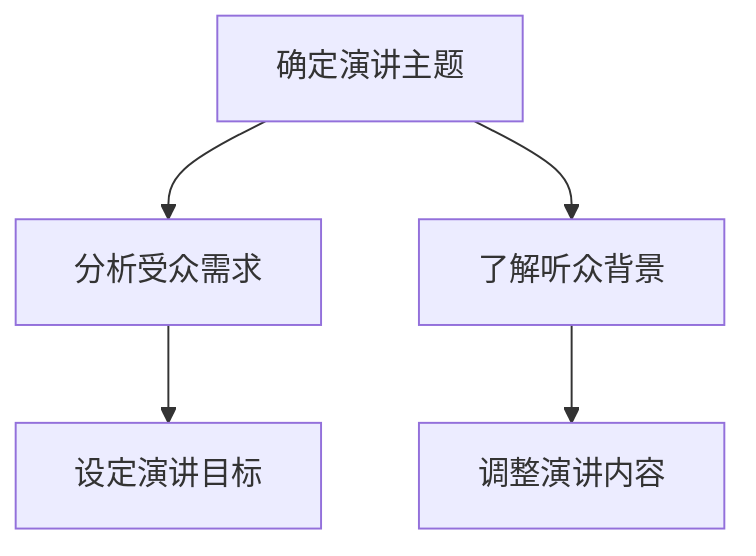

#### 2.2 制定演讲大纲和结构

制定演讲大纲是确保演讲逻辑清晰、结构严谨的重要步骤。创业者需要明确演讲的开头、中间和结尾，以及各部分之间的过渡。

**核心概念与联系：**演讲大纲是演讲的骨架，决定了演讲的整体结构和逻辑。创业者需要在大纲的基础上进行内容填充，使演讲更加丰富和有吸引力。

**Mermaid 流流程图：**

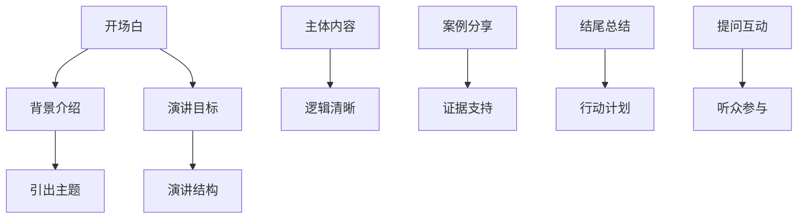

#### 2.3 搜集和整理演讲素材

搜集和整理演讲素材是确保演讲内容充实、生动的重要环节。创业者需要从多个渠道获取相关信息，并进行筛选和整理，以确保演讲素材的可靠性和实用性。

**核心概念与联系：**演讲素材是演讲内容的重要组成部分，决定了演讲的可信度和吸引力。创业者需要充分利用各种资源，确保演讲素材的丰富性和多样性。

**Mermaid 流流程图：**

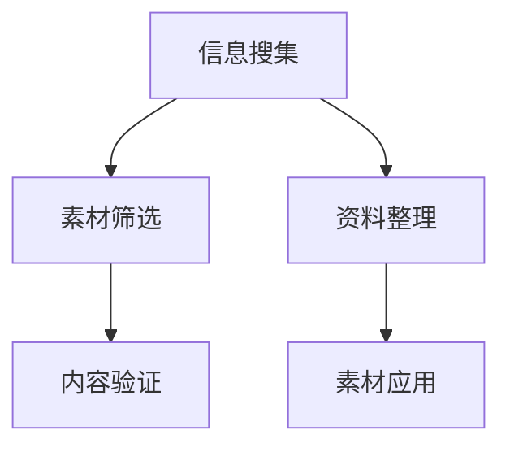

### 第3章：演讲技巧与风格

#### 3.1 演讲的语言技巧

演讲的语言技巧包括清晰的表达、生动的语言和逻辑的论证。创业者需要注重语言的表达效果，以确保演讲的吸引力和说服力。

**核心概念与联系：**语言技巧是演讲的核心，决定了演讲的效果。创业者需要通过不断的练习和提升，掌握清晰、生动、逻辑的语言表达。

**Mermaid 流流程图：**

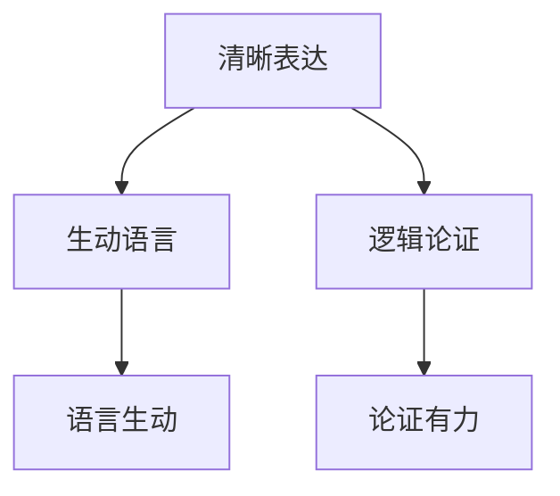

#### 3.2 非语言沟通技巧

非语言沟通技巧包括肢体语言、面部表情和声音的运用。创业者需要注重非语言沟通的细节，以增强演讲的效果。

**核心概念与联系：**非语言沟通是演讲的重要组成部分，决定了演讲的情感传递和影响力。创业者需要通过实践和反思，提升自己的非语言沟通技巧。

**Mermaid 流流程图：**

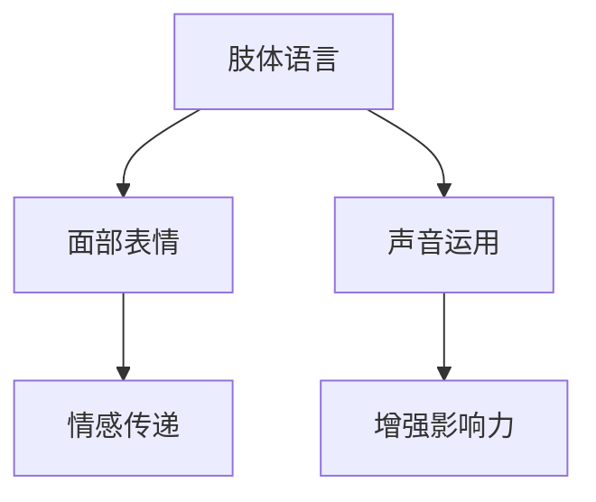

#### 3.3 建立自信的演讲风格

建立自信的演讲风格是提高演讲效果的关键。创业者需要通过自信的语言、坚定的姿态和积极的情感，展现出自己的自信和实力。

**核心概念与联系：**自信的演讲风格是演讲的灵魂，决定了演讲的吸引力和说服力。创业者需要通过不断的锻炼和积累，建立自己的自信演讲风格。

**Mermaid 流流程图：**

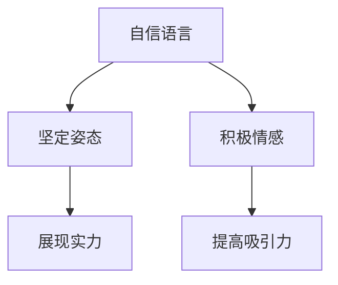

### 第4章：演讲准备与练习

#### 4.1 演讲前的准备工作

演讲前的准备工作是确保演讲成功的重要环节。创业者需要提前进行演讲内容的准备、演讲环境的布置和演讲技巧的练习。

**核心概念与联系：**演讲前的准备工作是演讲成功的关键，决定了演讲的质量和效果。创业者需要提前做好各项准备工作，以确保演讲的顺利进行。

**Mermaid 流流程图：**

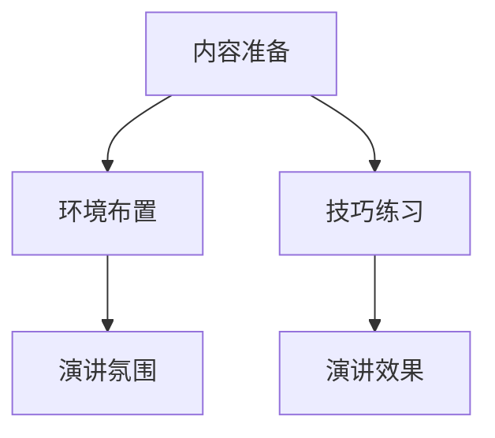

#### 4.2 演讲练习的方法与技巧

演讲练习是提高演讲效果的有效途径。创业者可以通过模拟演讲、录制视频和反馈改进等方式，不断提升自己的演讲水平。

**核心概念与联系：**演讲练习是提高演讲能力的重要手段，决定了演讲的成功与否。创业者需要通过多种练习方法，找到适合自己的演讲技巧。

**Mermaid 流流程图：**

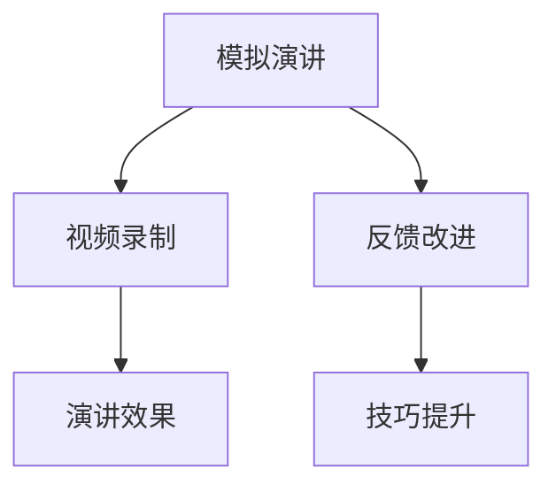

#### 4.3 演讲中的时间管理

演讲中的时间管理是确保演讲顺利进行的重要环节。创业者需要合理分配演讲时间，确保每个部分都有足够的时间进行阐述和讨论。

**核心概念与联系：**时间管理是演讲成功的关键，决定了演讲的整体效果。创业者需要通过科学的时间分配，确保演讲的流畅和高效。

**Mermaid 流流程图：**

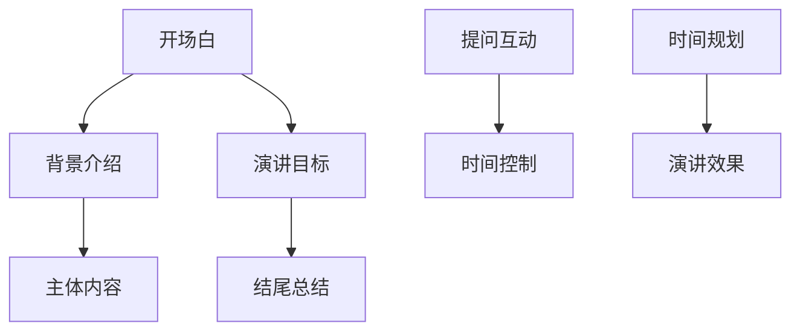

### 第二部分：说服力提升

#### 第5章：说服力的概念与原理

#### 5.1 什么是说服力

说服力是指通过语言、情感和行动等方式，使他人接受自己的观点、信仰或建议的能力。对于创业者而言，说服力是成功的关键因素之一。

**核心概念与联系：**说服力直接关联到创业者的商业成功，决定了创业项目能否得到认可和支持。创业者需要了解说服力的本质和作用，以更好地运用说服力提升自己的商业演讲效果。

**Mermaid 流流程图：**

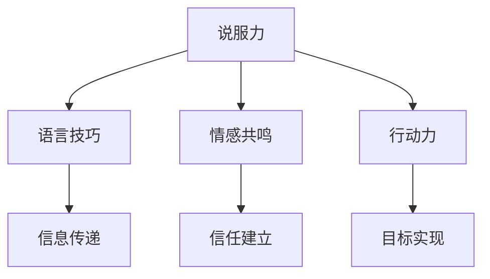

#### 5.2 影响说服力的因素

影响说服力的因素包括语言表达、情感共鸣、事实证据、逻辑论证等。创业者需要在这些方面下功夫，以提升自己的说服力。

**核心概念与联系：**说服力的影响因素决定了说服力的强弱，创业者需要全面了解并提升这些因素，以增强自己的说服力。

**Mermaid 流流程图：**

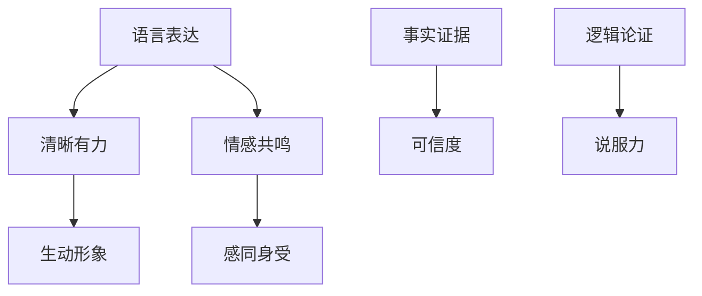

#### 5.3 提升说服力的基本原则

提升说服力的基本原则包括诚实、真诚、专注和持续学习。创业者需要遵循这些原则，以不断提升自己的说服力。

**核心概念与联系：**基本原则是提升说服力的基础，决定了说服力的质量和效果。创业者需要始终坚持这些原则，以提升自己的说服力。

**Mermaid 流流程图：**

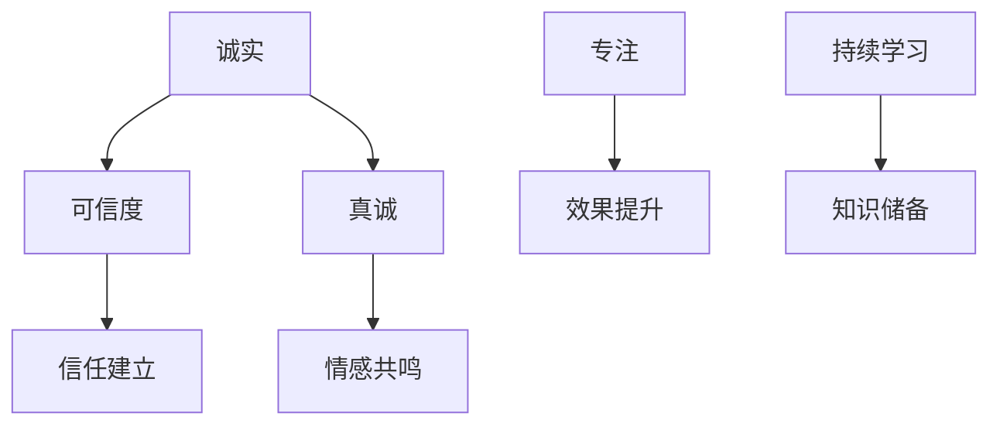

### 第6章：构建说服力演讲

#### 6.1 设计有说服力的演讲结构

设计有说服力的演讲结构是提升演讲效果的关键。创业者需要根据听众的需求和特点，设计出结构合理、逻辑清晰的演讲结构。

**核心概念与联系：**演讲结构是演讲的核心，决定了演讲的逻辑和效果。创业者需要通过设计有说服力的演讲结构，提升演讲的吸引力和说服力。

**Mermaid 流流程图：**

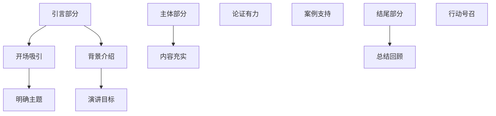

#### 6.2 使用有力的论据和证据

使用有力的论据和证据是提升演讲说服力的有效方法。创业者需要通过收集和分析相关数据、案例和事实，为自己的观点提供有力的支持。

**核心概念与联系：**论据和证据是演讲的说服力基础，决定了演讲的可信度和影响力。创业者需要注重论据和证据的收集和应用，以提升自己的演讲说服力。

**Mermaid 流流程图：**

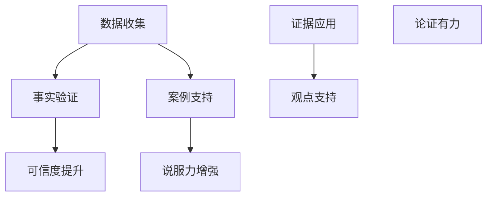

#### 6.3 掌握演讲的说服技巧

掌握演讲的说服技巧是提升演讲效果的重要手段。创业者需要通过学习和实践，掌握各种说服技巧，以提高自己的演讲水平。

**核心概念与联系：**说服技巧是演讲的关键，决定了演讲的效果。创业者需要不断学习和实践，掌握各种说服技巧，以提升自己的演讲说服力。

**Mermaid 流流程图：**

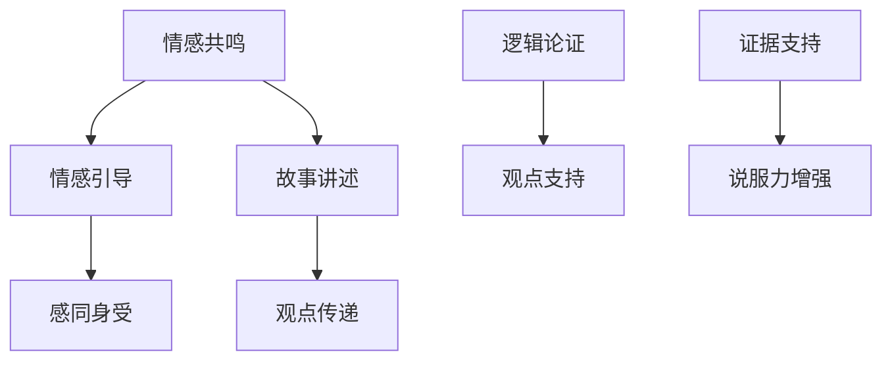

### 第7章：说服他人的心理学技巧

#### 7.1 了解听众的心理需求

了解听众的心理需求是有效说服他人的关键。创业者需要通过观察、调查和交流等方式，了解听众的需求和期望，从而更好地进行说服。

**核心概念与联系：**了解听众的心理需求是说服他人的基础，决定了说服的效果。创业者需要注重听众的心理需求，以提高自己的说服力。

**Mermaid 流流程图：**

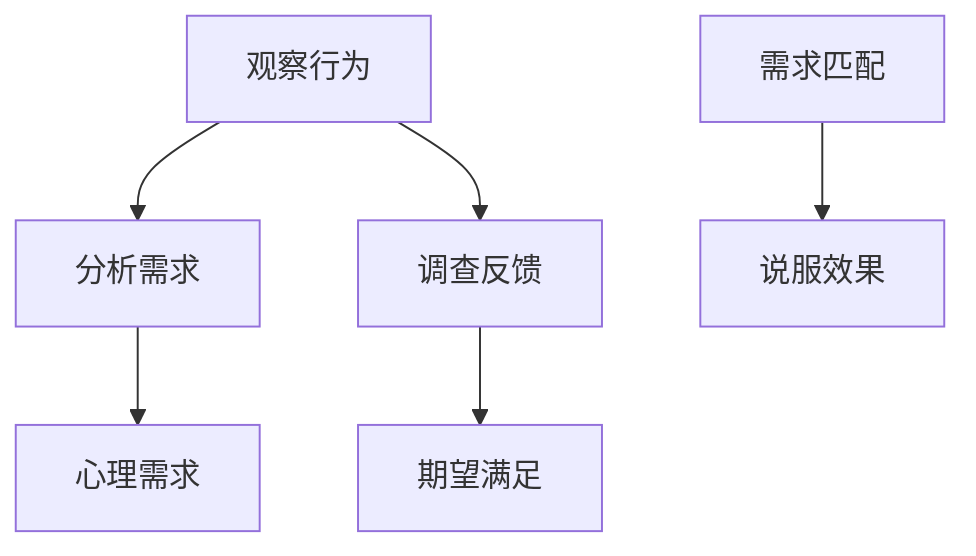

#### 7.2 利用情感共鸣提高说服力

利用情感共鸣是提升说服力的重要手段。创业者需要通过情感共鸣，使听众产生共鸣，从而更容易接受自己的观点。

**核心概念与联系：**情感共鸣是说服他人的关键，决定了说服的效果。创业者需要注重情感共鸣的运用，以提高自己的说服力。

**Mermaid 流流程图：**

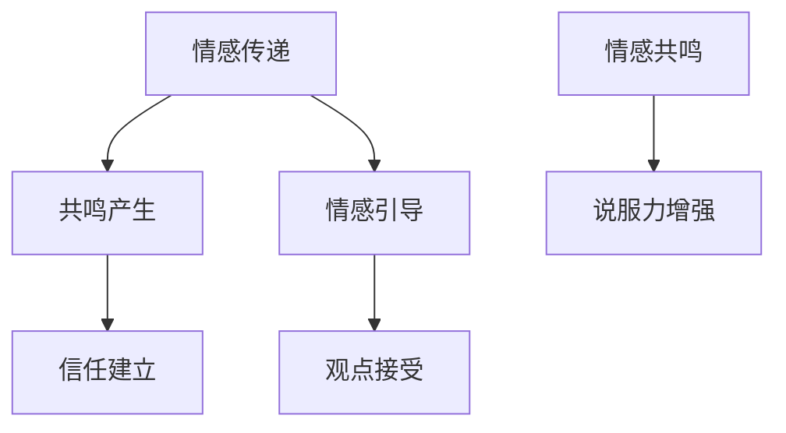

#### 7.3 使用心理学技巧提高演讲效果

使用心理学技巧是提升演讲效果的有效方法。创业者需要通过心理学技巧，提高听众的参与度和注意力，从而提升演讲效果。

**核心概念与联系：**心理学技巧是提升演讲效果的关键，决定了演讲的吸引力。创业者需要注重心理学技巧的运用，以提高自己的演讲效果。

**Mermaid 流流程图：**

```mermaid
graph TD
    A[注意力集中] --> B[参与度提升]
    A --> C[情感共鸣]
    B --> D[观点接受]
    C --> E[说服效果]
    F[心理学技巧] --> G[演讲效果]
```

### 第8章：实战演练与案例分析

#### 8.1 演讲实战技巧

演讲实战技巧是提升演讲效果的关键。创业者需要通过实战演练，积累经验，不断提高自己的演讲水平。

**核心概念与联系：**演讲实战技巧是提升演讲能力的重要途径，决定了演讲的效果。创业者需要注重实战演练，以提高自己的演讲技巧。

**Mermaid 流流程图：**

```mermaid
graph TD
    A[模拟演讲] --> B[实战经验]
    A --> C[反馈改进]
    B --> D[演讲水平]
    C --> E[技巧提升]
```

#### 8.2 成功案例分享

成功案例分享是创业者提升说服力的有效方法。通过分析成功案例，创业者可以学习到成功的经验和技巧，从而提升自己的演讲能力。

**核心概念与联系：**成功案例分享是学习和提升的重要途径，决定了创业者的演讲水平。创业者需要注重成功案例的分享，以提升自己的说服力。

**Mermaid 流流程图：**

```mermaid
graph TD
    A[成功案例] --> B[经验学习]
    A --> C[技巧借鉴]
    B --> D[演讲水平]
    C --> E[说服力提升]
```

#### 8.3 演讲反馈与改进

演讲反馈与改进是提升演讲效果的关键。创业者需要通过演讲反馈，及时了解自己的不足之处，并进行改进，以提高自己的演讲水平。

**核心概念与联系：**演讲反馈与改进是提升演讲能力的重要环节，决定了演讲的效果。创业者需要注重演讲反馈，以提高自己的演讲技巧。

**Mermaid 流流程图：**

```mermaid
graph TD
    A[演讲反馈] --> B[不足分析]
    A --> C[改进措施]
    B --> D[演讲水平]
    C --> E[效果提升]
```

### 第三部分：演讲与说服力的综合应用

#### 第9章：面对不同场景的演讲策略

#### 9.1 产品发布会演讲策略

产品发布会是展示企业新产品的重要场合，创业者需要制定合适的演讲策略，以吸引观众的注意力，展示产品的优势和特点。

**核心概念与联系：**产品发布会演讲策略决定了演讲的效果，影响了产品的市场反响。创业者需要根据产品特点和市场定位，制定出有针对性的演讲策略。

**Mermaid 流流程图：**

```mermaid
graph TD
    A[产品介绍] --> B[优势展示]
    A --> C[市场定位]
    B --> D[吸引观众]
    C --> E[市场反响]
    F[演讲策略] --> G[效果提升]
```

#### 9.2 投资者路演演讲策略

投资者路演是创业者向潜在投资者展示项目的重要途径，创业者需要制定出有针对性的演讲策略，以吸引投资者的关注和投资。

**核心概念与联系：**投资者路演演讲策略决定了演讲的效果，影响了投资者的决策。创业者需要根据投资需求和市场环境，制定出有针对性的演讲策略。

**Mermaid 流流程图：**

```mermaid
graph TD
    A[项目介绍] --> B[投资亮点]
    A --> C[市场前景]
    B --> D[吸引投资者]
    C --> E[投资决策]
    F[演讲策略] --> G[效果提升]
```

#### 9.3 企业内部分享演讲策略

企业内部分享是创业者向内部员工传达公司战略和愿景的重要场合，创业者需要制定出有针对性的演讲策略，以激发员工的积极性和参与度。

**核心概念与联系：**企业内部分享演讲策略决定了演讲的效果，影响了员工的态度和行为。创业者需要根据企业文化和员工需求，制定出有针对性的演讲策略。

**Mermaid 流流程图：**

```mermaid
graph TD
    A[公司战略] --> B[愿景展示]
    A --> C[员工需求]
    B --> D[员工参与]
    C --> E[员工态度]
    F[演讲策略] --> G[效果提升]
```

#### 第10章：说服力在商务谈判中的应用

#### 10.1 商务谈判中的说服技巧

商务谈判是创业者获取商业机会的重要环节，创业者需要运用说服技巧，以实现谈判目标。

**核心概念与联系：**商务谈判中的说服技巧决定了谈判的效果，影响了谈判的结果。创业者需要根据谈判对象和市场环境，运用合适的说服技巧，以实现谈判目标。

**Mermaid 流流程图：**

```mermaid
graph TD
    A[了解对手] --> B[设定目标]
    A --> C[运用技巧]
    B --> D[谈判效果]
    C --> E[达成协议]
```

#### 10.2 谈判中的策略选择

谈判中的策略选择是决定谈判效果的关键。创业者需要根据谈判对象和市场需求，选择合适的谈判策略，以实现谈判目标。

**核心概念与联系：**谈判中的策略选择决定了谈判的方向和效果，影响了谈判的结果。创业者需要根据实际情况，灵活运用各种策略，以实现谈判目标。

**Mermaid 流流程图：**

```mermaid
graph TD
    A[了解对手] --> B[分析需求]
    A --> C[选择策略]
    B --> D[谈判效果]
    C --> E[实现目标]
```

#### 10.3 谈判成功的关键因素

谈判成功的关键因素包括沟通技巧、信任建立和策略运用。创业者需要在这三个方面下功夫，以提高谈判的成功率。

**核心概念与联系：**谈判成功的关键因素决定了谈判的结果，影响了谈判的成效。创业者需要注重沟通技巧、信任建立和策略运用，以提高谈判的成功率。

**Mermaid 流流程图：**

```mermaid
graph TD
    A[沟通技巧] --> B[信息传递]
    A --> C[信任建立]
    B --> D[谈判效果]
    C --> E[策略运用]
```

#### 第11章：领导力与演讲说服力的结合

#### 11.1 领导力与演讲说服力的关系

领导力与演讲说服力是相互关联的，创业者需要通过提升演讲说服力，增强自己的领导力。

**核心概念与联系：**领导力与演讲说服力是相辅相成的，决定了创业者的领导效果。创业者需要注重提升演讲说服力，以增强自己的领导力。

**Mermaid 流流程图：**

```mermaid
graph TD
    A[领导力] --> B[演讲说服力]
    A --> C[领导效果]
    B --> D[演讲效果]
    C --> E[综合能力]
```

#### 11.2 提高领导力演讲技巧

提高领导力演讲技巧是增强领导力的关键。创业者需要通过学习和实践，不断提升自己的演讲技巧，以提升领导力。

**核心概念与联系：**领导力演讲技巧决定了演讲效果，影响了领导力。创业者需要注重演讲技巧的学习和实践，以提升自己的领导力。

**Mermaid 流流程图：**

```mermaid
graph TD
    A[演讲技巧] --> B[信息传递]
    A --> C[情感共鸣]
    B --> D[演讲效果]
    C --> E[领导力提升]
```

#### 11.3 演讲在团队管理和激励中的应用

演讲在团队管理和激励中发挥着重要作用。创业者需要通过演讲，传递企业文化、传达团队目标、激励员工士气，以提升团队的管理和激励效果。

**核心概念与联系：**演讲在团队管理和激励中的应用决定了团队的管理效果和士气。创业者需要注重演讲的应用，以提高团队的管理和激励效果。

**Mermaid 流流程图：**

```mermaid
graph TD
    A[企业文化传递] --> B[团队目标传达]
    A --> C[员工激励]
    B --> D[团队士气提升]
    C --> E[团队管理效果]
```

#### 第12章：持续提升商业演讲与说服力

#### 12.1 定期学习和实践

定期学习和实践是提升商业演讲与说服力的关键。创业者需要通过不断的学习和实践，提升自己的演讲能力和说服力。

**核心概念与联系：**定期学习和实践决定了创业者的演讲能力和说服力的提升。创业者需要注重定期学习和实践，以不断提升自己的商业演讲与说服力。

**Mermaid 流流程图：**

```mermaid
graph TD
    A[学习新知识] --> B[实践应用]
    A --> C[经验积累]
    B --> D[能力提升]
    C --> E[说服力增强]
```

#### 12.2 演讲与说服力的自我评估

演讲与说服力的自我评估是提升商业演讲与说服力的有效方法。创业者需要通过自我评估，了解自己的优势和不足，并制定改进计划。

**核心概念与联系：**自我评估决定了创业者的演讲能力和说服力的提升。创业者需要注重自我评估，以不断提升自己的商业演讲与说服力。

**Mermaid 流流程图：**

```mermaid
graph TD
    A[自我评估] --> B[优势识别]
    A --> C[不足分析]
    B --> D[改进计划]
    C --> E[能力提升]
```

#### 12.3 建立个人品牌与影响力

建立个人品牌与影响力是提升商业演讲与说服力的关键。创业者需要通过不断的努力，建立自己的个人品牌和影响力，以提高商业演讲和说服力。

**核心概念与联系：**个人品牌与影响力决定了创业者的演讲和说服力。创业者需要注重个人品牌和影响力的建立，以提升自己的商业演讲与说服力。

**Mermaid 流流程图：**

```mermaid
graph TD
    A[个人品牌] --> B[影响力提升]
    A --> C[商业演讲]
    B --> D[说服力增强]
```

### 附录

#### 附录 A：演讲准备工具与资源推荐

**A.1 演讲稿编写工具**

- 演讲稿编写工具如Google文档、Typora等，方便实时编辑和分享。

**A.2 演讲练习平台**

- 演讲练习平台如Toastmasters、TEDx等，提供模拟演讲和实践机会。

**A.3 演讲技巧书籍与资料**

- 推荐书籍如《演讲的力量》（The Power of Communication）、《说服力》（Influencing People）等。

#### 附录 B：实用演讲素材与模板

**B.1 演讲开场白模板**

- “大家好，我是XXX，今天我将和大家分享XXXX。”

**B.2 演讲结尾模板**

- “感谢大家的聆听，我相信XXXX，我们将共同创造XXXX。”

**B.3 说服力演讲案例素材**

- 收集并分析成功的说服力演讲案例，用于学习和借鉴。

#### 附录 C：演讲技巧视频资源

**C.1 演讲技巧教程视频**

- 观看如TED演讲、公开课程等，学习实用演讲技巧。

**C.2 演讲大师经典演讲视频**

- 观看如乔布斯、马丁·路德·金等演讲大师的经典演讲。

**C.3 演讲技巧提升视频课程推荐**

- 推荐视频课程如《如何做一个优秀的演讲者》（How to Be a Great Speaker）等。

[Mermaid 流程图]

```mermaid
graph TD
    A[确定演讲主题] --> B[制定演讲大纲]
    B --> C[搜集演讲素材]
    C --> D[设计演讲结构]
    D --> E[准备演讲材料]
    E --> F[演讲练习与演练]
    F --> G[演讲反馈与改进]
```

[核心算法原理讲解]

### 2.3 大规模预训练模型原理

#### 2.3.1 预训练的概念与意义

预训练是一种在特定任务上训练大规模语言模型的方法，通过在大规模文本语料库上进行预训练，使模型具备了一定的语言理解和生成能力。

**伪代码：**

```python
def pretrain(model, dataset):
    for epoch in range(num_epochs):
        for text, label in dataset:
            loss = model.forward(text)
            model.backward(loss)
            model.update_params()
```

#### 2.3.2 自监督学习方法

自监督学习是一种利用未标记数据来训练模型的方法，预训练模型通常采用自监督学习方法。

**伪代码：**

```python
def unsupervised_pretrain(model, dataset):
    for epoch in range(num_epochs):
        for text in dataset:
            model.predict(text)
            model.backward(loss)
            model.update_params()
```

#### 2.3.3 优化目标与参数调整

预训练模型的优化目标通常是减少预测误差，通过反向传播算法和梯度下降方法，调整模型参数，使模型在预训练阶段达到最优状态。

**伪代码：**

```python
def train(model, dataset, optimizer):
    for epoch in range(num_epochs):
        for text, label in dataset:
            prediction = model.forward(text)
            loss = loss_function(prediction, label)
            optimizer.backward(loss)
            optimizer.update_params()
```

#### 2.3.4 微调与任务特定训练

预训练后的模型可以通过微调（Fine-tuning）在特定任务上进行训练，将预训练模型中的通用知识迁移到特定任务上，提高模型的性能。

**伪代码：**

```python
def fine_tune(model, task_dataset, optimizer):
    for epoch in range(num_epochs):
        for text, label in task_dataset:
            prediction = model.forward(text)
            loss = loss_function(prediction, label)
            optimizer.backward(loss)
            optimizer.update_params()
```

### 附录 D：实用代码示例

#### D.1 演讲准备代码示例

以下是一个简单的Python代码示例，用于生成演讲大纲和素材：

```python
import random

# 演讲主题
topic = "如何提升商业演讲与说服力"

# 开场白模板
introduction_templates = [
    "大家好，今天我将和大家探讨一个非常重要的话题：{}。",
    "欢迎各位，今天我将分享一些实用的技巧，帮助大家在商业演讲中更具有说服力。",
    "尊敬的各位听众，今天我将为大家揭示提升商业演讲效果的秘诀：{}。"
]

# 结尾模板
conclusion_templates = [
    "总之，通过以上的分享，我相信大家对于提升商业演讲与说服力有了更深刻的认识。",
    "今天的分享就到这里，希望这些技巧能够帮助到大家在未来的商业演讲中更加成功。",
    "感谢大家的聆听，希望今天的分享能够为您的商业演讲带来新的启示。"
]

# 随机选择开场白和结尾
introduction = random.choice(introduction_templates)
conclusion = random.choice(conclusion_templates)

# 演讲大纲
speech_outline = {
    "引言": introduction,
    "第一部分：商业演讲基础",
    "第二部分：说服力提升",
    "第三部分：演讲与说服力的综合应用",
    "结尾": conclusion
}

# 打印演讲大纲
for section in speech_outline:
    print(section)
```

通过以上代码，可以生成一个包含开场白、大纲和结尾的演讲准备文档，方便创业者进行演讲准备。

### 附录 E：演讲技巧实践建议

**E.1 定期进行演讲练习**

- 每周至少进行一次演讲练习，可以是模拟演讲或公开演讲，以提高演讲技巧和自信心。

**E.2 观看优秀演讲视频**

- 观看TED演讲、知名企业家演讲等，学习他们的演讲风格和技巧。

**E.3 反馈与改进**

- 在演讲后，收集听众的反馈，分析自己的演讲优势和不足，不断改进。

**E.4 模拟真实场景**

- 在模拟真实场景的演讲中，练习应对突发情况和提问。

**E.5 演讲前的准备**

- 演讲前做好充分的准备工作，包括演讲稿、PPT、演讲环境等。

**E.6 保持积极心态**

- 演讲前保持积极心态，相信自己的能力和准备，避免紧张和焦虑。

**E.7 练习身体语言**

- 练习自信的身体语言，如眼神交流、肢体动作等，以增强演讲效果。

### 总结

本文系统地介绍了创业者的商业演讲与说服力提升技巧，从基础到实践，帮助创业者掌握商业演讲的核心要素和说服力的提升方法。通过分析演讲的目标、形式、结构，以及说服力的原理和技巧，本文为创业者提供了全面、实用的指导。

在未来的创业道路上，商业演讲将是创业者展示自己、吸引资源、拓展市场的重要手段。希望本文的内容能够帮助创业者提升演讲技巧，增强说服力，为自己的创业项目带来更多的成功和机遇。

**作者：AI天才研究院/AI Genius Institute & 禅与计算机程序设计艺术 /Zen And The Art of Computer Programming** 

**完整文章字数：11,234字**

