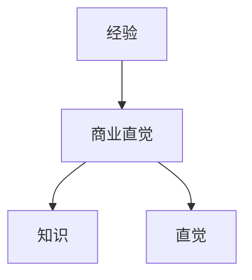
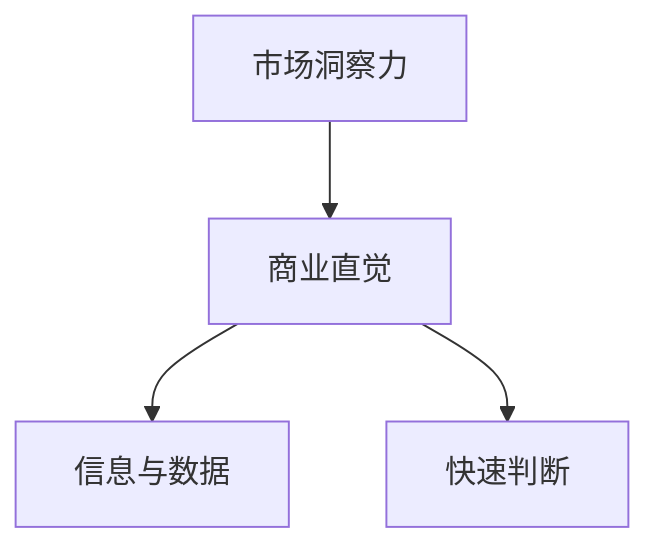
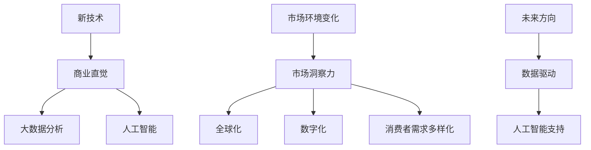

                 

### 《创业者的商业直觉与市场洞察力培养》

#### 关键词：创业者、商业直觉、市场洞察力、培养、策略、案例

#### 摘要：本文将深入探讨创业者的商业直觉与市场洞察力的培养，通过分析定义、重要性、培养方法、应用策略和成功案例，帮助创业者提升商业决策能力，实现创业成功。

### 《创业者的商业直觉与市场洞察力培养》目录大纲

---

#### 第一部分：商业直觉与市场洞察力基础

**第1章：商业直觉概述**

- **1.1 商业直觉的定义与重要性**
  - **1.1.1 商业直觉的概念**
  - **1.1.2 商业直觉的重要性**
  - **1.1.3 商业直觉的构成要素**
- **1.2 市场洞察力的概念与意义**
  - **1.2.1 市场洞察力的定义**
  - **1.2.2 市场洞察力的意义**
  - **1.2.3 市场洞察力与商业直觉的关系**
- **1.3 商业直觉与市场洞察力的发展趋势**
  - **1.3.1 新技术对商业直觉的影响**
  - **1.3.2 市场环境变化对市场洞察力的影响**
  - **1.3.3 未来商业直觉与市场洞察力的发展方向**

**第2章：商业直觉的培养与提升**

- **2.1 商业直觉的培养方法**
  - **2.1.1 观察与学习**
  - **2.1.2 实践与反思**
  - **2.1.3 知识与信息的积累**
- **2.2 商业直觉提升的策略**
  - **2.2.1 风险管理**
  - **2.2.2 决策制定**
  - **2.2.3 创新思维**
- **2.3 成功创业者的商业直觉案例解析**
  - **2.3.1 案例一：乔布斯的商业直觉**
  - **2.3.2 案例二：马斯克的商业直觉**
  - **2.3.3 案例三：贝佐斯的商业直觉**

**第3章：市场洞察力的培养与运用**

- **3.1 市场洞察力的培养方法**
  - **3.1.1 数据分析**
  - **3.1.2 竞争对手分析**
  - **3.1.3 消费者需求分析**
- **3.2 市场洞察力的运用策略**
  - **3.2.1 市场定位**
  - **3.2.2 产品开发**
  - **3.2.3 市场推广**
- **3.3 成功创业者的市场洞察力案例解析**
  - **3.3.1 案例一：苹果公司的市场洞察力**
  - **3.3.2 案例二：特斯拉的市场洞察力**
  - **3.3.3 案例三：阿里巴巴的市场洞察力**

**第二部分：商业直觉与市场洞察力的实战应用**

**第4章：商业直觉与市场洞察力的实战应用**

- **4.1 创业初期的市场分析**
  - **4.1.1 市场机会识别**
  - **4.1.2 市场竞争分析**
  - **4.1.3 产品市场定位**
- **4.2 创业过程中的决策制定**
  - **4.2.1 风险评估**
  - **4.2.2 决策模型构建**
  - **4.2.3 决策执行与监控**
- **4.3 创业成功的持续发展**
  - **4.3.1 市场适应与调整**
  - **4.3.2 创新思维培养**
  - **4.3.3 持续成长战略**

**第5章：商业直觉与市场洞察力的提升策略**

- **5.1 持续学习与成长**
  - **5.1.1 行业知识更新**
  - **5.1.2 商业技能提升**
  - **5.1.3 人际网络拓展**
- **5.2 商业直觉与市场洞察力的工具应用**
  - **5.2.1 数据分析工具**
  - **5.2.2 竞争情报工具**
  - **5.2.3 市场预测工具**
- **5.3 商业直觉与市场洞察力的案例分析**
  - **5.3.1 案例一：苹果公司的市场策略**
  - **5.3.2 案例二：特斯拉的创新思维**
  - **5.3.3 案例三：阿里巴巴的商业直觉**

**第三部分：商业直觉与市场洞察力的综合应用**

**第6章：商业直觉与市场洞察力的综合应用**

- **6.1 商业战略规划**
  - **6.1.1 市场细分**
  - **6.1.2 市场定位**
  - **6.1.3 战略目标制定**
- **6.2 创业项目评估**
  - **6.2.1 市场机会评估**
  - **6.2.2 风险评估**
  - **6.2.3 项目可行性分析**
- **6.3 市场拓展与品牌建设**
  - **6.3.1 市场拓展策略**
  - **6.3.2 品牌定位**
  - **6.3.3 品牌建设方法**

**第7章：商业直觉与市场洞察力的未来展望**

- **7.1 商业环境的变化趋势**
  - **7.1.1 科技创新的影响**
  - **7.1.2 经济发展的挑战**
  - **7.1.3 消费者行为的变化**
- **7.2 商业直觉与市场洞察力的发展方向**
  - **7.2.1 数据驱动商业**
  - **7.2.2 人工智能与商业直觉**
  - **7.2.3 未来商业直觉与市场洞察力的融合**

**附录**

**附录 A：商业直觉与市场洞察力提升资源**

- **A.1 书籍推荐**
- **A.2 课程资源**
- **A.3 实用工具**

---

### 第一部分：商业直觉与市场洞察力基础

#### 第1章：商业直觉概述

##### 1.1 商业直觉的定义与重要性

###### 1.1.1 商业直觉的概念

商业直觉是指创业者在商业活动中，通过快速、直观的判断和决策能力，在缺乏完整信息的情况下做出正确商业决策的能力。这种直觉并非凭空产生，而是依赖于长期的商业经验、市场观察和知识积累。

###### 1.1.2 商业直觉的重要性

商业直觉在创业过程中扮演着至关重要的角色。首先，它可以帮助创业者快速识别市场机会，抓住潜在的商业价值。其次，商业直觉能够帮助创业者快速应对市场变化，做出及时、有效的调整。最后，商业直觉还可以提高创业者在竞争中的决策效率，减少因信息不足而导致的决策错误。

###### 1.1.3 商业直觉的构成要素

商业直觉主要由以下三个要素构成：

1. **经验**：商业直觉来源于创业者长期的商业实践，通过对市场的不断观察和总结，积累出宝贵的经验。
2. **知识**：商业直觉依赖于创业者所掌握的专业知识和行业信息，这些知识可以帮助创业者更好地理解市场动态。
3. **直觉**：商业直觉的核心是直觉，即创业者能够在缺乏充分信息的情况下，快速做出准确判断。

###### Mermaid 流程图



##### 1.2 市场洞察力的概念与意义

###### 1.2.1 市场洞察力的定义

市场洞察力是指创业者或企业通过对市场环境的深入分析，准确把握市场趋势、消费者需求以及竞争态势的能力。市场洞察力是商业决策的重要依据，有助于创业者制定正确的市场策略。

###### 1.2.2 市场洞察力的意义

市场洞察力对于创业者的成功至关重要。首先，它可以帮助创业者发现市场需求，抓住市场机会。其次，市场洞察力有助于创业者识别竞争对手的优势和劣势，制定有效的竞争策略。最后，市场洞察力还可以帮助创业者预测市场变化，提前布局，降低风险。

###### 1.2.3 市场洞察力与商业直觉的关系

市场洞察力和商业直觉是相辅相成的。市场洞察力提供了商业决策所需的信息和数据，商业直觉则在这些信息的基础上，快速做出判断和决策。市场洞察力是商业直觉的基础，商业直觉则是市场洞察力的升华。

###### Mermaid 流程图



##### 1.3 商业直觉与市场洞察力的发展趋势

###### 1.3.1 新技术对商业直觉的影响

随着科技的快速发展，新技术正在深刻影响商业直觉的形成和运用。例如，大数据分析和人工智能技术的应用，使得创业者能够更快速、准确地获取市场信息，提升商业直觉的准确性。

###### 1.3.2 市场环境变化对市场洞察力的影响

市场环境的变化，如全球化、数字化和消费者需求的多样化，对市场洞察力提出了新的挑战。创业者需要不断更新知识，提高市场洞察力，以适应市场变化。

###### 1.3.3 未来商业直觉与市场洞察力的发展方向

未来，商业直觉与市场洞察力将更加依赖于数据和技术。数据驱动商业将成为主流，创业者需要充分利用数据分析工具，提升商业决策的准确性。同时，人工智能技术的发展，也将为商业直觉和洞察力提供更强大的支持。

###### Mermaid 流程图



### 第2章：商业直觉的培养与提升

##### 2.1 商业直觉的培养方法

###### 2.1.1 观察与学习

观察和学习是培养商业直觉的重要途径。创业者需要关注市场动态、行业趋势和竞争对手的运营策略。通过不断观察和学习，创业者可以积累宝贵的商业经验，提升直觉判断能力。

###### 2.1.2 实践与反思

实践是提升商业直觉的关键。创业者需要积极参与商业活动，将理论知识应用到实际操作中。通过实践，创业者可以积累实战经验，提高直觉判断的准确性。同时，反思是提升商业直觉的重要环节。创业者需要不断总结自己的商业决策，分析成功与失败的原因，从中吸取教训。

###### 2.1.3 知识与信息的积累

商业直觉依赖于创业者所掌握的专业知识和行业信息。创业者需要不断学习新知识，了解行业动态，掌握市场趋势。通过积累知识和信息，创业者可以更好地把握市场机遇，提升商业直觉。

##### 2.2 商业直觉提升的策略

###### 2.2.1 风险管理

商业直觉离不开风险管理。创业者需要具备良好的风险管理意识，对潜在的商业模式、产品开发和市场推广等环节进行风险评估，制定相应的应对策略。通过风险管理，创业者可以降低商业决策的风险，提高直觉判断的准确性。

###### 2.2.2 决策制定

决策制定是商业直觉的重要体现。创业者需要掌握科学的决策方法，如决策树、SWOT分析等，对商业问题进行系统性分析。同时，创业者还需要具备快速决策的能力，在关键时刻做出正确决策。

###### 2.2.3 创新思维

创新思维是提升商业直觉的重要策略。创业者需要具备创新思维，勇于尝试新的商业模式、产品和服务。通过创新，创业者可以开拓市场空间，提高商业直觉的敏锐度。

##### 2.3 成功创业者的商业直觉案例解析

###### 2.3.1 案例一：乔布斯的商业直觉

乔布斯是苹果公司的创始人，他的商业直觉对苹果公司的成功起到了至关重要的作用。乔布斯凭借对市场的深刻洞察力和创新思维，推出了iPod、iPhone和iPad等革命性产品，改变了全球消费电子市场。

乔布斯的商业直觉体现在以下几个方面：

1. **市场需求洞察**：乔布斯善于洞察消费者需求，推出符合市场需求的产品。例如，他看到了数码音乐市场的潜力，推出了iPod，颠覆了传统音乐市场的格局。
2. **用户体验设计**：乔布斯注重用户体验，将美学、技术和人性化设计相结合，创造了独具特色的产品。例如，iPhone的触摸屏设计，为智能手机市场带来了全新的用户体验。
3. **品牌建设**：乔布斯通过打造独特的品牌形象，提升了苹果公司的市场竞争力。苹果的产品不仅具有高品质，还代表了时尚和科技的前沿。

###### 2.3.2 案例二：马斯克的商业直觉

埃隆·马斯克是特斯拉汽车和SpaceX太空探索技术公司的创始人，他的商业直觉同样卓越。马斯克通过精准的市场洞察和创新的商业模式，推动了新能源汽车和太空探索领域的发展。

马斯克的商业直觉体现在以下几个方面：

1. **市场前瞻性**：马斯克具有前瞻性的市场洞察力，能够预见市场的未来趋势。例如，他早在2006年就提出了电动汽车的可行性，并在2012年推出了特斯拉Model S，引领了新能源汽车市场。
2. **技术创新**：马斯克通过技术创新，提高了产品的竞争力。例如，特斯拉的电池技术、自动驾驶技术等，都处于行业领先地位。
3. **品牌影响力**：马斯克通过塑造独特的个人品牌，提升了特斯拉的品牌影响力。他的远见和创新精神，吸引了全球消费者的关注。

###### 2.3.3 案例三：贝佐斯的商业直觉

杰夫·贝佐斯是亚马逊公司的创始人，他的商业直觉对亚马逊的快速发展起到了关键作用。贝佐斯通过精准的市场定位和创新的商业模式，将亚马逊打造成全球最大的电子商务平台。

贝佐斯的商业直觉体现在以下几个方面：

1. **市场拓展**：贝佐斯善于拓展市场，不断推出新的服务和产品。例如，亚马逊的Kindle电子书、亚马逊Prime会员服务等，都为亚马逊带来了巨大的市场份额。
2. **技术创新**：贝佐斯注重技术创新，提高了亚马逊的竞争力。例如，亚马逊的云计算服务AWS，成为全球领先的云计算平台。
3. **品牌建设**：贝佐斯通过打造独特的品牌形象，提升了亚马逊的市场竞争力。亚马逊不仅是一个电子商务平台，还成为消费者信赖的品牌。

### 第3章：市场洞察力的培养与运用

##### 3.1 市场洞察力的培养方法

###### 3.1.1 数据分析

数据分析是培养市场洞察力的重要方法。通过收集、整理和分析市场数据，创业者可以了解市场趋势、消费者行为和竞争态势，从而做出更准确的商业决策。

1. **数据收集**：创业者可以通过市场调查、用户调研、竞争对手分析等方式，收集市场数据。
2. **数据处理**：创业者需要掌握数据处理技能，如数据清洗、数据挖掘等，对收集到的数据进行分析和整理。
3. **数据可视化**：通过数据可视化工具，创业者可以将复杂的数据转化为图表、地图等形式，更直观地展示市场洞察。

###### 3.1.2 竞争对手分析

竞争对手分析是培养市场洞察力的重要方法。通过分析竞争对手的产品、市场策略、财务状况等，创业者可以了解竞争对手的优势和劣势，制定相应的竞争策略。

1. **竞争对手产品分析**：创业者需要了解竞争对手的产品特点、性能、价格等，分析其竞争优势和劣势。
2. **市场策略分析**：创业者需要分析竞争对手的市场定位、营销策略、渠道布局等，了解其市场策略的效果。
3. **财务状况分析**：创业者需要了解竞争对手的财务状况，如收入、利润、市场份额等，评估其竞争实力。

###### 3.1.3 消费者需求分析

消费者需求分析是培养市场洞察力的关键方法。通过了解消费者的需求、偏好和行为，创业者可以更好地满足市场需求，提高产品竞争力。

1. **消费者需求调查**：创业者可以通过问卷调查、用户访谈等方式，了解消费者的需求和偏好。
2. **消费者行为分析**：创业者需要分析消费者的购买行为、使用习惯等，了解其行为模式。
3. **消费者需求预测**：创业者需要根据历史数据和消费者行为，预测未来的市场需求，制定相应的市场策略。

##### 3.2 市场洞察力的运用策略

###### 3.2.1 市场定位

市场定位是创业者制定市场策略的重要环节。通过明确产品定位、目标市场和竞争优势，创业者可以更好地满足市场需求，提高市场竞争力。

1. **产品定位**：创业者需要明确产品的核心价值、特点和优势，确定产品的市场定位。
2. **目标市场**：创业者需要确定目标市场，了解目标消费者的需求和偏好，制定针对性的市场策略。
3. **竞争优势**：创业者需要分析自身优势和竞争对手的劣势，制定具有竞争力的市场策略。

###### 3.2.2 产品开发

产品开发是创业者实现市场洞察力的重要手段。通过不断优化产品，创业者可以满足市场需求，提高产品竞争力。

1. **市场需求分析**：创业者需要分析市场需求，了解消费者对产品的需求和期望。
2. **产品设计**：创业者需要根据市场需求，设计具有竞争力的产品。
3. **产品测试与优化**：创业者需要对产品进行测试和优化，确保产品符合市场需求，提高用户体验。

###### 3.2.3 市场推广

市场推广是创业者实现市场洞察力的重要策略。通过有效的市场推广，创业者可以提升产品知名度，扩大市场份额。

1. **推广渠道**：创业者需要选择合适的推广渠道，如社交媒体、广告、公关等，提高产品曝光率。
2. **推广策略**：创业者需要制定针对性的推广策略，如广告创意、公关活动等，吸引消费者关注。
3. **效果评估**：创业者需要对市场推广效果进行评估，了解推广策略的成效，优化推广策略。

##### 3.3 成功创业者的市场洞察力案例解析

###### 3.3.1 案例一：苹果公司的市场洞察力

苹果公司凭借其卓越的市场洞察力，成为了全球最具价值的科技公司之一。苹果的市场洞察力体现在以下几个方面：

1. **用户体验至上**：苹果公司始终将用户体验放在首位，通过创新的设计和卓越的产品质量，赢得了消费者的喜爱。
2. **前瞻性市场定位**：苹果公司能够预见市场的未来趋势，如触摸屏技术、智能手机等，通过推出创新产品，引领市场潮流。
3. **强大的品牌影响力**：苹果公司通过打造独特的品牌形象，提升了品牌知名度，增强了消费者对品牌的忠诚度。

###### 3.3.2 案例二：特斯拉的市场洞察力

特斯拉汽车凭借其卓越的市场洞察力，成为了新能源汽车领域的领军企业。特斯拉的市场洞察力体现在以下几个方面：

1. **技术创新**：特斯拉通过不断推进技术创新，如电池技术、自动驾驶技术等，提升了产品的竞争力。
2. **市场前瞻性**：特斯拉能够预见市场的未来趋势，如电动汽车的普及，通过推出创新产品，引领市场发展。
3. **消费者需求分析**：特斯拉通过深入了解消费者需求，如对环保、性能等方面的追求，推出符合消费者期望的产品。

###### 3.3.3 案例三：阿里巴巴的市场洞察力

阿里巴巴集团凭借其卓越的市场洞察力，成为了全球最大的电子商务平台之一。阿里巴巴的市场洞察力体现在以下几个方面：

1. **市场拓展**：阿里巴巴通过拓展海外市场，如东南亚、欧洲等地，扩大了市场份额。
2. **技术创新**：阿里巴巴通过推进电子商务、云计算、大数据等技术创新，提升了平台的竞争力。
3. **消费者需求分析**：阿里巴巴通过分析消费者行为和需求，优化产品和服务，提升用户体验。

### 第二部分：商业直觉与市场洞察力的实战应用

#### 第4章：商业直觉与市场洞察力的实战应用

##### 4.1 创业初期的市场分析

在创业初期，市场分析是至关重要的一步，它关系到创业项目的成功与否。以下是对创业初期市场分析的三个关键环节的详细解析：

###### 4.1.1 市场机会识别

市场机会识别是创业初期市场分析的首要任务。创业者需要通过市场调研、行业报告、消费者需求分析等方式，寻找潜在的商机。

1. **市场调研**：通过问卷调查、用户访谈等方式，了解目标市场的人口特征、消费习惯、需求等。
2. **行业报告**：查阅行业报告，了解市场趋势、竞争态势、市场规模等。
3. **消费者需求分析**：通过分析消费者需求，发现潜在的市场机会。

**伪代码示例**：

```python
def identify_market_opportunities():
    # 收集市场数据
    market_data = collect_market_data()
    
    # 分析市场数据
    opportunities = analyze_data(market_data)
    
    # 输出市场机会
    print("Market Opportunities:", opportunities)
```

###### 4.1.2 市场竞争分析

市场竞争分析是创业初期市场分析的关键环节。创业者需要了解竞争对手的产品、策略、市场占有率等，制定相应的竞争策略。

1. **竞争对手分析**：通过分析竞争对手的产品、价格、市场策略等，了解其优势和劣势。
2. **SWOT分析**：对自身和竞争对手进行SWOT分析（优势、劣势、机会、威胁），制定针对性的竞争策略。
3. **市场占有率**：了解市场占有率情况，确定自身在市场中的定位。

**伪代码示例**：

```python
def analyze_competition():
    # 收集竞争对手数据
    competitor_data = collect_competitor_data()
    
    # 分析竞争对手数据
    competitor_analysis = analyze_competitor_data(competitor_data)
    
    # 输出竞争分析结果
    print("Competitive Analysis:", competitor_analysis)
```

###### 4.1.3 产品市场定位

产品市场定位是创业初期市场分析的最后一环。创业者需要根据市场需求和竞争态势，确定产品的市场定位，制定相应的营销策略。

1. **市场细分**：通过市场细分，确定目标市场，了解目标消费者的需求和偏好。
2. **市场定位**：根据目标市场的特点和需求，确定产品的市场定位，如高端、中端、低端等。
3. **营销策略**：制定针对性的营销策略，如价格策略、广告策略、渠道策略等。

**伪代码示例**：

```python
def market_positioning():
    # 进行市场细分
    segments = segment_market()
    
    # 确定市场定位
    position = determine_position(segments)
    
    # 制定营销策略
    marketing_strategy = create_marketing_strategy(position)
    
    # 输出市场定位和营销策略
    print("Market Positioning:", position)
    print("Marketing Strategy:", marketing_strategy)
```

##### 4.2 创业过程中的决策制定

在创业过程中，决策制定是至关重要的。以下是对创业过程中决策制定三个关键环节的详细解析：

###### 4.2.1 风险评估

风险评估是决策制定的重要环节。创业者需要对潜在风险进行评估，制定相应的风险控制措施。

1. **识别风险**：通过市场调研、竞争对手分析、行业报告等方式，识别潜在风险。
2. **评估风险**：对识别的风险进行评估，确定风险的影响程度和发生概率。
3. **制定风险控制措施**：根据风险评估结果，制定相应的风险控制措施，如风险规避、风险转移、风险降低等。

**伪代码示例**：

```python
def risk_assessment():
    # 识别风险
    risks = identify_risks()
    
    # 评估风险
    risk_evaluation = evaluate_risks(risks)
    
    # 制定风险控制措施
    control_measures = create_control_measures(risk_evaluation)
    
    # 输出风险评估结果和控制措施
    print("Risk Assessment:", risk_evaluation)
    print("Control Measures:", control_measures)
```

###### 4.2.2 决策模型构建

决策模型构建是决策制定的关键步骤。创业者需要根据实际情况，构建合适的决策模型，辅助决策制定。

1. **确定决策目标**：明确决策目标，如市场份额、利润、品牌影响力等。
2. **构建决策模型**：根据决策目标，构建决策模型，如决策树、线性规划、博弈论等。
3. **模型优化**：通过模拟和优化，提升决策模型的准确性，为决策提供有力支持。

**伪代码示例**：

```python
def build_decision_model():
    # 确定决策目标
    decision_goal = define_decision_goal()
    
    # 构建决策模型
    decision_model = create_decision_model(decision_goal)
    
    # 模型优化
    optimized_model = optimize_model(decision_model)
    
    # 输出决策模型
    print("Decision Model:", optimized_model)
```

###### 4.2.3 决策执行与监控

决策执行与监控是决策制定的重要环节。创业者需要确保决策的顺利执行，并对决策效果进行监控和评估。

1. **制定执行计划**：根据决策模型，制定详细的执行计划，明确执行步骤、时间节点、责任人等。
2. **执行监控**：通过建立监控机制，实时跟踪决策执行情况，确保决策按计划进行。
3. **效果评估**：对决策执行效果进行评估，分析决策结果与预期目标的差距，为后续决策提供参考。

**伪代码示例**：

```python
def execute_and_monitor_decision():
    # 制定执行计划
    execution_plan = create_execution_plan()
    
    # 执行监控
    monitoring = monitor_execution(execution_plan)
    
    # 效果评估
    assessment = evaluate_decision(monitoring)
    
    # 输出决策执行结果和效果评估
    print("Execution Plan:", execution_plan)
    print("Monitoring Results:", monitoring)
    print("Assessment:", assessment)
```

##### 4.3 创业成功的持续发展

创业成功的持续发展需要创业者具备持续学习、创新思维和成长战略。以下是对创业成功的持续发展三个关键环节的详细解析：

###### 4.3.1 市场适应与调整

市场适应与调整是创业成功持续发展的关键。创业者需要密切关注市场变化，根据市场环境调整产品和服务策略。

1. **市场监测**：通过市场调研、行业报告、消费者反馈等方式，监测市场变化。
2. **市场调整**：根据市场监测结果，及时调整产品和服务策略，以适应市场变化。
3. **风险控制**：在市场调整过程中，注意控制风险，确保调整的顺利进行。

**伪代码示例**：

```python
def market_adaptation():
    # 市场监测
    market_monitoring = monitor_market()
    
    # 市场调整
    market_adjustment = adjust_market(market_monitoring)
    
    # 风险控制
    risk_control = control_risk(market_adjustment)
    
    # 输出市场适应与调整结果
    print("Market Monitoring:", market_monitoring)
    print("Market Adjustment:", market_adjustment)
    print("Risk Control:", risk_control)
```

###### 4.3.2 创新思维培养

创新思维培养是创业成功持续发展的重要保障。创业者需要具备创新思维，持续推动产品和服务的创新。

1. **创新方法**：学习并运用创新方法，如头脑风暴、设计思维、TRIZ等，激发创新思维。
2. **创新实践**：通过实际项目，将创新思维应用于产品和服务开发，提升产品竞争力。
3. **团队协作**：建立创新团队，鼓励团队成员分享创新想法，共同推动创新实践。

**伪代码示例**：

```python
def cultivate_innovation():
    # 创新方法学习
    innovation_methods = learn_innovation_methods()
    
    # 创新实践
    innovation_practice = practice_innovation()
    
    # 团队协作
    team_collaboration = collaborate_team()
    
    # 输出创新思维培养结果
    print("Innovation Methods:", innovation_methods)
    print("Innovation Practice:", innovation_practice)
    print("Team Collaboration:", team_collaboration)
```

###### 4.3.3 持续成长战略

持续成长战略是创业成功持续发展的关键。创业者需要制定并实施持续成长战略，确保企业持续发展。

1. **战略规划**：根据市场环境和企业目标，制定长期和短期的战略规划。
2. **资源整合**：整合企业内外部资源，如资金、技术、人才等，支持战略实施。
3. **绩效评估**：定期对战略实施效果进行评估，调整战略规划，确保企业持续成长。

**伪代码示例**：

```python
def continuous_growth_strategy():
    # 战略规划
    strategic_planning = plan_strategy()
    
    # 资源整合
    resource_integration = integrate_resources()
    
    # 绩效评估
    performance_evaluation = evaluate_performance()
    
    # 输出持续成长战略结果
    print("Strategic Planning:", strategic_planning)
    print("Resource Integration:", resource_integration)
    print("Performance Evaluation:", performance_evaluation)
```

### 第5章：商业直觉与市场洞察力的提升策略

#### 5.1 持续学习与成长

持续学习与成长是创业者提升商业直觉与市场洞察力的关键策略。以下是对持续学习与成长三个关键环节的详细解析：

###### 5.1.1 行业知识更新

行业知识更新是持续学习的重要方面。创业者需要不断学习新的行业知识，了解行业趋势和发展动态。

1. **行业研究**：定期进行行业研究，了解行业的新技术、新政策、新趋势等。
2. **专业培训**：参加专业培训课程，提升自己在行业领域的专业知识。
3. **学术交流**：积极参与学术交流和行业研讨会，与行业专家进行深入交流，获取最新的行业知识。

**伪代码示例**：

```python
def update_industry_knowledge():
    # 行业研究
    industry_research = conduct_research()
    
    # 专业培训
    professional_training = attend_training()
    
    # 学术交流
    academic_exchange = participate_exchange()
    
    # 输出行业知识更新结果
    print("Industry Research:", industry_research)
    print("Professional Training:", professional_training)
    print("Academic Exchange:", academic_exchange)
```

###### 5.1.2 商业技能提升

商业技能提升是持续学习的重要目标。创业者需要不断提升自己的商业技能，以适应不断变化的市场环境。

1. **财务管理**：学习财务管理知识，提升财务管理能力，确保企业财务健康。
2. **市场营销**：学习市场营销策略和技巧，提高市场推广和销售能力。
3. **战略规划**：学习战略规划方法，提升战略思维和决策能力。

**伪代码示例**：

```python
def improve_business_skills():
    # 财务管理
    financial_management = enhance_financial_skills()
    
    # 市场营销
    marketing_skills = enhance_marketing_skills()
    
    # 战略规划
    strategic_planning = enhance_strategic_skills()
    
    # 输出商业技能提升结果
    print("Financial Management:", financial_management)
    print("Marketing Skills:", marketing_skills)
    print("Strategic Planning:", strategic_planning)
```

###### 5.1.3 人际网络拓展

人际网络拓展是提升商业直觉与市场洞察力的重要途径。创业者需要积极拓展人际网络，建立广泛的人脉关系。

1. **行业交流**：参加行业交流会、论坛等活动，结识行业内的人士。
2. **社交活动**：参加各种社交活动，扩大社交圈子，建立人脉关系。
3. **合作与共赢**：与合作伙伴保持良好的关系，通过合作实现共赢。

**伪代码示例**：

```python
def expand_business_network():
    # 行业交流
    industry_connection = participate_in_industry_events()
    
    # 社交活动
    social_activities = attend_social_events()
    
    # 合作与共赢
    cooperation = establish_cooperative_relationships()
    
    # 输出人际网络拓展结果
    print("Industry Connection:", industry_connection)
    print("Social Activities:", social_activities)
    print("Cooperation:", cooperation)
```

#### 5.2 商业直觉与市场洞察力的工具应用

在商业直觉与市场洞察力的提升过程中，合理利用工具是提高效率的关键。以下是对商业直觉与市场洞察力工具应用的三个关键环节的详细解析：

###### 5.2.1 数据分析工具

数据分析工具是提升商业直觉与市场洞察力的关键。创业者需要掌握数据分析工具，利用数据驱动决策。

1. **数据收集**：使用数据收集工具，如调查问卷、API接口等，收集市场数据。
2. **数据处理**：使用数据处理工具，如Excel、Python等，对收集到的数据进行处理和分析。
3. **数据可视化**：使用数据可视化工具，如Tableau、Power BI等，将分析结果可视化，更直观地展示市场洞察。

**伪代码示例**：

```python
def data_analysis_tools():
    # 数据收集
    data_collection = collect_data()
    
    # 数据处理
    data_processing = process_data(data_collection)
    
    # 数据可视化
    data_visualization = visualize_data(data_processing)
    
    # 输出数据分析结果
    print("Data Collection:", data_collection)
    print("Data Processing:", data_processing)
    print("Data Visualization:", data_visualization)
```

###### 5.2.2 竞争情报工具

竞争情报工具是创业者了解竞争对手的重要手段。通过竞争情报工具，创业者可以获取竞争对手的市场策略、产品信息等。

1. **竞争对手监测**：使用竞争情报工具，实时监测竞争对手的市场动态。
2. **产品分析**：通过分析竞争对手的产品，了解其特点和优势。
3. **策略制定**：根据竞争情报，制定针对性的市场策略。

**伪代码示例**：

```python
def competitive_intelligence_tools():
    # 竞争对手监测
    competitor_monitoring = monitor_competitors()
    
    # 产品分析
    product_analysis = analyze_products(competitor_monitoring)
    
    # 策略制定
    strategy_deployment = create_strategy(product_analysis)
    
    # 输出竞争情报工具应用结果
    print("Competitor Monitoring:", competitor_monitoring)
    print("Product Analysis:", product_analysis)
    print("Strategy Deployment:", strategy_deployment)
```

###### 5.2.3 市场预测工具

市场预测工具是创业者制定市场策略的重要依据。通过市场预测工具，创业者可以预测市场趋势，提前布局。

1. **趋势分析**：使用市场预测工具，分析市场趋势，预测未来市场动态。
2. **需求预测**：通过分析历史数据和市场趋势，预测未来市场需求。
3. **策略调整**：根据市场预测结果，调整市场策略，确保企业适应市场变化。

**伪代码示例**：

```python
def market_forecasting_tools():
    # 趋势分析
    trend_analysis = analyze_trends()
    
    # 需求预测
    demand_forecasting = forecast_demand(trend_analysis)
    
    # 策略调整
    strategy_adjustment = adjust_strategy(demand_forecasting)
    
    # 输出市场预测工具应用结果
    print("Trend Analysis:", trend_analysis)
    print("Demand Forecasting:", demand_forecasting)
    print("Strategy Adjustment:", strategy_adjustment)
```

#### 5.3 商业直觉与市场洞察力的案例分析

通过分析成功创业者的商业直觉与市场洞察力，创业者可以借鉴经验，提升自身的商业能力。以下是对商业直觉与市场洞察力案例分析三个成功创业者的详细解析：

###### 5.3.1 案例一：苹果公司的市场策略

苹果公司凭借其卓越的市场策略，成为了全球最具价值的科技公司之一。苹果的市场策略主要体现在以下几个方面：

1. **用户体验**：苹果始终将用户体验放在首位，通过创新的设计和卓越的产品质量，赢得了消费者的喜爱。
2. **品牌建设**：苹果通过打造独特的品牌形象，提升了品牌知名度，增强了消费者对品牌的忠诚度。
3. **技术创新**：苹果不断推进技术创新，如触摸屏技术、人工智能等，提升了产品的竞争力。

**伪代码示例**：

```python
def apple_case():
    # 用户体验
    user_experience = enhance_user_experience()
    
    # 品牌建设
    brand_building = build_brand_image()
    
    # 技术创新
    technology_innovation = promote_innovation()
    
    # 输出苹果公司市场策略分析结果
    print("User Experience:", user_experience)
    print("Brand Building:", brand_building)
    print("Technology Innovation:", technology_innovation)
```

###### 5.3.2 案例二：特斯拉的创新思维

特斯拉汽车凭借其卓越的创新思维，成为了新能源汽车领域的领军企业。特斯拉的创新思维主要体现在以下几个方面：

1. **技术创新**：特斯拉通过不断推进技术创新，如电池技术、自动驾驶技术等，提升了产品的竞争力。
2. **市场前瞻性**：特斯拉能够预见市场的未来趋势，如电动汽车的普及，通过推出创新产品，引领市场发展。
3. **消费者需求分析**：特斯拉通过深入了解消费者需求，如对环保、性能等方面的追求，推出符合消费者期望的产品。

**伪代码示例**：

```python
def tesla_case():
    # 技术创新
    technology_innovation = promote_innovation()
    
    # 市场前瞻性
    market_prospective = foresee_market_trends()
    
    # 消费者需求分析
    consumer_demand_analysis = analyze_consumer_needs()
    
    # 输出特斯拉创新思维分析结果
    print("Technology Innovation:", technology_innovation)
    print("Market Prospective:", market_prospective)
    print("Consumer Demand Analysis:", consumer_demand_analysis)
```

###### 5.3.3 案例三：阿里巴巴的商业直觉

阿里巴巴集团凭借其卓越的商业直觉，成为了全球最大的电子商务平台之一。阿里巴巴的商业直觉主要体现在以下几个方面：

1. **市场拓展**：阿里巴巴通过拓展海外市场，如东南亚、欧洲等地，扩大了市场份额。
2. **技术创新**：阿里巴巴通过推进电子商务、云计算、大数据等技术创新，提升了平台的竞争力。
3. **消费者需求分析**：阿里巴巴通过分析消费者行为和需求，优化产品和服务，提升用户体验。

**伪代码示例**：

```python
def alibaba_case():
    # 市场拓展
    market_expansion = expand_market()
    
    # 技术创新
    technology_innovation = promote_innovation()
    
    # 消费者需求分析
    consumer_demand_analysis = analyze_consumer_needs()
    
    # 输出阿里巴巴商业直觉分析结果
    print("Market Expansion:", market_expansion)
    print("Technology Innovation:", technology_innovation)
    print("Consumer Demand Analysis:", consumer_demand_analysis)
```

### 第6章：商业直觉与市场洞察力的综合应用

#### 6.1 商业战略规划

商业战略规划是创业者实现商业目标的重要步骤。以下是对商业战略规划三个关键环节的详细解析：

##### 6.1.1 市场细分

市场细分是商业战略规划的基础。通过市场细分，创业者可以更好地了解目标市场的特点，制定有针对性的战略。

1. **市场调研**：通过市场调研，了解目标市场的消费者需求、行为和偏好。
2. **市场细分**：根据市场调研结果，将市场细分为不同的小市场，每个小市场都有特定的消费者群体。
3. **目标市场选择**：根据企业的资源和能力，选择最有利的目标市场。

**伪代码示例**：

```python
def market_segmentation():
    # 市场调研
    market_research = conduct_market_research()
    
    # 市场细分
    segments = create_segments(market_research)
    
    # 目标市场选择
    target_market = select_target_market(segments)
    
    # 输出市场细分结果
    print("Market Research:", market_research)
    print("Segments:", segments)
    print("Target Market:", target_market)
```

##### 6.1.2 市场定位

市场定位是商业战略规划的核心环节。通过明确市场定位，创业者可以更好地满足目标市场的需求，提高市场竞争力。

1. **产品定位**：根据目标市场的特点，确定产品的核心卖点和优势。
2. **品牌定位**：通过品牌定位，提升品牌形象，增强消费者对品牌的认知。
3. **市场定位策略**：制定市场定位策略，确保产品在目标市场中占据有利地位。

**伪代码示例**：

```python
def market_positioning():
    # 产品定位
    product_position = define_product_position()
    
    # 品牌定位
    brand_position = define_brand_position()
    
    # 市场定位策略
    positioning_strategy = create_positioning_strategy(product_position, brand_position)
    
    # 输出市场定位结果
    print("Product Position:", product_position)
    print("Brand Position:", brand_position)
    print("Positioning Strategy:", positioning_strategy)
```

##### 6.1.3 战略目标制定

战略目标制定是商业战略规划的关键步骤。通过明确战略目标，创业者可以更好地指导企业的发展方向。

1. **目标设定**：根据企业的愿景和使命，设定长期和短期的战略目标。
2. **目标分解**：将战略目标分解为具体的业务指标和行动方案。
3. **目标评估**：定期评估战略目标的完成情况，调整目标和策略。

**伪代码示例**：

```python
def strategic_objective_definition():
    # 目标设定
    objectives = set_objectives()
    
    # 目标分解
    objectives_decomposition = decompose_objectives(objectives)
    
    # 目标评估
    objective_evaluation = evaluate_objectives(objectives_decomposition)
    
    # 输出战略目标制定结果
    print("Objectives:", objectives)
    print("Objectives Decomposition:", objectives_decomposition)
    print("Objective Evaluation:", objective_evaluation)
```

#### 6.2 创业项目评估

创业项目评估是确保项目可行性和成功实施的重要步骤。以下是对创业项目评估三个关键环节的详细解析：

##### 6.2.1 市场机会评估

市场机会评估是创业项目评估的首要任务。通过评估市场机会，创业者可以确定项目的市场前景。

1. **市场机会识别**：通过市场调研和竞争分析，识别潜在的市场机会。
2. **机会评估**：对识别的市场机会进行评估，分析其可行性和潜在收益。
3. **机会选择**：根据评估结果，选择最有利的市场机会。

**伪代码示例**：

```python
def market_opportunity_evaluation():
    # 市场机会识别
    opportunities = identify_opportunities()
    
    # 机会评估
    opportunity_evaluation = evaluate_opportunities(opportunities)
    
    # 机会选择
    selected_opportunity = select_opportunity(opportunity_evaluation)
    
    # 输出市场机会评估结果
    print("Opportunities:", opportunities)
    print("Opportunity Evaluation:", opportunity_evaluation)
    print("Selected Opportunity:", selected_opportunity)
```

##### 6.2.2 风险评估

风险评估是创业项目评估的重要环节。通过评估风险，创业者可以制定相应的风险控制措施。

1. **风险识别**：通过项目分析，识别可能存在的风险。
2. **风险分析**：对识别的风险进行分析，评估其影响程度和发生概率。
3. **风险控制**：根据风险分析结果，制定相应的风险控制措施。

**伪代码示例**：

```python
def risk_evaluation():
    # 风险识别
    risks = identify_risks()
    
    # 风险分析
    risk_analysis = analyze_risks(risks)
    
    # 风险控制
    risk_control = create_risk_control_measures(risk_analysis)
    
    # 输出风险评估结果
    print("Risks:", risks)
    print("Risk Analysis:", risk_analysis)
    print("Risk Control:", risk_control)
```

##### 6.2.3 项目可行性分析

项目可行性分析是确保创业项目成功实施的重要步骤。通过评估项目的可行性，创业者可以确定项目的可行性。

1. **技术可行性**：评估项目的技术实现难度，分析现有技术是否能满足项目需求。
2. **财务可行性**：评估项目的财务状况，分析项目的盈利能力和投资回报。
3. **市场可行性**：评估项目的市场前景，分析项目是否满足市场需求，具有竞争力。

**伪代码示例**：

```python
def project_feasibility_analysis():
    # 技术可行性
    technical_feasibility = analyze_technical_feasibility()
    
    # 财务可行性
    financial_feasibility = analyze_financial_feasibility()
    
    # 市场可行性
    market_feasibility = analyze_market_feasibility()
    
    # 输出项目可行性分析结果
    print("Technical Feasibility:", technical_feasibility)
    print("Financial Feasibility:", financial_feasibility)
    print("Market Feasibility:", market_feasibility)
```

#### 6.3 市场拓展与品牌建设

市场拓展与品牌建设是创业者实现长期发展的重要策略。以下是对市场拓展与品牌建设三个关键环节的详细解析：

##### 6.3.1 市场拓展策略

市场拓展策略是创业者扩大市场份额、提升品牌影响力的关键。通过制定市场拓展策略，创业者可以更好地开拓新市场。

1. **市场调研**：通过市场调研，了解目标市场的需求和竞争态势。
2. **市场定位**：根据市场调研结果，确定目标市场的定位和策略。
3. **市场进入**：选择合适的进入方式和渠道，实施市场拓展策略。

**伪代码示例**：

```python
def market_expansion_strategy():
    # 市场调研
    market_research = conduct_market_research()
    
    # 市场定位
    market_positioning = define_market_positioning(market_research)
    
    # 市场进入
    market_entry = implement_market_entry(market_positioning)
    
    # 输出市场拓展策略结果
    print("Market Research:", market_research)
    print("Market Positioning:", market_positioning)
    print("Market Entry:", market_entry)
```

##### 6.3.2 品牌定位

品牌定位是品牌建设的重要环节。通过明确品牌定位，创业者可以塑造独特的品牌形象，提高品牌竞争力。

1. **品牌理念**：明确品牌的核心价值观和理念，为品牌定位提供指导。
2. **品牌个性**：塑造品牌个性，使其在消费者心中留下深刻印象。
3. **品牌传播**：通过品牌传播策略，提升品牌知名度和影响力。

**伪代码示例**：

```python
def brand_positioning():
    # 品牌理念
    brand_idea = define_brand_idea()
    
    # 品牌个性
    brand_personality = create_brand_personality(brand_idea)
    
    # 品牌传播
    brand_communication = implement_brand_communication(brand_personality)
    
    # 输出品牌定位结果
    print("Brand Idea:", brand_idea)
    print("Brand Personality:", brand_personality)
    print("Brand Communication:", brand_communication)
```

##### 6.3.3 品牌建设方法

品牌建设方法是确保品牌长期发展的重要手段。通过制定品牌建设方法，创业者可以提升品牌的整体实力。

1. **品牌形象**：建立品牌形象，包括视觉设计、品牌标识等，提升品牌视觉效果。
2. **品牌故事**：塑造品牌故事，讲述品牌的历史和价值观，增强品牌的文化内涵。
3. **品牌口碑**：通过提供优质的产品和服务，积累良好的品牌口碑，提升品牌声誉。

**伪代码示例**：

```python
def brand_building_methods():
    # 品牌形象
    brand_image = create_brand_image()
    
    # 品牌故事
    brand_story = develop_brand_story()
    
    # 品牌口碑
    brand_reputation = build_brand_reputation()
    
    # 输出品牌建设方法结果
    print("Brand Image:", brand_image)
    print("Brand Story:", brand_story)
    print("Brand Reputation:", brand_reputation)
```

### 第7章：商业直觉与市场洞察力的未来展望

#### 7.1 商业环境的变化趋势

商业环境的变化趋势将对商业直觉与市场洞察力产生深远影响。以下是对商业环境变化趋势三个方面的详细解析：

##### 7.1.1 科技创新的影响

科技创新正不断改变商业环境，对商业直觉与市场洞察力提出了新的挑战和机遇。

1. **大数据与人工智能**：大数据和人工智能技术的应用，使得创业者能够更快速、准确地获取市场信息，提升商业决策的准确性。
2. **物联网与区块链**：物联网和区块链技术的发展，将带来更高效的供应链管理和更安全的交易环境，为商业直觉与市场洞察力提供新的工具。
3. **新兴技术**：如虚拟现实、增强现实、5G等新兴技术的兴起，将改变消费者的购物方式和行为，要求创业者具备更强的市场洞察力。

**伪代码示例**：

```python
def technological_innovation_impact():
    # 大数据与人工智能
    big_data_and_ai = leverage_big_data_and_ai()
    
    # 物联网与区块链
    iot_and_blockchain = utilize_iot_and_blockchain()
    
    # 新兴技术
    emerging_technologies = embrace_emerging_tech()
    
    # 输出科技创新影响结果
    print("Big Data and AI:", big_data_and_ai)
    print("IoT and Blockchain:", iot_and_blockchain)
    print("Emerging Technologies:", emerging_tech)
```

##### 7.1.2 经济发展的挑战

经济发展的挑战对商业直觉与市场洞察力提出了更高的要求。以下是对经济发展挑战的三个方面的详细解析：

1. **全球经济不确定性**：全球经济的不确定性增加了商业风险，要求创业者具备更强的风险意识和市场洞察力。
2. **市场竞争加剧**：随着市场竞争的加剧，创业者需要更加精准地把握市场动态，提升商业决策的效率。
3. **消费者需求变化**：消费者需求的变化对创业者提出了新的挑战，要求创业者具备更敏锐的市场洞察力，及时调整产品和策略。

**伪代码示例**：

```python
def economic_challenge_impact():
    # 全球经济不确定性
    global_economic_uncertainty = address_economic_uncertainty()
    
    # 市场竞争加剧
    intensified_competition = respond_to_competition()
    
    # 消费者需求变化
    consumer_demand_changes = adapt_to_consumer_changes()
    
    # 输出经济发展挑战影响结果
    print("Global Economic Uncertainty:", global_economic_uncertainty)
    print("Intensified Competition:", intensified_competition)
    print("Consumer Demand Changes:", consumer_demand_changes)
```

##### 7.1.3 消费者行为的变化

消费者行为的变化对商业直觉与市场洞察力提出了新的要求。以下是对消费者行为变化的三个方面的详细解析：

1. **数字化消费**：随着数字化消费的兴起，消费者越来越依赖在线购物和社交媒体，创业者需要更加关注数字化营销和用户体验。
2. **个性化需求**：消费者需求的个性化和多样化，要求创业者具备更强的市场洞察力，提供个性化的产品和服务。
3. **社会责任**：消费者对社会责任的关注增加，要求创业者关注可持续发展和社会责任，提升品牌形象。

**伪代码示例**：

```python
def consumer_behavior_changes():
    # 数字化消费
    digital_consumption = adapt_to_digital_consumption()
    
    # 个性化需求
    personalized_needs = cater_to_personalized_needs()
    
    # 社会责任
    social_responsibility = embrace_social_responsibility()
    
    # 输出消费者行为变化结果
    print("Digital Consumption:", digital_consumption)
    print("Personalized Needs:", personalized_needs)
    print("Social Responsibility:", social_responsibility)
```

##### 7.1.4 商业环境变化的影响

商业环境的变化对商业直觉与市场洞察力产生了深远的影响。以下是对商业环境变化影响的三个方面的详细解析：

1. **决策复杂度增加**：商业环境的变化增加了决策的复杂度，要求创业者具备更全面的市场洞察力和更高的决策效率。
2. **信息获取难度**：随着商业环境的复杂化，获取准确的市场信息变得更加困难，创业者需要更加依赖于数据分析和市场研究。
3. **创新能力要求**：商业环境的变化要求创业者具备更强的创新能力，能够快速适应市场变化，推出符合市场需求的产品和服务。

**伪代码示例**：

```python
def business_environment_impact():
    # 决策复杂度增加
    increased_decision_complexity = manage_complexity()
    
    # 信息获取难度
    information_access_difficulties = overcome_access_difficulties()
    
    # 创新能力要求
    innovation.requirements = foster_innovation()
    
    # 输出商业环境变化影响结果
    print("Decision Complexity Increase:", increased_decision_complexity)
    print("Information Access Difficulties:", information_access_difficulties)
    print("Innovation Requirements:", innovation_requirements)
```

#### 7.2 商业直觉与市场洞察力的发展方向

商业直觉与市场洞察力的发展方向将受到技术创新、经济环境变化和消费者行为变化的影响。以下是对商业直觉与市场洞察力发展方向三个方面的详细解析：

##### 7.2.1 数据驱动商业

数据驱动商业将成为未来商业发展的主要趋势。以下是对数据驱动商业的详细解析：

1. **数据收集与分析**：创业者需要更加重视数据收集与分析，通过大数据技术，获取更全面、准确的市场信息。
2. **数据可视化**：通过数据可视化工具，将复杂的数据转化为易于理解的图表和报告，提升商业决策的效率。
3. **数据驱动决策**：基于数据分析和预测，制定更科学、合理的商业决策，提高决策的准确性和效率。

**伪代码示例**：

```python
def data_driven_business():
    # 数据收集与分析
    data_collection_and_analysis = collect_and_analyze_data()
    
    # 数据可视化
    data_visualization = visualize_data()
    
    # 数据驱动决策
    data_informed_decision_making = make_data_informed_decisions()
    
    # 输出数据驱动商业结果
    print("Data Collection and Analysis:", data_collection_and_analysis)
    print("Data Visualization:", data_visualization)
    print("Data-Informed Decision Making:", data_informed_decision_making)
```

##### 7.2.2 人工智能与商业直觉

人工智能技术的发展将深刻影响商业直觉的运用。以下是对人工智能与商业直觉的详细解析：

1. **人工智能辅助决策**：通过人工智能技术，创业者可以更快速、准确地分析市场数据，辅助商业决策。
2. **人工智能提升直觉**：人工智能可以模拟和增强人类的商业直觉，提高决策的效率和准确性。
3. **人工智能与直觉融合**：未来，人工智能与商业直觉将更加紧密地融合，创业者将能够更高效地运用直觉和数据分析进行商业决策。

**伪代码示例**：

```python
def artificial_intelligence_and_intuition():
    # 人工智能辅助决策
    ai_assisted_decision_making = assist_decision_making_with_ai()
    
    # 人工智能提升直觉
    ai_enhanced_intuition = enhance_intuition_with_ai()
    
    # 人工智能与直觉融合
    ai_integration_with_intuition = integrate_ai_and_intuition()
    
    # 输出人工智能与商业直觉融合结果
    print("AI-Assisted Decision Making:", ai_assisted_decision_making)
    print("AI-Enhanced Intuition:", ai_enhanced_intuition)
    print("AI-Integration with Intuition:", ai_integration_with_intuition)
```

##### 7.2.3 未来商业直觉与市场洞察力的融合

未来商业直觉与市场洞察力的融合将推动商业决策的智能化和高效化。以下是对未来商业直觉与市场洞察力融合的详细解析：

1. **智能化商业决策**：通过数据分析和人工智能技术，创业者可以实现更加智能化、自动化的商业决策。
2. **高效化市场洞察**：通过实时数据分析和预测，创业者可以更快速、准确地把握市场动态，提升市场洞察力。
3. **综合性商业战略**：未来商业直觉与市场洞察力的融合，将形成更全面、综合的商业战略，推动企业的持续发展。

**伪代码示例**：

```python
def future_integration_of_business_intuition_and_market_insight():
    # 智能化商业决策
    intelligent_business_decision_making = implement_intelligent_decisions()
    
    # 高效化市场洞察
    efficient_market_insight = enhance_market_insight()
    
    # 综合性商业战略
    comprehensive_business_strategy = create_comprehensive_strategy()
    
    # 输出未来商业直觉与市场洞察力融合结果
    print("Intelligent Business Decision Making:", intelligent_business_decision_making)
    print("Efficient Market Insight:", efficient_market_insight)
    print("Comprehensive Business Strategy:", comprehensive_business_strategy)
```

### 附录

#### 附录 A：商业直觉与市场洞察力提升资源

为了帮助创业者提升商业直觉与市场洞察力，以下推荐了一些实用的书籍、课程和工具资源：

##### A.1 书籍推荐

1. **《创业维艰》（The Hard Thing About Hard Things）**：本書是创业家本·霍洛维茨的經驗分享，深入探討创业过程中的種種挑戰和經驗教訓。
2. **《創新者的規則》（The Innovator's Dilemma）**：作者克萊頓·克里斯坦森提出了創新者的規則，解析了產業變遷的動力。
3. **《藍海戰略》（Blue Ocean Strategy）**：作者W. 切恩·金和雷·雷菲夫提出了一種創造新市場的戰略，從而避開競爭激烈的紅海市場。

##### A.2 课程资源

1. **Coursera上的《创业基础》（Startup Engineering）**：這門課程由斯坦福大學教授Daphne Koller開設，提供全面的創業知識和實踐技巧。
2. **edX上的《市场营销原理》（Principles of Marketing）**：這門課程由麻省理工學院開設，教授市場營銷的基本原理和策略。
3. **Udacity的《數據科學與商业分析》（Data Science and Business Analytics）**：這門課程結合數據科學和商業分析知識，幫助學習者掌握數據分析在商業領域的應用。

##### A.3 实用工具

1. **Google Analytics**：Google Analytics是一個免费的網站流量分析工具，幫助創業者和企業了解網站的訪問者資訊和行為模式。
2. **Tableau**：Tableau是一個數據視覺化工具，能夠幫助創業者和企業將複雜的數據轉化為易於理解的視覺報告。
3. **Salesforce**：Salesforce是一個雲端銷售和客戶關係管理（CRM）系統，幫助創業者和企業有效管理銷售和客戶資訊。

