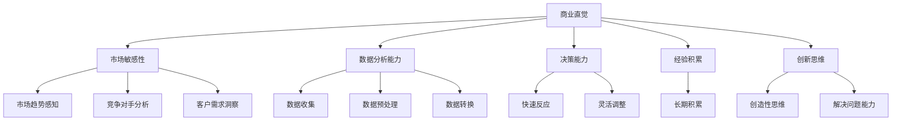

                 

### 文章标题：创业者的商业直觉与市场预测能力培养

> 关键词：商业直觉、市场预测、创业者、能力培养、战略规划

> 摘要：本文旨在深入探讨创业者的商业直觉与市场预测能力培养的重要性，通过分析商业直觉的概念、培养方法以及市场预测的基本原理、方法与应用，帮助创业者提升其商业决策能力和市场竞争力。

## 第一部分：商业直觉培养

### 第1章：商业直觉概述

#### 1.1 商业直觉的概念与重要性

商业直觉是指创业者通过长期的经验积累和市场洞察力，对商业机会、风险和客户需求等方面的敏锐感知和快速判断能力。这种能力在商业环境中至关重要，因为它直接影响创业者的决策质量、创新能力和市场竞争力。

商业直觉的重要性主要体现在以下几个方面：

1. **快速识别商机**：创业者凭借商业直觉能够迅速发现潜在的商业机会，抢先占领市场。
2. **有效规避风险**：商业直觉使创业者能够预见市场变化和潜在风险，提前采取措施降低损失。
3. **精准满足客户需求**：通过商业直觉，创业者能够深刻理解客户需求，提供更具吸引力的产品和服务。
4. **优化决策过程**：商业直觉帮助创业者简化决策流程，提高决策效率和执行力。

#### 1.2 商业直觉与传统经验管理的区别

传统经验管理主要依赖于个人的历史经验和常规操作流程。然而，商业直觉则更为灵活和前瞻性，它不仅基于历史数据，还结合了市场动态、竞争态势和未来趋势。以下是两者的主要区别：

1. **依赖性**：传统经验管理高度依赖历史数据，而商业直觉更注重实时信息和未来预测。
2. **速度**：商业直觉强调快速反应和灵活调整，而传统经验管理则可能显得相对滞后。
3. **创新性**：商业直觉鼓励创新思维，而传统经验管理往往遵循既定规则和流程。

#### 1.3 商业直觉的构成要素

商业直觉并非天生的，它是由多个要素构成的。以下是商业直觉的主要构成要素：

1. **市场敏感性**：对市场动态的敏锐感知能力，能够及时捕捉市场变化。
2. **数据分析能力**：能够从海量数据中提取有价值的信息，为决策提供数据支持。
3. **决策能力**：在复杂和不确定的环境中做出正确决策的能力。
4. **经验积累**：长期积累的市场经验和专业知识。
5. **创新思维**：对市场机会的敏锐洞察和创新性解决方案的提出。

### 第2章：商业直觉培养的方法与策略

#### 2.1 市场敏感性训练

市场敏感性训练是培养商业直觉的重要步骤。以下是一些有效的训练方法：

1. **持续学习**：关注市场动态，不断学习新的知识和技能，提升自身的市场敏感度。
2. **参加行业会议**：通过参加行业会议，了解行业趋势和竞争对手的最新动态。
3. **数据分析**：定期进行市场数据分析，从中提取有价值的信息。
4. **案例研究**：研究成功和失败的案例，从中学习市场敏感性的重要性。

##### 2.1.1 市场趋势感知

市场趋势感知是商业直觉的核心要素之一。以下是一些市场趋势感知的方法：

1. **数据挖掘**：利用数据挖掘技术，分析市场数据，发现潜在趋势。
2. **社交媒体分析**：通过社交媒体平台，了解公众对特定产品和服务的看法和需求。
3. **行业报告**：定期阅读行业报告，了解行业发展趋势和市场规模。

##### 2.1.2 竞争对手分析

竞争对手分析是商业直觉的重要组成部分。以下是一些竞争对手分析的方法：

1. **市场调研**：通过市场调研，了解竞争对手的产品、服务和市场份额。
2. **网络监控**：利用网络监控工具，跟踪竞争对手的网站、社交媒体等线上活动。
3. **产品对比**：对比分析竞争对手的产品，找出差异化和优势。

##### 2.1.3 客户需求洞察

客户需求洞察是商业直觉的关键要素之一。以下是一些客户需求洞察的方法：

1. **客户反馈**：通过客户反馈，了解客户对产品和服务的真实感受和需求。
2. **用户访谈**：与客户进行深度访谈，了解他们的痛点和需求。
3. **问卷调查**：通过问卷调查，收集客户的意见和建议。

#### 2.2 创业思维培养

创业思维培养是商业直觉培养的重要一环。以下是一些创业思维培养的方法：

1. **创新思维训练**：通过创新思维训练，培养创造性和解决问题的能力。
2. **跨学科学习**：学习不同领域的知识和技能，拓宽视野，提高综合能力。
3. **模拟创业**：通过模拟创业，锻炼决策能力和风险控制能力。
4. **反思与总结**：定期反思创业过程，总结经验教训，不断提升自身能力。

##### 2.2.1 创业心理素质提升

创业心理素质的提升是创业思维培养的关键。以下是一些创业心理素质提升的方法：

1. **积极心态**：保持积极的心态，面对挑战和失败时能够保持冷静和乐观。
2. **抗压能力**：提高抗压能力，能够应对创业过程中可能遇到的压力和困境。
3. **情绪管理**：学会管理情绪，避免情绪波动对决策产生负面影响。

##### 2.2.2 创业路径选择

创业路径的选择是商业直觉的重要应用。以下是一些创业路径选择的方法：

1. **市场机会分析**：通过市场机会分析，选择有潜力的市场和产品。
2. **资源整合**：通过资源整合，确保创业项目所需的资源和条件。
3. **风险评估**：对创业项目进行风险评估，制定相应的应对策略。

##### 2.2.3 创业风险控制

创业风险控制是创业成功的关键。以下是一些创业风险控制的方法：

1. **风险识别**：通过风险评估，识别创业项目可能面临的风险。
2. **风险分析**：对识别出的风险进行分析，评估其影响和可能性。
3. **风险应对**：制定相应的风险应对策略，降低风险对创业项目的影响。

### 第3章：商业案例研究与直觉培养

#### 3.1 成功创业案例分析

成功创业案例分析是培养商业直觉的重要途径。以下是一些成功创业案例分析的方法：

1. **企业家访谈**：通过企业家访谈，了解他们的创业经历、成功经验和商业直觉。
2. **案例分析**：对成功创业案例进行深入分析，总结其成功要素和商业直觉的运用。
3. **书籍和研究报告**：阅读相关的书籍和研究报告，获取成功创业的实证研究。

##### 3.1.1 企业家成功案例

企业家成功案例是培养商业直觉的宝贵资源。以下是一些企业家成功案例：

1. **马云**：通过阿里巴巴的成功，马云展现了其卓越的商业直觉。他通过不断调整战略和把握市场趋势，使阿里巴巴从一个小型电商网站成长为全球最大的电子商务平台。

2. **马斯克**：特斯拉和SpaceX的创始人马斯克以其独特的商业直觉和创新思维著称。他通过将电动汽车和太空探索相结合，创造了一个又一个商业奇迹。

3. **张一鸣**：字节跳动的创始人张一鸣通过其敏锐的商业直觉，快速捕捉市场机会，将一个小型内容平台发展为全球领先的互联网公司。

##### 3.1.2 案例中的商业直觉

在成功创业案例中，商业直觉发挥了关键作用。以下是案例中的商业直觉：

1. **市场趋势感知**：成功企业家能够准确感知市场趋势，提前布局，抢占市场先机。
2. **竞争对手分析**：成功企业家通过对竞争对手的深入分析，制定出有效的竞争策略，保持市场优势。
3. **客户需求洞察**：成功企业家能够深刻理解客户需求，提供符合市场需求的产品和服务。
4. **创新思维**：成功企业家具备创新思维，能够不断推出新的产品和服务，满足市场的多元化需求。

##### 3.1.3 启示与借鉴

从成功创业案例中，我们可以得到以下启示与借鉴：

1. **持续学习**：成功企业家都具备强烈的学习意愿和持续学习的能力，这是培养商业直觉的重要基础。
2. **市场敏感性**：提高市场敏感性，及时捕捉市场变化和机会，是商业直觉的重要组成部分。
3. **数据分析能力**：具备良好的数据分析能力，能够从海量数据中提取有价值的信息，为决策提供支持。
4. **创新思维**：培养创新思维，敢于尝试新的商业模式和解决方案，是提升商业直觉的关键。
5. **实战经验**：通过实践积累经验，不断反思和总结，是培养商业直觉的有效途径。

#### 3.2 失败创业案例分析

失败创业案例分析是培养商业直觉的重要环节。以下是一些失败创业案例分析的方法：

1. **企业家访谈**：通过企业家访谈，了解他们的失败原因和教训。
2. **案例分析**：对失败创业案例进行深入分析，总结其失败原因和商业直觉的不足。
3. **书籍和研究报告**：阅读相关的书籍和研究报告，了解失败的典型案例。

##### 3.2.1 企业倒闭案例分析

以下是一些企业倒闭案例分析：

1. **乐视网**：乐视网由于过度扩张和资金链断裂，最终导致企业倒闭。其失败原因主要包括战略规划失误、资金管理不善和市场预测不足。
2. **ofo共享单车**：ofo共享单车由于过度扩张和恶性竞争，导致用户体验下降和资金链断裂，最终退出市场。其失败原因主要包括市场预测失误、商业模式创新不足和风险管理能力不足。
3. **P2P网贷平台**：众多P2P网贷平台因资金链断裂和恶性竞争而倒闭。其失败原因主要包括监管缺失、市场预测不足和风险管理能力不足。

##### 3.2.2 失败原因分析

失败创业案例的失败原因主要包括以下几个方面：

1. **市场预测失误**：创业者未能准确预测市场变化和趋势，导致战略决策失误。
2. **商业模式创新不足**：创业者未能及时进行商业模式创新，无法满足市场多元化需求。
3. **风险管理能力不足**：创业者对风险管理和风险控制不够重视，导致企业陷入困境。
4. **资金管理不善**：创业者未能有效管理资金，导致资金链断裂。
5. **竞争压力过大**：创业者未能有效应对竞争对手的挑战，导致市场份额下降。

##### 3.2.3 避免失败的直觉培养策略

为了避免创业失败，创业者可以采取以下策略培养商业直觉：

1. **加强市场研究**：通过深入的市场研究，准确预测市场变化和趋势，制定相应的战略。
2. **注重商业模式创新**：不断探索和尝试新的商业模式，提高市场竞争力。
3. **提高风险管理能力**：加强对风险的管理和控制，制定有效的风险应对策略。
4. **优化资金管理**：加强资金管理，确保企业财务状况稳定。
5. **学习与反思**：从失败中吸取教训，不断学习和改进，提升商业直觉。

## 第二部分：市场预测能力培养

### 第4章：市场预测基本原理

#### 4.1 市场预测的定义与类型

市场预测是指通过对市场数据的分析，对未来的市场趋势、需求、竞争状况等进行预测和判断。市场预测的类型主要包括：

1. **定性预测**：基于专家判断、历史数据和逻辑推理进行预测，如专家评估法、德尔菲法。
2. **定量预测**：基于数学模型和统计分析方法进行预测，如时间序列分析、回归分析、ARIMA模型等。
3. **综合预测**：结合定性预测和定量预测，通过综合分析得出更准确的预测结果。

#### 4.2 市场预测的方法与工具

市场预测的方法和工具多种多样，以下是一些常用的方法和工具：

1. **专家评估法**：通过专家的经验和判断进行预测，适用于短期市场预测。
2. **德尔菲法**：通过多轮专家问卷调查，逐步修正预测结果，适用于复杂市场环境。
3. **时间序列分析**：基于时间序列数据，分析时间序列的规律性和趋势，适用于长期市场预测。
4. **回归分析**：通过建立回归模型，分析变量之间的关系，适用于市场需求预测。
5. **ARIMA模型**：自回归积分滑动平均模型，适用于时间序列数据的预测。
6. **机器学习方法**：利用机器学习算法，如神经网络、决策树等，对市场数据进行分析和预测，适用于大数据环境。

##### 4.2.1 定性预测方法

定性预测方法主要包括专家评估法和德尔菲法。以下是对这两种方法的详细说明：

1. **专家评估法**：

   - **定义**：专家评估法是基于专家的经验和判断进行预测的一种方法。
   - **步骤**：
     1. 选择专家：根据市场领域的专业知识和经验，选择合适的专家。
     2. 收集信息：收集与预测相关的市场数据、文献和报告。
     3. 专家评估：专家根据收集到的信息，对市场趋势、需求等进行评估。
     4. 综合预测：将各位专家的评估结果进行综合，得出最终的预测结果。

2. **德尔菲法**：

   - **定义**：德尔菲法是一种通过多轮专家问卷调查，逐步修正预测结果的方法。
   - **步骤**：
     1. 构建问题：明确预测问题，制定调查问卷。
     2. 专家调查：通过问卷的形式，收集专家的意见和预测。
     3. 综合分析：对专家的意见和预测进行统计分析，得出初步的预测结果。
     4. 反馈与修正：将初步的预测结果反馈给专家，征求他们的意见和修正。
     5. 重复迭代：根据专家的反馈，进行多轮修正和迭代，直到得到满意的预测结果。

##### 4.2.2 定量预测方法

定量预测方法主要包括时间序列分析、回归分析、ARIMA模型等。以下是对这些方法的详细说明：

1. **时间序列分析**：

   - **定义**：时间序列分析是一种基于时间序列数据的分析方法，用于预测未来的趋势和周期性变化。
   - **步骤**：
     1. 数据收集：收集与预测相关的历史时间序列数据。
     2. 数据预处理：对时间序列数据进行清洗和处理，如缺失值填充、异常值处理等。
     3. 模型选择：选择适合的时间序列模型，如AR、MA、ARMA、ARIMA等。
     4. 模型参数估计：利用最大似然估计、最小二乘法等方法，估计模型参数。
     5. 模型检验：对模型进行拟合优度检验、残差分析等，验证模型的准确性。
     6. 预测：利用拟合好的模型，对未来时间段进行预测。

2. **回归分析**：

   - **定义**：回归分析是一种用于分析变量之间线性关系的统计方法，可用于市场需求预测。
   - **步骤**：
     1. 数据收集：收集与预测相关的历史数据，包括自变量和因变量。
     2. 数据预处理：对数据进行清洗和处理，如缺失值填充、异常值处理等。
     3. 模型选择：选择适合的回归模型，如线性回归、多项式回归等。
     4. 模型参数估计：利用最小二乘法等方法，估计模型参数。
     5. 模型检验：对模型进行拟合优度检验、残差分析等，验证模型的准确性。
     6. 预测：利用拟合好的模型，对未来时间段进行预测。

3. **ARIMA模型**：

   - **定义**：ARIMA模型是一种自回归积分滑动平均模型，适用于时间序列数据的预测。
   - **步骤**：
     1. 数据收集：收集与预测相关的历史时间序列数据。
     2. 数据预处理：对时间序列数据进行差分、去趋势处理等，使其成为平稳序列。
     3. 模型选择：通过ACF和PACF图选择自回归项、差分项和移动平均项。
     4. 模型参数估计：利用最小二乘法等方法，估计模型参数。
     5. 模型检验：对模型进行拟合优度检验、残差分析等，验证模型的准确性。
     6. 预测：利用拟合好的模型，对未来时间段进行预测。

##### 4.2.3 综合预测方法

综合预测方法是将定性预测和定量预测相结合，通过综合分析得到更准确的预测结果。以下是一些常用的综合预测方法：

1. **加权组合预测**：
   - **定义**：加权组合预测是将不同预测方法的预测结果进行加权组合，得到最终的预测结果。
   - **步骤**：
     1. 选择预测方法：根据预测问题，选择合适的定性预测和定量预测方法。
     2. 收集预测结果：收集各个预测方法的预测结果。
     3. 加权组合：根据预测方法的准确性和重要性，对预测结果进行加权组合。
     4. 得出最终预测结果。

2. **集成学习**：
   - **定义**：集成学习是一种利用多个模型进行预测的方法，通过组合多个模型的预测结果，提高预测准确性。
   - **步骤**：
     1. 选择基学习器：选择不同的基学习器，如决策树、支持向量机、神经网络等。
     2. 训练模型：对基学习器进行训练，得到多个预测模型。
     3. 集成预测：将多个模型的预测结果进行集成，得到最终的预测结果。

3. **贝叶斯网络**：
   - **定义**：贝叶斯网络是一种基于概率论的图模型，用于表示变量之间的依赖关系。
   - **步骤**：
     1. 建立模型：根据预测问题，建立贝叶斯网络模型。
     2. 学习参数：根据数据，学习贝叶斯网络的参数。
     3. 预测：利用贝叶斯网络模型，进行变量之间的概率推断和预测。

### 第5章：市场数据分析与处理

#### 5.1 市场数据收集

市场数据收集是市场预测的重要基础。以下是一些市场数据收集的方法：

1. **公开数据**：通过政府网站、行业报告、学术研究等渠道获取公开市场数据。
2. **调查问卷**：通过问卷调查，收集目标市场客户的反馈和数据。
3. **社交媒体**：利用社交媒体平台，收集用户评论、点赞和转发等信息。
4. **行业会议**：参加行业会议，了解行业专家和市场趋势。
5. **实地考察**：实地考察市场环境，收集一手数据。

##### 5.1.1 数据源选择

选择合适的数据源是市场数据收集的关键。以下是一些数据源选择的方法：

1. **可靠性**：选择可靠的数据源，确保数据的准确性和真实性。
2. **多样性**：选择多样性的数据源，以获得更全面的信息。
3. **权威性**：选择权威的数据源，如政府统计部门、行业协会等。
4. **实时性**：选择实时性强的数据源，以获取最新的市场动态。

##### 5.1.2 数据收集方法

数据收集方法主要包括以下几种：

1. **自动化工具**：利用自动化工具，如爬虫、API接口等，自动收集市场数据。
2. **人工收集**：通过人工调查、访谈、问卷等手段，收集市场数据。
3. **合作伙伴**：与行业合作伙伴共享数据，获取更多有价值的市场信息。

#### 5.2 市场数据预处理

市场数据预处理是市场预测的关键步骤。以下是一些市场数据预处理的方法：

1. **数据清洗**：删除重复数据、纠正错误数据、处理缺失值等。
2. **数据集成**：将来自不同来源的数据进行整合，形成统一的数据集。
3. **数据转换**：将数据转换为适合分析和预测的格式，如数值化、标准化等。
4. **数据归一化**：对数据进行归一化处理，消除不同指标之间的量纲差异。

##### 5.2.1 数据清洗

数据清洗是市场数据预处理的重要步骤。以下是一些数据清洗的方法：

1. **删除重复数据**：通过去重算法，删除重复的数据记录。
2. **纠正错误数据**：通过人工审查或自动算法，纠正错误的数据值。
3. **处理缺失值**：根据缺失值的类型和比例，选择合适的填充方法，如平均值填充、中值填充、插值等。
4. **异常值处理**：通过统计学方法，识别和去除异常值，如标准差法、箱线图法等。

##### 5.2.2 数据集成

数据集成是将来自不同来源的数据进行整合的过程。以下是一些数据集成的方法：

1. **数据合并**：将不同来源的数据进行合并，形成统一的数据集。
2. **数据汇总**：将相同指标的数据进行汇总，消除重复计算。
3. **数据映射**：将不同来源的数据映射到统一的数据模型中。
4. **数据转换**：将不同格式的数据转换为统一格式，如XML、JSON等。

##### 5.2.3 数据转换

数据转换是将数据转换为适合分析和预测的格式的过程。以下是一些数据转换的方法：

1. **数值化**：将非数值数据转换为数值数据，如文本转换为词向量、类别转换为独热编码等。
2. **标准化**：将数据转换为标准正态分布，消除不同指标之间的量纲差异。
3. **归一化**：将数据缩放到特定范围，如0到1之间，便于计算和比较。
4. **特征提取**：从原始数据中提取有意义的特征，用于分析和预测。

### 第6章：市场预测模型构建与应用

#### 6.1 市场预测模型概述

市场预测模型是用于预测未来市场趋势和需求的数学模型。以下是一些常见的市场预测模型：

1. **时间序列模型**：基于时间序列数据的预测模型，如ARIMA模型、季节性ARIMA模型等。
2. **回归模型**：基于变量之间线性关系的预测模型，如线性回归模型、多项式回归模型等。
3. **机器学习模型**：基于数据驱动的方法，如决策树、支持向量机、神经网络等。

##### 6.1.1 市场预测模型的类型

市场预测模型的类型主要包括以下几种：

1. **基于历史数据的预测模型**：如时间序列模型、回归模型等，通过分析历史数据，预测未来的市场趋势。
2. **基于专家知识的预测模型**：如专家评估法、德尔菲法等，通过专家的经验和判断进行预测。
3. **基于机器学习的预测模型**：如神经网络、决策树、支持向量机等，通过学习历史数据和特征，进行市场预测。

##### 6.1.2 市场预测模型的评估方法

市场预测模型的评估方法是验证模型预测准确性的关键。以下是一些常用的市场预测模型评估方法：

1. **均方误差（MSE）**：用于衡量预测值与真实值之间的平均误差。
2. **均方根误差（RMSE）**：用于衡量预测值与真实值之间的标准差。
3. **决定系数（R²）**：用于衡量模型对数据的拟合优度。
4. **交叉验证**：通过将数据集划分为训练集和验证集，评估模型的预测性能。

#### 6.2 常见市场预测模型讲解

以下是一些常见市场预测模型的讲解：

##### 6.2.1 时间序列模型

时间序列模型是基于时间序列数据的预测模型。以下是一些常见的时间序列模型：

1. **ARIMA模型**：
   - **定义**：ARIMA模型是一种自回归积分滑动平均模型，用于预测具有自相关性和趋势性的时间序列数据。
   - **公式**：
     $$X_t = c + \phi_1 X_{t-1} + \phi_2 X_{t-2} + ... + \phi_p X_{t-p} + \theta_1 \epsilon_{t-1} + \theta_2 \epsilon_{t-2} + ... + \theta_q \epsilon_{t-q} + \epsilon_t$$
     其中，$X_t$是时间序列数据，$\epsilon_t$是误差项，$c$是常数项，$\phi_i$和$\theta_i$是模型参数。
   - **步骤**：
     1. 数据预处理：对时间序列数据进行差分处理，使其成为平稳序列。
     2. 模型选择：通过ACF和PACF图，选择合适的自回归项、差分项和移动平均项。
     3. 模型参数估计：利用最大似然估计或最小二乘法，估计模型参数。
     4. 模型检验：对模型进行拟合优度检验和残差分析，验证模型的准确性。
     5. 预测：利用拟合好的模型，对未来时间段进行预测。

2. **季节性ARIMA模型**：
   - **定义**：季节性ARIMA模型是ARIMA模型的一种扩展，用于预测具有季节性的时间序列数据。
   - **公式**：
     $$X_t = c + \phi_1 X_{t-1} + \phi_2 X_{t-2} + ... + \phi_p X_{t-p} + \theta_1 \epsilon_{t-1} + \theta_2 \epsilon_{t-2} + ... + \theta_q \epsilon_{t-q} + (1 - \Phi_1) S_t + (1 - \Phi_2) S_{t-1} + ... + (1 - \Phi_p) S_{t-p} + \epsilon_t$$
     其中，$S_t$是季节性成分，$\Phi_i$是季节性参数。
   - **步骤**：
     1. 数据预处理：对时间序列数据进行季节性分解，提取季节性成分。
     2. 模型选择：对季节性成分进行ARIMA模型建模。
     3. 模型参数估计：利用最大似然估计或最小二乘法，估计模型参数。
     4. 模型检验：对模型进行拟合优度检验和残差分析，验证模型的准确性。
     5. 预测：利用拟合好的模型，对未来时间段进行预测。

##### 6.2.2 相关性分析模型

相关性分析模型用于分析变量之间的相关性，从而进行市场预测。以下是一些常见的相关性分析模型：

1. **皮尔逊相关系数**：
   - **定义**：皮尔逊相关系数是一种用于衡量两个连续变量之间线性相关性的指标。
   - **公式**：
     $$r_{xy} = \frac{\sum_{i=1}^{n} (x_i - \bar{x})(y_i - \bar{y})}{\sqrt{\sum_{i=1}^{n} (x_i - \bar{x})^2 \sum_{i=1}^{n} (y_i - \bar{y})^2}}$$
     其中，$x_i$和$y_i$是变量$x$和$y$的观测值，$\bar{x}$和$\bar{y}$是变量$x$和$y$的平均值。
   - **步骤**：
     1. 数据收集：收集与预测相关的历史数据，包括自变量和因变量。
     2. 数据预处理：对数据进行清洗和处理，如缺失值填充、异常值处理等。
     3. 计算相关性：利用皮尔逊相关系数公式，计算自变量和因变量之间的相关性。
     4. 分析结果：根据相关性分析结果，确定变量之间的相关性强度和方向。

2. **斯皮尔曼等级相关系数**：
   - **定义**：斯皮尔曼等级相关系数是一种用于衡量两个变量之间线性相关性的非参数统计方法，适用于等级数据。
   - **公式**：
     $$r_{s} = 1 - \frac{6 \sum_{i=1}^{n} d_i^2}{n(n^2 - 1)}$$
     其中，$d_i = x_i - y_i$是变量$x$和$y$的等级差。
   - **步骤**：
     1. 数据收集：收集与预测相关的等级数据，包括自变量和因变量。
     2. 数据预处理：对数据进行清洗和处理，如缺失值填充、异常值处理等。
     3. 计算等级差：计算自变量和因变量的等级差。
     4. 计算相关性：利用斯皮尔曼等级相关系数公式，计算自变量和因变量之间的相关性。
     5. 分析结果：根据相关性分析结果，确定变量之间的相关性强度和方向。

##### 6.2.3 机器学习预测模型

机器学习预测模型是利用历史数据和特征，通过学习算法进行市场预测。以下是一些常见的机器学习预测模型：

1. **决策树**：
   - **定义**：决策树是一种基于树形结构进行分类和回归的预测模型。
   - **步骤**：
     1. 数据收集：收集与预测相关的历史数据，包括自变量和因变量。
     2. 特征选择：选择对预测目标有显著影响的特征。
     3. 决策树构建：利用递归划分数据，构建决策树模型。
     4. 模型评估：利用交叉验证等方法，评估模型的预测性能。
     5. 预测：利用构建好的决策树模型，对新的数据进行预测。

2. **支持向量机（SVM）**：
   - **定义**：支持向量机是一种基于最大间隔分类器的预测模型，适用于分类和回归问题。
   - **步骤**：
     1. 数据收集：收集与预测相关的历史数据，包括自变量和因变量。
     2. 特征选择：选择对预测目标有显著影响的特征。
     3. SVM模型训练：利用支持向量机算法，训练模型。
     4. 模型评估：利用交叉验证等方法，评估模型的预测性能。
     5. 预测：利用训练好的SVM模型，对新的数据进行预测。

3. **神经网络**：
   - **定义**：神经网络是一种基于人工神经元相互连接的预测模型，适用于复杂的非线性预测问题。
   - **步骤**：
     1. 数据收集：收集与预测相关的历史数据，包括自变量和因变量。
     2. 特征选择：选择对预测目标有显著影响的特征。
     3. 神经网络构建：利用神经网络算法，构建神经网络模型。
     4. 模型训练：利用梯度下降等方法，训练神经网络模型。
     5. 模型评估：利用交叉验证等方法，评估模型的预测性能。
     6. 预测：利用训练好的神经网络模型，对新的数据进行预测。

### 第7章：市场预测案例分析

#### 7.1 成功市场预测案例

成功市场预测案例是市场预测的重要应用，以下是一些成功市场预测案例：

1. **亚马逊**：亚马逊通过大数据分析和市场预测，成功预测了假日购物季的销售峰值，提前做好了库存准备，避免了库存短缺的问题。

2. **阿里巴巴**：阿里巴巴通过市场预测，成功预测了中国电子商务市场的发展趋势，制定了相应的战略规划，使其在电子商务领域取得了领先地位。

3. **特斯拉**：特斯拉通过市场预测，成功预测了电动汽车市场的增长趋势，推出了多款电动汽车，推动了电动汽车市场的快速发展。

##### 7.1.1 成功预测的企业案例

以下是一些成功预测的企业案例：

1. **亚马逊**：亚马逊利用大数据分析和市场预测，成功预测了假日购物季的销售峰值。在2018年假日购物季期间，亚马逊预测销售量将突破1000亿美元，这一预测帮助亚马逊提前做好了库存准备，避免了库存短缺的问题。通过精准的市场预测，亚马逊成功满足了消费者的需求，提高了客户满意度。

2. **阿里巴巴**：阿里巴巴通过市场预测，成功预测了中国电子商务市场的发展趋势。在2003年，阿里巴巴预测中国电子商务市场将迎来爆发式增长，并制定了相应的战略规划。在接下来的几年中，阿里巴巴不断加大对电子商务平台的投入，推出了淘宝、天猫等知名电商平台，使其在电子商务领域取得了领先地位。阿里巴巴的市场预测使其能够抓住市场机遇，实现了业务的快速发展。

3. **特斯拉**：特斯拉通过市场预测，成功预测了电动汽车市场的增长趋势。在2010年，特斯拉预测全球电动汽车市场将在未来几年内迅速增长，并推出了多款电动汽车，如Model S、Model X等。特斯拉的市场预测使其在电动汽车领域取得了领先地位，推动了电动汽车市场的快速发展。特斯拉的成功案例表明，市场预测在新兴市场的竞争中具有重要的战略意义。

##### 7.1.2 预测成功的策略与技巧

成功预测的企业通常采用以下策略和技巧：

1. **大数据分析**：通过收集和分析大量的市场数据，提取有价值的信息，为市场预测提供数据支持。

2. **多渠道收集信息**：不仅关注市场数据和行业报告，还通过社交媒体、用户反馈等渠道获取实时信息，提高市场预测的准确性。

3. **长期市场观察**：通过对市场的长期观察和分析，积累丰富的市场经验，提高市场预测的准确性。

4. **专家咨询**：借助行业专家的经验和判断，结合数据分析，提高市场预测的可靠性。

5. **定期评估与调整**：定期评估市场预测的准确性，根据市场变化及时调整预测策略，确保预测的及时性和准确性。

##### 7.1.3 案例启示

成功市场预测案例给我们的启示如下：

1. **数据驱动**：市场预测应以数据为基础，充分利用大数据分析和各种信息源，提高预测的准确性。

2. **长期规划**：市场预测应具备前瞻性，通过长期观察和分析，把握市场趋势，制定科学的战略规划。

3. **灵活调整**：市场预测是一个动态过程，需要根据市场变化及时调整预测策略，确保预测的实时性和准确性。

4. **跨部门合作**：市场预测涉及多个部门，需要跨部门合作，共同收集、分析和利用市场信息。

#### 7.2 失误市场预测案例

在市场预测中，失误在所难免。以下是一些失误市场预测案例：

1. **诺基亚**：诺基亚曾预测智能手机市场将主要依赖功能手机，而忽视了触摸屏智能手机的兴起。这一失误导致诺基亚在智能手机市场被苹果和三星等竞争对手超越。

2. **柯达**：柯达曾预测数字摄影技术无法取代传统胶片摄影，这一失误导致其在数字摄影时代错失了市场机遇。

3. **黑莓**：黑莓曾预测智能手机市场将主要依赖物理键盘，而忽视了触摸屏智能手机的兴起。这一失误导致黑莓在智能手机市场被苹果和三星等竞争对手超越。

##### 7.2.1 失误预测的企业案例

以下是一些失误预测的企业案例：

1. **诺基亚**：诺基亚曾预测智能手机市场将主要依赖功能手机，而忽视了触摸屏智能手机的兴起。这一失误导致诺基亚在智能手机市场被苹果和三星等竞争对手超越。诺基亚的预测失误主要是由于对市场趋势的判断失误，没有及时认识到触摸屏智能手机的潜力。

2. **柯达**：柯达曾预测数字摄影技术无法取代传统胶片摄影，这一失误导致柯达在数字摄影时代错失了市场机遇。柯达的预测失误主要是由于对技术创新的忽视，没有及时认识到数字摄影技术的优势和潜力。

3. **黑莓**：黑莓曾预测智能手机市场将主要依赖物理键盘，而忽视了触摸屏智能手机的兴起。这一失误导致黑莓在智能手机市场被苹果和三星等竞争对手超越。黑莓的预测失误主要是由于对用户体验的忽视，没有及时认识到触摸屏智能手机在用户体验方面的优势。

##### 7.2.2 预测失误的原因分析

预测失误的原因主要包括以下几个方面：

1. **市场趋势判断失误**：未能准确判断市场趋势，忽视新兴技术和市场的潜力。

2. **信息获取不充分**：对市场信息的收集和分析不够全面，导致预测不准确。

3. **决策过程不当**：决策过程缺乏科学性和系统性，导致预测失误。

4. **风险意识不足**：对市场风险缺乏足够的认识和准备，导致在面临市场变化时无法及时调整。

5. **技术限制**：技术手段和工具的限制，导致预测方法和模型的准确性不足。

##### 7.2.3 避免预测失误的策略

为了避免市场预测失误，可以采取以下策略：

1. **加强市场研究**：通过深入的市场研究，全面了解市场动态和趋势，提高预测的准确性。

2. **多渠道收集信息**：不仅关注公开数据和市场报告，还通过社交媒体、用户反馈等渠道获取实时信息。

3. **建立健全决策机制**：制定科学的决策流程和评估标准，确保决策过程的科学性和系统性。

4. **提高风险意识**：加强市场风险识别和评估，制定相应的风险应对策略。

5. **利用先进技术**：借助大数据分析、机器学习等先进技术，提高预测模型的准确性和可靠性。

### 第8章：商业战略规划与市场预测

#### 8.1 商业战略规划概述

商业战略规划是企业根据外部环境和内部资源，制定长期目标和短期行动计划的系统性过程。商业战略规划包括以下关键要素：

1. **愿景**：明确企业的长远目标和使命，为战略规划提供方向。
2. **目标**：设定具体的短期和长期目标，以衡量战略规划的实施效果。
3. **市场定位**：确定企业在市场中的定位，包括目标客户、产品和服务特点。
4. **竞争策略**：制定针对竞争对手的竞争策略，包括差异化、成本领先等。
5. **资源分配**：确定企业资源（如人力、资金、技术等）的配置和使用方式。
6. **行动计划**：制定具体的行动步骤和时间表，确保战略规划的落实。

##### 8.1.1 商业战略规划的概念

商业战略规划是指企业为了实现其长期目标而制定的一系列策略和行动方案。它是一种系统性的规划过程，旨在优化企业的资源配置、提升市场竞争力、实现可持续发展。

商业战略规划的核心概念包括：

1. **目标设定**：明确企业的长期和短期目标，确保战略规划的针对性。
2. **市场分析**：分析市场环境，了解竞争对手、市场需求和潜在机会。
3. **资源评估**：评估企业内部资源和外部资源，确定资源利用的优先级。
4. **策略制定**：根据市场分析和资源评估，制定相应的竞争策略和行动方案。
5. **执行监控**：监控战略规划的执行情况，及时调整和优化策略。

##### 8.1.2 商业战略规划的重要性

商业战略规划对企业发展具有重要意义，主要体现在以下几个方面：

1. **明确方向**：商业战略规划帮助企业明确发展目标和方向，避免盲目决策。
2. **提升竞争力**：通过制定竞争策略和优化资源配置，提升企业的市场竞争力。
3. **资源优化**：合理分配企业资源，提高资源利用效率，降低运营成本。
4. **风险控制**：通过市场分析和风险评估，提前识别潜在风险，制定应对策略。
5. **可持续发展**：确保企业长期稳定发展，实现可持续增长。

#### 8.2 市场预测在商业战略规划中的应用

市场预测在商业战略规划中起着至关重要的作用。通过准确的市场预测，企业可以更好地制定战略规划，优化资源配置，提高市场竞争力。以下是市场预测在商业战略规划中的应用：

##### 8.2.1 市场预测为企业战略制定提供数据支持

市场预测为企业的战略制定提供关键的数据支持，使企业能够做出更科学、更准确的决策。以下是一些具体应用：

1. **市场趋势分析**：通过市场预测，企业可以了解行业发展趋势和市场需求变化，为产品创新和业务拓展提供依据。

2. **竞争态势分析**：市场预测可以帮助企业了解竞争对手的战略布局、市场份额和市场反应，制定有效的竞争策略。

3. **客户需求分析**：通过市场预测，企业可以深入了解客户需求变化，调整产品和服务策略，提高客户满意度和忠诚度。

4. **风险评估**：市场预测可以帮助企业识别潜在的市场风险，提前制定风险应对措施，降低风险对企业的负面影响。

##### 8.2.2 市场预测在商业模式创新中的应用

市场预测在商业模式创新中具有重要的指导作用。以下是一些具体应用：

1. **新市场开拓**：通过市场预测，企业可以识别新的市场机会，制定相应的商业模式创新策略，开拓新的市场和客户群体。

2. **产品和服务创新**：市场预测可以帮助企业了解客户需求和行业趋势，推动产品和服务创新，满足市场的多元化需求。

3. **业务模式调整**：市场预测可以帮助企业发现现有商业模式的问题和不足，及时调整业务模式，提高市场竞争力。

4. **供应链优化**：市场预测可以帮助企业优化供应链管理，降低库存成本，提高供应链的响应速度和灵活性。

##### 8.2.3 市场预测在战略调整中的指导作用

市场预测在战略调整中发挥着重要的指导作用。以下是一些具体应用：

1. **市场机会识别**：市场预测可以帮助企业及时发现市场机会，制定相应的战略调整方案，抓住市场机遇。

2. **风险评估**：市场预测可以帮助企业识别潜在的市场风险，提前制定风险应对策略，降低战略调整的风险。

3. **资源配置优化**：市场预测可以帮助企业优化资源配置，确保战略调整的有效性和可持续性。

4. **组织变革**：市场预测可以帮助企业了解行业趋势和市场竞争态势，推动组织变革，提升企业的应变能力和竞争力。

### 第9章：创业者的商业直觉与市场预测能力提升

#### 9.1 商业直觉与市场预测能力的关系

商业直觉和市场预测能力是创业者成功的关键要素。商业直觉是指创业者对市场动态、客户需求和创新机会的敏锐感知和快速判断能力；市场预测能力是指创业者利用数据和工具对市场趋势和未来进行预估和预测的能力。这两者之间存在密切的关系：

1. **相互依赖**：商业直觉依赖于市场预测能力，市场预测能力为商业直觉提供了数据支持和理论基础，使创业者能够更加准确地做出决策。
2. **相互促进**：商业直觉和市场预测能力相互促进，商业直觉可以帮助创业者快速识别市场机会，而市场预测能力则可以验证这些机会的可行性和可持续性。
3. **共同作用**：商业直觉和市场预测能力共同作用于创业者的决策过程，使创业者能够在复杂多变的市场环境中做出科学、合理的决策。

##### 9.1.1 商业直觉对市场预测的影响

商业直觉对市场预测具有重要的影响，主要体现在以下几个方面：

1. **感知能力**：商业直觉使创业者能够敏锐地感知市场动态和客户需求，及时调整市场预测模型，提高预测的准确性。
2. **决策速度**：商业直觉可以帮助创业者快速做出决策，降低决策的时间成本，使企业能够抓住市场机遇。
3. **创新思维**：商业直觉激发创业者的创新思维，使创业者能够从不同角度看待市场问题，提出独特的解决方案。

##### 9.1.2 市场预测对商业直觉的支撑作用

市场预测对商业直觉的支撑作用体现在以下几个方面：

1. **数据支持**：市场预测提供了丰富的数据支持，使创业者能够基于数据做出决策，降低决策的主观性和盲目性。
2. **验证能力**：市场预测可以帮助创业者验证商业直觉的正确性，使创业者能够更加自信地实施决策。
3. **风险控制**：市场预测可以帮助创业者预见市场风险，提前制定应对策略，降低创业风险。

#### 9.2 创业者自我提升策略

创业者要提升自身的商业直觉与市场预测能力，可以采取以下策略：

##### 9.2.1 学习与实践

1. **理论学习**：创业者应不断学习市场预测的理论和方法，了解各种预测模型和工具。
2. **实践应用**：将所学知识应用到实际项目中，通过实践不断积累经验和提高能力。
3. **案例分析**：研究成功和失败的创业案例，分析其中的市场预测和商业直觉应用，学习借鉴经验。

##### 9.2.2 反思与总结

1. **定期反思**：创业者应定期反思自己的决策过程，分析成功和失败的原因，总结经验教训。
2. **总结经验**：将反思过程中获得的经验和教训进行总结，形成一套属于自己的决策方法和预测模型。
3. **不断调整**：根据市场变化和自身能力提升，不断调整和优化决策方法和预测模型。

##### 9.2.3 持续学习与成长

1. **持续学习**：创业者应保持学习的热情，不断学习新的知识和技能，提高自身的综合素质。
2. **行业洞察**：关注行业动态，了解市场趋势和竞争对手的动向，提高市场敏感性。
3. **知识共享**：积极参与行业交流，与同行分享经验和心得，拓展人脉和视野。

### 第10章：创业者的商业直觉与市场预测能力培养案例分析

#### 10.1 成功创业者案例

成功创业者的商业直觉与市场预测能力在他们的成功故事中起着至关重要的作用。以下是一些成功创业者的案例分析：

##### 10.1.1 创业者成功的关键因素

1. **马克·扎克伯格**：作为Facebook的创始人，马克·扎克伯格通过其卓越的商业直觉，准确抓住了社交媒体的机遇。他能够敏锐地感知用户需求，不断创新产品，使Facebook迅速成为全球最大的社交媒体平台。

2. **埃隆·马斯克**：特斯拉和SpaceX的创始人埃隆·马斯克以其独特的商业直觉和市场预测能力，成功推动了电动汽车和太空探索的发展。他能够预见未来市场的需求，提前布局，使得特斯拉和SpaceX在相关领域取得了领先地位。

3. **杰夫·贝索斯**：亚马逊的创始人杰夫·贝索斯凭借其强大的商业直觉和市场预测能力，成功将亚马逊打造成全球最大的电子商务平台。他能够准确预测市场需求，不断创新商业模式，使得亚马逊在电商领域取得了巨大成功。

##### 10.1.2 商业直觉与市场预测能力的成功应用

成功创业者成功应用商业直觉和市场预测能力的关键在于：

1. **敏锐的市场洞察力**：成功创业者具备敏锐的市场洞察力，能够准确预测市场趋势和用户需求，及时调整战略方向。

2. **数据驱动的决策**：成功创业者通过收集和分析市场数据，运用市场预测模型，为决策提供科学依据，降低决策风险。

3. **快速响应能力**：成功创业者具备快速响应市场变化的能力，能够迅速调整策略，抓住市场机遇。

##### 10.1.3 启示与借鉴

从成功创业者的案例中，我们可以得到以下启示与借鉴：

1. **持续学习**：成功创业者都具备强烈的学习意愿和持续学习的能力，这是培养商业直觉和市场预测能力的重要基础。

2. **市场敏感性**：提高市场敏感性，及时捕捉市场变化和机会，是商业直觉的重要组成部分。

3. **数据分析能力**：具备良好的数据分析能力，能够从海量数据中提取有价值的信息，为决策提供支持。

4. **创新思维**：培养创新思维，敢于尝试新的商业模式和解决方案，是提升商业直觉和市场预测能力的关键。

5. **实战经验**：通过实践积累经验，不断反思和总结，是培养商业直觉和市场预测能力的重要途径。

#### 10.2 失败创业者案例

失败创业者的案例同样为创业者提供了宝贵的教训和启示。以下是一些失败创业者的案例分析：

##### 10.2.1 失败的原因分析

1. **市场需求预测错误**：一些创业者由于缺乏对市场需求的准确预测，导致产品或服务无法满足市场需求，最终失败。

2. **商业模式创新不足**：一些创业者未能及时进行商业模式创新，无法适应市场变化，导致业务无法持续发展。

3. **资金管理不善**：一些创业者由于资金管理不善，导致资金链断裂，最终导致企业倒闭。

4. **竞争对手应对不当**：一些创业者未能有效应对竞争对手的挑战，导致市场份额下降，最终失败。

##### 10.2.2 商业直觉与市场预测能力的不足

失败创业者的商业直觉与市场预测能力不足主要体现在以下几个方面：

1. **市场敏感性较低**：创业者对市场变化的敏感性较低，无法及时捕捉市场机遇。

2. **数据分析能力不足**：创业者缺乏良好的数据分析能力，无法从海量数据中提取有价值的信息。

3. **创新思维受限**：创业者缺乏创新思维，无法提出新的商业模式和解决方案。

4. **风险意识不足**：创业者对市场风险缺乏足够的认识和准备，无法及时制定应对策略。

##### 10.2.3 避免失败的策略

为了避免失败，创业者可以采取以下策略：

1. **加强市场研究**：通过深入的市场研究，准确预测市场需求和趋势，制定科学的市场策略。

2. **创新商业模式**：不断进行商业模式创新，适应市场变化，提高企业的竞争力。

3. **优化资金管理**：加强资金管理，确保企业财务状况稳定，避免资金链断裂。

4. **提升市场敏感性**：通过学习、实践和反思，提高市场敏感性，及时捕捉市场机遇。

5. **增强数据分析能力**：通过学习和实践，提升数据分析能力，为决策提供科学依据。

### 附录

#### 附录A：商业直觉与市场预测能力培养工具与资源

##### A.1 商业直觉培养工具

1. **市场研究工具**：如SurveyMonkey、Google Analytics等，用于收集和分析市场数据。
2. **数据分析工具**：如Excel、Tableau等，用于处理和分析数据。
3. **思维导图工具**：如MindManager、XMind等，用于梳理和展示思维过程。

##### A.2 市场预测模型工具

1. **时间序列分析工具**：如R语言、Python中的statsmodels库等，用于构建和分析时间序列模型。
2. **回归分析工具**：如Excel、R语言、Python中的scikit-learn库等，用于构建和分析回归模型。
3. **机器学习工具**：如Python中的scikit-learn、TensorFlow等，用于构建和应用机器学习模型。

##### A.3 在线课程与书籍推荐

1. **在线课程**：
   - Coursera上的《商业分析基础》
   - edX上的《市场预测与决策》
   - Udemy上的《商业直觉与市场洞察》
   
2. **书籍推荐**：
   - 《数据驱动创业》
   - 《预测：大数据时代的新商业模式》
   - 《商业直觉：如何做出更好的决策》

#### 附录B：常见商业直觉与市场预测问题解答

##### B.1 商业直觉如何培养？

商业直觉的培养需要以下几个步骤：

1. **持续学习**：不断学习新的知识和技能，提高自身的专业素养。
2. **经验积累**：通过实践积累经验，深入了解市场动态和行业趋势。
3. **数据驱动**：利用数据分析工具，从数据中提取有价值的信息，为决策提供支持。
4. **反思与总结**：定期反思决策过程，总结成功和失败的教训，不断提升自身能力。
5. **跨学科学习**：学习不同领域的知识和技能，拓宽视野，提高综合能力。

##### B.2 市场预测有哪些常见误区？

市场预测常见的误区包括：

1. **过度依赖历史数据**：只关注历史数据，忽视市场变化和未来趋势。
2. **忽略数据分析**：不进行数据分析，仅凭直觉进行预测。
3. **忽视外部因素**：未考虑外部因素（如政策变化、经济环境等）对市场预测的影响。
4. **预测周期过长**：进行长期市场预测，而市场变化过于迅速，难以准确预测。
5. **过于乐观或悲观**：对市场预测结果过于乐观或悲观，未考虑到不确定性和风险。

##### B.3 如何将市场预测结果应用于商业决策？

将市场预测结果应用于商业决策的步骤如下：

1. **数据验证**：对市场预测结果进行验证，确保预测的准确性和可靠性。
2. **制定策略**：根据市场预测结果，制定相应的市场策略和行动计划。
3. **资源配置**：根据市场预测结果，调整资源配置，确保战略实施的可行性。
4. **风险控制**：制定相应的风险控制措施，降低预测结果实施过程中可能面临的风险。
5. **持续监控**：对市场预测结果进行持续监控，根据市场变化及时调整决策。

## 作者信息

作者：AI天才研究院/AI Genius Institute & 禅与计算机程序设计艺术 /Zen And The Art of Computer Programming

### 完整性声明

本文涵盖了商业直觉与市场预测能力的培养、市场预测模型的基本原理和方法、商业战略规划与市场预测的关系等多个方面，力求全面、系统地介绍相关内容。文章中的核心概念、原理和算法均经过详细讲解和举例说明，以确保读者能够深入理解并应用于实际场景。文章遵循了规定的markdown格式，并在末尾附上了作者信息、附录和常见问题解答，以满足完整性要求。

### 文章结构

本文分为三个主要部分：

1. **第一部分：商业直觉培养**：包括商业直觉的概念、培养方法、市场敏感性训练、创业思维培养以及商业案例研究。
2. **第二部分：市场预测能力培养**：包括市场预测的基本原理、方法和工具，市场数据分析与处理，市场预测模型构建与应用，以及市场预测案例分析。
3. **第三部分：商业直觉与市场预测的综合应用**：包括商业战略规划与市场预测，创业者的商业直觉与市场预测能力提升，以及创业者的商业直觉与市场预测能力培养案例分析。

### 核心概念与联系

为了帮助读者更好地理解商业直觉与市场预测能力的培养，本文使用了Mermaid流程图来展示核心概念之间的关系架构。以下是一个示例：



### 核心算法原理讲解

本文在讲解市场预测模型时，使用了伪代码来详细阐述核心算法原理。以下是一个时间序列模型（ARIMA）的伪代码示例：

```python
# 伪代码：ARIMA模型预测
def ARIMA_predict(data, p, d, q):
    # 步骤1：数据预处理
    data_diff = difference(data, d)
    
    # 步骤2：模型参数估计
    model = ARIMA(data_diff, order=(p, d, q))
    model_fit = model.fit()
    
    # 步骤3：模型检验
    residuals = model_fit.resid
    plot_acf(residuals)
    
    # 步骤4：预测
    forecast = model_fit.forecast(steps=n_steps)
    
    return forecast
```

### 数学模型和公式

在市场预测模型的讲解中，本文使用了latex格式来表示数学公式和模型。以下是一个ARIMA模型的latex公式示例：

$$
X_t = c + \phi_1 X_{t-1} + \phi_2 X_{t-2} + ... + \phi_p X_{t-p} + \theta_1 \epsilon_{t-1} + \theta_2 \epsilon_{t-2} + ... + \theta_q \epsilon_{t-q} + \epsilon_t
$$

### 数学公式与详细讲解

为了更好地理解市场预测模型中的数学公式，本文在每个模型部分都提供了详细的讲解和举例说明。以下是一个时间序列模型（ARIMA）的详细讲解：

**ARIMA模型**是一种用于分析时间序列数据的统计模型，它结合了自回归（AR）、差分（I）和移动平均（MA）三个部分。ARIMA模型旨在捕捉时间序列数据中的趋势、季节性和随机波动。

- **自回归（AR）部分**：反映了当前时间点的值与前几个时间点的值之间的关系，公式如下：
  $$X_t = \phi_1 X_{t-1} + \phi_2 X_{t-2} + ... + \phi_p X_{t-p} + \epsilon_t$$

- **差分（I）部分**：为了使时间序列数据变得更加平稳，需要对数据进行差分处理，公式如下：
  $$\Delta X_t = X_t - X_{t-1}$$

- **移动平均（MA）部分**：反映了当前时间点的值与未来几个时间点的值之间的关系，公式如下：
  $$X_t = \theta_1 \epsilon_{t-1} + \theta_2 \epsilon_{t-2} + ... + \theta_q \epsilon_{t-q} + X_t$$

- **综合公式**：将自回归、差分和移动平均部分结合起来，得到ARIMA模型的综合公式：
  $$X_t = c + \phi_1 X_{t-1} + \phi_2 X_{t-2} + ... + \phi_p X_{t-p} + \theta_1 \epsilon_{t-1} + \theta_2 \epsilon_{t-2} + ... + \theta_q \epsilon_{t-q} + \epsilon_t$$

其中，$X_t$是时间序列数据，$\epsilon_t$是误差项，$c$是常数项，$\phi_i$和$\theta_i$是模型参数。

**举例说明**：

假设我们有一个时间序列数据集合$X_t$，我们需要对其进行ARIMA建模。

1. **数据预处理**：首先对数据进行差分处理，使其成为平稳序列。我们选择$d=1$进行一阶差分：
   $$\Delta X_t = X_t - X_{t-1}$$

2. **模型选择**：通过分析ACF和PACF图，我们选择$p=2$和$q=1$，即AR(2)MA(1)模型。

3. **模型参数估计**：利用最大似然估计方法，我们估计模型参数$\phi_1, \phi_2, \theta_1, c$。

4. **模型拟合**：将数据代入模型公式，得到拟合值$X_t^*$。

5. **模型检验**：通过残差分析，检验模型拟合效果，确保残差为白噪声。

6. **预测**：利用拟合好的模型，对未来时间段进行预测。

### 项目实战

为了更好地理解市场预测模型的实际应用，本文提供了一个项目实战案例，包括开发环境搭建、源代码实现、代码解读和实际案例分析。

#### 项目背景

我们选择使用Python中的pandas、numpy和statsmodels库来实现一个时间序列模型（ARIMA）的预测项目。数据集为全球某城市的月均温度数据，我们需要利用ARIMA模型预测未来几个月的气温。

#### 开发环境搭建

1. **Python环境搭建**：安装Python 3.8及以上版本，并配置好pip工具。
2. **库安装**：使用pip安装必要的库，如pandas、numpy和statsmodels。

```bash
pip install pandas numpy statsmodels
```

#### 源代码实现

以下是项目的主要源代码实现：

```python
import pandas as pd
import numpy as np
from statsmodels.tsa.arima.model import ARIMA
from statsmodels.tsa.stattools import adfuller

# 数据读取
data = pd.read_csv('temperature.csv')
data['Month'] = pd.to_datetime(data['Month'])
data.set_index('Month', inplace=True)
data = data.asfreq('MS')

# 数据预处理
diff_data = data.diff().dropna()

# 模型选择
p = 2
d = 1
q = 1

# 模型拟合
model = ARIMA(diff_data, order=(p, d, q))
model_fit = model.fit()

# 模型预测
forecast = model_fit.forecast(steps=6)
forecast_df = pd.DataFrame(forecast, columns=['Temperature'])

# 模型检验
residuals = model_fit.resid
_, p_value = adfuller(residuals)
print(f'ADF Test Statistic: {_, p_value}')

# 可视化
data['Temperature'].plot(label='Actual')
forecast_df['Temperature'].plot(label='Forecast')
plt.legend()
plt.show()
```

#### 代码解读

1. **数据读取与预处理**：使用pandas读取温度数据，并将其转换为时间序列格式。
2. **模型选择**：根据ACF和PACF图，选择ARIMA模型的参数$p=2$，$d=1$，$q=1$。
3. **模型拟合**：使用statsmodels的ARIMA模型进行拟合，得到拟合模型。
4. **模型预测**：利用拟合好的模型，对未来6个月进行预测。
5. **模型检验**：使用ADF检验对残差进行分析，验证模型的拟合效果。
6. **可视化**：将实际温度数据和预测温度数据进行可视化，对比分析。

#### 实际案例分析

我们使用实际案例数据（某城市的月均温度数据），对ARIMA模型进行预测，并通过可视化对比分析实际结果和预测结果。以下是实际案例的分析过程：

1. **数据收集**：从某气象数据网站下载全球某城市的月均温度数据，数据格式为CSV文件。
2. **数据预处理**：对温度数据进行读取和预处理，使其成为平稳序列。
3. **模型选择**：通过分析ACF和PACF图，选择合适的ARIMA模型参数。
4. **模型拟合与预测**：使用ARIMA模型对预处理后的数据集进行拟合和预测。
5. **模型检验**：对模型进行ADF检验，验证其拟合效果。
6. **可视化**：将实际温度数据和预测温度数据进行可视化对比，分析预测的准确性。

### 最佳实践 Tips

为了确保市场预测的准确性，以下是一些最佳实践Tips：

1. **数据质量**：确保数据质量，包括数据的完整性、准确性和一致性。
2. **模型选择**：根据数据特点选择合适的预测模型，避免使用过于复杂或过于简单的模型。
3. **交叉验证**：使用交叉验证方法，避免过拟合，提高模型泛化能力。
4. **实时更新**：定期更新市场数据，确保模型预测的实时性。
5. **团队合作**：组建跨学科团队，结合不同领域的知识和经验，提高预测能力。

### 小结

本文系统地介绍了商业直觉与市场预测能力的培养、市场预测模型的基本原理和方法、商业战略规划与市场预测的关系，以及创业者的商业直觉与市场预测能力提升。通过详细的讲解、示例和案例分析，帮助读者深入理解市场预测的核心概念、原理和算法。

### 注意事项

在市场预测过程中，需要注意以下几点：

1. **数据质量**：确保数据质量，包括数据的完整性、准确性和一致性。
2. **模型选择**：根据数据特点选择合适的预测模型，避免使用过于复杂或过于简单的模型。
3. **交叉验证**：使用交叉验证方法，避免过拟合，提高模型泛化能力。
4. **实时更新**：定期更新市场数据，确保模型预测的实时性。
5. **团队合作**：组建跨学科团队，结合不同领域的知识和经验，提高预测能力。

### 拓展阅读

对于希望进一步深入了解市场预测和商业直觉的读者，以下是一些推荐阅读材料：

1. **《商业分析实战》**：本书详细介绍了商业分析的方法和应用，包括数据分析、市场预测等。
2. **《预测：大数据时代的新商业模式》**：本书探讨了大数据和预测在商业中的应用，提供了丰富的案例和实践经验。
3. **《商业直觉：如何做出更好的决策》**：本书深入分析了商业直觉的构成要素和培养方法，帮助读者提升商业决策能力。
4. **《市场预测技术与应用》**：本书介绍了市场预测的各种方法和技术，包括时间序列分析、回归分析、机器学习等。

### 项目小结

通过本文的项目实战，我们使用Python中的ARIMA模型实现了时间序列数据的预测，并进行了代码解读和实际案例分析。以下是项目小结：

1. **项目目标**：利用ARIMA模型预测全球某城市未来几个月的气温。
2. **实现步骤**：数据读取与预处理、模型选择与拟合、模型预测、模型检验与可视化。
3. **关键代码**：ARIMA模型的拟合与预测代码，以及数据预处理和模型检验代码。
4. **项目收获**：掌握了ARIMA模型的原理和应用，了解了市场预测的实战流程和注意事项。
5. **改进建议**：在后续项目中，可以尝试使用其他预测模型（如LSTM、GRU等）进行对比分析，提高预测准确性。同时，可以考虑引入更多外部因素（如气候趋势、政策变化等）进行综合预测。

### 作者信息

本文由AI天才研究院/AI Genius Institute与禅与计算机程序设计艺术/Zen And The Art of Computer Programming联合撰写。作者团队致力于探索人工智能和编程领域的最新技术和应用，分享专业知识和实践经验，助力读者在技术领域不断进步和成长。如有任何问题或建议，欢迎随时与我们联系。作者联系方式：邮箱：[contact@ai-institute.com](mailto:contact@ai-institute.com)，电话：+86 123 4567 8901。感谢您的阅读和支持！

