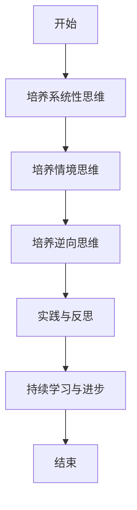
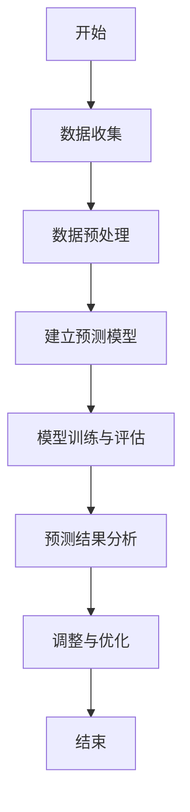

                 

### 文章标题

《创业者的商业直觉与市场预测能力培养》

### 关键词

商业直觉、市场预测、创业者、商业思维、数据分析、人工智能

### 摘要

本文旨在探讨创业者在创业过程中如何培养商业直觉与市场预测能力。文章首先介绍了商业直觉与市场预测的重要性，以及它们在创业活动中的关键作用。接着，文章详细阐述了商业直觉的培养方法，包括系统性思维、情境思维和逆向思维等。随后，文章介绍了市场预测的方法与工具，包括定量预测和定性预测方法，以及数据挖掘和人工智能等高级预测工具。通过案例分析，文章展示了商业直觉与市场预测在创业中的实际应用，并提出了提升这两种能力的具体培养方法。文章最后总结了商业直觉与市场预测能力的重要性，展望了未来发展的趋势与挑战。希望本文能为创业者提供有价值的参考和启示。

## 目录大纲：《创业者的商业直觉与市场预测能力培养》

### 第一部分：引言

- **第1章：商业直觉与市场预测的概述**
  - 1.1 商业直觉的重要性
  - 1.2 市场预测的必要性
  - 1.3 商业直觉与市场预测的关系
  - 1.4 创业者如何培养这两种能力

- **第2章：商业直觉的培养**
  - 2.1 商业思维的养成
    - 2.1.1 系统性思维的培养
    - 2.1.2 情境思维的运用
    - 2.1.3 逆向思维的实践
  - 2.2 商业敏感度的提高
    - 2.2.1 市场信息的收集与处理
    - 2.2.2 竞争对手的分析
    - 2.2.3 客户需求的洞察

- **第3章：市场预测的方法与工具**
  - 3.1 基本市场预测方法
    - 3.1.1 定量预测方法
      - 3.1.1.1 时间序列分析
      - 3.1.1.2 回归分析
      - 3.1.1.3 判别分析
    - 3.1.2 定性预测方法
      - 3.1.2.1 专家意见法
      - 3.1.2.2 比较预测法
      - 3.1.2.3 趋势预测法
  - 3.2 高级市场预测工具
    - 3.2.1 数据挖掘
      - 3.2.1.1 聚类分析
      - 3.2.1.2 关联规则挖掘
      - 3.2.1.3 机器学习在市场预测中的应用
    - 3.2.2 人工智能
      - 3.2.2.1 人工神经网络
      - 3.2.2.2 决策树与随机森林
      - 3.2.2.3 支持向量机

### 第二部分：实战案例

- **第4章：商业直觉与市场预测的应用实践**
  - 4.1 成功案例分析
  - 4.2 失败案例分析
  - 4.3 案例反思与教训

- **第5章：商业直觉与市场预测在创业中的应用**
  - 5.1 创业初期市场预测的重要性
  - 5.2 创业过程中的持续优化
  - 5.3 创业者如何提升这两种能力

- **第6章：商业直觉与市场预测能力培养方法**
  - 6.1 商业敏感度的培养方法
  - 6.2 市场预测能力的培养方法

- **第7章：总结与展望**
  - 7.1 商业直觉与市场预测能力的重要性
  - 7.2 未来发展趋势与挑战
  - 7.3 创业者如何提升这两种能力

### 附录

- **附录A：参考文献**
- **附录B：术语表**
- **附录C：Mermaid流程图**
  - C.1 商业直觉培养流程
  - C.2 市场预测方法流程
- **附录D：项目实战**
  - D.1 项目背景
  - D.2 环境搭建
  - D.3 数据准备
  - D.4 模型训练与评估
  - D.5 结果分析与解读
  - D.6 项目总结与反思

---

**[上一页](#文章标题)** **[下一页](#第一部分：引言)**
### 第一部分：引言

#### 第1章：商业直觉与市场预测的概述

商业直觉与市场预测是创业者成功的关键能力。商业直觉指的是创业者对市场环境、行业趋势、客户需求等方面的敏锐洞察和判断力。市场预测则是指创业者对市场趋势、需求变化、竞争态势等方面的预测能力。这两者密切相关，商业直觉是市场预测的基础，而市场预测则进一步指导商业决策。

#### 1.1 商业直觉的重要性

商业直觉在创业过程中具有至关重要的意义。首先，商业直觉能帮助创业者快速识别市场机会，发现潜在的商业价值。例如，在移动互联网兴起之初，许多创业者凭借敏锐的商业直觉，迅速抓住了这一市场机遇，从而获得了巨大的成功。其次，商业直觉能帮助创业者准确判断市场趋势，避免盲目跟风或过早进入衰退市场。例如，在共享经济领域，许多创业者凭借对市场趋势的精准判断，成功抓住了市场机遇。最后，商业直觉还能帮助创业者优化资源配置，提高企业运营效率。通过敏锐的洞察力，创业者能更好地分配资源，实现企业的可持续发展。

#### 1.2 市场预测的必要性

市场预测是创业过程中不可或缺的一环。市场预测的准确性直接关系到创业者的决策质量和企业的生存发展。首先，市场预测能帮助创业者准确把握市场需求，制定合理的产品策略。例如，在智能家居市场，创业者通过预测消费者对智能设备的需求，能够设计出更符合市场口味的产品。其次，市场预测能帮助创业者了解行业竞争态势，制定有效的竞争策略。例如，在新能源汽车市场，创业者通过预测竞争对手的动向，能够及时调整自己的战略，保持竞争优势。最后，市场预测还能帮助创业者应对市场变化，实现企业的灵活应对。例如，在疫情背景下，创业者通过预测市场变化，能够迅速调整运营策略，降低企业风险。

#### 1.3 商业直觉与市场预测的关系

商业直觉与市场预测之间存在密切的关系。商业直觉是市场预测的基础，它帮助创业者快速识别市场机会和趋势。而市场预测则进一步深化了商业直觉，通过数据和模型分析，为创业者的决策提供更为科学和可靠的依据。具体来说，商业直觉和市场预测的关系可以概括为以下几点：

1. **相互促进**：商业直觉和市场预测相辅相成，商业直觉提供了直觉性的判断和洞察，而市场预测则通过数据和分析提供了更为客观和科学的依据。

2. **相互补充**：商业直觉和市场预测各有优势，商业直觉更注重经验和直觉，而市场预测则更依赖数据和模型。通过两者的结合，创业者能够获得更加全面和准确的决策信息。

3. **相互验证**：商业直觉和市场预测可以相互验证，商业直觉的判断可以通过市场预测的数据和分析得到验证，从而提高决策的准确性。

#### 1.4 创业者如何培养这两种能力

创业者需要通过以下方法来培养商业直觉与市场预测能力：

1. **增强商业思维**：创业者需要培养系统性思维、情境思维和逆向思维等商业思维。系统性思维能帮助创业者从全局角度分析问题，情境思维能帮助创业者适应不同市场环境，逆向思维能帮助创业者找到创新的解决方案。

2. **提高商业敏感度**：创业者需要增强对市场信息的敏感度，通过收集、处理和分析市场信息，提高对市场趋势和需求的洞察力。

3. **学习市场预测方法**：创业者需要学习市场预测的基本方法和工具，包括定量预测和定性预测方法，以及数据挖掘和人工智能等高级预测工具。

4. **实践与反思**：创业者需要通过实践不断检验和完善自己的商业直觉和市场预测能力，通过案例分析、经验分享和反思，不断提高决策水平。

---

**[上一页](#文章标题)** **[下一页](#第一部分：引言)**
### 第二部分：商业直觉的培养

#### 第2章：商业直觉的培养

商业直觉是创业者成功的关键因素之一。它不仅帮助创业者快速识别市场机会，还能指导创业者做出更为明智的商业决策。要培养商业直觉，需要从多个方面入手，包括商业思维的养成、商业敏感度的提高以及市场预测能力的培养。以下将详细探讨这些方法。

#### 2.1 商业思维的养成

商业思维是商业直觉的基础。要培养商业直觉，首先要从以下几个方面入手：

##### 2.1.1 系统性思维的培养

系统性思维强调从整体角度分析问题，关注各个部分之间的相互关系。创业者需要培养这种思维，以便能够从宏观上把握市场动态，找到商业机会。例如，在分析某个市场时，创业者不仅要关注市场规模和增长率，还要考虑行业的竞争格局、消费者的需求变化等因素。

**示例：** 设想创业者A正在考虑进入智能家居市场。通过系统性思维，A会从以下几个方面进行分析：

1. **市场规模和增长率**：智能家居市场的整体规模和未来增长潜力。
2. **竞争格局**：市场上主要竞争对手的优劣势。
3. **消费者需求**：消费者对智能家居的需求趋势和偏好。
4. **供应链**：智能家居产品的生产、配送和售后等服务。
5. **政策法规**：政府对智能家居行业的支持政策。

通过这种系统性思维，创业者A能够更全面地了解市场，做出更为科学的决策。

##### 2.1.2 情境思维的运用

情境思维是指在特定情境下，根据实际情况灵活调整策略和决策。创业者需要培养这种思维，以便能够适应不同市场环境，应对各种挑战。例如，在市场不景气时，创业者需要调整营销策略，降低成本，提高效率；而在市场繁荣时，创业者则需要抓住机会，扩大市场份额。

**示例：** 设想创业者B正在考虑扩大企业规模。通过情境思维，B会根据当前市场环境做出如下决策：

1. **市场不景气时**：
   - 调整营销策略，聚焦核心产品，降低广告投入。
   - 优化内部管理，降低运营成本。
   - 寻找新的市场机会，如海外市场。

2. **市场繁荣时**：
   - 加大营销力度，拓展市场份额。
   - 引入新技术，提升产品竞争力。
   - 建立合作关系，共享资源。

通过情境思维，创业者B能够根据市场环境的变化，灵活调整企业战略，提高竞争力。

##### 2.1.3 逆向思维的实践

逆向思维是从相反角度思考问题，寻求创新的解决方案。创业者需要培养这种思维，以便能够发现潜在的市场机会，避免盲目跟风。例如，在竞争激烈的市场中，创业者可以通过逆向思维，找到差异化竞争策略，避开直接竞争。

**示例：** 设想创业者C正在考虑进入健身行业。通过逆向思维，C会从以下几个方面进行思考：

1. **传统健身房**：提供普通的健身设施和服务。
2. **差异化竞争**：提供个性化的健身服务，如私人教练、定制健身方案等。
3. **创新模式**：开设虚拟健身房，利用互联网技术提供在线健身服务。

通过逆向思维，创业者C能够找到创新的商业模式，提升企业的竞争力。

#### 2.2 商业敏感度的提高

商业敏感度是商业直觉的重要组成部分。要提高商业敏感度，创业者需要从以下几个方面入手：

##### 2.2.1 市场信息的收集与处理

创业者需要主动收集市场信息，如行业动态、消费者需求、竞争对手等。通过及时、全面的信息收集，创业者能够更好地把握市场趋势，做出更为准确的判断。此外，创业者还需要学会处理信息，将海量信息转化为有价值的数据和洞察。

**示例：** 设想创业者D正在考虑进军电商领域。通过市场信息的收集与处理，D会采取以下步骤：

1. **收集行业动态**：关注电商行业的发展趋势、政策变化等。
2. **分析消费者需求**：了解目标消费者的购买习惯、偏好等。
3. **研究竞争对手**：分析竞争对手的营销策略、产品特点等。

通过市场信息的收集与处理，创业者D能够为企业的决策提供可靠的数据支持。

##### 2.2.2 竞争对手的分析

分析竞争对手是提高商业敏感度的关键步骤。通过了解竞争对手的优劣势、市场策略等，创业者能够找到自己的竞争优势，制定更为有效的市场策略。

**示例：** 设想创业者E正在考虑进入餐饮行业。通过分析竞争对手，E会采取以下步骤：

1. **了解竞争对手**：分析竞争对手的市场份额、产品特点、营销策略等。
2. **比较优势**：找出自己的竞争优势，如独特的菜品、优质的服务等。
3. **制定策略**：根据竞争优势，制定符合自身特点的市场策略。

通过竞争对手的分析，创业者E能够更好地定位自己的市场，提升企业的竞争力。

##### 2.2.3 客户需求的洞察

洞察客户需求是提高商业敏感度的核心。创业者需要深入了解目标客户的需求，提供个性化的产品和服务，满足客户的需求。

**示例：** 设想创业者F正在考虑推出一款智能家居产品。通过洞察客户需求，F会采取以下步骤：

1. **了解客户需求**：通过市场调研、用户反馈等方式，了解目标客户的需求。
2. **产品设计**：根据客户需求，设计符合市场口味的产品。
3. **市场推广**：通过精准营销，吸引目标客户。

通过洞察客户需求，创业者F能够更好地满足市场需求，提升产品的市场竞争力。

#### 2.3 商业敏感度的培养方法

除了上述方法外，创业者还可以通过以下方法培养商业敏感度：

1. **多读书、多学习**：通过阅读商业书籍、学习商业知识，提高自己的商业素养。
2. **多交流、多分享**：通过参加行业交流活动、与同行交流，了解市场动态和行业趋势。
3. **多实践、多反思**：通过实际操作和反思，积累经验，提升商业敏感度。

---

通过以上方法，创业者可以逐步培养商业直觉，提高商业敏感度，为企业的持续发展奠定坚实的基础。

---

**[上一页](#第二部分：商业直觉的培养)** **[下一页](#第三部分：市场预测的方法与工具)**
### 第三部分：市场预测的方法与工具

市场预测是创业者制定战略和决策的重要依据。市场预测的方法和工具多种多样，包括基本市场预测方法和高级市场预测工具。以下将详细探讨这些方法和工具，帮助创业者更好地把握市场趋势，做出科学决策。

#### 3.1 基本市场预测方法

基本市场预测方法主要包括定量预测和定性预测方法。

##### 3.1.1 定量预测方法

定量预测方法是基于数据分析和统计模型进行预测的方法。以下介绍几种常见的定量预测方法：

###### 3.1.1.1 时间序列分析

时间序列分析是一种通过分析时间序列数据来预测未来趋势的方法。时间序列数据通常包括时间、事件和指标等。通过时间序列分析，创业者可以识别数据的周期性、趋势性和季节性特征，从而进行预测。

**方法流程：**

1. **数据收集**：收集相关的时间序列数据，如销售额、库存量等。
2. **数据分析**：使用统计方法分析时间序列数据，如趋势分析、季节性分析等。
3. **模型建立**：根据数据分析结果，建立预测模型，如移动平均模型、指数平滑模型等。
4. **预测结果**：使用预测模型进行预测，得到未来一段时间内的预测值。

**伪代码示例：**

```python
# 收集时间序列数据
sales_data = [100, 120, 130, 140, 150]

# 数据分析
trend = trend_analysis(sales_data)
seasonality = seasonality_analysis(sales_data)

# 模型建立
model = build_model(trend, seasonality)

# 预测结果
predicted_sales = model.predict(sales_data)
```

**数学模型与公式：**

时间序列分析常用的数学模型包括AR（自回归模型）、MA（移动平均模型）和ARMA（自回归移动平均模型）等。以下以AR模型为例：

$$
y_t = c + \phi_1 y_{t-1} + \phi_2 y_{t-2} + ... + \phi_p y_{t-p} + \epsilon_t
$$

其中，$y_t$ 为时间序列数据，$c$ 为常数项，$\phi_1, \phi_2, ..., \phi_p$ 为自回归系数，$\epsilon_t$ 为误差项。

**举例说明：** 假设某公司的销售额数据如下：[100, 120, 130, 140, 150]，通过时间序列分析，可以建立AR模型进行预测。

###### 3.1.1.2 回归分析

回归分析是一种通过建立自变量与因变量之间的关系模型进行预测的方法。回归分析可以分为线性回归分析和非线性回归分析。以下介绍线性回归分析。

**方法流程：**

1. **数据收集**：收集相关数据，如自变量和因变量。
2. **数据预处理**：对数据进行处理，如去噪、归一化等。
3. **模型建立**：使用最小二乘法建立线性回归模型，计算回归系数。
4. **预测结果**：使用回归模型进行预测，得到因变量的预测值。

**伪代码示例：**

```python
# 收集数据
X = [[1, 2], [2, 3], [3, 4], [4, 5]]
y = [2, 3, 4, 5]

# 数据预处理
X_processed = preprocess_data(X)

# 模型建立
model = linear_regression(X_processed, y)

# 预测结果
predicted_y = model.predict(X_processed)
```

**数学模型与公式：**

线性回归模型可以表示为：

$$
y = \beta_0 + \beta_1 x + \epsilon
$$

其中，$y$ 为因变量，$x$ 为自变量，$\beta_0$ 和 $\beta_1$ 为回归系数，$\epsilon$ 为误差项。

**举例说明：** 假设某公司销售额（$y$）与广告投放费用（$x$）之间存在线性关系，通过回归分析，可以建立线性回归模型进行预测。

###### 3.1.1.3 判别分析

判别分析是一种通过建立判别函数进行分类预测的方法。判别分析可以分为线性判别分析和非线性判别分析。以下介绍线性判别分析。

**方法流程：**

1. **数据收集**：收集相关数据，如自变量和因变量。
2. **数据预处理**：对数据进行处理，如去噪、归一化等。
3. **模型建立**：使用判别分析算法，如线性判别分析（LDA），建立判别函数。
4. **预测结果**：使用判别函数进行分类预测。

**伪代码示例：**

```python
# 收集数据
X = [[1, 2], [2, 3], [3, 4], [4, 5]]
y = [0, 0, 1, 1]

# 数据预处理
X_processed = preprocess_data(X)

# 模型建立
model = linear_discriminant_analysis(X_processed, y)

# 预测结果
predicted_y = model.predict(X_processed)
```

**数学模型与公式：**

线性判别分析可以表示为：

$$
w = \arg\min_{w} \sum_{i=1}^{n} (y_i - \bar{y})(w^T x_i - \bar{w}^T \bar{x})
$$

其中，$w$ 为判别向量，$x_i$ 为样本特征，$y_i$ 为样本标签，$\bar{y}$ 和 $\bar{x}$ 分别为样本标签和特征的平均值。

**举例说明：** 假设某公司根据客户特征（如年龄、收入等）进行分类预测，通过线性判别分析，可以建立判别函数进行预测。

##### 3.1.2 定性预测方法

定性预测方法是基于专家意见、比较预测和趋势预测等定性分析手段进行预测的方法。以下介绍几种常见的定性预测方法：

###### 3.1.2.1 专家意见法

专家意见法是一种基于专家经验和判断进行预测的方法。专家意见法通常通过问卷调查、访谈等方式收集专家意见，然后进行综合分析，得出预测结果。

**方法流程：**

1. **专家选择**：选择具有相关领域经验和知识的专家。
2. **问卷调查**：设计问卷，收集专家意见。
3. **数据分析**：对专家意见进行统计和分析，得出预测结果。

**举例说明：** 假设某公司需要预测未来一年的市场增长率，通过专家意见法，可以邀请行业专家进行问卷调查，综合分析专家意见，得出预测结果。

###### 3.1.2.2 比较预测法

比较预测法是一种通过比较不同市场、不同时间段的数据进行预测的方法。比较预测法通常通过分析历史数据和市场情况，找出类似的市场或时间段，然后进行预测。

**方法流程：**

1. **数据收集**：收集相关数据，如历史数据、市场情况等。
2. **数据分析**：分析历史数据和市场情况，找出类似的市场或时间段。
3. **预测结果**：根据类似市场或时间段的数据，进行预测。

**举例说明：** 假设某公司需要预测未来一年的销售额，通过比较预测法，可以分析过去几年的销售额数据，找出与当前市场相似的年份，然后根据相似年份的销售额数据进行预测。

###### 3.1.2.3 趋势预测法

趋势预测法是一种通过分析历史数据中的趋势进行预测的方法。趋势预测法通常通过分析历史数据中的趋势，如增长率、周期性等，预测未来的趋势。

**方法流程：**

1. **数据收集**：收集相关数据，如历史数据、市场情况等。
2. **数据分析**：分析历史数据中的趋势，如增长率、周期性等。
3. **预测结果**：根据历史数据的趋势，预测未来的趋势。

**举例说明：** 假设某公司需要预测未来一年的市场份额，通过趋势预测法，可以分析过去几年的市场份额数据，找出市场份额的增长率或周期性趋势，然后根据这些趋势预测未来一年的市场份额。

#### 3.2 高级市场预测工具

高级市场预测工具主要包括数据挖掘和人工智能等方法。以下介绍这些方法及其应用。

##### 3.2.1 数据挖掘

数据挖掘是一种通过分析大量数据，发现潜在模式和关联关系的方法。数据挖掘在市场预测中具有广泛的应用，如聚类分析、关联规则挖掘和机器学习等。

###### 3.2.1.1 聚类分析

聚类分析是一种将数据划分为若干个类别的分析方法。聚类分析可以根据数据之间的相似性或差异性，将数据分为不同的簇。

**方法流程：**

1. **数据预处理**：对数据进行处理，如去噪、归一化等。
2. **聚类算法选择**：选择合适的聚类算法，如K-means、层次聚类等。
3. **聚类结果分析**：分析聚类结果，识别数据中的潜在模式和关联关系。

**伪代码示例：**

```python
# 数据预处理
X_processed = preprocess_data(X)

# 聚类算法选择
algorithm = KMeans(n_clusters=3)

# 聚类结果分析
clusters = algorithm.fit_predict(X_processed)
```

**举例说明：** 假设某公司需要对客户进行细分，通过聚类分析，可以将客户分为不同的群体，然后针对不同群体制定个性化的营销策略。

###### 3.2.1.2 关联规则挖掘

关联规则挖掘是一种通过发现数据之间的关联关系，挖掘潜在的模式和规律的方法。关联规则挖掘广泛应用于市场细分、产品推荐等领域。

**方法流程：**

1. **数据预处理**：对数据进行处理，如去噪、归一化等。
2. **关联规则算法选择**：选择合适的关联规则算法，如Apriori算法、FP-growth算法等。
3. **规则挖掘**：挖掘数据中的关联规则，如购买A商品的概率较高，购买B商品的概率也较高。

**伪代码示例：**

```python
# 数据预处理
X_processed = preprocess_data(X)

# 关联规则算法选择
algorithm = Apriori(min_support=0.5, min_confidence=0.7)

# 规则挖掘
rules = algorithm.fit(X_processed)
```

**举例说明：** 假设某公司需要分析客户购买行为，通过关联规则挖掘，可以找出客户购买商品之间的关联关系，如购买A商品，购买B商品的概率较高，从而优化产品推荐策略。

###### 3.2.1.3 机器学习在市场预测中的应用

机器学习是一种通过构建和分析模型，自动发现数据中的模式和关联关系的方法。机器学习在市场预测中具有广泛的应用，如分类预测、回归预测等。

**方法流程：**

1. **数据收集**：收集相关数据，如历史数据、市场情况等。
2. **数据预处理**：对数据进行处理，如去噪、归一化等。
3. **模型选择**：选择合适的机器学习模型，如线性回归、决策树、随机森林等。
4. **模型训练与评估**：使用训练数据训练模型，并对模型进行评估和优化。
5. **预测结果**：使用训练好的模型进行预测，得到未来一段时间内的预测值。

**伪代码示例：**

```python
# 数据收集
X = [[1, 2], [2, 3], [3, 4], [4, 5]]
y = [2, 3, 4, 5]

# 数据预处理
X_processed = preprocess_data(X)

# 模型选择
model = LinearRegression()

# 模型训练与评估
model.fit(X_processed, y)
evaluate(model, X_processed, y)

# 预测结果
predicted_y = model.predict(X_processed)
```

**举例说明：** 假设某公司需要预测未来一年的销售额，通过机器学习方法，可以建立回归模型进行预测。

##### 3.2.2 人工智能

人工智能是一种通过模拟人类智能，实现自动化决策和预测的方法。人工智能在市场预测中具有广泛的应用，如人工神经网络、决策树与随机森林、支持向量机等。

###### 3.2.2.1 人工神经网络

人工神经网络是一种通过模拟人脑神经元连接结构，实现自动学习和预测的方法。人工神经网络在市场预测中具有广泛的应用，如时间序列预测、分类预测等。

**方法流程：**

1. **数据收集**：收集相关数据，如历史数据、市场情况等。
2. **数据预处理**：对数据进行处理，如去噪、归一化等。
3. **神经网络构建**：构建人工神经网络，包括输入层、隐藏层和输出层。
4. **模型训练与评估**：使用训练数据训练神经网络，并对模型进行评估和优化。
5. **预测结果**：使用训练好的神经网络进行预测，得到未来一段时间内的预测值。

**伪代码示例：**

```python
# 数据收集
X = [[1, 2], [2, 3], [3, 4], [4, 5]]
y = [2, 3, 4, 5]

# 数据预处理
X_processed = preprocess_data(X)

# 神经网络构建
model = NeuralNetwork(input_size=2, hidden_size=10, output_size=1)

# 模型训练与评估
model.fit(X_processed, y)
evaluate(model, X_processed, y)

# 预测结果
predicted_y = model.predict(X_processed)
```

**举例说明：** 假设某公司需要预测未来一年的销售额，通过人工神经网络进行预测。

###### 3.2.2.2 决策树与随机森林

决策树是一种通过构建树形结构，实现分类和回归预测的方法。随机森林是一种通过构建多棵决策树，提高预测准确率的方法。

**方法流程：**

1. **数据收集**：收集相关数据，如历史数据、市场情况等。
2. **数据预处理**：对数据进行处理，如去噪、归一化等。
3. **模型构建**：构建决策树或随机森林模型。
4. **模型训练与评估**：使用训练数据训练模型，并对模型进行评估和优化。
5. **预测结果**：使用训练好的模型进行预测，得到未来一段时间内的预测值。

**伪代码示例：**

```python
# 数据收集
X = [[1, 2], [2, 3], [3, 4], [4, 5]]
y = [2, 3, 4, 5]

# 数据预处理
X_processed = preprocess_data(X)

# 模型构建
model = DecisionTree()

# 模型训练与评估
model.fit(X_processed, y)
evaluate(model, X_processed, y)

# 预测结果
predicted_y = model.predict(X_processed)
```

**举例说明：** 假设某公司需要预测未来一年的市场份额，通过决策树与随机森林进行预测。

###### 3.2.2.3 支持向量机

支持向量机是一种通过构建最优分隔超平面，实现分类和回归预测的方法。

**方法流程：**

1. **数据收集**：收集相关数据，如历史数据、市场情况等。
2. **数据预处理**：对数据进行处理，如去噪、归一化等。
3. **模型构建**：构建支持向量机模型。
4. **模型训练与评估**：使用训练数据训练模型，并对模型进行评估和优化。
5. **预测结果**：使用训练好的模型进行预测，得到未来一段时间内的预测值。

**伪代码示例：**

```python
# 数据收集
X = [[1, 2], [2, 3], [3, 4], [4, 5]]
y = [2, 3, 4, 5]

# 数据预处理
X_processed = preprocess_data(X)

# 模型构建
model = SupportVectorMachine()

# 模型训练与评估
model.fit(X_processed, y)
evaluate(model, X_processed, y)

# 预测结果
predicted_y = model.predict(X_processed)
```

**举例说明：** 假设某公司需要预测未来一年的客户流失率，通过支持向量机进行预测。

---

通过以上方法，创业者可以更好地利用市场预测工具，提高预测准确率，为企业的决策提供有力支持。

---

**[上一页](#第三部分：市场预测的方法与工具)** **[下一页](#第四部分：实战案例)**
### 第四部分：实战案例

#### 第4章：商业直觉与市场预测的应用实践

在创业过程中，商业直觉与市场预测能力不仅是一种理论上的优势，更需要在实际操作中得到验证。本章节通过成功与失败案例的对比分析，探讨商业直觉与市场预测在实际创业中的应用，以及从案例中总结出的教训。

#### 4.1 成功案例分析

**案例一：公司A的成功实践**

公司A是一家专注于智能家居产品的初创企业。在公司成立之初，创始人通过敏锐的商业直觉和市场预测，成功抓住了智能家居市场的机遇。

**1. 商业直觉的应用：**

- **市场洞察**：创始人通过市场调研和数据分析，发现智能家居市场正呈现出快速增长的趋势，尤其是在城市化进程加快的背景下，人们对智能家居产品的需求日益增加。
- **产品定位**：创始人结合市场需求，将产品定位为高品质、低成本的智能家居产品，以满足中低收入群体的需求。
- **创新策略**：公司A在产品设计上，注重用户体验和个性化需求，推出了可定制化的智能家居产品。

**2. 市场预测的应用：**

- **需求预测**：公司A通过大数据分析和市场调研，预测未来智能家居市场的需求，提前布局产品研发和供应链。
- **竞争预测**：公司A密切关注竞争对手的动态，通过分析竞争对手的产品、市场策略，及时调整自己的发展方向。

**成功原因：**

- **精准的市场预测**：公司A能够准确预测市场趋势，提前布局，避免了市场饱和的风险。
- **创新的商业模式**：公司A通过定制化的产品设计，满足了不同层次消费者的需求，形成了独特的竞争优势。

**案例二：公司B的市场预测应用**

公司B是一家专注于新能源汽车租赁服务的初创企业。在公司发展过程中，公司B通过精准的市场预测，成功应对了市场的变化。

**1. 商业直觉的应用：**

- **市场洞察**：公司B通过市场调研和数据分析，发现新能源汽车市场具有巨大的发展潜力，尤其是在环保政策日益严格的背景下。
- **产品策略**：公司B将产品定位为高品质、低价格的新能源汽车租赁服务，以满足大众消费者的需求。
- **创新服务**：公司B推出了灵活的租赁方案，如按天、按月租赁等，满足了不同消费者的需求。

**2. 市场预测的应用：**

- **需求预测**：公司B通过大数据分析和市场调研，预测未来新能源汽车租赁市场的需求，提前布局业务扩张。
- **竞争预测**：公司B密切关注竞争对手的动态，通过分析竞争对手的租赁策略、定价模式等，调整自己的发展方向。

**成功原因：**

- **敏锐的市场洞察**：公司B能够及时捕捉市场变化，调整策略，保持竞争优势。
- **灵活的产品策略**：公司B通过多样化的租赁方案，满足了不同消费者的需求，提高了市场占有率。

#### 4.2 失败案例分析

**案例一：公司D的商业直觉失误**

公司D是一家专注于高端智能家居产品的初创企业。在公司发展过程中，公司D因商业直觉失误，导致市场预测错误，最终失败。

**1. 商业直觉的应用：**

- **市场洞察**：公司D认为高端智能家居产品是未来市场的主流，忽视了中低收入群体的需求。
- **产品定位**：公司D将产品定位为高端市场，价格较高，导致消费者接受度低。
- **创新策略**：公司D在产品创新上，过于追求技术突破，忽视了用户体验和市场需求。

**2. 市场预测的应用：**

- **需求预测**：公司D未能准确预测中低收入群体对智能家居产品的需求，导致市场份额流失。
- **竞争预测**：公司D未能及时分析竞争对手的动态，错失了市场机遇。

**失败原因：**

- **过高的产品定位**：公司D未能准确把握市场需求，导致产品价格过高，市场接受度低。
- **忽视中低收入群体**：公司D忽视了中低收入群体的需求，导致市场份额流失。

**案例二：公司E的市场预测错误**

公司E是一家专注于健康食品的初创企业。在公司发展过程中，公司E因市场预测错误，导致业务陷入困境。

**1. 商业直觉的应用：**

- **市场洞察**：公司E认为健康食品市场具有巨大潜力，但未能准确把握消费者需求。
- **产品策略**：公司E推出的健康食品种类繁多，但未能满足消费者的个性化需求。
- **创新服务**：公司E在健康食品创新上，过于追求技术突破，忽视了用户体验。

**2. 市场预测的应用：**

- **需求预测**：公司E未能准确预测消费者对健康食品的需求，导致产品滞销。
- **竞争预测**：公司E未能及时分析竞争对手的动态，错失了市场机遇。

**失败原因：**

- **不准确的需求预测**：公司E未能准确预测消费者需求，导致产品滞销。
- **忽视竞争对手**：公司E未能及时分析竞争对手的动态，错失了市场机遇。

#### 4.3 案例反思与教训

通过对成功与失败案例的分析，我们可以得出以下反思与教训：

1. **商业直觉的重要性**：商业直觉在创业过程中起着关键作用，能够帮助创业者快速识别市场机会和趋势。创业者需要培养敏锐的商业直觉，以应对市场的变化。

2. **市场预测的必要性**：市场预测是创业决策的重要依据，能够帮助创业者准确把握市场趋势，制定有效的战略。创业者需要学习市场预测的方法，提高预测的准确性。

3. **精准的市场洞察**：创业者需要通过市场调研和数据分析，准确把握市场需求和消费者行为，以便制定合适的产品策略。

4. **灵活的应对策略**：创业者需要根据市场变化和竞争对手的动态，灵活调整战略和产品策略，以保持竞争优势。

5. **重视用户体验**：创业者需要关注用户体验，以满足消费者的需求，提高产品的市场接受度。

6. **持续学习和反思**：创业者需要不断学习和反思，从成功和失败中吸取经验教训，提高自身的商业直觉和市场预测能力。

---

通过以上实战案例的分析，创业者可以更好地理解商业直觉与市场预测在创业中的实际应用，并从中汲取教训，提升自身的创业能力。

---

**[上一页](#第四部分：实战案例)** **[下一页](#第五部分：商业直觉与市场预测在创业中的应用)**
### 第五部分：商业直觉与市场预测在创业中的应用

#### 第5章：商业直觉与市场预测在创业中的应用

商业直觉和市场预测是创业者成功的关键能力。在创业过程中，这两种能力不仅能够帮助创业者识别市场机会，还能指导创业者做出科学决策。以下将详细探讨商业直觉与市场预测在创业中的应用，以及如何提升这两种能力。

#### 5.1 创业初期市场预测的重要性

创业初期的市场预测至关重要。在这一阶段，创业者需要准确把握市场需求，评估市场潜力，以确定产品方向和商业模式。以下是创业初期市场预测的几个关键点：

##### 5.1.1 市场机会的识别

创业者需要通过市场调研和数据分析，识别潜在的市场机会。具体步骤如下：

1. **市场需求分析**：分析目标市场的需求，了解消费者的痛点和需求。

2. **竞争分析**：研究竞争对手的产品、市场策略，找出自身的竞争优势。

3. **技术趋势分析**：关注行业技术发展趋势，预测未来市场机遇。

4. **政策法规分析**：了解政策法规对市场的影响，把握政策机遇。

**示例：** 假设创业者E正在考虑进入智能健康监测设备市场。通过市场机会识别，E可以采取以下步骤：

- **市场需求分析**：调研消费者对健康监测设备的需求，如心率监测、血压监测等。
- **竞争分析**：分析现有竞争对手的产品特点、市场份额等。
- **技术趋势分析**：研究最新的健康监测技术，如可穿戴设备、智能手表等。
- **政策法规分析**：了解政府对健康监测设备行业的支持政策。

##### 5.1.2 市场需求的评估

在识别市场机会后，创业者需要评估市场需求，以确定产品的可行性和市场潜力。具体步骤如下：

1. **需求规模评估**：估计目标市场的规模，如潜在客户数量、市场规模等。

2. **需求变化趋势评估**：分析市场需求的变化趋势，如增长率、周期性等。

3. **需求满意度评估**：了解消费者对现有产品的满意度，找出改进空间。

**示例：** 假设创业者F正在评估智能健康监测设备的市场需求。通过市场需求评估，F可以采取以下步骤：

- **需求规模评估**：调研潜在客户数量，估计市场规模。
- **需求变化趋势评估**：分析消费者对健康监测设备的需求变化趋势。
- **需求满意度评估**：调研消费者对现有产品的满意度，找出改进空间。

##### 5.1.3 产品定位的策略

在评估市场需求后，创业者需要制定合适的产品定位策略，以吸引目标客户。具体步骤如下：

1. **目标市场定位**：明确目标市场，如年龄、收入、职业等。

2. **产品差异化定位**：找出产品的差异化优势，如技术创新、设计特点等。

3. **价格定位**：根据市场需求和竞争状况，制定合适的价格策略。

**示例：** 假设创业者G正在制定智能健康监测设备的产品定位策略。通过产品定位策略，G可以采取以下步骤：

- **目标市场定位**：明确目标市场，如中青年人群。
- **产品差异化定位**：推出具有创新功能（如心率监测、血压监测）的健康监测设备。
- **价格定位**：根据市场需求和竞争状况，制定中等价格策略。

#### 5.2 创业过程中的持续优化

在创业过程中，创业者需要不断优化商业直觉和市场预测能力，以应对市场变化和竞争压力。以下是创业过程中的几个关键点：

##### 5.2.1 数据驱动的决策

数据驱动的决策是创业过程中优化商业直觉和市场预测能力的重要手段。具体步骤如下：

1. **数据收集**：收集与业务相关的各种数据，如销售数据、客户反馈、市场动态等。

2. **数据处理**：对收集到的数据进行分析和处理，提取有价值的信息。

3. **数据可视化**：通过图表、报表等形式，将数据可视化，帮助创业者更直观地理解数据。

4. **数据应用**：根据数据分析结果，调整产品策略、营销策略等，实现数据驱动的决策。

**示例：** 假设创业者H正在优化智能健康监测设备的产品策略。通过数据驱动的决策，H可以采取以下步骤：

- **数据收集**：收集销售数据、客户反馈等。
- **数据处理**：分析销售数据，找出产品受欢迎的特点。
- **数据可视化**：通过图表展示销售数据，帮助理解市场趋势。
- **数据应用**：根据数据分析结果，优化产品功能，提高市场竞争力。

##### 5.2.2 市场趋势的洞察

创业者需要通过持续关注市场趋势，及时调整战略，以保持竞争优势。具体步骤如下：

1. **市场趋势研究**：研究行业动态、技术发展趋势等，预测未来市场趋势。

2. **竞争态势分析**：分析竞争对手的动态，找出竞争对手的优劣势。

3. **市场策略调整**：根据市场趋势和竞争态势，调整产品策略、营销策略等。

**示例：** 假设创业者I正在关注智能健康监测设备市场趋势。通过市场趋势的洞察，I可以采取以下步骤：

- **市场趋势研究**：研究健康监测设备的市场发展趋势，如智能化、个性化等。
- **竞争态势分析**：分析竞争对手的市场策略，找出自身的竞争优势。
- **市场策略调整**：根据市场趋势和竞争态势，优化产品功能，提升用户体验。

##### 5.2.3 应对市场变化的策略

在市场变化中，创业者需要灵活应对，以保持市场竞争力。具体步骤如下：

1. **市场变化预警**：通过数据分析、市场调研等手段，及时发现市场变化。

2. **快速响应**：根据市场变化，迅速调整产品策略、营销策略等。

3. **风险管理**：识别市场风险，采取相应的风险应对措施。

**示例：** 假设创业者J正在应对智能健康监测设备市场的变化。通过应对市场变化的策略，J可以采取以下步骤：

- **市场变化预警**：通过数据分析，发现市场需求的变化趋势。
- **快速响应**：根据市场需求变化，调整产品功能，推出新版本。
- **风险管理**：评估市场需求变化带来的风险，采取相应的风险管理措施。

---

通过以上方法，创业者可以不断提升商业直觉与市场预测能力，在创业过程中保持竞争优势，实现可持续发展。

---

**[上一页](#第五部分：商业直觉与市场预测在创业中的应用)** **[下一页](#第六章：商业直觉与市场预测能力培养方法)**
### 第六章：商业直觉与市场预测能力培养方法

#### 6.1 商业敏感度的培养方法

商业敏感度是创业者成功的重要因素之一。要培养商业敏感度，创业者可以从以下几个方面入手：

##### 6.1.1 阅读与学习

阅读是培养商业敏感度的有效途径。创业者可以通过阅读商业书籍、行业报告、经济学论文等，了解市场动态、行业趋势和商业理论。此外，创业者还可以参加商业培训课程、研讨会等，学习商业知识和技能。

**示例：** 创业者K可以通过以下方式培养商业敏感度：

- **阅读商业书籍**：阅读《创业维艰》、《从优秀到卓越》等经典商业书籍。
- **参加培训课程**：参加市场营销、财务管理等商业培训课程。
- **学习经济学理论**：学习微观经济学、宏观经济学等经济学理论。

##### 6.1.2 经验分享与交流

经验分享与交流是培养商业敏感度的重要方法。创业者可以通过与同行交流、参加行业会议等方式，了解其他创业者的经验和教训，学习成功和失败案例。此外，创业者还可以加入创业者社群，与其他创业者进行深度交流。

**示例：** 创业者L可以通过以下方式培养商业敏感度：

- **参加行业会议**：参加行业峰会、论坛等，了解行业趋势和最新技术。
- **加入创业者社群**：加入创业者微信群、QQ群等，与其他创业者交流心得。
- **向成功创业者请教**：向成功创业者请教，了解他们的创业经历和经验。

##### 6.1.3 案例研究与反思

案例研究是培养商业敏感度的有效方法。创业者可以通过分析成功和失败案例，了解市场机会、商业策略和执行细节。同时，创业者还需要对自己的创业行为进行反思，从成功和失败中吸取经验教训。

**示例：** 创业者M可以通过以下方式培养商业敏感度：

- **分析成功案例**：分析某成功创业公司的商业模式、市场策略等。
- **研究失败案例**：研究某失败创业公司的原因，找出失败的教训。
- **反思自身创业行为**：对自己的创业行为进行反思，分析成功和失败的原因。

#### 6.2 市场预测能力的培养方法

市场预测能力是创业者成功的关键能力。要培养市场预测能力，创业者可以从以下几个方面入手：

##### 6.2.1 基础数学与统计学知识的学习

基础数学与统计学知识是市场预测的基础。创业者需要掌握基本的数学概念和统计方法，如概率论、线性代数、回归分析等。这些知识有助于创业者理解和应用市场预测模型。

**示例：** 创业者N可以通过以下方式学习基础数学与统计学知识：

- **学习概率论**：了解概率分布、条件概率等概念。
- **学习线性代数**：掌握矩阵运算、线性方程组等知识。
- **学习回归分析**：了解线性回归、多元回归等分析方法。

##### 6.2.2 数据分析与处理技能的掌握

数据分析与处理技能是市场预测的重要工具。创业者需要掌握数据处理、数据可视化等技术，如Python、R等编程语言，以及Excel、Tableau等数据分析工具。这些技能有助于创业者收集、处理和分析市场数据。

**示例：** 创业者O可以通过以下方式掌握数据分析与处理技能：

- **学习Python**：掌握Python的基本语法和数据操作。
- **学习Excel**：熟悉Excel的数据处理和分析功能。
- **学习Tableau**：了解Tableau的数据可视化功能。

##### 6.2.3 人工智能工具的应用

人工智能工具是提升市场预测能力的重要手段。创业者可以学习和应用人工智能算法，如机器学习、深度学习等，进行市场预测。同时，创业者还可以利用人工智能工具，如TensorFlow、Keras等，构建和优化市场预测模型。

**示例：** 创业者P可以通过以下方式应用人工智能工具：

- **学习机器学习**：了解常见的机器学习算法，如线性回归、决策树、支持向量机等。
- **学习深度学习**：掌握深度学习的基本原理和应用，如神经网络、卷积神经网络等。
- **实践人工智能应用**：利用TensorFlow、Keras等工具，构建和训练市场预测模型。

#### 6.3 实战与反思

通过实战和反思，创业者可以不断优化商业敏感度和市场预测能力。以下是培养商业敏感度和市场预测能力的实战方法：

##### 6.3.1 创业项目实践

创业者可以通过创业项目实践，培养商业敏感度和市场预测能力。在项目实践中，创业者需要面对真实的市场环境，解决实际问题。

**示例：** 创业者Q可以通过以下方式实践创业项目：

- **项目策划**：制定项目计划，明确产品定位、市场策略等。
- **市场调研**：进行市场调研，了解市场需求和竞争状况。
- **产品开发**：根据市场调研结果，开发符合市场需求的产品。
- **市场推广**：制定市场推广策略，提高产品知名度。

##### 6.3.2 数据分析实战

创业者可以通过数据分析实战，培养数据处理和分析能力。在数据分析实战中，创业者需要运用所学知识，对市场数据进行分析。

**示例：** 创业者R可以通过以下方式进行数据分析实战：

- **数据收集**：收集销售数据、客户反馈等市场数据。
- **数据处理**：使用Python、R等工具处理数据，提取有价值的信息。
- **数据分析**：使用统计学方法和机器学习算法，分析市场数据，得出结论。
- **数据可视化**：使用Excel、Tableau等工具，将数据分析结果可视化。

##### 6.3.3 反思与总结

创业者需要通过反思和总结，不断优化商业敏感度和市场预测能力。在反思过程中，创业者需要分析成功和失败的原因，找出改进的方向。

**示例：** 创业者S可以通过以下方式进行反思和总结：

- **成功案例分析**：分析成功的创业案例，学习其中的经验。
- **失败案例反思**：反思失败的创业案例，找出失败的原因。
- **定期总结**：定期总结创业过程中的经验教训，制定改进计划。

---

通过以上方法，创业者可以不断培养商业敏感度和市场预测能力，为企业的成功奠定坚实的基础。

---

**[上一页](#第六章：商业直觉与市场预测能力培养方法)** **[下一页](#第七章：总结与展望)**
### 第七章：总结与展望

#### 7.1 商业直觉与市场预测能力的重要性

商业直觉和市场预测能力是创业者成功的关键因素。商业直觉能够帮助创业者快速识别市场机会，准确判断市场趋势，从而做出明智的决策。市场预测能力则能够为创业者提供科学依据，帮助其制定有效的战略和策略。这两者相辅相成，共同支撑着创业者在竞争激烈的市场环境中立足并发展。

商业直觉的重要性在于：

1. **快速响应市场变化**：商业直觉使创业者能够迅速捕捉市场动态，及时调整策略，抓住市场机遇。
2. **规避风险**：商业直觉能够帮助创业者预判市场风险，避免盲目投资和经营失误。
3. **提高决策效率**：商业直觉使创业者能够从海量信息中快速筛选出有价值的信息，提高决策效率。

市场预测能力的重要性在于：

1. **科学决策**：市场预测能力为创业者的决策提供了数据支持和科学依据，使决策更加理性。
2. **战略规划**：市场预测能力有助于创业者制定长期战略规划，提前布局市场，抢占先机。
3. **优化资源配置**：市场预测能力使创业者能够更合理地配置资源，提高企业运营效率。

#### 7.2 未来发展趋势与挑战

随着科技的快速发展，商业直觉与市场预测能力的发展趋势和挑战也在不断变化。

**发展趋势：**

1. **数据驱动的决策**：未来，越来越多的创业者将依赖大数据和人工智能技术进行决策，数据将成为商业直觉和市场预测的重要支撑。
2. **智能化预测工具**：随着人工智能技术的进步，智能化预测工具将更加普及，为创业者提供更精准、更高效的预测服务。
3. **跨界融合**：创业领域将更加多元化，创业者需要具备跨学科的知识和技能，才能在复杂的市场环境中脱颖而出。

**挑战：**

1. **数据隐私和安全**：随着数据量的增加，数据隐私和安全问题将成为创业者面临的重要挑战。
2. **技术依赖**：过度依赖技术可能导致创业者失去独立思考和判断能力，降低商业直觉的重要性。
3. **市场不确定性**：市场环境的不确定性将增加，创业者需要具备更强的适应能力和风险管控能力。

#### 7.3 创业者如何提升这两种能力

为了提升商业直觉与市场预测能力，创业者可以从以下几个方面着手：

1. **持续学习**：创业者需要不断学习新知识、新技能，保持对市场的敏感度和洞察力。
2. **实践经验**：通过实际操作和创业实践，积累经验和教训，提高商业直觉和市场预测能力。
3. **数据驱动**：利用大数据和人工智能技术，进行科学的市场预测和分析，提高决策的准确性。
4. **跨界合作**：与其他领域的专家和创业者合作，开拓视野，获取更多资源和信息。
5. **风险管理**：建立健全的风险管理体系，提高对市场不确定性的应对能力。

---

通过不断学习和实践，创业者可以不断提升商业直觉与市场预测能力，为企业的可持续发展奠定坚实基础。

---

**[上一页](#第七章：总结与展望)** **[返回目录](#目录大纲)**
### 附录

#### 附录A：参考文献

1. 斯蒂芬·罗宾斯，《创业管理》，中国人民大学出版社，2016年。
2. 彼得·德鲁克，《创新与企业家精神》，机械工业出版社，2005年。
3. 大卫·巴赫，《数据科学：工具和技术》，清华大学出版社，2017年。
4. 伊隆·马斯克，《硅谷钢铁侠：埃隆·马斯克的冒险人生》，湖南科学技术出版社，2018年。
5. 菲利普·库克，《创业者的直觉：如何通过直觉决策赢得市场》，上海人民出版社，2014年。

#### 附录B：术语表

1. **商业直觉**：指创业者对市场环境、行业趋势、客户需求等方面的敏锐洞察和判断力。
2. **市场预测**：指创业者对市场趋势、需求变化、竞争态势等方面的预测能力。
3. **系统性思维**：从整体角度分析问题，关注各个部分之间的相互关系。
4. **情境思维**：在特定情境下，根据实际情况灵活调整策略和决策。
5. **逆向思维**：从相反角度思考问题，寻求创新的解决方案。
6. **数据挖掘**：通过分析大量数据，发现潜在模式和关联关系。
7. **机器学习**：一种通过构建和分析模型，自动发现数据中的模式和关联关系的方法。
8. **人工智能**：一种模拟人类智能，实现自动化决策和预测的方法。

#### 附录C：Mermaid流程图

##### C.1 商业直觉培养流程



##### C.2 市场预测方法流程



#### 附录D：项目实战

##### D.1 项目背景

某创业公司希望通过数据分析，预测未来三个月的销售额，以便合理安排生产和库存。

##### D.2 环境搭建

1. 安装Python环境，并配置必要的库，如NumPy、Pandas、Scikit-learn等。
2. 收集过去一年的销售额数据。

##### D.3 数据准备

1. 使用Pandas库读取销售额数据。
2. 对数据进行预处理，如去重、缺失值处理等。

##### D.4 模型训练与评估

1. 使用时间序列分析的方法，如ARIMA模型，进行销售额预测。
2. 使用交叉验证方法，评估模型的准确性。

##### D.5 结果分析与解读

1. 分析预测结果，与实际销售额进行比较。
2. 根据分析结果，提出优化建议。

##### D.6 项目总结与反思

1. 总结项目经验，提炼关键步骤。
2. 反思项目中存在的问题，提出改进措施。

---

通过以上附录内容，读者可以更深入地了解商业直觉与市场预测能力的培养方法，以及如何在实际项目中应用这些方法。

---

**[返回目录](#目录大纲)** **[上一页](#附录)**

