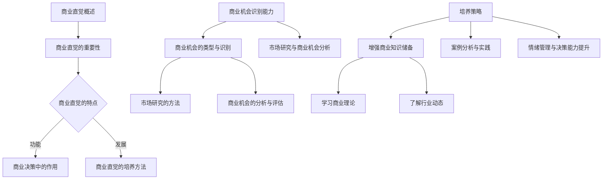

                 

## 《创业者的商业直觉与机会识别能力培养》

### 关键词

- 商业直觉
- 机会识别
- 创业
- 商业决策
- 创业者能力培养

### 摘要

本文旨在探讨创业者的商业直觉与机会识别能力的重要性，以及如何培养和提升这两种能力。文章首先介绍了商业直觉的定义、特点及其在商业决策中的作用，然后详细阐述了商业机会的类型与识别方法。接着，文章通过市场研究、商业机会分析等步骤，展示了商业直觉与机会识别能力在实际应用中的重要性。最后，文章提出了培养商业直觉与机会识别能力的策略，并提供了一些实际应用案例和最佳实践建议。

### 第一部分：商业直觉的概述

#### 第1章：商业直觉的定义与重要性

##### 1.1 商业直觉的定义与内涵

商业直觉是指创业者通过长期的实践经验和敏锐的市场洞察力，在面临复杂多变的商业环境时，能够迅速作出合理决策的能力。它是一种基于经验、知识和直觉的判断，能够在短时间内对市场动态、客户需求、竞争对手等方面作出准确判断。

商业直觉的基本概念包括以下几点：

1. **感知力**：创业者能够敏锐地感知市场变化和客户需求，快速识别潜在的商业机会。
2. **判断力**：创业者能够在短时间内对复杂的信息进行加工和处理，作出合理的商业决策。
3. **洞察力**：创业者能够深入理解市场趋势、行业动态和竞争态势，把握市场脉搏。
4. **经验积累**：商业直觉并非天生的，而是通过长期的实践和积累形成的。

##### 1.2 商业直觉的重要性

商业直觉在商业决策中起着至关重要的作用，主要体现在以下几个方面：

1. **快速响应市场变化**：商业直觉能够帮助创业者迅速识别市场机会和潜在风险，及时调整战略和业务方向。
2. **提高决策效率**：商业直觉使创业者能够在面对复杂问题时，迅速作出合理的决策，避免繁琐的分析和论证过程。
3. **提升竞争力**：具备商业直觉的创业者能够更好地把握市场趋势和客户需求，从而提高产品和服务的竞争力。
4. **增强风险控制能力**：商业直觉使创业者能够预见潜在的风险，提前采取应对措施，降低风险损失。

##### 1.3 商业直觉的特点与功能

商业直觉具有以下主要特点：

1. **迅速性**：商业直觉使创业者能够在短时间内对市场信息作出反应。
2. **准确性**：商业直觉能够帮助创业者作出相对准确的商业判断。
3. **综合性**：商业直觉不仅涉及市场、技术、竞争等方面，还包含创业者个人的价值观和决策风格。
4. **持续性**：商业直觉是创业者长期积累和实践的结果，具有持续性和稳定性。

商业直觉在商业决策中的作用主要体现在以下几个方面：

1. **市场洞察**：商业直觉使创业者能够敏锐地感知市场变化，快速识别潜在的市场机会。
2. **风险评估**：商业直觉使创业者能够准确评估市场风险，制定相应的风险控制策略。
3. **战略规划**：商业直觉帮助创业者制定具有前瞻性和可行性的战略规划，提高企业竞争力。
4. **团队协作**：商业直觉使创业者能够更好地与团队成员沟通和协作，提高团队效率。

##### 1.4 商业直觉的发展与培养

商业直觉是一个逐步发展和完善的过程，需要创业者不断地学习和实践。以下是商业直觉的发展过程和培养方法：

1. **经验积累**：商业直觉的发展离不开丰富的实践经验。创业者需要通过不断地尝试和实践，积累经验，提高自己的商业洞察力和判断力。
2. **知识储备**：商业直觉的发展还需要创业者具备扎实的商业知识和行业背景。创业者需要学习相关的商业理论、市场规律和行业动态，提高自己的理论水平。
3. **跨领域学习**：创业者可以通过跨领域学习，拓宽自己的视野，提高跨领域思考能力，从而更好地把握市场机会。
4. **模拟训练**：创业者可以通过模拟训练，提高自己的决策能力和风险控制能力。模拟训练可以帮助创业者熟悉市场环境和竞争态势，提高应对突发事件的能力。
5. **心理调适**：商业直觉的培养还需要创业者具备良好的心理素质。创业者需要学会情绪管理和压力调适，保持积极的心态，从而更好地应对商业挑战。

#### 总结

商业直觉是创业者成功的重要因素之一。通过不断学习和实践，创业者可以逐步培养和提升自己的商业直觉，从而在竞争激烈的市场环境中取得优势。商业直觉的发展与培养需要经验积累、知识储备、跨领域学习和心理调适等多个方面的努力。只有不断提升自己的商业直觉，创业者才能更好地把握市场机会，实现企业的可持续发展。

### 第二部分：商业机会识别能力

#### 第2章：商业机会的类型与识别

##### 2.1 商业机会的类型

商业机会可以分为以下几种类型：

1. **市场机会**：市场机会是指市场上存在的尚未被满足的需求和潜在的市场空间。创业者可以通过挖掘和满足这些需求，实现商业成功。
    - **例子**：随着健康意识的提高，市场需求逐渐转向健康食品和保健品，创业者可以瞄准这一市场机会，开发相关产品。
  
2. **技术机会**：技术机会是指新技术的出现和应用所带来的商业潜力。创业者可以关注新兴技术，开发相关产品或服务，从而抓住市场机遇。
    - **例子**：5G技术的普及为物联网、智能家居等领域带来了新的发展机会，创业者可以关注这些技术，开发相关产品。

3. **社会机会**：社会机会是指社会变化和趋势带来的商业机会。创业者可以关注社会问题，提供解决方案，从而实现商业成功。
    - **例子**：随着城市化进程的加快，养老产业成为了一个巨大的市场，创业者可以关注这一市场，提供相关的养老服务。

4. **行业机会**：行业机会是指行业内存在的尚未被充分利用的资源或市场空间。创业者可以通过整合和利用这些资源，实现商业成功。
    - **例子**：物流行业存在很多痛点，如配送效率低、成本高等，创业者可以关注这些痛点，提供创新的物流解决方案。

##### 2.2 商业机会的识别

商业机会的识别是创业者成功的关键步骤。以下是一些识别商业机会的方法和技巧：

1. **市场调研**：通过市场调研，创业者可以了解市场需求、竞争态势和潜在客户，从而发现和识别商业机会。
    - **方法**：创业者可以通过调查问卷、访谈、焦点小组讨论等方式进行市场调研。

2. **竞争对手分析**：通过分析竞争对手的产品、服务、市场策略等，创业者可以了解竞争对手的优劣势，从而找到潜在的商机。
    - **技巧**：创业者可以通过行业报告、市场研究、社交媒体等渠道收集竞争对手的信息。

3. **趋势分析**：通过关注行业趋势、技术发展趋势和社会变革趋势，创业者可以预测未来的市场机会。
    - **方法**：创业者可以通过阅读行业报告、参加行业会议、关注科技媒体等方式了解行业趋势。

4. **问题挖掘**：通过深入挖掘社会问题和行业痛点，创业者可以找到解决方案，从而创造商业机会。
    - **技巧**：创业者可以通过访谈潜在客户、参加行业研讨会、关注媒体报道等方式挖掘问题。

##### 2.3 商业机会识别的误区与应对

在商业机会识别过程中，创业者常常会陷入一些误区。以下是一些常见的误区及应对策略：

1. **盲目跟风**：创业者看到市场上某个热点就盲目跟从，没有自己的判断和分析。
    - **应对**：创业者应该通过市场调研和竞争对手分析，确保自己跟从的热点是有潜力的。

2. **忽视市场需求**：创业者没有深入了解市场需求，导致开发的产品或服务无法满足客户需求。
    - **应对**：创业者应该通过市场调研和客户访谈，确保自己的产品或服务有市场需求。

3. **过度乐观**：创业者对商业机会过于乐观，没有充分考虑潜在的风险和挑战。
    - **应对**：创业者应该进行充分的风险评估，确保自己有应对风险的策略。

4. **忽视竞争对手**：创业者没有关注竞争对手，导致在竞争中处于劣势。
    - **应对**：创业者应该通过竞争对手分析，了解竞争对手的优势和劣势，制定相应的竞争策略。

#### 总结

商业机会识别是创业者成功的关键步骤。通过市场调研、竞争对手分析、趋势分析和问题挖掘等方法，创业者可以找到和识别出潜在的商业机会。同时，创业者应该避免盲目跟风、忽视市场需求、过度乐观和忽视竞争对手等误区，确保自己能够成功抓住商业机会。

#### 第3章：市场研究与商业机会分析

##### 3.1 市场研究的方法

市场研究是识别商业机会的重要步骤，通过系统性的方法收集和分析市场信息，创业者可以更好地理解市场需求、竞争态势和潜在客户。以下是几种常用的市场研究方法：

1. **调查问卷**：调查问卷是收集市场信息的一种常见方法，通过设计针对性的问题，了解客户的需求、偏好和行为。问卷可以通过线上平台、邮件或面对面的形式进行分发。
    - **优点**：覆盖范围广，可以收集大量数据。
    - **缺点**：可能存在回答偏差和低参与率。

2. **竞争对手分析**：竞争对手分析是了解市场竞争态势的重要方法，通过研究竞争对手的产品、服务、市场策略等，创业者可以找到自身的优势和劣势，制定有针对性的竞争策略。
    - **优点**：可以帮助创业者了解市场动态，抓住商业机会。
    - **缺点**：可能需要花费大量时间和精力。

3. **市场趋势分析**：市场趋势分析是通过研究行业报告、市场研究报告和科技媒体等，了解行业的发展趋势和未来方向。这有助于创业者预测未来的市场机会。
    - **优点**：可以提供宏观的市场视角。
    - **缺点**：信息可能存在滞后性。

4. **焦点小组讨论**：焦点小组讨论是通过召集一群目标客户或潜在客户，进行深入讨论，了解他们对产品或服务的看法和需求。这种方法可以获取深入的见解和反馈。
    - **优点**：可以获取高质量的市场见解。
    - **缺点**：参与者数量有限，结果可能存在主观偏差。

##### 3.2 商业机会的分析与评估

在识别出潜在的商业机会后，创业者需要对机会进行深入分析，评估其可行性和潜在收益。以下是几种常见的商业机会分析与评估方法：

1. **SWOT分析**：SWOT分析是一种常用的战略规划工具，通过分析企业的优势（Strengths）、劣势（Weaknesses）、机会（Opportunities）和威胁（Threats），评估商业机会的潜在价值和风险。
    - **优点**：全面分析商业机会，帮助创业者制定战略。
    - **缺点**：主观性较强，需要依赖经验和判断。

2. **PEST分析**：PEST分析是通过分析政治（Political）、经济（Economic）、社会（Social）和技术（Technological）等因素，评估商业机会的外部环境。
    - **优点**：可以提供宏观环境分析，帮助创业者了解市场背景。
    - **缺点**：可能忽视内部因素和竞争态势。

3. **成本效益分析**：成本效益分析是通过计算商业机会的投资成本和预期收益，评估其经济可行性。
    - **优点**：量化评估，可以帮助创业者做出理性的投资决策。
    - **缺点**：可能忽视市场风险和不确定性。

4. **机会优先级排序**：通过评估商业机会的潜在价值、市场前景和竞争优势，创业者可以将其按优先级排序，集中资源和精力开发最有潜力的机会。
    - **优点**：可以集中资源，提高投资回报率。
    - **缺点**：可能忽视一些潜在的小机会。

##### 3.3 商业机会的评估方法与步骤

商业机会的评估是一个系统性的过程，通常包括以下步骤：

1. **确定评估标准**：根据企业的战略目标和市场需求，确定评估商业机会的标准，如市场规模、增长潜力、竞争态势等。

2. **收集信息**：通过市场调研、竞争对手分析和趋势分析等方法，收集与商业机会相关的信息。

3. **评估机会**：根据评估标准，对商业机会进行评估，包括市场潜力、技术可行性、竞争强度、投资成本等方面。

4. **优先级排序**：根据评估结果，将商业机会按优先级排序，确定哪些机会最有潜力，哪些机会需要进一步研究和开发。

5. **制定行动计划**：针对优先级最高的商业机会，制定具体的行动计划，包括市场进入策略、产品开发计划、资源分配等。

#### 总结

市场研究与商业机会分析是创业者成功的关键步骤。通过调查问卷、竞争对手分析、市场趋势分析等方法，创业者可以识别出潜在的商业机会。接着，通过SWOT分析、PEST分析、成本效益分析和机会优先级排序等方法，对商业机会进行深入分析和评估，确保选择最有潜力的机会进行开发。只有通过系统性的市场研究和商业机会分析，创业者才能在竞争激烈的市场中找到属于自己的立足点。

### 第三部分：商业直觉与机会识别能力的培养

#### 第4章：培养商业直觉的策略

##### 4.1 增强商业知识储备

商业直觉的培养离不开扎实的商业知识储备。创业者需要通过以下方法来增强自己的商业知识：

1. **学习商业理论**：创业者可以通过阅读商业书籍、参加商业课程等方式，学习商业理论，包括市场营销、财务管理、战略管理等方面的知识。

2. **了解行业动态**：创业者需要关注自己所在行业的最新动态，包括市场趋势、技术进步、政策变化等。这可以通过阅读行业报告、参加行业会议、订阅行业媒体等方式实现。

3. **参与商业实践**：创业者可以通过参与创业项目、实习或工作，亲身体验商业运作过程，积累实践经验，提高对商业环境的敏感度和应对能力。

##### 4.2 案例分析与模拟实践

案例分析是培养商业直觉的重要方法，通过分析成功和失败的商业案例，创业者可以学习到不同的商业策略和思维模式。以下是一些案例分析的方法和步骤：

1. **选择案例**：创业者可以选择与自己业务相关的成功或失败案例，以便更好地理解案例中的商业决策和结果。

2. **分析案例**：创业者需要对案例中的关键决策、市场环境、竞争对手、客户需求等方面进行详细分析，找出案例中的优势和不足。

3. **讨论与反思**：创业者可以与团队成员或其他创业者讨论案例，分享自己的观点和见解，通过反思案例中的决策过程，提高自己的商业判断能力。

模拟实践是通过模拟真实的商业场景，帮助创业者锻炼商业决策能力和应对复杂问题的能力。以下是一些模拟实践的方法：

1. **设计模拟场景**：创业者可以设计一些模拟的商业场景，包括市场需求、竞争态势、政策变化等。

2. **制定决策方案**：创业者需要根据模拟场景，制定相应的决策方案，包括市场进入策略、产品开发计划、资源配置等。

3. **评估决策结果**：创业者需要根据模拟的结果，评估决策方案的可行性和效果，总结经验教训。

##### 4.3 情绪管理与决策能力提升

情绪管理是商业直觉培养的重要方面。创业者需要学会控制自己的情绪，避免情绪波动对商业决策的负面影响。以下是一些情绪管理的方法：

1. **自我觉察**：创业者需要学会自我觉察，了解自己的情绪变化，及时调整心态。

2. **放松技巧**：创业者可以通过冥想、深呼吸、运动等方式，放松身心，减轻压力。

3. **积极心态**：创业者需要保持积极的心态，相信自己能够应对各种商业挑战。

决策能力提升是商业直觉培养的关键。以下是一些提升决策能力的方法：

1. **信息收集**：创业者需要学会收集和分析信息，确保决策基于充分的数据和事实。

2. **多角度思考**：创业者需要从不同角度思考问题，避免片面决策。

3. **风险评估**：创业者需要学会进行风险评估，确保决策的可行性和安全性。

4. **果断决策**：创业者需要学会果断决策，避免犹豫不决，错失商业机会。

#### 总结

商业直觉的培养需要增强商业知识储备、进行案例分析和模拟实践，以及提升情绪管理和决策能力。通过不断学习和实践，创业者可以逐步培养和提升自己的商业直觉，从而在复杂的商业环境中作出更加准确的判断和决策。商业直觉的培养是一个长期而持续的过程，需要创业者不断努力和积累经验。

### 第四部分：商业机会识别能力的培养

#### 第5章：商业敏锐度训练

##### 5.1 商业敏锐度训练

商业敏锐度是指创业者对市场动态、客户需求、竞争对手等方面的敏感性和洞察力。培养商业敏锐度是提升商业机会识别能力的重要步骤。以下是一些训练商业敏锐度的方法和技巧：

1. **持续学习**：创业者需要不断学习新的商业知识、行业动态和新兴技术，保持对市场的敏感度。可以通过阅读商业书籍、参加行业研讨会、关注行业报告等方式进行学习。

2. **广泛阅读**：创业者应该广泛阅读各种类型的文章和书籍，包括商业杂志、科技博客、经济分析报告等，从而获得多角度的市场信息。

3. **参与讨论**：创业者可以参与行业讨论、商业论坛和社交网络，与同行交流观点和经验，从中获得新的见解和灵感。

4. **实践体验**：创业者应该通过实践和体验，亲身体验市场的变化和客户的需求。可以通过创业项目、实习或兼职工作等方式，积累实践经验。

5. **市场调研**：定期进行市场调研，了解客户的需求、竞争对手的动态和市场趋势，可以帮助创业者保持对市场的敏锐度。

##### 5.2 逻辑思维训练

逻辑思维是商业决策的重要基础，通过训练逻辑思维，创业者可以提高对信息的处理能力和决策的准确性。以下是一些训练逻辑思维的方法：

1. **学习逻辑学**：创业者可以学习逻辑学的基本原理，包括推理、论证、逻辑谬误等，掌握逻辑分析的方法。

2. **练习逻辑题**：通过解决逻辑题，如逻辑推理题、数独、谜题等，可以提高逻辑思维能力和解决问题的能力。

3. **结构化思考**：创业者应该培养结构化思考的习惯，将复杂的问题分解成几个关键部分，逐步分析和解决。

4. **案例学习**：通过学习成功的商业案例和失败的案例，分析其中的逻辑思维过程，从中学习和借鉴。

5. **批判性思维**：培养批判性思维，对信息进行筛选和分析，避免盲目接受和片面理解。

##### 5.3 跨界思维与创新

跨界思维和创新是商业机会识别的重要能力，通过跨界思维和创新，创业者可以开拓新的市场领域和商业模式。以下是一些培养跨界思维和创新的方法：

1. **跨领域交流**：创业者可以参加跨领域的研讨会、讲座和工作坊，与来自不同行业的人交流，拓展思维。

2. **学习新技能**：创业者可以学习新的技能和知识，如设计、编程、数据分析等，从而具备跨领域的视角。

3. **多角度思考**：在遇到问题时，尝试从不同的角度和领域寻找解决方案，打破固有的思维框架。

4. **开放心态**：保持开放心态，对新的想法和观点持包容态度，勇于尝试和实验。

5. **培养好奇心**：保持好奇心，对周围的事物和现象进行探索和思考，从而激发创新思维。

##### 5.4 团队合作与沟通技巧

团队合作和沟通技巧是商业机会识别过程中不可或缺的能力。一个高效的团队可以聚集不同的智慧和经验，共同发现和识别商业机会。以下是一些提升团队合作和沟通技巧的方法：

1. **建立信任**：建立团队成员之间的信任，是团队合作的基础。可以通过开放的沟通、透明的信息共享和相互尊重来实现。

2. **明确目标**：确保团队成员对目标有共同的理解和认同，明确各自的角色和责任，从而提高团队的协作效率。

3. **有效沟通**：提高沟通技巧，包括清晰表达、倾听他人观点、有效反馈等，以确保信息传递准确无误。

4. **冲突管理**：学会处理团队内部的冲突，通过对话和妥协寻找解决方案，避免冲突影响团队合作。

5. **共同成长**：鼓励团队成员互相学习和成长，通过知识共享和经验交流，提升整个团队的能力。

#### 总结

商业机会识别能力的培养需要从商业敏锐度、逻辑思维、跨界思维和创新、团队合作与沟通技巧等多个方面入手。通过持续的学习和实践，创业者可以提升自己的商业敏锐度，培养逻辑思维，开拓跨界视野，提高团队合作和沟通能力，从而更加准确地识别和抓住商业机会。

### 第五部分：商业直觉与机会识别能力的实际应用

#### 第6章：初创企业的商业直觉与机会识别

##### 6.1 初创企业的特点与挑战

初创企业通常具有以下特点：

1. **资源有限**：初创企业在资金、人力、技术等方面相对有限，需要高效利用资源。
2. **市场不确定性**：初创企业面临的市场环境通常较为复杂和不确定，需要具备敏锐的市场洞察力。
3. **快速迭代**：初创企业需要快速适应市场变化，通过不断迭代产品和服务来满足客户需求。
4. **创新能力**：初创企业需要具备创新能力，不断探索新的商业模式和市场机会。

初创企业面临的挑战主要包括：

1. **市场进入障碍**：初创企业通常在市场进入、品牌建立等方面面临较大挑战。
2. **资金短缺**：初创企业往往需要大量资金支持产品开发和市场推广，但融资渠道有限。
3. **竞争压力**：初创企业需要面对竞争对手的激烈竞争，如何在市场中脱颖而出是一个重要挑战。
4. **管理复杂性**：初创企业需要在快速发展的过程中管理好内部团队、产品线、市场推广等各方面事务。

##### 6.2 初创企业的商业直觉与机会识别实践

初创企业在发展过程中，商业直觉和机会识别能力至关重要。以下是一些具体的实践方法：

1. **市场调研**：初创企业需要进行详细的市场调研，了解目标市场的需求和趋势，从而找到潜在的商业机会。可以通过调查问卷、用户访谈、竞争对手分析等方式进行调研。

2. **快速迭代**：初创企业应采用快速迭代的方法，快速开发产品原型，收集用户反馈，不断优化产品。这有助于初创企业更好地满足市场需求，提高市场竞争力。

3. **灵活调整**：初创企业需要根据市场反馈和竞争态势，灵活调整产品和市场策略。商业直觉可以帮助企业迅速识别市场机会，及时调整战略方向。

4. **创新能力**：初创企业应注重创新能力的培养，通过技术创新、商业模式创新等方式，创造独特的市场价值。商业直觉可以帮助企业发现新的商业机会，推动创新。

5. **资源优化**：初创企业需要高效利用有限的资源，优化资源配置。商业直觉可以帮助企业准确判断哪些资源最重要，如何合理分配。

6. **风险评估**：初创企业应进行充分的风险评估，识别潜在的风险和挑战，并制定应对策略。商业直觉可以帮助企业预见风险，提前做好准备。

#### 第7章：商业直觉与机会识别能力在企业发展中的应用

##### 7.1 企业战略规划中的商业直觉与机会识别

企业在战略规划中，商业直觉和机会识别能力至关重要。以下是一些具体的应用方法：

1. **市场趋势分析**：企业需要密切关注市场趋势，通过分析行业报告、科技媒体等渠道，了解未来的市场方向和机遇。商业直觉可以帮助企业快速识别出有潜力的市场机会。

2. **竞争对手分析**：企业需要分析竞争对手的战略和动作，了解其优势和劣势，从而制定有针对性的战略。商业直觉可以帮助企业发现竞争对手的潜在漏洞和机会。

3. **客户需求洞察**：企业应深入了解客户需求，通过调研、用户反馈等方式，了解客户的痛点和需求。商业直觉可以帮助企业准确判断客户需求，开发满足市场需求的产品和服务。

4. **创新驱动**：企业应注重创新，通过技术创新、商业模式创新等方式，推动企业持续发展。商业直觉可以帮助企业发现新的创新方向，抓住市场机遇。

5. **战略调整**：在战略执行过程中，企业需要根据市场反馈和竞争态势，灵活调整战略。商业直觉可以帮助企业快速做出决策，及时应对市场变化。

##### 7.2 商业直觉与机会识别能力在企业发展中的持续应用

商业直觉和机会识别能力在企业发展中需要持续培养和应用。以下是一些持续应用的方法：

1. **定期培训**：企业应定期组织商业培训，提高员工的市场洞察力和商业判断能力。通过培训，员工可以不断学习和更新商业知识，提升商业直觉。

2. **实战演练**：企业可以通过实战演练，如模拟市场环境、商业竞赛等，锻炼员工的商业决策能力和机会识别能力。实战演练可以帮助员工在真实场景中应用所学知识，提高实战能力。

3. **跨部门协作**：企业应鼓励跨部门协作，通过团队项目、头脑风暴等方式，激发员工的创新思维和团队合作能力。跨部门协作可以帮助企业从不同角度发现和识别商业机会。

4. **持续创新**：企业应持续推动创新，通过技术、产品、服务等多方面的创新，不断提升企业的市场竞争力。商业直觉可以帮助企业在创新过程中发现新的商业机会。

5. **文化塑造**：企业应塑造积极的商业文化，鼓励员工勇于尝试、勇于创新。通过文化塑造，员工可以更加自信地应用商业直觉，抓住市场机遇。

#### 总结

商业直觉和机会识别能力在初创企业和企业发展中至关重要。初创企业需要通过市场调研、快速迭代、灵活调整、创新驱动等方法，提升商业直觉和机会识别能力，抓住市场机遇。企业在战略规划中，也需要运用商业直觉和机会识别能力，进行市场趋势分析、竞争对手分析、客户需求洞察等，制定有效的战略。通过持续培养和应用商业直觉和机会识别能力，企业可以在激烈的市场竞争中脱颖而出，实现持续发展。

### 第六部分：商业直觉与机会识别能力的综合提升

#### 第8章：商业直觉与机会识别能力的综合提升策略

##### 8.1 综合提升策略

提升商业直觉与机会识别能力是一个系统工程，需要从多个维度进行综合提升。以下是一些关键策略：

1. **系统学习**：创业者应通过学习商业理论、行业知识、经济规律等，建立坚实的理论基础。这包括参加商学院课程、阅读经典商业书籍、参加在线课程等。

2. **实践经验**：理论结合实践是提升商业直觉的有效途径。创业者应积极参与实际项目，积累丰富的实战经验。这可以通过创业实践、实习、兼职等方式实现。

3. **数据分析**：利用数据分析工具和方法，创业者可以更科学地评估商业机会。这包括学习数据分析软件、掌握数据分析方法、建立数据驱动决策系统。

4. **创新思维**：培养创新思维，鼓励跨界思考，寻找新的商业模式和市场机会。这可以通过参加创新工作坊、设计思维训练等方式实现。

5. **团队协作**：建立高效的团队，通过团队合作提升整体商业直觉和机会识别能力。这包括加强团队沟通、建立共同目标、激发团队成员的创造力。

6. **持续学习**：在快速变化的市场环境中，持续学习是提升商业直觉的必要条件。创业者应保持好奇心，不断学习新知识、新技能，适应市场变化。

##### 8.2 综合提升策略的实施步骤

实施综合提升策略需要系统化和结构化的步骤。以下是一些建议：

1. **评估当前水平**：首先，创业者应评估自己在商业直觉和机会识别方面的当前水平，识别出需要提升的领域。

2. **制定学习计划**：根据评估结果，制定具体的学习计划，包括学习内容、学习时间和学习方法。

3. **实践应用**：将所学知识应用于实际项目，通过实践检验学习成果，并不断调整和优化。

4. **数据分析**：建立数据收集和分析机制，利用数据分析工具评估商业机会的可行性和潜在收益。

5. **团队建设**：建立高效的团队，通过定期团队活动、头脑风暴等，激发团队成员的创造力和协作能力。

6. **持续反馈**：建立反馈机制，定期评估提升策略的效果，根据反馈调整学习计划和实践策略。

7. **持续改进**：通过持续学习和实践，不断改进商业直觉和机会识别能力，适应市场变化。

#### 总结

商业直觉与机会识别能力的综合提升需要系统化的策略和结构化的实施步骤。通过系统学习、实践经验、数据分析、创新思维、团队协作和持续学习，创业者可以全面提升商业直觉和机会识别能力。实施有效的提升策略，不仅可以帮助创业者抓住市场机遇，还能在竞争激烈的市场环境中保持竞争优势。

### 第六部分：商业直觉与机会识别能力的综合提升

#### 第9章：商业直觉与机会识别能力的持续发展

##### 9.1 持续发展的意义

商业直觉与机会识别能力的持续发展对企业的重要性不言而喻。首先，商业直觉是创业者和企业领导者快速做出正确决策的关键，能够在市场瞬息万变的环境中迅速抓住机遇。其次，机会识别能力是企业生存和发展的基础，能够帮助企业在竞争中找到独特的市场定位。持续发展这两项能力，意味着企业可以：

1. **适应市场变化**：快速响应市场动态，抓住新的商业机会。
2. **增强竞争力**：通过敏锐的市场洞察力和灵活的决策能力，保持竞争优势。
3. **创新驱动**：持续发掘市场需求，推动产品和服务创新。
4. **长期发展**：通过持续提升商业直觉和机会识别能力，实现企业的长期稳健发展。

##### 9.2 持续发展策略

要实现商业直觉与机会识别能力的持续发展，企业需要采取一系列策略。以下是一些关键策略：

1. **培养企业文化**：建立开放、创新、学习型的企业文化，鼓励员工不断学习和创新，形成共同的企业价值观。
2. **持续教育培训**：定期为员工提供商业知识、市场趋势、新兴技术等方面的培训，提升团队的整体能力。
3. **激励机制**：建立激励机制，鼓励员工积极参与市场调研和商业机会识别，对成功识别的商业机会给予奖励。
4. **跨部门协作**：促进不同部门之间的协作，通过团队项目和跨部门合作，提升整体机会识别和决策能力。
5. **创新实践**：鼓励员工参与创新项目，通过试错和迭代，不断优化创新成果，提升企业的创新能力。
6. **数据驱动**：建立数据收集和分析机制，利用大数据和人工智能等技术，提升数据驱动的决策能力。

##### 9.3 持续发展策略的实践案例

以下是一些企业通过持续发展商业直觉与机会识别能力的成功案例：

1. **谷歌**：谷歌通过其“二十百分比时间”政策，鼓励员工利用20%的工作时间进行创新项目，从而推动了一系列成功的产品和服务，如Gmail和AdSense。
2. **苹果**：苹果公司始终保持着对市场趋势的敏锐洞察力和创新精神，通过持续的产品创新，保持了在科技行业的领先地位。
3. **阿里巴巴**：阿里巴巴通过不断拓展其业务范围，从电子商务扩展到云计算、金融科技等领域，成功抓住了多个市场机会。

这些案例表明，持续发展商业直觉与机会识别能力需要企业具备灵活的思维、创新的精神和持续的执行力。通过培养企业文化、教育培训、激励机制、跨部门协作和创新实践等多种策略，企业可以不断提升商业直觉与机会识别能力，实现持续发展。

#### 总结

商业直觉与机会识别能力的持续发展对企业至关重要。通过培养企业文化、教育培训、激励机制、跨部门协作和创新实践等多种策略，企业可以不断提升自身的商业直觉和机会识别能力。实践证明，只有不断适应市场变化，保持创新精神，企业才能在激烈的市场竞争中立于不败之地。

### 附录

#### 附录 A：商业直觉与机会识别能力培养工具与资源

##### A.1 商业直觉与机会识别能力培养工具

为了有效提升商业直觉与机会识别能力，创业者可以利用以下几种工具：

1. **数据可视化工具**：如Tableau、Power BI等，可以帮助创业者将复杂的数据转化为易于理解的图表，从而更好地洞察市场趋势。
2. **商业分析软件**：如Google Analytics、Salesforce等，可以提供详细的客户行为分析和市场趋势数据，帮助创业者做出更明智的商业决策。
3. **思维导图工具**：如MindMeister、XMind等，可以帮助创业者梳理商业思路，构建商业模型和机会识别框架。
4. **在线课程平台**：如Coursera、edX等，提供了丰富的商业课程和行业报告，创业者可以通过在线学习获取最新的商业知识和技能。

##### A.2 商业直觉与机会识别能力培养资源

为了培养商业直觉与机会识别能力，创业者可以参考以下资源：

1. **商业书籍**：《精益创业》、《创新者的窘境》、《商业的本质》等经典商业书籍，提供了丰富的商业理论和实践案例。
2. **行业报告**：如麦肯锡、贝恩等咨询公司的行业报告，可以帮助创业者了解行业动态和未来趋势。
3. **创业社区**：如创业邦、36氪等创业社区，创业者可以在这里交流经验、获取最新的创业资讯。
4. **专业论坛**：如硅谷论坛、哈佛商学院论坛等，这些论坛汇聚了业内专家和成功创业者，提供了宝贵的交流和学习的平台。

##### A.3 工具与资源的使用方法与技巧

为了最大化工具与资源的效果，创业者可以遵循以下方法和技巧：

1. **系统学习**：结合线上和线下课程，系统学习商业理论、数据分析和市场调研方法。
2. **实践应用**：将所学知识应用到实际项目中，通过实践不断检验和优化。
3. **数据分析**：学会使用数据可视化工具，对市场数据进行分析，发现潜在的商业机会。
4. **持续更新**：保持好奇心，定期更新自己的知识库，关注最新的商业趋势和技术发展。
5. **团队合作**：与团队成员分享经验和见解，通过团队合作提升整体的机会识别能力。

通过有效利用这些工具和资源，创业者可以逐步提升自己的商业直觉与机会识别能力，从而在竞争激烈的市场中找到属于自己的立足点。

## Mermaid 流程图



## 伪代码

```python
# 伪代码：商业直觉识别方法
def 商业直觉识别(数据集, 模型参数):
    # 输入：数据集，模型参数
    # 输出：商业直觉预测结果

    # 初始化模型参数
    初始化模型参数()

    # 训练模型
    训练模型(数据集)

    # 特征提取
    特征提取(数据集)

    # 预测
    预测结果 = 模型预测(特征提取结果)

    # 返回预测结果
    返回预测结果(预测结果)
```

### 数学模型和数学公式

#### 商业机会识别的评估模型

$$
\text{评估指数} = \frac{\text{市场潜力} \times \text{技术可行性} \times \text{竞争强度}}{\text{投资成本}}
$$

#### 举例说明

假设某初创企业要评估一个新的商业机会，以下为其具体参数：

- 市场潜力：80
- 技术可行性：70
- 竞争强度：50
- 投资成本：100

根据上述公式，商业机会的评估指数为：

$$
\text{评估指数} = \frac{80 \times 70 \times 50}{100} = 2800
$$

通过这一指数，企业可以初步判断该商业机会的潜在价值。如果评估指数较高，表示该商业机会具有较大的开发潜力；反之，则可能需要进一步评估或重新考虑。

## 总结

《创业者的商业直觉与机会识别能力培养》这篇文章系统地探讨了商业直觉的定义、重要性、特点与发展，以及商业机会的类型与识别方法。文章首先介绍了商业直觉的定义与内涵，强调了商业直觉在商业决策中的重要性，并通过特点与功能的分析，展示了商业直觉对创业者决策的影响。接着，文章详细阐述了商业机会的类型与识别方法，通过市场调研、竞争对手分析和趋势分析，帮助创业者识别出潜在的商业机会。

在市场研究与商业机会分析部分，文章介绍了调查问卷、竞争对手分析、市场趋势分析和问题挖掘等方法，帮助创业者深入了解市场和客户需求，评估商业机会的可行性和潜在收益。在商业直觉与机会识别能力的培养方面，文章提出了增强商业知识储备、案例分析与实践、情绪管理与决策能力提升等策略，通过系统学习和实践经验，帮助创业者提升商业直觉与机会识别能力。

文章还通过初创企业特点与挑战的探讨，展示了商业直觉与机会识别能力在初创企业中的实际应用。同时，在企业战略规划和持续发展部分，文章强调了商业直觉与机会识别能力在企业发展和战略规划中的重要性，提供了具体的策略和实践方法。

附录部分提供了商业直觉与机会识别能力培养的工具与资源，包括数据可视化工具、商业分析软件、思维导图工具、在线课程平台、商业书籍、行业报告和创业社区等，帮助创业者有效提升自身能力。

通过这篇文章，创业者可以系统地了解商业直觉与机会识别能力的重要性，掌握相关方法和策略，提升自己的商业敏锐度和决策能力，从而在竞争激烈的市场中抓住机遇，实现企业的可持续发展。文章的结构紧凑，逻辑清晰，为创业者提供了一份全面而实用的指南。

