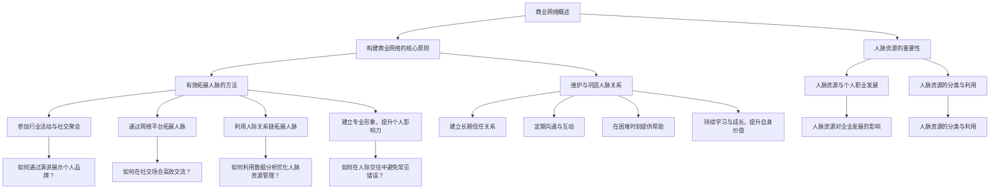

                 

### 文章标题：《创业者的商业网络构建与人脉拓展技巧》

关键词：商业网络、人脉拓展、创业者、商业关系、人际沟通、策略制定

摘要：本文针对创业者在构建商业网络和人脉拓展过程中遇到的问题，详细阐述了商业网络的基础概念、构建原则以及人脉资源的重要性。通过分析有效拓展人脉的方法、维护与巩固人脉关系的技巧，以及实战案例，为创业者提供了一套系统、实用的商业网络与人脉拓展方案。

### 第一部分：商业网络基础

#### 第1章：商业网络概述

##### 1.1 商业网络的概念与作用

商业网络是指企业或个人在经营活动中形成的一系列商业联系，包括供应商、客户、合作伙伴等。这些联系共同构成了一个庞大的商业生态系统，为企业提供了资源、信息、支持等关键要素。

商业网络的作用主要体现在以下几个方面：

1. **资源整合**：通过商业网络，企业可以获取到更多的资源，如资金、技术、人才等。
2. **信息交流**：商业网络为企业提供了一个信息交流的平台，帮助企业了解市场动态、竞争对手情况等。
3. **风险分担**：商业网络中的企业可以通过合作、联盟等方式，共同应对市场风险。
4. **协同创新**：商业网络中的企业可以共同开展创新活动，推动行业技术进步。

##### 1.2 商业网络的基本构成

商业网络主要由以下几个部分构成：

1. **节点**：节点是指商业网络中的个体，如企业、个人等。
2. **边**：边是指节点之间的联系，如合作关系、交易关系等。
3. **路径**：路径是指节点之间的一系列连接关系，代表了一种可能的发展方向或渠道。

##### 1.3 商业网络与人际关系

商业网络与人际关系密切相关。一个成功的商业网络，往往离不开良好的人际关系。在商业网络中，人际关系的作用主要体现在以下几个方面：

1. **信任建立**：人际关系是信任建立的基础，只有建立信任，才能更好地开展合作。
2. **信息传递**：人际关系是信息传递的渠道，通过人际网络，企业可以更快地获取到有价值的信息。
3. **资源获取**：人际关系可以帮助企业获取到更多的资源，如资金、技术等。
4. **风险分担**：通过人际关系，企业可以共同应对市场风险，实现风险分担。

#### 第2章：构建商业网络的核心原则

##### 2.1 确定目标与定位

构建商业网络的第一步是明确目标与定位。创业者需要根据自身的资源和能力，确定商业网络的目标，如扩大市场份额、提升品牌知名度、获取技术资源等。

同时，创业者还需要对自身进行定位，明确自己在商业网络中的角色和地位，以便更好地与其他节点建立联系。

##### 2.2 建立互惠合作关系

建立互惠合作关系是商业网络构建的关键。创业者需要寻找那些能够带来双赢的合作机会，通过合作实现资源、信息、技术的共享，提高整个商业网络的价值。

在建立合作关系时，创业者需要注意以下几点：

1. **明确合作目标**：确保双方在合作中的目标一致，避免因目标冲突而导致合作失败。
2. **保持沟通畅通**：保持良好的沟通，及时解决问题，确保合作顺利进行。
3. **公平公正**：在合作中保持公平公正，避免利益冲突，树立良好的信誉。

##### 2.3 增强沟通能力

沟通能力是创业者构建商业网络的重要能力。创业者需要具备以下沟通能力：

1. **表达清晰**：能够准确、清晰地表达自己的想法和观点。
2. **倾听理解**：能够倾听对方的意见和需求，理解对方的立场和观点。
3. **协商解决**：能够在合作中妥善处理分歧，寻找双方都能接受的解决方案。

##### 2.4 持续维护与发展

商业网络不是一蹴而就的，需要创业者持续维护和发展。创业者需要定期评估商业网络的状况，调整合作策略，确保商业网络的健康运行。

同时，创业者还需要不断学习，提升自身的综合素质，以适应不断变化的市场环境。

### 第二部分：人脉拓展技巧

#### 第3章：人脉资源的重要性

##### 3.1 人脉资源对企业发展的影响

人脉资源对企业发展具有重要影响。通过人脉资源，企业可以：

1. **获取资源**：如资金、技术、人才等。
2. **拓展市场**：通过人脉资源，企业可以更快地进入新市场，提高市场份额。
3. **降低风险**：人脉资源可以帮助企业更好地应对市场风险。
4. **提高品牌知名度**：通过人脉资源，企业可以更快地提高品牌知名度。

##### 3.2 人脉资源与个人职业发展

人脉资源对个人职业发展同样具有重要影响。通过人脉资源，个人可以：

1. **获取机会**：如晋升、跳槽等。
2. **提高能力**：通过人脉资源，个人可以更快地学习到新知识和技能。
3. **降低风险**：人脉资源可以帮助个人更好地应对职业发展中的风险。

##### 3.3 人脉资源的分类与利用

人脉资源可以分为以下几类：

1. **直接人脉**：如同事、朋友、亲戚等。
2. **间接人脉**：通过朋友、朋友的朋友等间接建立的联系。
3. **专业人脉**：在特定领域内建立的专业联系。

针对不同类型的人脉资源，创业者需要采取不同的利用策略：

1. **直接人脉**：通过频繁的互动和交流，建立深厚的友谊，确保在需要时能够得到帮助。
2. **间接人脉**：通过朋友、朋友的朋友等建立联系，利用社交网络扩大人脉范围。
3. **专业人脉**：在专业领域内建立联系，通过参加行业活动、发表论文等提升自身专业地位，吸引更多专业人脉。

#### 第4章：有效拓展人脉的方法

##### 4.1 参加行业活动与社交聚会

参加行业活动与社交聚会是拓展人脉的有效方法。创业者可以通过以下方式参加：

1. **行业会议**：参加行业内的会议、论坛、研讨会等，结识同行业人士。
2. **社交聚会**：参加各种社交聚会，如校友会、朋友聚会等，结识不同领域的朋友。
3. **公益活动**：参加公益活动，结识志同道合的朋友。

在参加活动时，创业者需要注意以下几点：

1. **主动交流**：主动与他人交流，展示自己的热情和诚意。
2. **倾听理解**：倾听对方的意见和需求，展示自己的倾听和理解能力。
3. **建立联系**：在交流过程中，积极交换联系方式，建立联系。

##### 4.2 通过网络平台拓展人脉

网络平台为创业者提供了丰富的拓展人脉的机会。创业者可以通过以下方式通过网络平台拓展人脉：

1. **社交媒体**：如微信、微博、LinkedIn等，通过社交媒体与朋友、同行建立联系。
2. **专业社区**：如技术论坛、行业网站等，通过专业社区结识同行。
3. **在线学习平台**：如Coursera、Udemy等，通过在线学习平台结识志同道合的学习者。

在网络平台拓展人脉时，创业者需要注意以下几点：

1. **积极参与**：积极参与社区讨论、问答，展示自己的专业知识和能力。
2. **建立信任**：通过分享自己的经验和见解，建立信任，吸引更多朋友。
3. **拓展圈子**：通过朋友介绍，拓展自己的社交圈子。

##### 4.3 利用人际关系链拓展人脉

利用人际关系链拓展人脉是一种有效的方法。创业者可以通过以下方式利用人际关系链：

1. **朋友的朋友**：通过朋友的朋友建立联系，拓展人脉。
2. **同事的同事**：通过同事的同事建立联系，拓展人脉。
3. **家人的朋友**：通过家人的朋友建立联系，拓展人脉。

在利用人际关系链拓展人脉时，创业者需要注意以下几点：

1. **尊重隐私**：在建立联系时，尊重对方的隐私，避免过度打扰。
2. **诚信为本**：在与人交往过程中，诚信为本，树立良好的形象。
3. **持续互动**：在建立联系后，保持持续互动，加深关系。

##### 4.4 建立专业形象，提升个人影响力

建立专业形象、提升个人影响力是拓展人脉的重要策略。创业者可以通过以下方式建立专业形象、提升个人影响力：

1. **专业知识**：通过学习、实践，不断提升自己的专业知识，成为行业的专家。
2. **专业文章**：通过撰写专业文章，分享自己的见解和经验，展示自己的专业能力。
3. **专业演讲**：通过参加行业活动，进行专业演讲，展示自己的专业形象。
4. **公益活动**：通过参与公益活动，展示自己的社会责任感，提升个人形象。

建立专业形象、提升个人影响力时，创业者需要注意以下几点：

1. **持续学习**：不断学习新知识，保持自己的竞争力。
2. **分享经验**：通过分享经验，帮助他人成长，提升自己的影响力。
3. **积极参与**：积极参与行业活动，展示自己的专业形象。

#### 第5章：维护与巩固人脉关系

##### 5.1 建立长期信任关系

建立长期信任关系是维护人脉关系的关键。创业者需要通过以下方式建立长期信任关系：

1. **诚信为本**：在与人交往过程中，始终诚信为本，遵守承诺。
2. **相互尊重**：尊重他人的意见和需求，建立平等、互惠的关系。
3. **持续互动**：保持与朋友之间的持续互动，加深关系。

##### 5.2 定期沟通与互动

定期沟通与互动是维护人脉关系的重要手段。创业者可以通过以下方式定期沟通与互动：

1. **电话、邮件**：定期与朋友进行电话、邮件沟通，了解彼此的情况。
2. **社交媒体**：通过社交媒体平台，分享生活和工作动态，保持联系。
3. **线下聚会**：定期组织线下聚会，与朋友面对面交流，加深感情。

##### 5.3 在困难时刻提供帮助

在困难时刻提供帮助是巩固人脉关系的有效策略。创业者需要通过以下方式在困难时刻提供帮助：

1. **及时回应**：在朋友遇到困难时，及时回应，提供帮助。
2. **解决问题**：主动解决问题，帮助朋友渡过难关。
3. **关心关爱**：在朋友遇到困难时，表达关心和关爱，给予心理支持。

##### 5.4 持续学习与成长，提升自身价值

持续学习与成长、提升自身价值是维护人脉关系的重要保障。创业者需要通过以下方式持续学习与成长，提升自身价值：

1. **终身学习**：保持终身学习的态度，不断提升自己的知识和能力。
2. **专业提升**：通过参加培训、学习课程，提升自己的专业水平。
3. **实践运用**：将所学知识运用到实际工作中，不断提升自己的实战能力。

### 第三部分：实战应用

#### 第6章：构建商业网络的案例分析

##### 6.1 成功案例分析一

**案例背景**：某创业公司在成立初期，通过参加行业活动，结识了一位在行业内具有影响力的专家。

**案例分析**：

1. **确定目标与定位**：该公司明确了自己的目标，即借助专家的影响力，提升品牌知名度。
2. **建立互惠合作关系**：公司与专家建立了合作关系，专家为公司提供了行业咨询和指导。
3. **增强沟通能力**：公司与专家保持密切沟通，及时反馈问题，寻求解决方案。
4. **持续维护与发展**：公司定期与专家沟通，了解行业动态，不断提升自身能力。

**案例启示**：通过有效的沟通和合作，创业者可以借助外部资源，提升自身竞争力。

##### 6.2 成功案例分析二

**案例背景**：某创业者在社交聚会上结识了一位同行业的朋友，两人建立了深厚的友谊。

**案例分析**：

1. **参加行业活动**：两人经常参加行业活动，共同交流行业动态，分享经验。
2. **合作共赢**：两人共同投资了一个项目，实现了资源、信息、技术的共享。
3. **定期互动**：两人定期沟通，了解彼此的生活和工作状况。
4. **互相支持**：在对方遇到困难时，两人及时提供帮助，共同度过难关。

**案例启示**：通过有效的互动和合作，创业者可以拓展人脉资源，实现共同发展。

##### 6.3 失败案例分析

**案例背景**：某创业者在拓展人脉过程中，过于追求关系数量，忽略了关系质量。

**案例分析**：

1. **关系质量不高**：创业者结识了许多人，但大多数关系质量不高，无法提供实际帮助。
2. **沟通不足**：创业者与朋友之间的沟通较少，关系逐渐疏远。
3. **利益冲突**：在合作过程中，因利益冲突导致关系破裂。

**案例启示**：创业者需要注重人脉关系的质量，而非数量。建立长期信任关系，才能实现共赢。

#### 第7章：人脉拓展与商业网络构建的实战技巧

##### 7.1 实战技巧一：如何通过演讲展示个人品牌？

**技巧一**：准备充分

1. **主题明确**：确定演讲主题，确保内容聚焦。
2. **结构清晰**：按照引言、主体、结论的结构安排演讲内容。
3. **素材丰富**：准备丰富的案例、数据、图表等素材，增强演讲的说服力。

**技巧二**：语言表达

1. **表达清晰**：确保语言表达清晰，避免使用过于专业或复杂的术语。
2. **语气亲切**：用亲切、自然的语气与观众沟通，增强亲和力。
3. **语速适中**：语速适中，避免过快或过慢，确保观众能够跟上演讲节奏。

**技巧三**：现场互动

1. **关注观众**：关注观众的反应，及时调整演讲内容。
2. **提问互动**：鼓励观众提问，增加互动性。
3. **分享经验**：结合自身经验，分享心得体会，提高演讲的实用性。

##### 7.2 实战技巧二：如何在社交场合高效交流？

**技巧一**：主动交流

1. **开场白**：用简单、友好的开场白，打破尴尬，引发交流。
2. **表达兴趣**：对对方的兴趣和话题表示关注，引导交流。
3. **主动提问**：提出问题，引导对方分享更多信息。

**技巧二**：倾听理解

1. **倾听**：全神贯注地倾听对方说话，避免打断。
2. **反馈**：通过点头、眼神接触、简短的回应等方式，表达自己在倾听。
3. **理解**：努力理解对方的观点和需求，避免误解。

**技巧三**：建立联系

1. **交换联系方式**：在交流过程中，主动交换联系方式，建立联系。
2. **后续跟进**：在交流结束后，及时发送感谢邮件，巩固关系。
3. **持续互动**：保持与对方的持续互动，加深关系。

##### 7.3 实战技巧三：如何利用数据分析优化人脉资源管理？

**技巧一**：数据收集

1. **基本信息**：收集人脉资源的基本信息，如姓名、联系方式、职业等。
2. **关系强度**：通过交流频率、合作次数等指标，评估关系强度。
3. **价值评估**：根据人脉资源对企业或个人的贡献，评估其价值。

**技巧二**：数据分析

1. **关系网络分析**：利用网络分析方法，识别关键节点和路径。
2. **趋势分析**：分析人脉资源的增长趋势、合作趋势等，预测未来发展方向。
3. **群体分析**：分析不同类型人脉资源的分布、特点等，优化人脉资源结构。

**技巧三**：优化策略

1. **目标节点选择**：基于人脉资源价值，选择合适的目标节点进行拓展。
2. **合作策略制定**：根据不同目标节点，制定相应的合作策略，提高合作效果。
3. **关系维护策略**：制定关系维护策略，确保人脉关系的长期稳定。

##### 7.4 实战技巧四：如何在人际交往中避免常见错误？

**错误一**：过于强势

1. **尊重他人**：在人际交往中，尊重他人的意见和需求，避免过于强势。
2. **倾听理解**：倾听对方的观点，理解对方的立场，避免强行推销自己的观点。

**错误二**：过于被动

1. **主动交流**：在人际交往中，主动与他人交流，展示自己的热情和诚意。
2. **积极互动**：在交流过程中，积极回应对方，增加互动性。

**错误三**：过于功利

1. **建立信任**：在人际交往中，建立信任，避免过于功利。
2. **关注对方需求**：关注对方的需求和利益，避免只关注自己的利益。

**错误四**：缺乏沟通

1. **保持沟通**：在人际交往中，保持沟通，避免关系疏远。
2. **定期互动**：定期与朋友、同事、合作伙伴等进行互动，加深感情。

### 附录

#### 附录A：推荐阅读书目与资源

1. **《成功人士的人脉法则》**
2. **《构建你的职业网络》**
3. **《人脉的力量》**
4. **《社交心理学》**
5. **《影响力》**

#### 附录B：常用人脉拓展工具与平台

1. **微信**
2. **微博**
3. **LinkedIn**
4. **知乎**
5. **GitHub**

#### 附录C：商业网络与人脉拓展实战案例汇编

1. **案例一**：通过参加行业活动，拓展人脉资源。
2. **案例二**：通过合作共赢，提升品牌知名度。
3. **案例三**：通过公益项目，建立长期信任关系。

### 参考文献

1. **《成功人士的人脉法则》**，作者：[作者姓名]
2. **《构建你的职业网络》**，作者：[作者姓名]
3. **《人脉的力量》**，作者：[作者姓名]
4. **《社交心理学》**，作者：[作者姓名]
5. **《影响力》**，作者：[作者姓名]

### 数学模型与算法讲解

#### 数学模型

##### 人脉资源评估模型

$$
R = f(V, E, C)
$$

其中，$R$表示人脉资源的价值，$V$表示人脉网络中的节点（人脉资源），$E$表示节点之间的边（关系），$C$表示人脉资源的具体内容（如专业领域、行业背景等）。

##### 关系强度评估模型

$$
S = g(W, D, T)
$$

其中，$S$表示关系强度，$W$表示权重（如交流频率、合作次数等），$D$表示距离（如地理位置、工作距离等），$T$表示时间（如交往时长、关系维护时间等）。

#### 算法讲解

##### 人脉拓展算法

1. **社交网络分析**：利用网络分析方法，识别关键节点和路径。
2. **目标节点选择**：基于目标节点的价值（如影响力、资源等），选择合适的目标节点。
3. **拓展策略制定**：根据不同目标节点，制定相应的拓展策略（如参加活动、直接沟通、合作等）。
4. **实施与监控**：执行拓展策略，持续监控拓展效果。

##### 人脉维护算法

1. **关系评估**：根据人脉资源的价值、关系强度等因素，评估人脉资源的关系状态。
2. **维护策略制定**：根据关系评估结果，制定相应的维护策略（如定期沟通、提供帮助等）。
3. **实施与监控**：执行维护策略，持续监控维护效果。

# Mermaid 流程图

# 数学模型与算法讲解

## 数学模型

### 人脉资源评估模型

$$
R = f(V, E, C)
$$

其中，$R$表示人脉资源的价值，$V$表示人脉网络中的节点（人脉资源），$E$表示节点之间的边（关系），$C$表示人脉资源的具体内容（如专业领域、行业背景等）。

### 关系强度评估模型

$$
S = g(W, D, T)
$$

其中，$S$表示关系强度，$W$表示权重（如交流频率、合作次数等），$D$表示距离（如地理位置、工作距离等），$T$表示时间（如交往时长、关系维护时间等）。

## 算法讲解

### 人脉拓展算法

1. **社交网络分析**：利用网络分析方法，识别关键节点和路径。
2. **目标节点选择**：基于目标节点的价值（如影响力、资源等），选择合适的目标节点。
3. **拓展策略制定**：根据不同目标节点，制定相应的拓展策略（如参加活动、直接沟通、合作等）。
4. **实施与监控**：执行拓展策略，持续监控拓展效果。

### 人脉维护算法

1. **关系评估**：根据人脉资源的价值、关系强度等因素，评估人脉资源的关系状态。
2. **维护策略制定**：根据关系评估结果，制定相应的维护策略（如定期沟通、提供帮助等）。
3. **实施与监控**：执行维护策略，持续监控维护效果。

# 结论

本文针对创业者在构建商业网络和人脉拓展过程中遇到的问题，详细阐述了商业网络的基础概念、构建原则以及人脉资源的重要性。通过分析有效拓展人脉的方法、维护与巩固人脉关系的技巧，以及实战案例，为创业者提供了一套系统、实用的商业网络与人脉拓展方案。希望本文对广大创业者有所启发和帮助。

# 致谢

在此，我要感谢AI天才研究院和禅与计算机程序设计艺术，以及所有提供宝贵建议和反馈的读者。感谢您们的支持与关注，使我能够不断进步，为创业者提供更好的服务。

作者：AI天才研究院/AI Genius Institute & 禅与计算机程序设计艺术 /Zen And The Art of Computer Programming

