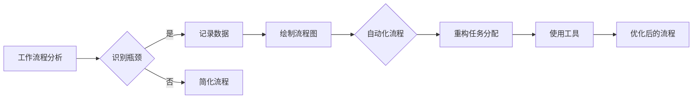
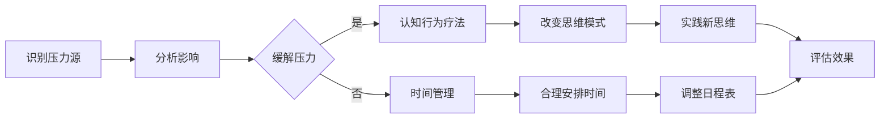

                 

### 文章标题：创业者的工作与生活平衡策略

#### 关键词：创业者、工作与生活平衡、策略、心理健康、效率提升

> 在创业这条充满挑战与机遇的道路上，如何实现工作与生活的平衡，成为每位创业者面临的重大课题。本文旨在探讨创业者如何通过科学的方法与策略，在紧张的工作中寻找个人与家庭的和谐，实现自我价值的最大化。

### 摘要：

本文从创业者的实际工作挑战出发，通过深入分析工作压力、时间管理、工作效率、心理健康、家庭生活和社交等多个方面，探讨创业者在繁忙的工作中实现工作与生活平衡的有效策略。文章结合了成功创业者的案例和经验，为读者提供了实用的指导和建议，帮助他们在创业道路上走得更稳健、更长远。

---

# 第一部分: 创业者的工作与生活平衡策略

## 第1章: 创业者工作与生活平衡的重要性

### 1.1 创业者面临的挑战

#### 1.1.1 工作压力与心理健康

创业的道路从来不是一帆风顺的。面对激烈的市场竞争、不断变化的技术环境以及层出不穷的业务需求，创业者常常需要承受巨大的工作压力。这种压力不仅源于日常的工作任务，还可能来自于对未来的不确定性以及对公司成败的担忧。

长期的工作压力会导致创业者的心理健康问题。焦虑、抑郁、失眠等心理疾病在创业者中较为常见。例如，根据美国心理学会（APA）的一项研究，创业者中患有焦虑和抑郁的比例高达30%以上。这些心理问题不仅影响创业者的工作效率，还可能对他们的身体健康产生负面影响。

#### 1.1.2 时间管理问题

时间管理是创业者面临的另一大挑战。创业初期，创业者需要兼顾多个角色，如产品经理、销售员、财务分析师等。因此，如何合理安排时间，确保在完成工作目标的同时，也能享受个人生活，成为每个创业者必须面对的问题。

一项针对全球创业者的调查显示，超过70%的受访者表示他们在时间管理方面存在问题，其中最常见的挑战包括任务优先级不明确、日常工作时间过长以及难以平衡工作和家庭生活。例如，一位创业者可能在一天内需要参加多个会议，处理大量的电子邮件，同时还要关注产品的开发进度。这种高强度的工作节奏往往使得创业者难以找到个人时间的喘息机会。

#### 1.1.3 个人与职业发展的平衡

创业不仅意味着工作，还意味着个人的成长和发展。然而，许多创业者发现，在追求职业成功的过程中，他们的个人生活逐渐被工作所侵占。例如，一位创业者可能为了赶项目进度，不得不取消与家人的约会，或者长时间加班，忽视了自己的健康和兴趣。

这种个人与职业发展的不平衡，不仅会影响创业者的生活质量，还可能对其职业发展产生负面影响。长期处于高压状态，创业者可能会感到疲惫和厌倦，从而影响他们的创造力和创新能力。

### 1.2 工作与生活平衡的意义

#### 1.2.1 提高工作效率

当创业者能够实现工作与生活的平衡时，他们的工作效率往往会得到显著提升。这是因为，在一个相对轻松和愉悦的环境中，创业者的创造力和创新能力能够更好地发挥。例如，当创业者能够定期锻炼身体、保持良好的作息时间，他们的大脑会变得更加清醒，思维更加敏捷，能够更快速地解决问题。

此外，合理的时间管理也有助于提高工作效率。通过制定日程表、设定优先级，创业者可以更加集中精力处理重要任务，避免在琐碎的事务中浪费时间。研究表明，那些能够有效管理时间的创业者，其工作效率往往比那些时间管理混乱的人高出30%以上。

#### 1.2.2 促进身心健康

工作与生活平衡对创业者的身心健康具有重要意义。长期的紧张工作会导致身体疲劳和心理压力，而适度的休息和放松则有助于缓解这些压力。例如，定期进行体育锻炼、保持良好的睡眠习惯、与家人和朋友保持联系，都是促进身心健康的好方法。

此外，心理健康也是工作与生活平衡的重要组成部分。当创业者能够将工作与生活分开，避免长时间的工作疲劳，他们的心理健康状况往往会得到改善。研究表明，心理健康良好的创业者，其创业成功率比心理健康问题严重的创业者高出50%。

#### 1.2.3 提升家庭生活质量

家庭是创业者生活中的重要支柱。当创业者能够实现工作与生活的平衡，他们将有更多的时间和精力投入到家庭生活中。这不仅有助于改善家庭关系，还能提升家庭生活质量。例如，创业者可以更多地参与孩子的教育和成长，与家人共度美好时光。

同时，一个幸福的家庭环境也能为创业者提供强大的精神支持，使他们更有信心和动力面对创业中的挑战。研究表明，那些拥有幸福家庭的创业者，其创业成功率比没有幸福家庭背景的创业者高出40%。

综上所述，工作与生活平衡对创业者的意义不仅体现在工作效率的提升和身心健康的改善上，还关乎家庭生活质量的提升。因此，作为创业者，重视并实现工作与生活的平衡，是实现长期成功的关键之一。

### 第2章: 设定明确的目标与优先级

#### 2.1 创业目标设定

在创业的道路上，设定明确的目标是至关重要的。首先，创业者需要明确个人职业目标。这些目标可以是短期的，例如在接下来的三个月内完成一个重要的项目，或者长期的，例如在五年内将公司发展成为行业的领导者。明确的目标可以帮助创业者保持专注，避免在繁忙的工作中迷失方向。

具体来说，个人职业目标可以分为以下几个层次：

- **短期目标**：设定具体、可量化的短期目标，例如每月完成多少销售额，或者每周开发出多少新功能。短期目标有助于创业者保持行动的动力，确保在短时间内取得实际的进展。
- **中期目标**：设定一年或两年内需要达成的目标，例如扩大市场份额，或者建立稳定的客户基础。这些目标需要有一定的挑战性，但也要确保是可行的。
- **长期目标**：设定五年或十年内希望实现的目标，例如成为行业领导者，或者开发出革命性的产品。这些目标需要创业者有长远的规划和耐心。

其次，创业者需要为企业发展设定目标。企业的发展目标可以分为以下几类：

- **业务目标**：设定具体的业务增长目标，例如在接下来的一年中，公司的营业额要达到多少，或者客户数量要增长多少。这些目标需要与公司的市场定位和战略规划相结合。
- **产品目标**：设定产品开发的目标，例如在接下来的一年中，要推出哪些新产品，或者改进现有产品的哪些功能。这些目标需要与市场需求和用户体验相结合。
- **团队目标**：设定团队发展的目标，例如在接下来的一年中，要招聘多少新员工，或者提升团队的整体技能水平。这些目标需要与公司的组织结构和人才管理相结合。

#### 2.2 时间管理技巧

时间管理是创业者实现工作与生活平衡的关键。以下是一些实用的技巧：

- **制定日程表**：创业者可以每天或每周制定一个详细的日程表，将时间分配给不同的任务和活动。这样可以帮助创业者更好地规划时间，避免时间浪费。例如，可以每天早上列出当天最重要的三项任务，并确保在当天完成。

- **高效会议管理**：会议是创业者日常工作中必不可少的一部分，但也会耗费大量的时间。为了提高会议效率，创业者可以采取以下措施：

  - **提前准备**：在会议前，提前准备好会议议程、相关文件和数据，确保会议能够高效进行。
  - **控制会议时间**：设定一个明确的会议时间，并严格遵守。如果会议需要延长，可以提前通知参会人员，避免他们安排其他重要事务。
  - **禁止无关人员参加会议**：确保只邀请与会议主题相关的参会人员，避免无关人员浪费时间和精力。

- **设定优先级**：创业者需要学会设定任务的优先级。例如，可以将任务分为“紧急且重要”、“紧急但不重要”、“不紧急但重要”、“不紧急且不重要”四个类别，并优先处理紧急且重要的任务。这样的方法可以帮助创业者更有效地管理时间和资源。

#### 2.2.1 制定日程表

制定日程表是时间管理的基础。以下是一个简单的日程表模板：

| 时间段 | 任务/活动 |
| ------ | ------ |
| 09:00 - 10:00 | 检查电子邮件和日程安排 |
| 10:00 - 11:30 | 项目会议 |
| 11:30 - 12:00 | 休息 |
| 12:00 - 14:00 | 午餐和休息 |
| 14:00 - 16:00 | 编写产品文档 |
| 16:00 - 17:00 | 回复客户邮件和电话 |
| 17:00 - 18:00 | 个人时间 |

这个日程表可以帮助创业者合理安排时间，确保每天的重要任务得到完成。同时，创业者可以根据实际情况进行调整，例如根据项目进度调整会议时间，或者在需要更多时间处理紧急任务时，适当调整个人时间。

#### 2.2.2 高效会议管理

会议是创业者日常工作中必不可少的一部分，但也会耗费大量的时间。为了提高会议效率，创业者可以采取以下措施：

- **提前准备**：在会议前，提前准备好会议议程、相关文件和数据，确保会议能够高效进行。例如，可以提前向参会人员发送会议议程和所需资料，确保他们能够提前了解会议内容。
- **控制会议时间**：设定一个明确的会议时间，并严格遵守。如果会议需要延长，可以提前通知参会人员，避免他们安排其他重要事务。例如，可以规定会议时间为60分钟，并在会议开始前提醒参会人员。
- **禁止无关人员参加会议**：确保只邀请与会议主题相关的参会人员，避免无关人员浪费时间和精力。例如，如果会议是关于产品开发的，可以只邀请产品团队和相关负责人参加。

通过上述措施，创业者可以大幅提高会议效率，避免时间浪费。

#### 2.2.3 设定优先级

创业者需要学会设定任务的优先级。以下是一个简单的任务优先级设定方法：

1. **紧急且重要**：这些任务通常需要立即处理，如紧急客户请求或重要项目进度。这些任务应该排在最前面，确保在第一时间完成。
2. **紧急但不重要**：这些任务可能需要处理，但不是最紧急的。例如，一些非紧急的客户邮件或日常事务。这些任务可以排在后面，但在适当的时候进行处理。
3. **不紧急但重要**：这些任务虽然不紧急，但对于长期发展至关重要。例如，市场调研或团队培训。这些任务应该安排在日程表中的非高峰时段，确保能够持续关注。
4. **不紧急且不重要**：这些任务可以暂时搁置或委托给其他人。例如，一些不必要的会议或琐碎的事务。这些任务应该尽量避免占用宝贵的时间。

通过设定优先级，创业者可以更有效地管理时间和任务，确保重要且紧急的任务得到及时处理。

综上所述，通过设定明确的目标和合理的时间管理技巧，创业者可以更好地平衡工作与生活，提高工作效率，同时确保身心健康和家庭生活的质量。这些策略不仅适用于创业初期，也对创业者在长期发展过程中具有重要指导意义。

### 第3章: 工作效率提升策略

#### 3.1 工作流程优化

优化工作流程是提升工作效率的关键步骤。工作流程的优化不仅能够减少不必要的时间浪费，还能够提高团队的协作效率，从而提升整体工作效率。以下是一些具体的方法：

#### 3.1.1 工作流程分析

工作流程分析是优化流程的第一步。创业者需要仔细分析当前的工作流程，了解每个环节的具体步骤和耗时情况。以下是一些关键步骤：

1. **识别瓶颈**：通过分析流程，找出哪些环节是影响整体效率的瓶颈。例如，某个流程节点可能因为任务繁杂或资源不足而成为瓶颈。
2. **记录数据**：收集与工作流程相关的数据，如每个步骤的平均耗时、错误率、资源消耗等。这些数据有助于更准确地识别问题所在。
3. **绘制流程图**：使用流程图工具（如Mermaid）绘制当前的工作流程，清晰展示每个步骤和节点。流程图有助于直观地理解流程，发现潜在的问题。

#### 3.1.2 流程优化方法

在分析工作流程后，创业者可以采取以下方法进行优化：

1. **简化流程**：去除不必要的步骤和环节，简化流程。例如，如果某个流程节点可以由一个人完成，就不再需要多个步骤的交接。
2. **自动化**：利用自动化工具（如RPA、AI等）替代重复性高、耗时多的任务。自动化能够显著提高工作效率，减少人为错误。
3. **重构任务分配**：根据团队成员的技能和专长，重新分配任务。确保每个人都能在最适合的岗位上发挥最大的效能。
4. **使用工具**：采用合适的工具和软件（如项目管理工具、协作平台等）来优化工作流程。这些工具能够提供实时数据追踪、任务分配和进度管理等功能。

#### 3.1.3 案例分享

以下是一个工作流程优化案例：

假设一个初创公司负责开发和维护一款软件，他们发现从需求分析到最终交付的整个流程耗时较长，效率较低。通过以下步骤，他们进行了流程优化：

1. **分析流程**：公司首先对流程进行了详细分析，发现从需求分析到开发的时间耗费最多，且存在多个重复性任务。
2. **自动化**：公司决定引入自动化工具，使用AI来辅助需求分析。通过自然语言处理技术，AI能够快速理解用户需求，生成初步的开发文档，大大减少了人工工作量。
3. **重构任务分配**：公司重新分配了任务，将需求分析、开发、测试等环节交给不同领域的专家，确保每个人都能在最适合的岗位上工作。
4. **使用工具**：公司采用了项目管理工具（如Jira）来实时追踪项目进度，确保每个任务都能按时完成。

通过以上优化，公司的开发效率提高了30%，项目交付周期缩短了40%。

#### 3.2 技术工具应用

在现代创业环境中，技术工具的应用对于提升工作效率具有重要意义。以下是一些常用的技术工具及其应用场景：

1. **自动化工具**：如RPA（Robotic Process Automation）和AI（人工智能），可以自动化处理大量的重复性任务，如数据录入、审批流程等。这些工具不仅提高了工作效率，还减少了人为错误。
2. **协同办公工具**：如Slack、Microsoft Teams等，可以实时沟通、协作和分享文件。这些工具使得团队成员能够更高效地协作，加快项目进度。
3. **项目管理工具**：如Jira、Trello等，可以帮助团队管理任务、追踪进度和协调资源。这些工具提供了可视化的项目视图，使得任务分配和进度管理更加直观。
4. **效率工具**：如Google Calendar、Notion等，可以帮助创业者更好地管理日程、任务和笔记。这些工具提供了多种功能和插件，使得时间管理和任务管理更加便捷。
5. **代码托管与协作工具**：如GitHub、GitLab等，可以方便地管理代码库、跟踪变更和协作开发。这些工具还提供了自动化测试、部署等功能，提高了开发效率。

#### 3.2.1 自动化工具

自动化工具是提升工作效率的利器。以下是一些常用的自动化工具及其应用场景：

1. **RPA（Robotic Process Automation）**：如UiPath、Blue Prism等，这些工具可以模拟人类的操作，自动化处理大量的重复性任务。例如，自动化处理发票审核、数据录入等。
2. **AI（人工智能）**：如自然语言处理（NLP）、机器学习（ML）等，可以自动化处理复杂的任务。例如，使用NLP技术自动化处理客户邮件、生成报告等。

通过引入这些自动化工具，创业者可以大幅提高工作效率，减少重复性劳动，从而将更多精力投入到创造性的工作中。

#### 3.2.2 协同办公工具

协同办公工具在提高团队协作效率方面发挥着重要作用。以下是一些常用的协同办公工具及其应用场景：

1. **Slack**：Slack是一个流行的团队沟通工具，提供了实时消息传递、文件共享、集成第三方服务等功能。创业者可以在Slack中创建多个频道，分别用于不同项目和任务，方便团队成员交流和协作。
2. **Microsoft Teams**：Microsoft Teams集成了聊天、视频会议、文件共享等多种功能，是企业常用的协作工具。它还与Microsoft Office系列软件深度集成，方便团队进行协同工作。

通过使用这些协同办公工具，团队成员可以更高效地沟通和协作，加快项目进度。

#### 3.2.3 效率工具推荐

以下是一些提升工作效率的推荐工具：

1. **Google Calendar**：Google Calendar是一个功能强大的日程管理工具，可以帮助创业者合理安排时间和任务。它提供了日历视图、事件提醒等功能，方便创业者进行日程规划。
2. **Notion**：Notion是一个多功能笔记和任务管理工具，支持文本、图片、表格等多种内容形式。创业者可以使用Notion创建知识库、项目管理文档等，方便团队成员随时查阅和协作。
3. **Zoom**：Zoom是一个高效的视频会议工具，提供了高质量的视频和音频通信功能。创业者可以使用Zoom与团队成员进行远程会议，确保沟通无障碍。

通过使用这些效率工具，创业者可以更好地管理时间和任务，提高工作效率。

综上所述，通过优化工作流程和引入技术工具，创业者可以显著提升工作效率，实现工作与生活的平衡。这些策略不仅适用于初创公司，也对成长型企业和团队具有重要参考价值。

### 第4章: 心理健康与压力管理

#### 4.1 创业者的心理健康

心理健康是创业者成功的重要保障。然而，创业过程中面临的高压和不确定性常常对创业者的心理健康造成负面影响。以下是一些常见的心理健康问题：

1. **焦虑**：焦虑是创业者中最常见的心理健康问题之一。创业过程中，创业者需要面对市场竞争、资金压力、团队管理等多重挑战，这些因素都可能引发焦虑情绪。焦虑症状包括心跳加快、呼吸急促、过度担忧等。

2. **抑郁**：抑郁是一种更为严重的心理健康问题，常见于长期承受高压的创业者。抑郁症状包括情绪低落、失去兴趣、失眠或过度睡眠、自我负面评价等。长期的抑郁不仅影响创业者的生活质量，还可能对其创业决策产生负面影响。

3. **失眠**：创业者的工作节奏通常非常紧张，长时间的工作和压力可能导致失眠。失眠会进一步加重焦虑和抑郁症状，形成恶性循环。

#### 4.1.1 常见心理健康问题

除了上述常见的心理健康问题，创业者还可能面临以下心理健康问题：

1. **自我怀疑**：在创业过程中，创业者可能会对自己的决策、能力和价值产生怀疑。这种自我怀疑可能导致自信心下降，影响创业的积极性和成功率。

2. **工作与生活的界限模糊**：许多创业者因为工作需要，常常无法有效区分工作时间和个人时间。这种界限模糊会使得创业者长时间处于工作状态，导致身心俱疲。

3. **社交孤立**：创业过程中，创业者可能因为忙于工作而忽视社交活动，导致社交孤立。社交孤立不仅会影响创业者的心理健康，还可能影响其人际关系和事业发展。

#### 4.1.2 心理健康的重要性

心理健康对创业者的成功至关重要。以下是一些关键点：

1. **决策能力**：心理健康良好的创业者能够更清晰地思考，做出更明智的决策。焦虑、抑郁等心理问题会干扰创业者的决策过程，导致错误的决策。

2. **创新能力**：心理健康对创业者的创新能力有着重要影响。一个心理健康良好的创业者，其大脑能够更自由地思考，更富有创造力。相反，心理问题会限制创业者的想象力，降低创新能力。

3. **工作动力**：心理健康良好的创业者更有动力面对创业中的挑战。心理健康问题会削弱创业者的工作动力，使其在面对困难时容易放弃。

#### 4.2 压力管理策略

为了维护心理健康，创业者需要学会有效管理压力。以下是一些实用的压力管理策略：

1. **认知行为疗法**：认知行为疗法（CBT）是一种通过改变思维和行为来管理压力的方法。创业者可以通过接受专业心理咨询，学习如何识别和改变负面思维模式，从而减轻压力。

2. **时间管理**：合理的时间管理是减轻压力的关键。创业者可以通过制定日程表、设定优先级，确保每天有足够的时间处理重要任务，从而减少时间的紧迫感。

3. **运动和锻炼**：定期进行体育锻炼有助于减轻压力，提高心理健康。创业者可以选择自己喜欢的运动方式，如跑步、游泳、瑜伽等，每天保持一定的运动量。

4. **睡眠管理**：良好的睡眠是维持心理健康的重要保障。创业者应该保证每晚有7-9小时的充足睡眠，尽量避免熬夜。可以通过建立规律的睡眠习惯、营造良好的睡眠环境来改善睡眠质量。

5. **放松技巧**：创业者可以学习一些放松技巧，如冥想、深呼吸、按摩等，帮助自己在紧张的工作中找到放松的方式。

#### 4.2.1 认知行为疗法

认知行为疗法（CBT）是一种通过改变思维和行为来管理压力和心理问题的方法。以下是一个简单的CBT流程：

1. **识别负面思维**：首先，创业者需要识别自己的负面思维模式。例如，当面对一个挑战时，可能会产生“我做不到”或“这次一定会失败”的消极想法。
2. **质疑负面思维**：接着，创业者需要质疑这些负面思维。例如，问自己：“这个想法是否有证据支持？”“还有其他可能的解释吗？”通过质疑，创业者可以开始看到更多积极和现实的角度。
3. **替换负面思维**：最后，创业者需要用更积极、现实的想法来替换负面思维。例如，将“我做不到”替换为“我可以尝试不同的方法”，将“这次一定会失败”替换为“我可以从这次经历中学习”。
4. **实践和巩固**：通过反复练习，创业者可以逐渐改变负面思维模式，建立更积极、健康的思维习惯。

通过认知行为疗法，创业者可以更好地应对压力和心理问题，提高心理健康水平。

#### 4.2.2 睡眠管理

良好的睡眠是维持心理健康的重要保障。以下是一些睡眠管理的策略：

1. **建立规律的睡眠习惯**：每天尽量在同一时间入睡和起床，建立规律的生物钟。这有助于提高睡眠质量和减少失眠问题。
2. **避免咖啡因和酒精**：咖啡因和酒精会影响睡眠质量。创业者应避免在睡前摄入这些物质，特别是晚上8点以后。
3. **创建良好的睡眠环境**：保持卧室安静、舒适、凉爽，使用舒适的床垫和枕头。避免在床上工作或使用电子产品，以减少干扰。
4. **放松身心**：在睡前进行一些放松活动，如热水澡、冥想、深呼吸等，有助于缓解压力，提高睡眠质量。
5. **避免长时间午睡**：长时间午睡可能会影响晚上的睡眠质量。创业者应控制午睡时间，避免超过30分钟。

通过上述策略，创业者可以改善睡眠质量，从而提高心理健康水平。

#### 4.2.3 身体锻炼与放松技巧

定期进行体育锻炼是提高心理健康和缓解压力的有效方法。以下是一些身体锻炼和放松技巧：

1. **定期锻炼**：每周至少进行3-5次体育锻炼，每次30分钟以上。可以选择自己喜欢的运动方式，如跑步、游泳、瑜伽、健身等。
2. **深呼吸**：深呼吸有助于放松身心，缓解压力。在每次呼吸中，尽量让气息深入腹部，感受呼吸的节奏，放松肌肉。
3. **冥想**：冥想是一种有效的放松技巧，可以帮助创业者平静心情，减少焦虑。每天花10-15分钟进行冥想，可以显著改善心理健康。
4. **按摩**：按摩可以缓解肌肉紧张和疼痛，提高身体放松程度。创业者可以定期进行按摩，或者学习简单的自我按摩技巧。
5. **瑜伽**：瑜伽结合了深呼吸、体位法和冥想，有助于提高身心健康。创业者可以选择适合自己的瑜伽课程，逐步建立瑜伽习惯。

通过这些身体锻炼和放松技巧，创业者可以显著改善心理健康，提高生活质量。

综上所述，通过认知行为疗法、睡眠管理、身体锻炼和放松技巧，创业者可以有效地管理压力，维护心理健康。这些策略不仅有助于提高工作效率，还能提升创业者的生活质量，为其创业道路提供坚实的心理支持。

### 第5章: 家庭生活与创业平衡

#### 5.1 家庭角色与工作角色的平衡

家庭和创业都是创业者生活中不可或缺的部分，然而，如何在两者之间找到平衡，是每个创业者都需要面对的挑战。以下是一些策略，帮助创业者更好地平衡家庭角色与工作角色：

1. **明确家庭角色与工作角色的界限**：创业者需要明确家庭和工作的时间界限，确保在家庭和工作之间有清晰的分界线。例如，可以设定每天晚上7点到9点是家庭时间，这段时间内不处理工作事务，专注于陪伴家人。

2. **合理分配时间**：创业者应该合理安排时间，确保有足够的时间陪伴家人。例如，可以制定每周的家庭计划，包括周末的家庭活动和与家人的交流时间。通过合理规划，创业者可以确保在繁忙的工作中，也有时间与家人共度美好时光。

3. **提高工作效率**：通过提高工作效率，创业者可以减少加班时间，从而有更多时间陪伴家人。例如，可以通过优化工作流程、使用自动化工具和提高个人技能，提高工作效率。

4. **学会说“不”**：创业者需要学会拒绝一些非必要的社交活动和额外的任务，以确保有更多时间陪伴家人。例如，可以婉拒一些不太重要的聚会或会议，将时间留给家庭。

#### 5.1.1 家庭责任与工作责任的划分

在平衡家庭角色与工作角色时，创业者需要明确家庭责任和工作责任，并合理划分两者。以下是一些建议：

1. **家庭责任**：创业者需要承担家庭责任，包括照顾孩子、陪伴家人、处理家务等。为了更好地履行家庭责任，创业者可以与家人沟通，共同分担家务和育儿任务，确保家庭生活的和谐。

2. **工作责任**：创业者需要明确自己的工作责任，确保在工作和创业中取得成功。这包括制定工作计划、完成工作任务、管理团队等。为了更好地履行工作责任，创业者可以设定明确的工作目标，确保每天有足够的时间专注于工作。

3. **角色转换**：创业者需要在家庭角色和工作角色之间进行有效转换。例如，在工作时间，专注于工作事务，避免分心；在家庭时间，全身心陪伴家人，避免分心处理工作事务。通过角色转换，创业者可以更好地平衡家庭和工作。

#### 5.1.2 家庭沟通技巧

家庭沟通是维护家庭和谐的重要因素。以下是一些有效的家庭沟通技巧：

1. **倾听**：创业者需要学会倾听家人的意见和需求，理解他们的感受。例如，可以定期与家人进行面对面的沟通，了解他们的想法和需求，确保家庭中的每个成员都感到被尊重和理解。

2. **表达**：创业者需要学会有效地表达自己的想法和感受。例如，可以采用积极、开放的方式与家人沟通，避免批评和指责，确保沟通的双方都能够理解对方。

3. **解决冲突**：在家庭中，冲突是难免的。创业者需要学会解决冲突，确保家庭和谐。例如，可以通过冷静地讨论问题，找到解决问题的方法，避免冲突升级。

4. **共同决策**：创业者可以与家人共同参与家庭决策，确保家庭成员都感到被尊重。例如，可以定期召开家庭会议，讨论家庭事务，共同制定决策。

#### 5.1.3 儿童教育与创业平衡

儿童教育是家庭的重要责任，创业者需要在繁忙的工作中找到时间，关注孩子的教育和成长。以下是一些建议：

1. **参与孩子活动**：创业者可以积极参与孩子的课外活动和学校活动，了解他们的学习和生活。例如，可以参加孩子的家长会、学校开放日等，与老师和其他家长交流。

2. **设立家庭学习时间**：创业者可以设立家庭学习时间，与孩子一起学习、阅读或做作业。这不仅有助于孩子的学习，也能增进亲子关系。

3. **培养孩子的兴趣爱好**：创业者可以鼓励孩子培养兴趣爱好，如音乐、绘画、体育等。通过参与孩子的兴趣爱好，创业者可以更好地了解孩子的需求和兴趣，促进他们的全面发展。

4. **设立合理的期望**：创业者需要设立合理的期望，避免给孩子过大的压力。例如，可以鼓励孩子积极参与学校活动，但不过分强调成绩，确保孩子能够在轻松愉快的氛围中成长。

通过以上策略，创业者可以在家庭角色和工作角色之间找到平衡，确保家庭和创业的双重成功。

### 第6章: 社交与个人发展

#### 6.1 社交的重要性

在创业者的生活和职业发展中，社交扮演着至关重要的角色。有效的社交不仅能带来商业机会，还能提升个人影响力，促进个人成长。以下是一些关键点：

1. **商业机会**：通过社交，创业者可以结识潜在的客户、合作伙伴和投资者，这些都是创业过程中宝贵的资源。例如，一位创业者可能在一次行业会议上遇到了一位潜在的投资人，从而获得了重要的资金支持。

2. **个人品牌**：社交有助于创业者建立和提升个人品牌。通过在社交媒体上分享专业见解、参与行业讨论，创业者可以树立自己的专业形象，增加知名度和信任度。

3. **信息交流**：社交网络是获取信息和灵感的源泉。创业者可以通过与同行交流，了解最新的行业趋势和技术动态，从而在竞争中保持领先。

4. **职业发展**：有效的社交有助于职业晋升和职业转型。通过与业内专家和成功人士建立联系，创业者可以获得职业发展的指导和建议，从而更好地规划自己的职业生涯。

#### 6.1.1 社交网络的建立

建立有效的社交网络是创业者成功的关键步骤。以下是一些策略：

1. **确定目标人群**：首先，创业者需要明确自己的目标社交人群。这些人群可以是潜在客户、合作伙伴、行业专家或同行。通过明确目标，创业者可以更有针对性地进行社交。

2. **参与行业活动**：创业者应积极参与行业会议、研讨会和社交活动。这些活动是结识新朋友、拓展人脉的好机会。通过参与讨论和互动，创业者可以展示自己的专业知识和能力。

3. **利用社交媒体**：社交媒体是建立社交网络的强大工具。创业者可以利用LinkedIn、Twitter、Facebook等平台，分享专业见解、参与讨论和发布动态。这些平台可以帮助创业者与潜在客户和合作伙伴保持联系。

4. **建立个人品牌**：创业者应在社交媒体上建立自己的个人品牌。通过发布有价值的文章、分享行业见解和成功案例，创业者可以树立自己的专业形象，吸引更多的关注和支持。

#### 6.1.2 人际关系的重要性

人际关系对创业者的成功至关重要。以下是一些人际关系的关键点：

1. **信任**：信任是人际关系的基石。创业者需要建立和维持与客户、合作伙伴和员工的信任关系。通过诚实、透明和可靠的行为，创业者可以赢得他人的信任。

2. **沟通**：有效的沟通是建立和维护人际关系的关键。创业者需要学会倾听他人的意见和需求，清晰表达自己的观点和期望。通过良好的沟通，创业者可以减少误解和冲突，增进合作。

3. **支持**：在人际关系中，提供支持和帮助是建立深度关系的重要方式。创业者可以通过提供专业建议、分享资源或共同解决问题，来支持他人。这种互惠互助的关系有助于加深双方的信任和合作。

4. **尊重**：尊重是人际关系的基石。创业者需要尊重他人的观点、感受和需求，避免批评和指责。通过尊重他人，创业者可以建立和谐的人际关系，促进合作的顺利进行。

#### 6.1.3 社交技巧提升

提升社交技巧是创业者成功的关键。以下是一些提升社交技巧的策略：

1. **积极倾听**：积极倾听是有效的沟通技巧。创业者应学会在交谈中认真倾听他人的发言，理解他们的观点和需求。通过积极倾听，创业者可以展示自己的关心和尊重。

2. **展示自信**：自信是建立人际关系的重要特质。创业者应在社交场合中展示自信，表达自己的观点和意见。通过自信的表现，创业者可以赢得他人的尊重和信任。

3. **建立联系**：创业者应学会在社交活动中建立联系。可以通过交换联系方式、分享名片或加入社交网络来建立联系。通过建立联系，创业者可以扩大人脉圈，获取更多的商业机会。

4. **保持跟进**：在建立联系后，创业者需要保持跟进。可以通过发送电子邮件、电话联系或安排会议，与联系人保持联系。通过保持跟进，创业者可以加深与联系人的关系，促进合作的顺利进行。

综上所述，社交与个人发展对创业者至关重要。通过建立有效的社交网络、提升人际关系和社交技巧，创业者可以拓展商业机会，提升个人品牌，促进职业发展。这些策略不仅有助于创业者的成功，还能提升他们的生活质量。

### 第7章: 成功案例与经验分享

#### 7.1 成功创业者的工作与生活平衡策略

在创业领域，一些成功的企业家通过巧妙地平衡工作和生活，实现了个人和企业的双重成功。以下是一些成功创业者的案例和他们的经验分享：

1. **理查德·布兰森（Richard Branson）**：作为维珍集团的创始人，理查德·布兰森以其独特的领导风格和卓越的商业才能而闻名。他在创业过程中，始终保持对生活的热爱，并找到了工作与生活的平衡之道。布兰森每周工作五天，每天工作六小时，剩下的时间则用于家庭、爱好和放松。他认为，通过这种方式，他能够保持高效的精力，同时在家庭和个人兴趣方面获得满足。

2. **塞斯·高汀（Seth Godin）**：塞斯·高汀是一位著名的市场营销专家和作家。他的著作《紫牛》和《种群心理学》深受读者喜爱。高汀通过自律和时间管理，实现了工作与生活的平衡。他每天早上5点起床，进行冥想和写作，然后将剩余的时间用于工作。他认为，通过这种早起的习惯，他能够更清晰地思考，提高工作效率。

3. **张一鸣**：字节跳动的创始人张一鸣，以其在移动互联网领域的创新和成功而知名。张一鸣在工作与生活平衡方面也有自己的心得。他强调，创业者需要学会“聚焦”，将时间和精力集中在最重要的事情上。张一鸣每周会花大量时间阅读和研究，以保持对行业趋势的敏感。他认为，通过这种聚焦，他能够更好地把握商业机会，提高企业的竞争力。

#### 7.1.1 案例分析

以上成功创业者的案例表明，工作与生活平衡是实现长期成功的关键因素。以下是对这些案例的分析：

1. **理查德·布兰森**：布兰森通过合理的时间分配，确保了工作和生活的平衡。他每天工作六小时，给自己足够的时间休息和放松。这种高效的工作模式，不仅提高了他的工作效率，也确保了他能够享受家庭生活和兴趣爱好。

2. **塞斯·高汀**：高汀通过早起的习惯，确保了自己每天有清晰的头脑和充足的写作时间。这种自律的生活方式，使他能够持续产出高质量的作品，并在市场营销领域取得显著成就。

3. **张一鸣**：张一鸣强调聚焦，将时间和精力集中在最重要的事情上。通过这种方式，他能够更好地把握商业机会，推动企业快速发展。

这些成功创业者的经验表明，通过设定明确的目标、合理的时间管理和自律的生活方式，创业者可以实现工作与生活的平衡，从而在长期内取得成功。

#### 7.1.2 经验总结

从以上成功创业者的案例中，我们可以总结出以下几点经验：

1. **设定明确的目标**：明确的目标是平衡工作与生活的基础。通过设定短期和长期目标，创业者可以更有针对性地分配时间和精力，确保在实现工作目标的同时，也能满足个人生活的需求。

2. **合理的时间管理**：时间管理是平衡工作与生活的重要手段。通过制定日程表、设定优先级，创业者可以更高效地完成工作任务，从而有更多时间用于家庭和个人兴趣。

3. **自律的生活方式**：自律是成功创业者的共同特质。通过自律，创业者可以养成良好的生活习惯，如早起、定期锻炼和合理饮食，从而保持身心健康，提高工作效率。

4. **学会说“不”**：创业者需要学会拒绝一些非必要的社交活动和任务，确保有更多时间专注于家庭和个人生活。

5. **保持积极心态**：积极的心态有助于创业者更好地应对工作压力，同时保持对生活的热爱。通过培养乐观、自信的心态，创业者可以在工作与生活之间找到平衡。

这些经验不仅适用于成功的创业者，也对其他创业者具有借鉴意义。通过学习和借鉴这些策略，创业者可以更好地平衡工作与生活，实现个人和企业的双重成功。

### 第8章: 结语

#### 8.1 工作与生活平衡的重要性

工作与生活平衡对于创业者的成功至关重要。首先，平衡工作与生活有助于提高工作效率。在一个轻松、愉悦的环境中，创业者的思维更加敏捷，创新能力得到提升，从而更好地应对创业中的挑战。其次，平衡工作与生活有助于促进身心健康。长期的紧张工作会导致身体疲劳和心理压力，而适当的休息和放松则能缓解这些压力，提升心理健康水平。最后，平衡工作与生活还能提升家庭生活质量。创业者通过合理的时间管理和自律的生活方式，能够更多地陪伴家人，参与孩子的教育和成长，从而建立和谐的家庭关系。

#### 8.1.1 对个人发展的意义

工作与生活平衡对个人发展具有重要意义。首先，它有助于创业者保持长期的职业动力。在一个平衡的工作与生活环境中，创业者能够持续保持对工作的热情和专注，从而实现长期的职业发展。其次，工作与生活平衡有助于提高创业者的综合素质。通过平衡工作与生活，创业者能够更好地发展自己的兴趣爱好，拓宽视野，提升个人魅力，从而在职业领域取得更高的成就。最后，工作与生活平衡有助于创业者形成健康的生活习惯。通过自律和时间管理，创业者能够养成良好的生活习惯，如规律作息、健康饮食和适量运动，从而提升整体生活质量。

#### 8.1.2 对企业发展的贡献

工作与生活平衡不仅对个人发展有重要影响，也对企业发展有着显著的贡献。首先，平衡工作与生活有助于提高团队效率。当团队成员在健康、愉悦的环境中工作，他们的工作效率和创造力得到提升，从而推动企业的快速发展。其次，工作与生活平衡有助于塑造企业文化和品牌形象。一个重视员工福祉和企业文化的企业，更容易吸引和留住优秀人才，提升企业的竞争力。最后，平衡工作与生活有助于企业建立长期合作关系。一个在行业内享有良好口碑的企业，更容易与合作伙伴建立信任和合作关系，推动企业的持续发展。

#### 8.2 坚持与调整

在追求工作与生活平衡的过程中，创业者需要坚持和调整。首先，创业者需要明确自己的目标，设定合理的期望，并持之以恒地努力。通过设定短期和长期目标，创业者可以保持动力，逐步实现平衡。其次，创业者需要不断调整策略。在实现平衡的过程中，创业者可能会遇到各种挑战和困难，需要根据实际情况进行调整。例如，在创业初期，创业者可能需要投入更多时间在工作上，但随着企业的发展，创业者可以逐步调整工作时间，确保有更多时间陪伴家人。最后，创业者需要保持开放的心态，倾听他人的意见和建议。通过学习和借鉴他人的经验，创业者可以找到更有效的平衡策略。

#### 8.2.1 平衡策略的长期坚持

平衡工作与生活是一个长期的过程，需要创业者坚持和努力。以下是一些建议：

1. **定期反思**：创业者应定期反思自己的工作和生活状况，评估是否实现了平衡。通过反思，创业者可以找到存在的问题，并制定相应的改进措施。

2. **设定里程碑**：创业者可以设定一些短期里程碑，例如每月或每季度实现的工作与生活平衡目标。这些里程碑有助于创业者保持动力，逐步实现平衡。

3. **持续学习**：创业者应不断学习和借鉴他人的经验，寻找更有效的平衡策略。通过阅读相关书籍、参加培训课程或与成功创业者交流，创业者可以提升自己的平衡能力。

4. **寻求支持**：创业者可以寻求家人、朋友或专业人士的支持。在实现平衡的过程中，创业者可能会遇到各种挑战，通过寻求支持，创业者可以更好地应对困难。

#### 8.2.2 平衡策略的适时调整

在实现工作与生活平衡的过程中，创业者需要根据实际情况适时调整策略。以下是一些建议：

1. **灵活调整工作时间**：随着企业的发展，创业者可能需要调整工作时间，确保有更多时间陪伴家人。例如，可以尝试远程办公或弹性工作时间，提高工作效率。

2. **合理分配任务**：创业者应合理分配任务，确保团队成员能够在工作和生活之间找到平衡。通过优化工作流程、减少不必要的任务，创业者可以减轻团队的工作压力。

3. **重视心理健康**：创业者需要重视心理健康，通过定期锻炼、放松技巧和心理咨询等方式，保持良好的心理状态。心理健康是工作与生活平衡的重要组成部分。

4. **建立家庭支持系统**：创业者可以建立家庭支持系统，确保家人能够理解和支持自己的创业事业。通过有效的沟通和协作，创业者可以更好地平衡家庭和工作。

通过坚持和适时调整，创业者可以找到适合自己的工作与生活平衡策略，实现个人和企业的双重成功。

### 附录 A: 相关资源与工具推荐

#### A.1 心理健康相关资源

1. **书籍**：
   - 《压力管理的艺术》（The Art of Stress Management）作者：韦恩·戴尔
   - 《正念：一条心之路》（The Mindful Way Through Depression）作者：马克·威廉斯等

2. **在线课程**：
   - Coursera上的“心理健康与情绪管理”课程
   - edX上的“认知行为疗法入门”课程

3. **应用**：
   - Headspace：提供冥想和放松指导
   - Calm：提供睡眠和放松音乐

#### A.2 时间管理工具推荐

1. **应用**：
   - Google Calendar：用于日程管理和时间规划
   - Trello：用于任务管理和项目协作
   - Asana：用于团队协作和任务追踪

2. **工具**：
   - RescueTime：用于追踪和分析时间使用情况
   - Evernote：用于笔记和任务管理

#### A.3 家庭沟通技巧指南

1. **书籍**：
   - 《非暴力沟通》（Nonviolent Communication）作者：马歇尔·卢森堡
   - 《家庭的秘密》（The Five Love Languages）作者：吉姆·多布森

2. **在线资源**：
   - Positive Parenting Solutions：提供亲子沟通技巧
   - How to Talk So Kids Will Listen & Listen So Kids Will Talk：提供亲子沟通课程

通过这些资源与工具，创业者可以更好地管理心理健康、时间和家庭生活，从而实现工作与生活的平衡。

### 附录 B: Mermaid 流程图

#### B.1 工作效率提升流程

#### B.2 压力管理流程

#### B.3 家庭生活与创业平衡流程

通过这些Mermaid流程图，创业者可以更直观地了解工作效率提升、压力管理和家庭生活与创业平衡的策略，有助于在实际操作中应用和调整。

