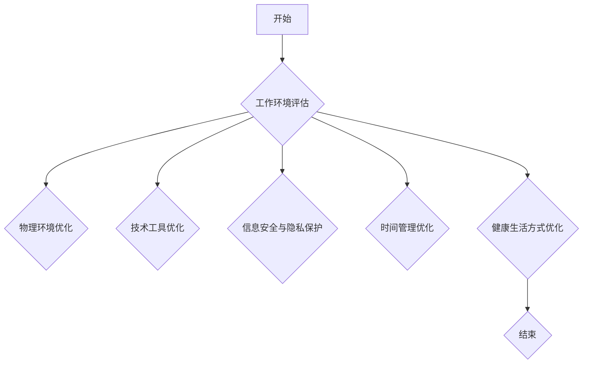

                 


### 引言

在当今高速发展的商业环境中，创业者的成功往往与其工作效率和工作环境的优化密切相关。一个高效的工作环境不仅能够帮助创业者更好地集中注意力，还能大幅度提升其工作效率，减少工作疲劳，从而实现工作与生活的平衡。因此，工作环境的优化已经成为创业者成功路上的重要一环。

本文旨在为创业者提供一套完整的工作环境优化策略，通过逐步分析推理，我们将从工作环境评估、物理工作环境优化、技术工具优化、时间管理与自我提升等多个方面进行深入探讨。通过这些小技巧，创业者将能够显著提高工作效率，减少无谓的时间浪费，从而更加专注于核心业务。

文章将按照以下结构进行展开：

1. **工作环境评估与优化**：首先，我们将探讨如何评估创业者的工作环境，识别存在的问题，并提出相应的优化策略。
2. **技术工具优化**：接着，我们将介绍如何选择和使用高效的技术工具，包括办公软件、云计算与协作工具等。
3. **时间管理与自我提升**：然后，我们将讨论时间管理技巧和自我提升的方法，帮助创业者更好地规划工作和个人发展。
4. **健康生活方式**：最后，我们将关注创业者的健康生活方式，包括饮食、休息和压力管理等方面，确保身心健康。

通过本文的阅读，创业者将获得一套系统的工作环境优化方案，从而在繁忙的工作中找到更多的平衡与效率。

#### 文章关键词

- 创业者
- 工作效率
- 工作环境优化
- 技术工具
- 时间管理
- 健康生活方式

#### 摘要

本文针对创业者的工作环境优化问题，提出了一系列有效的小技巧和策略。首先，通过对创业者工作环境的评估，识别出存在的问题，并提出了具体的优化方案。接着，本文介绍了如何选择和使用高效的技术工具，如办公软件、云计算和项目管理工具。此外，文章还讨论了时间管理和自我提升的方法，以及健康生活方式的重要性。通过这些策略，创业者将能够显著提升工作效率，减少无谓的时间浪费，实现工作与生活的平衡。本文旨在为创业者提供一套全面且实用的优化指南，帮助其在竞争激烈的商业环境中脱颖而出。

### 目录大纲

1. **引言**
2. **第一部分：工作环境评估与优化**
    1. **第1章：工作环境评估**
        1.1 创业者工作环境现状分析
        1.2 工作效率评估指标
        1.3 工作环境评估流程
    2. **第2章：工作环境优化策略**
        2.1 优化空间分析
        2.2 人机工程学原则
        2.3 优化方案设计
    3. **第3章：物理工作环境优化**
        3.1 办公室布局与设计
        3.2 舒适桌椅选择
        3.3 照明与噪音控制
4. **第二部分：技术工具优化**
    4. **第4章：办公软件与工具的选择**
        4.1 高效办公软件推荐
        4.2 工作流程自动化
        4.3 数字工具搭配使用
    4. **第5章：技术工具提升效率**
        5.1 云计算与协作工具
        5.2 数据分析与可视化
        5.3 项目管理工具应用
    4. **第6章：信息安全与隐私保护**
        6.1 信息安全意识培养
        6.2 数据安全措施
        6.3 隐私保护策略
5. **第三部分：时间管理与自我提升**
    4. **第7章：时间管理技巧**
        7.1 时间管理基础
        7.2 时间管理工具
        7.3 时间管理策略
    4. **第8章：自我提升与职业发展**
        8.1 学习习惯培养
        8.2 自我提升方法
        8.3 职业发展规划
6. **第四部分：健康生活方式**
    4. **第9章：健康生活方式**
        9.1 健康饮食与运动
        9.2 休息与放松
        9.3 应对压力与焦虑
7. **第五部分：实战案例与应用**
    4. **第10章：创业者的工作环境优化实践**
        10.1 创业者案例分享
        10.2 实践方法与经验总结
        10.3 成功案例分析
    4. **第11章：工作环境优化与效率提升**
        11.1 效率提升策略回顾
        11.2 未来工作环境趋势预测
        11.3 创业者工作环境优化指南
8. **附录**
    4. **附录 A：工具与资源推荐**
        4.1 办公软件与工具
        4.2 时间管理工具
        4.3 自我提升资源
    4. **附录 B：工作环境优化研究**
        4.1 国内外研究现状
        4.2 研究方法与数据来源
        4.3 研究结论与建议
        4.4 Mermaid 流程图示例
        4.5 伪代码示例
        4.6 数学模型和公式示例
        4.7 代码实际案例与解读

### 第一部分：工作环境评估与优化

#### 第1章：工作环境评估

在创业的道路上，高效的工作环境是成功的关键。创业者需要在一个能够激发创造力和提升工作效率的环境中工作，而这就要求对当前的工作环境进行全面的评估和优化。本章节将探讨如何对创业者的工作环境进行评估，识别其中存在的问题，并提出相应的优化策略。

### 1.1 创业者工作环境现状分析

首先，创业者需要对其工作环境进行全面的现状分析。这包括以下几个方面：

- **物理环境**：办公场所的物理环境，如办公室的大小、布局、光线和噪音水平等。
- **工具和设备**：包括计算机、网络连接、通讯设备等，这些设备是否能够满足创业者的工作需求。
- **软件环境**：创业者所使用的办公软件和工具，如文档处理、项目管理、协作工具等，这些工具是否高效且易用。
- **人际关系**：与同事、上级和下属的人际关系，这些关系是否和谐且能够促进工作效率。
- **工作流程**：创业者的工作流程是否合理，是否存在重复劳动或低效环节。

### 1.2 工作效率评估指标

为了有效地评估工作环境对工作效率的影响，创业者需要设置一系列的效率评估指标。以下是一些常用的评估指标：

- **完成时间**：完成特定任务所需的时间。
- **准确率**：任务完成的准确度。
- **工作负荷**：创业者每天的工作量和任务数量。
- **任务重复率**：重复性任务的比例。
- **协作效率**：团队协作的效率，包括沟通、决策和任务分配等。

### 1.3 工作环境评估流程

进行工作环境评估的流程可以分为以下几个步骤：

1. **明确评估目的**：首先，创业者需要明确评估的目的，是优化物理环境、提升技术工具的使用效率，还是改善人际关系和工作流程。
2. **收集数据**：通过问卷调查、访谈、工作日志等方式，收集关于工作环境的详细信息。
3. **数据分析**：对收集到的数据进行整理和分析，识别出存在的问题和瓶颈。
4. **制定优化方案**：根据分析结果，制定具体的工作环境优化方案。
5. **实施与跟踪**：执行优化方案，并定期跟踪和评估优化效果。

### 1.4 优化策略

在明确了工作环境现状和效率评估指标后，创业者可以采取以下策略进行优化：

- **物理环境优化**：改善办公室布局，确保光线充足、噪音低，提供舒适的桌椅等。
- **技术工具优化**：选择合适的办公软件和工具，如文档处理、项目管理、协作工具等，并培训员工使用这些工具。
- **工作流程优化**：通过自动化工具或流程优化，减少重复劳动，提高工作效率。
- **人际关系优化**：改善与同事、上级和下属的关系，建立良好的团队协作氛围。

通过上述策略，创业者可以显著提升工作效率，为企业的持续发展打下坚实基础。

### 第2章：工作环境优化策略

#### 2.1 优化空间分析

在优化工作环境时，空间分析是一个关键步骤。合理利用空间不仅能够提升工作效率，还能创造一个更加舒适和高效的办公环境。以下是一些空间分析的方法和原则：

1. **功能区划分**：根据工作内容和需求，将办公空间划分为不同的功能区，如办公区、会议区、休息区等。这样可以确保员工能够在一个专门的环境中专注于自己的任务，避免干扰。
2. **人员密度评估**：合理分配办公座位，避免过度拥挤。过高的人员密度会导致工作效率下降，增加工作压力。通过评估人员密度，可以确保每个员工都有足够的空间进行工作。
3. **流动性和可达性**：优化办公空间的布局，确保员工能够在不同的功能区之间自由流动，减少行走时间。同时，确保关键设施（如打印区、饮水机等）的可达性，以提升工作效率。

#### 2.2 人机工程学原则

人机工程学原则在办公环境设计中至关重要。以下是一些基本原则：

1. **人体工学设计**：为员工提供符合人体工学设计的桌椅，确保员工在长时间工作中能够保持正确的坐姿，减少身体疲劳。
2. **视觉舒适度**：确保办公环境中的光线充足，避免反光和眩光。使用适当的照明设备，如LED灯，可以提供均匀的光线分布，减少眼睛疲劳。
3. **空气流通**：保持良好的空气流通，避免空气污浊。可以通过开窗或安装空气净化设备来改善空气质量。
4. **温度控制**：保持办公环境的温度适宜，避免过冷或过热。适当的温度可以提升员工的工作效率和舒适度。

#### 2.3 优化方案设计

在制定优化方案时，创业者需要综合考虑上述空间分析和人机工程学原则，并结合企业的具体需求进行设计。以下是一些设计步骤：

1. **需求分析**：明确企业的具体需求，如空间大小、人员数量、工作流程等。
2. **方案规划**：根据需求分析，制定初步的空间规划和布局方案。
3. **方案评估**：对初步方案进行评估，包括功能性、舒适性和成本效益等方面。
4. **方案调整**：根据评估结果，对方案进行调整和优化，确保最终方案能够满足企业的需求。
5. **实施与跟踪**：执行优化方案，并定期跟踪和评估优化效果，根据反馈进行进一步调整。

通过以上步骤，创业者可以设计出一个高效、舒适的工作环境，从而提升员工的工作效率和满意度。

### 第3章：物理工作环境优化

一个良好的物理工作环境是创业者高效工作的基础。本章将探讨如何通过优化办公室布局、舒适桌椅选择以及照明与噪音控制等方面，来提升创业者的工作效率。

#### 3.1 办公室布局与设计

办公布局对于提升工作效率至关重要。以下是一些建议：

1. **开放式办公布局**：开放式办公布局能够促进员工之间的沟通和协作，提高团队的整体效率。但同时，需要注意适当的隐私保护，避免过度干扰。
2. **灵活空间**：设置灵活的工作区域，如移动工作站和共享空间，以适应不同的工作需求和员工偏好。
3. **模块化设计**：使用模块化家具，可以根据需求灵活调整办公空间。例如，可以使用可移动的屏风或隔断来创建独立的办公区域。
4. **自然光线**：充分利用自然光线，设置大面积的窗户，使用透明隔断，以提升办公环境的明亮度和舒适度。

#### 3.2 舒适桌椅选择

桌椅是创业者日常工作中接触最频繁的办公设备，选择合适的桌椅能够有效减少身体疲劳，提高工作效率。以下是一些建议：

1. **人体工学设计**：选择符合人体工学原理的桌椅，确保椅子的高度、扶手和背部的曲线能够贴合员工的身体，减少长时间工作带来的身体疲劳。
2. **可调节性**：桌椅应具备高度调节功能，以适应不同身高员工的舒适需求。
3. **支撑性**：椅子的座椅和靠背应提供足够的支撑，减少腰背疼痛。
4. **稳定性**：选择稳固的桌椅，避免摇晃或移动，确保员工在办公过程中安全稳定。

#### 3.3 照明与噪音控制

照明和噪音是影响创业者工作效率的重要因素。以下是一些建议：

1. **照明设计**：确保办公环境中光线充足，避免过度依赖人工光源。使用可调节亮度的灯具，以适应不同的工作需求和光线条件。
2. **自然光源**：充分利用自然光源，通过窗户或透明隔断引入自然光线，减少人工照明的使用。
3. **噪音控制**：采取隔音措施，如安装隔音板或使用隔音窗户，减少外部噪音干扰。同时，优化室内声学设计，避免回音和噪音。
4. **背景音乐**：合理选择背景音乐，可以提升工作氛围，减少工作压力。但需避免音量过大，以免影响员工注意力。

通过上述优化措施，创业者可以显著提升其工作环境的舒适度和工作效率。一个良好的物理工作环境，不仅能够提升员工的工作积极性，还能促进企业的长期发展。

### 第二部分：技术工具优化

在创业者的工作中，选择和使用合适的技术工具是提升效率的关键。本章节将详细探讨如何选择办公软件与工具，以及如何通过这些工具实现工作流程的自动化和数字工具的搭配使用。

#### 第4章：办公软件与工具的选择

现代办公软件和工具的丰富多样性使得创业者可以轻松地找到满足各种工作需求的解决方案。以下是一些高效办公软件与工具的选择建议：

#### 4.1 高效办公软件推荐

1. **文档处理软件**：如Microsoft Word、Google Docs等，提供强大的编辑、排版和协作功能，适用于撰写报告、编写文档等。
2. **电子表格软件**：如Microsoft Excel、Google Sheets等，用于数据分析和报表生成，功能强大且易于使用。
3. **项目管理工具**：如Trello、Asana、Jira等，帮助创业者管理项目进度、任务分配和团队协作。
4. **邮件和通讯工具**：如Microsoft Outlook、Gmail等，提供高效的邮件管理功能和即时通讯工具，便于日常沟通和协作。
5. **日历管理工具**：如Google Calendar、iCalendar等，帮助创业者更好地安排日程和会议。

#### 4.2 工作流程自动化

自动化工具能够大大减少重复性工作，提高工作效率。以下是一些常用的自动化工具：

1. ** Zapier**：通过连接不同的应用，实现自动化任务，如自动将Gmail中的新邮件分配到Trello的任务板。
2. **IFTTT**：提供简单易用的自动化服务，通过触发器和动作，实现自动化任务，如新建Gmail邮件时自动备份到Google Drive。
3. **Zoho Workflow**：提供全面的自动化工作流程解决方案，支持各种业务应用，如CRM、ERP等。

#### 4.3 数字工具搭配使用

将多种数字工具搭配使用，可以打造一个高效的数字工作环境。以下是一些建议：

1. **集成工具**：使用集成工具如Slack或Microsoft Teams，将不同的应用整合到一个平台中，方便团队成员之间的沟通和协作。
2. **云存储服务**：如Google Drive、Dropbox等，提供安全、便捷的文件存储和共享服务，便于团队成员协作。
3. **数据分析工具**：如Tableau、Google Data Studio等，用于数据分析和可视化，帮助创业者更好地理解和利用数据。
4. **客户关系管理（CRM）系统**：如HubSpot、Salesforce等，用于管理客户信息、销售机会和市场营销活动，提升销售效率。

通过上述方法，创业者可以充分利用现代技术工具，实现工作流程的自动化和数字化，从而大幅提升工作效率，为企业的持续发展打下坚实基础。

### 第5章：技术工具提升效率

在创业的过程中，技术工具的有效使用可以大幅提升工作效率，节省时间和精力，从而将更多的关注点放在核心业务上。本章节将深入探讨云计算与协作工具、数据分析和可视化工具、以及项目管理工具在实际工作中的应用，帮助创业者充分利用这些技术工具提升效率。

#### 5.1 云计算与协作工具

云计算和协作工具的普及，使得创业者能够更加灵活地管理数据和资源，提升团队协作效率。以下是一些关键工具和其应用场景：

1. **云计算平台**：如Amazon Web Services（AWS）、Microsoft Azure和Google Cloud等，提供了强大的计算能力、存储服务和网络功能，使得创业者可以在无需大量投资硬件的情况下，快速搭建和扩展IT基础设施。创业者可以利用云计算平台部署应用、进行数据分析和存储。

    **应用场景**：
    - **应用部署**：通过云服务器快速部署应用程序，实现弹性扩展，以应对流量高峰。
    - **数据存储**：利用云存储服务，如Amazon S3和Google Cloud Storage，存储大量数据，保证数据的安全性和可用性。
    - **数据分析**：利用云计算平台进行大数据分析，处理大量数据，挖掘有价值的信息。

2. **协作工具**：如Google Workspace（包含Google Docs、Google Sheets等）、Microsoft 365和Slack等，提供便捷的文档协作、日程管理和即时通讯功能。

    **应用场景**：
    - **文档协作**：团队成员可以实时编辑文档，进行协同工作，提高工作效率。
    - **日程管理**：使用共享日历，方便团队成员安排会议和任务，避免冲突。
    - **即时通讯**：通过即时消息和视频会议，团队成员可以随时沟通，提高决策速度。

#### 5.2 数据分析与可视化

数据分析工具和可视化技术能够帮助创业者从海量数据中提取有价值的信息，做出更明智的商业决策。以下是一些关键工具和其应用场景：

1. **数据分析工具**：如Tableau、Power BI和Google Data Studio等，提供了强大的数据连接、处理和分析功能。

    **应用场景**：
    - **业务指标监控**：实时监控关键业务指标（KPI），如销售额、客户留存率等，帮助创业者快速识别问题并采取行动。
    - **市场趋势分析**：分析市场数据和用户行为，了解行业趋势和竞争对手动态，制定更有效的市场策略。

2. **数据可视化工具**：如D3.js、Chart.js等，用于创建直观、易理解的数据可视化图表。

    **应用场景**：
    - **用户行为分析**：通过用户行为数据可视化，了解用户访问路径、点击率等，优化用户体验。
    - **产品表现分析**：通过产品销售数据可视化，分析不同产品的表现，优化产品组合和营销策略。

#### 5.3 项目管理工具应用

项目管理工具能够帮助创业者更好地规划和管理项目，确保项目按计划顺利进行。以下是一些关键工具和其应用场景：

1. **项目管理软件**：如Trello、Asana、Jira和Notion等，提供了任务管理、进度跟踪和团队协作功能。

    **应用场景**：
    - **任务分配与跟踪**：将项目任务分配给团队成员，跟踪任务进度，确保每个任务按时完成。
    - **进度监控**：通过甘特图、看板图等视图，实时监控项目进度，及时发现并解决问题。
    - **团队协作**：团队成员可以实时沟通，分享文件和资源，提高团队协作效率。

2. **敏捷开发工具**：如Jira和Trello，适用于敏捷开发团队，提供迭代规划和任务跟踪功能。

    **应用场景**：
    - **迭代规划**：在每次迭代开始时，规划待完成的任务，确保项目按时交付。
    - **故事点估算**：通过故事点估算任务难度，合理分配开发资源，提高项目效率。

通过上述技术工具的有效应用，创业者可以显著提升工作效率，优化业务流程，为企业的快速发展和成功打下坚实基础。

### 第6章：信息安全与隐私保护

在当今数字化时代，信息安全与隐私保护是创业者不可忽视的重要议题。随着企业信息的日益重要和多样化，确保数据安全已成为提高工作效率和保障企业稳定运营的关键。以下将从信息安全意识培养、数据安全措施以及隐私保护策略三个方面进行探讨。

#### 6.1 信息安全意识培养

信息安全始于意识，只有员工具备足够的安全意识，才能有效地防止数据泄露和网络攻击。以下是一些建议：

1. **定期的安全培训**：为员工提供定期的信息安全培训，包括如何识别和防范网络钓鱼、恶意软件、社交工程等常见威胁。通过培训，提高员工的安全意识和应对能力。
2. **安全意识宣传**：在办公环境中定期宣传信息安全知识，通过海报、宣传册和内部邮件等方式，提醒员工注意信息安全的各个环节。
3. **安全事件回顾**：定期组织安全事件回顾，分析企业内部或外部的安全事件，总结经验教训，提高员工的安全防范能力。

#### 6.2 数据安全措施

数据是企业的核心资产，确保数据安全至关重要。以下是一些关键措施：

1. **访问控制**：通过权限管理和身份验证机制，确保只有授权人员能够访问敏感数据。使用双重认证（2FA）等高级验证手段，提高账户安全性。
2. **数据备份与恢复**：定期备份关键数据，并确保备份数据的存储安全。在发生数据丢失或系统故障时，能够快速恢复数据，减少业务中断。
3. **加密技术**：对敏感数据进行加密处理，确保数据在传输和存储过程中的安全性。使用SSL/TLS等加密协议保护网络通信。
4. **网络安全**：部署防火墙、入侵检测系统和防病毒软件等网络安全工具，防止外部攻击和数据泄露。

#### 6.3 隐私保护策略

随着数据隐私法规的日益严格，确保用户隐私保护已成为企业的法律责任。以下是一些关键策略：

1. **隐私政策制定**：制定清晰的隐私政策，明确企业如何收集、使用和保护用户数据，并向用户公开。
2. **数据最小化原则**：只收集必要的数据，避免过度收集。对收集的数据进行分类和管理，确保数据使用的合法性和最小化。
3. **用户知情同意**：在收集和使用用户数据时，获得用户的明确同意。确保用户了解其数据的用途和处理方式。
4. **数据匿名化**：对敏感数据进行匿名化处理，避免用户隐私泄露。在进行数据分析和报告时，确保无法识别个别用户。

通过上述信息安全与隐私保护措施，创业者可以有效地防范数据泄露和网络攻击，保障企业数据的安全和用户的隐私，从而提高工作效率，增强企业的市场竞争力。

### 第7章：时间管理技巧

在快速发展的商业环境中，时间管理成为创业者成功的关键因素之一。科学的时间管理不仅能提高工作效率，还能帮助创业者更好地平衡工作与生活，实现个人和职业发展的目标。以下将介绍一些基础时间管理技巧、实用的时间管理工具以及有效的策略。

#### 7.1 时间管理基础

时间管理的基础在于明确目标和任务，合理安排时间，确保任务的优先级得到有效执行。以下是一些基础的时间管理概念：

1. **目标设定**：明确个人和团队的目标，确保目标具体、可衡量、可实现、相关性强和时限性（SMART原则）。
2. **任务分解**：将大任务分解为小任务，明确每个任务的具体内容和完成时间。
3. **优先级排序**：根据任务的重要性和紧急性，对任务进行优先级排序，确保优先处理重要且紧急的任务。
4. **时间块管理**：将一天的时间划分为若干个时间段，为每个时间段分配具体任务，提高专注度和效率。

#### 7.2 时间管理工具

为了更好地管理时间，创业者可以使用一些实用的工具和应用程序，以下是一些推荐的时间管理工具：

1. **Todoist**：一款功能强大的任务管理工具，支持任务创建、优先级设置、截止日期提醒等功能，帮助创业者系统地管理任务。
2. **Trello**：通过看板视图，将任务可视化，便于团队协作和任务跟踪。适合项目管理，能够快速查看任务的进度。
3. **Asana**：适用于团队协作的时间管理工具，支持任务分配、进度跟踪和沟通功能，帮助创业者有效管理团队任务。
4. **Google Calendar**：方便日程管理，支持事件创建、提醒设置和共享功能，帮助创业者合理安排工作和个人时间。

#### 7.3 时间管理策略

以下是一些实用的时间管理策略，帮助创业者提高工作效率：

1. **早起策略**：早起可以提前完成一些重要任务，减少一天中的时间压力。早起还可以为创业者提供更多的时间进行思考和规划。
2. **专注工作**：采用番茄工作法，将工作时间划分为25分钟的工作周期和5分钟的休息时间，提高专注力和工作效率。
3. **任务优先级管理**：使用“四象限法则”将任务分为“重要且紧急”、“重要但不紧急”、“不重要但紧急”和“不重要且不紧急”四个象限，优先处理重要且紧急的任务。
4. **避免拖延**：识别导致拖延的原因，如完美主义、时间管理不当等，并采取相应措施克服拖延，确保任务按时完成。
5. **工作与生活平衡**：合理安排工作和休息时间，确保身心健康，避免过度工作导致疲劳和效率下降。

通过以上基础时间管理技巧、实用工具和策略，创业者可以更有效地管理时间，提高工作效率，实现个人和职业发展的目标。

### 第8章：自我提升与职业发展

在创业过程中，自我提升和职业发展是创业者不断追求的目标。通过不断提升自己的技能、知识和经验，创业者不仅能够更好地应对商业挑战，还能在竞争激烈的市场中脱颖而出。以下将讨论如何培养良好的学习习惯、有效提升自我的方法以及职业发展规划。

#### 8.1 学习习惯培养

良好的学习习惯是自我提升的基础。以下是一些建议：

1. **持续学习**：将学习视为一种生活方式，不断吸收新知识、新技能。可以通过阅读书籍、参加在线课程、观看教育视频等方式，保持学习的动力。
2. **定期复习**：学习新知识后，定期进行复习和总结，巩固记忆，避免遗忘。可以使用记忆曲线、番茄工作法等技巧，提高复习效率。
3. **知识整理**：通过思维导图、笔记整理等方式，将所学知识进行系统化整理，形成自己的知识体系，便于后续查阅和应用。

#### 8.2 自我提升方法

以下是一些有效的自我提升方法：

1. **技能培训**：参加专业培训课程，提升专业技能。可以选择线上或线下的培训课程，根据个人需求和兴趣进行选择。
2. **实践经验**：通过实际项目经验，提升实战能力。参与行业会议、研讨会等活动，了解行业动态，拓展人脉。
3. **反思总结**：定期反思自己的工作，总结经验教训，识别不足之处，并制定改进计划。通过反思，不断提升自己的认知和解决问题的能力。

#### 8.3 职业发展规划

职业发展规划是创业者长期发展的关键。以下是一些建议：

1. **目标设定**：明确职业发展目标，制定具体的计划和行动步骤。可以使用SMART原则（具体、可衡量、可实现、相关性强、时限性）来设定目标。
2. **职业定位**：了解自己的优势和兴趣，确定适合自己的职业定位。可以通过职业测评工具，如MBTI、DISC等，进行自我认知。
3. **职业晋升**：制定晋升路径，了解晋升所需的能力和条件。可以通过参加高级培训课程、取得相关资格证书等途径，提升自己的竞争力。
4. **持续发展**：关注行业趋势和新技术，不断调整职业规划。通过与行业专家交流、参加行业会议等活动，保持与行业的紧密联系。

通过培养良好的学习习惯、采用有效的自我提升方法以及制定清晰的职业发展规划，创业者可以不断提升自己的综合素质和职业能力，实现长期职业发展目标。

### 第9章：健康生活方式

健康是创业者成功的基础。然而，在追求事业的过程中，很多创业者往往忽略了自身的健康状况。实际上，良好的健康生活方式不仅有助于提高工作效率，还能延长寿命，提高生活质量。本章将探讨健康饮食与运动、休息与放松以及应对压力与焦虑的方法，帮助创业者保持身心健康。

#### 9.1 健康饮食与运动

饮食和运动是保持健康的关键。以下是一些建议：

1. **均衡饮食**：摄入足够的蛋白质、脂肪、碳水化合物、维生素和矿物质。建议多吃新鲜蔬菜、水果、全谷物和优质蛋白质，少吃加工食品和高糖食品。

2. **定期运动**：每周至少进行150分钟的中等强度运动，如快走、跑步、游泳等。运动能够提高心肺功能、增强肌肉力量、减轻压力和焦虑。

3. **锻炼计划**：制定合理的锻炼计划，如每周三次有氧运动和两次力量训练。根据自己的时间和身体状况，灵活调整运动强度和频率。

#### 9.2 休息与放松

良好的休息和放松对于恢复精力和提高工作效率至关重要。以下是一些建议：

1. **规律作息**：保持规律的作息时间，每天保证7-8小时的睡眠。避免熬夜和睡眠不足，以免影响身体机能。

2. **休息日**：每周设定一天为休息日，不安排工作，专注于放松和休闲活动，如阅读、听音乐、与朋友聚会等。

3. **放松技巧**：学习一些放松技巧，如深呼吸、冥想、瑜伽等。这些技巧能够帮助缓解压力和焦虑，提高心理素质。

#### 9.3 应对压力与焦虑

压力和焦虑是创业者常见的心理健康问题。以下是一些应对方法：

1. **积极心态**：保持积极的心态，面对挑战和困难时，学会从中寻找机会和成长。避免过度自我批评和消极思维。

2. **沟通与支持**：与家人、朋友和同事保持良好的沟通，分享自己的感受和压力。寻求专业心理辅导，学会合理应对心理问题。

3. **压力管理**：学会时间管理，合理规划工作和休息时间。通过运动、阅读、旅行等方式，缓解压力和焦虑。

通过遵循健康饮食与运动、休息与放松以及应对压力与焦虑的方法，创业者可以保持身心健康，提高工作效率，为事业的成功奠定坚实基础。

### 第10章：创业者的工作环境优化实践

创业者在优化工作环境时，不仅需要理论指导，更需要实践经验和具体方法。本章节将通过分享真实案例，提供实践方法与经验总结，并结合成功案例进行详细剖析，帮助创业者更好地实施工作环境优化。

#### 10.1 创业者案例分享

以下是一个真实案例，描述了一位创业者如何通过优化工作环境，提升工作效率和员工满意度。

**案例：** 张先生是一位互联网创业公司的创始人，他的公司成立于三年前，员工人数逐渐增加。然而，随着业务的扩展，公司的工作环境逐渐显得拥挤和混乱。为了改善这一状况，张先生决定进行工作环境优化。

**步骤一：工作环境评估**  
张先生首先对公司的办公环境进行了全面的评估，包括办公室布局、办公设备、工作流程和员工满意度等方面。通过问卷调查和访谈，他收集了员工对工作环境的反馈和建议。

**步骤二：制定优化方案**  
基于评估结果，张先生制定了以下优化方案：
- **物理环境优化**：重新规划办公室布局，将工作区、休息区和会议区分开，确保每个区域的功能性和舒适度。
- **技术工具优化**：引入新的办公软件和工具，如项目管理工具和协作平台，提升团队协作效率。
- **员工培训**：对员工进行技术工具和信息安全意识的培训，确保他们能够熟练使用新工具，并了解安全防护措施。

**步骤三：实施与跟踪**  
张先生实施优化方案，并在实施过程中进行定期跟踪和反馈。通过员工满意度调查和绩效评估，他发现工作效率和员工满意度显著提升。

**结果**：优化后的工作环境更加舒适、高效，员工的工作积极性明显提高，公司的整体运营效率也得到了显著提升。

#### 10.2 实践方法与经验总结

通过张先生的案例，我们可以总结出一些实用的优化方法与经验：

1. **全面评估**：在优化工作环境前，进行全面评估，了解现状和问题，收集员工的反馈和建议。
2. **分阶段实施**：根据评估结果，制定详细的优化方案，分阶段实施，确保每个环节都得到有效执行。
3. **持续跟踪与反馈**：在实施过程中，定期跟踪和收集反馈，及时调整方案，确保优化效果。
4. **员工参与**：鼓励员工参与优化过程，收集他们的意见和建议，提高员工对优化方案的接受度和满意度。
5. **培训与支持**：为员工提供必要的培训和支持，确保他们能够熟练使用新工具和新技术，提高工作效率。

#### 10.3 成功案例分析

除了张先生的案例，以下是一个成功的案例分析，为创业者提供更多启示。

**案例：** 李女士是一位企业家，她创立了一家专注于环保技术的公司。随着公司的快速发展，她意识到优化工作环境对于提高员工满意度和工作效率至关重要。

**步骤一：打造绿色办公环境**  
李女士决定打造一个绿色办公环境，减少对环境的影响。她引入了可回收材料制作的办公家具，使用LED灯具，安装空气净化器，提供免费的自行车供员工上下班使用。

**步骤二：增强团队协作**  
李女士引入了团队协作工具，如Slack和Trello，建立了一个高效的团队协作平台。团队成员可以实时沟通、分享文件和进度，提高了协作效率。

**步骤三：实施灵活办公制度**  
李女士实施了灵活办公制度，允许员工在家办公或选择自由工作地点。这一制度提高了员工的满意度和工作效率，同时也减少了公司的运营成本。

**结果**：通过优化工作环境，李女士的公司实现了员工满意度的显著提升，工作效率也得到了提高。员工更加愿意为公司付出，公司的业务发展也更为顺利。

通过以上成功案例的分析，创业者可以借鉴这些实践方法与经验，结合自身实际情况，制定适合的工作环境优化方案，从而提升工作效率和员工满意度。

### 第11章：工作环境优化与效率提升

#### 11.1 效率提升策略回顾

通过对前述各章节内容的回顾，我们可以总结出一系列提升工作效率的策略：

1. **工作环境评估**：通过全面评估，识别出工作中的问题和瓶颈，为优化提供依据。
2. **物理环境优化**：改善办公布局、桌椅选择和照明噪音控制，创造舒适高效的工作空间。
3. **技术工具优化**：选择合适的办公软件和协作工具，实现工作流程的自动化和数字化。
4. **信息安全与隐私保护**：加强信息安全措施，保障数据安全和用户隐私。
5. **时间管理**：通过科学的时间管理技巧和工具，合理安排工作和休息时间，提高工作效率。
6. **自我提升与职业发展**：培养良好的学习习惯，持续提升自身技能和知识，为职业发展奠定基础。
7. **健康生活方式**：注重健康饮食、运动和压力管理，保持身心健康。

#### 11.2 未来工作环境趋势预测

随着技术的不断进步和社会的发展，未来工作环境将呈现以下趋势：

1. **数字化与智能化**：随着人工智能和大数据技术的发展，办公环境将更加数字化和智能化，自动化和智能化工具将广泛应用。
2. **灵活办公**：远程工作和灵活办公模式将更加普及，员工可以在不同的地点和时间工作，提高工作灵活性和效率。
3. **绿色办公**：环保理念将深入人心，绿色办公环境将成为企业提升社会责任感和吸引人才的重要手段。
4. **个性化办公**：根据员工的个人需求和偏好，提供个性化的办公空间和工具，提高员工满意度和工作效率。
5. **健康办公**：关注员工身心健康，提供健康饮食、运动设施和心理支持，营造积极健康的工作氛围。

#### 11.3 创业者工作环境优化指南

基于以上趋势和策略，以下为创业者提供一套工作环境优化指南：

1. **评估现状**：进行全面的工作环境评估，识别问题和瓶颈。
2. **制定方案**：根据评估结果，制定详细的优化方案，包括物理环境、技术工具、信息安全、时间管理和健康生活方式等方面。
3. **分阶段实施**：将优化方案分阶段实施，确保每个环节都得到有效执行。
4. **员工参与**：鼓励员工参与优化过程，收集意见和建议，提高员工对优化方案的接受度和满意度。
5. **持续改进**：定期跟踪和评估优化效果，根据反馈进行持续改进。
6. **关注趋势**：关注未来工作环境的发展趋势，适时调整优化策略。

通过以上指南，创业者可以逐步优化工作环境，提升工作效率和员工满意度，为企业的长期发展奠定坚实基础。

### 附录

#### 附录 A：工具与资源推荐

**办公软件与工具**：
- **文档处理**：Microsoft Word、Google Docs、Google Sheets
- **项目管理**：Trello、Asana、Jira、Notion
- **协作工具**：Slack、Microsoft Teams、Google Workspace
- **时间管理**：Todoist、Google Calendar、Toggl
- **数据分析**：Tableau、Power BI、Google Data Studio

**时间管理工具**：
- **Todoist**：任务管理
- **Trello**：项目协作
- **Asana**：团队协作
- **Google Calendar**：日程安排

**自我提升资源**：
- **在线课程平台**：Coursera、Udemy、edX
- **专业书籍**：《高效能人士的七个习惯》、《深度工作》
- **博客与论坛**：Medium、Quora、Stack Overflow

#### 附录 B：工作环境优化研究

**国内外研究现状**：

- 国外研究主要集中在工作环境设计、员工满意度和生产率关系方面，如美国斯坦福大学的研究指出，良好的工作环境能够显著提升员工的工作满意度和工作效率。
- 国内研究则关注工作环境优化对企业绩效的影响，以及如何在快速变化的市场环境中实现工作环境的适应性优化。

**研究方法与数据来源**：

- 研究方法包括问卷调查、访谈和实证分析等，数据来源包括企业内部数据和公开的研究报告。

**研究结论与建议**：

- 研究表明，优化工作环境能够显著提升员工的工作效率和企业绩效。
- 建议企业应从物理环境、技术工具、员工培训和激励机制等多个方面进行工作环境优化。
- 未来的研究应关注工作环境与员工心理健康、创新能力和企业可持续发展之间的关系。

通过以上研究，为创业者提供理论基础和实践指导，帮助其优化工作环境，提升工作效率和员工满意度。

### Mermaid 流程图示例

以下是一个使用Mermaid绘制的流程图示例，展示了工作环境优化流程的各个步骤：



### 伪代码示例

以下是关于时间管理算法的伪代码示例：

```python
# 伪代码：时间管理算法
function TimeManagementAlgorithm(tasks, deadlines):
    # 初始化优先级队列
    priority_queue = initialize_priority_queue()

    # 将任务与截止日期添加到优先级队列
    for task in tasks:
        priority_queue.add(task, deadlines[task])

    # 对优先级队列进行排序
    sort(priority_queue)

    # 按优先级执行任务
    for task in priority_queue:
        execute_task(task)
```

### 数学模型和公式示例

以下展示了数学模型和公式的示例，分别用于段落内和独立段落：

段落内公式：
$$
E = mc^2
$$

独立段落公式：
$$
\begin{align*}
    P &= \frac{F \cdot A}{d} \\
    I &= \frac{Q}{t}
\end{align*}
$$

### 代码实际案例与解读

**案例代码**：

```python
# 实际代码：工作环境优化脚本
import os
import time

# 定义工作环境检查函数
def check_environment():
    # 检查网络连接
    if not check_network():
        print("网络连接异常，请检查网络设置。")
        return False
    
    # 检查计算机硬件
    if not check_hardware():
        print("计算机硬件存在问题，请及时维修。")
        return False

    # 其他检查逻辑
    # ...

    return True
```

**代码解读**：

该代码是一个用于检查工作环境的Python脚本。首先，导入os和time模块。定义了一个名为`check_environment`的函数，用于检查网络连接和计算机硬件。在函数内部，通过调用`check_network`和`check_hardware`两个辅助函数，分别检查网络连接和计算机硬件的状态。如果检查结果不正常，则打印错误信息并返回False。如果所有检查都通过，则返回True，表示工作环境正常。

### 最佳实践 Tips、小结、注意事项、拓展阅读

**最佳实践 Tips**：

1. **定期评估**：工作环境优化不是一次性的任务，创业者应定期对工作环境进行评估，及时调整和优化。
2. **员工参与**：优化工作环境时，应充分听取员工的意见和建议，提高员工参与度，增强方案的接受度和执行效果。
3. **技术更新**：随着技术的发展，创业者应关注新兴技术，适时更新办公工具和系统，提高工作效率。

**小结**：

工作环境优化是提升工作效率和员工满意度的关键。通过全面评估、合理布局、技术工具应用、信息安全保护、时间管理和健康生活方式等多方面的综合优化，创业者能够打造一个高效、舒适的工作环境，为企业的长期发展奠定坚实基础。

**注意事项**：

1. **安全优先**：在优化过程中，确保信息安全与隐私保护得到充分重视。
2. **分阶段实施**：优化方案应分阶段实施，确保每一步都能顺利进行。

**拓展阅读**：

- 《工作环境设计：创造高效办公空间》（作者：凯文·莫里西）
- 《时间管理：如何高效利用时间》（作者：戴维·艾伦）
- 《健康生活：工作与生活的平衡》（作者：克里斯·吉勒博）

通过阅读这些书籍，创业者可以获得更多关于工作环境优化和时间管理的深入见解和实践指导。

