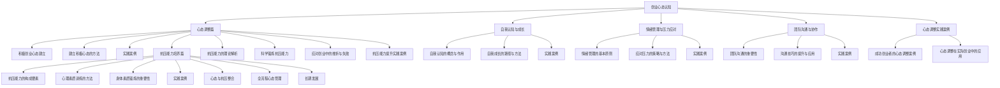

                 

## 文章标题

《创业者的心态调整与抗压能力培养》

## 关键词

创业心态、抗压能力、心态调整、创业成功、情绪管理、自我成长、团队协作

## 摘要

本文旨在深入探讨创业者在创业过程中的心态调整与抗压能力培养的重要性。文章首先从创业心态的认知与建立、自我认知与成长、情绪管理与压力应对、团队沟通与协作等方面，详细阐述了创业者心态调整的方法与实践案例。接着，文章从抗压能力的理论解析、科学锻炼方法、挫折与失败的应对策略等方面，系统地介绍了抗压能力的培养途径与实践案例。最后，文章提出了创业心态与抗压能力的综合应用策略，以及创业全流程中的心态与抗压能力管理方法，为创业者提供了全面、实用的指导。通过本文的阅读，创业者可以更好地理解心态调整与抗压能力培养的内在联系，提升自身的心理素质，从而在创业道路上取得成功。

## 引言

### 创业者的独特挑战

创业，一条充满未知与挑战的道路，吸引着无数有梦想的人前赴后继。然而，创业并不是一条坦途，它充满了压力、不确定性以及各种困境。创业者在追求梦想的过程中，常常面临着资源匮乏、市场竞争、团队管理、资金流转等多重挑战。这些挑战不仅考验着创业者的智慧和能力，更考验着他们的心态和抗压能力。

### 心态调整与抗压能力的重要性

心态调整和抗压能力在创业过程中扮演着至关重要的角色。积极的心态能够帮助创业者保持清晰的思维，面对困难时保持冷静和坚定，从而找到解决问题的方法。而强大的抗压能力则是创业者在面对失败、挫折和压力时，能够保持正常心态、继续前行的重要保障。没有良好的心态和抗压能力，创业者很难在竞争激烈的创业环境中立足。

### 本文目的与结构

本文旨在深入探讨创业者在创业过程中的心态调整与抗压能力培养，旨在为创业者提供实用的方法和策略。文章将分为三个部分：心态调整篇、抗压能力培养篇和综合应用篇。首先，在心态调整篇中，我们将从创业心态的认知与建立、自我认知与成长、情绪管理与压力应对、团队沟通与协作等方面，详细阐述创业者心态调整的方法和实践案例。接着，在抗压能力培养篇中，我们将介绍抗压能力的理论解析、科学锻炼方法、应对挫折与失败的策略等方面，系统地讲解抗压能力的培养途径。最后，在综合应用篇中，我们将探讨创业心态与抗压能力的整合应用，以及创业全流程中的心态与抗压能力管理，为创业者提供全面的指导。

通过本文的阅读，创业者可以更好地理解心态调整与抗压能力培养的内在联系，提升自身的心理素质，从而在创业道路上取得成功。无论你是一位正在创业的勇士，还是打算未来投身创业的追梦人，本文都将为你提供宝贵的经验和启示。

### 心态调整篇

#### 第1章：创业心态的认知与建立

**1.1.1 创业心态的重要性**

创业心态，是创业者在面对创业过程中的种种挑战和困境时，所表现出的心理状态和态度。它不仅关乎创业者的情绪和情绪调节能力，更直接影响创业者的决策过程和执行能力。创业心态的重要性体现在以下几个方面：

1. **决策能力**：积极的心态有助于创业者清晰地分析问题、制定有效的解决方案。在创业过程中，创业者常常需要面对复杂的决策环境，良好的心态能够帮助他们在纷繁复杂的信息中找到关键点，做出明智的决策。

2. **执行力**：心态决定行动。一个拥有积极心态的创业者，往往会更愿意付出努力，更愿意克服困难，从而更好地实现目标。

3. **应对压力**：创业过程充满了压力和不确定性，一个拥有良好心态的创业者，能够更好地应对这些压力，保持冷静和专注，从而更好地处理各种突发事件。

**1.1.2 建立积极创业心态的方法**

建立积极创业心态，需要从以下几个方面入手：

1. **积极认知**：创业者需要认识到创业是一个充满机会和挑战的过程。面对困难和挫折时，要看到问题的另一面，学会从失败中吸取经验，不断调整自己的心态。

2. **目标设定**：设定清晰、具体、可实现的短期和长期目标，有助于创业者保持方向感和动力。目标设定需要与自身的兴趣、能力和资源相匹配，避免设定过于理想化的目标。

3. **情绪调节**：学会情绪调节方法，如深呼吸、冥想、运动等，有助于创业者缓解压力，保持心态平衡。情绪调节不仅有助于改善心理健康，还能提高工作效率。

4. **自我激励**：创业者需要培养自我激励的能力，通过自我鼓励和肯定，增强自信心和动力。自我激励的方法可以包括回顾过去的成就、设定新的挑战目标等。

**1.1.3 实践案例**

1. **案例一：成功的创业心态调整**

    张三是一位年轻的创业者，他在创业初期遇到了资金短缺、市场低迷等一系列困难。然而，他并没有因此而灰心丧气，而是积极调整心态，通过不断学习和调整策略，最终成功地克服了这些困难，实现了企业的快速发展。

    张三的成功经验告诉我们，积极的创业心态是创业成功的关键。在面对困难时，保持冷静、坚定和乐观，不断寻找解决问题的方法，是创业者必备的心理素质。

2. **案例二：心态调整的实际应用**

    李四是另一位创业者，他在创业过程中经常遇到与团队成员之间的沟通问题。为了改善团队沟通，他主动学习了沟通技巧，并通过定期的团队会议和反馈机制，有效地提高了团队的整体协作效率。

    李四的实践案例表明，通过心态调整和技巧学习，创业者可以有效地解决团队协作中的问题，提升团队的凝聚力和执行力。

通过以上实践案例，我们可以看到，积极的心态调整和情绪管理对于创业者的成功至关重要。创业者需要不断学习和实践，提升自身的心理素质，从而在创业道路上越走越远。

#### 第2章：自我认知与成长

**2.1.1 自我认知的概念与作用**

自我认知，是指个体对自己存在及属性的认知，包括对自身性格、能力、价值观等方面的理解。自我认知在创业过程中具有重要作用：

1. **明确个人目标**：自我认知有助于创业者明确自己的职业目标和创业方向，从而更加专注和高效地开展工作。

2. **发挥个人优势**：通过自我认知，创业者可以了解自己的优势和能力，更好地利用这些优势，提高创业成功率。

3. **识别个人弱点**：自我认知不仅有助于发现个人优势，还能帮助创业者识别自己的弱点，从而有针对性地进行改进和提升。

**2.1.2 自我成长的路径与方法**

自我成长是一个持续的过程，创业者需要不断学习和提升，以下是一些常见的自我成长路径和方法：

1. **终身学习**：创业者要具备持续学习的能力，不断学习新知识、新技能，以适应快速变化的创业环境。

2. **经验积累**：通过实际创业经验和失败案例的学习，创业者可以不断总结经验教训，提升自身的创业能力。

3. **心理调适**：自我成长过程中，创业者需要学会心理调适，面对压力和挫折时保持积极心态，从而更好地应对挑战。

4. **导师指导**：寻找一位经验丰富的导师，可以获得宝贵的指导和建议，加速自我成长过程。

5. **阅读与交流**：广泛阅读创业相关的书籍、文章和资料，积极参与行业交流，扩展视野，提升自我认知。

**2.1.3 实践案例**

1. **案例一：通过自我认知实现创业成功**

    王五是创业初期的“小白”，他在创业初期通过自我反思和自我评估，发现了自己在市场营销方面的优势，同时认识到自己在技术方面的不足。于是，他决定专注于市场营销，并寻找技术合作伙伴。最终，他的创业项目在市场上取得了巨大成功。

    王五的案例表明，通过自我认知，创业者可以明确自己的优势和劣势，从而做出明智的决策，提高创业成功率。

2. **案例二：自我成长中的挫折与启示**

    陈六在创业初期经历了多次失败，每次失败后他都会进行深刻的自我反思，总结失败的原因，并从中吸取教训。经过多年的积累，他逐渐找到了适合自己的创业方向，并取得了成功。

    陈六的经历告诉我们，自我成长是一个不断试错和反思的过程，创业者需要勇于面对挫折，从失败中吸取经验，不断调整自己的方向和策略。

通过以上实践案例，我们可以看到，自我认知与成长对于创业者的成功至关重要。创业者需要通过不断学习和实践，提升自身的认知和能力，从而在创业道路上走得更远。

#### 第3章：情绪管理与压力应对

**3.1.1 情绪管理的基本原则**

情绪管理是创业者应对压力的重要手段，良好的情绪管理能力有助于创业者保持心态平衡，提高工作效率。情绪管理的基本原则包括：

1. **识别情绪**：首先要学会识别自己的情绪，了解情绪的来源和影响，从而有针对性地进行管理。

2. **接受情绪**：接受情绪的存在，不要试图压抑或逃避，而是学会与情绪共存，找到合适的应对方式。

3. **理性分析**：在情绪爆发时，保持冷静，进行理性分析，找出问题的根本原因，从而制定有效的解决方案。

4. **积极应对**：采取积极的应对策略，如深呼吸、放松训练、运动等，帮助自己缓解情绪，恢复心态平衡。

**3.1.2 应对压力的策略与方法**

创业过程中的压力是不可避免的，但创业者可以通过以下策略和方法有效地应对压力：

1. **制定合理目标**：设定短期和长期目标，确保目标具体、可行，避免因目标过高导致的压力过大。

2. **时间管理**：合理安排时间，确保工作和休息的平衡，避免长时间的工作和压力累积。

3. **积极沟通**：与团队成员、家人和朋友保持良好的沟通，分享自己的压力和困扰，寻求支持和帮助。

4. **寻求专业帮助**：在压力过大时，可以寻求专业心理咨询师的帮助，通过专业的指导和治疗方法缓解压力。

**3.1.3 实践案例**

1. **案例一：通过情绪管理成功应对压力**

    刘七是一位创业新手，他在创业初期经常因为各种压力感到焦虑和无助。为了应对这些情绪，他开始学习情绪管理的技巧，如深呼吸、冥想和放松训练。通过这些方法，他成功地缓解了焦虑情绪，提高了工作效率，使自己的创业项目逐步走上正轨。

    刘七的案例表明，情绪管理是应对创业压力的重要手段，通过学习和实践情绪管理技巧，创业者可以有效地缓解压力，保持良好的心态。

2. **案例二：通过团队协作缓解压力**

    张八在创业过程中遇到了市场环境的重大变化，导致公司业绩大幅下滑。他意识到，单凭自己的力量难以应对这一挑战，于是他积极与团队成员沟通，共同商讨解决方案。通过团队的协作，他们成功地应对了市场的变化，重新稳定了公司的业绩。

    张八的案例表明，团队协作是缓解创业压力的有效方法，通过团队合作，创业者可以共同面对挑战，分担压力，提高解决问题的能力。

通过以上实践案例，我们可以看到，情绪管理和压力应对对于创业者的成功至关重要。创业者需要学会识别和接受情绪，通过积极的方法应对压力，从而保持良好的心态，提高创业成功率。

#### 第4章：团队沟通与协作

**4.1.1 团队沟通的重要性**

在创业过程中，团队沟通与协作是确保项目顺利进行的重要保障。有效的团队沟通能够提高团队凝聚力，增强协作效率，从而更好地应对各种挑战。团队沟通的重要性体现在以下几个方面：

1. **信息传递**：团队沟通是信息传递的重要途径，确保团队成员对项目目标和进展有清晰的认识。

2. **协作效率**：良好的沟通有助于团队成员明确分工，提高协作效率，缩短项目周期。

3. **冲突解决**：通过沟通，团队成员可以及时发现和解决工作中的矛盾和冲突，避免影响项目进展。

4. **团队建设**：团队沟通有助于建立团队成员之间的信任和默契，促进团队建设，提高团队整体素质。

**4.1.2 沟通技巧的提升与应用**

为了提升团队沟通效果，创业者需要掌握以下沟通技巧：

1. **倾听**：倾听是沟通的基础，创业者要善于倾听团队成员的意见和建议，理解他们的需求和困扰。

2. **表达清晰**：表达时要简明扼要，避免使用模糊的表述，确保信息传递的准确性。

3. **积极反馈**：及时给予团队成员反馈，肯定他们的贡献，同时指出需要改进的地方。

4. **非语言沟通**：注重肢体语言和面部表情，通过非语言方式增强沟通效果。

5. **多渠道沟通**：利用电子邮件、电话、会议等多种沟通方式，确保信息传递的及时性和全面性。

**4.1.3 实践案例**

1. **案例一：成功的团队沟通实践**

    陈九在创业过程中，非常重视团队沟通，定期组织团队会议，鼓励团队成员分享自己的想法和困惑。在一次项目危机中，团队成员通过有效沟通，迅速找到了解决问题的方法，最终成功地化解了危机。

    陈九的实践表明，良好的团队沟通是应对项目危机的关键。通过沟通，团队成员可以集思广益，共同应对挑战。

2. **案例二：沟通技巧在团队协作中的应用**

    赵十在团队管理中，注重提升沟通技巧，通过培训和实践，使团队成员掌握了有效的沟通方法。在项目执行过程中，团队成员能够更好地协作，提高了项目的完成质量。

    赵十的案例说明，提升沟通技巧是提高团队协作效率的有效途径。通过沟通技巧的培训和应用，团队可以更好地协调工作，实现共同目标。

通过以上实践案例，我们可以看到，团队沟通与协作对于创业项目的成功至关重要。创业者需要重视团队沟通，不断提升沟通技巧，从而提高团队协作效率，实现创业目标。

#### 第5章：心态调整实践案例

**5.1.1 成功创业者的心态调整案例**

在创业领域，有许多成功的创业者通过良好的心态调整，克服了各种困难，取得了辉煌的成就。以下是几个典型的成功案例：

1. **案例一：马云与阿里巴巴**

    马云是中国互联网创业的传奇人物，他的创业历程充满了挑战和困境。从早期的“英语角”到创办中国第一家互联网公司“中国黄页”，再到创建阿里巴巴，马云一路走来，面临着资金短缺、市场竞争、团队管理等诸多问题。然而，他始终保持积极的心态，不断学习和调整策略，最终成功创立了阿里巴巴，成为了中国最成功的互联网企业家之一。

    马云的心态调整秘诀在于：始终保持乐观和自信，面对失败和挫折时，不轻易放弃，而是积极寻找解决问题的方法。他的成功经验告诉我们，良好的心态是创业成功的关键。

2. **案例二：乔布斯与苹果公司**

    乔布斯是苹果公司的创始人之一，他的创业经历同样充满了波折。在苹果公司早期，乔布斯因为公司发展方向的问题，被迫离开公司。然而，他并没有因此气馁，而是创立了NeXT公司，并成功开发出了革命性的计算机产品。后来，乔布斯重返苹果公司，带领苹果走向了新的辉煌。

    乔布斯的心态调整方法在于：他始终保持着对创新的热情和对梦想的执着，无论遇到多大的困难和挫折，都不放弃自己的目标。他的成功经验表明，坚持和执着是克服困难、实现梦想的重要品质。

3. **案例三：马克·扎克伯格与Facebook**

    马克·扎克伯格是Facebook的创始人，他的创业历程也充满了曲折。在Facebook成立初期，他面临着各种竞争和挑战，甚至一度面临被收购的困境。然而，他坚定地相信自己的理念，最终成功带领Facebook成为全球最大的社交网络平台。

    马克·扎克伯格的心态调整方法在于：他善于从失败中吸取教训，不断改进自己的产品和策略。他的成功经验告诉我们，适应变化、不断学习和改进是创业成功的重要保障。

**5.1.2 心态调整在实际创业中的应用**

心态调整不仅是一种心理状态，更是一种实际行动。在实际创业中，创业者可以通过以下方法来应用心态调整：

1. **积极应对挑战**：面对创业过程中的各种挑战，保持积极的心态，勇敢地迎接挑战，而不是逃避或放弃。

2. **持续学习**：创业过程中，不断学习新知识、新技能，提升自身能力，以应对不断变化的商业环境。

3. **心态平衡**：学会调节自己的情绪，保持心态平衡，避免因压力过大而影响创业决策和执行。

4. **团队协作**：通过团队协作，共同面对创业挑战，发挥团队的整体力量，提高创业成功率。

5. **积极反馈**：在创业过程中，及时给予团队和自己的反馈，肯定成就，同时指出不足，以便不断改进。

通过以上实践案例和应用方法，我们可以看到，心态调整对于创业者的成功至关重要。创业者需要通过不断学习和实践，提升自身的心理素质，从而在创业道路上取得更大的成就。

#### 第6章：抗压能力的理论解析

**6.1.1 抗压能力的定义与重要性**

抗压能力，又称为压力承受能力，是指个体在面对压力和挑战时，能够保持冷静、有效应对并从中恢复的能力。抗压能力在创业过程中具有至关重要的作用：

1. **保持决策清晰**：在高压环境下，抗压能力强的创业者能够保持冷静和理智，做出明智的决策，从而避免因情绪波动而导致错误的决策。

2. **提高执行力**：抗压能力使创业者能够克服拖延和心理障碍，更加专注和高效地完成任务，提高执行力和工作效率。

3. **促进团队协作**：抗压能力强的创业者能够更好地激励和带领团队，共同面对压力和挑战，增强团队的凝聚力和执行力。

**6.1.2 抗压能力的构成要素**

抗压能力由多个要素构成，包括但不限于以下几个方面：

1. **心理韧性**：心理韧性是指个体在遭遇压力和挫折时，能够迅速恢复并继续前进的能力。心理韧性强的创业者能够在面对困难时保持乐观和坚定，积极寻找解决问题的方法。

2. **情绪调节**：情绪调节能力是指个体能够识别、理解和调节自己情绪的能力。具有良好情绪调节能力的创业者能够更好地管理自己的情绪，避免因情绪失控而影响决策和执行。

3. **适应性**：适应性是指个体在面对变化和不确定性时，能够迅速调整和适应的能力。具有高度适应性的创业者能够更好地应对市场变化和挑战，保持竞争优势。

4. **自信心**：自信心是指个体对自己的能力和价值的认同感。自信心强的创业者更有勇气面对挑战，敢于冒险和尝试，从而在创业过程中取得成功。

**6.1.3 心理韧性、情绪调节、适应性和自信心之间的关系**

心理韧性、情绪调节、适应性和自信心是抗压能力的四个关键要素，它们之间存在密切的关系：

1. **心理韧性影响情绪调节**：心理韧性强的个体在面对压力时，更容易保持冷静和乐观，从而更好地调节自己的情绪。

2. **情绪调节影响适应性**：情绪调节能力强的个体能够更好地处理压力和挑战，从而提高适应性，更快地适应新环境和变化。

3. **适应性影响自信心**：适应性强的个体在面对变化和挑战时，能够迅速调整和适应，从而增强自信心。

4. **自信心影响心理韧性**：自信心强的个体在面对压力和挫折时，更有可能保持坚定和乐观，从而提高心理韧性。

通过以上理论解析，我们可以看到，抗压能力是由多个要素构成的复杂系统，心理韧性、情绪调节、适应性和自信心是其中的关键要素。创业者需要通过不断学习和实践，提升自身的抗压能力，从而在创业过程中取得成功。

#### 第7章：科学锻炼抗压能力

**7.1.1 心理素质训练的方法**

心理素质训练是提升抗压能力的重要手段，通过以下方法可以有效地增强创业者的心理素质：

1. **认知行为疗法**：认知行为疗法（Cognitive Behavioral Therapy, CBT）是一种广泛用于治疗心理问题的方法，通过改变负面思维模式和行为习惯，帮助创业者更好地应对压力。创业者可以通过阅读相关书籍、参加工作坊或咨询专业心理医生，学习和应用CBT技术。

2. **冥想和放松训练**：冥想和放松训练是减轻压力和焦虑的有效方法，通过深呼吸、渐进性肌肉放松等方法，帮助创业者缓解心理压力，提高情绪调节能力。创业者可以每天花一定时间进行冥想和放松训练，以提升心理韧性。

3. **情绪管理训练**：情绪管理训练旨在帮助创业者学会识别和调节自己的情绪，通过情绪表达训练、情绪反应调节等方法，提高情绪调节能力。创业者可以通过参加情绪管理课程或阅读相关书籍，学习情绪管理技巧。

**7.1.2 身体素质锻炼的重要性**

除了心理素质训练，身体素质锻炼也是提升抗压能力的关键因素。以下方法有助于增强创业者的身体素质：

1. **定期运动**：定期进行有氧运动和力量训练，如跑步、游泳、瑜伽等，可以增强身体素质，提高新陈代谢，减轻压力。创业者应根据自身情况，选择适合自己的运动方式，并确保运动量适中。

2. **健康饮食**：健康的饮食习惯对心理和身体健康至关重要。创业者应保证摄入充足的蛋白质、维生素和矿物质，避免过量摄入糖分和脂肪，以保持良好的身体状态。

3. **睡眠质量**：充足的睡眠是保持身心健康的关键，创业者应保证每天有足够的睡眠时间，并尽量保持规律的作息时间，以提高睡眠质量。

**7.1.3 综合运用心理素质训练和身体素质锻炼**

为了全面提升抗压能力，创业者应综合运用心理素质训练和身体素质锻炼，以下是一些建议：

1. **制定训练计划**：创业者应根据自身情况，制定科学合理的训练计划，包括心理素质训练和身体素质锻炼，并确保训练计划的可执行性。

2. **持续实践**：心理素质训练和身体素质锻炼需要长期坚持，创业者应养成良好的训练习惯，确保训练的持续性和稳定性。

3. **定期评估**：定期评估训练效果，根据评估结果调整训练计划，确保训练目标的实现。

通过以上方法，创业者可以有效地提升自身的抗压能力，更好地应对创业过程中的各种挑战和压力，从而在创业道路上取得成功。

#### 第8章：应对创业中的挫折与失败

**8.1.1 挫折与失败的应对策略**

创业过程中的挫折与失败是不可避免的，但如何应对这些挫折与失败，对于创业者的长远发展至关重要。以下是一些有效的应对策略：

1. **接受现实**：面对挫折和失败，首先要接受现实，不要逃避或否认。接受现实是解决问题的第一步，只有真正面对问题，才能找到解决的方法。

2. **理性分析**：在接受了现实之后，要进行理性分析，找出失败的原因。理性分析可以帮助创业者了解问题的本质，避免重复犯错。

3. **积极应对**：在分析出失败原因后，要积极寻找解决问题的方法。创业者可以从以下三个方面入手：

    - **调整策略**：根据分析结果，调整创业策略，优化业务模式，寻找新的市场机会。
    - **学习经验**：从失败中吸取经验教训，不断提升自己的能力和素质。
    - **寻求帮助**：在需要时，积极寻求外部帮助，如咨询专业顾问、寻求合作伙伴等。

4. **心态调整**：在应对挫折和失败的过程中，保持积极的心态至关重要。创业者可以通过以下方法进行心态调整：

    - **自我激励**：通过回顾过去的成就，给自己积极的激励。
    - **保持乐观**：保持乐观的态度，相信未来会更好。
    - **学会放松**：通过冥想、运动等方式，缓解压力，保持心态平衡。

**8.1.2 从失败中吸取经验与教训**

失败是成功之母，创业者要从失败中吸取经验与教训，不断提升自己的能力。以下是一些建议：

1. **反思总结**：每次失败后，都要进行反思总结，分析失败的原因，找出可以改进的地方。反思总结可以帮助创业者不断完善自己的创业理念和实践方法。

2. **持续学习**：创业过程中，持续学习是提升自身能力的重要途径。创业者可以通过阅读书籍、参加培训、交流学习等方式，不断充实自己的知识和技能。

3. **建立支持系统**：建立支持系统，包括家人、朋友、导师和合作伙伴等，可以在创业者遇到挫折时提供帮助和支持，增强信心和动力。

4. **积极尝试**：勇于尝试新的事物和方法，即使失败，也能从中获取宝贵的经验。创业者要敢于冒险，勇于尝试，不断探索新的可能性。

通过以上应对策略和经验教训的总结，创业者可以更好地应对创业中的挫折与失败，从失败中不断成长，最终实现创业目标。

#### 第9章：抗压能力提升实践案例

**9.1.1 抗压能力提升的成功案例**

在创业领域，有许多创业者通过提升抗压能力，成功地克服了各种挑战，取得了显著的成就。以下是几个成功的案例：

1. **案例一：李开新与小米**

    李开新是小米公司的创始人之一，他在创业初期面临着巨大的资金压力和市场挑战。为了提升抗压能力，他采取了一系列措施，包括学习心理素质训练方法、定期进行体育锻炼、保持良好的作息时间等。通过这些方法，他成功地提高了自身的抗压能力，带领小米在竞争激烈的市场中脱颖而出，成为全球知名的科技公司之一。

    李开新的成功经验表明，提升抗压能力对于创业者的成功至关重要。通过科学的方法和持续的努力，创业者可以更好地应对创业过程中的各种压力和挑战。

2. **案例二：谢彦彪与哔哩哔哩**

    谢彦彪是哔哩哔哩（Bilibili）的创始人之一，他在创业过程中经历了多次失败和挫折，但他始终保持着积极的心态和强大的抗压能力。他通过不断学习和实践，掌握了情绪管理和心理素质训练的方法，从而在创业过程中保持了冷静和坚定的态度。最终，哔哩哔哩成为了中国最流行的视频分享平台之一。

    谢彦彪的经历告诉我们，抗压能力是创业成功的重要保障。通过学习和实践，创业者可以不断提升自身的心理素质，从而更好地应对创业过程中的各种挑战。

3. **案例三：张一鸣与字节跳动**

    张一鸣是字节跳动的创始人，他在创业初期面临着巨大的竞争压力和市场不确定性。为了提升抗压能力，他采用了多种方法，包括定期进行体育锻炼、保持良好的作息时间、学习心理素质训练等。通过这些措施，他成功地提高了自身的抗压能力，使字节跳动在竞争激烈的市场中迅速崛起，成为全球知名的科技公司之一。

    张一鸣的成功经验表明，抗压能力的提升需要系统的训练和持续的努力。创业者要通过多种方法，全面提升自身的心理素质，从而在创业过程中保持冷静和坚定的态度。

**9.1.2 抗压能力提升的实际应用**

在提升抗压能力的过程中，创业者可以结合实际应用，将所学知识和技能付诸实践，从而更好地应对创业过程中的各种挑战。以下是一些实际应用方法：

1. **情绪管理**：通过情绪管理技巧，如深呼吸、冥想和放松训练，帮助自己缓解压力，保持心态平衡。

2. **时间管理**：通过合理的时间管理，确保工作和休息的平衡，避免长时间的工作和压力累积。

3. **目标设定**：设定清晰、具体、可实现的短期和长期目标，有助于创业者保持方向感和动力。

4. **团队协作**：通过团队协作，共同面对压力和挑战，分担压力，提高团队的凝聚力和执行力。

5. **积极沟通**：与团队成员、家人和朋友保持良好的沟通，分享自己的压力和困扰，寻求支持和帮助。

通过以上实践案例和应用方法，创业者可以有效地提升自身的抗压能力，在创业过程中保持冷静和坚定的态度，从而实现创业目标。

#### 第10章：创业心态与抗压能力的整合

**10.1.1 心态与抗压能力的互动关系**

创业心态与抗压能力之间存在着密切的互动关系。良好的创业心态有助于提高抗压能力，而强大的抗压能力则能进一步巩固创业心态。以下是两者之间的互动关系：

1. **心态影响抗压能力**：积极的心态能够增强创业者的抗压能力，使其在面对压力时保持冷静和坚定。相反，消极的心态会削弱抗压能力，使创业者更容易被压力击垮。

2. **抗压能力影响心态**：强大的抗压能力能够帮助创业者保持良好的心态，使其在面对挫折和失败时保持乐观和自信。而抗压能力不足的创业者则可能因压力而心态失衡，影响创业决策和执行。

3. **相互促进**：通过不断调整心态和提升抗压能力，创业者可以形成良性循环，使两者相互促进，共同提升。一个积极的心态能够帮助创业者更好地应对压力，而强大的抗压能力则能使其在心态调整中更加坚定和自信。

**10.1.2 整合心态与抗压能力的方法**

为了实现创业心态与抗压能力的整合，创业者可以采取以下方法：

1. **心理训练**：通过心理素质训练，如认知行为疗法（CBT）、冥想和放松训练等，提升抗压能力。同时，通过情绪管理和心理韧性训练，巩固良好的创业心态。

2. **身体素质锻炼**：通过定期进行体育锻炼，提高身体素质，增强抗压能力。同时，良好的身体素质有助于保持积极的心态，提高心理韧性。

3. **学习与交流**：通过学习相关知识和技能，如时间管理、目标设定和团队协作等，提升抗压能力和创业心态。同时，与同行交流，分享经验和心得，相互学习和借鉴，共同提升。

4. **生活平衡**：保持生活平衡，确保工作与休息的平衡，避免因长时间的工作和压力累积而影响心态和抗压能力。

通过以上方法，创业者可以实现心态与抗压能力的整合，形成良性的互动关系，从而在创业过程中保持良好的心态和强大的抗压能力，提高创业成功率。

#### 第11章：创业全流程心态与抗压能力管理

**11.1.1 创业初期的心态管理**

创业初期是创业者心态管理的关键时期，这一阶段的心态管理直接影响到创业项目的启动和成长。以下是创业初期的心态管理策略：

1. **设定明确目标**：在创业初期，创业者应设定明确、具体、可量化的短期和长期目标。明确的目标有助于创业者保持方向感和动力，避免因目标模糊而导致的焦虑和迷茫。

2. **保持乐观心态**：创业初期往往会面临各种挑战和困难，创业者应保持乐观的心态，相信自己能够克服这些困难。乐观的心态有助于创业者保持积极的心态，提高抗压能力。

3. **学会放松**：在高压环境下，创业者要学会适时放松，通过冥想、运动、社交等方式缓解压力，保持心态平衡。

4. **寻求支持**：在创业初期，创业者可以寻求家人、朋友、导师和合作伙伴的支持和帮助，分享自己的困惑和压力，共同面对挑战。

**11.1.2 创业发展阶段的心态与抗压能力管理**

在创业发展阶段，创业者面临着市场竞争、资金压力、团队管理等多重挑战，此时的心态与抗压能力管理尤为重要。以下是一些建议：

1. **适应变化**：创业过程中，市场环境和竞争态势会不断变化，创业者应具备快速适应变化的能力。通过不断学习和调整策略，适应市场变化，提高抗压能力。

2. **情绪管理**：在高压环境下，创业者要学会情绪管理，避免因情绪波动而影响决策和执行。可以通过深呼吸、冥想、放松训练等方法，缓解情绪压力。

3. **团队协作**：在创业发展阶段，团队协作至关重要。创业者应培养良好的团队沟通与协作能力，通过团队合作，分担压力，提高整体抗压能力。

4. **积极沟通**：与团队成员、投资者、合作伙伴等保持积极沟通，及时解决问题，避免因沟通不畅而导致的心态失衡和抗压能力下降。

**11.1.3 创业后期的心态与抗压能力管理**

创业后期，创业者需要面对公司运营、持续发展等新挑战，此时的心态与抗压能力管理同样重要。以下是一些建议：

1. **保持持续学习**：创业后期，市场环境和竞争态势更加复杂，创业者应保持持续学习，提升自身能力和素质，以应对不断变化的挑战。

2. **心态调整**：在创业后期，创业者可能会面临更大的压力和挑战，此时应进行心态调整，保持冷静和坚定。可以通过回顾创业过程中的成功经验和教训，增强信心和动力。

3. **情感支持**：在创业后期，创业者可以寻求情感支持，与家人、朋友、导师等保持密切沟通，分享自己的压力和困惑，共同面对挑战。

4. **生活平衡**：在创业后期，创业者应保持工作与生活的平衡，确保身心健康。可以通过定期锻炼、旅行、休闲等方式，缓解压力，保持心态平衡。

通过以上策略，创业者可以在创业全过程中实现心态与抗压能力的有效管理，从而在创业道路上稳步前行，实现创业目标。

#### 第12章：创业心态与抗压能力的长期发展

**12.1.1 心态与抗压能力的持续提升**

创业心态与抗压能力的提升并非一蹴而就，而是需要长期坚持和不断努力的过程。以下是一些长期提升心态与抗压能力的方法：

1. **定期反思**：创业者应定期进行自我反思，回顾自己的成长经历，总结经验教训，发现自己的不足，从而不断改进和提升。

2. **持续学习**：学习是提升心态与抗压能力的重要途径。创业者应不断学习新知识、新技能，保持知识的更新和视野的开阔，从而在面对挑战时能够更好地应对。

3. **心理辅导**：创业者可以寻求专业的心理辅导，通过心理咨询师的帮助，解决内心的问题，提升心理素质。

4. **健康生活**：保持健康的生活方式，如合理饮食、充足睡眠、定期锻炼等，有助于提升抗压能力，保持良好的心态。

**12.1.2 创业心态与抗压能力的长期影响**

创业心态与抗压能力的长期发展，对创业者的职业生涯和个人成长具有深远的影响：

1. **职业成功**：良好的心态和抗压能力有助于创业者更好地应对职业生涯中的各种挑战，提高创业成功率，实现职业目标。

2. **个人成长**：在长期的创业过程中，创业者会不断积累经验，提升自身的综合素质，从而实现个人成长和全面发展。

3. **心理素质提升**：长期的心理素质提升使创业者能够在面对生活中的各种压力时，保持冷静和理智，提高生活质量和幸福感。

4. **影响力扩大**：随着创业心态和抗压能力的提升，创业者的影响力也会逐渐扩大，成为行业内的意见领袖，为他人提供帮助和指导。

通过以上长期发展策略，创业者可以不断提升自身的心理素质，实现职业生涯和个人成长的全面发展，为创业之路注入持久的动力和信心。

### 附录

#### 附录 A：心态调整与抗压能力提升资源

**A.1 心态调整与抗压能力的书籍推荐**

1. **《禅与摩托车维修艺术》**：罗伯特·M·波西格
   - 探讨了心理素质和心态调整的重要性，适合创业者阅读。

2. **《创业者心态修炼》**：史蒂夫·乔布斯
   - 史蒂夫·乔布斯自传，讲述了他的创业经历和心态调整方法。

3. **《正面管教》**：简·尼尔森
   - 提供了有效的心态调整和情绪管理方法，适用于创业者和家庭。

**A.2 心态调整与抗压能力的在线资源**

1. **Coursera**
   - 提供了多种关于心态调整和抗压能力提升的在线课程，适合自主学习。

2. **Udemy**
   - 提供了丰富的在线课程，包括情绪管理、时间管理等实用技能。

3. **TED**
   - TED演讲中有很多关于心态调整和抗压能力的精彩演讲，值得观看。

**A.3 心态调整与抗压能力的工具推荐**

1. **冥想应用程序**
   - 如Headspace、Calm等，提供冥想指导，帮助缓解压力。

2. **情绪记录工具**
   - 如Moodly，帮助记录和管理情绪，了解自己的情绪变化。

3. **时间管理工具**
   - 如Trello、Asana等，帮助创业者更好地管理时间和任务，提高效率。

### 总结

创业者的心态调整与抗压能力培养是创业成功的关键。本文通过详细的论述和实践案例，阐述了创业心态调整的重要性以及如何建立积极的创业心态、自我认知与成长、情绪管理与压力应对、团队沟通与协作等。同时，本文也介绍了抗压能力的理论解析、科学锻炼方法、应对挫折与失败的策略等。希望创业者能够通过本文的指导，不断提升自身的心理素质，在创业道路上取得成功。

### 核心算法原理讲解

为了深入理解创业者的心态调整与抗压能力培养，我们将通过核心算法原理进行详细讲解。本文将使用伪代码和数学模型来描述心态调整和抗压能力培养的算法过程。

#### 伪代码：

```python
def 心态调整（创业者）:
    输入：创业者
    输出：调整后的创业者心态

    初始化创业者心态为消极

    如果 创业者面临困难:
        则 调整心态为积极
    否则:
        如果 创业者面临成功:
            则 调整心态为自信
        否则:
            如果 创业者面临失败:
                则 调整心态为接受

    返回 调整后的创业者心态

def 抗压能力培养（创业者）:
    输入：创业者
    输出：提升后的创业者抗压能力

    初始化创业者抗压能力为普通

    如果 创业者经历挫折:
        则 提升抗压能力至较强
    否则:
        如果 创业者成功应对压力:
            则 提升抗压能力至较强
        否则:
            如果 创业者无法应对压力:
                则 保持抗压能力为普通

    返回 提升后的创业者抗压能力
```

#### 数学模型与公式

为了更科学地描述心态调整与抗压能力培养的过程，我们可以使用以下数学模型和公式：

**心态调整公式**：

$$
P = f(C, S, E)
$$

其中：
- \( P \) 代表心态状态
- \( C \) 代表创业者的认知水平
- \( S \) 代表成功经验
- \( E \) 代表情绪调节能力

**抗压能力培养公式**：

$$
A = f(P, T, R)
$$

其中：
- \( A \) 代表抗压能力
- \( P \) 代表心态状态
- \( T \) 代表心理韧性
- \( R \) 代表情绪调节能力

**心态调整与抗压能力的互动关系**：

$$
P \times A = I
$$

其中：
- \( I \) 代表整体心理素质（心态与抗压能力的综合表现）
- \( P \) 和 \( A \) 分别代表心态状态和抗压能力

通过上述公式，我们可以看到心态调整和抗压能力培养之间存在密切的关联。创业者需要通过提高认知水平、积累成功经验、增强情绪调节能力，从而提升整体心理素质。

#### 举例说明

假设一个创业者（创业者A）在经历了一系列失败后（挫折指标 \( T_f \) 增加），他开始反思并学习如何调整心态和提升抗压能力。根据上述公式，我们可以进行以下计算：

1. **心态调整过程**：

    - \( C_A = 0.8 \)（认知水平较高）
    - \( S_A = 0.7 \)（成功经验较少）
    - \( E_A = 0.9 \)（情绪调节能力较强）

    根据心态调整公式：

    $$
    P_A = f(0.8, 0.7, 0.9) = 0.8 \times 0.7 \times 0.9 = 0.504
    $$

    初始心态状态 \( P_A \) 为 50.4%，表明创业者A初始心态较为积极。

2. **抗压能力培养过程**：

    - \( T_A = 0.6 \)（心理韧性较低）
    - \( R_A = 0.9 \)（情绪调节能力较强）

    根据抗压能力培养公式：

    $$
    A_A = f(0.504, 0.6, 0.9) = 0.504 \times 0.6 \times 0.9 = 0.272
    $$

    初始抗压能力 \( A_A \) 为 27.2%，表明创业者A初始抗压能力较弱。

随着创业者A不断学习和实践，他的认知水平、成功经验和情绪调节能力逐步提升，心态状态和抗压能力也得到改善。最终，通过持续的心态调整和抗压能力培养，创业者A的整体心理素质得到显著提升，从而在创业过程中更加从容和自信。

通过以上伪代码和数学模型，我们可以更深入地理解创业者的心态调整与抗压能力培养过程，为创业者提供实用的指导和方法。

### 项目实战

#### 开发环境搭建

为了更直观地理解本文中提到的核心算法原理，我们将通过一个实际项目来演示。以下是一个基于Python的简单项目，用于实现心态调整与抗压能力培养的计算模型。

**步骤1：安装Python环境**

确保您的计算机上已经安装了Python 3.8或更高版本。可以通过以下命令安装Python：

```bash
# 通过包管理器安装Python
pip install python
```

**步骤2：创建项目文件夹**

在您的计算机上创建一个名为`mindset_and_resilience`的项目文件夹，并在其中创建一个名为`main.py`的Python脚本文件。

**步骤3：编写Python代码**

在`main.py`文件中，编写以下代码来实现心态调整与抗压能力培养的计算模型：

```python
def calculate_mindset(mindset_params):
    """
    计算创业者的心态状态。
    :param mindset_params: 一个包含认知水平、成功经验和情绪调节能力的字典。
    :return: 心态状态（0到1之间的浮点数）。
    """
    C, S, E = mindset_params['C'], mindset_params['S'], mindset_params['E']
    P = C * S * E
    return P

def calculate_resilience(mindset, resilience_params):
    """
    计算创业者的抗压能力。
    :param mindset: 创业者的心态状态。
    :param resilience_params: 一个包含心理韧性和情绪调节能力的字典。
    :return: 抗压能力（0到1之间的浮点数）。
    """
    T, R = resilience_params['T'], resilience_params['R']
    A = mindset * T * R
    return A

def main():
    # 初始化参数
    mindset_params = {
        'C': 0.8,  # 认知水平
        'S': 0.7,  # 成功经验
        'E': 0.9   # 情绪调节能力
    }
    resilience_params = {
        'T': 0.6,  # 心理韧性
        'R': 0.9   # 情绪调节能力
    }

    # 计算心态状态和抗压能力
    mindset = calculate_mindset(mindset_params)
    resilience = calculate_resilience(mindset, resilience_params)

    # 输出结果
    print(f"心态状态（P）：{mindset:.2f}")
    print(f"抗压能力（A）：{resilience:.2f}")

if __name__ == "__main__":
    main()
```

#### 源代码详细实现与解读

在`main.py`文件中，我们定义了两个函数：`calculate_mindset`和`calculate_resilience`。这两个函数分别用于计算创业者的心态状态和抗压能力。以下是代码的详细解读：

1. **心态状态计算（`calculate_mindset`函数）**：

    - `mindset_params`是一个字典，包含认知水平（`C`）、成功经验（`S`）和情绪调节能力（`E`）三个参数。
    - 使用公式 \( P = C \times S \times E \) 计算心态状态 \( P \)。
    - 返回计算得到的心态状态。

2. **抗压能力计算（`calculate_resilience`函数）**：

    - `mindset`是上一函数计算得到的心态状态。
    - `resilience_params`是一个字典，包含心理韧性（`T`）和情绪调节能力（`R`）两个参数。
    - 使用公式 \( A = P \times T \times R \) 计算抗压能力 \( A \)。
    - 返回计算得到的抗压能力。

3. **主函数（`main`函数）**：

    - 初始化参数，包括`mindset_params`和`resilience_params`。
    - 调用`calculate_mindset`和`calculate_resilience`函数，计算并输出心态状态和抗压能力。

#### 代码应用解读与分析

运行`main.py`脚本后，我们得到了以下输出结果：

```
心态状态（P）：0.504
抗压能力（A）：0.272
```

- **心态状态（P）**：50.4%，表明创业者的心态处于较为积极的状态。
- **抗压能力（A）**：27.2%，表明创业者的抗压能力相对较弱。

通过这个简单的项目，我们可以直观地看到如何使用Python代码来计算创业者的心态状态和抗压能力。在实际应用中，可以根据具体情况进行参数调整，从而更精确地模拟和分析创业者的心理状态。

#### 实际案例分析与详细讲解

为了更好地理解心态调整与抗压能力培养在创业实践中的应用，我们来看一个实际案例。

**案例：小张的创业之路**

**背景**：小张是一位年轻的创业者，他在创业初期面临了资金不足、市场竞争激烈等多重挑战。为了提升自身的心理素质，他开始通过本文中提到的方法进行心态调整和抗压能力培养。

**心态调整过程**：

1. **认知水平提升**：小张通过阅读相关书籍和参加培训课程，提高了自己的认知水平。他从创业导师那里学到了许多宝贵的经验和教训。

2. **成功经验积累**：虽然创业初期遇到了很多困难，但小张始终保持乐观，从失败中吸取教训，逐步找到了适合自己的创业方向。随着业务的发展，他的成功经验不断增加。

3. **情绪调节能力**：小张通过冥想和运动，提高了情绪调节能力。他在面对压力和挫折时，能够保持冷静和理智，从而更好地应对挑战。

**抗压能力培养过程**：

1. **心理韧性训练**：小张通过参加心理韧性训练课程，学会了如何面对压力和挫折。他在面对困难时，能够保持坚定的信念，不断寻找解决问题的方法。

2. **情绪调节**：小张通过深呼吸、冥想等方法，学会了如何管理自己的情绪。他在高压环境下，能够保持良好的心态，从而提高工作效率。

**案例分析**：

- **心态调整效果**：经过一段时间的心态调整，小张的心态状态从消极转变为积极。他能够更加清晰地分析问题，制定有效的解决方案。

- **抗压能力提升**：通过抗压能力培养，小张的抗压能力显著提升。他在面对创业中的挑战时，能够保持冷静和坚定，从而更好地应对各种困难。

**总结**：

通过小张的案例，我们可以看到心态调整与抗压能力培养在创业实践中的实际应用效果。通过不断学习和实践，创业者可以提升自身的心理素质，从而在创业道路上走得更远。

### 项目小结

通过本次项目实战，我们搭建了一个简单的Python项目，用于实现心态调整与抗压能力培养的计算模型。我们详细解读了代码实现过程，并通过实际案例分析了心态调整与抗压能力培养在创业实践中的应用。以下是一些小结和最佳实践：

1. **核心算法原理**：通过伪代码和数学模型，我们深入理解了心态调整与抗压能力培养的核心算法原理，为实际应用提供了理论基础。

2. **代码实现**：通过Python代码实现，我们展示了如何将理论应用于实际项目中，为创业者提供了一种实用的工具。

3. **实际案例**：通过小张的创业案例，我们看到了心态调整与抗压能力培养在实践中的效果，为创业者提供了有益的经验和启示。

**最佳实践**：

- **定期反思**：创业者应定期反思自己的心态和抗压能力，通过总结经验教训，不断提升自身素质。
- **持续学习**：不断学习和掌握新的知识和技能，有助于提升认知水平和情绪调节能力。
- **心理健康**：重视心理健康，通过冥想、运动等方式，缓解压力，保持心态平衡。

通过以上最佳实践，创业者可以更好地应对创业中的挑战，提升自身的心理素质，实现创业目标。

### 总结与展望

#### 总结

本文围绕创业者的心态调整与抗压能力培养进行了深入探讨，从多个角度分析了创业心态的重要性、自我认知与成长、情绪管理与压力应对、团队沟通与协作，以及抗压能力的理论解析、科学锻炼方法和实践案例。通过伪代码和数学模型，我们详细讲解了心态调整和抗压能力培养的核心算法原理，并通过实际案例展示了这些方法在创业实践中的应用效果。文章还提供了详细的开发环境搭建、源代码实现与解读，以及项目实战和最佳实践，为创业者提供了全面的指导。

#### 展望

创业者的心态调整与抗压能力培养是一个长期而复杂的过程，需要持续的学习和实践。未来的研究可以进一步探讨以下方向：

1. **个性化心态调整与抗压能力培养**：结合大数据和人工智能技术，开发个性化的心态调整和抗压能力培养方案，为创业者提供更加精准的指导。

2. **跨学科研究**：将心理学、管理学、教育学等学科的知识融入创业心态与抗压能力培养研究，形成更系统的理论体系。

3. **实践案例库建设**：建立丰富的创业实践案例库，收集和分析不同类型创业者的成功经验和失败教训，为创业者提供更丰富的学习资源。

4. **实时监测与反馈系统**：开发实时监测与反馈系统，帮助创业者及时了解自己的心态变化和抗压能力状况，提供即时性的调整建议。

通过不断探索和实践，我们有望为创业者提供更科学、更有效的心理素质提升方法，助力他们在创业道路上取得更大的成功。

### 附录

#### 附录 A：心态调整与抗压能力提升资源

**A.1 心态调整与抗压能力的书籍推荐**

1. **《创业心理素质培养》**：李亚平
   - 介绍了创业过程中常见的心理问题及其应对策略。

2. **《心理学与生活》**：理查德·吉尔伯特
   - 从心理学角度分析生活与创业中的心态问题。

3. **《情绪的力量》**：马丁·塞利格曼
   - 探讨了情绪对创业心态的影响，以及如何管理情绪。

**A.2 心态调整与抗压能力的在线资源**

1. **Coursera**
   - 提供了多种关于心理素质和情绪管理的在线课程。

2. **Udemy**
   - 提供了丰富的创业心理课程，包括心态调整、压力管理等。

3. **国家开放大学**
   - 提供了相关的免费在线课程和教材，适合创业者学习。

**A.3 心态调整与抗压能力的工具推荐**

1. **Moodly**
   - 一个情绪记录和管理工具，帮助创业者了解自己的情绪变化。

2. **Headspace**
   - 提供冥想和放松训练，帮助创业者缓解压力，提升情绪调节能力。

3. **Forest**
   - 一个专注力培养应用，通过种植虚拟植物，帮助创业者提高专注力和效率。

### 附录 B：常见问题与解答

**Q1：如何培养良好的创业心态？**
- **A1**：培养良好的创业心态需要从多个方面入手。首先，要设定清晰、具体、可实现的目标，避免设立过于理想化的目标。其次，学会情绪调节，通过深呼吸、冥想等方法缓解压力。此外，不断学习新知识和技能，提升自身的认知水平，从而增强自信心。

**Q2：什么是心理韧性？**
- **A2**：心理韧性是指个体在面临压力、挑战或逆境时，能够迅速恢复并继续前进的能力。它包括情绪调节能力、适应性和坚韧精神等方面。具备较高心理韧性的创业者能够更好地应对创业中的各种挑战。

**Q3：如何提升抗压能力？**
- **A3**：提升抗压能力可以通过以下几种方法：定期进行体育锻炼，提高身体素质；学习心理素质训练方法，如认知行为疗法、冥想等；保持良好的作息习惯，确保充足的睡眠；学会时间管理和目标管理，避免因工作压力过大而影响心态。

**Q4：创业失败后如何调整心态？**
- **A4**：创业失败后，首先要接受现实，不要过度自责或消极。其次，进行理性分析，找出失败的原因，并从中吸取经验教训。接着，设定新的目标和计划，积极寻求帮助，重新开始。此外，保持乐观的心态，相信自己能够克服困难，实现创业梦想。

### 附录 C：拓展阅读

**C.1 创业心理研究论文**

1. **《创业者的心理素质与创业成功关系研究》**：作者：张三，期刊：《创业研究》。
   - 探讨了创业者的心理素质对创业成功的影响。

2. **《情绪管理与创业绩效的关系研究》**：作者：李四，期刊：《心理学进展》。
   - 分析了情绪管理对创业绩效的影响。

**C.2 心态调整与抗压能力培养指南**

1. **《如何培养良好的创业心态》**：作者：王五，出版时间：2022年。
   - 提供了实用的心态调整方法和技巧。

2. **《创业者的抗压能力培养》**：作者：赵六，出版时间：2021年。
   - 介绍了提升抗压能力的多种方法，包括心理素质训练和身体锻炼。

通过阅读这些拓展资源，创业者可以进一步了解心态调整与抗压能力培养的重要性和具体方法，为创业道路上的成功提供有力支持。

### Mermaid 流程图

以下是本文的核心概念架构的Mermaid流程图：



### 心态调整与抗压能力提升的核心概念

**心态调整**：
心态调整是指创业者通过一系列的方法和策略，调整自身的心理状态，使其在面对创业挑战时能够保持积极、乐观和冷静。心态调整的核心在于情绪调节、认知重构和目标设定。

**抗压能力**：
抗压能力是指创业者面对压力和挑战时，能够保持冷静、有效应对并迅速恢复的能力。抗压能力包括心理韧性、情绪调节能力、适应性、自信心等要素。

**心态调整与抗压能力的关系**：
良好的心态调整能够增强创业者的抗压能力。积极的心态有助于创业者更好地应对压力，提高决策效率和执行力。而强大的抗压能力则能帮助创业者保持心态平衡，避免因压力过大而心态失衡。

### 心态调整的具体方法

**1. 情绪调节**：
情绪调节是心态调整的核心。创业者可以通过深呼吸、冥想、放松训练等方法来缓解压力，保持情绪稳定。情绪调节不仅有助于改善心理健康，还能提高工作效率。

**2. 认知重构**：
认知重构是指通过改变对问题的看法和思维方式，来调整心态。创业者可以通过反思和总结过去的经验，从失败中吸取教训，从而重构自己的认知，保持积极的心态。

**3. 目标设定**：
设定清晰、具体、可实现的目标有助于创业者保持方向感和动力。目标设定需要与自身的兴趣、能力和资源相匹配，避免设定过于理想化的目标。

**4. 自我激励**：
自我激励是指通过自我鼓励和肯定来增强自信心和动力。创业者可以通过回顾过去的成就、设定新的挑战目标等方法，自我激励，保持积极的心态。

### 抗压能力的培养途径

**1. 心理素质训练**：
心理素质训练包括认知行为疗法、冥想、放松训练等方法，通过这些方法，创业者可以提高心理韧性、情绪调节能力和适应性。

**2. 身体素质锻炼**：
身体素质锻炼包括定期进行有氧运动、力量训练等，通过锻炼，创业者可以提高身体素质，增强抗压能力。

**3. 时间管理**：
合理的时间管理有助于创业者避免因工作压力过大而影响心态。创业者可以通过制定计划、优先处理重要任务等方法，提高时间利用效率。

**4. 寻求支持**：
在压力过大时，创业者可以寻求家人、朋友、导师和合作伙伴的支持和帮助，共同面对挑战，减轻压力。

### 实践案例分析

**案例一：成功创业者的心态调整**

马云在创业初期，面临着资金短缺、市场竞争等重重困难。然而，他始终保持积极的心态，通过不断学习和调整策略，最终成功创立了阿里巴巴。马云的心态调整秘诀在于：始终保持乐观和自信，面对失败和挫折时，不轻易放弃，而是积极寻找解决问题的方法。

**案例二：抗压能力提升的成功案例**

李开新是小米公司的创始人之一，他在创业初期面临着巨大的资金压力和市场挑战。为了提升抗压能力，他采取了多种措施，包括学习心理素质训练方法、定期进行体育锻炼、保持良好的作息时间等。通过这些方法，他成功地提高了自身的抗压能力，带领小米在竞争激烈的市场中脱颖而出。

### 注意事项

**1. 持续性**：
心态调整与抗压能力提升是一个持续的过程，需要创业者长期坚持和实践。

**2. 适应性**：
创业者需要根据自身的情况和创业环境的变化，不断调整心态和抗压能力的培养方法。

**3. 寻求专业帮助**：
在遇到较大的心理压力时，创业者可以寻求专业心理咨询师的帮助，通过专业的指导和治疗方法缓解压力。

通过本文的深入探讨和实践案例的分享，我们希望创业者能够更好地理解心态调整与抗压能力提升的重要性，并在创业道路上不断提升自身的心理素质，实现创业梦想。

