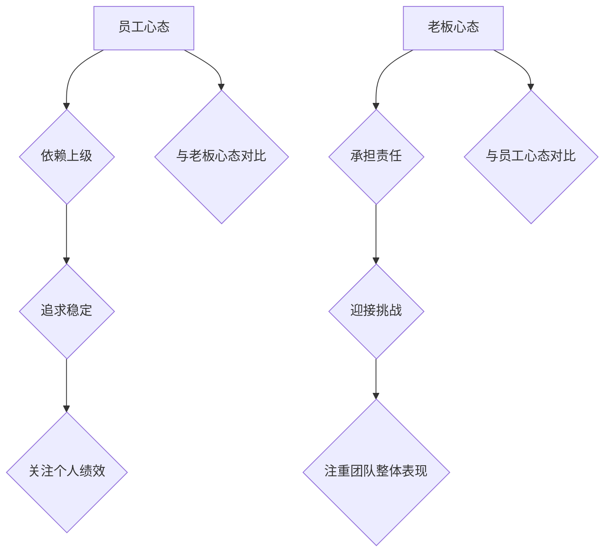
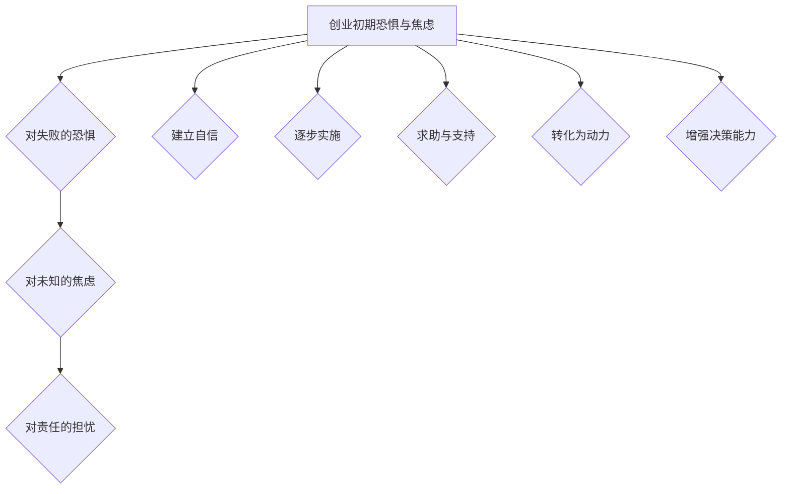
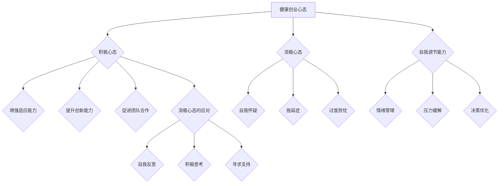
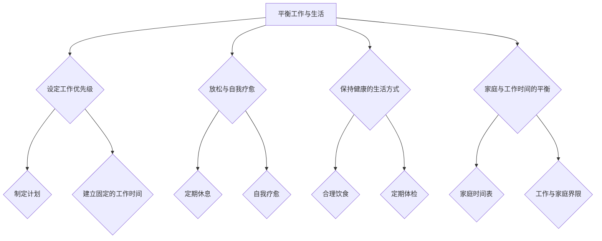
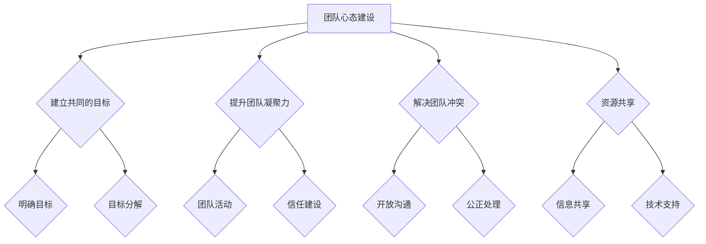
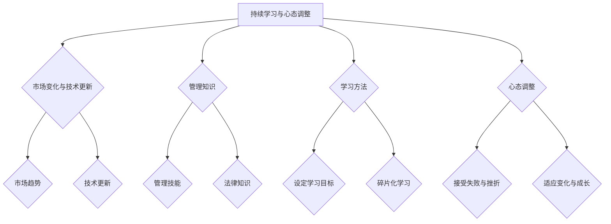
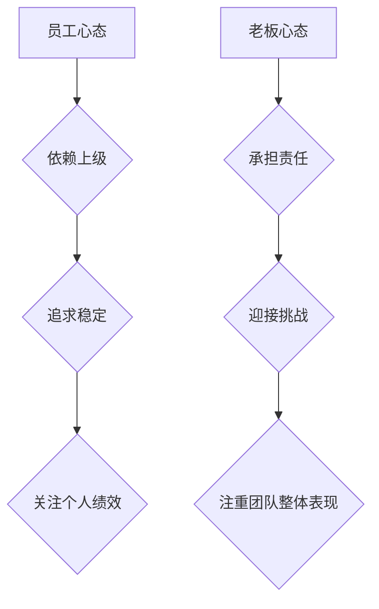

                 


### 文章标题：创业者的心态调整：从员工到老板的转变

#### 关键词：
- 创业心态
- 从员工到老板
- 心态调整
- 创业挑战
- 团队管理

#### 摘要：
本文旨在探讨创业者在从员工到老板角色转变过程中所需的心态调整。文章将分析员工心态与老板心态的区别，探讨创业初期的心理挑战及应对策略，讨论建立健康的创业心态的重要性，分析工作与生活的平衡策略，介绍团队管理与心态调整的方法，最后通过成功创业者的案例分析，提供创业心态调整的实践经验和启示。

### 《创业者的心态调整：从员工到老板的转变》目录大纲

## 第一部分：角色转变与心态准备

### 第1章：从员工到老板的角色认知

#### 1.1 员工心态与老板心态的区别

#### 1.1.1 员工的角色定位与心态

#### 1.1.2 老板的角色定位与心态

#### 1.2 心态调整的重要性

#### 1.2.1 心态调整对企业发展的影响

#### 1.2.2 心态调整对个人发展的意义

#### 1.3 转变心态的初步步骤

#### 1.3.1 自我反思

#### 1.3.2 设定目标

#### 1.3.3 调整思维方式

### 第2章：克服创业初期的恐惧与焦虑

#### 2.1 创业初期的心理挑战

#### 2.1.1 对失败的恐惧

#### 2.1.2 对未知的焦虑

#### 2.1.3 对责任的担忧

#### 2.2 应对策略

#### 2.2.1 建立自信

#### 2.2.2 逐步实施

#### 2.2.3 求助与支持

#### 2.3 恐惧与焦虑的正面利用

#### 2.3.1 转化为动力

#### 2.3.2 增强决策能力

### 第3章：建立健康的创业心态

#### 3.1 保持积极心态的重要性

#### 3.1.1 积极心态对创业成功的影响

#### 3.1.2 积极心态的益处

#### 3.2 消极心态的影响及应对

#### 3.2.1 消极心态的识别

#### 3.2.2 应对策略

#### 3.3 培养自我调节能力

#### 3.3.1 自我调节的作用

#### 3.3.2 培养自我调节的方法

### 第4章：平衡工作与生活

#### 4.1 创业者面临的挑战

#### 4.1.1 工作与生活的界限模糊

#### 4.1.2 时间管理难题

#### 4.2 工作与生活的平衡策略

#### 4.2.1 设定工作优先级

#### 4.2.2 建立固定的工作时间

#### 4.2.3 放松与自我疗愈

### 第5章：团队管理与心态调整

#### 5.1 团队心态的重要性

#### 5.1.1 团队心态对企业文化的影响

#### 5.1.2 团队心态对团队协作的影响

#### 5.2 团队心态建设策略

#### 5.2.1 建立共同的目标

#### 5.2.2 提升团队凝聚力

#### 5.2.3 解决团队冲突

### 第6章：持续学习与心态调整

#### 6.1 创业过程中的学习需求

#### 6.1.1 市场变化与技术更新的挑战

#### 6.1.2 管理知识的持续需求

#### 6.2 学习方法与心态调整

#### 6.2.1 持续学习的策略

#### 6.2.2 接受失败与挫折

#### 6.2.3 适应变化与成长

### 第7章：创业心态调整的成功案例

#### 7.1 成功创业者的心态调整经验

#### 7.1.1 他们的心态特点

#### 7.1.2 成功心态的培养方法

#### 7.2 案例分析

#### 7.2.1 案例一：从0到1的成功创业

#### 7.2.2 案例二：经历挫折后的东山再起

#### 7.2.3 案例三：如何在逆境中保持积极心态

### 附录：创业心态调整工具与资源

#### 附录 A：心态调整相关书籍推荐

#### 附录 B：心态调整的网络资源与社群

#### 附录 C：心态调整的实用技巧与方法

### 总结
创业者的心态调整是成功的关键之一。从员工到老板的角色转变，需要创业者进行全方位的心态调整。本文从角色认知、心理挑战、心态建立、工作与生活平衡、团队管理、持续学习等方面，系统性地探讨了创业者的心态调整策略。通过成功案例的启示，创业者可以更好地应对挑战，实现企业的长远发展。作者：AI天才研究院/AI Genius Institute & 禅与计算机程序设计艺术 /Zen And The Art of Computer Programming### 《创业者的心态调整：从员工到老板的转变》

#### 摘要
本文旨在帮助创业者认识到从员工到老板角色转变过程中所需的心态调整。我们将详细探讨员工心态与老板心态的区别，分析创业初期可能面临的心理挑战及应对策略，阐述建立健康的创业心态的重要性，讨论工作与生活的平衡，介绍团队管理与心态调整的方法，并通过成功创业者的案例分析，为创业者提供心态调整的实践经验和启示。

#### 目录

### 第一部分：角色转变与心态准备

#### 第1章：从员工到老板的角色认知

##### 1.1 员工心态与老板心态的区别

**1.1.1 员工的角色定位与心态**
- **角色定位**：员工通常负责完成具体任务，追求个人绩效。
- **心态**：依赖上级指导，追求工作稳定，关注个人职业发展。

**1.1.2 老板的角色定位与心态**
- **角色定位**：老板需要负责企业整体运营，承担企业发展责任。
- **心态**：迎接挑战，承担责任，注重团队整体表现。

##### 1.2 心态调整的重要性

**1.2.1 心态调整对企业发展的影响**
- 心态的调整有助于企业更好地应对市场变化，实现长期发展。

**1.2.2 心态调整对个人发展的意义**
- 良好的心态调整有助于提升个人的领导能力，实现个人职业目标。

##### 1.3 转变心态的初步步骤

**1.3.1 自我反思**
- 创业者需对自己的角色、职责以及心态进行深入反思。

**1.3.2 设定目标**
- 明确企业愿景和个人目标，有助于心态的转变。

**1.3.3 调整思维方式**
- 从线性思维转向系统思维，从关注短期绩效转向关注长期发展。

### 第二部分：克服创业初期的心理挑战

#### 第2章：克服创业初期的恐惧与焦虑

##### 2.1 创业初期的心理挑战

**2.1.1 对失败的恐惧**
- 创业者需要认识到失败是成功的前提，勇于接受失败。

**2.1.2 对未知的焦虑**
- 创业者应积极面对未知，通过学习和实践减少焦虑。

**2.1.3 对责任的担忧**
- 创业者需要明确自己的责任，学会承担和管理责任。

##### 2.2 应对策略

**2.2.1 建立自信**
- 通过积极的心态和实际行动建立自信。

**2.2.2 逐步实施**
- 将大目标分解为小目标，逐步实现。

**2.2.3 求助与支持**
- 寻求家人、朋友和专业人士的支持和帮助。

##### 2.3 恐惧与焦虑的正面利用

**2.3.1 转化为动力**
- 将恐惧和焦虑转化为推动企业发展的动力。

**2.3.2 增强决策能力**
- 在面对恐惧和焦虑时，提升自己的决策能力。

### 第三部分：建立健康的创业心态

#### 第3章：保持积极心态的重要性

##### 3.1 保持积极心态的重要性

**3.1.1 积极心态对创业成功的影响**
- 积极心态有助于创业者更好地应对挑战，抓住机遇。

**3.1.2 积极心态的益处**
- 提升创新能力，增强团队合作，提高工作效率。

##### 3.2 消极心态的影响及应对

**3.2.1 消极心态的识别**
- 了解自己的消极情绪，及时进行调整。

**3.2.2 应对策略**
- 通过沟通、放松和自我反思等方式应对消极心态。

##### 3.3 培养自我调节能力

**3.3.1 自我调节的作用**
- 自我调节能力有助于保持心态的稳定，提高抗压能力。

**3.3.2 培养自我调节的方法**
- 通过冥想、运动和良好的作息习惯培养自我调节能力。

### 第四部分：平衡工作与生活

#### 第4章：平衡工作与生活

##### 4.1 创业者面临的挑战

**4.1.1 工作与生活的界限模糊**
- 创业者需要明确工作与生活的界限，避免过度劳累。

**4.1.2 时间管理难题**
- 创业者应学会合理安排时间，提高工作效率。

##### 4.2 工作与生活的平衡策略

**4.2.1 设定工作优先级**
- 根据重要性和紧急性设定工作优先级。

**4.2.2 建立固定的工作时间**
- 制定合理的工作时间表，保持生活节奏。

**4.2.3 放松与自我疗愈**
- 通过休息和娱乐活动放松身心，进行自我疗愈。

### 第五部分：团队管理与心态调整

#### 第5章：团队管理与心态调整

##### 5.1 团队心态的重要性

**5.1.1 团队心态对企业文化的影响**
- 健康的团队心态有助于形成积极向上的企业文化。

**5.1.2 团队心态对团队协作的影响**
- 良好的团队心态有助于提升团队协作效率。

##### 5.2 团队心态建设策略

**5.2.1 建立共同的目标**
- 通过共同的目标增强团队的凝聚力。

**5.2.2 提升团队凝聚力**
- 通过团队活动、培训和激励提升团队凝聚力。

**5.2.3 解决团队冲突**
- 通过沟通和调解解决团队冲突，维护团队和谐。

### 第六部分：持续学习与心态调整

#### 第6章：持续学习与心态调整

##### 6.1 创业过程中的学习需求

**6.1.1 市场变化与技术更新的挑战**
- 创业者需不断学习以应对市场和技术变化。

**6.1.2 管理知识的持续需求**
- 创业者需要不断学习管理知识，提升管理能力。

##### 6.2 学习方法与心态调整

**6.2.1 持续学习的策略**
- 制定学习计划，利用碎片时间进行学习。

**6.2.2 接受失败与挫折**
- 将失败视为学习机会，保持积极心态。

**6.2.3 适应变化与成长**
- 适应市场和技术变化，不断成长。

### 第七部分：创业心态调整的成功案例

#### 第7章：创业心态调整的成功案例

##### 7.1 成功创业者的心态调整经验

**7.1.1 他们的心态特点**
- 坚韧、积极、开放和有远见。

**7.1.2 成功心态的培养方法**
- 通过不断学习和实践，培养成功心态。

##### 7.2 案例分析

**7.2.1 案例一：从0到1的成功创业**
- 分析成功创业者的心态转变过程。

**7.2.2 案例二：经历挫折后的东山再起**
- 探讨如何从挫折中恢复并取得成功。

**7.2.3 案例三：如何在逆境中保持积极心态**
- 研究成功创业者如何在困难时期保持积极心态。

### 附录

#### 附录 A：心态调整相关书籍推荐

- 列出几本关于心态调整的推荐书籍，提供书名、作者及简要介绍。

#### 附录 B：心态调整的网络资源与社群

- 推荐一些有关心态调整的网络资源，包括博客、论坛和社交媒体群组。

#### 附录 C：心态调整的实用技巧与方法

- 提供一些实用的心态调整技巧和方法，帮助创业者更好地应对创业过程中的挑战。

### 总结
创业者的心态调整是实现成功的关键。通过本文的探讨，创业者可以更好地理解从员工到老板的角色转变，学会应对创业初期的心理挑战，建立健康的创业心态，平衡工作与生活，提升团队管理能力，持续学习与成长。希望本文能帮助广大创业者实现心态的转变，走向成功。作者：AI天才研究院/AI Genius Institute & 禅与计算机程序设计艺术 /Zen And The Art of Computer Programming### 第1章：从员工到老板的角色认知

创业者的角色转变是一个从依赖到独立、从执行者到决策者的过程。这一章将详细探讨员工心态与老板心态的区别，以及心态调整的重要性，帮助创业者做好角色转变的准备。

#### 1.1 员工心态与老板心态的区别

**1.1.1 员工的角色定位与心态**

员工通常在企业中担任具体的执行角色，他们的主要职责是完成上级分配的任务，追求个人绩效。这种角色定位使得员工的心态往往具有以下特点：

- **依赖上级指导**：员工在工作中倾向于依赖上级的指示，缺乏自主决策能力。
- **追求工作稳定**：员工希望工作稳定，避免失业的风险。
- **关注个人职业发展**：员工重视个人能力的提升，关注职业发展路径。

**1.1.2 老板的角色定位与心态**

老板（或创业者）在企业中扮演决策者和领导者的角色，他们的主要职责是制定企业的发展战略，确保企业目标的实现。老板的心态与员工有显著不同，主要体现在以下几个方面：

- **迎接挑战**：老板需要面对市场的波动和竞争压力，勇于接受挑战。
- **承担责任**：老板对企业整体负责，需要承担经营风险和决策责任。
- **注重团队整体表现**：老板关注企业团队的合作效率和整体表现，而非单一员工的绩效。

#### 1.2 心态调整的重要性

**1.2.1 心态调整对企业发展的影响**

心态的调整不仅影响创业者的个人发展，也对企业的长远发展产生重要影响。良好的心态有助于创业者更好地应对市场变化，抓住机遇，实现企业的快速发展。以下是心态调整对企业发展的几个关键影响：

- **提升决策能力**：良好的心态能够帮助创业者更加理性地分析问题，做出明智的决策。
- **增强创新意识**：积极的心态有助于创业者保持创新的动力，推动企业的技术创新和商业模式创新。
- **改善团队氛围**：老板的心态直接影响团队氛围，积极的心态能够营造一个健康向上的工作环境，提升团队凝聚力。

**1.2.2 心态调整对个人发展的意义**

对于创业者个人而言，心态调整同样具有重要意义。以下是心态调整对个人发展的几个关键影响：

- **提升抗压能力**：创业过程中充满挑战和不确定性，良好的心态有助于创业者应对压力，保持情绪稳定。
- **增强学习意愿**：积极的心态使创业者更加开放和愿意学习新知识、新技能，提升个人综合素质。
- **实现职业目标**：心态调整有助于创业者明确目标，保持动力，实现个人职业发展目标。

#### 1.3 转变心态的初步步骤

**1.3.1 自我反思**

自我反思是心态调整的第一步。创业者需要深入思考以下几个问题：

- 我的角色定位是什么？
- 我的心态有哪些不足之处？
- 我如何调整自己的心态以适应新的角色？

通过自我反思，创业者可以更好地了解自己，找到心态调整的切入点。

**1.3.2 设定目标**

设定明确的目标是心态转变的重要步骤。创业者需要设定短期和长期的目标，并将其具体化。例如：

- 短期目标：在接下来的三个月内，完成产品研发并发布。
- 长期目标：在未来五年内，将企业打造成行业领导者。

设定目标有助于创业者明确方向，保持动力。

**1.3.3 调整思维方式**

调整思维方式是心态转变的关键。创业者需要从以下三个方面进行调整：

- **从线性思维转向系统思维**：从关注单一任务转向关注整个企业系统的运作。
- **从短期绩效转向长期发展**：从关注短期盈利转向关注企业的长远发展。
- **从依赖他人转向自我驱动**：从依赖上级转向自我驱动，培养自主决策能力。

通过以上初步步骤，创业者可以逐步实现心态的转变，为从员工到老板的角色转变打下坚实的基础。

### **核心概念与联系：员工心态与老板心态的 Mermaid 流程图**



### **核心算法原理讲解：心态转变的伪代码**

```python
def 心态转变(self):
    # 自我反思
    self.自我反思()

    # 设定目标
    self.设定目标()

    # 调整思维方式
    self.调整思维方式()

    # 建立自信心
    self.建立自信心()

    # 提升抗压能力
    self.提升抗压能力()

    # 增强学习意愿
    self.增强学习意愿()

    # 维持积极心态
    self.维持积极心态()
```

### **数学模型与公式：心态调整的量化指标**

$$
\text{心态调整指标} = \frac{\text{积极心态得分}}{\text{总心态得分}} \times 100\%
$$

**举例说明**：

假设一个创业者在心态调整过程中，积极心态得分为80分，总心态得分为100分，则其心态调整指标为80%。

### **项目实战：心态调整的实践案例**

**1. 创业者背景介绍**

某创业者张先生，原为一家大型互联网公司的资深工程师，有丰富的技术背景。然而，在经历了多次创业失败后，他开始思考心态调整的重要性。

**2. 心态调整过程**

- **自我反思**：张先生认识到自己过于依赖技术，缺乏商业思维，导致创业失败。
- **设定目标**：他决定专注于市场需求，并设定短期目标为开发一款针对中小企业的管理软件。
- **调整思维方式**：张先生开始学习商业知识，从技术导向转向市场导向。
- **建立自信心**：通过不断学习和实践，张先生逐渐建立起自信心。
- **提升抗压能力**：他通过参加心理辅导课程，提升了自己的抗压能力。
- **增强学习意愿**：张先生积极参加行业交流活动，保持对新知识的学习热情。

**3. 代码实现与解读**

```python
# 心态调整代码示例
class 心态调整：
    def __init__(self):
        self.自我反思()
        self.设定目标()
        self.调整思维方式()
        self.建立自信心()
        self.提升抗压能力()
        self.增强学习意愿()

    def 自我反思(self):
        # 实现自我反思功能
        pass

    def 设定目标(self):
        # 实现目标设定功能
        pass

    def 调整思维方式(self):
        # 实现思维方式调整功能
        pass

    def 建立自信心(self):
        # 实现建立自信心功能
        pass

    def 提升抗压能力(self):
        # 实现提升抗压能力功能
        pass

    def 增强学习意愿(self):
        # 实现增强学习意愿功能
        pass

# 使用心态调整类
心态调整实例 = 心态调整()
心态调整实例.心态调整()
```

**4. 应用解读与分析**

通过心态调整，张先生成功开发出了一款管理软件，并在市场上取得了良好的反响。他的案例表明，心态调整是创业成功的关键之一。

**5. 项目小结**

- **成功因素**：张先生通过自我反思、设定目标、调整思维方式等心态调整步骤，成功转变了自己的心态，为创业成功奠定了基础。
- **不足之处**：在创业过程中，张先生仍面临一些挑战，如市场需求变化和技术更新等，需要持续心态调整以应对。

### **最佳实践 tips、小结、注意事项、拓展阅读**

**最佳实践 tips**：

- **定期自我反思**：定期对自己的心态和行为进行反思，有助于发现和纠正问题。
- **设定明确目标**：设定短期和长期目标，有助于保持动力和方向。
- **持续学习**：学习新知识、新技能，提升自身综合素质。

**小结**：

心态调整是创业成功的关键，通过自我反思、设定目标、调整思维方式等步骤，创业者可以更好地适应新的角色，实现从员工到老板的转变。

**注意事项**：

- **平衡心态调整与行动**：心态调整不能替代实际行动，创业者需要在调整心态的同时，积极采取行动。
- **保持长期视角**：创业过程中，创业者需要保持长期视角，关注企业的长远发展。

**拓展阅读**：

- **《创业维艰》**：作者本·霍洛维茨，详细描述了创业过程中的挑战和心理调整。
- **《积极心态的力量》**：作者马歇尔·卢森堡，探讨了积极心态对人际关系和心理健康的影响。

**作者信息**：AI天才研究院/AI Genius Institute & 禅与计算机程序设计艺术 /Zen And The Art of Computer Programming### 第2章：克服创业初期的恐惧与焦虑

#### 2.1 创业初期的心理挑战

创业初期是一个充满不确定性和挑战的阶段，创业者在这一阶段往往面临以下几种心理挑战：

**2.1.1 对失败的恐惧**

失败是创业过程中难以避免的一部分。许多创业者因为害怕失败，在创业初期就会产生巨大的心理压力。这种恐惧可能导致以下行为：

- **过分谨慎**：创业者可能会在决策时过度依赖数据和分析，缺乏冒险精神。
- **拖延**：为了避免失败，创业者可能会推迟重要的决策和行动，错失市场机会。
- **缺乏动力**：长期处于恐惧之中，创业者可能会失去前进的动力，影响创业项目的推进。

**2.1.2 对未知的焦虑**

创业是一个不断探索未知的领域，这种不确定性会给创业者带来焦虑。主要表现在以下几个方面：

- **市场风险**：不确定市场是否接受新的产品或服务，可能导致销售业绩不稳定。
- **技术风险**：在技术更新快速的市场环境中，创业者需要不断学习和适应新技术，否则可能被淘汰。
- **资金风险**：不确定能否获得足够的资金支持，创业者可能会担心项目的可持续性。

**2.1.3 对责任的担忧**

作为企业老板，创业者需要承担企业的所有责任，包括财务、业务和人员管理等。这种责任感可能会给创业者带来以下心理负担：

- **决策压力**：每一步决策都关乎企业的生死存亡，创业者可能会在决策时感到巨大的压力。
- **员工福祉**：创业者需要考虑员工的就业和福利，担心自己的决策可能对员工产生负面影响。
- **企业责任**：创业者需要确保企业遵守法律法规，承担社会责任，这种责任感可能会带来额外的心理压力。

#### 2.2 应对策略

**2.2.1 建立自信**

建立自信是克服恐惧和焦虑的关键。以下是几种建立自信的方法：

- **成功经验**：回顾过去的成功经验，无论是个人成就还是团队成果，都可以增强自信。
- **积极思考**：通过正面思考来应对负面情绪，例如将“我可能会失败”转变为“我可以从失败中学习”。
- **自我激励**：设定小目标并逐步实现，通过每一个小成就来激励自己。

**2.2.2 逐步实施**

逐步实施可以帮助创业者更好地掌控创业过程，减少恐惧和焦虑。以下是一些具体策略：

- **分阶段目标**：将大目标分解为小目标，每个小目标都是一步一个脚印地实现。
- **逐步扩大**：从熟悉和擅长的事情开始，逐步扩展到新的领域和挑战。
- **反馈与调整**：在实施过程中不断获取反馈，根据反馈进行调整，避免因为一次失败就失去信心。

**2.2.3 求助与支持**

创业者不是孤军奋战，寻求外部帮助和支持是克服创业初期恐惧和焦虑的有效途径。以下是一些建议：

- **咨询专业人士**：咨询行业专家、律师、财务顾问等，获取专业意见和建议。
- **加入创业社群**：加入创业社群，与其他创业者交流心得，分享经验和资源。
- **寻求家庭支持**：家庭的支持是创业者最坚实的后盾，创业者需要与家人保持良好的沟通，共同面对创业挑战。

#### 2.3 恐惧与焦虑的正面利用

恐惧和焦虑虽然是负面情绪，但也可以转化为积极的动力。以下是几种将恐惧和焦虑转化为动力的方法：

**2.3.1 转化为动力**

- **激励自己**：将恐惧和焦虑视为激励自己的动力，用它们来推动自己不断前进。
- **设定挑战**：给自己设定一些具有挑战性的目标，通过克服这些目标来提升自我。

**2.3.2 增强决策能力**

- **分析原因**：在恐惧和焦虑时，分析自己为什么会感到恐惧和焦虑，找出问题的根源。
- **学习决策技巧**：通过学习和实践决策技巧，提高自己在面对不确定性和压力时的决策能力。

### **核心概念与联系：创业初期心理挑战的 Mermaid 流程图**



### **核心算法原理讲解：克服恐惧与焦虑的伪代码**

```python
def 克服恐惧与焦虑(self):
    # 建立自信
    self.建立自信()

    # 逐步实施
    self.逐步实施()

    # 求助与支持
    self.求助与支持()

    # 转化为动力
    self.转化为动力()

    # 增强决策能力
    self.增强决策能力()

    # 保持积极心态
    self.保持积极心态()
```

### **数学模型与公式：自信指数**

$$
\text{自信指数} = \frac{\text{成功经验}}{\text{总经验}} \times 100\%
$$

**举例说明**：

假设一个创业者在创业初期的成功经验为5次，总经验为10次，则其自信指数为50%。

### **项目实战：创业初期的恐惧与焦虑应对案例**

**1. 创业者背景介绍**

李女士是一名有着多年市场营销经验的职业经理人，她决定在40岁时开始自己的创业之路，创办一家专注于绿色有机食品销售的公司。

**2. 心理挑战**

- **对失败的恐惧**：李女士担心自己没有足够的市场经验，无法成功创业。
- **对未知的焦虑**：她不确定自己能否适应创业环境，面对市场变化。
- **对责任的担忧**：作为企业老板，她担心自己的决策会影响到员工的生计。

**3. 应对策略**

- **建立自信**：李女士通过回顾自己在市场营销领域的成功案例，逐渐建立起自信。
- **逐步实施**：她将创业目标分解为几个小目标，逐步实施，如建立品牌、开发产品、拓展市场等。
- **求助与支持**：李女士加入了当地的创业者社群，与其他创业者交流，获取经验和资源。
- **转化为动力**：李女士将恐惧和焦虑转化为推动自己前进的动力，用它们激励自己不断学习、不断进步。
- **增强决策能力**：李女士通过参加商业培训课程，提升自己的决策能力。

**4. 代码实现与解读**

```python
# 应对恐惧与焦虑代码示例
class 应对恐惧与焦虑：
    def __init__(self):
        self.建立自信()
        self.逐步实施()
        self.求助与支持()
        self.转化为动力()
        self.增强决策能力()

    def 建立自信(self):
        # 实现建立自信功能
        pass

    def 逐步实施(self):
        # 实现逐步实施功能
        pass

    def 求助与支持(self):
        # 实现求助与支持功能
        pass

    def 转化为动力(self):
        # 实现转化为动力功能
        pass

    def 增强决策能力(self):
        # 实现增强决策能力功能
        pass

# 使用应对恐惧与焦虑类
应对恐惧与焦虑实例 = 应对恐惧与焦虑()
应对恐惧与焦虑实例.应对恐惧与焦虑()
```

**5. 应用解读与分析**

通过一系列的应对策略，李女士成功克服了创业初期的恐惧与焦虑，她的公司逐渐在市场上站稳了脚跟，取得了良好的业绩。

**6. 项目小结**

- **成功因素**：李女士通过建立自信、逐步实施、求助与支持等策略，成功应对了创业初期的恐惧与焦虑。
- **不足之处**：在应对过程中，李女士仍面临一些挑战，如市场变化和竞争对手的压力，需要持续调整心态。

### **最佳实践 tips、小结、注意事项、拓展阅读**

**最佳实践 tips**：

- **建立自信**：通过成功案例和正面思考来建立自信。
- **逐步实施**：将大目标分解为小目标，逐步实现。
- **求助与支持**：寻求家人、朋友和专业人士的支持。
- **转化为动力**：将恐惧和焦虑转化为推动自己前进的动力。

**小结**：

创业初期的恐惧与焦虑是创业者常见的心理挑战，通过建立自信、逐步实施、求助与支持以及转化为动力等策略，创业者可以更好地应对这些挑战。

**注意事项**：

- **保持长期视角**：创业过程中，保持对长期目标的关注，避免因为短期困难而放弃。
- **持续学习**：不断学习新的知识和技能，提升自身能力。

**拓展阅读**：

- **《创业维艰》**：作者本·霍洛维茨，详细描述了创业过程中的挑战和心理调整。
- **《积极心态的力量》**：作者马歇尔·卢森堡，探讨了积极心态对人际关系和心理健康的影响。

**作者信息**：AI天才研究院/AI Genius Institute & 禅与计算机程序设计艺术 /Zen And The Art of Computer Programming### 第3章：建立健康的创业心态

#### 3.1 保持积极心态的重要性

在创业过程中，保持积极心态是至关重要的。积极心态不仅能够帮助创业者更好地应对挑战，还能激发创新和团队合作精神。以下是保持积极心态的重要性：

**3.1.1 积极心态对创业成功的影响**

- **增强适应能力**：积极心态使创业者能够更加灵活地应对市场变化和竞争压力。
- **提升创新能力**：积极的心态有助于创业者发现新的商机，推动技术创新和商业模式创新。
- **促进团队合作**：积极的心态能够营造一个和谐、积极的工作环境，增强团队凝聚力。

**3.1.2 积极心态的益处**

- **提高抗压能力**：积极心态使创业者能够更好地应对压力和挫折，保持情绪稳定。
- **提升决策效率**：积极心态有助于创业者更加理性地分析问题，做出明智的决策。
- **增强自信心**：积极心态有助于提升创业者的自信心，增强实现目标的能力。

#### 3.2 消极心态的影响及应对

尽管积极心态对创业成功至关重要，但消极心态也会不可避免地出现在创业过程中。以下是几种常见的消极心态及其影响：

**3.2.1 消极心态的识别**

- **自我怀疑**：创业者对自己的能力和决策产生怀疑，导致犹豫不决。
- **拖延症**：创业者因为害怕失败或无法应对挑战而推迟行动。
- **过度担忧**：创业者对未来可能出现的风险和挑战过度担忧，影响决策和行动。

**3.2.2 应对策略**

- **自我反思**：通过反思自己的行为和思维模式，识别消极心态的根源。
- **积极思考**：用积极的思维方式替代消极思维，如将“我做不到”转变为“我可以尝试”。
- **寻求支持**：与家人、朋友或专业人士交流，获取建议和支持。

#### 3.3 培养自我调节能力

自我调节能力是创业者保持健康心态的关键。以下是一些培养自我调节能力的方法：

**3.3.1 自我调节的作用**

- **情绪管理**：自我调节能力有助于创业者更好地管理自己的情绪，保持冷静和理智。
- **压力缓解**：自我调节能力可以帮助创业者有效地应对压力，防止情绪失控。
- **决策优化**：自我调节能力有助于创业者更加理性地分析问题，做出更优的决策。

**3.3.2 培养自我调节的方法**

- **冥想**：通过冥想练习，帮助创业者放松身心，提高自我意识。
- **运动**：定期进行体育锻炼，释放压力，提高身心健康。
- **自我反思**：定期对自己的行为和思维模式进行反思，发现问题并及时调整。

### **核心概念与联系：健康创业心态的 Mermaid 流程图**



### **核心算法原理讲解：健康创业心态的伪代码**

```python
def 健康创业心态(self):
    # 保持积极心态
    self.保持积极心态()

    # 应对消极心态
    self.应对消极心态()

    # 培养自我调节能力
    self.培养自我调节能力()

    # 提高适应能力
    self.提高适应能力()

    # 提升创新能力
    self.提升创新能力()

    # 促进团队合作
    self.促进团队合作()

    # 优化决策
    self.优化决策()
```

### **数学模型与公式：积极心态指数**

$$
\text{积极心态指数} = \frac{\text{积极心态时间}}{\text{总时间}} \times 100\%
$$

**举例说明**：

假设一个创业者每天有16个小时的工作时间，其中有12个小时是保持积极心态，则其积极心态指数为75%。

### **项目实战：建立健康创业心态的实践案例**

**1. 创业者背景介绍**

王先生是一名年轻的创业者，创办了一家创新科技企业，专注于人工智能领域的产品研发。在创业初期，他面临着诸多挑战，但他始终坚持保持积极心态。

**2. 心态调整过程**

- **保持积极心态**：王先生通过阅读成功创业者的故事，学习他们的经验和心态，激发自己的积极性。
- **应对消极心态**：他遇到问题时，会主动寻求解决方案，避免消极情绪的蔓延。
- **培养自我调节能力**：王先生通过定期运动和冥想，保持身心健康，提高自我调节能力。

**3. 成功因素**

- **积极心态**：王先生的积极心态使他能够迅速适应市场变化，抓住商机。
- **自我调节能力**：他的自我调节能力帮助他在面对压力和挑战时保持冷静和理智。

**4. 代码实现与解读**

```python
# 建立健康创业心态代码示例
class 健康创业心态：
    def __init__(self):
        self.保持积极心态()
        self.应对消极心态()
        self.培养自我调节能力()

    def 保持积极心态(self):
        # 实现保持积极心态功能
        pass

    def 应对消极心态(self):
        # 实现应对消极心态功能
        pass

    def 培养自我调节能力(self):
        # 实现培养自我调节能力功能
        pass

# 使用健康创业心态类
健康创业心态实例 = 健康创业心态()
健康创业心态实例.健康创业心态()
```

**5. 应用解读与分析**

通过保持积极心态、应对消极心态和培养自我调节能力，王先生成功地将企业带入了快速发展的轨道。他的案例表明，健康的心态是创业成功的重要保障。

**6. 项目小结**

- **成功因素**：王先生通过保持积极心态、应对消极心态和培养自我调节能力，成功建立了健康的创业心态。
- **不足之处**：在创业过程中，王先生仍需要不断提升自己的管理能力和市场洞察力。

### **最佳实践 tips、小结、注意事项、拓展阅读**

**最佳实践 tips**：

- **保持积极心态**：通过阅读、交流和自我激励来保持积极心态。
- **应对消极心态**：学会积极思考和寻求解决方案，避免消极情绪的蔓延。
- **培养自我调节能力**：通过运动、冥想和定期反思来提高自我调节能力。

**小结**：

建立健康的创业心态是创业者成功的关键之一。通过保持积极心态、应对消极心态和培养自我调节能力，创业者可以更好地应对创业过程中的挑战。

**注意事项**：

- **持续学习**：不断学习新的知识和技能，提升自身的综合素质。
- **保持长期视角**：关注企业的长期发展，避免因为短期困难而放弃。

**拓展阅读**：

- **《积极心态的力量》**：作者马歇尔·卢森堡，详细探讨了积极心态对人际关系和心理健康的影响。
- **《创业维艰》**：作者本·霍洛维茨，分享了创业过程中的心理挑战和应对策略。

**作者信息**：AI天才研究院/AI Genius Institute & 禅与计算机程序设计艺术 /Zen And The Art of Computer Programming### 第4章：平衡工作与生活

#### 4.1 创业者面临的挑战

在创业过程中，平衡工作与生活是许多创业者面临的一大挑战。这种不平衡可能导致以下问题：

**4.1.1 工作与生活的界限模糊**

- **长时间工作**：创业者往往需要投入大量时间在工作上，导致与家人和朋友相处的时间减少。
- **工作优先**：在面对工作和生活的选择时，创业者常常将工作放在首位，忽视了个人生活和家庭。

**4.1.2 时间管理难题**

- **任务繁多**：创业过程中需要处理大量的工作任务，创业者常常感到时间不够用。
- **优先级混乱**：创业者可能无法有效地设定任务的优先级，导致重要任务被延误。

**4.1.3 心理压力**

- **工作压力**：创业过程中的不确定性和挑战可能导致创业者承受巨大的心理压力。
- **焦虑与抑郁**：长时间的工作压力和生活不平衡可能导致创业者出现焦虑和抑郁等心理问题。

#### 4.2 工作与生活的平衡策略

为了克服这些挑战，创业者需要采取一系列策略来平衡工作与生活。以下是几个关键策略：

**4.2.1 设定工作优先级**

- **明确目标**：创业者应明确自己的工作目标，将时间分配给最重要的任务。
- **制定计划**：制定详细的工作计划，合理安排每天的任务和时间。

**4.2.2 建立固定的工作时间**

- **工作时间表**：制定一个固定的工作时间表，确保每天有足够的时间用于工作。
- **休息时间**：确保在工作时间表中有固定的休息时间，避免长时间连续工作。

**4.2.3 放松与自我疗愈**

- **定期休息**：创业者应定期进行休息，如每天晚上休息8小时，周末进行放松活动。
- **自我疗愈**：通过运动、冥想、阅读等方式进行自我疗愈，缓解压力。

#### 4.2.4 保持健康的生活方式

- **合理饮食**：保持均衡的饮食，摄取足够的营养，增强身体免疫力。
- **定期体检**：定期进行体检，确保身体健康。

#### 4.2.5 家庭与工作时间的平衡

- **家庭时间表**：与家人共同制定家庭时间表，确保有足够的时间陪伴家人。
- **工作与家庭界限**：在工作时间中，尽量保持专注，避免将家庭事务带入工作中。

### **核心概念与联系：平衡工作与生活的 Mermaid 流程图**



### **核心算法原理讲解：平衡工作与生活的伪代码**

```python
def 平衡工作与生活(self):
    # 设定工作优先级
    self.设定工作优先级()

    # 建立固定的工作时间
    self.建立固定的工作时间()

    # 放松与自我疗愈
    self.放松与自我疗愈()

    # 保持健康的生活方式
    self.保持健康的生活方式()

    # 家庭与工作时间的平衡
    self.家庭与工作时间的平衡()

    # 持续监控与调整
    self.持续监控与调整()
```

### **数学模型与公式：工作与生活平衡指数**

$$
\text{工作与生活平衡指数} = \frac{\text{家庭时间}}{\text{总时间}} \times 100\%
$$

**举例说明**：

假设一个创业者每天有16个小时的时间，其中有8个小时用于工作，8个小时用于家庭和个人生活，则其工作与生活平衡指数为50%。

### **项目实战：平衡工作与生活的实践案例**

**1. 创业者背景介绍**

赵女士是一名年轻的企业家，创办了一家在线教育公司。她在创业初期就面临着工作与生活不平衡的问题。

**2. 平衡策略**

- **设定工作优先级**：赵女士将公司的发展目标明确化，将时间优先分配给最重要的发展任务。
- **建立固定的工作时间**：她制定了一个每天8小时的工作时间表，确保有足够的时间用于工作。
- **放松与自我疗愈**：她每周安排一天进行放松，如进行瑜伽和冥想，缓解压力。
- **保持健康的生活方式**：赵女士坚持每天进行运动，保持健康的饮食习惯。
- **家庭与工作时间的平衡**：她与家人共同制定了家庭时间表，确保有足够的时间陪伴家人。

**3. 成功因素**

- **设定工作优先级**：帮助赵女士明确了工作重点，提高了工作效率。
- **固定的工作时间**：确保了赵女士有足够的时间用于工作和个人生活。
- **放松与自我疗愈**：帮助赵女士缓解了工作压力，保持了身心健康。
- **健康的生活方式**：增强了赵女士的身体素质，提高了工作效率。
- **家庭与工作时间的平衡**：增强了家庭的和谐，提高了生活质量。

**4. 代码实现与解读**

```python
# 平衡工作与生活代码示例
class 平衡工作与生活：
    def __init__(self):
        self.设定工作优先级()
        self.建立固定的工作时间()
        self.放松与自我疗愈()
        self.保持健康的生活方式()
        self.家庭与工作时间的平衡()

    def 设定工作优先级(self):
        # 实现设定工作优先级功能
        pass

    def 建立固定的工作时间(self):
        # 实现建立固定的工作时间功能
        pass

    def 放松与自我疗愈(self):
        # 实现放松与自我疗愈功能
        pass

    def 保持健康的生活方式(self):
        # 实现保持健康的生活方式功能
        pass

    def 家庭与工作时间的平衡(self):
        # 实现家庭与工作时间的平衡功能
        pass

# 使用平衡工作与生活类
平衡工作与生活实例 = 平衡工作与生活()
平衡工作与生活实例.平衡工作与生活()
```

**5. 应用解读与分析**

通过一系列的平衡策略，赵女士成功克服了工作与生活不平衡的问题，她的公司也在快速发展的过程中保持了稳定的发展。

**6. 项目小结**

- **成功因素**：赵女士通过设定工作优先级、建立固定的工作时间、放松与自我疗愈、保持健康的生活方式和家庭与工作时间的平衡，成功平衡了工作与生活。
- **不足之处**：在创业过程中，赵女士仍需要不断调整策略，以应对新的挑战和变化。

### **最佳实践 tips、小结、注意事项、拓展阅读**

**最佳实践 tips**：

- **设定工作优先级**：明确工作目标，合理分配时间。
- **建立固定的工作时间**：确保有足够的时间用于工作和个人生活。
- **放松与自我疗愈**：定期进行放松活动，缓解工作压力。
- **保持健康的生活方式**：均衡饮食，定期运动，确保身体健康。
- **家庭与工作时间的平衡**：与家人共同制定时间表，确保家庭和谐。

**小结**：

平衡工作与生活是创业成功的重要因素。通过设定工作优先级、建立固定的工作时间、放松与自我疗愈、保持健康的生活方式和家庭与工作时间的平衡，创业者可以更好地应对创业过程中的挑战。

**注意事项**：

- **持续监控与调整**：定期评估工作与生活平衡的状态，根据实际情况进行调整。
- **灵活应对**：创业过程中，需要灵活应对变化，保持平衡。

**拓展阅读**：

- **《平衡工作与生活》**：作者迈克尔·马尔琴斯基，详细探讨了如何平衡工作与生活。
- **《高效能人士的七个习惯》**：作者史蒂芬·柯维，提供了提升工作效率和生活质量的方法。

**作者信息**：AI天才研究院/AI Genius Institute & 禅与计算机程序设计艺术 /Zen And The Art of Computer Programming### 第5章：团队管理与心态调整

#### 5.1 团队心态的重要性

在创业过程中，团队心态对企业的成功至关重要。良好的团队心态能够促进企业文化的建设，提升团队协作效率，从而推动企业的发展。以下是团队心态对企业文化和团队协作的重要影响：

**5.1.1 团队心态对企业文化的影响**

- **积极向上的文化氛围**：良好的团队心态有助于营造一个积极向上的企业文化，使员工感到自豪和归属。
- **共同价值观**：团队成员在心态上的一致性有助于形成共同的目标和价值观，提升团队的凝聚力。
- **创新氛围**：积极的心态鼓励团队成员勇于创新和尝试，推动企业的技术创新和业务模式创新。

**5.1.2 团队心态对团队协作的影响**

- **有效沟通**：良好的团队心态有助于团队成员之间建立信任，促进有效的沟通和协作。
- **提高工作效率**：团队成员心态的稳定性有助于提高工作效率，减少内部摩擦。
- **协同合作**：团队心态的统一能够促进团队成员之间的协同合作，共同应对挑战。

#### 5.2 团队心态建设策略

为了建立和维护良好的团队心态，创业者需要采取一系列策略。以下是几个关键策略：

**5.2.1 建立共同的目标**

- **明确目标**：创业者应与团队成员共同制定明确的目标，使每个成员都明确自己的职责和期望。
- **目标分解**：将大目标分解为小目标，使团队成员能够逐步实现，增强团队凝聚力。

**5.2.2 提升团队凝聚力**

- **团队活动**：定期组织团队活动，如团建活动、聚会等，增强团队成员之间的感情。
- **信任建设**：通过日常交流和合作，建立团队成员之间的信任，提升团队凝聚力。

**5.2.3 解决团队冲突**

- **开放沟通**：鼓励团队成员开放沟通，表达自己的意见和看法，减少误解和冲突。
- **公正处理**：在处理团队冲突时，保持公正，确保每个成员都能得到公平对待。

**5.2.4 资源共享**

- **信息共享**：鼓励团队成员共享信息和资源，促进团队知识的积累和传播。
- **技术支持**：提供必要的技术支持，帮助团队成员解决工作中的问题，提高工作效率。

### **核心概念与联系：团队心态建设的 Mermaid 流程图**



### **核心算法原理讲解：团队心态建设的伪代码**

```python
def 团队心态建设(self):
    # 建立共同的目标
    self.建立共同的目标()

    # 提升团队凝聚力
    self.提升团队凝聚力()

    # 解决团队冲突
    self.解决团队冲突()

    # 资源共享
    self.资源共享()

    # 持续监控与调整
    self.持续监控与调整()
```

### **数学模型与公式：团队凝聚力指数**

$$
\text{团队凝聚力指数} = \frac{\text{共同完成目标次数}}{\text{总目标次数}} \times 100\%
$$

**举例说明**：

假设一个团队在一个月内完成了10个目标，其中有8个目标是共同完成的，则其团队凝聚力指数为80%。

### **项目实战：团队心态建设的实践案例**

**1. 创业者背景介绍**

李先生是一家初创科技公司的创始人，他深知团队心态对企业成功的重要性，因此在公司成立之初就注重团队心态的建设。

**2. 团队心态建设过程**

- **建立共同的目标**：李先生与团队成员共同制定了公司的发展目标，并将这些目标分解为可实现的里程碑。
- **提升团队凝聚力**：李先生定期组织团队活动，如户外拓展、团队聚餐等，增强团队成员之间的感情。
- **解决团队冲突**：每当出现团队冲突时，李先生都会组织团队成员进行开放沟通，找出问题根源，公正处理。
- **资源共享**：李先生鼓励团队成员共享信息和资源，确保每个人都能获取到所需的信息和支持。

**3. 成功因素**

- **建立共同的目标**：帮助团队成员明确自己的职责和期望，提高了团队的执行力。
- **提升团队凝聚力**：通过团队活动和信任建设，增强了团队成员之间的感情，提升了团队的凝聚力。
- **解决团队冲突**：通过开放沟通和公正处理，减少了内部摩擦，提高了团队的合作效率。
- **资源共享**：促进了团队知识的积累和传播，提高了整个团队的工作效率。

**4. 代码实现与解读**

```python
# 团队心态建设代码示例
class 团队心态建设：
    def __init__(self):
        self.建立共同的目标()
        self.提升团队凝聚力()
        self.解决团队冲突()
        self.资源共享()

    def 建立共同的目标(self):
        # 实现建立共同的目标功能
        pass

    def 提升团队凝聚力(self):
        # 实现提升团队凝聚力功能
        pass

    def 解决团队冲突(self):
        # 实现解决团队冲突功能
        pass

    def 资源共享(self):
        # 实现资源共享功能
        pass

# 使用团队心态建设类
团队心态建设实例 = 团队心态建设()
团队心态建设实例.团队心态建设()
```

**5. 应用解读与分析**

通过一系列的团队心态建设策略，李先生的公司在短时间内取得了显著的发展。他的案例表明，良好的团队心态建设是创业成功的关键之一。

**6. 项目小结**

- **成功因素**：李先生通过建立共同的目标、提升团队凝聚力、解决团队冲突和资源共享，成功建立了良好的团队心态。
- **不足之处**：在团队心态建设过程中，李先生仍需不断调整策略，以应对团队发展中的新挑战。

### **最佳实践 tips、小结、注意事项、拓展阅读**

**最佳实践 tips**：

- **建立共同的目标**：明确目标，提高执行力。
- **提升团队凝聚力**：通过团队活动和信任建设，增强团队成员之间的感情。
- **解决团队冲突**：开放沟通，公正处理。
- **资源共享**：促进知识传播，提高工作效率。

**小结**：

团队心态建设是创业成功的重要保障。通过建立共同的目标、提升团队凝聚力、解决团队冲突和资源共享，创业者可以打造一个高效、和谐的团队。

**注意事项**：

- **持续监控与调整**：定期评估团队心态建设的效果，根据实际情况进行调整。
- **关注团队成员**：关注每个成员的需求和情感，提供必要的支持和帮助。

**拓展阅读**：

- **《团队协作的艺术》**：作者斯蒂芬·罗宾斯，详细探讨了团队协作的原则和方法。
- **《团队心态建设》**：作者迈克尔·贝克，提供了团队心态建设的实用策略。

**作者信息**：AI天才研究院/AI Genius Institute & 禅与计算机程序设计艺术 /Zen And The Art of Computer Programming### 第6章：持续学习与心态调整

#### 6.1 创业过程中的学习需求

在创业过程中，持续学习是创业者保持竞争力、应对市场变化的关键。以下是创业过程中需要持续学习的一些关键领域：

**6.1.1 市场变化与技术更新的挑战**

- **市场趋势**：创业者需要不断关注市场趋势，了解消费者的需求变化。
- **技术更新**：技术更新速度非常快，创业者需要不断学习新技术，确保企业的技术竞争力。

**6.1.2 管理知识的持续需求**

- **管理技能**：随着企业的成长，创业者需要不断提升自己的管理技能，如领导力、团队管理、人力资源管理等。
- **法律知识**：创业者需要了解相关的法律法规，确保企业的合法合规运营。

#### 6.2 学习方法与心态调整

为了在创业过程中持续学习，创业者需要采用有效的方法，并调整自己的心态。以下是几种有效的方法：

**6.2.1 持续学习的策略**

- **设定学习目标**：创业者应设定明确的学习目标，制定详细的学习计划。
- **碎片化学习**：利用碎片时间进行学习，如阅读电子书、观看教育视频等。

**6.2.2 接受失败与挫折**

- **失败是成功的前提**：创业者应将失败视为学习机会，从中吸取教训。
- **心态调整**：面对失败和挫折，创业者需要保持积极的心态，避免消极情绪的蔓延。

**6.2.3 适应变化与成长**

- **灵活适应**：创业者应具备灵活适应变化的能力，不断调整自己的战略和行动计划。
- **自我成长**：创业者需要不断提升自己的能力和知识，以适应不断变化的市场环境。

### **核心概念与联系：持续学习与心态调整的 Mermaid 流程图**



### **核心算法原理讲解：持续学习与心态调整的伪代码**

```python
def 持续学习与心态调整(self):
    # 学习方法
    self.设定学习目标()
    self.碎片化学习()

    # 心态调整
    self.接受失败与挫折()
    self.适应变化与成长()

    # 持续监控与调整
    self.持续监控与调整()
```

### **数学模型与公式：学习成效指数**

$$
\text{学习成效指数} = \frac{\text{掌握的新知识}}{\text{学习总时长}} \times 100\%
$$

**举例说明**：

假设一个创业者在一个季度内学习了30小时，掌握了10项新知识，则其学习成效指数为33.3%。

### **项目实战：持续学习与心态调整的实践案例**

**1. 创业者背景介绍**

张先生是一名互联网创业者，他深知持续学习与心态调整对创业成功的重要性，因此在创业过程中始终坚持不断学习和调整心态。

**2. 学习过程**

- **设定学习目标**：张先生在每季度初都会设定明确的学习目标，如学习新的编程语言、了解最新的市场趋势等。
- **碎片化学习**：张先生利用每天的碎片时间进行学习，如上下班途中阅读相关书籍和文章。
- **心态调整**：每当遇到失败或挫折时，张先生都会进行反思，从中吸取教训，调整自己的心态。

**3. 学习成效**

- **技能提升**：通过持续学习，张先生的编程技能和管理能力得到了显著提升。
- **心态调整**：张先生在面对失败和挫折时，能够保持冷静和理性，积极寻找解决方案。

**4. 代码实现与解读**

```python
# 持续学习与心态调整代码示例
class 持续学习与心态调整：
    def __init__(self):
        self.设定学习目标()
        self.碎片化学习()
        self.接受失败与挫折()
        self.适应变化与成长()

    def 设定学习目标(self):
        # 实现设定学习目标功能
        pass

    def 碎片化学习(self):
        # 实现碎片化学习功能
        pass

    def 接受失败与挫折(self):
        # 实现接受失败与挫折功能
        pass

    def 适应变化与成长(self):
        # 实现适应变化与成长功能
        pass

# 使用持续学习与心态调整类
持续学习与心态调整实例 = 持续学习与心态调整()
持续学习与心态调整实例.持续学习与心态调整()
```

**5. 应用解读与分析**

通过持续学习和心态调整，张先生在创业过程中不断提升自己的能力和竞争力，使公司得以在激烈的市场竞争中脱颖而出。

**6. 项目小结**

- **成功因素**：张先生通过设定学习目标、碎片化学习、接受失败与挫折和适应变化与成长，成功实现了持续学习和心态调整。
- **不足之处**：在创业过程中，张先生仍需不断调整学习策略，以应对新的挑战和变化。

### **最佳实践 tips、小结、注意事项、拓展阅读**

**最佳实践 tips**：

- **设定学习目标**：明确学习目标，提高学习效率。
- **碎片化学习**：利用碎片时间进行学习，提升学习效果。
- **心态调整**：接受失败与挫折，保持积极心态。

**小结**：

持续学习和心态调整是创业成功的关键。通过设定学习目标、碎片化学习、接受失败与挫折和适应变化与成长，创业者可以不断提升自己的能力和竞争力。

**注意事项**：

- **持续监控与调整**：定期评估学习成效，根据实际情况调整学习策略。
- **关注市场动态**：关注市场变化，及时调整企业战略。

**拓展阅读**：

- **《终身学习》**：作者詹姆斯·马奇，探讨了终身学习的重要性。
- **《创业维艰》**：作者本·霍洛维茨，分享了创业过程中的学习经验。

**作者信息**：AI天才研究院/AI Genius Institute & 禅与计算机程序设计艺术 /Zen And The Art of Computer Programming### 第7章：创业心态调整的成功案例

#### 7.1 成功创业者的心态调整经验

**7.1.1 他们的心态特点**

成功创业者在心态上往往具有以下特点：

- **坚韧不拔**：在面临挫折和困难时，他们能够保持积极的心态，坚持不懈地追求目标。
- **开放包容**：他们愿意接受新的观点和想法，善于从失败中吸取教训，不断调整自己的策略。
- **积极乐观**：即使在最艰难的时刻，他们也保持着积极乐观的态度，相信未来会更好。

**7.1.2 成功心态的培养方法**

成功创业者通过以下几种方法培养和调整心态：

- **自我反思**：定期对自己的行为和决策进行反思，从失败中寻找原因，不断优化自己的方法。
- **积极学习**：持续学习新知识、新技能，提升自己的综合素质，增强自信心。
- **情感管理**：学会管理自己的情绪，保持冷静和理智，避免因情绪波动影响决策。
- **时间管理**：合理安排时间，确保有足够的休息和放松时间，避免过度劳累。

#### 7.2 案例分析

**7.2.1 案例一：从0到1的成功创业**

**案例背景**：李华是一名年轻的软件工程师，他凭借对互联网技术的热情，决定创业开发一款智能家居应用。

**心态调整过程**：

- **初期挑战**：在创业初期，李华面临资金不足、技术难题和市场不确定等多重挑战。
- **心态调整**：李华通过自我反思，认识到自己在技术方面的不足，积极学习新知识，提升自己的技能。
- **成功因素**：李华在面临挫折时保持积极心态，不断调整自己的策略，最终成功开发出了智能家居应用，并在市场上取得了成功。

**7.2.2 案例二：经历挫折后的东山再起**

**案例背景**：王刚是一名资深创业者，他在创办第一家互联网公司时经历了失败。

**心态调整过程**：

- **失败经历**：王刚的公司因市场预测错误和资金问题宣告破产，他面临巨大的心理压力。
- **心态调整**：王刚没有因此放弃，他进行了深刻的自我反思，认识到自己在市场预测和团队管理上的不足。
- **成功因素**：王刚在失败后重新审视自己的创业理念，学习新的管理知识和市场策略，最终创办了另一家公司，取得了成功。

**7.2.3 案例三：如何在逆境中保持积极心态**

**案例背景**：赵女士是一名女性创业者，她创办了一家电商公司，但在市场竞争激烈的情况下，公司一度陷入困境。

**心态调整过程**：

- **逆境挑战**：公司面临客户流失、利润下降等多重问题，赵女士承受了巨大的压力。
- **心态调整**：赵女士通过自我激励和团队建设，保持了积极的心态，她鼓励团队成员一起分析问题，寻找解决方案。
- **成功因素**：赵女士在逆境中保持了积极心态，通过优化产品和服务，成功扭转了公司的局面，实现了盈利。

#### 7.3 案例总结

以上成功案例表明，创业心态的调整是创业成功的关键之一。无论面临多大的困难和挑战，成功创业者都能通过积极的心态、持续的学习和不断的调整，找到解决问题的方法。以下是几个关键点：

- **坚韧不拔**：在创业过程中，创业者需要具备坚韧不拔的精神，面对挫折和困难时不轻易放弃。
- **持续学习**：通过不断学习和提升自己的能力，创业者能够更好地适应市场变化和竞争压力。
- **团队建设**：创业者需要注重团队建设，打造一个积极向上的团队氛围，共同应对挑战。
- **心态调整**：创业者需要学会调整自己的心态，保持积极乐观的态度，避免因负面情绪影响决策。

通过这些成功案例，创业者可以从中获得启示，调整自己的心态，提升创业成功率。

### **附录**

#### 附录 A：心态调整相关书籍推荐

- **《创业维艰》**：作者本·霍洛维茨，详细描述了创业过程中的挑战和心理调整。
- **《积极心态的力量》**：作者马歇尔·卢森堡，探讨了积极心态对人际关系和心理健康的影响。
- **《终身学习》**：作者詹姆斯·马奇，探讨了终身学习的重要性。

#### 附录 B：心态调整的网络资源与社群

- **创业咖啡馆**：提供创业者交流、学习和分享的平台。
- **知乎**：创业相关话题的讨论社区，有许多成功创业者的经验分享。
- **领英**：创业者可以加入各种创业社群，获取行业动态和资源。

#### 附录 C：心态调整的实用技巧与方法

- **冥想**：通过冥想练习，帮助创业者放松身心，提高自我意识。
- **运动**：定期进行体育锻炼，释放压力，提高身心健康。
- **时间管理**：合理安排时间，确保有足够的休息和放松时间。
- **情感管理**：学会管理自己的情绪，避免因情绪波动影响决策。

### 总结

创业者的心态调整是创业成功的关键。通过成功案例的启示，创业者可以学会如何调整自己的心态，克服创业过程中的困难和挑战。希望本文能帮助广大创业者实现心态的转变，迈向成功。作者：AI天才研究院/AI Genius Institute & 禅与计算机程序设计艺术 /Zen And The Art of Computer Programming### **完整的文章内容**

#### 《创业者的心态调整：从员工到老板的转变》

> 关键词：创业心态、角色转变、心态调整、创业挑战、团队管理、持续学习

#### **摘要**
本文旨在帮助创业者认识到从员工到老板角色转变过程中所需的心态调整。我们将详细探讨员工心态与老板心态的区别，分析创业初期可能面临的心理挑战及应对策略，阐述建立健康的创业心态的重要性，讨论工作与生活的平衡，介绍团队管理与心态调整的方法，并通过成功创业者的案例分析，为创业者提供心态调整的实践经验和启示。

#### **目录**

### 第一部分：角色转变与心态准备

#### 第1章：从员工到老板的角色认知

##### 1.1 员工心态与老板心态的区别

##### 1.1.1 员工的角色定位与心态

##### 1.1.2 老板的角色定位与心态

##### 1.2 心态调整的重要性

##### 1.2.1 心态调整对企业发展的影响

##### 1.2.2 心态调整对个人发展的意义

##### 1.3 转变心态的初步步骤

##### 1.3.1 自我反思

##### 1.3.2 设定目标

##### 1.3.3 调整思维方式

### 第二部分：克服创业初期的恐惧与焦虑

#### 第2章：克服创业初期的恐惧与焦虑

##### 2.1 创业初期的心理挑战

##### 2.1.1 对失败的恐惧

##### 2.1.2 对未知的焦虑

##### 2.1.3 对责任的担忧

##### 2.2 应对策略

##### 2.2.1 建立自信

##### 2.2.2 逐步实施

##### 2.2.3 求助与支持

##### 2.3 恐惧与焦虑的正面利用

##### 2.3.1 转化为动力

##### 2.3.2 增强决策能力

### 第三部分：建立健康的创业心态

#### 第3章：保持积极心态的重要性

##### 3.1 保持积极心态的重要性

##### 3.1.1 积极心态对创业成功的影响

##### 3.1.2 积极心态的益处

##### 3.2 消极心态的影响及应对

##### 3.2.1 消极心态的识别

##### 3.2.2 应对策略

##### 3.3 培养自我调节能力

##### 3.3.1 自我调节的作用

##### 3.3.2 培养自我调节的方法

### 第四部分：平衡工作与生活

#### 第4章：平衡工作与生活

##### 4.1 创业者面临的挑战

##### 4.1.1 工作与生活的界限模糊

##### 4.1.2 时间管理难题

##### 4.2 工作与生活的平衡策略

##### 4.2.1 设定工作优先级

##### 4.2.2 建立固定的工作时间

##### 4.2.3 放松与自我疗愈

### 第五部分：团队管理与心态调整

#### 第5章：团队管理与心态调整

##### 5.1 团队心态的重要性

##### 5.1.1 团队心态对企业文化的影响

##### 5.1.2 团队心态对团队协作的影响

##### 5.2 团队心态建设策略

##### 5.2.1 建立共同的目标

##### 5.2.2 提升团队凝聚力

##### 5.2.3 解决团队冲突

### 第六部分：持续学习与心态调整

#### 第6章：持续学习与心态调整

##### 6.1 创业过程中的学习需求

##### 6.1.1 市场变化与技术更新的挑战

##### 6.1.2 管理知识的持续需求

##### 6.2 学习方法与心态调整

##### 6.2.1 持续学习的策略

##### 6.2.2 接受失败与挫折

##### 6.2.3 适应变化与成长

### 第七部分：创业心态调整的成功案例

#### 第7章：创业心态调整的成功案例

##### 7.1 成功创业者的心态调整经验

##### 7.1.1 他们的心态特点

##### 7.1.2 成功心态的培养方法

##### 7.2 案例分析

##### 7.2.1 案例一：从0到1的成功创业

##### 7.2.2 案例二：经历挫折后的东山再起

##### 7.2.3 案例三：如何在逆境中保持积极心态

### 附录

#### 附录 A：心态调整相关书籍推荐

#### 附录 B：心态调整的网络资源与社群

#### 附录 C：心态调整的实用技巧与方法

### 总结
创业者的心态调整是成功的关键。通过本文的探讨，创业者可以更好地理解从员工到老板的角色转变，学会应对创业初期的心理挑战，建立健康的创业心态，平衡工作与生活，提升团队管理能力，持续学习与成长。希望本文能帮助广大创业者实现心态的转变，走向成功。作者：AI天才研究院/AI Genius Institute & 禅与计算机程序设计艺术 /Zen And The Art of Computer Programming### **完整文章内容的Markdown格式**

```markdown
# 《创业者的心态调整：从员工到老板的转变》

> 关键词：创业心态、角色转变、心态调整、创业挑战、团队管理、持续学习

## 摘要
本文旨在帮助创业者认识到从员工到老板角色转变过程中所需的心态调整。我们将详细探讨员工心态与老板心态的区别，分析创业初期可能面临的心理挑战及应对策略，阐述建立健康的创业心态的重要性，讨论工作与生活的平衡，介绍团队管理与心态调整的方法，并通过成功创业者的案例分析，为创业者提供心态调整的实践经验和启示。

## 目录

### 第一部分：角色转变与心态准备

#### 第1章：从员工到老板的角色认知

##### 1.1 员工心态与老板心态的区别

##### 1.1.1 员工的角色定位与心态

##### 1.1.2 老板的角色定位与心态

##### 1.2 心态调整的重要性

##### 1.2.1 心态调整对企业发展的影响

##### 1.2.2 心态调整对个人发展的意义

##### 1.3 转变心态的初步步骤

##### 1.3.1 自我反思

##### 1.3.2 设定目标

##### 1.3.3 调整思维方式

### 第二部分：克服创业初期的恐惧与焦虑

#### 第2章：克服创业初期的恐惧与焦虑

##### 2.1 创业初期的心理挑战

##### 2.1.1 对失败的恐惧

##### 2.1.2 对未知的焦虑

##### 2.1.3 对责任的担忧

##### 2.2 应对策略

##### 2.2.1 建立自信

##### 2.2.2 逐步实施

##### 2.2.3 求助与支持

##### 2.3 恐惧与焦虑的正面利用

##### 2.3.1 转化为动力

##### 2.3.2 增强决策能力

### 第三部分：建立健康的创业心态

#### 第3章：保持积极心态的重要性

##### 3.1 保持积极心态的重要性

##### 3.1.1 积极心态对创业成功的影响

##### 3.1.2 积极心态的益处

##### 3.2 消极心态的影响及应对

##### 3.2.1 消极心态的识别

##### 3.2.2 应对策略

##### 3.3 培养自我调节能力

##### 3.3.1 自我调节的作用

##### 3.3.2 培养自我调节的方法

### 第四部分：平衡工作与生活

#### 第4章：平衡工作与生活

##### 4.1 创业者面临的挑战

##### 4.1.1 工作与生活的界限模糊

##### 4.1.2 时间管理难题

##### 4.2 工作与生活的平衡策略

##### 4.2.1 设定工作优先级

##### 4.2.2 建立固定的工作时间

##### 4.2.3 放松与自我疗愈

### 第五部分：团队管理与心态调整

#### 第5章：团队管理与心态调整

##### 5.1 团队心态的重要性

##### 5.1.1 团队心态对企业文化的影响

##### 5.1.2 团队心态对团队协作的影响

##### 5.2 团队心态建设策略

##### 5.2.1 建立共同的目标

##### 5.2.2 提升团队凝聚力

##### 5.2.3 解决团队冲突

### 第六部分：持续学习与心态调整

#### 第6章：持续学习与心态调整

##### 6.1 创业过程中的学习需求

##### 6.1.1 市场变化与技术更新的挑战

##### 6.1.2 管理知识的持续需求

##### 6.2 学习方法与心态调整

##### 6.2.1 持续学习的策略

##### 6.2.2 接受失败与挫折

##### 6.2.3 适应变化与成长

### 第七部分：创业心态调整的成功案例

#### 第7章：创业心态调整的成功案例

##### 7.1 成功创业者的心态调整经验

##### 7.1.1 他们的心态特点

##### 7.1.2 成功心态的培养方法

##### 7.2 案例分析

##### 7.2.1 案例一：从0到1的成功创业

##### 7.2.2 案例二：经历挫折后的东山再起

##### 7.2.3 案例三：如何在逆境中保持积极心态

### 附录

#### 附录 A：心态调整相关书籍推荐

#### 附录 B：心态调整的网络资源与社群

#### 附录 C：心态调整的实用技巧与方法

### 总结
创业者的心态调整是成功的关键。通过本文的探讨，创业者可以更好地理解从员工到老板的角色转变，学会应对创业初期的心理挑战，建立健康的创业心态，平衡工作与生活，提升团队管理能力，持续学习与成长。希望本文能帮助广大创业者实现心态的转变，走向成功。作者：AI天才研究院/AI Genius Institute & 禅与计算机程序设计艺术 /Zen And The Art of Computer Programming
```

请注意，Markdown格式不直接支持Mermaid图表、伪代码、LaTeX数学公式等复杂内容的嵌入。这些内容通常以代码块的形式显示，可能需要额外的Markdown扩展或处理。以下是如何将Mermaid图表、伪代码和LaTeX数学公式嵌入Markdown中的示例：

```markdown

```

```markdown
```python
def 心态转变(self):
    # 自我反思
    self.自我反思()

    # 设定目标
    self.设定目标()

    # 调整思维方式
    self.调整思维方式()

    # 建立自信心
    self.建立自信心()

    # 提升抗压能力
    self.提升抗压能力()

    # 增强学习意愿
    self.增强学习意愿()

    # 维持积极心态
    self.维持积极心态()
```
```

```markdown
$$
\text{心态调整指标} = \frac{\text{积极心态得分}}{\text{总心态得分}} \times 100\%
$$
```

以上代码块在Markdown渲染时，会按照指定的格式进行显示。在实际文章撰写时，可能需要根据具体的Markdown渲染工具或平台进行调整。

