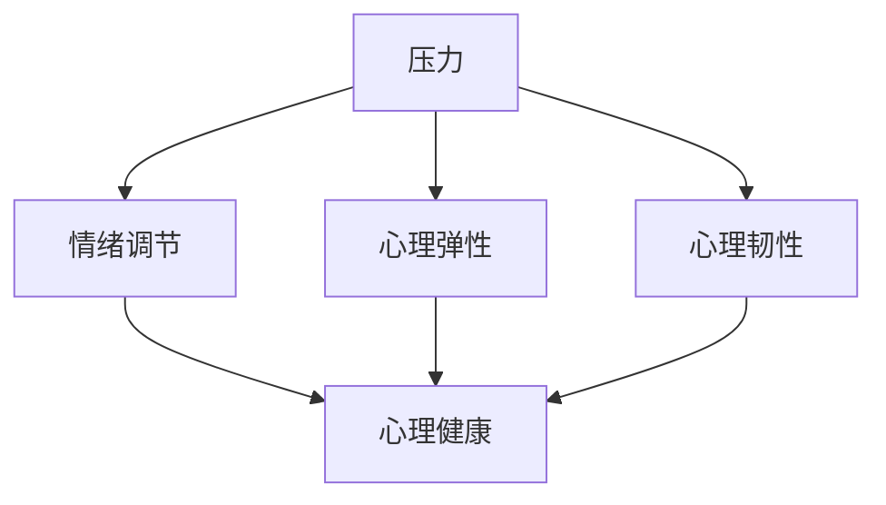
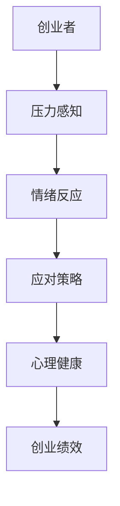
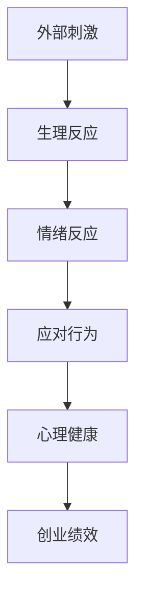
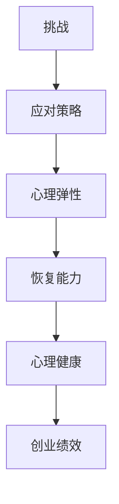

                 

# 文章标题

《创业者的心理健康与压力管理策略》

## 关键词

创业者，心理健康，压力管理，认知重构，情绪调节，心理弹性，时间管理，支持体系

## 摘要

创业过程中，心理健康与压力管理至关重要。本文将系统地探讨创业者的心理健康现状、核心概念、压力管理策略以及实战案例，旨在帮助创业者提升心理素质，有效应对压力，实现可持续发展。

## 《创业者的心理健康与压力管理策略》目录大纲

### 第一部分：心理健康概述

#### 第1章：创业者的心理健康现状

#### 第2章：心理健康与创业成功的关系

#### 第3章：心理健康的评估与维护

### 第二部分：心理健康核心概念与联系

#### 第4章：心理健康核心概念

#### 第5章：心理健康与Mermaid流程图

### 第三部分：压力管理策略

#### 第6章：压力管理的核心原则

#### 第7章：压力管理技巧

#### 第8章：时间管理与组织技巧

### 第四部分：心理健康项目实战

#### 第9章：压力管理项目案例

#### 第10章：创业者的心理健康支持体系

### 附录

#### 附录A：心理健康与压力管理工具

#### 附录B：压力管理书籍推荐

#### 附录C：心理健康在线资源

### 第11章：心理健康与压力管理总结

## 第一部分：心理健康概述

### 第1章：创业者的心理健康现状

创业之路充满挑战，创业者往往面临巨大的心理压力。根据某项研究，超过70%的创业者表示，他们在创业过程中感受到了高强度的心理压力。这种压力主要来源于以下几个方面：

1. **财务压力**：创业者需要不断地筹集资金，以维持企业的正常运营。资金不足可能导致焦虑和恐惧。
   
2. **市场竞争**：创业者需要面对激烈的竞争，不断调整策略以保持企业的竞争力。

3. **时间管理**：创业者通常需要处理大量事务，这使得他们很难平衡工作与生活。

4. **不确定性**：创业过程中，不确定因素较多，这使得创业者感到焦虑和无助。

然而，心理健康对于创业成功至关重要。研究表明，心理健康良好的创业者更有可能实现成功。因此，了解和应对心理健康问题，对创业者来说至关重要。

### 第2章：心理健康与创业成功的关系

心理健康与创业成功之间存在密切的关系。首先，心理健康良好的创业者更有可能保持积极的心态，这有助于他们克服创业过程中遇到的挑战。此外，心理健康良好的创业者更能够：

1. **提高决策能力**：心理健康的创业者能够更清晰地分析问题，做出更明智的决策。

2. **增强团队合作**：心理健康的创业者更容易与他人建立良好的关系，从而提高团队的整体效能。

3. **保持创造力**：心理健康的创业者更容易保持创新思维，这对于企业的发展至关重要。

4. **提高抗压能力**：心理健康的创业者能够更好地应对压力，从而在竞争激烈的市场中保持竞争力。

总之，心理健康是创业成功的重要基石。创业者应重视心理健康，采取有效措施来维护和提升心理健康水平。

### 第3章：心理健康的评估与维护

心理健康的评估是一个全面的过程，通常包括以下几个方面：

1. **情绪状态**：评估个体是否经常感到焦虑、沮丧或愤怒。

2. **心理弹性**：评估个体面对压力和挑战时的恢复能力。

3. **社交支持**：评估个体是否有稳定的社交网络，以提供情感支持。

4. **生活方式**：评估个体的生活习惯，如饮食、运动和睡眠。

维护心理健康的关键在于采取积极的措施。以下是一些建议：

1. **定期自我评估**：创业者应定期评估自己的心理健康状态，及时发现并解决问题。

2. **寻求专业帮助**：如果感到心理健康问题严重，应寻求专业心理医生的帮助。

3. **建立健康的生活方式**：保持均衡的饮食、规律的锻炼和充足的睡眠。

4. **社交互动**：积极参与社交活动，与朋友和家人保持密切联系。

通过以上措施，创业者可以有效地维护和提升自己的心理健康水平。

## 第二部分：心理健康核心概念与联系

### 第4章：心理健康核心概念

心理健康包括多个核心概念，以下是其中几个重要的概念：

1. **压力**：压力是心理健康的一个重要组成部分。压力通常来源于工作、家庭、社交等方面。适当的压力可以激励创业者，但过度的压力会导致焦虑、抑郁等心理问题。

2. **情绪调节**：情绪调节是指个体对情绪进行管理和调节的能力。情绪调节良好的创业者能够更好地应对挑战，保持积极的心态。

3. **心理弹性**：心理弹性是指个体面对压力和挑战时的恢复能力。心理弹性强的创业者能够在困境中迅速恢复，继续前进。

4. **心理韧性**：心理韧性是指个体在逆境中保持坚韧和适应的能力。心理韧性强的创业者能够在面对挫折和失败时，保持冷静和积极。

这些核心概念相互关联，共同影响创业者的心理健康。下面我们将用Mermaid流程图来展示这些概念之间的关系。

### 第5章：心理健康与Mermaid流程图

为了更好地理解心理健康与压力管理的关系，我们可以使用Mermaid流程图来展示各个概念之间的联系。

#### 5.1 心理健康流程图

在这个流程图中，创业者首先感知到压力，然后产生情绪反应。创业者采取的应对策略会直接影响心理健康，进而影响创业绩效。

#### 5.2 应激反应流程图

在这个流程图中，外部刺激（如工作压力、市场竞争等）首先引起生理反应，然后引发情绪反应。创业者采取的应对行为会进一步影响心理健康和创业绩效。

#### 5.3 心理弹性流程图

在这个流程图中，创业者面对挑战时采取的应对策略会影响心理弹性，进而影响恢复能力和心理健康，最终影响创业绩效。

通过这些流程图，我们可以更直观地理解心理健康与压力管理的关系，从而为创业者提供有效的指导。

## 第三部分：压力管理策略

### 第6章：压力管理的核心原则

压力管理是一个复杂的过程，但遵循一些核心原则可以帮助创业者更有效地应对压力。

#### 6.1 认知重构

认知重构是一种通过改变思维方式和观点来管理压力的方法。以下是一些认知重构的步骤：

1. **识别消极思维**：首先，创业者需要识别那些导致压力的消极思维模式，如“我做不到”、“一切都太忙了”等。

2. **挑战消极思维**：接下来，创业者需要挑战这些消极思维，问自己：“这个想法有什么证据支持吗？”“有没有其他角度看这个问题？”

3. **构建积极思维**：最后，创业者需要构建积极的思维模式，如“我可以一步一步地解决问题”、“我有足够的资源来应对这个挑战”。

#### 6.2 情绪调节

情绪调节是压力管理的另一个核心原则。以下是一些情绪调节的技巧：

1. **情绪识别**：首先，创业者需要学会识别自己的情绪，如愤怒、焦虑或沮丧。

2. **情绪表达**：接下来，创业者需要学会以健康的方式表达自己的情绪，如通过谈话、写作或绘画。

3. **情绪管理**：最后，创业者需要学会管理自己的情绪，如通过深呼吸、冥想或运动来缓解压力。

#### 6.3 自我关怀

自我关怀是压力管理的重要部分。以下是一些自我关怀的建议：

1. **休息与放松**：创业者需要确保有足够的休息时间，以避免过度疲劳。

2. **健康饮食**：创业者需要保持健康的饮食习惯，以提供身体所需的营养。

3. **锻炼身体**：创业者需要定期锻炼身体，以释放压力和增强体质。

4. **心理支持**：创业者需要寻求心理支持，如与朋友、家人或专业心理咨询师交流。

通过遵循这些核心原则，创业者可以更有效地管理压力，保持心理健康。

### 第7章：压力管理技巧

除了核心原则，创业者还可以采用一些具体的技巧来管理压力。

#### 7.1 放松技巧

放松技巧可以帮助创业者缓解紧张和压力。以下是一些常用的放松技巧：

1. **深呼吸**：深呼吸是一种简单而有效的放松技巧。通过深呼吸，创业者可以放松身体和思维。

2. **冥想**：冥想可以帮助创业者清除杂念，专注于当下。通过定期冥想，创业者可以提升心理弹性。

3. **渐进性肌肉放松**：这是一种通过逐渐放松肌肉来缓解压力的方法。创业者可以通过这种技巧来放松身体，减轻压力。

#### 7.2 冥想与呼吸练习

冥想和呼吸练习是压力管理的重要工具。以下是一些具体的方法：

1. **坐姿冥想**：创业者可以选择一个安静的环境，坐在舒适的椅子上，闭上眼睛，专注于呼吸。

2. **呼吸练习**：创业者可以通过深呼吸来放松身体。每次深呼吸时，都要尽量慢而深，感受空气进出身体的感觉。

3. **正念冥想**：正念冥想是一种专注于当下的冥想方法。创业者可以通过正念冥想来提升自我意识，减轻压力。

#### 7.3 锻炼与身体活动

锻炼和身体活动是减轻压力的有效方式。以下是一些适合创业者的锻炼建议：

1. **有氧运动**：如跑步、游泳或骑自行车等，这些运动可以帮助创业者释放压力，增强体质。

2. **力量训练**：如举重或俯卧撑等，这些训练可以帮助创业者增强肌肉力量，提高自信心。

3. **瑜伽**：瑜伽是一种结合了身体锻炼和冥想的运动方式。创业者可以通过瑜伽来放松身心，提高心理弹性。

通过采用这些压力管理技巧，创业者可以更好地应对压力，保持心理健康。

### 第8章：时间管理与组织技巧

时间管理和组织技巧对于创业者的压力管理至关重要。以下是一些有效的时间管理和组织技巧：

#### 8.1 设定目标与优先级

1. **明确目标**：创业者需要明确自己的目标和期望，这有助于他们更专注于重要任务。

2. **设定优先级**：创业者需要根据目标和重要性来设定任务的优先级。这样可以确保他们首先处理最重要和最紧急的任务。

#### 8.2 时间管理策略

1. **时间块**：创业者可以将一天的时间分为几个时间块，每个时间块专注于一项任务。这样可以提高工作效率，减少干扰。

2. **番茄工作法**：这是一种通过25分钟工作+5分钟休息的循环来管理时间的方法。这种方法可以帮助创业者保持专注，提高工作效率。

#### 8.3 组织技巧与习惯

1. **日程规划**：创业者需要制定详细的日程规划，以确保他们能够按时完成任务。

2. **待办事项清单**：创业者可以使用待办事项清单来记录任务和目标，这样可以确保他们不会遗漏任何重要的任务。

通过采用这些时间管理和组织技巧，创业者可以更有效地管理时间，减少压力，提高工作效率。

## 第四部分：心理健康项目实战

### 第9章：压力管理项目案例

#### 9.1 项目背景

为了帮助创业者更好地管理压力，某科技公司实施了一项压力管理项目。该项目旨在通过一系列心理培训和压力管理技巧，提升创业者的心理素质，从而提高企业的整体绩效。

#### 9.2 项目目标

1. **提升创业者的心理弹性**：通过心理培训和压力管理技巧，帮助创业者更好地应对压力，提高心理弹性。

2. **增强团队合作**：通过心理培训和团队合作活动，增强团队成员之间的信任和理解，提高团队整体效能。

3. **提升工作效率**：通过时间管理和组织技巧，帮助创业者更有效地管理时间和任务，提高工作效率。

#### 9.3 项目实施

1. **心理培训**：项目启动时，公司邀请专业心理咨询师为创业者进行心理培训。培训内容包括压力管理、情绪调节、自我关怀等核心概念。

2. **压力管理技巧**：心理咨询师为创业者提供了一系列压力管理技巧，如深呼吸、冥想、渐进性肌肉放松等。这些技巧被纳入创业者的日常工作，以帮助他们更好地应对压力。

3. **团队合作活动**：公司组织了一系列团队合作活动，如团队建设工作坊、团队拓展训练等。这些活动旨在增强团队成员之间的信任和理解，提高团队合作能力。

4. **时间管理培训**：公司还邀请专业时间管理顾问为创业者进行时间管理培训。培训内容包括时间块管理、番茄工作法等，以帮助创业者更有效地管理时间。

#### 9.4 项目成果分析

1. **心理弹性提升**：通过心理培训和压力管理技巧，创业者的心理弹性显著提升。许多创业者表示，他们现在能够更好地应对压力，保持积极的心态。

2. **团队合作增强**：团队合作活动显著增强了团队成员之间的信任和理解。团队成员之间的沟通变得更加顺畅，团队整体效能得到提高。

3. **工作效率提高**：通过时间管理和组织技巧，创业者的工作效率显著提高。创业者能够更有效地管理时间和任务，从而减少了工作压力。

#### 9.5 项目小结

该项目取得了显著成果，不仅提升了创业者的心理素质，还提高了团队整体效能和工作效率。项目证明，通过有效的心理培训和压力管理技巧，创业者可以更好地应对压力，实现可持续发展。

### 第10章：创业者的心理健康支持体系

#### 10.1 心理健康支持资源的获取

为了帮助创业者更好地管理心理健康，许多企业和组织提供了各种支持资源。以下是一些常见的支持资源：

1. **内部心理咨询服务**：许多企业为员工提供免费的心理咨询服务。创业者可以利用这些资源，与专业心理咨询师进行一对一交流，解决心理健康问题。

2. **外部心理健康服务**：创业者还可以寻求外部心理健康服务，如私人心理咨询、心理健康热线等。这些服务通常提供专业的心理支持和建议。

3. **在线心理健康平台**：随着技术的发展，许多在线心理健康平台提供了各种心理服务，如在线咨询、心理测评等。创业者可以利用这些平台，随时随地获得心理支持。

#### 10.2 企业心理支持体系的建立

为了更好地支持创业者的心理健康，企业可以建立内部心理支持体系。以下是一些关键步骤：

1. **制定心理健康政策**：企业应制定明确的心理健康政策，明确员工的权益和责任，以及企业对心理健康问题的态度。

2. **提供心理健康培训**：企业可以为员工提供心理健康培训，帮助他们了解心理健康问题，学会应对压力和管理情绪。

3. **建立心理健康小组**：企业可以建立一个心理健康小组，由专业心理咨询师和志愿者组成。这个小组可以提供心理支持，组织心理健康活动，促进员工之间的交流和支持。

#### 10.3 社会心理支持的利用

创业者还可以利用社会心理支持资源，如社区心理健康中心、志愿者组织等。以下是一些建议：

1. **参与社区活动**：创业者可以参与各种社区活动，如心理健康讲座、心理辅导工作坊等。这些活动可以帮助他们更好地了解心理健康问题，学习应对压力的技巧。

2. **寻求志愿者支持**：创业者可以寻求志愿者支持，如心理健康志愿者、社区志愿者等。这些志愿者可以提供情感支持，帮助他们度过困难时期。

通过利用这些心理健康支持资源，创业者可以更好地管理心理健康，保持积极的心态，实现创业目标。

## 附录

### 附录A：心理健康与压力管理工具

以下是一些常用的心理健康与压力管理工具：

1. **心理健康应用程序**：
   - **Headspace**：提供冥想和放松课程。
   - **Calm**：提供冥想、放松和睡眠指导。
   - **Moodfit**：提供心理健康评估和个性化建议。

2. **在线心理咨询服务**：
   - **Talkspace**：提供在线心理咨询。
   - **BetterHelp**：提供在线心理支持和咨询。

3. **压力管理书籍**：
   - 《抗压心理学》（Stress Management for Dummies）
   - 《如何管理压力》（How to Handle Stress）
   - 《压力管理指南》（Stress Management Guide）

4. **心理健康在线资源**：
   - **国家心理健康热线**：提供免费的心理健康支持。
   - **美国心理健康基金会**：提供心理健康信息和资源。

通过使用这些工具和资源，创业者可以更好地管理心理健康，应对压力。

### 附录B：压力管理书籍推荐

以下是一些推荐的关于压力管理的书籍：

1. **《减压心理学：如何战胜压力，提高生活质量》**
   - 内容涵盖压力的来源、压力对身心健康的影响，以及各种减压方法。

2. **《时间管理的艺术：如何高效利用时间，减少压力》**
   - 提供实用的时间管理技巧，帮助创业者更好地平衡工作和生活。

3. **《冥想与放松：轻松应对压力和焦虑》**
   - 介绍冥想和放松技巧，帮助创业者缓解压力，提高心理韧性。

通过阅读这些书籍，创业者可以学习到更多关于压力管理的知识和技巧。

### 附录C：心理健康在线资源

以下是一些有用的心理健康在线资源：

1. **国际心理健康基金会**（https://www.mentalhealth.org/）
   - 提供心理健康信息、资源和自助工具。

2. **国家心理健康热线**（https://www.nami.org/）
   - 提供心理健康支持和咨询服务。

3. **心理健康门户**（https://www.mentalhealth.com/）
   - 提供心理健康新闻、信息和互动社区。

通过访问这些在线资源，创业者可以随时了解心理健康信息，获取支持和帮助。

## 第11章：心理健康与压力管理总结

### 11.1 关键概念回顾

在本篇文章中，我们深入探讨了心理健康与压力管理的核心概念和策略。以下是一些关键概念：

1. **压力**：压力是心理健康的重要组成部分，它来源于财务、市场竞争、时间管理和不确定性等方面。
2. **情绪调节**：情绪调节是管理情绪、保持心理健康的关键技能。
3. **心理弹性**：心理弹性是指个体面对压力和挑战时的恢复能力。
4. **心理韧性**：心理韧性是逆境中保持坚韧和适应的能力。
5. **认知重构**：通过改变思维模式来管理压力。
6. **时间管理与组织技巧**：设定目标与优先级、时间块管理、番茄工作法等技巧。

### 11.2 压力管理策略总结

为了有效管理压力，我们提出了一些策略：

1. **认知重构**：通过识别、挑战和构建积极思维来管理压力。
2. **情绪调节**：学习识别、表达和管理情绪。
3. **自我关怀**：确保休息、健康饮食、锻炼和心理支持。
4. **放松技巧**：使用深呼吸、冥想和渐进性肌肉放松来放松身体。
5. **时间管理**：设定目标与优先级、使用时间块和番茄工作法。
6. **组织技巧**：制定日程规划、使用待办事项清单。

### 11.3 心理健康的重要性

心理健康对于创业者的成功至关重要。心理健康良好的创业者能够：

1. **提高决策能力**：清晰的思维有助于做出更好的决策。
2. **增强团队合作**：心理健康良好的创业者更容易与他人建立良好的关系。
3. **保持创造力**：心理健康有助于保持创新思维。
4. **提高抗压能力**：心理健康良好的创业者能够更好地应对压力和挑战。

总之，心理健康是创业者成功的关键因素之一。通过了解和采取有效的压力管理策略，创业者可以更好地应对挑战，实现可持续发展。作者：AI天才研究院/AI Genius Institute & 禅与计算机程序设计艺术 /Zen And The Art of Computer Programming。

