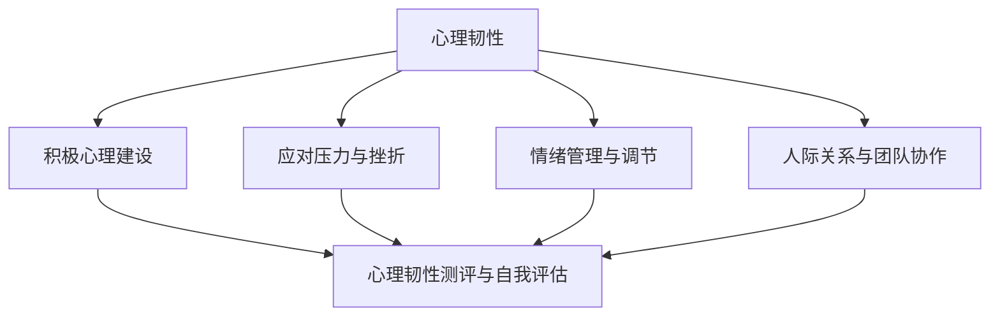

                 

## 文章标题

《创业者的心理韧性培养》

## 关键词

创业者、心理韧性、抗压能力、团队协作、危机管理、创新思维

## 摘要

本文旨在探讨心理韧性在创业者成功中的关键作用，并详细介绍如何培养和提升心理韧性。通过深入分析心理韧性的定义、理论框架以及其在创业过程中的实际应用，本文为创业者提供了实用的策略和方法，以应对创业中的各种挑战和压力，从而实现持续的成功与成长。

### 《创业者的心理韧性培养》目录大纲

**第一部分：心理韧性基础理论**

**第1章：心理韧性的概念与重要性**

- **1.1 心理韧性的定义与特征**
- **1.2 心理韧性的重要性**
- **1.3 心理韧性对创业成功的影响**

**第2章：心理韧性的理论框架**

- **2.1 心理韧性理论综述**
- **2.2 心理韧性模型的构建**
- **2.3 心理韧性的构成要素**

**第3章：心理韧性测评与自我评估**

- **3.1 心理韧性测评工具**
- **3.2 自我评估方法**
- **3.3 心理韧性提升策略**

**第二部分：心理韧性培养方法**

**第4章：积极心理建设**

- **4.1 积极心理的概念与作用**
- **4.2 积极心理的实践方法**
- **4.3 培养积极心理的策略**

**第5章：应对压力与挫折**

- **5.1 压力与挫折的概念**
- **5.2 压力与挫折的应对策略**
- **5.3 建立抗挫折的心理防线**

**第6章：情绪管理与调节**

- **6.1 情绪管理的原理与方法**
- **6.2 情绪调节技巧**
- **6.3 情绪调节策略**

**第7章：人际关系与团队协作**

- **7.1 人际关系的心理基础**
- **7.2 人际沟通技巧**
- **7.3 团队协作与心理韧性**

**第三部分：心理韧性实战应用**

**第8章：创业过程中的心理韧性培养**

- **8.1 创业心理特点分析**
- **8.2 创业过程中的心理挑战**
- **8.3 创业心理韧性培养策略**

**第9章：企业团队心理韧性建设**

- **9.1 团队心理韧性建设的重要性**
- **9.2 团队心理韧性建设的策略与方法**
- **9.3 企业文化对心理韧性的影响**

**第10章：心理韧性在危机管理中的应用**

- **10.1 危机管理中的心理韧性**
- **10.2 心理韧性在危机管理中的应用策略**
- **10.3 案例分析：企业危机管理中的心理韧性实践**

**附录**

- **附录A：心理韧性相关资源与工具**
- **附录B：心理韧性培养实践案例**

### Mermaid 流程图：心理韧性培养模型

### 第1章：心理韧性的概念与重要性

#### 1.1 心理韧性的定义与特征

心理韧性（Resilience）是个体在面对逆境、压力和挑战时，能够迅速适应、恢复并展现积极行为的能力。其定义可以从以下几个方面来理解：

- **适应力（Adaptability）**：个体能够灵活地调整自己的行为和思维方式，以适应新环境和挑战。
- **坚韧性（Tenacity）**：个体在面对困难和挫折时，能够坚持不懈地努力，保持积极的态度。
- **灵活性（Flexibility）**：个体能够在变化多端的环境中迅速调整策略和方法，以应对新的挑战。

心理韧性的特征主要包括以下几点：

- **情绪调节能力**：个体能够有效地管理自己的情绪，不被负面情绪所左右。
- **自我效能感**：个体对自己能够应对挑战和逆境的能力充满信心。
- **乐观主义**：个体对未来持有积极的态度，能够从挫折中看到机遇。
- **适应性**：个体能够在变化中找到自己的定位，迅速适应新环境。

在创业领域，心理韧性显得尤为重要。创业者往往需要面对复杂的市场环境、激烈的竞争压力以及不断变化的技术趋势。心理韧性良好的创业者能够在这些挑战面前保持冷静，迅速调整策略，找到解决问题的方法，从而在竞争中脱颖而出。

#### 1.2 心理韧性的重要性

心理韧性对于创业者的成功至关重要，主要表现在以下几个方面：

- **提高抗压能力**：创业者面临着巨大的压力，包括资金压力、市场竞争压力等。心理韧性强的创业者能够更好地应对这些压力，保持理智和冷静。
- **促进创新思维**：在逆境中，心理韧性强的创业者能够保持开放的心态，发现新的机遇，推动创新。
- **增强团队凝聚力**：创业者需要与团队成员密切合作，心理韧性能够帮助创业者更好地理解和激励团队成员，提升团队的整体效能。
- **提升领导力**：心理韧性强的创业者能够在团队中展现强大的领导力，引领团队克服困难，实现目标。

#### 1.3 心理韧性对创业成功的影响

心理韧性对创业成功的影响可以从以下几个方面来分析：

- **决策能力**：心理韧性良好的创业者能够在面对复杂决策时，保持冷静，全面评估风险和机会，做出明智的决策。
- **适应能力**：在快速变化的市场环境中，心理韧性强的创业者能够迅速适应新情况，调整经营策略，抓住市场机遇。
- **团队管理**：心理韧性良好的创业者能够更好地激励和引导团队成员，提高团队绩效，实现共同的目标。
- **创新能力**：心理韧性强的创业者能够在困境中保持创新思维，不断寻找新的解决方案，推动企业的发展。

总的来说，心理韧性是创业者成功的关键因素之一，它不仅能够帮助创业者应对创业过程中的各种挑战，还能够推动企业的持续成长和成功。因此，培养和提升心理韧性对于创业者来说至关重要。

### 第2章：心理韧性的理论框架

#### 2.1 心理韧性理论综述

心理韧性理论的研究已有数十年历史，不同学者从不同的角度对其进行了深入的探讨和阐释。以下是几种主要的心理韧性理论：

1. **资源模型（Resource Model）**：
   - 代表人物：Selye、Lazarus、La Guardia等
   - 理论要点：心理韧性是个体拥有的资源（如社会支持、个人能力等）的集合，这些资源有助于个体应对压力和挑战。
   - 关键要素：个体的资源储备、资源的动员和利用、资源的持续更新。

2. **过程模型（Process Model）**：
   - 代表人物：Rutter、Cicchetti、Putnam等
   - 理论要点：心理韧性是个体在面对逆境时的一系列心理和行为过程，包括感知、评估、应对和恢复。
   - 关键要素：个体的认知过程、情绪调节、社会支持、应对策略、恢复能力。

3. **平衡模型（Balance Model）**：
   - 代表人物：Wang、Wang、Xie等
   - 理论要点：心理韧性是内在心理资源与外在环境压力之间的平衡状态，个体通过调整自身的心理资源来应对压力。
   - 关键要素：心理资源的储备、压力水平的感知、心理资源的动员和利用。

4. **建构主义模型（Constructionism Model）**：
   - 代表人物：Bandura、Vygotsky等
   - 理论要点：心理韧性是个体通过社会互动和经验建构的，个体的心理韧性水平受到社会环境和人际互动的影响。
   - 关键要素：社会支持、社会互动、个体经验、自我效能感。

#### 2.2 心理韧性模型的构建

心理韧性模型构建的关键在于识别和整合影响心理韧性的多个因素。以下是一个简化的心理韧性模型构建过程：

1. **识别关键因素**：
   - **个体因素**：如性格特质、认知能力、情绪调节能力、自我效能感等。
   - **环境因素**：如社会支持、家庭环境、工作环境、社会文化等。
   - **情境因素**：如压力水平、挑战性质、任务难度等。

2. **分析因素间关系**：
   - **直接关系**：某些因素直接对心理韧性产生影响，如自我效能感与心理韧性呈正相关。
   - **间接关系**：某些因素通过影响其他因素间接对心理韧性产生影响，如社会支持通过增强个体的情绪调节能力来提高心理韧性。

3. **构建理论模型**：
   - **结构模型**：描述各个因素之间的关系和作用机制。
   - **动态模型**：考虑因素的变化和相互作用，如心理韧性在不同情境下的动态变化。

4. **验证与修正**：
   - **实证研究**：通过问卷调查、实验等方法验证模型的有效性和可靠性。
   - **理论修正**：根据实证研究结果，对模型进行修正和优化，以提高模型的解释力和应用性。

#### 2.3 心理韧性的构成要素

心理韧性由多个构成要素组成，以下是其中几个重要的要素：

1. **情绪调节能力**：
   - **定义**：个体在情绪体验过程中，通过认知、行为和生理等多种方式对情绪进行调节的能力。
   - **作用**：有助于个体保持情绪平衡，减少负面情绪对心理韧性的影响。

2. **自我效能感**：
   - **定义**：个体对自己在特定情境下能够成功完成任务的信心。
   - **作用**：高自我效能感有助于个体在面对挑战时保持积极态度，增加心理韧性。

3. **社会支持**：
   - **定义**：个体从家庭、朋友、同事等社会关系中获得的支持和帮助。
   - **作用**：社会支持能够增强个体的心理韧性，提高应对压力的能力。

4. **应对策略**：
   - **定义**：个体在面临压力和挑战时，所采用的应对方法和策略。
   - **作用**：有效的应对策略有助于个体更好地应对压力，提高心理韧性。

5. **认知重构**：
   - **定义**：个体通过改变对事件和情境的认知方式，来调整情绪和行为。
   - **作用**：有助于个体从消极情绪中解脱出来，增强心理韧性。

这些构成要素相互作用，共同构成了个体的心理韧性。理解这些要素之间的关系和作用机制，有助于我们更全面地培养和提升个体的心理韧性。

### 第3章：心理韧性测评与自我评估

#### 3.1 心理韧性测评工具

心理韧性测评工具是评估个体心理韧性水平的重要手段，以下是一些常用的心理韧性测评工具：

1. ** resilience scale (RS)**
   - **开发背景**：由Chang和Cheng于1997年开发，主要用于评估大学生的心理韧性水平。
   - **内容构成**：包括25个项目，分为情绪调节、适应性和灵活性三个维度。
   - **测评方法**：采用自陈量表形式，受访者根据自己的实际情况进行评分。
   - **优缺点**：优势在于具有较高的信效度，但适用范围较为有限。

2. ** psychological resilience scale (PRS)**
   - **开发背景**：由Zautra、Nezu和Roth于2001年开发，适用于广泛人群。
   - **内容构成**：包括27个项目，分为情感韧性、行为韧性和认知韧性三个维度。
   - **测评方法**：采用Likert五点量表，评估个体在面对压力和挑战时的韧性表现。
   - **优缺点**：优势在于涵盖了心理韧性的多个方面，但测评时间较长。

3. ** resiliency questionnaire (RQ-11)**
   - **开发背景**：由Rutter和Grolnick于2000年开发，用于评估儿童和青少年的心理韧性。
   - **内容构成**：包括11个项目，分为情感韧性、行为韧性和认知韧性三个维度。
   - **测评方法**：采用自陈量表形式，评估个体在面对逆境时的适应能力。
   - **优缺点**：优势在于简便易行，但评估维度较为有限。

#### 3.2 自我评估方法

自我评估是了解自身心理韧性水平的一种有效方法，以下是一些自我评估的方法：

1. **日记法**：
   - **方法**：记录自己每天所经历的压力事件和心理反应，分析自己在面对压力时的韧性和应对策略。
   - **优点**：能够深入了解自己的心理状态，有助于发现和改进不足。
   - **缺点**：主观性强，可能存在偏差。

2. **反思法**：
   - **方法**：定期回顾过去的经历，思考自己在面对困难和挑战时的反应和应对方式。
   - **优点**：有助于发现自身的心理韧性优势，并从中学习。
   - **缺点**：需要一定的时间和精力，且可能引发负面情绪。

3. **行为观察法**：
   - **方法**：观察自己在面对压力和挑战时的行为表现，分析自己的韧性和应对策略。
   - **优点**：客观性强，能够客观评估自己的心理韧性水平。
   - **缺点**：可能忽略内心的感受和情绪反应。

4. **他人反馈法**：
   - **方法**：向家人、朋友或同事寻求反馈，了解他们在自己面对压力和挑战时的观察和评价。
   - **优点**：能够从他人的视角了解自己的心理韧性，获得更全面的反馈。
   - **缺点**：他人反馈可能存在主观性和偏见。

通过自我评估，个体可以更好地了解自己的心理韧性水平，发现自身的优势和不足，从而有针对性地进行提升和改进。

#### 3.3 心理韧性提升策略

提升心理韧性是一项长期而系统的任务，以下是一些有效的方法和策略：

1. **积极心理建设**：
   - **方法**：通过培养乐观态度、积极情绪和积极思维方式来增强心理韧性。
   - **实践**：每天记录三件好事，学会感恩和自我肯定。

2. **应对压力与挫折**：
   - **方法**：学会合理应对压力和挫折，采取积极的应对策略。
   - **实践**：设定合理的目标，学会放松和自我调节。

3. **情绪管理与调节**：
   - **方法**：通过情绪管理技巧和情绪调节策略来保持情绪平衡。
   - **实践**：学会深呼吸、冥想、正念等情绪调节方法。

4. **人际关系与团队协作**：
   - **方法**：建立良好的人际关系，提高团队合作能力。
   - **实践**：学会有效沟通、倾听他人意见、建立互信。

5. **持续学习和成长**：
   - **方法**：通过学习和成长来提高自身的心理韧性。
   - **实践**：参加培训课程、阅读相关书籍、与他人交流经验。

通过这些策略和方法的实践，个体可以逐步提升自己的心理韧性，更好地应对生活中的各种挑战和压力。

### 第4章：积极心理建设

#### 4.1 积极心理的概念与作用

积极心理（Positive Psychology）是研究人类积极情感、行为和适应能力的科学。其核心目标是探索人类如何实现幸福、满足感和心理健康。积极心理的核心理念包括以下几个方面：

- **幸福**：关注个体的整体幸福感，包括情感幸福感、生活满意度和个人成长。
- **优势**：识别和培养个体的优势，如创造力、乐观、同情心等，以促进个体的全面发展。
- **美德**：强调个体应培养如勇气、仁慈、诚实、正义等美德，以构建积极的社会价值观。
- **感恩**：培养感恩的态度，关注生活中积极的方面，提高生活质量。

积极心理在个体生活中的作用主要体现在以下几个方面：

- **提升幸福感**：通过培养积极情感和行为，个体能够提高生活满意度，增强幸福感。
- **增强心理韧性**：积极心理有助于个体在面对逆境和挑战时保持乐观和适应能力，提高心理韧性。
- **促进人际关系**：积极心理能够增强个体的社交能力和情感智力，建立更和谐的人际关系。
- **提升工作绩效**：积极心理有助于提高个体的工作效率和创造力，促进职业发展。

#### 4.2 积极心理的实践方法

积极心理的实践方法包括多种策略和技巧，以下是一些常用的方法：

1. **积极日记**：
   - **方法**：每天记录一些积极的事情，如感恩的事物、愉快的经历、取得的进步等。
   - **作用**：帮助个体关注生活中积极的方面，增强幸福感。

2. **正向肯定**：
   - **方法**：每天对自己进行正向肯定，如“我值得幸福”、“我有能力解决问题”等。
   - **作用**：提升自我效能感，增强自信。

3. **感恩练习**：
   - **方法**：定期表达对他人和生活中美好事物的感激之情。
   - **作用**：培养感恩的态度，提高情感幸福感。

4. **积极思维训练**：
   - **方法**：通过思考问题的多个积极方面，避免单一消极视角。
   - **作用**：提高思维灵活性，增强心理韧性。

5. **冥想和放松**：
   - **方法**：定期进行冥想、深呼吸等放松练习，减轻压力和焦虑。
   - **作用**：提升情绪调节能力，促进身心健康。

通过实践这些方法，个体可以逐渐培养积极心理，提高生活质量，更好地应对生活中的挑战。

#### 4.3 培养积极心理的策略

为了培养积极心理，个体可以采取以下策略：

1. **设定积极目标**：
   - **方法**：设定清晰、具体、可实现的积极目标，如提高工作效率、学习新技能等。
   - **作用**：增强个体的自我效能感，激发积极行为。

2. **建立积极习惯**：
   - **方法**：通过持续练习，将积极行为转化为习惯，如每天锻炼、保持良好作息等。
   - **作用**：增强积极心理，提高生活质量。

3. **培养感恩习惯**：
   - **方法**：每天记录感恩的事项，培养对生活的感激之情。
   - **作用**：提高幸福感，增强心理韧性。

4. **寻求社会支持**：
   - **方法**：与家人、朋友保持良好的沟通，寻求他们的支持和鼓励。
   - **作用**：增强社会支持，提高心理韧性。

5. **定期自我反思**：
   - **方法**：定期反思自己的行为和心理，总结经验教训，调整心态。
   - **作用**：提升自我认知，促进个人成长。

通过这些策略，个体可以持续培养积极心理，提高应对生活中挑战的能力，实现长期的幸福和满足感。

### 第5章：应对压力与挫折

#### 5.1 压力与挫折的概念

压力（Stress）是指个体在面对外部环境要求时，感受到的身心紧张和不适。这种紧张和不适可能会导致心理和生理上的负面影响，如焦虑、抑郁、失眠等。压力的来源多种多样，包括工作压力、人际关系、经济困难、健康问题等。

挫折（Failure）是指个体在实现目标过程中遭遇的失败或阻碍。挫折可能来源于个人能力不足、外部环境变化、他人竞争等。挫折往往伴随着负面的情绪体验，如失望、沮丧、自责等。

压力与挫折之间存在紧密的联系。一方面，挫折可能导致压力的产生，如未能达到预期目标可能引发焦虑和不安；另一方面，长期的、高强度的压力也可能导致挫折感的增加，如工作压力过大可能导致工作效率下降，从而产生挫败感。

#### 5.2 压力与挫折的应对策略

应对压力和挫折是心理韧性培养的重要方面。以下是一些有效的应对策略：

1. **认知重构**：
   - **方法**：通过改变对压力和挫折的认知方式，调整情绪和行为反应。
   - **实践**：例如，将挫折视为成长的机会，而不是失败的结果。

2. **时间管理**：
   - **方法**：合理安排时间，设定优先级，避免过度工作和疲劳。
   - **实践**：制定日程表，确保有足够的休息和放松时间。

3. **积极心态**：
   - **方法**：培养积极的心态，关注问题的解决方案，而不是问题本身。
   - **实践**：例如，使用积极语言描述问题，如“我能克服这个困难”。

4. **寻求支持**：
   - **方法**：寻求家人、朋友、同事或专业人士的支持和帮助。
   - **实践**：分享感受，寻求建议和安慰。

5. **放松技巧**：
   - **方法**：学习并实践放松技巧，如深呼吸、冥想、瑜伽等。
   - **实践**：每天安排一段时间进行放松练习，减轻压力和焦虑。

通过这些策略，个体可以更有效地应对压力和挫折，提高心理韧性，保持积极的生活态度。

#### 5.3 建立抗挫折的心理防线

建立抗挫折的心理防线是提升心理韧性的关键。以下是一些具体的方法：

1. **培养自信**：
   - **方法**：通过不断学习和实践，增强自己的能力，提高自信心。
   - **实践**：设定小目标，逐步实现，积累成功的经验。

2. **积极应对**：
   - **方法**：面对挫折时，采取积极的应对态度，而不是逃避或自责。
   - **实践**：例如，遇到困难时，思考解决方案，而不是抱怨问题。

3. **情绪调节**：
   - **方法**：学会有效管理自己的情绪，避免负面情绪的过度积累。
   - **实践**：使用放松技巧和情绪调节策略，如深呼吸、正念冥想。

4. **寻求支持**：
   - **方法**：在遇到挫折时，及时寻求家人、朋友或专业人士的支持。
   - **实践**：建立稳固的社会支持网络，提高应对挫折的能力。

5. **培养乐观**：
   - **方法**：保持乐观的态度，相信困难是暂时的，自己有能力克服。
   - **实践**：关注生活中的积极方面，学会感恩和自我肯定。

通过这些方法，个体可以建立强大的心理防线，更好地应对挫折，提高心理韧性，实现长期的心理健康和幸福。

### 第6章：情绪管理与调节

#### 6.1 情绪管理的原理与方法

情绪管理是指个体通过认知和行为调节，有效识别、表达和调节情绪的过程。情绪管理不仅有助于提升个体的心理健康，还能提高工作、学习和社会生活的质量。以下是情绪管理的原理和方法：

1. **情绪识别**：
   - **原理**：个体需要能够识别和理解自己和他人的情绪状态。
   - **方法**：通过自我观察、反思和与他人交流，识别情绪的起因和特点。

2. **情绪表达**：
   - **原理**：个体需要学会以适当的方式表达情绪，避免压抑或过度表达。
   - **方法**：通过学习沟通技巧和表达情绪的技巧，如正面沟通、非暴力沟通等。

3. **情绪调节**：
   - **原理**：个体需要学会调节情绪，使其保持在适度的范围内。
   - **方法**：通过认知重构、放松技巧、积极心理训练等，调节情绪。

4. **情绪认知**：
   - **原理**：个体需要理解情绪的起因和意义，以便更好地管理和调节情绪。
   - **方法**：通过心理学知识的学习和自我反思，提高情绪认知水平。

5. **情绪应对策略**：
   - **原理**：个体需要根据不同情境采取不同的应对策略。
   - **方法**：如面对压力时采取放松训练，面对挫折时采取积极应对策略。

#### 6.2 情绪调节技巧

情绪调节技巧是指个体在特定情境下，通过一系列行为和认知活动来调节情绪状态的方法。以下是一些常见的情绪调节技巧：

1. **深呼吸**：
   - **方法**：通过深呼吸，放松身体，降低情绪激动水平。
   - **实践**：每次呼吸时，感受气息的进出，专注于呼吸过程。

2. **正念冥想**：
   - **方法**：通过正念冥想，提高注意力，减少情绪波动。
   - **实践**：找一个安静的环境，专注于呼吸和当下的感受。

3. **认知重构**：
   - **方法**：通过改变对事件和情境的认知，调整情绪反应。
   - **实践**：例如，将“我失败了”重构为“这是一个学习和成长的机会”。

4. **积极心理训练**：
   - **方法**：通过积极心理训练，培养积极情绪和乐观态度。
   - **实践**：每天记录三件好事，进行正向肯定。

5. **运动**：
   - **方法**：通过运动，释放身体中的紧张和压力，调节情绪。
   - **实践**：进行有氧运动，如跑步、游泳等。

通过学习和实践这些情绪调节技巧，个体可以更好地管理情绪，提高心理韧性，应对生活中的挑战。

#### 6.3 情绪调节策略

情绪调节策略是指个体在面对不同情境时，采取的一系列系统化的方法和技巧。以下是一些有效的情绪调节策略：

1. **情境选择**：
   - **方法**：选择对情绪有积极影响的情境，避免消极情境。
   - **实践**：例如，在情绪低落时，选择与朋友聚会，而不是独自在家。

2. **时间管理**：
   - **方法**：合理安排时间，避免过度工作和疲劳，减少情绪压力。
   - **实践**：制定日程表，确保有足够的休息和放松时间。

3. **情绪释放**：
   - **方法**：通过倾诉、写日记、运动等方式，释放情绪压力。
   - **实践**：定期与朋友或家人交流，分享自己的感受。

4. **认知重构**：
   - **方法**：通过改变对事件和情境的认知，调整情绪反应。
   - **实践**：例如，遇到挫折时，将其视为成长的机会。

5. **情绪疏导**：
   - **方法**：通过倾听、理解和支持他人，缓解自己的情绪压力。
   - **实践**：参与志愿服务或社区活动，帮助他人同时帮助自己。

通过这些情绪调节策略，个体可以更有效地管理情绪，提高心理韧性，实现更好的生活质量和心理健康。

### 第7章：人际关系与团队协作

#### 7.1 人际关系的心理基础

人际关系（Interpersonal Relationship）是指个体在交往过程中形成的心理联系和行为互动。人际关系对个体的心理健康、生活质量和社会适应能力具有重要影响。以下是人际关系的心理基础：

1. **社会交换理论**：
   - **概念**：社会交换理论认为人际关系是基于个体之间的资源交换，包括情感、物质和社交资源。
   - **影响**：个体通过交换资源来维持和加强人际关系，从而获得支持和满足。

2. **社会认同理论**：
   - **概念**：社会认同理论认为个体通过认同某个群体，获得归属感和自尊。
   - **影响**：个体在群体中获得认同和尊重，从而增强心理韧性和幸福感。

3. **情感依恋理论**：
   - **概念**：情感依恋理论认为个体在交往过程中形成深层次的情感联系，如信任、亲密和安全感。
   - **影响**：情感依恋有助于提高个体的心理韧性和应对压力的能力。

4. **沟通理论**：
   - **概念**：沟通理论认为有效的沟通是建立和维护人际关系的关键。
   - **影响**：有效的沟通能够增进理解、减少误解、建立信任，从而提高人际关系的质量。

#### 7.2 人际沟通技巧

人际沟通技巧是指个体在人际交往过程中，有效表达和接收信息、理解和互动的能力。以下是一些有效的人际沟通技巧：

1. **积极倾听**：
   - **方法**：在对方讲话时，全神贯注地倾听，避免打断或插话。
   - **作用**：增强对方表达意愿，建立信任和共鸣。

2. **非暴力沟通**：
   - **方法**：通过表达自己的感受和需求，而不是指责或批评对方。
   - **作用**：减少冲突，增进理解和和谐。

3. **情绪管理**：
   - **方法**：在沟通过程中，保持情绪稳定，避免情绪化的行为。
   - **作用**：提高沟通的有效性，减少误解和冲突。

4. **同理心**：
   - **方法**：设身处地地理解对方的感受和需求。
   - **作用**：增进理解，建立信任和亲密感。

5. **冲突解决**：
   - **方法**：通过对话和协商，寻找双方都能接受的解决方案。
   - **作用**：解决冲突，维护关系。

#### 7.3 团队协作与心理韧性

团队协作（Team Collaboration）是指团队成员共同合作，为实现共同目标而努力的过程。团队协作对提高团队绩效、激发创新思维和培养心理韧性具有重要意义。

1. **心理韧性的团队优势**：
   - **协同应对**：团队成员共同面对挑战，提高心理韧性。
   - **资源共享**：通过团队合作，共享资源和信息，提高问题解决能力。
   - **互助支持**：团队成员相互支持，增强心理韧性。

2. **团队协作的心理学基础**：
   - **社会助长效应**：团队成员在共同工作中，彼此鼓励和激励，提高工作动力。
   - **群体动力**：团队成员之间的相互作用和影响，形成团队精神和凝聚力。
   - **社会认同**：团队成员对团队的认同感，提高团队合作意识和心理韧性。

3. **团队协作的实践策略**：
   - **明确目标**：确保团队成员对共同目标有清晰的认识，提高协作效率。
   - **有效沟通**：建立开放的沟通渠道，促进信息共享和互动。
   - **分工合作**：合理分配任务，发挥团队成员的特长，提高团队整体效能。
   - **建立信任**：通过互信和合作，增强团队凝聚力和心理韧性。

通过培养良好的团队协作和心理韧性，团队可以更有效地应对挑战，实现持续的成功和发展。

### 第8章：创业过程中的心理韧性培养

#### 8.1 创业心理特点分析

创业过程中，创业者面临的心理特点较为复杂，主要包括以下几个方面：

1. **高压力**：
   - **原因**：创业者需要应对市场竞争、资金压力、团队管理等多种挑战。
   - **影响**：高压力可能导致情绪波动、焦虑和睡眠问题，影响创业决策和执行。

2. **不确定性**：
   - **原因**：创业过程中，市场环境、技术变化等因素具有高度不确定性。
   - **影响**：不确定性导致创业者对未来感到担忧，影响决策和行动力。

3. **快速变化**：
   - **原因**：技术、市场需求等变化迅速，创业者需要不断调整策略和方向。
   - **影响**：快速变化要求创业者具备良好的适应能力和决策能力。

4. **责任感**：
   - **原因**：创业者需要对团队、客户、投资者等多方面负责。
   - **影响**：责任感可能导致过度自我要求，增加心理负担。

5. **孤独感**：
   - **原因**：创业过程中，创业者可能面临情感支持和资源获取的困难。
   - **影响**：孤独感可能导致心理疲劳，影响创业者的心理健康。

#### 8.2 创业过程中的心理挑战

创业过程中，创业者会面临一系列心理挑战，主要包括：

1. **决策困难**：
   - **原因**：创业者需要做出多种复杂决策，包括产品定位、市场策略、资金管理等。
   - **应对**：通过收集信息、咨询专家、模拟决策等方法，提高决策质量。

2. **资源管理**：
   - **原因**：创业者需要合理分配和利用有限的资源，包括资金、人力和时间。
   - **应对**：制定明确的资源管理计划，优化资源配置，确保资源的高效利用。

3. **团队管理**：
   - **原因**：创业者需要建立和领导一个高效、有凝聚力的团队。
   - **应对**：通过有效的沟通、激励和培训，提高团队绩效和凝聚力。

4. **情感波动**：
   - **原因**：创业过程中的成功和失败都可能带来强烈的情绪波动。
   - **应对**：通过情绪管理和自我调节技巧，保持情绪稳定，避免过度情绪化。

5. **持续学习**：
   - **原因**：创业环境变化迅速，创业者需要不断学习和适应。
   - **应对**：积极参加培训课程、阅读相关书籍、与同行交流，保持学习状态。

#### 8.3 创业心理韧性培养策略

为了在创业过程中保持心理韧性，创业者可以采取以下策略：

1. **积极心理建设**：
   - **方法**：培养乐观态度、积极情绪和积极思维方式。
   - **实践**：通过每天记录三件好事、积极肯定自己等方式，增强积极心理。

2. **情绪调节**：
   - **方法**：学习并实践情绪调节技巧，如深呼吸、冥想、运动等。
   - **实践**：定期进行情绪调节练习，减少情绪波动，保持情绪稳定。

3. **社会支持**：
   - **方法**：建立稳固的社会支持网络，包括家人、朋友和行业导师。
   - **实践**：定期与支持者交流，分享创业心得，获得鼓励和建议。

4. **时间管理**：
   - **方法**：合理安排时间，确保有足够的休息和放松时间。
   - **实践**：制定日程表，优先处理重要事务，避免过度工作。

5. **认知重构**：
   - **方法**：通过改变对事件和情境的认知，调整情绪和行为反应。
   - **实践**：将挫折视为成长的机会，从失败中学习经验。

6. **持续学习**：
   - **方法**：保持学习和适应能力，不断提升自己的知识水平和技能。
   - **实践**：定期参加培训课程、阅读相关书籍、与同行交流。

通过以上策略，创业者可以更好地应对创业过程中的心理挑战，提高心理韧性，实现创业目标。

### 第9章：企业团队心理韧性建设

#### 9.1 团队心理韧性建设的重要性

企业团队心理韧性建设在提升企业整体竞争力和员工幸福感方面具有重要作用。以下是团队心理韧性建设的重要性和优势：

1. **提高团队绩效**：心理韧性良好的团队能够更好地应对压力和挑战，提高工作效率和团队凝聚力，从而提升整体绩效。

2. **增强员工满意度**：心理韧性建设有助于提高员工的幸福感和工作满意度，减少员工流失，提高员工忠诚度。

3. **促进创新思维**：心理韧性良好的团队在面临困境时能够保持创新思维，寻找新的解决方案，推动企业创新。

4. **提升应对危机能力**：在面临企业危机时，心理韧性强的团队能够保持冷静和理智，迅速应对，减少危机带来的负面影响。

5. **建立积极企业文化**：团队心理韧性建设有助于建立积极的企业文化，增强企业的社会责任感和企业公民意识。

#### 9.2 团队心理韧性建设的策略与方法

为了有效建设企业团队心理韧性，企业可以采取以下策略和方法：

1. **制定心理韧性培训计划**：
   - **方法**：定期开展心理韧性培训，提高员工的心理韧性意识和技能。
   - **实践**：例如，通过内部培训、外部专家讲座、在线课程等方式，提供相关培训资源。

2. **建立心理支持系统**：
   - **方法**：为员工提供心理支持和咨询，帮助员工应对压力和挑战。
   - **实践**：例如，建立员工心理健康热线、提供专业心理咨询师服务，开展员工心理健康调查。

3. **促进团队沟通与协作**：
   - **方法**：通过有效的沟通和协作，增强团队成员之间的信任和支持。
   - **实践**：例如，定期组织团队会议、团队建设活动、跨部门合作项目。

4. **优化工作环境和激励机制**：
   - **方法**：改善工作环境，提高员工的幸福感和满意度。
   - **实践**：例如，提供灵活的工作时间、增加员工福利、设立激励机制。

5. **培养积极企业文化**：
   - **方法**：通过企业文化建设，营造积极、包容和鼓励创新的企业氛围。
   - **实践**：例如，制定企业价值观、开展企业文化建设活动、鼓励员工参与决策。

通过以上策略和方法，企业可以有效提升团队心理韧性，增强团队的整体绩效和员工幸福感，实现企业的可持续发展。

#### 9.3 企业文化对心理韧性的影响

企业文化是影响员工心理韧性的重要因素之一。一个积极、包容的企业文化能够显著提升员工的心理韧性，而消极的企业文化则可能削弱员工的心理韧性。以下是企业文化对心理韧性的具体影响：

1. **支持与信任**：
   - **积极影响**：企业文化的支持与信任有助于员工在面对压力时感到安心，提高心理韧性。
   - **消极影响**：企业文化的冷漠和不信任可能使员工感到孤立和无助，降低心理韧性。

2. **包容与开放**：
   - **积极影响**：企业文化的包容性和开放性鼓励员工尝试新方法、面对失败，从而增强心理韧性。
   - **消极影响**：企业文化的保守和封闭可能抑制员工的创新和冒险精神，减弱心理韧性。

3. **激励与认可**：
   - **积极影响**：企业文化的激励和认可机制能够增强员工的工作动力和自信心，提升心理韧性。
   - **消极影响**：企业文化的激励不足或认可不公可能使员工感到失望和不满，削弱心理韧性。

4. **沟通与协作**：
   - **积极影响**：企业文化的沟通和协作机制有助于团队成员之间的相互理解和支持，增强心理韧性。
   - **消极影响**：企业文化的沟通不畅或协作不力可能导致团队成员之间的矛盾和冲突，降低心理韧性。

为了提升企业文化对心理韧性的积极影响，企业可以采取以下措施：

1. **明确企业价值观**：通过制定和传播企业价值观，确保所有员工都认同并遵循，从而营造积极的企业文化。

2. **加强员工参与**：鼓励员工参与企业决策和项目管理，提高员工的参与感和归属感。

3. **提供培训与发展机会**：定期为员工提供心理韧性相关的培训和发展机会，提高员工的心理韧性水平。

4. **建立激励机制**：通过建立有效的激励机制，鼓励员工在面对挑战时保持积极态度。

5. **促进沟通与协作**：建立开放的沟通渠道，促进团队成员之间的协作和互助，营造积极的企业文化氛围。

通过这些措施，企业可以积极塑造有利于心理韧性提升的企业文化，从而提高员工的幸福感和工作绩效，实现企业的长期发展。

### 第10章：心理韧性在危机管理中的应用

#### 10.1 危机管理中的心理韧性

危机管理（Crisis Management）是指企业在面临突发事件或重大危机时，采取的一系列应对措施，以减轻危机对企业运营和声誉的负面影响。心理韧性在危机管理中扮演着关键角色，有助于企业迅速应对危机，降低损失，恢复运营。

心理韧性在危机管理中的作用主要表现在以下几个方面：

1. **快速反应**：心理韧性良好的企业能够在危机发生时迅速做出反应，迅速制定应对策略，减少危机对企业的影响。

2. **有效沟通**：心理韧性强的企业能够保持清晰的沟通，确保信息传递的准确性和及时性，增强员工和利益相关者对企业的信任。

3. **决策能力**：心理韧性良好的企业领导层在危机面前能够保持冷静和理智，做出明智的决策，确保企业能够迅速应对危机。

4. **恢复能力**：心理韧性强的企业能够在危机后迅速恢复，通过有效的资源调配和策略调整，尽快恢复正常运营。

#### 10.2 心理韧性在危机管理中的应用策略

为了在危机管理中有效运用心理韧性，企业可以采取以下策略：

1. **建立危机管理团队**：
   - **方法**：成立专门的危机管理团队，负责制定和执行危机应对策略。
   - **实践**：团队成员包括高层领导、公关部门、法律顾问等，确保各部门协同合作。

2. **制定应急预案**：
   - **方法**：根据可能出现的危机类型，制定详细的应急预案，确保在危机发生时能够迅速采取行动。
   - **实践**：例如，制定网络安全应急预案、自然灾害应急预案等。

3. **加强员工培训**：
   - **方法**：定期对员工进行危机管理培训，提高员工的危机意识和应对能力。
   - **实践**：通过模拟演练和实际案例分享，增强员工对危机管理的理解和应对技能。

4. **建立有效的沟通机制**：
   - **方法**：建立危机沟通机制，确保在危机发生时能够及时传递信息，保持内部和外部沟通的畅通。
   - **实践**：例如，设立危机管理热线、建立内部通讯平台、定期发布危机管理报告。

5. **加强资源管理**：
   - **方法**：确保企业拥有足够的资源和储备，以应对可能出现的危机。
   - **实践**：例如，建立紧急资金储备、购买保险、确保供应链的稳定性。

6. **心理韧性文化建设**：
   - **方法**：在企业内部培养和推广心理韧性文化，提高员工的抗压能力和应变能力。
   - **实践**：例如，开展心理韧性培训、建立员工心理健康支持系统、鼓励员工积极参与团队建设活动。

通过以上策略，企业可以增强心理韧性，提高危机管理能力，确保在面临危机时能够迅速、有效地应对，降低危机对企业的负面影响。

#### 10.3 案例分析：企业危机管理中的心理韧性实践

以下是一个企业危机管理中运用心理韧性的实际案例分析：

**案例背景**：
某知名企业因产品安全事件遭到公众广泛质疑，面临严重的声誉危机。事件发生后，企业迅速采取了一系列措施，运用心理韧性策略，成功化解了危机。

**具体措施**：

1. **迅速反应**：
   - **行动**：危机发生后，企业高层立即召开紧急会议，成立危机管理团队，负责协调和指挥危机应对工作。
   - **效果**：快速反应确保了企业能够在危机初期迅速采取措施，减少负面影响。

2. **有效沟通**：
   - **行动**：企业通过新闻发布会、官方网站、社交媒体等渠道，及时向公众通报事件进展和处理措施，确保信息透明。
   - **效果**：透明的沟通增强了公众对企业的信任，降低了谣言的传播。

3. **员工培训**：
   - **行动**：企业对员工进行危机管理培训，提高员工的危机意识和应对能力。
   - **效果**：员工在危机中能够更好地配合企业行动，提高危机管理效率。

4. **心理韧性文化建设**：
   - **行动**：企业通过内部培训和团队建设活动，加强员工的心理韧性培养，提高员工面对压力的适应能力。
   - **效果**：员工在面对危机时能够保持冷静和理智，有效应对各种挑战。

5. **资源管理**：
   - **行动**：企业动用紧急资金储备，购买保险，确保在危机中有足够的资源支持运营。
   - **效果**：充足的资源保障了企业能够迅速恢复正常运营，减少危机带来的经济损失。

**案例分析**：

通过以上措施，企业在危机管理中有效运用了心理韧性，成功化解了危机。具体表现在：

- **快速反应**：企业迅速成立危机管理团队，确保危机处理的高效和有序。
- **有效沟通**：企业通过透明的沟通，增强了公众对企业的信任，降低了危机带来的负面影响。
- **员工培训**：员工在危机中的表现证明了培训的有效性，提高了整体的危机应对能力。
- **心理韧性文化建设**：员工在危机中保持冷静和理智，展现了良好的心理韧性。
- **资源管理**：企业通过资源管理，确保了危机期间运营的稳定性，降低了经济损失。

**结论**：

该案例表明，心理韧性在危机管理中至关重要。企业通过迅速反应、有效沟通、员工培训、心理韧性文化建设以及资源管理等多方面措施，能够有效应对危机，减少危机带来的负面影响。企业应重视心理韧性培养，建立完善的危机管理机制，以应对未来可能出现的各种挑战。

### 附录

#### 附录A：心理韧性相关资源与工具

1. **心理韧性测评工具**：
   - **Resilience Scale (RS)**：用于评估大学生的心理韧性水平。
   - **Psychological Resilience Scale (PRS)**：适用于广泛人群，评估心理韧性。
   - **Resiliency Questionnaire (RQ-11)**：用于评估儿童和青少年的心理韧性。

2. **心理韧性培训资源**：
   - **《积极心理学》**：马丁·塞利格曼著，介绍积极心理学的核心概念和实践方法。
   - **《韧性：如何在逆境中崛起》**：吉姆·博克著，探讨如何在逆境中培养韧性。

3. **心理韧性研究论文推荐**：
   - **《积极心理学：从科学到实践》**：克里斯托弗·彼得森著，涵盖积极心理学的研究成果和应用。
   - **《心理韧性：如何增强心理韧性，克服逆境》**：理查德·朗兹著，提供实用的韧性培养策略。

#### 附录B：心理韧性培养实践案例

1. **创业者心理韧性培养案例**：
   - **案例背景**：某创业者因市场竞争压力，陷入低谷。
   - **实践方法**：创业者通过积极心理训练、寻求专业咨询和建立社交网络，逐步恢复信心，找到新的发展机遇。

2. **企业团队心理韧性建设案例**：
   - **案例背景**：某企业团队在面临项目失败时，情绪低落。
   - **实践方法**：企业通过团队建设活动、心理韧性培训和有效的沟通机制，提升了团队的凝聚力和应对能力。

3. **心理韧性在危机管理中的应用案例**：
   - **案例背景**：某企业在产品安全事件中，面临声誉危机。
   - **实践方法**：企业通过建立危机管理团队、有效的沟通机制和资源管理，成功化解了危机，恢复了企业形象。

这些资源和案例为创业者和企业提供了心理韧性培养和提升的实用指导和参考，有助于在实际工作中更好地应对各种挑战。

### 总结

在《创业者的心理韧性培养》一文中，我们详细探讨了心理韧性的概念、重要性、理论框架、测评与自我评估方法、积极心理建设、应对压力与挫折的策略、情绪管理与调节技巧、人际关系与团队协作的重要性，以及心理韧性在创业过程和危机管理中的应用。通过这些内容，我们认识到心理韧性是创业者成功的关键因素之一，它不仅能够帮助创业者应对创业过程中的各种挑战，还能够推动企业的持续成长和成功。

文章首先介绍了心理韧性的定义和特征，以及其在创业领域的重要性。接着，我们详细分析了心理韧性的理论框架，包括资源模型、过程模型、平衡模型和建构主义模型，并探讨了心理韧性的构成要素。随后，我们介绍了心理韧性测评工具和自我评估方法，帮助创业者了解自己的心理韧性水平。

在培养心理韧性的方法部分，我们详细阐述了积极心理建设、应对压力与挫折、情绪管理与调节技巧、人际关系与团队协作等方面的策略。这些策略通过实践方法，如积极日记、正向肯定、感恩练习、冥想和放松技巧等，帮助创业者提高心理韧性。

文章还深入探讨了创业过程中的心理韧性培养，包括创业心理特点分析、心理挑战和培养策略。此外，我们介绍了企业团队心理韧性建设的重要性、策略和方法，以及企业文化对心理韧性的影响。最后，我们通过一个实际案例，展示了心理韧性在危机管理中的应用。

通过本文的学习，创业者可以更好地理解和掌握心理韧性的概念和培养方法，提高自己的心理韧性，应对创业过程中的各种挑战，实现持续的成功与成长。

### 最佳实践 tips

为了更有效地培养和提升心理韧性，以下是一些建议和最佳实践：

1. **定期自我反思**：每天花一些时间反思自己的情绪和行为，了解自己的心理状态。这有助于你及时发现并解决问题。

2. **保持积极心态**：在面对挑战时，尽量保持积极的心态，将困难视为成长的机会。积极心态有助于增强心理韧性。

3. **建立支持系统**：与家人、朋友或同事建立良好的支持系统，当他们面临困难时，你也能得到他们的支持和帮助。

4. **合理安排时间**：合理规划工作和休息时间，确保有足够的休息和放松时间。过度的劳累会削弱你的心理韧性。

5. **培养健康习惯**：保持健康的饮食和锻炼习惯，有助于提高身体素质，增强心理韧性。

6. **学习新技能**：通过学习新技能，提高自己的能力和自信心，增强心理韧性。

7. **保持感恩态度**：每天记录感恩的事项，培养对生活的感激之情。感恩有助于提升幸福感，增强心理韧性。

8. **寻求专业帮助**：如果你感到心理压力过大，可以寻求心理咨询师的帮助。专业人士能提供有效的指导和帮助。

通过以上最佳实践，你可以更有效地培养和提升心理韧性，应对生活中的各种挑战。

### 注意事项

在培养和提升心理韧性的过程中，需要注意以下几点：

1. **避免过度自我要求**：适度的压力有助于激发潜能，但过度的自我要求可能导致焦虑和疲惫，削弱心理韧性。

2. **保持现实态度**：面对困难和挑战时，保持现实的态度，不要过分乐观或悲观。现实的态度有助于你更有效地应对问题。

3. **平衡工作与生活**：合理安排工作和生活，避免工作过度占据你的时间和精力。保持生活的丰富性和多样性，有助于提升心理韧性。

4. **避免长期压抑情绪**：长期压抑情绪可能导致心理问题，如焦虑、抑郁等。学会合理表达情绪，寻求支持，有助于维护心理健康。

5. **定期进行身心放松**：通过冥想、瑜伽、深呼吸等放松技巧，帮助身心得到放松，提高心理韧性。

通过注意这些事项，你可以更好地培养和提升心理韧性，实现长期的心理健康和幸福。

### 拓展阅读

为了更深入地了解心理韧性的培养和应用，以下是一些建议的拓展阅读资源：

1. **《积极心理学导论》**：马丁·塞利格曼著，详细介绍了积极心理学的核心概念和应用。

2. **《韧性：如何培养不易崩溃的力量》**：吉姆·博克著，提供了实用的韧性培养策略和案例。

3. **《心理韧性：逆境中的成长力量》**：理查德·朗兹著，探讨了如何在逆境中培养韧性，实现个人成长。

4. **《创业心理学》**：迈克尔·吉多著，分析了创业过程中的心理特点和心理挑战，以及如何应对。

5. **《团队心理韧性建设》**：约翰·霍普金斯等著，详细介绍了团队心理韧性建设的方法和实践。

6. **《危机管理》**：理查德·斯通著，提供了全面的危机管理策略和实际案例，有助于理解心理韧性在危机管理中的应用。

通过阅读这些书籍，你可以获得更多关于心理韧性培养和应用的深入见解和实践指导。

### 作者信息

**作者：AI天才研究院/AI Genius Institute & 禅与计算机程序设计艺术 /Zen And The Art of Computer Programming**

AI天才研究院（AI Genius Institute）专注于人工智能领域的研究和应用，致力于推动人工智能技术的创新与发展。同时，作者还著有《禅与计算机程序设计艺术》（Zen And The Art of Computer Programming），该书深入探讨了计算机编程的哲学和心理学，为程序员提供了独特的视角和方法。通过本文，作者希望帮助创业者更好地理解和培养心理韧性，实现持续的成功与成长。

