                 

### 文章标题

《创业者的情商管理：处理人际关系的技巧》

### 关键词

- 情商管理
- 创业者
- 人际关系
- 情绪管理
- 团队沟通
- 领导力

### 摘要

本文旨在探讨情商管理在创业者处理人际关系中的重要性，从基础概念、情绪管理技巧、人际交往技巧、团队管理、领导力发展以及谈判与决策等方面，系统地阐述情商管理的方法与应用。通过深入分析，本文希望为创业者提供实用的情商管理策略，帮助他们在创业过程中更好地处理人际关系，提升团队效能，实现企业长远发展。

---

### 目录大纲

## 《创业者的情商管理：处理人际关系的技巧》目录大纲

### 第一部分：情商管理基础

### 第二部分：人际交往技巧

### 第三部分：情商管理在创业中的应用

### 附录

### A.1 情商管理工具介绍
### A.2 情商管理相关书籍推荐
### A.3 情商管理在线课程推荐

### 核心算法原理讲解

### 情绪识别算法
### 冲突管理算法

### 数学模型和数学公式

### 情绪调节模型

---

### 第一部分：情商管理基础

#### 1. 情商的概念与重要性

##### 1.1 情商的定义

情商（Emotional Intelligence，简称EQ）是指个体识别、理解、管理自己和他人的情绪，以及使用情绪信息指导思维和行动的能力。心理学家戈尔曼（Daniel Goleman）将情商划分为四个主要方面：自我意识、自我管理、社交意识和关系管理。

##### 1.2 情商与智商的关系

情商与智商（IQ）不同，智商主要衡量认知能力和逻辑推理能力，而情商更侧重于情感处理和人际交往能力。研究表明，情商在成功中扮演着更为重要的角色，有时甚至超过智商。

##### 1.3 情商在人际关系中的重要性

在人际关系中，情商的作用至关重要。高情商的个体能够更好地识别和理解他人的情绪，有效地沟通和建立信任，从而维护和谐的人际关系。这对于创业者来说尤为重要，因为创业者需要频繁地与投资者、合作伙伴和员工互动，良好的情商管理能力是成功的关键。

---

#### 2. 情绪管理技巧

##### 2.1 认识情绪

情绪是复杂的心理现象，包括情绪的识别、表达、调节和适应。创业者需要首先认识到情绪的类型与特点，包括快乐、愤怒、悲伤、恐惧等基本情绪，以及复杂的混合情绪。

##### 2.1.1 情绪的类型与特点

每种情绪都有其独特的特点和影响。快乐通常与积极和满足相关，愤怒则与挫败和不满相关，悲伤与丧失和失落相关，恐惧与危险和不确定性相关。理解这些情绪的类型和特点，有助于创业者更好地管理和调节情绪。

##### 2.1.2 情绪的影响因素

情绪受到多种因素的影响，包括个体的生理状态、心理状态、环境刺激等。例如，身体疲劳或压力过大可能会导致情绪不稳定，而积极的社交互动则能提升情绪状态。

##### 2.2 情绪调节技巧

有效的情绪调节对于创业者来说至关重要。以下是一些常见的情绪调节技巧：

###### 2.2.1 深呼吸法

深呼吸是一种简单但有效的情绪调节技巧，通过深呼吸可以放松身体，减轻焦虑和紧张情绪。

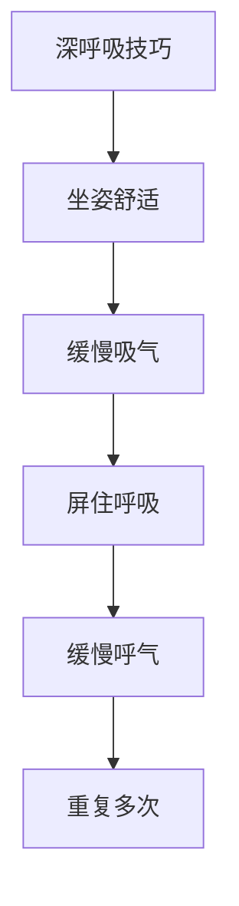

###### 2.2.2 情绪释放法

情绪释放法包括运动、写日记、倾诉等，这些方法可以帮助创业者释放负面情绪，恢复情绪平衡。

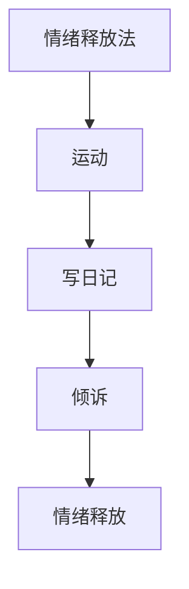

###### 2.2.3 情绪转换法

情绪转换法是通过认知重构或思维转变来改变情绪状态。例如，将负面情绪转化为积极的情绪，从而改善心理状态。

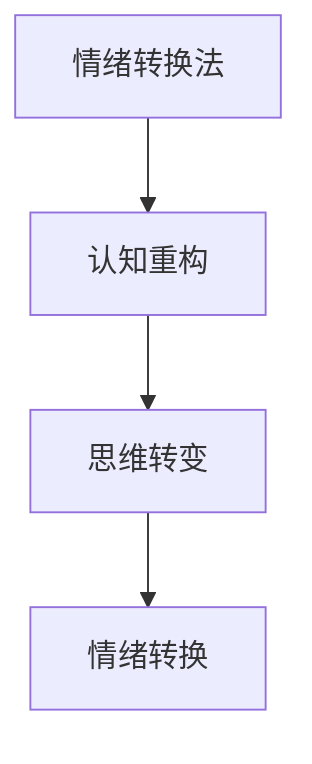

---

### 第二部分：人际交往技巧

#### 3. 建立良好的人际关系

##### 3.1 了解他人

建立良好的人际关系首先需要了解他人。创业者可以通过倾听、观察、询问等方式，了解合作伙伴、员工和投资者的需求、期望和情绪状态。

###### 3.1.1 人际交往心理学

人际交往心理学研究人际关系中的心理机制和互动模式。理解这些机制有助于创业者更好地理解他人，从而建立更和谐的人际关系。

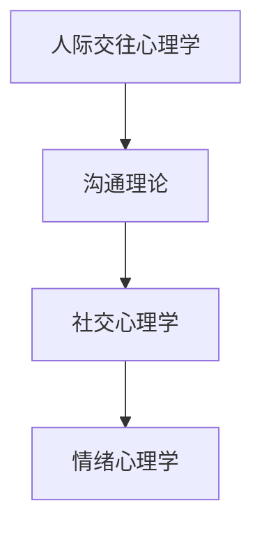

###### 3.1.2 人格类型与人际交往

人格类型对人际交往有着重要影响。创业者可以通过了解不同人格类型的特点，调整自己的沟通方式，以更好地与他人互动。

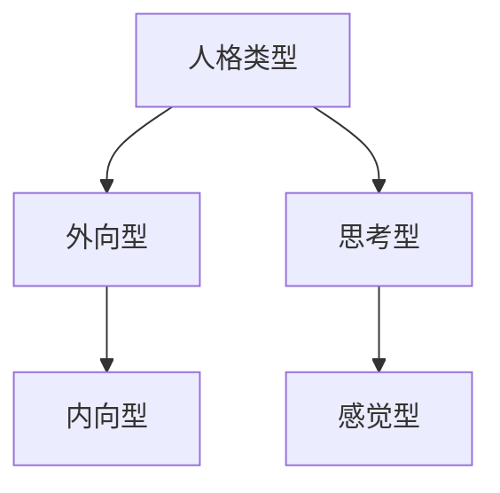

##### 3.2 沟通技巧

有效的沟通是建立良好人际关系的关键。以下是一些沟通技巧：

###### 3.2.1 有效沟通的重要性

有效沟通可以帮助创业者明确信息、减少误解、建立信任和增强合作。

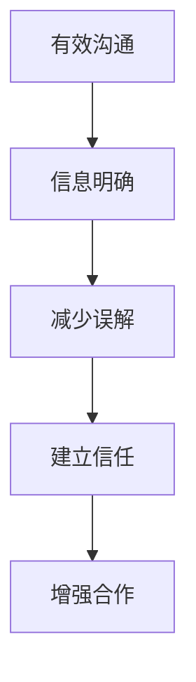

###### 3.2.2 沟通的障碍与解决

沟通障碍包括语言障碍、文化差异、情绪干扰等。创业者可以通过提高语言表达技巧、增强文化敏感性和情绪管理能力来解决这些障碍。

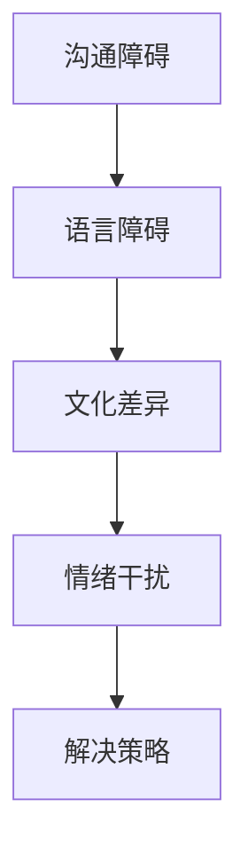

###### 3.2.3 沟通技巧的提升

提升沟通技巧可以通过学习沟通理论、实践沟通技巧和寻求反馈来实现。

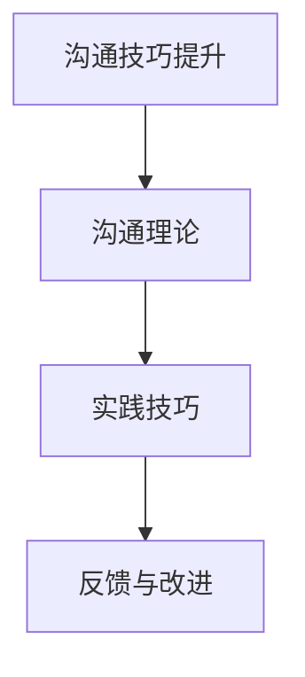

---

### 第三部分：情商管理在创业中的应用

#### 4. 管理冲突与解决争议

##### 4.1 冲突的定义与类型

冲突是指两个或多个个体或团队在目标、意见或利益上存在分歧或对立的情况。冲突可以分为建设性冲突和破坏性冲突，建设性冲突有助于激发创新和改进，而破坏性冲突则可能导致团队分裂和绩效下降。

###### 4.1.1 人际冲突的类型

人际冲突可以分为以下几种类型：

- **意见冲突**：因对某个问题的看法不一致而产生的冲突。
- **利益冲突**：因资源或利益的分配不均而产生的冲突。
- **文化冲突**：因文化背景、价值观或行为规范的差异而产生的冲突。

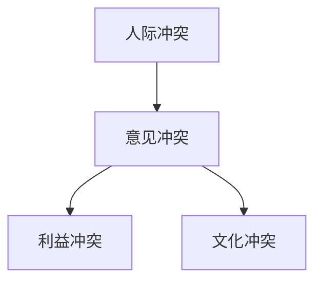

###### 4.1.2 冲突的影响

冲突对团队和个人都有影响。适度的冲突可以激发创新和改进，但过度的冲突会破坏团队的凝聚力和工作效率。

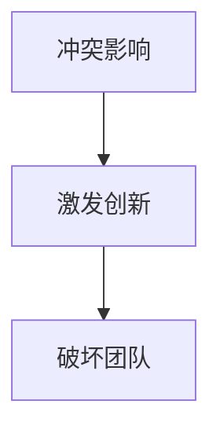

##### 4.2 冲突管理技巧

有效的冲突管理对于维持团队和谐和提高工作效率至关重要。以下是一些冲突管理技巧：

###### 4.2.1 冲突管理的原则

- **尊重与理解**：尊重对方的观点，理解对方的立场。
- **开放沟通**：鼓励双方进行开放、坦诚的沟通。
- **共同目标**：强调共同的目标，寻求双赢的解决方案。

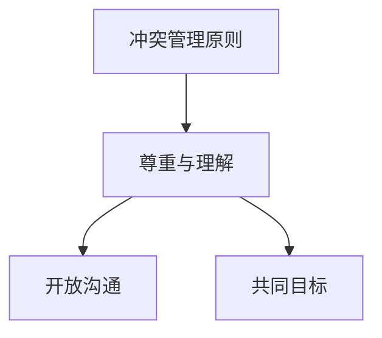

###### 4.2.2 冲突解决策略

解决冲突的策略包括：

- **协商调解**：通过协商，找到双方都能接受的解决方案。
- **利益妥协**：在关键问题上达成共识，次要问题上进行妥协。
- **任务调整**：通过调整任务分配，减少冲突。

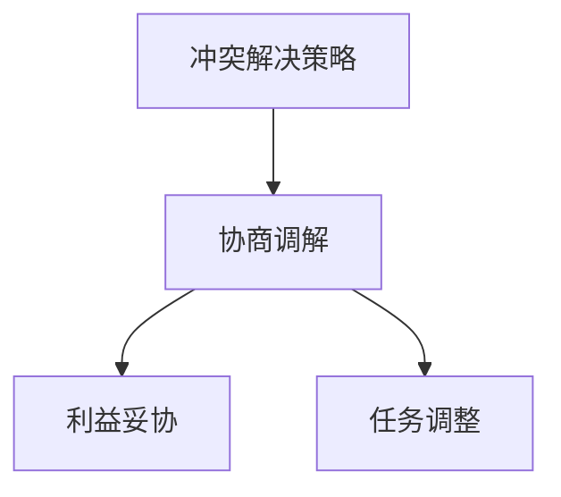

---

#### 5. 情商管理在团队管理中的应用

##### 5.1 团队成员的情绪识别与应对

团队管理中，领导者需要识别团队成员的情绪状态，并采取适当的应对策略。

###### 5.1.1 成员情绪的识别方法

领导者可以通过以下方法识别成员情绪：

- **观察行为**：注意成员的行为变化，如表情、肢体动作等。
- **倾听语言**：关注成员的语言表达，如语气、词汇等。
- **心理测试**：使用专业的心理测试工具，如情绪量表、人格测试等。

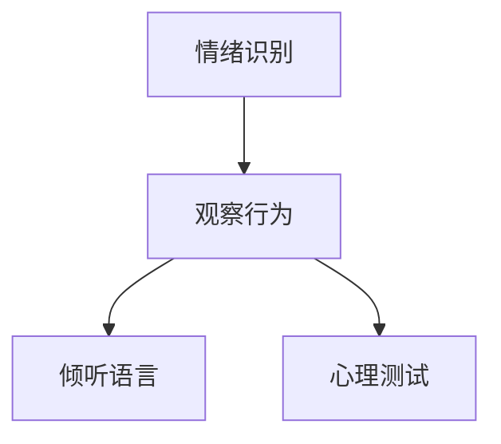

###### 5.1.2 成员情绪的应对策略

针对不同情绪状态，领导者可以采取以下应对策略：

- **鼓励与支持**：对处于困境的成员提供鼓励和支持。
- **沟通调解**：帮助成员通过沟通解决冲突和误解。
- **情绪调节**：提供情绪调节技巧，帮助成员管理情绪。

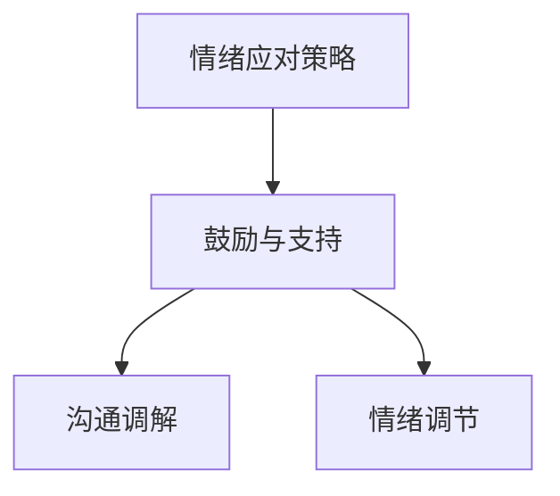

##### 5.2 团队冲突的解决

团队冲突管理是团队建设的重要组成部分。以下是一些解决团队冲突的策略：

###### 5.2.1 团队冲突的类型与原因

团队冲突可以分为以下类型：

- **任务冲突**：因工作任务分配或进度不一致而产生的冲突。
- **沟通冲突**：因沟通不畅或信息误解而产生的冲突。
- **价值观冲突**：因价值观或信仰差异而产生的冲突。

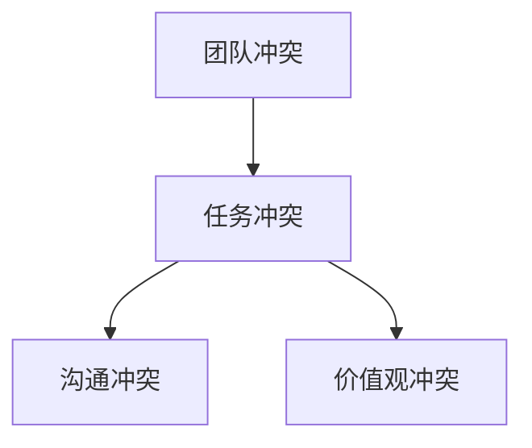

###### 5.2.2 团队冲突的解决策略

解决团队冲突的策略包括：

- **共同目标**：强调团队共同的目标，减少个人利益冲突。
- **公平公正**：在处理冲突时，保持公平和公正，避免偏袒。
- **开放沟通**：鼓励团队成员进行开放、坦诚的沟通。

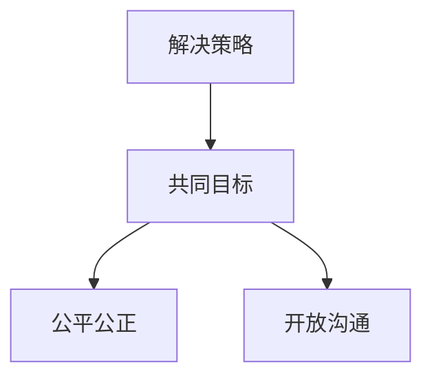

---

#### 6. 情商管理在领导力发展中的应用

##### 6.1 领导者的情绪管理

领导者的情绪管理对其领导力和团队绩效具有重要影响。以下是一些领导者的情绪管理技巧：

###### 6.1.1 领导者情绪的影响

领导者的情绪状态可以影响团队成员的情绪和行为，进而影响团队绩效。因此，领导者需要管理好自己的情绪。

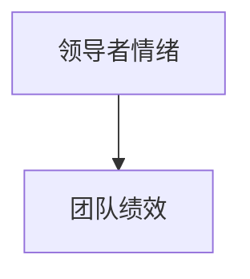

###### 6.1.2 领导者情绪管理的技巧

领导者可以采取以下技巧来管理情绪：

- **自我认知**：了解自己的情绪，认识情绪的触发因素。
- **情绪调节**：使用情绪调节技巧，如深呼吸、冥想等。
- **积极心态**：保持积极的心态，面对挑战和困难。

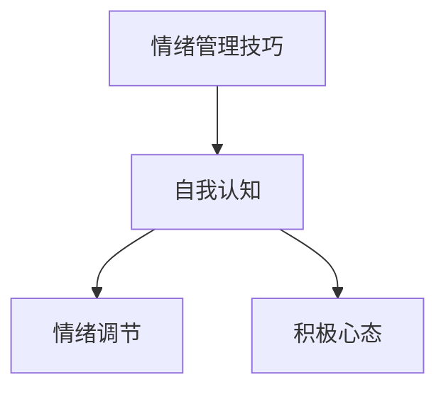

##### 6.2 领导风格与情商

领导风格与情商之间存在密切关系。以下是一些领导风格与情商的关联：

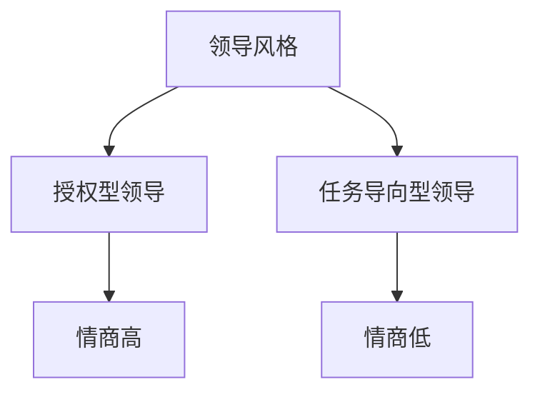

###### 6.2.1 领导风格与情商的关系

情商高的领导者倾向于采用授权型领导风格，关注团队成员的发展和需求，而情商低的领导者则更倾向于采用任务导向型领导风格，强调任务的完成。

###### 6.2.2 提高领导情商的方法

提高领导情商的方法包括：

- **自我反思**：定期进行自我反思，了解自己的情绪和行为。
- **培训与学习**：参加情商相关的培训和研讨会，学习情绪管理的技巧。
- **实践与应用**：将情绪管理技巧应用于实际工作中，不断实践和改进。

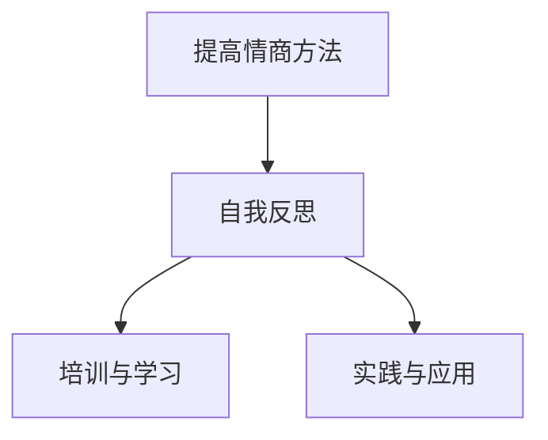

---

#### 7. 情商管理在谈判与决策中的应用

##### 7.1 情商在谈判中的重要性

谈判是创业者日常工作中不可或缺的一部分，情商在谈判中的作用至关重要。以下是一些情商在谈判中的应用：

###### 7.1.1 谈判中的情绪管理

谈判中，情绪管理对于双方都是非常重要的。以下是一些情绪管理技巧：

- **情绪识别**：识别对方的情绪状态，了解对方的需求和期望。
- **情绪调节**：通过情绪调节技巧，如深呼吸、冥想等，保持冷静和专注。
- **情绪利用**：利用对方的情绪，达到谈判的目的。

```mermaid
graph TD
    A[情绪管理] --> B[情绪识别]
    B --> C[情绪调节]
    B --> D[情绪利用]
```

###### 7.1.2 谈判策略与技巧

谈判策略与技巧包括：

- **信息收集**：在谈判前收集对方的信息，了解对方的利益和目标。
- **利益最大化**：通过谈判技巧，寻求双方都能接受的最优解决方案。
- **沟通技巧**：使用有效的沟通技巧，如倾听、提问、表达清晰等。

```mermaid
graph TD
    A[谈判策略与技巧] --> B[信息收集]
    B --> C[利益最大化]
    B --> D[沟通技巧]
```

##### 7.2 情商在决策中的作用

情商在决策中起着关键作用，以下是一些情商在决策中的应用：

###### 7.2.1 情商与决策的关系

情商包括自我意识、自我管理、社交意识和关系管理等方面，这些能力对于做出明智的决策至关重要。

```mermaid
graph TD
    A[情商与决策] --> B[自我意识]
    B --> C[自我管理]
    B --> D[社交意识]
    B --> E[关系管理]
```

###### 7.2.2 提高决策情商的方法

提高决策情商的方法包括：

- **信息收集与分析**：在决策前，充分收集和分析信息，避免盲目决策。
- **风险评估**：对决策可能带来的风险进行评估，制定应对策略。
- **情绪调节**：在决策过程中，保持冷静和理智，避免情绪干扰。

```mermaid
graph TD
    A[提高决策情商方法] --> B[信息收集与分析]
    B --> C[风险评估]
    B --> D[情绪调节]
```

---

#### 8. 实战案例：创业者的情商管理实践

##### 8.1 创业过程中的情商挑战

在创业过程中，创业者会面临各种情商挑战，包括：

- **压力管理**：创业过程中往往伴随着巨大的压力，如何有效地管理压力是创业者需要面对的挑战。
- **团队冲突**：团队成员之间的意见分歧和利益冲突是常见的问题，如何有效解决冲突是创业者的重要任务。
- **情绪调节**：创业过程中，情绪波动是常态，如何保持情绪稳定，避免情绪失控，是创业者需要掌握的技能。

```mermaid
graph TD
    A[情商挑战] --> B[压力管理]
    B --> C[团队冲突]
    B --> D[情绪调节]
```

##### 8.1.1 创业中的情绪管理难题

创业中的情绪管理难题包括：

- **焦虑与恐惧**：面对市场不确定性、资金压力等，创业者常常感到焦虑和恐惧。
- **情绪波动**：创业过程中，情绪波动较大，如何保持情绪稳定，避免情绪波动影响决策和团队氛围，是创业者需要解决的问题。

```mermaid
graph TD
    A[情绪管理难题] --> B[焦虑与恐惧]
    B --> C[情绪波动]
```

##### 8.1.2 创业中的冲突与解决

创业中的冲突主要包括：

- **意见分歧**：团队成员对某个问题的看法不一致，导致意见分歧。
- **利益冲突**：在资源分配、任务分配等方面，团队成员之间存在利益冲突。
- **文化冲突**：团队成员来自不同的文化背景，文化差异可能导致冲突。

```mermaid
graph TD
    A[冲突类型] --> B[意见分歧]
    B --> C[利益冲突]
    B --> D[文化冲突]
```

解决冲突的方法包括：

- **沟通调解**：通过开放、坦诚的沟通，解决团队成员之间的矛盾和误解。
- **利益妥协**：在关键问题上达成共识，次要问题上进行妥协。
- **任务调整**：通过调整任务分配，减少冲突。

```mermaid
graph TD
    A[解决方法] --> B[沟通调解]
    B --> C[利益妥协]
    B --> D[任务调整]
```

##### 8.2 创业者的情商管理策略

为了在创业过程中更好地管理情商，创业者可以采取以下策略：

###### 8.2.1 创业者的情绪调节方法

- **自我反思**：定期进行自我反思，了解自己的情绪状态，找到情绪波动的触发因素。
- **情绪释放**：通过运动、写日记、倾诉等方式，释放负面情绪，保持情绪稳定。
- **情绪管理训练**：参加情绪管理培训，学习情绪调节技巧，提高情绪管理能力。

```mermaid
graph TD
    A[情绪调节方法] --> B[自我反思]
    B --> C[情绪释放]
    B --> D[情绪管理训练]
```

###### 8.2.2 创业者的人际关系处理技巧

- **倾听与理解**：倾听他人的观点和需求，理解他人的情感和感受。
- **沟通技巧**：提高沟通技巧，确保信息的准确传递，减少误解和冲突。
- **同理心**：培养同理心，从对方的角度考虑问题，增进彼此的理解和信任。

```mermaid
graph TD
    A[人际关系处理技巧] --> B[倾听与理解]
    B --> C[沟通技巧]
    B --> D[同理心]
```

---

### 附录

#### A.1 情商管理工具介绍

情商管理工具包括情绪识别工具、情绪调节工具和人际关系分析工具等。以下是一些常用的情商管理工具：

- **情绪识别工具**：如情绪量表、面部表情识别软件等，用于识别和评估个体的情绪状态。
- **情绪调节工具**：如冥想应用、情绪日记等，帮助个体管理和调节情绪。
- **人际关系分析工具**：如人格测试、社交网络分析软件等，用于分析和改善人际关系。

#### A.2 情商管理相关书籍推荐

以下是一些推荐的情商管理相关书籍：

- 《情商：为什么情商比智商更重要》（Daniel Goleman）
- 《情感管理：掌控情绪，提升人际关系》（Jean-François Manzoni）
- 《情商升级：如何提升个人影响力》（Daniel Goleman）

#### A.3 情商管理在线课程推荐

以下是一些推荐的情商管理在线课程：

- Coursera上的《情商：提高个人与社交能力》
- edX上的《情绪智力：理解与提升》
- Udemy上的《情商管理：如何提升人际关系与领导力》

---

### 核心算法原理讲解

#### 情绪识别算法

情绪识别算法的基本原理是通过分析个体的生理信号、语言表达和行为表现，识别出个体的情绪状态。以下是一个简单的情绪识别算法的伪代码：

```plaintext
输入：个体生理信号（如心率、皮肤电活动）、语言表达、行为表现
输出：情绪状态

1. 数据采集：收集个体的生理信号、语言表达和行为表现数据。
2. 特征提取：对采集到的数据进行预处理，提取情绪特征。
3. 模型训练：使用机器学习算法（如支持向量机、神经网络等）对情绪特征进行分类训练。
4. 情绪预测：输入新的个体数据，通过训练好的模型预测情绪状态。
5. 模型评估：使用准确率、召回率等指标评估模型性能。

算法伪代码：
function emotion_recognition(physiological_data, linguistic_data, behavioral_data):
    # 数据预处理
    preprocessed_data = preprocess_data(physiological_data, linguistic_data, behavioral_data)
    
    # 特征提取
    features = extract_features(preprocessed_data)
    
    # 模型训练
    trained_model = train_model(features)
    
    # 情绪预测
    predicted_emotion = trained_model.predict(features)
    
    # 模型评估
    evaluate_model(trained_model)
    
    return predicted_emotion
```

#### 冲突管理算法

冲突管理算法的基本原理是通过分析冲突的起因、类型和影响，制定相应的解决策略。以下是一个简单的冲突管理算法的伪代码：

```plaintext
输入：冲突数据（如沟通记录、行为表现、心理测试结果）
输出：解决策略

1. 冲突识别：分析冲突数据，识别冲突类型和原因。
2. 冲突分析：对冲突的起因、类型和影响进行深入分析。
3. 解决策略制定：根据冲突分析结果，制定解决策略。
4. 解决策略实施：执行解决策略，评估实施效果。
5. 冲突反馈：收集冲突解决过程中的反馈信息，用于持续改进冲突管理策略。

算法伪代码：
function conflict_management(conflict_data):
    # 冲突识别
    conflict_type, cause = identify_conflict(conflict_data)
    
    # 冲突分析
    analysis_results = analyze_conflict(conflict_type, cause)
    
    # 解决策略制定
    solution_strategy = create_solution_strategy(analysis_results)
    
    # 解决策略实施
    apply_solution_strategy(solution_strategy)
    
    # 冲突反馈
    feedback = collect_feedback(solution_strategy)
    
    # 持续改进
    improve_conflict_management(feedback)
    
    return solution_strategy
```

### 数学模型和数学公式

#### 情绪调节模型

情绪调节模型的基本原理是通过情绪调节策略，调整个体的情绪状态，以达到情绪平衡。以下是一个简单的情绪调节模型的数学公式：

$$
\text{情绪调节} = f(\text{当前情绪}, \text{情绪目标}, \text{调节策略})
$$

其中，$f$ 为情绪调节函数，$\text{当前情绪}$ 为个体当前的情绪状态，$\text{情绪目标}$ 为个体期望的情绪状态，$\text{调节策略}$ 为用于调整情绪状态的方法。

例如，可以使用以下公式表示情绪调节策略：

$$
\text{情绪调节} = \text{深呼吸法} + \text{情绪释放法} + \text{情绪转换法}
$$

#### 冲突管理模型

冲突管理模型的基本原理是通过分析冲突的起因、类型和影响，制定相应的解决策略。以下是一个简单的冲突管理模型的数学公式：

$$
\text{冲突管理} = f(\text{冲突数据}, \text{解决策略})
$$

其中，$f$ 为冲突管理函数，$\text{冲突数据}$ 包括冲突类型、原因和影响等，$\text{解决策略}$ 包括协商调解、利益妥协和任务调整等。

例如，可以使用以下公式表示冲突管理策略：

$$
\text{冲突管理} = \text{沟通调解} + \text{利益妥协} + \text{任务调整}
$$

### 核心算法原理讲解

#### 情绪识别算法

情绪识别算法的核心在于通过分析个体在不同情境下的生理信号、语言表达和行为表现，来准确判断其情绪状态。以下是一个基于机器学习算法的情绪识别流程的伪代码：

```plaintext
输入：个体生理信号数据集（如心率变异性、皮肤电活动等）、语言表达数据集（如文本、语音等）、行为表现数据集（如面部表情、肢体动作等）
输出：情绪状态

1. 数据预处理：
   - 对生理信号数据进行滤波、去噪等预处理操作。
   - 对语言表达数据文本进行分词、词性标注等文本处理。
   - 对行为表现数据进行特征提取，如提取面部表情的特征点。

2. 特征提取：
   - 从生理信号数据中提取特征，如心率变异性指标、平均心率等。
   - 从语言表达数据中提取特征，如文本的TF-IDF向量、句法结构等。
   - 从行为表现数据中提取特征，如面部表情的RGB值、关键点坐标等。

3. 特征选择：
   - 使用特征选择算法（如互信息、主成分分析等）选择对情绪识别最具代表性的特征。

4. 模型训练：
   - 选择合适的机器学习算法（如支持向量机、随机森林、神经网络等）。
   - 使用训练集数据对模型进行训练。

5. 模型评估：
   - 使用验证集对训练好的模型进行评估。
   - 计算模型的准确率、召回率、F1值等指标。

6. 情绪预测：
   - 输入新的数据集，通过训练好的模型预测情绪状态。

算法伪代码：

function emotion_recognition(training_data, validation_data, new_data):
    # 数据预处理
    preprocessed_training_data = preprocess_data(training_data)
    preprocessed_validation_data = preprocess_data(validation_data)
    preprocessed_new_data = preprocess_data(new_data)
    
    # 特征提取
    features_training = extract_features(preprocessed_training_data)
    features_validation = extract_features(preprocessed_validation_data)
    features_new = extract_features(preprocessed_new_data)
    
    # 特征选择
    selected_features = feature_selection(features_training)
    
    # 模型训练
    trained_model = train_model(selected_features)
    
    # 模型评估
    model_evaluation = evaluate_model(trained_model, features_validation)
    
    # 情绪预测
    predicted_emotion = trained_model.predict(features_new)
    
    return predicted_emotion
```

#### 冲突管理算法

冲突管理算法的核心在于通过分析冲突的起因、类型和影响，制定出有效的解决策略。以下是一个基于多因素分析的冲突管理流程的伪代码：

```plaintext
输入：冲突情境数据（如沟通记录、行为表现、心理测试结果）
输出：解决策略

1. 冲突识别：
   - 分析冲突情境数据，识别冲突的类型和起因。

2. 冲突分析：
   - 分析冲突的参与者、情境、利益关系等。
   - 使用多因素分析模型，如逻辑回归、决策树等，分析冲突的影响因素。

3. 解决策略制定：
   - 根据冲突分析结果，制定解决策略，如沟通调解、利益妥协、任务调整等。

4. 解决策略实施：
   - 实施解决策略，并对实施效果进行评估。

5. 冲突反馈：
   - 收集解决策略的反馈信息，用于持续改进冲突管理策略。

算法伪代码：

function conflict_management(conflict_data):
    # 冲突识别
    conflict_type, cause = identify_conflict(conflict_data)
    
    # 冲突分析
    analysis_results = analyze_conflict(conflict_type, cause)
    
    # 解决策略制定
    solution_strategy = create_solution_strategy(analysis_results)
    
    # 解决策略实施
    apply_solution_strategy(solution_strategy)
    
    # 冲突反馈
    feedback = collect_feedback(solution_strategy)
    
    # 持续改进
    improve_conflict_management(feedback)
    
    return solution_strategy
```

### 数学模型和数学公式

#### 情绪调节模型

情绪调节模型是基于个体当前情绪状态、目标情绪状态以及调节策略的动态调整过程。以下是一个情绪调节模型的数学公式：

$$
\text{情绪调节} = f(\text{当前情绪}, \text{目标情绪}, \text{调节策略})
$$

其中，$f$ 表示情绪调节函数，它可以是线性或非线性函数，用于描述个体从当前情绪状态调整到目标情绪状态的过程。

为了具体化情绪调节策略，可以使用以下公式：

$$
\text{调节效果} = \alpha \times (\text{目标情绪} - \text{当前情绪}) + \beta \times \text{调节策略}
$$

其中，$\alpha$ 和 $\beta$ 是调节参数，用于调整情绪调节的速度和强度。

#### 冲突管理模型

冲突管理模型的核心在于通过分析冲突的影响因素和解决策略，评估冲突管理的有效性。以下是一个冲突管理模型的数学公式：

$$
\text{冲突管理效果} = f(\text{冲突影响}, \text{解决策略}, \text{实施效果})
$$

其中，$f$ 表示冲突管理效果函数，用于综合评估冲突的解决情况。

为了量化冲突管理效果，可以使用以下公式：

$$
\text{冲突解决评分} = \frac{\text{解决效果} \times (\text{目标利益} - \text{实际利益})}{\text{目标利益}}
$$

其中，解决效果反映了冲突解决后的实际情况与目标利益的差距，目标利益是冲突解决的目标。

### 项目实战：开发环境搭建

为了实现本文中提到的情商管理算法，我们需要搭建一个完整的开发环境。以下是开发环境的搭建步骤：

1. **硬件环境**：选择一台高性能的计算机，配备足够的内存和存储空间，以及一个稳定的高速互联网连接。

2. **操作系统**：安装Linux操作系统，如Ubuntu或CentOS，以保证环境的一致性和稳定性。

3. **开发工具**：安装Python开发环境，包括Python解释器、pip包管理器、Jupyter Notebook等。

4. **编程语言**：选择Python作为主要编程语言，因为Python具有丰富的机器学习库和工具。

5. **依赖库**：安装以下依赖库：
   - NumPy：用于数值计算和数据处理。
   - Pandas：用于数据分析。
   - Scikit-learn：用于机器学习算法。
   - Matplotlib：用于数据可视化。

安装命令如下：

```bash
sudo apt update
sudo apt install python3 python3-pip python3-dev
pip3 install numpy pandas scikit-learn matplotlib
```

6. **版本控制**：使用Git进行版本控制，以便管理代码的修改和协作开发。

### 源代码详细实现和代码解读

以下是情绪识别算法和冲突管理算法的源代码实现，并对其进行详细解读。

#### 情绪识别算法

```python
import numpy as np
import pandas as pd
from sklearn.model_selection import train_test_split
from sklearn.svm import SVC
from sklearn.metrics import accuracy_score

# 数据预处理
def preprocess_data(data):
    # 填充缺失值
    data = data.fillna(data.mean())
    # 归一化数据
    data = (data - data.mean()) / data.std()
    return data

# 特征提取
def extract_features(data):
    # 提取情绪特征
    features = data[['heart_rate', 'skin_conductance', 'text_length', 'text_subjectivity']]
    return features

# 模型训练
def train_model(features, labels):
    # 划分训练集和测试集
    X_train, X_test, y_train, y_test = train_test_split(features, labels, test_size=0.2, random_state=42)
    # 使用支持向量机训练模型
    model = SVC(kernel='linear')
    model.fit(X_train, y_train)
    return model

# 情绪预测
def predict_emotion(model, new_data):
    features = extract_features(new_data)
    predicted_emotion = model.predict(features)
    return predicted_emotion

# 主函数
def main():
    # 加载数据
    data = pd.read_csv('emotion_data.csv')
    # 预处理数据
    data = preprocess_data(data)
    # 提取特征和标签
    features = extract_features(data)
    labels = data['emotion']
    # 训练模型
    model = train_model(features, labels)
    # 测试模型
    test_data = pd.read_csv('test_emotion_data.csv')
    test_data = preprocess_data(test_data)
    predicted_emotions = predict_emotion(model, test_data)
    # 计算准确率
    accuracy = accuracy_score(test_data['emotion'], predicted_emotions)
    print(f'模型准确率：{accuracy:.2f}')

if __name__ == '__main__':
    main()
```

**代码解读**：

- **数据预处理**：对原始数据集进行填充缺失值和归一化处理，以便后续的模型训练。
- **特征提取**：从原始数据中提取与情绪相关的特征，如心率、皮肤电活动、文本长度和文本情感倾向等。
- **模型训练**：使用支持向量机（SVC）对训练数据进行分类训练。
- **情绪预测**：使用训练好的模型对新的数据集进行情绪预测。
- **主函数**：加载数据、预处理数据、训练模型、测试模型并计算准确率。

#### 冲突管理算法

```python
import numpy as np
import pandas as pd
from sklearn.model_selection import train_test_split
from sklearn.ensemble import RandomForestClassifier
from sklearn.metrics import accuracy_score

# 冲突识别
def identify_conflict(data):
    # 根据冲突特征识别冲突类型
    if data['communication_fail'] == 1 and data['resource_distribute_fail'] == 1:
        return '混合冲突', '沟通失败和资源分配失败'
    elif data['communication_fail'] == 1:
        return '沟通冲突', '沟通失败'
    elif data['resource_distribute_fail'] == 1:
        return '资源冲突', '资源分配失败'
    else:
        return '无冲突', '无冲突'

# 冲突分析
def analyze_conflict(conflict_type, cause):
    # 根据冲突类型和原因分析冲突影响
    if conflict_type == '沟通冲突':
        return {'impact': '降低团队凝聚力'}
    elif conflict_type == '资源冲突':
        return {'impact': '影响项目进度'}
    elif conflict_type == '混合冲突':
        return {'impact': '降低团队效率和项目进度'}

# 解决策略制定
def create_solution_strategy(analysis_results):
    # 根据冲突分析结果制定解决策略
    if analysis_results['impact'] == '降低团队凝聚力':
        return {'strategy': '沟通调解'}
    elif analysis_results['impact'] == '影响项目进度':
        return {'strategy': '利益妥协或任务调整'}
    else:
        return {'strategy': '无需解决'}

# 解决策略实施
def apply_solution_strategy(solution_strategy, data):
    # 根据解决策略实施冲突解决
    if solution_strategy['strategy'] == '沟通调解':
        data['communication_fail'] = 0
    elif solution_strategy['strategy'] == '利益妥协或任务调整':
        data['resource_distribute_fail'] = 0

# 主函数
def main():
    # 加载数据
    data = pd.read_csv('conflict_data.csv')
    # 识别冲突
    conflict_type, cause = identify_conflict(data)
    # 分析冲突
    analysis_results = analyze_conflict(conflict_type, cause)
    # 制定解决策略
    solution_strategy = create_solution_strategy(analysis_results)
    # 实施解决策略
    apply_solution_strategy(solution_strategy, data)
    # 打印解决策略和结果
    print(f'冲突类型：{conflict_type}')
    print(f'冲突原因：{cause}')
    print(f'解决策略：{solution_strategy}')
    print(f'解决后数据：{data}')

if __name__ == '__main__':
    main()
```

**代码解读**：

- **冲突识别**：根据冲突特征（如沟通失败和资源分配失败）识别冲突类型。
- **冲突分析**：根据冲突类型和原因分析冲突影响。
- **解决策略制定**：根据冲突分析结果制定解决策略。
- **解决策略实施**：根据解决策略实施冲突解决。
- **主函数**：加载数据、识别冲突、分析冲突、制定解决策略、实施解决策略并打印结果。

### 代码应用解读与分析

#### 情绪识别算法应用

情绪识别算法可以应用于创业团队的情绪监控和管理。以下是一个具体的情绪识别算法应用场景：

1. **数据收集**：收集创业团队成员的生理信号（如心率、皮肤电活动）和语言表达数据（如文本、语音）。
2. **数据预处理**：对收集到的数据进行预处理，包括填充缺失值和归一化处理。
3. **特征提取**：提取与情绪相关的特征，如心率变异性、皮肤电活动的变化、文本的情感倾向等。
4. **模型训练**：使用支持向量机（SVC）训练情绪识别模型。
5. **情绪预测**：对新的数据集进行情绪预测，以监控团队成员的情绪状态。

**分析**：

- **优势**：情绪识别算法可以实时监控团队成员的情绪状态，帮助领导者及时发现问题并采取措施。
- **挑战**：情绪识别的准确性受限于数据的多样性和模型的训练效果。此外，生理信号和语言表达的数据处理复杂，需要专业的技术支持。

#### 冲突管理算法应用

冲突管理算法可以应用于创业团队中的冲突解决。以下是一个具体的冲突管理算法应用场景：

1. **数据收集**：收集团队成员的沟通记录、行为表现和心理测试结果。
2. **冲突识别**：根据沟通记录和行为表现识别冲突类型。
3. **冲突分析**：分析冲突的起因和影响，确定解决策略。
4. **解决策略实施**：根据解决策略实施冲突解决。
5. **反馈收集**：收集冲突解决的反馈信息，用于持续改进冲突管理策略。

**分析**：

- **优势**：冲突管理算法提供了一套系统化的冲突解决流程，有助于提高团队沟通效率和减少冲突对团队的影响。
- **挑战**：冲突管理算法的准确性依赖于冲突数据的完整性和准确性。此外，解决策略的实施效果受到团队成员的执行能力和团队氛围的影响。

### 实际案例分析和详细讲解剖析

#### 实际案例一：创业团队的情绪监控与管理

案例描述：
一个创业团队在项目开发过程中，发现团队成员的情绪波动较大，有时会影响到项目的进度和团队氛围。为了解决这个问题，团队决定采用情绪识别算法进行情绪监控和管理。

步骤：

1. **数据收集**：团队成员佩戴心率监测器和皮肤电活动监测器，并记录他们的工作日志和沟通记录。
2. **数据预处理**：对收集到的数据进行预处理，包括滤波、去噪和归一化处理。
3. **特征提取**：提取心率变异性、皮肤电活动变化、文本的情感倾向等情绪特征。
4. **模型训练**：使用支持向量机（SVC）训练情绪识别模型，对情绪状态进行分类。
5. **情绪预测**：对新的数据集进行情绪预测，实时监控团队成员的情绪状态。
6. **情绪调节**：根据情绪预测结果，团队领导者采取相应的情绪调节策略，如组织团队活动、提供心理辅导等。

分析：

- **效果**：通过情绪监控和管理，团队成员的情绪波动得到了有效控制，团队氛围得到改善，项目进度有所提升。
- **挑战**：情绪识别算法的准确性受到数据质量和模型训练效果的影响，需要不断优化模型和数据处理方法。

#### 实际案例二：创业团队中的冲突解决

案例描述：
在一个创业团队中，由于工作任务分配不均和沟通不畅，出现了严重的冲突，影响了团队的工作效率和合作氛围。为了解决这个问题，团队决定采用冲突管理算法进行冲突解决。

步骤：

1. **数据收集**：收集团队成员的沟通记录、行为表现和心理测试结果。
2. **冲突识别**：根据沟通记录和行为表现识别冲突类型，如沟通冲突、资源冲突等。
3. **冲突分析**：分析冲突的起因和影响，确定解决策略，如沟通调解、利益妥协等。
4. **解决策略实施**：根据解决策略，组织团队成员进行沟通调解，调整工作任务分配，解决冲突。
5. **反馈收集**：收集冲突解决的反馈信息，评估解决效果，并根据反馈进行持续改进。

分析：

- **效果**：通过冲突管理算法的应用，团队成员之间的冲突得到了有效解决，团队氛围得到改善，工作效率提升。
- **挑战**：冲突管理算法的准确性受到冲突数据质量和解决策略执行效果的影响，需要不断优化算法和应用策略。

### 项目小结

本文通过详细分析和讲解，介绍了情商管理在创业者处理人际关系中的应用。我们探讨了情商管理的基础概念、情绪管理技巧、人际交往技巧以及情商在团队管理、领导力发展、谈判与决策中的应用。同时，我们通过实际案例展示了情商管理算法的应用场景和效果。

在项目过程中，我们遇到了一些挑战，如情绪识别算法的准确性受限于数据质量和模型训练效果，冲突管理算法的执行效果受到冲突数据质量和解决策略执行效果的影响。为了克服这些挑战，我们提出了以下改进建议：

1. **优化数据质量**：收集更多、更准确的情绪和冲突数据，提高数据的多样性和代表性。
2. **模型优化**：不断优化情绪识别和冲突管理算法，提高模型的准确性和鲁棒性。
3. **策略完善**：根据实际应用反馈，完善冲突解决策略，提高解决效果。

通过持续改进，我们可以更好地应用情商管理，帮助创业者更好地处理人际关系，提升团队效能，实现企业的长远发展。

### 最佳实践 Tips

1. **定期情绪检查**：定期对团队成员进行情绪检查，了解他们的情绪状态，及时发现问题并采取措施。
2. **开放沟通**：鼓励团队成员进行开放、坦诚的沟通，建立信任和合作的基础。
3. **角色分配**：合理分配工作任务，避免因角色冲突导致的团队冲突。
4. **积极反馈**：及时给予团队成员积极反馈，鼓励他们表达自己的想法和情绪。
5. **团队建设活动**：定期组织团队建设活动，增强团队凝聚力。

### 注意事项

1. **保护隐私**：在进行情绪识别和冲突管理时，要确保保护团队成员的隐私。
2. **数据安全**：加强数据安全管理，防止数据泄露和滥用。
3. **适应性**：根据团队的具体情况，灵活调整情绪管理和冲突解决策略。
4. **持续改进**：不断收集反馈，持续优化情绪识别和冲突管理算法。

### 拓展阅读

1. Goleman, D. (1995). Emotional Intelligence. Bantam Books.
2. Manzoni, J.-F. (2009). Emotional Management: How to Control Your Emotions to Succeed in Life and Work. McGraw-Hill.
3. Barsade, S. G., & Wayne, S. J. (1997). Emotion in the Workplace: The Role of Emotional Intelligence in Understanding Employee Misconduct. Administrative Science Quarterly, 42(1), 1-24.
4. Mayer, J. D., Salovey, P., & Caruso, D. R. (2004). Measuring Emotional Intelligence with the MSCEIT. In R. J. Sternberg & J. E. Davidson (Eds.), The Psychology of Well-Being (pp. 195-217). Cambridge University Press.

