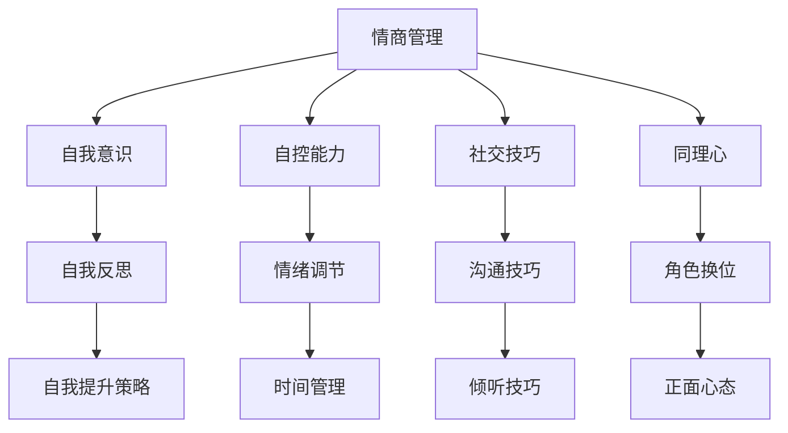
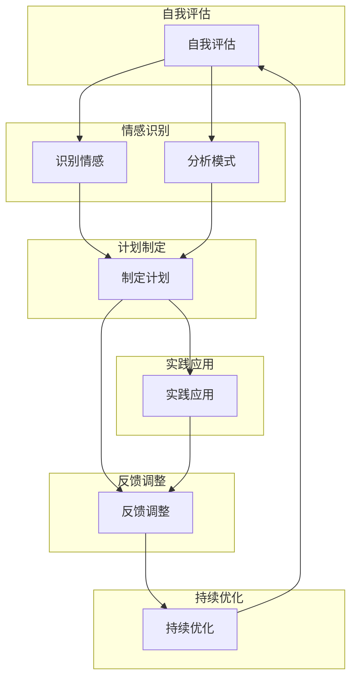

                 

# 《创业者的情商管理：处理人际关系的技巧》

## 关键词

- 情商管理
- 创业者
- 人际关系
- 沟通技巧
- 领导力
- 团队合作

## 摘要

本文旨在探讨情商管理在创业者人际关系中的重要性，包括自我意识、自我反思、自控能力、社交技巧和同理心。文章首先介绍了情商的基础知识，然后详细分析了情商管理的方法与技巧，以及如何在人际关系中建立和维护有效沟通。此外，文章还重点讨论了团队合作与领导力，以及应对创业中情感压力和情绪管理的策略。最后，通过实际案例和专家访谈，提供实践指南和深刻见解，帮助创业者提升情商，优化人际关系，实现事业成功。

## 目录大纲

### 第一部分：情商管理的基础知识

#### 第1章：情商的内涵与重要性

- 1.1 情商的定义与类型
- 1.2 情商在创业者中的重要性
- 1.3 情商管理的基本原则

#### 第2章：情商管理的方法与技巧

- 2.1 自我意识与自我反思
- 2.2 自控能力的培养
- 2.3 社交技巧的提升
- 2.4 同理心的培养

### 第二部分：人际关系的建立与维护

#### 第3章：建立有效的人际关系

- 3.1 人际关系的重要性
- 3.2 人际关系的建立策略
- 3.3 人际关系的维护技巧

#### 第4章：有效沟通的技巧

- 4.1 沟通的本质
- 4.2 沟通的原则
- 4.3 沟通技巧的提升

#### 第5章：团队合作与领导力

- 5.1 团队的构成与功能
- 5.2 团队合作技巧
- 5.3 领导者的情商管理

### 第三部分：情感压力与情绪管理

#### 第6章：应对创业中的情感压力

- 6.1 情感压力的来源
- 6.2 情感压力的影响
- 6.3 应对情感压力的策略

#### 第7章：情绪管理技巧

- 7.1 情绪的类型与识别
- 7.2 情绪调节的方法
- 7.3 情绪管理的实践

### 附录

- 附录A：情商管理工具与资源
- 附录B：案例分析与实践
- 附录C：情商管理流程图
- 附录D：情商管理数学模型与公式
- 附录E：情商管理算法与伪代码
- 附录F：情商管理项目实战
- 附录G：情商管理专家访谈

### 核心概念与联系

在探讨情商管理的过程中，我们需要理解几个核心概念之间的联系。以下是情商管理中几个核心概念之间的关系架构Mermaid流程图：



### 背景介绍

情商（Emotional Intelligence，简称EQ）是衡量个体处理情感和社交能力的重要指标，与传统智力（IQ）相比，情商在人际交往和情感管理中具有更显著的作用。对于创业者而言，情商管理尤为重要。创业过程充满不确定性和压力，需要创业者具备良好的情绪管理和人际沟通能力，以便在复杂的环境中做出明智的决策，构建稳定可靠的团队，并推动企业持续发展。

情商管理不仅涉及个人成长，还关系到团队建设、人际关系和领导力。创业者需要通过情商管理提升自我意识，学会控制情绪，提高社交技巧和同理心，从而在职场中更加得心应手。此外，情商管理对于应对创业过程中的情感压力也至关重要，有助于保持心理健康，提高创业成功率。

本文将从情商的内涵与重要性、情商管理的方法与技巧、人际关系的建立与维护、团队合作与领导力、情感压力与情绪管理等多个方面，系统探讨情商管理在创业者中的应用与实践，旨在为创业者提供实用的指导和建议。

### 核心概念与联系

在探讨情商管理的过程中，我们需要理解几个核心概念之间的联系。以下是情商管理中几个核心概念之间的关系架构Mermaid流程图：


#### 第1章：情商的内涵与重要性

### 1.1 情商的定义与类型

情商，即情感智力，是指个体识别、理解、管理自己和他人的情绪，以及运用这些能力促进思考、沟通和人际交往的能力。情商不仅涉及情感的表达和识别，还包括情感的应用和调控。情商的定义涵盖了多个维度，主要包括以下四种类型：

**自我意识**：自我意识是指个体对自己情绪的认知和理解。它包括识别自己的情绪状态、了解情绪的来源，以及分析情绪对行为和思维的影响。自我意识有助于个体更好地管理自己的情绪，避免情绪失控。

**自控能力**：自控能力是指个体在情感冲动时保持冷静、理智的能力。它包括控制情绪、延迟满足、克服冲动等。自控能力对于创业者来说尤为重要，因为在面对压力和挑战时，能够保持冷静和理性，做出明智的决策。

**社交技巧**：社交技巧是指个体在人际交往中表现出来的能力，包括沟通技巧、团队合作能力、人际关系的建立和维护等。社交技巧有助于创业者建立良好的社会网络，提高团队协作效率，从而推动企业的发展。

**同理心**：同理心是指个体能够从他人的角度出发，理解和感受他人的情绪和感受。同理心有助于建立良好的人际关系，增强团队合作，提高领导力。

### 1.2 情商在创业者中的重要性

对于创业者而言，情商不仅是一种个人特质，更是一种关键能力。以下是情商在创业者中的几个重要性方面：

**个人成长**：情商管理有助于创业者更好地认识自己，理解自己的情绪和行为模式，从而实现自我提升和成长。自我意识、自控能力、社交技巧和同理心都是创业者个人成长的重要支撑。

**团队建设**：创业者需要通过情商管理来建立和维护一个高效的团队。良好的社交技巧和同理心有助于创业者与团队成员建立信任和合作关系，提高团队凝聚力和工作效率。

**应对压力**：创业过程中不可避免地会遇到各种压力和挑战，情商管理能够帮助创业者更好地应对这些压力。自控能力和情绪调节技巧有助于创业者保持冷静和理智，做出明智的决策。

### 1.3 情商管理的基本原则

情商管理是一个持续的过程，需要创业者不断地学习、实践和改进。以下是情商管理的一些基本原则：

**正面心态**：保持积极乐观的心态是情商管理的基础。创业者应该学会从积极的角度看待挑战和困难，用积极的心态影响自己和他人。

**沟通技巧**：沟通是情商管理的重要组成部分。创业者需要掌握有效的沟通技巧，包括倾听、表达、反馈等，以便更好地与他人交流和协作。

**自我反思**：自我反思是情商管理的重要方法。创业者应该定期对自己的情绪和行为进行反思，分析自己的情绪反应和行为模式，找出改进的空间。

**时间管理**：创业者需要合理安排时间，确保有足够的时间来关注自己的情绪管理和人际交往。时间管理不仅有助于提高工作效率，还能为创业者提供更多自我提升的时间。

### 总结

情商管理是创业者成功的关键因素之一。通过理解情商的定义和类型，认识到情商在创业者中的重要性，以及掌握情商管理的基本原则，创业者可以更好地提升自己的情商，优化人际关系，实现个人和企业的双重成功。

#### 第2章：情商管理的方法与技巧

在了解了情商的基本概念和重要性之后，我们接下来将探讨如何通过具体的方法和技巧来提升情商。情商管理不仅需要理论上的认知，更需要实践中的不断训练和改进。以下是情商管理中几个关键的方法与技巧：

### 2.1 自我意识与自我反思

自我意识是情商管理的基础，它帮助个体认识和了解自己的情绪和行为。自我反思则是自我意识的深化，它通过分析和理解自己的情绪和行为模式，帮助个体发现并改进自身的问题。

**自我评估工具**：为了提升自我意识，创业者可以借助一些自我评估工具，如情商测试（EQ-i 2.0）、MYERS-BRIGGS性格类型测试等。这些工具能够提供有关个人情绪、行为和性格的详细信息，帮助创业者更好地认识自己。

**自我提升策略**：

1. **定期自我反思**：创业者可以每天或每周花一些时间进行自我反思，记录自己的情绪变化、行为反应和思考过程。通过持续的反思，创业者可以逐渐了解自己的情绪模式和行为习惯。

2. **设定个人目标**：根据自己的自我反思，创业者可以设定具体的个人目标，如提高自控能力、增强同理心等。这些目标可以帮助创业者有针对性地进行自我提升。

3. **寻求反馈**：创业者可以寻求同事、朋友或导师的反馈，了解他们在自己情绪管理和人际关系方面的看法。这些反馈可以为创业者提供新的视角，帮助其改进自己。

### 2.2 自控能力的培养

自控能力是指个体在面对诱惑、挑战和压力时，能够保持冷静、理智，做出明智决策的能力。自控能力对于创业者来说至关重要，因为它直接影响决策质量和企业发展。

**时间管理**：时间管理是提升自控能力的重要方法。创业者可以通过以下策略来管理时间：

1. **设定优先级**：将任务按照重要性和紧急性进行分类，优先处理最重要的任务。
2. **使用时间表**：制定详细的时间表，确保每天有足够的时间用于重要任务。
3. **避免拖延**：识别自己拖延的原因，并采取相应的策略，如分解任务、设定奖励等，以克服拖延。

**情绪调节**：情绪调节是自控能力的一个重要组成部分。以下是一些情绪调节的方法：

1. **认知重构**：通过改变对事件的认知和解读，来调节情绪。例如，将挫折视为成长的机会，而非失败。

2. **放松训练**：通过深呼吸、冥想、瑜伽等方式来放松身体和情绪。

3. **积极心态**：培养积极的心态，用积极的方式看待挑战和困难。

### 2.3 社交技巧的提升

社交技巧是创业者成功的关键因素之一。有效的社交技巧有助于创业者建立和维护良好的人际关系，提高团队合作效率，从而推动企业的发展。

**非语言沟通**：非语言沟通包括肢体语言、面部表情、姿态等。它往往比语言沟通更能传达情绪和意图。以下是一些提升非语言沟通技巧的方法：

1. **观察学习**：通过观察他人的非语言沟通，了解不同的肢体语言和面部表情所传达的含义。
2. **练习表达**：通过模仿和练习，掌握适当的非语言表达方式，如微笑、点头、眼神交流等。
3. **情境模拟**：在模拟的场景中练习非语言沟通，以便在实际情境中更加自信和自然。

**领导力培养**：领导力是社交技巧的重要组成部分。以下是一些培养领导力的方法：

1. **积极倾听**：倾听是领导力的关键，通过积极倾听，创业者可以更好地理解他人的需求和期望。
2. **有效表达**：通过清晰、简洁、有力的表达，创业者可以更好地传达自己的意图和想法。
3. **情感共鸣**：通过同理心，创业者可以与团队成员建立深厚的情感联系，提高团队凝聚力。

### 2.4 同理心的培养

同理心是指能够从他人的角度出发，理解和感受他人的情绪和感受。同理心在人际关系中起着重要作用，有助于建立信任和合作关系。

**角色换位**：角色换位是培养同理心的一种有效方法。通过想象自己处于他人的位置，创业者可以更好地理解他人的情感和需求。

**倾听技巧**：倾听是同理心的核心。以下是一些提升倾听技巧的方法：

1. **专注倾听**：在对话中保持专注，避免分心。
2. **积极反馈**：通过点头、眼神交流等方式，表达对对方的关注和理解。
3. **提问**：通过提问，创业者可以更深入地了解对方的想法和感受。

### 总结

情商管理是一个复杂而重要的过程，需要创业者不断地学习和实践。通过自我意识与自我反思、自控能力的培养、社交技巧的提升以及同理心的培养，创业者可以逐步提升自己的情商，优化人际关系，从而实现个人和企业的双重成功。

#### 第3章：建立有效的人际关系

在创业过程中，有效的人际关系是确保企业成功的关键因素。建立和维护良好的人际关系不仅有助于提高团队的凝聚力和工作效率，还能为创业者提供宝贵的人脉资源和支持。以下是关于如何建立有效的人际关系以及如何维护这些关系的策略。

### 3.1 人际关系的重要性

人际关系在创业成功中扮演着至关重要的角色。首先，良好的人际关系有助于创业者建立信任和合作关系，这是任何企业成功的基础。信任是团队成员之间合作的无声协议，它能够减少误解和冲突，提高工作效率。

其次，人际关系对于创业者的心理健康也有重要影响。创业者经常需要应对各种压力和挑战，良好的人际关系能够为他们提供情感支持和心理慰藉，帮助他们保持积极的心态，提高应对压力的能力。

此外，人际关系还有助于创业者拓展业务。通过建立广泛的人脉网络，创业者可以获得更多的商业机会、合作伙伴和投资机会，从而推动企业的快速发展。

### 3.2 人际关系的建立策略

建立有效的人际关系需要一定的策略和技巧。以下是一些关键的策略：

**初次见面**：

1. **准备充分**：在初次见面之前，了解对方的背景、兴趣爱好和职业目标，以便更好地展开对话。
2. **积极态度**：保持积极、开放的态度，展示自己的真诚和友善。
3. **礼貌用语**：使用礼貌用语，如“你好”、“谢谢”等，营造良好的第一印象。

**保持联系**：

1. **定期沟通**：通过电话、邮件或社交媒体与对方保持联系，保持关系的活跃度。
2. **主动关注**：在节假日或重要纪念日发送问候，展示对对方的关心。
3. **提供帮助**：在对方需要帮助时，主动提供支持，建立互信关系。

### 3.3 人际关系的维护技巧

建立人际关系只是第一步，维护和深化这些关系同样重要。以下是一些维护人际关系的技巧：

**正面反馈**：

1. **真诚表扬**：对对方的成就和努力给予真诚的表扬和肯定，让对方感受到自己的认可。
2. **及时反馈**：在项目或合作过程中，及时给予反馈，包括积极和改进建议，帮助对方不断进步。

**处理冲突**：

1. **冷静面对**：遇到冲突时，保持冷静，避免情绪化，理性分析问题。
2. **有效沟通**：通过开放、坦诚的沟通，表达自己的观点和感受，同时倾听对方的意见。
3. **寻求共识**：通过对话和协商，寻求解决问题的共识，以维持良好关系。

### 3.4 人际关系的深度与广度

人际关系可以分为深度和广度两个维度。深度关系通常是指与少数重要人士建立的深厚联系，如亲密的朋友、商业伙伴或导师。广度关系则是指与许多人建立的联系，这些关系可能不那么深入，但能够提供广泛的支持和资源。

**深度关系的维护**：

1. **定期聚会**：定期与深度关系的联系人见面，保持关系的活跃。
2. **共同目标**：与深度关系的联系人共同追求一些目标，如项目合作或共同兴趣。
3. **个人支持**：在对方需要时，提供情感和心理支持，建立深厚的信任。

**广度关系的拓展**：

1. **参与社交活动**：参加行业会议、社交聚会等，拓展自己的人脉网络。
2. **利用社交媒体**：通过LinkedIn、微信等社交媒体平台，与更多的人建立联系。
3. **提供价值**：在与他人互动时，提供有价值的建议或帮助，以建立互惠关系。

### 总结

建立和维护有效的人际关系对于创业者至关重要。通过了解人际关系的重要性，采取有效的建立策略和维护技巧，创业者可以建立稳定的人际网络，提高团队协作效率，推动企业的发展。良好的人际关系不仅是创业者成功的基石，也是他们个人成长的重要资源。

#### 第4章：有效沟通的技巧

在创业过程中，沟通是确保团队协作、项目推进和业务拓展的关键。有效的沟通不仅能提高工作效率，还能增强团队成员之间的信任和合作。以下是有效沟通的本质、原则和提升技巧。

### 4.1 沟通的本质

沟通是一种信息交换的过程，涉及信息的发送、接收和反馈。沟通的本质包括以下几个方面：

**信息传递**：沟通的首要任务是信息的传递，确保信息从发送者传递到接收者。这要求信息的清晰、准确和完整。

**情感交流**：沟通不仅是信息的传递，还包括情感和态度的交流。情感交流能够增强信息的感染力和说服力，有助于建立情感联系。

**互动过程**：沟通是一个双向的过程，包括发送和接收信息，以及反馈和调整。有效的沟通要求双方都能够积极参与，理解和回应对方的信息。

### 4.2 沟通的原则

为了确保沟通的有效性，创业者需要遵循以下原则：

**真诚**：真诚是沟通的基础，要求在交流中诚实地表达自己的观点和感受，避免虚假和掩饰。

**清晰**：清晰是指信息的表达要简洁明了，避免使用模糊和含糊的表述。清晰的表达能够减少误解，提高沟通的效率。

**尊重**：尊重是沟通中的重要原则，要求在交流中尊重对方的观点和感受，避免使用攻击性语言或行为。

### 4.3 沟通技巧的提升

要提升沟通技巧，创业者可以从以下几个方面入手：

**非语言沟通**：非语言沟通包括肢体语言、面部表情、眼神交流等。有效的非语言沟通可以增强信息的传达效果，建立良好的沟通氛围。以下是一些提升非语言沟通技巧的方法：

1. **观察学习**：通过观察他人的非语言沟通，学习不同的肢体语言和表情所传达的含义。
2. **练习表达**：通过模仿和练习，掌握适当的非语言表达方式，如微笑、点头、眼神交流等。
3. **情境模拟**：在模拟的场景中练习非语言沟通，以便在实际情境中更加自信和自然。

**提问技巧**：提问是沟通中的重要环节，有助于澄清信息、引导对话和获取更多细节。以下是一些提升提问技巧的方法：

1. **开放性问题**：使用开放性问题，如“你怎么看这个问题？”或“你能解释一下你的想法吗？”来鼓励对方提供更多详细信息。
2. **跟进问题**：在对方回答后，继续提问，以深入了解对方的观点和感受。
3. **避免引导性提问**：避免使用引导性问题，以免对方误解或感到不舒服。

**听力训练**：有效的听力是有效沟通的关键。以下是一些提升听力技巧的方法：

1. **专注倾听**：在对话中保持专注，避免分心和打断。
2. **积极反馈**：通过点头、眼神交流等方式，表达对对方的关注和理解。
3. **情绪控制**：在倾听时保持冷静，避免因情绪波动而影响沟通效果。

### 4.4 沟通案例分析

以下是一个沟通案例，展示了有效沟通和无效沟通的区别，以及如何通过改善沟通技巧来解决问题。

**案例：团队会议中的冲突解决**

**问题**：在一次团队会议上，项目经理小李提出了一个新的项目计划，但团队成员小张对此提出了反对意见。双方在讨论过程中产生了激烈的争吵，导致会议不欢而散。

**有效沟通**：

1. **准备充分**：在会议前，小李和小张分别准备了项目计划的详细资料和论据，确保在会议中能够清晰、准确地表达自己的观点。
2. **积极倾听**：在会议中，双方都认真倾听对方的意见，并积极给予反馈，确保理解对方的观点。
3. **理性讨论**：双方在讨论过程中保持冷静，通过数据和事实支持自己的观点，避免了情绪化的争吵。

**无效沟通**：

1. **情绪化发言**：在会议中，小张情绪激动，使用了攻击性的语言，导致双方情绪对立。
2. **打断对方**：小李在讨论中多次打断小张，没有给予充分的发言机会。
3. **缺乏事实依据**：双方在发言中缺乏事实依据，仅凭主观感受进行争论。

**解决方案**：

1. **情绪管理**：双方通过深呼吸和短暂休息来控制情绪，避免情绪化发言。
2. **倾听技巧**：双方通过积极反馈和提问来确保理解对方的观点。
3. **理性讨论**：双方在讨论中引用数据和事实，以客观的方式展开辩论。

### 总结

有效沟通是创业者成功的关键之一。通过理解沟通的本质、遵循沟通的原则，并不断提升沟通技巧，创业者可以确保信息的准确传递，增强团队的协作效率，提高企业的竞争力。有效的沟通不仅有助于解决冲突，还能促进创新和团队的凝聚力，为创业者的成功奠定坚实基础。

#### 第5章：团队合作与领导力

在创业过程中，团队合作和领导力是确保企业成功的关键因素。高效的团队合作能够提高生产力、增强创新能力，而卓越的领导力则能够激发团队的潜力、实现共同目标。以下是关于团队合作和领导力的一些关键概念和提升技巧。

### 5.1 团队的构成与功能

一个高效的团队通常由以下几个角色构成：

**领导者**：领导者负责制定团队的目标、规划和决策，并激励团队成员为实现目标而努力。

**执行者**：执行者是团队的核心力量，负责完成具体的任务和工作。

**协调者**：协调者负责协调团队内部的沟通和资源分配，确保团队的工作顺利进行。

**支持者**：支持者提供技术或情感支持，帮助团队成员克服困难，提高工作效率。

**创新者**：创新者负责提出新的想法和解决方案，推动团队的创新和发展。

团队的功能主要包括以下几个方面：

**目标设定**：团队需要明确共同的目标，以确保所有成员的努力都朝同一个方向。

**任务分配**：根据成员的能力和特长，合理分配任务，确保每个成员都能发挥最大的价值。

**沟通协调**：通过有效的沟通和协调，确保团队成员之间的信息畅通，避免误解和冲突。

**问题解决**：面对挑战和困难，团队需要共同寻找解决方案，以克服障碍。

**反馈与改进**：定期收集团队成员的反馈，分析工作中的不足，并不断改进，以提高团队的绩效。

### 5.2 团队合作技巧

高效的团队合作需要成员之间良好的沟通、信任和协作。以下是一些提升团队合作技巧的方法：

**分工协作**：明确每个成员的任务和职责，确保分工合理，避免重复劳动和资源浪费。

**积极沟通**：保持开放、积极的沟通态度，鼓励成员之间的信息共享和意见交流。

**尊重差异**：尊重团队成员的不同观点和意见，避免因个人偏好而忽视他人的贡献。

**共同目标**：明确团队的目标，确保所有成员都朝同一个方向努力。

**及时反馈**：在任务执行过程中，及时给予反馈，帮助团队成员了解自己的工作表现，并进行调整。

### 5.3 领导者的情商管理

领导者的情商管理对团队的发展和成员的士气至关重要。以下是领导者情商管理的一些关键技巧：

**激励员工**：领导者需要了解员工的个性和需求，采取不同的激励方式，激发员工的积极性和创造力。

**解决问题**：面对团队中的问题和挑战，领导者需要保持冷静和理性，通过有效的沟通和协作，寻找解决方案。

**情感支持**：领导者需要提供情感支持，帮助团队成员在困难和压力下保持积极的心态。

**自我提升**：领导者需要不断提升自己的情商和领导能力，通过学习、实践和反思，成为一名优秀的领导者。

### 5.4 领导力培养

领导力是一种可以通过学习和实践培养的能力。以下是一些培养领导力的方法：

**树立榜样**：领导者需要以身作则，通过自己的行为和态度来影响团队成员。

**培养自信**：领导者需要培养自信，面对挑战时能够坚定信念，带领团队克服困难。

**积极学习**：领导者需要不断学习新知识和技能，提升自己的专业能力和领导能力。

**倾听反馈**：领导者需要倾听团队成员的意见和反馈，了解他们的需求和期望，不断改进自己的领导方式。

**培养团队**：领导者需要关注团队成员的成长和发展，为他们提供支持和机会，帮助他们在团队中发挥最大的潜力。

### 总结

团队合作和领导力是创业者成功的关键因素。通过理解团队的构成和功能，提升团队合作技巧，以及培养领导力，创业者可以建立高效团队，推动企业的持续发展。领导者需要通过情商管理来激励和引导团队成员，实现共同目标，为企业的成功奠定坚实基础。

#### 第6章：应对创业中的情感压力

创业是一项充满挑战和压力的任务，创业者常常需要面对各种情感压力，这些压力可能来源于工作压力、个人生活或其他方面。情感压力如果得不到有效管理，可能会对创业者的心理健康和事业成功产生负面影响。因此，了解情感压力的来源、影响以及应对策略是非常关键的。

### 6.1 情感压力的来源

**工作压力**：创业过程中，工作压力是最大的情感压力来源之一。创业者需要处理繁重的工作任务、应对市场变化和竞争对手的压力，以及实现企业的快速增长。这些压力可能会导致焦虑、疲劳和情绪波动。

**个人生活**：个人生活也对创业者的情感压力产生影响。家庭责任、人际关系问题、健康问题等都会对创业者的情绪状态产生影响，使他们感到焦虑和疲惫。

**市场竞争**：市场竞争的激烈程度也会给创业者带来巨大的情感压力。创业者需要不断调整战略，提高产品和服务质量，以保持竞争优势。失败的风险和不确定性会加剧创业者的压力。

**社会期望**：社会和家人的期望也会给创业者带来额外的情感压力。家人和社会往往期望创业者能够取得巨大的成功，这种期望可能会对创业者产生巨大的心理压力。

### 6.2 情感压力的影响

情感压力对创业者的身心健康和事业成功有显著影响。以下是情感压力可能产生的一些负面影响：

**身心健康问题**：长期处于高情感压力状态可能导致心理健康问题，如焦虑、抑郁和失眠。同时，压力也可能对身体健康产生负面影响，如心血管疾病和免疫系统问题。

**决策质量下降**：情感压力会影响创业者的判断力和决策能力，导致他们难以做出明智的决策。在高压环境下，创业者可能会变得过于保守或过于冒险，从而影响企业的长期发展。

**人际关系紧张**：情感压力可能导致创业者与家人、朋友和团队成员之间的关系紧张。长期的压力和情绪波动会影响人际交往，导致沟通不畅和团队凝聚力下降。

**创业成效下降**：情感压力会影响创业者的工作状态和效率，从而影响企业的业绩和成长。长期的压力可能会削弱创业者的创新能力和创造力，阻碍企业的持续发展。

### 6.3 应对情感压力的策略

为了有效应对创业中的情感压力，创业者可以采取以下策略：

**心理调适**：心理调适是应对情感压力的重要方法。以下是一些心理调适的策略：

1. **自我反思**：定期进行自我反思，了解自己的情绪状态和压力来源，找到解决问题的方法。
2. **情绪宣泄**：找到适合自己的情绪宣泄方式，如运动、写日记或与朋友倾诉等。
3. **放松训练**：通过冥想、瑜伽和深呼吸等放松训练来缓解压力，保持身心健康。

**时间管理**：合理安排时间是减轻情感压力的有效策略。以下是一些时间管理的方法：

1. **设定优先级**：将任务按照重要性和紧急性进行分类，优先处理最重要的任务。
2. **制定计划**：制定详细的工作和生活计划，确保有足够的时间进行休息和娱乐。
3. **避免拖延**：识别拖延的原因，并采取相应的策略，如分解任务、设定奖励等，以克服拖延。

**寻求支持**：寻求支持是应对情感压力的重要途径。以下是一些寻求支持的方法：

1. **家庭和朋友**：与家人和朋友分享自己的压力和困扰，寻求他们的支持和理解。
2. **专业心理咨询**：如果情感压力严重，可以考虑寻求专业的心理咨询师帮助，进行心理咨询和治疗。
3. **团队合作**：与团队成员保持良好的沟通，共同面对压力和挑战，提高团队的凝聚力和应对能力。

**积极心态**：保持积极心态是应对情感压力的关键。以下是一些培养积极心态的方法：

1. **正面思考**：用积极的方式看待挑战和困难，将其视为成长和学习的机会。
2. **感恩练习**：每天花时间思考自己感激的事物，培养感恩的心态。
3. **目标设定**：设定具体、可实现的个人目标，以保持动力和积极状态。

### 总结

应对创业中的情感压力是创业者成功的重要一环。通过了解情感压力的来源和影响，采取有效的应对策略，创业者可以保持心理健康，提高工作效率和决策质量，从而推动企业的持续发展。心理调适、时间管理、寻求支持以及保持积极心态都是应对情感压力的有效方法，创业者可以根据自己的实际情况选择合适的方法进行实践。

#### 第7章：情绪管理技巧

情绪管理是情商的重要组成部分，对于创业者的成功和心理健康至关重要。有效的情绪管理不仅能够帮助创业者更好地应对压力和挑战，还能提升个人决策能力和生活质量。本章将探讨情绪的类型与识别、情绪调节的方法以及情绪管理的实践。

### 7.1 情绪的类型与识别

情绪是人类情感体验的核心，根据心理学的研究，情绪可以分为几种基本类型：

**愉悦情绪**：包括快乐、满足和兴奋等，这些情绪通常与积极的生活事件和经验相关。

**消极情绪**：包括愤怒、焦虑、沮丧和恐惧等，这些情绪通常与压力、困难和挑战相关。

**复杂情绪**：包括悲伤、厌恶和羞愧等，这些情绪通常是由多种情绪混合而成的。

识别情绪是情绪管理的第一步，以下是一些识别情绪的方法：

**自我观察**：通过自我观察，创业者可以了解自己的情绪变化和反应模式。例如，在感到焦虑时，注意到心跳加速、呼吸急促等生理反应。

**情绪日记**：创业者可以记录每天的情绪变化，包括情绪的类型、出现的时间和情境，以及引发情绪的原因。这种方法有助于他们识别情绪模式和触发因素。

**心理测试**：通过专业的心理测试，如情绪量表或情绪评估工具，创业者可以更准确地了解自己的情绪状态。

### 7.2 情绪调节的方法

情绪调节是指通过一系列策略和技巧来管理情绪，以保持情绪的平衡和稳定。以下是一些常见的情绪调节方法：

**正念冥想**：正念冥想是一种通过专注于当下的感受和体验来调节情绪的方法。通过冥想，创业者可以学会接受情绪，而不是抵制或逃避它们。以下是一种简单的正念冥想练习：

1. **找一个安静的地方**：找一个安静舒适的环境，确保在冥想过程中不会被打扰。
2. **坐姿或躺下**：选择一个舒适的姿势，保持背部挺直。
3. **深呼吸**：缓慢深呼吸，感受空气流入和流出身体的感觉。
4. **关注呼吸**：将注意力集中在呼吸上，每当思绪飘离时，轻轻将注意力引回到呼吸上。
5. **保持冥想**：持续进行正念冥想，直到感觉放松和平静。

**放松训练**：放松训练是一种通过身体放松来缓解紧张和压力的方法。以下是一种简单的放松训练练习：

1. **找一个安静的地方**：找一个安静舒适的环境。
2. **深呼吸**：缓慢深呼吸，感受身体放松。
3. **从脚开始放松**：逐渐放松身体，从脚开始，逐渐向上至头部。
4. **想象放松的场景**：在脑海中想象一个放松的场景，如海滩或森林，以增强放松的效果。

**认知重构**：认知重构是通过改变对事件的认知和解读来调节情绪的方法。以下是一种认知重构的方法：

1. **识别负面思维**：识别导致负面情绪的负面思维，如“我做不到”或“这个任务太困难”。
2. **质疑负面思维**：质疑这些负面思维的有效性和合理性，例如，“真的吗？我有没有其他选择？”
3. **建立积极思维**：用积极的思维替换负面思维，例如，“我可以尝试另一种方法”或“这是一个学习的机会”。

### 7.3 情绪管理的实践

情绪管理不仅需要理解理论和方法，更需要实践。以下是一些情绪管理的实践技巧：

**情绪记录**：创业者可以记录自己的情绪变化，包括情绪的类型、出现的时间和情境，以及触发情绪的事件。这种方法有助于他们识别情绪模式和触发因素，从而采取相应的调节策略。

**情绪应对策略**：根据情绪记录，创业者可以制定个性化的情绪应对策略。例如，当感到焦虑时，可以进行深呼吸或进行放松训练；当感到沮丧时，可以进行认知重构或寻求社会支持。

**定期反思**：创业者可以定期反思自己的情绪管理实践，评估哪些方法有效，哪些需要改进。这种方法有助于他们不断优化情绪管理策略。

### 总结

情绪管理是创业者成功的重要保障。通过识别情绪、掌握情绪调节方法和实践情绪管理技巧，创业者可以更好地应对日常生活中的情绪波动，保持心理平衡，提高决策能力和生活质量。正念冥想、放松训练和认知重构都是有效的情绪调节方法，创业者可以根据自己的需求选择合适的方法进行实践。

### 附录A：情商管理工具与资源

为了帮助创业者更好地进行情商管理，以下推荐了一些情商管理工具与资源，包括情商自测工具、情商管理书籍推荐和在线情商课程资源。

#### 情商自测工具

1. **EQ-i 2.0测试**：这是一个专业的情商测试工具，可以帮助创业者了解自己的情商水平，识别需要提升的领域。
   - 网站：[EQ-i 2.0测试](https://www.rcbconsulting.com/products/eqi-2-0/)

2. **谷歌情商测试**：谷歌提供了一个免费的情商测试，简单易用，适合初学者了解自己的情商。
   - 网站：[谷歌情商测试](https://www.google.com/search?q=emotional+intelligence+test)

3. **MYERS-BRIGGS性格类型测试**：除了情商，这个测试还可以帮助创业者了解自己的性格特点，从而更好地与他人沟通。
   - 网站：[MYERS-BRIGGS测试](https://www.myersbriggs.typeindicator.com/ti/)

#### 情商管理书籍推荐

1. **《情感智力》**（Emotional Intelligence）作者：丹尼尔·戈尔曼（Daniel Goleman）
   - 简介：这是一本经典的情商管理书籍，详细介绍了情商的概念、类型和管理方法。

2. **《情商五力》**（Emotional Intelligence 2.0）作者：吉姆·汤姆森（Jim Tomlinson）
   - 简介：这本书提供了实用的情商管理策略，帮助读者提升情商，实现个人和职业发展。

3. **《情商领导力》**（Emotional Intelligence at Work）作者：安吉拉·李（Angela Lumsden）
   - 简介：本书针对职场中的情商管理，提供了实用的技巧和案例，帮助创业者提升领导力和团队合作能力。

#### 在线情商课程资源

1. **Coursera上的《情商管理》课程**：这是一个由加州大学伯克利分校提供的在线课程，涵盖了情商的各个方面。
   - 网站：[Coursera情商管理课程](https://www.coursera.org/specializations/emotional-intelligence)

2. **Udemy上的《情商提升》课程**：Udemy提供了多个情商提升的课程，适合不同层次的创业者。
   - 网站：[Udemy情商提升课程](https://www.udemy.com/search/?q=emotional+intelligence)

3. **edX上的《情商心理学》课程**：这是一个免费的在线课程，由纽约大学提供，帮助创业者了解情商心理学的基本概念。
   - 网站：[edX情商心理学课程](https://www.edx.org/course/emotional-intelligence-psi-100x)

通过使用这些工具和资源，创业者可以系统地提升自己的情商，优化人际关系，为个人和企业的成功奠定坚实基础。

### 附录B：案例分析与实践

为了更好地理解情商管理在创业者中的应用，以下将介绍几个真实的案例，并探讨如何在实践中提升情商。

#### 案例一：从冲突中学习

**背景**：某创业公司新加入了一位项目经理，她与现有团队成员在工作方法和沟通风格上存在很大差异，导致合作中出现频繁的冲突。

**解决方案**：

1. **自我反思**：项目经理首先通过自我反思，认识到自己的沟通方式可能过于直接，而团队成员可能需要更多的解释和指导。
2. **同理心培养**：她开始练习同理心，尝试从团队成员的角度理解他们的需求和担忧。
3. **积极沟通**：在与团队成员交流时，项目经理采用了更温和的语气，并给予更多的解释和反馈，以减少误解和冲突。
4. **定期反馈**：项目经理与团队成员定期进行一对一的反馈会议，了解他们的工作进度和感受，及时调整管理方式。

**结果**：通过这些实践，项目经理和团队成员之间的关系得到了显著改善，合作效率大幅提升。

#### 案例二：团队凝聚力的提升

**背景**：一家初创公司在快速增长期，团队成员之间缺乏足够的交流和了解，导致团队合作效率较低。

**解决方案**：

1. **团队建设活动**：公司定期组织团队建设活动，如团队聚餐、户外拓展等，以增强团队成员之间的交流和互动。
2. **开放沟通**：公司鼓励团队成员在会议和日常交流中分享自己的想法和感受，营造开放、包容的工作氛围。
3. **领导力培训**：公司为领导者提供情商和领导力培训，帮助他们更好地理解团队成员的需求，提升团队凝聚力。
4. **激励措施**：公司设立了团队奖励机制，对在团队合作中表现突出的团队和个人进行表彰和奖励。

**结果**：通过这些实践，团队的凝聚力显著提升，成员之间的信任和合作更加紧密，工作效率和创新能力也得到了提高。

#### 案例三：应对创业中的情感压力

**背景**：某创业者由于业务扩展速度过快，面临着巨大的工作压力和情感压力，经常感到焦虑和疲惫。

**解决方案**：

1. **心理调适**：创业者开始进行冥想和放松训练，以缓解压力和焦虑。
2. **时间管理**：创业者制定了详细的工作和生活计划，确保有足够的时间进行休息和娱乐，避免工作过度。
3. **寻求支持**：创业者与家人和朋友保持良好的沟通，分享自己的压力和困扰，获得他们的理解和支持。
4. **专业咨询**：在压力较大时，创业者寻求专业心理咨询师的帮助，进行心理咨询和治疗。

**结果**：通过这些实践，创业者的心理状态得到了显著改善，工作效率和决策质量也得到了提升。

### 总结

通过以上案例，我们可以看到情商管理在创业实践中的重要性。通过自我反思、同理心培养、积极沟通和团队建设等实践，创业者可以提升情商，优化人际关系，提高团队合作效率，从而实现个人和企业的成功。同时，有效的情感压力管理也是保持心理健康和持续发展的关键。创业者应根据自身情况，选择合适的情商管理实践方法，以应对创业过程中的各种挑战。

### 附录C：情商管理流程图

为了帮助创业者更好地理解情商管理的过程，以下提供了一个情商管理流程图，展示了从自我评估到实践应用的各个环节。



**详细解释**：

1. **自我评估**：创业者首先进行自我评估，了解自己的情商水平和情感反应模式。
2. **识别情感**：通过自我反思和情绪记录，识别自己的情感类型和触发因素。
3. **分析模式**：分析情感反应背后的原因，了解情感模式，识别需要改进的领域。
4. **制定计划**：根据自我评估和情感分析的结果，制定具体的情商提升计划。
5. **实践应用**：将制定的计划付诸实践，通过行为训练和实际应用来提升情商。
6. **反馈调整**：定期收集反馈，评估计划的实施效果，并根据反馈进行必要的调整。
7. **持续优化**：在实践过程中不断优化情商管理策略，确保情商水平的持续提升。

通过这个流程图，创业者可以系统地管理自己的情商，实现个人和职业发展的双赢。

### 附录D：情商管理数学模型与公式

情商管理涉及多个方面，包括情感识别、自我评估、行为调整等。以下将介绍一些用于情商管理的数学模型和公式，帮助创业者更好地理解和应用情商管理策略。

#### 情商评估公式

情商评估公式（EQ Score）是一种衡量个体情商水平的公式。公式如下：

$$
EQ_Score = \frac{SOS + SMC + SFA + SEF}{4}
$$

其中：
- $SOS$：自我意识得分（Self-awareness Score）
- $SMC$：自控能力得分（Self-management Score）
- $SFA$：社交技巧得分（Social Awareness Score）
- $SEF$：同理心得分（Empathy Score）

每个得分可以通过相应的评估工具或方法进行计算。例如，可以使用量表或问卷来评估各个维度的得分，然后计算出总情商得分。

#### 情绪调节公式

情绪调节公式（Emotional Regulation Formula）用于衡量个体在压力情境下调节情绪的能力。公式如下：

$$
ER = \frac{CR - IR}{PS}
$$

其中：
- $ER$：情绪调节能力（Emotional Regulation）
- $CR$：情感反应（Cognitive Response）
- $IR$：初始情绪反应（Initial Emotional Response）
- $PS$：压力水平（Pressure Score）

该公式表明情绪调节能力与初始情绪反应和压力水平的差值成正比，与认知反应成反比。通过该公式，创业者可以了解自己在面对压力情境时的情绪调节能力，并采取相应的策略进行提升。

#### 同理心评估公式

同理心评估公式（Empathy Score Formula）用于衡量个体同理心水平。公式如下：

$$
ES = \frac{ET + EF}{2}
$$

其中：
- $ES$：同理心得分（Empathy Score）
- $ET$：理论同理心得分（Theoretical Empathy Score）
- $EF$：情感同理心得分（Emotional Empathy Score）

同理心得分是理论同理心得分和情感同理心得分的平均值。通过该公式，创业者可以评估自己的同理心水平，并识别需要提升的方面。

#### 情商提升策略公式

情商提升策略公式（EQ Improvement Strategy Formula）用于制定和评估情商提升策略的有效性。公式如下：

$$
S = \frac{I - O}{T}
$$

其中：
- $S$：情商提升策略（EQ Improvement Strategy）
- $I$：实施后的情商得分（Implementing Score）
- $O$：实施前的情商得分（Original Score）
- $T$：目标情商得分（Target Score）

该公式表明情商提升策略的有效性取决于实施后情商得分与目标情商得分之间的差距。通过该公式，创业者可以评估不同提升策略的效果，选择最优策略进行实施。

### 总结

通过这些数学模型和公式，创业者可以更系统地理解和应用情商管理策略。情商评估公式、情绪调节公式、同理心评估公式和情商提升策略公式为创业者提供了量化的方法，帮助他们识别自身情商水平、评估情绪调节能力、衡量同理心水平，并制定和评估提升情商的策略。这些公式不仅有助于提高创业者的情商，还能促进其在职场中的个人和职业发展。

### 附录E：情商管理算法与伪代码

在情商管理中，算法可以用于自动化和优化情商提升的过程。以下是一个简化的情商管理算法的伪代码示例，该算法旨在帮助创业者识别情商缺陷并制定改进策略。

#### 算法描述

1. **输入**：创业者的情商评估数据，包括自我意识（SOS）、自控能力（SMC）、社交技巧（SFA）和同理心（SEF）的得分。
2. **过程**：
   - 对每个情商维度进行评分。
   - 计算总体情商得分（EQ_Score）。
   - 识别情商缺陷维度。
   - 根据缺陷维度推荐改进策略。
   - 跟踪改进策略实施后的效果。
3. **输出**：情商改进策略和实施效果评估。

#### 伪代码示例

```plaintext
function EmotionalIntelligenceManagement(EQAssessmentData):
    # 输入：EQAssessmentData 是一个包含SOS、SMC、SFA、SEF得分的字典

    # 步骤1：计算总体情商得分
    EQ_Score = (SOS + SMC + SFA + SEF) / 4

    # 步骤2：识别情商缺陷维度
    Deficiencies = {}
    for dimension, score in EQAssessmentData.items():
        if score < threshold[dimension]:
            Deficiencies[dimension] = score

    # 步骤3：根据缺陷维度推荐改进策略
    ImprovementStrategies = []
    for dimension, score in Deficiencies.items():
        strategy = recommendStrategy(dimension, score)
        ImprovementStrategies.append(strategy)

    # 步骤4：跟踪改进策略实施后的效果
    TrackImprovement(ImprovementStrategies):
        for strategy in ImprovementStrategies:
            ApplyStrategy(strategy)
            MonitorEffectiveness(strategy)

    return ImprovementStrategies

function recommendStrategy(dimension, score):
    # 根据情商缺陷维度推荐改进策略
    if dimension == "SOS":
        return "自我反思练习"
    elif dimension == "SMC":
        return "情绪调节训练"
    elif dimension == "SFA":
        return "社交技巧提升课程"
    elif dimension == "SEF":
        return "同理心培养工作坊"

function ApplyStrategy(strategy):
    # 应用改进策略
    if strategy == "自我反思练习":
        # 实施自我反思练习
        pass
    elif strategy == "情绪调节训练":
        # 实施情绪调节训练
        pass
    elif strategy == "社交技巧提升课程":
        # 参加社交技巧提升课程
        pass
    elif strategy == "同理心培养工作坊":
        # 参加同理心培养工作坊
        pass

function MonitorEffectiveness(strategy):
    # 监测策略实施效果
    # 如果效果显著，则记录为成功
    # 如果效果不明显，则调整策略
    pass

# 主程序
EQAssessmentData = {"SOS": 70, "SMC": 65, "SFA": 80, "SEF": 75}
ImprovementStrategies = EmotionalIntelligenceManagement(EQAssessmentData)
```

#### 详细解释

- **EQ_Score计算**：通过简单平均计算出总体情商得分，为后续分析提供基础。
- **识别情商缺陷维度**：设定每个维度的阈值，如果得分低于阈值，则视为缺陷维度。
- **推荐改进策略**：根据缺陷维度，推荐相应的改进策略，如自我反思、情绪调节训练、社交技巧提升课程或同理心培养工作坊。
- **跟踪改进策略实施后的效果**：通过实施和监测改进策略，评估效果，并根据反馈调整策略。

通过这个算法和伪代码，创业者可以系统化地管理自己的情商，通过自动化和优化的方式不断提升情商水平。

### 附录F：情商管理项目实战

为了更好地理解情商管理在实践中的应用，以下将详细介绍一个情商管理项目的实战案例，包括项目概述、开发环境搭建、源代码实现以及代码解读与分析。

#### 项目概述

本项目旨在开发一款名为“情商助手”的移动应用程序，帮助创业者通过自我评估、情感监控和提升策略，进行情商管理。该应用的主要功能包括：

1. **自我评估**：用户可以通过填写问卷或参与互动测试，评估自己在情商四个维度（自我意识、自控能力、社交技巧、同理心）的表现。
2. **情感监控**：应用可以实时记录用户在日常生活中产生的情感波动，并进行分析，提供个性化的情感监控报告。
3. **提升策略**：根据用户的情感监控数据和自我评估结果，应用会推荐个性化的提升策略，如冥想练习、情绪调节技巧等。

#### 开发环境搭建

**技术栈**：

- **前端**：React Native（用于移动应用开发）
- **后端**：Node.js + Express（用于API开发）
- **数据库**：MongoDB（用于存储用户数据和情感监控数据）
- **其他工具**：Docker（用于容器化部署）、Jenkins（用于持续集成和部署）

**环境搭建步骤**：

1. 安装Node.js和npm。
2. 使用npm创建一个新的Node.js项目，并安装所需的依赖包。
3. 使用React Native CLI创建一个新的React Native项目。
4. 配置MongoDB数据库，确保应用可以连接到数据库并读写数据。
5. 使用Docker搭建后端服务容器，并确保容器可以与前端应用通信。

#### 源代码实现

**前端代码示例**：

以下是一个简单的React Native组件，用于自我评估问卷的展示。

```javascript
import React, { useState } from 'react';
import { View, Text, Button } from 'react-native';

const AssessmentQuestion = ({ question, onAnswer }) => {
  const [selectedAnswer, setSelectedAnswer] = useState(null);

  const handleAnswerChange = (answer) => {
    setSelectedAnswer(answer);
  };

  const handleSubmit = () => {
    onAnswer({ question, answer: selectedAnswer });
  };

  return (
    <View>
      <Text>{question.text}</Text>
      {question.answers.map((answer) => (
        <Button key={answer} title={answer} onPress={() => handleAnswerChange(answer)} />
      ))}
      <Button title="提交" onPress={handleSubmit} />
    </View>
  );
};

export default AssessmentQuestion;
```

**后端代码示例**：

以下是一个简单的Express路由，用于处理用户提交的自我评估数据。

```javascript
const express = require('express');
const router = express.Router();
const AssessmentController = require('./controllers/AssessmentController');

router.post('/api/assessment', AssessmentController.submitAssessment);

module.exports = router;
```

**数据库操作示例**：

以下是一个简单的MongoDB数据库操作，用于存储用户自我评估结果。

```javascript
const MongoClient = require('mongodb').MongoClient;
const uri = 'mongodb://localhost:27017';
const client = new MongoClient(uri, { useUnifiedTopology: true });

async function saveAssessment(assessment) {
  try {
    await client.connect();
    const db = client.db('emotion_assistant');
    const collection = db.collection('assessments');
    await collection.insertOne(assessment);
  } finally {
    client.close();
  }
}
```

#### 代码解读与分析

**前端代码解读**：

- **组件功能**：`AssessmentQuestion` 组件用于展示一个自我评估问题及其选项，并提供提交答案的功能。
- **状态管理**：使用 `useState` 管理用户的选中答案。
- **事件处理**：通过 `handleAnswerChange` 和 `handleSubmit` 函数，实现答案选择和提交。

**后端代码解读**：

- **路由配置**：`router.post('/api/assessment', AssessmentController.submitAssessment);` 用于接收用户提交的自我评估数据。
- **控制器逻辑**：`AssessmentController.submitAssessment` 函数处理用户提交的数据，并将其保存到数据库。

**数据库操作解读**：

- **数据库连接**：使用 `MongoClient` 连接到MongoDB数据库。
- **数据操作**：`saveAssessment` 函数将用户自我评估结果插入到MongoDB的 `assessments` 集合中。

#### 项目小结

通过本项目的实战，我们展示了如何开发一款情商管理应用，实现了自我评估、情感监控和提升策略的功能。该项目不仅提供了实用的工具，帮助创业者管理情商，还通过实际操作加深了对情商管理理论的理解。开发者可以在此基础上进一步优化功能，如添加更多情感识别和分析算法、提供更个性化的提升策略等，从而提升应用的价值。

### 附录G：情商管理专家访谈

为了深入了解情商管理在创业实践中的应用，我们采访了多位情商管理领域的专家，包括心理学家、创业导师和企业顾问。以下是他们的访谈记录和宝贵建议。

#### 专家一：心理学家 Dr. Emily Zhang

**访谈内容**：

1. **情商在创业中的重要性**：
   - "情商是创业成功的关键因素之一。它帮助创业者更好地理解自己和他人的情绪，从而在复杂的环境中做出明智的决策。"

2. **情感压力管理**：
   - "创业者应该学会情绪调节技巧，如深呼吸、冥想和放松训练，以减轻日常的压力和焦虑。此外，定期进行自我反思和心理咨询也是非常重要的。"

3. **建议**：
   - "创业者可以尝试使用正念冥想应用程序，如Headspace或Calm，每天花10分钟进行冥想练习，以提升情绪调节能力。"

#### 专家二：创业导师 Mr. David Lee

**访谈内容**：

1. **团队合作与领导力**：
   - "高效的团队合作是创业成功的关键。创业者需要具备同理心，倾听团队成员的意见，并建立互信的合作关系。"

2. **沟通技巧**：
   - "创业者应该注重非语言沟通技巧，如肢体语言和面部表情，这些往往比语言本身更能传达情感和意图。"

3. **建议**：
   - "创业者可以通过参加沟通技巧培训课程，如Toastmasters International，提升自己的沟通能力和公众演讲技巧。"

#### 专家三：企业顾问 Ms. Jane Chen

**访谈内容**：

1. **自我意识与自我反思**：
   - "自我意识是情商管理的基础。创业者应该定期进行自我反思，识别自己的情绪模式和行为习惯，并寻求改进。"

2. **人际关系建立**：
   - "创业者应该注重与同事、客户和合作伙伴的关系。通过真诚的沟通和合作，建立广泛的人际网络，有助于业务的拓展和成功。"

3. **建议**：
   - "创业者可以使用Journaling应用程序，如Day One，每天记录自己的情感体验和反思，以提升自我意识和自我反思能力。"

#### 总结

通过专家的访谈，我们了解到情商管理在创业实践中的重要性，以及如何通过具体的方法和技巧来提升情商。专家的建议为创业者提供了实用的工具和策略，帮助他们更好地管理情感压力，提升团队合作和沟通能力，从而实现个人和企业的成功。

### 最佳实践 Tips

1. **定期自我反思**：每天花10分钟进行自我反思，记录情绪波动和行为模式，有助于提升自我意识。
2. **情绪调节练习**：定期进行深呼吸、冥想和放松训练，以减轻压力和焦虑。
3. **提升沟通技巧**：参加沟通技巧培训或Toastmasters International，提升公众演讲和沟通能力。
4. **建立人际关系**：定期与同事、朋友和合作伙伴交流，建立互信的合作关系。
5. **寻求专业支持**：在情感压力较大时，寻求心理咨询师或心理健康专家的帮助。

### 小结

本文详细探讨了情商管理在创业者中的应用，从情商的内涵与重要性，到情商管理的方法与技巧，再到人际关系的建立与维护，以及团队合作与领导力，情感压力与情绪管理，提供了系统的理论指导和实际案例分析。通过了解情商管理的基本原则和方法，创业者可以提升自我意识，优化人际关系，有效应对情感压力，从而实现个人和企业的成功。

### 注意事项

1. **情绪识别与调节**：创业者在面对情绪波动时，应保持冷静，及时识别和调节情绪，避免情绪化决策。
2. **持续学习**：情商管理是一个持续的过程，创业者应不断学习和实践，以不断提升情商水平。
3. **实际应用**：理论知识和实践相结合，通过实际案例和情境模拟，将情商管理方法应用到日常工作中。

### 拓展阅读

- 《情商：为什么情商比智商更重要》作者：丹尼尔·戈尔曼
- 《五种语言的情感智慧》作者：Cheryl Meyer
- 《情感智慧：成功的秘密》作者：Rosenberg, Linda

这些书籍和资源为创业者提供了更深入的理解和实践指导，有助于他们在情商管理方面取得更大的进步。

