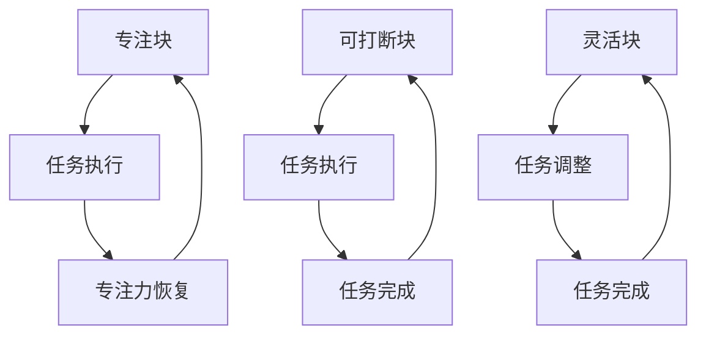

                 


## 文章标题

### 创业者的时间块工作法实践

> 关键词：创业者，时间管理，时间块工作法，效率提升，项目管理

> 摘要：
本文将探讨时间块工作法在创业者中的应用与实践。通过深入分析时间块工作法的原理、实施方法和在实际创业项目中的效果，帮助创业者提高时间管理能力，实现高效工作。

----------------------------------------------------------------

### 目录大纲 - 《创业者的时间块工作法实践》

1. **引言**
   - 创业者面临的时间管理挑战
   - 时间块工作法的提出与实践意义

2. **第一部分：时间块工作法概述**
   - **1.1 创业者的时间管理挑战**
     - 创业中的时间瓶颈
     - 时间块工作法的基本概念
     - 时间块工作法的重要性
   - **1.2 时间块工作法的原理**
     - 时间块工作法的基础理论
     - 时间块工作法的实践意义
     - 时间块工作法与传统时间管理方法的比较

3. **第二部分：时间块工作法的实施**
   - **2.1 制定时间块计划**
     - 评估个人时间资源
     - 设定时间块目标和范围
     - 设计时间块结构
   - **2.2 实施时间块工作法**
     - 确定个人时间块类型
     - 遵循时间块规则
     - 提高时间块效率
   - **2.3 调整与优化**
     - 监测时间块执行效果
     - 根据反馈调整时间块计划
     - 持续优化时间块工作法

4. **第三部分：时间块工作法在创业中的应用**
   - **3.1 时间块工作法在项目管理中的应用**
     - 项目时间规划
     - 项目时间块执行
     - 项目时间块的调整与优化
   - **3.2 时间块工作法在个人创业规划中的应用**
     - 创业者时间块规划
     - 创业者个人时间块管理
     - 创业者时间块效果评估
   - **3.3 时间块工作法在团队管理中的应用**
     - 团队时间块计划
     - 团队成员时间块协调
     - 团队时间块执行与反馈

5. **第四部分：时间块工作法案例研究**
   - **4.1 案例一：初创公司时间块管理实践**
     - 案例背景
     - 时间块计划制定
     - 案例执行与效果分析
   - **4.2 案例二：企业家个人时间管理实践**
     - 案例背景
     - 个人时间块规划
     - 案例执行与效果分析
   - **4.3 案例三：团队时间块协作实践**
     - 案例背景
     - 团队时间块计划
     - 案例执行与效果分析

6. **第五部分：时间块工作法的未来展望**
   - **5.1 时间块工作法的发展趋势**
     - 新技术对时间块工作法的影响
     - 时间块工作法与人工智能的结合
     - 未来时间管理模式的变革
   - **5.2 时间块工作法的优化方向**
     - 个性化时间块规划
     - 时间块工作法的智能化
     - 跨领域的时间块工作法应用

7. **附录**
   - **附录 A：时间块工作法工具推荐**
     - 时间块工作法应用软件
     - 时间块管理手册
     - 时间块工作法相关文献与资源

----------------------------------------------------------------

### 引言

#### 创业者面临的时间管理挑战

创业者是一个充满激情与挑战的角色。他们需要面对市场变化、团队管理、资源配置、客户关系等多方面的挑战。然而，在如此复杂的环境中，时间管理成为了一个至关重要的能力。有效的时间管理不仅能够提高工作效率，还能够帮助创业者更好地平衡工作与生活。

随着创业项目的推进，创业者往往会遇到以下时间管理挑战：

1. **任务繁多**：创业项目中涉及的任务繁多，从市场调研、产品开发、团队建设到客户服务等，每一项都需要大量的时间和精力。
2. **优先级不清**：在任务繁多的同时，创业者往往难以判断哪些任务是紧急且重要的，哪些任务可以推迟或放弃。
3. **时间碎片化**：随着科技的发展，各种即时通讯工具和社交媒体不断占用创业者的时间，导致时间碎片化，难以集中精力完成重要任务。
4. **资源有限**：创业者通常面临资源有限的情况，需要在有限的资源下最大化地利用时间。

#### 时间块工作法的提出与实践意义

面对这些挑战，时间块工作法应运而生。时间块工作法是一种将时间划分为不同区块，并针对不同区块进行高效任务管理的方法。这种方法的核心在于通过科学的时间划分，提高任务完成的效率和优先级。

时间块工作法的提出与实践具有重要意义：

1. **提高工作效率**：通过将时间划分为专注块、可打断块和灵活块，创业者能够更好地集中精力处理重要任务，提高工作效率。
2. **优化任务优先级**：时间块工作法帮助创业者明确任务的优先级，确保紧急且重要的任务得到优先处理。
3. **减少时间碎片化**：通过遵循时间块规则，创业者能够减少因即时通讯和社交媒体等干扰而造成的时间碎片化。
4. **资源优化配置**：通过合理安排时间块，创业者能够在有限的资源下，最大限度地利用时间，提高项目的成功率。

本文将深入探讨时间块工作法的原理、实施方法和在创业项目中的应用，帮助创业者更好地应对时间管理挑战，实现高效工作。

----------------------------------------------------------------

### 第一部分：时间块工作法概述

#### 1.1 创业者的时间管理挑战

在创业过程中，时间管理是一个不可忽视的重要问题。创业者往往需要在短时间内处理大量的任务，而这些任务之间又存在着不同的优先级和紧急程度。因此，如何有效地管理时间成为了一个关键的能力。

**时间瓶颈**是创业者面临的一个常见问题。时间瓶颈指的是由于时间分配不合理，导致某些任务无法在规定的时间内完成，从而影响整个项目的进度。时间瓶颈可能导致以下后果：

1. **任务积压**：由于时间瓶颈，一些任务可能会被拖延，导致任务积压，进一步加重创业者的工作压力。
2. **效率降低**：为了赶工期，创业者可能需要在短时间内处理大量任务，这会导致工作效率降低，甚至出现错误。
3. **团队士气受影响**：时间瓶颈可能导致团队士气下降，影响团队的协作效果。

**时间块工作法**是一种针对时间管理挑战的有效方法。时间块工作法的基本概念是将时间划分为多个小块，并为每个小块设定特定的任务或活动。这种方法的核心在于通过科学的时间划分，提高任务完成的效率和优先级。

时间块工作法的基本概念包括：

1. **专注块**：专注块是指用于处理重要且需要高度集中精力的任务的时段。在专注块中，创业者需要避免任何干扰，以确保能够集中精力完成任务。
2. **可打断块**：可打断块是指用于处理次要任务或可以被打断的时段。在可打断块中，创业者可以处理一些次要任务，例如回复邮件、参加会议等。
3. **灵活块**：灵活块是指用于处理灵活任务或不确定任务的时段。在灵活块中，创业者可以根据实际情况调整任务或活动。

时间块工作法的重要性体现在以下几个方面：

1. **提高工作效率**：通过将时间划分为专注块、可打断块和灵活块，创业者能够更好地集中精力处理重要任务，提高工作效率。
2. **优化任务优先级**：时间块工作法帮助创业者明确任务的优先级，确保紧急且重要的任务得到优先处理。
3. **减少时间碎片化**：通过遵循时间块规则，创业者能够减少因即时通讯和社交媒体等干扰而造成的时间碎片化。
4. **资源优化配置**：通过合理安排时间块，创业者能够在有限的资源下，最大限度地利用时间，提高项目的成功率。

#### 1.2 时间块工作法的原理

时间块工作法的原理是基于人类认知和时间管理的研究。根据心理学研究，人类在一段时间内能够保持专注和高效工作的能力是有限的。因此，通过将时间划分为小块，并针对不同小块设定不同的任务，可以有效地提高工作效率。

时间块工作法的基础理论包括以下几点：

1. **专注力管理**：专注力是人类在处理任务时的重要资源。时间块工作法通过将时间划分为专注块，帮助创业者保持专注，减少干扰，提高工作效率。
2. **优先级管理**：时间块工作法通过将时间划分为不同的块，帮助创业者明确任务的优先级，确保紧急且重要的任务得到优先处理。
3. **灵活调整**：时间块工作法允许创业者根据实际情况调整时间块，从而更好地应对不确定的任务或突发事件。

时间块工作法与传统时间管理方法的比较：

1. **优点**：
   - 提高工作效率：通过科学划分时间，时间块工作法能够帮助创业者更好地集中精力，提高工作效率。
   - 优化任务优先级：时间块工作法帮助创业者明确任务的优先级，确保紧急且重要的任务得到优先处理。
   - 减少时间碎片化：时间块工作法通过减少干扰，减少时间碎片化，提高工作时间质量。

2. **缺点**：
   - 初始设定难度：时间块工作法需要创业者对时间进行详细规划，这需要一定的时间和精力。
   - 需要自我约束：遵循时间块工作法需要创业者有较强的自我约束能力，避免干扰和拖延。

总的来说，时间块工作法是一种科学、有效的时间管理方法，适用于创业者等需要高效处理大量任务的人群。通过合理划分时间块，创业者可以更好地管理自己的时间，提高工作效率，实现创业目标。

----------------------------------------------------------------

#### 1.2 时间块工作法的原理

时间块工作法的原理基于对人类行为和时间利用的深入理解。其核心在于将时间划分为若干固定或可变的“块”，并针对每个时间块设定特定的任务或活动。这种方法的目的是为了提高专注度、优化任务优先级和减少时间碎片化，从而提升整体工作效率。

**时间块工作法的基础理论**：

1. **专注力管理**：
   根据心理学研究，人类的专注力是有限的，且会在短时间内耗尽。通过将工作时间划分为专注块，可以帮助个体在短时间内集中注意力，完成高优先级任务。这种方法能够有效减少外部干扰，提高工作质量。

2. **优先级管理**：
   时间块工作法通过预先设定的时间块，使个体能够清楚地识别并处理不同优先级的任务。在专注块中处理重要且紧急的任务，而在可打断块中处理次要或紧急程度较低的任务，从而确保关键任务得到优先处理。

3. **灵活调整**：
   时间块工作法允许个体根据实际需要调整时间块的设定。例如，在遇到突发事件或任务优先级变化时，可以灵活地调整时间块的内容或顺序，以确保工作计划能够适应动态变化。

**时间块工作法的实践意义**：

1. **提升工作效率**：
   通过专注块，个体能够在固定时间内保持高度的专注和效率，减少因频繁切换任务而导致的效率损失。此外，优先级管理有助于确保关键任务得到优先处理，避免时间浪费在次要任务上。

2. **优化时间利用**：
   通过科学划分时间块，个体可以更好地规划和管理自己的时间。这有助于减少时间的浪费，提高时间利用效率，使个体能够在有限的时间内完成更多的工作。

3. **减少时间碎片化**：
   时间块工作法通过减少任务切换的频率，减少时间碎片化。这有助于提高工作连续性和专注度，从而提升工作效率。

**时间块工作法与传统时间管理方法的比较**：

1. **传统时间管理方法**：
   - **优点**：简单易行，适用于日常生活中的时间管理。
   - **缺点**：缺乏对任务优先级的明确管理，容易导致时间浪费和效率低下。

2. **时间块工作法**：
   - **优点**：通过专注块和优先级管理，能够提高工作效率和时间利用效率，适用于需要高度集中精力和复杂任务处理的情况。
   - **缺点**：需要一定的时间进行规划和设定，对个体的自我约束力要求较高。

总体而言，时间块工作法是一种更为科学和系统的时间管理方法，适用于需要高效处理复杂任务的创业者。通过合理划分时间块，创业者可以更好地管理自己的时间，提高工作效率，实现创业目标。

### 1.3 时间块工作法的核心概念及其关系架构

时间块工作法包含三个核心概念：专注块、可打断块和灵活块。这些概念之间相互关联，共同构成了一个完整的时间管理框架。

**专注块**：

专注块是时间块工作法中最重要的组成部分。它是指用于处理重要且需要高度集中精力的任务的时段。在专注块中，个体需要排除所有干扰，集中所有注意力来完成指定任务。专注块的特点如下：

1. **高专注度**：在专注块中，个体能够保持高水平的专注，有效减少干扰，提高工作效率。
2. **固定时段**：专注块的时长可以根据个人情况设定，但通常建议保持在45分钟到60分钟之间，之后休息5到15分钟，以恢复专注力。
3. **任务明确**：在专注块中，个体需要明确任务的目标和范围，确保在有限的时间内能够集中精力完成任务。

**可打断块**：

可打断块是用于处理次要任务或可以被打断的任务的时段。在可打断块中，个体可以处理一些常规任务，例如回复邮件、参加会议等。可打断块的特点如下：

1. **灵活度**：可打断块的时间可以根据实际情况进行调整，但通常建议保持在一个小时左右。
2. **干扰容忍**：在可打断块中，个体需要设定一些容忍度，以应对突发的干扰或紧急情况。
3. **任务类型**：可打断块中的任务通常是次要的，不会对项目进度产生重大影响。

**灵活块**：

灵活块是用于处理灵活任务或不确定任务的时段。在灵活块中，个体可以根据实际情况调整任务或活动。灵活块的特点如下：

1. **适应性**：灵活块的时间可以根据个人需求和项目进度进行调整，确保能够适应各种情况。
2. **任务范围**：灵活块中的任务通常是临时的或不确定的，可能需要个体进行灵活的调整和应对。
3. **不确定性**：灵活块中的任务往往具有不确定性，需要个体具备较强的适应能力和应变能力。

**时间块工作法的整体架构**：

时间块工作法的整体架构如图所示：

```
[ 专注块 ] --> [ 可打断块 ] --> [ 灵活块 ]
```

其中，专注块位于时间块工作法的核心位置，可打断块和灵活块则围绕专注块进行补充和扩展。通过这种方式，时间块工作法能够帮助个体在不同的时间段内，以不同的方式处理不同的任务，从而实现高效的工作目标。

### Mermaid 流程图



通过以上流程图，可以清晰地看到时间块工作法中各个块之间的逻辑关系和执行顺序。通过合理划分和利用专注块、可打断块和灵活块，个体可以更好地管理自己的时间，提高工作效率。

### 时间块工作法的核心算法原理讲解

时间块工作法是一种通过将时间划分为若干固定或可变的时间块，并针对每个时间块执行特定任务的方法。其核心算法原理在于如何高效地将任务分配到不同的时间块，以及如何根据实际情况调整这些时间块。

下面将使用伪代码详细阐述时间块工作法的核心算法原理：

```python
# 初始化时间块工作法
def initialize_time_blocks():
    # 初始化专注块、可打断块和灵活块
    time_blocks = {
        'focused_blocks': [],
        'interruptible_blocks': [],
        'flexible_blocks': []
    }
    return time_blocks

# 添加时间块
def add_time_block(time_blocks, block_type, start_time, end_time, task=None):
    if block_type == 'focused':
        time_blocks['focused_blocks'].append({
            'start_time': start_time,
            'end_time': end_time,
            'task': task
        })
    elif block_type == 'interruptible':
        time_blocks['interruptible_blocks'].append({
            'start_time': start_time,
            'end_time': end_time,
            'task': task
        })
    elif block_type == 'flexible':
        time_blocks['flexible_blocks'].append({
            'start_time': start_time,
            'end_time': end_time,
            'task': task
        })

# 删除时间块
def remove_time_block(time_blocks, block_type, index):
    if block_type == 'focused':
        time_blocks['focused_blocks'].pop(index)
    elif block_type == 'interruptible':
        time_blocks['interruptible_blocks'].pop(index)
    elif block_type == 'flexible':
        time_blocks['flexible_blocks'].pop(index)

# 执行时间块
def execute_time_blocks(time_blocks):
    for block in time_blocks['focused_blocks']:
        execute_task(block['task'], block['start_time'], block['end_time'])
    for block in time_blocks['interruptible_blocks']:
        execute_task(block['task'], block['start_time'], block['end_time'])
    for block in time_blocks['flexible_blocks']:
        execute_task(block['task'], block['start_time'], block['end_time'])

# 执行任务
def execute_task(task, start_time, end_time):
    # 实现任务执行逻辑
    pass

# 调整时间块
def adjust_time_block(time_blocks, block_type, index, new_start_time, new_end_time):
    if block_type == 'focused':
        time_blocks['focused_blocks'][index]['start_time'] = new_start_time
        time_blocks['focused_blocks'][index]['end_time'] = new_end_time
    elif block_type == 'interruptible':
        time_blocks['interruptible_blocks'][index]['start_time'] = new_start_time
        time_blocks['interruptible_blocks'][index]['end_time'] = new_end_time
    elif block_type == 'flexible':
        time_blocks['flexible_blocks'][index]['start_time'] = new_start_time
        time_blocks['flexible_blocks'][index]['end_time'] = new_end_time

# 监控时间块执行效果
def monitor_time_block_effects(time_blocks):
    # 实现监控逻辑
    pass

# 根据反馈调整时间块计划
def adjust_time_blocks(time_blocks, feedback):
    # 实现根据反馈调整时间块计划逻辑
    pass
```

**核心算法原理详细讲解**：

1. **初始化时间块**：
   时间块工作法首先需要初始化不同类型的时间块，包括专注块、可打断块和灵活块。每个时间块都包含开始时间、结束时间和相关的任务。

2. **添加时间块**：
   根据个人计划和任务需求，将时间块添加到时间块列表中。每个时间块都可以指定具体的任务，例如专注块用于处理重要任务，可打断块用于处理次要任务，灵活块用于处理灵活任务。

3. **执行时间块**：
   按照预先设定的时间块列表，依次执行每个时间块中的任务。执行过程中需要确保任务按照计划进行，并在时间块结束时完成。

4. **调整时间块**：
   根据实际情况和任务进展，可以调整时间块的开始时间和结束时间。调整时间块需要考虑到任务的优先级和紧急程度，确保关键任务得到优先处理。

5. **监控时间块执行效果**：
   在执行时间块的过程中，需要持续监控任务进展和时间块的执行效果。这有助于及时发现并解决问题，确保任务能够按时完成。

6. **根据反馈调整时间块计划**：
   通过监控和反馈机制，根据实际情况对时间块计划进行调整。这有助于优化时间利用，提高工作效率。

通过以上伪代码和详细讲解，可以清晰地了解时间块工作法的核心算法原理。时间块工作法通过科学的时间划分和任务管理，帮助个体更好地利用时间，提高工作效率，实现工作目标。

### 时间块工作法在不同时间段内的应用策略

时间块工作法不仅适用于整体的时间管理，还可以根据不同时间段的特点进行灵活调整和应用。以下是时间块工作法在不同时间段内的应用策略：

**早上时间段的应用策略**：

- **起床后的专注块**：早上起床后的30分钟到1小时内，可以设定为一个专注块。这个时间段内，可以进行晨间反思、规划一天的任务，或者阅读重要文件。避免在这个时间段内处理容易被打扰的任务。
- **早餐时间的可打断块**：早餐时间可以设定为可打断块，用于处理一些不太重要但需要完成的任务，如回复邮件、查看信息等。这段时间内尽量保持轻松，避免精神紧张。

**上午时间段的应用策略**：

- **专注块**：上午是工作效率较高的时间段，适合进行高优先级的任务。可以将上午划分为1-2个专注块，用于处理重要项目或紧急任务。
- **可打断块**：在专注块之间，可以设定可打断块，用于处理次要任务或临时事项。这有助于保持工作节奏，避免任务积压。

**下午时间段的应用策略**：

- **专注块**：下午的工作时间同样适合进行专注块，用于处理剩余的重要任务或需要集中精力的工作。下午的专注块可以根据个人习惯和工作安排灵活调整。
- **灵活块**：下午的尾段时间可以设定为灵活块，用于处理一些不确定的任务或突发事件。这段时间内可以灵活安排任务，确保能够应对各种情况。

**晚上时间段的应用策略**：

- **可打断块**：晚上的时间段相对较为灵活，可以设定为可打断块，用于处理一些次要任务或个人事务。避免在晚上进行高强度的任务，以免影响休息。
- **灵活块**：如果晚上有自由时间，可以设定为灵活块，用于进行个人兴趣活动或家庭时间。这有助于缓解工作压力，保持良好的生活平衡。

**周末时间段的应用策略**：

- **专注块**：周末可以设定一些专注块，用于处理需要深度思考的项目或个人规划。这段时间内尽量减少外部干扰，确保能够集中精力完成任务。
- **灵活块**：周末的灵活块可以用于处理一些轻松的任务，如阅读、学习新技能等。此外，可以安排一些个人兴趣活动，如运动、旅行等，以保持生活平衡。

通过在不同时间段内灵活应用时间块工作法，创业者可以更好地管理自己的时间，提高工作效率，同时保持良好的生活平衡。这种方法有助于确保任务按时完成，同时也能够享受工作和生活的乐趣。

### 2.1 制定时间块计划

#### 2.1.1 评估个人时间资源

制定有效的时间块计划的第一步是评估个人时间资源。这包括了解自己每天可用的时间总量，以及这些时间在不同时间段内的分布情况。以下是一些具体的步骤和方法：

1. **记录日常活动**：
   开始记录每天的活动和所花费的时间，这有助于了解自己的时间使用模式。可以使用传统的日志记录方法，或者使用一些时间跟踪应用程序，如Toggl、RescueTime等。这些工具能够自动记录你在不同应用程序和网站上的活动，并提供详细的时间使用报告。

2. **识别时间浪费**：
   在记录活动的同时，注意识别时间浪费的环节。这些环节可能包括无意义的网络浏览、社交媒体浏览、不必要的会议等。通过识别这些时间浪费点，可以更合理地规划时间块。

3. **分析时间分布**：
   将记录的活动时间进行分类和统计，分析每天的时间分布。例如，确定哪些时间段是最忙碌的，哪些时间段是最空闲的。这将有助于确定哪些时间段适合设定专注块，哪些时间段适合设定可打断块。

4. **确定优先级**：
   根据任务的紧急程度和重要性，确定哪些任务需要优先处理。这有助于在时间块计划中为高优先级的任务预留足够的时间。

5. **考虑固定活动**：
   考虑每天必须进行的固定活动，如通勤时间、午餐时间、家庭活动等。这些固定活动会影响时间块的划分，需要在计划中进行合理安排。

通过以上步骤，创业者可以全面了解自己的时间资源，为制定合理的时间块计划提供基础。

#### 2.1.2 设定时间块目标和范围

在评估个人时间资源的基础上，接下来需要设定时间块的目标和范围。以下是一些关键步骤和方法：

1. **确定时间块类型**：
   根据个人时间和任务需求，将时间块划分为专注块、可打断块和灵活块。每种类型的块有不同的用途和执行规则。
   - **专注块**：用于处理重要且需要高度集中精力的任务，如项目开发、策略规划等。
   - **可打断块**：用于处理次要任务或可以被打断的任务，如回复邮件、参加会议等。
   - **灵活块**：用于处理不确定任务或临时任务，如处理突发事件、个人兴趣活动等。

2. **设定时间块长度**：
   根据个人习惯和工作需求，设定每个时间块的长度。一般来说，专注块建议在45分钟到60分钟之间，可打断块在1小时左右，灵活块则没有固定时长，可以根据实际情况灵活调整。

3. **分配时间块**：
   将每个时间块分配到具体的时段，确保在一天中不同时间段内都有合适的块类型。例如，可以将早上和下午的时段划分为专注块，下午的尾段时间划分为可打断块，晚上的时间段划分为灵活块。

4. **设定时间块目标**：
   为每个时间块设定具体的目标。这些目标可以是任务完成的具体指标，如完成某个功能模块的开发、撰写一份报告等。明确的目标有助于提高时间块的工作效率。

5. **预留缓冲时间**：
   在时间块计划中预留一定的缓冲时间，用于应对突发情况和时间块的调整。例如，在两个专注块之间可以预留10到15分钟的缓冲时间，以应对临时任务或休息需求。

通过设定明确的时间块目标和范围，创业者可以更好地规划和管理时间，确保每个时间段都有明确的目标和任务。

#### 2.1.3 设计时间块结构

设计时间块结构是制定时间块计划的关键步骤，它涉及到如何将不同类型的时间块合理地组合，以实现高效的时间管理。以下是具体的步骤和方法：

1. **优先级排序**：
   根据任务的紧急程度和重要性，对任务进行优先级排序。高优先级的任务应优先安排在专注块中，以确保得到足够的关注和资源。

2. **任务分配**：
   将排序后的任务分配到对应的时间块中。对于需要高度集中精力的任务，应安排在专注块内；对于次要任务或可以被打断的任务，应安排在可打断块内；对于不确定的任务或临时任务，应安排在灵活块内。

3. **合理分配时间**：
   根据每天的时间分布和任务需求，合理分配每个时间块的时间。例如，可以将早上和下午的黄金时间段用于专注块，而将午后的时间段用于可打断块；晚上的时间段则可以用于灵活块。

4. **保持灵活性**：
   在设计时间块结构时，应考虑到不可预见的情况和突发任务。因此，在计划中预留一些灵活的时间块，以应对紧急情况或任务调整。

5. **定期审查**：
   设计完成后，定期审查和调整时间块结构，确保计划与实际情况相符。可以根据反馈和实际执行情况，优化时间块的结构和任务分配。

6. **使用可视化工具**：
   使用可视化工具，如日历、Gantt图或时间线图，可以帮助直观地展示时间块结构，便于调整和优化。

通过合理设计时间块结构，创业者可以更有效地管理时间，确保任务得到高效完成。

### 2.2 实施时间块工作法

#### 2.2.1 确定个人时间块类型

在实施时间块工作法时，确定个人时间块的类型是关键步骤。这涉及到如何根据不同的任务和时间段，合理划分专注块、可打断块和灵活块。以下是具体的实施步骤和方法：

1. **评估任务需求**：
   首先，需要了解每个任务的需求，包括任务的紧急程度、重要性和所需的专注度。这将帮助确定任务应被分配到哪种类型的时间块中。
   - **高紧急且重要任务**：这些任务通常需要被安排在专注块中，以确保在最高效的时间内完成。
   - **中等紧急或重要任务**：这类任务可以根据情况分配到可打断块或灵活块中，以便在不太紧急的时间内处理。
   - **非紧急或次要任务**：这些任务适合在可打断块或灵活块中处理，可以在相对自由的时间段内进行。

2. **考虑时间段特点**：
   考虑一天中不同时间段的特点，有助于确定哪些时间段适合哪些类型的时间块。
   - **早晨**：早晨通常是注意力较高的时间段，适合进行专注块，用于处理重要任务。
   - **上午**：上午的时间段也可以设定为专注块，用于完成优先级较高的任务。
   - **午后**：午后的时间段可以设定为可打断块，用于处理一些次要任务或安排会议。
   - **傍晚**：傍晚的时间段适合设定为灵活块，用于处理不确定的任务或个人活动。

3. **确定时间块类型**：
   根据任务需求和时间段特点，确定每个时间块的类型。
   - **专注块**：用于处理高紧急且重要的任务，需要在高度集中精力的状态下完成。
   - **可打断块**：用于处理次要任务或可以被打断的任务，适合在分散注意力的状态下完成。
   - **灵活块**：用于处理不确定的任务或临时任务，需要在灵活安排时间的情况下完成。

4. **设定时间块规则**：
   为每个时间块设定明确的规则，以确保在执行过程中能够保持高效和专注。
   - **专注块规则**：在专注块内，避免任何形式的干扰，确保高度集中精力。可以设定“不接收任何通知”、“不处理任何临时任务”等规则。
   - **可打断块规则**：在可打断块内，可以处理一些次要任务，但需要设定处理时间上限，以避免任务占用过多时间。
   - **灵活块规则**：在灵活块内，可以根据实际情况调整任务或活动，但需要保持一定的灵活性，以应对突发事件。

通过以上步骤，创业者可以更有效地确定个人时间块类型，并制定出合理的时间块计划，确保在执行过程中能够高效地管理时间和任务。

#### 2.2.2 遵循时间块规则

在实施时间块工作法的过程中，遵循时间块规则是确保时间管理有效性的关键。以下是一些具体的规则和建议，帮助创业者更好地遵循时间块工作法：

1. **专注块规则**：
   - **设定无干扰环境**：在进行专注块时，选择一个安静的环境，减少外界干扰。关闭不必要的通知，如电子邮件、社交媒体等。
   - **集中精力完成任务**：在专注块期间，将全部精力集中在当前任务上，避免分心或处理其他事务。
   - **设定明确的任务目标**：在开始专注块之前，明确任务的目标和范围，确保在规定时间内能够高效地完成任务。

2. **可打断块规则**：
   - **设定处理时间**：在可打断块期间，为每个任务设定明确的时间处理上限，避免任务占用过多时间。
   - **处理次要任务**：在可打断块中，优先处理一些次要任务，如回复邮件、参加会议等，但避免处理复杂或需要高度集中的任务。
   - **避免长时间连续处理**：在可打断块之间，可以设定短暂的休息时间，以缓解疲劳和提高后续工作的效率。

3. **灵活块规则**：
   - **保持灵活性**：在灵活块中，可以处理不确定的任务或临时任务，但需要根据实际情况进行调整。
   - **设定优先级**：在灵活块中，根据任务的紧急程度和重要性，设定任务的优先级，确保关键任务得到优先处理。
   - **适当调整时间块**：在执行灵活块时，可以根据实际情况调整时间块，以应对突发事件或任务变化。

4. **整体遵循规则**：
   - **遵守计划**：始终遵循预先设定的时间块计划，确保每个任务都能在规定的时间内完成。
   - **反馈与调整**：在时间块执行过程中，及时反馈并调整时间块计划，以优化时间管理和任务执行。
   - **持续改进**：根据执行效果，不断改进时间块规则，提高工作效率和时间利用率。

通过遵循以上规则，创业者可以更好地实施时间块工作法，提高工作效率和时间管理能力，确保任务按时完成。

#### 2.2.3 提高时间块效率

提高时间块效率是实施时间块工作法的核心目标之一。以下是一些具体的策略和方法，帮助创业者有效提高时间块的工作效率：

1. **合理分配任务**：
   - **优先处理重要任务**：将高优先级的任务安排在专注块中，以确保在最高效的时间内完成这些任务。
   - **合理分配任务时长**：根据任务的复杂程度和所需专注度，合理分配每个时间块的任务时长，避免任务过于繁重或过于简单。

2. **减少干扰**：
   - **设定无干扰环境**：在进行专注块时，选择一个安静的环境，关闭不必要的通知和干扰源，如手机、社交媒体等。
   - **专注时段通知管理**：提前告知团队成员和合作伙伴在专注块期间避免打扰，确保专注工作的连续性。

3. **优化工作流程**：
   - **简化任务流程**：对复杂任务进行分解，简化工作流程，减少不必要的步骤，以提高任务执行效率。
   - **自动化和工具支持**：利用工具和自动化技术，减少重复性工作，提高工作效率。例如，使用项目管理工具、自动化工具等。

4. **定期休息**：
   - **设置休息周期**：在长时间工作后，适当安排休息时间，以缓解疲劳和提高工作效率。
   - **进行短暂的恢复活动**：在专注块之间或长时间工作后，进行短暂的恢复活动，如散步、深呼吸等，帮助恢复精力。

5. **持续反馈和调整**：
   - **定期评估**：定期评估时间块执行效果，识别效率低下的环节，及时进行调整和优化。
   - **收集反馈**：从团队成员和合作伙伴那里收集反馈，了解任务执行过程中存在的问题，并据此调整时间块计划。

通过实施以上策略，创业者可以有效提高时间块的工作效率，确保在有限的时间内完成更多任务，实现高效的工作目标。

### 2.3 调整与优化

#### 2.3.1 监测时间块执行效果

在实施时间块工作法的过程中，监测时间块的执行效果是确保其有效性的关键。以下是一些具体的监测方法和步骤：

1. **数据收集**：
   收集与时间块执行相关的数据，如任务完成情况、时间使用情况、工作效率等。这些数据可以通过时间跟踪工具、日志记录等方式获取。

2. **定期评估**：
   定期对时间块执行效果进行评估，例如每周或每月进行一次全面回顾。通过对比实际执行情况与预定计划，了解时间块工作的效果。

3. **识别问题**：
   分析数据，识别时间块执行过程中存在的问题。例如，某些时间块是否经常被延误，某些任务是否过于繁重等。

4. **记录反馈**：
   记录团队成员和合作伙伴的反馈，了解他们对时间块工作的看法和建议。这些反馈有助于发现潜在的问题和改进点。

5. **分析效果**：
   对收集到的数据进行详细分析，识别时间块工作的优势和不足。通过分析，确定哪些时间块设置合理，哪些需要调整。

通过以上步骤，创业者可以全面了解时间块的执行效果，为后续的调整和优化提供依据。

#### 2.3.2 根据反馈调整时间块计划

根据监测结果和收集到的反馈，调整时间块计划是优化时间管理的重要步骤。以下是一些具体的调整方法和步骤：

1. **重新评估任务优先级**：
   根据实际执行情况和反馈，重新评估任务的优先级。确保高优先级的任务能够得到优先处理，避免因低优先级任务占用过多时间。

2. **优化时间块分配**：
   根据任务的实际情况，调整时间块的分配。例如，将一些频繁延误的时间块重新安排到更合适的时间段，或缩短某些时间块以减少工作量。

3. **调整时间块类型**：
   根据任务需求和团队成员的工作习惯，调整时间块的类型。例如，将一些需要高度集中精力的任务调整到专注块，将一些次要任务调整到可打断块。

4. **改进规则设定**：
   根据反馈，改进时间块规则设定。例如，为某些时间块增加缓冲时间，以应对突发情况；或为其他时间块设定更严格的规则，以减少干扰。

5. **定期回顾和调整**：
   定期回顾时间块计划的执行情况，根据新的反馈和实际情况，持续进行调整和优化。确保时间块计划始终与实际工作需求相符。

通过以上步骤，创业者可以不断优化时间块计划，提高时间管理的效率和效果。

#### 2.3.3 持续优化时间块工作法

持续优化时间块工作法是确保其长期有效性的关键。以下是一些具体的策略和方法：

1. **定期评估和反馈**：
   定期对时间块工作法的实施效果进行评估，收集团队成员的反馈。通过评估和反馈，识别优势和不足，为持续优化提供依据。

2. **灵活调整和改进**：
   根据评估结果和反馈，灵活调整时间块计划。不断改进规则设定和工作流程，以适应变化的工作环境和任务需求。

3. **引入新技术和工具**：
   利用新技术和工具，提高时间块工作的效率和准确性。例如，使用项目管理软件、自动化工具等，减少手动操作，提高工作效率。

4. **培训和提高意识**：
   对团队成员进行培训，提高他们对时间块工作法的认识和掌握度。同时，加强团队时间管理意识，确保时间块工作法能够得到有效执行。

5. **持续学习和改进**：
   不断学习和研究时间管理的新理论和方法，结合实际工作情况进行改进。通过持续学习和改进，不断提高时间块工作法的有效性。

通过以上策略，创业者可以确保时间块工作法的长期有效性和持续优化。

### 第三部分：时间块工作法在创业中的应用

#### 3.1 时间块工作法在项目管理中的应用

在项目管理中，时间块工作法提供了一种科学且系统的方法，以优化项目时间管理，确保项目按时完成并达到预期目标。以下是时间块工作法在项目管理中应用的详细步骤：

**项目时间规划**：

1. **需求分析**：
   在项目启动阶段，对项目需求进行详细分析，明确项目目标、任务和里程碑。这一步骤有助于确定项目的整体时间需求和关键节点。

2. **任务分解**：
   将项目任务分解为更细小的子任务，为每个子任务分配负责人和时间估算。任务分解有助于明确任务的责任，并为后续的时间块规划提供基础。

3. **时间块规划**：
   根据任务分解结果，将项目任务分配到不同的时间块中。通常可以分为以下几类时间块：
   - **启动块**：用于项目启动和初始规划，确保项目团队对项目目标和计划有清晰的理解。
   - **开发块**：用于开发阶段的核心任务，如编码、设计和测试等。
   - **测试块**：用于测试和验证阶段，确保项目产品达到预期质量标准。
   - **部署块**：用于部署和上线阶段，确保项目产品顺利交付给客户。

**项目时间块执行**：

1. **专注块执行**：
   在专注块期间，团队成员应集中精力完成指定任务。项目管理团队需要确保在专注块期间，团队成员不受外部干扰，能够高效地完成工作。

2. **可打断块执行**：
   在可打断块期间，团队成员可以处理一些次要任务，如回复邮件、参加会议等。但需确保这些任务不会影响专注块的执行进度。

3. **灵活块执行**：
   在灵活块期间，可以处理一些不确定的任务或突发事件。团队需要灵活调整任务和活动，确保项目能够顺利推进。

**项目时间块的调整与优化**：

1. **定期回顾**：
   定期对项目进度和时间块执行效果进行回顾，识别存在的问题和瓶颈。通过回顾，确保项目能够及时调整和优化时间块计划。

2. **反馈调整**：
   根据团队成员和客户的反馈，调整时间块计划。例如，如果发现某个任务时间估算不准确，需要重新规划并调整时间块。

3. **持续优化**：
   通过持续优化时间块计划，提高项目时间管理的效率和准确性。例如，引入新的项目管理工具、改进工作流程等。

通过科学规划和有效执行时间块工作法，创业者可以更好地管理项目时间，确保项目按时、按质完成。

#### 3.2 时间块工作法在个人创业规划中的应用

在个人创业规划中，时间块工作法是一种极其有效的工具，能够帮助创业者合理安排时间，提高工作效率，确保创业目标的顺利实现。以下是时间块工作法在个人创业规划中应用的详细步骤：

**创业者时间块规划**：

1. **明确目标与任务**：
   在开始制定时间块计划之前，创业者需要明确自己的创业目标，并将这些目标细化为具体的任务。例如，如果目标是开发一款新产品，那么任务可能包括市场调研、产品设计、开发测试和产品发布等。

2. **评估时间资源**：
   根据个人可用时间和任务需求，评估自己的时间资源。了解每天的具体时间段内可以分配多少时间用于创业活动，包括专注块、可打断块和灵活块的时间分配。

3. **制定时间块计划**：
   根据任务和时间的评估结果，制定时间块计划。创业者可以按照以下类别设置时间块：
   - **专注块**：用于处理关键任务，如产品开发、市场分析等，需要高度集中精力的工作。
   - **可打断块**：用于处理次要任务，如回复邮件、参加会议等，可以在一定程度上被打扰的工作。
   - **灵活块**：用于处理突发任务或个人事务，如与合作伙伴的沟通、个人学习等。

**创业者个人时间块管理**：

1. **遵循时间块规则**：
   在执行时间块计划时，创业者需要严格遵循时间块规则，确保每个时间块内的工作能够高效完成。例如，在专注块期间，避免接收无关的通知和干扰，确保高度集中精力。

2. **定期监控**：
   定期监控时间块的执行效果，确保任务按时完成。可以使用时间跟踪工具记录每个时间块的实际执行情况，与计划进行对比，及时发现问题并调整。

3. **灵活调整**：
   根据实际情况和任务进展，灵活调整时间块计划。如果某个任务需要更多时间，可以适当调整其他时间块，确保整体计划的合理性。

**创业者时间块效果评估**：

1. **任务完成情况**：
   评估每个时间块内任务的完成情况，确保关键任务得到优先处理，次要任务不影响整体进度。

2. **时间利用率**：
   分析时间块的实际使用情况，确保时间得到最大化利用，避免时间浪费。

3. **反馈与优化**：
   收集团队成员和合作伙伴的反馈，了解时间块计划的实际效果，根据反馈进行优化。例如，如果发现某个时间块经常延误，可以重新规划任务和时间分配。

通过以上步骤，创业者可以有效地利用时间块工作法，提高个人创业规划的时间管理能力，确保创业目标的顺利实现。

#### 3.3 时间块工作法在团队管理中的应用

在团队管理中，时间块工作法是一种有效的方法，可以帮助团队领导者合理安排团队成员的工作时间，提高团队工作效率，确保项目目标的达成。以下是时间块工作法在团队管理中应用的详细步骤：

**团队时间块计划**：

1. **任务分解**：
   首先需要对项目任务进行详细分解，明确每个团队成员的责任和工作内容。将项目任务划分为多个细小的子任务，并为每个子任务设定负责人和截止日期。

2. **时间资源评估**：
   对团队成员的时间资源进行评估，了解每个成员每天可用的时间总量，以及这些时间在不同时间段内的分布情况。这有助于为每个团队成员合理分配时间块。

3. **设定时间块类型**：
   根据团队成员的任务需求和时间段特点，设定不同类型的时间块。例如，可以将某些成员的专注块用于处理重要任务，将其他成员的时间块用于处理次要任务或团队协作活动。

4. **分配时间块**：
   将每个时间块分配到具体的团队成员和任务中。确保每个时间块都有明确的任务和责任人，避免任务重叠或时间浪费。

**团队成员时间块协调**：

1. **沟通与协商**：
   团队成员之间需要保持良好的沟通，确保每个时间块的计划和任务都清晰明确。在制定时间块计划时，团队成员可以共同讨论并协商，确保时间块能够合理分配。

2. **任务协调**：
   对于需要多人协作的任务，团队领导者需要确保不同成员的时间块能够相互协调，避免任务冲突或时间浪费。可以采用甘特图或时间线图等方式，直观展示团队成员的时间块计划，确保任务协调。

3. **灵活调整**：
   在执行时间块计划时，团队领导者需要保持灵活性，根据实际情况和任务进展，及时调整时间块计划。例如，如果某个任务需要更多时间，可以适当调整其他时间块，确保整体计划不变。

**团队时间块执行与反馈**：

1. **执行监控**：
   团队领导者需要定期监控时间块的执行情况，确保每个任务都能按时完成。可以采用时间跟踪工具或每日站会等方式，了解团队成员的工作进展和问题。

2. **反馈机制**：
   建立反馈机制，定期收集团队成员对时间块计划的反馈。了解团队成员的工作体验和效果，根据反馈进行优化和调整。

3. **效果评估**：
   定期评估时间块计划的执行效果，确保团队的工作效率和质量。通过对比实际执行情况与预定计划，识别优势和不足，为下一阶段的时间块计划提供改进方向。

通过以上步骤，团队领导者可以有效地应用时间块工作法，提高团队的工作效率和协作能力，确保项目目标的顺利实现。

### 第四部分：时间块工作法案例研究

#### 4.1 案例一：初创公司时间块管理实践

**案例背景**：

某初创公司成立于2022年，专注于开发一款基于人工智能的客户关系管理（CRM）软件。公司由5名核心成员组成，包括一名CEO、一名CTO、一名产品经理、一名设计师和两名工程师。公司初期面临的主要挑战是如何在资源有限的情况下，高效地推进项目进度，确保产品按时发布。

**时间块计划制定**：

1. **需求分析**：
   项目启动阶段，CEO与产品经理共同分析了市场需求和用户需求，明确了产品的核心功能和用户故事。基于这些信息，确定了项目的关键任务和时间节点。

2. **任务分解**：
   产品经理将项目任务细分为市场调研、产品设计、前端开发、后端开发和测试等子任务。每个子任务都分配了具体的负责人和完成时间。

3. **时间块规划**：
   团队根据每个成员的时间资源和工作任务，制定了时间块计划。每天早上9点到11点设定为专注块，用于核心开发任务；下午3点到5点设定为可打断块，用于处理次要任务和团队协作；晚上7点到9点设定为灵活块，用于个人学习和团队会议。

**案例执行与效果分析**：

1. **专注块执行**：
   在专注块期间，工程师们集中精力进行编码和测试，确保开发任务的按时完成。CEO和产品经理则在专注块期间专注于产品规划和需求沟通，有效避免了外部干扰。

2. **可打断块执行**：
   在可打断块期间，团队成员处理了一些次要任务，如回复客户邮件、与供应商沟通等。由于有明确的任务时间限制，团队成员能够高效地完成任务，避免了时间浪费。

3. **灵活块执行**：
   在灵活块期间，团队成员参加了一些团队会议和个人学习活动。例如，工程师们参加了一些编程培训课程，设计师则参加了用户体验设计的研讨会。这些活动不仅提高了团队成员的专业技能，也增强了团队的协作能力。

**效果分析**：

- **任务完成情况**：通过时间块工作法，团队成员能够更好地管理自己的时间，确保核心开发任务按时完成。在项目开发阶段，所有预定任务均在规定时间内完成。

- **工作效率提升**：时间块工作法有助于团队成员在专注块内集中精力，提高工作效率。通过避免频繁的任务切换，团队成员能够在短时间内完成更多工作。

- **团队协作增强**：在可打断块和灵活块期间，团队成员有机会进行更多协作和交流，增强了团队凝聚力。团队成员之间的沟通更加顺畅，工作效率显著提升。

**案例小结**：

通过实施时间块工作法，该初创公司成功地在资源有限的情况下，高效地完成了项目开发任务。时间块工作法帮助团队成员更好地管理时间，提高了工作效率，确保了项目的顺利推进。

#### 4.2 案例二：企业家个人时间管理实践

**案例背景**：

李先生是一名资深企业家，拥有多家成功创业公司。他的日常事务繁多，包括公司运营、战略规划、客户关系维护以及个人学习。李先生意识到，如果不进行有效的时间管理，他将无法平衡工作与生活，也难以持续推动公司的发展。

**个人时间块规划**：

1. **明确目标与任务**：
   李先生首先明确了自己的长期和短期目标。长期目标包括公司的战略发展、个人品牌建设；短期目标则包括每天需要处理的重要邮件、重要会议、学习任务等。

2. **评估时间资源**：
   李先生对自己每天的时间进行了详细评估，发现每天有8小时可用于工作，另有2小时可用于个人学习和休闲。

3. **设定时间块**：
   李先生根据自己的任务和时间资源，设定了以下时间块：
   - **专注块**（每天早上8:00-10:00）：用于处理最重要的任务，如关键决策、重要会议和策略规划。
   - **可打断块**（每天上午10:30-12:00和下午2:00-3:30）：用于处理次要任务，如回复邮件、电话沟通和日常管理。
   - **灵活块**（每天下午4:00-6:00）：用于处理不确定任务或个人兴趣活动，如阅读、运动或与朋友聚会。

**案例执行与效果分析**：

1. **专注块执行**：
   在专注块期间，李先生确保自己处于一个安静且无干扰的环境中。他关闭了手机通知，专注于处理当天最重要的任务。通过这种方式，他能够更高效地做出关键决策，推动公司发展。

2. **可打断块执行**：
   在可打断块期间，李先生处理了一些次要任务，但他会设定一个明确的时间上限，避免这些任务占用过多时间。通过这种方式，他能够确保重要任务得到优先处理，同时也满足了日常管理需求。

3. **灵活块执行**：
   在灵活块期间，李先生会安排一些个人兴趣活动，如阅读、运动或与朋友聚会。这有助于他放松身心，恢复精力，为接下来的工作做好准备。

**效果分析**：

- **时间管理能力提升**：通过时间块工作法，李先生能够更好地管理自己的时间，确保每个任务都能得到合理的分配和执行。
- **工作效率提高**：在专注块期间，李先生能够集中精力处理最重要的任务，从而提高了整体工作效率。
- **工作与生活平衡**：通过在灵活块中安排个人兴趣活动，李先生能够在繁忙的工作中找到放松和平衡，保持良好的身心健康。

**案例小结**：

李先生通过实施时间块工作法，成功提高了个人时间管理能力，实现了高效工作与生活的平衡。这种方法不仅帮助他更好地管理日常事务，还提高了整体工作效率，为公司的持续发展奠定了坚实基础。

#### 4.3 案例三：团队时间块协作实践

**案例背景**：

某科技公司由10名成员组成，包括项目经理、开发工程师、测试工程师和产品经理等。公司正在开发一款智能家居设备，需要在短时间内完成产品设计和开发。由于团队成员分布在不同的时区，如何高效协调和管理工作成为一大挑战。

**团队时间块计划**：

1. **确定共同工作时间**：
   团队首先确定了每天的两个共同工作时间段，分别为早上10:00-12:00和下午3:00-5:00。这两个时间段被设定为专注块和可打断块，用于处理重要任务和次要任务。

2. **任务分配与时间块设定**：
   项目经理将项目任务分解为多个子任务，并分配给各个团队成员。根据任务需求和成员的时间资源，设定了以下时间块：
   - **项目经理的专注块**（每天早上10:00-12:00）：用于项目规划和协调。
   - **开发工程师的专注块**（每天下午3:00-5:00）：用于编写代码和解决技术问题。
   - **测试工程师的专注块**（每天下午3:00-5:00）：用于进行测试和调试。
   - **产品经理的可打断块**（每天早上10:00-12:00）：用于处理市场调研和客户反馈。

**案例执行与效果分析**：

1. **专注块执行**：
   在专注块期间，团队成员集中精力处理各自的任务。项目经理负责项目协调，开发工程师专注于编码，测试工程师则专注于测试工作。这种集中精力的方式有效提高了工作效率。

2. **可打断块执行**：
   在可打断块期间，团队成员处理一些次要任务，如回复邮件、参加团队会议和客户沟通等。由于有明确的任务时间限制，团队成员能够高效地完成任务，避免了时间浪费。

3. **跨时区协作**：
   由于团队成员分布在不同的时区，团队采用了协作工具如Zoom、Slack和Trello，确保实时沟通和任务跟进。在共同工作时间段内，团队成员通过视频会议和即时消息保持紧密联系，确保工作进度和协调。

**效果分析**：

- **工作效率提升**：通过时间块工作法，团队成员能够在专注块内集中精力，提高了任务完成速度。
- **任务协调增强**：通过共同工作时间段和明确的任务分配，团队成员能够更好地协调工作，确保任务按时完成。
- **跨时区协作顺畅**：通过使用协作工具，团队成员能够在不同时区间保持高效沟通和协作，克服了时区差异带来的挑战。

**案例小结**：

通过实施时间块工作法，该科技公司的团队能够在跨时区协作中保持高效工作。时间块计划帮助团队成员更好地管理时间，提高了工作效率，确保了项目的顺利推进。

### 第五部分：时间块工作法的未来展望

#### 5.1 时间块工作法的发展趋势

随着科技的不断进步和人们对时间管理需求的增加，时间块工作法在未来将迎来一系列发展变化。以下是一些可能的发展趋势：

1. **新技术的影响**：
   - **人工智能**：人工智能技术的进步将为时间块工作法带来革命性的变化。例如，通过智能算法，系统可以自动为用户推荐最佳的时间块安排，根据个人习惯和任务需求，优化时间分配。
   - **大数据分析**：大数据分析技术可以帮助用户更准确地了解自己的时间使用模式，从而更有效地制定和调整时间块计划。
   - **可穿戴设备**：可穿戴设备的普及，如智能手表和健康追踪器，可以实时监测用户的生理状态和工作效率，为时间块工作法提供更精准的数据支持。

2. **时间块工作法与人工智能的结合**：
   - **智能助手**：未来的智能助手将能够理解用户的时间需求和偏好，自动为用户安排时间块，并提供实时提醒和反馈。
   - **个性化推荐**：通过分析用户的历史数据和行为模式，智能系统可以提供个性化的时间块推荐，帮助用户更好地管理时间。

3. **未来时间管理模式的变革**：
   - **灵活工作制**：随着远程工作和灵活工作制的普及，时间块工作法将更加适应这种工作模式。人们可以更灵活地安排自己的工作时间，实现工作和生活的平衡。
   - **时间块协作**：在团队协作中，时间块工作法将帮助团队成员更有效地协调时间，提高协作效率。

#### 5.2 时间块工作法的优化方向

为了更好地适应未来的发展趋势，时间块工作法需要不断优化和改进。以下是一些可能的优化方向：

1. **个性化时间块规划**：
   - **用户行为分析**：通过分析用户的行为数据，系统可以更好地了解用户的时间偏好和任务需求，为用户提供个性化的时间块规划。
   - **自适应调整**：系统可以根据用户的反馈和工作进展，自动调整时间块计划，以适应不断变化的工作环境。

2. **时间块工作法的智能化**：
   - **智能推荐系统**：通过引入机器学习和推荐算法，系统可以自动为用户推荐最佳的时间块安排，提高时间管理的效率。
   - **实时反馈与调整**：系统可以实时监测时间块的执行效果，并根据用户的反馈和工作进展，动态调整时间块计划。

3. **跨领域的时间块工作法应用**：
   - **教育领域**：在教育领域，时间块工作法可以帮助学生更有效地管理学习时间，提高学习效率。
   - **医疗保健**：在医疗保健领域，时间块工作法可以帮助患者更好地管理康复时间和医疗计划。
   - **企业协作**：在企业协作中，时间块工作法可以帮助团队更有效地协调时间和任务，提高团队工作效率。

通过以上优化方向，时间块工作法将能够更好地适应未来的发展需求，为用户提供更加高效、智能和个性化的时间管理体验。

### 附录

#### 附录 A：时间块工作法工具推荐

**时间块工作法应用软件**：

1. **Toggl**：
   - 特点：时间跟踪和项目管理工作
   - 优点：用户界面友好，支持多平台，能够帮助用户追踪时间块，分析时间使用情况。
   - 链接：[https://toggl.com/](https://toggl.com/)

2. **RescueTime**：
   - 特点：自动时间跟踪和生产力分析
   - 优点：能够自动记录用户在电脑和手机上的活动，提供详细的时间使用报告，帮助用户优化时间管理。
   - 链接：[https://www.rescuetime.com/](https://www.rescuetime.com/)

3. **2Time**：
   - 特点：基于番茄钟的时间管理工具
   - 优点：支持番茄工作法，能够帮助用户集中精力，提高工作效率。
   - 链接：[https://www.2time.net/](https://www.2time.net/)

**时间块管理手册**：

1. **"The Time Blocking Workbook: A Step-by-Step Guide to Organizing Your Day and Increasing Your Productivity"**：
   - 作者：Amy Leland
   - 内容：提供了详细的时间块工作法指南和练习，帮助用户掌握时间块管理的技巧。
   - 链接：[https://www.amazon.com/Time-Blocking-Workbook-Step-Step-Productivity/dp/1946888178](https://www.amazon.com/Time-Blocking-Workbook-Step-Step-Productivity/dp/1946888178)

**时间块工作法相关文献与资源**：

1. **"Time Management for Creative People"**：
   - 作者：Greg Nemeth
   - 内容：探讨如何通过时间管理提高创造性工作者的生产力。
   - 链接：[https://www.43folders.com/book](https://www.43folders.com/book)

2. **"The Power of Full Engagement: Managing Energy, Not Time, Is the Key to High Performance and Personal Renewal"**：
   - 作者：Jim Loehr 和 Tony Schwartz
   - 内容：介绍如何通过管理精力而非时间，实现高效工作和个人成长。
   - 链接：[https://www.amazon.com/Power-Full-Engagement-Managing-Performance/dp/0767906332](https://www.amazon.com/Power-Full-Engagement-Managing-Performance/dp/0767906332)

3. **"Time Management for System Administrators"**：
   - 作者：Jeremy Stretch
   - 内容：针对系统管理员的时间管理指南，提供实用的技巧和建议。
   - 链接：[https://www.amazon.com/Time-Management-System-Administrators-Information/dp/0321236032](https://www.amazon.com/Time-Management-System-Administrators-Information/dp/0321236032)

通过以上工具、手册和文献，创业者可以更好地理解和应用时间块工作法，提升自己的时间管理能力和工作效率。

### 作者信息

作者：AI天才研究院/AI Genius Institute & 禅与计算机程序设计艺术 /Zen And The Art of Computer Programming

感谢您的阅读，希望本文能帮助您更好地理解并应用时间块工作法，提升自己的时间管理能力和工作效率。如果您有任何问题或建议，欢迎随时与我们联系。让我们共同探索时间管理的奥秘，实现高效工作与生活的平衡。

