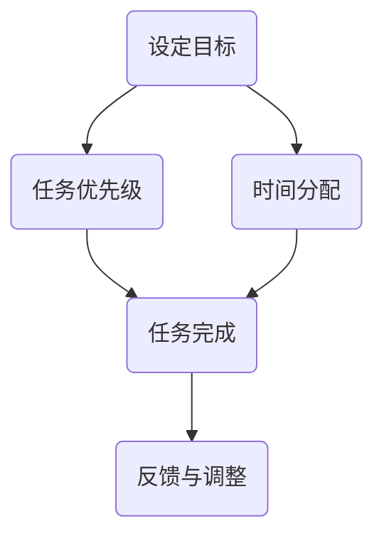

                 

### 文章标题：创业者的时间管理与工作效率提升策略

#### 关键词：时间管理，工作效率，创业者，策略，提升

> 摘要：本文将深入探讨创业者的时间管理策略和工作效率提升方法。通过分章节介绍时间管理的核心概念、算法原理、实践策略以及工具应用，结合实际案例和数据分析，帮助创业者合理安排时间，提高工作效率，实现创业成功。

## 第一部分：时间管理理论与实践

### 第1章：时间管理的核心概念与联系

#### 1.1 时间管理的定义

时间管理是指通过规划和控制时间来提高个人或团队工作效率和生产力的一系列方法和技巧。对于创业者来说，时间管理至关重要，因为创业过程中需要面对诸多挑战和不确定性，合理利用时间可以提高决策质量，减少错误和浪费，从而为创业成功奠定基础。

#### 1.2 时间管理的重要性

1. **提高工作效率**：有效的时间管理可以帮助创业者明确任务优先级，集中精力完成重要任务，减少不必要的干扰和分心，从而提高工作效率。
2. **减少压力**：合理分配时间可以减少工作压力，使创业者有更多时间休息和放松，保持身心健康。
3. **提高决策质量**：充足的时间可以让人更加冷静、理性地分析问题，做出更明智的决策。
4. **实现目标**：时间管理有助于创业者制定明确的目标，并按计划逐步实现，确保创业目标的达成。

#### 1.3 时间管理的误区

1. **只关注任务完成**：时间管理不仅仅是完成任务，更重要的是提高工作质量和效率。
2. **过度依赖工具**：工具可以辅助时间管理，但核心还是要培养良好的时间管理习惯。
3. **忽视休息时间**：长时间工作会导致疲劳，影响工作效率和创造力。

#### 1.4 时间管理的基本原则

1. **明确目标**：设定明确的目标和计划，确保时间和精力集中在重要任务上。
2. **任务优先级**：根据任务的重要性和紧急程度，合理安排任务顺序。
3. **时间分配**：合理分配时间，确保各项任务都有足够的时间完成。
4. **反馈与调整**：定期评估时间管理效果，及时调整策略和计划。

#### 1.5 时间管理的Mermaid流程图



### 第2章：提高个人工作效率的核心算法原理

#### 2.1 优先级矩阵

优先级矩阵是一种用于确定任务优先级的工具，通过将任务按照重要性和紧急程度分为四个象限，帮助创业者合理安排时间和精力。

|   | 紧急   | 不紧急   |
|---|--------|----------|
| **重要** | 热点任务 | 必做任务  |
| **不重要** | 抽象任务 | 次要任务  |

#### 2.2 GTD（Getting Things Done）方法

GTD是一种时间管理方法，其核心理念是将所有任务和想法记录下来，然后按照步骤进行处理，确保任务得到高效完成。

1. **收集**：将所有待办事项记录在收集工具中。
2. **处理**：对收集的待办事项进行分类和优先级排序。
3. **组织**：将任务按照项目或主题进行组织。
4. **执行**：按照计划执行任务。
5. **回顾**：定期回顾任务清单，调整计划。

#### 2.3 基于时间块的工作方法

基于时间块的工作方法是一种将工作时间划分为若干块，每个时间块专注于完成特定任务的方法。

1. **确定时间块**：根据工作内容和时间安排，确定每个时间块的主题和任务。
2. **专注工作**：在每个时间块内，专注于完成指定任务，减少干扰。
3. **时间块切换**：在时间块之间进行适当的休息和切换，避免疲劳。

#### 2.4 时间块工作法的伪代码阐述

```python
# 定义时间块工作法
def time_block_work(task_list, time_blocks):
    for block in time_blocks:
        for task in task_list:
            if task['priority'] == block['priority']:
                work_on_task(task)
                break

# 工作任务
def work_on_task(task):
    print("开始工作：", task['name'])
    # 完成任务
    print("完成任务：", task['name'])
    # 休息
    rest()

# 休息
def rest():
    print("休息一会儿")
```

#### 2.5 伪代码实例

```python
# 定义任务列表
tasks = [
    {'name': '编写文章', 'priority': '紧急'},
    {'name': '回复邮件', 'priority': '不紧急'},
    {'name': '会议准备', 'priority': '紧急'},
    {'name': '市场调研', 'priority': '不紧急'}
]

# 定义时间块
time_blocks = [
    {'priority': '紧急'},
    {'priority': '不紧急'}
]

# 执行时间块工作法
time_block_work(tasks, time_blocks)
```

## 第二部分：具体策略与工具应用

### 第3章：数学模型与公式在时间管理中的应用

#### 3.1 工作负荷模型

工作负荷模型用于评估创业者在一定时间内可以处理的工作量。其公式为：

\[ 工作负荷 = 工作时间 \times 工作效率 \]

其中，工作时间是指创业者可用于工作的实际时间，工作效率是指创业者单位时间内可以完成的工作量。

#### 3.2 工作效率公式

工作效率可以表示为：

\[ 工作效率 = 完成任务数 / 工作时间 \]

通过提高工作效率，可以在相同的工作时间内完成更多的任务。

#### 3.3 时间成本的估算公式

时间成本是指创业者为完成某项任务所花费的时间成本。其公式为：

\[ 时间成本 = 完成任务数 \times 时间单价 \]

其中，时间单价是指创业者单位时间内所创造的价值。

#### 3.4 数学公式与详细讲解

$$
\text{工作负荷} = \text{工作时间} \times \text{工作效率}
$$

$$
\text{工作效率} = \frac{\text{完成任务数}}{\text{工作时间}}
$$

$$
\text{时间成本} = \text{完成任务数} \times \text{时间单价}
$$

#### 3.5 举例说明

假设创业者在8小时内可以处理的工作量为10个任务，每个任务的时间单价为100元。根据上述公式，可以计算出：

- 工作负荷：8小时 \times 10个任务/小时 = 80个任务
- 工作效率：10个任务 / 8小时 = 1.25个任务/小时
- 时间成本：10个任务 \times 100元/任务 = 1000元

### 第4章：时间管理策略与实践

#### 4.1 集中注意力策略

集中注意力策略是指通过减少干扰，使创业者能够专注于当前任务的策略。以下是一些实践方法：

1. **关闭通知**：关闭手机和电脑的通知，减少干扰。
2. **设定专注时间**：将工作时间划分为专注时间和休息时间，例如使用番茄工作法，每25分钟专注工作，然后休息5分钟。
3. **远离干扰源**：将手机、电脑等干扰源放在远离工作区域的地方。

#### 4.2 多任务处理策略

多任务处理策略是指同时处理多个任务的策略。以下是一些实践方法：

1. **任务并行**：将可以并行处理的任务同时进行，提高工作效率。
2. **任务切换**：根据任务的重要性和紧急程度，合理安排任务切换顺序。
3. **利用工具**：使用自动化工具和协作工具，减少手工操作和重复性工作。

#### 4.3 动态计划策略

动态计划策略是指根据实际情况，实时调整计划和策略的策略。以下是一些实践方法：

1. **定期评估**：定期评估工作进度和效果，及时调整计划。
2. **灵活调整**：根据实际情况，灵活调整任务优先级和时间安排。
3. **持续优化**：通过不断实践和总结，优化时间管理策略。

#### 4.4 长期目标规划

长期目标规划是指为创业者设定长期目标和计划，确保时间管理的持续性。以下是一些实践方法：

1. **设定愿景**：明确创业者的长期愿景，确保时间管理策略与愿景一致。
2. **制定计划**：根据长期愿景，制定具体的实施计划和步骤。
3. **跟踪进度**：定期跟踪工作进度，确保长期目标按计划实现。

#### 4.5 实战案例：创业者的时间管理实践

某创业者李明，希望提高工作效率，合理安排时间。他采用以下策略：

1. **收集任务**：将所有待办事项记录在收集工具中。
2. **任务优先级**：根据任务的重要性和紧急程度，将任务分为紧急重要、紧急不重要、不紧急重要、不紧急不重要四个象限。
3. **时间块工作**：将工作时间划分为专注时间块和休息时间块，每个时间块专注于完成指定任务。
4. **动态调整**：根据工作进度和实际情况，实时调整任务优先级和时间安排。
5. **长期目标**：设定长期愿景，制定具体的实施计划和步骤，确保时间管理策略与愿景一致。

通过以上实践，李明的工作效率得到了显著提高，时间管理也更加科学和合理。

## 第三部分：项目实战与案例分析

### 第5章：提高工作效率的策略

#### 5.1 工作流程优化

工作流程优化是指对创业者日常工作中的一系列步骤进行改进，以提高工作效率。以下是一些实践方法：

1. **分析现有流程**：分析现有工作流程，找出瓶颈和改进点。
2. **简化流程**：简化不必要的步骤，减少流程中的冗余环节。
3. **标准化流程**：制定标准化的工作流程，确保团队成员按照统一的标准进行工作。
4. **流程监控**：实时监控工作流程，确保流程优化效果。

#### 5.2 技术工具辅助

技术工具可以在创业者时间管理和工作效率提升中发挥重要作用。以下是一些常用工具：

1. **任务管理工具**：如Trello、Asana等，可以帮助创业者整理任务和优先级。
2. **时间跟踪工具**：如Toggl、RescueTime等，可以帮助创业者记录和分析工作时间。
3. **邮件管理工具**：如Gmail的优先邮件、Boomerang等，可以帮助创业者高效处理邮件。
4. **团队协作工具**：如Slack、Microsoft Teams等，可以帮助团队协作和沟通。

#### 5.3 工作环境优化

工作环境对工作效率具有重要影响。以下是一些优化工作环境的方法：

1. **物理环境**：保持办公环境的整洁和舒适，减少干扰因素。
2. **技术设备**：配备高性能的电脑、网络和软件，确保工作效率。
3. **工作氛围**：营造积极、和谐的工作氛围，提高团队凝聚力。
4. **时间管理氛围**：倡导时间管理文化，使团队成员意识到时间管理的重要性。

#### 5.4 工作习惯培养

培养良好的工作习惯是提高工作效率的关键。以下是一些实用的工作习惯：

1. **定期回顾和反思**：每周或每月回顾自己的工作，分析不足之处，制定改进计划。
2. **目标设定**：每天或每周设定明确的工作目标，确保工作方向正确。
3. **专注工作**：避免在工作时分心，保持专注和集中。
4. **休息和放松**：合理规划休息时间，避免过度劳累。

#### 5.5 实战案例：创业者如何提升工作效率

某创业者张华，希望通过提高工作效率，使公司发展更迅速。他采取以下措施：

1. **工作流程优化**：分析现有工作流程，删除冗余步骤，简化审批流程。
2. **技术工具辅助**：采用Trello进行任务管理，使用Toggl进行时间跟踪，提高工作效率。
3. **工作环境优化**：改善办公环境，配备高性能电脑，优化网络。
4. **工作习惯培养**：每天设定明确的工作目标，每周进行回顾和反思。

通过以上措施，张华的工作效率显著提高，公司业绩也得到了快速增长。

### 第6章：时间管理与心理调节

#### 6.1 应对压力的策略

压力是创业者常见的心理问题，有效的时间管理可以帮助创业者应对压力。以下是一些策略：

1. **合理分配时间**：确保工作与休息时间合理分配，避免长时间工作导致的疲劳。
2. **设定优先级**：将任务按照重要性和紧急程度排序，优先处理重要任务，减轻压力。
3. **学会拒绝**：对于不必要的事情或请求，学会拒绝，避免过度承担。

#### 6.2 保持专注的方法

保持专注对于提高工作效率至关重要。以下是一些保持专注的方法：

1. **设定专注时间**：采用番茄工作法，将工作时间划分为专注时间和休息时间，提高专注度。
2. **减少干扰**：关闭手机、电脑等通知，减少外部干扰。
3. **定期休息**：每隔一段时间进行短暂的休息，避免过度疲劳。

#### 6.3 时间管理与心理健康

时间管理对心理健康具有重要影响。以下是一些有益于心理健康的建议：

1. **保持积极心态**：积极面对挑战，学会从困境中寻找机遇。
2. **适当放松**：工作之余，进行适当的娱乐和放松活动，缓解压力。
3. **寻求支持**：与家人、朋友或专业人士交流，分享自己的困惑和压力，寻求帮助。

#### 6.4 实战案例：创业者如何缓解工作压力

某创业者王强，经常因为工作压力大而感到焦虑。他采取以下措施缓解工作压力：

1. **时间管理**：合理安排工作时间和休息时间，确保充足的睡眠。
2. **专注训练**：采用番茄工作法，提高专注度，减少分心。
3. **心理调节**：通过冥想、瑜伽等放松活动，缓解压力。
4. **家庭支持**：与家人分享自己的压力，寻求家庭的支持和理解。

通过以上措施，王强的压力得到了有效缓解，工作效率也得到了提高。

### 第7章：时间管理工具介绍与使用

#### 7.1 效率工具介绍

时间管理工具可以帮助创业者提高工作效率，以下是几种常用的工具：

1. **任务管理工具**：如Trello、Asana等，用于整理任务和优先级。
2. **时间跟踪工具**：如Toggl、RescueTime等，用于记录和分析工作时间。
3. **邮件管理工具**：如Gmail的优先邮件、Boomerang等，用于高效处理邮件。
4. **团队协作工具**：如Slack、Microsoft Teams等，用于团队沟通和协作。

#### 7.2 时间管理软件的使用方法

以下是一个基于Trello的任务管理软件使用案例：

1. **创建清单**：在Trello中创建一个新的清单，用于记录所有待办事项。
2. **添加卡片**：将待办事项添加为Trello卡片，并分配优先级。
3. **任务分配**：将任务分配给团队成员，确保任务得到高效完成。
4. **进度跟踪**：实时跟踪任务进度，确保任务按计划进行。

#### 7.3 手动与自动记录时间的方法

1. **手动记录时间**：使用纸质笔记本或电子表格，手动记录工作时间。
2. **自动记录时间**：使用Toggl等时间跟踪工具，自动记录工作时间。
3. **方法比较**：手动记录时间需要人工输入，自动记录时间更准确，但需要技术支持。

#### 7.4 实战案例：创业者的时间管理工具应用

某创业者李娜，希望通过时间管理工具提高工作效率。她采取以下措施：

1. **使用Trello进行任务管理**：将所有待办事项记录在Trello中，并分配优先级。
2. **使用Toggl进行时间跟踪**：实时记录工作时间，分析工作效率。
3. **使用Gmail的优先邮件**：高效处理邮件，确保邮件得到及时响应。
4. **使用Slack进行团队协作**：与团队成员保持沟通，确保团队协作高效。

通过以上措施，李娜的工作效率得到了显著提高。

### 第8章：创业者的时间管理实战案例

#### 8.1 案例一：如何合理安排创业者的时间

创业者陈先生是一家科技公司的创始人，他通过以下方法合理安排时间：

1. **任务优先级**：根据任务的重要性和紧急程度，将任务分为紧急重要、紧急不重要、不紧急重要、不紧急不重要四个象限。
2. **时间块工作**：将工作时间划分为专注时间块和休息时间块，每个时间块专注于完成指定任务。
3. **动态调整**：根据工作进度和实际情况，实时调整任务优先级和时间安排。
4. **长期目标**：设定长期愿景，制定具体的实施计划和步骤，确保时间管理策略与愿景一致。

通过以上实践，陈先生的时间管理更加科学和合理，工作效率也得到了显著提高。

#### 8.2 案例二：如何提升创业者的工作效率

创业者张女士是一家初创公司的创始人，她通过以下方法提升工作效率：

1. **工作流程优化**：分析现有工作流程，删除冗余步骤，简化审批流程。
2. **技术工具辅助**：采用Trello进行任务管理，使用Toggl进行时间跟踪，提高工作效率。
3. **工作环境优化**：改善办公环境，配备高性能电脑，优化网络。
4. **工作习惯培养**：每天设定明确的工作目标，每周进行回顾和反思。

通过以上措施，张女士的工作效率显著提高，公司业绩也得到了快速增长。

#### 8.3 案例三：如何平衡创业与个人生活

创业者李先生在创业过程中，面临着平衡创业与个人生活的挑战。他通过以下方法实现平衡：

1. **设定工作时间**：明确工作时间，确保工作与生活之间有清晰的界限。
2. **家庭支持**：与家人沟通，寻求家庭的理解和支持，确保家庭生活不受影响。
3. **休息与放松**：合理安排休息和放松时间，避免过度劳累。
4. **时间管理工具**：使用时间管理工具，如Trello和Toggl，合理安排工作和生活时间。

通过以上实践，李先生成功平衡了创业与个人生活，保持了良好的身心状态。

### 第9章：创业公司的团队时间管理

#### 9.1 团队时间管理的挑战

在创业公司中，团队时间管理面临着以下挑战：

1. **任务复杂度**：创业公司的任务多样且复杂，需要团队成员具备较高的时间管理能力。
2. **资源有限**：创业公司资源有限，需要合理分配时间，确保资源得到充分利用。
3. **团队协作**：团队成员之间的协作和沟通对时间管理具有重要意义。

#### 9.2 团队协作与时间管理

团队协作与时间管理密切相关，以下是一些实践方法：

1. **明确目标**：确保团队成员对项目目标有清晰的认识，提高团队协作效率。
2. **任务分解**：将大任务分解为小任务，明确每个任务的责任人，提高任务执行效率。
3. **实时沟通**：建立高效的沟通机制，确保团队成员之间及时沟通，减少信息滞后。
4. **时间跟踪**：使用时间管理工具，如Toggl，实时跟踪团队成员的工作时间，确保任务按时完成。

#### 9.3 项目进度与时间跟踪

项目进度与时间跟踪是团队时间管理的重要环节，以下是一些实践方法：

1. **项目计划**：制定详细的项目计划，明确项目进度和时间节点。
2. **任务分配**：将任务合理分配给团队成员，确保任务按时完成。
3. **进度监控**：定期检查项目进度，及时发现和解决问题。
4. **时间跟踪**：使用时间管理工具，实时跟踪团队成员的工作时间，确保任务按时完成。

#### 9.4 团队时间管理的最佳实践

1. **定期会议**：定期召开团队会议，讨论项目进展、问题解决方案和改进措施。
2. **任务优先级**：确保团队成员明确任务优先级，优先完成重要任务。
3. **灵活调整**：根据实际情况，灵活调整任务和时间安排，确保团队目标的实现。
4. **培训和指导**：提供时间管理培训，提高团队成员的时间管理能力。

### 第10章：时间管理与创业成功

#### 10.1 创业过程中的时间管理重要性

在创业过程中，时间管理具有至关重要的意义。以下是一些原因：

1. **资源有限**：创业公司资源有限，需要合理利用时间，确保资源得到充分利用。
2. **任务多样**：创业过程中的任务多样且复杂，需要有效的时间管理来确保任务按时完成。
3. **决策质量**：充足的时间可以让人更加冷静、理性地分析问题，做出更明智的决策。
4. **团队协作**：有效的时间管理可以提高团队协作效率，确保团队成员共同实现创业目标。

#### 10.2 成功创业者的时间管理经验

以下是一些成功创业者的时间管理经验：

1. **设定明确目标**：成功创业者通常具备明确的目标和计划，这有助于他们集中精力完成重要任务。
2. **合理分配时间**：成功创业者能够合理分配时间，确保工作与生活之间保持平衡。
3. **任务优先级**：成功创业者善于根据任务的重要性和紧急程度，合理安排任务顺序。
4. **时间管理工具**：成功创业者善于利用时间管理工具，提高工作效率和生产力。

#### 10.3 创业时间管理的影响因素

以下是一些影响创业时间管理的因素：

1. **任务复杂度**：任务复杂度越高，时间管理难度越大。
2. **团队协作**：团队协作效率高，时间管理效果越好。
3. **工作环境**：良好的工作环境有助于提高工作效率。
4. **个人习惯**：良好的时间管理习惯有助于提高时间管理效果。

#### 10.4 创业时间管理的未来趋势

随着技术的发展，创业时间管理也将呈现以下趋势：

1. **自动化**：自动化技术将逐步应用于时间管理，提高管理效率。
2. **智能化**：人工智能技术将帮助创业者实现更加智能的时间管理。
3. **个性化**：时间管理工具将更加注重个性化，满足创业者不同的需求。
4. **全球化**：随着全球化的推进，创业时间管理将面临更多挑战和机遇。

### 附录

#### 附录A：时间管理资源与工具

以下是一些时间管理资源和工具：

1. **时间管理书籍**：
   - 《时间管理：如何充分利用时间》（作者：大卫·艾伦）
   - 《高效能人士的七个习惯》（作者：史蒂芬·柯维）

2. **时间管理网站**：
   - Todoist（https://todoist.com/）
   - Trello（https://trello.com/）

3. **时间管理社区**：
   - Reddit 时间管理板块（https://www.reddit.com/r/time_management/）
   - 时间管理论坛（https://www.time-management-forum.com/）

#### 附录B：时间管理测试题与答案

以下是一些时间管理测试题：

1. 问题：以下哪种方法不利于时间管理？
   - A. 制定明确的计划
   - B. 过度依赖工具
   - C. 定期反思和调整
   - D. 遵循固定的日程

   答案：B

2. 问题：以下哪个时间管理工具最适合团队协作？
   - A. Trello
   - B. Toggl
   - C. Gmail
   - D. Slack

   答案：A

3. 问题：以下哪种行为有助于保持专注？
   - A. 查看社交媒体
   - B. 完成一项任务后再进行下一项
   - C. 同时处理多个任务
   - D. 定期休息

   答案：B

通过以上测试题，创业者可以了解自己在时间管理方面的优势和不足，从而进行针对性的改进。

