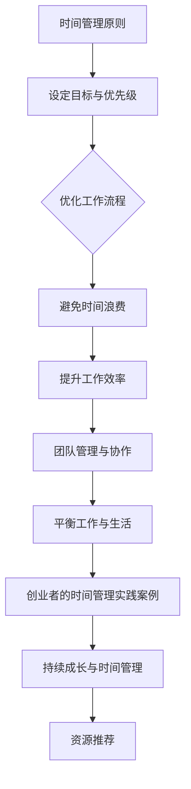

                 


### 《创业者的时间管理与精力分配技巧》

#### 关键词
- 创业者
- 时间管理
- 精力分配
- 工作效率
- 团队协作

#### 摘要
本文旨在探讨创业者在面对纷繁复杂的工作任务时，如何通过科学的时间管理和精力分配技巧，提升个人工作效率和团队协作能力。文章从时间管理的基础原则、实用工具、个人精力提升方法，到实践中的高效工作习惯、团队管理、工作与生活的平衡，再到创业者的成功案例分享和持续成长路径，提供了全面而深入的指导。

---

### 第一部分：时间管理与精力分配基础

#### 第1章：创业者的时间管理原则

##### 1.1.1 创业者面临的挑战与时间管理
作为创业者，时间管理显得尤为重要。在资源有限、竞争激烈的市场环境中，创业者需要高效利用时间来完成各种任务，从市场调研、产品开发到团队建设、客户服务等。时间管理对于创业者而言，不仅是提高工作效率的工具，更是确保企业可持续发展的关键。

##### 1.1.2 时间管理的核心原则
时间管理的核心原则包括设定明确的目标、评估任务的优先级、优化工作流程和避免时间浪费。明确的目标有助于集中精力，评估任务优先级能够确保重要且紧急的任务优先处理，优化工作流程可以减少不必要的步骤，避免时间浪费则能提高整体效率。

##### 1.1.3 设定明确的目标与优先级
设定明确的目标是时间管理的第一步。创业者需要根据企业的发展阶段和市场需求，设定短期和长期目标。目标设定后，通过评估每个任务的优先级，确保关键任务得到优先处理。例如，紧急且重要的任务应优先处理，而那些虽重要但紧急性较低的任务则可以暂时搁置。

#### 第2章：时间管理工具与技术

##### 2.1.1 日历与任务管理工具
日历和任务管理工具是时间管理的重要工具。创业者可以使用日历来规划每天的活动，任务管理工具如Trello或Asana可以帮助跟踪和管理任务。这些工具不仅能够提醒任务的截止日期，还能帮助团队协作和任务分配。

##### 2.1.2 甘特图与项目管理工具
甘特图是一种可视化工具，用于显示项目进度和时间安排。创业者可以使用甘特图来规划项目时间线，跟踪任务进度，识别潜在的风险。项目管理工具如Microsoft Project或Jira可以提供更全面的视图和功能，帮助创业者高效管理项目。

##### 2.1.3 时间跟踪与分析工具
时间跟踪工具如Toggl可以帮助创业者记录工作时间和任务分配，提供详细的分析报告，帮助识别时间和资源利用情况。通过时间分析，创业者可以更准确地了解自己的时间花费，从而优化时间管理策略。

#### 第3章：提升个人精力与效率

##### 3.1.1 精力管理的重要性
精力管理对于创业者来说至关重要。高强度的创业工作往往会导致精力耗尽，影响工作效率和决策质量。通过有效的精力管理，创业者可以保持良好的身体和精神状态，提高工作效率。

##### 3.1.2 健康生活方式与精力提升
健康的生活方式是精力提升的基础。创业者应保持规律的作息时间，均衡的饮食，适量的运动，以及良好的心理状态。这些习惯有助于提高身体素质，增强抵抗力，从而保持精力的充沛。

##### 3.1.3 提高工作专注力的技巧
提高工作专注力是提升工作效率的关键。创业者可以通过减少干扰、设定专注时段、采用番茄工作法等技巧来提高专注力。这些方法可以帮助创业者集中精力，提高工作质量。

---

### 第二部分：时间管理与精力分配实践

#### 第4章：打造高效工作习惯

##### 4.1.1 工作流程优化
工作流程优化是提高工作效率的重要手段。创业者可以通过分析现有工作流程，识别并消除不必要的步骤，简化流程，减少时间浪费。例如，通过自动化工具和流程优化，可以提高工作效率，节省时间。

##### 4.1.2 避免时间浪费的技巧
避免时间浪费是时间管理的重要组成部分。创业者可以通过以下技巧来避免时间浪费：设定明确的工作目标，避免多任务处理，减少无意义的会议，合理分配时间，以及利用碎片时间进行高效工作。

##### 4.1.3 提升工作效率的实用技巧
提升工作效率的实用技巧包括：制定详细的日程安排，优先处理紧急且重要的任务，定期评估工作进度，保持积极的心态，以及利用团队协作提高工作效率。这些技巧可以帮助创业者更高效地完成工作，提高整体生产力。

#### 第5章：团队管理与协作

##### 5.1.1 团队时间管理的挑战
团队时间管理是创业过程中的一大挑战。团队成员的时间协调、任务分配和工作效率都会影响到整个团队的进度。创业者需要制定明确的时间管理策略，确保团队高效协作。

##### 5.1.2 高效团队协作的技巧
高效团队协作需要团队成员之间的紧密配合和良好的沟通。创业者可以通过以下技巧来提升团队协作效率：定期召开团队会议，建立清晰的沟通渠道，鼓励团队成员分享观点和经验，以及制定共同的目标和计划。

##### 5.1.3 项目进度跟踪与控制
项目进度跟踪与控制是团队时间管理的关键环节。创业者可以使用项目管理工具来跟踪项目进度，识别潜在的风险，及时调整计划和策略。通过有效的进度控制，可以确保项目按计划完成。

#### 第6章：平衡工作与生活

##### 6.1.1 创业者如何平衡工作与生活
平衡工作与生活是每个创业者都需要面对的挑战。创业者需要学会合理规划时间，确保工作与生活之间有良好的平衡。通过设定明确的工作时间，合理安排休闲活动，以及保持积极的生活态度，创业者可以更好地平衡工作与生活。

##### 6.1.2 家庭与事业的协调
家庭与事业的协调对于创业者来说尤为重要。创业者需要与家庭成员进行沟通，共同制定家庭和工作计划。通过合理分配时间，确保家庭生活与事业发展之间不发生冲突。

##### 6.1.3 精力管理的日常实践
精力管理的日常实践可以帮助创业者保持精力的充沛。创业者可以通过以下方法进行日常精力管理：保持充足的睡眠，合理安排饮食，定期锻炼，保持良好的心态，以及学会放松和休息。

---

### 第三部分：附录

#### 附录A：时间管理与精力管理资源推荐

##### A.1.1 必读的书籍推荐
以下是一些关于时间管理和精力管理的经典书籍推荐：
- 《深度工作》（Deep Work）—— Cal Newport
- 《精力管理》（The Power of Full Engagement）—— Jim Loehr & Tony Schwartz
- 《时间管理》（The 7 Habits of Highly Effective People）—— Stephen R. Covey

##### A.1.2 高效工具推荐
以下是一些高效的时间管理和精力管理工具推荐：
- Trello：任务管理和团队协作工具
- Asana：项目管理工具
- Toggl：时间跟踪与分析工具
- Notion：笔记和任务管理工具

##### A.1.3 在线课程与工作坊推荐
以下是一些在线课程和工作坊推荐，可以帮助创业者提升时间管理和精力管理能力：
- Coursera上的《时间管理和生产力》（Time Management and Productivity）
- Udemy上的《精力管理：提高工作和生活效率》（Energy Management: Boosting Work and Life Efficiency）
- LinkedIn Learning上的《时间管理技巧》（Time Management Techniques）

---

### Mermaid 流程图示例



---

### 伪代码示例

```c
// 时间管理核心算法
void TimeManagementAlgorithm() {
    // 设定目标
    setGoal();
    
    // 评估目标优先级
    evaluatePriority();
    
    // 优化工作流程
    optimizeWorkflow();
    
    // 避免时间浪费
    avoidTimeWaste();
    
    // 提高工作效率
    improveEfficiency();
    
    // 团队协作
    teamCollaboration();
    
    // 平衡工作与生活
    balanceWorkLife();
    
    // 持续成长
    continueGrowth();
}
```

---

### 数学公式示例

$$
E = mc^2
$$

$$
f(x) = ax^2 + bx + c
$$

---

### 代码案例与解读

```python
# 创业者时间管理代码案例
class TimeManager:
    def __init__(self):
        self.tasks = []
    
    def add_task(self, task):
        self.tasks.append(task)
    
    def prioritize_tasks(self):
        self.tasks.sort(key=lambda x: x.priority, reverse=True)
    
    def execute_tasks(self):
        for task in self.tasks:
            if task.is_urgent():
                task.execute()
```

**代码解读**：
- `TimeManager` 类用于管理任务。
- `add_task` 方法用于添加任务。
- `prioritize_tasks` 方法用于根据优先级排序任务。
- `execute_tasks` 方法用于执行任务。任务通过 `is_urgent` 方法判断是否为紧急任务，然后执行任务。

---

### 完整性要求

**背景介绍**：
- 描述创业者在日常工作中面临的挑战，以及为什么时间管理和精力分配对他们至关重要。

**核心概念与联系**：
- 通过 Mermaid 流程图展示时间管理原则、实用工具、个人精力提升方法、实践中的高效工作习惯、团队管理与协作、平衡工作与生活等核心概念之间的联系。

**核心算法原理讲解**：
- 使用伪代码详细阐述时间管理算法的工作原理，包括目标设定、任务优先级评估、工作流程优化、时间浪费避免、工作效率提升、团队协作、工作与生活平衡等方面。

**数学模型和公式 & 详细讲解 & 举例说明**：
- 使用 LaTeX 格式展示数学公式，例如能量守恒公式 \( E = mc^2 \) 和二次函数公式 \( f(x) = ax^2 + bx + c \)。
- 结合具体实例，详细讲解这些公式的应用和计算过程。

**项目实战**：
- 描述一个创业者在时间管理和精力分配方面的实际项目，包括项目开发环境搭建、源代码实现、代码解读、实际案例分析等。

**最佳实践 tips**：
- 提供一些时间管理和精力分配的最佳实践建议，例如如何设定明确的目标、如何避免时间浪费、如何提高专注力等。

**小结**：
- 总结文章的主要内容和观点，强调创业者通过科学的时间管理和精力分配能够取得更好的工作效果。

**注意事项**：
- 提醒读者在实践过程中需要注意的一些事项，例如保持健康的生活方式、合理规划时间等。

**拓展阅读**：
- 推荐一些相关的书籍、工具和在线课程，帮助读者进一步学习和提升时间管理和精力分配能力。

---

### 文章总结

在本文中，我们详细探讨了创业者在面对纷繁复杂的工作任务时，如何通过科学的时间管理和精力分配技巧，提升个人工作效率和团队协作能力。从时间管理的核心原则、实用工具，到个人精力提升方法、实践中的高效工作习惯，再到团队管理与协作、平衡工作与生活，我们提供了全面的指导。同时，通过案例分享和最佳实践建议，帮助创业者更好地管理时间和精力，实现个人和企业的可持续发展。希望本文能够为您的创业之路提供有价值的参考和帮助。作者：AI天才研究院/AI Genius Institute & 禅与计算机程序设计艺术 /Zen And The Art of Computer Programming。

