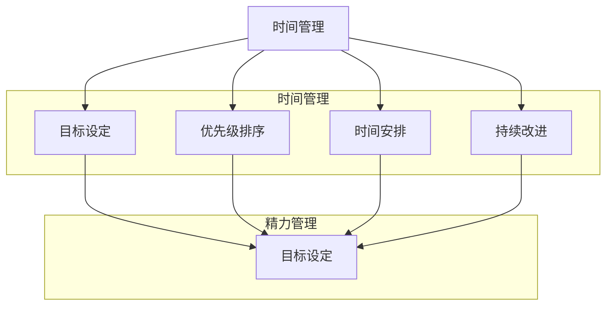

                 

### 《创业者的时间管理与精力分配策略》

#### 关键词：时间管理、精力管理、创业者、效率、策略

> 摘要：本文将探讨创业者在快速发展的商业环境中，如何通过有效的时间管理和精力分配策略，提升工作效率，实现个人和企业的目标。文章将从基本原理、策略与实践三个方面，深入分析创业者在时间管理和精力管理中的关键点，并提供实际案例与最佳实践，帮助创业者更好地应对挑战，实现成功。

# 《创业者的时间管理与精力分配策略》目录大纲

## 第一部分：时间管理与精力分配的基本原理

### 1.1 时间管理的基础知识

#### 1.1.1 时间管理的重要性

#### 1.1.2 时间管理的基本原则

#### 1.1.3 时间管理工具介绍

### 1.2 精力管理的基本概念

#### 1.2.1 精力的定义与特性

#### 1.2.2 精力管理的意义

#### 1.2.3 精力管理的基本原则

## 第二部分：时间管理的策略与实践

### 2.1 确定目标与制定计划

#### 2.1.1 如何设定明确的目标

#### 2.1.2 制定可行的计划

#### 2.1.3 优先级的确定

### 2.2 时间块管理

#### 2.2.1 时间块的定义

#### 2.2.2 时间块的应用

#### 2.2.3 时间块的维护

### 2.3 避免拖延与分心的策略

#### 2.3.1 拖延的成因

#### 2.3.2 避免拖延的方法

#### 2.3.3 分心的应对策略

### 2.4 提高工作效率

#### 2.4.1 高效工作的习惯养成

#### 2.4.2 高效工具的运用

#### 2.4.3 工作流程的优化

## 第三部分：精力管理的实践与策略

### 3.1 精力管理的基础理论

#### 3.1.1 精力管理的核心概念

#### 3.1.2 精力管理的实际应用

#### 3.1.3 精力管理的方法论

### 3.2 精力分配的策略

#### 3.2.1 确定精力高峰期

#### 3.2.2 精力高峰期的利用

#### 3.2.3 精力低谷期的应对

### 3.3 精力恢复的方法

#### 3.3.1 精神恢复的策略

#### 3.3.2 身体恢复的方法

#### 3.3.3 精力恢复的实践案例

## 第四部分：创业者的时间管理与精力分配实战

### 4.1 创业者时间管理的特殊性

#### 4.1.1 创业者面临的时间挑战

#### 4.1.2 创业者时间管理的特殊性

#### 4.1.3 创业者时间管理的成功案例

### 4.2 创业者精力分配的关键点

#### 4.2.1 创业者精力分配的重要性

#### 4.2.2 创业者如何合理分配精力

#### 4.2.3 创业者精力分配的实际操作

### 4.3 创业者的时间管理与精力分配策略案例

#### 4.3.1 创业者A的时间管理与精力分配策略

#### 4.3.2 创业者B的时间管理与精力分配策略

#### 4.3.3 创业者C的时间管理与精力分配策略

## 第五部分：时间管理与精力分配的综合运用

### 5.1 时间管理与精力分配的综合策略

#### 5.1.1 综合策略的核心思想

#### 5.1.2 综合策略的实施步骤

#### 5.1.3 综合策略的评估与调整

### 5.2 持续改进与优化

#### 5.2.1 如何持续改进时间管理与精力分配

#### 5.2.2 如何进行自我评估与反思

#### 5.2.3 如何调整与优化时间管理与精力分配策略

## 附录

### 附录 A：时间管理与精力分配的工具与方法

#### A.1 时间管理工具介绍

#### A.2 精力管理工具介绍

#### A.3 时间管理与精力分配的方法总结

----------------------------------------------------------------

在接下来的内容中，我们将逐步深入探讨时间管理和精力分配的基本原理、策略与实践，帮助创业者更好地应对挑战，实现成功。接下来，我们将从时间管理的基础知识开始，逐步深入探讨时间管理和精力管理的核心概念和策略。

## 第一部分：时间管理与精力分配的基本原理

### 1.1 时间管理的基础知识

#### 1.1.1 时间管理的重要性

时间管理是个人和组织成功的关键因素之一。对于创业者来说，时间管理更是至关重要。创业过程中，时间往往是最宝贵的资源，因为它直接影响着创业者的工作效率和成果。有效的时间管理可以帮助创业者：

- **提高工作效率**：通过合理安排时间，避免时间浪费，创业者可以更有效地完成任务。
- **明确工作目标**：时间管理有助于创业者设定清晰的目标，明确工作的优先级，确保重要的任务得到优先处理。
- **减少压力和焦虑**：合理的时间管理能够帮助创业者减轻工作压力，避免因为时间安排不当而产生的焦虑。

#### 1.1.2 时间管理的基本原则

时间管理的基本原则是确保创业者能够高效地利用时间，实现个人和企业的目标。以下是几个关键原则：

1. **明确目标**：设定清晰的目标是时间管理的第一步，有助于明确工作的方向和重点。
2. **优先级排序**：将任务按照优先级进行排序，确保最重要、最紧急的任务得到优先处理。
3. **合理安排时间**：合理安排时间，确保每个任务都有足够的时间完成，避免临时抱佛脚。
4. **持续改进**：时间管理是一个持续的过程，需要不断地反思和调整，以适应不断变化的环境和需求。

#### 1.1.3 时间管理工具介绍

时间管理工具有助于创业者更好地规划和跟踪时间，以下是一些常见的时间管理工具：

- **日历**：用于记录和跟踪日程安排，有助于规划和安排时间。
- **待办事项列表**：用于记录和跟踪任务，有助于保持工作的连续性和条理性。
- **时间跟踪工具**：如Toggl、RescueTime等，可以帮助用户了解时间花费情况，从而进行优化。

#### 1.2 精力管理的基本概念

#### 1.2.1 精力的定义与特性

精力是指个体在进行各种活动时，能够持续保持集中注意力、保持积极态度和高效完成任务的能力。精力具有以下几个特性：

- **有限性**：精力是有限的资源，创业者需要合理分配和利用。
- **可再生性**：通过适当的休息和恢复，精力可以恢复和再生。
- **动态性**：精力的水平和状态会随着时间和环境的变化而变化。

#### 1.2.2 精力管理的意义

精力管理对于创业者的成功至关重要。有效的精力管理可以帮助创业者：

- **提高工作效率**：通过保持良好的精力状态，创业者可以更高效地完成任务。
- **提升决策质量**：精力充沛的创业者能够更好地分析和解决问题，做出更高质量的决策。
- **减少压力和疲劳**：通过合理的精力管理，创业者可以减少工作压力和疲劳，提高生活质量。

#### 1.2.3 精力管理的基本原则

精力管理的基本原则包括：

- **确定精力高峰期**：找到自己精力最旺盛的时段，并在这段时间内集中处理最重要和最复杂的任务。
- **合理分配精力**：根据任务的重要性和紧急性，合理分配精力，确保关键任务得到充分的关注和资源。
- **精力恢复**：通过适当的休息和恢复方法，保持精力的持续水平。

### 1.3 时间管理与精力管理的联系

时间管理和精力管理之间存在紧密的联系。时间管理是精力管理的前提和基础，而精力管理是时间管理的关键。有效的精力管理可以提升时间管理的效率和质量。以下是时间管理与精力管理之间的核心联系：

- **目标一致性**：时间管理和精力管理都需要明确目标，并确保目标的一致性。
- **优先级排序**：时间管理和精力管理都需要对任务进行优先级排序，确保最重要的任务得到优先处理。
- **持续改进**：时间管理和精力管理都需要持续改进，以适应不断变化的环境和需求。

#### 1.3.1 时间管理与精力管理的核心概念关系架构

通过以上内容，我们可以看到时间管理和精力管理是创业者成功的重要基础。在接下来的部分中，我们将深入探讨时间管理和精力管理的策略与实践，帮助创业者更好地应对挑战，实现成功。

## 第二部分：时间管理的策略与实践

### 2.1 确定目标与制定计划

#### 2.1.1 如何设定明确的目标

设定明确的目标是时间管理的第一步，也是至关重要的一步。创业者需要根据个人和企业的长期愿景，设定具体的短期和长期目标。以下是设定明确目标的几个关键步骤：

1. **明确愿景**：首先，创业者需要明确自己的长期愿景和使命。这有助于确定目标的方向和意义。
2. **分解目标**：将长期目标分解为短期目标，并确保每个短期目标都是具体、可衡量和可实现的。短期目标的设定应该与长期愿景保持一致。
3. **制定行动计划**：为每个短期目标制定具体的行动计划，明确每个步骤的行动内容、负责人和完成时间。

#### 2.1.2 制定可行的计划

在设定明确的目标之后，创业者需要制定可行的计划。以下是制定计划的几个关键步骤：

1. **分析资源**：分析可用的资源，包括时间、人力、资金和材料等，确保计划的可行性。
2. **分配任务**：根据资源和目标要求，将任务合理地分配给团队成员，确保每个任务都有明确的责任人。
3. **设定时间表**：为每个任务设定具体的完成时间，并确保时间表的合理性和可行性。

#### 2.1.3 优先级的确定

在制定计划的过程中，确定任务的优先级至关重要。以下是确定优先级的几个关键步骤：

1. **识别关键任务**：识别对目标实现影响最大、最紧急的任务，确保这些任务得到优先处理。
2. **分类任务**：将任务分为紧急重要、紧急不重要、不紧急重要和不紧急不重要四类，确保资源得到合理分配。
3. **动态调整**：根据实际情况和任务的进展情况，及时调整任务的优先级，确保目标能够按时完成。

### 2.2 时间块管理

#### 2.2.1 时间块的定义

时间块管理是一种将时间划分为固定的时间段，并在这段时间内专注于特定任务的方法。这种方法有助于提高专注度和工作效率，减少分心和拖延。以下是时间块管理的关键定义：

- **时间块**：将一天的时间划分为若干个固定的时间段，每个时间段内专注于特定的任务。
- **专注时间**：在每个时间块内，保持专注，避免分心和干扰。
- **切换时间**：在每个时间块之间设置短暂的休息时间，以帮助恢复精力。

#### 2.2.2 时间块的应用

时间块管理在创业者中的应用如下：

1. **任务分配**：将任务按照类型和优先级分配到不同的时间块，确保每个任务都有足够的时间完成。
2. **专注工作**：在每个时间块内，专注于特定的任务，避免分心和拖延。
3. **休息与恢复**：在每个时间块之间设置短暂的休息时间，帮助恢复精力，提高工作效率。

#### 2.2.3 时间块的维护

为了确保时间块管理的有效性，创业者需要遵循以下维护原则：

1. **固定时间块**：确保每个时间块的长度和安排保持一致，以帮助建立稳定的工作习惯。
2. **避免时间块冲突**：尽量避免将重要的任务安排在时间块冲突的情况下，确保任务能够按时完成。
3. **定期评估**：定期评估时间块管理的效果，根据实际情况进行调整和优化。

### 2.3 避免拖延与分心的策略

#### 2.3.1 拖延的成因

拖延是创业者常见的问题，其成因包括：

1. **任务复杂度**：任务过于复杂或困难，导致创业者无法立即开始或不知从何处着手。
2. **缺乏动力**：任务缺乏吸引力或重要性，导致创业者缺乏完成任务的积极性。
3. **恐惧失败**：担心任务失败或无法达到预期效果，导致创业者拖延。

#### 2.3.2 避免拖延的方法

为了避免拖延，创业者可以采取以下方法：

1. **分解任务**：将复杂的任务分解为小的、可操作的步骤，逐步完成。
2. **设定具体目标**：为每个任务设定明确的目标和时间限制，以增加动力和紧迫感。
3. **建立激励机制**：设定奖励机制，激励自己在完成任务后给予自己奖励。

#### 2.3.3 分心的应对策略

分心是影响工作效率的另一个重要因素。以下是一些应对分心的策略：

1. **环境优化**：选择一个安静、整洁的工作环境，减少干扰和分心。
2. **专注工具**：使用专注工具，如番茄工作法，帮助自己集中注意力。
3. **定期休息**：在每个时间块之间设置短暂的休息时间，以帮助恢复精力，提高专注度。

### 2.4 提高工作效率

#### 2.4.1 高效工作的习惯养成

养成高效工作的习惯对于提高工作效率至关重要。以下是一些高效工作的习惯：

1. **早起**：每天早起，充分利用早晨的时间，设定计划和目标。
2. **计划优先**：每天制定详细的计划，明确任务和优先级，确保任务按计划进行。
3. **专注工作**：在每个时间块内，专注于当前任务，避免分心和干扰。

#### 2.4.2 高效工具的运用

高效工具的运用可以大大提高工作效率。以下是一些常用的高效工具：

1. **项目管理工具**：如Trello、Asana等，帮助创业者跟踪任务和项目进度。
2. **时间管理工具**：如Toggl、RescueTime等，帮助创业者了解时间花费情况，进行优化。
3. **沟通协作工具**：如Slack、Microsoft Teams等，帮助团队成员高效沟通和协作。

#### 2.4.3 工作流程的优化

优化工作流程可以大大提高工作效率。以下是一些优化工作流程的方法：

1. **自动化**：使用自动化工具，如IFTTT、Zapier等，自动化重复性任务，节省时间。
2. **简化流程**：简化不必要的流程步骤，减少冗余和重复的工作。
3. **反馈机制**：建立反馈机制，定期评估工作流程的效果，根据反馈进行调整和优化。

通过以上内容，我们可以看到，时间管理对于创业者的重要性不言而喻。在接下来的部分中，我们将继续探讨精力管理的策略与实践，帮助创业者更好地应对挑战，实现成功。

## 第三部分：精力管理的实践与策略

### 3.1 精力管理的基础理论

#### 3.1.1 精力管理的核心概念

精力管理是指通过科学的方法和策略，有效管理和优化个体的精力水平，以提高工作效率和生活质量。以下是精力管理的几个核心概念：

1. **精力**：精力是指个体在认知、情感和身体方面的能力，是进行各种活动的基础。
2. **精力来源**：精力来源于充足的睡眠、健康的饮食、适度的锻炼和积极的情绪状态。
3. **精力消耗**：精力在认知活动、情感体验和身体运动中消耗，合理消耗是维持精力水平的关键。
4. **精力恢复**：通过休息、放松和恢复活动，可以补充和恢复精力，保持良好的精力状态。

#### 3.1.2 精力管理的实际应用

精力管理在实际应用中具有广泛的影响。以下是几个关键应用场景：

1. **工作场景**：通过有效的精力管理，员工可以保持较高的工作效率，提高工作质量和生产力。
2. **学习场景**：在学习和备考过程中，精力管理有助于提高学习效果，保持良好的学习状态。
3. **生活场景**：通过精力管理，个体可以更好地应对生活中的压力和挑战，提高生活质量和幸福感。

#### 3.1.3 精力管理的方法论

精力管理的方法论包括以下几个关键步骤：

1. **自我评估**：了解自己的精力水平，识别精力消耗和恢复的关键因素。
2. **制定计划**：根据自我评估结果，制定详细的精力管理计划，包括休息、锻炼、饮食和情绪管理等。
3. **实施与跟踪**：按照计划执行精力管理策略，并定期跟踪效果，根据实际情况进行调整和优化。
4. **持续改进**：通过不断学习和实践，提高精力管理的水平和效果。

### 3.2 精力分配的策略

#### 3.2.1 确定精力高峰期

确定精力高峰期是精力管理的重要策略之一。精力高峰期是指个体精力水平最高、工作效率最佳的时段。以下是确定精力高峰期的几个步骤：

1. **自我观察**：通过记录日常活动和精力状态，观察自己在一天中的哪些时间段精力最为旺盛。
2. **数据分析**：分析数据，确定精力高峰期的具体时间段，例如早晨、下午或晚上。
3. **调整日程**：根据精力高峰期调整日程安排，将最重要的任务安排在精力高峰期，以提高工作效率。

#### 3.2.2 精力高峰期的利用

在确定精力高峰期后，创业者需要充分利用这一时段，以提高工作效率和成果。以下是几个关键策略：

1. **专注工作**：在精力高峰期内，专注于当前任务，避免分心和干扰，提高工作效率。
2. **任务分配**：将最重要和最复杂的任务安排在精力高峰期，确保任务能够高效完成。
3. **优化流程**：简化任务流程，减少不必要的步骤，确保精力高峰期的时间得到最大化利用。

#### 3.2.3 精力低谷期的应对

精力低谷期是指个体精力水平较低、工作效率较低的时段。在精力低谷期，创业者需要采取以下策略：

1. **合理调整**：根据精力低谷期的特点，合理调整工作计划，避免安排重要的任务。
2. **休息与恢复**：在精力低谷期，适当休息和恢复，通过休息和放松活动，提高精力水平。
3. **任务调整**：将一些简单或不需要高度专注的任务安排在精力低谷期，以减少对精力需求。

### 3.3 精力恢复的方法

#### 3.3.1 精神恢复的策略

精神恢复是指通过心理和行为策略，恢复个体的心理和精神状态。以下是几个精神恢复的策略：

1. **休息**：确保每天有足够的睡眠时间，保持良好的作息习惯。
2. **放松**：进行深呼吸、冥想、瑜伽等放松活动，缓解压力和焦虑。
3. **兴趣爱好**：培养兴趣爱好，进行有意义的活动，提高生活质量和幸福感。

#### 3.3.2 身体恢复的方法

身体恢复是指通过物理和行为策略，恢复个体的身体状态。以下是几个身体恢复的方法：

1. **锻炼**：进行适度的锻炼，如跑步、游泳、健身等，提高身体素质和免疫力。
2. **饮食**：保持健康的饮食习惯，摄入充足的营养，提高身体恢复能力。
3. **按摩**：通过按摩、SPA等身体护理活动，缓解肌肉疲劳，促进身体恢复。

#### 3.3.3 精力恢复的实践案例

以下是几个精力恢复的实践案例：

1. **案例一：张先生**：张先生是一位创业者，每天工作时间较长，经常感到疲劳。为了恢复精力，他开始每天晚上进行深呼吸和冥想，并在周末进行健身活动，逐渐恢复了精力水平。

2. **案例二：李女士**：李女士是一名工程师，工作压力大，经常感到焦虑和疲惫。她开始调整作息时间，每天保持充足的睡眠，并在工作中定期进行休息，通过放松活动和锻炼，提高了精力和工作效率。

通过以上内容，我们可以看到，精力管理对于创业者的成功至关重要。在接下来的部分中，我们将探讨创业者的时间管理与精力分配实战，通过实际案例和策略，帮助创业者更好地应对挑战，实现成功。

## 第四部分：创业者的时间管理与精力分配实战

### 4.1 创业者时间管理的特殊性

#### 4.1.1 创业者面临的时间挑战

创业者通常面临许多独特的时间管理挑战，这些挑战往往源自创业过程中的不确定性、多任务处理和不断变化的环境。以下是一些常见的时间挑战：

1. **多任务处理**：创业者需要同时处理多个任务和项目，这要求他们具备出色的多任务处理能力。
2. **不确定性**：创业过程中，市场变化、竞争对手、资金问题等不确定性因素经常出现，导致时间管理变得复杂。
3. **资源有限**：创业初期，资源和资金可能有限，创业者需要在有限资源下合理安排时间，实现最大化效益。
4. **角色变化**：创业者需要扮演多种角色，如CEO、CFO、市场营销、客户服务等，这要求他们具备出色的时间管理能力，以确保每个角色都能得到充分关注。

#### 4.1.2 创业者时间管理的特殊性

创业者时间管理的特殊性在于他们需要：

- **灵活调整**：根据业务发展和个人需求，灵活调整时间管理策略。
- **高效利用时间**：通过高效利用时间，实现业务增长和个人发展。
- **持续学习**：不断学习新的时间管理技巧和策略，以应对不断变化的创业环境。

#### 4.1.3 创业者时间管理的成功案例

以下是一个成功创业者的时间管理案例：

**案例：张女士的创业故事**

张女士是一名成功的企业家，她在创业初期面临着时间管理上的巨大挑战。为了应对这些挑战，她采取了一系列有效的时间管理策略：

1. **设定明确目标**：张女士设定了清晰的长期和短期目标，确保每个目标都与公司的愿景和使命一致。
2. **优先级排序**：她将任务按照优先级排序，确保最重要和最紧急的任务得到优先处理。
3. **时间块管理**：她将一天的时间划分为若干个时间块，每个时间块内专注于特定任务，以提高工作效率。
4. **定期反思**：她定期反思自己的时间管理策略，根据实际情况进行调整和优化。

通过这些策略，张女士成功地管理了时间，提高了工作效率，实现了企业的快速增长。

### 4.2 创业者精力分配的关键点

#### 4.2.1 创业者精力分配的重要性

创业者的精力分配对于企业的发展和个人成就至关重要。以下是创业者精力分配的重要点：

1. **明确优先级**：明确任务的优先级，确保精力集中在最重要的任务上。
2. **合理分配**：根据任务的重要性和紧急性，合理分配精力，确保关键任务得到充分关注。
3. **高效利用**：在精力高峰期高效利用精力，完成最重要和最复杂的任务。
4. **平衡工作与生活**：保持工作与生活的平衡，避免过度劳累，确保身心健康。

#### 4.2.2 创业者如何合理分配精力

创业者可以通过以下方法合理分配精力：

1. **时间块管理**：利用时间块管理策略，将精力集中在特定任务上，提高工作效率。
2. **任务分配**：将任务分配给合适的团队成员，确保每个任务都有人负责。
3. **休息与恢复**：在精力高峰期后，确保有足够的休息和恢复时间，以保持精力的持续水平。
4. **优先级调整**：根据实际情况和任务进展，及时调整精力分配策略。

#### 4.2.3 创业者精力分配的实际操作

以下是创业者精力分配的实际操作步骤：

1. **自我评估**：评估自己的精力水平，识别精力高峰期和低谷期。
2. **任务分类**：将任务按照重要性和紧急性进行分类，确定优先级。
3. **制定计划**：根据精力水平和任务优先级，制定详细的工作计划。
4. **执行与跟踪**：按照计划执行任务，并定期跟踪效果，根据实际情况进行调整。

### 4.3 创业者的时间管理与精力分配策略案例

#### 4.3.1 创业者A的时间管理与精力分配策略

**案例一：创业者A的时间管理与精力分配策略**

创业者A在创业过程中遇到了时间管理和精力分配的挑战。为了应对这些挑战，他采取了一系列策略：

1. **设定明确目标**：A先生设定了短期和长期目标，确保每个目标都与公司的愿景和使命一致。
2. **优先级排序**：他将任务按照优先级排序，确保最重要和最紧急的任务得到优先处理。
3. **时间块管理**：他将一天的时间划分为若干个时间块，每个时间块内专注于特定任务，如客户沟通、业务拓展、团队管理等。
4. **精力恢复**：在精力高峰期后，他确保有足够的休息和恢复时间，通过锻炼、阅读和与家人共度时光来恢复精力。

通过这些策略，A先生成功提高了工作效率，实现了企业的快速增长。

#### 4.3.2 创业者B的时间管理与精力分配策略

**案例二：创业者B的时间管理与精力分配策略**

创业者B在创业初期面临时间管理和精力分配的挑战，她通过以下策略成功应对：

1. **任务分解**：B女士将复杂的任务分解为小的、可操作的步骤，逐步完成。
2. **精力高峰期利用**：她将最重要的任务安排在精力高峰期，确保任务高效完成。
3. **团队协作**：她与团队成员明确任务和责任，通过团队合作提高工作效率。
4. **休息与恢复**：在精力低谷期，她合理安排休息和恢复活动，如瑜伽、冥想和短期旅行。

通过这些策略，B女士成功提升了个人和工作效率，实现了企业的稳步发展。

#### 4.3.3 创业者C的时间管理与精力分配策略

**案例三：创业者C的时间管理与精力分配策略**

创业者C在创业过程中采取了系统化的时间管理和精力分配策略：

1. **时间块管理**：C先生将一天的时间划分为若干个时间块，每个时间块内专注于特定任务，如客户沟通、项目开发、市场调研等。
2. **优先级调整**：他根据任务的重要性和紧急性，定期调整任务优先级，确保关键任务得到优先处理。
3. **休息与恢复**：他通过定期休息和恢复活动，保持精力的持续水平，如午睡、瑜伽和周末户外活动。
4. **工具运用**：他使用了多种时间管理和精力管理工具，如日历、待办事项列表、时间跟踪工具等，帮助自己更好地管理时间和精力。

通过这些策略，C先生成功提高了工作效率，实现了企业的快速增长。

通过以上案例，我们可以看到，创业者通过科学的时间管理和精力分配策略，成功应对了创业过程中的各种挑战，实现了企业的快速发展。在接下来的部分中，我们将探讨如何综合运用时间管理与精力分配策略，帮助创业者更好地实现个人和企业的目标。

## 第五部分：时间管理与精力分配的综合运用

### 5.1 时间管理与精力分配的综合策略

#### 5.1.1 综合策略的核心思想

综合运用时间管理与精力分配策略，旨在帮助创业者实现以下目标：

- **高效利用时间**：通过科学的时间管理，确保创业者能够充分利用每一天的时间，提高工作效率。
- **优化精力分配**：通过合理的精力分配，确保创业者能够在精力最佳状态下完成重要任务，减少疲劳和压力。
- **持续自我提升**：通过持续的自我评估和反思，不断优化时间管理和精力分配策略，以适应不断变化的创业环境。

#### 5.1.2 综合策略的实施步骤

以下是综合运用时间管理与精力分配策略的实施步骤：

1. **自我评估**：首先，创业者需要对自己的时间管理和精力分配现状进行自我评估，识别存在的问题和改进点。
2. **目标设定**：根据自我评估结果，设定明确的时间管理和精力管理目标，确保目标与个人和企业的愿景一致。
3. **策略制定**：制定具体的时间管理和精力管理策略，包括时间块管理、任务优先级排序、精力高峰期利用等。
4. **实施与跟踪**：按照制定的策略实施时间管理和精力管理，并定期跟踪效果，根据实际情况进行调整和优化。
5. **持续改进**：通过持续的自我评估和反思，不断优化时间管理和精力分配策略，以实现持续的自我提升。

#### 5.1.3 综合策略的评估与调整

综合策略的评估与调整是确保策略有效性的关键。以下是几个关键步骤：

1. **效果评估**：定期评估时间管理和精力管理策略的效果，包括工作效率、任务完成情况、精力水平等。
2. **反馈机制**：建立反馈机制，收集团队成员和合作伙伴的意见和建议，识别策略实施中的问题和改进点。
3. **调整策略**：根据效果评估和反馈机制的结果，及时调整时间管理和精力管理策略，以适应不断变化的创业环境和需求。
4. **持续优化**：通过持续评估和调整，不断优化时间管理和精力分配策略，以实现更高的工作效率和更好的生活质量。

### 5.2 持续改进与优化

#### 5.2.1 如何持续改进时间管理与精力分配

持续改进时间管理与精力分配是确保策略有效性的关键。以下是几个关键步骤：

1. **定期反思**：定期反思自己的时间管理和精力分配，识别存在的问题和改进点。
2. **学习与实践**：学习新的时间管理和精力管理技巧和方法，通过实践不断提升自己的管理能力。
3. **反馈与调整**：根据实践中的反馈，及时调整时间管理和精力分配策略，以适应不断变化的创业环境和需求。
4. **分享经验**：与团队成员和合作伙伴分享时间管理和精力分配的经验，相互学习和借鉴，共同提升。

#### 5.2.2 如何进行自我评估与反思

自我评估与反思是持续改进时间管理与精力分配的重要环节。以下是几个关键步骤：

1. **设定评估标准**：根据个人和企业的目标，设定具体的评估标准，如工作效率、任务完成情况、精力水平等。
2. **定期评估**：定期进行自我评估，分析时间管理和精力分配策略的有效性，识别存在的问题和改进点。
3. **记录与分析**：记录时间和精力分配的情况，分析数据，找出问题所在，制定改进措施。
4. **持续反思**：持续反思自己的时间管理和精力分配，不断调整和优化策略，以实现更高的工作效率和更好的生活质量。

#### 5.2.3 如何调整与优化时间管理与精力分配策略

调整与优化时间管理与精力分配策略是确保策略适应不断变化的创业环境和需求的关键。以下是几个关键步骤：

1. **识别问题**：通过自我评估和反思，识别当前时间管理和精力分配策略中存在的问题。
2. **分析原因**：分析问题产生的原因，是否是由于策略不当、资源不足、环境变化等因素导致的。
3. **制定改进措施**：根据问题分析的结果，制定具体的改进措施，如调整任务优先级、优化工作流程、增加休息时间等。
4. **实施与跟踪**：按照改进措施实施调整，并定期跟踪效果，根据实际情况进行调整和优化。
5. **持续优化**：通过持续评估和调整，不断优化时间管理和精力分配策略，以实现更高的工作效率和更好的生活质量。

### 5.3 综合运用时间管理与精力分配的最佳实践

以下是几个综合运用时间管理与精力分配的最佳实践：

1. **设置清晰的目标**：明确个人和企业的目标，确保时间管理和精力分配策略与目标一致。
2. **合理分配任务**：根据任务的重要性和紧急性，合理分配任务，确保关键任务得到优先处理。
3. **灵活调整策略**：根据实际情况和任务进展，灵活调整时间管理和精力分配策略，以适应不断变化的创业环境。
4. **高效利用工具**：使用高效的时间管理和精力管理工具，如日历、待办事项列表、时间跟踪工具等，提高工作效率。
5. **保持身心健康**：关注身心健康，保持良好的作息习惯，通过锻炼、休息和恢复活动，提高精力水平和工作效率。

通过以上最佳实践，创业者可以更好地综合运用时间管理与精力分配策略，实现个人和企业的目标。

## 附录

### 附录 A：时间管理与精力分配的工具与方法

#### A.1 时间管理工具介绍

时间管理工具是帮助创业者有效管理和优化时间的重要工具。以下是一些常见的时间管理工具：

1. **Google Calendar**：用于日程安排和任务跟踪，支持多个账户和设备同步。
2. **Trello**：用于任务管理，支持创建看板、列表和卡片，方便团队成员协作。
3. **Asana**：用于项目管理和任务跟踪，支持任务分配、进度监控和报告生成。
4. **RescueTime**：用于时间跟踪，可以监控和报告时间花费情况，帮助创业者优化时间使用。

#### A.2 精力管理工具介绍

精力管理工具是帮助创业者有效管理和恢复精力的重要工具。以下是一些常见的精力管理工具：

1. **Headspace**：用于冥想和放松，提供多种冥想课程和指导，帮助创业者缓解压力。
2. **Fitbit**：用于健康监测，可以记录运动数据、睡眠质量和日常活动，帮助创业者保持健康。
3. **Noisli**：用于降噪和专注，提供多种背景噪音选择，帮助创业者集中注意力。
4. **Forest**：用于时间管理，通过种植虚拟植物帮助创业者专注工作，减少分心。

#### A.3 时间管理与精力分配的方法总结

以下是几种常见的时间管理与精力分配方法：

1. **时间块管理**：将一天的时间划分为若干个固定的时间段，每个时间段内专注于特定任务，提高专注度和工作效率。
2. **番茄工作法**：将工作时间划分为25分钟的工作周期，每个周期后休息5分钟，帮助创业者保持专注，减少疲劳。
3. **任务分解**：将复杂的任务分解为小的、可操作的步骤，逐步完成，减少压力和焦虑。
4. **精力恢复**：通过休息、放松和恢复活动，如冥想、锻炼、睡眠等，恢复精力，保持良好的精力状态。
5. **优先级排序**：根据任务的重要性和紧急性，将任务排序，确保关键任务得到优先处理，提高工作效率。

通过以上工具和方法，创业者可以更好地进行时间管理和精力分配，提高工作效率和生活质量。

## 总结

本文深入探讨了创业者的时间管理与精力分配策略，从基本原理、策略与实践三个方面进行了详细分析。我们首先介绍了时间管理的重要性、基本原则和工具，随后探讨了精力管理的核心概念、实际应用和恢复方法。接着，通过实际案例，展示了创业者如何综合运用时间管理与精力分配策略，实现个人和企业的目标。

时间管理和精力管理对于创业者的成功至关重要。有效的管理可以帮助创业者提高工作效率、减少压力、保持良好的精力状态，从而更好地应对创业过程中的各种挑战。在快速变化的商业环境中，创业者需要灵活调整策略，持续优化时间管理和精力分配，以适应不断变化的需求。

最后，本文提供了实用的工具和方法，帮助创业者更好地进行时间管理和精力分配。通过科学的管理和策略，创业者可以实现更高的工作效率、更好的生活质量，并在创业道路上取得成功。

作者：AI天才研究院/AI Genius Institute & 禅与计算机程序设计艺术 /Zen And The Art of Computer Programming

----------------------------------------------------------------

至此，我们完成了对《创业者的时间管理与精力分配策略》这一主题的深入探讨。希望本文能为您提供有价值的参考，帮助您在创业道路上取得更大的成功。如果您有任何问题或建议，欢迎在评论区留言，让我们一起交流学习。再次感谢您的阅读！

