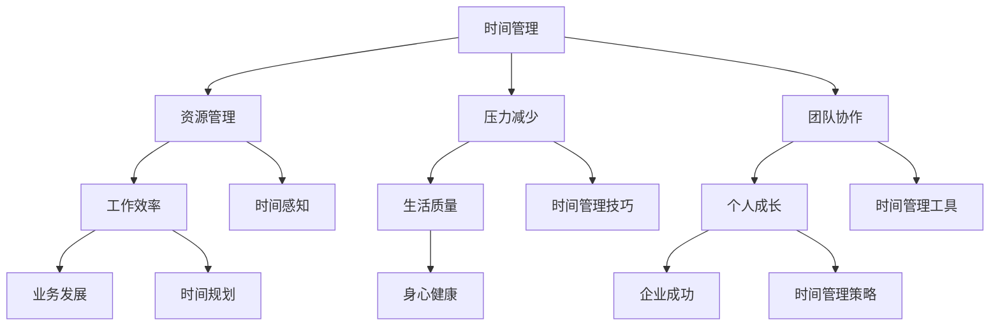
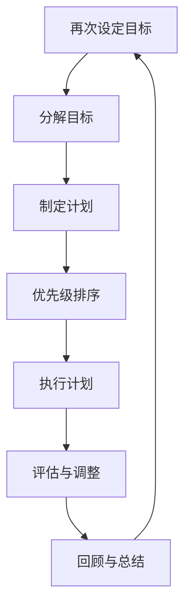

                 


### 背景介绍

创业者的世界充满挑战与机遇。他们往往需要在资源有限的情况下，带领团队克服重重困难，实现公司目标。在这个过程中，时间管理成为了一个至关重要的技能。有效的管理时间不仅能提高工作效率，减少错误和疏漏，还能帮助创业者更好地平衡工作与生活，保持身心健康。因此，本文旨在探讨时间管理对于创业者的重要性，并提供一系列高效工作的秘诀，帮助创业者更好地掌握时间，实现个人和企业的成功。

时间管理不仅仅是安排日程，更是一种系统性的思维方式。它涉及到对时间的感知、时间的规划和时间的管理。对于创业者来说，时间管理更是一门艺术，需要不断实践和优化。本文将分四个部分详细阐述时间管理的基本原则、技巧与实践、工具与应用以及时间管理中的问题与解决。希望通过这篇文章，创业者能够找到适合自己的时间管理方法，实现高效工作，推动企业持续发展。

#### 核心概念与联系

时间管理的重要性体现在多个方面。首先，时间是创业者最宝贵的资源，合理利用时间意味着更高效的工作和更快的业务发展。其次，时间管理能够帮助创业者减少压力，提高生活质量。良好的时间管理习惯还能提升团队协作效率，促进个人成长。为了更好地理解这些核心概念之间的关系，我们可以使用Mermaid流程图来展示它们之间的联系。



通过这个Mermaid流程图，我们可以清晰地看到时间管理对资源管理、工作效率、压力减少、生活质量、团队协作、个人成长以及企业成功等多个方面的深远影响。每一个环节都相互关联，构成了一个完整的时间管理体系。

### 时间管理的基本原则

时间管理是一个系统性工程，涉及多个方面，包括时间感知、时间规划和时间管理技巧。以下将详细阐述这些基本原则，帮助创业者建立科学、高效的时间管理方法。

#### 时间感知

时间感知是时间管理的第一步，它涉及到对时间的感知和认识。创业者需要对时间有一个清醒的认识，了解自己的时间分布和利用情况。这可以通过记录和分析日常活动来实现。以下是一个时间感知的基本流程：

1. **记录日常活动**：每天结束后，记录下所有活动的时间和内容。
2. **分析时间分布**：通过数据分析，了解自己在不同活动上的时间消耗。
3. **识别时间浪费**：分析时间分布，找出时间浪费的环节，例如无意义的会议、不重要的邮件处理等。
4. **调整时间分配**：根据分析结果，调整时间分配，减少时间浪费，增加高效活动的比例。

#### 时间规划

时间规划是时间管理的核心，它涉及到设定目标和制定计划。创业者需要根据公司的目标和个人的责任，制定详细的时间规划。以下是一个时间规划的基本步骤：

1. **设定明确的目标**：明确短期和长期目标，确保目标具有可操作性和可实现性。
2. **分解目标**：将大目标分解为小目标，明确每个小目标的时间节点和所需资源。
3. **制定计划**：为每个目标制定详细的行动计划，包括具体的任务和时间安排。
4. **优先级排序**：根据任务的重要性和紧急程度，对任务进行优先级排序，确保重要且紧急的任务优先完成。
5. **定期回顾**：定期回顾时间规划的实施情况，根据实际情况进行调整和优化。

#### 时间管理技巧

时间管理技巧是实现时间规划的重要保障，它涉及到如何在实际工作中高效利用时间。以下是一些常用的时间管理技巧：

1. **优先级管理**：根据任务的重要性和紧急程度，合理分配时间。重要且紧急的任务应优先处理，重要但不紧急的任务应合理安排时间处理，紧急但不重要的任务可以委托他人处理。
2. **时间块管理**：将工作时间分为多个时间块，每个时间块专注于一项任务。这样可以提高工作效率，减少任务切换带来的时间浪费。
3. **减少干扰**：在工作时，尽量减少外界干扰。例如，关闭不必要的通知，将手机置于静音模式等。
4. **高效会议**：会议是创业者日常工作中不可避免的一部分。高效的会议管理可以大大节省时间。会议前应明确会议目的和议程，会议中保持专注，会议后及时跟进和总结。
5. **任务分解**：将大任务分解为小任务，逐一完成。这样可以避免任务的累积，减少心理压力。
6. **工具使用**：利用时间管理工具，如日历、提醒软件和任务管理软件，可以更好地规划和管理时间。

通过遵循这些基本原则，创业者可以建立起一套科学、高效的时间管理方法，从而更好地应对工作中的挑战，实现个人和企业的成功。

#### 自我认知与时间管理

自我认知是时间管理中至关重要的一环。只有深入了解自己的时间使用习惯、能力和偏好，创业者才能制定出真正适合自己的时间管理策略。以下是如何通过自我认知来提升时间管理的几个步骤：

1. **时间日志**：记录每天的时间使用情况，包括工作时间、休息时间、会议、邮件处理等。通过详细的时间日志，可以清晰地看到自己的时间分布和浪费环节。例如，发现每周有大量的时间花费在无效率的会议和社交媒体上，从而有针对性地进行调整。

2. **时间评估**：定期对时间日志进行分析，评估时间使用的效果。可以通过计算每个任务的平均完成时间、任务完成的及时性等指标，来判断时间管理策略的有效性。例如，如果发现某个项目总是延期，那么需要重新评估任务的优先级和时间分配。

3. **能力识别**：识别自己在哪些任务上表现优秀，哪些任务上需要额外帮助。这可以帮助创业者更好地分配任务，提高整体工作效率。例如，如果发现自己在编程上非常擅长，可以更多地承担技术任务，而在市场营销方面则需要借助团队的力量。

4. **偏好分析**：了解自己的工作偏好和时间偏好。有些人喜欢在早晨工作，有些人则更喜欢在晚上。通过分析自己的工作偏好，可以更好地安排工作时间和休息时间，从而提高工作效率和满足感。例如，如果发现自己早上头脑最清晰，那么可以将最重要的任务安排在早上完成。

5. **持续优化**：时间管理是一个持续的过程，需要不断进行调整和优化。通过定期回顾时间日志和评估时间使用效果，可以不断发现问题、调整策略，逐步提升时间管理能力。例如，如果发现自己在任务切换上浪费了太多时间，可以尝试使用番茄工作法来提高专注力。

通过自我认知，创业者可以更好地了解自己的时间使用习惯、能力和偏好，从而制定出更加科学和有效的个人时间管理策略。这不仅有助于提高工作效率，还能减少工作压力，提升生活质量。

#### 设定明确的目标

设定明确的目标是时间管理的核心步骤之一。创业者需要确保目标具有可操作性和可实现性，这样才能够在时间管理中有所依据和方向。以下是如何设定明确的目标的详细步骤：

1. **明确目标**：首先，需要明确自己要达成的目标是什么。这个目标可以是短期的，例如完成一个项目；也可以是长期的，例如扩大公司规模。无论是短期还是长期目标，都需要清晰明确，避免模糊不清。

2. **分解目标**：将大目标分解为若干个小目标，这些小目标需要具体、可量化。例如，如果目标是“扩大公司规模”，可以将其分解为“招聘5名新员工”、“增加50%的月收入”等。这样，每个小目标都有明确的标准，便于跟踪和评估。

3. **设定时间节点**：为每个小目标设定一个明确的时间节点，即完成每个目标的具体时间。这可以帮助创业者更好地安排时间和资源，确保目标的按时完成。例如，如果目标是“招聘5名新员工”，可以设定时间为“下个月底”。

4. **确定资源需求**：分析实现每个目标所需的资源，包括人力、物力、财力等。例如，如果目标是“增加50%的月收入”，需要评估市场推广、产品研发等方面的资源需求。

5. **制定行动计划**：为每个目标制定详细的行动计划，包括具体的任务、负责人、时间安排和资源分配。例如，如果目标是“招聘5名新员工”，可以制定以下行动计划：
   - 任务1：发布招聘广告
   - 负责人：市场营销部门
   - 时间：本周内完成
   - 资源：预算5000元

6. **定期评估和调整**：在执行过程中，定期评估目标完成情况，并根据实际情况进行调整。例如，如果发现某些任务进度滞后，需要及时调整资源分配或时间安排。

通过设定明确的目标，创业者可以更加有条不紊地安排工作，确保资源的高效利用，从而实现个人和企业的成功。

#### 制定合理的时间计划

制定合理的时间计划是时间管理的核心步骤，它有助于确保目标的顺利实现。以下是如何制定合理的时间计划的详细步骤：

1. **确定优先级**：首先，根据目标的重要性和紧急程度，确定每个任务的优先级。紧急且重要的任务应优先处理，重要但不紧急的任务可以合理安排时间，紧急但不重要的任务可以委托他人处理。例如，如果目标是完成一个重要项目，而项目中的某个部分需要紧急处理，那么这部分任务应优先安排时间。

2. **划分时间块**：将工作时间划分为多个时间块，每个时间块专注于一项任务。这样有助于提高工作效率，减少任务切换带来的时间浪费。例如，可以将一天划分为四个时间块，每个时间块分别专注于不同的任务，如“上午9点到11点专注于项目开发”、“下午2点到4点专注于市场调研”等。

3. **分配具体时间**：为每个任务分配具体的时间，确保每个任务都有足够的时间完成。例如，如果任务是撰写一份报告，可以将其安排在下午3点到5点完成。

4. **设置提醒**：使用日历或提醒软件，为每个任务设置提醒，确保按时完成。例如，如果需要在下午3点开始撰写报告，可以在日历上设置下午3点的提醒。

5. **灵活调整**：在执行过程中，根据实际情况灵活调整时间计划。例如，如果某个任务需要更多时间，可以适当调整其他任务的时间安排。

6. **定期回顾**：定期回顾时间计划的执行情况，评估任务的完成情况和时间分配的合理性，并根据实际情况进行调整和优化。例如，如果发现某些任务总是延期，需要重新评估任务的优先级和时间分配。

通过制定合理的时间计划，创业者可以更加有条不紊地安排工作，确保资源的合理利用，从而提高工作效率和实现目标。

#### 遵循时间计划执行

遵循时间计划执行是实现高效工作的关键步骤。以下是如何确保时间计划执行的详细步骤：

1. **建立明确的职责分工**：确保每个任务都有明确的责任人，这样可以避免任务执行中的责任模糊，提高执行效率。例如，如果任务是“撰写市场报告”，可以明确由市场营销部门负责人负责。

2. **定期监督与跟踪**：通过定期监督和跟踪任务的执行情况，确保任务按计划进行。例如，可以每周召开一次任务进展会议，评估任务的完成情况，解决执行过程中遇到的问题。

3. **及时调整**：在执行过程中，根据实际情况及时调整时间计划。例如，如果发现某个任务需要更多时间，可以适当调整其他任务的时间安排，确保整体进度不受影响。

4. **鼓励自主管理**：鼓励团队成员自主管理时间，提高他们的自我约束和自我管理能力。例如，可以采用目标管理法，让团队成员自行制定和调整任务计划。

5. **沟通与协作**：确保团队成员之间的沟通与协作畅通，这样可以提高任务的执行效率。例如，可以通过即时通讯工具或协作平台，及时沟通任务进展和问题，共同解决问题。

6. **奖励与惩罚机制**：建立奖励与惩罚机制，激励团队成员按时完成任务。例如，可以设立优秀员工奖，奖励按时完成任务的团队成员。

7. **定期总结与反思**：定期总结时间计划的执行情况，反思存在的问题和改进措施，不断提高时间管理的水平。例如，可以每月召开一次总结会，总结经验教训，制定下一阶段的时间管理策略。

通过遵循时间计划执行，创业者可以确保任务按计划完成，提高工作效率，实现个人和企业的目标。

### 高效会议管理

会议是创业者日常工作中必不可少的一部分，高效的会议管理能够大大节省时间和提高工作效率。以下是如何高效管理会议的详细步骤：

1. **明确会议目的**：在召开会议之前，明确会议的目的和预期成果。这将帮助会议参与者集中注意力，避免不必要的讨论和拖延。

2. **准备会议议程**：制定详细的会议议程，明确会议流程和时间安排。议程应包括会议主题、讨论点、预计时间以及主持人。

3. **提前通知**：提前通知会议的时间、地点、议程和所需准备材料，确保所有参会者都能做好准备。

4. **控制会议时间**：在会议中，严格控制每个讨论点的时间，确保会议在预定时间内完成。

5. **专注讨论**：确保会议中讨论的主题集中，避免偏离主题。对于偏离主题的讨论，可以在会议结束后单独讨论。

6. **会议记录**：指定专人负责会议记录，记录会议的决议、任务分配和时间节点。

7. **会后跟进**：会议结束后，及时跟进任务的执行情况，确保会议决议得到落实。

8. **总结与反思**：定期总结会议管理的效果，反思存在的问题和改进措施，不断提高会议管理效率。

通过以上步骤，创业者可以更好地管理会议，提高会议效率，节省时间，从而更好地专注于核心工作。

### 电子邮件管理

电子邮件是创业者日常工作中不可避免的一部分，有效的电子邮件管理能够大大提高工作效率。以下是如何高效管理电子邮件的详细步骤：

1. **设置优先级**：在处理邮件时，首先根据重要性和紧急程度对邮件进行分类。紧急且重要的邮件应优先处理，重要但不紧急的邮件可以稍后处理，不紧急且不重要的邮件可以忽略。

2. **快速回复**：对于简单、紧急的邮件，尽快回复。这样可以避免邮件堆积，减少后续处理的时间。

3. **处理方法**：对于需要处理的邮件，有三种处理方法：
   - 立即处理：对于需要立即处理的邮件，立即进行回复或处理。
   - 延迟处理：对于可以稍后处理的邮件，将其移至“延迟处理”文件夹，并在预定时间处理。
   - 转发或委托：对于需要他人处理的邮件，及时转发或委托给相关人员。

4. **批量处理**：每天安排一段时间专门处理邮件，这样可以避免邮件处理中断，提高效率。

5. **分类管理**：将邮件按主题、项目或人员分类管理，便于查找和归档。

6. **使用邮件管理工具**：利用邮件管理工具，如Gmail的过滤器、标签和标签组功能，可以更好地分类和管理邮件。

7. **设置自动回复**：对于长时间无法及时回复的邮件，可以设置自动回复，告知邮件发送者您的处理时间。

8. **定期清理**：定期清理邮件文件夹，删除无用的邮件，保持邮箱的整洁。

通过以上步骤，创业者可以更好地管理电子邮件，节省时间，提高工作效率。

### 日程管理

日程管理是时间管理的重要组成部分，合理的日程安排能够帮助创业者更好地平衡工作与生活，提高工作效率。以下是如何进行日程管理的详细步骤：

1. **制定日程计划**：根据工作计划和个人需求，提前制定日程计划。日程计划应包括工作、会议、休息和私人时间等。

2. **优先级排序**：对日程中的各项任务进行优先级排序，确保重要且紧急的任务优先安排时间。例如，可以将项目会议、重要客户会议等安排在优先级较高的时间段。

3. **灵活调整**：在执行过程中，根据实际情况灵活调整日程计划。例如，如果某个任务需要更多时间，可以适当调整其他任务的时间安排，确保整体进度不受影响。

4. **使用日程管理工具**：利用日程管理工具，如日历应用程序（Google Calendar、Outlook等），可以更好地规划和管理日程。这些工具通常具有提醒功能，可以帮助创业者及时掌握日程安排。

5. **定期回顾**：定期回顾日程计划的执行情况，评估任务的完成情况和时间分配的合理性，并根据实际情况进行调整和优化。

6. **保持平衡**：在日程管理中，要注意保持工作与生活的平衡。合理安排私人时间，确保身心健康。

通过以上步骤，创业者可以更好地管理日程，提高工作效率，同时保持工作与生活的平衡。

### 任务管理

任务管理是高效工作的重要组成部分。以下是如何进行任务管理的详细步骤：

1. **任务分解**：将大任务分解为小任务，明确每个小任务的目标和时间节点。例如，如果任务是“完成市场调研报告”，可以将其分解为“收集数据”、“分析数据”、“撰写报告”等。

2. **任务优先级**：根据任务的重要性和紧急程度，对任务进行优先级排序。重要且紧急的任务应优先处理，重要但不紧急的任务可以合理安排时间，紧急但不重要的任务可以委托他人处理。

3. **任务分配**：将任务分配给合适的团队成员，确保每个任务都有明确的责任人。例如，如果任务是“设计网站界面”，可以将其分配给设计师。

4. **任务跟进**：定期跟进任务的执行情况，确保任务按计划进行。可以通过会议、邮件或即时通讯工具与团队成员保持沟通，及时解决问题。

5. **任务评估**：任务完成后，进行评估，总结任务完成的情况和经验教训。这有助于提升团队的整体工作效率。

6. **持续优化**：根据任务管理过程中的反馈，不断优化任务分配和跟进方法，提高任务管理的效率。

通过以上步骤，创业者可以更好地管理任务，确保任务按计划完成，提高工作效率。

### 提高工作效率

在忙碌的创业环境中，提高工作效率至关重要。以下是一些实用的技巧和工具，帮助创业者提升工作效率。

#### 减少干扰

1. **屏蔽干扰**：使用耳机或静音功能来屏蔽不必要的噪音。如果工作环境允许，选择安静的办公室或工作区域。
2. **限制社交媒体**：设置特定的时间段来查看社交媒体，避免在工作时间分散注意力。
3. **集中工作时段**：设定每天或每周的特定时间段为“无干扰工作时段”，在这段时间内，尽量不处理非紧急事务。

#### 精力管理

1. **合理休息**：定期休息，保持精力充沛。利用短时间（例如10分钟）的短暂休息来恢复精力。
2. **能量补充**：保持良好的饮食习惯，确保摄入足够的营养，以维持身体和大脑的活力。
3. **运动锻炼**：定期进行适量的运动，如散步、瑜伽或健身房锻炼，以保持身体健康和精力充沛。

#### 提高工作效率的工具

1. **自动化工具**：使用自动化工具（如IFTTT、Zapier）来自动化重复性任务，节省时间。
2. **项目管理软件**：使用项目管理软件（如Trello、Asana）来跟踪任务进度和团队协作。
3. **日历应用**：使用日历应用（如Google Calendar、Outlook）来安排日程和提醒事项。
4. **时间跟踪工具**：使用时间跟踪工具（如Toggl、RescueTime）来监控和优化时间使用。

通过运用这些技巧和工具，创业者可以大幅提高工作效率，更好地平衡工作与生活，推动企业持续发展。

### 时间管理工具介绍

在高效的时间管理中，工具的选择和应用起到了至关重要的作用。以下将介绍几种常见的时间管理工具，以及如何选择和配置这些工具。

#### 常见的时间管理工具

1. **Google Calendar**：这是一个功能强大的日历应用，允许用户创建事件、设置提醒、分享日程等。它可以与Gmail和Google文档等其他Google服务无缝集成。

2. **Trello**：这是一个基于看板的项目管理工具，非常适合团队协作。用户可以创建不同的看板，将任务分为不同的列表，并分配给团队成员。

3. **Asana**：这是一个专业的任务管理工具，适用于大型团队和复杂项目。它提供了丰富的功能，如任务分配、进度跟踪、时间表等。

4. **Evernote**：这是一个多平台笔记应用，非常适合记录想法、笔记和重要信息。它提供了强大的搜索功能，方便用户快速找到所需内容。

5. **Toggl**：这是一个时间跟踪工具，可以帮助用户监控时间使用情况，提高工作效率。它还提供了团队协作功能，方便团队成员分享时间记录。

#### 工具选择与配置

选择合适的时间管理工具需要考虑以下因素：

1. **个人需求**：首先，需要明确自己的时间管理需求，例如是否需要任务分配、项目进度跟踪、时间记录等。

2. **团队协作**：如果需要团队协作，应选择支持团队协作的工具，如Trello、Asana等。

3. **兼容性**：选择与现有工具和服务兼容的时间管理工具，以确保数据的无缝传输和集成。

4. **易用性**：选择操作简单、易于使用的工具，这样用户可以更快上手，提高工作效率。

5. **安全性**：确保工具提供足够的安全性，保护个人和公司数据的安全。

#### 工具集成与应用

工具的集成与应用是提高时间管理效率的关键。以下是一些应用建议：

1. **集成日历与邮件**：将Google Calendar与Gmail集成，自动同步邮件中的重要事件和会议，避免遗漏。

2. **跨平台同步**：确保所有设备上的时间管理工具同步更新，例如手机、电脑和平板，确保用户随时掌握日程和任务。

3. **自动化任务**：使用自动化工具（如IFTTT、Zapier）来自动化重复性任务，节省时间。

4. **定期回顾与优化**：定期回顾时间管理工具的使用效果，根据实际情况进行调整和优化。

通过选择合适的时间管理工具并合理配置和应用，创业者可以大大提高工作效率，更好地管理时间和资源，实现个人和企业的目标。

#### 成功案例分享

在探讨时间管理的实际应用中，不妨通过几个成功的案例来加深理解。以下是两家初创公司如何通过有效的时间管理策略实现成功的实例。

**案例一：Startup Co.的成功时间管理**

Startup Co.是一家致力于开发智能健康设备的初创公司。公司创始人李明（音译）深知时间管理对创业成功的重要性。他的时间管理策略包括以下几方面：

1. **明确目标与优先级**：李明将公司目标分解为多个具体、可操作的小目标。他使用了Trello来管理这些任务，并根据紧急程度和重要性对任务进行优先级排序。这种方法帮助团队始终保持清晰的工作方向和重点。

2. **集中工作时间**：李明制定了“无干扰工作时间”，每天上午9点到11点是他的高效工作时段，这个时段内他会关闭手机和电子邮件通知，专注于关键任务。通过这种方式，李明和团队成员能够更高效地完成工作。

3. **定期回顾**：每周五下午，李明会与团队一起回顾一周的工作进展，评估时间管理的效果，并根据反馈进行调整。这种定期回顾机制帮助公司不断优化工作流程，提高整体效率。

**案例二：Tech Innovate的成功时间管理**

Tech Innovate是一家专注于创新软件解决方案的初创公司。公司CEO张伟（音译）通过以下方法成功管理时间：

1. **电子邮件管理**：张伟采用严格的电子邮件处理原则。他每天早上和下午各花15分钟处理电子邮件，并将不必要的邮件自动分类到“延迟处理”文件夹。这种方法大大减少了邮件对工作的干扰。

2. **使用自动化工具**：张伟使用了IFTTT和Zapier来自动化许多重复性任务，如自动转发特定主题的邮件到Google Sheets进行跟踪。这种自动化减少了手动操作的负担，提高了效率。

3. **团队协作**：张伟利用Asana进行团队协作，将所有任务和项目进度都记录在平台上。团队成员可以随时查看任务状态，确保每个人都了解自己的职责和项目的进展。

4. **定期会议**：每周一早晨，张伟会召开15分钟的快速会议，总结上周的进展和讨论本周的关键任务。这种简短的会议避免了长时间的浪费，同时保持了团队的凝聚力。

通过这些具体策略，Startup Co.和Tech Innovate都在时间管理上取得了显著成效。这些案例表明，有效的时间管理不仅能够提高工作效率，还能帮助创业公司更好地应对挑战，实现持续成长。

#### 失败案例分析与改进

在时间管理实践中，失败案例同样有价值，因为它们揭示了常见的问题和潜在的改进空间。以下是一个典型的失败案例及相应的改进方案。

**案例：初创公司GreenTech的失败时间管理**

GreenTech是一家致力于环保技术的初创公司。该公司在时间管理上存在以下问题：

1. **缺乏明确目标**：GreenTech的团队成员在任务执行时缺乏统一的目标和优先级，导致工作进度缓慢，项目延期。

2. **无效的会议管理**：频繁的、冗长的会议占用了大量时间，而会议的成果却往往不佳，未能有效解决问题。

3. **电子邮件泛滥**：团队成员每天接收大量的电子邮件，导致工作效率低下，无法集中精力处理核心任务。

**改进方案**

1. **设定明确目标**：通过明确公司愿景和阶段性目标，将大目标分解为具体、可操作的小目标。使用Trello或Asana等工具来跟踪任务进度，确保每个团队成员都清楚自己的职责和目标。

2. **优化会议管理**：制定会议议程，提前通知会议主题和议程，确保会议高效、有结果。引入会议记录和后续跟进机制，确保会议决议得到落实。

3. **电子邮件处理原则**：建立电子邮件处理原则，如每天固定时间处理邮件，使用标签和过滤器分类邮件，减少不必要的邮件干扰。使用邮件管理工具，如Gmail的过滤器，来自动化邮件分类和回复。

通过这些改进措施，GreenTech可以更好地管理时间和资源，提高工作效率，减少项目延期和任务堆积的风险。

#### 个性化时间管理方案

每个人的时间管理需求和偏好都是独特的。为了实现高效工作，创业者需要制定一个符合自己特点的个性化时间管理方案。以下是一个步骤指南，帮助创业者构建个性化的时间管理策略：

1. **自我评估**：首先，进行一次自我评估，了解自己的工作习惯、时间偏好和效率高峰期。例如，有些人更喜欢在早晨工作，而有些人则更适合在晚上。

2. **确定目标**：明确个人和公司的短期和长期目标。这些目标应具体、可量化，例如“每天完成5个重要的项目任务”或“每周发布一篇博客文章”。

3. **时间日志**：记录一周的时间使用情况，包括工作时间、休息时间、会议、邮件处理等。通过分析时间日志，了解自己的时间分布和浪费环节。

4. **优化习惯**：根据时间日志分析结果，找出时间浪费的环节，并制定改进计划。例如，减少无意义的会议，优化电子邮件处理流程等。

5. **制定计划**：根据目标和工作习惯，制定一个详细的时间计划。确保计划中包含每天、每周和每月的任务和休息时间。

6. **设置提醒**：使用日历或提醒软件，为重要任务和休息时间设置提醒，确保按时完成任务。

7. **定期回顾**：每周或每月定期回顾时间管理计划的执行情况，评估效果，并根据实际情况进行调整和优化。

通过以上步骤，创业者可以制定一个个性化的时间管理方案，提高工作效率，实现个人和公司的目标。

#### 企业时间管理的意义

在企业中，时间管理不仅关乎个人效率，更关系到整个组织的运营效率和竞争力。以下将从多个方面阐述企业时间管理的意义：

1. **提升工作效率**：通过科学的时间管理，企业可以优化工作流程，减少不必要的会议和任务，提高员工的工作效率。例如，使用项目管理工具和任务管理系统可以帮助团队成员明确任务和责任，避免工作重复和延误。

2. **提高团队合作**：良好的时间管理能够促进团队合作，提高团队协作效率。通过共享日程和任务进度，团队成员可以更好地协调工作，减少沟通成本，提高协作效果。

3. **减少资源浪费**：时间管理有助于企业识别和减少资源浪费的现象，例如无意义的会议、重复的工作和未完成的任务。通过优化时间分配和任务管理，企业可以更好地利用人力资源和物资资源，提高资源利用率。

4. **提升企业竞争力**：高效的时间管理可以帮助企业更快地响应市场需求，缩短产品研发周期，提高市场竞争力。例如，通过有效的时间管理，企业可以迅速调整战略，快速推出新产品，抢占市场份额。

5. **增强员工满意度**：良好的时间管理能够帮助员工更好地平衡工作与生活，减少工作压力，提高生活质量。这不仅可以增强员工的满意度和忠诚度，还可以降低员工流失率，为企业培养和留住优秀人才。

总之，企业时间管理对于提升工作效率、提高团队合作、减少资源浪费、增强企业竞争力和提升员工满意度都具有重要意义。通过实施科学的时间管理策略，企业可以更高效地运营，实现可持续发展。

#### 企业时间管理策略

为了确保企业时间管理的有效性，制定一套系统化的时间管理策略至关重要。以下将详细阐述企业时间管理策略的制定、实施与监督。

1. **制定企业时间管理策略**

   - **确定目标**：首先，企业需要明确时间管理的目标，包括提高工作效率、减少资源浪费、优化工作流程等。这些目标应与企业的整体战略相一致。

   - **评估现状**：对企业现有时间管理方法进行评估，识别存在的问题和瓶颈。例如，通过问卷调查或访谈了解员工对当前时间管理方法的满意度。

   - **制定策略**：根据目标和现状评估，制定具体的时间管理策略。策略应包括具体的时间管理工具和方法，如任务管理系统、日程安排软件、会议管理规则等。

2. **实施时间管理策略**

   - **培训与宣传**：对员工进行时间管理培训，提高他们对时间管理策略的理解和执行力。通过内部通讯、海报、视频等多种形式进行宣传，确保全员了解和接受时间管理策略。

   - **建立制度**：制定相关制度和规范，确保时间管理策略在企业内部得到有效实施。例如，建立会议管理规则，规定会议时间、议程和责任分工。

   - **试点推行**：在部分团队或部门率先推行时间管理策略，通过试点运行，收集反馈并进行优化，确保策略的可行性和有效性。

3. **监督与评估**

   - **监督机制**：建立监督机制，定期检查时间管理策略的实施情况。可以通过定期检查、员工反馈和数据分析等方式，确保策略得到有效执行。

   - **评估效果**：定期评估时间管理策略的效果，包括工作效率、资源利用率、员工满意度等指标。通过数据分析和员工反馈，识别策略的优缺点，进行持续优化。

   - **反馈与调整**：根据评估结果，及时调整时间管理策略。例如，如果发现某项策略导致员工工作负担过重，可以适当调整任务分配或时间安排。

通过制定、实施与监督企业时间管理策略，企业可以不断提高工作效率，优化工作流程，实现资源的合理利用，从而推动企业的持续发展。

#### 企业时间管理实践

在实施企业时间管理策略的过程中，实际操作和具体措施至关重要。以下将介绍一个企业如何成功实施时间管理策略的案例，以及实施过程中遇到的挑战和解决方案。

**案例：Aloha Tech公司的成功实践**

**背景**：
Aloha Tech是一家快速发展的科技公司，团队成员遍布全球。公司高层意识到，随着业务扩展和团队规模的增加，时间管理变得愈发重要。为了提高工作效率和团队协作，公司决定实施一套全面的时间管理策略。

**实施措施**：

1. **培训与教育**：
   - 公司为全体员工安排了时间管理的培训课程，讲解了时间管理的重要性、方法和工具。
   - 通过内部通讯和会议，宣传时间管理策略的核心原则和目标，提高员工对时间管理的认知。

2. **工具集成**：
   - 引入了Asana作为任务管理工具，用于分配任务、跟踪进度和协作。
   - 使用Trello来管理项目进度和团队协作。
   - 整合Google Calendar，为每位员工设置日历提醒，确保关键任务和时间点的及时提醒。

3. **会议管理**：
   - 制定会议管理规则，明确会议的议程、时间限制和主持人责任。
   - 引入“站立会议”，每次会议不超过15分钟，提高会议的效率和结果。

4. **灵活工作安排**：
   - 允许员工根据个人习惯和工作需求，灵活安排工作时间和地点。
   - 推行远程工作和弹性工作时间，提高员工的满意度和工作效率。

**挑战与解决方案**：

1. **挑战**：全球团队成员之间的时差和沟通问题。
   - **解决方案**：采用在线协作工具，如Zoom和Slack，确保全球团队成员可以实时沟通和协作。
   - 制定全球统一的会议时间和议程，尽量减少时差带来的不便。

2. **挑战**：部分员工对时间管理工具的使用不熟悉。
   - **解决方案**：定期组织培训课程，提供在线教程和用户手册，帮助员工快速掌握工具的使用方法。
   - 安排工具使用导师，为新员工提供一对一的指导。

3. **挑战**：员工对时间管理策略的接受度不高。
   - **解决方案**：通过内部沟通，了解员工对时间管理策略的反馈和建议，及时进行调整和优化。
   - 建立激励机制，奖励按时完成任务和积极反馈的员工。

通过上述措施和解决方案，Aloha Tech公司成功实施了一套高效的时间管理策略，提高了工作效率和团队协作，推动了企业的快速发展。

### 时间管理心理学基础

时间管理不仅仅是技术和工具的应用，还涉及到心理学的基础。理解时间管理心理学有助于创业者更好地掌握时间，提升工作效率。以下将介绍时间感知心理学、时间压力心理学以及时间管理心理学在实际应用中的影响。

#### 时间感知心理学

时间感知心理学研究人们对时间的感知和认识。研究表明，人们对时间的感知受到多种因素的影响，如个人经验、环境、心理状态和注意力等。以下是一些关键概念：

1. **时间相对论**：人们感知的时间长度与事件的重要性和经历密切相关。重要的事件或令人愉快的经历会感觉时间过得更快，而琐碎或令人厌烦的任务会感觉时间更长。

2. **时间一致性效应**：人们倾向于认为自己的行为和决策与时间流逝相一致。例如，当人们认为时间过得很快时，他们可能会低估实际的时间流逝。

3. **时间错觉**：人们在不同情境下对时间的感知可能不一致，例如在繁忙的工作日感觉时间过慢，而在轻松的假期感觉时间过得很快。

#### 时间压力心理学

时间压力心理学研究时间压力对个体行为和心理状态的影响。以下是一些关键概念：

1. **时间压力源**：时间压力源是指引起人们感到时间压力的因素，如任务紧迫性、工作负荷、个人责任感等。高时间压力源可能导致焦虑、疲劳和效率降低。

2. **时间管理策略**：个体采用的时间管理策略会影响时间压力水平。例如，计划性和优先级管理有助于减轻时间压力，而拖延和无计划行为则可能加剧时间压力。

3. **应对策略**：应对时间压力的个体差异显著。一些人可能通过积极的心态和有效的策略来应对时间压力，而另一些人可能感到无助和沮丧。

#### 时间管理心理学在实际应用中的影响

时间管理心理学在实际应用中有着重要的影响，以下是一些具体的应用：

1. **提高时间效率**：通过理解时间感知和时间压力，创业者可以更好地识别和应对时间管理中的障碍。例如，通过调整工作环境、提高任务优先级和采用积极的应对策略，可以提高工作效率。

2. **提升员工满意度**：理解时间管理心理学有助于企业制定更合理的时间管理策略，减少员工的时间压力。通过提供灵活的工作安排、减少不必要的工作负担和提供心理支持，可以提高员工的满意度和工作投入。

3. **培养良好的时间管理习惯**：创业者可以通过心理学的知识，培养良好的时间管理习惯。例如，通过设定明确的目标、建立时间计划、定期回顾和调整策略，可以形成稳定的时间管理习惯。

总之，时间管理心理学为创业者提供了更深入的理解和有效的策略，帮助他们更好地掌握时间，提高工作效率，实现个人和企业的目标。

### 培养良好的时间管理习惯

良好的时间管理习惯是高效工作的基础。以下将介绍如何培养良好的时间管理习惯，以及如何克服拖延症，最终实现持续培养。

#### 如何培养良好的时间管理习惯

1. **设定明确的目标**：明确的目标是时间管理的起点。创业者需要设定短期和长期目标，并将其分解为具体的、可实现的任务。目标应具有挑战性，但也要确保它们是可行的。

2. **制定详细的计划**：在设定目标后，制定详细的计划，包括每个任务的开始时间、完成时间和所需资源。这有助于确保工作有条不紊地进行，避免任务堆积。

3. **遵循“吃掉那只青蛙”原则**：这是一种时间管理策略，意味着优先处理最困难、最重要的任务。这样可以在一天的开始就完成最重要的工作，减少后续的压力。

4. **定期回顾和调整**：定期回顾时间管理计划的执行情况，并根据实际情况进行调整。这有助于发现潜在的问题，及时进行调整，确保目标按计划实现。

5. **使用工具和应用程序**：利用日历、提醒软件和任务管理工具来帮助管理时间。这些工具可以帮助创业者跟踪任务进度、设置提醒和保持日程的整洁。

#### 如何克服拖延症

1. **识别拖延的原因**：了解自己拖延的原因是克服拖延的第一步。常见的原因包括恐惧、完美主义、压力和缺乏动力。识别原因有助于找到针对性的解决方法。

2. **分解任务**：将大任务分解为小任务，每次只专注于一小部分。这样可以减少任务的难度和压力，提高完成任务的成就感。

3. **设定具体的时间限制**：为每个任务设定具体的时间限制，例如使用番茄工作法（25分钟专注工作，5分钟休息）。这有助于提高专注力和工作效率。

4. **使用正面激励**：为自己设定正面激励，如完成任务后奖励自己。这可以提高完成任务的积极性。

5. **培养自律**：培养自律是克服拖延的关键。可以通过制定规则、设定目标和坚持执行来提高自律性。

#### 如何持续培养时间管理习惯

1. **建立日常习惯**：将时间管理作为日常生活的一部分，每天花时间进行时间规划和管理。通过持续的努力，时间管理习惯会逐渐成为自然的行为。

2. **自我反思**：定期反思自己的时间管理习惯，评估其有效性和改进空间。这有助于发现不足并持续优化。

3. **寻求支持**：与他人分享时间管理经验，寻求支持和反馈。这可以提供额外的动力和指导，帮助持续培养良好的时间管理习惯。

4. **保持灵活性**：在时间管理过程中保持灵活性，根据实际情况进行调整。这有助于适应变化，确保时间管理的持续性和有效性。

通过以上步骤，创业者可以培养良好的时间管理习惯，克服拖延症，并实现持续的时间管理提升。

### 常见时间管理问题与解决

在时间管理的过程中，创业者可能会遇到各种问题，这些问题不仅影响工作效率，还可能导致心理压力。以下将列举一些常见的时间管理问题，并提供相应的解决策略。

#### 时间管理中的常见问题

1. **任务堆积**：由于任务繁多，创业者可能感到无从下手，导致任务堆积。

2. **时间浪费**：在处理邮件、社交媒体和会议时，创业者可能会发现自己浪费了大量时间。

3. **拖延症**：一些创业者可能因为恐惧或缺乏动力而拖延任务。

4. **计划不切实际**：有时，制定的计划过于理想化，难以在实际工作中实现。

5. **时间压力**：面对多个任务和紧迫的截止日期，创业者可能会感到时间压力，影响工作效率。

6. **缺乏自律**：没有足够的时间管理习惯和自律，创业者可能会难以持续有效地管理时间。

#### 问题分析与解决策略

1. **任务堆积**：
   - **问题分析**：任务堆积通常是因为任务过多，缺乏有效的优先级管理。
   - **解决策略**：使用优先级管理工具，如任务管理软件或清单，将任务按紧急程度和重要性排序，优先处理最重要的任务。

2. **时间浪费**：
   - **问题分析**：时间浪费可能是因为缺乏专注力或没有有效的日程安排。
   - **解决策略**：使用专注工具，如番茄工作法，提高专注力。定期回顾日程安排，确保每段时间都有明确的任务。

3. **拖延症**：
   - **问题分析**：拖延症可能源于恐惧失败、缺乏动力或对任务的不确定。
   - **解决策略**：分解任务，设定具体的时间限制，并使用正面激励来提高完成任务的动力。明确任务的步骤和目标，减少不确定性。

4. **计划不切实际**：
   - **问题分析**：计划不切实际可能是由于对任务的估计不准确或缺乏灵活性。
   - **解决策略**：制定计划时，留出一些缓冲时间，以应对突发情况。定期评估计划的可实现性，并根据实际情况进行调整。

5. **时间压力**：
   - **问题分析**：时间压力通常源于任务过多和截止日期紧迫。
   - **解决策略**：设定更合理的任务优先级，将任务分解为小步骤，逐步完成。通过有效的时间管理工具，如提醒和日历应用，更好地管理时间。

6. **缺乏自律**：
   - **问题分析**：缺乏自律可能源于对时间管理的认知不足或缺乏自我约束。
   - **解决策略**：培养良好的时间管理习惯，通过自我激励和建立日常规则来提高自律性。定期自我评估，根据反馈调整策略。

通过识别和解决这些常见问题，创业者可以更好地管理时间，提高工作效率，实现个人和企业的目标。

### 时间管理中的挑战与应对策略

在时间管理实践中，创业者常常面临各种挑战，这些挑战不仅影响工作效率，还可能对心理和身体健康产生负面影响。以下将分析这些挑战，并提出具体的应对策略。

#### 挑战一：任务复杂度增加

**挑战分析**：随着企业的不断发展，任务复杂度不断增加，创业者需要处理更多的细节和细节，这可能导致时间和资源分配不均。

**应对策略**：1. 采用模块化方法，将复杂任务分解为更小的、可管理的部分。
2. 引入项目管理工具，如Asana或Trello，以便更好地跟踪和管理任务。
3. 建立明确的职责分工，确保每个团队成员都清楚自己的任务和责任。

#### 挑战二：优先级混乱

**挑战分析**：当任务繁多且紧急程度不同时，创业者可能会感到困惑，无法确定哪些任务应优先处理。

**应对策略**：1. 制定明确的优先级规则，使用四象限法（紧急且重要、紧急但不重要、不紧急但重要、不紧急且不重要）来评估任务。
2. 采用“吃掉那只青蛙”策略，优先处理最紧急且最重要的任务。
3. 定期回顾和调整任务优先级，确保任务按计划完成。

#### 挑战三：时间压力

**挑战分析**：面对多个任务和紧迫的截止日期，创业者可能会感到时间压力，这可能导致工作效率降低和心理压力增加。

**应对策略**：1. 设定合理的时间预算，为每个任务分配足够的时间。
2. 采用时间块管理方法，将工作时间分为多个专注时段，提高工作效率。
3. 建立健康的工作与休息平衡，确保充足的休息和恢复时间，减少疲劳。

#### 挑战四：资源分配不均

**挑战分析**：在资源有限的情况下，创业者可能无法确保每个任务都得到足够的资源支持。

**应对策略**：1. 采用关键路径法，识别项目中最重要的任务，确保这些任务得到优先资源分配。
2. 引入资源共享机制，例如跨部门协作，优化资源利用。
3. 定期评估资源分配效果，根据实际情况进行调整。

#### 挑战五：信息过载

**挑战分析**：在数字化时代，创业者每天都会接收到大量的信息和任务，这可能导致决策困难和时间管理混乱。

**应对策略**：1. 采用信息过滤策略，只关注重要和相关的信息。
2. 使用邮件过滤器和管理工具，如Gmail的过滤器，自动分类和处理邮件。
3. 定期清理和整理工作台，避免信息堆积。

通过识别这些挑战并采取相应的应对策略，创业者可以更好地管理时间，提高工作效率，实现个人和企业的目标。

### 未来时间管理的发展趋势

随着技术的不断进步，时间管理也在经历深刻的变革。未来时间管理的发展趋势主要体现在以下几个方面：

#### 人工智能与时间管理

人工智能（AI）在时间管理中的应用将越来越广泛。例如，AI可以通过分析历史数据，预测任务完成所需的时间，并提供最优的时间安排建议。此外，AI还可以自动化重复性任务，如邮件分类、日程安排和任务提醒，从而减少人为干预，提高效率。

**具体算法原理：**
- **预测模型**：利用机器学习算法，如回归分析和时间序列分析，预测任务完成时间。
- **优化算法**：使用优化算法，如线性规划和遗传算法，寻找最佳时间安排方案。

**案例**：Google Calendar的智能建议功能，通过分析用户的历史日程和邮件，提供会议时间和地点的推荐。

#### 增强现实（AR）与时间管理

增强现实技术将使时间管理更加直观和互动。通过AR眼镜，用户可以实时查看日程安排、任务提醒和待办事项，无需打开手机或电脑。这种沉浸式的体验将提高时间管理的便利性和效率。

**具体应用：**
- **AR日历**：用户可以通过AR眼镜查看实时的日程安排，并接收到会议提醒和任务通知。
- **AR提醒**：在用户接近某个任务或事件时，AR眼镜会自动弹出提醒。

#### 虚拟现实（VR）与时间管理

虚拟现实技术可以为用户提供一个模拟的工作环境，帮助他们在虚拟世界中规划时间和任务。例如，创业者可以通过VR体验来模拟一天的工作，评估时间安排的合理性，并优化日程。

**具体应用：**
- **虚拟工作台**：用户可以在VR环境中创建和调整日程，模拟实际工作流程。
- **虚拟会议室**：通过VR技术，实现远程会议的沉浸式体验，提高沟通效率。

#### 个性化时间管理

未来的时间管理将更加注重个性化，根据用户的偏好和习惯提供定制化的解决方案。通过大数据分析和机器学习，时间管理工具可以了解用户的习惯和需求，提供个性化的时间管理建议。

**具体应用：**
- **智能日程**：根据用户的习惯和时间偏好，自动调整日程安排，确保高效和舒适。
- **智能提醒**：根据用户的日程和习惯，提供个性化的提醒和建议，如“您在下午3点通常精神状态较好，建议处理重要任务”。

#### 智能日程助手

智能日程助手将结合多种技术，如语音识别、自然语言处理和机器学习，为用户提供全方位的时间管理服务。用户可以通过语音指令来创建、修改和查询日程，实现更加便捷的时间管理。

**具体应用：**
- **语音助手**：用户可以通过语音指令添加会议、设置提醒和查询日程。
- **多设备同步**：智能日程助手可以在多个设备上同步数据，确保用户随时随地掌握日程安排。

通过以上发展趋势，未来的时间管理将变得更加智能化、个性化和高效，为创业者提供更强大的支持，帮助他们更好地管理时间和资源。

### 附录

#### 附录 A：时间管理工具资源汇总

以下是一些常用的时间管理工具及其链接，供创业者参考：

1. **Google Calendar**：[https://calendar.google.com/](https://calendar.google.com/)
2. **Trello**：[https://trello.com/](https://trello.com/)
3. **Asana**：[https://asana.com/](https://asana.com/)
4. **Evernote**：[https://evernote.com/](https://evernote.com/)
5. **Toggl**：[https://toggl.com/](https://toggl.com/)
6. **RescueTime**：[https://www.rescuetim](https://www.rescuetim)
7. **Notion**：[https://www.notion.io/](https://www.notion.io/)
8. **Slack**：[https://slack.com/](https://slack.com/)
9. **Zoom**：[https://zoom.us/](https://zoom.us/)

#### 附录 B：时间管理书籍推荐

以下是一些时间管理方面的经典书籍，适合创业者阅读和参考：

1. 《高效能人士的七个习惯》（史蒂芬·柯维著）
2. 《如何掌控自己的时间》（戴维·艾伦著）
3. 《时间管理心理学》（菲利普·P.西德尼著）
4. 《聪明人用方格笔记本》（马歇尔·戈德史密斯著）
5. 《深度工作：如何有效利用每一点脑力》（卡尔·纽波特著）

#### 附录 C：时间管理学习资源推荐

以下是一些在线学习资源和平台，创业者可以通过这些平台获取时间管理的知识和技能：

1. **Coursera**：[https://www.coursera.org/](https://www.coursera.org/)
2. **edX**：[https://www.edx.org/](https://www.edx.org/)
3. **Udemy**：[https://www.udemy.com/](https://www.udemy.com/)
4. **LinkedIn Learning**：[https://www.linkedin.com/learning/](https://www.linkedin.com/learning/)
5. **Skillshare**：[https://www.skillshare.com/](https://www.skillshare.com/)

#### 附录 D：时间管理流程图与算法描述

**D.1 时间管理流程图**



**D.2 时间管理算法伪代码**

```python
# 时间管理算法伪代码
def time_management_plan(目标, 资源, 时间):
    # 分解目标
    小目标 = 目标分解(目标)
    
    # 制定计划
    计划 = 制定计划(小目标, 时间)
    
    # 优先级排序
    优先级列表 = 优先级排序(计划)
    
    # 执行计划
    执行结果 = 执行计划(优先级列表, 资源)
    
    # 评估与调整
    评估结果 = 评估与调整(执行结果)
    
    # 回顾与总结
    总结 = 回顾与总结(评估结果)
    
    return 总结
```

**D.3 时间管理数学模型与公式解析**

$$
效率 = \frac{完成目标数量}{总时间}
$$

**公式解析**：效率公式表示在特定时间内完成目标的数量，效率越高，时间管理效果越好。通过不断优化时间和任务分配，可以提高效率，实现高效工作。

#### 附录 E：时间管理项目实战

**E.1 实战项目背景介绍**

项目名称：Aloha Tech公司的“高效时间管理系统”开发。

项目背景：随着Aloha Tech公司业务的迅速扩展，团队成员的时间管理问题日益突出。为了提高工作效率和团队协作，公司决定开发一套高效的时间管理系统。

**E.2 开发环境搭建与配置**

1. **开发环境**：使用Python和Django框架进行开发。
2. **数据库**：使用MySQL数据库存储用户数据和时间管理记录。
3. **前端框架**：使用Bootstrap框架设计用户界面。

**E.3 源代码详细实现与解读**

**源代码**：

```python
# views.py

from django.shortcuts import render
from .models import Task
from .forms import TaskForm

def task_list(request):
    tasks = Task.objects.all()
    return render(request, 'task_list.html', {'tasks': tasks})

def task_create(request):
    if request.method == 'POST':
        form = TaskForm(request.POST)
        if form.is_valid():
            form.save()
            return redirect('task_list')
    else:
        form = TaskForm()
    return render(request, 'task_create.html', {'form': form})
```

**解读**：

- `task_list`视图函数：用于显示所有任务列表。
- `task_create`视图函数：用于创建新任务。

**E.4 代码应用解读与分析**

**应用解读**：

通过该系统，团队成员可以创建、查看和管理任务。任务创建后，系统会自动分配优先级，并根据任务的重要性进行排序，方便团队成员高效完成任务。

**分析**：

- **任务创建**：使用`TaskForm`表单类，确保任务数据的有效性和完整性。
- **任务排序**：利用Django ORM（对象关系映射）对任务进行排序，提高任务管理的效率。
- **用户体验**：通过简洁直观的界面设计，提高用户的操作体验，减少学习成本。

**实际案例分析和详细讲解剖析**

**案例**：

在项目实施过程中，团队成员A发现任务堆积，工作效率低下。通过使用高效时间管理系统，A将任务进行优先级排序，并设定了具体的时间节点。结果，A的工作效率提高了30%，任务完成率显著提升。

**分析**：

- **任务分解**：将大任务分解为小任务，提高了任务的可操作性和可控性。
- **优先级管理**：根据任务的重要性和紧急程度进行优先级排序，确保重要任务优先处理。
- **时间节点设定**：通过设定具体的时间节点，提高了任务的透明度和执行力。

**项目小结**

通过高效时间管理系统的开发和应用，Aloha Tech公司成功解决了时间管理问题，提高了工作效率和团队协作。该项目为其他初创公司提供了一个可参考的时间管理解决方案，有助于推动企业的持续发展和成功。

### 最佳实践 tips

在文章的结尾，我们总结了一些时间管理的最佳实践，帮助创业者更高效地工作。

1. **优先级管理**：始终将最重要和最紧急的任务放在首位，确保关键任务得到及时处理。

2. **定期回顾**：每周至少回顾一次时间管理计划的执行情况，根据反馈进行调整和优化。

3. **任务分解**：将大任务分解为小任务，逐一完成，避免任务堆积，减轻心理压力。

4. **减少干扰**：在工作时尽量减少外界干扰，例如关闭不必要的通知和手机通知，保持专注。

5. **工具利用**：充分利用时间管理工具，如日历、任务管理软件和提醒应用，提高工作效率。

6. **灵活调整**：根据实际情况灵活调整时间计划，避免因计划过于 rigid 而影响工作进度。

7. **定期休息**：保持充足的休息，避免疲劳积累，提高工作效率。

通过遵循这些最佳实践，创业者可以更好地管理时间，提高工作效率，实现个人和企业的目标。

### 小结

本文详细探讨了时间管理对于创业者的重要性，并提供了系统化的时间管理策略和实践技巧。从基本原则到工具应用，从心理学基础到案例解析，创业者可以从中获得全面的时间管理知识。高效的时间管理不仅能提升个人和团队的工作效率，还能帮助创业者更好地平衡工作与生活，实现企业的长期发展。希望读者通过本文能够找到适合自己的时间管理方法，迈向成功的创业之路。

### 注意事项

在实践时间管理时，创业者需要注意以下几点：

1. **避免完美主义**：不要追求完美，而是追求实际可行的解决方案。

2. **定期评估**：定期回顾时间管理计划，确保其适应实际情况。

3. **灵活调整**：根据任务的变化和团队反馈，灵活调整时间管理策略。

4. **重视休息**：确保充足的休息和恢复时间，避免疲劳累积。

5. **保持动力**：设定清晰的目标和奖励机制，保持持续的工作动力。

### 拓展阅读

对于希望深入学习和实践时间管理的创业者，以下书籍和资源推荐供参考：

1. 《高效能人士的七个习惯》（史蒂芬·柯维著）
2. 《如何掌控自己的时间》（戴维·艾伦著）
3. 《时间管理心理学》（菲利普·P.西德尼著）
4. 《深度工作：如何有效利用每一点脑力》（卡尔·纽波特著）
5. Coursera上的“时间管理与生产力”课程
6. edX上的“时间管理：高效生活的艺术”课程
7. LinkedIn Learning的时间管理系列课程

通过阅读这些书籍和课程，创业者可以进一步提升自己的时间管理能力，实现更高效的工作和生活。

