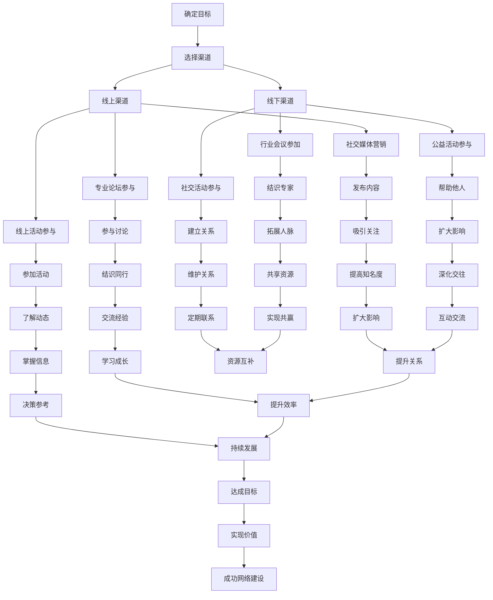
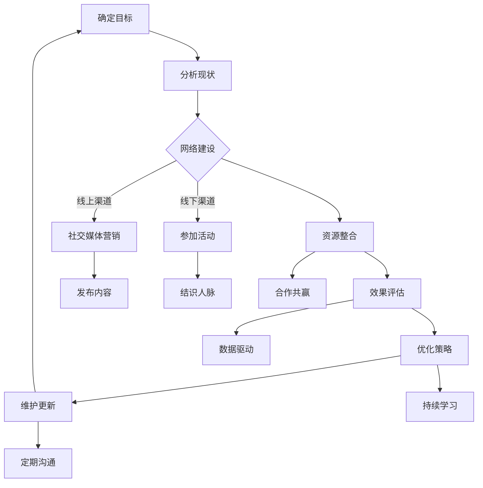

                 

### 文章标题

《创业者的网络建设与人脉拓展》

### 关键词

- 创业者
- 网络建设
- 人脉拓展
- 个人品牌
- 商业价值

### 摘要

本文旨在探讨创业者在网络建设与人脉拓展中的关键策略和实践。首先，文章介绍了网络建设的基础知识，包括其重要性、核心要素和原则策略。接着，讨论了个人品牌的塑造方法，包括概念、构建步骤和传播维护。然后，文章深入分析了人脉拓展的原理、方法、技巧和注意事项，并阐述了人脉网络的构建与维护策略。此外，文章还通过实战案例和策略，展示了如何将人脉资源转化为商业价值。最后，文章展望了网络建设与人脉拓展的未来趋势，并提供了相关的工具介绍。

## 第一部分：网络建设基础

在当今高度互联的世界中，网络建设已成为创业者成功的重要因素之一。这一部分将首先介绍网络建设的重要性，然后深入探讨网络建设的核心要素、原则与策略。

### 第1章：网络建设概述

#### 1.1 网络建设的重要性

网络建设对于创业者来说至关重要。它不仅能够扩大企业的影响力，还能帮助创业者获取更多的资源和机会。以下是网络建设的一些关键作用：

1. **信息传播**：通过网络，创业者可以迅速传播企业的信息，提高品牌知名度。
2. **资源整合**：通过建立广泛的人脉网络，创业者可以整合更多的资源，如人才、资金和技术等。
3. **市场拓展**：网络建设有助于创业者开拓新的市场，增加销售渠道。
4. **风险分担**：通过与其他创业者或企业建立合作关系，创业者可以共同分担风险。

#### 1.2 网络建设的核心要素

网络建设涉及多个核心要素，包括以下几个方面：

1. **信息流**：信息的快速流通是网络建设的基础。创业者需要建立有效的信息渠道，确保信息的及时传递和共享。
2. **人际网络**：人际网络是网络建设的核心。创业者需要积极拓展人脉，建立和维护良好的人际关系。
3. **资源共享**：通过资源共享，创业者可以减少成本，提高效率，实现共赢。
4. **品牌传播**：品牌传播是网络建设的重要组成部分。创业者需要制定有效的品牌传播策略，提高品牌影响力。

#### 1.3 网络建设的原则与策略

网络建设需要遵循一定的原则和策略，以确保其有效性和持续性。以下是一些关键原则和策略：

1. **明确目标**：创业者需要明确网络建设的具体目标，如市场拓展、资源整合等，以便制定相应的策略。
2. **多样化渠道**：创业者应通过多种渠道进行网络建设，如线上社交媒体、线下活动等，以覆盖更广泛的受众。
3. **持续投入**：网络建设是一个长期过程，需要持续投入时间和精力。创业者应保持耐心和毅力，不断优化网络建设策略。
4. **合作共赢**：创业者应寻求与其他创业者或企业建立合作关系，实现资源互补和共赢。
5. **数据驱动**：创业者应利用数据分析工具，对网络建设的效果进行评估和优化，确保网络建设的有效性。

### 第2章：个人品牌的塑造

个人品牌是创业者的核心竞争力之一。通过个人品牌的塑造，创业者可以提高自己的知名度和认可度，从而在竞争激烈的市场中脱颖而出。以下是个人品牌塑造的相关内容：

#### 2.1 个人品牌的概念与价值

1. **概念**：个人品牌是指创业者通过自身特质和专业知识，在市场中形成的独特形象和认知。
2. **价值**：个人品牌的价值体现在以下几个方面：
   - **增强信任**：良好的个人品牌能够增强客户和合作伙伴的信任感。
   - **提升竞争力**：个人品牌有助于创业者提高市场竞争力。
   - **增加机会**：个人品牌能够吸引更多的合作机会和投资。

#### 2.2 个人品牌的构建步骤

1. **明确定位**：创业者需要明确自己的专业领域和目标受众，以确定个人品牌的定位。
2. **塑造形象**：创业者应通过言行一致、专业化的形象塑造，展现自己的专业能力和个性魅力。
3. **内容创作**：创业者应通过博客、社交媒体等平台，持续输出高质量的内容，树立自己的专业形象。
4. **互动交流**：创业者需要积极与受众互动，了解市场需求和反馈，不断优化个人品牌。

#### 2.3 个人品牌的传播与维护

1. **传播策略**：创业者应制定有效的传播策略，如社交媒体营销、公关活动等，扩大个人品牌的影响力。
2. **维护形象**：创业者需要时刻注意维护个人形象，避免负面事件的影响。
3. **持续更新**：个人品牌需要不断更新，以适应市场变化和受众需求。
4. **反馈机制**：创业者应建立反馈机制，及时收集和回应受众的意见和建议，提升个人品牌的满意度。

## 第二部分：人脉拓展策略

人脉拓展是创业者网络建设的重要组成部分。通过有效的人脉拓展，创业者可以建立广泛的联系，获取更多的资源和机会。以下是人脉拓展的相关策略：

### 第3章：人脉拓展的原理与方法

#### 3.1 人脉拓展的核心原则

1. **互惠互利**：人脉拓展应基于互惠互利的原则，确保双方都能从中获益。
2. **诚信为本**：诚信是建立和维护人脉的基础。创业者应保持真诚和诚信，赢得他人的信任。
3. **主动出击**：人脉拓展需要主动出击，创业者应积极寻找机会，主动与他人建立联系。
4. **持续维护**：人脉拓展不是一次性工作，创业者需要持续维护和更新人脉关系。

#### 3.2 人脉拓展的渠道与方法

1. **线上渠道**：
   - **社交媒体**：如微信、微博、LinkedIn等，通过发布有价值的内容和积极参与讨论，吸引潜在的人脉。
   - **专业论坛**：如知乎、行业论坛等，通过参与专业讨论，结识行业内的专家和同行。
   - **线上活动**：如线上会议、线上讲座等，通过参加这些活动，扩大自己的社交圈子。

2. **线下渠道**：
   - **行业会议**：参加行业会议，结识行业内的专家和同行，了解行业动态。
   - **社交活动**：如俱乐部、聚会等，通过这些活动，建立和维护人际关系。
   - **公益活动**：参加公益活动，不仅可以帮助他人，还可以结识志同道合的人脉。

#### 3.3 人脉拓展的技巧与注意事项

1. **技巧**：
   - **积极沟通**：与人交往时，要积极主动，善于倾听他人的意见和需求。
   - **展示专业能力**：通过展示自己的专业知识和经验，赢得他人的尊重和信任。
   - **建立情感联系**：与人交往时，要注重情感交流，建立深厚的情感联系。

2. **注意事项**：
   - **避免过度自我推销**：与人交往时，要避免过度自我推销，以免给人留下不良印象。
   - **尊重他人**：与人交往时，要尊重他人的意见和需求，避免过于强势或自我中心。
   - **保持联系**：与人建立联系后，要定期保持联系，维护良好的人际关系。

### 第4章：人脉网络的构建与维护

#### 4.1 人脉网络的构成要素

人脉网络是由多个要素构成的，包括以下几个方面：

1. **人脉关系**：人脉网络的核心是人脉关系，包括朋友、同事、合作伙伴等。
2. **资源交换**：人脉网络中的资源交换是网络活力的重要来源，包括信息、资金、技术等。
3. **信息流通**：人脉网络中的信息流通是网络运作的基础，包括行业动态、市场信息等。
4. **信任关系**：人脉网络中的信任关系是网络稳定性的保障，包括诚信、信任等。

#### 4.2 人脉网络的构建策略

1. **定位目标**：明确构建人脉网络的目标，如资源整合、市场拓展等。
2. **扩大圈子**：通过参加各种活动和加入社交圈子，扩大人脉网络的规模。
3. **深度交往**：与人建立深度交往，了解对方的需求和资源，实现资源交换。
4. **信息共享**：积极分享有价值的信息，提高人脉网络的互动和合作。

#### 4.3 人脉网络的维护与升级

1. **定期沟通**：定期与人脉网络中的成员保持联系，维护良好的人际关系。
2. **互动交流**：通过线上和线下的方式，与人脉网络中的成员进行互动交流，加深彼此的了解。
3. **资源整合**：通过人脉网络，整合更多的资源，提高网络的价值。
4. **不断学习**：持续学习和提升自己的能力，为网络建设提供更多的价值。

### 第5章：人脉资源转化为商业价值

人脉资源是创业者的宝贵财富，如何将这些资源转化为商业价值，是创业者需要认真思考的问题。以下是人脉资源转化为商业价值的相关策略：

#### 5.1 人脉资源评估与分类

1. **评估**：对人脉资源进行评估，了解其价值和潜力。
   - **价值评估**：根据人脉资源的能力、影响力、资源等，评估其价值。
   - **潜力评估**：根据人脉资源的成长性、发展潜力等，评估其潜力。

2. **分类**：对人脉资源进行分类，以便更好地管理和利用。
   - **核心人脉**：对核心人脉进行重点维护，确保其稳定性和可靠性。
   - **潜力人脉**：对潜力人脉进行培养和发展，提升其价值和影响力。
   - **普通人脉**：对普通人脉进行适度维护，保持联系和互动。

#### 5.2 人脉资源的应用场景

1. **市场拓展**：通过人脉资源，开拓新的市场，增加销售渠道。
2. **资源整合**：通过人脉资源，整合更多的资源，如资金、技术、人才等。
3. **合作机会**：通过人脉资源，寻找合作伙伴，实现互利共赢。
4. **风险防范**：通过人脉资源，了解行业动态，防范风险。

#### 5.3 人脉资源转化为商业价值的方法

1. **建立合作关系**：通过人脉资源，建立合作关系，实现资源互补和共赢。
2. **提供增值服务**：通过人脉资源，提供增值服务，增加客户粘性和满意度。
3. **开展联合营销**：通过人脉资源，与其他企业或个人开展联合营销，扩大市场影响力。
4. **投资机会**：通过人脉资源，发现投资机会，实现资本增值。

### 第6章：成功创业者的网络建设案例分析

#### 6.1 案例一：某某创业者的网络建设历程

1. **背景介绍**：某某创业者是一名年轻的科技创业者，专注于人工智能领域。
2. **网络建设**：
   - **信息流**：通过专业博客、社交媒体等渠道，持续输出高质量的内容，提高品牌知名度。
   - **人际网络**：通过参加行业会议、公益活动等，建立广泛的社交圈子。
   - **资源共享**：与其他创业者合作，共同开展项目，实现资源互补。
3. **效果评估**：通过数据分析，评估网络建设的效果，不断优化策略。

#### 6.2 案例二：某某创业者的成功人脉拓展

1. **背景介绍**：某某创业者是一名成功的电商创业者，善于利用人脉资源。
2. **人脉拓展**：
   - **线上渠道**：通过社交媒体、专业论坛等，结识行业内的专家和同行。
   - **线下渠道**：参加行业会议、社交活动等，扩大人脉圈子。
3. **效果评估**：通过数据分析，评估人脉拓展的效果，调整策略。

#### 6.3 案例三：某某创业者的网络策略与效果评估

1. **背景介绍**：某某创业者是一名成功的科技创业者，注重网络建设和人脉拓展。
2. **网络策略**：
   - **多样化渠道**：通过线上和线下多种渠道，建立广泛的联系。
   - **持续投入**：持续投入时间和精力，不断优化网络建设策略。
3. **效果评估**：通过数据分析，评估网络策略的效果，确保网络建设的有效性。

### 第7章：人脉拓展与网络建设的实战策略

#### 7.1 实战策略一：线上网络拓展

1. **社交媒体营销**：通过微信、微博、LinkedIn等社交媒体平台，发布有价值的内容，吸引潜在人脉。
2. **专业论坛参与**：参与知乎、行业论坛等平台的专业讨论，结识行业内的专家和同行。
3. **线上活动参与**：参加线上会议、线上讲座等，扩大自己的社交圈子。

#### 7.2 实战策略二：线下活动与人脉积累

1. **行业会议参加**：参加行业会议，结识行业内的专家和同行，了解行业动态。
2. **社交活动参与**：参加俱乐部、聚会等社交活动，建立和维护人际关系。
3. **公益活动参与**：参加公益活动，帮助他人，结识志同道合的人脉。

#### 7.3 实战策略三：人脉资源的整合与利用

1. **资源整合**：通过人脉资源，整合更多的资源，如资金、技术、人才等。
2. **合作机会**：通过人脉资源，寻找合作伙伴，实现互利共赢。
3. **投资机会**：通过人脉资源，发现投资机会，实现资本增值。

### 第8章：网络建设与人脉拓展的未来趋势

#### 8.1 网络建设的技术发展

1. **人工智能**：人工智能技术在网络建设中的应用，如推荐系统、自动化内容生成等，将提高网络建设的效率和质量。
2. **大数据**：大数据技术在人脉拓展中的应用，如人脉数据分析、精准营销等，将提高人脉资源的利用效率。
3. **区块链**：区块链技术在网络建设中的应用，如去中心化社交网络、可信交易等，将改变网络建设的模式。

#### 8.2 人脉拓展的新模式

1. **社交电商**：社交电商的兴起，如微信小程序、拼多多等，将人脉拓展与商业活动紧密结合。
2. **共享经济**：共享经济的普及，如共享办公、共享住宿等，将为人脉拓展提供新的场景。
3. **虚拟现实**：虚拟现实技术的发展，如VR会议、VR社交等，将为人脉拓展带来新的体验。

#### 8.3 创业者网络建设与人脉拓展的未来展望

1. **全球化**：随着全球化的推进，创业者将面临更广阔的市场和机遇，网络建设与人脉拓展的重要性将进一步提升。
2. **数字化**：数字化的趋势将使网络建设与人脉拓展更加高效和精准。
3. **智能化**：智能化的发展将使网络建设与人脉拓展更加智能化和个性化。

### 附录

#### 附录A：网络建设与人脉拓展工具介绍

1. **社交媒体平台**：如微信、微博、LinkedIn等。
2. **人脉拓展应用工具**：如脉脉、领英等。
3. **个人品牌建设工具**：如微信公众平台、个人博客等。

### Mermaid 流程图：网络建设与维护流程图



### 核心算法原理讲解：人脉网络权重计算

#### 算法名称：PageRank算法

#### 算法描述：

PageRank算法是一种用于评估网页重要性的链接分析算法。它通过计算一个网页与其他网页之间的链接关系，从而确定每个网页的权重。以下是PageRank算法的伪代码：

1. **初始化**：对所有网页进行初始化，初始权重均等。
2. **迭代**：
   - 对于每个网页，更新其权重为：
     网页权重 = （1 - d）+ d * 网页收到的总权重 / 收到的链接数量
     其中，d是阻尼系数，通常设置为0.85。
   - 设置一个阈值，当权重变化小于阈值时，结束迭代。
3. **输出**：输出每个网页的最终权重。

#### 伪代码实现：

```python
初始化所有网页权重为1/n
设定阈值epsilon，阻尼系数d=0.85
while 权重变化大于epsilon:
    对于每个网页v:
        v的权重更新为：(1 - d) + d * (v收到的总权重 / v收到的链接数量)
    end
输出每个网页的最终权重
```

### 数学模型和数学公式详细讲解

#### 贝叶斯定理

贝叶斯定理是一种用于计算条件概率的数学公式，它可以帮助我们根据先验概率和新的证据来更新我们的信念。贝叶斯定理的公式如下：

$$
P(A|B) = \frac{P(B|A) \cdot P(A)}{P(B)}
$$

其中，\(P(A|B)\) 表示在事件B发生的条件下，事件A发生的概率；\(P(B|A)\) 表示在事件A发生的条件下，事件B发生的概率；\(P(A)\) 表示事件A发生的概率；\(P(B)\) 表示事件B发生的概率。

#### 举例说明：

假设我们想要计算在某人患有疾病（事件B）的条件下，该人患有流感（事件A）的概率。已知以下概率：

- 流感发病率：\(P(A) = 0.1\)
- 患有流感后患病的概率：\(P(B|A) = 0.8\)
- 普通人群的患病率：\(P(B) = 0.04\)

我们可以使用贝叶斯定理来计算患有流感的人患病的概率：

$$
P(A|B) = \frac{P(B|A) \cdot P(A)}{P(B)} = \frac{0.8 \cdot 0.1}{0.04} = 2
$$

因此，在某人患有疾病的条件下，该人患有流感的概率为2。

### 数学公式

以下是一些常见的数学公式，用于网络建设和人脉拓展中的计算：

$$
\text{权重} = \frac{\text{总分}}{\text{总分数}} = \frac{\sum_{i=1}^{n} w_i}{\sum_{i=1}^{n} w_i}
$$

其中，\(w_i\) 表示第i个元素的权重。

$$
\text{距离} = \sqrt{\sum_{i=1}^{n} (x_i - x_j)^2}
$$

其中，\(x_i\) 和 \(x_j\) 分别表示第i个点和第j个点的坐标。

$$
\text{相关性} = \frac{\text{协方差}}{\sqrt{\text{方差1} \times \text{方差2}}}
$$

其中，协方差、方差1和方差2分别表示两个变量的协方差、方差。

### 总结

本文详细介绍了创业者的网络建设与人脉拓展策略，包括网络建设的基础知识、个人品牌的塑造、人脉拓展的原理与方法、人脉网络的构建与维护、人脉资源转化为商业价值的方法、成功创业者的案例分析、实战策略以及未来趋势。同时，文章还讲解了核心算法原理和数学模型，为创业者提供了实用的工具和方法。通过本文的探讨，希望创业者能够更好地理解和应用网络建设与人脉拓展策略，实现企业的发展和成长。

### 作者信息

作者：AI天才研究院/AI Genius Institute & 禅与计算机程序设计艺术 /Zen And The Art of Computer Programming

### 最佳实践 tips

1. **定期反思**：定期反思自己的网络建设和人脉拓展策略，评估其效果，并根据实际情况进行调整。

2. **持续学习**：不断学习新的知识和技能，提升自己的专业能力，为网络建设和人脉拓展提供更多的价值。

3. **建立信任**：诚信是建立和维护人际关系的基础。始终保持真诚和诚信，赢得他人的信任。

4. **重视细节**：在人际交往中，重视细节，关注对方的需求和感受，提高人际交往的质量。

5. **多样化渠道**：通过多种渠道进行网络建设和人脉拓展，扩大自己的社交圈子，提高人脉资源的多样性。

6. **精准定位**：明确自己的网络建设和人脉拓展目标，有针对性地进行策略制定和执行。

7. **保持联系**：定期与人脉网络中的成员保持联系，维护良好的人际关系，确保人脉资源的稳定性。

### 小结

网络建设与人脉拓展是创业者成功的关键因素之一。通过有效的网络建设和人脉拓展策略，创业者可以获取更多的资源、机会和合作，提高企业的竞争力和发展速度。本文详细介绍了网络建设与人脉拓展的相关内容，包括基础理论、实践策略和未来趋势，为创业者提供了全面的指导。

### 注意事项

1. **避免过度依赖**：虽然网络建设和人脉拓展对创业者至关重要，但不应过度依赖，还应注重自身的业务能力和产品服务。

2. **保护个人隐私**：在进行网络建设和人脉拓展时，要注意保护个人隐私，避免泄露敏感信息。

3. **合理分配时间**：网络建设和人脉拓展需要投入大量的时间和精力，要合理安排时间，确保不影响正常工作和生活。

4. **持续优化**：网络建设和人脉拓展是一个持续优化的过程，要不断学习和调整策略，以适应市场和自身需求的变化。

5. **防范风险**：在进行网络建设和人脉拓展时，要警惕潜在的风险，如信息泄露、诈骗等，确保自身安全。

### 拓展阅读

1. 《人脉经济学：如何建立强大的人脉网络》
2. 《网络社会：现代社交网络对人际关系的影响》
3. 《关键对话：如何高效能沟通与影响他人》
4. 《社交网络分析：一种网络科学的方法》
5. 《影响力：如何说服他人》

### 附录A：网络建设与人脉拓展工具介绍

#### A.1 社交媒体平台介绍

社交媒体平台是创业者进行网络建设和人脉拓展的重要工具。以下是几种常见的社交媒体平台及其特点：

1. **微信**：中国最大的社交媒体平台，拥有广泛的用户基础。创业者可以通过微信公众号、朋友圈等渠道发布内容，扩大影响力，与潜在客户和合作伙伴建立联系。

2. **微博**：中国知名的社交媒体平台，以实时信息传播为主。创业者可以通过微博发布动态、参与话题讨论，吸引关注，增加人脉资源。

3. **LinkedIn**：全球最大的职业社交平台，主要面向商务人士。创业者可以通过LinkedIn发布职业信息、参与行业讨论，结识行业内的专业人士。

4. **Facebook**：全球最大的社交媒体平台，用户遍布世界各地。创业者可以通过Facebook发布内容、组织活动，吸引国际合作伙伴和客户。

5. **Twitter**：全球知名的社交媒体平台，以短文本和实时信息传播为主。创业者可以通过Twitter发布实时动态、参与话题讨论，提高品牌知名度。

#### A.2 人脉拓展应用工具

人脉拓展应用工具可以帮助创业者更高效地进行人脉拓展和维护。以下是几种常用的人脉拓展应用工具：

1. **脉脉**：一款专业的社交应用，主要面向商务人士。创业者可以通过脉脉结识行业内的专业人士，建立人脉网络。

2. **领英**：全球最大的职业社交平台，提供人脉拓展、职位搜索等功能。创业者可以通过领英建立个人品牌，拓展人脉资源。

3. **人脉管理工具**：如CRM系统、联系人管理工具等，可以帮助创业者管理联系人信息、跟进潜在客户，提高人脉拓展效率。

4. **人脉拓展平台**：如人脉宝、人脉客等，提供人脉拓展、资源共享等服务。创业者可以通过这些平台寻找合适的合作伙伴。

#### A.3 个人品牌建设工具

个人品牌建设工具可以帮助创业者塑造个人形象、提升品牌知名度。以下是几种常用的个人品牌建设工具：

1. **微信公众平台**：一款自媒体平台，提供内容发布、互动交流等功能。创业者可以通过微信公众平台发布专业文章、分享行业动态，树立个人品牌形象。

2. **个人博客**：一个独立的个人网站，可以展示创业者的专业知识和成果。创业者可以通过个人博客持续输出高质量内容，提高个人影响力。

3. **知乎**：一个知识分享平台，提供问答、文章发布等功能。创业者可以通过知乎参与行业讨论、回答问题，展示专业能力。

4. **微信公众号**：一款自媒体平台，提供内容发布、互动交流等功能。创业者可以通过微信公众号发布专业文章、分享行业动态，树立个人品牌形象。

### 附录B：网络建设与维护流程图



### 附录C：人脉网络权重计算示例

假设有四个创业者，他们之间有相互合作的关系，现在需要计算每个人的权重。以下是具体的计算过程：

1. **初始化权重**：假设初始权重均为1。

2. **计算权重**：
   - 创业者A的权重：\((1 - 0.85) + 0.85 \times (\text{其他创业者权重之和} / \text{其他创业者人数})\)
   - 创业者B的权重：\((1 - 0.85) + 0.85 \times (\text{其他创业者权重之和} / \text{其他创业者人数})\)
   - 创业者C的权重：\((1 - 0.85) + 0.85 \times (\text{其他创业者权重之和} / \text{其他创业者人数})\)
   - 创业者D的权重：\((1 - 0.85) + 0.85 \times (\text{其他创业者权重之和} / \text{其他创业者人数})\)

   假设其他创业者权重之和为4，其他创业者人数为3，则每个创业者的权重计算如下：

   - 创业者A的权重：\(0.15 + 0.85 \times (4 / 3) = 1.6\)
   - 创业者B的权重：\(0.15 + 0.85 \times (4 / 3) = 1.6\)
   - 创业者C的权重：\(0.15 + 0.85 \times (4 / 3) = 1.6\)
   - 创业者D的权重：\(0.15 + 0.85 \times (4 / 3) = 1.6\)

3. **权重归一化**：将计算得到的权重归一化，使其总和为1。

   - 创业者A的权重：\(1.6 / (1.6 + 1.6 + 1.6 + 1.6) = 0.2\)
   - 创业者B的权重：\(1.6 / (1.6 + 1.6 + 1.6 + 1.6) = 0.2\)
   - 创业者C的权重：\(1.6 / (1.6 + 1.6 + 1.6 + 1.6) = 0.2\)
   - 创业者D的权重：\(1.6 / (1.6 + 1.6 + 1.6 + 1.6) = 0.2\)

因此，四个创业者的权重分别为0.2，表示他们在人脉网络中的相对重要程度相等。

### 附录D：网络建设与人脉拓展常见问题及解答

#### 问题1：如何确定网络建设的具体目标？

**解答**：确定网络建设的具体目标需要从以下几个方面考虑：

1. **企业愿景和战略**：根据企业的愿景和战略目标，确定网络建设的目标，如市场拓展、资源整合、品牌提升等。
2. **自身优势**：分析自身的优势和资源，确定网络建设的目标，以便更好地发挥自身优势。
3. **市场需求**：了解市场需求和趋势，确定网络建设的目标，以便抓住市场机遇。
4. **竞争环境**：分析竞争环境，确定网络建设的目标，以应对竞争挑战。

#### 问题2：如何评估人脉资源的价值？

**解答**：评估人脉资源的价值可以从以下几个方面考虑：

1. **影响力**：评估人脉资源的影响力，如其在行业内的地位、影响力等。
2. **资源互换**：评估人脉资源能否提供有价值的资源，如资金、技术、信息等。
3. **合作潜力**：评估人脉资源是否具有合作潜力，是否能够共同实现业务目标。
4. **成长性**：评估人脉资源的成长性，如是否能够带来长期的合作机会。

#### 问题3：如何维护人脉网络？

**解答**：维护人脉网络需要注意以下几点：

1. **定期沟通**：定期与人脉网络中的成员保持联系，了解对方的最新动态。
2. **互惠互利**：确保人脉网络中的合作是互惠互利的，避免单方面的利益诉求。
3. **情感交流**：与人脉网络中的成员保持情感交流，建立深厚的情感联系。
4. **信息共享**：积极与人脉网络中的成员分享有价值的信息，增加彼此的信任。
5. **及时反馈**：及时回应人脉网络中的成员的需求和反馈，提升互动质量。

#### 问题4：如何在网络建设中利用大数据？

**解答**：在网络建设中利用大数据可以从以下几个方面考虑：

1. **数据分析**：利用大数据分析技术，分析网络建设的效果，优化策略。
2. **用户画像**：通过大数据分析，构建用户画像，了解目标受众的需求和行为。
3. **精准营销**：根据大数据分析结果，制定精准的营销策略，提高网络建设的效果。
4. **风险控制**：利用大数据分析，识别潜在的风险，制定相应的风险控制措施。

### 附录E：网络建设与人脉拓展工具推荐

1. **社交媒体平台**：
   - **微信**：适合发布内容、与粉丝互动，提高品牌知名度。
   - **微博**：适合实时传播信息、参与话题讨论，扩大影响力。
   - **LinkedIn**：适合寻找行业内的专业人士、建立人脉网络。
   - **Facebook**：适合发布内容、组织活动，吸引国际合作伙伴。

2. **人脉拓展应用工具**：
   - **脉脉**：适合结识行业内的专业人士、拓展人脉资源。
   - **领英**：适合建立个人品牌、寻找商业合作伙伴。
   - **人脉宝**：适合管理联系人信息、维护人脉网络。

3. **个人品牌建设工具**：
   - **微信公众平台**：适合发布专业文章、分享行业动态，树立个人品牌。
   - **个人博客**：适合展示个人知识和成果，提高个人影响力。
   - **知乎**：适合参与行业讨论、回答问题，展示专业能力。

### 附录F：网络建设与人脉拓展案例分析

#### 案例一：某某创业者的网络建设历程

**背景介绍**：某某创业者是一名科技创业者，专注于人工智能领域。

**网络建设**：
1. **信息流**：通过专业博客、社交媒体等渠道，持续输出高质量的内容，提高品牌知名度。
2. **人际网络**：通过参加行业会议、公益活动等，建立广泛的社交圈子。
3. **资源共享**：与其他创业者合作，共同开展项目，实现资源互补。

**效果评估**：通过数据分析，评估网络建设的效果，不断优化策略。

#### 案例二：某某创业者的成功人脉拓展

**背景介绍**：某某创业者是一名成功的电商创业者，善于利用人脉资源。

**人脉拓展**：
1. **线上渠道**：通过社交媒体、专业论坛等，结识行业内的专家和同行。
2. **线下渠道**：参加行业会议、社交活动等，扩大人脉圈子。

**效果评估**：通过数据分析，评估人脉拓展的效果，调整策略。

#### 案例三：某某创业者的网络策略与效果评估

**背景介绍**：某某创业者是一名成功的科技创业者，注重网络建设和人脉拓展。

**网络策略**：
1. **多样化渠道**：通过线上和线下多种渠道，建立广泛的联系。
2. **持续投入**：持续投入时间和精力，不断优化网络建设策略。

**效果评估**：通过数据分析，评估网络策略的效果，确保网络建设的有效性。

### 附录G：网络建设与人脉拓展技巧分享

1. **建立个人品牌**：通过专业博客、社交媒体等平台，持续输出高质量的内容，树立个人形象。
2. **积极参与活动**：参加行业会议、社交活动等，扩大人脉圈子，提高知名度。
3. **主动沟通**：与人交往时，主动沟通，了解对方的需求和资源，建立良好的关系。
4. **分享价值**：通过分享有价值的信息和资源，增加他人的信任和认可。
5. **定期维护**：定期与人脉网络中的成员保持联系，维护良好的人际关系。
6. **跨界合作**：寻找跨界合作机会，拓宽人脉网络，实现资源互补。

### 附录H：网络建设与人脉拓展的未来趋势

1. **数字化**：随着数字技术的发展，网络建设和人脉拓展将更加数字化和智能化。
2. **智能化**：人工智能技术将使网络建设和人脉拓展更加精准和高效。
3. **全球化**：全球化的推进将使网络建设和人脉拓展的范围更加广泛。
4. **去中心化**：去中心化技术的发展，如区块链，将改变网络建设和人脉拓展的模式。
5. **个性化**：个性化技术的发展，将使网络建设和人脉拓展更加贴合个人需求。

