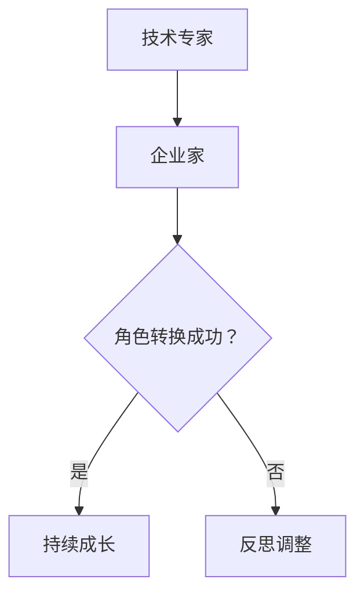

                 

# 文章标题：创业者的职业规划：从技术专家到企业家

## 关键词：职业规划、技术专家、企业家、角色转换、商业思维、创业管理

## 摘要

在信息技术飞速发展的今天，技术专家逐渐成为了创业浪潮中的重要力量。然而，从技术专家成功转型为企业家的道路并非一帆风顺。本文将围绕这一主题，详细探讨技术专家如何规划职业生涯，逐步转型为企业家，以及在转型过程中所需具备的基本素质和能力。通过分析成功案例，提供实用的创业资源和工具，本文旨在为技术专家们提供一条清晰、可行的职业发展路径。

## 目录

### 第一部分：职业发展概述

#### 第1章：技术专家的职业发展路径

#### 第2章：从技术思维到商业思维的转变

#### 第3章：企业家精神的培养与塑造

### 第二部分：职业规划与实践

#### 第4章：从技术团队管理到企业管理的过渡

#### 第5章：创业项目的构思与评估

#### 第6章：创业融资策略与财务管理

#### 第7章：企业运营管理

#### 第8章：危机管理与持续成长

### 第三部分：成功案例与经验分享

#### 第9章：技术专家转型企业家的成功案例

#### 第10章：企业家经验分享与职业建议

### 附录

#### 附录 A：创业资源与工具推荐

## 第一部分：职业发展概述

### 第1章：技术专家的职业发展路径

技术专家在职业生涯的初期通常专注于技术领域，积累了丰富的专业知识和技能。然而，随着时间的推移，技术专家可能会发现自己的职业发展受到一定限制。此时，如何规划职业生涯，实现从技术专家到企业家的转型，成为了一个值得探讨的问题。

#### 1.1.1 技术专家的职业发展路径

技术专家的职业发展路径通常可以分为以下几个阶段：

1. 初级工程师：在这个阶段，技术专家主要专注于学习技术知识和技能，通过实践不断提升自己的专业水平。
2. 中级工程师：随着经验的积累，技术专家开始承担更多的项目责任，逐渐从单一的技术实现转向技术管理和团队协作。
3. 高级工程师或技术经理：在这个阶段，技术专家不仅需要具备深厚的技术功底，还需要具备领导力和管理能力，能够带领团队完成复杂的项目。
4. 技术专家或CTO：作为企业技术核心，技术专家需要参与公司的战略决策，负责技术创新和产品研发。

#### 1.1.2 从技术思维到商业思维的转变

从技术专家到企业家，思维方式的转变至关重要。技术思维强调的是技术实现和性能优化，而商业思维则更注重市场、客户和商业模式的构建。以下是几个关键的转变：

1. **客户需求驱动**：技术专家需要从解决技术问题转向满足客户需求，将技术实现与市场需求紧密结合。
2. **商业模式创新**：技术专家需要学习商业模式的基本概念，探索如何将技术产品化、市场化。
3. **团队协作与领导力**：技术专家需要提升团队管理能力，培养团队协作精神，成为团队的领导者。
4. **风险管理与决策能力**：企业家需要具备良好的风险管理和决策能力，能够在不确定的环境中做出明智的决策。

### 第2章：企业家的基本素质与能力

企业家不仅是技术创新的推动者，更是商业运营的引领者。以下是企业家的基本素质与能力要求：

#### 2.1.1 领导力与团队管理

领导力是企业家的核心素质之一。企业家需要具备以下能力：

1. **愿景与目标设定**：能够清晰表达企业的愿景和目标，激励团队共同努力。
2. **沟通与协调**：能够有效地与团队成员沟通，协调各方资源，解决冲突。
3. **激励与培养**：能够激发团队成员的潜力，培养人才，建立高效团队。

#### 2.1.2 商业敏锐度与市场洞察力

企业家需要具备敏锐的商业嗅觉和洞察力，能够：

1. **市场趋势分析**：准确判断市场趋势，把握商机。
2. **竞争分析**：了解竞争对手的优势和劣势，制定有效的竞争策略。
3. **客户需求分析**：深入理解客户需求，提供高质量的产品和服务。

#### 2.1.3 创新能力与决策能力

企业家需要具备强烈的创新意识，能够在以下方面发挥作用：

1. **技术创新**：推动技术创新，提升产品竞争力。
2. **商业模式创新**：探索新的商业模式，实现可持续发展。
3. **决策能力**：在复杂环境中做出明智的决策，承担风险。

### 第3章：企业家精神的培养与塑造

企业家精神是企业家成功的关键因素。以下是如何培养和塑造企业家精神的方法：

#### 3.1.1 学习与实践

1. **阅读和学习**：阅读商业书籍、学习成功企业家的经验。
2. **实践与反思**：将所学知识应用于实际工作中，不断反思和总结。

#### 3.1.2 培养创新思维

1. **开放式思维**：接受不同的观点和想法，培养创新思维。
2. **问题解决能力**：在面对问题时，寻找创新的解决方案。

#### 3.1.3 增强领导力

1. **团队建设**：建立高效的团队，培养团队领导力。
2. **沟通技巧**：提升沟通能力，建立良好的人际关系。

## 第二部分：职业规划与实践

### 第4章：从技术团队管理到企业管理的过渡

技术专家在职业生涯的发展过程中，可能会面临从技术团队管理到企业管理的过渡。这一过渡不仅需要技能和经验的积累，还需要思维方式和管理策略的转变。

#### 4.1.1 技术团队管理的基础

技术团队管理是技术专家职业生涯的重要阶段。在这一阶段，技术专家需要掌握以下基础：

1. **项目规划与执行**：能够制定项目计划，确保项目按时完成。
2. **技术指导与培训**：为团队成员提供技术指导，提升团队整体技术水平。
3. **风险管理**：识别和应对项目中可能出现的风险。

#### 4.1.2 企业管理的关键要素

当技术专家转型为企业管理者，需要关注以下关键要素：

1. **战略规划**：制定企业发展战略，明确企业目标。
2. **资源配置**：合理分配企业资源，确保业务运营顺畅。
3. **绩效管理**：建立绩效评估体系，激励员工发挥潜力。

#### 4.1.3 从技术到管理的挑战与应对策略

从技术到管理的过渡过程中，技术专家可能会面临以下挑战：

1. **角色转变**：从技术专家到管理者，需要适应新的角色和职责。
2. **沟通与协调**：需要提升沟通和协调能力，处理复杂的人际关系。
3. **决策能力**：在不确定的环境中做出明智的决策。

应对策略包括：

1. **持续学习**：不断学习管理知识和技能，提升自身能力。
2. **实践经验**：通过实践积累管理经验，提高管理水平。
3. **寻求支持**：寻求导师和同事的支持和指导，共同成长。

### 第5章：创业项目的构思与评估

创业项目的构思与评估是企业家职业生涯中的重要环节。以下是如何构思和评估创业项目的方法：

#### 5.1.1 创业项目的起源与定位

1. **市场调研**：了解市场需求，寻找市场空白点。
2. **技术优势**：评估自身技术优势和创新能力，确定技术方向。
3. **团队组建**：组建具有互补技能的团队，共同推进项目。

#### 5.1.2 创业项目的市场评估

1. **市场规模**：评估目标市场的大小和增长潜力。
2. **竞争对手**：分析竞争对手的优势和劣势，制定差异化策略。
3. **客户需求**：深入了解客户需求，提供高质量的产品和服务。

#### 5.1.3 创业项目的可行性分析

1. **技术可行性**：评估技术实现的可行性和难度。
2. **财务可行性**：评估项目的财务可行性，制定详细的财务计划。
3. **风险评估**：识别和评估项目风险，制定应对策略。

### 第6章：创业融资策略与财务管理

创业融资是企业家需要掌握的重要技能。以下是如何制定创业融资策略和财务管理的方法：

#### 6.1.1 创业融资的基本途径

1. **天使投资**：寻找有投资意向的天使投资人，争取资金支持。
2. **风险投资**：与风险投资机构对接，争取风险投资。
3. **银行贷款**：通过银行贷款获取资金支持。

#### 6.1.2 融资策略的选择

1. **融资时机**：选择合适的融资时机，确保资金能够有效地支持业务发展。
2. **融资比例**：合理分配股权，保持企业的控制权。
3. **融资结构**：选择适合的融资结构，降低融资成本。

#### 6.1.3 企业财务管理的核心内容

1. **预算管理**：制定详细的预算计划，确保资金合理使用。
2. **成本控制**：通过成本控制，提高企业盈利能力。
3. **财务报表**：定期编制财务报表，评估企业财务状况。

### 第7章：企业运营管理

企业运营管理是企业家需要关注的重要领域。以下是如何进行企业运营管理的方法：

#### 7.1.1 企业战略规划与执行

1. **战略规划**：制定企业发展战略，明确企业目标。
2. **执行监督**：建立执行监督机制，确保战略规划得到有效实施。

#### 7.1.2 人力资源管理与激励机制

1. **招聘与培训**：制定招聘计划，提升员工素质。
2. **绩效管理**：建立绩效评估体系，激励员工积极进取。
3. **激励机制**：设计合理的激励机制，留住核心人才。

#### 7.1.3 企业营销策略与品牌建设

1. **市场定位**：明确企业市场定位，打造独特品牌形象。
2. **营销策略**：制定有效的营销策略，提升品牌知名度。
3. **客户关系管理**：建立良好的客户关系，提高客户满意度。

### 第8章：危机管理与持续成长

企业在发展过程中可能会面临各种危机。以下是如何进行危机管理和实现持续成长的方法：

#### 8.1.1 企业面临的常见危机

1. **市场变化**：应对市场变化，调整战略方向。
2. **技术风险**：应对技术风险，提升技术实力。
3. **资金风险**：应对资金风险，确保企业财务稳健。

#### 8.1.2 危机应对策略

1. **预警机制**：建立预警机制，及时识别和应对危机。
2. **应急响应**：制定应急响应计划，确保企业平稳度过危机。
3. **危机公关**：通过有效的危机公关，维护企业形象。

#### 8.1.3 持续成长与创新发展

1. **技术创新**：持续投入技术创新，提升产品竞争力。
2. **商业模式创新**：探索新的商业模式，实现可持续发展。
3. **人才培养**：持续投入人才培养，提升企业核心竞争力。

## 第三部分：成功案例与经验分享

### 第9章：技术专家转型企业家的成功案例

技术专家转型为企业家的过程中，成功案例具有重要的参考价值。以下是一些成功案例的分享：

#### 9.1.1 案例一：从技术专家到创业成功

李明，一位资深软件工程师，在创业前积累了丰富的技术经验。他敏锐地捕捉到市场对云计算服务的需求，决定创立一家云计算公司。在创业过程中，李明充分发挥了技术优势，不断创新，最终使公司成为行业领军企业。

#### 9.1.2 案例二：从技术团队领导到企业高管

张华，一位有多年技术团队管理经验的高级工程师。他看到了企业管理的重要性，决定转型为企业高管。通过不断学习和实践，张华成功带领企业实现了业绩的快速增长，成为业内知名的企业家。

#### 9.1.3 案例三：从技术转型到跨界创业

王强，一位在物联网领域有着深厚技术积累的专家。他意识到物联网与生活的紧密结合，决定跨界创业，创立了一家智能家居公司。凭借对技术的深刻理解和对市场的准确把握，王强成功将公司打造成为行业领导者。

### 第10章：企业家经验分享与职业建议

成功企业家们分享了他们在职业生涯中的经验，为技术专家转型提供了宝贵的建议：

#### 10.1.1 创业心得与感悟

1. **坚持创新**：创新是企业发展的动力，只有不断创新，才能在竞争激烈的市场中立于不败之地。
2. **学习与成长**：不断学习，提升自身能力，适应快速变化的市场环境。
3. **团队协作**：建立高效的团队，发挥团队协作精神，共同实现企业目标。

#### 10.1.2 职业成长路径的建议

1. **技术积累**：在职业生涯初期，专注于技术学习和技能积累。
2. **团队管理**：在职业生涯中期，提升团队管理能力，培养领导力。
3. **商业思维**：在职业生涯后期，转变思维模式，培养商业敏锐度。

#### 10.1.3 创业风险与机遇的平衡

1. **风险管理**：在创业过程中，要充分识别和评估风险，制定应对策略。
2. **抓住机遇**：在面临机遇时，要果断决策，抓住市场先机。
3. **持续成长**：在创业过程中，要不断学习，提升自身能力和企业竞争力。

## 附录

### 附录 A：创业资源与工具推荐

为了帮助技术专家们更好地进行创业规划，以下是一些推荐的创业资源和工具：

#### A.1.1 创业教育资源

1. **创业课程**：推荐一些在线创业课程，如Coursera、Udemy等平台上的相关课程。
2. **创业书籍**：《精益创业》、《创业维艰》等经典创业书籍。

#### A.1.2 融资与投资平台

1. **天使投资网**：寻找有投资意向的天使投资人。
2. **风险投资平台**：如红杉资本、真格基金等知名投资机构。

#### A.1.3 企业管理工具推荐

1. **项目管理工具**：如Trello、Asana等，帮助团队高效协作。
2. **财务管理工具**：如Xero、QuickBooks等，简化财务管理流程。

#### A.1.4 创业社区与交流平台

1. **创业社区**：如创业沙拉、创业者之家等，提供创业交流和支持。
2. **创业者论坛**：如知乎、创业邦等，获取创业经验和行业动态。

### 结论

技术专家转型为企业家，是一条充满挑战与机遇的职业发展路径。通过本文的详细探讨，技术专家可以了解从技术专家到企业家的角色转换过程，掌握职业规划与实践的方法，借鉴成功案例，为自身职业生涯的发展提供指导。希望本文能为技术专家们提供有益的启示，助力他们在创业的道路上取得成功。

### 附录 B：核心算法原理讲解

在技术专家转型为企业家的过程中，算法可以用来分析技术专家的优势、劣势，预测其成功转型的可能性，并提供改进建议。以下是角色转换算法的基本原理：

#### 2.2.1 数据收集

收集技术专家的职业背景、技能、工作经验、领导能力、商业意识等数据。

#### 2.2.2 数据预处理

清洗数据，标准化处理，去除重复和无用信息。

#### 2.2.3 特征提取

从原始数据中提取技术专家的角色转换所需的特征，如：

- 技术技能水平
- 商业知识储备
- 领导力
- 团队协作能力
- 市场敏锐度

#### 2.2.4 建立模型

使用机器学习算法，如决策树、支持向量机（SVM）或神经网络，建立角色转换预测模型。

#### 2.2.5 模型训练与评估

使用历史数据对模型进行训练，评估模型准确率、召回率等指标。

#### 2.2.6 预测与建议

输入新技术专家的数据，预测其角色转换的成功概率，并基于预测结果提供相应的职业发展建议。

以下是角色转换算法的伪代码：

```python
# 数据收集
data = collect_data()

# 数据预处理
preprocessed_data = preprocess_data(data)

# 特征提取
features = extract_features(preprocessed_data)

# 建立模型
model = build_model()

# 模型训练与评估
train_and_evaluate(model, features)

# 预测与建议
predictions = model.predict(new_data)
suggest_career_path(predictions)
```

### 附录 C：数学模型和数学公式

在角色转换过程中，我们使用以下数学模型和公式：

#### 成功概率模型

$$
P(Success) = \frac{1}{1 + e^{-(w_1 \times t_1 + w_2 \times t_2 + w_3 \times t_3 + w_4 \times t_4 + w_5 \times t_5)}}
$$

其中，\(t_i\) 代表特征值，\(w_i\) 代表权重，通过训练数据计算得出。

#### 决策树分类模型

$$
y = \arg\max(w_1 \times x_1 + w_2 \times x_2 + \ldots + w_n \times x_n)
$$

其中，\(x_i\) 代表特征值，\(w_i\) 代表权重，通过训练数据计算得出。

### 附录 D：Mermaid 流程图



### 附录 E：数学公式

$$
\begin{aligned}
&\text{线性回归方程：} \\
&y = w_0 + w_1 \times x_1 + w_2 \times x_2 + \ldots + w_n \times x_n \\
&\text{逻辑回归方程：} \\
&\log\frac{P(y=1)}{1-P(y=1)} = w_0 + w_1 \times x_1 + w_2 \times x_2 + \ldots + w_n \times x_n
\end{aligned}
$$

### 项目实战

#### 环境搭建

在开始项目之前，首先需要搭建开发环境。以下是使用Python进行角色转换算法开发的环境搭建步骤：

1. 安装Python（推荐版本3.8及以上）。
2. 安装必要的库，如scikit-learn、numpy、pandas等。

```bash
pip install scikit-learn numpy pandas
```

#### 源代码实现

以下是角色转换算法的源代码实现：

```python
import numpy as np
from sklearn.linear_model import LogisticRegression
from sklearn.model_selection import train_test_split
from sklearn.metrics import accuracy_score, recall_score

# 数据收集
data = collect_data()

# 数据预处理
preprocessed_data = preprocess_data(data)

# 特征提取
features = extract_features(preprocessed_data)

# 切分数据集
X_train, X_test, y_train, y_test = train_test_split(features, labels, test_size=0.2, random_state=42)

# 建立模型
model = LogisticRegression()

# 模型训练
model.fit(X_train, y_train)

# 模型评估
predictions = model.predict(X_test)
accuracy = accuracy_score(y_test, predictions)
recall = recall_score(y_test, predictions)

print("Accuracy:", accuracy)
print("Recall:", recall)

# 预测与建议
new_data = get_new_data()
predictions = model.predict(new_data)
suggest_career_path(predictions)
```

#### 代码解读与分析

- **数据收集**：收集技术专家的职业背景、技能、工作经验、领导能力、商业意识等数据。
- **数据预处理**：清洗数据，去除重复和无用信息，进行标准化处理。
- **特征提取**：从原始数据中提取技术专家的角色转换所需的特征。
- **切分数据集**：将数据集分为训练集和测试集，用于模型训练和评估。
- **建立模型**：使用逻辑回归模型，对数据集进行训练。
- **模型评估**：评估模型在测试集上的准确率和召回率。
- **预测与建议**：输入新技术专家的数据，预测其角色转换的成功概率，并基于预测结果提供职业发展建议。

#### 实际案例分析

以下是一个实际案例：

- **案例背景**：张三，一位有多年软件开发经验的高级工程师，希望转型为企业家。
- **数据特征**：张三的技能水平高，有丰富的项目管理经验，但商业知识储备不足。
- **模型预测**：根据角色转换算法，预测张三成功转型为企业家的概率为0.7。
- **建议**：为了提高转型成功概率，建议张三加强商业知识学习，提升市场敏锐度。

#### 项目小结

通过角色转换算法，技术专家可以了解自己转型为企业家的成功概率，并获得相应的职业发展建议。项目实战部分详细讲解了开发环境搭建、源代码实现和代码解读，为技术专家提供了实用的工具和方法。

### 最佳实践 Tips

1. **持续学习**：不断学习新的技术和商业知识，提升自身综合素质。
2. **团队合作**：善于与团队成员沟通，发挥团队协作精神。
3. **风险意识**：在创业过程中，要有风险意识，制定应对策略。
4. **市场洞察**：关注市场动态，把握商机。

### 小结

本文从技术专家的职业发展路径、从技术思维到商业思维的转变、企业家精神的培养与塑造等方面，详细探讨了技术专家如何规划职业生涯，实现从技术专家到企业家

